# Datenmodell — Kern (Mandanten, Benutzer, Rollen, Rechte, Audit, Person/Anstellung)

This is the foundation domain: tenancy (`mandant`), identity (`benutzer`, `benutzer_sitzung`),
authorization (`rolle`, `berechtigung`, `rolle_berechtigung`, `benutzer_mandant`), accountability
(`audit_log`) and the person/employment split (`person`, `anstellung`, D-09). Every other domain
hangs off it, it ships in Phase 1, and its shape cannot be changed later without a data migration
touching every table in the platform. It is written against `00-KONVENTIONEN.md`; where this
document and a convention disagree, **the convention wins** and this document is wrong — each
resolution below cites the `K-id` it applies.

---

## 0. Scope and files

Schema files:

| File | Tables |
|---|---|
| `src/server/db/schema/kern.ts` | `mandant`, `mandant_identitaet`, `mandant_kennzahl`, `benutzer`, `benutzer_mandant`, `benutzer_sitzung`, `benutzer_feed_token`, `anmeldeversuch`, `rolle`, `berechtigung`, `rolle_berechtigung`, `audit_log`, `audit_kette`, `audit_feld_klassifikation` |
| `src/server/db/schema/personal.ts` | `person`, `anstellung`, `anstellung_kondition`, `qualifikation`, `nachweis`, `bewacher_eintrag`, `bewacher_meldung`, `bewachertaetigkeit`, `mitarbeiter_zugang`, `abwesenheitsart`, `abwesenheit`, `stundenkonto`, `stundenkonto_bewegung`, `urlaubskonto`, `zeit_einwand`, `antragsart`, `antrag` |
| `src/server/db/rls.ts` | the enumerated policy/ceiling/grant registry the build checks (K-04, K-05) |

Not in this document: `zeit_intern.arbeitszeit_fenster` and `arbeitszeit_verstoss` — their storage is
specified in the Dienstplan/Zeit document per **K-06**. §8 here specifies only the read and write
**contracts** that Kern owns, because they are keyed on `person_id` and `anstellung_id`.

Three schemas are created by the first migration:

```sql
create schema app;          -- helper functions, owned by cse_definer
create schema kern;         -- trigger functions and registries, owned by cse_definer
create schema zeit_intern;  -- K-06 window storage; NOT exposed by PostgREST
```

---

## 1. Conventions applied in this domain

### 1.1 Database roles and FORCE RLS (K-01)

Six roles, none with `BYPASSRLS`. The draft's `authenticated` / `anon` / `service_role` are replaced
throughout by the K-01 names: `cse_migrator` (DDL, CI only), `cse_definer` (owns every
`SECURITY DEFINER` helper, cannot log in), `cse_app` (every authenticated request), `cse_anon`
(pre-session, `EXECUTE` on exactly the three K-08 functions), `cse_checkin` (Phase 5), `cse_job`
(cron and Edge Functions, per-job grants).

Every table in this document carries:

```sql
alter table <t> enable row level security;
alter table <t> force  row level security;   -- K-01: the owner is not exempt
```

Every `SECURITY DEFINER` function in §3 is owned by `cse_definer` and carries
`SET search_path = pg_catalog, public` verbatim (K-01) — which is why every helper body below
schema-qualifies `app.`, `kern.` and `public.` references.

**Reconciling K-03's "exactly two policies" with K-04 and K-05.** K-03 fixes the policy set *for
`cse_app`* on a tenant table at exactly two. K-04 additionally requires a **restrictive** portal
ceiling, and K-05/K-06/K-08 require `SECURITY DEFINER` functions that must read tables on which
`cse_definer` holds no policy. The reading this document applies, and which `src/server/db/rls.ts`
enforces:

1. exactly two permissive policies `to cse_app` on every tenant table — no more, no fewer;
2. plus the K-04 restrictive ceiling wherever the table hangs off `anstellung_id` or `person_id`;
3. plus **at most one** narrow `for select to cse_definer using (true)` policy, and only on a table
   named in the definer-read registry (§3.5). The registry is a literal list; adding a table to it
   is a reviewed change, and a test asserts no table outside the list carries a `cse_definer` policy.

Identity and permission tables (`mandant`, `benutzer`, `benutzer_mandant`, `benutzer_sitzung`,
`rolle`, `berechtigung`, `rolle_berechtigung`, `audit_log`, `audit_kette`, `mandant_kennzahl`,
`anmeldeversuch`, `mitarbeiter_zugang`) are **not tenant tables** in the K-03 sense — none of them is
scoped by `mandant_id = app.aktiver_mandant()` alone — so K-03's two-policy shape does not apply to
them and their policies are stated per table.

### 1.2 Session state (K-02)

Set only inside `withTenant` / `withGroupScope`, transaction-local, never from a URL parameter,
header or client payload (TEN-04, AUT-04, invariant 3):

```sql
select set_config('app.benutzer_id', $1, true),
       set_config('app.person_id',   $2, true),   -- '' when the login is not a person
       set_config('app.mandant_id',  $3, true),   -- '' in group scope
       set_config('app.mandant_ids', $4, true),   -- group scope only, csv of uuids
       set_config('app.scope',       $5, true),   -- 'mandant' | 'gruppe'
       set_config('app.portal',      $6, true),   -- 'intern' | 'mitarbeiter' | 'kunde'
       set_config('app.readonly',    $7, true),   -- 'on' | 'off', default 'on'
       set_config('app.sitzung_id',  $8, true),
       set_config('app.aal',         $9, true);   -- 'aal1' | 'aal2'
```

**Fail-closed.** Every accessor in §3.1 coalesces a missing GUC to the most restrictive value: no
mandant, no person, no rights, read-only, `aal1`. An unset session produces zero rows, never all
rows. `withTenant` asserts `((scope = 'mandant') = (mandant_id is not null))` before it opens the
transaction; `benutzer_sitzung` asserts the same as a `CHECK` (§6.9).

The `[mandant]` path segment under `/portal` (K-07) is routing only, validated against the session,
never trusted; on mismatch the route returns **404, not 403** (AUT-06, §13).

### 1.3 The standard tenant policy, in its hoistable form (K-03)

`app.hat_recht()` takes a mandant argument. The K-03 shape is normative:

```sql
create policy t_mandant on <tabelle>
  for all to cse_app
  using      (mandant_id = app.aktiver_mandant()
              and app.hat_recht('<modul>.<aktion>', mandant_id))
  with check (mandant_id = app.aktiver_mandant()
              and not app.ist_readonly()
              and app.hat_recht('<modul>.schreiben', mandant_id));

create policy t_gruppe on <tabelle>
  for select to cse_app
  using (app.ist_gruppenansicht()
         and mandant_id = any (app.sichtbare_mandanten())
         and app.hat_recht('gruppe.<modul>.lesen', mandant_id));
```

`app.hat_recht` is `SECURITY DEFINER`, so the planner cannot inline it and evaluates it **once per
candidate row** — thousands of calls on a Dienstplan month view or a person typeahead. Because the
first conjunct already asserts `mandant_id = app.aktiver_mandant()`, the second may be written
against the parameterless accessor without changing its meaning, which lets the planner hoist it
into an InitPlan evaluated once:

```sql
using (mandant_id = app.aktiver_mandant()
       and (select app.hat_recht('<modul>.<aktion>', app.aktiver_mandant())))
```

For the group policy `mandant_id` genuinely varies, so the equivalent hoist is a set-returning
helper (§3.2):

```sql
using (app.ist_gruppenansicht()
       and mandant_id = any (select app.rechte_mandanten('gruppe.<modul>.lesen')))
```

Both forms are semantically identical to K-03 and are the forms `src/server/db/rls.ts` emits. A
policy that omits the `hat_recht` conjunct is a defect (K-03): tenant membership alone must never
grant read access to a module — otherwise a `kunde` login reads the staff directory and every
colleague's MiLoG hour records.

**Invariant 10 is enforced by Postgres.** No `INSERT`/`UPDATE`/`DELETE` policy anywhere in this
domain references group scope, so a write under group scope matches no policy and is refused by the
database. The service-layer guard is the first line; this is the second.

### 1.4 Portal ceilings (K-04)

EMP-13 is structural. Every table in this document hanging off `anstellung_id` or `person_id`
carries a restrictive ceiling in addition to K-03:

```sql
create policy p_ma_ceiling on <tabelle> as restrictive for all to cse_app
  using (app.portal() <> 'mitarbeiter'
         or anstellung_id in (select id from anstellung
                              where person_id = app.aktuelle_person()));
```

Tables in **this** document carrying a ceiling — enumerated, not exemplified:

| Keyed on `anstellung_id` | Keyed on `person_id` |
|---|---|
| `anstellung` (via `person_id`), `anstellung_kondition`, `stundenkonto`, `stundenkonto_bewegung` (via `stundenkonto_id`), `urlaubskonto`, `abwesenheit`, `zeit_einwand`, `antrag` | `person`, `nachweis`, `bewacher_eintrag`, `bewacher_meldung`, `mitarbeiter_zugang` |

`src/server/db/rls.ts` holds the list and **the build fails when an anstellung-hung or person-hung
table has no ceiling.** The same shape exists for `app.portal() = 'kunde'`, keyed on the customer's
own `kunde_id`; no table in this domain is customer-scoped, so the `kunde` ceiling here is the
degenerate `app.portal() <> 'kunde'` — a customer login reads nothing in the personnel domain at
all.

`app.portal()` is derived from **the role of the active membership**, not from the existence of a
membership (K-04).

### 1.5 Wage confidentiality: column privileges, not masking views (K-05)

**The draft was wrong here and the review is right on both counts (B1, B2).** `select a.*, case …
end as stundesatz_intern_sichtbar` hands out the raw column and adds a masked copy beside it; and a
view cannot repair it, because `security_invoker = true` needs base-table privileges that were just
revoked while a definer view under a bypassing owner returns every tenant's rows with the tenant
predicate silently ignored. Masking views are forbidden for this purpose (K-05).

Enforcement is **column-level `GRANT`**, which composes correctly with RLS. The complete grant
matrix is §11. The confidential values are reachable only through the narrow `SECURITY DEFINER`
readers of §3.4, each of which re-checks the right **and** `mandant_id = app.aktiver_mandant()` and
writes `audit_log`.

Note the spelling: **`stundensatz_intern`**, as in D-09 and K-05. The draft's `stundesatz_intern` is
a typo and is corrected throughout.

### 1.6 Common columns, keys and deletion (K-16)

Every table: `id uuid primary key default gen_random_uuid()`,
`erstellt_am timestamptz not null default now()`; mutable tables add `geaendert_am timestamptz`,
maintained by `kern.setze_geaendert_am()`. Accountability adds `erstellt_von` / `geaendert_von`
referencing `benutzer`, filled from `app.aktueller_benutzer()` by trigger, never by the application
(SEC-A9). Append-only tables (`audit_log`, `stundenkonto_bewegung`, `anmeldeversuch`) carry
`erstellt_am` / `erstellt_von` and deliberately have **no** `geaendert_*` columns.

Two justified primary-key exceptions, both stated at the table: `benutzer.id` (equals
`auth.users.id`, so policies compare against `auth.uid()` without a join) and `audit_log` (composite
`(id, erstellt_am)` so the partition key is in the PK).

Tenant tables add `mandant_id uuid not null references mandant(id)` and declare
**`UNIQUE (mandant_id, id)`** — the K-16 column order — so a child can be pinned to its parent's
tenant with a composite FK:

```sql
FOREIGN KEY (mandant_id, anstellung_id) REFERENCES anstellung (mandant_id, id)
```

**A single-column FK into a table that carries `mandant_id` is a review failure** (B15). The rule is
absolute in this domain; §12.4 lists every composite FK and the parent unique it needs, and a schema
test walks `information_schema` and fails on any single-column reference to a `mandant_id`-bearing
table.

Money is `bigint` cents. Quantities are `numeric(12,3)` — they are not money and must not be cents
(K-16); this changes the draft's `numeric(5,2)` / `numeric(4,1)` / `numeric(3,1)` columns to
`numeric(12,3)` throughout. Durations are `integer` minutes or seconds and are named with the unit
(`soll_minuten`, `zeitabweichung_sek`).

**No hard deletes** (invariant 8): no table in this domain gets a `DELETE` policy, no application
role holds `DELETE` or `TRUNCATE`, and the finance-, time- and audit-adjacent tables additionally
carry a `BEFORE DELETE` trigger that raises. Deletion protection is stated per table, not assumed
globally. Removal is expressed as `archiviert_am` (master data), `deaktiviert_am` (accounts),
`entzogen_am` (grants), `widerrufen_am` (certificates), `erloschen_am` (register entries),
`storniert_am` / a reversing row (time and account movements), `anonymisiert_am` (DSGVO erasure of a
`person` whose costed records must survive — §15).

### 1.7 Exactly one liveness column per row (B12)

The draft carried `aktiv` **and** a timestamp on five tables. Two sources of truth for the same fact
is a silent authorization failure the day an administrator uses the one the resolver does not read —
which, on `benutzer_mandant`, means revoking access has no effect (AUT-03, AUT-04, SEC-A2, SEC-A3).

| Table | Liveness column (single) | `aktiv` |
|---|---|---|
| `mandant` | `archiviert_am` | removed |
| `rolle` | `archiviert_am` | removed |
| `qualifikation` | `archiviert_am` | removed |
| `abwesenheitsart` | `archiviert_am` | removed |
| `antragsart` | `archiviert_am` | removed |
| `benutzer_mandant` | `entzogen_am` | removed |
| `benutzer` | `status` + `CHECK ((status = 'deaktiviert') = (deaktiviert_am IS NOT NULL))` | n/a |

Every predicate, index and helper that read `WHERE aktiv` now read the timestamp column. A test
asserts `app.sichtbare_mandanten()`, `app.switcher_mandanten()`, `app.hat_recht()` and
`app.portal()` all return nothing for a `benutzer_mandant` row with `entzogen_am IS NOT NULL`.

### 1.8 Uniqueness is partial wherever deletion is soft (B9)

An unconditional unique index plus a soft-delete column makes ordinary lifecycle events permanently
impossible. In a Berlin cleaning and security group, offboarding and rehiring the same person and
recycling company phones are routine, and each collision surfaces as an opaque
`duplicate key value violates unique constraint` at the moment someone is trying to get a worker on
shift.

| Index | Predicate | Why partial |
|---|---|---|
| `benutzer_mandant_key UNIQUE (benutzer_id, mandant_id)` | `WHERE entzogen_am IS NULL` | a revoked user must be re-grantable |
| `benutzer_email_key UNIQUE (lower(email))` | `WHERE deaktiviert_am IS NULL` | a returning employee keeps their address |
| `benutzer_person_key UNIQUE (person_id)` | `WHERE person_id IS NOT NULL AND deaktiviert_am IS NULL` | one login per person (EMP-14, D-09 consequence 4) |
| `bewacher_eintrag_person_key UNIQUE (person_id)` | `WHERE erloschen_am IS NULL` | a lapsed guard must be re-registrable |
| `nachweis_aktiv_uk UNIQUE (person_id, qualifikation_id, gueltig_ab)` | `WHERE widerrufen_am IS NULL` | a wrongly entered, revoked certificate must be re-enterable |
| `person_mobil_uk UNIQUE (mobil_e164)` | `WHERE mobil_e164 IS NOT NULL AND anonymisiert_am IS NULL` | a company mobile is reassigned to the next holder |

**Deliberately unconditional:** `bewacher_eintrag_id_key UNIQUE (bewacher_id)` — the Bewacher-ID is
issued once per human by the register itself and must never appear twice in the platform under any
lifecycle state (SEC-03, LEG-04). `mandant_schluessel_key UNIQUE (schluessel)` — the slug appears in
document number circles, exports and URLs (K-07), so it must stay unique across archived mandanten
too.

### 1.9 No volatile or stable function in a CHECK constraint (B8)

The draft's `CHECK (status = 'beendet' OR austritt IS NULL OR austritt >= current_date)` is invalid:
`current_date` is `STABLE`, not `IMMUTABLE`, so the constraint's truth value changes under rows that
never change. Two consequences, both verified behaviour: once `austritt` passes and the nightly
status job has not yet run, **every** `UPDATE` to that row fails — including the status update the
job itself needs — and `pg_dump` emits the constraint inline so `COPY` re-validates it and a restore
containing any past-dated non-`beendet` row aborts. That breaks SEC-A10 ("encrypted backups with a
**tested** monthly restore") at the worst possible moment.

**Rule for the whole platform:** `current_date`, `now()`, `current_timestamp` and any other
non-`IMMUTABLE` function are banned from `CHECK` constraints. A time-dependent rule is expressed as
(a) a `BEFORE INSERT OR UPDATE` trigger that raises only when the *transition* is illegal, (b) a
scheduled job, and (c) a monitoring query that reports drift. A CI test greps the emitted DDL for
volatile calls inside `CHECK` and fails.

### 1.10 Calendar boundaries are Berlin wall-clock (K-11)

Instants are `timestamptz` stored UTC (invariant 2); a **day**, a **month** and a **billing period**
are Berlin boundaries converted to instants, never UTC midnight. Every `current_date` in a helper,
policy or job in this domain is replaced by `app.berlin_heute()`:

```sql
create function app.berlin_heute() returns date
language sql stable parallel safe as $$
  select (now() at time zone 'Europe/Berlin')::date;
$$;
```

Between 00:00 and 02:00 Berlin time, plain `current_date` (UTC on Supabase) makes an access grant
that becomes valid "today" still invalid and expires a `loeschsperre_bis` two hours early. Every
reference test carries **a CET case and a CEST case** so a UTC implementation cannot pass by
accident (K-11).

`date` is used for things that are genuinely calendar facts in Germany — `geburtsdatum`, `eintritt`,
`austritt`, certificate validity, absence from/to, `wirksam_am`, `gueltig_ab`/`gueltig_bis`.
`timestamptz` is used for instants — session activity, approval, lock, submission. A duration is
never a wall-clock difference; it is derived from UTC instants by a tested service and stored as
`integer` minutes.

### 1.11 What this domain must never invent (K-17)

Placeholders in this document carry a bold marker (**PLACEHOLDER** / **PROVISIONAL**), a swappable
interface, and a `// TODO(client): <exact question>`. §16 collects all of them for `DECISIONS.md`
under **Open**. A concrete legal, financial or tariff value that SPEC does not state and is not
marked is a defect, not a detail.

---

## 2. Identity: one model, stated once (B7, B18)

The draft carried two identity models at the same time. `mitarbeiter_zugang.benutzer_id` was
nullable and `zeit_einwand.eingereicht_von_benutzer_id` / `antrag.eingereicht_von_benutzer_id` were
documented as "NULL when submitted through the SMS access without a full account" — yet every
self-access branch keys on `app.aktuelle_person()`, and the `audit_log` actor CHECK requires
`akteur_benutzer_id IS NOT NULL` for `akteur_art = 'mensch'`. For an SMS-only worker that means: no
hours, no leave balance, no certificates, no requests, and an `einwand_audit` trigger that raises
and rolls back the submission — EMP-01, EMP-03, EMP-04, EMP-05, EMP-07, EMP-08, EMP-10 and EMP-15
all fail for exactly the population they were written for.

**The model, chosen and stated (option (a) of the review, which is what the locked stack implies):**

1. **Supabase Auth is the only authentication stack.** EMP-01's "phone number + SMS code, no
   password" is Supabase **phone OTP**. The draft's home-grown `otp_hash`, `otp_gueltig_bis`,
   `otp_versuche` and `gesperrt_bis` columns on `mitarbeiter_zugang` are **deleted**: a six-digit
   OTP has 10⁶ preimages and a plain SHA-256 of it is reversible in milliseconds by anyone holding
   `personal.zugang_verwalten`, and a second auth stack beside the locked one is a deviation from
   CLAUDE.md that nothing in the SPEC asks for.
2. **Every activated access has a `benutzer` row.** `mitarbeiter_zugang.benutzer_id` is
   `NOT NULL` whenever `status = 'aktiv'`, enforced by
   `CHECK (status <> 'aktiv' OR benutzer_id IS NOT NULL)`. `benutzer.id = auth.users.id` for the
   phone identity, so `auth.uid()` exists for a worker exactly as it does for an administrator.
3. **`eingereicht_von_benutzer_id` is `NOT NULL`** on `zeit_einwand` and `antrag`. There is no
   accountless write path anywhere in the platform.
4. **`app.person_id` is a first-class session GUC** (K-02), set by `withTenant` from
   `benutzer.person_id`. `app.aktuelle_person()` reads the GUC and does not join, so a self-access
   policy costs no query.
5. **2FA state is never mirrored.** `benutzer.zwei_faktor_aktiv` is **deleted**. A mirror of
   `auth.mfa_factors` maintained by a hook has no reconciliation path: a user who removes their
   factor in Supabase Auth leaves `true` behind and the trigger that is supposed to implement AUT-02
   approves an account with no second factor. Enrolment is read live by
   `app.hat_zweiten_faktor(p_benutzer)` (§3.2); the **session's** assurance level is the `app.aal`
   GUC set from the verified Supabase session (K-02), read by `app.aal()`.

**Invitation acceptance needs no fourth pre-session function** (K-08 permits exactly three). The
invitation link opens Supabase phone verification; that produces an authenticated session; the
activation call then runs *inside* that session:

```sql
-- app.zugang_aktivieren(p_token_hash text) returns uuid  -- the person_id
-- SECURITY DEFINER, owner cse_definer, SET search_path = pg_catalog, public
update public.mitarbeiter_zugang z
   set benutzer_id            = app.aktueller_benutzer(),
       status                 = 'aktiv',
       einladung_verwendet_am = now(),
       einladung_verwendet_ip = inet_client_addr(),
       einladung_token_hash   = null
 where z.einladung_token_hash = p_token_hash
   and z.benutzer_id is null
   and z.status = 'eingeladen'
   and z.einladung_gueltig_bis > now()
   and exists (select 1 from public.person p
                join auth.users u on u.id = app.aktueller_benutzer()
               where p.id = z.person_id
                 and p.mobil_e164 = u.phone)   -- the link is bound to the phone
returning z.person_id;
```

**Zero rows returned is the 409** (K-09). The invitation is a single-use token and check-then-act is
a race: a worker double-tapping a link on a slow connection is not an edge case. Pre-checks may
exist to produce a friendlier message, never to decide. Concurrency test: N simultaneous
redemptions of one invitation activate exactly one access and produce exactly one `benutzer`↔`person`
link.

**One number, one master (review: MISSING).** `person.mobil_e164` is the single stored mobile
number. The draft's second copy on `mitarbeiter_zugang` is **deleted** — two UNIQUE E.164 columns
with no sync rule means the personnel screen edits one and the SMS goes to the other. EMP-01
authenticates against Supabase `auth.users.phone`, which the invitation service sets from
`person.mobil_e164`; a nightly job `job:zugang_nummer_abgleich` reports any divergence as a
`warnung` in `audit_log` rather than silently repairing it.

---

## 3. Helper function catalogue

All helpers live in schema `app`. Every `SECURITY DEFINER` function is owned by `cse_definer` and
carries `SET search_path = pg_catalog, public` (K-01). The three functions of §3.3 are the **only**
ones `cse_anon` / `cse_checkin` may execute (K-08).

### 3.1 Session accessors — `STABLE`, `SECURITY INVOKER`, fail-closed (K-02)

They read GUCs only, so they need no elevated rights and can be inlined by the planner.

```sql
create function app.aktueller_benutzer() returns uuid language sql stable parallel safe as $$
  select coalesce(nullif(current_setting('app.benutzer_id', true), '')::uuid, auth.uid());
$$;

create function app.aktuelle_person() returns uuid language sql stable parallel safe as $$
  select nullif(current_setting('app.person_id', true), '')::uuid;
$$;

create function app.aktiver_mandant() returns uuid language sql stable parallel safe as $$
  select nullif(current_setting('app.mandant_id', true), '')::uuid;
$$;

create function app.sitzung_id() returns uuid language sql stable parallel safe as $$
  select nullif(current_setting('app.sitzung_id', true), '')::uuid;
$$;

create function app.ist_gruppenansicht() returns boolean language sql stable parallel safe as $$
  select coalesce(nullif(current_setting('app.scope', true), ''), 'mandant') = 'gruppe';
$$;

create function app.ist_readonly() returns boolean language sql stable parallel safe as $$
  select coalesce(nullif(current_setting('app.readonly', true), ''), 'on') = 'on';  -- default ON
$$;

create function app.aal() returns text language sql stable parallel safe as $$
  select coalesce(nullif(current_setting('app.aal', true), ''), 'aal1');            -- default aal1
$$;

create function app.portal() returns text language sql stable parallel safe as $$
  select coalesce(nullif(current_setting('app.portal', true), ''), 'mitarbeiter');  -- most restrictive
$$;
```

Every default is the restrictive one. `app.portal()` defaults to `mitarbeiter`, not `intern`,
because an unset GUC must narrow the K-04 ceiling rather than lift it.

| Function | SPEC |
|---|---|
| `aktueller_benutzer`, `sitzung_id` | AUT-04, SEC-A9 |
| `aktuelle_person` | D-09, EMP-14, EMP-15 |
| `aktiver_mandant`, `ist_gruppenansicht`, `ist_readonly` | TEN-04, TEN-05, invariants 3 and 10 |
| `aal` | AUT-02 |
| `portal` | AUT-01, EMP-13 |
| `berlin_heute` | invariant 2, K-11, TIM-13 |

### 3.2 Resolution helpers — `STABLE SECURITY DEFINER`

```sql
-- Every mandant the caller may READ. Archived mandanten are INCLUDED (B14):
-- LEG-01/ACC-06 require ten-year retention *and availability*, and ACC-09 a Z3 export on demand.
create function app.sichtbare_mandanten() returns setof uuid
language sql stable security definer set search_path = pg_catalog, public as $$
  select m.id
    from public.mandant m
   where app.ist_super_admin()
      or exists (select 1 from public.benutzer_mandant bm
                  where bm.benutzer_id = app.aktueller_benutzer()
                    and bm.mandant_id  = m.id
                    and bm.entzogen_am is null
                    and bm.gueltig_ab <= app.berlin_heute()
                    and (bm.gueltig_bis is null or bm.gueltig_bis >= app.berlin_heute()));
$$;

-- The subset offered in the switcher and activatable as a working context.
create function app.switcher_mandanten() returns setof uuid
language sql stable security definer set search_path = pg_catalog, public as $$
  select m.id from public.mandant m
   where m.archiviert_am is null and m.id in (select app.sichtbare_mandanten());
$$;
```

**Why two functions (B14).** The draft filtered archived mandanten inside
`app.sichtbare_mandanten()`, and `sitzung_mandant_pruefen` required the active mandant to be in it.
The effect: the moment `archiviert_am` is set, nobody — not even a super-admin — can activate that
mandant, and every tenant policy's `mandant_id = app.aktiver_mandant()` branch becomes unreachable
for its rows. Data that legally may not be deleted becomes data nobody can read. Splitting the two
sets keeps K-03 verbatim (its group policy calls `app.sichtbare_mandanten()`, which is now the
*readable* set) while the switcher and `sitzung_mandant_pruefen` use `app.switcher_mandanten()`.
Writes are blocked separately: every `t_mandant` `WITH CHECK` additionally requires
`exists (select 1 from mandant m where m.id = mandant_id and m.archiviert_am is null)`.

```sql
-- B6, MINOR: the super-admin path carries the SAME gates as everyone else, and resolves the role
-- from data (geltungsbereich = 'global'), not from a hard-coded schluessel.
create function app.ist_super_admin() returns boolean
language sql stable security definer set search_path = pg_catalog, public as $$
  select exists (
    select 1
      from public.benutzer b
      join public.rolle   r on r.id = b.globale_rolle_id and r.geltungsbereich = 'global'
      join public.benutzer_sitzung s on s.id = app.sitzung_id() and s.benutzer_id = b.id
     where b.id = app.aktueller_benutzer()
       and b.status = 'aktiv'
       and b.deaktiviert_am is null
       and (b.gesperrt_bis is null or b.gesperrt_bis < now())
       and r.archiviert_am is null
       and s.beendet_am is null
       and s.ablauf_am > now()
       and app.aal() = 'aal2');                    -- AUT-02
$$;
```

The draft's version checked only `status = 'aktiv'` and the role key, and it is the **first disjunct
of every policy in the domain** — so AUT-02 and AUT-07 were defeated for the single most privileged
role at the layer CLAUDE.md calls the second line of defence. A super-admin session that passed the
password but not the second factor, or one locked out after brute force, read and wrote every row of
every mandant.

This is **not** the construction K-15 forbids. K-15 forbids a restrictive `aal2` policy on
`benutzer_mandant`, because every `leitung`, `mitarbeiter` and `kunde` legitimately runs at `aal1`
and such a policy blanks the whole platform for them. Here the gate sits inside the elevation
predicate for a role AUT-02 says must hold `aal2`; a super-admin at `aal1` sees nothing except the
2FA challenge/enrolment screen, which is precisely AUT-02's intent. Test: `app.ist_super_admin()` is
false at `aal1`, and a `leitung` session at `aal1` still reads its area normally.

```sql
create function app.hat_zweiten_faktor(p_benutzer uuid) returns boolean
language sql stable security definer set search_path = pg_catalog, public as $$
  select exists (select 1 from auth.mfa_factors f
                  where f.user_id = p_benutzer and f.status = 'verified');
$$;

create function app.person_sichtbar(p_person uuid) returns boolean
language sql stable as $$                      -- SECURITY INVOKER, deliberately
  select p_person = app.aktuelle_person()
      or app.ist_super_admin()
      or exists (select 1 from public.anstellung a where a.person_id = p_person);
$$;
```

**`app.person_sichtbar` is `SECURITY INVOKER`, correcting the draft.** The draft made it
`SECURITY DEFINER` on the stated grounds that "policies on `person` must read `anstellung` without
`anstellung`'s own policy applying, otherwise the two policies recurse". That reason is wrong:
`anstellung`'s K-03 policy is `mandant_id = app.aktiver_mandant() and app.hat_recht(…)` and does not
reference `person`, so there is no recursion. Running as invoker is strictly better — the inner
`exists` is filtered by `anstellung`'s own policies, so it answers exactly D-09 §6 ("`person` rows
are visible to any mandant the person has an employment with") in tenant scope *and* in group scope,
with no bypass and no `cse_definer` policy on a tenant table.

```sql
-- The hot path. Resolution is: platform default -> mandant override -> module filter.
create function app.hat_recht(p_recht text, p_mandant uuid) returns boolean
language sql stable security definer set search_path = pg_catalog, public as $$
  with sitzung as (
    select b.id as benutzer_id
      from public.benutzer b
      join public.benutzer_sitzung s on s.id = app.sitzung_id() and s.benutzer_id = b.id
     where b.id = app.aktueller_benutzer()
       and b.status = 'aktiv'
       and b.deaktiviert_am is null
       and (b.gesperrt_bis is null or b.gesperrt_bis < now())
       and s.beendet_am is null
       and s.ablauf_am > now()
  ), recht as (
    select r.id, r.modul, r.aktion, r.erfordert_2fa, r.nur_global
      from public.berechtigung r
     where r.schluessel = p_recht
  )
  select case
    when p_mandant is null                               then false
    when not exists (select 1 from sitzung)              then false
    when not exists (select 1 from recht)                then false   -- unknown key = forbidden
    when (select erfordert_2fa from recht) and app.aal() <> 'aal2' then false
    when app.ist_super_admin()                           then true
    when (select nur_global from recht)                  then false
    -- group scope: read-only keys only, resolved against ANY live membership (B5)
    when app.ist_gruppenansicht() and (select aktion from recht) not in ('lesen','exportieren')
                                                         then false
    else exists (
      select 1
        from public.benutzer_mandant bm
        join public.mandant m on m.id = bm.mandant_id
        cross join recht r
        left join public.rolle_berechtigung rb_m
               on rb_m.rolle_id = bm.rolle_id and rb_m.berechtigung_id = r.id
              and rb_m.mandant_id = bm.mandant_id
        left join public.rolle_berechtigung rb_d
               on rb_d.rolle_id = bm.rolle_id and rb_d.berechtigung_id = r.id
              and rb_d.mandant_id is null
       where bm.benutzer_id = (select benutzer_id from sitzung)
         and bm.mandant_id  = p_mandant
         and bm.entzogen_am is null
         and bm.gueltig_ab <= app.berlin_heute()
         and (bm.gueltig_bis is null or bm.gueltig_bis >= app.berlin_heute())
         and coalesce(rb_m.gewaehrt, rb_d.gewaehrt, false)
         and (bm.module is null or r.modul = any (bm.module))          -- AUT-01 module filter
         and (m.module = '{}'  or r.modul = any (m.module)))           -- TEN-08 mandant modules
  end;
$$;

create function app.rechte_mandanten(p_recht text) returns setof uuid
language sql stable security definer set search_path = pg_catalog, public as $$
  select m from unnest(array(select app.sichtbare_mandanten())) as m
   where app.hat_recht(p_recht, m);
$$;
```

**Three defects of the draft's resolver are fixed here.**

- **B5 — the group view was empty.** The draft's only granting branch filtered on
  `bm.mandant_id = app.aktiver_mandant()`, which is NULL in group scope by the session table's own
  `CHECK`. Every `t_gruppe` policy is gated on a `gruppe.*` right, so TEN-05, TEN-10, DSH-01 and
  DSH-02 rendered zero rows — invisible in single-mandant tests. Because K-03 gives `hat_recht` a
  mandant argument, the group case now resolves per candidate mandant, and the explicit
  `aktion not in ('lesen','exportieren')` guard makes invariant 10 true inside the resolver as well
  as in the policy set.
- **`mandant.module` is wired (review: MISSING).** The draft presented it as the TEN-08 mechanism but
  never read it, so a permission for a module the mandant has not enabled resolved true. The final
  conjunct intersects it. `'{}'` means "all modules", so seeding is not blocked on the module list.
- **An unknown permission key is `false`, not an error.** A typo in a policy must fail closed.

Performance: `hat_recht` is `STABLE`, so the `(select …)` wrapping of §1.3 hoists the tenant-scope
call into a single InitPlan per query; the group-scope call is hoisted through `rechte_mandanten`.
The application mirrors the same resolution in `src/server/services/berechtigung.ts`
(`kannBenutzer(recht, mandant)`), memoised once per request. RLS is the second line of defence,
never the only one and never absent (invariant 3, AUT-04, AUT-05, SEC-A1).

```sql
-- K-04: the portal ceiling is derived from the ROLE of the active membership, never from the
-- existence of one. The server writes the result into the app.portal GUC; a client value is ignored.
create function app.portal_fuer(p_benutzer uuid, p_mandant uuid) returns text
language sql stable security definer set search_path = pg_catalog, public as $$
  select coalesce(
    (select r.portal
       from public.benutzer b
       join public.rolle r on r.id = b.globale_rolle_id and r.geltungsbereich = 'global'
      where b.id = p_benutzer),
    (select r.portal
       from public.benutzer_mandant bm
       join public.rolle r on r.id = bm.rolle_id
      where bm.benutzer_id = p_benutzer
        and bm.mandant_id  = p_mandant
        and bm.entzogen_am is null
        and bm.gueltig_ab <= app.berlin_heute()
        and (bm.gueltig_bis is null or bm.gueltig_bis >= app.berlin_heute())),
    'mitarbeiter');                                   -- fail-closed, K-02
$$;
```

**A `SECURITY INVOKER` helper called from inside a `SECURITY DEFINER` function evaluates as the
definer, not as the caller.** `app.person_sichtbar` is invoker by design (see above), so calling it
from `app.arbzg_belastung` or `app.entgelt_lesen` — both definer, both owned by `cse_definer`, both
holding a §3.5 read policy on `anstellung` — would return true for **every** person and silently
void the precondition it was meant to enforce. Rule for this domain: **inside a definer function,
every precondition is written as an explicit predicate against the caller's session GUCs, never by
calling an invoker helper.** §8 and §3.4 state those predicates literally, and a test asserts
`app.arbzg_belastung` returns nothing for a person with no employment in the active mandant.

```sql
-- Display language, with a stated precedence (MINOR).
create function app.anzeigesprache() returns public.sprache
language sql stable security definer set search_path = pg_catalog, public as $$
  select coalesce(
    (select p.sprache from public.person   p where p.id = app.aktuelle_person()),
    (select b.sprache from public.benutzer b where b.id = app.aktueller_benutzer()),
    'de');
$$;
```

**Precedence, stated once:** `person.sprache` is the master for a human — it drives the portal UI,
the SMS text and every worker-facing document (EMP-12). `benutzer.sprache` applies only to accounts
with **no** person behind them (`kunde`, service accounts). A worker who has both rows is served by
`person.sprache`; the `benutzer.sprache` value is never consulted for them.

### 3.3 The pre-session data path (K-08)

Three functions, and only these three, may execute outside `withTenant` / `withGroupScope`. A
**route-manifest test asserts no other code path reaches the database outside** those wrappers.

| Function | Role | Purpose | SPEC |
|---|---|---|---|
| `app.sitzung_aufloesen(p_token_hash text)` | `cse_anon` | resolve a session before any principal is known | TEN-04, AUT-04 |
| `app.versuch_protokollieren(p_kennung text, p_ip inet, p_erfolg boolean, p_grund text)` | `cse_anon` | rate limiting and lockout | AUT-07, AUT-08 |
| `app.checkin_verbrauchen(...)` | `cse_checkin` | tokenised check-in — specified in the Zeit document | TIM-07, TIM-08 |

```sql
-- SECURITY DEFINER, owner cse_definer, SET search_path = pg_catalog, public.
-- The session table's own SELECT policy is benutzer_id = app.aktueller_benutzer(), which is not yet
-- known at this point — which is exactly why this function exists (review: MISSING).
create function app.sitzung_aufloesen(p_token_hash text)
returns table (sitzung_id uuid, benutzer_id uuid, person_id uuid,
               mandant_id uuid, scope text, portal text, aal text)
language plpgsql security definer set search_path = pg_catalog, public as $$
begin
  return query
  update public.benutzer_sitzung s
     set letzte_aktivitaet_am = now()
   where s.token_hash = p_token_hash
     and s.beendet_am is null
     and s.ablauf_am > now()
     and s.letzte_aktivitaet_am > now() - interval '30 minutes'   -- idle timeout, PLACEHOLDER
  returning s.id, s.benutzer_id,
            (select b.person_id from public.benutzer b where b.id = s.benutzer_id),
            s.aktiver_mandant_id, s.ansicht::text,
            app.portal_fuer(s.benutzer_id, s.aktiver_mandant_id),
            s.aal::text;
end;
$$;
```

`// TODO(client): idle timeout and absolute session lifetime for each role — 30 min / 8 h is a
placeholder, not a policy. Admin sessions in a finance context are often shorter.`

The stamping of `letzte_aktivitaet_am` happens **in the same statement** that validates the session,
so a session cannot be validated and then silently not refreshed. `app.portal_fuer(benutzer,
mandant)` resolves the K-04 portal from the role of the active membership; the server writes the
result into the `app.portal` GUC and never accepts one from the client.

```sql
create function app.versuch_protokollieren(p_kennung text, p_ip inet,
                                           p_erfolg boolean, p_grund text)
returns table (gesperrt boolean, sperre_bis timestamptz)
language plpgsql security definer set search_path = pg_catalog, public as $$
…  -- inserts into kern.anmeldeversuch, then evaluates the window below
$$;
```

**Why a dedicated table and not `audit_log` (review: MISSING).** The lockout query is "failed
attempts from this IP, and for this identifier, in the last N minutes". Per-user counters
(`benutzer.fehlversuche`) cannot rate-limit attempts against **non-existent** accounts, which is the
enumeration case AUT-07 exists for. And `audit_log` is hash-chained and append-only (§9), so one row
per failed attempt would serialise every login behind the chain head. `kern.anmeldeversuch` carries
`(id, kennung_hash text, ip inet, erfolg boolean, grund text, erstellt_am timestamptz)` with
`anmeldeversuch_ip_idx ON (ip, erstellt_am DESC) WHERE NOT erfolg` and
`anmeldeversuch_kennung_idx ON (kennung_hash, erstellt_am DESC) WHERE NOT erfolg`, a **30-day**
retention, and the identifier stored only as a hash. A single summarising `audit_log` row per
lockout event still satisfies AUT-08. `audit_log` additionally carries
`audit_log_fehlversuch_idx ON (ip, erstellt_am DESC) WHERE NOT erfolg` for the forensic query.

`// TODO(client): AUT-07 thresholds — attempts per identifier and per IP, window, lockout duration,
and whether a locked account notifies the user by email.`

### 3.4 Narrow readers and writers

| Function | Guards | Writes audit | SPEC |
|---|---|---|---|
| `app.entgelt_lesen(p_anstellung uuid, p_stichtag date default null)` → `bigint` | `personal.entgelt_lesen` in the active mandant **and** `mandant_id = app.aktiver_mandant()`; or `person_id = app.aktuelle_person()` | `personal.entgelt_gelesen` | D-09 §6, K-05, EMP-15 |
| `app.person_stammdaten_lesen(p_person uuid)` → `record` | `personal.stammdaten_lesen` **and** the person is visible in the active mandant | `personal.stammdaten_gelesen` | SEC-03, LEG-09, K-05 |
| `app.abwesenheit_grund_lesen(p_abwesenheit uuid)` → `record` | `personal.abwesenheit_grund_lesen` **and** active mandant | `personal.abwesenheitsgrund_gelesen` | LEG-09, Art. 9 DSGVO, EMP-10 |
| `app.audit_feld_lesen(p_id uuid, p_erstellt_am timestamptz, p_feld text)` → `jsonb` | the right named by `audit_feld_klassifikation.leserecht` for that field | `system.audit_feld_gelesen` | SEC-A9, LEG-09 |
| `app.protokolliere(...)` | none — `cse_app` has no direct `INSERT` on `audit_log` | is the audit write | SEC-A9, AUT-08 |
| `app.arbzg_belastung(...)`, `app.arbzg_befund_schreiben(...)` | §8 / K-06 | `arbzg.aggregat_gelesen` | TIM-14, LEG-03 |
| `app.mandant_kennzahlen()` | restricted to `app.switcher_mandanten()`, counts only | no | TEN-10, DESIGN §6 |
| `app.zugang_aktivieren(p_token_hash text)` | §2, K-09 | `zugang.aktiviert` | EMP-01, EMP-14 |

`app.entgelt_lesen` reads the rate **valid at `p_stichtag`** from `anstellung_kondition` (§6.15),
defaulting to `app.berlin_heute()`. It is not an agent tool: **choosing or reading a rate is an
input to a price**, and per K-10 no money argument may originate with a model. The agent tool
surface for this domain is read-only handles (`AnstellungHandle`, `PersonHandle`) and never a
numeric literal (invariant 6, AGT-02, AGT-07).

### 3.5 The `cse_definer` read registry

The helpers above must read tables on which `cse_definer` holds no `cse_app` policy. Per §1.1 each
such table carries **one** narrow policy, and the list is literal:

```
mandant · benutzer · benutzer_mandant · benutzer_sitzung · rolle · berechtigung
rolle_berechtigung · mandant_kennzahl · audit_kette · audit_feld_klassifikation
anmeldeversuch · mitarbeiter_zugang
```

```sql
create policy m_definer on mandant for select to cse_definer using (true);
```

Plus, named individually because they are tenant tables and therefore exceptional:
`anstellung` and `anstellung_kondition` (`app.entgelt_lesen`, K-05), `abwesenheit`
(`app.abwesenheit_grund_lesen`, B17), `audit_log` (`app.audit_feld_lesen`). Nothing else. A test
enumerates `pg_policies` and fails on a `cse_definer` policy outside this list, and a second test
asserts `cse_definer` holds no `INSERT`/`UPDATE`/`DELETE` policy on any tenant table except the ones
K-06 sanctions.

---

## 4. Enums, catalogue tables, and which is which

Enums are used only where the vocabulary is a fixed technical fact or is stated verbatim in the
SPEC. Where a vocabulary carries legal or payroll weight and the SPEC does not state it, it is a
**catalogue table** so the client can change it in the UI without a migration (K-17).

| Enum | Values | Source |
|---|---|---|
| `rolle_geltungsbereich` | `global` · `mandant` | AUT-01 role scope |
| `berechtigung_aktion` | `lesen` · `erstellen` · `aendern` · `loeschen` · `freigeben` · `festschreiben` · `exportieren` · `verwalten` | technical vocabulary, not a business rule |
| `berechtigung_risiko` | `niedrig` · `mittel` · `hoch` | UI grouping for AUT-03 |
| `benutzer_status` | `eingeladen` · `aktiv` · `gesperrt` · `deaktiviert` | AUT-07 |
| `sitzung_ansicht` | `mandant` · `gruppe` | TEN-04, TEN-05 |
| `sitzung_aal` | `aal1` · `aal2` | AUT-02, K-02 |
| `sitzung_ende_grund` | `abmeldung` · `ablauf` · `gesperrt` · `neue_anmeldung` · `admin_widerruf` | AUT-08 |
| `akteur_art` | `mensch` · `agent` · `system` | SEC-A9 states exactly these three |
| `audit_schweregrad` | `info` · `warnung` · `kritisch` | SPEC §14 watchdog severity |
| `sprache` | `de` · `en` · `ar` · `tr` | EMP-12 states exactly these four |
| `person_anrede` | `frau` · `herr` · `divers` · `keine_angabe` | correspondence salutation, UI copy only |
| `anstellung_status` | `geplant` · `aktiv` · `ruhend` · `beendet` | D-09 (`eintritt` / `austritt`) |
| `arbeitszeitmodell` | **PLACEHOLDER** `vollzeit` · `teilzeit` · `geringfuegig` · `kurzfristig` · `azubi` · `werkstudent` · `unbekannt` | D-09 names the column, no vocabulary anywhere. `// TODO(client): which employment/SV categories does the group actually use, and must they match the payroll system's codes (ACC-12)?` Seed default `unbekannt` |
| `qualifikation_kategorie` | **PROVISIONAL** `gesetzlich` · `fachlich` · `fuehrerschein` · `gesundheit` · `intern` | SEC-02 names §34a Sachkunde/Unterrichtung only. `// TODO(client): confirm the categories used for certificate reporting` |
| `nachweis_status` | `beantragt` · `gueltig` · `abgelaufen` · `widerrufen` · `abgelehnt` | SEC-02, SPEC §14 expiry watchdog |
| `bewacher_status` | **PLACEHOLDER** `beantragt` · `registriert` · `abgelehnt` · `erloschen` · `gesperrt` · `unbekannt` | SEC-03 says "registration status" without a vocabulary. `// TODO(client): the exact status vocabulary of the Bewacherregister as it appears in the register export` |
| `zugang_status` | `eingeladen` · `aktiv` · `gesperrt` · `deaktiviert` | EMP-01, AUT-07 |
| `abwesenheit_status` | `beantragt` · `genehmigt` · `abgelehnt` · `storniert` · `erfasst` | EMP-10 |
| `antrag_status` | `eingereicht` · `in_pruefung` · `genehmigt` · `abgelehnt` · `zurueckgezogen` · `storniert` | EMP-10 |
| `stundenkonto_status` | **PLACEHOLDER** `offen` · `vorlaeufig` · `gesperrt` | EMP-04 says only "locks monthly". `vorlaeufig` is not in the SPEC. `// TODO(client): is there a provisional state between open and locked — e.g. "figures released to payroll, still correctable" — or does the month go straight from open to locked?` |
| `bewegung_art` | `arbeitszeit` · `abwesenheit` · `feiertag` · `korrektur` · `uebertrag` · `auszahlung` · `freizeitausgleich` | EMP-04. `// TODO(client): mapping of these movement kinds to payroll wage types (Lohnarten) for ACC-12` |
| `bewegung_quelle` | `zeiteintrag` · `abwesenheit` · `manuell` · `import` · `system` | FIN-07 / TIM-12 traceability |
| `einwand_art` | `eintrag_fehlt` · `zeit_falsch` · `pause_falsch` · `zuordnung_falsch` · `sonstiges` | EMP-07 |
| `einwand_status` | **PLACEHOLDER** `offen` · `in_pruefung` · `anerkannt` · `teilweise_anerkannt` · `abgelehnt` · `zurueckgezogen` | EMP-07 defines no decision vocabulary. `// TODO(client): may an objection be partially upheld, and does a partial decision need its own state?` |
| `bewacher_meldung_art` | **PLACEHOLDER** `anmeldung` · `abmeldung` · `aenderung` · `wiedervorlage` | SEC-03 names no notification vocabulary. `// TODO(client): which notification events does the Bewacherregister distinguish?` |

Both PLACEHOLDER enum values the review flagged (`vorlaeufig`, `teilweise_anerkannt`) are now marked
and carry a question, per the reviewer's first option. They stay enums rather than becoming tables
because they are **workflow states referenced by trigger logic**, not client-editable vocabulary; if
the client answers "no", removing an unused enum value in Phase 1 is a one-line migration.

**Deliberately not an enum:**

- **Role, mandant and permission keys.** `rolle.schluessel`, `mandant.schluessel` and
  `berechtigung.schluessel` are `text`. TEN-08 requires a fifth area to be a DB row and nothing
  else; a Postgres enum would need a migration *and* a redeploy of every generated TypeScript union.
- **Absence kinds** → `abwesenheitsart` (§6.22): the values carry payroll export codes the client
  supplies (ACC-12) and must be editable without a migration.
- **Request kinds** → `antragsart` (§6.28). The draft had `antrag_art` as an enum mixing SPEC
  vocabulary (`urlaub`, `krankmeldung`, `schichttausch`) with invented UI conveniences
  (`unbezahlter_urlaub`, `schichtabgabe`, `stammdaten_aenderung`, `freizeitausgleich`) — while the
  structurally identical `abwesenheitsart` was a table for exactly that reason (MINOR). Made
  consistent: both are catalogue tables, and the behaviour the trigger needs (`erfordert_zeitraum`,
  `erfordert_abwesenheitsart`, `erfordert_einsatz`, `erzeugt_abwesenheit`) becomes columns rather
  than a `CASE` over enum labels.
- **Bewacher activity types** → `bewachertaetigkeit` (§6.20), same reasoning; the draft's
  `taetigkeiten text[]` was an unvalidated array carrying a `TODO(client)`.

**Worker-facing catalogue labels are translatable (review: MISSING).** CLAUDE.md requires
worker-facing screens in de/en/ar/tr and EMP-12 lists exactly those four, but a single-language
`bezeichnung` means an Arabic-speaking guard reads the German absence list in the Antrag form. Every
catalogue a worker reads — `abwesenheitsart`, `antragsart`, `qualifikation`, `bewachertaetigkeit` —
carries:

```sql
bezeichnung       text  not null,                       -- de, the fallback
bezeichnung_i18n  jsonb not null default '{}'::jsonb,
  check (bezeichnung_i18n ?& array[]::text[] or
         (select bool_and(k in ('de','en','ar','tr'))
            from jsonb_object_keys(bezeichnung_i18n) k))
```

`app.katalog_label(p_bezeichnung text, p_i18n jsonb)` resolves against `app.anzeigesprache()` and
falls back to `de`. Internal-only catalogues (`berechtigung`, `rolle`) stay single-language: CLAUDE.md
requires translation for **worker-facing** screens, and the permission editor is not one.

---

## 5. Entity-relationship

```mermaid
erDiagram
    mandant ||--|| mandant_identitaet  : "hat"
    mandant ||--o{ mandant_kennzahl    : "Switcher-Zaehler"
    mandant ||--o{ benutzer_mandant    : "gewaehrt Zugang"
    mandant ||--o{ anstellung          : "beschaeftigt"
    mandant ||--o{ audit_log           : "kontextualisiert (nullable)"
    mandant ||--o{ rolle               : "eigene Rollen (optional)"
    mandant ||--o{ rolle_berechtigung  : "Override je Mandant"

    benutzer ||--o{ benutzer_mandant   : "Rolle je Mandant"
    benutzer ||--o{ benutzer_sitzung   : "Serversitzung"
    benutzer ||--o{ benutzer_feed_token: "iCal (CAL-03)"
    benutzer ||--o{ audit_log          : "Akteur (mensch)"
    benutzer }o--|| rolle              : "globale_rolle (super_admin)"
    benutzer }o--o| person             : "ist Mensch (optional, 1:1)"

    rolle ||--o{ rolle_berechtigung    : ""
    berechtigung ||--o{ rolle_berechtigung : ""
    rolle ||--o{ benutzer_mandant      : ""

    person ||--o{ anstellung           : "1 Mensch : n Anstellungen"
    person ||--o{ nachweis             : "Nachweise gehoeren dem Menschen"
    person ||--o| bewacher_eintrag     : "Bewacher-ID"
    person ||--o| mitarbeiter_zugang   : "ein Login je Person"
    bewacher_eintrag ||--o{ bewacher_meldung : "je meldende Entitaet"
    qualifikation ||--o{ nachweis      : "Katalog"

    anstellung ||--o{ anstellung_kondition : "datierte Konditionen"
    anstellung ||--o{ abwesenheit      : "kostenrelevant"
    anstellung ||--o{ stundenkonto     : "je Monat"
    anstellung ||--o{ urlaubskonto     : "je Jahr"
    anstellung ||--o{ zeit_einwand     : ""
    anstellung ||--o{ antrag           : ""
    anstellung ||--o{ anstellung       : "vorgesetzter"
    abwesenheitsart ||--o{ abwesenheit : "Katalog"
    antragsart ||--o{ antrag           : "Katalog"
    stundenkonto ||--o{ stundenkonto_bewegung : "append-only"
    antrag ||--o| abwesenheit          : "erzeugt bei Genehmigung"

    audit_kette ||--o{ audit_log       : "Hashkette je Partition"
    audit_feld_klassifikation ||--o{ audit_log : "Redaktion beim Schreiben"
```



The two access paths that matter, in text:

```
mandant  ──< benutzer_mandant >── benutzer ──> person ──< anstellung >── mandant
             (Rolle je Mandant)              (1 Login)   (1 pro Entitaet)

RLS person     : sichtbar fuer JEDEN Mandant mit einer anstellung dieser Person
                 UND nur mit personal.lesen (B3) — Mitgliedschaft allein genuegt nie
RLS anstellung : strikt mandant_id = app.aktiver_mandant() + personal.lesen
Ausnahme       : genau ein Pfad kreuzt die Mandantengrenze — app.arbzg_belastung (K-06, §8)
```

---

## 6. Tables

### 6.1 mandant

Ein Geschäftsbereich der Gruppe als eigener Mandant — Rechtsform, Registerdaten, Steuernummern und
Bankverbindung der Entität, die Rechnungen stellt und Personal beschäftigt.

| Column | Type | Null | Default | Notes |
|---|---|---|---|---|
| id | uuid | NOT NULL | `gen_random_uuid()` | PK |
| schluessel | text | NOT NULL | — | **Der URL-Slug aus K-07.** UNIQUE. `CHECK (schluessel ~ '^[a-z][a-z0-9_-]{1,30}$' AND schluessel NOT IN ('gruppe','mein','api'))`. Seed: `reinigung`, `security`, `bau`, `operations` (TEN-01) |
| name | text | NOT NULL | — | Anzeigename im Switcher, z. B. `CSE Dienstleistung` |
| firma | text | NOT NULL | — | Vollständige Firmierung, z. B. `CSE Dienstleistungen GmbH` (§14 UStG, DESIGN §11) |
| rechtsform | text | NULL | — | `GmbH`, `Einzelunternehmen`, … |
| ist_rechtseinheit | boolean | **NULL** | `NULL` | **NULL = ungeklärt.** `// TODO(client): O-01 — ist CSE Operations eine GmbH oder eine Abteilung?` Steuert TEN-02 |
| eigener_nummernkreis | boolean | NOT NULL | `false` | TEN-02. `CHECK (NOT eigener_nummernkreis OR ist_rechtseinheit IS TRUE)` |
| module | text[] | NOT NULL | `'{}'` | Freigeschaltete Fachmodule; `'{}'` = alle. Wird in `app.hat_recht()` geschnitten (TEN-08) |
| handelsregister_gericht | text | NULL | — | DESIGN §11 Fußzeile, K-12 Snapshot-Feld `gericht` |
| handelsregister_nummer | text | NULL | — | HRB, DESIGN §11, K-12 Snapshot-Feld `hrb` |
| geschaeftsfuehrer | text[] | NOT NULL | `'{}'` | DESIGN §11 Fußzeile |
| ust_id | text | NULL | — | `CHECK (ust_id IS NULL OR ust_id ~ '^DE[0-9]{9}$')` (§14 UStG) |
| steuernummer | text | NULL | — | §14 UStG Alternative zur USt-IdNr |
| finanzamt | text | NULL | — | |
| betriebsnummer | text | NULL | — | Betriebsnummer der Bundesagentur für Arbeit, ACC-12 Lohnexport |
| strasse | text | NULL | — | §14 UStG vollständige Anschrift |
| plz | text | NULL | — | `CHECK (plz IS NULL OR plz ~ '^[0-9]{5}$')` |
| ort | text | NULL | — | |
| land | char(2) | NOT NULL | `'DE'` | ISO 3166-1 alpha-2 |
| telefon · email · web | text | NULL | — | |
| iban · bic · bank | text | NULL | — | Zahlungsangabe auf Rechnung/Angebot (DESIGN §11); IBAN-Prüfung im Service |
| sortierung | integer | NOT NULL | `0` | Reihenfolge im Switcher (DESIGN §6) |
| archiviert_am | timestamptz | NULL | — | **Einzige Liveness-Spalte** (§1.7). Kein Hard Delete — ein Mandant besitzt Finanzdaten (LEG-01) |
| erstellt_am | timestamptz | NOT NULL | `now()` | |
| geaendert_am | timestamptz | NULL | — | |
| erstellt_von | uuid | **NULL** | — | FK → `benutzer.id`. Nullable, weil der erste Mandant vor dem ersten Benutzer existiert (§14.1) |
| geaendert_von | uuid | NULL | — | FK → `benutzer.id` |

- **Constraints:**
  `CHECK (NOT eigener_nummernkreis OR ist_rechtseinheit IS TRUE)` — **korrigiert (INVENTED RULE).**
  Der Entwurf setzte `ist_rechtseinheit` mit `DEFAULT true`, seedete `operations` mit `false` und
  hätte O-01 damit in Richtung „interne Abteilung" entschieden. `NULL` ist der einzige neutrale Wert;
  Phase 6 verweigert die Anlage eines Nummernkreises, solange er NULL ist.
  **§14-UStG-Vollständigkeit (review: MISSING):**
  `CHECK (NOT eigener_nummernkreis OR (strasse IS NOT NULL AND plz IS NOT NULL AND ort IS NOT NULL AND (ust_id IS NOT NULL OR steuernummer IS NOT NULL) AND firma IS NOT NULL))`
  — eine Entität kann keinen Rechnungskreis besitzen, aus dem sie nicht rechtmäßig fakturieren darf
  (FIN-04, LEG-05). Der Pre-flight-Validator von FIN-04 prüft dieselben Felder erneut bei der
  Festschreibung, weil K-12 den Leistenden als **Snapshot** in die Rechnung kopiert und ein später
  geänderter Stammsatz die festgeschriebene Rechnung nicht verändern darf.
  `CHECK (array_length(module,1) IS NULL OR module <@ (SELECT array_agg(DISTINCT modul) FROM berechtigung))` ist als Constraint nicht möglich (Unterabfrage); stattdessen Trigger
  `kern.mandant_module_pruefen`, spiegelbildlich zu `bm_module_pruefen` (MINOR).
- **Indexes:**
  `mandant_schluessel_key UNIQUE (schluessel)` — Slug-Auflösung in `/portal/[mandant]`, Seeding, Exporte.
  `mandant_switcher_idx ON (sortierung, name) WHERE archiviert_am IS NULL` — die Switcher-Liste (TEN-06, TEN-10).
- **RLS:** Nicht mandantenskopiert — dies *ist* die Mandantentabelle. `ENABLE` + `FORCE`.
  `SELECT` für `cse_app`: `id IN (SELECT app.sichtbare_mandanten())` (TEN-06).
  `SELECT` für `cse_anon`: nur über die View `mandant_oeffentlich` (Firmierung, Anschrift,
  Registerdaten für Impressum/Profile — PUB-01, PRO-01). Die View ist `security_invoker = true` und
  projiziert **namentlich** genau die öffentlichen Spalten; `security_barrier` ist hier zulässig,
  weil sie nichts maskiert, sondern eine echte Teilmenge zeigt (K-05 verbietet Masking-Views, nicht
  Projektions-Views).
  `INSERT`/`UPDATE`: `app.ist_super_admin() AND app.hat_recht('system.mandant_verwalten', id) AND NOT app.ist_readonly()`. Kein `DELETE`.
  Ein Definer-Lesepolicy `m_definer` gemäß §3.5.
- **Triggers:**
  `mandant_schluessel_immutabel` — `schluessel` ist nach dem Einfügen unveränderlich (er steht in
  Belegnummernkreisen, Exporten und URLs).
  `mandant_identitaet_anlegen` — legt die 1:1-Identitätszeile mit Platzhalterwerten an, damit TEN-07
  (3px-Leiste) nie ohne Wert läuft.
  `mandant_audit` — jede Änderung nach `audit_log` (SEC-A9).
  `mandant_kein_delete` `BEFORE DELETE` → `RAISE EXCEPTION` (invariant 8, LEG-01).
- **CI:** Ein Test läuft den App-Router-Baum ab und schlägt fehl, sobald ein neues statisches Segment
  unter `/portal` existiert, das nicht im `CHECK` ausgeschlossen ist (K-07). TEN-08 verspricht, dass
  ein fünfter Bereich eine DB-Zeile und keine Codeänderung braucht; eine handgepflegte Liste ohne
  Test liefert das nicht.
- **SPEC:** TEN-01, TEN-02, TEN-06, TEN-08, TEN-10, PUB-01, PRO-01, FIN-04, LEG-01, LEG-05, DESIGN §6/§11, K-07, K-12.

### 6.2 mandant_identitaet

Das visuelle und briefliche Erscheinungsbild einer Entität — Logo, Identitätsfarbe, Profilbilder und
die rechtliche Fußzeile, die auf jedem Angebot und jeder Rechnung dieser Entität steht.

| Column | Type | Null | Default | Notes |
|---|---|---|---|---|
| id | uuid | NOT NULL | `gen_random_uuid()` | PK |
| mandant_id | uuid | NOT NULL | — | FK → `mandant.id`, UNIQUE (1:1) |
| kurzname | text | NOT NULL | — | Zeile 2 im Switcher: `Reinigung`, `Sicherheit`, `Bau`, `Digital & KI` (DESIGN §6) |
| identitaets_token | text | NOT NULL | — | **Token-Name, kein Hex.** `CHECK (identitaets_token IN ('area-reinigung','area-security','area-bau','area-operations'))` |
| logo_hell_pfad · logo_dunkel_pfad · logo_druck_pfad | text | NULL | — | Storage-Keys; SVG. `// TODO(client): O-12 Logodateien` |
| logo_alt | text | NULL | — | Alternativtext für alle Logovarianten (PUB-09, LEG-07, DESIGN §9) |
| avatar_pfad | text | NULL | — | 32px-Rundavatar im Switcher und in der Marken-Avatarreihe (DESIGN §6, PUB-14) |
| avatar_alt | text | NULL | — | |
| cover_pfad | text | NULL | — | Titelbild der Profilseite (PRO-01) |
| cover_alt | text | NULL | — | |
| claim | text | NULL | — | Ein Satz unter dem Logo (PRO-01) |
| kurzbeschreibung | text | NULL | — | Kartentext auf der Startseite (PUB-03) |
| beschreibung | text | NULL | — | Profiltext (PRO-01) |
| brief_fuss · rechnung_fuss · angebot_fuss | text | NULL | — | Rechtliche Fußzeilen (DESIGN §11) |
| email_absender · email_signatur | text | NULL | — | |
| domain | text | NULL | — | `// TODO(client): O-08 — eigene Domains je Bereich oder Pfade unter einer Gruppendomain?` |
| oeffentlich_sichtbar | boolean | NOT NULL | `false` | Steuert die Lesbarkeit für `cse_anon` (PUB-03, PRO-01) |
| platzhalter_medien | boolean | NOT NULL | `true` | D-10 / O-13: Bilder sind Platzhalter, bis echte Fotografie vorliegt; die UI markiert sie sichtbar, Launch-Blocker |
| erstellt_am | timestamptz | NOT NULL | `now()` | |
| geaendert_am | timestamptz | NULL | — | |
| erstellt_von | uuid | NULL | — | FK → `benutzer.id` (MINOR: fehlte im Entwurf) |
| geaendert_von | uuid | NULL | — | FK → `benutzer.id` |

- **Warum ein Token statt eines Hex-Werts (INVENTED RULE).** Der Entwurf hatte
  `identitaets_hue text CHECK (~ '^#[0-9A-Fa-f]{6}$')`. CLAUDE.md und D-10 sagen: Designwerte kommen
  ausschließlich aus `docs/DESIGN.md`. Eine freie Hex-Spalte plus Farbwähler im Admin-UI ist genau
  der Mechanismus, über den ein fünfter Bereich eine Farbe bekommt, die nicht in DESIGN.md steht und
  die Kontrastregeln von DESIGN §9 verletzt. Gespeichert wird deshalb der **Token-Name**; den Wert
  liefert `globals.css` aus DESIGN §1 (`--area-reinigung: #E30613`, `--area-security: #2F6BFF`,
  `--area-bau: #F59E0B`, `--area-operations: #8B5CF6`). Ein fünfter Bereich braucht damit **zuerst
  einen DESIGN.md-Eintrag**, dann eine Migration, die den `CHECK` erweitert — und genau diese
  Reihenfolge verlangt CLAUDE.md.
- **Alt-Text (review: MISSING).** PUB-09 / LEG-07 (BFSG, WCAG 2.1 AA) und DESIGN §9 verlangen `alt`
  an jedem Bild. `CHECK (NOT oeffentlich_sichtbar OR ((cover_pfad IS NULL OR cover_alt IS NOT NULL) AND (avatar_pfad IS NULL OR avatar_alt IS NOT NULL) AND (logo_hell_pfad IS NULL OR logo_alt IS NOT NULL)))`
  — eine öffentlich sichtbare Identität hat für jedes ausgelieferte Asset einen Alternativtext.
- **Indexes:** `mandant_identitaet_mandant_key UNIQUE (mandant_id)`;
  `mandant_identitaet_oeffentlich_idx ON (mandant_id) WHERE oeffentlich_sichtbar`.
- **RLS:** `SELECT` für `cse_app`: `mandant_id IN (SELECT app.sichtbare_mandanten())`.
  `SELECT` für `cse_anon`: `oeffentlich_sichtbar`.
  `UPDATE`: `app.hat_recht('system.identitaet_verwalten', mandant_id) AND mandant_id = app.aktiver_mandant() AND NOT app.ist_readonly()`. Kein `INSERT` durch Benutzer (Trigger auf `mandant`), kein `DELETE`.
- **Triggers:** `identitaet_audit` schreibt Vorher/Nachher — eine geänderte Fußzeile ist
  rechnungsrelevant. **K-12:** `rechnung_fuss` und die Registerdaten werden bei der Festschreibung in
  den kanonischen Rechnungs-Payload **kopiert**, nie referenziert; eine spätere Identitätsänderung
  darf eine festgeschriebene Rechnung nicht verändern und die Hashkette nicht stillschweigend
  entwerten.
- **SPEC:** TEN-07, TEN-10, PUB-03, PUB-09, PUB-14, PRO-01, PRO-02, LEG-07, DESIGN §1/§6/§9/§11, D-10, K-12.

### 6.3 mandant_kennzahl

Der Zählerstand je Bereich für das Switcher-Dropdown — „Reinigung · 24 Aufträge" —, als Cache
berechnet, damit das Dropdown keine vier mandantenübergreifenden Aggregate pro Render auslöst.

*Neu gegenüber dem Entwurf (B16).* DESIGN §6 Regel 2 („der Switcher ist informativ, nicht dekorativ")
und TEN-10 verlangen einen Live-Zähler **für Bereiche, in denen der Benutzer gerade nicht ist**. Die
Standard-Tenant-Policy gibt genau dafür keine Zeilen frei. Ohne einen benannten, eng gefassten
Lesepfad endet die Umsetzung entweder in einem dekorativen Switcher oder — schlimmer — in einem
Service-Role-Client, der bei jedem Seitenaufbau RLS umgeht.

| Column | Type | Null | Default | Notes |
|---|---|---|---|---|
| id | uuid | NOT NULL | `gen_random_uuid()` | PK |
| mandant_id | uuid | NOT NULL | — | FK → `mandant.id` |
| schluessel | text | NOT NULL | — | z. B. `auftraege_aktiv`, `projekte_aktiv`, `mitarbeiter_aktiv`. `UNIQUE (mandant_id, schluessel)` |
| wert | integer | NOT NULL | `0` | **Nur Anzahlen.** Niemals Geld, niemals Zeilen |
| berechnet_am | timestamptz | NOT NULL | `now()` | |

- **RLS:** Keine `cse_app`-Policy. Gelesen wird ausschließlich über
  `app.mandant_kennzahlen() returns table (mandant_id uuid, schluessel text, wert integer, berechnet_am timestamptz)`,
  `SECURITY DEFINER`, eingeschränkt auf `app.switcher_mandanten()`. Geschrieben ausschließlich vom
  Job `job:kennzahlen_aktualisieren` unter `cse_job`.
- **Warum nur Anzahlen.** EMP-13 („Mitarbeiter sehen keine Gruppenfinanzen") und D-09 §6 werden
  verletzt, sobald der Switcher einen Betrag zeigt. Der Rückgabetyp trägt kein `bigint`-Feld, damit
  ein späterer „Umsatz je Bereich"-Wunsch nicht versehentlich durch diese Tür geht.
- **SPEC:** TEN-10, DSH-01, DSH-02, EMP-13, DESIGN §6.

### 6.4 benutzer

Ein Anmeldekonto der Plattform — Verwaltung, Leitung, Mitarbeiter oder Kunde; das Gegenstück zur
Supabase-Auth-Identität und der Akteur, der im `audit_log` erscheint.

| Column | Type | Null | Default | Notes |
|---|---|---|---|---|
| id | uuid | NOT NULL | — | PK, **kein** `gen_random_uuid()`: `FK → auth.users.id ON DELETE RESTRICT`. RLS-Prädikate vergleichen direkt gegen `auth.uid()`; ein eigener Schlüssel erzwänge in jeder Policy einen Join |
| person_id | uuid | NULL | — | FK → `person.id`. Gesetzt, wenn hinter dem Konto ein Mensch der Gruppe steht (D-09, EMP-14). NULL bei Kunden- und Dienstkonten |
| ansprechpartner_id | uuid | NULL | — | Vorwärtsreferenz auf `ansprechpartner` (Phase 4, Rolle `kunde`); FK folgt dort |
| email | text | NULL | — | UNIQUE über `lower(email)` **partiell** (§1.8). NULL zulässig: ein Telefon-Login hat keine E-Mail. `CHECK (email IS NOT NULL OR person_id IS NOT NULL)` |
| name | text | NOT NULL | — | Anzeigename |
| sprache | sprache | NOT NULL | `'de'` | **Nur für Konten ohne `person_id`** (§3.2 Präzedenz). EMP-12 |
| globale_rolle_id | uuid | NULL | — | FK → `rolle.id`, nur `geltungsbereich = 'global'` (Trigger). Damit ist ein fünfter Mandant für Super-Admins sofort sichtbar, ohne Zuweisungszeilen (TEN-08) |
| status | benutzer_status | NOT NULL | `'eingeladen'` | AUT-07 |
| gesperrt_bis | timestamptz | NULL | — | AUT-07 Lockout, gesetzt von `app.versuch_protokollieren` |
| letzter_login_am | timestamptz | NULL | — | |
| letzte_ip | inet | NULL | — | SEC-A9. Aufbewahrung siehe §15 |
| benachrichtigung_praeferenz | jsonb | NOT NULL | `'{}'` | NOT-02 Kanalpräferenzen; Phase 9 darf normalisieren |
| deaktiviert_am | timestamptz | NULL | — | Soft delete — `audit_log` referenziert den Benutzer dauerhaft (invariant 8) |
| erstellt_am | timestamptz | NOT NULL | `now()` | |
| geaendert_am | timestamptz | NULL | — | |
| erstellt_von · geaendert_von | uuid | NULL | — | FK → `benutzer.id` |

**Entfernt gegenüber dem Entwurf:**

- `zwei_faktor_aktiv`, `zwei_faktor_aktiviert_am` — Spiegel von `auth.mfa_factors` ohne
  Abgleichspfad (B18, §2 Punkt 5). Ersetzt durch `app.hat_zweiten_faktor()` (Enrolment, live
  gelesen) und den `app.aal`-GUC (Sitzungsstufe, K-02).
- `fehlversuche` — pro Benutzer gezählte Fehlversuche können Angriffe auf **nicht existierende**
  Konten nicht bremsen, und genau das ist der Enumerationsfall, für den AUT-07 existiert. Ersetzt
  durch `kern.anmeldeversuch` (§3.3).
- `zeitzone` — **INVENTED RULE.** Invariant 2 sagt: Zeitstempel werden `Europe/Berlin` angezeigt,
  Punkt. Eine benutzerseitig einstellbare Anzeigezone bedeutet, dass ein §17-MiLoG-Nachweis und eine
  Dienstplangrenze für zwei Betrachter derselben Daten auf verschiedenen Kalendertagen liegen
  (TIM-13, LEG-02, K-11). Die Spalte entfällt ersatzlos; auch Benachrichtigungs-Sendezeiten laufen
  auf `Europe/Berlin`.

- **Indexes:**
  `benutzer_email_key UNIQUE (lower(email)) WHERE email IS NOT NULL AND deaktiviert_am IS NULL` (§1.8).
  `benutzer_person_key UNIQUE (person_id) WHERE person_id IS NOT NULL AND deaktiviert_am IS NULL` — **ein Login je Mensch** (EMP-14, D-09 Konsequenz 4). Der Entwurf hatte hier nur einen nicht-eindeutigen Index, sodass zwei Konten auf denselben Menschen zeigen konnten und die kombinierte Portalansicht (EMP-15) davon abhing, mit welchem er sich angemeldet hat.
  `benutzer_status_idx ON (status) WHERE deaktiviert_am IS NULL` — Benutzerverwaltungsliste.
- **RLS:** Nicht mandantenskopiert. `ENABLE` + `FORCE`.
  `SELECT`: `id = app.aktueller_benutzer()` OR `app.ist_super_admin()` OR
  (`EXISTS (SELECT 1 FROM benutzer_mandant bm WHERE bm.benutzer_id = benutzer.id AND bm.mandant_id = app.aktiver_mandant() AND bm.entzogen_am IS NULL)` AND `app.hat_recht('system.benutzer_lesen', app.aktiver_mandant())`) — ein Admin sieht nur Konten, die *seinem* Mandanten zugeordnet sind.
  `INSERT`/`UPDATE`: `app.hat_recht('system.benutzer_verwalten', app.aktiver_mandant()) AND NOT app.ist_readonly()`.
  Selbstpflege (`name`, `sprache`, `benachrichtigung_praeferenz`) über eine eigene Policy mit
  `id = app.aktueller_benutzer()`; die Spaltenbegrenzung ist ein **Column-`GRANT`** (K-05-Muster),
  kein Trigger-Whitelist — ein Trigger, der Spalten vergleicht, ist beim nächsten neuen Feld still
  unvollständig. Kein `DELETE`. Definer-Lesepolicy gemäß §3.5.
- **Constraints/triggers:**
  `CHECK ((status = 'deaktiviert') = (deaktiviert_am IS NOT NULL))` (§1.7).
  `benutzer_globale_rolle_pruefen` — `globale_rolle_id` zeigt auf `geltungsbereich = 'global'`.
  `benutzer_2fa_pflicht` — verweigert `status = 'aktiv'`, wenn eine zugewiesene oder globale Rolle
  `erfordert_2fa = true` hat und `app.hat_zweiten_faktor(NEW.id)` false ist (AUT-02). Der
  **Sitzungs**-Gate liegt zusätzlich in `app.hat_recht()` (`erfordert_2fa` → `app.aal() = 'aal2'`)
  und in `app.ist_super_admin()`; die Datenbank ist die zweite Verteidigungslinie, nicht die einzige.
  `benutzer_kein_delete` `BEFORE DELETE` → `RAISE EXCEPTION`.
  Alle Auth-Ereignisse (Login, Fehlversuch, Sperre, 2FA-Enrolment, Abmeldung) werden nach `audit_log`
  geschrieben (AUT-08).
- **SPEC:** AUT-01, AUT-02, AUT-04, AUT-07, AUT-08, EMP-12, EMP-14, EMP-15, NOT-02, SEC-A9, TEN-08.

### 6.5 rolle

Eine Rollendefinition — die fünf Standardrollen der Gruppe und optional mandantenspezifische
Zuschnitte, die in der Oberfläche angelegt werden.

| Column | Type | Null | Default | Notes |
|---|---|---|---|---|
| id | uuid | NOT NULL | `gen_random_uuid()` | PK |
| mandant_id | uuid | NULL | — | FK → `mandant.id`. NULL = Plattformrolle; gesetzt = eigene Rolle eines Mandanten (AUT-03) |
| schluessel | text | NOT NULL | — | `CHECK (schluessel ~ '^[a-z][a-z0-9_]{2,39}$')`. Seed: `super_admin`, `admin`, `leitung`, `mitarbeiter`, `kunde` (AUT-01) |
| bezeichnung | text | NOT NULL | — | Deutsches UI-Label |
| beschreibung | text | NULL | — | Erklärtext im Rechte-Editor |
| geltungsbereich | rolle_geltungsbereich | NOT NULL | `'mandant'` | `super_admin` = `global` |
| portal | text | NOT NULL | — | `intern` \| `mitarbeiter` \| `kunde` — **die Quelle von `app.portal()`** (K-04). `CHECK (portal IN ('intern','mitarbeiter','kunde'))`. Seed: `super_admin`/`admin`/`leitung` → `intern`, `mitarbeiter` → `mitarbeiter`, `kunde` → `kunde` |
| rang | integer | NULL | — | **PLACEHOLDER**, siehe unten |
| erfordert_2fa | boolean | NOT NULL | `false` | `true` für `super_admin` und `admin` (AUT-02, K-15) |
| ist_system | boolean | NOT NULL | `false` | Die fünf Seed-Rollen: nicht löschbar, `schluessel`/`portal` unveränderlich; ihre **Rechte** bleiben editierbar (AUT-03) |
| archiviert_am | timestamptz | NULL | — | Einzige Liveness-Spalte (§1.7). Kein Hard Delete: `benutzer_mandant`-Historie referenziert die Rolle |
| erstellt_am · geaendert_am · erstellt_von · geaendert_von | | | | K-16 |

- **`rang` und die Delegationsregel sind ein Platzhalter (INVENTED RULE).** Der Entwurf setzte
  100/80/60/40/20 und einen Trigger „man darf nur Rollen mit kleinerem Rang vergeben". Weder die
  Rangfolge noch die Delegationsregel steht in AUT-01 oder AUT-03. Ihre praktische Wirkung: ein
  `admin` kann keinen zweiten `admin` ernennen und eine `leitung` keine Vertretung benennen — nur ein
  Super-Admin kann das. Das ist eine Governance-Entscheidung, die der Kunde nicht getroffen hat.
  Zusätzlich hatte die Regel einen Fehler: ein Super-Admin besitzt gar keine `benutzer_mandant`-Zeile
  (er trägt `globale_rolle_id`), sein Rang im Mandanten ist also undefiniert und der Trigger hätte
  ihn von jeder Vergabe ausgeschlossen.
  Deshalb: `rang` ist **nullable ohne Default**, der Trigger `bm_rang_pruefen` wird **nicht**
  ausgeliefert, und die Delegationsregel liegt hinter der Schnittstelle
  `src/server/services/berechtigung.ts → darfRolleVergeben(vergeber, ziel, mandant)`, die bis zur
  Klärung nur `system.rolle_verwalten` prüft.
  `// TODO(client): darf ein Admin einen weiteren Admin ernennen, und darf eine Leitung eine
  Vertretung innerhalb ihres eigenen Bereichs berechtigen?`
- **Indexes:**
  `rolle_schluessel_key UNIQUE NULLS NOT DISTINCT (mandant_id, schluessel)` — ein Schlüssel je
  Geltungsraum (PG 15+; darunter zwei partielle Unique-Indizes).
  `rolle_geltungsbereich_idx ON (geltungsbereich, portal)` — Rollenauswahl im Zuweisungsdialog.
- **RLS:** `SELECT`: `mandant_id IS NULL OR mandant_id IN (SELECT app.sichtbare_mandanten())` — **und
  zusätzlich** `app.hat_recht('system.rolle_lesen', coalesce(mandant_id, app.aktiver_mandant()))`
  oder `id IN (SELECT rolle_id FROM benutzer_mandant WHERE benutzer_id = app.aktueller_benutzer())`
  (MINOR): ein Kundenlogin muss das Rollenmodell der Plattform nicht enumerieren können, aber jeder
  Benutzer muss seine eigene Rolle benennen können.
  `INSERT`/`UPDATE`: `app.hat_recht('system.rolle_verwalten', …)`; mandantenspezifische Rollen
  zusätzlich `mandant_id = app.aktiver_mandant()`; `geltungsbereich = 'global'` nur für Super-Admins.
  Kein `DELETE`. Definer-Lesepolicy gemäß §3.5.
- **Constraints/triggers:**
  `CHECK (geltungsbereich = 'mandant' OR mandant_id IS NULL)`.
  `CHECK (geltungsbereich = 'global' OR portal <> 'intern' OR true)` — bewusst **keine** Kopplung
  zwischen Geltungsbereich und Portal; `leitung` ist mandantengebunden und dennoch `intern`.
  `rolle_system_schutz` — bei `ist_system` sind `schluessel`, `geltungsbereich`, `portal`,
  `ist_system` unveränderlich und `archiviert_am` darf nicht gesetzt werden.
- **SPEC:** AUT-01, AUT-02, AUT-03, TEN-08, K-04, K-15.

### 6.6 berechtigung

Der Katalog aller Einzelrechte der Plattform — Datensätze, keine Konstanten im Code, damit Rechte in
der Oberfläche vergeben werden können.

| Column | Type | Null | Default | Notes |
|---|---|---|---|---|
| id | uuid | NOT NULL | `gen_random_uuid()` | PK |
| schluessel | text | NOT NULL | — | UNIQUE. `CHECK (schluessel ~ '^[a-z_]+(\.[a-z_]+){1,2}$')` — zwei **oder drei** Segmente, damit die Gruppenschlüssel aus K-03 (`gruppe.personal.lesen`) passen |
| modul | text | NOT NULL | — | `system`, `stammdaten`, `personal`, `einsatz`, `zeit`, `finanzen`, `crm`, `radar`, `agent`, `dokument`, `gruppe`. Basis des Modulfilters (AUT-01 „Admin — zugewiesene Module") |
| objekt | text | NOT NULL | — | Fachobjekt, z. B. `anstellung` |
| aktion | berechtigung_aktion | NOT NULL | — | **Wird in `app.hat_recht()` ausgewertet**: in der Gruppenansicht sind nur `lesen` und `exportieren` erreichbar (invariant 10) |
| bezeichnung | text | NOT NULL | — | Deutsches Label im Rechte-Editor (nicht worker-facing, deshalb einsprachig) |
| beschreibung | text | NULL | — | |
| nur_global | boolean | NOT NULL | `false` | Nur an eine globale Rolle bindbar, z. B. `system.mandant_verwalten` |
| erfordert_2fa | boolean | NOT NULL | `false` | Wirkt nur in einer Sitzung mit `app.aal() = 'aal2'` (AUT-02) |
| risiko | berechtigung_risiko | NOT NULL | `'niedrig'` | Sortierung/Warnfarbe im Editor |
| ist_system | boolean | NOT NULL | `true` | Katalogzeilen kommen aus Seed-Migrationen; nicht löschbar |
| sortierung | integer | NOT NULL | `0` | |
| erstellt_am · geaendert_am | | | | K-16 |

- **Indexes:** `berechtigung_schluessel_key UNIQUE (schluessel)`;
  `berechtigung_objekt_key UNIQUE (modul, objekt, aktion)`;
  `berechtigung_modul_idx ON (modul, sortierung)`.
- **RLS:** Nicht mandantenskopiert. **Nicht mehr für alle lesbar (MINOR).** Der Entwurf gab
  `SELECT` an jeden authentifizierten Benutzer mit der Begründung „die Matrix ist nicht geheim";
  zusammen mit den ebenso offenen Policies auf `rolle` und `rolle_berechtigung` konnte ein
  Kundenlogin das komplette Rechtemodell enumerieren, inklusive der Frage, welche Rolle
  `personal.entgelt_lesen` hält. Neue Policy:
  `app.hat_recht('system.rolle_verwalten', app.aktiver_mandant())` **oder** der Schlüssel gehört zu
  einer Rolle, die der Aufrufer selbst innehat (damit die eigene UI ihre Menüpunkte auflösen kann).
  `INSERT`/`UPDATE` nur `app.ist_super_admin()`. Kein `DELETE`. Definer-Lesepolicy gemäß §3.5 —
  `app.hat_recht()` läuft als Definer und ist deshalb von dieser Einschränkung nicht betroffen.
- **Triggers:** `berechtigung_system_schutz` (Schlüssel unveränderlich). Neue Module liefern ihre
  Rechte als Seed-Zeilen in der Feature-Migration mit; deshalb erzwingt kein Code-Zweig je ein Recht.
- **SPEC:** AUT-03, AUT-04, AUT-05, SEC-A1.

### 6.7 rolle_berechtigung

Die Zuordnung „welche Rolle darf was" — plattformweit als Vorgabe und je Mandant überschreibbar.

| Column | Type | Null | Default | Notes |
|---|---|---|---|---|
| id | uuid | NOT NULL | `gen_random_uuid()` | PK |
| rolle_id | uuid | NOT NULL | — | FK → `rolle.id` |
| berechtigung_id | uuid | NOT NULL | — | FK → `berechtigung.id` |
| mandant_id | uuid | NULL | — | FK → `mandant.id`. **NULL = Plattformvorgabe**, gesetzt = Override für genau diesen Mandanten (AUT-03) |
| gewaehrt | boolean | NOT NULL | `true` | Ein Override kann ein Standardrecht auch **entziehen** |
| begruendung | text | NULL | — | Freitext; erscheint im `audit_log` |
| erstellt_am · geaendert_am · erstellt_von · geaendert_von | | | | K-16 |

- **Indexes:**
  `rolle_berechtigung_key UNIQUE NULLS NOT DISTINCT (rolle_id, berechtigung_id, mandant_id)` — genau
  eine Vorgabe und höchstens ein Override je Kombination. **Der zusätzliche
  `rolle_berechtigung_aufloesung_idx` des Entwurfs entfällt (MINOR):** das Hot-Path-Prädikat ist
  `(rolle_id, berechtigung_id, mandant_id)`, das der Unique-Index bereits exakt abdeckt.
- **RLS:** `SELECT` wie `berechtigung` (MINOR).
  `INSERT`/`UPDATE`: `app.hat_recht('system.rolle_verwalten', coalesce(mandant_id, app.aktiver_mandant()))`;
  ein Override zusätzlich `mandant_id = app.aktiver_mandant()`; Zeilen mit `mandant_id IS NULL` nur
  für Super-Admins. Kein `DELETE` — ein entzogenes Recht wird auf `gewaehrt = false` gesetzt, damit
  die Historie erhalten bleibt.
  **K-15 — hier sitzt der 2FA-Gate:**
  ```sql
  create policy rb_aal2 on rolle_berechtigung as restrictive for all to cse_app
    using (true) with check (app.aal() = 'aal2');
  ```
  Die Rechtevergabe ist die sensibelste Schreiboperation der Plattform; Lesen bleibt frei von
  `aal2`, weil sonst — genau wie K-15 beschreibt — die Auflösung selbst blockiert und die Plattform
  für jeden `leitung`, `mitarbeiter` und `kunde` leer wird.
- **Triggers:**
  `rb_nur_global_pruefen` — eine `berechtigung` mit `nur_global` darf nicht an eine Rolle mit
  `geltungsbereich = 'mandant'` gebunden werden.
  `rb_globale_rolle_kein_override` — für globale Rollen ist `mandant_id` immer NULL.
  `rb_audit` — jede Rechteänderung mit Vorher/Nachher nach `audit_log` (SEC-A9).
- **SPEC:** AUT-03, AUT-04, AUT-05, TEN-08, K-15.

### 6.8 benutzer_mandant

Die Zugangsberechtigung eines Kontos zu einem Geschäftsbereich samt Rolle und optionaler
Modulbeschränkung — die Datenbasis des Bereichs-Switchers.

| Column | Type | Null | Default | Notes |
|---|---|---|---|---|
| id | uuid | NOT NULL | `gen_random_uuid()` | PK |
| benutzer_id | uuid | NOT NULL | — | FK → `benutzer.id` |
| mandant_id | uuid | NOT NULL | — | FK → `mandant.id` |
| rolle_id | uuid | NOT NULL | — | FK → `rolle.id`, `geltungsbereich = 'mandant'` (Trigger) |
| module | text[] | NULL | — | NULL = alle Module der Rolle. Nicht-NULL = Schnittmenge (AUT-01) |
| aus_anstellung | boolean | NOT NULL | `false` | **K-14.** `true` = vom `anstellung`-Trigger erzeugt und nur von ihm entfernbar |
| ist_standard | boolean | NOT NULL | `false` | Landebereich nach dem Login (DESIGN §6) |
| gueltig_ab | date | NOT NULL | `app.berlin_heute()` | K-11 |
| gueltig_bis | date | NULL | — | `CHECK (gueltig_bis IS NULL OR gueltig_bis >= gueltig_ab)` |
| entzogen_am | timestamptz | NULL | — | **Einzige Liveness-Spalte** (§1.7, B12) |
| entzogen_von | uuid | NULL | — | FK → `benutzer.id` |
| entzugsgrund | text | NULL | — | |
| erstellt_am · geaendert_am · erstellt_von · geaendert_von | | | | K-16 |

- **K-14 — abgeleitete Mitgliedschaften sind additiv.** Eine `leitung` von CSE Dienstleistungen ist
  normalerweise *auch* dort angestellt. Ein Trigger, der `benutzer_mandant` aus `anstellung` pflegt,
  darf mit ihrer manuellen Vergabe nicht kollidieren: mit einer einzigen Zeile je
  `(benutzer_id, mandant_id)` und einer `rolle_id` überschreibt er entweder `leitung` mit
  `mitarbeiter` — stiller Rechteverlust, sie verliert ihren ganzen Bereich — oder er wirft und
  blockiert das Einfügen der Anstellung. Deshalb `aus_anstellung`: der Trigger
  `kern.bm_aus_anstellung` fügt **nur ein, wenn keine lebende Zeile existiert**, und entfernt **nur
  Zeilen, die er selbst besitzt**. Das Ende einer Anstellung entzieht nie eine manuell vergebene
  Rolle.
  **Test:** eine Person mit `leitung` in A plus einer `anstellung` in A behält `leitung` nach dem
  Triggerlauf **und** nach `austritt`.
- **Indexes:**
  `benutzer_mandant_key UNIQUE (benutzer_id, mandant_id) WHERE entzogen_am IS NULL` (§1.8, B9).
  `benutzer_mandant_benutzer_idx ON (benutzer_id) WHERE entzogen_am IS NULL` — `app.sichtbare_mandanten()`, Switcher, „hat der Benutzer mehr als einen Bereich?" (TEN-06).
  `benutzer_mandant_mandant_idx ON (mandant_id, rolle_id) WHERE entzogen_am IS NULL` — Benutzerliste eines Bereichs.
  `benutzer_mandant_standard_uk UNIQUE (benutzer_id) WHERE ist_standard AND entzogen_am IS NULL`.
- **RLS:** `SELECT`: `benutzer_id = app.aktueller_benutzer()` OR `app.ist_super_admin()` OR
  (`mandant_id = app.aktiver_mandant()` AND `app.hat_recht('system.benutzer_lesen', mandant_id)`).
  **Auf `SELECT` liegt bewusst kein `aal2`-Gate** (K-15): eine restriktive `aal2`-Policy hier gäbe
  für jeden `leitung`, `mitarbeiter` und `kunde` null Zeilen, `sichtbare_mandanten()` wäre leer und
  jede darauf aufbauende Policy false — die Plattform ginge für alle Nicht-Admins schwarz,
  einschließlich Check-in-Mitarbeiter und Kundenportal.
  `INSERT`/`UPDATE`: `app.hat_recht('system.benutzer_verwalten', mandant_id) AND mandant_id = app.aktiver_mandant() AND NOT app.ist_gruppenansicht() AND NOT app.ist_readonly()`, **plus** die
  restriktive `aal2`-Policy auf dem Schreibpfad (K-15). Kein `DELETE`. Definer-Lesepolicy gemäß §3.5.
- **Triggers:**
  `bm_rolle_pruefen` — Rolle hat `geltungsbereich = 'mandant'`; ist `rolle.mandant_id` gesetzt, muss
  sie gleich `mandant_id` sein.
  `bm_module_pruefen` — jeder Eintrag in `module` kommt in `SELECT DISTINCT modul FROM berechtigung` vor.
  `bm_aus_anstellung_schutz` — eine Zeile mit `aus_anstellung = true` kann nicht manuell entzogen
  werden, ohne sie vorher zu übernehmen (`aus_anstellung → false`).
  `bm_audit` — Vergabe und Entzug nach `audit_log` (AUT-08).
  `bm_rang_pruefen` **wird nicht ausgeliefert** (§6.5, INVENTED RULE).
- **SPEC:** AUT-01, AUT-03, AUT-04, TEN-06, TEN-08, TEN-10, K-14, K-15.

### 6.9 benutzer_sitzung

Die serverseitige Sitzung eines Kontos — sie und nur sie hält fest, in welchem Bereich der Benutzer
gerade arbeitet oder ob er in der reinen Lese-Gruppenansicht ist.

| Column | Type | Null | Default | Notes |
|---|---|---|---|---|
| id | uuid | NOT NULL | `gen_random_uuid()` | PK |
| benutzer_id | uuid | NOT NULL | — | FK → `benutzer.id` |
| token_hash | text | NOT NULL | — | UNIQUE. `encode(sha256(cookie_wert), 'hex')`; der Rohwert wird nie gespeichert. Ein 256-Bit-Zufallstoken hat keine durchsuchbare Preimage-Menge — anders als der sechsstellige OTP, den §2 deshalb löscht |
| aktiver_mandant_id | uuid | NULL | — | FK → `mandant.id`. **Die einzige Quelle des aktiven Mandanten** (TEN-04, invariant 3) |
| ansicht | sitzung_ansicht | NOT NULL | `'mandant'` | `CHECK ((ansicht = 'mandant') = (aktiver_mandant_id IS NOT NULL))` — die Gruppenansicht hat per Konstruktion keinen aktiven Mandanten (TEN-05, invariant 10, K-02) |
| aal | sitzung_aal | NOT NULL | `'aal1'` | Assurance Level der Sitzung; Quelle des `app.aal`-GUC (K-02) |
| ip | inet | NULL | — | SEC-A9 |
| user_agent | text | NULL | — | |
| geraet | text | NULL | — | Kurzbezeichnung für die Sitzungsliste |
| letzte_aktivitaet_am | timestamptz | NOT NULL | `now()` | Idle-Timeout; gestempelt von `app.sitzung_aufloesen` in derselben Anweisung, die die Sitzung validiert |
| ablauf_am | timestamptz | NOT NULL | — | Absolute Lebensdauer |
| mandant_gewechselt_am | timestamptz | NULL | — | Letzter Wechsel; jeder Wechsel zusätzlich als `audit_log`-Zeile (TEN-09) |
| beendet_am | timestamptz | NULL | — | |
| ende_grund | sitzung_ende_grund | NULL | — | `CHECK ((beendet_am IS NULL) = (ende_grund IS NULL))` |
| erstellt_am | timestamptz | NOT NULL | `now()` | |

- **Indexes:**
  `benutzer_sitzung_token_key UNIQUE (token_hash)` — Auflösung bei jeder Anfrage (Hot Path).
  `benutzer_sitzung_benutzer_idx ON (benutzer_id, letzte_aktivitaet_am DESC) WHERE beendet_am IS NULL` — „aktive Sitzungen" im Sicherheitsbereich des Profils.
  `benutzer_sitzung_ablauf_idx ON (ablauf_am) WHERE beendet_am IS NULL` — nächtlicher Aufräumjob.
- **RLS:** Nicht mandantenskopiert — eine Sitzung kann bereichslos sein (Gruppenansicht).
  `SELECT`/`UPDATE`: `benutzer_id = app.aktueller_benutzer()`; zusätzlich Lesen mit
  `app.hat_recht('system.sitzung_lesen', app.aktiver_mandant())`. Kein `DELETE` — Beenden setzt
  `beendet_am` (Sitzungen sind Teil des Sicherheitsprotokolls). Definer-Lesepolicy gemäß §3.5, weil
  `app.sitzung_aufloesen` (K-08) vor jeder Prinzipalkenntnis lesen muss.
- **Triggers:**
  `sitzung_mandant_pruefen` — `aktiver_mandant_id` muss in `app.switcher_mandanten()` des
  Sitzungsbenutzers liegen; ein manipuliertes Cookie kann keinen fremden Bereich aktivieren. **Der
  Wechsel auf `switcher_mandanten()` statt `sichtbare_mandanten()` ist bewusst (B14):** archivierte
  Mandanten bleiben lesbar, werden aber nicht als Arbeitskontext angeboten.
  `sitzung_wechsel_audit` — jede Änderung von `aktiver_mandant_id` oder `ansicht` erzeugt
  `sitzung.mandant_gewechselt` im `audit_log` (TEN-09, DESIGN §6 Regel 6).
- **SPEC:** TEN-04, TEN-05, TEN-06, TEN-09, AUT-02, AUT-07, AUT-08, SEC-A9, K-02, K-08.

### 6.10 benutzer_feed_token

Ein langlebiges, widerrufbares Geheimnis für einen personenbezogenen Nur-Lese-Feed — der iCal-Feed
aus CAL-03.

*Neu gegenüber dem Entwurf (review: MISSING).* Die Identitätsdomäne ist der Ort, an dem ein solches
Geheimnis lebt. Ohne diese Tabelle erfindet Phase 9 eine in die URL eingebettete Kennung ohne
Widerrufspfad.

| Column | Type | Null | Default | Notes |
|---|---|---|---|---|
| id | uuid | NOT NULL | `gen_random_uuid()` | PK |
| benutzer_id | uuid | NOT NULL | — | FK → `benutzer.id` |
| zweck | text | NOT NULL | — | `ical` heute; `CHECK (zweck IN ('ical'))`, erweiterbar |
| token_hash | text | NOT NULL | — | UNIQUE, SHA-256 eines 256-Bit-Zufallswerts; der Rohwert erscheint einmalig |
| letzte_nutzung_am | timestamptz | NULL | — | |
| widerrufen_am | timestamptz | NULL | — | Kein Hard Delete |
| erstellt_am · erstellt_von | | | | K-16, append-only |

- **Indexes:** `feed_token_key UNIQUE (token_hash)`;
  `feed_token_benutzer_uk UNIQUE (benutzer_id, zweck) WHERE widerrufen_am IS NULL` (§1.8).
- **RLS:** `SELECT`/`INSERT`/`UPDATE` nur `benutzer_id = app.aktueller_benutzer()`. Der Feed selbst
  wird von `cse_job` bzw. einer eigenen, sitzungslosen Route bedient — die **nicht** unter K-08
  fällt, weil sie ausschließlich abgeleitete Kalenderdaten liefert und keinen Datenbankzugriff
  außerhalb einer eigens dafür geöffneten `withTenant`-Transaktion vornimmt (der Token löst
  `benutzer_id` und daraus die Mandanten auf).
- **SPEC:** CAL-03, CAL-01, SEC-A6.

### 6.11 audit_log

Das revisionssichere Protokoll aller relevanten Vorgänge — wer (Mensch, Agent oder System), wann, von
welcher IP, an welchem Datensatz, mit welchem Vorher- und Nachher-Stand.

| Column | Type | Null | Default | Notes |
|---|---|---|---|---|
| id | uuid | NOT NULL | `gen_random_uuid()` | Teil des PK `(id, erstellt_am)` — der Partitionsschlüssel muss im PK stehen |
| lfd_nr | bigint | NOT NULL | `GENERATED ALWAYS AS IDENTITY` | **Ordnungsschlüssel, kein Manipulationsbeweis** — siehe §9 |
| erstellt_am | timestamptz | NOT NULL | `now()` | Partitionsschlüssel (Monatspartitionen), Teil des PK |
| kette_id | uuid | NOT NULL | — | FK → `audit_kette.id`; die Partitionskette, in der diese Zeile hängt (§9) |
| ketten_nr | bigint | NOT NULL | — | Position in der Kette, vergeben unter `SELECT … FOR UPDATE` (§9, K-13) |
| vorheriger_hash | text | NULL | — | `NULL` nur bei der ersten Zeile einer Kette |
| hash | text | NOT NULL | — | `SHA256(kanonischer_payload ‖ vorheriger_hash)` (invariant 4-Muster, FIN-06) |
| mandant_id | uuid | NULL | — | FK → `mandant.id`. **Bewusst nullable**: Login, 2FA, Mandantenanlage und Gruppenansicht passieren, bevor bzw. ohne dass ein Mandant aktiv ist |
| akteur_art | akteur_art | NOT NULL | — | `mensch` · `agent` · `system` (SEC-A9) |
| akteur_benutzer_id | uuid | NULL | — | FK → `benutzer.id`, gesetzt bei `mensch` |
| akteur_agent_id | uuid | NULL | — | Agentenlauf; FK → `agent_aufgabe.id` in Phase 8 (AGT-04) |
| akteur_dienst | text | NULL | — | Jobname bei `system`, z. B. `job:hashkette_pruefen` |
| akteur_bezeichnung | text | NOT NULL | — | Lesbarer Name **zum Zeitpunkt der Handlung** — bleibt gültig, wenn das Konto später deaktiviert wird |
| sitzung_id | uuid | NULL | — | FK → `benutzer_sitzung.id` |
| aktion | text | NOT NULL | — | `<objekt>.<verb>`, z. B. `rechnung.festgeschrieben`, `sitzung.mandant_gewechselt`, `arbzg.aggregat_gelesen` |
| objekt_typ | text | NOT NULL | — | Tabellenname |
| objekt_id | uuid | NULL | — | **Kein FK** — das Protokoll referenziert alle Domänen und darf nie an einer Fremdschlüsselprüfung scheitern |
| objekt_bezeichnung | text | NULL | — | Lesbarer Schnappschuss, z. B. `RE-2026-000123` |
| vorher | jsonb | NULL | — | Zustand vor der Änderung, **klassifiziert redigiert** (§9.2); NULL bei Anlage |
| nachher | jsonb | NULL | — | Zustand nach der Änderung, **klassifiziert redigiert**; NULL bei Archivierung |
| geaenderte_felder | text[] | NULL | — | Vorberechnet für die Diff-Ansicht (APR-02) — enthält **auch** die redigierten Felder, damit belegbar bleibt, *dass* sich der Satz geändert hat |
| begruendung | text | NULL | — | Pflicht bei manuellen Korrekturen (TIM-11) — im Service erzwungen |
| ip | inet | NULL | — | SEC-A9; Aufbewahrung siehe §15 |
| user_agent | text | NULL | — | |
| anfrage_id | text | NULL | — | Korrelations-ID der HTTP-Anfrage bzw. des Jobs |
| erfolg | boolean | NOT NULL | `true` | Fehlgeschlagene Zugriffsversuche werden ebenfalls protokolliert (AUT-08) |
| fehler_code | text | NULL | — | |
| schweregrad | audit_schweregrad | NOT NULL | `'info'` | |
| aufbewahrung_klasse | text | NOT NULL | — | `buchhaltung` (10 J.) · `arbeitszeit` (2 J.) · `sicherheit` (**PLACEHOLDER**) · `betrieb` (**PLACEHOLDER**) — §15 |

- **Indexes:**
  `audit_log_pkey PRIMARY KEY (id, erstellt_am)`.
  `audit_log_kette_key UNIQUE (kette_id, ketten_nr)` — lückenlose Kettenprüfung (§9).
  `audit_log_objekt_idx ON (objekt_typ, objekt_id, erstellt_am DESC)` — „Verlauf dieses Datensatzes" auf jeder Detailseite (APR-02).
  `audit_log_akteur_idx ON (akteur_benutzer_id, erstellt_am DESC)` — „was hat dieser Benutzer getan".
  `audit_log_mandant_idx ON (mandant_id, erstellt_am DESC)` — Aktivitätsliste im Dashboard (DSH-01).
  `audit_log_aktion_idx ON (aktion, erstellt_am DESC)` — Sicherheitsauswertungen.
  `audit_log_fehlversuch_idx ON (ip, erstellt_am DESC) WHERE NOT erfolg` — forensische AUT-07-Abfrage.
  **Der GIN-Index auf `nachher` entfällt (MINOR).** Auf einer monatlich partitionierten,
  append-only Tabelle mit zehn Jahren Aufbewahrung bekäme jede Partition einen GIN-Index und der
  Schreibpfad, durch den jeder Trigger der Plattform läuft, würde spürbar langsamer. Die Abfragen,
  die die SPEC tatsächlich benennt (APR-02, DSH-01), laufen über `objekt_typ`/`objekt_id`. Falls eine
  Prüfung im Nachher-Stand suchen muss, legt der Job `job:audit_index_aktuell` den GIN-Index
  **nur auf den letzten drei Partitionen** an und entfernt ihn beim Auslagern.
- **RLS:**
  `SELECT`: `app.ist_super_admin()` OR (`app.hat_recht('system.audit_lesen', mandant_id)` AND
  (`mandant_id = app.aktiver_mandant()` OR (`app.ist_gruppenansicht()` AND `mandant_id = any (select app.rechte_mandanten('gruppe.system.audit_lesen'))`))) OR
  `akteur_benutzer_id = app.aktueller_benutzer()` (Auskunftsrecht über die eigene Aktivität, LEG-09).
  Zeilen mit `mandant_id IS NULL` sind nur für Super-Admins sichtbar.
  `INSERT`: **nur** über `app.protokolliere(...)`; keine Anwendungsrolle hat direktes `INSERT`.
  **Kein `UPDATE`, kein `DELETE`** — keine Policy und zusätzlich
  `REVOKE UPDATE, DELETE, TRUNCATE ON audit_log FROM PUBLIC, cse_app, cse_job`.
- **Constraints/triggers:**
  Akteuridentität: `CHECK ((akteur_art='mensch' AND akteur_benutzer_id IS NOT NULL AND akteur_agent_id IS NULL) OR (akteur_art='agent' AND akteur_agent_id IS NOT NULL) OR (akteur_art='system' AND akteur_dienst IS NOT NULL))`.
  Der Entwurf hätte diesen `CHECK` beim SMS-Login verletzt und die Einwandeinreichung
  zurückgerollt; §2 löst das, indem jede aktivierte Zugangsberechtigung ein `benutzer` besitzt.
  `CHECK (vorher IS NOT NULL OR nachher IS NOT NULL)`.
  `audit_log_unveraenderlich` `BEFORE UPDATE OR DELETE` → `RAISE EXCEPTION` — Gürtel und
  Hosenträger neben den entzogenen Rechten (LEG-01, ACC-06).
  Monatliche Range-Partitionen auf `erstellt_am`. Partitionen werden **kalt ausgelagert, nie
  gelöscht** (LEG-01, ACC-06); `job:audit_partition_anlegen` legt die Partition des Folgemonats an.
- **SPEC:** SEC-A9, AUT-08, TEN-09, TIM-11, LEG-01, LEG-09, ACC-06, DSH-01, APR-02, FIN-06.

### 6.12 audit_kette · audit_feld_klassifikation · anmeldeversuch

**`audit_kette`** — der Kettenkopf, an dem `app.protokolliere()` die laufende Nummer und den
Vorgängerhash unter `SELECT … FOR UPDATE` zieht. Eine Kette je Monatspartition, damit die
Serialisierung nicht über zehn Jahre auf eine einzige Zeile läuft.

| Column | Type | Notes |
|---|---|---|
| id | uuid | PK |
| partition | text | z. B. `audit_log_2026_09`; UNIQUE |
| letzte_nr | bigint | NOT NULL DEFAULT 0 |
| letzter_hash | text | NULL bei leerer Kette |
| vorgaenger_kette_id | uuid | FK → `audit_kette.id` — der letzte Hash der Vormonatskette ist der Startwert dieser, sodass die Ketten **eine** durchgehende Kette bilden |
| geprueft_am | timestamptz | letzte erfolgreiche Verifikation |
| erstellt_am | timestamptz | |

**`audit_feld_klassifikation`** — die Registry, aus der `app.protokolliere()` entscheidet, welche
Feldwerte durch `"***"` ersetzt werden (§9.2, B13).

| Column | Type | Notes |
|---|---|---|
| id | uuid | PK |
| tabelle | text | `UNIQUE (tabelle, feld)` |
| feld | text | |
| sensibel | boolean | NOT NULL DEFAULT true |
| leserecht | text | FK-artiger Verweis auf `berechtigung.schluessel`; das Recht, das `app.audit_feld_lesen()` verlangt |
| grundlage | text | z. B. `D-09 §6`, `Art. 9 DSGVO` — warum das Feld klassifiziert ist |

**`kern.anmeldeversuch`** — die Rate-Limiting-Tabelle aus §3.3. Append-only, 30 Tage Aufbewahrung,
kein `mandant_id` (der Versuch findet vor jeder Mandantenauflösung statt), keine `cse_app`-Policy;
gelesen und geschrieben ausschließlich von `app.versuch_protokollieren` (K-08).

| Column | Type | Notes |
|---|---|---|
| id | uuid | PK |
| kennung_hash | text | SHA-256 der eingegebenen E-Mail bzw. Telefonnummer — nie im Klartext |
| ip | inet | |
| erfolg | boolean | |
| grund | text | `passwort_falsch`, `otp_falsch`, `unbekannt`, `gesperrt` |
| erstellt_am | timestamptz | |

- **SPEC:** AUT-07, AUT-08, SEC-A9, LEG-01, LEG-09, ACC-06, FIN-06, K-08, K-13.

### 6.13 person

Der Mensch — Identität, Kontakt und Sprache, unabhängig davon, für wie viele Entitäten der Gruppe er
arbeitet (D-09).

| Column | Type | Null | Default | Notes |
|---|---|---|---|---|
| id | uuid | NOT NULL | `gen_random_uuid()` | PK |
| anrede | person_anrede | NOT NULL | `'keine_angabe'` | |
| vorname | text | NOT NULL | — | |
| nachname | text | NOT NULL | — | |
| geburtsname | text | NULL | — | Für Nachweisabgleich (§34a-Zeugnis auf Geburtsnamen) |
| geburtsdatum | date | NULL | — | Kalenderdatum, kein Zeitstempel (invariant 2). **Spaltengeschützt** (§11) |
| geburtsort | text | NULL | — | Pflichtangabe im Bewacherregister (SEC-03). **Spaltengeschützt** |
| staatsangehoerigkeit | char(2) | NULL | — | ISO 3166-1 alpha-2; Bewacherregister (SEC-03). **Spaltengeschützt** |
| telefon | text | NULL | — | Festnetz/Kontakt |
| mobil_e164 | text | NULL | — | **Die einzige Mobilnummer im System** (§2). `CHECK (mobil_e164 IS NULL OR mobil_e164 ~ '^\+[1-9][0-9]{6,14}$')` — E.164, Grundlage des SMS-Logins (EMP-01) |
| email | text | NULL | — | |
| strasse · plz · ort | text | NULL | — | `CHECK (plz IS NULL OR plz ~ '^[0-9]{5}$')` |
| land | char(2) | NOT NULL | `'DE'` | |
| sprache | sprache | NOT NULL | `'de'` | **Master für Portal- und SMS-Sprache** (§3.2 Präzedenz, EMP-12) |
| foto_pfad | text | NULL | — | Privater Bucket, signierte URL (DOC-03, SEC-A6) |
| foto_alt | text | NULL | — | PUB-09/LEG-07 gilt auch im Portal, wo das Foto in Dienstplan und Personalakte erscheint |
| notfallkontakt_name · notfallkontakt_telefon | text | NULL | — | Objektbetrieb |
| erfasst_von_mandant_id | uuid | NOT NULL | — | FK → `mandant.id`. **Bootstrap-Anker**, siehe unten — schreibgeschützt nach der Anlage |
| zusammengefuehrt_in_person_id | uuid | NULL | — | FK → `person.id`. Dublettenauflösung: die veraltete Zeile bleibt und zeigt auf die führende (kein Hard Delete) |
| loeschsperre_bis | date | NULL | — | Aufbewahrungssperre aus §17 MiLoG (2 J., LEG-02) bzw. GoBD (10 J., LEG-01); vor diesem Datum ist keine Anonymisierung zulässig |
| anonymisiert_am | timestamptz | NULL | — | DSGVO-Löschkonzept (LEG-09) — Inventar in §15 |
| archiviert_am | timestamptz | NULL | — | |
| erstellt_am · geaendert_am · erstellt_von · geaendert_von | | | | K-16 |

- **`erfasst_von_mandant_id` erlischt, sobald eine Anstellung existiert (INVENTED RULE).** D-09 §6
  und SPEC §22 formulieren die Regel genau: „`person` rows are visible to any mandant the person has
  an employment with." Der Entwurf weitete das dauerhaft aus — eine Entität, die einen Menschen
  einmal angelegt hat, behielte für immer Lesezugriff auf seine Stammdaten, auch wenn er
  ausschließlich für eine andere Entität arbeitet. Das Bootstrap-Problem ist echt (vor der ersten
  `anstellung` wäre der Mensch für niemanden sichtbar), die Lösung wird aber **begrenzt**:

  ```sql
  -- innerhalb app.person_sichtbar (§3.2): der Anker gilt nur, solange keine Anstellung existiert
  or (exists (select 1 from public.person p
               where p.id = p_person
                 and p.erfasst_von_mandant_id = app.aktiver_mandant())
      and not exists (select 1 from public.anstellung a where a.person_id = p_person))
  ```

  `// TODO(client): darf der erfassende Bereich einen Menschen weiter sehen, nachdem dieser
  ausschließlich für eine andere Entität arbeitet — oder erlischt der Zugriff mit der ersten
  Anstellung?` Die Annahme („erlischt") wird in `DECISIONS.md` als DSGVO-relevante Zugriffsregel
  festgehalten.
  Trigger `person_anker_immutabel` (review: MISSING): `erfasst_von_mandant_id` ist **write-once**.
  Der Entwurf hatte im `person_update`-`WITH CHECK` nur `app.person_sichtbar(id)`, sodass ein
  Benutzer den Sichtbarkeitsanker auf jeden von ihm erreichbaren Mandanten umbiegen und damit einer
  fremden Entität Zugriff auf diesen Menschen geben oder nehmen konnte.
- **Indexes:**
  `person_name_idx ON (lower(nachname), lower(vorname))` — Namenssuche und Dublettenwarnung.
  `person_dublette_idx ON (lower(nachname), lower(vorname), geburtsdatum)` — bewusst **nicht**
  UNIQUE (Namensgleichheit kommt vor); der Service warnt und verlangt eine Bestätigung, weil eine
  Dublette D-09 aushebelt.
  `person_mobil_uk UNIQUE (mobil_e164) WHERE mobil_e164 IS NOT NULL AND anonymisiert_am IS NULL` (§1.8).
  `person_erfasst_idx ON (erfasst_von_mandant_id)` — Bootstrap-Pfad der RLS.
  `person_trgm_idx ON USING gin ((vorname || ' ' || nachname) gin_trgm_ops)` — Typeahead in der Einsatzplanung.
- **RLS:** Nicht mandantenskopiert, sondern **beschäftigungsabgeleitet** (D-09 §6). `ENABLE` + `FORCE`.

  ```sql
  -- B3: die Policy des Entwurfs trug ueberhaupt kein Rechteprädikat. Jedes authentifizierte Konto
  -- mit einer benutzer_mandant-Zeile — einschliesslich kunde — haette das komplette
  -- Personalverzeichnis gelesen: Name, Privatanschrift, Telefon, Mobil, E-Mail, Notfallkontakt.
  -- Das verletzt EMP-13, den AUT-01-Rollenumfang und LEG-09 in einer einzigen Policy.
  create policy person_select on person for select to cse_app
  using (
        app.person_sichtbar(id)
    and (   id = app.aktuelle_person()
         or (select app.hat_recht('personal.lesen', app.aktiver_mandant()))
         or exists (                                   -- Vorgesetzte sehen ihr eigenes Team
              select 1 from anstellung a
                join anstellung v on v.id = a.vorgesetzter_anstellung_id
               where a.person_id = person.id
                 and v.person_id = app.aktuelle_person()
                 and a.mandant_id = app.aktiver_mandant())));

  create policy person_gruppe on person for select to cse_app
  using (app.ist_gruppenansicht()
         and exists (select 1 from anstellung a
                      where a.person_id = person.id
                        and a.mandant_id = any (select app.rechte_mandanten('gruppe.personal.lesen'))));

  create policy person_insert on person for insert to cse_app with check (
        not app.ist_gruppenansicht() and not app.ist_readonly()
    and erfasst_von_mandant_id = app.aktiver_mandant()
    and app.hat_recht('personal.erstellen', app.aktiver_mandant()));

  create policy person_update on person for update to cse_app
    using      (app.person_sichtbar(id) and not app.ist_gruppenansicht()
                and app.hat_recht('personal.aendern', app.aktiver_mandant()))
    with check (app.person_sichtbar(id) and not app.ist_readonly());

  -- K-04: der Mitarbeiter sieht ausschliesslich sich selbst
  create policy person_ma_ceiling on person as restrictive for all to cse_app
    using (app.portal() <> 'mitarbeiter' or id = app.aktuelle_person());
  create policy person_kunde_ceiling on person as restrictive for all to cse_app
    using (app.portal() <> 'kunde');
  ```

  Kein `DELETE`. **Spaltenschutz statt Maskierungsview** (K-05, §11): `geburtsdatum`, `geburtsort`
  und `staatsangehoerigkeit` sind aus dem `SELECT`-Grant für `cse_app` ausgenommen — ein
  Reinigungsplaner braucht kein Geburtsdatum. Der Entwurfs-View `person_sicht` entfällt (B1, B2).
  **Die Rollen `kunde` und `mitarbeiter` erhalten `personal.lesen` in der Seed-Matrix niemals**
  (§14.3 listet die Seed-Zeilen explizit, damit das testbar ist).
- **Triggers:**
  `person_anonymisierung_sperre` — `anonymisiert_am` darf nicht gesetzt werden, solange
  `loeschsperre_bis >= app.berlin_heute()` (K-11) oder eine `anstellung` mit `status <> 'beendet'`
  existiert (LEG-01/LEG-02 gegen LEG-09).
  `person_merge_kein_zyklus` — `zusammengefuehrt_in_person_id <> id`, keine Kette auf eine bereits
  zusammengeführte Zeile.
  `person_anker_immutabel`, `person_audit` (mit Klassifikation, §9.2), `person_kein_delete`.
- **SPEC:** D-09, EMP-12, EMP-13, EMP-14, SEC-03, LEG-01, LEG-02, LEG-09, TIM-14, DOC-03, K-04, K-05.

### 6.14 anstellung

Ein Beschäftigungsverhältnis eines Menschen bei genau einer Entität — Personalnummer, Eintritt und
die *aktuell gültigen* Konditionen; alles Kostenrelevante hängt hier und nicht am Menschen.

| Column | Type | Null | Default | Notes |
|---|---|---|---|---|
| id | uuid | NOT NULL | `gen_random_uuid()` | PK; zusätzlich `UNIQUE (mandant_id, id)` für zusammengesetzte Kind-FKs (K-16) |
| person_id | uuid | NOT NULL | — | FK → `person.id` (D-09) |
| mandant_id | uuid | NOT NULL | — | FK → `mandant.id`, RLS |
| personalnummer | text | NOT NULL | — | `UNIQUE (mandant_id, personalnummer)`; jede Entität führt ihre eigene Systematik |
| eintritt | date | NOT NULL | — | Kalenderdatum |
| austritt | date | NULL | — | `CHECK (austritt IS NULL OR austritt >= eintritt)` |
| status | anstellung_status | NOT NULL | `'geplant'` | |
| befristet_bis · probezeit_bis | date | NULL | — | |
| arbeitszeitmodell | arbeitszeitmodell | NOT NULL | `'unbekannt'` | **Abgeleiteter Spiegel** der heute gültigen `anstellung_kondition` |
| wochenstunden | numeric(12,3) | NULL | — | **Abgeleiteter Spiegel.** K-16: Mengen sind `numeric(12,3)` |
| arbeitstage_woche | numeric(12,3) | NULL | — | **Abgeleiteter Spiegel.** Grundlage der Urlaubstagsberechnung (EMP-05) |
| stundensatz_intern | bigint | NULL | — | **Abgeleiteter Spiegel; Integer Cents** (invariant 1). Spaltenentzug nach K-05 |
| tarifgruppe | text | NULL | — | **Abgeleiteter Spiegel.** Spaltenentzug nach K-05 |
| kostenstelle | text | NULL | — | **Abgeleiteter Spiegel.** Für ACC-01/ACC-12 |
| tarifvertrag | text | NULL | — | `// TODO(client): welcher Branchentarif gilt je Entität (Gebäudereinigung RTV, Sicherheitsgewerbe Berlin, Bau) und wird er in der Plattform überhaupt geführt?` Die Plattform rechnet keine Löhne (D-06) |
| vorgesetzter_anstellung_id | uuid | NULL | — | FK **zusammengesetzt** `(mandant_id, vorgesetzter_anstellung_id) → anstellung (mandant_id, id)` — eine Führungskraft aus einem anderen Mandanten ist strukturell ausgeschlossen |
| austritt_grund | text | NULL | — | |
| archiviert_am | timestamptz | NULL | — | Kein Hard Delete — Zeit- und Rechnungsdaten hängen daran (invariant 8) |
| erstellt_am · geaendert_am · erstellt_von · geaendert_von | | | | K-16 |

- **Warum die Konditionen gespiegelt und nicht gespeichert sind.** K-05 nennt die Grant-Liste auf
  `anstellung` namentlich und lässt genau `stundensatz_intern` und `tarifgruppe` aus; diese Spalten
  müssen also auf `anstellung` existieren. Zugleich ist eine einzelne mutable Spalte für einen
  Stundensatz falsch: eine Gehaltserhöhung bewertet stillschweigend jede vergangene Kalkulation und
  jede vergangene Sollstundenableitung neu (review: MISSING; LEG-02/§17 MiLoG, ACC-12). Auflösung:
  die datierte Wahrheit steht in `anstellung_kondition`, die Spalten auf `anstellung` sind ein
  **trigger-gepflegter Spiegel der heute gültigen Kondition** mit genau einem Schreiber
  (`kern.anstellung_kondition_spiegeln`), und **jede datierte Berechnung liest die Kondition, nie den
  Spiegel**. Ein nächtlicher Job leitet den Spiegel neu ab (Datumswechsel!) und meldet Abweichungen.
  Ein Test schreibt eine rückwirkende Kondition und prüft, dass `stundenkonto.soll_minuten` des
  Vormonats sich **nicht** ändert.
- **`CHECK (status = 'beendet' OR austritt IS NULL OR austritt >= current_date)` entfällt (B8, §1.9).**
  Ersetzt durch den Trigger `anstellung_status_uebergang` (nur unzulässige *Übergänge* werfen), den
  Job `job:anstellung_status` und die Monitoring-Abfrage
  `select count(*) from anstellung where status <> 'beendet' and austritt < app.berlin_heute()`.
- **`anstellung_offen_uk` entfällt (INVENTED RULE).** Der Entwurf erzwang „höchstens eine laufende
  Beschäftigung je Mensch und Entität" als harten Unique-Index, obwohl die Frage offen ist. Ein
  harter Constraint lässt das Onboarding mit einem undurchsichtigen Duplicate-Key-Fehler scheitern,
  statt zu warnen. Bis zur Klärung liegt die Regel in `src/server/services/anstellung.ts` als
  Warnung mit Bestätigungspflicht — genau so, wie der Entwurf es beim Personendubletten-Fall bereits
  richtig macht.
  `// TODO(client): kann ein Mensch bei derselben Entität gleichzeitig zwei laufende
  Beschäftigungsverhältnisse haben (z. B. Hauptvertrag plus geringfügige Zusatzbeschäftigung)?`
- **Indexes:**
  `anstellung_personalnummer_key UNIQUE (mandant_id, personalnummer)`.
  `anstellung_mandant_id_key UNIQUE (mandant_id, id)` — Ziel aller zusammengesetzten Kind-FKs (K-16).
  `anstellung_person_idx ON (person_id, mandant_id)` — **der ArbZG-Aggregationspfad** (TIM-14); der
  einzige Aufrufer ist `app.arbzg_belastung` (§8, K-06). Der Entwurf benannte diesen Index so, ohne
  dass ihn ein Aufrufer hätte nutzen können (B4).
  `anstellung_aktiv_idx ON (mandant_id, status) WHERE archiviert_am IS NULL` — Personalliste, Dienstplanauswahl.
  `anstellung_austritt_idx ON (mandant_id, austritt) WHERE austritt IS NOT NULL` — Austrittslisten, Aufbewahrungsfristen.
  `anstellung_vorgesetzter_idx ON (mandant_id, vorgesetzter_anstellung_id)` — der Team-Zweig der `person`-Policy.
- **RLS:** K-03-Standardpolicy, Modul `personal`, **erweitert um den Selbstzugriff** und mit der
  K-04-Ceiling:

  ```sql
  create policy anstellung_mandant on anstellung for all to cse_app
    using      (mandant_id = app.aktiver_mandant()
                and (person_id = app.aktuelle_person()
                     or (select app.hat_recht('personal.lesen', app.aktiver_mandant()))))
    with check (mandant_id = app.aktiver_mandant()
                and not app.ist_readonly()
                and (select app.hat_recht('personal.schreiben', app.aktiver_mandant()))
                and exists (select 1 from mandant m
                             where m.id = mandant_id and m.archiviert_am is null));   -- B14
  create policy anstellung_gruppe on anstellung for select to cse_app
    using (app.ist_gruppenansicht()
           and mandant_id = any (select app.rechte_mandanten('gruppe.personal.lesen')));
  create policy anstellung_ma_ceiling on anstellung as restrictive for all to cse_app
    using (app.portal() <> 'mitarbeiter' or person_id = app.aktuelle_person());
  ```

  **Dies ist die Zeile, an der D-09 §6 hängt: ein Reinigungsleiter hat
  `aktiver_mandant = reinigung` und sieht damit keine einzige Security-Anstellung — und schon gar
  keinen Security-Stundensatz.** Der einzige sanktionierte Weg über diese Grenze ist §8/K-06, und er
  gibt Minuten und Intervallgrenzen zurück, sonst nichts.
- **Triggers:**
  `anstellung_vorgesetzter_pruefen` — nicht die eigene Zeile; der Mandant ist durch die
  zusammengesetzte FK bereits strukturell erzwungen.
  `anstellung_konten_anlegen` — beim Wechsel auf `status = 'aktiv'` werden `stundenkonto` des
  laufenden Monats und `urlaubskonto` des laufenden Jahres angelegt; die Folgemonate legt
  `job:konten_rollover` an (§12.3).
  `kern.bm_aus_anstellung` — K-14, additive Mitgliedschaft.
  `anstellung_audit` — Vorher/Nachher mit Klassifikation (§9.2); Änderungen am Stundensatz sind
  prüfungsrelevant, ihr **Wert** erscheint aber nicht im Klartext im Protokoll.
  `anstellung_kein_delete`.
- **SPEC:** D-09, TEN-03, TIM-14, EMP-04, EMP-13, EMP-15, LEG-03, ACC-12, SEC-A2, SEC-A3, K-04, K-05, K-06, K-16.

### 6.15 anstellung_kondition

Die datierte Kondition eines Beschäftigungsverhältnisses — Stundensatz, Wochenstunden,
Arbeitszeitmodell, Kostenstelle und Tarifgruppe, jeweils mit Gültigkeitszeitraum.

*Neu gegenüber dem Entwurf (review: MISSING).*

| Column | Type | Null | Default | Notes |
|---|---|---|---|---|
| id | uuid | NOT NULL | `gen_random_uuid()` | PK; `UNIQUE (mandant_id, id)` |
| anstellung_id | uuid | NOT NULL | — | FK **zusammengesetzt** `(mandant_id, anstellung_id) → anstellung (mandant_id, id)` |
| mandant_id | uuid | NOT NULL | — | FK → `mandant.id`, RLS |
| gueltig_ab | date | NOT NULL | — | Kein Default — der Beginn einer Kondition ist eine Vertragstatsache, nicht „heute" |
| gueltig_bis | date | NULL | — | NULL = offen. `CHECK (gueltig_bis IS NULL OR gueltig_bis >= gueltig_ab)` |
| arbeitszeitmodell | arbeitszeitmodell | NOT NULL | `'unbekannt'` | PLACEHOLDER-Vokabular (§4) |
| wochenstunden | numeric(12,3) | NULL | — | Grundlage der Sollstunden (EMP-04) |
| arbeitstage_woche | numeric(12,3) | NULL | — | Grundlage der Urlaubstagsberechnung (EMP-05) |
| stundensatz_intern | bigint | NULL | — | **Integer Cents** (invariant 1). Spaltenentzug nach K-05 |
| tarifgruppe | text | NULL | — | Spaltenentzug nach K-05. `// TODO(client): siehe `anstellung.tarifvertrag`` |
| kostenstelle | text | NULL | — | ACC-01, ACC-12 |
| grund | text | NULL | — | `Tariferhöhung`, `Vertragsänderung`, `Korrektur` — erscheint im Audit |
| erstellt_am · erstellt_von | | | | append-only bis auf `gueltig_bis` |

- **Constraints:**
  `EXCLUDE USING gist (anstellung_id WITH =, daterange(gueltig_ab, gueltig_bis, '[]') WITH &&)` —
  lückenlose, überschneidungsfreie Konditionshistorie (benötigt `btree_gist`).
  Trigger `kondition_luecke_pruefen` — warnt (nicht: wirft) bei einer Lücke zwischen zwei
  Konditionen, weil ein unbezahlter Ruhezeitraum eine legitime Lücke ist.
- **Indexes:** `kondition_anstellung_idx ON (anstellung_id, gueltig_ab DESC)` — die Auflösung
  „welche Kondition galt am Stichtag" in `app.entgelt_lesen` und in
  `services/stundenkonto.sollMinuten(anstellung, jahr, monat)`.
- **RLS:** K-03-Standardpolicy, Modul `personal`, plus K-04-Ceiling über `anstellung_id`.
  `SELECT` auf `stundensatz_intern`/`tarifgruppe` ist `cse_app` entzogen (§11); gelesen wird über
  `app.entgelt_lesen(anstellung, stichtag)`. Kein `DELETE`.
- **SPEC:** D-09, EMP-04, EMP-05, LEG-02, ACC-01, ACC-12, K-05, K-16.

### 6.16 qualifikation

Der Katalog der Qualifikationsarten — §34a-Sachkunde, Unterrichtungsnachweis, Ersthelfer,
Führerscheinklassen, Höhenqualifikation —, gegen den Nachweise und Postenanforderungen geprüft
werden.

| Column | Type | Null | Default | Notes |
|---|---|---|---|---|
| id | uuid | NOT NULL | `gen_random_uuid()` | PK |
| mandant_id | uuid | NULL | — | FK → `mandant.id`. **NULL = plattformweiter Katalogeintrag.** §34a gehört zum Menschen und muss bereichsübergreifend lesbar sein |
| schluessel | text | NOT NULL | — | `UNIQUE NULLS NOT DISTINCT (mandant_id, schluessel)`, z. B. `34a_sachkunde`, `34a_unterrichtung`, `ersthelfer` |
| bezeichnung | text | NOT NULL | — | Deutsches Label |
| bezeichnung_i18n | jsonb | NOT NULL | `'{}'` | de/en/ar/tr (EMP-12) — Mitarbeiter sehen diese Liste in ihren eigenen Zertifikaten (EMP-08) |
| beschreibung | text | NULL | — | |
| kategorie | qualifikation_kategorie | NOT NULL | `'fachlich'` | PROVISIONAL, §4 |
| rechtsgrundlage | text | NULL | — | z. B. `§34a GewO` (SEC-02, LEG-04) |
| laeuft_ab | boolean | NOT NULL | `false` | Ob der Nachweis überhaupt ein Ablaufdatum hat |
| standard_gueltigkeit_monate | integer | NULL | — | Vorschlagswert; `CHECK (standard_gueltigkeit_monate IS NULL OR standard_gueltigkeit_monate > 0)` |
| warnung_tage | integer[] | NOT NULL | `'{60,30,7}'` | Eskalationsstufen des Ablaufwächters (SPEC §14 nennt genau 60/30/7) |
| blockiert_einsatz | boolean | NOT NULL | `false` | `true` = ein abgelaufener Nachweis verhindert die Zuweisung hart (SEC-04) |
| erfordert_dokument | boolean | NOT NULL | `false` | Nachweis nur gültig mit hinterlegtem Dokument (DOC-01) |
| archiviert_am | timestamptz | NULL | — | Einzige Liveness-Spalte (§1.7) |
| erstellt_am · geaendert_am · erstellt_von · geaendert_von | | | | K-16 |

- **Der tautologische `CHECK` des Entwurfs entfällt (MINOR).**
  `CHECK (NOT laeuft_ab OR standard_gueltigkeit_monate IS NOT NULL OR true)` ist wegen `X OR true`
  immer wahr; er liest sich wie ein Constraint, erzwingt nichts und führt den nächsten Leser in die
  Irre. Ersatzlos gestrichen — manche Nachweise haben ein individuelles Ablaufdatum ohne Regellaufzeit,
  und genau deshalb gibt es hier keine Regel.
- **Indexes:** `qualifikation_schluessel_key UNIQUE NULLS NOT DISTINCT (mandant_id, schluessel)`;
  `qualifikation_blockierend_idx ON (id) WHERE blockiert_einsatz AND archiviert_am IS NULL` — die
  Prüfliste von SEC-04 bei jeder Einsatzzuweisung.
- **RLS:** `SELECT`: `mandant_id IS NULL OR mandant_id IN (SELECT app.sichtbare_mandanten())` — der
  Katalog muss bereichsübergreifend lesbar sein, sonst kann die Reinigung den §34a-Nachweis eines
  gemeinsam beschäftigten Menschen nicht einmal benennen. `INSERT`/`UPDATE`:
  `app.hat_recht('stammdaten.verwalten', coalesce(mandant_id, app.aktiver_mandant()))`;
  plattformweite Einträge nur Super-Admin. Kein `DELETE`.
- **Triggers:** `qualifikation_katalog_schutz` — `schluessel` unveränderlich.
- **SPEC:** SEC-01, SEC-02, SEC-04, LEG-04, EMP-08, EMP-12, TIM-05, DOC-01.

### 6.17 nachweis

Der konkrete Qualifikationsnachweis eines Menschen — Sachkundeprüfung, Unterrichtung,
Ersthelferschein — mit Gültigkeit, Aussteller und hinterlegtem Dokument; er gehört dem Menschen,
nicht der Anstellung (D-09).

| Column | Type | Null | Default | Notes |
|---|---|---|---|---|
| id | uuid | NOT NULL | `gen_random_uuid()` | PK |
| person_id | uuid | NOT NULL | — | **FK → `person.id`** (D-09: pro Anstellung gespeichert entstünde eine gültige und eine abgelaufene Kopie desselben Nachweises — und ein Planer, der gegen seine eigene Kopie prüft, weist einen ungeeigneten Wachmann zu) |
| qualifikation_id | uuid | NOT NULL | — | FK → `qualifikation.id` |
| nummer | text | NULL | — | Zeugnis-/Bescheinigungsnummer. Personenbezogen — §15 |
| ausstellende_stelle | text | NULL | — | z. B. `IHK Berlin` |
| ausgestellt_am | date | NULL | — | |
| gueltig_ab | date | NOT NULL | **kein Default** | **INVENTED RULE korrigiert:** der Entwurf hatte `DEFAULT current_date`. Der Gültigkeitsbeginn einer §34a-Sachkundeprüfung ist eine auf dem Dokument gedruckte Tatsache, nicht „heute" — und weil `gueltig_ab` Teil der Zeilenidentität ist (`nachweis_aktiv_uk`), wird ein falscher Default Teil des Schlüssels |
| gueltig_bis | date | NULL | — | NULL = unbefristet. `CHECK (gueltig_bis IS NULL OR gueltig_bis >= gueltig_ab)`. **SEC-04 vergleicht gegen den Berliner Kalendertag des Einsatzes** (K-11): `gueltig_bis >= (einsatz.beginn AT TIME ZONE 'Europe/Berlin')::date` |
| status | nachweis_status | NOT NULL | `'gueltig'` | Von `job:nachweis_status` auf `abgelaufen` gesetzt |
| dokument_id | uuid | NULL | — | Vorwärtsreferenz auf `dokument` (Phase 4, DOC-01/DOC-03) |
| erfasst_von_mandant_id | uuid | NOT NULL | — | FK → `mandant.id` — welche Entität den Nachweis eingereicht hat (Verantwortlichkeit); **steuert nicht die Sichtbarkeit** |
| geprueft_von | uuid | NULL | — | FK → `benutzer.id` — Vier-Augen-Prüfung des Originals |
| geprueft_am | timestamptz | NULL | — | |
| widerrufen_am | timestamptz | NULL | — | Kein Hard Delete: vergangene Einsätze wurden durch diesen Nachweis gedeckt |
| widerruf_grund | text | NULL | — | |
| erstellt_am · geaendert_am · erstellt_von · geaendert_von | | | | K-16 |

- **Indexes:**
  `nachweis_person_idx ON (person_id, qualifikation_id, gueltig_bis DESC)` — die SEC-04-Prüfung „hat
  dieser Mensch am Einsatztag einen gültigen Nachweis X".
  `nachweis_ablauf_idx ON (gueltig_bis) WHERE status = 'gueltig' AND gueltig_bis IS NOT NULL` — der
  Ablaufwächter 60/30/7 (SPEC §14).
  `nachweis_aktiv_uk UNIQUE (person_id, qualifikation_id, gueltig_ab) WHERE widerrufen_am IS NULL` (§1.8, B9).
- **RLS:** Personenabgeleitet, zusätzlich rechtegebunden, plus K-04-Ceiling:
  `SELECT USING (app.person_sichtbar(person_id) AND ((select app.hat_recht('personal.nachweis_lesen', app.aktiver_mandant())) OR person_id = app.aktuelle_person()))` — der Selbstzugriff bedient EMP-08
  (eigene Zertifikate mit persönlicher Ablaufwarnung).
  `INSERT`/`UPDATE`: `app.person_sichtbar(person_id) AND app.hat_recht('personal.nachweis_verwalten', app.aktiver_mandant()) AND erfasst_von_mandant_id = app.aktiver_mandant() AND NOT app.ist_readonly()`.
  Kein `DELETE`.
  ```sql
  create policy nachweis_ma_ceiling on nachweis as restrictive for all to cse_app
    using (app.portal() <> 'mitarbeiter' or person_id = app.aktuelle_person());
  ```
- **Triggers:**
  `nachweis_dokumentpflicht` — ist `qualifikation.erfordert_dokument`, muss `dokument_id` gesetzt
  sein, bevor `status = 'gueltig'` erlaubt ist.
  `nachweis_audit` — Änderungen an Gültigkeiten sind sicherheitsrelevant (LEG-04).
  Der harte Zuweisungsblock aus SEC-04 liegt **nicht** hier, sondern in
  `src/server/services/einsatz.ts`; diese Tabelle liefert nur die Fakten. Die Datenbank kann den
  Einsatz nicht prüfen, weil `einsatz` erst in Phase 5 existiert.
- **SPEC:** SEC-02, SEC-04, EMP-08, LEG-04, TIM-05, DOC-01, D-09, K-04, K-11.

### 6.18 bewacher_eintrag

Die Eintragung eines Menschen im Bewacherregister — Bewacher-ID und Registrierungsstatus, ohne die
niemand im Bewachungsgewerbe eingesetzt werden darf.

| Column | Type | Null | Default | Notes |
|---|---|---|---|---|
| id | uuid | NOT NULL | `gen_random_uuid()` | PK |
| person_id | uuid | NOT NULL | — | **FK → `person.id`** (D-09: die Bewacher-ID folgt dem Menschen, nicht dem Job) |
| bewacher_id | text | NOT NULL | — | UNIQUE **unbedingt** (§1.8). `CHECK (length(btrim(bewacher_id)) BETWEEN 1 AND 32)`. `// TODO(client): exaktes Format/Prüfziffer der Bewacher-ID aus dem Registerauszug — bis dahin keine Formatprüfung erfinden` |
| status | bewacher_status | NOT NULL | `'unbekannt'` | PLACEHOLDER-Vokabular (§4, SEC-03) |
| registriert_seit · gueltig_bis | date | NULL | — | |
| letzte_pruefung_am | date | NULL | — | Zuverlässigkeitsüberprüfung |
| naechste_pruefung_am | date | NULL | — | Wiedervorlage |
| registerauszug_dokument_id | uuid | NULL | — | Vorwärtsreferenz auf `dokument` (Phase 4) |
| bemerkung | text | NULL | — | |
| erloschen_am | timestamptz | NULL | — | Kein Hard Delete |
| erstellt_am · geaendert_am · erstellt_von · geaendert_von | | | | K-16 |

- **`gemeldet_von_mandant_id` und `taetigkeiten` sind entfernt (B10).** Der Entwurf konnte einen
  **Arbeitgeberwechsel nicht abbilden** — das zentrale Ereignis des Registers. `UNIQUE (person_id)`
  verbot eine zweite Zeile, und die Schreibpolicy verlangte
  `gemeldet_von_mandant_id = app.aktiver_mandant()`, während diese Spalte noch den *vorherigen*
  Arbeitgeber nannte: der neue Arbeitgeber konnte die Zeile weder ändern noch eine anlegen. Ein
  Wachmann, der von SSE Security zu einer anderen Gruppen-Entität wechselt, hätte einen
  Registereintrag, den niemand anfassen darf, und SEC-04 läse veraltete Daten. Identität und Meldung
  sind deshalb getrennt: die Registeridentität steht hier (eine Zeile je Mensch), die
  arbeitgeberspezifischen Tatsachen in `bewacher_meldung` (§6.19).
- **Indexes:**
  `bewacher_eintrag_person_key UNIQUE (person_id) WHERE erloschen_am IS NULL` (§1.8).
  `bewacher_eintrag_id_key UNIQUE (bewacher_id)` — **bewusst unbedingt:** die ID wird vom Register
  einmal je Mensch vergeben und darf in der Plattform unter keinem Lebenszyklus zweimal auftauchen.
  `bewacher_pruefung_idx ON (naechste_pruefung_am) WHERE erloschen_am IS NULL` — Wiedervorlagewächter.
- **RLS:** Personenabgeleitet wie `nachweis`, plus K-04-Ceiling.
  `SELECT USING (app.person_sichtbar(person_id) AND ((select app.hat_recht('personal.nachweis_lesen', app.aktiver_mandant())) OR person_id = app.aktuelle_person()))`.
  `INSERT`/`UPDATE`: `app.person_sichtbar(person_id) AND app.hat_recht('personal.bewacher_verwalten', app.aktiver_mandant()) AND NOT app.ist_readonly()` — **kein Mandantenbezug auf der Elternzeile**, weil sie keinem Arbeitgeber gehört. Kein `DELETE`.
- **Triggers:** `bewacher_audit` (Registerdaten sind aufsichtsrelevant, LEG-04). Die Einsatzsperre
  (SEC-04) prüft `status` und `gueltig_bis` gemeinsam mit dem §34a-`nachweis` im Service.
- **SPEC:** SEC-03, SEC-04, LEG-04, D-09, K-04.

### 6.19 bewacher_meldung

Eine Meldung an das Bewacherregister durch **eine** Entität — An-, Ab- oder Ummeldung eines Menschen
und die dabei gemeldeten Tätigkeitsarten.

*Neu gegenüber dem Entwurf (B10).*

| Column | Type | Null | Default | Notes |
|---|---|---|---|---|
| id | uuid | NOT NULL | `gen_random_uuid()` | PK; `UNIQUE (mandant_id, id)` |
| bewacher_eintrag_id | uuid | NOT NULL | — | FK → `bewacher_eintrag.id` |
| person_id | uuid | NOT NULL | — | FK → `person.id`; denormalisiert für die K-04-Ceiling |
| mandant_id | uuid | NOT NULL | — | FK → `mandant.id` — das meldende Bewachungsunternehmen. RLS |
| art | bewacher_meldung_art | NOT NULL | — | PLACEHOLDER-Vokabular (§4) |
| gemeldet_am | date | NOT NULL | — | |
| wirksam_ab | date | NULL | — | |
| taetigkeiten | uuid[] | NOT NULL | `'{}'` | Verweise auf `bewachertaetigkeit.id`; Trigger `meldung_taetigkeit_pruefen` validiert jeden Eintrag |
| dokument_id | uuid | NULL | — | Vorwärtsreferenz auf `dokument` (Phase 4) |
| bemerkung | text | NULL | — | |
| storniert_am | timestamptz | NULL | — | Kein Hard Delete |
| erstellt_am · erstellt_von | | | | append-only |

- **Indexes:** `meldung_eintrag_idx ON (bewacher_eintrag_id, gemeldet_am DESC)` — „wer hat diesen
  Menschen zuletzt gemeldet"; `meldung_mandant_idx ON (mandant_id, gemeldet_am DESC)`.
- **RLS:** K-03-Standardpolicy, Modul `personal`, Recht `personal.bewacher_verwalten`; plus
  K-04-Ceiling über `person_id`. Kein `DELETE`.
- **SPEC:** SEC-03, SEC-04, LEG-04, K-03, K-04.

### 6.20 bewachertaetigkeit

Der Katalog der nach §34a GewO gemeldeten Tätigkeitsarten und ihrer Nachweisanforderung.

*Neu gegenüber dem Entwurf (MINOR).* Der Entwurf hatte `taetigkeiten text[]` — ein unvalidiertes
Array mit einem `TODO(client)` daneben. Ein Katalog macht den Unbekannten austauschbar, ohne dass
eine Migration nötig wird, und ist derselbe Mechanismus, den der Entwurf für `abwesenheitsart`
bereits richtig wählt.

| Column | Type | Notes |
|---|---|---|
| id | uuid | PK |
| schluessel | text | UNIQUE |
| bezeichnung | text | Deutsches Label |
| bezeichnung_i18n | jsonb | de/en/ar/tr (EMP-12) |
| nachweisart | text | **PLACEHOLDER** `sachkunde` \| `unterrichtung` \| `unbekannt`, Default `unbekannt` |
| archiviert_am | timestamptz | |

`// TODO(client): verbindliche Liste der Tätigkeitsarten nach §34a GewO und ihre jeweilige
Nachweisanforderung (Sachkunde vs. Unterrichtung) — aus dem Registerauszug, nicht aus dem Gesetzestext
abgeleitet.` Bis dahin wird der Katalog leer ausgeliefert und `bewacher_meldung.taetigkeiten` bleibt
`'{}'`; SEC-04 prüft ausschließlich `nachweis` und `bewacher_eintrag.status`.

- **RLS:** Plattformkatalog, `SELECT` für jeden `cse_app`; `INSERT`/`UPDATE` nur Super-Admin.
- **SPEC:** SEC-03, SEC-04, LEG-04, EMP-12.

### 6.21 mitarbeiter_zugang

Die Verbindung zwischen einem Menschen und seinem Login sowie die beiden datenschutzrechtlichen
Bestätigungen — nach §2 **kein eigener Authentifizierungsstapel** mehr.

| Column | Type | Null | Default | Notes |
|---|---|---|---|---|
| id | uuid | NOT NULL | `gen_random_uuid()` | PK |
| person_id | uuid | NOT NULL | — | **FK → `person.id`**, UNIQUE — genau ein Login je Mensch (EMP-14) |
| benutzer_id | uuid | NULL | — | FK → `benutzer.id`, UNIQUE. `CHECK (status <> 'aktiv' OR benutzer_id IS NOT NULL)` (§2 Punkt 2) |
| status | zugang_status | NOT NULL | `'eingeladen'` | |
| einladung_token_hash | text | NULL | — | SHA-256 eines 256-Bit-Zufallswerts; der Rohtoken existiert einmalig in der SMS. Wird bei Einlösung auf NULL gesetzt (K-09) |
| einladung_gueltig_bis | timestamptz | NULL | — | |
| einladung_verwendet_am | timestamptz | NULL | — | |
| einladung_verwendet_ip | inet | NULL | — | |
| datenschutz_hinweis_am | timestamptz | NULL | — | Bestätigte Mitarbeiterinformation nach DSGVO (LEG-09) |
| geolokalisierung_hinweis_am | timestamptz | NULL | — | Bestätigter Hinweis auf die Standorterfassung beim Check-in (LEG-10). `// TODO(client): O-06 — existiert ein Betriebsrat? §87 BetrVG entscheidet, ob LEG-10 überhaupt ausgeliefert wird` |
| deaktiviert_am | timestamptz | NULL | — | Kein Hard Delete |
| erstellt_am · geaendert_am · erstellt_von · geaendert_von | | | | K-16 |

**Gelöscht gegenüber dem Entwurf (B18):** `mobil_e164` (die Nummer steht einmal auf `person`, §2),
`otp_hash`, `otp_gueltig_bis`, `otp_versuche`, `gesperrt_bis`. Ein sechsstelliger OTP hat 10⁶
Urbilder; ein einfacher SHA-256 davon ist in Millisekunden umkehrbar, sobald die Zeile gelesen wird —
und lesen darf sie jeder mit `personal.zugang_verwalten`. Rate Limiting und Lockout liegen in
`kern.anmeldeversuch` (§3.3, K-08), die Codeprüfung bei Supabase Auth (CLAUDE.md-Stacktabelle).

- **Indexes:** `mitarbeiter_zugang_person_key UNIQUE (person_id) WHERE deaktiviert_am IS NULL`;
  `mitarbeiter_zugang_benutzer_key UNIQUE (benutzer_id) WHERE benutzer_id IS NOT NULL`;
  `mitarbeiter_zugang_einladung_idx ON (einladung_gueltig_bis) WHERE einladung_token_hash IS NOT NULL` — Aufräumjob.
- **RLS:** `SELECT USING (person_id = app.aktuelle_person() OR (app.person_sichtbar(person_id) AND (select app.hat_recht('personal.zugang_verwalten', app.aktiver_mandant()))))`.
  `INSERT`/`UPDATE` nur mit `personal.zugang_verwalten`; die Einlösung läuft ausschließlich über
  `app.zugang_aktivieren` (§2), für die `cse_app` keine direkte Schreibpolicy auf
  `einladung_token_hash`/`benutzer_id` hat. Kein `DELETE`. K-04-Ceiling über `person_id`.
  Definer-Lesepolicy gemäß §3.5.
- **Triggers:**
  `zugang_benutzer_konsistenz` — ist `benutzer_id` gesetzt, muss
  `benutzer.person_id = mitarbeiter_zugang.person_id` gelten; sonst zeigte ein Login auf einen
  anderen Menschen.
  `zugang_audit` — Anlage, Einlösung, Sperre, Entsperrung nach `audit_log` (AUT-08).
- **SPEC:** EMP-01, EMP-14, AUT-07, AUT-08, LEG-09, LEG-10, K-08, K-09.

### 6.22 abwesenheitsart

Der bearbeitbare Katalog der Abwesenheitsgründe — Urlaub, Krankheit, Fortbildung, unbezahlte
Freistellung — samt der Lohnart, unter der sie an das Lohnsystem übergeben werden.

*Hinzugefügt gegenüber der Aufgabenliste*, weil das Vokabular lohnwirksam ist und die SPEC es
nirgends festlegt: ein Postgres-Enum wäre eine erfundene Geschäftsregel und für den Kunden nicht
änderbar (K-17).

| Column | Type | Null | Default | Notes |
|---|---|---|---|---|
| id | uuid | NOT NULL | `gen_random_uuid()` | PK |
| mandant_id | uuid | NULL | — | FK → `mandant.id`. NULL = gruppenweit gültige Art |
| schluessel | text | NOT NULL | — | `UNIQUE NULLS NOT DISTINCT (mandant_id, schluessel)`. Seed-Platzhalter: `urlaub`, `krankheit`, `kind_krank`, `unbezahlt`, `fortbildung`, `freizeitausgleich`, `sonstige` |
| bezeichnung | text | NOT NULL | — | Deutsches Label |
| bezeichnung_i18n | jsonb | NOT NULL | `'{}'` | de/en/ar/tr — der Antragsdialog ist worker-facing (EMP-10, EMP-12) |
| bezahlt | boolean | **NULL** | **kein Default** | **INVENTED RULE korrigiert.** Der Entwurf trug `NOT NULL DEFAULT true` mit einem TODO daneben — der Default liefert damit trotzdem eine Antwort, und jede vor der Rückmeldung angelegte Art gilt still als „bezahlt", woraufhin `erzeugt_stundenkonto_bewegung` Sollzeit gutschreibt. NULL = ungeklärt; `services/abwesenheit.ts` **verweigert** die Verwendung einer Art mit `bezahlt IS NULL` mit einer klaren Meldung |
| zaehlt_auf_urlaubskonto | boolean | NOT NULL | `false` | `true` nur für Urlaubsarten (EMP-05) |
| erzeugt_stundenkonto_bewegung | boolean | NOT NULL | `false` | Ob die Abwesenheit als Sollzeitgutschrift ins Stundenkonto läuft (EMP-04) |
| ist_gesundheitsbezogen | boolean | NOT NULL | `false` | Steuert die Redaktion in `audit_log` (§9.2) und die Spaltensperre von §11 (Art. 9 DSGVO) |
| nachweis_pflicht_ab_tagen | integer | NULL | — | z. B. AU ab Tag 3 — `// TODO(client): betriebliche Regelung` |
| lohnart_schluessel | text | NULL | — | Exportcode für ACC-12. `// TODO(client): Lohnartenschlüssel des Lohnsystems` |
| farbe_token | text | NULL | — | **Token, kein Hex.** `CHECK (farbe_token IS NULL OR farbe_token IN ('success','warning','danger','info','neutral'))` — die semantischen Tokens aus DESIGN §1 |
| archiviert_am | timestamptz | NULL | — | Einzige Liveness-Spalte (§1.7) |
| erstellt_am · geaendert_am · erstellt_von · geaendert_von | | | | MINOR: `erstellt_von`/`geaendert_von` fehlten im Entwurf, obwohl `lohnart_schluessel`, `bezahlt` und `zaehlt_auf_urlaubskonto` lohnrelevante Einstellungen sind (ACC-12) |

- **Zur Farbe (INVENTED RULE).** Der Entwurf hatte `farbe text CHECK (~ '^#[0-9A-Fa-f]{6}$')` mit der
  Notiz „Werte aus DESIGN.md" — DESIGN.md enthält aber **keine Abwesenheitspalette**. Bis eine dort
  ergänzt ist, sind nur die vorhandenen semantischen Tokens erlaubt.
  `// TODO(design): Abwesenheitspalette in DESIGN.md ergänzen (Urlaub, Krankheit, Fortbildung,
  unbezahlt), bevor der Dienstplan mehr als die semantischen Tokens darstellt.` CLAUDE.md verlangt
  genau diese Reihenfolge: erst DESIGN.md, dann verwenden.
- **Indexes:** `abwesenheitsart_key UNIQUE NULLS NOT DISTINCT (mandant_id, schluessel)`;
  `abwesenheitsart_aktiv_idx ON (mandant_id) WHERE archiviert_am IS NULL`.
- **RLS:** `SELECT`: `mandant_id IS NULL OR mandant_id IN (SELECT app.sichtbare_mandanten())`.
  `INSERT`/`UPDATE`: `app.hat_recht('stammdaten.verwalten', coalesce(mandant_id, app.aktiver_mandant()))`. Kein `DELETE`.
- **Triggers:** `abwesenheitsart_schutz` — `schluessel` unveränderlich, sobald eine `abwesenheit`
  darauf verweist; `bezahlt` darf nicht von einem Wert zurück auf NULL gesetzt werden.
- **SPEC:** EMP-05, EMP-10, EMP-12, ACC-12, LEG-09, DESIGN §1, K-17.

### 6.23 abwesenheit

Die konkrete Abwesenheit eines Beschäftigungsverhältnisses — Urlaub, Krankheit, Fortbildung — mit
Zeitraum, Status und angerechneten Tagen.

| Column | Type | Null | Default | Notes |
|---|---|---|---|---|
| id | uuid | NOT NULL | `gen_random_uuid()` | PK; `UNIQUE (mandant_id, id)` |
| anstellung_id | uuid | NOT NULL | — | FK **zusammengesetzt** `(mandant_id, anstellung_id) → anstellung (mandant_id, id)` (D-09) |
| mandant_id | uuid | NOT NULL | — | FK → `mandant.id`, RLS |
| abwesenheitsart_id | uuid | NOT NULL | — | FK → `abwesenheitsart.id`. **Spaltengeschützt** (§11, B17) |
| von | date | NOT NULL | — | Kalendertag (invariant 2) |
| bis | date | NOT NULL | — | `CHECK (bis >= von)` |
| von_halbtags · bis_halbtags | boolean | NOT NULL | `false` | |
| tage_angerechnet | numeric(12,3) | NULL | — | Von `services/abwesenheit.ts` berechnet: Arbeitstage abzüglich Berliner Feiertagen (CLN-03), unter Berücksichtigung von `arbeitstage_woche`. Nie im Frontend und nie durch die KI berechnet (invariant 6, K-10) |
| status | abwesenheit_status | NOT NULL | `'beantragt'` | |
| antrag_id | uuid | NULL | — | FK **zusammengesetzt** `(mandant_id, antrag_id) → antrag (mandant_id, id)` — der Antrag, aus dem sie entstanden ist (EMP-10). **Die einzige Richtung**, siehe §6.29 |
| au_bescheinigung_vorliegt | boolean | NOT NULL | `false` | Nur die **Tatsache** einer AU, nie eine Diagnose — Art. 9 DSGVO. **Spaltengeschützt** |
| au_bis | date | NULL | — | Ende der bescheinigten Arbeitsunfähigkeit. **Spaltengeschützt** |
| dokument_id | uuid | NULL | — | Vorwärtsreferenz auf `dokument` (Phase 4), privater Bucket (DOC-03). **Spaltengeschützt** |
| gemeldet_am | timestamptz | NULL | `now()` | Zeitpunkt der Krankmeldung. **Serverzeit** — Default plus Trigger `abwesenheit_serverzeit`, der einen mitgelieferten Wert überschreibt (invariant 5; MINOR: der Entwurf annotierte „Serverzeit" ohne Default und ohne Constraint) |
| genehmigt_von | uuid | NULL | — | FK → `benutzer.id` |
| genehmigt_am | timestamptz | NULL | — | |
| ablehnungsgrund | text | NULL | — | **Spaltengeschützt** — kann den Grund verraten |
| storniert_am · storniert_von | | NULL | — | Kein Hard Delete (Zeitdomäne, invariant 8) |
| bemerkung | text | NULL | — | **Spaltengeschützt** |
| erstellt_am · geaendert_am · erstellt_von · geaendert_von | | | | K-16 |

- **Die Überlappungssperre ist eng gefasst (B11).** Der Entwurf verbot mit
  `EXCLUDE USING gist (anstellung_id WITH =, daterange(von,bis,'[]') WITH &&) WHERE (status IN ('beantragt','genehmigt'))`
  **jede** Überschneidung — und machte damit zwei rechtlich zwingende Aufzeichnungen unmöglich:
  (1) Krankheit im genehmigten Urlaub (§9 BUrlG: Tage nachgewiesener Arbeitsunfähigkeit während des
  Urlaubs werden nicht auf den Urlaub angerechnet und **müssen** als Krankheit erfasst werden) und
  (2) die halben Tage, für die `von_halbtags`/`bis_halbtags` überhaupt existieren (vormittags Urlaub,
  nachmittags Fortbildung). Zusätzlich ließ der Trigger `antrag_erzeugt_abwesenheit` die Genehmigung
  an dieser Exclusion scheitern, sodass der Genehmigende einen unerklärten Fehler sah.

  ```sql
  EXCLUDE USING gist (anstellung_id WITH =, abwesenheitsart_id WITH =,
                      daterange(von, bis, '[]') WITH &&)
    WHERE (status IN ('beantragt','genehmigt') AND NOT von_halbtags AND NOT bis_halbtags)
  ```

  Nur die echte Dublette — dieselbe Art, ganze Tage — ist strukturell verboten. Krankheit während
  Urlaub behandelt `services/abwesenheit.ts` explizit: es schreibt die überlappenden Tage
  `urlaubskonto.genommen_tage` gut und dokumentiert die Gutschrift als Korrektur-`abwesenheit`.
  `// TODO(client): schreibt die Gruppe Krankheitstage während genehmigten Urlaubs automatisch dem
  Urlaubskonto gut (§9 BUrlG) oder erst bei Vorlage der AU-Bescheinigung?`
- **`CHECK (status <> 'genehmigt' OR tage_angerechnet IS NOT NULL)` (review: MISSING)** — sonst
  bucht die Genehmigung NULL auf `urlaubskonto.genommen_tage` und `rest_tage` (eine GENERATED-Spalte)
  wird für das ganze Jahr NULL.
- **Indexes:**
  `abwesenheit_anstellung_idx ON (anstellung_id, von DESC)` — Personalakte und Portalansicht.
  `abwesenheit_zeitraum_idx ON USING gist (mandant_id, daterange(von, bis, '[]'))` — Dienstplan-
  Konfliktprüfung „ist diese Person am Einsatztag abwesend" (TIM-05).
  `abwesenheit_offen_idx ON (mandant_id, status) WHERE status = 'beantragt'` — Genehmigungsliste.
- **RLS:** K-03-Standardpolicy, Modul `zeit`, erweitert um den Selbstzugriff über
  `EXISTS (SELECT 1 FROM anstellung a WHERE a.mandant_id = abwesenheit.mandant_id AND a.id = abwesenheit.anstellung_id AND a.person_id = app.aktuelle_person())` (EMP-05, EMP-10), plus K-04-Ceiling.
  `INSERT` für Mitarbeiter nur über `antrag` bzw. mit `zeit.abwesenheit_melden`; Genehmigung
  erfordert `zeit.abwesenheit_genehmigen`. Kein `DELETE`.
  **Spaltentrennung (B17, K-05):** `zeit.abwesenheit_lesen` liefert `von`, `bis`, Halbtagsflags und
  den neutralen Status — genug, damit die Dienstplanprüfung (TIM-05) weiß, dass die Person
  **nicht verfügbar** ist. Der *Grund* — `abwesenheitsart_id`, `au_bescheinigung_vorliegt`, `au_bis`,
  `dokument_id`, `bemerkung`, `ablehnungsgrund` — hängt an `personal.abwesenheit_grund_lesen` und ist
  `cse_app` per Spaltenentzug entzogen (§11). **Der Dienstplan zeigt „abwesend", nie „krank".**
  Das Einfügen braucht die Spalten trotzdem: `GRANT INSERT (…alle Spalten…)` ist unabhängig von
  `GRANT SELECT`, und eine `WITH CHECK`-Bedingung darf eine Spalte prüfen, die der Aufrufer nicht
  lesen darf.
- **Triggers:**
  `abwesenheit_status_maschine` — `beantragt → genehmigt|abgelehnt`, `genehmigt → storniert`; aus
  `abgelehnt`/`storniert` führt kein Weg zurück.
  `abwesenheit_urlaubskonto` — bucht bei Genehmigung `tage_angerechnet` auf das `urlaubskonto` des
  Jahres, wenn `abwesenheitsart.zaehlt_auf_urlaubskonto`.
  `abwesenheit_stundenkonto` — erzeugt bei `erzeugt_stundenkonto_bewegung` eine
  `stundenkonto_bewegung`; ist der Zielmonat gesperrt, bucht der Service in den ersten offenen Monat
  mit Rückverweis (EMP-04).
  Beide Trigger sind `SECURITY DEFINER` (§12.2), weil sie in RLS-geschützte Tabellen schreiben, für
  die der Genehmigende kein Schreibrecht besitzt.
  **Keine Diagnosespalte, absichtlich** (Art. 9 DSGVO, LEG-09).
- **SPEC:** EMP-05, EMP-10, TIM-05, LEG-03, LEG-09, ACC-12, CLN-03, D-09, K-03, K-04, K-05.

### 6.24 stundenkonto

Das Arbeitszeitkonto eines Beschäftigungsverhältnisses für genau einen Monat — Soll, Ist, Saldo und
Übertrag; es wird monatlich gesperrt und danach nie wieder verändert.

| Column | Type | Null | Default | Notes |
|---|---|---|---|---|
| id | uuid | NOT NULL | `gen_random_uuid()` | PK; `UNIQUE (mandant_id, id)` |
| anstellung_id | uuid | NOT NULL | — | FK **zusammengesetzt** (D-09 §3: je Beschäftigung, weil Sätze und Vereinbarungen je Entität verschieden sind) |
| mandant_id | uuid | NOT NULL | — | FK → `mandant.id`, RLS |
| jahr | integer | NOT NULL | — | `CHECK (jahr BETWEEN 2000 AND 2100)` |
| monat | integer | NOT NULL | — | `CHECK (monat BETWEEN 1 AND 12)`. **Berliner Kalendermonat** (K-11) — die Monatsgrenze ist `23:00Z` bzw. `22:00Z`, nie UTC-Mitternacht |
| soll_minuten | integer | NOT NULL | `0` | Aus der in diesem Monat gültigen `anstellung_kondition` und dem Berliner Arbeitstagskalender durch einen getesteten Service berechnet (invariant 6, CLN-03) |
| ist_minuten | integer | NOT NULL | `0` | Summe der `stundenkonto_bewegung`; per Trigger gepflegt |
| korrektur_minuten | integer | NOT NULL | `0` | Anteil aus `bewegung_art = 'korrektur'`, separat ausgewiesen |
| saldo_vortrag_minuten | integer | NOT NULL | `0` | Saldo des Vormonats zum Sperrzeitpunkt; gesetzt von `job:konten_rollover` (§12.3) |
| saldo_minuten | integer | NOT NULL | GENERATED | `GENERATED ALWAYS AS (saldo_vortrag_minuten + ist_minuten - soll_minuten) STORED` |
| urlaub_tage · krank_tage | numeric(12,3) | NOT NULL | `0` | Auswertung (EMP-04) |
| status | stundenkonto_status | NOT NULL | `'offen'` | `offen → vorlaeufig → gesperrt`, einbahnig. `vorlaeufig` ist PLACEHOLDER (§4) |
| gesperrt_am | timestamptz | NULL | — | `CHECK ((status = 'gesperrt') = (gesperrt_am IS NOT NULL))` |
| gesperrt_von | uuid | NULL | — | FK → `benutzer.id` |
| abrechnung_dokument_id | uuid | NULL | — | Monats-PDF (EMP-06); Vorwärtsreferenz auf `dokument` |
| erstellt_am · geaendert_am · erstellt_von · geaendert_von | | | | K-16 |

- **Indexes:**
  `stundenkonto_key UNIQUE (anstellung_id, jahr, monat)`.
  `stundenkonto_monat_idx ON (mandant_id, jahr, monat, status)` — Monatsabschlussliste.
  `stundenkonto_offen_idx ON (mandant_id, jahr, monat) WHERE status <> 'gesperrt'` — der Sperrlauf.
  `stundenkonto_person_idx ON (anstellung_id, jahr DESC, monat DESC)` — Portalansicht und die
  kombinierte Personensicht (EMP-15).
- **RLS:** K-03-Standardpolicy, Modul `zeit`, erweitert um den Selbstzugriff über
  `anstellung.person_id = app.aktuelle_person()` (EMP-03, EMP-04, EMP-15), plus K-04-Ceiling. Der
  Mitarbeiter hat **kein** `UPDATE`: Einwände laufen über `zeit_einwand` (EMP-07). Kein `DELETE`.
- **Triggers:**
  `stundenkonto_sperre` `BEFORE UPDATE` — ist `OLD.status = 'gesperrt'`, wird jede Änderung außer dem
  Setzen von `abrechnung_dokument_id` abgelehnt: **ein gesperrter Monat ändert sich nie** (EMP-04,
  analog FIN-02).
  `stundenkonto_status_einbahn` — `gesperrt` ist terminal; Entsperren ist kein Vorgang, sondern eine
  Korrektur im Folgemonat.
  `stundenkonto_summe` — hält `ist_minuten`/`korrektur_minuten` synchron; `job:stundenkonto_abgleich`
  rechnet nächtlich gegen und meldet Abweichungen (analog FIN-06).
- **SPEC:** EMP-03, EMP-04, EMP-06, EMP-15, TIM-13, LEG-02, ACC-12, D-09, K-11.

### 6.25 stundenkonto_bewegung

Die einzelne Buchung auf einem Arbeitszeitkonto — geleistete Zeit, angerechnete Abwesenheit,
Korrektur oder Übertrag — mit Herkunftsnachweis; die Bewegungen sind das Journal, das Konto ist nur
die Summe.

| Column | Type | Null | Default | Notes |
|---|---|---|---|---|
| id | uuid | NOT NULL | `gen_random_uuid()` | PK; **`UNIQUE (mandant_id, id)`** — der Entwurf hatte das nicht, obwohl `zeit_einwand` auf diese Tabelle zeigt (B15) |
| stundenkonto_id | uuid | NOT NULL | — | FK **zusammengesetzt** `(mandant_id, stundenkonto_id) → stundenkonto (mandant_id, id)` |
| mandant_id | uuid | NOT NULL | — | FK → `mandant.id`, RLS |
| art | bewegung_art | NOT NULL | — | |
| minuten | integer | NOT NULL | — | Vorzeichenbehaftet. `CHECK (minuten <> 0)`. Ganzzahl, nie Fließkomma (K-16) |
| wirksam_am | date | NOT NULL | — | **Berliner Kalendertag** (K-11), aus den UTC-Instants des `zeiteintrag` durch den Service abgeleitet |
| quelle | bewegung_quelle | NOT NULL | — | |
| zeiteintrag_id | uuid | NULL | — | FK **zusammengesetzt** `(mandant_id, zeiteintrag_id) → zeiteintrag (mandant_id, id)`, ergänzt in Phase 5 |
| abwesenheit_id | uuid | NULL | — | FK **zusammengesetzt** `(mandant_id, abwesenheit_id) → abwesenheit (mandant_id, id)` |
| begruendung | text | NULL | — | `CHECK (art <> 'korrektur' OR begruendung IS NOT NULL)` — jede manuelle Korrektur trägt ihren Grund (TIM-11) |
| korrektur_fuer_stundenkonto_id | uuid | NULL | — | FK **zusammengesetzt** `(mandant_id, korrektur_fuer_stundenkonto_id) → stundenkonto (mandant_id, id)` (B15) |
| storniert_bewegung_id | uuid | NULL | — | FK **zusammengesetzt** auf diese Tabelle; UNIQUE — diese Zeile ist die Stornobuchung zu jener; die stornierte Zeile bleibt unangetastet |
| erstellt_am | timestamptz | NOT NULL | `now()` | |
| erstellt_von | uuid | NULL | — | FK → `benutzer.id`; NULL bei `quelle = 'system'` |

Keine `geaendert_*`-Spalten: die Tabelle ist append-only.

- **Typisierte Herkunft statt polymorpher `quelle_id` (review: MISSING).** Der Entwurf hatte
  `quelle_id uuid` ohne FK und versprach in §7 einen Fremdschlüssel in Phase 5, den eine polymorphe
  Spalte nie bekommen kann; FIN-07- und TIM-12-Rückverfolgbarkeit hätte damit vollständig auf
  ungetestetem Servicecode geruht. Ersetzt durch zwei typisierte, **zusammengesetzte** Spalten plus:
  ```sql
  CHECK (num_nonnulls(zeiteintrag_id, abwesenheit_id) =
         case when quelle in ('manuell','system','import') then 0 else 1 end)
  ```
- **Indexes:**
  `bewegung_konto_idx ON (stundenkonto_id, wirksam_am, erstellt_am)` — Kontoauszug und Summenbildung.
  `bewegung_zeiteintrag_idx ON (zeiteintrag_id) WHERE zeiteintrag_id IS NOT NULL` und
  `bewegung_abwesenheit_idx ON (abwesenheit_id) WHERE abwesenheit_id IS NOT NULL` — FIN-07.
  `bewegung_storno_key UNIQUE (storniert_bewegung_id) WHERE storniert_bewegung_id IS NOT NULL`.
  `bewegung_korrektur_idx ON (korrektur_fuer_stundenkonto_id) WHERE korrektur_fuer_stundenkonto_id IS NOT NULL`.
- **RLS:** K-03-Standardpolicy, Modul `zeit`, `SELECT` zusätzlich für die eigene Person (EMP-03),
  plus K-04-Ceiling über `stundenkonto_id → anstellung_id`. **Nur `INSERT`**, kein `UPDATE`, kein
  `DELETE`; die Rechte sind zusätzlich auf Datenbankebene entzogen.
- **Triggers:**
  `bewegung_sperre_pruefen` `BEFORE INSERT` — Buchung in ein gesperrtes Konto wird abgelehnt; der
  Service bucht stattdessen mit `korrektur_fuer_stundenkonto_id` in den ersten offenen Monat — genau
  die EMP-04-Regel „Korrekturen fließen in den Folgemonat".
  `bewegung_unveraenderlich` `BEFORE UPDATE OR DELETE` → `RAISE EXCEPTION`.
  `bewegung_summe` (`SECURITY DEFINER`, §12.2) — aktualisiert `stundenkonto.ist_minuten` /
  `korrektur_minuten`.
- **SPEC:** EMP-04, EMP-15, TIM-11, TIM-12, TIM-13, FIN-07, LEG-02, K-11, K-16.

### 6.26 urlaubskonto

Das Urlaubskonto eines Beschäftigungsverhältnisses für ein Kalenderjahr — Anspruch, Übertrag,
genommene und verplante Tage.

| Column | Type | Null | Default | Notes |
|---|---|---|---|---|
| id | uuid | NOT NULL | `gen_random_uuid()` | PK; `UNIQUE (mandant_id, id)` |
| anstellung_id | uuid | NOT NULL | — | FK **zusammengesetzt** (D-09) |
| mandant_id | uuid | NOT NULL | — | FK → `mandant.id`, RLS |
| jahr | integer | NOT NULL | — | `CHECK (jahr BETWEEN 2000 AND 2100)` |
| anspruch_tage | numeric(12,3) | NOT NULL | `0` | `// TODO(client): Anspruchsregel je Entität und Beschäftigungsart (gesetzlich 24 Werktage nach BUrlG vs. tariflich vs. vertraglich) — nicht raten` |
| uebertrag_tage | numeric(12,3) | NOT NULL | `0` | Resttage aus dem Vorjahr |
| uebertrag_verfaellt_am | date | NULL | — | `// TODO(client): Verfallsdatum des Übertrags (häufig 31.03.) — betriebliche/tarifliche Regelung` |
| zusatz_tage | numeric(12,3) | NOT NULL | `0` | Zusatzurlaub. **Kein Grundfeld** — der Grund wäre eine Gesundheitsangabe nach Art. 9 DSGVO |
| genommen_tage | numeric(12,3) | NOT NULL | `0` | Aus genehmigten, bereits vergangenen Abwesenheiten |
| verplant_tage | numeric(12,3) | NOT NULL | `0` | Genehmigt, aber in der Zukunft |
| rest_tage | numeric(12,3) | NOT NULL | GENERATED | `GENERATED ALWAYS AS (anspruch_tage + uebertrag_tage + zusatz_tage - genommen_tage - verplant_tage) STORED` (EMP-05) |
| abgeschlossen_am | timestamptz | NULL | — | Jahresabschluss; danach nur Korrektur über das Folgejahr |
| erstellt_am · geaendert_am · erstellt_von · geaendert_von | | | | K-16 |

- **Indexes:** `urlaubskonto_key UNIQUE (anstellung_id, jahr)`;
  `urlaubskonto_jahr_idx ON (mandant_id, jahr)` — Jahresübersicht, Resturlaubslisten.
- **RLS:** K-03-Standardpolicy, Modul `zeit`, `SELECT` zusätzlich für die eigene Person (EMP-05),
  plus K-04-Ceiling. Kein `DELETE`.
- **Triggers:** `urlaubskonto_abschluss` — nach `abgeschlossen_am` unveränderlich;
  `urlaubskonto_saldo` (`SECURITY DEFINER`) — `genommen_tage`/`verplant_tage` werden ausschließlich
  aus `abwesenheit` fortgeschrieben, `job:urlaub_abgleich` rechnet nächtlich gegen.
  `CHECK (genommen_tage >= 0 AND verplant_tage >= 0)`.
- **SPEC:** EMP-05, EMP-10, LEG-09, D-09.

### 6.27 zeit_einwand

Der Einwand eines Mitarbeiters gegen einen Zeiteintrag — er ändert die Erfassung nie selbst, sondern
meldet die Abweichung an die Planung; erst deren Entscheidung erzeugt eine Korrektur.

| Column | Type | Null | Default | Notes |
|---|---|---|---|---|
| id | uuid | NOT NULL | `gen_random_uuid()` | PK; `UNIQUE (mandant_id, id)` |
| anstellung_id | uuid | NOT NULL | — | FK **zusammengesetzt** (D-09) |
| mandant_id | uuid | NOT NULL | — | FK → `mandant.id`, RLS |
| zeiteintrag_id | uuid | NULL | — | FK **zusammengesetzt**, ergänzt in Phase 5. **NULL zulässig**, weil `art = 'eintrag_fehlt'` genau der Fall ohne Eintrag ist |
| art | einwand_art | NOT NULL | — | |
| betrifft_datum | date | NOT NULL | — | Berliner Kalendertag (K-11) |
| behauptet_beginn | timestamptz | NULL | — | Vom Mitarbeiter behauptete Zeit — **UTC gespeichert, Berlin angezeigt**; nie Grundlage einer Buchung ohne Entscheidung (invariant 5) |
| behauptet_ende | timestamptz | NULL | — | `CHECK (behauptet_ende IS NULL OR behauptet_beginn IS NULL OR behauptet_ende > behauptet_beginn)` |
| behauptet_pause_minuten | integer | NULL | — | |
| begruendung | text | NOT NULL | — | Pflichtfeld |
| status | einwand_status | NOT NULL | `'offen'` | `teilweise_anerkannt` ist PLACEHOLDER (§4) |
| eingereicht_am | timestamptz | NOT NULL | `now()` | Serverzeit (invariant 5), Trigger überschreibt Clientwerte |
| eingereicht_von_benutzer_id | uuid | **NOT NULL** | — | FK → `benutzer.id`. **NOT NULL** nach §2 — es gibt keinen kontenlosen Schreibpfad |
| entschieden_von | uuid | NULL | — | FK → `benutzer.id` |
| entschieden_am | timestamptz | NULL | — | |
| entscheidung_begruendung | text | NULL | — | `CHECK (status NOT IN ('anerkannt','teilweise_anerkannt','abgelehnt') OR entscheidung_begruendung IS NOT NULL)` (TIM-11) |
| korrektur_bewegung_id | uuid | NULL | — | FK **zusammengesetzt** `(mandant_id, korrektur_bewegung_id) → stundenkonto_bewegung (mandant_id, id)` (B15) — macht die Wirkung nachweisbar |
| erstellt_am · geaendert_am | | | | K-16 |

- **Indexes:**
  `einwand_offen_idx ON (mandant_id, status, eingereicht_am) WHERE status IN ('offen','in_pruefung')` — die Arbeitsliste des Planers.
  `einwand_anstellung_idx ON (anstellung_id, betrifft_datum DESC)` — Portalansicht.
  `einwand_zeiteintrag_idx ON (zeiteintrag_id) WHERE zeiteintrag_id IS NOT NULL`.
- **RLS:** K-03-Standardpolicy, Modul `zeit`, plus K-04-Ceiling. Zusätzlich `INSERT` für den
  Mitarbeiter selbst:
  `EXISTS (SELECT 1 FROM anstellung a WHERE a.mandant_id = zeit_einwand.mandant_id AND a.id = anstellung_id AND a.person_id = app.aktuelle_person())`
  — **das ist die einzige Schreiboperation, die ein Mitarbeiter in der Zeitdomäne besitzt** (EMP-07).
  Auf `zeiteintrag` erhält die Rolle `mitarbeiter` niemals eine `UPDATE`-Policy. Entscheidung
  erfordert `zeit.einwand_entscheiden`. Kein `DELETE` — Rückzug ist `status = 'zurueckgezogen'`.
- **Triggers:** `einwand_status_maschine`; `einwand_audit` — Einreichung und Entscheidung mit
  Vorher/Nachher; der Beweiswert im Lohnstreit hängt daran (EMP-07, LEG-02).
- **SPEC:** EMP-07, TIM-08, TIM-11, TIM-13, LEG-02, SEC-A9.

### 6.28 antragsart

Der bearbeitbare Katalog der Antragsarten und der Pflichtfelder, die sie mitbringen.

*Neu gegenüber dem Entwurf (MINOR).* Der Entwurf modellierte `antrag_art` als Enum, das
SPEC-Vokabular (`urlaub`, `krankmeldung`, `schichttausch` — EMP-10) mit erfundenen UI-Bequemlichkeiten
(`unbezahlter_urlaub`, `schichtabgabe`, `stammdaten_aenderung`, `freizeitausgleich`) mischte, während
das strukturell identische `abwesenheitsart` genau deshalb eine Katalogtabelle ist. Konsistent
gemacht: beide sind Tabellen, und das Verhalten, das der Trigger braucht, sind Spalten statt eines
`CASE` über Enum-Labels.

| Column | Type | Notes |
|---|---|---|
| id | uuid | PK |
| mandant_id | uuid | NULL = gruppenweit |
| schluessel | text | `UNIQUE NULLS NOT DISTINCT (mandant_id, schluessel)` |
| bezeichnung · bezeichnung_i18n | text · jsonb | de/en/ar/tr (EMP-10, EMP-12) |
| erfordert_zeitraum | boolean | NOT NULL DEFAULT false |
| erfordert_abwesenheitsart | boolean | NOT NULL DEFAULT false |
| erfordert_einsatz | boolean | NOT NULL DEFAULT false |
| erfordert_tauschpartner | boolean | NOT NULL DEFAULT false |
| erzeugt_abwesenheit | boolean | NOT NULL DEFAULT false |
| ist_stammdatenaenderung | boolean | NOT NULL DEFAULT false — schaltet `antrag.aenderungswunsch` frei |
| ist_system | boolean | die drei von EMP-10 genannten Arten |
| archiviert_am | timestamptz | einzige Liveness-Spalte |
| erstellt_am · geaendert_am · erstellt_von · geaendert_von | | K-16 |

Seed: `urlaub` (Zeitraum + Abwesenheitsart + erzeugt Abwesenheit), `krankmeldung` (dito),
`schichttausch` (Einsatz + Tauschpartner) — die drei, die EMP-10 nennt. Alles Weitere legt der Kunde
in der Oberfläche an. `// TODO(client): welche weiteren Antragsarten führt die Gruppe (unbezahlte
Freistellung, Freizeitausgleich, Schichtabgabe, Stammdatenänderung)?`

- **RLS:** wie `abwesenheitsart`.
- **SPEC:** EMP-10, EMP-11, EMP-12, NOT-01.

### 6.29 antrag

Ein Mitarbeiterantrag — Urlaub, Krankmeldung, Schichttausch, Stammdatenänderung — mit
Genehmigungsweg; die genehmigte Entscheidung erzeugt den Folgesatz, der Antrag selbst bleibt als
Beleg bestehen.

| Column | Type | Null | Default | Notes |
|---|---|---|---|---|
| id | uuid | NOT NULL | `gen_random_uuid()` | PK; `UNIQUE (mandant_id, id)` |
| anstellung_id | uuid | NOT NULL | — | FK **zusammengesetzt** — ein Antrag betrifft eine Beschäftigung; ein Mensch mit zwei Anstellungen stellt zwei Anträge, weil zwei Vorgesetzte entscheiden (D-09) |
| mandant_id | uuid | NOT NULL | — | FK → `mandant.id`, RLS |
| antragsart_id | uuid | NOT NULL | — | FK → `antragsart.id` (§6.28) |
| status | antrag_status | NOT NULL | `'eingereicht'` | |
| von_datum · bis_datum | date | NULL | — | `CHECK (bis_datum IS NULL OR von_datum IS NULL OR bis_datum >= von_datum)` |
| abwesenheitsart_id | uuid | NULL | — | FK → `abwesenheitsart.id`; Pflicht laut `antragsart.erfordert_abwesenheitsart` (Trigger) |
| einsatz_id | uuid | NULL | — | Vorwärtsreferenz auf `einsatz` (Phase 5), zusammengesetzt |
| tausch_partner_anstellung_id | uuid | NULL | — | FK **zusammengesetzt** — ein Tausch über Entitätsgrenzen ist strukturell ausgeschlossen |
| aenderungswunsch | jsonb | NULL | — | **Neu (review: MISSING).** Die gewünschte Stammdatenänderung als `{feld: neuer_wert}`; ohne diese Spalte existierte die Antragsart, aber nirgends ein Ort für den Inhalt, sodass der Antrag weder geprüft noch angewandt werden konnte. `CHECK (aenderungswunsch IS NULL OR jsonb_typeof(aenderungswunsch) = 'object')`; der Service akzeptiert nur eine Whitelist von `person`-Feldern |
| nachricht | text | NULL | — | Text des Antragstellers |
| anhang_dokument_id | uuid | NULL | — | Vorwärtsreferenz auf `dokument` (Phase 4) |
| eingereicht_am | timestamptz | NOT NULL | `now()` | Serverzeit, Trigger überschreibt Clientwerte |
| eingereicht_von_benutzer_id | uuid | **NOT NULL** | — | FK → `benutzer.id` (§2) |
| entschieden_von · entschieden_am | | NULL | — | |
| entscheidung_kommentar | text | NULL | — | `CHECK (status <> 'abgelehnt' OR entscheidung_kommentar IS NOT NULL)` |
| storniert_am | timestamptz | NULL | — | Kein Hard Delete |
| erstellt_am · geaendert_am | | | | K-16 |

- **Die gegenseitige Referenz entfällt (MINOR).** Der Entwurf hatte `abwesenheit.antrag_id` **und**
  `antrag.resultat_abwesenheit_id` — dieselbe Beziehung zweimal, in zwei Anweisungen herzustellen
  und auf zwei Arten uneinig zu werden. Behalten wird `abwesenheit.antrag_id` (das Kind zeigt auf
  seine Ursache, und genau diese Richtung schreibt der Trigger); `antrag.resultat_abwesenheit_id`
  ist gestrichen. Die Rückrichtung liefert
  `select * from abwesenheit where antrag_id = $1` über `abwesenheit_antrag_idx`.
- **Indexes:**
  `antrag_offen_idx ON (mandant_id, status, eingereicht_am) WHERE status IN ('eingereicht','in_pruefung')` — Genehmigungsposteingang (NOT-01).
  `antrag_anstellung_idx ON (anstellung_id, eingereicht_am DESC)` — „meine Anträge" (EMP-10).
  `antrag_einsatz_idx ON (einsatz_id) WHERE einsatz_id IS NOT NULL`.
- **RLS:** K-03-Standardpolicy, Modul `zeit`; `INSERT` und lesender Selbstzugriff für die eigene
  Person über `anstellung.person_id = app.aktuelle_person()` (EMP-10); K-04-Ceiling. Entscheidung
  erfordert `zeit.antrag_entscheiden`. Kein `DELETE`.
- **Triggers:**
  `antrag_status_maschine` — `eingereicht → in_pruefung → genehmigt|abgelehnt`; `zurueckgezogen` nur
  vor der Entscheidung; `storniert` nur aus `genehmigt` und nur, solange der Zeitraum in der Zukunft
  liegt.
  `antrag_pflichtfelder` — wertet die Flags aus `antragsart` aus.
  `antrag_erzeugt_abwesenheit` (`SECURITY DEFINER`, §12.2) — legt bei Genehmigung die `abwesenheit`
  an und setzt deren `antrag_id`. Scheitert die Anlage an der (nun eng gefassten, §6.23) Exclusion,
  scheitert die Genehmigung **mit einer fachlichen Meldung**, nicht mit einem Constraint-Fehler.
  `antrag_audit`.
- **SPEC:** EMP-10, EMP-11, EMP-12, NOT-01, NOT-03, D-09, K-03, K-04.

---

## 7. Permission resolution (AUT-03, AUT-04, AUT-05)

Rights are data. The resolution is four-stage and deterministic; the SQL is `app.hat_recht` in §3.2.

1. **Platform default** — `rolle_berechtigung` with `mandant_id IS NULL`.
2. **Mandant override** — `rolle_berechtigung` with `mandant_id = <the mandant being asked about>`
   beats the default, including revoking it (`gewaehrt = false`).
3. **User module filter** — where `benutzer_mandant.module` is set, a right applies only if
   `berechtigung.modul = ANY(module)`. This implements AUT-01's "Admin — assigned modules within
   assigned areas" without a second per-user rights table.
4. **Mandant module filter** — where `mandant.module` is non-empty, a right applies only if
   `berechtigung.modul = ANY(mandant.module)`. This is what makes TEN-08 real: a fifth area is a DB
   row that enables its modules, and a permission for a module the entity has not enabled resolves
   false.

Absent means forbidden. An unknown key resolves false, never error. `super_admin` (global role)
skips stages 2–4 — and, per §3.2, only at `aal2` and only in a live, unexpired session.

**Group scope.** `app.hat_recht` receives the *candidate row's* mandant, so the group view resolves
per mandant rather than against a NULL active mandant. Independently, every key whose
`berechtigung.aktion` is not `lesen` or `exportieren` returns false while `app.ist_gruppenansicht()`
— so invariant 10 holds inside the resolver, in the policy set, and in the service layer, in that
order of trust.

**Trust boundary.** The application mirrors the same resolution in
`src/server/services/berechtigung.ts`, memoised once per request, and every route is
`authorize → service → return` (AUT-04, SEC-A1). RLS is the second line of defence, never the only
one and never absent (invariant 3, AUT-05).

**Right keys used by this domain** (seeded in the Phase 1 migration; module in brackets):

| Key | Grants |
|---|---|
| `system.mandant_verwalten` [system] | create and edit `mandant` — `nur_global` |
| `system.identitaet_verwalten` [system] | edit `mandant_identitaet` |
| `system.benutzer_lesen` / `system.benutzer_verwalten` [system] | user administration in the active mandant |
| `system.rolle_lesen` / `system.rolle_verwalten` [system] | the permission editor (AUT-03); write path requires `aal2` (K-15) |
| `system.sitzung_lesen` [system] | other users' sessions |
| `system.audit_lesen` [system] | `audit_log` of the active mandant |
| `stammdaten.verwalten` [stammdaten] | catalogues: `qualifikation`, `abwesenheitsart`, `antragsart` |
| `personal.lesen` / `personal.erstellen` / `personal.aendern` / `personal.schreiben` [personal] | `person`, `anstellung` |
| `personal.stammdaten_lesen` [personal] | `app.person_stammdaten_lesen` — `geburtsdatum`, `geburtsort`, `staatsangehoerigkeit` (SEC-03, LEG-09) |
| `personal.entgelt_lesen` [personal] | `app.entgelt_lesen` — **never granted to `leitung` by default** (D-09 §6) |
| `personal.abwesenheit_grund_lesen` [personal] | `app.abwesenheit_grund_lesen` (Art. 9 DSGVO) |
| `personal.nachweis_lesen` / `personal.nachweis_verwalten` [personal] | `nachweis` |
| `personal.bewacher_verwalten` [personal] | `bewacher_eintrag`, `bewacher_meldung` |
| `personal.zugang_verwalten` [personal] | `mitarbeiter_zugang` |
| `zeit.lesen` / `zeit.schreiben` [zeit] | `stundenkonto`, `urlaubskonto`, movements |
| `zeit.abwesenheit_lesen` / `zeit.abwesenheit_melden` / `zeit.abwesenheit_genehmigen` [zeit] | `abwesenheit` |
| `zeit.einwand_entscheiden` / `zeit.antrag_entscheiden` [zeit] | EMP-07, EMP-10 |
| `dienstplan.arbzg_pruefen` [einsatz] | `app.arbzg_belastung` (K-06, §8) |
| `gruppe.personal.lesen` · `gruppe.zeit.lesen` · `gruppe.system.audit_lesen` [gruppe] | read-only group aggregation (TEN-05) |

---

## 8. The ArbZG cross-entity window (K-06, TIM-14, LEG-03)

§6.14's RLS is deliberately absolute: a cleaning planner sees no security employment. That is D-09 §6
working as designed — and it makes the one check the law requires impossible. TIM-14, LEG-03 and D-09
consequences 1 and 2 require aggregating **one person's hours across entities**: a 6h cleaning shift
plus a 5h security shift on the same day is an 11h breach and must be detected as one (ROADMAP Phase
5 acceptance criterion, SPEC §19). Left unresolved, the check silently returns "no conflict" and an
unlawful roster is published with no error to notice — the exact failure D-09 was written to prevent.
The draft named `anstellung_person_idx` "der ArbZG-Aggregationspfad" while no caller could use it
(B4).

**So there is exactly one sanctioned crossing, and it is narrow, audited and tested** (K-06).

**Storage** — `zeit_intern.arbeitszeit_fenster`, in a schema **not exposed by PostgREST**, one row
per assignment; the table is specified in the Dienstplan document, its shape is fixed by K-06:

```
zuordnung_quelle_id  uuid         the einsatz_zuordnung this window derives from
quelle               enum         plan | ist
aktiv                bool         the ist row supersedes its plan row in the same statement
beginn_utc, ende_utc timestamptz
```

One window per assignment. Without `zuordnung_quelle_id` and the supersede rule, the detector sums
the planned shift and the worked shift and reports 12h for a 6h day — and a foreign-tenant
plan/actual pair is indistinguishable from two genuine back-to-back shifts, so the error cannot be
filtered out downstream.

**Reading** — the contract Kern owns, because it is keyed on `person_id`:

```sql
app.arbzg_belastung(p_person uuid, p_von timestamptz, p_bis timestamptz)
  returns table (fenster_gruppe text,        -- opaque hash, for deduplication only
                 beginn_utc timestamptz, ende_utc timestamptz,
                 minuten integer, fremd boolean)
```

`SECURITY DEFINER`, owned by `cse_definer`. It returns **durations and interval boundaries and
nothing else** — never `mandant_id`, never the entity's name, never `objekt`, `kunde`,
`personalnummer` or `stundensatz_intern`. The caller learns *that* the person is otherwise
committed, never *where* or *for whom*.

Preconditions, checked **inside** the function (K-06). K-06 phrases them as "the caller can already
see the person via `app.person_sichtbar(p_person)`, and holds `dienstplan.arbzg_pruefen` in the
active mandant"; because the function is `SECURITY DEFINER`, that check is written as the **explicit
predicate** the invoker helper would have produced in the caller's own scope, for the reason given in
§3.2:

```sql
if app.aktiver_mandant() is null
   or not app.hat_recht('dienstplan.arbzg_pruefen', app.aktiver_mandant())
   or not exists (select 1 from public.anstellung a
                   where a.person_id  = p_person
                     and a.mandant_id = app.aktiver_mandant()
                     and a.archiviert_am is null)
then raise exception 'nicht berechtigt' using errcode = '42501';
end if;
```

Calling `app.person_sichtbar` here instead would evaluate as `cse_definer` and return true for every
person in the platform. Every
call writes `audit_log` with `aktion = 'arbzg.aggregat_gelesen'` (§9), carrying the person, the
window and the caller — the crossing is auditable by construction.

**Writing findings.** `arbeitszeit_verstoss` has **no INSERT policy for `cse_app`**. A breach
spanning two entities must be recorded in both, and a request scoped to mandant A cannot write a row
in mandant B. Findings are written only by `app.arbzg_befund_schreiben(...)`, `SECURITY DEFINER`,
which asserts the caller was entitled to the person in the active mandant before writing the mirror
row.

**Only caller:** `src/server/services/arbzg/`. **Isolation test:** a `reinigung` planner gets the
breach and gets **zero fields identifying the `security` shift**. A second test asserts the function
returns nothing for a caller without `dienstplan.arbzg_pruefen`, and a third asserts an `audit_log`
row exists after every call.

Note the deviation from the review's suggested signature: the review proposed
`returns table (tag date, minuten integer, ruhe_luecke_minuten integer)`. K-06's signature is used
verbatim instead — a per-day aggregate cannot express the 11h **rest period spanning two calendar
days and two entities** that D-09 consequence 2 requires, and `fenster_gruppe` is what lets the
caller deduplicate a plan/actual pair it is not allowed to identify.

---

## 9. Audit-log integrity

### 9.1 The chain, not the sequence (B19)

The draft documented `lfd_nr bigint GENERATED ALWAYS AS IDENTITY` as "Totale Ordnung des Protokolls;
eine Lücke beweist eine Manipulation." **It proves nothing.** Postgres sequences are
non-transactional: every rolled-back transaction, every crash and every `cache` setting above 1
consumes numbers permanently. Gaps are the normal state of that column. A nightly control built on it
alarms constantly on normal operation, operators learn to ignore it, and the audit log then has no
tamper evidence at all — while this document would still be claiming GoBD-grade immutability (LEG-01,
ACC-06, SEC-A9).

This is the opposite of the invoice number circle (FIN-03), where gaplessness is real **precisely
because** the counter is a row updated with `SELECT … FOR UPDATE` inside the finalisation
transaction. `audit_log` gets the same construction — and the same one K-13 mandates for
`freigabe_snapshot`, for the same reason: a chain needs a serialised total order, or two concurrent
writers fork it and the nightly verification reports a break every busy day.

```sql
-- inside app.protokolliere(...), SECURITY DEFINER, owner cse_definer
select letzte_nr, letzter_hash
  into v_nr, v_prev
  from kern.audit_kette
 where partition = kern.partition_fuer(now())
   for update;                                   -- serialises the chain, FIN-03 pattern

v_payload := kern.audit_payload(...);            -- canonical, key-sorted JSON
v_hash    := encode(sha256((v_payload || coalesce(v_prev,''))::bytea), 'hex');

insert into audit_log (..., kette_id, ketten_nr, vorheriger_hash, hash)
values (..., v_kette, v_nr + 1, v_prev, v_hash);

update kern.audit_kette
   set letzte_nr = v_nr + 1, letzter_hash = v_hash
 where partition = kern.partition_fuer(now());
```

`lfd_nr` stays as a cheap ordering key and **the document stops claiming it proves anything**. The
nightly job `job:audit_kette_pruefen` recomputes every hash of the open partition and the two before
it, verifies `vorheriger_hash` linkage across the partition boundary via
`audit_kette.vorgaenger_kette_id`, and raises `schweregrad = 'kritisch'` on a break. SPEC §14's
watchdog "Invoice hash chain broken → alert immediately" therefore covers the audit chain with the
same machinery (FIN-06).

The canonical payload covers every column of the row **except** `hash` itself, with keys sorted and
`jsonb` normalised, so a re-computation is deterministic across Postgres versions. A removed row is
then detectable: its successor's `vorheriger_hash` no longer matches.

### 9.2 Redaction by classification, not by a hand-written secrets list (B13)

The draft's redaction list covered "Tokenhashes, OTP, Passwortdaten". Everything else went into
`vorher`/`nachher` in the clear — and `audit_log`'s SELECT policy grants rows to any holder of
`system.audit_lesen` and, additionally, to `akteur_benutzer_id = app.aktueller_benutzer()` regardless
of any other permission. Consequence: `stundensatz_intern` readable in cleartext by every holder of
`system.audit_lesen` who lacks `personal.entgelt_lesen`, and by any `leitung` who ever edited an
`anstellung` — permanently, for ten years. The column privileges D-09 §6 requires were bypassed by
the accountability mechanism. The same applied to `person.geburtsdatum`/`geburtsort`/
`staatsangehoerigkeit` and to `abwesenheit` rows carrying an Art. 9 reason.

`app.protokolliere()` therefore consults `kern.audit_feld_klassifikation` (§6.12) and replaces every
classified value with the sentinel `"***"` **at write time**, while still listing the field in
`geaenderte_felder`. The trail proves *that* the rate changed without disclosing it. Because the
redaction happens before the row exists, no later policy change can leak it, and the self-access
disjunct is safe.

The actual old/new values are reachable only through
`app.audit_feld_lesen(p_id, p_erstellt_am, p_feld)`, `SECURITY DEFINER`, which re-checks the right
named in the registry and writes its own `audit_log` row.

**Classified columns in this domain — the seeded registry:**

| Table | Field | `leserecht` | Basis |
|---|---|---|---|
| `anstellung`, `anstellung_kondition` | `stundensatz_intern` | `personal.entgelt_lesen` | D-09 §6, K-05 |
| `anstellung`, `anstellung_kondition` | `tarifgruppe` | `personal.entgelt_lesen` | D-09 §6, K-05 |
| `person` | `geburtsdatum`, `geburtsort`, `staatsangehoerigkeit` | `personal.stammdaten_lesen` | LEG-09 |
| `person` | `mobil_e164`, `telefon`, `email`, `strasse`, `plz`, `ort` | `personal.lesen` | LEG-09 |
| `abwesenheit` | `abwesenheitsart_id`, `au_bescheinigung_vorliegt`, `au_bis`, `dokument_id`, `bemerkung`, `ablehnungsgrund` | `personal.abwesenheit_grund_lesen` | Art. 9 DSGVO, LEG-09 |
| `nachweis` | `nummer` | `personal.nachweis_lesen` | LEG-04 |
| `bewacher_eintrag` | `bewacher_id` | `personal.bewacher_verwalten` | SEC-03 |
| `benutzer_sitzung` | `token_hash` | — (never readable) | SEC-A9 |
| `mitarbeiter_zugang` | `einladung_token_hash` | — (never readable) | SEC-A9 |
| `benutzer_feed_token` | `token_hash` | — (never readable) | SEC-A6 |

Fields with no `leserecht` are redacted irrecoverably — there is no legitimate reason to read a
token hash out of a log. The registry is seeded by migration and a test asserts that every column
carrying a `K-05` column-privilege restriction (§11) also has a classification row; the two lists
cannot drift apart silently.

### 9.3 Retention is per record class, not one number (INVENTED RULE)

The draft applied a blanket ten-year retention to `audit_log`, IP addresses and user agents included.
LEG-01/ACC-06 require ten years for **accounting-relevant** records; §17 MiLoG (LEG-02) requires two
years for hour records; nothing in the SPEC says a decade of employees' IP addresses is proportionate
under DSGVO. `aufbewahrung_klasse` therefore carries the class, and §15 carries the table.

`// TODO(client): retention period per audit class — how long are security events (logins, permission
changes, session switches) and operational events kept, given that only accounting-relevant records
carry the ten-year GoBD obligation and MiLoG hour records carry two years?`

Until answered, the job **archives and never deletes** any class (invariant 8, LEG-01): partitions
are moved to cold storage and the classes are only a label. That is the conservative direction — no
data is lost while the question is open — and it is marked, not silently chosen.

---

## 10. The switcher read path (TEN-10, DESIGN §6)

Specified as `mandant_kennzahl` + `app.mandant_kennzahlen()` in §6.3. The point restated because it
is a design requirement that the tenant policies cannot serve: DESIGN §6 rule 2 says the switcher is
informative, not decorative, and TEN-10 requires a live counter **for the areas the user is not
currently in**. K-03 grants no such rows. Without the named path, the implementation ships either a
decorative switcher or a service-role client that bypasses RLS on every page load — and the second
one silently defeats SEC-A2 on every render of the header.

The returned shape is `(mandant_id, schluessel, wert integer, berechnet_am)`. **Counts only, never
money, never rows** (EMP-13, D-09 §6). The cache is refreshed by `job:kennzahlen_aktualisieren` under
`cse_job`, not on render.

---

## 11. Column privileges — the complete grant matrix (K-05)

`cse_app` holds **no** table-wide `SELECT` on the four tables below. Each grant is per column, and
the omitted columns are reachable only through the `SECURITY DEFINER` reader named beside them.
`GRANT INSERT`/`GRANT UPDATE` are separate privileges: a column may be writable and unreadable, which
is exactly what an absence form or an employment form needs.

```sql
-- anstellung (K-05 verbatim, extended with the remaining non-confidential columns)
revoke select on anstellung from cse_app;
grant  select (id, person_id, mandant_id, personalnummer, eintritt, austritt, status,
               befristet_bis, probezeit_bis, arbeitszeitmodell, wochenstunden,
               arbeitstage_woche, kostenstelle, tarifvertrag,
               vorgesetzter_anstellung_id, austritt_grund, archiviert_am,
               erstellt_am, geaendert_am, erstellt_von, geaendert_von)
       on anstellung to cse_app;             -- stundensatz_intern, tarifgruppe omitted
grant  insert, update on anstellung to cse_app;   -- all columns writable, policy-gated

-- anstellung_kondition — same two columns omitted
revoke select on anstellung_kondition from cse_app;
grant  select (id, anstellung_id, mandant_id, gueltig_ab, gueltig_bis, arbeitszeitmodell,
               wochenstunden, arbeitstage_woche, kostenstelle, grund,
               erstellt_am, erstellt_von)
       on anstellung_kondition to cse_app;

-- person — the identity fields a cleaning planner has no need for
revoke select on person from cse_app;
grant  select (id, anrede, vorname, nachname, geburtsname, telefon, mobil_e164, email,
               strasse, plz, ort, land, sprache, foto_pfad, foto_alt,
               notfallkontakt_name, notfallkontakt_telefon, erfasst_von_mandant_id,
               zusammengefuehrt_in_person_id, loeschsperre_bis, anonymisiert_am,
               archiviert_am, erstellt_am, geaendert_am, erstellt_von, geaendert_von)
       on person to cse_app;                 -- geburtsdatum, geburtsort, staatsangehoerigkeit omitted

-- abwesenheit — B17: the fact of absence is broad, the reason is not
revoke select on abwesenheit from cse_app;
grant  select (id, anstellung_id, mandant_id, von, bis, von_halbtags, bis_halbtags,
               tage_angerechnet, status, antrag_id, gemeldet_am, genehmigt_von,
               genehmigt_am, storniert_am, storniert_von,
               erstellt_am, geaendert_am, erstellt_von, geaendert_von)
       on abwesenheit to cse_app;
       -- abwesenheitsart_id, au_bescheinigung_vorliegt, au_bis, dokument_id,
       -- bemerkung, ablehnungsgrund omitted (Art. 9 DSGVO, LEG-09)
grant  insert, update on abwesenheit to cse_app;
```

| Omitted column | Reader | Right | SPEC |
|---|---|---|---|
| `anstellung(_kondition).stundensatz_intern`, `.tarifgruppe` | `app.entgelt_lesen(anstellung, stichtag)` | `personal.entgelt_lesen` | D-09 §6, SPEC §22, K-05 |
| `person.geburtsdatum`, `.geburtsort`, `.staatsangehoerigkeit` | `app.person_stammdaten_lesen(person)` | `personal.stammdaten_lesen` | SEC-03, LEG-09 |
| `abwesenheit.abwesenheitsart_id`, `.au_*`, `.dokument_id`, `.bemerkung`, `.ablehnungsgrund` | `app.abwesenheit_grund_lesen(abwesenheit)` | `personal.abwesenheit_grund_lesen` | Art. 9 DSGVO, LEG-09, TIM-05 |

Every reader re-checks `mandant_id = app.aktiver_mandant()` **and** the right, and writes
`audit_log`. `src/server/db/rls.ts` holds the grant lists; the build fails when a new column is added
to one of these four tables without being classified as granted or omitted, so a migration cannot
widen the grant by accident.

**Why not a view.** Both repairs fail (B1, B2, K-05): `security_invoker = true` needs base-table
privileges that were just revoked, so the personnel module does not load at all; without it the view
runs as its owner and, if that owner can bypass RLS, returns every tenant's rows with the tenant
predicate silently ignored — on exactly the two tables D-09 §6 and SEC-A2/SEC-A3 depend on. And `a.*`
in a masking view hands out the raw column anyway. **A masking view for confidentiality is a defect
in this codebase.** A pure *projection* view that adds nothing and hides a fixed subset (like
`mandant_oeffentlich`, §6.1) is not affected by this rule.

---

## 12. Triggers, ownership, jobs and the composite-FK inventory

### 12.1 Trigger inventory

| Trigger | Table | Fires | Purpose |
|---|---|---|---|
| `kern.setze_geaendert_am` | all mutable | BEFORE U | K-16 |
| `kern.setze_akteur` | all with `erstellt_von`/`geaendert_von` | BEFORE I/U | fills from `app.aktueller_benutzer()` (SEC-A9) |
| `mandant_schluessel_immutabel` | `mandant` | BEFORE U | K-07 slug is permanent |
| `mandant_identitaet_anlegen` | `mandant` | AFTER I | TEN-07 never runs without a value |
| `kern.mandant_module_pruefen` | `mandant` | BEFORE I/U | modules exist in `berechtigung` |
| `benutzer_globale_rolle_pruefen` | `benutzer` | BEFORE I/U | global role only |
| `benutzer_2fa_pflicht` | `benutzer` | BEFORE U | AUT-02 enrolment gate |
| `rolle_system_schutz` · `berechtigung_system_schutz` | `rolle`, `berechtigung` | BEFORE U/D | seed rows immutable |
| `rb_nur_global_pruefen` · `rb_globale_rolle_kein_override` | `rolle_berechtigung` | BEFORE I/U | AUT-03 shape |
| `bm_rolle_pruefen` · `bm_module_pruefen` · `bm_aus_anstellung_schutz` | `benutzer_mandant` | BEFORE I/U | K-14 |
| `sitzung_mandant_pruefen` · `sitzung_wechsel_audit` | `benutzer_sitzung` | BEFORE U / AFTER U | TEN-04, TEN-09 |
| `audit_log_unveraenderlich` · `bewegung_unveraenderlich` | `audit_log`, `stundenkonto_bewegung` | BEFORE U/D | invariant 8 |
| `person_anker_immutabel` · `person_merge_kein_zyklus` · `person_anonymisierung_sperre` | `person` | BEFORE U | §6.13, LEG-09 |
| `kern.anstellung_kondition_spiegeln` | `anstellung_kondition` | AFTER I/U | the only writer of the mirror columns (§6.14) |
| `anstellung_status_uebergang` · `anstellung_konten_anlegen` · `kern.bm_aus_anstellung` | `anstellung` | BEFORE/AFTER U | §6.14, K-14 |
| `nachweis_dokumentpflicht` | `nachweis` | BEFORE I/U | DOC-01 |
| `zugang_benutzer_konsistenz` | `mitarbeiter_zugang` | BEFORE I/U | §2 |
| `abwesenheit_serverzeit` · `abwesenheit_status_maschine` | `abwesenheit` | BEFORE I/U | invariant 5, EMP-10 |
| `abwesenheit_urlaubskonto` · `abwesenheit_stundenkonto` | `abwesenheit` | AFTER U | EMP-04, EMP-05 — **definer** |
| `stundenkonto_sperre` · `stundenkonto_status_einbahn` · `stundenkonto_summe` | `stundenkonto` | BEFORE U / AFTER | EMP-04 — `stundenkonto_summe` is **definer** |
| `bewegung_sperre_pruefen` · `bewegung_summe` | `stundenkonto_bewegung` | BEFORE I / AFTER I | EMP-04 — `bewegung_summe` is **definer** |
| `urlaubskonto_abschluss` · `urlaubskonto_saldo` | `urlaubskonto` | BEFORE U / AFTER | EMP-05 — `urlaubskonto_saldo` is **definer** |
| `einwand_status_maschine` · `antrag_status_maschine` · `antrag_pflichtfelder` | `zeit_einwand`, `antrag` | BEFORE I/U | EMP-07, EMP-10 |
| `antrag_erzeugt_abwesenheit` | `antrag` | AFTER U | EMP-10 — **definer** |
| `*_audit` | see each table | AFTER I/U | calls `app.protokolliere()` — **definer** |
| `*_kein_delete` | every table in this domain | BEFORE D | invariant 8, stated per table |

### 12.2 Triggers that write to RLS-protected tables (MINOR)

The draft never addressed this and it would have failed on the first approval. `bewegung_summe`
updates `stundenkonto`, whose `UPDATE` policy demands `zeit.schreiben`;
`antrag_erzeugt_abwesenheit` inserts into `abwesenheit`, whose `INSERT` policy demands a `zeit.*`
create right; `abwesenheit_urlaubskonto` updates `urlaubskonto`. An approver who holds only
`zeit.antrag_entscheiden` would get `new row violates row-level security policy` — an unexplained
error on a legitimate action.

Rule for this domain: **a trigger that writes to a table other than the one it fires on is
`SECURITY DEFINER`, owned by `cse_definer`, carries `SET search_path = pg_catalog, public`, and
re-asserts the tenant of the row it writes.** The definer triggers are the ones marked above, and
`src/server/db/rls.ts` enumerates them so a new cross-table trigger cannot be added without a
decision. The permission each *user action* requires stays exactly the one named in its table
section — the trigger elevates the mechanism, never the authorisation.

### 12.3 Scheduled jobs owned by this domain

| Job | Cadence | Does | SPEC |
|---|---|---|---|
| `job:anstellung_status` | daily 03:00 Berlin | `geplant → aktiv` at `eintritt`, `aktiv → beendet` after `austritt`; reports rows the transition rules refuse | §6.14 |
| `job:kondition_spiegel` | daily 03:05 | re-derives the `anstellung` mirror columns from the condition valid **today** (K-11) and reports drift | §6.14 |
| `job:konten_rollover` | monthly, 1st 02:00 Berlin | creates `stundenkonto` for month N+1 for every active `anstellung`, carries `saldo_vortrag_minuten` from month N **only if N is locked**, and creates `urlaubskonto` for a new year | EMP-04, EMP-05 |
| `job:urlaub_reifen` | daily 03:10 | moves `verplant_tage` into `genommen_tage` as approved future days become past days | EMP-05 |
| `job:stundenkonto_abgleich` · `job:urlaub_abgleich` | nightly | recompute sums against the journal, report divergence | EMP-04, analog FIN-06 |
| `job:nachweis_status` | daily 03:15 | `gueltig → abgelaufen`; feeds the 60/30/7 watchdog | SEC-02, SPEC §14 |
| `job:audit_kette_pruefen` | nightly | verifies the hash chain (§9.1) | LEG-01, FIN-06, SPEC §14 |
| `job:audit_partition_anlegen` | monthly | creates next month's partition and chain head | LEG-01 |
| `job:kennzahlen_aktualisieren` | every 15 min | refreshes `mandant_kennzahl` | TEN-10 |
| `job:sitzung_aufraeumen` | hourly | ends expired sessions with `ende_grund = 'ablauf'` | AUT-08 |
| `job:anmeldeversuch_purge` | daily | deletes `anmeldeversuch` rows older than 30 days — **the only hard delete in this domain**, and it is not finance, time or audit data (invariant 8) | AUT-07, LEG-09 |
| `job:zugang_nummer_abgleich` | daily | reports divergence between `person.mobil_e164` and `auth.users.phone` | EMP-01 |

**The rollover order matters.** `job:konten_rollover` runs *after* the month-end lock window: if
month N was never locked, month N+1 is created with `saldo_vortrag_minuten = 0` **and**
`status = 'offen'` plus a `warnung` in `audit_log`, and the carry-over is applied retroactively as a
`bewegung_art = 'uebertrag'` movement when N is finally locked. Silently reading a balance of 0 until
someone locks — which is what the draft's trigger-only creation would have produced — is the failure
mode this avoids (review: MISSING).

### 12.4 Composite foreign keys and the parent uniques they require (K-16, B15)

| Child | Column pair | Parent | Parent unique |
|---|---|---|---|
| `anstellung` | `(mandant_id, vorgesetzter_anstellung_id)` | `anstellung` | `UNIQUE (mandant_id, id)` |
| `anstellung_kondition` | `(mandant_id, anstellung_id)` | `anstellung` | ✔ |
| `abwesenheit` | `(mandant_id, anstellung_id)` | `anstellung` | ✔ |
| `abwesenheit` | `(mandant_id, antrag_id)` | `antrag` | `UNIQUE (mandant_id, id)` |
| `stundenkonto` | `(mandant_id, anstellung_id)` | `anstellung` | ✔ |
| `stundenkonto_bewegung` | `(mandant_id, stundenkonto_id)` | `stundenkonto` | `UNIQUE (mandant_id, id)` |
| `stundenkonto_bewegung` | `(mandant_id, korrektur_fuer_stundenkonto_id)` | `stundenkonto` | ✔ |
| `stundenkonto_bewegung` | `(mandant_id, storniert_bewegung_id)` | `stundenkonto_bewegung` | `UNIQUE (mandant_id, id)` |
| `stundenkonto_bewegung` | `(mandant_id, abwesenheit_id)` | `abwesenheit` | `UNIQUE (mandant_id, id)` |
| `stundenkonto_bewegung` | `(mandant_id, zeiteintrag_id)` | `zeiteintrag` (Phase 5) | added there |
| `urlaubskonto` | `(mandant_id, anstellung_id)` | `anstellung` | ✔ |
| `zeit_einwand` | `(mandant_id, anstellung_id)` | `anstellung` | ✔ |
| `zeit_einwand` | `(mandant_id, korrektur_bewegung_id)` | `stundenkonto_bewegung` | ✔ |
| `zeit_einwand` | `(mandant_id, zeiteintrag_id)` | `zeiteintrag` (Phase 5) | added there |
| `antrag` | `(mandant_id, anstellung_id)` | `anstellung` | ✔ |
| `antrag` | `(mandant_id, tausch_partner_anstellung_id)` | `anstellung` | ✔ |
| `antrag` | `(mandant_id, einsatz_id)` | `einsatz` (Phase 5) | added there |
| `bewacher_meldung` | `(mandant_id, id)` declared for its own children | — | ✔ |

`stundenkonto_bewegung.korrektur_fuer_stundenkonto_id` and `zeit_einwand.korrektur_bewegung_id` were
single-column references in the draft — the exact failure the draft's own reasoning describes: a
`reinigung` movement carrying a correction pointer into a `security` account, appearing in the TIM-11
/ §17 MiLoG correction trail as if it were legitimate, with no database-level obstruction.
`stundenkonto_bewegung` also lacked the `UNIQUE (mandant_id, id)` needed to be a composite target at
all. Both are fixed.

**Composite FKs into non-tenant parents** (`person`, `benutzer`, `rolle`, `berechtigung`,
`qualifikation` with `mandant_id IS NULL`, `abwesenheitsart`, `antragsart`, `bewachertaetigkeit`,
`bewacher_eintrag`) are single-column by necessity — those parents carry no `mandant_id`, or carry a
nullable one — and are therefore explicitly **out of scope** for the rule. The schema test allows
exactly this list and nothing else.

---

## 13. AUT-06 holds for writes as well as reads (MINOR)

"Cross-tenant access returns 404, not 403" is straightforward for reads: a row outside the policy
does not exist for the caller and the route handler turns "zero rows" into 404. Writes leak, and the
draft did not address it:

| Failure | SQLSTATE | What it confirms |
|---|---|---|
| `INSERT`/`UPDATE` fails `WITH CHECK` | `42501` | that the write path exists for someone |
| cross-tenant composite FK violation | `23503` | that the referenced row exists in another tenant |
| unique violation on `benutzer_mandant`, `personalnummer`, `bewacher_id` | `23505` | that the value is already taken |

Rule: **on a tenant-scoped table, the route handler maps `42501`, `23503` and `23505` to 404**, with
the underlying SQLSTATE and constraint name recorded server-side in `audit_log`
(`erfolg = false, fehler_code`). A genuine user-facing duplicate — "this personnel number already
exists in your own area" — is produced by a **pre-check inside the tenant scope**, which can only see
the caller's own rows and therefore cannot confirm anything about another entity. This mapping is
part of the SEC-A3 suite, which SPEC §20 calls the highest-priority test in the codebase, and it is
tested for direct fetch, API route and deep link (ROADMAP Phase 1 acceptance).

The `/portal/[mandant]` segment mismatch is the same rule from the other direction: validated against
the session, 404 on mismatch, never 403 (K-02, K-07).

---

## 14. Seed data and seed ordering (Phase 1 migration)

### 14.1 Ordering — the FK cycle is real (MINOR)

`mandant.erstellt_von → benutzer.id`, `benutzer.person_id → person.id` and
`person.erfasst_von_mandant_id → mandant.id` form a cycle. It is resolvable **only** because
`mandant.erstellt_von` is nullable, and the order must be stated so the first migration is
reproducible on a clean database:

1. enums, `app` / `kern` / `zeit_intern` schemas, roles (K-01), helper functions (§3)
2. `mandant` — four rows, `erstellt_von = NULL`
3. `mandant_identitaet` — created by the trigger on step 2, then updated with the seed values
4. `rolle`, `berechtigung`, `rolle_berechtigung`
5. `benutzer` — the first `super_admin`, `person_id = NULL`
6. `benutzer_mandant` — none for the super-admin (they carry `globale_rolle_id`)
7. back-fill `mandant.erstellt_von` with the super-admin
8. catalogues: `qualifikation`, `abwesenheitsart`, `antragsart`, `bewachertaetigkeit`
9. `audit_kette` head rows for the current partition; `audit_feld_klassifikation` registry
10. `person` / `anstellung` — only in `db:seed`, never in the schema migration

A CI job runs the migration set against an empty database and then again against the previous
release's database; both must succeed.

### 14.2 Seed rows

- **`mandant`** — four rows: `reinigung` (CSE Dienstleistungen GmbH), `security` (Select-Security
  Event GmbH, brand "SSE Security", D-11), `bau` (REALTIME Service GmbH), `operations` (CSE
  Operations). `ist_rechtseinheit` is **NULL for all four until confirmed**, and the admin UI marks
  it as unresolved; `eigener_nummernkreis = false` everywhere until then (O-01, TEN-02).
- **`mandant_identitaet`** — four rows with the tokens `area-reinigung`, `area-security`, `area-bau`,
  `area-operations` (values in DESIGN §1), `platzhalter_medien = true` until O-12/O-13 are delivered,
  `oeffentlich_sichtbar = false` until Phase 2.
- **`rolle`** — `super_admin` (global, `portal = intern`, `erfordert_2fa`), `admin` (intern,
  `erfordert_2fa`), `leitung` (intern), `mitarbeiter` (mitarbeiter), `kunde` (kunde); all
  `ist_system = true`, `rang = NULL` (§6.5, AUT-01, AUT-02, K-04).
- **`berechtigung`** — the catalogue of the modules that exist in Phase 1 (`system`, `stammdaten`,
  `personal`, `zeit`, `gruppe`), per §7. Every later phase ships its rights as seed rows in its own
  feature migration.
- **`qualifikation`** — `34a_sachkunde` and `34a_unterrichtung` with `blockiert_einsatz = true`,
  `laeuft_ab = true`, `rechtsgrundlage = '§34a GewO'` (SEC-02, SEC-04) and **no**
  `standard_gueltigkeit_monate`. `// TODO(client): behandelt die Gruppe die §34a-Unterrichtung bzw.
  -Sachkunde als unbefristet, und was löst eine Wiedervorlage aus — allein das Intervall der
  Zuverlässigkeitsüberprüfung?` (MINOR: without an answer the 60/30/7 watchdog has nothing to warn
  about until someone types a `gueltig_bis` by hand.)
- **`abwesenheitsart`** — placeholder rows, explicitly marked as such, with `bezahlt = NULL` and no
  `lohnart_schluessel` (ACC-12 open). `services/abwesenheit.ts` refuses to use a row with
  `bezahlt IS NULL`.
- **`antragsart`** — the three EMP-10 rows only.
- **`bewachertaetigkeit`** — empty (§6.20).

### 14.3 The seeded permission matrix — stated explicitly so B3 is testable

Only `gewaehrt = true` rows are listed; everything absent is forbidden.

| Right | super_admin | admin | leitung | mitarbeiter | kunde |
|---|---|---|---|---|---|
| `system.*` | ✔ (global) | benutzer/rolle read+write in own areas | — | — | — |
| `stammdaten.verwalten` | ✔ | ✔ | ✔ | — | — |
| `personal.lesen` | ✔ | ✔ | ✔ | **—** | **—** |
| `personal.erstellen` / `.aendern` / `.schreiben` | ✔ | ✔ | ✔ | — | — |
| `personal.stammdaten_lesen` | ✔ | ✔ | — | — | — |
| `personal.entgelt_lesen` | ✔ | — | **—** | — | — |
| `personal.abwesenheit_grund_lesen` | ✔ | ✔ | — | — | — |
| `personal.nachweis_lesen` / `.nachweis_verwalten` | ✔ | ✔ | ✔ / ✔ | — | — |
| `personal.bewacher_verwalten` | ✔ | ✔ | ✔ (security only, via `mandant.module`) | — | — |
| `personal.zugang_verwalten` | ✔ | ✔ | ✔ | — | — |
| `zeit.lesen` / `zeit.schreiben` | ✔ | ✔ | ✔ | — (self-access is a policy branch, not a right) | — |
| `zeit.abwesenheit_lesen` | ✔ | ✔ | ✔ | — | — |
| `zeit.abwesenheit_melden` | ✔ | ✔ | ✔ | ✔ | — |
| `zeit.abwesenheit_genehmigen` / `.einwand_entscheiden` / `.antrag_entscheiden` | ✔ | ✔ | ✔ | — | — |
| `dienstplan.arbzg_pruefen` | ✔ | ✔ | ✔ | — | — |
| `gruppe.*.lesen` | ✔ | — | — | — | — |

Two rows carry the weight of D-09 §6 and EMP-13 and are asserted by name in the test suite:
**`personal.entgelt_lesen` is not granted to `leitung`** — a cleaning manager cannot read a rate even
in their own entity, let alone in security — and **`personal.lesen` is never granted to `mitarbeiter`
or `kunde`**, so no customer login and no worker login reads the staff directory. A worker's access
to their own record runs through the self-access disjunct plus the K-04 ceiling, never through a
right.

`// TODO(client): should a Leitung be able to see the internal hourly cost rates of their own area
(they are the ones costing the jobs), or is that reserved to Geschäftsführung and Buchhaltung?` Until
answered the restrictive value ships.

`pnpm db:seed` additionally produces realistic Berlin demo data including **one human with two
employments** (Reinigung and Security) with overlapping shifts — otherwise D-09 and the K-06 crossing
are not exercised by any test — and one worker whose `mitarbeiter_zugang` is still `eingeladen`, so
the invitation path (§2) is covered.

---

## 15. DSGVO erasure inventory (LEG-09)

The draft described `person.anonymisiert_am` as overwriting "Namens- und Kontaktfelder". That is not
an erasure concept: the personal data of that human also sits in six other places, one of which is
immutable by design for ten years. LEG-09 requires the concept to **name each field, the basis for
retaining it, and the retention period** — and to reconcile that with an append-only audit log.

| Where | Field | On `anonymisiert_am` | Basis / period |
|---|---|---|---|
| `person` | `vorname`, `nachname`, `geburtsname` | replaced with `Anonymisiert #<kurz-id>` | — |
| `person` | `geburtsdatum`, `geburtsort`, `staatsangehoerigkeit`, `telefon`, `mobil_e164`, `email`, `strasse`, `plz`, `ort`, `notfallkontakt_*` | set NULL | — |
| `person` | `foto_pfad` | storage object deleted, column NULL — **a row update does not delete a file**; `job:medien_purge` removes the object and records the deletion | DOC-03 |
| `person` | `id`, `erfasst_von_mandant_id`, `erstellt_am` | **retained** | referential integrity of costed records |
| `benutzer` | `email`, `name`, `letzte_ip` | replaced / NULL, `status = 'deaktiviert'` | — |
| `benutzer` | `id` | **retained** | `audit_log` actor references |
| `mitarbeiter_zugang` | `einladung_token_hash` | NULL | — |
| `nachweis` | `nummer` | NULL | the *fact* of the qualification stays; the certificate number is not needed after the employment |
| `bewacher_eintrag` | `bewacher_id` | **retained until `erloschen_am` + retention** | §34a GewO / LEG-04 supervisory obligation — `// TODO(client): how long must Bewacherregister records be retained after deregistration?` |
| `anstellung`, `anstellung_kondition`, `stundenkonto`, `stundenkonto_bewegung`, `abwesenheit`, `urlaubskonto`, `zeit_einwand`, `antrag` | all | **retained unchanged** | §17 MiLoG 2 years (LEG-02); GoBD 10 years where the record feeds an invoice (LEG-01, ACC-06) |
| `audit_log` | `akteur_bezeichnung`, `ip`, `user_agent`, redacted payloads | **retained, immutable** | LEG-01 / ACC-06 for the accounting class; `// TODO(client)` for the others (§9.3) |
| `anmeldeversuch` | `kennung_hash`, `ip` | deleted after 30 days by job | AUT-07, proportionality |

`person.loeschsperre_bis` carries the latest applicable retention date and
`person_anonymisierung_sperre` refuses anonymisation before it, or while any `anstellung` is not
`beendet`. The **conflict is deliberate and one-directional**: retention wins over erasure until the
period lapses, because deleting a MiLoG hour record or a GoBD-relevant document is itself unlawful
(LEG-01, LEG-02 against LEG-09).

**The audit log is not anonymised.** It records who did what, and `akteur_bezeichnung` is a snapshot
of the name at the time of the act — which is the point of an audit trail and the reason the
classified payload fields are redacted **at write time** (§9.2) rather than being erased later. A
data-subject request is answered with the `audit_log` rows the person is the actor of (they can
already read those, §6.11) plus an export of the tables above; erasure is answered with the table
above and the stated legal bases.

`// TODO(client): der DSGVO-Löschkonzept-Anhang braucht je Datenklasse eine bestätigte
Aufbewahrungsfrist und die benannte Rechtsgrundlage — die Tabelle oben ist der Entwurf, nicht die
Freigabe.`

---

## 16. Open questions this document raises

Every one is a `// TODO(client)` in the text above and belongs in `DECISIONS.md` under **Open**
(K-17). None is answered here.

| # | Question | Blocks |
|---|---|---|
| a | Which employment / social-insurance categories does the group actually use for `arbeitszeitmodell`, and must they match the payroll system's codes (ACC-12)? | `anstellung_kondition`, ACC-12 |
| b | Which sector wage agreement applies per entity (Gebäudereinigung RTV, Sicherheitsgewerbe Berlin, Bau), and is it tracked in the platform at all? | `tarifvertrag`, `tarifgruppe` |
| c | May an Admin appoint another Admin, and may a Leitung authorise a deputy within their own area? | `rolle.rang`, `bm_rang_pruefen` |
| d | May one person hold two concurrent employments with the **same** entity (main contract plus a marginal one)? | `anstellung` uniqueness |
| e | Does the group credit sick days during approved leave back to the Urlaubskonto automatically (§9 BUrlG), or only on presentation of the AU certificate? | `abwesenheit`, `urlaubskonto` |
| f | Leave entitlement rule per entity and employment type (statutory 24 Werktage under BUrlG vs. collective vs. contractual), and the expiry date of carried-over days | `urlaubskonto` |
| g | Paid/unpaid status per absence type, and the payroll wage-type (Lohnart) mapping for every absence type and every `bewegung_art` | ACC-12 |
| h | Retention period per audit class — security and operational events, given that only accounting records carry the ten-year GoBD obligation | `audit_log`, LEG-09 |
| i | Exact format and check digit of the Bewacher-ID; the register's status vocabulary; the binding list of §34a activity types and their proof requirement; retention after deregistration | `bewacher_eintrag`, `bewachertaetigkeit` |
| j | Is the §34a Unterrichtung/Sachkunde treated as unbefristet, and what triggers a re-check? | SEC-02 watchdog |
| k | Idle timeout and absolute session lifetime per role; AUT-07 thresholds (attempts per identifier and per IP, window, lockout duration, user notification) | `benutzer_sitzung`, `anmeldeversuch` |
| l | Should a Leitung see the internal hourly cost rates of their own area, or is that reserved to Geschäftsführung and Buchhaltung? | seed permission matrix |
| m | Does the entity that first recorded a person keep read access after the person works exclusively for another entity, or does the anchor lapse with the first employment? | `app.person_sichtbar` |
| n | Which further request types does the group run (unpaid leave, time off in lieu, shift handover, master-data change)? | `antragsart` |
| o | Confirmed retention period and legal basis per data class for the DSGVO deletion concept | LEG-09 |
| p | *(design, not client)* An absence colour palette must be added to `docs/DESIGN.md` before the Dienstplan renders anything beyond the semantic tokens | `abwesenheitsart.farbe_token` |

Already tracked and referenced here rather than re-raised: **O-01** (CSE Operations legal form →
`mandant.ist_rechtseinheit`), **O-06** (Betriebsrat → LEG-10 →
`mitarbeiter_zugang.geolokalisierung_hinweis_am`), **O-08** (domains →
`mandant_identitaet.domain`), **O-12 / O-13** (logos and photography →
`platzhalter_medien`).

---

## 17. Test obligations

Nothing in this section is optional; each line names the failure it prevents.

**Tenant isolation (SEC-A3 — the highest-priority suite in the codebase):**

1. A user of area A receives **404** on every entity of area B — direct fetch, API route, deep link
   (ROADMAP Phase 1). Including the write paths of §13: `42501`, `23503` and `23505` all surface as
   404.
2. `withTenant` with no session produces **zero rows** on every table in this document, not all rows
   (K-02 fail-closed).
3. A write attempted under `app.scope = 'gruppe'` is refused **by Postgres**, with the service guard
   disabled (invariant 10, K-03).
4. `app.hat_recht('rechnung.erstellen', …)` is false and `app.hat_recht('gruppe.personal.lesen', …)`
   is true when `app.scope = 'gruppe'` — the group view is neither writable nor empty (B5).

**D-09 and confidentiality:**

5. A `leitung` in `reinigung` reads zero `anstellung` rows of `security`, and
   `select stundensatz_intern from anstellung` raises `permission denied` for `cse_app` (K-05, B1/B2).
6. `app.entgelt_lesen` returns NULL/raises without `personal.entgelt_lesen`, returns the rate **valid
   at the given date**, and writes an `audit_log` row on every call.
7. A backdated `anstellung_kondition` does **not** change a previous month's `stundenkonto.soll_minuten`.
8. A `kunde` login and a `mitarbeiter` login both read **zero** `person` rows other than their own
   (B3, EMP-13).
9. The K-04 ceiling: with `app.portal = 'mitarbeiter'`, every enumerated table returns only the
   caller's own rows — and the build fails if a new anstellung-hung table has no ceiling.

**K-06 crossing:**

10. A `reinigung` planner detects the 6h + 5h breach **and** receives zero fields identifying the
    security shift; without `dienstplan.arbzg_pruefen` they receive nothing; every call is audited.
11. A plan window and its actual window for the same assignment count once, not twice.

**Time and calendar (K-11 — a CET case and a CEST case for each):**

12. `splitteNachMonat('2026-01-31T21:00Z','2026-02-01T05:00Z')` → `[{2026,1,120},{2026,2,360}]`.
13. `app.berlin_heute()` at `2026-06-30T23:30Z` returns `2026-07-01`; at `2026-01-31T23:30Z` returns
    `2026-02-01`.
14. A locked `stundenkonto` month cannot change; a correction lands in the next open month with
    `korrektur_fuer_stundenkonto_id` set.

**Identity and lifecycle:**

15. K-14: a person with `leitung` in A plus an `anstellung` in A keeps `leitung` after the trigger and
    after `austritt`.
16. K-09: N simultaneous redemptions of one invitation activate exactly one access.
17. B12: setting `entzogen_am` removes the mandant from `sichtbare_mandanten()`, from
    `switcher_mandanten()` and from every `hat_recht` result.
18. B9: revoke → re-grant, deactivate → reactivate, revoke a certificate → re-enter it with the same
    `gueltig_ab`, and reassign a company mobile — each succeeds.
19. B6: `app.ist_super_admin()` is false at `aal1`, and a `leitung` at `aal1` still reads their area.
20. B14: after `mandant.archiviert_am` is set, its rows remain readable in group scope and via a
    direct read, no write succeeds, and the mandant no longer appears in the switcher.

**Integrity:**

21. B19: tampering with an `audit_log` row breaks the chain and `job:audit_kette_pruefen` reports it;
    a rolled-back transaction leaves a `lfd_nr` gap and does **not** trigger an alarm.
22. B13: after changing `stundensatz_intern`, `geaenderte_felder` contains the field and
    `nachher->'stundensatz_intern'` is `"***"`; `app.audit_feld_lesen` returns the value only with
    `personal.entgelt_lesen`.
23. B8: no `CHECK` constraint in the emitted DDL contains a non-`IMMUTABLE` function; a `pg_dump` /
    `pg_restore` round-trip of seeded plus demo data succeeds (SEC-A10).
24. B15: a schema test finds no single-column FK into a `mandant_id`-bearing table outside the
    allowlist of §12.4.
25. B11: sickness during approved leave can be recorded, and a half-day Urlaub plus a half-day
    Fortbildung on the same date is accepted.
26. B17: a user with `zeit.abwesenheit_lesen` but not `personal.abwesenheit_grund_lesen` sees the
    absence and gets `permission denied` on `abwesenheitsart_id`; the Dienstplan renders "abwesend".
27. Definer-policy registry: `pg_policies` contains no `cse_definer` policy outside §3.5, and no
    application role holds `BYPASSRLS` (K-01).

---

## 18. Why it is shaped this way

**1. Der Mensch ist keine Mitarbeiterzeile — und beide Seiten haben unterschiedliche RLS.**
`person` ist beschäftigungsabgeleitet sichtbar (`app.person_sichtbar` **plus** `personal.lesen`),
`anstellung` ist strikt mandantengebunden. Die naive Alternative — eine `mitarbeiter`-Tabelle mit
`mandant_id` — bricht an drei Stellen gleichzeitig: (a) der §34a-Nachweis existiert zweimal, einmal
gültig und einmal abgelaufen, und der Planer, der gegen seine eigene Kopie prüft, weist einen
ungeeigneten Wachmann zu (SEC-04); (b) die ArbZG-Prüfung läuft je Zeile und sieht 6 h Reinigung und
5 h Security als zwei zulässige Schichten statt als 11-Stunden-Verstoß (TIM-14, LEG-03); (c) der
Mitarbeiter braucht zwei Logins und sieht seinen Monat nie vollständig (EMP-14, EMP-15). Umgekehrt
darf die Person **nicht** alles tragen: läge `stundensatz_intern` an der Person, sähe ein
Reinigungsleiter den Security-Satz — genau der Fall, den D-09 §6 ausschließt. Daher die Trennlinie
„kostenrelevant an der Anstellung, menschlich wahr an der Person" — und daher genau **ein**
sanktionierter Riss in der Wand (§8, K-06), schmal, protokolliert und getestet, statt einer Prüfung,
die still „kein Konflikt" meldet.

**2. Mandantenzugehörigkeit steckt im Fremdschlüssel, nicht in einer Prüfung.**
Jede Tenant-Tabelle hat `UNIQUE (mandant_id, id)`, jede Kindbeziehung ist eine zusammengesetzte FK
(§12.4). Die naive Alternative — `anstellung_id uuid REFERENCES anstellung(id)` plus ein
Service-Check — lässt einen `zeiteintrag` der Reinigung auf eine Security-Anstellung zeigen, sobald
irgendwo ein `withTenant` fehlt. Dann wandert Zeit über die Rechnungskreisgrenze und landet auf der
Rechnung der falschen GmbH (D-09 Konsequenz 5, TEN-02). Mit der zusammengesetzten FK ist dieser
Datensatz nicht schreibbar, unabhängig davon, welcher Code ihn versucht.

**3. Rechte, Rollen, Mandanten und Vokabulare sind Daten, nicht Code.**
`mandant.schluessel`, `rolle.schluessel` und `berechtigung.schluessel` sind `text`, nicht Enums;
Rechte werden vierstufig aufgelöst; Module sind ein `text[]` an der Zuweisung **und** am Mandanten;
Abwesenheits-, Antrags- und Tätigkeitsarten sind Katalogtabellen. Die naive Alternative — Enums und
`if (rolle === 'admin')` — macht jede Rechteänderung zu einem Deployment und den fünften
Geschäftsbereich zu einem Refactoring quer durch die Codebasis. TEN-08 verlangt das Gegenteil: eine
DB-Zeile. Weil `super_admin` über `benutzer.globale_rolle_id` modelliert ist, sieht die Verwaltung
den fünften Bereich am Tag seiner Anlage, ohne Datenpflege.

**4. Das Stundenkonto ist gebaut wie eine Rechnung.**
Bewegungen sind append-only, der Monat wird einbahnig gesperrt, der Saldo ist eine generierte Spalte
über den Bewegungen, und eine Korrektur an einem gesperrten Monat ist eine Buchung im nächsten
offenen Monat mit Rückverweis — mit **typisierten** Herkunftsspalten, damit die Rückverfolgbarkeit
nicht auf ungetestetem Servicecode ruht (FIN-07, TIM-12). Die naive Alternative — den Monat bei Bedarf
neu berechnen — führt dazu, dass sich eine bereits herausgegebene Monatsabrechnung (EMP-06)
nachträglich ändert. Im Lohnstreit oder in einer MiLoG-Prüfung (LEG-02, §17 MiLoG) ist genau das der
Punkt, an dem die Aufzeichnung ihren Beweiswert verliert — dieselbe Logik wie bei FIN-02/FIN-03. Aus
demselben Grund sind die Konditionen datiert: eine Gehaltserhöhung darf den Vormonat nicht neu
bewerten.

**5. Das Audit-Log ist eine Tabelle, in die niemand schreiben darf — und deren Beweiskraft aus einer
Kette kommt, nicht aus einer Sequenz.**
`INSERT` nur über eine `SECURITY DEFINER`-Funktion, kein `UPDATE`, kein `DELETE`, ein Trigger, der
beides zusätzlich blockt, Monatspartitionen, die ausgelagert statt gelöscht werden — und eine
SHA256-Kette, deren Kopf unter `SELECT … FOR UPDATE` fortgeschrieben wird (§9.1). Eine
Identitätssequenz beweist nichts: sie hat im Normalbetrieb Lücken, der nächtliche Wächter schlägt
täglich fehl, und ein Log, dessen Alarm man ignoriert, hat gar keine Manipulationserkennung mehr.
`mandant_id` ist bewusst nullable, weil Anmeldung, 2FA und Mandantenwechsel stattfinden, **bevor** ein
Mandant aktiv ist — eine NOT-NULL-Spalte hier hätte zur Folge, dass ausgerechnet die Auth-Ereignisse
(AUT-08) nicht protokolliert werden könnten oder mit einem erfundenen Mandanten.

**6. Vertraulichkeit ist ein Spaltenprivileg, keine View.**
Eine Maskierungsview löst das Problem in keiner ihrer beiden Bauformen: mit `security_invoker` fehlen
dem Aufrufer genau die Basisrechte, die man ihm eben entzogen hat, ohne `security_invoker` läuft sie
als Eigentümer und liefert — wenn dieser RLS umgehen kann — alle Mandanten mit still ignoriertem
Tenant-Prädikat. Und `a.*` gibt die Rohspalte ohnehin heraus. Spalten-`GRANT`s komponieren korrekt mit
RLS; der Zugriff auf den Wert läuft über eine schmale, protokollierende Funktion (§11, K-05). Dasselbe
Muster trägt die Art.-9-Trennung bei Abwesenheiten: der Dienstplan braucht „nicht verfügbar", nicht
„krank".

**7. Zwei Wahrheiten über denselben Sachverhalt sind ein Sicherheitsfehler, kein Schönheitsfehler.**
Ein `aktiv`-Flag neben einem `entzogen_am`-Zeitstempel bedeutet, dass ein Administrator Zugriff
entzieht und nichts passiert (§1.7, B12). Ein `zwei_faktor_aktiv`-Spiegel neben `auth.mfa_factors`
bedeutet, dass AUT-02 ein Konto ohne zweiten Faktor durchwinkt (§2, B18). Ein `CHECK` mit
`current_date` bedeutet, dass eine Zeile eines Tages unveränderbar wird und ein Restore scheitert
(§1.9, B8). Alle drei sind in diesem Dokument auf **eine** Quelle reduziert.

---

## 19. Forward references to later phases

These columns are deliberately created without a foreign key and receive it in the phase named. Each
of those migrations adds **constraints only, no columns** — the structure stands from the first
migration.

| Column | Target | Phase |
|---|---|---|
| `nachweis.dokument_id`, `bewacher_eintrag.registerauszug_dokument_id`, `bewacher_meldung.dokument_id`, `abwesenheit.dokument_id`, `antrag.anhang_dokument_id`, `stundenkonto.abrechnung_dokument_id` | `dokument` | Phase 4 (DOC-01, DOC-03) |
| `benutzer.ansprechpartner_id` | `ansprechpartner` | Phase 4 (AUT-01 role `kunde`) |
| `stundenkonto_bewegung.zeiteintrag_id`, `zeit_einwand.zeiteintrag_id` | `zeiteintrag` — composite `(mandant_id, id)` | Phase 5 (TIM-12) |
| `antrag.einsatz_id` | `einsatz` — composite | Phase 5 |
| `zeit_intern.arbeitszeit_fenster.zuordnung_quelle_id` | `einsatz_zuordnung` | Phase 5 (K-06) |
| `audit_log.akteur_agent_id` | `agent_aufgabe` | Phase 8 (AGT-04) |
| `mandant_kennzahl.schluessel` values `auftraege_aktiv`, `projekte_aktiv` | populated by | Phase 4 / Phase 5 jobs (TEN-10) |
| `benutzer_feed_token` consumers | iCal route | Phase 9 (CAL-03) |

Two contracts other domains must honour, restated so they are not rediscovered late:

- **K-12 — the invoice snapshots identity.** Finance copies `mandant.firma`, address,
  `steuernummer`/`ust_id`, `handelsregister_nummer`, `handelsregister_gericht` and
  `mandant_identitaet.rechnung_fuss` into the canonical invoice payload at finalisation. It never
  references them. Editing this domain's master data afterwards must not change what a finalised
  invoice, its XRechnung or its PDF says while chain verification still reports `intakt: true`.
- **K-13 — the approval chain.** `freigabe_snapshot.kette_nr` uses the same per-mandant
  `SELECT … FOR UPDATE` head-row construction as §9.1 and FIN-03, and APR-08's review duration is
  measured server-side from `freigabe_ansicht`, never from a client timestamp. This domain supplies
  the actor (`benutzer`), the session (`benutzer_sitzung`) and the audit sink (`app.protokolliere`)
  that construction depends on.
