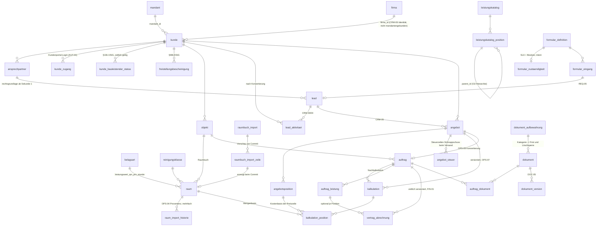

# Datenmodell — CRM & Operations (Kunden, Objekte, Raumbuch, Kataloge, Leads, Angebote, Kalkulation, Aufträge, Vertragsabrechnung, Dokumente)

This document is the normative contract that the Phase 4 migration PRs are built against: every table, column, index, RLS policy, constraint, trigger, view and service interface below is binding, and an implementation that deviates is wrong until this document is amended first. It sits under `docs/architecture/00-KONVENTIONEN.md` — where this document and a convention disagree, **the convention wins and this document is defective** — and every resolution below cites the `K-id` it applies. Where the SPEC is genuinely open, the column exists, carries a visibly labelled placeholder, and emits `// TODO(client)` at its point of use (K-17); a concrete legal, financial or tariff value that the SPEC does not state and that is not marked is a defect, not a detail.

---

## 0. Scope, files and standing

**Domain:** the commercial spine of the platform — who the customer is (`firma`, `kunde`, `ansprechpartner`), where work happens (`objekt`, `raum`, `belagsart`, `reinigungsklasse`), what may be sold (`leistungskatalog`), how work arrives (`formular_definition`, `formular_eingang`, `lead`), what is offered and at what cost (`angebot`, `kalkulation`), what is owed (`auftrag`, `auftrag_leistung`, `vertrag_abrechnung`) and what is filed (`dokument`).

**Phase:** 0 (design only). **Implements in:** ROADMAP Phase 4, except `formular_definition` / `formular_zustaendigkeit` / `formular_eingang` / `lead`, whose first migration ships with the public website in Phase 2 because REQ-01…REQ-07 are Phase 2 acceptance criteria.

### 0.1 Schema files

| File | Tables |
|---|---|
| `src/server/db/schema/crm.ts` | `firma`, `kunde`, `kunde_zugang`, `kunde_bauleistender_status`, `freistellungsbescheinigung`, `ansprechpartner`, `formular_definition`, `formular_zustaendigkeit`, `formular_eingang`, `lead`, `lead_aktivitaet` |
| `src/server/db/schema/operations.ts` | `objekt`, `raum`, `belagsart`, `reinigungsklasse`, `raumbuch_import`, `raumbuch_import_zeile`, `raum_import_historie`, `leistungskatalog`, `leistungskatalog_position`, `angebot`, `angebotsposition`, `angebot_steuer`, `kalkulation`, `kalkulation_position`, `auftrag`, `auftrag_leistung`, `vertrag_abrechnung`, `auftrag_dokument` |
| `src/server/db/schema/dokumente.ts` | `dokument`, `dokument_version`, `dokument_aufbewahrung` |
| `src/server/db/rls.ts` | this domain's entries in the enumerated policy / ceiling / grant registry the build checks (K-04, K-05) |

### 0.2 What this document does not decide

`rechnung`, `rechnungsposition`, `nummernkreis`, `konto_mapping`, `lieferant` and the §14 UStG pre-flight belong to the finance document; `einsatz`, `zeiteintrag`, `turnus`, `revier` to the Dienstplan/Zeit document; `lv_position`, `aufmass`, `nachtrag`, `projekt` to the Bau document; `freigabe`, `freigabe_snapshot` to the approval document (K-13); `aufgabe`, `kalender_eintrag`, `benachrichtigung` to the calendar document; `referenz`, `seite`, `social_post` to the website document. §3.2 lists every boundary reference and the column shape this domain requires of it — those shapes are **binding on the sibling document**.

### 0.3 Identifier language

CLAUDE.md puts domain identifiers in German and infrastructure identifiers in English. Inside the database the two are not separable: a trigger function that enforces `rechtsgrundlage` *is* the domain rule, and `01-KERN.md` has already established the platform's SQL naming (`app.hat_recht`, `app.sichtbare_mandanten`, `kern.setze_geaendert_am`, `audit_log_unveraenderlich`). This document follows that precedent and states it once, resolving the review's inconsistency finding:

| Layer | Language | Examples |
|---|---|---|
| Tables, columns, enums, constraints, indexes, policies | German | `vertrag_abrechnung`, `rechtsgrundlage`, `angebot_nummer_an_versand_ck` |
| SQL functions in `app.` and `kern.` (helpers, triggers) | German | `app.darf_kontaktiert_werden`, `kern.erzwinge_serverzeit` |
| Postgres roles | English, per K-01 | `cse_app`, `cse_job`, `cse_definer` |
| TypeScript infrastructure | English | `withTenant`, `AbrechnungsStrategie` (a domain type keeps its German head noun), `hashChain` |

### 0.4 Common columns, keys and deletion (K-16, invariant 8)

Every table: `id uuid primary key default gen_random_uuid()`, `erstellt_am timestamptz not null default now()`; mutable tables add `geaendert_am timestamptz` maintained by `kern.setze_geaendert_am()`. Accountability adds `erstellt_von` / `geaendert_von` referencing `benutzer(id)`, filled by trigger from `app.aktueller_benutzer()` and never by the application (SEC-A9). Tables an agent may author rows in additionally carry `akteur_art akteur_art not null default 'mensch'` and `agent_aufgabe_id uuid` (the enum is `01-KERN.md` §4's `akteur_art`; the FK lands in Phase 8, AGT-04).

Tenant tables carry `mandant_id uuid not null references mandant(id)`. Every tenant table that is **the parent of a composite foreign key** additionally declares **`UNIQUE (mandant_id, id)`**, because children are pinned to their parent's tenant with a composite FK (§0.8). That set is deliberately narrower than "every table" — **§11 is the list**, nineteen of this domain's thirty-two tables; a table nothing points at needs no second unique, and stating the rule as a blanket would make §11 unreadable as a contract.

**`mandant_id` is `NOT NULL` on every tenant table in this domain, without exception.** K-16(d) makes `audit_log` the *only* tenant-adjacent table on the platform with a nullable `mandant_id`, and it earns that with an `ebene` enum and a `CHECK`. The draft's `dokument_aufbewahrung.mandant_id NULL = "Plattform-Default"` was a second one, which K-16 now forbids outright; it is corrected in §4.7 to one seeded row per mandant per key.

**Deletion — three layers, stated per table, never assumed globally:**

1. no `DELETE` policy for `cse_app` on any table in this domain;
2. `REVOKE DELETE, TRUNCATE ON <t> FROM PUBLIC, cse_app, cse_anon, cse_checkin` and, except for the two purge tables of §1.8, `FROM cse_job` as well;
3. a `BEFORE DELETE` trigger `kern.verhindere_loeschung()` that raises unconditionally, on **every** table in this domain except `raumbuch_import_zeile` and `formular_eingang`, whose purge paths are specified in §1.8.

Layer 3 answers the review's B7. The review's premise — that Supabase's `service_role` carries `BYPASSRLS` and defeats `FORCE ROW LEVEL SECURITY` — is not true of this platform: per **K-01** the application never connects as `postgres`, **no application role holds `BYPASSRLS`**, and `service_role` does not exist here. The fix is nevertheless correct for a different reason, which K-16 already states: deletion protection must be a property of the table, not of the current grant set, so that a future migration, an Edge Function running as `cse_job`, or an `ON DELETE CASCADE` added upstream cannot remove a row that GoBD (LEG-01, ACC-06) requires to exist. Removal is expressed as `archiviert_am` (master data), `entzogen_am` (grants), `widerrufen_am` (releases and certificates), `geloescht_am` (documents, soft only), `anonymisiert_am` (Art. 17 DSGVO erasure of a natural person whose commercial records must survive, §5.6).

**Referential actions are explicit** (review: MISSING). Every FK in this document is declared `ON DELETE NO ACTION ON UPDATE NO ACTION`. `CASCADE` appears nowhere in this domain: a cascade is a hard delete wearing a parent's name, and it would silently defeat all three layers above. A schema test greps the emitted DDL and fails on any `ON DELETE CASCADE` or `SET NULL` in these three schema files.

### 0.5 Exactly one liveness column per row

Two sources of truth for "is this row live" is a silent failure the day someone uses the one the query does not read (`01-KERN.md` §1.7). The draft carried `aktiv` **and** `archiviert_am` on `objekt`, `raum`, `ansprechpartner` and the catalogue tables. Resolved:

| Table | Liveness column | `aktiv` |
|---|---|---|
| `kunde`, `objekt`, `raum`, `ansprechpartner`, `reinigungsklasse`, `lead`, `angebot`, `auftrag` | `archiviert_am` | removed |
| `belagsart`, `leistungskatalog_position`, `auftrag_leistung` | `gueltig_bis` (a date range, §0.7) | removed |
| `leistungskatalog` | `status katalog_status` | removed |
| `formular_definition` | `zurueckgezogen_am` (with `veroeffentlicht_am` as the publication event) | removed |
| `dokument` | `geloescht_am` | n/a |
| `kunde_zugang` | `entzogen_am` | n/a |

Every index, policy and view predicate below reads the single column. Uniqueness is partial wherever deletion is soft (`01-KERN.md` §1.8): an unconditional unique index plus a soft-delete column makes ordinary lifecycle events — a customer archived and re-onboarded, an object number reused after a building is sold — permanently impossible, surfacing as an opaque `duplicate key value` at the worst moment.

### 0.6 Money, quantities, percentages (invariant 1, K-16)

| Kind | Type | Rule |
|---|---|---|
| Money | `bigint`, suffix `_cent` | net unless the name says `brutto`. No `numeric`, `real` or `double precision` money column exists in this domain. |
| Percentage | `integer`, suffix `_bp` | basis points, `1900` = 19,00 %. Never a float, never a `numeric` fraction. |
| Quantity, area | `numeric(12,3)` | quantities are not money and must not be cents (K-16). |
| Performance value | `numeric(10,3)` | m²/h, minutes per unit. |
| Duration | `integer`, named with its unit | `sla_stunden`, `zeitwert_minuten`. |

VAT is computed **per tax-rate group** and never from a gross total. A draft offer's groups come from the view `angebot_steuersumme` (§6); a sent offer's groups are frozen into `angebot_steuer` (§4.5), which is the only thing the PDF renders — the same discipline K-12 requires of an invoice, one level earlier and without claiming the invoice's legal weight.

### 0.7 Time, calendar boundaries and validity ranges (invariant 2, K-11)

Every instant is `timestamptz`, stored UTC, rendered `Europe/Berlin`. Genuine calendar facts — `start_datum`, `laufzeit_bis`, `gueltig_ab`, `gueltig_bis`, `aufbewahrung_bis`, `abnahme_am` — are `date`, because a contract term is not an instant. A day, a month and a **billing period** are Berlin wall-clock boundaries converted to instants, never UTC midnight (K-11); every helper and job in this domain uses `app.berlin_heute()` and `splitteNachMonat` from `src/server/services/zeit/`, and every reference test carries a CET case and a CEST case so a UTC implementation cannot pass by accident.

**`gueltig_bis` is inclusive, everywhere in this domain** (review B18). The draft mixed `CHECK (gueltig_bis > gueltig_ab)` with `daterange(gueltig_ab, gueltig_bis)` — whose upper bound is exclusive — on `belagsart` and `leistungskatalog`, and inclusive `>=` semantics on `auftrag_leistung`. The natural service query is `gueltig_ab <= :stichtag AND (gueltig_bis IS NULL OR gueltig_bis >= :stichtag)`; run against a half-open table it returns the superseded Leistungswert on the changeover day *as well as* the new one, so "the Leistungswert on 1 April" has two answers on exactly the day it matters, and because `belagsart` feeds `Σ m² ÷ Leistungswert`, that is a wrong price and not a wrong label. Therefore, uniformly:

```sql
CHECK (gueltig_bis IS NULL OR gueltig_bis >= gueltig_ab)          -- inclusive last day
EXCLUDE USING gist (… WITH =,
  daterange(gueltig_ab, coalesce(gueltig_bis + 1, 'infinity'::date), '[)') WITH &&)
```

Reference test: a Belagsart superseded on 2026-04-01 returns exactly one row for 2026-03-31 and exactly one for 2026-04-01, and the two rows are different.

### 0.8 Tenant consistency is a composite foreign key, not a trigger (K-16)

The draft enforced "a child cannot be reparented across a tenant boundary" with a trigger `erzwinge_mandant_konsistenz()` described as a pattern and attached to nine of seventeen candidate tables — the review's B10 correctly found `angebot`, `auftrag`, `objekt`, `lead`, `lead_aktivitaet`, `kalkulation`, `kalkulation_position` and `dokument` unguarded. The fix is not more triggers. **K-16 makes it a declarative composite foreign key**, checked by the planner on every write, immune to `session_replication_role`, and impossible to forget silently:

```sql
-- parent, on every tenant table in this domain:
UNIQUE (mandant_id, id)

-- child:
FOREIGN KEY (mandant_id, kunde_id) REFERENCES kunde (mandant_id, id)
  ON DELETE NO ACTION ON UPDATE NO ACTION
```

Every mandant-bearing FK in this domain is composite. §11 enumerates all of them together with the parent unique each one needs. **A single-column FK into a table that carries `mandant_id` is a review failure** (`01-KERN.md` §1.6); a schema test walks `information_schema` and fails on one. The two deliberate single-column FKs are `kunde.firma_id` (the parent carries no `mandant_id` by design, §4.1) and `*_benutzer_id` / `erstellt_von` / `hochgeladen_von` (identity is platform-wide). The draft's third exemption — "`*.dokument_id`, pinned by its own composite pair instead" — is **deleted**: it described nothing real, because §11 declares *every* reference to `dokument` composite (`(mandant_id, dokument_id)`, `(mandant_id, beleg_dokument_id)`, `(mandant_id, pdf_dokument_id)`, `(mandant_id, freigabe_dokument_id)`, `(mandant_id, buergschaft_dokument_id)`), and leaving the clause in would have told the schema test to ignore the one class of FK the register is most careful about.

One column in this domain is deliberately **not** a foreign key at all and is therefore outside the test's reach: `raum_import_historie.import_zeile_id` (§4.2), a provenance value that must survive the §1.8 purge of its source row. It is named here so a reader does not read its absence from §11 as an omission.

`kern.erzwinge_mandant_konsistenz()` is **deleted from this domain**. Nothing it did survives except as a composite key.

### 0.9 The server clock is the source of truth (invariant 5)

`DEFAULT now()` applies only when the column is omitted, so any INSERT that supplies a value writes an arbitrary timestamp — and the immutability triggers below then make the fabricated instant permanent (review B19). For `formular_eingang.eingegangen_am` this is the Art. 7(1) DSGVO evidence timestamp, for `lead_aktivitaet.geschehen_am` the §7 UWG evidence record, for `dokument_version.hochgeladen_am` the GoBD upload time.

**Two shapes, because there are two kinds of column, and applying one rule to both breaks the other.** The draft stamped `now()` unconditionally on INSERT and then extended that list to `angebot.versendet_am`, `auftrag.freigabe_am` and the `raumbuch_import` review columns — all of which are **NULL until the event happens**. Stamping them at INSERT makes `angebot`'s `CHECK ((angebotsnummer IS NULL) = (versendet_am IS NULL))` reject every draft offer, and creates an `auftrag` already flagged customer-released and a `raumbuch_import` already flagged committed — the second two silently. So:

```sql
-- 1. ARRIVAL instants: the column is NOT NULL and its value is "now, on the server".
create function kern.erzwinge_serverzeit() returns trigger
language plpgsql as $$
begin
  new.<spalte> := now();                       -- unconditionally, BEFORE INSERT
  return new;
end $$;
-- with a BEFORE UPDATE companion that raises on any change.

-- 2. EVENT instants: the column is NULL until the event, and the event happens once.
create function kern.erzwinge_serverzeit_bei_ereignis() returns trigger
language plpgsql as $$
begin
  if tg_op = 'INSERT' then
    new.<spalte> := null;                      -- an event cannot have happened before the row existed
  elsif old.<spalte> is null and new.<spalte> is not null then
    new.<spalte> := now();                     -- the NULL -> NOT NULL transition, server clock
  elsif old.<spalte> is not null
        and new.<spalte> is distinct from old.<spalte> then
    raise exception 'Ereigniszeitpunkt % ist unveraenderlich', tg_argv[0];
  end if;
  return new;
end $$;
```

| Shape | Columns |
|---|---|
| `kern.erzwinge_serverzeit()` — always present, stamped at INSERT | `formular_eingang.eingegangen_am`, `lead_aktivitaet.geschehen_am`, `dokument_version.hochgeladen_am` |
| `kern.erzwinge_serverzeit_bei_ereignis()` — NULL until the event, stamped on the transition, immutable after | `angebot.versendet_am`, `auftrag.freigabe_am`, `formular_definition.veroeffentlicht_am`, `kunde_zugang.aktiviert_am`, `raumbuch_import.geprueft_am` / `.uebernommen_am` / `.verworfen_am` |

Both are `BEFORE INSERT OR UPDATE`, and neither ever accepts a caller-supplied instant. A genuinely client-claimed time is never stored in these columns: it goes into a separate `*_geraet_zeit` column with a deviation field, exactly as invariant 5 prescribes for `zeiteintrag` and TIM-09 for offline capture.

### 0.10 No volatile or stable function in a `CHECK` constraint

`current_date`, `now()` and `current_timestamp` are `STABLE`, not `IMMUTABLE`; a `CHECK` containing one changes its truth value under a row that never changes, which makes every later `UPDATE` to that row fail and makes a `pg_dump`/restore abort (`01-KERN.md` §1.9, SEC-A10). No `CHECK` in this document contains one. Time-dependent rules — an offer's expiry, a Freistellungsbescheinigung's validity, a retention date reached — are expressed as (a) a `BEFORE INSERT OR UPDATE` trigger that raises only on an illegal *transition*, (b) a scheduled job, and (c) a monitoring query.

### 0.11 Units and currency

`einheit text NOT NULL`, validated in Zod against the shared constant `EINHEITEN` (`stk · h · m · m2 · m3 · lfm · kg · t · psch · monat · tag · woche · einsatz`). Deliberately not an enum: a VOB Leistungsverzeichnis import (BAU-01) legitimately brings units this list does not contain, and an import must not fail on a unit string. `waehrung text NOT NULL DEFAULT 'EUR' CHECK (waehrung = 'EUR')` on `angebot` and `auftrag`; the `CHECK` documents the assumption and makes a future multi-currency requirement a visible migration rather than a silent rounding bug.

### 0.12 Extensions

`pgcrypto` (`gen_random_uuid`), `btree_gist` (temporal `EXCLUDE`), `pg_trgm` (name search). PostGIS is optional and nothing depends on it — see `objekt`.

### 0.13 Placeholder marking (K-17)

Any row carrying a value the client has not confirmed sets `ist_platzhalter boolean NOT NULL DEFAULT true`. Tables carrying it: `belagsart`, `reinigungsklasse`, `leistungskatalog_position`, `kalkulation`, `dokument_aufbewahrung`. Every screen that consumes such a row renders the DESIGN §5 `warning` pill "Unbestätigter Wert". A `kalkulation` may not be `festgeschrieben` while it or anything it derives from is still a placeholder — enforced by a `CHECK` on `kalkulation` for its own four values (§4.5), by the `angebot_10_versand_pruefen` trigger at the moment of sending (§4.5, which is where the rule would otherwise be discovered as an unexplained `23514`), and by `src/server/services/kalkulation.ts` for the cross-table part, because that check spans three tables and `CHECK` may not contain a subquery. `pnpm lint:todo` fails when a `// TODO(client)` in this domain has no matching row in `DECISIONS.md` § Open (`01-ORDNERSTRUKTUR.md` L6).

---

## 1. Tenancy, RLS, rights and the read paths

### 1.1 Roles (K-01)

This domain introduces **no new Postgres role**. The draft's `webseite` and `db_wartung` roles are deleted; K-01 fixes the set at six and adding a seventh moves the platform's grant surface out of one reviewed place.

| Role | Use in this domain |
|---|---|
| `cse_migrator` | DDL only, CI only, never at runtime |
| `cse_definer` | owns the nine `SECURITY DEFINER` helpers of §1.7; the only role exempt from `FORCE RLS`, and only on the tables named in K-06 and K-08 — neither of which is in this domain, so every definer read and write here runs through an enumerated `cse_definer` policy |
| `cse_app` | every authenticated request, in all four K-18 scopes: the internal portal, the group view, the public-website renderer (§1.6), the form-intake principal (§1.6) and the customer portal (§1.2) |
| `cse_anon` | `EXECUTE` on the five functions of the K-08 register and nothing else — **no table in this domain is readable by `cse_anon`** |
| `cse_checkin` | not used here — neither `app.checkin_verbrauchen` nor `app.offline_ereignis_annehmen` (K-08) touches a table in this domain |
| `cse_job` | watchdogs, the billing run, the retention job, and the two purge paths of §1.8 — each with an enumerated per-job grant **and** a registered `t_job` read policy (§1.2), because a grant alone reads nothing under `FORCE RLS` |

Every table: `ALTER TABLE <t> ENABLE ROW LEVEL SECURITY; ALTER TABLE <t> FORCE ROW LEVEL SECURITY;` (K-01 — without `FORCE`, RLS does not bind the owner and a migration-owned connection silently sees everything).

**`FORCE RLS` binds `cse_job` too, and that is the trap this section exists to close.** A role with a `GRANT SELECT` and no permissive policy reads **zero rows** — no error, no warning. Under the draft, all nine jobs of §8 would have run to completion every night and found nothing: no invoice proposal would ever be raised for a live contract, no SLA would ever escalate, no offer would ever expire. That is the exact silent-and-late failure class this document's conventions exist to prevent, so the job read path is a declared policy class (§1.2), not an implied consequence of a grant.

### 1.2 The standard policy set (K-03)

Applied verbatim to every tenant table in this domain and referred to below as *standard*. The review's B1 — that the draft's unconditional `USING (mandant_id = ANY (app.sichtbare_mandanten()))` lets a `leitung` with memberships in reinigung and security read security prices while working in reinigung — is real, and **K-03 has already resolved it**; the reviewer's `CASE` construction is superseded by the convention's two-policy shape, which is what this document adopts:

```sql
create policy t_mandant on <tabelle>
  for all to cse_app
  using      (mandant_id = app.aktiver_mandant()
              and (select app.hat_recht('<modul>.lesen', app.aktiver_mandant())))
  with check (mandant_id = app.aktiver_mandant()
              and not app.ist_readonly()
              and (select app.hat_recht('<modul>.schreiben', app.aktiver_mandant()))
              and exists (select 1 from mandant m
                           where m.id = mandant_id and m.archiviert_am is null));

create policy t_gruppe on <tabelle>
  for select to cse_app
  using (app.ist_gruppenansicht()
         and mandant_id = any (select app.rechte_mandanten('gruppe.<modul>.lesen')));
```

Three consequences, each of which the draft got wrong:

- **The active mandant narrows reads.** For a staff session `sichtbare_mandanten()` is reachable only through `t_gruppe`, i.e. only in the read-only group view; the two multi-tenant *subject* scopes reach it through `t_kunde` below, and neither is a staff session. D-09 §6 ("a cleaning manager must not see security wage rates") and its commercial twin ("…nor security prices") hold at the RLS layer, not only in the service layer.
- **Membership alone grants nothing.** The `hat_recht` conjunct is mandatory; a policy that omits it is a defect (K-03). Without it a `kunde` login reads the staff directory and a `mitarbeiter` reads every contract's economics — the review's B16, resolved by the convention rather than by a new predicate.
- **Invariant 10 is enforced by Postgres.** No `INSERT`/`UPDATE`/`DELETE` policy in this domain references group scope, so a write under group scope matches no policy and the database refuses it. The service guard is the first line; this is the second.

The hoisted `(select app.hat_recht(...))` form is semantically identical to K-03's and is what `src/server/db/rls.ts` emits: `hat_recht` is `SECURITY DEFINER`, so the planner cannot inline it and would otherwise evaluate it once per candidate row — thousands of calls on a Raumbuch with 4 000 rooms or a customer typeahead (`01-KERN.md` §1.3).

#### The K-18 customer-scope policy — `t_kunde`

K-18 gives `app.scope` four values, and the customer portal is **`kunde` scope, not group scope**. It genuinely spans tenants — CRM-06 shows a company its history across all four areas — but it spans them *as the subject*, not as a manager: `t_gruppe` demands `gruppe.<modul>.lesen`, a management right no customer will ever hold, so a customer routed through `withGroupScope()` reads zero rows, and widening that right would hand a customer a group-level read of the platform. `01-KERN.md` §1.12 states this explicitly and defers the customer branch to **this** document: its `app.sichtbare_mandanten()` returns `false` for `kunde` scope "until the domain that owns those documents extends it". §1.4 is that extension.

So the customer-visible tables carry a **third permissive policy to `cse_app`**, `SELECT` only, keyed on the subject — counted separately from K-03's two exactly as `01-KERN.md` §1.1 item 2 counts `t_person`:

```sql
create policy t_kunde on <tabelle>
  for select to cse_app
  using (app.scope() = 'kunde'
         and mandant_id = any (app.sichtbare_mandanten())
         and <pfad zu kunde_id> = any (app.aktuelle_kunden()));
```

Twelve tables carry it, and the list is literal in `src/server/db/rls.ts`: `kunde`, `ansprechpartner`, `objekt`, `raum`, `angebot`, `angebotsposition`, `angebot_steuer`, `auftrag`, `auftrag_leistung`, `auftrag_dokument`, `dokument`, `dokument_version` — precisely the `p_kunde_ceiling` list of §1.4, and nothing else. **The K-04 ceiling still applies on top and is not duplicated by this**: the ceiling is `restrictive` and says *at most your own rows*; `t_kunde` is permissive and says *these rows, in these tenants*. Both must pass, which is why `t_kunde` may be written as a plain subject predicate.

**Exactly two tables in this domain carry a `t_person` policy: `dokument` and `dokument_version`.** EMP-13 gives the employee portal nothing else to read here — §1.3 grants the `mitarbeiter` role none of `crm`, `angebot`, `kalkulation`, `auftrag`, `abrechnung`, and test 6 of §10 asserts zero rows on those — so a `t_person` policy on any other table would be a policy with no subject, and the build check asserts that absence rather than leaving it to inference. The document pair is the exception because `03-AUTH-BERECHTIGUNGEN.md` §8.5 lists `dokument` among the tables the employee portal reaches (a Dienstanweisung, a Betriebsvereinbarung, a safety data sheet reached from `/portal/mein`), and a worker read under K-18 needs **no** module right — `t_person` is keyed on the subject and carries no `hat_recht` conjunct:

```sql
create policy t_person on dokument
  for select to cse_app
  using (app.scope() = 'person'
         and mandant_id = any (app.sichtbare_mandanten())
         and sichtbar_fuer_mitarbeiter and geloescht_am is null);
```

`dokument_version` carries the same policy through its parent plus `ist_aktuell`. `sichtbar_fuer_mitarbeiter` is declared in §4.7 and defaults to `false`, so the opening is opt-in per document and nothing becomes worker-visible by omission. The employee ceiling of `03-AUTH-BERECHTIGUNGEN.md` §8.5 (form C) applies on top, exactly as `p_kunde_ceiling` applies on top of `t_kunde`: the ceiling says *at most your own rows*, the policy says *these rows, in these tenants*, and both must pass (K-18). The two policies ship in one PR with the column, because either half alone is a dangling reference.

**Writes in `kunde` scope: none, here.** `app.aktiver_mandant()` is NULL in every multi-tenant scope (K-02), so every `t_mandant` `WITH CHECK` is false and Postgres refuses the write — the same construction that enforces invariant 10 in group scope. The customer writes K-18 contemplates (a portal message, an upload) are performed by a service that **re-enters `withTenant` with the single resolved mandant**, where the ordinary K-03 write path applies.

#### The `cse_job` read policy — `t_job`

A third policy class, `to cse_job`, outside K-03's count for the same reason `t_kunde` is inside `01-KERN.md` §1.1 item 2's: K-03 fixes the policy set **for `cse_app`** at exactly two, and §1.1 of the Kern document reads it that way ("exactly the two permissive K-03 policies `to cse_app`"). Without it the nine jobs of §8 read nothing.

```sql
create policy t_job on <tabelle>
  for select to cse_job
  using (true);
```

`using (true)` is correct and is not a hole: a job has no session, no `app.benutzer_id` and no active mandant, so there is no tenant to narrow to and no right to check — a cron run legitimately spans all four entities. What bounds the job is the **grant**, not the policy: `cse_job` holds `SELECT` only on the tables its own job definition enumerates (K-01), holds no `INSERT`/`UPDATE` in this domain except where §8 names it, and holds `DELETE` on exactly the two purge tables of §1.8. The list of tables carrying `t_job` is literal in `src/server/db/rls.ts` and is exactly the read set of §8:

`vertrag_abrechnung`, `auftrag`, `auftrag_leistung`, `angebot`, `lead`, `formular_zustaendigkeit`, `freistellungsbescheinigung`, `dokument`, `dokument_aufbewahrung`, `kalkulation`, `belagsart`, `leistungskatalog_position`, `reinigungsklasse`, `raumbuch_import`, `raumbuch_import_zeile`, `formular_eingang`.

`cse_job` writes in exactly three places in this domain, and each is its own separately-named policy so that no read policy can ever be widened into a write:

```sql
-- job:angebot_ablauf — the only cse_job UPDATE in the domain
create policy u_ablauf on angebot
  for update to cse_job
  using      (status = 'versendet' and gueltig_bis is not null
              and gueltig_bis < app.berlin_heute())
  with check (status = 'abgelaufen');
grant update (status, geaendert_am) on angebot to cse_job;
```

plus the two `d_wartung` `DELETE` policies of §1.8. Four tests: no table outside the `t_job` list carries a policy `to cse_job`; every `t_job` policy is `for select` and never `for all`; the only non-`SELECT` `cse_job` policies in the domain are `u_ablauf` and the two `d_wartung`; and `cse_job` holds no `INSERT` privilege on any table here. A `t_job` widened to `for all` would turn the read path into a write path on sixteen tables at once, which is why the command is asserted and not assumed.

Views are `security_invoker` (§1.9), so a job reading `lead_sla_offen` or `auftrag_ohne_zeiterfassung` evaluates `t_job` on the underlying tables and needs `GRANT SELECT` on the view as well — enumerated per job in §8.

### 1.3 Right keys per table

Every policy in §4 names its module. **The permission catalogue is owned by `03-AUTH-BERECHTIGUNGEN.md` (K-19)** — its module vocabulary and its action vocabulary are the only ones, and every key in the table below must have a row there. This domain mints no module and no action of its own: the twelve modules below are `03-AUTH-BERECHTIGUNGEN.md` §7.4 modules, and `lesen` / `schreiben` are its `berechtigung_aktion` values. `<modul>.schreiben` is K-03's write key, and K-19 makes `schreiben` mandatory in that vocabulary for exactly this reason — `app.hat_recht()` returns **false** for a key it does not know, so a missing or misspelled key is not an error but a permanently empty screen. CI extracts every right-key literal from policies, route gates and services and fails on any key absent from the catalogue, and on any catalogue key no code uses; the keys below are this domain's contribution to that extraction (cross-document note, §13).

| Module | Tables | Read right | Write right | Group read right |
|---|---|---|---|---|
| `crm` | `firma`, `kunde`, `ansprechpartner`, `lead`, `lead_aktivitaet`, `kunde_zugang` | `crm.lesen` | `crm.schreiben` | `gruppe.crm.lesen` |
| `crm_entgelt` | column-level: `kunde.zahlungsziel_tage`, `kunde.debitorennummer` | `crm_entgelt.lesen` | — | — |
| `objekt` | `objekt`, `raum`, `belagsart`, `reinigungsklasse`, `raum_import_historie` | `objekt.lesen` | `objekt.schreiben` | `gruppe.objekt.lesen` |
| `objekt_import` | `raumbuch_import`, `raumbuch_import_zeile` | `objekt_import.lesen` | `objekt_import.schreiben` | — (no group read: staging data) |
| `katalog` | `leistungskatalog`, `leistungskatalog_position` | `katalog.lesen` | `katalog.schreiben` | `gruppe.katalog.lesen` |
| `formular` | `formular_definition`, `formular_zustaendigkeit`, `formular_eingang` | `formular.lesen` | `formular.schreiben` | — |
| `angebot` | `angebot`, `angebotsposition`, `angebot_steuer` | `angebot.lesen` | `angebot.schreiben` | `gruppe.angebot.lesen` |
| `kalkulation` | `kalkulation`, `kalkulation_position` | `kalkulation.lesen` | `kalkulation.schreiben` | `gruppe.kalkulation.lesen` |
| `auftrag` | `auftrag`, `auftrag_leistung`, `auftrag_dokument` | `auftrag.lesen` | `auftrag.schreiben` | `gruppe.auftrag.lesen` |
| `abrechnung` | `vertrag_abrechnung`, `kunde_bauleistender_status`, `freistellungsbescheinigung` | `abrechnung.lesen` | `abrechnung.schreiben` | `gruppe.abrechnung.lesen` |
| `dokument` | `dokument`, `dokument_version`, `dokument_aufbewahrung` | `dokument.lesen` | `dokument.schreiben` | `gruppe.dokument.lesen` |
| `oeffentlich` | the public read path of §1.6 | `oeffentlich.lesen` | — | `gruppe.oeffentlich.lesen` |

The seeded role matrix that decides which role holds which key is owned by **`03-AUTH-BERECHTIGUNGEN.md`** §12 (the document earlier drafts of this file called `04-BERECHTIGUNGSMODELL.md`, which does not exist). **Four** allocations are load-bearing here and are stated as requirements on that document:

- the `mitarbeiter` role holds **none** of `angebot`, `kalkulation`, `auftrag`, `abrechnung`, `crm` (EMP-13);
- **of this document's modules only**, the `kunde` role holds `angebot.lesen`, `auftrag.lesen`, `objekt.lesen` and `dokument.lesen`, each further narrowed by §1.4 and each reachable in `kunde` scope only through the `t_kunde` policies of §1.2. The clause is scoped to the twelve modules of the table above and is **not** a statement about the role's total key set: `03-AUTH-BERECHTIGUNGEN.md` §12.7 seeds the `kunde` role with further keys owned by other domains (`finanzen.lesen`, `zahlung.lesen`, `nachweis.lesen`, `bau.lesen`, `qualitaet.lesen`, `nachricht.lesen`, and `finanzen.herunterladen`), and reading this sentence as absolute would blank half the customer portal. What this document does assert is the negative: the `kunde` role holds **no** `crm.lesen`, no `kalkulation.*`, no `katalog.*`, no `formular.*` — in particular **no** `formular.schreiben`, which is what stops the customer portal from using the `formular_eingang` insert path of §1.6.1;
- the **website-renderer** service principal holds `oeffentlich.lesen` in the four mandanten plus `gruppe.oeffentlich.lesen`, and nothing else (§1.6);
- the **form-intake** service principal holds `oeffentlich.lesen`, `formular.schreiben` and `dokument.schreiben` in the four mandanten, and nothing else — in particular **not** `formular.lesen`, so it can record a submission and cannot read one (§1.6.1).

### 1.4 Portal ceilings (K-04)

Rights decide *which module*; the ceiling decides *whose rows*. Both are needed: a right is granted per role and a role is shared by many people, so the customer portal's "own records only" and the employee portal's EMP-13 boundary are **restrictive** policies, evaluated in addition to K-03 and unable to widen anything.

```sql
-- customer ceiling — the K-04 shape, keyed on the customer's own kunde_id
create policy p_kunde_ceiling on <tabelle> as restrictive for all to cse_app
  using (app.portal() <> 'kunde'
         or (<pfad zu kunde_id> = any (app.aktuelle_kunden()) and <sichtbarkeitsklausel>));

-- internal-only ceiling — commercial internals are invisible to both non-internal portals
create policy p_intern_ceiling on <tabelle> as restrictive for all to cse_app
  using (app.portal() = 'intern');
```

Enumerated, not exemplified. `src/server/db/rls.ts` holds both lists and **the build fails when a table in this domain carries neither a customer ceiling nor an internal-only ceiling**:

| Ceiling | Tables | Visibility clause |
|---|---|---|
| `p_kunde_ceiling` | `kunde` | `id = any (app.aktuelle_kunden())` |
| | `objekt`, `auftrag`, `angebot` | `kunde_id = any (app.aktuelle_kunden())`; `angebot` additionally `versendet_am is not null` — a customer never sees a draft |
| | `raum` | parent `objekt` |
| | `angebotsposition`, `angebot_steuer` | parent `angebot` |
| | `auftrag_leistung`, `auftrag_dokument` | parent `auftrag` |
| | `dokument` | `sichtbar_fuer_kunde and geloescht_am is null` and reachable from one of the customer's own `kunde_id`s or one of their `auftrag` rows |
| | `dokument_version` | parent `dokument` and `ist_aktuell` |
| | `ansprechpartner` | `kunde_id = any (app.aktuelle_kunden())` — a customer sees their own contacts, never the `rechtsgrundlage` columns (§1.5) |
| worker ceiling, form C of `03-AUTH-BERECHTIGUNGEN.md` §8.5 | `dokument`, `dokument_version` | `app.portal() <> 'mitarbeiter' or (sichtbar_fuer_mitarbeiter and geloescht_am is null)` — the restrictive twin of the `t_person` policy of §1.2, registered in `src/server/db/rls.ts` in the same PR as the column. These are the only two tables in this domain the employee portal reaches; every other table blocks on `p_intern_ceiling` |
| `p_intern_ceiling` | `firma`, `kalkulation`, `kalkulation_position`, `vertrag_abrechnung`, `leistungskatalog`, `leistungskatalog_position`, `belagsart`, `reinigungsklasse`, `lead`, `lead_aktivitaet`, `formular_zustaendigkeit`, `raumbuch_import`, `raumbuch_import_zeile`, `raum_import_historie`, `kunde_bauleistender_status`, `freistellungsbescheinigung`, `kunde_zugang`, `dokument_aufbewahrung` | — |
| `p_intern_ceiling`, **`for select, update, delete` only** | `formular_eingang` — the second registered exemption (§1.6): a restrictive policy with no `WITH CHECK` uses its `USING` expression for `INSERT` too, so a `for all` ceiling here would make the public offer-request form unable to persist a submission at all, and REQ-01…REQ-07 would have no write path. Reading, editing and purging a submission stay internal-only; the `INSERT` is governed by K-03's `WITH CHECK` alone, which still demands `formular.schreiben` and `not app.ist_readonly()` | — |
| *no ceiling* | `formular_definition` — the first registered exemption, listed literally in `src/server/db/rls.ts`, because the public renderer of §1.6 does not run at `portal = 'intern'` and an internal-only ceiling would blank the public offer-request forms. It is bounded instead by the `oeffentlich.lesen` right and by carrying no internal column at all | — |

Both exemptions are **registered literally**, not derived from a rule, and a test asserts that `formular_definition` and `formular_eingang` are the only two entries — a third one added without review fails the build. The customer portal cannot use the `formular_eingang` opening: of this document's modules the `kunde` role holds only `angebot.lesen`, `auftrag.lesen`, `objekt.lesen` and `dokument.lesen` (§1.3, §13 note 4), so `formular.schreiben` resolves false for it and K-03's `WITH CHECK` refuses the insert.

**`p_intern_ceiling` is the registered shorthand for the degenerate per-portal pair**, not a fourth portal value. `app.portal` has exactly three values (K-02), so `app.portal() = 'intern'` is identically `app.portal() <> 'mitarbeiter' AND app.portal() <> 'kunde'`; **no table in this domain carries `p_intern_ceiling` together with any other ceiling** — the table above is a partition, and `dokument` / `dokument_version` are the only rows carrying two, a customer ceiling and a worker ceiling, neither of which is the intern one. Nothing is AND-ed that was not AND-ed before, so the two forms cannot disagree. `src/server/db/rls.ts` registers the shorthand under that name and `03-AUTH-BERECHTIGUNGEN.md` §8.5 carries it as a registered ceiling class; a reviewer who prefers the expanded pair may emit it, and every list, test and count in this section is unchanged by the choice.

#### `app.portal()` in all four scopes (K-20)

`app.portal()` is derived from **the role of the active membership**, not from the existence of a membership (K-04) — but that derivation only has an input in `mandant` scope. K-20 therefore binds it **when the scope is entered**, and it has a defined value in all four K-18 scopes. It is never recomputed from `app.aktiver_mandant()`, which is NULL in the three multi-tenant scopes: recomputing it there falls through to the fail-closed `mitarbeiter`, which fires `p_intern_ceiling` on eighteen tables inside the group view — blanking TEN-05 and CRM-06 with no error — while ceilinging every customer as though they were staff.

| Scope | `app.portal()` | Effect on this section's ceilings |
|---|---|---|
| `mandant` | the active membership's role: `intern` for `super_admin` / `admin` / `leitung`, else `mitarbeiter` or `kunde` (K-04) | both ceilings evaluate normally |
| `gruppe` | bound at scope entry from the memberships behind `app.mandant_ids`; **never `kunde`, never the fail-closed `mitarbeiter`** — group scope is entered by management only (TEN-05) | `p_intern_ceiling` passes, `p_kunde_ceiling` passes trivially; the read stays SELECT-only because only `t_gruppe` grants it |
| `person` | `mitarbeiter` by construction — the employee portal has no other subject | `p_intern_ceiling` blocks; only the `t_person` exception of §1.2 (`dokument`, `dokument_version`) is reachable |
| `kunde` | `kunde` | `p_kunde_ceiling` is the operative one; `p_intern_ceiling` blocks every table carrying it |

The fail-closed default of an unset GUC (`01-KERN.md` §3.1) therefore applies to a session that has entered **no** scope at all, and narrows every ceiling instead of lifting it. The four-branch derivation itself is owned by `01-KERN.md` §3.2/§3.3 and restated in `03-AUTH-BERECHTIGUNGEN.md` §1.4; this document only records what its ceilings require of it (§13).

**`app.aktuelle_kunden()` and `kunde_zugang`.** K-02 fixes the GUC list and it contains no customer id, so the customer identity is *resolved*, exactly as `app.aktuelle_person()` resolves the staff identity, and the resolution table is `kunde_zugang` (§4.1) — the customer-side analogue of `mitarbeiter_zugang`. It returns an **array**, not a scalar, because K-18 gives the customer portal its own multi-tenant scope: one company served by cleaning and by security is two `kunde` rows (§4.1), and a scalar resolver would silently show a customer only one of the two areas — CRM-06's failure, with no error:

```sql
create function app.aktuelle_kunden() returns uuid[]
language sql stable security definer set search_path = pg_catalog, public as $$
  select coalesce(array_agg(kz.kunde_id), array[]::uuid[])
    from public.kunde_zugang kz
   where kz.benutzer_id = app.aktueller_benutzer()
     and kz.entzogen_am is null
     and (kz.mandant_id = app.aktiver_mandant()                        -- mandant scope: exactly one
       or (app.scope() = 'kunde'
           and kz.mandant_id = any (app.sichtbare_mandanten())));      -- kunde scope: the K-18 set
$$;
```

**The binding is `kunde_zugang`, never `aktiver_mandant()` (K-20).** The identity comes from the session's stored `kunde_zugang` rows in every scope; `app.aktiver_mandant()` appears in the first disjunct only as a *narrowing* inside `mandant` scope, and is never the source of the identity. An accessor that resolved the customer *through* `aktiver_mandant()` would return NULL — and therefore the empty array, and therefore zero rows — in the very scope the customer portal runs in, which is the failure K-18 exists to prevent, one layer down. K-20 requires the value in all four scopes to be stated, so it is:

| Scope | `app.aktuelle_kunden()` | Why |
|---|---|---|
| `mandant` | the `kunde_id`s of the caller's live `kunde_zugang` rows **in the active mandant** — usually one | a staff session has none, so the array is empty and `p_kunde_ceiling` passes trivially |
| `gruppe` | `{}` — neither disjunct matches (`aktiver_mandant()` is NULL, `scope()` is `gruppe`) | the group view exists for the group, not for its customers; a customer login reads nothing there |
| `person` | `{}` — same reason | the employee portal has no customer subject; its ceiling is the K-04 employee one |
| `kunde` | the `kunde_id`s of every live `kunde_zugang` row whose mandant is in `app.sichtbare_mandanten()` | CRM-06: one company served by two entities is two `kunde` rows and both must be visible |

A documented `{}` is a defined value, not an undefined one: it is fail-closed, and every policy keyed on it is false rather than NULL. Fail-closed by construction (K-02): with no row it returns the empty array, `x = any ('{}')` is false, the restrictive ceiling is not satisfied, and the session reads zero rows.

**The scalar `app.aktueller_kunde()` is a `mandant`-scope convenience only** — `(app.aktuelle_kunden())[1]`, owned by `03-AUTH-BERECHTIGUNGEN.md` — and **may not appear in a `t_kunde` policy or a `p_kunde_ceiling` anywhere on the platform**. In `kunde` scope it either resolves through `aktiver_mandant()` (NULL, so the policy is false and the portal is dead) or silently returns one of two `kunde` rows, which is CRM-06 failing with no error. Every customer disjunct in this document is written `= any (app.aktuelle_kunden())`, and a CI grep asserts no `= app.aktueller_kunde()` occurs in any policy in any schema file.

**The `kunde` branch of `app.sichtbare_mandanten()` (K-18, `01-KERN.md` §3.2).** The Kern document's resolver returns `false` for `kunde` scope and names this domain as the one that must extend it. The extension is the grant table, not the document trail:

```sql
-- replaces "when 'kunde' then false" in app.sichtbare_mandanten() (01-KERN.md §3.2)
when 'kunde' then exists (select 1 from public.kunde_zugang kz
                           where kz.benutzer_id = app.aktueller_benutzer()
                             and kz.mandant_id  = m.id
                             and kz.entzogen_am is null)
```

Derived server-side from a stored grant and never from the request (K-02, K-18). A grant is issued against a `kunde` row, and a `kunde` row is what `auftrag`, `angebot` and `rechnung` hang off, so this set is a **subset** of K-18's "the customer's own `auftrag`/`angebot`/`rechnung` rows" — narrower, because a customer sees an entity only where AUT-01/AUT-03 access was actually granted and revoking it (`entzogen_am`) removes the entity from the set in the same statement. Whether one company gets one login spanning entities or one login per entity is **O-52**; this shape serves both, because the array simply has one element in the second case.

### 1.5 Column privileges where a row is shared but a column is not (K-05)

Two places in this domain hand a readable row to a principal who must not read every column of it. K-05 forbids masking views for this purpose and prescribes column-level `GRANT`, which composes correctly with RLS:

```sql
revoke select on kunde from cse_app;
grant  select (id, mandant_id, firma_id, kundennummer, typ, name, rechtsform, ust_id,
               steuernummer, ist_oeffentlicher_auftraggeber, xrechnung_pflicht, leitweg_id,
               kaeufer_referenz, uebertragungsweg, rechnungsformat, strasse, hausnummer, plz, ort, land,
               rechnungsadresse_abweichend, rechnung_name, rechnung_strasse, rechnung_hausnummer,
               rechnung_plz, rechnung_ort, rechnung_land, rechnung_email, email_zentral,
               telefon_zentral, webseite, rechtsgrundlage, rechtsgrundlage_quelle,
               rechtsgrundlage_erfasst_am, rechtsgrundlage_beleg_dokument_id, werbewiderspruch_am,
               widerspruch_am, status, notiz, archiviert_am, erstellt_am, erstellt_von,
               geaendert_am, geaendert_von)
       on kunde to cse_app;    -- zahlungsziel_tage, debitorennummer, mahnsperre_* omitted

revoke select on ansprechpartner from cse_app;
grant  select (id, mandant_id, kunde_id, anrede, titel, vorname, nachname, position, abteilung,
               email, telefon, mobil, sprache, ist_hauptkontakt, ausgeschieden_am,
               archiviert_am, anonymisiert_am, erstellt_am, erstellt_von, geaendert_am, geaendert_von)
       on ansprechpartner to cse_app;   -- the rechtsgrundlage block is omitted
```

The withheld columns are reachable only through narrow `SECURITY DEFINER` readers that re-check the right **and** `mandant_id = app.aktiver_mandant()` and write `audit_log`: `app.zahlungskondition_lesen(p_kunde uuid)` (right `crm_entgelt.lesen`) and `app.rechtsgrundlage_lesen(p_ansprechpartner uuid)` (right `crm.lesen`, and never granted to the `kunde` role). The gate predicate of §5 does not need the reader — it is itself `SECURITY DEFINER` and answers a boolean.

### 1.6 The public website read path (K-07, K-08, K-01)

The public site is server-rendered and must read `formular_definition` (REQ-01) and published content (PUB-07). The draft solved this with a `webseite` Postgres role holding `SELECT` on one table. That is wrong twice: K-01 fixes the role set at six, and K-08's route-manifest test asserts that **no code path reaches the database outside `withTenant` / `withGroupScope` / `withPersonScope` / `withKundeScope`** except the **five** functions of its closed register — a seventh role reading a table directly is exactly what that test exists to catch. (None of the five touches a table in this domain: `sitzung_aufloesen` and `versuch_protokollieren` are Kern's, `checkin_verbrauchen` and `offline_ereignis_annehmen` are Zeit's, `ical_feed_lesen` is the calendar's.)

The resolution keeps every convention intact and adds nothing:

- the public renderer opens an ordinary session as `cse_app` through `withTenant(mandant)` for an area page (`/unternehmen/[bereich]`) and `withGroupScope()` for the group pages, always with `app.readonly = 'on'`;
- the principal is a **service `benutzer`** (`kunde_zugang`-less, `person_id` NULL) whose memberships grant exactly one right, `oeffentlich.lesen`, in the four mandanten, plus `gruppe.oeffentlich.lesen`;
- consequently the public site can read only rows whose policy names the `oeffentlich` module. In this domain that is `formular_definition` and nothing else.

```sql
create policy t_oeffentlich on formular_definition
  for select to cse_app
  using (veroeffentlicht_am is not null
         and zurueckgezogen_am is null
         and (select app.hat_recht('oeffentlich.lesen', mandant_id)));
```

**This is a third permissive policy `to cse_app` on a tenant table, and it is registered as such.** K-03 fixes the set at two and `01-KERN.md` §1.1 enforces "exactly the two permissive K-03 policies `to cse_app` on every tenant table — no more, no fewer"; a third is OR-ed in, i.e. it *widens*, so it may not be left implicit. `formular_definition` is therefore registered in `src/server/db/rls.ts` twice over — as the ceiling exemption of §1.4 **and** as the domain's only three-policy table — with the reason recorded (K-01 leaves no third role for the public read path, so the public predicate has to live in a policy on `cse_app`) and a test asserting it is the only table in this domain with three `cse_app` policies. `06-RADAR-KI-INHALT.md` §1.6 registers `seite`, `referenz`, `social_post` and `stelle` the same way and for the same reason; the two documents state one mechanism.

### 1.6.1 The intake principal — how a public submission is actually written

The renderer principal above **cannot** write, and must not be able to: it runs with `app.readonly = 'on'`, holds only `oeffentlich.lesen`, and K-03's `WITH CHECK` demands `not app.ist_readonly()` and `formular.schreiben`. Saying "the public form posts to a server route that inserts under the same tenant context" therefore described an insert that fails three ways — a documented but non-functional write path for the whole of REQ-01…REQ-07. Named properly:

| | Renderer | Intake |
|---|---|---|
| Route | `GET /unternehmen/[bereich]`, `/` | `POST /api/formular/[schluessel]` |
| Wrapper | `withTenant(mandant)` / `withGroupScope()` | `withTenant(mandant)` — the mandant resolved from the form's `schluessel`, never from the request body |
| `app.readonly` | `on` | `off` |
| Principal | service `benutzer` "Website-Renderer" | service `benutzer` "Formular-Eingang" |
| Rights held, in the four mandanten | `oeffentlich.lesen`, `gruppe.oeffentlich.lesen` | `oeffentlich.lesen`, `formular.schreiben`, `dokument.schreiben` — **and nothing else** |
| Can read a submission back | — | **no**: it holds no `formular.lesen`, so `t_mandant`'s `USING` is false and the row it just wrote is invisible to it |

Three consequences worth stating, because each is what makes the opening narrow:

- **`formular.schreiben` without `formular.lesen` is a write-only door.** A compromised intake route cannot enumerate submissions, cannot read another visitor's payload, and cannot read `formular_zustaendigkeit` (whose module is `formular` and whose ceiling is intern-only anyway).
- **The `p_intern_ceiling` on `formular_eingang` is scoped `for select, update, delete`** (§1.4), which is the single registered reason the `INSERT` is reachable at all. Every other command on that table remains internal-only.
- **`dokument.schreiben` is needed for the REQ-04 LV upload**, which writes a `dokument` carrying `formular_eingang_id`. `dokument` has no internal-only ceiling and its customer ceiling passes for a non-`kunde` portal, so the K-03 `WITH CHECK` is the whole gate — and the intake principal holds no `dokument.lesen`, so it cannot read any file back either.

The route validates with Zod against the form version's `felder` (SEC-A4), rate-limits on `ip_hash`, and writes `formular_eingang` and any `dokument` in **one transaction**. `eingegangen_am` is stamped by `kern.erzwinge_serverzeit()` (§0.9), so the arrival instant is the server's even though the caller is anonymous traffic. There is still **no anonymous `INSERT` policy anywhere in this domain**: `cse_anon` holds no table grant at all (K-01), and the writer is a named, rights-bounded `cse_app` principal inside `withTenant`.

**No internal column is exposed, because no internal column is on the table.** The review's MINOR finding — that the draft's public policy handed out `standard_besitzer_benutzer_id`, `eskalation_benutzer_id` and `sla_stunden` to anonymous traffic — is fixed structurally rather than with a column grant: the routing and SLA fields move to `formular_zustaendigkeit` (§4.4), which carries no `oeffentlich` policy at all. A column grant would have worked, but a table an anonymous reader may read should not contain a secret in the first place.

**No anonymous `INSERT` exists anywhere in this domain**, and no principal both renders the form and writes to it: the submission is written by the intake principal of §1.6.1, under `withTenant` with `app.readonly = 'off'`, holding `formular.schreiben` and not `formular.lesen`.

**PRO-05's public path** is `referenz` in the website domain, never this domain's tables. `referenzfaehiger_auftrag` (§6) is the *internal* worklist from which a human creates a `referenz` row; the copy is an explicit human action (invariant 7) and the copied fields are enumerated in §3.2. No public page reads `auftrag`, so `auftragswert_netto_cent`, `kunde_id` and the site address cannot leak through a view grant — the failure the review's MISSING item describes.

### 1.7 `SECURITY DEFINER` helpers owned by this domain

**Nine functions, enumerated exhaustively.** Each is owned by `cse_definer`, each carries `SET search_path = pg_catalog, public` (K-01 — an unqualified `search_path` on a definer function is a privilege-escalation vector, so the clause is stated per function and not "generally"), and each is listed with the tables it needs a narrow `cse_definer` policy on — the definer-read registry of `01-KERN.md` §3.5, which this domain extends by **seven** tables. The draft said "all five" over a table of six rows and left `app.aufbewahrung_intervall` and `app.person_anonymisieren` out of both the inventory and the registry, which made the §1.8 purge and the whole Art. 17 erasure path of §5.6 unbuildable.

| # | Function | Purpose | Registry entry | SPEC |
|---|---|---|---|---|
| 1 | `app.aktuelle_kunden()` → `uuid[]` | resolve the customer identities behind a portal login, in mandant and in `kunde` scope (§1.4, K-18) | `kunde_zugang` — select | AUT-01, DOC-04, CRM-06 |
| 2 | `app.firma_aufloesen(p_ust_id text, p_name text, p_land char(2))` → `uuid` | CRM-06 identity resolution without exposing another entity's customer list (§4.1) | `firma` — select **and** insert | CRM-01, CRM-06, AUT-06 |
| 3 | `app.firma_kandidaten(p_name text, p_land char(2))` → `table(firma_id uuid, aehnlichkeit real)` | duplicate detection returning a score and an id, never a row | `firma` — select | CRM-06 |
| 4 | `app.darf_kontaktiert_werden(p_ansprechpartner uuid, p_kanal text, p_zweck text)` → `boolean` | the single §7 UWG predicate (§5.3) | `ansprechpartner`, `kunde` — select | CRM-08, LEG-08 |
| 5 | `app.rechtsgrundlage_lesen(p_ansprechpartner uuid)` | the K-05 reader for the `rechtsgrundlage` block (§1.5) | `ansprechpartner` — select | CRM-08, LEG-08 |
| 6 | `app.zahlungskondition_lesen(p_kunde uuid)` | the K-05 reader for `zahlungsziel_tage` / `debitorennummer` / `mahnsperre_*` (§1.5) | `kunde` — select | ACC-01, FIN-15 |
| 7 | `app.aufbewahrung_regel(p_mandant uuid, p_schluessel text)` → `table(aufbewahrung_monate integer, loeschsperre boolean, ist_platzhalter boolean)` | resolve a retention rule for `kern.setze_aufbewahrung()` (§4.7) | `dokument_aufbewahrung` — select | DOC-07, ACC-06 |
| 8 | `app.aufbewahrung_intervall(p_mandant uuid, p_schluessel text)` → `interval` | the same rule as an `interval`, for the two `cse_job` purge predicates (§1.8) | `dokument_aufbewahrung` — select | LEG-09 |
| 9 | `app.person_anonymisieren(p_mandant uuid, p_ansprechpartner uuid)` | Art. 17 DSGVO erasure across four tables in one transaction (§5.6) | `ansprechpartner`, `kunde`, `formular_eingang`, `lead_aktivitaet` — select **and** update | LEG-09, LEG-11 |

**Why 7 and 8 must be definer, and must take the mandant as an argument.** Both are called where there is no session: `app.aufbewahrung_intervall` inside a `for delete to cse_job` policy, `app.aufbewahrung_regel` inside a `BEFORE INSERT` trigger whose caller may hold `dokument.schreiben` without `dokument.lesen` (the intake principal of §1.6.1 is exactly that). As `SECURITY INVOKER` both would read zero rows and return NULL, `now() - NULL` is NULL, the purge predicate would be NULL, and the retention resolution would silently write `aufbewahrung_bis = NULL, loeschsperre = false` on every document — DOC-07 and ACC-06 failing open with no error. And because a `cse_job` run has no `app.aktiver_mandant()`, the mandant cannot be read from the session; it is passed from the row being judged (`raumbuch_import_zeile.mandant_id`, `formular_eingang.mandant_id`, `new.mandant_id`).

**Why 9 needs `UPDATE` policies, which is the one crack this domain opens.** `formular_eingang` and `lead_aktivitaet` carry write-once immutability triggers (§4.4) and `cse_app` holds no path to overwrite `daten` or `inhalt` — deliberately, because they are the LEG-09 and §7 UWG evidence. Art. 17 nevertheless requires the personal data inside them to be erasable. The procedure is therefore the only writer, and it is bounded four ways rather than trusted:

- four narrow policies `for update to cse_definer`, never `for all`, each keyed on a **transaction-local guard** that only this procedure sets — a policy cannot see a function's arguments, so the mandant travels through the GUC:

  ```sql
  -- inside app.person_anonymisieren, before any write:
  perform set_config('app.anonymisierung_mandant', p_mandant::text, true);

  create policy a_anonymisieren on formular_eingang
    for update to cse_definer
    using      (mandant_id = nullif(current_setting('app.anonymisierung_mandant', true),'')::uuid)
    with check (mandant_id = nullif(current_setting('app.anonymisierung_mandant', true),'')::uuid);
  ```

  Outside the procedure the GUC is unset, `nullif(...)` is NULL, the comparison is NULL and the policy is false — the same fail-closed shape K-02 requires of every accessor;
- **column-level `GRANT UPDATE`**, the K-05 mechanism, so the definer role can write only the columns §5.6 enumerates and no others — a policy cannot restrict columns, and without this the erasure role could rewrite `rechtsgrundlage`, `geschehen_am` or `eingegangen_am`;
- the immutability triggers on `formular_eingang` and `lead_aktivitaet` admit the write only while that same GUC is set, so one guard serves both the policy and the trigger and there is no second definition of "an erasure is in progress";
- every call writes `audit_log` with `aktion = 'dsgvo.anonymisiert'`.

**Tests.** (a) `pg_policies` contains no `cse_definer` policy on a table in this domain outside `{firma, kunde, ansprechpartner, kunde_zugang, dokument_aufbewahrung, formular_eingang, lead_aktivitaet}`. (b) The only non-`SELECT` `cse_definer` policies in this domain are the single `INSERT` on `firma` that `app.firma_aufloesen` needs and the four `UPDATE`s of `app.person_anonymisieren` — asserted **by naming the writer**, not merely by counting policies, so a future function that quietly reuses one of them fails the test. (c) `pg_proc` carries no `SECURITY DEFINER` function in `app.` belonging to this domain outside the nine above, and every one of the nine has `SET search_path = pg_catalog, public` in its `proconfig`.

### 1.8 The only two deletion paths, and their grants

`raumbuch_import_zeile` and `formular_eingang` hold staging and inbound data that a retention concept requires to disappear. The draft asserted a purge without a policy or a grant, so it was documented and non-functional (review: MISSING), and it told two contradictory stories in two places. One story, stated once:

```sql
create policy d_wartung on raumbuch_import_zeile
  for delete to cse_job
  using (exists (select 1 from raumbuch_import i
                  where i.mandant_id = raumbuch_import_zeile.mandant_id
                    and i.id = raumbuch_import_zeile.import_id
                    and i.status in ('verworfen','fehler')
                    and i.erstellt_am < now() - app.aufbewahrung_intervall(
                                                  raumbuch_import_zeile.mandant_id,
                                                  'raumbuch_staging')));
grant delete on raumbuch_import_zeile to cse_job;

create policy d_wartung on formular_eingang
  for delete to cse_job
  using (status = 'spam' and lead_id is null
         and eingegangen_am < now() - app.aufbewahrung_intervall(mandant_id, 'formular_spam')
         and not exists (select 1 from dokument d
                          where d.mandant_id = formular_eingang.mandant_id
                            and d.formular_eingang_id = formular_eingang.id));
grant delete on formular_eingang to cse_job;
```

**Why the attachment guard is in the predicate and not left to chance.** `dokument.formular_eingang_id` is a composite FK declared `ON DELETE NO ACTION` (§0.4), so a spam submission that carried a REQ-04 LV upload cannot be deleted at all: without the guard the weekly `job:staging_purge` raises a foreign-key violation on that one row and the whole run aborts, so every *other* spam submission stops being purged too — a retention obligation silently going unmet because of one attachment. With the guard the submission is simply not yet due: the file follows `dokument`'s own retention rule (`dokument_aufbewahrung`, category `kunde`, §4.7), and once the file's `aufbewahrung_bis` has passed and it has been soft-deleted and its row removed by the document retention flow, the next weekly run picks the submission up. The order is deliberate — the evidence that a file *was* received outlives the file, never the other way round.

Both tables therefore carry **no** `kern.verhindere_loeschung()` trigger (§0.4 layer 3); every other table in the domain does. `app.aufbewahrung_intervall(p_mandant uuid, p_schluessel text)` is `SECURITY DEFINER` owned by `cse_definer` with `SET search_path = pg_catalog, public` (§1.7 #8) and reads `dokument_aufbewahrung` (§4.7) through the definer-read registry — a `cse_job` run has no session and no active mandant, so the mandant comes from the row being judged and the function must not depend on the caller's RLS. The periods are **not** literals in a policy. The draft's hard-coded "90 days" is a retention rule and therefore a client decision (K-17):

`// TODO(client): Aufbewahrungsfrist für verworfene und fehlerhafte Raumbuch-Importzeilen sowie für als Spam markierte Formulareingänge — DSGVO-Löschkonzept (LEG-09); GoBD-Relevanz, weil die Importzeilen belegen, wie das Raumbuch entstanden ist (O-46).`

Until O-46 is answered `dokument_aufbewahrung` holds no row for `raumbuch_staging` or `formular_spam`, `app.aufbewahrung_intervall` returns NULL, the comparison is NULL, and **the purge deletes nothing** — the placeholder fails closed, which for a deletion path is the only safe direction.

### 1.9 Views are `security_invoker` (review B2)

A view executes with the privileges and RLS exemption of its owner. Every view in §6 is created `WITH (security_invoker = true)`, carries `mandant_id` in its output so callers can filter, and is covered by its own SEC-A3 case — per view, not only per table. `security_invoker` is safe here precisely because K-05's column grants and the `firma` update grant of §4.1 are the *only* revoked privileges and no view in §6 selects a revoked column.

`security_invoker` also decides how a **job** reads a view: the view resolves under `cse_job`'s own policies, so `lead_sla_offen` and `auftrag_ohne_zeiterfassung` return rows only because `lead`, `angebot`, `auftrag` and `auftrag_leistung` carry the `t_job` policy of §1.2. `GRANT SELECT` on the view alone is not enough and never was — that is the same FORCE-RLS trap §1.1 describes, one level up. Each job's view grants are enumerated in §8.

### 1.10 Audit (SEC-A9, LEG-01)

`app.protokolliere(...)` is attached as an `AFTER INSERT OR UPDATE` trigger on every table in this domain whose rows are invoice-relevant, legally relevant or commercially sensitive: `kunde`, `ansprechpartner`, `kunde_bauleistender_status`, `freistellungsbescheinigung`, `objekt`, `raum`, `belagsart`, `leistungskatalog_position`, `angebot`, `angebotsposition`, `kalkulation`, `auftrag`, `auftrag_leistung`, `vertrag_abrechnung`, `dokument`, `dokument_version`, `kunde_zugang`, `formular_definition`. `raum` is logged at import granularity (`raumbuch_import`) rather than per row, because a 4 000-row import would otherwise write 4 000 chained audit rows through a single serialised chain head.

The review's GoBD-Stammdatenhistorie finding is answered in two parts. The *audit* obligation is the trigger list above. The *reconstruction* obligation — "what did this customer's address and USt-IdNr. say on the invoice date" — is **not** solved by master-data history and must not be: per **K-12** the invoice's canonical payload snapshots `leistender` and `empfaenger` identity rather than referencing it, so the invoice, the XRechnung and the PDF say what they said, and the hash chain protects it. A master-data history that the invoice does not reference would be a second, unhashed answer to a question K-12 already answers.

`audit_feld_klassifikation` entries this domain requires: `kunde.zahlungsziel_tage`, `kunde.debitorennummer`, `ansprechpartner.rechtsgrundlage*`, `kalkulation.stundenverrechnungssatz_cent`, `kalkulation_position.stundensatz_cent`, `vertrag_abrechnung.stundensatz_cent`, `vertrag_abrechnung.pauschale_netto_cent` — each with the right that `app.audit_feld_lesen()` demands and the `grundlage` string (`D-09 §6`, `K-05`, `§7 UWG`).

---

## 2. Enum types and vocabularies

Vocabularies marked **STATED** come verbatim from the SPEC. Vocabularies marked **PLACEHOLDER** are not stated anywhere: they are implemented so the system runs, labelled here, carry a `// TODO(client)`, and changing one is a reviewed `ALTER TYPE` migration rather than an invisible data edit. That visibility is the reason these are Postgres enums and not free text (K-17). Where a vocabulary carries legal weight *and* the client is likely to want to change it in the UI, it is a **catalogue table** instead — `reinigungsklasse`, `dokument_aufbewahrung`, `einheit`.

```sql
-- STATED — SPEC CRM-08, verbatim
create type rechtsgrundlage as enum ('einwilligung','bestandskunde','anfrage','keine');

-- STATED — SPEC CRM-07 ("website forms · tender radar · manual entry · referral")
create type lead_quelle as enum ('webformular','vergabe_radar','manuell','empfehlung');

-- STATED — SPEC DOC-01, the nine categories verbatim
create type dokument_kategorie as enum
  ('kunde','vertrag','angebot','rechnung','beleg','mitarbeiter','projekt','buchhaltung','unternehmen');

-- STATED — SPEC OPS-07 ("labour + material + equipment + overhead + risk/profit")
create type kostenart as enum ('lohn','material','geraet','gemeinkosten','wagnis_gewinn');

-- PLACEHOLDER — derived from SPEC FIN-01 wording; DECISIONS O-04 is OPEN.
-- // TODO(client): Bestätigen Sie die exakten fünf Abrechnungsarten und ihre deutschen Namen. (O-04)
create type abrechnungsart as enum
  ('stundenbasiert','monatspauschale','festpreis_los','einheitspreis_aufmass','einzelabruf');

-- PLACEHOLDER  // TODO(client): Welche Stufen hat die Vertriebs-Pipeline tatsächlich? (O-73)
create type lead_status as enum
  ('neu','in_bearbeitung','qualifiziert','angebot','gewonnen','verloren','kein_bedarf');

-- PLACEHOLDER  // TODO(client): Prioritätsleiter und was sie steuert (nur Sortierung oder auch Eskalation)? (O-73)
create type lead_prioritaet as enum ('niedrig','normal','hoch','dringend');

-- PLACEHOLDER  // TODO(client): Angebots-Lebenszyklus (O-73) — ist "in_pruefung" der interne
-- Vier-Augen-Schritt oder die Prüfung beim Kunden?
create type angebot_status as enum
  ('entwurf','in_pruefung','versendet','angenommen','abgelehnt','zurueckgezogen','abgelaufen');

-- PLACEHOLDER — VOB-Positionsarten.
-- // TODO(client): Werden Bedarfs-/Eventual- und Alternativpositionen im LV verwendet? (O-73)
create type angebotsposition_typ as enum
  ('leistung','alternativ','eventual','text','zwischensumme');

-- PLACEHOLDER  // TODO(client): Auftragsarten (SPEC OPS-05 "type") bestätigen. (O-73)
create type auftrag_art as enum ('einzelauftrag','rahmenvertrag','dauerauftrag','projekt');

-- PLACEHOLDER  // TODO(client): Auftrags-Lebenszyklus bestätigen. (O-73)
create type auftrag_status as enum ('angelegt','aktiv','pausiert','abgeschlossen','storniert');

-- PLACEHOLDER  // TODO(client): Abrechnungsrhythmen je Abrechnungsart bestätigen. (O-73)
create type abrechnungsintervall as enum
  ('einmalig','monatlich','quartalsweise','halbjaehrlich','jaehrlich','nach_leistung');

-- Derived from SPEC FIN-05 (Leistungszeitraum is mandatory; this says how it is derived).
-- No DEFAULT anywhere — see §4.6.
create type leistungszeitraum_modus as enum ('kalendermonat','nach_leistungsnachweis','manuell');

-- PROVISIONAL — owned canonically by the finance document (FIN-09); repeated here because
-- angebotsposition / auftrag_leistung must carry it from the first migration.
-- // TODO(client): Kommen innergemeinschaftliche Lieferungen oder eine Kleinunternehmer-
-- regelung (§19 UStG) in einer der drei Gesellschaften vor? Falls ja, fehlen hier Werte. (O-60)
create type steuer_kennzeichen as enum
  ('regelsatz','ermaessigt','steuerfrei','reverse_charge_13b');

-- PLACEHOLDER  // TODO(client): Kundenkategorien bestätigen (O-73); behoerde steuert die
-- XRechnungs-Pflicht (FIN-11) und muss stimmen.
create type kunde_typ as enum ('firma','behoerde','privat');

-- PLACEHOLDER
create type kunde_status as enum ('aktiv','inaktiv','gesperrt');

-- PLACEHOLDER  // TODO(client): Welche Aktivitätsarten braucht der Vertrieb? (O-73)
create type aktivitaet_typ as enum
  ('notiz','anruf','email','termin','besichtigung','angebot_versendet',
   'wiedervorlage','statuswechsel','system');
create type aktivitaet_richtung as enum ('eingehend','ausgehend','intern');

-- PLACEHOLDER — the §7 UWG / Art. 21 DSGVO split of §5. This is a legal classification.
-- // TODO(client): Welche Kommunikation gilt als vertraglich notwendig (Rechnung,
-- Leistungsnachweis, Terminbestätigung, Mahnung) und ist damit vom Werbewiderspruch
-- ausgenommen, und welche gilt als Werbung? (O-65)
create type kommunikationszweck as enum ('vertraglich','werbung','intern');

-- PLACEHOLDER — the base a Gemeinkostenzuschlag is calculated on. OPS-07 names the five
-- cost blocks but not the reference value.
-- // TODO(client): Auf welche Bezugsgröße wird der Gemeinkostenzuschlag gerechnet (O-16) —
-- Lohnkosten, Selbstkosten, oder je Kostenart getrennt? (In der Gebäudereinigung häufig
-- Lohn, im Bau häufig getrennt — beides ist verbreitet, deshalb wird hier nicht gewählt.)
create type gemeinkosten_basis as enum ('lohn','selbstkosten','je_kostenart');

-- PLACEHOLDER — FIN-11/FIN-12 delivery. // TODO(client): Welches Rechnungsformat und
-- welcher Übertragungsweg ist je öffentlichem Auftraggeber vereinbart? (O-22)
create type rechnungsformat   as enum ('xrechnung_ubl','zugferd','pdf');
create type uebertragungsweg  as enum ('peppol','zre','ozg_re','email','kundenportal','post');

create type kalkulation_status as enum ('entwurf','festgeschrieben');
create type katalog_status     as enum ('entwurf','aktiv','archiviert');
create type formular_eingang_status as enum ('neu','verarbeitet','spam','abgelehnt');

create type raumbuch_import_status as enum
  ('hochgeladen','geprueft','uebernommen','verworfen','fehler');
create type raumbuch_zeile_aktion as enum
  ('anlegen','aktualisieren','unveraendert','ignorieren');

-- PLACEHOLDER  // TODO(client): Welche Dokumentrollen führt ein Auftrag? (O-73)
create type dokument_rolle as enum
  ('vertrag','auftragsbestaetigung','leistungsverzeichnis','freigabe_referenz',
   'foto','schriftverkehr','sonstiges');
```

`akteur_art` (`mensch` · `agent` · `system`) is **not** redeclared here: it is owned by `01-KERN.md` §4 and imported. The draft's `akteur_typ` was a second name for the same enum and is deleted (cross-document note, §13).

**Two vocabularies deliberately are not enums.** `formular_definition.felder[].typ` lives in `jsonb` and is validated by the Zod discriminated union of §4.4 — a new form field type must not require a database migration, or REQ-01 ("the fields needed to actually quote") becomes an engineering ticket every time sales learns something. `einheit` is free text validated in Zod (§0.11).

### 2.1 DESIGN §5 status-pill mapping

The draft claimed `lead_status` was "aligned to the DESIGN §5 status-pill vocabulary". It is not: DESIGN §5 fixes five pill classes and the German labels that belong to each, and most values below have no label in that list. CLAUDE.md's rule is that the missing values are **added to DESIGN.md first and then used**, never that a page invents a pill. This table is therefore both the mapping and the change request on DESIGN.md (§13):

| Enum value | Pill class | Label | In DESIGN §5 today |
|---|---|---|---|
| `lead_status.neu` | info | Neu | **no — add** |
| `lead_status.in_bearbeitung` | success | In Arbeit | yes |
| `lead_status.qualifiziert` | success | Qualifiziert | **no — add** |
| `lead_status.angebot` | warning | Angebot | yes |
| `lead_status.gewonnen` | success | Gewonnen | **no — add** |
| `lead_status.verloren` | danger | Verloren | **no — add** |
| `lead_status.kein_bedarf` | muted | Kein Bedarf | **no — add** |
| `angebot_status.entwurf` | info | Entwurf | yes |
| `angebot_status.in_pruefung` | info | In Prüfung | yes |
| `angebot_status.versendet` | warning | Wartet | yes (label reused) |
| `angebot_status.angenommen` | success | Angenommen | **no — add** |
| `angebot_status.abgelehnt` | danger | Abgelehnt | yes |
| `angebot_status.zurueckgezogen` | muted | Zurückgezogen | **no — add** |
| `angebot_status.abgelaufen` | danger | Überfällig | yes (label reused) |
| `auftrag_status.angelegt` | info | Geplant | yes (label reused) |
| `auftrag_status.aktiv` | success | Aktiv | yes |
| `auftrag_status.pausiert` | warning | Pausiert | **no — add** |
| `auftrag_status.abgeschlossen` | muted | Abgeschlossen | yes |
| `auftrag_status.storniert` | danger | Storniert | **no — add** |
| `kalkulation_status.entwurf` / `festgeschrieben` | info / muted | Entwurf / Festgeschrieben | Entwurf yes; Festgeschrieben **add** |
| `raumbuch_import_status.*` | info · info · muted · muted · danger | Hochgeladen · Geprüft · Übernommen · Verworfen · Fehler | Fehler yes; rest **add** |
| `ist_platzhalter = true` (any row) | warning | Unbestätigter Wert | **no — add** |

---

## 3. Entity–relationship and boundary references

### 3.1 Inside this domain



### 3.2 Boundary references leaving this domain

Declared here, built in the phase named. **The column shape is binding on the sibling document** — where the draft left a boundary vague, the review found a fork in the FIN-07 traceability path, so each row below states the exact key.

| Foreign table | Key into this domain | Owner document / phase | SPEC | Note |
|---|---|---|---|---|
| `turnus` | `auftrag_leistung_id` | Dienstplan / Phase 5 | CLN-02 | the machine-readable schedule behind `auftrag_leistung.leistungsfrequenz_text` |
| `revier` · `revier_raum` | `objekt_id` · `raum_id` | Dienstplan / Phase 5 | CLN-01 | composite `(mandant_id, objekt_id)` |
| `posten` · `dienstanweisung` | `objekt_id` | Security / Phase 5 | SEC-01, SEC-06 | |
| `einsatz` | `auftrag_id` | Dienstplan / Phase 5 | TIM-01 | |
| `zeiteintrag` | `auftrag_leistung_id` | Zeit / Phase 5 | TIM-12, FIN-07 | time attaches to the order line, never to the order |
| `lv_position` | **`auftrag_leistung_id` (not `auftrag_id`)** | Bau / Phase 5 | BAU-01, BAU-05 | **normative**: the draft's `lv_position.auftrag_id` forked FIN-07 — an Aufmaß hung off `auftrag_leistung` while the LV position it measures hung off `auftrag`, and BAU-05 ("work outside the LV without a Nachtrag") had no join to evaluate. One path: `lv_position` is the bau specialisation of an `auftrag_leistung` row and carries its id |
| `aufmass` | `auftrag_leistung_id` | Bau / Phase 5 | BAU-02, FIN-07 | |
| `nachtrag` | `auftrag_id`, `auftrag_leistung_id` (nullable) | Bau / Phase 6 | BAU-04 | |
| `projekt` | `auftrag_id NOT NULL UNIQUE` | Bau / Phase 5 | OPS-05, DSH-01, REP-05 | **stated decision**, not a silent fold: a project is an `auftrag` with a bau extension row, so OPS-09's one-action conversion, FIN-07 traceability and the number circle work unchanged. DSH-01's two counters are "`auftrag` without a `projekt` row" and "`auftrag` with one". `// TODO(client): Gibt es Projekte ohne Auftrag (interne Vorhaben, Akquiseprojekte)? Falls ja, braucht projekt einen eigenen Kopf. (O-72)` |
| `aufgabe` | `auftrag_id`, `objekt_id`, `lead_id` (all nullable), `faellig_am timestamptz`, `zustaendig_benutzer_id`, `status` | Kalender / Phase 5 | **OPS-11**, DSH-01, CAL-01, NOT-01 | OPS-11's "tasks, deadlines, status … on every order and project" has no table in this domain and must not get a second one. `lead_aktivitaet.faellig_am` covers CRM-04 follow-ups only; everything else is `aufgabe` |
| `kalender_eintrag` | `auftrag_id`, `objekt_id`, `lead_id` | Kalender / Phase 5 | CAL-01, CAL-02 | |
| `rechnung` | `auftrag_id`, plus the K-12 identity snapshot of `kunde`/`mandant` | Finanzen / Phase 6 | FIN-07 | the snapshot is a copy, never a reference (K-12) |
| `rechnungsposition` | `auftrag_leistung_id` | Finanzen / Phase 6 | FIN-07 | |
| `abschlagsplan` | `vertrag_abrechnung_id` | Finanzen / Phase 6 | FIN-08 | |
| `konto_mapping` | `erloeskonto_schluessel` on `leistungskatalog_position` and `auftrag_leistung` | Buchhaltung / Phase 7 | ACC-01, ACC-02 | ACC-01's "automatic booking records from invoices" needs a service→revenue-account path; this domain provides the carrier column only. `// TODO(client): SKR03 oder SKR04, Sachkontenlänge, Steuerschlüsseltabelle, Erlöskonto je Leistungsart — plus ein echter EXTF-Beispielexport. (O-05)` |
| `lieferant` (Kreditor) | **`freistellungsbescheinigung.lieferant_id`**, nullable, composite `(mandant_id, lieferant_id)` | Finanzen / Phase 6 | ACC-05, ACC-07, FIN-14, FIN-10 | **binding on the finance document: `lieferant` must declare `UNIQUE (mandant_id, id)`** (§13 note 9). The draft said "none into this domain … and none is implied" while §4.1's `freistellungsbescheinigung` declared the column and made it load-bearing through `CHECK (num_nonnulls(kunde_id, lieferant_id) = 1)` — half that table's rows would have referenced a parent the boundary list denied. `kunde.debitorennummer` still covers the debtor side only; the creditor master itself is not modelled here, only referenced |
| `referenz` | `auftrag_id`, plus copied fields | Website / Phase 9 | PRO-05, SOC-04 | copied at creation by a human: `titel`, `bereich`, `ort` (city only, never the street), `leistungsbeschreibung`, `freigabe_text`, released photo `dokument_id`s. Never `auftragswert_netto_cent`, never `kunde_id`, never the address |
| `ausschreibung` | `lead.ausschreibung_id` | Radar / Phase 8 | RAD-07 | |
| `freigabe` · `freigabe_snapshot` | `angebot.freigabe_id`, `auftrag.freigabe_id` | Freigaben / Phase 8 | APR-07, APR-08, K-13 | the approval chain, its `kette_nr` under `SELECT … FOR UPDATE`, and the **server-measured** `pruefdauer_sek` all live there (K-13). This domain stores only the denormalised `freigegeben_am` / `freigegeben_von` snapshot and the FK |
| `agent_aufgabe` | `agent_aufgabe_id` on agent-writable tables | Agenten / Phase 8 | AGT-04, SEC-A9 | |

---

## 4. Tables

Every table below carries the common columns of §0.4, `ENABLE`/`FORCE ROW LEVEL SECURITY` (K-01), the `kern.verhindere_loeschung()` `BEFORE DELETE` trigger unless §1.8 names it as a purge table, `UNIQUE (mandant_id, id)` if §11 lists it as the parent of a composite FK, and the *standard* policy set of §1.2 with the module named in §1.3 unless its RLS note says otherwise. Only deviations are restated per table.

**Three enumerated lists live in §1.2 and §1.4, not here**, and where a per-table note repeats one it is a convenience, never a second source of truth (§0.5's rule applied to policies): the twelve tables carrying the K-18 `t_kunde` policy, the sixteen carrying `t_job`, and the two ceiling exemptions. `src/server/db/rls.ts` holds all three literally and the build fails on a divergence between them and the tables that actually exist.

### 4.1 Kunden und Kontakte

#### firma

The legal company as it exists in the outside world — the shared identity behind the same company being served by two or three of the group's entities. It is what makes CRM-06 ("Kundenhistorie über alle vier Bereiche") possible without any entity seeing another entity's commercial terms, and it is the customer-side mirror of D-09's `person` / `anstellung` split.

| Column | Type | Null | Default | Notes |
|---|---|---|---|---|
| id | uuid | no | `gen_random_uuid()` | PK |
| name | text | no | — | Firmenname as registered |
| rechtsform | text | yes | — | GmbH, AG, KöR, e. K., … |
| ust_id | text | yes | — | USt-IdNr., normalised uppercase without spaces |
| steuernummer | text | yes | — | national tax number |
| handelsregister_gericht | text | yes | — | Registergericht |
| handelsregister_nummer | text | yes | — | HRB/HRA |
| land | char(2) | no | `'DE'` | ISO 3166-1 alpha-2 |
| zusammengefuehrt_in_firma_id | uuid | yes | — | FK → `firma.id`; set when two identity rows are merged. The losing row stays for referential history |
| erstellt_am · geaendert_am · erstellt_von | | | | as §0.4 |

- **Indexes:** `UNIQUE (ust_id) WHERE ust_id IS NOT NULL` · `GIN (name gin_trgm_ops)` · `btree (zusammengefuehrt_in_firma_id) WHERE zusammengefuehrt_in_firma_id IS NOT NULL`.
- **RLS — not tenant-scoped, and not directly writable** (review B15). The draft's shape had two defects. Reading required an existing `kunde` row in the reading mandant, so attaching a *new* reinigung customer to an existing `firma` was impossible — the service could not see the row it had to reference — and the global `UNIQUE (ust_id)` turned the resulting insert into an oracle: a `23505` told a reinigung user that SSE Security already serves that company, which is the "403 confirms existence" failure AUT-06 exists to prevent, reproduced as a constraint error.

  ```sql
  create policy f_lesen on firma for select to cse_app
    using (exists (select 1 from kunde k
                    where k.firma_id = firma.id
                      and (k.mandant_id = app.aktiver_mandant()
                           or (app.ist_gruppenansicht()
                               and k.mandant_id = any (select app.rechte_mandanten('gruppe.crm.lesen'))))
                      and (select app.hat_recht('crm.lesen', k.mandant_id))));

  create policy f_aendern on firma for update to cse_app
    using (exists (select 1 from kunde k
                    where k.firma_id = firma.id and k.mandant_id = app.aktiver_mandant()
                      and (select app.hat_recht('crm.schreiben', app.aktiver_mandant()))))
    with check (not app.ist_readonly());

  create policy f_intern on firma as restrictive for all to cse_app
    using (app.portal() = 'intern');
  -- no INSERT policy for cse_app: revoke insert on firma from cse_app;

  -- and the UPDATE path is column-restricted, or f_aendern reopens the oracle f_lesen closed:
  revoke update on firma from cse_app;
  grant  update (rechtsform, handelsregister_gericht, handelsregister_nummer,
                 geaendert_am, geaendert_von)
         on firma to cse_app;      -- name, ust_id, steuernummer, land, zusammengefuehrt_in_* omitted
  ```

  **The identity columns are not editable through a policy** (review, follow-up). Closing the `INSERT` oracle alone was not enough: `f_aendern` plus the global `UNIQUE (ust_id) WHERE ust_id IS NOT NULL` let a `reinigung` user correct their `firma`'s USt-IdNr. to a value already held by a company only SSE Security serves and receive a `23505` — the same "a constraint error confirms existence" failure of AUT-06 that `f_lesen` was rewritten to prevent, one statement over. So `ust_id`, `name`, `steuernummer` and `land` are revoked at the column level (K-05's mechanism, which composes with RLS where a masking view does not), and a correction is expressed as a **re-resolution**: the service calls `app.firma_aufloesen(neue_ust_id, name, land)` and re-points its own `kunde.firma_id` at the id that comes back, setting `zusammengefuehrt_in_firma_id` on the losing row when the two turn out to be one company. The user learns an id; they never learn whether it was new.

  Identity resolution runs entirely inside `app.firma_aufloesen(p_ust_id, p_name, p_land)` — `SECURITY DEFINER`, owner `cse_definer`, `SET search_path = pg_catalog, public` — which matches on normalised `ust_id`, else creates, and **returns only the id**. `app.firma_kandidaten(p_name, p_land)` runs the `pg_trgm` duplicate search inside the same boundary and returns `(firma_id, aehnlichkeit)` and nothing else. Neither function ever returns another mandant's attributes, and both write `audit_log` (`firma.aufgeloest`). One residual signal remains, and it is now the only one: a caller who supplies a USt-IdNr. and receives an id that already existed learns that *someone* in the group knows that company — but not which entity, since the entity is precisely what `firma` does not carry, and not through a constraint error, since no path reaches one. Recorded in `DECISIONS.md` § Decided as an accepted risk, together with the fact that it covers `ust_id` specifically.
- **Constraints/triggers:** `CHECK (zusammengefuehrt_in_firma_id IS NULL OR zusammengefuehrt_in_firma_id <> id)`; a `BEFORE UPDATE` trigger rejects a merge cycle. `kern.setze_geaendert_am()`. `kern.verhindere_loeschung()`.
- **SPEC:** CRM-01, CRM-06, TEN-05, AUT-06.

#### kunde

The customer relationship of **one** entity with one company — Kundennummer, Debitorennummer, payment terms, invoicing route, legal basis for contact. A company served by cleaning and by security is two `kunde` rows pointing at one `firma`.

| Column | Type | Null | Default | Notes |
|---|---|---|---|---|
| id | uuid | no | `gen_random_uuid()` | PK; `UNIQUE (mandant_id, id)` |
| mandant_id | uuid | no | — | FK → `mandant.id` |
| firma_id | uuid | yes | — | FK → `firma.id` (single-column by design, §0.8); NULL for Privatkunden and until identity is resolved |
| kundennummer | text | no | — | |
| typ | kunde_typ | no | `'firma'` | PLACEHOLDER vocabulary; `behoerde` drives FIN-11 |
| name | text | no | — | display name; for `typ='privat'` the person's name |
| rechtsform | text | yes | — | denormalised from `firma` at creation, editable per entity |
| ust_id | text | yes | — | §14 UStG field on outgoing invoices |
| steuernummer | text | yes | — | |
| ist_oeffentlicher_auftraggeber | boolean | no | `false` | FIN-11 |
| xrechnung_pflicht | boolean | no | `false` | separate flag: private buyers may also demand it |
| leitweg_id | text | yes | — | FIN-11; `CHECK (leitweg_id ~ '^[0-9A-Za-z][0-9A-Za-z:.\-]{2,45}$')` — deliberately loose; the strict Leitweg check runs in the XRechnung validator against KoSIT |
| elektronische_adresse | text | yes | — | **EN 16931 BT-49** buyer electronic address — mandatory in a compliant XRechnung and absent from the draft |
| elektronische_adresse_schema | text | yes | — | **BT-49-1** scheme identifier from the EAS code list (e.g. `0204` for Leitweg-ID). `// TODO(client): Welche elektronische Adresse und welches EAS-Schema hat jeder öffentliche Auftraggeber? (O-22)` |
| uebertragungsweg | uebertragungsweg | yes | — | PLACEHOLDER — Peppol / ZRE / OZG-RE / E-Mail. `// TODO(client): Über welchen Weg wird je Auftraggeber zugestellt? (O-22)` |
| rechnungsformat | rechnungsformat | yes | — | PLACEHOLDER — FIN-11 vs FIN-12 vs plain PDF |
| kaeufer_referenz | text | yes | — | XRechnung BT-10 Käuferreferenz where it is not the Leitweg-ID |
| debitorennummer | text | yes | — | ACC-01/ACC-07; **column-restricted** (K-05, §1.5) |
| zahlungsziel_tage | smallint | yes | — | no default: the group's standard term is not stated. `CHECK (zahlungsziel_tage BETWEEN 0 AND 180)`. **column-restricted**. `// TODO(client): Standard-Zahlungsziel je Gesellschaft? (O-66)` |
| mahnsperre_bis | date | yes | — | FIN-15 dunning block. **column-restricted** |
| mahnsperre_grund | text | yes | — | `CHECK ((mahnsperre_bis IS NULL) = (mahnsperre_grund IS NULL))` |
| strasse · hausnummer · plz · ort · land | text/char(2) | yes/no | `land='DE'` | `CHECK (plz ~ '^[0-9A-Za-z \-]{3,10}$')` |
| rechnungsadresse_abweichend | boolean | no | `false` | |
| rechnung_name · rechnung_strasse · rechnung_hausnummer · rechnung_plz · rechnung_ort · rechnung_land | text/char(2) | yes | — | used only when `rechnungsadresse_abweichend` |
| rechnung_email | text | yes | — | invoice dispatch address |
| email_zentral · telefon_zentral · webseite | text | yes | — | |
| rechtsgrundlage | rechtsgrundlage | no | `'keine'` | CRM-08. The default is the blocking value by design |
| rechtsgrundlage_quelle | text | yes | — | evidence: contract number, submission id, call note |
| rechtsgrundlage_erfasst_am | timestamptz | yes | — | |
| rechtsgrundlage_beleg_dokument_id | uuid | yes | — | FK → `dokument` (composite with `mandant_id`) |
| werbewiderspruch_am | timestamptz | yes | — | **Art. 21 DSGVO / §7 UWG objection to advertising** (§5) |
| widerspruch_am | timestamptz | yes | — | objection to processing altogether; a stronger, rarer case |
| status | kunde_status | no | `'aktiv'` | |
| notiz | text | yes | — | CRM-03 free note; the timeline is `lead_aktivitaet` |
| anonymisiert_am | timestamptz | yes | — | Art. 17 erasure, only meaningful for `typ='privat'` (§5.6) |
| archiviert_am | timestamptz | yes | — | soft delete (invariant 8) |
| erstellt_am · erstellt_von · geaendert_am · geaendert_von | | | | as §0.4 |

- **Indexes:**
  - `UNIQUE (mandant_id, kundennummer) WHERE archiviert_am IS NULL` — number lookup and import idempotency; partial because §0.5 makes deletion soft.
  - `UNIQUE (mandant_id, debitorennummer) WHERE debitorennummer IS NOT NULL AND archiviert_am IS NULL` — DATEV debtor uniqueness (ACC-01).
  - `btree (mandant_id, status, name)` — the customer list, default sort · `GIN (name gin_trgm_ops)` — CRM search.
  - `btree (firma_id) WHERE firma_id IS NOT NULL` — CRM-06 group join.
  - `btree (mandant_id, rechtsgrundlage) WHERE archiviert_am IS NULL` — "who may we approach" and the LEG-08 audit report.
  - `btree (mandant_id) WHERE archiviert_am IS NULL` — TEN-10 switcher counters.
  - `btree (mandant_id) WHERE typ = 'behoerde' AND (leitweg_id IS NULL OR elektronische_adresse IS NULL)` — the FIN-11 data-quality worklist: without a Leitweg-ID the group cannot invoice this buyer at all.
- **RLS:** standard, module `crm`, **plus the K-18 `t_kunde` policy** (§1.2: `id = any (app.aktuelle_kunden())`) so the customer portal can read its own record across the entities it was granted access to (CRM-06); customer ceiling `id = any (app.aktuelle_kunden())`; K-05 column grants (§1.5).
- **Constraints/triggers:**
  - `CHECK (rechtsgrundlage = 'keine' OR (rechtsgrundlage_quelle IS NOT NULL AND rechtsgrundlage_erfasst_am IS NOT NULL))` — a legal basis without recorded evidence is not a legal basis.
  - `CHECK (widerspruch_am IS NULL OR rechtsgrundlage = 'keine')` plus the trigger `kern.erzwinge_widerspruch()`, which forces `rechtsgrundlage := 'keine'` the moment `widerspruch_am` is set and rejects any later attempt to raise it. **`werbewiderspruch_am` does not touch `rechtsgrundlage`** — see §5, where the draft's conflation of the two is corrected.
  - `CHECK (rechnungsadresse_abweichend = false OR (rechnung_strasse IS NOT NULL AND rechnung_plz IS NOT NULL AND rechnung_ort IS NOT NULL))`.
  - `CHECK (typ <> 'behoerde' OR ist_oeffentlicher_auftraggeber)` — a definitional consistency, not a legal rule. The *Leitweg-ID must exist* rule is **not** a `CHECK`: a public buyer is legitimately created before their Leitweg-ID is known, and a `CHECK` would block data entry rather than the invoice. It is enforced where FIN-04 says it belongs — in the §14 UStG / EN 16931 pre-flight that blocks finalisation — and surfaced early by the worklist index above. §4.8 states the contract.
  - `CHECK (mahnsperre_bis IS NULL OR mahnsperre_grund IS NOT NULL)`.
  - `kern.setze_geaendert_am()`, `app.protokolliere()`, `kern.verhindere_loeschung()`.
- **SPEC:** CRM-01, CRM-05, CRM-06, CRM-08, OPS-01, FIN-09, FIN-10, FIN-11, FIN-12, FIN-15, ACC-01, ACC-07, LEG-05, LEG-08, LEG-09, TEN-03.

#### kunde_bauleistender_status

Whether this customer is itself a Bauleistender under §13b(2) Nr. 4 UStG — **as at a service date**, not as at today.

| Column | Type | Null | Default | Notes |
|---|---|---|---|---|
| id | uuid | no | `gen_random_uuid()` | PK |
| mandant_id | uuid | no | — | FK → `mandant.id` |
| kunde_id | uuid | no | — | composite FK `(mandant_id, kunde_id)` |
| ist_bauleistender | boolean | no | — | the determination |
| gilt_ab | date | no | — | |
| gilt_bis | date | yes | — | inclusive (§0.7) |
| grundlage | text | no | — | how it was determined: "USt 1 TG vorgelegt", "Eigenerklärung", "Finanzamtsauskunft" |
| beleg_dokument_id | uuid | yes | — | composite FK into `dokument` |
| erfasst_von | uuid | no | — | FK → `benutzer.id` |
| erstellt_am · geaendert_am | | | | as §0.4 |

- **Indexes:** `btree (mandant_id, kunde_id, gilt_ab DESC)`; `EXCLUDE USING gist (kunde_id WITH =, daterange(gilt_ab, coalesce(gilt_bis + 1, 'infinity'::date), '[)') WITH &&)`.
- **RLS:** standard, module `abrechnung`; internal-only ceiling.
- **Why a table and not the draft's boolean** (review B20): §13b turns on the recipient's status **at the time of the supply**, and a finalised invoice is immutable and hash-chained (invariant 4, K-12), so a wrong determination can never be corrected in place — only reversed by Storno. A bare `kunde.ist_bauleistender` cannot answer "was this customer a Bauleistender on 12 March 2025", which is precisely the question an audit asks. The draft's boolean is deleted.
- **SPEC:** FIN-09, LEG-06.

#### freistellungsbescheinigung

The §48b EStG certificate that lifts the 15 % Bauabzugsteuer — with its number, issuing Finanzamt, validity range and scan. FIN-10 tells the finance service to check a certificate "valid at the service date"; the draft gave that service nothing to check, so the rule could not execute.

| Column | Type | Null | Default | Notes |
|---|---|---|---|---|
| id | uuid | no | `gen_random_uuid()` | PK |
| mandant_id | uuid | no | — | FK → `mandant.id` |
| kunde_id | uuid | yes | — | composite FK; the certificate *our customer* holds when we are the recipient of their construction service |
| lieferant_id | uuid | yes | — | boundary reference (§3.2); the certificate a subcontractor gives us |
| bescheinigung_nummer | text | no | — | |
| finanzamt | text | no | — | issuing authority |
| steuernummer | text | yes | — | as printed on the certificate |
| gueltig_von | date | no | — | |
| gueltig_bis | date | no | — | inclusive; §48b certificates are always time-limited |
| dokument_id | uuid | no | — | composite FK into `dokument` — the scan; a certificate nobody can produce is not a certificate |
| widerrufen_am | timestamptz | yes | — | revocation by the Finanzamt |
| erstellt_am · erstellt_von · geaendert_am | | | | as §0.4 |

- **Indexes:** `UNIQUE (mandant_id, bescheinigung_nummer)`; `btree (mandant_id, kunde_id, gueltig_bis) WHERE widerrufen_am IS NULL`; `btree (mandant_id, gueltig_bis) WHERE widerrufen_am IS NULL` — the "expiring certificate" watchdog (NOT-01).
- **RLS:** standard, module `abrechnung`; internal-only ceiling.
- **Constraints/triggers:** `CHECK (num_nonnulls(kunde_id, lieferant_id) = 1)`; `CHECK (gueltig_bis >= gueltig_von)`. No `CHECK` involving `current_date` (§0.10) — validity at a service date is evaluated by `src/server/services/finanz/bauabzug.ts`.
- `// TODO(client): Wird die Freistellungsbescheinigung je Kunde, je Auftrag oder je Nachunternehmer geführt, und wer erfasst sie? Wer prüft die Gültigkeit vor dem Zahlungslauf? (O-67)`
- **SPEC:** FIN-10, LEG-06, DOC-01.

#### ansprechpartner

The named human at the customer — Einkauf, Objektleitung, Hausmeister, the person who signs the Leistungsnachweis — and the row on which the §7 UWG gate actually sits.

| Column | Type | Null | Default | Notes |
|---|---|---|---|---|
| id | uuid | no | `gen_random_uuid()` | PK; `UNIQUE (mandant_id, id)` and `UNIQUE (mandant_id, kunde_id, id)` (the second so `objekt` can pin a contact to its own customer) |
| mandant_id | uuid | no | — | FK → `mandant.id` |
| kunde_id | uuid | yes | — | composite FK; NULL while the contact belongs to a lead that has not converted |
| anrede · titel · vorname | text | yes | — | |
| nachname | text | no | — | |
| position · abteilung | text | yes | — | Funktion beim Kunden |
| email | text | yes | — | `CHECK (email IS NULL OR email ~ '^[^@\s]+@[^@\s]+\.[^@\s]+$')` |
| telefon · mobil | text | yes | — | |
| sprache | sprache | no | `'de'` | the `sprache` enum of `01-KERN.md`, not a bare `char(2)` |
| ist_hauptkontakt | boolean | no | `false` | one per kunde |
| rechtsgrundlage | rechtsgrundlage | no | `'keine'` | CRM-08 — the gate. **column-restricted** (§1.5) |
| rechtsgrundlage_quelle · rechtsgrundlage_erfasst_am · rechtsgrundlage_beleg_dokument_id | | yes | — | **column-restricted** |
| einwilligung_kanaele | text[] | yes | — | `CHECK (einwilligung_kanaele <@ ARRAY['email','telefon','sms','post','whatsapp'])` — consent under §7 UWG is channel-specific. **column-restricted** |
| werbewiderspruch_am | timestamptz | yes | — | objection to advertising (§5) |
| widerspruch_am | timestamptz | yes | — | objection to processing |
| ausgeschieden_am | date | yes | — | the person left the customer |
| anonymisiert_am | timestamptz | yes | — | Art. 17 erasure (§5.6) |
| archiviert_am | timestamptz | yes | — | |
| erstellt_am · erstellt_von · geaendert_am · geaendert_von | | | | as §0.4 |

- **Indexes:**
  - `btree (mandant_id, kunde_id) WHERE archiviert_am IS NULL` — the contact list.
  - `CREATE UNIQUE INDEX ansprechpartner_email_uk ON ansprechpartner (mandant_id, kunde_id, lower(email)) NULLS NOT DISTINCT WHERE archiviert_am IS NULL AND email IS NOT NULL` — **`NULLS NOT DISTINCT`** (PG 15+) is the whole point (review B13): with the default distinct-NULL semantics every pre-conversion contact has `kunde_id IS NULL` and the index constrains nothing for exactly the population it exists for. Ten submissions from `einkauf@example.de` would create ten rows, each with its own `rechtsgrundlage` and `werbewiderspruch_am`, so an objection recorded on one leaves nine contactable clones and the §7 UWG evidence trail splits across ten ids.
  - `btree (mandant_id, lower(email))` — the outbound gate looks a recipient up by address before sending.
  - `UNIQUE (mandant_id, kunde_id) WHERE ist_hauptkontakt AND archiviert_am IS NULL` — exactly one main contact; **partial on `archiviert_am`**, or an archived former Hauptkontakt permanently blocks naming a new one.
  - `btree (mandant_id, rechtsgrundlage) WHERE archiviert_am IS NULL` — LEG-08 reporting.
  - `btree (mandant_id, lower(nachname), lower(vorname))` — the LEG-09 data-subject lookup (Art. 15/20) needs a supported path across `ansprechpartner`, `formular_eingang` and `lead_aktivitaet`; §5.6 names all three.
- **RLS:** standard, module `crm`, **plus `t_kunde`** (§1.2: `kunde_id = any (app.aktuelle_kunden())`); K-05 column grants; the customer ceiling exposes only the non-restricted columns of their own contacts, and the K-05 revoke means the `rechtsgrundlage` block is unreadable in `kunde` scope as well as in mandant scope.
- **Constraints/triggers:** the two `rechtsgrundlage` constraints of `kunde` and `kern.erzwinge_widerspruch()`; additionally `CHECK (rechtsgrundlage = 'einwilligung' OR einwilligung_kanaele IS NULL)` — channel consent is only meaningful under consent. `kern.setze_geaendert_am()`, `app.protokolliere()`, `kern.verhindere_loeschung()`.
- **SPEC:** CRM-01, CRM-03, CRM-08, OPS-01, LEG-08, LEG-09.

#### kunde_zugang

The customer-portal login: which `benutzer` acts for which `kunde` in which mandant. The customer-side analogue of `mitarbeiter_zugang`, and the table **both** customer-side resolvers read (§1.4): `app.aktuelle_kunden()` for the ceiling and the `t_kunde` policies, and the `kunde` branch of `app.sichtbare_mandanten()` that this document contributes to `01-KERN.md` §3.2 under K-18. Without it the K-04 customer ceiling has nothing to key on, `kunde` scope has no tenant set, and the draft's `app.kunde_id()` GUC would have to be invented — which K-02 forbids, since its GUC list is closed.

| Column | Type | Null | Default | Notes |
|---|---|---|---|---|
| id | uuid | no | `gen_random_uuid()` | PK |
| mandant_id | uuid | no | — | FK → `mandant.id` |
| kunde_id | uuid | no | — | composite FK `(mandant_id, kunde_id)` |
| benutzer_id | uuid | no | — | FK → `benutzer.id` |
| ansprechpartner_id | uuid | yes | — | composite FK `(mandant_id, kunde_id, ansprechpartner_id)` — which human at the customer this login belongs to |
| eingeladen_am | timestamptz | yes | — | |
| aktiviert_am | timestamptz | yes | — | `kern.erzwinge_serverzeit_bei_ereignis()` (§0.9) — NULL until the invitation is accepted, stamped on that transition, immutable after |
| entzogen_am | timestamptz | yes | — | the single liveness column (§0.5) |
| erstellt_am · erstellt_von | | | | as §0.4 |

- **Indexes:** `UNIQUE (benutzer_id, mandant_id) WHERE entzogen_am IS NULL` — one customer identity per login per entity, re-grantable after revocation (§0.5); `btree (mandant_id, kunde_id) WHERE entzogen_am IS NULL`.
- **RLS:** standard, module `crm`; internal-only ceiling — **a customer cannot read the table that decides who they are.** `cse_definer` holds the narrow select policy of §1.7.
- **Constraints/triggers:** `kern.verhindere_loeschung()`; `app.protokolliere()` (granting and revoking portal access is an AUT-08 event).
- **SPEC:** AUT-01, AUT-03, DOC-04, DSH-03.

---

### 4.2 Objekte und Raumbuch

#### objekt

A building or site the group works at — address, coordinates, access notes, and the parent of the Raumbuch.

| Column | Type | Null | Default | Notes |
|---|---|---|---|---|
| id | uuid | no | `gen_random_uuid()` | PK; `UNIQUE (mandant_id, id)` |
| mandant_id | uuid | no | — | FK → `mandant.id` |
| kunde_id | uuid | yes | — | composite FK `(mandant_id, kunde_id)`. **Nullable** (review, MINOR): the same building is legitimately contracted by two customers inside one entity (owner and tenant), and a security `veranstaltungsort` (REQ-03) exists before any customer master record does. An Objekt is a place; the commercial relationship lives on `auftrag` / `auftrag_leistung`. `// TODO(client): Wird ein Gebäude, das für zwei Kunden derselben Gesellschaft betreut wird, als ein Objekt oder als zwei geführt? (O-70)` |
| objektnummer | text | no | — | |
| bezeichnung | text | no | — | "Bürohaus Kurfürstendamm 21" |
| gebaeudetyp | text | yes | — | REQ-02. Free text until answered, so no wrong list is baked in. `// TODO(client): Kontrolliertes Vokabular für Gebäudetyp? (O-69)` |
| strasse | text | no | — | |
| hausnummer · adresszusatz | text | yes | — | Haus B, 3. OG |
| plz · ort | text | no | — | |
| land | char(2) | no | `'DE'` | |
| geo_lat | numeric(9,6) | yes | — | `CHECK (geo_lat BETWEEN -90 AND 90)` — OPS-01 |
| geo_lon | numeric(9,6) | yes | — | `CHECK (geo_lon BETWEEN -180 AND 180)` |
| ansprechpartner_id | uuid | yes | — | on-site contact; composite FK `(mandant_id, kunde_id, ansprechpartner_id)` → `ansprechpartner (mandant_id, kunde_id, id)`, which is what stops an on-site contact from a *different* customer being insertable (review, MINOR) |
| etagen_anzahl | smallint | yes | — | |
| zutritt_hinweis | text | yes | — | access instructions for the crew |
| bemerkung | text | yes | — | |
| archiviert_am | timestamptz | yes | — | the single liveness column (§0.5) |
| erstellt_am · erstellt_von · geaendert_am · geaendert_von | | | | as §0.4 |

- **Indexes:** `UNIQUE (mandant_id, objektnummer) WHERE archiviert_am IS NULL` · `btree (mandant_id, kunde_id) WHERE archiviert_am IS NULL` · `GIN (bezeichnung gin_trgm_ops)` — object search from the Dienstplan and the check-in screen · `btree (mandant_id, plz, ort)` — Berlin district grouping and route planning · `btree (mandant_id) WHERE geo_lat IS NULL AND archiviert_am IS NULL` — the geocoding data-quality worklist. Optional if PostGIS is enabled: `geog geography(Point,4326) GENERATED ALWAYS AS (ST_SetSRID(ST_MakePoint(geo_lon, geo_lat),4326)::geography) STORED` plus `GIST (geog)`; not required for Phase 4 and the numeric columns stay authoritative, so the schema works without the extension.
- **RLS:** standard, module `objekt`, **plus `t_kunde`** (§1.2: `kunde_id = any (app.aktuelle_kunden())`); customer ceiling `kunde_id = any (app.aktuelle_kunden())`.
- **Constraints/triggers:** `CHECK ((geo_lat IS NULL) = (geo_lon IS NULL))` — half a coordinate is worse than none. Total area is deliberately not stored; see the view `objekt_flaeche` (§6). `kern.setze_geaendert_am()`, `app.protokolliere()`, `kern.verhindere_loeschung()`.
- **SPEC:** OPS-01, OPS-02, OPS-05, REQ-02, REQ-03, PRO-05, TEN-03.

#### raum

One row of the Raumbuch — a room with its area in m², its Belagsart and its Reinigungsklasse. This table plus `belagsart` is the entire basis of cleaning pricing (OPS-02/03): `Σ (m² ÷ Leistungswert) × Frequenzfaktor`.

| Column | Type | Null | Default | Notes |
|---|---|---|---|---|
| id | uuid | no | `gen_random_uuid()` | PK; `UNIQUE (mandant_id, id)` |
| mandant_id | uuid | no | — | FK → `mandant.id` |
| objekt_id | uuid | no | — | composite FK `(mandant_id, objekt_id)` |
| raumnummer | text | yes | — | **nullable** (review B14): real Raumbücher contain Flur, Treppenhaus, Aufzugsvorraum and WC-Vorraum rows with no door number, and `NOT NULL` forces the OPS-04 importer to fabricate one |
| bezeichnung | text | yes | — | "Besprechung Nord" |
| etage | text | yes | — | text, not integer: "UG", "EG", "1", "ZG" |
| nutzungsart | text | yes | — | Büro, Sanitär, Flur, Treppenhaus |
| flaeche_qm | numeric(12,3) | no | — | OPS-02; `CHECK (flaeche_qm > 0)` |
| belagsart_id | uuid | yes | — | composite FK `(mandant_id, belagsart_id)` (OPS-02/03) |
| reinigungsklasse_id | uuid | yes | — | composite FK |
| fenster_flaeche_qm | numeric(12,3) | yes | — | CLN-05: glass cleaning is priced on glass area, not floor area; `CHECK (fenster_flaeche_qm IS NULL OR fenster_flaeche_qm >= 0)` |
| quell_schluessel | text | yes | — | the importer's stable key for this row (§4.2 `raumbuch_import_zeile`), so idempotency does not overload the door number |
| bemerkung | text | yes | — | |
| sortierung | integer | no | `0` | printing order of the Raumbuch |
| archiviert_am | timestamptz | yes | — | |
| erstellt_am · erstellt_von · geaendert_am · geaendert_von | | | | as §0.4 |

- **Indexes:**
  - `UNIQUE (objekt_id, etage, raumnummer) WHERE archiviert_am IS NULL AND raumnummer IS NOT NULL` — the corrected natural key (review B14). The draft's `UNIQUE (objekt_id, raumnummer)` collapses "101" in the UG with "101" in the 1. OG into one row, and every merged room drops its m² out of `Σ m² ÷ Leistungswert`, which is a systematically **under-priced** cleaning offer that no test would notice.
  - `UNIQUE (objekt_id, quell_schluessel) WHERE quell_schluessel IS NOT NULL AND archiviert_am IS NULL` — import idempotency, on the importer's key rather than on the door number.
  - `btree (mandant_id, objekt_id, sortierung)` — Raumbuch listing and PDF export.
  - `btree (objekt_id, belagsart_id) INCLUDE (flaeche_qm, fenster_flaeche_qm) WHERE archiviert_am IS NULL` — **the OPS-02/03 costing query**: sum area per Belagsart for one Objekt. The draft had no index that served it.
  - `btree (belagsart_id)` — impact analysis before changing a Leistungswert ("which rooms would this re-price") · `btree (mandant_id, reinigungsklasse_id)`.
- **RLS:** standard, module `objekt`, **plus `t_kunde`** (§1.2, via the parent `objekt`); customer ceiling via the parent `objekt`.
- **Constraints/triggers:** tenant consistency is the composite FK (§0.8), not a trigger. `kern.setze_geaendert_am()`, `kern.verhindere_loeschung()` — archived rooms remain, because a `kalkulation_position` may reference them and a signed offer must stay reproducible.
- **SPEC:** OPS-02, OPS-03, OPS-04, OPS-07, CLN-01, CLN-05.

#### belagsart

The floor-covering catalogue with its Leistungswert in m² per hour — the number that turns a Raumbuch into a price (OPS-03), versioned in time because a Leistungswert that changes must never re-price a signed offer.

| Column | Type | Null | Default | Notes |
|---|---|---|---|---|
| id | uuid | no | `gen_random_uuid()` | PK; `UNIQUE (mandant_id, id)` |
| mandant_id | uuid | no | — | each entity keeps its own values |
| code | text | no | — | "PVC", "TEPPICH", "FLIESE", "PARKETT" |
| bezeichnung · beschreibung | text | no/yes | — | |
| leistungswert_qm_pro_stunde | numeric(10,3) | no | — | OPS-03; `CHECK (leistungswert_qm_pro_stunde > 0)` |
| quelle | text | no | — | where the value comes from: "Kunde", "DIN 77400", "eigene Messung". A performance value with no stated source cannot be defended in a price dispute |
| ist_platzhalter | boolean | no | `true` | `// TODO(client): Leistungswerte (m²/h) je Belagsart — aus welcher Quelle stammen sie, und gelten sie je Gesellschaft unterschiedlich? (O-17)` |
| gueltig_ab | date | no | — | |
| gueltig_bis | date | yes | — | **inclusive** (§0.7); NULL = current |
| erstellt_am · erstellt_von · geaendert_am · geaendert_von | | | | as §0.4 |

- **Indexes:** `UNIQUE (mandant_id, code) WHERE gueltig_bis IS NULL` — exactly one current version per code · `btree (mandant_id, code, gueltig_ab DESC)` — historical lookup when reproducing an old calculation · `btree (mandant_id) WHERE ist_platzhalter` — the unconfirmed-values banner.
- **RLS:** standard, module `objekt`; internal-only ceiling.
- **Constraints/triggers:** `CHECK (gueltig_bis IS NULL OR gueltig_bis >= gueltig_ab)` and `EXCLUDE USING gist (mandant_id WITH =, code WITH =, daterange(gueltig_ab, coalesce(gueltig_bis + 1, 'infinity'::date), '[)') WITH &&)` — the §0.7 form, so "the Leistungswert on date X" has exactly one answer on the changeover day too. Superseding a value means closing `gueltig_bis` and inserting a new row; `kern.verhindere_loeschung()`.
- **SPEC:** OPS-02, OPS-03, OPS-07.

#### reinigungsklasse

The cleaning-class catalogue referenced by the Raumbuch (OPS-02) — a lookup table rather than an enum, because the vocabulary is customer- or standard-specific and the SPEC states none.

| Column | Type | Null | Default | Notes |
|---|---|---|---|---|
| id | uuid | no | `gen_random_uuid()` | PK; `UNIQUE (mandant_id, id)` |
| mandant_id | uuid | no | — | |
| code · bezeichnung | text | no | — | |
| beschreibung | text | yes | — | what the class actually requires |
| sortierung | integer | no | `0` | |
| ist_platzhalter | boolean | no | `true` | `// TODO(client): Welche Reinigungsklassen werden verwendet (DIN 77400, eigenes Schema, kundenspezifisch)? Steuern sie Frequenz, Preis, beides oder nichts? (O-55)` |
| archiviert_am | timestamptz | yes | — | |
| erstellt_am · erstellt_von · geaendert_am · geaendert_von | | | | as §0.4 |

- **Indexes:** `UNIQUE (mandant_id, code) WHERE archiviert_am IS NULL`; `btree (mandant_id, sortierung) WHERE archiviert_am IS NULL`.
- **RLS:** standard, module `objekt`; internal-only ceiling.
- **Constraints/triggers:** deliberately carries **no** frequency factor and **no** price effect. Attaching either would be inventing a pricing rule (K-17); when the client answers, the factor arrives here as `frequenz_faktor numeric(10,4)` with its own `gueltig_ab`/`gueltig_bis` range and is consumed by the costing service. `kern.verhindere_loeschung()`.
- **SPEC:** OPS-02.

#### raumbuch_import

One Excel/CSV upload of a Raumbuch, held in a reviewable state so a human sees the preview before anything touches the live Raumbuch (OPS-04).

| Column | Type | Null | Default | Notes |
|---|---|---|---|---|
| id | uuid | no | `gen_random_uuid()` | PK; `UNIQUE (mandant_id, id)` |
| mandant_id | uuid | no | — | |
| objekt_id | uuid | no | — | composite FK |
| dokument_id | uuid | no | — | composite FK — the uploaded file itself, in a private bucket |
| dateiname | text | no | — | as uploaded |
| status | raumbuch_import_status | no | `'hochgeladen'` | |
| spalten_zuordnung | jsonb | no | `'{}'` | mapping of sheet columns to target fields, chosen in the preview UI |
| schluessel_spalte | text | yes | — | which source column supplies `raum.quell_schluessel`; NULL means "(Etage, Raumnummer)" |
| zeilen_gesamt · zeilen_gueltig · zeilen_fehler | integer | no | `0` | |
| fehler_bericht | jsonb | yes | — | aggregated validation problems |
| geprueft_am · geprueft_von | timestamptz/uuid | yes | — | |
| uebernommen_am · uebernommen_von | timestamptz/uuid | yes | — | the commit |
| verworfen_am | timestamptz | yes | — | |
| erstellt_am · erstellt_von · geaendert_am | | | | as §0.4 |

- **Indexes:** `btree (mandant_id, objekt_id, erstellt_am DESC)` — import history per object; `btree (mandant_id, status) WHERE status IN ('hochgeladen','geprueft')` — the "waiting for review" worklist.
- **RLS:** standard, module `objekt_import`; internal-only ceiling.
- **Constraints/triggers:** `CHECK (status <> 'uebernommen' OR (uebernommen_am IS NOT NULL AND uebernommen_von IS NOT NULL))` — a commit always has a named human. A trigger blocks any change to `spalten_zuordnung`, `schluessel_spalte` or `dokument_id` once `status = 'uebernommen'`. **`kern.erzwinge_serverzeit_bei_ereignis()`** — not the unconditional form — on `geprueft_am`, `uebernommen_am` and `verworfen_am` (§0.9): all three are NULL until the event, and stamping them at INSERT would create every import already flagged reviewed, committed and discarded at once, silently. `kern.verhindere_loeschung()` — the import header documents how the live Raumbuch arose and is kept even when its staging rows are purged (§1.8).
- **SPEC:** OPS-04, DOC-03, DOC-06, LEG-01.

#### raumbuch_import_zeile

One staged row of an import — the raw sheet row, its normalised interpretation and the action the commit would take. This is what the preview screen renders, and it is one of the two purge tables of §1.8.

| Column | Type | Null | Default | Notes |
|---|---|---|---|---|
| id | uuid | no | `gen_random_uuid()` | PK |
| mandant_id | uuid | no | — | |
| import_id | uuid | no | — | composite FK `(mandant_id, import_id)` |
| zeilennummer | integer | no | — | |
| rohdaten | jsonb | no | — | the untouched source row — the audit trail of what was uploaded |
| quell_schluessel | text | yes | — | the importer's stable key, copied to `raum.quell_schluessel` at commit |
| raumnummer · bezeichnung · etage · nutzungsart | text | yes | — | normalised |
| flaeche_qm | numeric(12,3) | yes | — | parsed with the German decimal comma |
| belagsart_code · reinigungsklasse_code | text | yes | — | as written in the sheet |
| belagsart_id · reinigungsklasse_id | uuid | yes | — | resolved, NULL if unknown; composite FKs |
| ist_gueltig | boolean | no | `false` | |
| fehler | text[] | no | `'{}'` | per-row validation messages shown in the preview |
| aktion | raumbuch_zeile_aktion | no | `'anlegen'` | what the commit will do |
| raum_id | uuid | yes | — | composite FK; set at commit, and the match target for `aktualisieren` |
| erstellt_am | timestamptz | no | `now()` | |

- **Indexes:** `UNIQUE (import_id, zeilennummer)`; `btree (import_id, ist_gueltig, zeilennummer)` — paged preview split into valid and invalid; `btree (raum_id) WHERE raum_id IS NOT NULL`.
- **RLS:** standard, module `objekt_import`; internal-only ceiling; **plus** the `cse_job` DELETE policy of §1.8 — the only tables in this domain with one. No `kern.verhindere_loeschung()` trigger here, or the policy could not fire.
- **Constraints/triggers:** `CHECK (aktion <> 'aktualisieren' OR raum_id IS NOT NULL)`.
- **SPEC:** OPS-04, LEG-09.

#### raum_import_historie

Which imports touched this room, in order. The draft's single `raum.import_id`, documented as "created **or last touched**", loses the provenance of every earlier import the moment a second one runs — and OPS-04 under GoBD is precisely a question about how the current Raumbuch arose.

| Column | Type | Null | Default | Notes |
|---|---|---|---|---|
| id | uuid | no | `gen_random_uuid()` | PK |
| mandant_id | uuid | no | — | |
| raum_id | uuid | no | — | composite FK |
| import_id | uuid | no | — | composite FK |
| import_zeile_id | uuid | yes | — | the staged row this change came from. **Deliberately not a foreign key** (§0.8): §1.8 purges `raumbuch_import_zeile` and every FK in this document is `ON DELETE NO ACTION` (§0.4), so a reference here would make the purge raise on every staged row that actually produced or updated a room — that is, on every *successful* import, permanently. It is a provenance value that may dangle after the purge, which is exactly why `vorher`/`nachher` are copied and not joined |
| aktion | raumbuch_zeile_aktion | no | — | what this import did to this room |
| vorher | jsonb | yes | — | the changed fields before |
| nachher | jsonb | yes | — | and after |
| erstellt_am | timestamptz | no | `now()` | |

- **Indexes:** `btree (raum_id, erstellt_am DESC)`; `btree (import_id)`; `UNIQUE (import_id, raum_id)`; `btree (import_zeile_id) WHERE import_zeile_id IS NOT NULL` — the staged-row drill-down while the staging rows still exist.
- **RLS:** standard, module `objekt`; internal-only ceiling. Append-only: no `UPDATE` policy, `kern.verhindere_loeschung()`. Rows survive the §1.8 purge of `raumbuch_import_zeile`, which is why `vorher`/`nachher` are copied here rather than joined **and why `import_zeile_id` carries no FK**. §11 therefore lists two composite FKs for this table and not three; §0.8 names the column so its absence from the register is read as a decision rather than an omission.
- **SPEC:** OPS-04, LEG-01, SEC-A9.

---

### 4.3 Leistungskatalog

#### leistungskatalog

A trade's service catalogue as a versioned, publishable whole — cleaning, security and construction each maintain their own, with time values per position (OPS-06).

| Column | Type | Null | Default | Notes |
|---|---|---|---|---|
| id | uuid | no | `gen_random_uuid()` | PK; `UNIQUE (mandant_id, id)` |
| mandant_id | uuid | no | — | "per trade" is per mandant (TEN-01) |
| schluessel | text | no | — | stable key, e.g. `unterhaltsreinigung` |
| bezeichnung · beschreibung | text | no/yes | — | |
| version | integer | no | `1` | |
| status | katalog_status | no | `'entwurf'` | the single liveness column (§0.5) |
| gueltig_ab | date | no | — | |
| gueltig_bis | date | yes | — | inclusive (§0.7) |
| erstellt_am · erstellt_von · geaendert_am · geaendert_von | | | | as §0.4 |

- **Indexes:** `UNIQUE (mandant_id, schluessel, version)`; `UNIQUE (mandant_id, schluessel) WHERE status = 'aktiv'` — only one active version at a time; `btree (mandant_id, status)`.
- **RLS:** standard, module `katalog`; internal-only ceiling.
- **Constraints/triggers:** `CHECK (gueltig_bis IS NULL OR gueltig_bis >= gueltig_ab)`. A trigger blocks any insert or update of positions belonging to a catalogue whose `status = 'archiviert'`. `kern.verhindere_loeschung()`.
- **SPEC:** OPS-06, CLN-05, BAU-01 (the OZ hierarchy is shared with the Leistungsverzeichnis).

#### leistungskatalog_position

One catalogue service — Glasreinigung, Sonderreinigung, Warenräumung, Objektschutz je Stunde, Rückbau je m³ — with its Ordnungszahl, unit, time value and list price.

| Column | Type | Null | Default | Notes |
|---|---|---|---|---|
| id | uuid | no | `gen_random_uuid()` | PK; `UNIQUE (mandant_id, id)` |
| mandant_id | uuid | no | — | |
| katalog_id | uuid | no | — | composite FK |
| parent_id | uuid | yes | — | composite FK to itself — hierarchy (Titel / Los / Position) |
| oz | text | no | — | Ordnungszahl, e.g. `01.02.030` |
| kurztext | text | no | — | |
| langtext | text | yes | — | the description printed in the offer |
| einheit | text | no | — | §0.11 |
| zeitwert_minuten | numeric(10,3) | yes | — | OPS-06 "time values" — minutes per unit; `CHECK (zeitwert_minuten IS NULL OR zeitwert_minuten > 0)` |
| leistungswert_qm_pro_stunde | numeric(10,3) | yes | — | alternative basis for area-priced services; `CHECK (… > 0)` |
| standard_einzelpreis_cent | bigint | yes | — | list price, integer cents (invariant 1) |
| kostenart | kostenart | yes | — | default cost type when pulled into a `kalkulation` |
| steuer_kennzeichen | steuer_kennzeichen | no | `'regelsatz'` | |
| steuerbefreiung_grund | text | yes | — | §14 Abs. 4 Nr. 8 UStG: a tax-exempt line must print its statutory ground |
| erloeskonto_schluessel | text | yes | — | ACC-01 carrier into `konto_mapping` (§3.2). `// TODO(client): Erlöskonto je Leistungsart (SKR03/SKR04) — (O-05)` |
| ist_platzhalter | boolean | no | `true` | `// TODO(client): Zeitwerte und Listenpreise je Leistung — bestätigen oder liefern. (O-59)` |
| gueltig_ab | date | no | — | |
| gueltig_bis | date | yes | — | inclusive; the single liveness column (§0.5) |
| sortierung | integer | no | `0` | |
| erstellt_am · erstellt_von · geaendert_am · geaendert_von | | | | as §0.4 |

- **Indexes:** `UNIQUE (katalog_id, oz) WHERE gueltig_bis IS NULL` · `btree (mandant_id, katalog_id, sortierung)` · `btree (parent_id)` · `GIN (kurztext gin_trgm_ops)` — the position search in the offer editor · `btree (mandant_id) WHERE ist_platzhalter`.
- **RLS:** standard, module `katalog`; internal-only ceiling.
- **Constraints/triggers:**
  - `CHECK (zeitwert_minuten IS NOT NULL OR leistungswert_qm_pro_stunde IS NOT NULL OR standard_einzelpreis_cent IS NOT NULL)` — a position that carries neither a time value nor a price cannot be costed.
  - `CHECK (steuer_kennzeichen <> 'steuerfrei' OR steuerbefreiung_grund IS NOT NULL)`.
  - Trigger `kern.pruefe_katalog_hierarchie()` rejects a `parent_id` cycle and a parent in a different `katalog_id`.
  - `kern.verhindere_loeschung()` — close `gueltig_bis` instead, because `kalkulation_position` and `angebotsposition` reference these rows.
- **SPEC:** OPS-06, OPS-07, CLN-05, BAU-01, ACC-01, FIN-09.

---

### 4.4 Formulare und Leads

#### formular_definition

One offer-request form per business area, versioned — the field set that actually lets the area quote (REQ-01 … REQ-04). **Public-readable, and therefore free of internal data**: the SLA, the owner and the escalation target live in `formular_zustaendigkeit` (§1.6).

| Column | Type | Null | Default | Notes |
|---|---|---|---|---|
| id | uuid | no | `gen_random_uuid()` | PK; `UNIQUE (mandant_id, id)` |
| mandant_id | uuid | no | — | "one per business area" (REQ-01) |
| schluessel | text | no | — | `angebot_reinigung`, `angebot_security`, `angebot_bau`, `angebot_operations` |
| version | integer | no | `1` | |
| titel · beschreibung | text | no/yes | — | |
| felder | jsonb | no | — | ordered array of field definitions, Zod-validated (below) |
| datenschutz_hinweis_version | text | no | — | which privacy text this form shows; copied onto every submission as evidence |
| veroeffentlicht_am | timestamptz | yes | — | the public policy of §1.6 keys on this |
| zurueckgezogen_am | timestamptz | yes | — | withdrawal without deletion (§0.5) |
| erstellt_am · erstellt_von · geaendert_am · geaendert_von | | | | as §0.4 |

**The `felder` contract (BFSG / WCAG 2.1 AA — PUB-09, LEG-07).** The draft specified only the `typ` discriminant, and its own field table showed a "Pflicht" column with no home in the declared shape. An accessible public form needs more than a type, so the union is stated in full and `src/lib/formular/schema.ts` is its single source:

```ts
const FeldBasis = z.object({
  schluessel:  z.string().regex(/^[a-z][a-z0-9_]{1,40}$/),
  label:       z.string().min(1),          // programmatic label — required, WCAG 3.3.2
  hilfetext:   z.string().optional(),      // aria-describedby
  fehlermeldung: z.string().min(1),        // WCAG 3.3.1/3.3.3: a specific message, not "ungültig"
  pflicht:     z.boolean(),
  autocomplete: z.string().optional(),     // WCAG 1.3.5 (name, email, tel, street-address, …)
  sortierung:  z.number().int(),
});
const Option = z.object({ wert: z.string(), label: z.string().min(1) });

export const FormularFeld = z.discriminatedUnion('typ', [
  FeldBasis.extend({ typ: z.literal('text'),      maxLaenge: z.number().int().optional() }),
  FeldBasis.extend({ typ: z.literal('textarea'),  maxLaenge: z.number().int().optional() }),
  FeldBasis.extend({ typ: z.literal('zahl'),      min: z.number().optional(), max: z.number().optional() }),
  FeldBasis.extend({ typ: z.literal('dezimal'),   min: z.number().optional(), max: z.number().optional(),
                                                  nachkommastellen: z.number().int().max(3) }),
  FeldBasis.extend({ typ: z.literal('datum') }),
  FeldBasis.extend({ typ: z.literal('datum_zeit') }),
  FeldBasis.extend({ typ: z.literal('auswahl'),        optionen: z.array(Option).min(1) }),
  FeldBasis.extend({ typ: z.literal('mehrfachauswahl'), optionen: z.array(Option).min(1) }),
  FeldBasis.extend({ typ: z.literal('checkbox') }),
  FeldBasis.extend({ typ: z.literal('email') }),
  FeldBasis.extend({ typ: z.literal('telefon') }),
  FeldBasis.extend({ typ: z.literal('datei'),     mime: z.array(z.string()).min(1),
                                                  maxBytes: z.number().int() }),
]);
```

The concrete field sets, which are the substance of REQ-02/03/04:

| Bereich | Feld (`schluessel`) | Typ | Pflicht | SPEC |
|---|---|---|---|---|
| reinigung | `gebaeudetyp` | auswahl | ja | REQ-02 |
| reinigung | `flaeche_qm` | dezimal | ja | REQ-02 |
| reinigung | `anzahl_objekte` | zahl | ja | REQ-02 |
| reinigung | `frequenz` | auswahl | ja | REQ-02 |
| reinigung | `wunsch_start` | datum | ja | REQ-02 |
| security | `anlass` | text | ja | REQ-03 |
| security | `einsatz_von` / `einsatz_bis` | datum_zeit | ja | REQ-03 |
| security | `erwartete_besucher` | zahl | ja | REQ-03 |
| security | `anzahl_kraefte` | zahl | ja | REQ-03 |
| security | `veranstaltungsort` | text | ja | REQ-03 |
| bau | `gewerk` | auswahl | ja | REQ-04 |
| bau | `volumen` | text | ja | REQ-04 |
| bau | `fertigstellung_bis` | datum | ja | REQ-04 |
| bau | `lv_datei` | datei | nein | REQ-04 (LV upload) |
| alle | `firma`, `name`, `email`, `telefon`, `nachricht` | text/email/telefon/textarea | ja außer `nachricht` | REQ-01 |
| alle | `datenschutz_hinweis` | checkbox | ja | LEG-09 — an **acknowledgement**, not a consent (below) |
| alle | `einwilligung_werbung` | checkbox | **nein** | CRM-08 / LEG-08 |

`// TODO(client): Welche Felder braucht das Formular für CSE Operations, um überhaupt anbieten zu können? REQ-01 verlangt ein Formular je Bereich, REQ-02/03/04 definieren nur drei. (O-61)`
`// TODO(client): Auswahllisten für gebaeudetyp, frequenz und gewerk — bitte die tatsächlich verwendeten Werte liefern. (O-62)`

- **Indexes:** `UNIQUE (mandant_id, schluessel, version)`; `UNIQUE (mandant_id, schluessel) WHERE veroeffentlicht_am IS NOT NULL AND zurueckgezogen_am IS NULL` — one live version per form; `btree (mandant_id) WHERE veroeffentlicht_am IS NOT NULL AND zurueckgezogen_am IS NULL` — the public site's lookup.
- **RLS:** standard, module `formular`, **plus** the `t_oeffentlich` policy of §1.6 — which makes this the one table in this domain carrying **three** permissive policies `to cse_app`, a stated exception to K-03's two and to `01-KERN.md` §1.1's build check, registered literally in `src/server/db/rls.ts` with its reason (K-01 leaves no third Postgres role for the public read path) and covered by a test asserting no other table in this domain has three. It is also the one table with **no** portal ceiling (§1.4) — the public renderer does not run at `portal = 'intern'`, so a ceiling would blank every public offer-request form. Both exemptions are safe only because the table carries no internal column: SLA, owner and escalation target live in `formular_zustaendigkeit`.
- **Constraints/triggers:** `formular_definition_unveraenderlich()` — once `veroeffentlicht_am IS NOT NULL`, `felder` and `datenschutz_hinweis_version` are immutable; only `zurueckgezogen_am` may change. A change to the field set creates `version + 1`. Without this, a submission stored six months ago becomes uninterpretable and the privacy evidence stops matching the text that was shown. **`kern.erzwinge_serverzeit_bei_ereignis()`** on `veroeffentlicht_am` (§0.9): publication is an event that has not happened when the draft row is inserted, so the unconditional form would publish every form the moment it was created — and the `UNIQUE (mandant_id, schluessel) WHERE veroeffentlicht_am IS NOT NULL AND zurueckgezogen_am IS NULL` index would then reject the second version of any form with a `23505`. `kern.verhindere_loeschung()`.
- **SPEC:** REQ-01, REQ-02, REQ-03, REQ-04, PUB-07, PUB-09, LEG-07, LEG-09.

#### formular_zustaendigkeit

The internal half of a form — SLA, named owner, escalation target. Separated so the table the public renderer may read contains nothing the public may not (§1.6).

| Column | Type | Null | Default | Notes |
|---|---|---|---|---|
| id | uuid | no | `gen_random_uuid()` | PK |
| mandant_id | uuid | no | — | |
| formular_definition_id | uuid | no | — | composite FK; `UNIQUE (formular_definition_id)` |
| sla_stunden | integer | yes | — | REQ-05. No default, and **nullable** — see `lead.sla_frist_am`. `CHECK (sla_stunden IS NULL OR sla_stunden > 0)`. `// TODO(client): Reaktionszeit je Bereich in Stunden — Kalenderstunden oder Werktagsstunden, und ab wann läuft sie an einem Freitagabend? (O-14)` |
| standard_besitzer_benutzer_id | uuid | no | — | FK → `benutzer.id` — REQ-05 named owner |
| eskalation_benutzer_id | uuid | yes | — | FK → `benutzer.id` — REQ-06 target |
| erstellt_am · erstellt_von · geaendert_am · geaendert_von | | | | as §0.4 |

- **RLS:** standard, module `formular`; internal-only ceiling; **no `oeffentlich` policy**.
- **SPEC:** REQ-05, REQ-06.

#### formular_eingang

The raw, validated submission exactly as it arrived — attribution, privacy evidence and payload — kept separate from the `lead` so that what a visitor actually sent is never edited by a salesperson.

| Column | Type | Null | Default | Notes |
|---|---|---|---|---|
| id | uuid | no | `gen_random_uuid()` | PK; `UNIQUE (mandant_id, id)` |
| mandant_id | uuid | no | — | |
| formular_definition_id | uuid | no | — | composite FK — the exact **version** rendered |
| daten | jsonb | no | — | payload validated against `felder`; never trusted raw (SEC-A4) |
| utm_quelle · utm_medium · utm_kampagne · utm_begriff · utm_inhalt | text | yes | — | REQ-07 |
| referrer · landing_page | text | yes | — | REQ-07 |
| ip_hash | text | yes | — | SHA-256 of IP + server-side pepper. The raw IP is never stored: it is personal data and abuse defence only needs equality (LEG-09) |
| user_agent | text | yes | — | |
| spam_punkte | smallint | no | `0` | `CHECK (spam_punkte BETWEEN 0 AND 100)` |
| datenschutz_hinweis_bestaetigt | boolean | no | — | **no `DEFAULT`** (review, MINOR: the draft paired `DEFAULT false` with `CHECK (spalte)`, so an INSERT omitting it failed with a constraint error instead of defaulting). `CHECK (datenschutz_hinweis_bestaetigt)` |
| datenschutz_hinweis_version | text | no | — | copied from the form version |
| einwilligung_werbung | boolean | no | `false` | optional; drives `rechtsgrundlage = 'einwilligung'` rather than `'anfrage'` |
| eingegangen_am | timestamptz | no | `now()` | **and** `kern.erzwinge_serverzeit()` (§0.9) |
| status | formular_eingang_status | no | `'neu'` | |
| lead_id | uuid | yes | — | composite FK; set when the lead is created |
| verarbeitet_am · verarbeitet_von | timestamptz/uuid | yes | — | |
| erstellt_am | timestamptz | no | `now()` | |

**Why the consent checkbox became an acknowledgement** (review, INVENTED RULES). The draft's `einwilligung_datenschutz boolean NOT NULL CHECK (…)` made a privacy *consent* structurally mandatory for every enquiry. Processing an enquiry in order to quote rests on Art. 6(1)(b)/(f) DSGVO, not on consent; demanding consent for processing that is already necessary is the documented Kopplungs-/Freiwilligkeit problem, and a consent that cannot be refused is not valid consent. LEG-09 names a processing register, DPAs, a deletion concept and a data-subject process — no consent checkbox. So the mandatory field records that the privacy notice **was shown and acknowledged**, versioned, and the only genuine consent is the optional advertising one.
`// TODO(client): Wird die Datenschutzerklärung als Hinweis bestätigt (Art. 6(1)(b)/(f)) oder als Einwilligung erhoben? Der Unterschied entscheidet, ob eine Anfrage ohne Häkchen bearbeitet werden darf. (O-63)`

- **Indexes:** `btree (mandant_id, status, eingegangen_am DESC)` — intake worklist · `btree (formular_definition_id)` · `btree (lead_id) WHERE lead_id IS NOT NULL` · `btree (mandant_id, utm_quelle, utm_kampagne, eingegangen_am)` — REP-03 · `btree (ip_hash, eingegangen_am) WHERE ip_hash IS NOT NULL` — rate limiting and abuse detection · `GIN (daten jsonb_path_ops)` — the LEG-09 data-subject search across submissions (Art. 15/20).
- **RLS:** standard, module `formular`; internal-only ceiling **scoped `for select, update, delete`** — the second registered ceiling exemption of §1.4, and the reason this table has a working write path at all: a restrictive `for all` ceiling with no `WITH CHECK` applies its `USING` to `INSERT` too, so `p_intern_ceiling` would have refused every public submission and REQ-01…REQ-07 would have had no way to store one. **No anonymous INSERT policy** either: the writer is the named intake principal of §1.6.1 — `cse_app`, inside `withTenant`, `app.readonly = 'off'`, holding `formular.schreiben` and **not** `formular.lesen`, so it can write a submission and cannot read one back. Plus the `cse_job` DELETE policy of §1.8 for spam (whose predicate excludes submissions that still carry an uploaded `dokument`), the `t_job` read policy of §1.2, the definer `UPDATE` policy of §1.7 #9 for Art. 17 erasure, and therefore no `kern.verhindere_loeschung()` trigger.
- **Constraints/triggers:** immutability trigger — `daten`, every `utm_*`, `referrer`, `landing_page`, `ip_hash`, `datenschutz_hinweis_*`, `einwilligung_werbung` and `eingegangen_am` are write-once; only `status`, `lead_id` and `verarbeitet_*` may change.
  `// TODO(client): Aufbewahrungsfrist für nicht verwertete Formulareingänge (DSGVO-Löschkonzept, LEG-09)? (O-46)`
- **SPEC:** REQ-01, REQ-05, REQ-07, CRM-07, LEG-09, REP-03, SEC-A4.

#### lead

A qualified enquiry in the pipeline — source, owner, SLA deadline, score, status, next action — and the head of the chain Lead → Angebot → Auftrag → Rechnung (CRM-05).

| Column | Type | Null | Default | Notes |
|---|---|---|---|---|
| id | uuid | no | `gen_random_uuid()` | PK; `UNIQUE (mandant_id, id)` |
| mandant_id | uuid | no | — | |
| leadnummer | text | no | — | |
| quelle | lead_quelle | no | — | CRM-07, STATED vocabulary |
| formular_eingang_id | uuid | yes | — | composite FK (`quelle='webformular'`) |
| ausschreibung_id | uuid | yes | — | composite FK, radar domain (`quelle='vergabe_radar'`) |
| empfehlung_von_kunde_id | uuid | yes | — | composite FK (`quelle='empfehlung'`) |
| kunde_id | uuid | yes | — | composite FK; set when the prospect is or becomes a customer |
| firma_name | text | yes | — | prospect company name before a `kunde` row exists |
| ansprechpartner_id | uuid | yes | — | composite FK. **Nullable** (review, MINOR): a `vergabe_radar` notice usually names a Vergabestelle and no natural person, and `NOT NULL` here plus `ansprechpartner.nachname NOT NULL` would force the intake service to fabricate a named human — creating personal data with `rechtsgrundlage='keine'` for every notice ingested. The CRM-08 requirement moves to the outbound gate, where it belongs: §5 refuses any outgoing electronic contact without a contact row |
| betreff | text | no | — | |
| bedarf_zusammenfassung | text | yes | — | what they want, in one paragraph |
| status | lead_status | no | `'neu'` | PLACEHOLDER vocabulary |
| prioritaet | lead_prioritaet | no | `'normal'` | PLACEHOLDER vocabulary |
| punktzahl | smallint | yes | — | CRM-02; `CHECK (punktzahl BETWEEN 0 AND 100)`. The 0–100 scale is a **stated modelling assumption**, not a client rule (recorded in `DECISIONS.md`); the criteria and weights are open. Computed by a deterministic function in `server/services/lead-scoring.ts`, never by a model (invariant 6, RAD-05's discipline) |
| punktzahl_begruendung | text | yes | — | human-readable reason, mandatory whenever `punktzahl` is set |
| punktzahl_berechnet_am | timestamptz | yes | — | |
| besitzer_benutzer_id | uuid | no | — | FK → `benutzer.id` — REQ-05 named owner |
| sla_frist_am | timestamptz | yes | — | REQ-05. **Nullable** (review, INVENTED RULES): `sla_stunden` exists only on a form, so a manual, referral or radar lead has no SLA to inherit and `NOT NULL` would make the intake service invent one — a business rule chosen by a constraint. Where a form exists it is `eingegangen_am + sla_stunden`, computed server-side. `// TODO(client): Gilt die Reaktionszeit auch für manuell erfasste Leads, Empfehlungen und Radar-Treffer? Falls ja, mit welcher Frist? (O-14)` |
| erste_reaktion_am | timestamptz | yes | — | REQ-06 — the SLA stop clock |
| eskalationsstufe | smallint | no | `0` | REQ-06 |
| zuletzt_eskaliert_am | timestamptz | yes | — | |
| naechste_aktion_am · naechste_aktion_text | timestamptz/text | yes | — | CRM-02 next action |
| geschaetzter_wert_cent | bigint | yes | — | integer cents; an estimate, never used in a document |
| utm_quelle · utm_medium · utm_kampagne · utm_begriff · utm_inhalt · referrer | text | yes | — | REQ-07 snapshot, so radar and manual leads can also carry attribution |
| verloren_grund | text | yes | — | REP-02 conversion analysis |
| konvertiert_am | timestamptz | yes | — | |
| akteur_art · agent_aufgabe_id | | | `'mensch'` | §0.4 — a radar lead is created by an agent (AGT-04) |
| archiviert_am | timestamptz | yes | — | soft delete; REP-03 depends on leads never disappearing |
| erstellt_am · erstellt_von · geaendert_am · geaendert_von | | | | as §0.4 |

- **Indexes:**
  - `UNIQUE (mandant_id, leadnummer)`.
  - `btree (mandant_id, status, prioritaet, sla_frist_am)` — the pipeline board, default sort.
  - `btree (sla_frist_am) WHERE sla_frist_am IS NOT NULL AND erste_reaktion_am IS NULL AND archiviert_am IS NULL` — the hourly REQ-06 escalation watchdog; partial, so the job scans only open leads with a deadline.
  - `btree (mandant_id, besitzer_benutzer_id, status)` — "my leads" (DSH-03).
  - `btree (mandant_id, quelle, erstellt_am)` and `btree (mandant_id, utm_quelle, utm_kampagne)` — REP-03.
  - `btree (mandant_id, naechste_aktion_am) WHERE archiviert_am IS NULL` — the CRM-04 reminder list.
  - `btree (ansprechpartner_id)`, `btree (kunde_id)`, `btree (ausschreibung_id)`.
- **RLS:** standard, module `crm`; internal-only ceiling; plus `t_job` (§1.2) for `job:lead_sla_eskalation` and the definer `UPDATE` policy of §1.7 #9 for Art. 17 erasure. Narrowing `leitung` and `mitarbeiter` to *their own* leads is a right-level question owned by `03-AUTH-BERECHTIGUNGEN.md` §12; no second `cse_app` policy shape is invented here (K-03 fixes that set at two, and this table is not one of the three registered exceptions of §1.2/§1.6).
- **Constraints/triggers:**
  - `CHECK (num_nonnulls(formular_eingang_id, ausschreibung_id, empfehlung_von_kunde_id) <= 1)` plus source consistency: `quelle='webformular' → formular_eingang_id IS NOT NULL`, `'vergabe_radar' → ausschreibung_id IS NOT NULL`, `'empfehlung' → empfehlung_von_kunde_id IS NOT NULL`.
  - `CHECK (kunde_id IS NOT NULL OR firma_name IS NOT NULL)`.
  - `CHECK (status NOT IN ('verloren','kein_bedarf') OR verloren_grund IS NOT NULL)` — **both** loss states carry a reason; the draft asked only for `verloren`, and `kein_bedarf` is equally a loss for REP-02.
  - `CHECK (punktzahl IS NULL OR punktzahl_begruendung IS NOT NULL)`.
  - Trigger `kern.setze_erste_reaktion()` stamps `erste_reaktion_am` the first time an outgoing `lead_aktivitaet` is written, so the SLA cannot be closed by editing a field.
  - `kern.verhindere_loeschung()`.
- **DSGVO Art. 22 / LEG-12.** The score is deterministic and carries its reason, but nothing in the schema records whether a *decision* follows from it, and a `kunde_typ='privat'` lead is a natural person. Until answered, no automated action may be wired to `punktzahl` in any job or agent policy, and a CI check asserts that `lead.punktzahl` is read by no code path that writes a status or sends a message.
  `// TODO(client): Löst der Lead-Score irgendeine automatische Entscheidung aus (z. B. automatische Absage oder Nicht-Bearbeitung)? Falls ja, greift Art. 22 DSGVO und es braucht eine menschliche Entscheidung im Ablauf. (O-64)`
  `// TODO(client): Nach welchen Kriterien und Gewichten soll ein Lead bewertet werden (CRM-02)? (O-15)`
- **SPEC:** CRM-01, CRM-02, CRM-05, CRM-07, REQ-05, REQ-06, REQ-07, REP-02, REP-03, REP-06, DSH-01, LEG-12.

#### lead_aktivitaet

The CRM timeline — every note, call, email, meeting and follow-up on a lead and, after conversion, on the customer. It is also the evidence record for §7 UWG, because each outgoing entry stores the purpose and the legal basis it was sent under.

| Column | Type | Null | Default | Notes |
|---|---|---|---|---|
| id | uuid | no | `gen_random_uuid()` | PK |
| mandant_id | uuid | no | — | |
| lead_id | uuid | yes | — | composite FK |
| kunde_id | uuid | yes | — | composite FK — carries the timeline past conversion (CRM-03/06) |
| ansprechpartner_id | uuid | yes | — | composite FK — who was contacted |
| typ | aktivitaet_typ | no | — | |
| richtung | aktivitaet_richtung | no | `'intern'` | |
| zweck | kommunikationszweck | no | `'intern'` | **the §5 split**: `vertraglich` communication is never gated, `werbung` always is |
| kanal | text | yes | — | `CHECK (kanal IS NULL OR kanal IN ('email','telefon','sms','post','whatsapp','vor_ort','portal'))` |
| betreff | text | no | — | |
| inhalt | text | yes | — | |
| geschehen_am | timestamptz | no | `now()` | **and** `kern.erzwinge_serverzeit()` (§0.9) |
| akteur_art | akteur_art | no | `'mensch'` | SEC-A9 — human, agent or job |
| benutzer_id | uuid | yes | — | FK → `benutzer.id` |
| agent_aufgabe_id | uuid | yes | — | AGT-04 |
| rechtsgrundlage_snapshot | rechtsgrundlage | yes | — | the legal basis at the moment of sending — evidence, not a live join |
| faellig_am · erinnerung_am | timestamptz | yes | — | CRM-04 follow-up and reminder |
| zustaendig_benutzer_id | uuid | yes | — | FK → `benutzer.id` |
| erledigt_am | timestamptz | yes | — | |
| dokument_id | uuid | yes | — | composite FK — attachment or the sent PDF |
| erstellt_am | timestamptz | no | `now()` | |

- **Indexes:**
  - `btree (mandant_id, lead_id, geschehen_am DESC) WHERE lead_id IS NOT NULL` — lead timeline.
  - `btree (mandant_id, kunde_id, geschehen_am DESC) WHERE kunde_id IS NOT NULL` — customer history (CRM-03/06).
  - `btree (zustaendig_benutzer_id, faellig_am) WHERE erledigt_am IS NULL` — the reminder job and the "my follow-ups" widget (CRM-04).
  - `btree (ansprechpartner_id, geschehen_am DESC) WHERE richtung = 'ausgehend'` — the §7 UWG evidence trail for one contact, and the LEG-09 data-subject path.
- **RLS:** standard, module `crm`; internal-only ceiling; plus the definer `UPDATE` policy of §1.7 #9, whose only writer is `app.person_anonymisieren` and whose column grant covers `inhalt` and `betreff` and nothing else.
- **Constraints/triggers:**
  - `CHECK (num_nonnulls(lead_id, kunde_id) >= 1)` — an activity always hangs on something.
  - `CHECK (akteur_art <> 'mensch' OR benutzer_id IS NOT NULL)` and `CHECK (akteur_art <> 'agent' OR agent_aufgabe_id IS NOT NULL)`.
  - **The outbound triple** (review B4), all three needed because any one alone is bypassable by leaving a nullable column empty:
    ```sql
    CHECK (richtung <> 'ausgehend' OR kanal IS NULL
           OR kanal NOT IN ('email','telefon','sms','post','whatsapp')
           OR ansprechpartner_id IS NOT NULL)
    CHECK (richtung <> 'ausgehend' OR zweck <> 'werbung'
           OR (rechtsgrundlage_snapshot IS NOT NULL AND rechtsgrundlage_snapshot <> 'keine'))
    ```
    plus the `BEFORE INSERT` trigger of §5, which raises when an outgoing electronic row has no `ansprechpartner_id` and re-evaluates `app.darf_kontaktiert_werden(ansprechpartner_id, kanal, zweck)` against the live contact, rejecting a stale snapshot.
  - Immutability trigger: `typ`, `richtung`, `zweck`, `kanal`, `inhalt`, `geschehen_am`, `akteur_art` and `rechtsgrundlage_snapshot` are write-once; only the follow-up fields (`faellig_am`, `erinnerung_am`, `zustaendig_benutzer_id`, `erledigt_am`) may change. A communication history that can be rewritten is worthless in a dispute.
  - `kern.verhindere_loeschung()`.
- **SPEC:** CRM-03, CRM-04, CRM-06, CRM-08, LEG-08, LEG-09, SEC-A9, NOT-01, AGT-04.

---

### 4.5 Angebote und Kalkulation

#### angebot

The offer as the customer sees it — one entity's identity, one Kunde, positions and a validity date. Drafts carry no number; the number is assigned when the offer leaves the house.

| Column | Type | Null | Default | Notes |
|---|---|---|---|---|
| id | uuid | no | `gen_random_uuid()` | PK; `UNIQUE (mandant_id, id)` |
| mandant_id | uuid | no | — | determines the identity on the PDF (OPS-08, TEN-07) |
| angebotsnummer | text | yes | — | NULL until sent; drawn from `nummernkreis` (finance domain) at the send |
| kunde_id | uuid | no | — | composite FK |
| ansprechpartner_id | uuid | yes | — | composite FK `(mandant_id, kunde_id, ansprechpartner_id)` |
| objekt_id | uuid | yes | — | composite FK |
| lead_id | uuid | yes | — | composite FK — CRM-05 chain, REP-03 attribution |
| titel | text | no | — | |
| einleitungstext · schlusstext | text | yes | — | |
| status | angebot_status | no | `'entwurf'` | |
| version | integer | no | `1` | |
| ersetzt_angebot_id | uuid | yes | — | composite FK — the superseded offer |
| gueltig_bis | date | yes | — | Bindefrist |
| waehrung | text | no | `'EUR'` | `CHECK (waehrung = 'EUR')` |
| netto_cent | bigint | no | `0` | trigger-maintained sum of `typ='leistung'` positions |
| leistungszeitraum_von · leistungszeitraum_bis | date | yes | — | pre-populates FIN-05 on the resulting invoice |
| freigabe_id | uuid | yes | — | composite FK `(mandant_id, freigabe_id)` → `freigabe` (approval domain, K-13) — the immutable APR-07 snapshot and the server-measured APR-08 review duration live there, never here |
| freigegeben_am · freigegeben_von | timestamptz/uuid | yes | — | denormalised snapshot of that approval; a human, always |
| versendet_am | timestamptz | yes | — | **`kern.erzwinge_serverzeit_bei_ereignis()`** (§0.9), never the unconditional form: it is NULL on every draft, and stamping it at INSERT would make `CHECK ((angebotsnummer IS NULL) = (versendet_am IS NULL))` reject every draft offer ever created |
| versendet_von | uuid | yes | — | FK → `benutzer.id` |
| entschieden_am · entscheidung_notiz | timestamptz/text | yes | — | accepted or rejected |
| pdf_dokument_id | uuid | yes | — | composite FK — OPS-08 |
| akteur_art · agent_aufgabe_id | | | `'mensch'` | AGT-04; the autonomy matrix says any offer at any value is a proposal, never automatic |
| archiviert_am | timestamptz | yes | — | |
| erstellt_am · erstellt_von · geaendert_am · geaendert_von | | | | as §0.4 |

**`brutto_cent` is deleted** (review B17). §0.6 forbids deriving VAT from a gross total, and the draft carried a trigger-maintained gross beside a view that computed the same figure per tax-rate group — two sources of truth for one number, with a `CHECK (brutto_cent >= netto_cent)` that holds for any wrong value. After the send the drifted number would have been frozen, and it is what the OPS-08 PDF and the FIN-07 conversion read. A draft offer's totals now come from `angebot_steuersumme` (§6); a sent offer's come from `angebot_steuer`.

- **Indexes:**
  - `UNIQUE (mandant_id, angebotsnummer) WHERE angebotsnummer IS NOT NULL`.
  - `UNIQUE (ersetzt_angebot_id) WHERE ersetzt_angebot_id IS NOT NULL` — one successor per predecessor; the draft allowed two v2 offers to supersede the same v1.
  - `btree (mandant_id, status, gueltig_bis)` — the "open offers" KPI (DSH-01) and the follow-up list.
  - `btree (mandant_id, kunde_id, erstellt_am DESC)` — offers on the customer page and in the customer portal.
  - `btree (lead_id) WHERE lead_id IS NOT NULL` — REP-03 · `btree (mandant_id, gueltig_bis) WHERE status = 'versendet'` — the expiry watchdog.
- **RLS:** standard, module `angebot`, **plus `t_kunde`** (§1.2: `kunde_id = any (app.aktuelle_kunden()) and versendet_am is not null`); customer ceiling `kunde_id = any (app.aktuelle_kunden()) AND versendet_am IS NOT NULL` — a customer never sees a draft, in either scope. Plus `t_job` (§1.2) for `job:angebot_ablauf`.
- **Constraints/triggers:**
  - `CHECK ((angebotsnummer IS NULL) = (versendet_am IS NULL))` — **keyed on the send event, not on the status** (review B6). The draft's `CHECK ((status='entwurf') = (angebotsnummer IS NULL))` made `in_pruefung` unreachable: an offer in internal four-eyes review has not been sent, so it has no number, so the constraint rejected the very state invariant 7 depends on. The same applied to withdrawing a draft.
  - `CHECK (status IN ('entwurf','in_pruefung','zurueckgezogen') OR (freigegeben_von IS NOT NULL AND versendet_am IS NOT NULL))` — invariant 7 in the database: nothing leaves without a named human approval. The draft listed only `('versendet','angenommen','abgelehnt')`, leaving `abgelaufen` reachable with no approval at all. An agent can reach `in_pruefung` and no further, at any value (autonomy matrix, AGT/APR).
  - `CHECK (status <> 'zurueckgezogen' OR versendet_am IS NULL OR freigegeben_von IS NOT NULL)` — a sent offer can be withdrawn, a draft can be discarded, and neither path fabricates an approval.
  - `CHECK (version >= 1)`; `CHECK (ersetzt_angebot_id IS NULL OR ersetzt_angebot_id <> id)`.
  - No `CHECK` compares `gueltig_bis` with a clock (§0.10); expiry is a status transition driven by the watchdog, and re-sending an expired offer is a real business case.
  - **The send is three triggers in a fixed order, and the order is stated because two of them would otherwise reject each other's work.** The freeze forbids writing an `angebot_steuer` row once `versendet_am IS NOT NULL`; the snapshot writes exactly such a row in the statement that sets `versendet_am`. Left unordered, the send would raise on the very row it exists to create. Postgres fires triggers of the same kind in **name order**, so the names carry the sequence and a test asserts it:

    | Order | Trigger | Kind | Does |
    |---|---|---|---|
    | 1 | `angebot_10_versand_pruefen` | `BEFORE UPDATE ON angebot` | refuses the send with a named, readable error if any attached `kalkulation` is still a placeholder (below) |
    | 2 | `angebot_20_versand_stempeln` | `BEFORE UPDATE ON angebot` | `kern.erzwinge_serverzeit_bei_ereignis()` on `versendet_am`; draws `angebotsnummer` from `nummernkreis` |
    | 3 | `angebot_30_versand_festschreiben` | `AFTER UPDATE ON angebot` | writes the `angebot_steuer` snapshot from the positions and sets every attached `kalkulation` to `festgeschrieben`, stamping `festgeschrieben_am = now()` and `festgeschrieben_von = versendet_von` |
    | — | `angebot_nach_versand_unveraenderlich()` | `BEFORE INSERT OR UPDATE OR DELETE` on `angebot`, `angebotsposition`, `angebot_steuer` | the freeze |

    The freeze is exempted for step 3 alone by a **transaction-local guard carrying the offer's id**: `angebot_30_versand_festschreiben` runs `perform set_config('app.angebot_versand', new.id::text, true)` before its writes and clears it after, and the freeze trigger passes only when `nullif(current_setting('app.angebot_versand', true),'')::uuid` equals the `angebot_id` of the row being written. Keying on the id rather than on a boolean matters: a bare on/off flag would unfreeze *every* sent offer for the rest of the transaction, so one batch send would silently reopen them all. On `angebot_steuer` the freeze additionally guards `UPDATE` and `DELETE` unconditionally and `INSERT` only outside the guard — which is what makes "append-only, no `UPDATE` policy" and "written at send" consistent rather than contradictory.

    Step 3 exists (review B12) because otherwise an offer could be approved, numbered, rendered and sent while its costing stayed `entwurf` and fully editable — including `stundenverrechnungssatz_cent` and every snapshot in `kalkulation_position` — which defeats OPS-07's "versioned" costing and the whole §9.2 argument.
  - **The freeze and the placeholder `CHECK` collide, and step 1 is the resolution.** `kalkulation` carries `CHECK (status <> 'festgeschrieben' OR (… ist_platzhalter = false AND stundenverrechnungssatz_cent IS NOT NULL AND gemeinkosten_basis IS NOT NULL AND gemeinkosten_bp IS NOT NULL AND wagnis_gewinn_bp IS NOT NULL))`, and `ist_platzhalter` defaults to `true` while all four of those values are open (**O-16**, TODOs #6/#7/#8). So in the *default* state the placeholder machinery is designed for, step 3 would raise a bare `23514` on every offer that has a costing attached — while an offer with **no** costing sent perfectly, which is the inverse of the intended behaviour. Stated and resolved rather than left as an unexplained constraint violation:

    ```sql
    -- angebot_10_versand_pruefen, BEFORE UPDATE, when versendet_am goes NULL -> NOT NULL
    if exists (select 1 from kalkulation_platzhalter kp where kp.angebot_id = new.id) then
      raise exception 'Kalkulation enthält unbestätigte Werte — Versand nicht möglich'
        using errcode = 'CSE01',
              detail  = 'Offene Werte: Stundenverrechnungssatz, Gemeinkostenbasis, '
                        'Gemeinkosten- und Wagnis-/Gewinnzuschlag (O-16).',
              hint    = 'Werte bestätigen oder die Kalkulation vom Angebot lösen.';
    end if;
    ```

    The predicate is the `kalkulation_platzhalter` view of §6, so there is one definition of "still a placeholder" and not two. Refusing the send is the correct direction and matches the PR plan's own placeholder policy for O-16 — *rates empty, the engine refuses to total and says so* — because the alternative, freezing a costing that rests on four unanswered questions, would produce an auditable-looking OPS-07 record that cannot be defended in a price dispute. What it costs is stated plainly: **until O-16 is answered, an offer with a costing attached cannot be sent**, and that is visible in the §8 `job:platzhalter_bericht` and in the DESIGN §5 "Unbestätigter Wert" pill on the offer screen, not discovered at the moment of sending.
  - Trigger `angebot_nach_versand_unveraenderlich()`: once `versendet_am IS NOT NULL`, `netto_cent`, `leistungszeitraum_*`, `gueltig_bis`, `waehrung`, every `angebotsposition` and every `angebot_steuer` row are frozen. A changed offer is a new `version` pointing back through `ersetzt_angebot_id`. This is deliberately the same discipline as FIN-02 without claiming the invoice's legal weight.
  - The review additionally wanted the send **blocked** when no `kalkulation` exists at all. That is a process rule the SPEC does not state, so per K-17 it is a warning in `src/server/services/angebot.ts` and a question, not a constraint: `// TODO(client): Muss vor jedem Angebotsversand eine Kalkulation vorliegen, oder gibt es Angebote (Kleinaufträge, Pauschalen aus dem Katalog), die ohne Kalkulation herausgehen dürfen? (O-58)`
  - Trigger `aktualisiere_angebot_summen()` on `angebotsposition` recomputes `netto_cent`.
  - `kern.verhindere_loeschung()`, `app.protokolliere()`.
- **SPEC:** CRM-05, OPS-07, OPS-08, OPS-09, FIN-05, FIN-07, APR-07, APR-08, PRO-05, DSH-01, REP-02, REP-03.

#### angebotsposition

One priced line of the offer — the text the customer reads, the quantity, the unit price in cents and the tax-rate group.

| Column | Type | Null | Default | Notes |
|---|---|---|---|---|
| id | uuid | no | `gen_random_uuid()` | PK; `UNIQUE (mandant_id, id)` |
| mandant_id | uuid | no | — | |
| angebot_id | uuid | no | — | composite FK |
| position_nr | integer | no | — | |
| oz | text | yes | — | Ordnungszahl for LV-shaped offers (BAU-01) |
| typ | angebotsposition_typ | no | `'leistung'` | only `leistung` counts into the total |
| leistungskatalog_position_id | uuid | yes | — | composite FK — FIN-07 traceability |
| objekt_id · raum_id | uuid | yes | — | composite FKs — room-level pricing |
| kurztext | text | no | — | |
| langtext | text | yes | — | |
| menge | numeric(12,3) | yes | — | `CHECK (typ <> 'leistung' OR menge <> 0)` — a zero-quantity **Bedarfs-/Eventualposition** is legitimate in a VOB LV and the draft's blanket `menge <> 0` forbade it |
| einheit | text | yes | — | |
| einzelpreis_cent | bigint | yes | — | integer cents; may be negative for a Nachlass line |
| gesamtpreis_cent | bigint | yes | — | `GENERATED ALWAYS AS (round(menge * einzelpreis_cent)::bigint) STORED` — kaufmännische Rundung in exact numeric arithmetic, never in JavaScript |
| steuersatz_bp | integer | no | — | basis points, 1900 = 19,00 %; `CHECK (steuersatz_bp BETWEEN 0 AND 10000)` |
| steuer_kennzeichen | steuer_kennzeichen | no | `'regelsatz'` | FIN-09 |
| steuerbefreiung_grund | text | yes | — | §14 Abs. 4 Nr. 8 UStG — the statutory ground printed on the document |
| erloeskonto_schluessel | text | yes | — | ACC-01 carrier, defaulted from the catalogue position |
| akteur_art · agent_aufgabe_id | | | `'mensch'` | the autonomy matrix forbids an automatic discount; a negative `einzelpreis_cent` written with `akteur_art='agent'` is refused by the policy gate and is a reportable anomaly |
| sortierung | integer | no | `0` | |
| erstellt_am · erstellt_von · geaendert_am | | | | as §0.4 |

- **Indexes:** `UNIQUE (angebot_id, position_nr)` · `btree (mandant_id, angebot_id, sortierung)` · `btree (leistungskatalog_position_id) WHERE leistungskatalog_position_id IS NOT NULL` — "which offers used this catalogue position" · `btree (raum_id) WHERE raum_id IS NOT NULL`.
- **RLS:** standard, module `angebot`, **plus `t_kunde`** (§1.2, via the parent `angebot`); customer ceiling via the parent `angebot`.
- **Constraints/triggers:**
  - `CHECK (typ <> 'leistung' OR (menge IS NOT NULL AND einheit IS NOT NULL AND einzelpreis_cent IS NOT NULL))`.
  - `CHECK (typ NOT IN ('text','zwischensumme') OR (menge IS NULL AND einzelpreis_cent IS NULL))`.
  - `CHECK (steuer_kennzeichen <> 'reverse_charge_13b' OR steuersatz_bp = 0)` — §13b means no VAT is shown; a reverse-charge line at 19 % is a defect, not an edge case.
  - `CHECK (steuer_kennzeichen <> 'steuerfrei' OR (steuersatz_bp = 0 AND steuerbefreiung_grund IS NOT NULL))` — the draft constrained only `reverse_charge_13b`, so a `steuerfrei` line could carry 19 % and no ground.
  - Frozen with the parent; `kern.verhindere_loeschung()`.
- **SPEC:** OPS-08, FIN-07, FIN-09, BAU-01, ACC-01.

#### angebot_steuer

The tax lines of a **sent** offer, written once by `angebot_versand_festschreiben()` and never recomputed — the same construction K-12 requires of an invoice's canonical payload, one step earlier. It is what the PDF renders and what OPS-09 hands to the order.

| Column | Type | Null | Default | Notes |
|---|---|---|---|---|
| id | uuid | no | `gen_random_uuid()` | PK |
| mandant_id | uuid | no | — | |
| angebot_id | uuid | no | — | composite FK |
| steuersatz_bp | integer | no | — | |
| steuer_kennzeichen | steuer_kennzeichen | no | — | |
| netto_cent | bigint | no | — | sum of the group's `typ='leistung'` lines |
| steuer_cent | bigint | no | — | `round(netto_cent * steuersatz_bp / 10000.0)`, computed once, in the database |
| hinweistext | text | yes | — | the §13b or §4 UStG sentence printed under the total |
| erstellt_am | timestamptz | no | `now()` | |

- **Indexes:** `UNIQUE (angebot_id, steuersatz_bp, steuer_kennzeichen)`.
- **RLS:** standard, module `angebot`, **plus `t_kunde`** (§1.2, via the parent `angebot`); customer ceiling via the parent. Append-only for `cse_app`: no `UPDATE` policy at all, `kern.verhindere_loeschung()`. The rows are written by `angebot_versand_festschreiben()` under the ordinary `INSERT` path of `t_mandant` — see the trigger-order note on `angebot`, which is what keeps the freeze from rejecting the snapshot it is supposed to protect.
- **SPEC:** OPS-08, FIN-05, FIN-09, invariant 1.

#### kalkulation

One version of the costing behind an offer or an order — labour, material, equipment, overhead and risk/profit — frozen when the offer goes out, so a price can still be explained two years later (OPS-07).

| Column | Type | Null | Default | Notes |
|---|---|---|---|---|
| id | uuid | no | `gen_random_uuid()` | PK; `UNIQUE (mandant_id, id)` |
| mandant_id | uuid | no | — | |
| angebot_id | uuid | yes | — | composite FK |
| auftrag_id | uuid | yes | — | composite FK — Nachkalkulation on a running order |
| version | integer | no | `1` | |
| status | kalkulation_status | no | `'entwurf'` | |
| basis_objekt_id | uuid | yes | — | composite FK — the Raumbuch this was derived from |
| basis_stand_am | timestamptz | yes | — | when that Raumbuch state was read |
| stundenverrechnungssatz_cent | bigint | **yes** | — | integer cents per hour. **Nullable** (review B11): `NOT NULL` with no default forces the service to supply a number on every draft — that is, to invent a Stundenverrechnungssatz, which is exactly what CLAUDE.md forbids. `// TODO(client): Kalkulatorischer Stundenverrechnungssatz je Bereich und Lohngruppe — bitte die Tarifgrundlage (Gebäudereinigung / Sicherheit / Bau) liefern. (O-16)` |
| gemeinkosten_basis | gemeinkosten_basis | yes | — | PLACEHOLDER — the reference value the surcharge is applied to (§2). The draft hard-coded it as "on Selbstkosten" in a derived `NOT NULL` column while marking only the percentage as open |
| gemeinkosten_bp | integer | yes | — | `CHECK (gemeinkosten_bp IS NULL OR gemeinkosten_bp BETWEEN 0 AND 100000)`. `// TODO(client): Gemeinkostenzuschlag in %? (O-16)` |
| wagnis_gewinn_bp | integer | yes | — | `CHECK (… BETWEEN 0 AND 100000)`. `// TODO(client): Wagnis- und Gewinnzuschlag in %? (O-16)` |
| ist_platzhalter | boolean | no | `true` | so the row is visible to `kalkulation_platzhalter` (§6) and to the warning banner — the three values the draft itself marked open were the only ones its placeholder machinery could not see |
| summe_lohn_cent · summe_material_cent · summe_geraet_cent · summe_gemeinkosten_cent · summe_wagnis_gewinn_cent | bigint | no | `0` | trigger-maintained |
| selbstkosten_cent | bigint | no | `0` | trigger-maintained; **which blocks it sums depends on `gemeinkosten_basis`** and is computed by the service, not by a fixed formula in the schema |
| angebotssumme_netto_cent | bigint | no | `0` | trigger-maintained |
| bemerkung | text | yes | — | |
| festgeschrieben_am · festgeschrieben_von | timestamptz/uuid | yes | — | |
| erstellt_am · erstellt_von · geaendert_am · geaendert_von | | | | as §0.4 |

- **Indexes:** `UNIQUE (angebot_id, version) WHERE angebot_id IS NOT NULL`; `UNIQUE (auftrag_id, version) WHERE auftrag_id IS NOT NULL`; `btree (mandant_id, status)`; `btree (basis_objekt_id) WHERE basis_objekt_id IS NOT NULL` — "which calculations rest on this Raumbuch"; `btree (mandant_id) WHERE ist_platzhalter AND status = 'entwurf'`.
- **RLS:** standard, module `kalkulation`; **internal-only ceiling** — the internal cost structure never reaches a customer session and never reaches a `mitarbeiter` session (EMP-13), the same rule that keeps wage rates inside one entity (D-09 §6, K-05).
- **Constraints/triggers:**
  - `CHECK (num_nonnulls(angebot_id, auftrag_id) = 1)` — exactly one owner.
  - `CHECK (status <> 'festgeschrieben' OR (festgeschrieben_am IS NOT NULL AND festgeschrieben_von IS NOT NULL AND ist_platzhalter = false AND stundenverrechnungssatz_cent IS NOT NULL AND gemeinkosten_basis IS NOT NULL AND gemeinkosten_bp IS NOT NULL AND wagnis_gewinn_bp IS NOT NULL))` — a frozen, auditable costing cannot rest on three unanswered questions.
  - Trigger `kalkulation_festgeschrieben_unveraenderlich()` on `kalkulation` and `kalkulation_position`: once `status='festgeschrieben'`, every column except `bemerkung` is frozen and no position may be inserted, updated or deleted. A new costing is `version + 1`.
  - Trigger `aktualisiere_kalkulation_summen()` `AFTER INSERT OR UPDATE OR DELETE` on `kalkulation_position` recomputes the sum columns in one statement. Sums are materialised rather than viewed because the offer editor reads them on every keystroke, and the freeze makes drift impossible after the only moment it would matter.
  - `kern.verhindere_loeschung()`.
- **SPEC:** OPS-07, OPS-08, FIN-07, REP-05, EMP-13.

#### kalkulation_position

One cost element — a labour block derived from the Raumbuch, a material item, a machine, or the overhead and profit surcharge — with every input snapshotted and the derivation recorded both as text and as operands.

| Column | Type | Null | Default | Notes |
|---|---|---|---|---|
| id | uuid | no | `gen_random_uuid()` | PK |
| mandant_id | uuid | no | — | |
| kalkulation_id | uuid | no | — | composite FK |
| position_nr | integer | no | — | |
| kostenart | kostenart | no | — | STATED five-way split (OPS-07) |
| bezeichnung | text | no | — | |
| angebotsposition_id | uuid | yes | — | composite FK — which sales line this cost supports |
| leistungskatalog_position_id · raum_id · belagsart_id | uuid | yes | — | composite FKs |
| menge | numeric(12,3) | yes | — | m², hours, pieces |
| einheit | text | yes | — | |
| einzelbetrag_cent | bigint | yes | — | cost per unit, integer cents |
| satz_bp | integer | yes | — | for `gemeinkosten` / `wagnis_gewinn` rows: the percentage applied |
| basis_bezugsbetrag_cent | bigint | yes | — | the base the percentage was applied to |
| betrag_cent | bigint | no | — | the result, written by the service |
| leistungswert_qm_pro_stunde · frequenz_faktor · stundensatz_cent · zeitwert_minuten | numeric/bigint | yes | — | **snapshots** of every input used, as values and not as joins |
| rechenansatz | text | no | — | the formula as written, BAU-02 style: `"1.240,000 ÷ 85,000 × 2,2000 × 2.850"` |
| operanden | jsonb | no | `'{}'` | the same derivation in machine-checkable form: `{"flaeche_qm":1240,"leistungswert":85,"frequenz":2.2,"stundensatz_cent":2850,"stunden":32.094}` |
| berechnungsweg | text | no | — | the human-readable rendering: `"1.240,000 m² ÷ 85,000 m²/h × 2,2000 = 32,094 h × 28,50 €/h = 914,68 €"` |
| sortierung | integer | no | `0` | |
| erstellt_am · erstellt_von | | | | as §0.4 |

**Why both a string and operands** (review, MINOR): BAU-02 requires the Rechenansatz *and* the computed result to be visible **and** verifiable — an auditor must see how the number arose, and a free string cannot be re-verified. `operanden` lets `pnpm test` re-derive `betrag_cent` from the stored inputs for every position in the seed data, which is the test that makes the snapshot discipline real rather than decorative.

- **Indexes:** `UNIQUE (kalkulation_id, position_nr)`; `btree (mandant_id, kalkulation_id, kostenart, sortierung)` — the cost-block view; `btree (angebotsposition_id) WHERE angebotsposition_id IS NOT NULL` — price-to-cost drill-down (DSH-04, FIN-07); `btree (raum_id) WHERE raum_id IS NOT NULL`.
- **RLS:** standard, module `kalkulation`; internal-only ceiling.
- **Constraints/triggers:**
  - `CHECK (kostenart NOT IN ('gemeinkosten','wagnis_gewinn') OR (satz_bp IS NOT NULL AND basis_bezugsbetrag_cent IS NOT NULL))`.
  - `CHECK (kostenart IN ('gemeinkosten','wagnis_gewinn') OR (menge IS NOT NULL AND einzelbetrag_cent IS NOT NULL))`.
  - `CHECK (kostenart <> 'lohn' OR stundensatz_cent IS NOT NULL)` — a labour cost with no recorded rate cannot be reproduced.
  - `CHECK (length(rechenansatz) > 0 AND length(berechnungsweg) > 0 AND jsonb_typeof(operanden) = 'object')`.
  - Frozen with the parent; `kern.verhindere_loeschung()`.
- **SPEC:** OPS-02, OPS-03, OPS-07, BAU-02, FIN-07, AGT-02 (`berechne_preis` writes these rows; the model never does), invariant 6, K-10.

---

### 4.6 Aufträge und Abrechnung

#### auftrag

The order or contract an entity is actually performing — type, term, value, responsible manager — and the record PRO-05 turns into a public reference once the customer has released it in writing. A **project** is an `auftrag` carrying a `projekt` extension row in the bau domain (§3.2), not a second head table.

| Column | Type | Null | Default | Notes |
|---|---|---|---|---|
| id | uuid | no | `gen_random_uuid()` | PK; `UNIQUE (mandant_id, id)` |
| mandant_id | uuid | no | — | |
| auftragsnummer | text | no | — | assigned at creation from `nummernkreis`; **not** gapless — FIN-03's `SELECT … FOR UPDATE` gaplessness is a legal requirement for `rechnung` only, and claiming it here would be an unenforceable promise |
| kunde_id | uuid | no | — | composite FK |
| objekt_id | uuid | yes | — | composite FK; NULL for multi-site frame contracts, whose sites hang off `auftrag_leistung` |
| angebot_id | uuid | yes | — | composite FK — OPS-09 conversion source |
| lead_id | uuid | yes | — | composite FK — REQ-07 attribution carried through, REP-03 |
| art | auftrag_art | no | — | PLACEHOLDER vocabulary (OPS-05 "type") |
| status | auftrag_status | no | `'angelegt'` | PLACEHOLDER vocabulary |
| bezeichnung · beschreibung | text | no/yes | — | |
| verantwortlich_benutzer_id | uuid | no | — | FK → `benutzer.id` — OPS-05/OPS-10 responsible manager |
| start_datum | date | no | — | OPS-10 |
| laufzeit_bis | date | yes | — | OPS-05 term; NULL = unbefristet |
| kuendigungsfrist_tage | smallint | yes | — | |
| verlaengerung_automatisch | boolean | no | `false` | |
| auftragswert_netto_cent | bigint | yes | — | OPS-05 value; NULL for open call-off contracts where no value is agreed up front |
| personalbedarf_anzahl | smallint | yes | — | OPS-10 |
| wochenstunden_soll | numeric(12,3) | yes | — | OPS-10; a quantity, therefore `numeric(12,3)` (K-16) |
| ausstattung_hinweis | text | yes | — | OPS-10 equipment |
| abnahme_am | date | yes | — | VOB acceptance date (bau) |
| gewaehrleistung_bis | date | yes | — | the Abnahme starts the Gewährleistungsfrist, which drives FIN-18 and REP-05. The **period** is a contractual/legal value and is never derived here: the service offers no default and the field is filled from the contract. `// TODO(client): Welche Gewährleistungsfrist wird vertraglich vereinbart — VOB/B §13 (in der Regel 4 Jahre) oder BGB (5 Jahre)? Wird sie je Auftrag abweichend verhandelt? (O-68)` |
| sicherheitseinbehalt_bp | integer | yes | — | VOB/B §17 retention, basis points of the Schlussrechnung |
| sicherheitseinbehalt_cent | bigint | yes | — | or an absolute amount, where that is what was agreed |
| buergschaft_dokument_id | uuid | yes | — | composite FK — the Bürgschaft replacing the retention, if any. `// TODO(client): Wird ein Sicherheitseinbehalt geführt, und wird er durch Bürgschaft abgelöst? (O-20)` |
| freigabe_id | uuid | yes | — | composite FK `(mandant_id, freigabe_id)` → `freigabe` (K-13), where OPS-09 conversion approval is recorded |
| abgeschlossen_am | timestamptz | yes | — | |
| freigegeben_vom_kunden | boolean | no | `false` | **PRO-05** — the only gate to public reference use |
| freigabe_am | timestamptz | yes | — | **`kern.erzwinge_serverzeit_bei_ereignis()`** (§0.9), never the unconditional form: an order is created *before* the customer releases it as a reference, and stamping this at INSERT would mark every new order as already released — silently, because `freigegeben_vom_kunden` defaults to `false` and the `CHECK` below only fires in the other direction |
| freigabe_durch_ansprechpartner_id | uuid | yes | — | composite FK `(mandant_id, kunde_id, …)` — who released it |
| freigabe_dokument_id | uuid | yes | — | composite FK — the signed release on file |
| freigabe_text | text | yes | — | the quotable sentence, if given |
| freigabe_widerrufen_am | timestamptz | yes | — | a release can be withdrawn |
| archiviert_am | timestamptz | yes | — | |
| erstellt_am · erstellt_von · geaendert_am · geaendert_von | | | | as §0.4 |

- **Indexes:**
  - `UNIQUE (mandant_id, auftragsnummer)`.
  - `btree (mandant_id, status, start_datum DESC)` — the order list and the "active orders" KPI (DSH-01, TEN-10).
  - `btree (mandant_id, kunde_id, start_datum DESC)` — customer page and customer portal.
  - `btree (mandant_id, objekt_id) WHERE objekt_id IS NOT NULL` · `btree (mandant_id, verantwortlich_benutzer_id, status)` — Leitung dashboard (DSH-03).
  - `btree (mandant_id, status, laufzeit_bis) WHERE laufzeit_bis IS NOT NULL` — expiring-contracts watchdog · `btree (mandant_id, gewaehrleistung_bis) WHERE gewaehrleistung_bis IS NOT NULL` — warranty watchdog.
  - `btree (mandant_id) WHERE freigegeben_vom_kunden AND freigabe_widerrufen_am IS NULL AND archiviert_am IS NULL` — **the PRO-05 reference feed**. The draft additionally required `status = 'abgeschlossen'`, which PRO-05 does not: it says references come from real jobs *where the customer has released them*. A three-year running Rahmenvertrag is the most valuable reference a cleaning company has, and the draft silently excluded it (review, INVENTED RULES).
  - `btree (lead_id) WHERE lead_id IS NOT NULL` · `btree (angebot_id) WHERE angebot_id IS NOT NULL`.
- **RLS:** standard, module `auftrag`, **plus `t_kunde`** (§1.2: `kunde_id = any (app.aktuelle_kunden())`); customer ceiling `kunde_id = any (app.aktuelle_kunden())`. Plus `t_job` (§1.2) for `job:vertrag_ablauf` and `job:gewaehrleistung_ablauf`.
- **Constraints/triggers:**
  - `CHECK (freigegeben_vom_kunden = false OR (freigabe_am IS NOT NULL AND freigabe_durch_ansprechpartner_id IS NOT NULL AND freigabe_dokument_id IS NOT NULL))` — PRO-05 hardened: a reference without a release document on file cannot exist as data, so it cannot be published by mistake.
  - `CHECK (laufzeit_bis IS NULL OR laufzeit_bis >= start_datum)`; `CHECK (gewaehrleistung_bis IS NULL OR abnahme_am IS NOT NULL)`.
  - `CHECK (status <> 'abgeschlossen' OR abgeschlossen_am IS NOT NULL)`.
  - `CHECK (num_nonnulls(sicherheitseinbehalt_bp, sicherheitseinbehalt_cent) <= 1)`; `CHECK (sicherheitseinbehalt_bp IS NULL OR sicherheitseinbehalt_bp BETWEEN 0 AND 10000)`.
  - `kern.verhindere_loeschung()` — orders feed invoices (invariant 8); `app.protokolliere()`.
- **SPEC:** OPS-05, OPS-09, OPS-10, OPS-11, PRO-05, CRM-05, REQ-07, FIN-07, FIN-08, FIN-18, REP-03, REP-05, DSH-01.

#### auftrag_leistung

One agreed service line of the order — what is delivered, where, at what price — and the anchor the Turnus, the Einsätze, the Zeiteinträge, the Aufmaße, the LV positions and the invoice lines all point back to.

| Column | Type | Null | Default | Notes |
|---|---|---|---|---|
| id | uuid | no | `gen_random_uuid()` | PK; `UNIQUE (mandant_id, id)` |
| mandant_id | uuid | no | — | |
| auftrag_id | uuid | no | — | composite FK |
| position_nr | integer | no | — | |
| angebotsposition_id | uuid | yes | — | composite FK — OPS-09 conversion provenance |
| leistungskatalog_position_id | uuid | yes | — | composite FK |
| objekt_id | uuid | yes | — | composite FK — the site for this line in a multi-site contract |
| bezeichnung · beschreibung | text | no/yes | — | |
| menge | numeric(12,3) | yes | — | |
| einheit | text | yes | — | |
| einzelpreis_cent | bigint | yes | — | integer cents |
| gesamtpreis_cent | bigint | yes | — | `GENERATED ALWAYS AS (round(menge * einzelpreis_cent)::bigint) STORED` |
| steuersatz_bp | integer | no | — | `CHECK (steuersatz_bp BETWEEN 0 AND 10000)` |
| steuer_kennzeichen | steuer_kennzeichen | no | `'regelsatz'` | |
| steuerbefreiung_grund | text | yes | — | as on `angebotsposition` |
| erloeskonto_schluessel | text | yes | — | ACC-01 carrier |
| leistungsfrequenz_text | text | yes | — | human description ("2× wöchentlich"); the machine-readable schedule is `turnus` (CLN-02), which references this row |
| gueltig_ab | date | no | — | |
| gueltig_bis | date | yes | — | inclusive; the single liveness column (§0.5) |
| erstellt_am · erstellt_von · geaendert_am · geaendert_von | | | | as §0.4 |

- **Indexes:** `UNIQUE (auftrag_id, position_nr)` · `btree (mandant_id, auftrag_id, position_nr)` · `btree (mandant_id, objekt_id) WHERE objekt_id IS NOT NULL` — "what is owed at this site" · `btree (angebotsposition_id) WHERE angebotsposition_id IS NOT NULL` — FIN-07 traceability.
- **RLS:** standard, module `auftrag`, **plus `t_kunde`** (§1.2, via the parent `auftrag`); customer ceiling via the parent `auftrag`. Plus `t_job` (§1.2) for the billing run.
- **Constraints/triggers:** `CHECK (gueltig_bis IS NULL OR gueltig_bis >= gueltig_ab)`; the two `steuer_kennzeichen` checks of `angebotsposition`. `kern.verhindere_loeschung()` — a `zeiteintrag`, an `aufmass` or an `lv_position` may already point here (TIM-12, BAU-01/02); close `gueltig_bis` instead.
- **SPEC:** OPS-05, OPS-09, OPS-11, FIN-01, FIN-07, FIN-09, TIM-12, CLN-02, BAU-01, BAU-02, ACC-01.

#### vertrag_abrechnung

How this order is billed — one of the five billing types with its parameters, valid for a period — so that a contract switching from hourly to a monthly flat on 1 January produces two rows and not a rewritten history (FIN-01).

| Column | Type | Null | Default | Notes |
|---|---|---|---|---|
| id | uuid | no | `gen_random_uuid()` | PK; `UNIQUE (mandant_id, id)` |
| mandant_id | uuid | no | — | |
| auftrag_id | uuid | no | — | composite FK |
| auftrag_leistung_id | uuid | yes | — | composite FK. **NULL means "the whole order"** — see the exclusion constraint |
| abrechnungsart | abrechnungsart | no | — | PLACEHOLDER — `// TODO(client): Bestätigen Sie die exakten fünf Abrechnungsarten. (O-04)` |
| parameter | jsonb | no | `'{}'` | strategy-specific parameters, Zod-validated per `abrechnungsart`. **Contains no monetary value** — money lives in the typed cent columns |
| pauschale_netto_cent | bigint | yes | — | `monatspauschale` |
| stundensatz_cent | bigint | yes | — | `stundenbasiert` |
| festpreis_netto_cent | bigint | yes | — | `festpreis_los` |
| mindestabnahme_stunden | numeric(12,3) | yes | — | |
| abrechnungsintervall | abrechnungsintervall | no | — | PLACEHOLDER |
| leistungszeitraum_modus | leistungszeitraum_modus | no | — | **no default** (review, INVENTED RULES). FIN-05 calls the Leistungszeitraum the most-omitted field and says its absence voids the customer's input-tax deduction; defaulting every contract to calendar-month derivation chooses a billing rule silently. It is chosen consciously, exactly as `sla_stunden` and `zahlungsziel_tage` are |
| zahlungsziel_tage | smallint | yes | — | overrides `kunde.zahlungsziel_tage` |
| skonto_prozent_bp | integer | yes | — | basis points |
| skonto_tage | smallint | yes | — | |
| reverse_charge_13b | boolean | no | `false` | FIN-09 — the contractually agreed position. The determination itself reads `kunde_bauleistender_status` at the service date, in the finance service |
| unterliegt_bauabzugsteuer | boolean | no | `false` | FIN-10 — this order is a Bauleistung under §48 EStG. Whether 15 % is actually withheld depends on a `freistellungsbescheinigung` valid **at the service date**, evaluated in finance |
| leitweg_id | text | yes | — | FIN-11 per-contract override |
| bestellnummer | text | yes | — | customer PO (XRechnung BT-13) |
| kostenstelle | text | yes | — | customer cost centre |
| gueltig_ab | date | no | — | |
| gueltig_bis | date | yes | — | inclusive (§0.7) |
| erstellt_am · erstellt_von · geaendert_am · geaendert_von | | | | as §0.4 |

- **Indexes:**
  - `btree (mandant_id, auftrag_id, gueltig_ab DESC)` — the current billing configuration of an order.
  - `btree (mandant_id, abrechnungsart, abrechnungsintervall, gueltig_ab, gueltig_bis)` — **not partial** (review B9). The draft's `WHERE gueltig_bis IS NULL` excluded every configuration that ended mid-period, so a contract terminated on 15 March was invisible to the March billing run and the 1–15 March service was never invoiced: silent lost revenue, discovered at year-end. The billing run's predicate is a **range overlap**, and the period boundaries are Berlin wall-clock converted to instants (K-11):
    ```sql
    where gueltig_ab <= :periode_ende
      and (gueltig_bis is null or gueltig_bis >= :periode_start)
    ```
  - `btree (auftrag_id) WHERE unterliegt_bauabzugsteuer` — §48 EStG worklist.
- **RLS:** standard, module `abrechnung`; internal-only ceiling — billing configuration is not customer-facing.
- **Constraints/triggers:**
  - ```sql
    EXCLUDE USING gist (
      auftrag_id WITH =,
      coalesce(auftrag_leistung_id, '00000000-0000-0000-0000-000000000000'::uuid) WITH =,
      daterange(gueltig_ab, coalesce(gueltig_bis + 1, 'infinity'::date), '[)') WITH &&)
    ```
    **`abrechnungsart` is not in the key** (review B8). With it, `stundenbasiert` and `monatspauschale` could both be valid on the same order on 15 March — the exact opposite of the stated purpose — and the billing run would emit two proposals for one period, a double-billing bug that reaches a finalised, hash-chained, immutable invoice before anyone notices. Keying on `(auftrag, auftrag_leistung, period)` instead means: one order-wide configuration per period, or one configuration per order line per period, never both for the same scope.
    `// TODO(client): Kann ein Auftrag gleichzeitig unterschiedlich abgerechnete Positionen enthalten — z. B. Unterhaltsreinigung als Monatspauschale und Sonderreinigung nach Stunden im selben Vertrag? Davon hängt ab, ob die Konfiguration je Auftrag oder je Position geführt wird. (O-53)`
  - `CHECK (gueltig_bis IS NULL OR gueltig_bis >= gueltig_ab)`.
  - Per-type completeness: `CHECK (abrechnungsart <> 'monatspauschale' OR pauschale_netto_cent IS NOT NULL)`, `CHECK (abrechnungsart <> 'stundenbasiert' OR stundensatz_cent IS NOT NULL)`, `CHECK (abrechnungsart <> 'festpreis_los' OR festpreis_netto_cent IS NOT NULL)`. `einheitspreis_aufmass` requires priced `auftrag_leistung` rows and `einzelabruf` requires nothing; both are checked in `src/server/services/abrechnung/` because they span tables.
  - `CHECK ((skonto_prozent_bp IS NULL) = (skonto_tage IS NULL))` — the draft's parentheses closed before the comparison, so the expression was malformed.
  - `kern.verhindere_loeschung()`, `app.protokolliere()`.
- **Service interface:** `AbrechnungsStrategie` in `src/server/services/abrechnung/` — one implementation per enum value, registered in a map keyed by `abrechnungsart`, each exposing `validiereParameter(p): ZodSchema`, `ermittleLeistungszeitraum(v, periode)` and `erzeugeRechnungspositionen(v, periode): RechnungspositionEntwurf[]`. Adding or replacing a billing type is one enum value, one class and one registry line, with no change in the invoice engine — which is what makes O-04 answerable later without a rewrite. Every returned amount is integer cents from a tested pure function (invariant 6), and no argument to any of them originates in a model (K-10).
- **SPEC:** FIN-01, FIN-05, FIN-07, FIN-08, FIN-09, FIN-10, FIN-11, OPS-05, OPS-10, ACC-01.

#### auftrag_dokument

The link between an order and a document, with the role the document plays.

| Column | Type | Null | Default | Notes |
|---|---|---|---|---|
| id | uuid | no | `gen_random_uuid()` | PK |
| mandant_id | uuid | no | — | |
| auftrag_id | uuid | no | — | composite FK |
| dokument_id | uuid | no | — | composite FK |
| rolle | dokument_rolle | no | `'sonstiges'` | |
| bemerkung | text | yes | — | |
| sortierung | integer | no | `0` | |
| erstellt_am · erstellt_von | | | | as §0.4 |

- **Indexes:** `UNIQUE (auftrag_id, dokument_id, rolle)` — the same file may be both the contract and the LV, but not twice in one role; `btree (mandant_id, auftrag_id, rolle, sortierung)` — the documents tab (OPS-11); `btree (dokument_id)` — the reverse lookup "where is this file used", required before any retention action.
- **RLS:** standard, module `auftrag`, **plus `t_kunde`** (§1.2, via both parents); customer ceiling via both parents (`auftrag.kunde_id` and `dokument.sichtbar_fuer_kunde`).
- **Constraints/triggers:** both composite FKs carry `mandant_id`, so a document of one entity can never be linked to another entity's order (§0.8). `kern.verhindere_loeschung()` — unlinking would erase the evidence that the document once applied.
- **SPEC:** OPS-11, DOC-01, DOC-04, PRO-05 (`rolle='freigabe_referenz'`), ACC-03.

---

### 4.7 Dokumente

#### dokument_aufbewahrung

Retention and deletion-lock **as configuration, not as a hard-coded category list**. The draft's trigger set `loeschsperre := true` for `kategorie IN ('rechnung','beleg','buchhaltung')` and left contracts and offers freely soft-deletable, while presenting the result as "DOC-07 and ACC-06 true by construction". Which categories carry a statutory retention duty is itself a legal determination — §257 HGB and §147 AO cover Handelsbriefe, which includes `vertrag` and `angebot`; §17 MiLoG covers time records with a different period; personnel and applicant files have their own regime (LEG-11, REC-07). Selecting three categories is an invented compliance boundary (review, INVENTED RULES), so the selection becomes data the client confirms.

| Column | Type | Null | Default | Notes |
|---|---|---|---|---|
| id | uuid | no | `gen_random_uuid()` | PK |
| mandant_id | uuid | **no** | — | FK → `mandant.id`. **`NOT NULL`, one row per mandant per key** — see the note below |
| schluessel | text | no | — | a `dokument_kategorie` value, or a technical key: `raumbuch_staging`, `formular_spam`, `bewerbung` |
| aufbewahrung_monate | integer | yes | — | NULL = no automatic retention date |
| loeschsperre | boolean | no | `false` | whether documents in this class may never be soft-deleted |
| rechtsgrundlage_text | text | yes | — | "§147 AO", "§257 HGB", "§17 MiLoG", "Art. 17 DSGVO — kein Aufbewahrungsgrund" |
| ist_platzhalter | boolean | no | `true` | every seeded row starts as a placeholder |
| erstellt_am · erstellt_von · geaendert_am · geaendert_von | | | | as §0.4 |

**Why `mandant_id` is `NOT NULL`, and what replaced the "Plattform-Default".** The draft made it nullable, with `NULL` meaning "platform default, overridden by a row carrying a mandant". K-16(d) closes that door: `audit_log` is the **only** tenant-adjacent table on the platform allowed a nullable `mandant_id`, and it earns it with an `ebene` enum and a `CHECK` that turns the NULL into a stated platform-level fact rather than a missing value. Here the NULL was not a stated fact but a fallback — and it failed twice over. The standard §1.2 predicate is `mandant_id = app.aktiver_mandant()`, which is **NULL-false** for every default row, so no default rule was readable by `cse_app` at all; and `kern.setze_aufbewahrung()` ran under caller RLS, so for any category that had only a default it would have resolved nothing and written `aufbewahrung_bis = NULL, loeschsperre = false` on every document — DOC-07 and ACC-06 failing open while reporting themselves satisfied.

The replacement is not a special policy but ordinary data: **the seed writes one row per mandant per `schluessel`** — four rows where the draft had one — and `dokument_aufbewahrung` is an ordinary tenant table with the ordinary two policies. Four rows are cheap, the override concept disappears together with its ambiguity, and per-entity divergence (a Bau entity with a different `vertrag` period) needs no new mechanism, because it was always going to need its own row.

- **Indexes:** `UNIQUE (mandant_id, schluessel)`.
- **RLS:** standard, module `dokument`; internal-only ceiling; **plus `t_job`** (§1.2) for `job:dokument_aufbewahrung` and `job:staging_purge`; plus the narrow definer read policy of §1.7 (entries 7 and 8).
- **Read only through the two definer helpers of §1.7**, never through a caller's own `SELECT`: `app.aufbewahrung_regel(p_mandant uuid, p_schluessel text)` for `kern.setze_aufbewahrung()`, and `app.aufbewahrung_intervall(p_mandant uuid, p_schluessel text) returns interval` for the §1.8 purge predicates. Both are `STABLE SECURITY DEFINER`, owned by `cse_definer`, and carry `SET search_path = pg_catalog, public` (K-01 — the draft declared neither). The mandant is an **argument** and not a session value, because both are called where no session exists: inside a `cse_job` `DELETE` policy, and inside a `BEFORE INSERT` trigger fired by the intake principal of §1.6.1, which holds `dokument.schreiben` and no `dokument.lesen`.
- `// TODO(client): Welche Dokumentkategorien unterliegen einer gesetzlichen Aufbewahrungspflicht, über welchen Zeitraum, und welche dürfen bzw. müssen nach Fristablauf gelöscht werden (GoBD, §147 AO, §257 HGB, §17 MiLoG, DSGVO-Löschkonzept)? (O-25)`
- **SPEC:** DOC-07, ACC-06, LEG-01, LEG-09, LEG-11.

#### dokument

A stored file with its category, retention rule and access scope — always in a private bucket, always reached through a short-lived signed URL, never through a public path.

| Column | Type | Null | Default | Notes |
|---|---|---|---|---|
| id | uuid | no | `gen_random_uuid()` | PK; `UNIQUE (mandant_id, id)` |
| mandant_id | uuid | no | — | |
| kategorie | dokument_kategorie | no | — | DOC-01, STATED vocabulary |
| titel · beschreibung | text | no/yes | — | |
| kunde_id · objekt_id | uuid | yes | — | composite FKs |
| formular_eingang_id | uuid | yes | — | composite FK — the REQ-04 LV upload |
| sichtbar_fuer_kunde | boolean | no | `false` | DOC-04; the default is invisible |
| sichtbar_fuer_mitarbeiter | boolean | no | `false` | the employee-portal twin of the column above — the subject predicate of the `t_person` policy of §1.2 and of the form-C worker ceiling of `03-AUTH-BERECHTIGUNGEN.md` §8.5. The default is invisible for the same reason: a Dienstanweisung or a safety data sheet becomes worker-readable by an explicit act, never by omission, and a commercial document never becomes worker-readable at all. Without the column the `t_person` policy `03-AUTH-BERECHTIGUNGEN.md` §8.5 already writes has no predicate to key on |
| bucket | text | no | `'dokumente'` | `CHECK (bucket IN ('dokumente','archiv'))` — both private. **No public bucket exists in the project** (DOC-03) |
| mime_typ | text | no | — | the **verified** type from magic-byte sniffing, never the browser's claim |
| mime_verifiziert | boolean | no | — | `CHECK (mime_verifiziert)`, **no `DEFAULT`** — a default that the `CHECK` rejects turns an omitted column into a constraint error instead of a default (review, MINOR) |
| groesse_bytes | bigint | no | — | `CHECK (groesse_bytes > 0 AND groesse_bytes <= 268435456)` — a 256 MB technical cap, configurable per deployment |
| exif_entfernt | boolean | no | `false` | `CHECK (exif_entfernt OR (mime_typ NOT LIKE 'image/%' AND mime_typ NOT LIKE 'video/%' AND mime_typ <> 'application/pdf'))` — TIM-10 requires photo **and video**, and PDFs carry device and location metadata too |
| tags | text[] | no | `'{}'` | DOC-02 |
| aufbewahrung_bis | date | yes | — | DOC-07; computed at insert from `dokument_aufbewahrung`, never typed by hand |
| loeschsperre | boolean | no | `false` | DOC-07 / ACC-06 / LEG-01; set from `dokument_aufbewahrung`, never by the caller |
| geloescht_am · geloescht_von · loeschgrund | | yes | — | soft delete only |
| erstellt_am · erstellt_von · geaendert_am · geaendert_von | | | | as §0.4 |

**`sha256` is not on this table** (review, MINOR). The draft carried it here *and* on `dokument_version` with nothing keeping the two equal — a drift risk in exactly the field GoBD integrity rests on. The hash of the current bytes lives on the version row; duplicate detection joins through `dokument_version.sha256`.

- **Indexes:**
  - `btree (mandant_id, kategorie, erstellt_am DESC) WHERE geloescht_am IS NULL` — the document list (DOC-02).
  - `btree (mandant_id, kunde_id) WHERE kunde_id IS NOT NULL AND geloescht_am IS NULL` · `btree (mandant_id, objekt_id) WHERE objekt_id IS NOT NULL AND geloescht_am IS NULL`.
  - `GIN (tags)` — tag filter · `GIN (titel gin_trgm_ops)` — document search.
  - `btree (mandant_id, aufbewahrung_bis) WHERE geloescht_am IS NULL AND aufbewahrung_bis IS NOT NULL` — the retention job.
  - `btree (formular_eingang_id) WHERE formular_eingang_id IS NOT NULL`.
  - `btree (mandant_id, kategorie, erstellt_am DESC) WHERE sichtbar_fuer_mitarbeiter AND geloescht_am IS NULL` — the `/portal/mein` document list, so the `t_person` policy of §1.2 has an index and not a sequential scan per worker.
- **RLS:** standard, module `dokument`, **plus `t_kunde`** and **`t_person`** (§1.2) and **plus `t_job`** (§1.2, for `job:dokument_aufbewahrung`); customer ceiling:
  ```sql
  create policy p_kunde_ceiling on dokument as restrictive for all to cse_app
    using (app.portal() <> 'kunde'
           or (sichtbar_fuer_kunde and geloescht_am is null
               and (kunde_id = any (app.aktuelle_kunden())
                 or exists (select 1 from auftrag_dokument ad
                              join auftrag a on a.mandant_id = ad.mandant_id and a.id = ad.auftrag_id
                             where ad.dokument_id = dokument.id
                               and ad.mandant_id = dokument.mandant_id
                               and a.kunde_id = any (app.aktuelle_kunden())))));

  create policy t_kunde on dokument for select to cse_app
    using (app.scope() = 'kunde'
           and mandant_id = any (app.sichtbare_mandanten())
           and sichtbar_fuer_kunde and geloescht_am is null
           and (kunde_id = any (app.aktuelle_kunden())
             or exists (select 1 from auftrag_dokument ad
                          join auftrag a on a.mandant_id = ad.mandant_id and a.id = ad.auftrag_id
                         where ad.dokument_id = dokument.id
                           and ad.mandant_id = dokument.mandant_id
                           and a.kunde_id = any (app.aktuelle_kunden()))));
  ```
  The two are not redundant. The ceiling is `restrictive` and would, on its own, admit nothing in `kunde` scope — a restrictive policy narrows, it never grants; `t_kunde` is the permissive policy that grants, and `t_mandant` is false in `kunde` scope because `app.aktiver_mandant()` is NULL there (K-02). Both must pass (K-18).
- **Constraints/triggers:**
  - `kern.setze_aufbewahrung()` `BEFORE INSERT`: resolves `aufbewahrung_bis` and `loeschsperre` through `app.aufbewahrung_regel(new.mandant_id, new.kategorie::text)` (§1.7 #7, `SECURITY DEFINER`), and rejects any attempt to clear `loeschsperre` on `UPDATE`. It must go through the definer helper rather than reading `dokument_aufbewahrung` directly: the trigger runs as the caller, and the caller may hold `dokument.schreiben` without `dokument.lesen` — the intake principal of §1.6.1 is exactly that — in which case a direct read returns zero rows and the document is silently stored with no retention date and no deletion lock. When the rule row is still `ist_platzhalter` (O-25 unanswered) the resolution writes `aufbewahrung_bis = NULL` **and `loeschsperre = true`**: an unknown retention obligation is treated as an obligation, never as its absence.
  - `kern.verhindere_loeschung()` `BEFORE DELETE`: always raises — with the absent DELETE policy and the revoked privilege, three independent layers (§0.4).
  - Soft-delete trigger: setting `geloescht_am` raises when `loeschsperre` is true or `aufbewahrung_bis >= app.berlin_heute()`, and requires `loeschgrund IS NOT NULL`.
  - **Storage contract (DOC-03, SEC-A6):** path `mandant/<mandant_id>/<dokument_id>/<version_nr>/<dateiname>`. `kategorie` is **not** in the path (review, MINOR): it is mutable, so recategorising a document would make the stored object key diverge from the documented formula, and `dokument_id` already scopes it. Access is only through a signed URL with a 15-minute expiry, minted by a server route that has already passed the RLS read; the bucket policy denies anonymous access outright, so a leaked path is useless.
- **SPEC:** DOC-01, DOC-02, DOC-03, DOC-04, DOC-06, DOC-07, DOC-08, ACC-03, ACC-06, LEG-01, SEC-A6, TIM-10.

#### dokument_version

One immutable revision — where the bytes live, their hash, who uploaded them and when (DOC-05).

| Column | Type | Null | Default | Notes |
|---|---|---|---|---|
| id | uuid | no | `gen_random_uuid()` | PK |
| mandant_id | uuid | no | — | |
| dokument_id | uuid | no | — | composite FK |
| version_nr | integer | no | — | starts at 1 |
| speicher_pfad | text | no | — | the object key inside the private bucket |
| mime_typ | text | no | — | verified per version |
| groesse_bytes | bigint | no | — | `CHECK (groesse_bytes > 0)` |
| sha256 | text | no | — | `CHECK (sha256 ~ '^[0-9a-f]{64}$')` |
| ist_aktuell | boolean | no | `true` | |
| kommentar | text | yes | — | what changed |
| hochgeladen_am | timestamptz | no | `now()` | **and** `kern.erzwinge_serverzeit()` (§0.9) |
| hochgeladen_von | uuid | no | — | FK → `benutzer.id` |

- **Indexes:** `UNIQUE (dokument_id, version_nr)`; `UNIQUE (dokument_id) WHERE ist_aktuell` — exactly one current version, enforced rather than assumed; `UNIQUE (speicher_pfad)`; `btree (mandant_id, sha256)` — duplicate detection on upload; `btree (mandant_id, hochgeladen_am DESC)` — recent-activity feed (DSH-01).
- **RLS:** standard, module `dokument`, **plus `t_kunde`** and **`t_person`** (§1.2, both via the parent `dokument` and `ist_aktuell`); customer ceiling via the parent `dokument` **and** `ist_aktuell` — a customer sees the current version, never the history, and neither does a worker.
- **Constraints/triggers:** immutability trigger — `speicher_pfad`, `sha256`, `groesse_bytes`, `mime_typ`, `hochgeladen_*` are write-once; only `ist_aktuell` and `kommentar` may change. `kern.verhindere_loeschung()`. A superseded version is never deleted — that is what makes DOC-05 versioning and the DOC-08 audit bundle worth anything.
- **SPEC:** DOC-03, DOC-05, DOC-06, DOC-08, ACC-06, LEG-01.

---

### 4.8 The §14 UStG / EN 16931 field contract (FIN-04)

FIN-04 blocks finalisation on any missing §14 UStG field, and the draft said "FIN-04 handles it" without naming a column, leaving the finance phase nothing to implement against. The pre-flight validator reads exactly these, resolving each through the invoice's **snapshot** (K-12) and falling back to the master row only while the invoice is still a draft:

| §14 UStG / EN 16931 requirement | Source column in this domain |
|---|---|
| Full name and address of the supplier | `mandant_identitaet` (Kern domain) |
| Full name and address of the recipient | `kunde.name`, `kunde.strasse`, `kunde.hausnummer`, `kunde.plz`, `kunde.ort`, `kunde.land`, or the `rechnung_*` block when `rechnungsadresse_abweichend` |
| Supplier's Steuernummer or USt-IdNr. | `mandant_identitaet` |
| Recipient's USt-IdNr. (§13b, intra-community) | `kunde.ust_id` |
| Quantity and description of the supply | `auftrag_leistung.menge`, `.einheit`, `.bezeichnung` / `rechnungsposition` |
| **Leistungszeitraum** | `vertrag_abrechnung.leistungszeitraum_modus` → derived per period (FIN-05) |
| Net amount per tax rate, tax rate, tax amount | per group, never from a gross (`angebot_steuer` / `rechnung_steuer`) |
| Reason for a tax exemption | `angebotsposition.steuerbefreiung_grund` / `auftrag_leistung.steuerbefreiung_grund` |
| §13b note ("Steuerschuldnerschaft des Leistungsempfängers") | `steuer_kennzeichen = 'reverse_charge_13b'` → fixed text from the finance domain |
| Leitweg-ID / buyer reference (EN 16931 BT-10) | `vertrag_abrechnung.leitweg_id`, else `kunde.leitweg_id`, else `kunde.kaeufer_referenz` |
| Buyer electronic address and scheme (BT-49/49-1) | `kunde.elektronische_adresse`, `kunde.elektronische_adresse_schema` |
| Buyer PO reference (BT-13) | `vertrag_abrechnung.bestellnummer` |

A public buyer (`kunde.typ='behoerde'`) with no `leitweg_id` and no `elektronische_adresse` fails the pre-flight and cannot be invoiced — which is the SPEC's own statement that without XRechnung the group cannot invoice these buyers at all. The worklist index on `kunde` (§4.1) exists so that this is discovered at customer creation and not on the day the invoice is due.

---

## 5. CRM-08 — how the `rechtsgrundlage` gate is actually enforced

CRM-08 is the one field in this domain whose failure costs money directly (Abmahnung under §7 UWG — LEG-08, D-01). It is enforced at five layers; each one alone is insufficient.

### 5.1 The advertising objection is not a communication ban

The draft made `widerspruch_am` force `rechtsgrundlage := 'keine'`, and `lead_aktivitaet`'s CHECK then refused to record **any** outgoing email to that contact. §7 UWG and Art. 21 DSGVO objections are objections to *advertising*; communication needed to perform the contract rests on Art. 6(1)(b) and cannot be objected away. Under the draft's shape an existing customer who unsubscribes from marketing could no longer be sent an invoice (FIN-11), a Leistungsnachweis (CLN-04), a Terminbestätigung or a Mahnung (FIN-15) — the send path would refuse, because the activity row it must write in the same transaction was rejected by the database. Invoice dispatch and dunning would break for exactly the customers most likely to object, and the equivalence "advertising objection = no legal basis for any contact" is a legal rule the SPEC never states (review B5).

Resolved with three pieces, all already in §2 and §4:

| Concept | Column / value | Effect |
|---|---|---|
| Relationship basis | `rechtsgrundlage` on `kunde` and `ansprechpartner` | CRM-08's four values, default `keine` |
| Objection to **advertising** | `werbewiderspruch_am` | blocks `zweck = 'werbung'` only |
| Objection to **processing** | `widerspruch_am` | forces `rechtsgrundlage = 'keine'`; the rare, stronger case |
| Purpose of a message | `lead_aktivitaet.zweck` (`vertraglich` · `werbung` · `intern`) | decides whether the gate applies at all |

`// TODO(client): Welche Kommunikation gilt als vertraglich notwendig und ist damit vom Werbewiderspruch ausgenommen — Rechnung, Leistungsnachweis, Terminbestätigung, Mahnung, Störungsmeldung? Und welche gilt als Werbung, auch wenn sie an Bestandskunden geht (Zusatzleistungen, Newsletter, Jahresgruß)? (O-65)`

Until that is answered, `src/server/services/kommunikation.ts` refuses to send anything it cannot classify: an unclassified message defaults to `zweck = 'werbung'`, which is the restrictive branch.

### 5.2 Data shape

`rechtsgrundlage` is a `NOT NULL` enum with `DEFAULT 'keine'`. **The default is the blocking value**, so a contact created by an import, a form, an agent or a forgotten migration is un-contactable until a human records a basis. A row cannot claim a basis without evidence:

```sql
CHECK (rechtsgrundlage = 'keine'
       OR (rechtsgrundlage_quelle IS NOT NULL AND rechtsgrundlage_erfasst_am IS NOT NULL))
```

`kern.erzwinge_widerspruch()` forces `rechtsgrundlage := 'keine'` when `widerspruch_am` is set and rejects any later attempt to raise it; `CHECK (widerspruch_am IS NULL OR rechtsgrundlage = 'keine')` keeps it there. `werbewiderspruch_am` is likewise write-once-and-not-clearable.

### 5.3 One database predicate, fail-closed

Every layer asks the same question through one function, so there is no second opinion. The draft's version returned NULL when no row matched — and `IF NOT f(...) THEN RAISE` does not fire on NULL, while a `CHECK` evaluating to NULL passes — and it ran as `SECURITY INVOKER`, so the same call from a job, an agent session or a session with a different active mandant saw zero rows and again returned NULL. The one field whose failure costs money was enforced by a predicate that **failed open** (review B3):

```sql
create function app.darf_kontaktiert_werden(p_ansprechpartner uuid,
                                            p_kanal text,
                                            p_zweck text default 'werbung')
returns boolean
language sql stable security definer set search_path = pg_catalog, public as $$
  select coalesce((
    select case
      when p_zweck = 'intern' then true
      -- contractual communication is never gated on the advertising rules (§5.1)
      when p_zweck = 'vertraglich' then
           ap.widerspruch_am is null and ap.archiviert_am is null and ap.anonymisiert_am is null
      else
           ap.rechtsgrundlage <> 'keine'
       and ap.widerspruch_am is null
       and ap.werbewiderspruch_am is null
       and ap.archiviert_am is null
       and ap.anonymisiert_am is null
       -- channel consent is only meaningful for the electronic channels §7 UWG names
       and (ap.rechtsgrundlage <> 'einwilligung'
            or p_kanal not in ('email','telefon','sms','post','whatsapp')
            or p_kanal = any (coalesce(ap.einwilligung_kanaele, array[]::text[])))
       and (ap.kunde_id is null
            or exists (select 1 from public.kunde k
                        where k.mandant_id = ap.mandant_id and k.id = ap.kunde_id
                          and k.rechtsgrundlage <> 'keine'
                          and k.widerspruch_am is null
                          and k.werbewiderspruch_am is null
                          and k.status <> 'gesperrt'
                          and k.archiviert_am is null))
    end
      from public.ansprechpartner ap
     where ap.id = p_ansprechpartner
       and ap.mandant_id = app.aktiver_mandant()   -- definer, so the tenant check is explicit
  ), false);                              -- unknown contact, foreign tenant, race, bad id -> FALSE
$$;
```

Three further corrections are visible in the body. Because the function is `SECURITY DEFINER` it does not inherit the caller's RLS, so the tenant predicate is written out explicitly — otherwise a caller in `reinigung` could probe a `security` contact id and learn from the answer that it exists and is contactable, the AUT-06 failure in a new place. `vor_ort` and `portal` are not electronic advertising under §7 UWG, and the draft's blanket channel test blocked a site visit to a consented customer (review, MINOR); the channel list is now aligned with the `CHECK` on `lead_aktivitaet.kanal` and with `einwilligung_kanaele`. And the `kunde` lookup is keyed on `(mandant_id, id)`, matching the composite key of §0.8.

Unit test: `app.darf_kontaktiert_werden(gen_random_uuid(), 'email', 'werbung') = false`.

### 5.4 Database-level enforcement on the send path

Sending is recorded, and the record itself is constrained, so an unrecordable send is an unsendable send. Every outgoing electronic contact writes a `lead_aktivitaet` row **in the same transaction** as the send, carrying `zweck` and `rechtsgrundlage_snapshot`. That row cannot exist without a contact id and, for `zweck='werbung'`, without a basis (the two `CHECK`s of §4.4), and a `BEFORE INSERT` trigger re-evaluates `app.darf_kontaktiert_werden(ansprechpartner_id, kanal, zweck)` against the **live** contact, rejecting a snapshot that no longer matches — so a value an agent read minutes earlier cannot be used. The trigger is written once in `src/server/db/policies/uwg.sql` and attached per table; it also guards `nachricht` (Phase 9) and any future outbound queue.

### 5.5 Service and agent gate

`src/server/agent/policy.ts` refuses `sende_email` and every other outbound tool when the predicate is false, before the model's output is even rendered (invariant 7, AGT-02, SOC-08). `src/server/services/kommunikation.ts` is the only module permitted to write an outgoing activity and it calls the same SQL function rather than reimplementing the rule in TypeScript. The UI greys the "E-Mail senden" action and shows the reason — the UI is the last layer and never the enforcing one (AUT-04, SEC-A1).

**One implementation, and a pure `decide()`.** `06-AGENTEN-FREIGABEN.md` §7.1 declares the policy gate's `decide()` **pure** — no IO, no clock read, no database — and that is right and is not in conflict with the paragraph above, provided the boundary is stated: the §7 UWG verdict is **loaded by the caller** into `PolicyInput.ziel_empfaenger[].rechtsgrundlage` from `app.darf_kontaktiert_werden(...)`, exactly the way `richtlinien` and `kanaele` are pre-loaded, and `decide()` then reads that field. It is **never re-derived in TypeScript**. A second derivation would let the gate the agent passes and the `BEFORE INSERT` trigger of §5.4 that must admit the `lead_aktivitaet` row disagree — and the disagreement surfaces at INSERT time, after the human approval was already granted, as an unexplained rejection of an approved send.

**The `kategorie` → `zweck` mapping.** `sende_email` carries `kategorie` (`antwort_auf_anfrage · kunde_information · mahnung · lieferant · bewerber · intern`, `06-AGENTEN-FREIGABEN.md` §5.4); this domain's predicate takes `zweck` (`vertraglich · werbung · intern`, §5.1). The two vocabularies are not the same question, and which category counts as contractually necessary is precisely **O-65** — so the mapping is a labelled placeholder (K-17), not a guess:

| `kategorie` | `zweck` (placeholder, blocked on **O-65**) |
|---|---|
| `intern` | `intern` |
| every other category | `werbung` — the restrictive branch, per §5.1's stated fallback |

The consequence is deliberate and visible rather than silent: until O-65 is answered, an agent-drafted `mahnung` or `kunde_information` to a contact carrying `werbewiderspruch_am` is refused by the predicate and the approval cannot be granted. §5.1's TODO is the same question and clears both. `src/server/services/kommunikation.ts` holds the mapping in one exported table so the client's answer is a one-line change and not a search.

### 5.6 Art. 17 DSGVO erasure, and where it collides with invariant 8

`ansprechpartner`, `formular_eingang` and `lead_aktivitaet` hold personal data of natural persons, this domain grants no `DELETE`, and the draft TODO'd only the retention *period* — so the erasure path did not exist at all (review, MISSING). The mechanism, stated:

| Table | Anonymised (overwritten) | Retained shell | Why |
|---|---|---|---|
| `ansprechpartner` | `anrede`, `titel`, `vorname`, `nachname` → `'anonymisiert'`, `email`, `telefon`, `mobil`, `position`, `abteilung` → NULL | `id`, `mandant_id`, `kunde_id`, `rechtsgrundlage`, `werbewiderspruch_am`, `widerspruch_am`, `anonymisiert_am` | the §7 UWG record must still prove that this contact must not be contacted; erasing it would re-enable contact |
| `formular_eingang` | personal keys inside `daten` (name, email, telephone, free text) → `'anonymisiert'`, `ip_hash`, `user_agent` → NULL | `id`, `mandant_id`, `formular_definition_id`, `utm_*`, `eingegangen_am`, `status`, `datenschutz_hinweis_version` | REP-03 channel attribution and the LEG-09 evidence that a notice was shown |
| `lead_aktivitaet` | `inhalt`, `betreff` where they contain personal data | the row itself, `geschehen_am`, `zweck`, `rechtsgrundlage_snapshot` | the §7 UWG evidence trail and SEC-A9 |
| `kunde` (`typ='privat'` only) | `name`, address, `email_zentral`, `telefon_zentral` | `id`, `kundennummer`, `debitorennummer`, everything an invoice references | §147 AO retention beats Art. 17 for booked transactions; the invoice's own K-12 snapshot is untouched either way |

A single procedure `app.person_anonymisieren(p_mandant uuid, p_ansprechpartner uuid)` performs all of it in one transaction, stamps `anonymisiert_am`, and writes `audit_log` with `aktion='dsgvo.anonymisiert'`. It is **§1.7 entry 9** — `SECURITY DEFINER`, owner `cse_definer`, `SET search_path = pg_catalog, public` — and the draft left it out of both the definer inventory and the definer registry, which made the path above describable but not buildable.

**Why it has to be a definer, and how it is bounded.** `formular_eingang.daten` and `lead_aktivitaet.inhalt` are write-once by trigger (§4.4) and `cse_app` has no path to overwrite them — deliberately, because they are the LEG-09 and §7 UWG evidence. Art. 17 nevertheless requires the personal data inside them to be erasable, so exactly one writer exists and it is bounded four ways rather than trusted (§1.7):

- four narrow `for update to cse_definer` policies — on `ansprechpartner`, `kunde`, `formular_eingang`, `lead_aktivitaet` — never `for all`, each keyed on the transaction-local `app.anonymisierung_mandant` guard of §1.7 (a policy cannot read a function argument, so the mandant travels through the GUC and the policy is false whenever the GUC is unset), and registered in `01-KERN.md` §3.5 alongside the read entries;
- **column-level `GRANT UPDATE` to `cse_definer`** covering exactly the "anonymised" column of each row of the table above and nothing else. A policy cannot restrict columns; without the grant this role could rewrite `rechtsgrundlage`, `werbewiderspruch_am`, `geschehen_am` or `eingegangen_am` — that is, could erase the very evidence the retained shell exists to preserve;
- the immutability triggers on `formular_eingang` and `lead_aktivitaet` admit the write only while that same guard is set, and only this procedure sets it;
- the §1.7 test asserts the writer by name, so a later function cannot quietly reuse the four policies.

The data-subject lookup (Art. 15/20) runs over three indexes named in §4: `ansprechpartner (mandant_id, lower(nachname), lower(vorname))`, `ansprechpartner (mandant_id, lower(email))` and `formular_eingang GIN (daten jsonb_path_ops)`.

`// TODO(client): Löschkonzept — welche Personendaten werden bei einem Art.-17-Antrag anonymisiert, welcher Beleg-Rumpf bleibt aus GoBD-/§7-UWG-Gründen bestehen, und wer entscheidet über den Konflikt zwischen Löschanspruch und Aufbewahrungspflicht? (O-71)`

### 5.7 Tests that must exist before the CRM UI ships

Mirroring CLAUDE.md's "test before UI for money and time":

1. a contact with `rechtsgrundlage='keine'` → the service refuses **and** the activity insert is rejected by the database;
2. `einwilligung` with `einwilligung_kanaele = {post}` → email refused, letter allowed, site visit allowed;
3. setting `werbewiderspruch_am` on a `bestandskunde` → advertising refused **and an invoice email still sends** (§5.1);
4. setting `widerspruch_am` → everything refused;
5. a `kunde` set to `gesperrt` blocks all of its contacts;
6. an agent-initiated send with a stale snapshot is rejected by the trigger;
7. `app.darf_kontaktiert_werden` on a non-existent id returns `false`, not NULL;
8. an outgoing `kanal='email'` row with `ansprechpartner_id IS NULL` is rejected.

---

## 6. Views

All **eight** are `CREATE VIEW … WITH (security_invoker = true)` (§1.9) and all carry `mandant_id`, so the caller's own policies apply and the caller can filter. Each has its own SEC-A3 case. The count is stated because it is checked: `pnpm lint:schema` compares it against the rows below and against the views the migrations actually create, and the draft's "all seven" over eight rows is exactly the drift that check exists to catch.

| View | Definition sketch | Serves |
|---|---|---|
| `objekt_flaeche` | `select mandant_id, objekt_id, sum(flaeche_qm) as flaeche_gesamt_qm, sum(fenster_flaeche_qm) as fenster_flaeche_qm, count(*) as raeume from raum where archiviert_am is null group by 1,2` | OPS-02; avoids a denormalised total that drifts after every Raumbuch import |
| `objekt_belagsart_flaeche` | `select mandant_id, objekt_id, belagsart_id, sum(flaeche_qm) from raum where archiviert_am is null group by 1,2,3` | OPS-03 costing input, served by the `INCLUDE` index of §4.2 |
| `angebot_steuersumme` | `select mandant_id, angebot_id, steuersatz_bp, steuer_kennzeichen, sum(gesamtpreis_cent) as netto_cent, round(sum(gesamtpreis_cent) * steuersatz_bp / 10000.0)::bigint as steuer_cent from angebotsposition where typ='leistung' group by 1,2,3,4` | invariant 1 — VAT per tax-rate group, for **drafts only**; a sent offer reads `angebot_steuer` |
| `referenzfaehiger_auftrag` | `auftrag` where `freigegeben_vom_kunden and freigabe_widerrufen_am is null and archiviert_am is null`, joined to `objekt` and the release document. **No completion filter** (§4.6) | PRO-05, SOC-04 — the internal worklist from which a human creates a `referenz`; never read by a public page (§1.6) |
| `lead_sla_offen` | `lead` where `sla_frist_am is not null and erste_reaktion_am is null and archiviert_am is null and sla_frist_am < now()`, with `besitzer_benutzer_id` and the form's `eskalation_benutzer_id` | REQ-06 hourly escalation watchdog |
| `kunde_gruppenhistorie` | `firma` joined to the visible `kunde` rows and their `auftrag` counts and values per mandant | CRM-06, TEN-05 — meaningful only in group scope, where `t_gruppe` and the `gruppe.*` rights decide what the caller sees |
| `auftrag_ohne_zeiterfassung` | completed `auftrag` with no `zeiteintrag` on any of its `auftrag_leistung` rows (the join lands in Phase 5) | FIN-18 pre-invoice warning |
| `kalkulation_platzhalter` | `kalkulation k` where `k.ist_platzhalter or k.stundenverrechnungssatz_cent is null or k.gemeinkosten_basis is null or k.gemeinkosten_bp is null or k.wagnis_gewinn_bp is null` **or** it joins a `belagsart` / `leistungskatalog_position` with `ist_platzhalter` | the "unconfirmed values" banner; blocks `festgeschrieben` (§4.5, review B11) |

---

## 7. Service contracts and the agent tool surface

### 7.1 Services that own the arithmetic

Route handlers stay thin: authorize → validate → call one service → return (`01-ORDNERSTRUKTUR.md` L1). No component computes anything (L2). The services this domain owns:

```ts
// src/server/services/kalkulation/standardzeit.ts
export function standardzeitMinuten(input: {
  raeume: ReadonlyArray<{ flaecheQm: Decimal; leistungswertQmProStunde: Decimal }>;
  frequenzFaktor: Decimal;                       // from turnus/reinigungsklasse — never from a model
}): { minuten: number; ansatz: string; operanden: Record<string, number> };
// OPS-02/03: Σ (m² ÷ Leistungswert) × Frequenzfaktor, in exact decimal arithmetic

// src/server/services/kalkulation/preis.ts
export function berechnePreis(handles: {
  angebotId: AngebotHandle;                      // K-10: handles, never numbers
  kalkulationId: BezugHandle;                    // 06-AGENTEN §5.1: no KalkulationHandle exists
}): Promise<KalkulationErgebnis>;                // writes kalkulation_position rows, cents only

// src/server/services/abrechnung/index.ts
export interface AbrechnungsStrategie {
  readonly art: Abrechnungsart;
  validiereParameter(p: unknown): ZodSchema;
  ermittleLeistungszeitraum(v: VertragAbrechnung, periode: Periode): Leistungszeitraum;
  erzeugeRechnungspositionen(v: VertragAbrechnung, periode: Periode): RechnungspositionEntwurf[];
}

// src/server/services/lead-scoring.ts
export function bewerteLead(l: LeadSnapshot): { punktzahl: number; begruendung: string };
// deterministic, no model call, CRM-02 + RAD-05 discipline
```

`Periode` is always constructed from Berlin wall-clock boundaries (K-11) — `periodeAusMonat(2026, 3)` returns the instants `2026-02-28T23:00Z` … `2026-03-31T22:00Z`, and the billing-run test carries a CET month and a CEST month.

### 7.2 What an agent may pass (K-10)

Invariant 6 and AGT-07 are defeated at the entry point if a tool accepts model-authored figures: a model that writes `netto_cent: 250000` gets an invented amount back stamped "computed by a tested service", with a green confidence chip in the approval UI. So every money, quantity or formula argument crossing into this domain is **a handle or a token**, never a literal and never an expression string:

**The handle vocabulary is closed and is owned by `06-AGENTEN-FREIGABEN.md` §5.1/§6.4.** The registry (`handles.ts`) checks the expected table per handle type, so a handle type that is not in its `types.ts` cannot be minted or resolved — a tool argument typed `KalkulationHandle`, `LeadHandle`, `KundeHandle` or `AnsprechpartnerHandle` is not a stricter contract, it is an unresolvable one, and the tool call fails at the boundary rather than doing the wrong thing. Every row reference this domain passes that is not one of the declared entity handles is therefore a **`BezugHandle`**, and the tool names are the nine of AGT-02 (`06-AGENTEN-FREIGABEN.md` §5.4) — this document invents no tenth.

| Tool | Accepts | Never accepts |
|---|---|---|
| `berechne_preis` | `AngebotHandle`, plus the Kalkulation as a `BezugHandle` — the service derives `leistung_ids`, quantities and the surcharge profile from the contract and the catalogue | any `_cent`, any `menge`, any `_bp`, any formula text |
| `extrahiere_lv` | `DokumentHandle` → writes staged rows a human confirms | a price for a position |
| `lies_dokument`, `suche_bestand` | handles and search strings | — |
| `erstelle_vorgang` | the Lead or the Kunde as a `BezugHandle`, with the `art` naming the Vorgang | a `geschaetzter_wert_cent` |
| `entwirf_text` | handles; output lands in `angebot.einleitungstext` / `schlusstext` only | any position, any amount |
| `sende_email` | `an: EmpfaengerHandle[]` (a contact is `kontakt_n`) and `kategorie` — never a raw address, never a `zweck` chosen by the model | — gated by §5.5 and by an approval (invariant 7) |

**Choosing the surcharge profile is choosing the margin, which is setting a price** (K-10), and SPEC §17 says the Back-office agent never sets prices — so `gemeinkosten_bp`, `wagnis_gewinn_bp` and `gemeinkosten_basis` are never model arguments, and a negative `einzelpreis_cent` (a Nachlass) written under `akteur_art='agent'` is refused by the policy gate, because the autonomy matrix lists "Discount or concession — never".

Test: no branch of `berechnePreis` or `standardzeitMinuten` accepts a numeric literal or an expression string originating in a tool argument.

---

## 8. Jobs and watchdogs owned by this domain

Plain scheduled jobs, no LLM (SPEC §14). Each runs as `cse_job` and writes `audit_log` under `akteur_art='system'`.

**Each job needs two things, and the draft named only one.** A `GRANT` says *may this role touch the table*; the **`t_job` policy of §1.2** says *which rows it sees*. Under `FORCE ROW LEVEL SECURITY` a role with a grant and no permissive policy reads zero rows without error, so with grants alone every job below would have run green and done nothing: `job:abrechnungslauf_vorschlag` would find no contract and propose no invoice, month after month, and the loss would surface at year-end as unbilled revenue. The `Reads` column is therefore also the `t_job` registration list, and a test asserts the two agree.

| Job | Schedule | Reads (all carry `t_job`, §1.2) | Does | SPEC |
|---|---|---|---|---|
| `job:lead_sla_eskalation` | hourly | view `lead_sla_offen` → `lead`, `formular_zustaendigkeit` | raises `eskalationsstufe`, notifies `eskalation_benutzer_id` | REQ-06, NOT-01 |
| `job:angebot_ablauf` | daily | `angebot` `status='versendet'`, `gueltig_bis < app.berlin_heute()` | sets `status='abgelaufen'`, notifies the owner | DSH-01 |
| | | *also `UPDATE (status)` on `angebot`* | the domain's only `cse_job` write outside the two purge paths; column-granted, and refused by the freeze for any other column | |
| `job:vertrag_ablauf` | daily | `auftrag` | notifies the responsible manager before the notice period | OPS-05, NOT-01 |
| `job:gewaehrleistung_ablauf` | daily | `auftrag` | notifies before expiry (retention release, final acceptance) | REP-05 |
| `job:freistellung_ablauf` | daily | `freistellungsbescheinigung` | warns 60/30/7 days before, because expiry means 15 % withholding | FIN-10 |
| `job:abrechnungslauf_vorschlag` | monthly | `vertrag_abrechnung` by range overlap (§4.6), `auftrag`, `auftrag_leistung` | proposes invoices for human approval — never issues one | FIN-01, AGT autonomy matrix |
| `job:dokument_aufbewahrung` | daily | `dokument`, `dokument_aufbewahrung` | flags due documents; deletes nothing (`loeschsperre`, §4.7) | DOC-07 |
| `job:staging_purge` | weekly | `raumbuch_import_zeile`, `raumbuch_import`, `formular_eingang`, `dokument`, `dokument_aufbewahrung` | the only two deletions in the domain (§1.8); a spam submission that still carries an uploaded file is not yet due | LEG-09 |
| `job:platzhalter_bericht` | weekly | `belagsart`, `reinigungsklasse`, `leistungskatalog_position`, `kalkulation`, `dokument_aufbewahrung` | one report of every unconfirmed value, into the approval inbox — **including every offer that cannot currently be sent** because its costing is still a placeholder (§4.5) | K-17 |

**Grants, stated once.** `cse_job` holds `SELECT` on exactly the tables and views named above and on nothing else; `UPDATE (status, geaendert_am)` on `angebot` for `job:angebot_ablauf`; `DELETE` on `raumbuch_import_zeile` and `formular_eingang` (§1.8); and `EXECUTE` on `app.aufbewahrung_intervall` and `app.aufbewahrung_regel`. It holds no `INSERT` anywhere in this domain — every job that "notifies" writes `benachrichtigung`, which the calendar domain owns and grants.

---

## 9. Why it is shaped this way

**1 · `firma` sits above the tenant-scoped `kunde` — the customer-side mirror of D-09.**
CRM-06 wants one customer's history across all four areas; invariant 3 and D-09 §6 want commercial data locked inside one entity. Both hold once identity is split from relationship exactly as `person` is split from `anstellung`: `firma` is the company in the world, `kunde` is one entity's relationship with it, and `firma` is reachable only through `app.firma_aufloesen` (§4.1).
*Naive alternative:* one tenant-scoped `kunde` table plus a group view that joins on company name or USt-IdNr. at query time. That is a fuzzy join over free text in the one place where a wrong join silently merges two customers' revenue figures, and it gives the CEO Assistant no stable key for "what do we do for this customer group" (AGT-07). The other naive alternative — making `kunde` itself group-wide — leaks the security customer list, the payment terms and the legal basis to every area. The split is the only shape in which neither failure is possible.

**2 · `kalkulation_position` stores a snapshot of every input, plus the derivation as text and as operands.**
Each row carries `leistungswert_qm_pro_stunde`, `frequenz_faktor`, `stundensatz_cent` and `zeitwert_minuten` as values rather than joins, `rechenansatz` as the formula and `operanden` as the machine-checkable form.
*Naive alternative:* keep only the foreign keys and recompute the price when the offer is displayed. The first time someone corrects a Leistungswert from 85 to 90 m²/h, every historic offer silently re-prices, the PDF in the customer's inbox stops matching the record, and OPS-07's "versioned" costing means nothing. The same reasoning makes `belagsart` time-ranged with an `EXCLUDE` constraint instead of edited in place, freezes a `festgeschrieben` calculation by trigger, and — the correction the review forced — freezes the calculation **at the moment the offer is sent** rather than whenever someone remembers (§4.5). It is BAU-02's rule, that an auditor must see how the number arose, applied to pricing instead of measurement.

**3 · `vertrag_abrechnung` is a time-ranged row with a typed strategy, not columns on `auftrag`.**
The exact five billing types are open (O-04) and a contract genuinely changes billing model mid-term. So billing configuration is its own table — one row per (scope, period), an `EXCLUDE` constraint forbidding overlap **for the same scope**, typed cent columns for money, `jsonb` only for non-monetary parameters, behind `AbrechnungsStrategie`.
*Naive alternative:* `abrechnungsart` plus five nullable amount columns on `auftrag`. When the client answers O-04 with a sixth type or a different split, the invoice engine branches on columns in several places; and when a contract switches from hourly to a monthly flat on 1 January, the row is overwritten and no invoice issued before that date can be explained from the data that produced it. Since invoices are immutable and hash-chained (FIN-06, K-12), a billing configuration that cannot be reconstructed for a past period is a permanent gap in the audit trail.

**4 · Deletion is impossible in three independent ways, and possible in exactly two documented places.**
Invariant 8 names finance, time tracking and audit; this domain is upstream of all three — an `auftrag` feeds invoices, a `raum` feeds the `kalkulation_position` that justifies a price, a `lead` carries the attribution REP-03 rests on. So no `DELETE` policy, no `DELETE` privilege, and a `BEFORE DELETE` trigger, plus `ON DELETE NO ACTION` on every FK so a parent cannot take a child with it. The two exceptions — purging discarded import staging rows and spam submissions — are named in §1.8 with their policy, their grant and their retention source, so the GoBD and SEC-A3 reviews find them without reading migrations.

**5 · The customer portal is a restrictive ceiling, not an extra policy.**
The draft added an *ad-hoc* permissive `sel_kundenportal` policy per table, hand-written each time, which widens access by construction: a permissive policy is OR-ed with the others, so a bug in its predicate opens rows rather than closing them. K-04's restrictive shape can only ever narrow, it fails closed when `app.aktuelle_kunden()` is empty, and the same mechanism already carries EMP-13 for the employee portal.

**K-18 then adds back exactly one permissive policy, and the difference matters.** The customer portal does need a grant — a `restrictive` policy grants nothing, and `t_mandant` is false in `kunde` scope because `app.aktiver_mandant()` is NULL there — so `t_kunde` (§1.2) is that grant. What makes it not a return to the draft is that it is **one shape, generated from one registry**, `SELECT`-only, keyed on the subject through a single resolver, applied to a literal list of twelve tables, and always evaluated underneath the restrictive ceiling. The draft had twelve hand-written predicates and no ceiling; this has one predicate written twelve times by `rls.ts` and a ceiling that no predicate bug can lift. Two audiences, one mechanism each, one place to test both.

---

## 10. Test obligations

These are acceptance criteria for the Phase 4 PRs, not suggestions. SEC-A3 is the highest-priority suite in the codebase.

**Tenant isolation (SEC-A3, invariant 3, D-09 §6)**
1. For every table in §4: a user of mandant A receives zero rows for every row of mandant B, on direct query, API route and deep link, and the route returns **404, not 403** (AUT-06, K-02).
2. **The two-mandant case:** a `leitung` with live memberships in `reinigung` and `security`, with `reinigung` active, reads zero `security` rows from `kunde`, `angebot`, `angebotsposition`, `auftrag_leistung`, `vertrag_abrechnung`, `kalkulation` and `kalkulation_position` — the case the draft's policy shape failed and single-mandant tests could not detect.
3. Per view in §6, the same two cases — a view leak is not covered by a table test.
4. A session with no GUCs set reads zero rows everywhere (K-02 fail-closed).
5. A write attempted in group scope is refused by the database, not only by the service (invariant 10, K-03).

**Portals and the four scopes (K-18)**
6. A `mitarbeiter` session reads zero rows from `kunde`, `angebot*`, `kalkulation*`, `vertrag_abrechnung`, `auftrag*` (EMP-13), in **mandant and in person scope** — none of those tables carries a `t_person` policy, and a build check asserts that `dokument` and `dokument_version` are the only two in this domain that do (§1.2).

6a. In `person` scope the same session reads a `dokument` carrying `sichtbar_fuer_mitarbeiter = true` in a mandant it has an `anstellung` in, and reads **zero** rows for the same document with the flag `false`, for a `sichtbar_fuer_kunde`-only document, and for a document in a mandant it has no `anstellung` in. It reads only the `ist_aktuell` `dokument_version`, never the history. The default `false` is asserted directly: a document inserted with the column omitted is invisible in `/portal/mein`.
7. A `kunde` session reads only its own `kunde`, `objekt`, `raum`, sent `angebot`, `auftrag`, `auftrag_leistung` and `sichtbar_fuer_kunde` documents — and zero `kalkulation`, zero `ansprechpartner.rechtsgrundlage`, zero `vertrag_abrechnung`, zero draft offers.
8. `app.aktuelle_kunden()` returns `{}` after `entzogen_am` is set, and the portal then reads nothing.
9. **The CRM-06 customer case:** one company served by `reinigung` and by `security`, one login with a `kunde_zugang` in each, under `withKundeScope()` reads **both** `kunde` rows and both sets of sent offers — and under `withGroupScope()` reads **zero** rows, because `t_gruppe` requires `gruppe.crm.lesen` which the customer does not hold (K-18). A scalar `app.aktueller_kunde()` passes the second half and silently fails the first, which is why the resolver returns an array.
10. A customer whose access is granted only in `reinigung` reads zero `security` rows in `kunde` scope, because `app.sichtbare_mandanten()` derives that set from `kunde_zugang` server-side (§1.4) and never from the request.
11. Every write attempted in `kunde` scope is refused by the database: `app.aktiver_mandant()` is NULL there, so every `t_mandant` `WITH CHECK` is false.

**Jobs read what they are supposed to read (§1.2, §8)**
12. For each of the nine jobs: running as `cse_job` against seed data returns a **non-empty** row set. The negative form is the one that matters — a job that silently reads zero rows under `FORCE RLS` reports success, so the assertion is on the count and not on the absence of an error.
13. `cse_job` reads zero rows from every table in this domain **not** on the `t_job` list, holds no `INSERT` anywhere here, and can `UPDATE` only `angebot.status` from `versendet` to `abgelaufen` (`u_ablauf`).
14. `job:staging_purge` deletes nothing while `dokument_aufbewahrung` still holds only placeholder rows (§1.8), and a spam `formular_eingang` carrying a `dokument` is not deleted while that file exists.

**The public form has a working write path (§1.6.1)**
15. The intake principal inserts a `formular_eingang` — under `withTenant`, `app.readonly = 'off'`, holding `formular.schreiben` — and the row exists. The draft's shape fails this test three separate ways, which is what makes it worth writing.
16. The same principal reads **zero** rows from `formular_eingang` afterwards (it holds no `formular.lesen`), and reads zero rows from `formular_zustaendigkeit`, `lead` and `kunde`.
17. The renderer principal (`app.readonly = 'on'`, `oeffentlich.lesen` only) cannot insert, and a `kunde`-portal session cannot insert either.

**Money and VAT (invariant 1)**
18. `gesamtpreis_cent` is exact for `menge = 0.001` and for `menge = 999999.999`; no float appears in any plan.
19. `angebot_steuersumme` and `angebot_steuer` agree for a draft that is then sent, across three tax-rate groups including one `reverse_charge_13b` line at 0 %.
20. A `steuerfrei` line without `steuerbefreiung_grund` is rejected.

**Time and periods (invariant 2, K-11)**
21. `belagsart` superseded on 2026-04-01 returns exactly one row for 2026-03-31 and one for 2026-04-01 (§0.7).
22. The billing run for March finds a `vertrag_abrechnung` that ended on 15 March (review B9), in a CET month and in a CEST month.
23. `Periode` boundaries are Berlin wall-clock: the March period starts at `2026-02-28T23:00Z`.

**The server clock, in both its shapes (§0.9)**
24. Inserting a `formular_eingang` with a supplied `eingegangen_am` two hours in the past stores the server instant, not the supplied one.
25. Inserting a **draft** `angebot` leaves `versendet_am` NULL — the constraint `CHECK ((angebotsnummer IS NULL) = (versendet_am IS NULL))` passes — and inserting an `auftrag` leaves `freigabe_am` NULL and `freigegeben_vom_kunden` false. The unconditional trigger fails all three, one loudly and two silently, which is the reason there are two functions.
26. Setting `versendet_am` to a client-supplied instant stores `now()`; changing it afterwards raises.

**Immutability and deletion**
27. `UPDATE angebot SET netto_cent = … WHERE versendet_am IS NOT NULL` raises.
28. Sending an offer sets every attached `kalkulation` to `festgeschrieben` in the same transaction (review B12), **and** writes the `angebot_steuer` snapshot without the freeze rejecting it — the trigger-order case of §4.5, asserted in one test because the two triggers are only correct together.
29. Sending an offer whose `kalkulation` is still a placeholder raises `CSE01` with the German message of §4.5, **not** a bare `23514`; sending an offer with no `kalkulation` at all succeeds (O-58 is open).
30. `DELETE FROM auftrag` raises for `cse_app`, for `cse_job`, and for `cse_migrator`.
31. `DELETE FROM raumbuch_import_zeile` succeeds for `cse_job` only, only for `verworfen`/`fehler` imports, and only past the configured retention — and a successful import's `raum_import_historie` rows survive it with `import_zeile_id` dangling.

**CRM-08** — the eight cases of §5.7.

**Art. 17 erasure (§5.6)**
32. `app.person_anonymisieren` overwrites the enumerated columns in all four tables in one transaction and leaves `rechtsgrundlage`, `werbewiderspruch_am`, `geschehen_am` and `eingegangen_am` untouched; the same `UPDATE` attempted as `cse_app`, and as `cse_definer` outside the procedure's guard, raises.
33. After anonymisation `app.darf_kontaktiert_werden` still returns `false` for that contact — the retained shell is what keeps it un-contactable.

**Raumbuch and pricing**
34. An import of a real-shaped sheet with two rooms numbered "101" on different floors and eleven unnumbered corridors creates thirteen rooms, and re-running the same import creates none (review B14).
35. The Phase 4 acceptance criterion: a cleaning offer prices from the Raumbuch by `Σ m² ÷ Leistungswert × Frequenzfaktor` with no manual arithmetic, and every `kalkulation_position.operanden` re-derives its own `betrag_cent`.

**Placeholders (K-17)**
36. `pnpm lint:todo` fails when any `// TODO(client)` in this domain has no `DECISIONS.md` § Open entry **and no O-number** (§12).
37. A `kalkulation` cannot reach `festgeschrieben` while `ist_platzhalter`, or while any of the four open values is NULL, or while it derives from a placeholder `belagsart` or catalogue position.
38. A `dokument` inserted while its `dokument_aufbewahrung` row is still `ist_platzhalter` gets `loeschsperre = true` and cannot be soft-deleted — the unknown retention obligation fails closed (§4.7).

---

## 11. Composite foreign key register (K-16)

**This register is the list §0.4 refers to.** A tenant table declares `UNIQUE (mandant_id, id)` because it appears in the *Parent* column below — nineteen of the domain's thirty-two do — not because it is a tenant table.

Parent uniques required **inside this domain**: `UNIQUE (mandant_id, id)` on `kunde`, `ansprechpartner`, `objekt`, `raum`, `belagsart`, `reinigungsklasse`, `leistungskatalog`, `leistungskatalog_position`, `raumbuch_import`, `formular_definition`, `formular_eingang`, `lead`, `angebot`, `angebotsposition`, `kalkulation`, `auftrag`, `auftrag_leistung`, `vertrag_abrechnung`, `dokument`; plus `UNIQUE (mandant_id, kunde_id, id)` on `ansprechpartner`.

Parent uniques required **of sibling documents**, because a composite FK below crosses a domain boundary and a composite FK is only declarable if its parent declares the matching unique — each is restated as a binding note in §13:

| Foreign parent | Owner document | Required |
|---|---|---|
| `freigabe` | approval domain (K-13) | `UNIQUE (mandant_id, id)` — referenced by `angebot.freigabe_id` and `auftrag.freigabe_id` |
| `ausschreibung` | radar domain | `UNIQUE (mandant_id, id)` — referenced by `lead.ausschreibung_id` |
| `lieferant` | finance domain | `UNIQUE (mandant_id, id)` — referenced by `freistellungsbescheinigung.lieferant_id` (§3.2) |

**Not in this register, and deliberately:** `raum_import_historie.import_zeile_id` is a provenance value carrying no foreign key at all, because §1.8 purges its parent and `ON DELETE NO ACTION` would make that purge fail on every successful import (§0.8, §4.2).

| Child | Columns | Parent |
|---|---|---|
| `kunde_zugang` | `(mandant_id, kunde_id)` · `(mandant_id, kunde_id, ansprechpartner_id)` | `kunde` · `ansprechpartner` |
| `kunde_bauleistender_status` | `(mandant_id, kunde_id)` · `(mandant_id, beleg_dokument_id)` | `kunde` · `dokument` |
| `freistellungsbescheinigung` | `(mandant_id, kunde_id)` · `(mandant_id, lieferant_id)` · `(mandant_id, dokument_id)` | `kunde` · **`lieferant`** (finance, §3.2) · `dokument` |
| `kunde` | `(mandant_id, rechtsgrundlage_beleg_dokument_id)` | `dokument` |
| `ansprechpartner` | `(mandant_id, kunde_id)` · `(mandant_id, rechtsgrundlage_beleg_dokument_id)` | `kunde` · `dokument` |
| `objekt` | `(mandant_id, kunde_id)` · `(mandant_id, kunde_id, ansprechpartner_id)` | `kunde` · `ansprechpartner` |
| `raum` | `(mandant_id, objekt_id)` · `(mandant_id, belagsart_id)` · `(mandant_id, reinigungsklasse_id)` | `objekt` · `belagsart` · `reinigungsklasse` |
| `raumbuch_import` | `(mandant_id, objekt_id)` · `(mandant_id, dokument_id)` | `objekt` · `dokument` |
| `raumbuch_import_zeile` | `(mandant_id, import_id)` · `(mandant_id, raum_id)` · `(mandant_id, belagsart_id)` · `(mandant_id, reinigungsklasse_id)` | `raumbuch_import` · `raum` · `belagsart` · `reinigungsklasse` |
| `raum_import_historie` | `(mandant_id, raum_id)` · `(mandant_id, import_id)` — two, not three; `import_zeile_id` carries no FK | `raum` · `raumbuch_import` |
| `leistungskatalog_position` | `(mandant_id, katalog_id)` · `(mandant_id, parent_id)` | `leistungskatalog` · itself |
| `formular_zustaendigkeit` | `(mandant_id, formular_definition_id)` | `formular_definition` |
| `formular_eingang` | `(mandant_id, formular_definition_id)` · `(mandant_id, lead_id)` | `formular_definition` · `lead` |
| `lead` | `(mandant_id, formular_eingang_id)` · `(mandant_id, kunde_id)` · `(mandant_id, ansprechpartner_id)` · `(mandant_id, empfehlung_von_kunde_id)` · `(mandant_id, ausschreibung_id)` | `formular_eingang` · `kunde` · `ansprechpartner` · `kunde` · `ausschreibung` |
| `lead_aktivitaet` | `(mandant_id, lead_id)` · `(mandant_id, kunde_id)` · `(mandant_id, ansprechpartner_id)` · `(mandant_id, dokument_id)` | `lead` · `kunde` · `ansprechpartner` · `dokument` |
| `angebot` | `(mandant_id, kunde_id)` · `(mandant_id, kunde_id, ansprechpartner_id)` · `(mandant_id, objekt_id)` · `(mandant_id, lead_id)` · `(mandant_id, ersetzt_angebot_id)` · `(mandant_id, pdf_dokument_id)` · `(mandant_id, freigabe_id)` | `kunde` · `ansprechpartner` · `objekt` · `lead` · `angebot` · `dokument` · `freigabe` |
| `angebotsposition` | `(mandant_id, angebot_id)` · `(mandant_id, leistungskatalog_position_id)` · `(mandant_id, objekt_id)` · `(mandant_id, raum_id)` | `angebot` · `leistungskatalog_position` · `objekt` · `raum` |
| `angebot_steuer` | `(mandant_id, angebot_id)` | `angebot` |
| `kalkulation` | `(mandant_id, angebot_id)` · `(mandant_id, auftrag_id)` · `(mandant_id, basis_objekt_id)` | `angebot` · `auftrag` · `objekt` |
| `kalkulation_position` | `(mandant_id, kalkulation_id)` · `(mandant_id, angebotsposition_id)` · `(mandant_id, leistungskatalog_position_id)` · `(mandant_id, raum_id)` · `(mandant_id, belagsart_id)` | `kalkulation` · `angebotsposition` · `leistungskatalog_position` · `raum` · `belagsart` |
| `auftrag` | `(mandant_id, kunde_id)` · `(mandant_id, objekt_id)` · `(mandant_id, angebot_id)` · `(mandant_id, lead_id)` · `(mandant_id, kunde_id, freigabe_durch_ansprechpartner_id)` · `(mandant_id, freigabe_dokument_id)` · `(mandant_id, buergschaft_dokument_id)` · `(mandant_id, freigabe_id)` | `kunde` · `objekt` · `angebot` · `lead` · `ansprechpartner` · `dokument` · `dokument` · `freigabe` |
| `auftrag_leistung` | `(mandant_id, auftrag_id)` · `(mandant_id, angebotsposition_id)` · `(mandant_id, leistungskatalog_position_id)` · `(mandant_id, objekt_id)` | `auftrag` · `angebotsposition` · `leistungskatalog_position` · `objekt` |
| `vertrag_abrechnung` | `(mandant_id, auftrag_id)` · `(mandant_id, auftrag_leistung_id)` | `auftrag` · `auftrag_leistung` |
| `auftrag_dokument` | `(mandant_id, auftrag_id)` · `(mandant_id, dokument_id)` | `auftrag` · `dokument` |
| `dokument` | `(mandant_id, kunde_id)` · `(mandant_id, objekt_id)` · `(mandant_id, formular_eingang_id)` | `kunde` · `objekt` · `formular_eingang` |
| `dokument_version` | `(mandant_id, dokument_id)` | `dokument` |

---

## 12. TODO(client) index for this domain

Every row is emitted as a `// TODO(client)` at its point of use, **carries an O-number**, and belongs under **Open** in `docs/DECISIONS.md`; `pnpm lint:todo` fails when one is missing there or carries no O-number (K-17, L6). None of them has been guessed, and each has a placeholder that is visibly marked in the UI.

The O-column is the load-bearing one. The draft numbered these 1…37 locally, which made it impossible to tell a question this domain *raises* from one it *shares* — three of them are O-16 and two are O-46, and a client answering "the surcharge question" answers one row in DECISIONS.md and four placeholders in this document. Where an existing O-number already covers the question it is reused verbatim; the remainder are **proposed** numbers from O-53 upward, to be added to `DECISIONS.md` § Open.

| # | O | Where | Question (as it should appear in DECISIONS.md) |
|---|---|---|---|
| 1 | **O-04** | `vertrag_abrechnung.abrechnungsart` | Bestätigen Sie die exakten fünf Abrechnungsarten und ihre deutschen Namen. |
| 2 | **O-53** *(new)* | `vertrag_abrechnung` (Geltungsbereich) | Kann ein Auftrag gleichzeitig unterschiedlich abgerechnete Positionen enthalten (z. B. Unterhaltsreinigung als Monatspauschale, Sonderreinigung nach Stunden im selben Vertrag)? Davon hängt ab, ob die Konfiguration je Auftrag oder je Position geführt wird. |
| 3 | **O-54** *(new)* | `vertrag_abrechnung.leistungszeitraum_modus` | Wie wird der Leistungszeitraum je Abrechnungsart ermittelt — Kalendermonat, nach Leistungsnachweis oder manuell? (FIN-05: sein Fehlen kostet dem Kunden den Vorsteuerabzug.) |
| 4 | **O-17** | `belagsart.leistungswert_qm_pro_stunde` | Leistungswerte in m²/h je Belagsart und ihre Quelle — je Gesellschaft unterschiedlich? |
| 5 | **O-55** *(new)* | `reinigungsklasse` | Welche Reinigungsklassen werden verwendet (DIN 77400, eigenes Schema, kundenspezifisch), und steuern sie Frequenz, Preis, beides oder nichts? |
| 6 | **O-16** | `kalkulation.stundenverrechnungssatz_cent` | Kalkulatorischer Stundenverrechnungssatz je Bereich und Lohngruppe, mit Tarifgrundlage. |
| 7 | **O-16** | `kalkulation.gemeinkosten_basis` | Auf welche Bezugsgröße wird der Gemeinkostenzuschlag gerechnet — Lohnkosten, Selbstkosten oder je Kostenart getrennt? |
| 8 | **O-16** | `kalkulation.gemeinkosten_bp` / `wagnis_gewinn_bp` | Gemeinkostenzuschlag und Wagnis-/Gewinnzuschlag in Prozent. |
| 9 | **O-56** *(new)* | `kalkulation_position.frequenz_faktor` | Wie wird ein Turnus (z. B. 2× wöchentlich) in einen Frequenzfaktor umgerechnet? |
| 10 | **O-57** *(new)* | `kostenart` | Ist Fremdleistung / Nachunternehmerleistung eine eigene Kostenart neben den fünf aus OPS-07? |
| 11 | **O-58** *(new)* | `angebot` (Versand) | Muss vor jedem Angebotsversand eine Kalkulation vorliegen, oder dürfen Katalog-/Kleinaufträge ohne Kalkulation herausgehen? |
| 12 | **O-59** *(new)* | `leistungskatalog_position` | Zeitwerte und Listenpreise je Leistung — bestätigen oder liefern. |
| 13 | **O-05** | `leistungskatalog_position.erloeskonto_schluessel` | SKR03 oder SKR04, Sachkontenlänge, Steuerschlüsseltabelle, Erlöskonto je Leistungsart — plus ein echter EXTF-Beispielexport. |
| 14 | **O-60** *(new)* | `steuer_kennzeichen` | Kommen innergemeinschaftliche Lieferungen oder eine Kleinunternehmerregelung (§19 UStG) in einer der Gesellschaften vor? |
| 15 | **O-14** | `formular_zustaendigkeit.sla_stunden` | Reaktionszeit je Bereich in Stunden — Kalenderstunden oder Werktagsstunden, und wann läuft sie an einem Freitagabend an? |
| 16 | **O-61** *(new)* | `formular_definition` (operations) | Welche Felder braucht das Formular für CSE Operations, um überhaupt anbieten zu können? REQ-01 verlangt ein Formular je Bereich, REQ-02/03/04 definieren nur drei. |
| 17 | **O-62** *(new)* | `formular_definition.felder` | Wertelisten für `gebaeudetyp`, `frequenz` und `gewerk`. |
| 18 | **O-63** *(new)* | `formular_eingang.datenschutz_hinweis_bestaetigt` | Wird die Datenschutzerklärung als Hinweis bestätigt (Art. 6(1)(b)/(f)) oder als Einwilligung erhoben? Der Unterschied entscheidet, ob eine Anfrage ohne Häkchen bearbeitet werden darf. |
| 19 | **O-46** | `formular_eingang` (Aufbewahrung) | Aufbewahrungsfrist für nicht verwertete Formulareingänge und für als Spam markierte Eingänge. |
| 20 | **O-46** | `raumbuch_import_zeile` (Aufbewahrung) | Aufbewahrungsfrist für verworfene und fehlerhafte Importzeilen (DSGVO-Löschkonzept; GoBD-Relevanz der Import-Provenienz). |
| 21 | **O-14** | `lead.sla_frist_am` | Gilt die Reaktionszeit auch für manuell erfasste Leads, Empfehlungen und Radar-Treffer? Mit welcher Frist? |
| 22 | **O-15** | `lead.punktzahl` | Nach welchen Kriterien und Gewichten soll ein Lead bewertet werden (CRM-02)? |
| 23 | **O-64** *(new)* | `lead.punktzahl` (Art. 22) | Löst der Lead-Score irgendeine automatische Entscheidung aus (z. B. automatische Absage oder Nicht-Bearbeitung)? Falls ja, greift Art. 22 DSGVO und es braucht eine menschliche Entscheidung im Ablauf (LEG-12). |
| 24 | **O-65** *(new)* | `lead_aktivitaet.zweck`, `sende_email.kategorie` → `zweck` (§5.5) | Welche Kommunikation gilt als vertraglich notwendig (Rechnung, Leistungsnachweis, Terminbestätigung, Mahnung) und ist vom Werbewiderspruch ausgenommen — und welche gilt als Werbung, auch an Bestandskunden? Die Antwort setzt zugleich die Zuordnung der sechs `sende_email`-Kategorien auf die drei `zweck`-Werte; bis dahin gilt der restriktive Platzhalter (§5.5). |
| 25 | **O-66** *(new)* | `kunde.zahlungsziel_tage` | Standard-Zahlungsziel je Gesellschaft. |
| 26 | **O-19** | `kunde.mahnsperre_*` | Mahnstufen, Mahngebühren und Verzugszinsen (FIN-15) — Beträge und Fristen. |
| 27 | **O-22** | `kunde.elektronische_adresse*` | Welche elektronische Adresse und welches EAS-Schema hat jeder öffentliche Auftraggeber (EN 16931 BT-49/49-1)? |
| 28 | **O-22** | `kunde.uebertragungsweg` / `rechnungsformat` | Über welchen Weg (Peppol, ZRE, OZG-RE, E-Mail) und in welchem Format (XRechnung, ZUGFeRD, PDF) wird je Auftraggeber zugestellt? |
| 29 | **O-67** *(new)* | `freistellungsbescheinigung` | Wird die §48b-Bescheinigung je Kunde, je Auftrag oder je Nachunternehmer geführt, wer erfasst sie und wer prüft sie vor dem Zahlungslauf? (Die Nachunternehmer-Hälfte setzt einen Kreditorenstamm `lieferant` in der Finanzdomäne voraus — §3.2.) |
| 30 | **O-68** *(new)* | `auftrag.gewaehrleistung_bis` | Welche Gewährleistungsfrist wird vertraglich vereinbart — VOB/B §13 oder BGB? Je Auftrag abweichend? |
| 31 | **O-20** | `auftrag.sicherheitseinbehalt_*` | Wird ein Sicherheitseinbehalt geführt (VOB/B §17), in welcher Höhe, und wird er durch Bürgschaft abgelöst? |
| 32 | **O-69** *(new)* | `objekt.gebaeudetyp` | Kontrolliertes Vokabular für Gebäudetyp, oder bleibt es Freitext? |
| 33 | **O-70** *(new)* | `objekt.kunde_id` | Wird ein Gebäude, das für zwei Kunden derselben Gesellschaft betreut wird, als ein Objekt oder als zwei geführt? |
| 34 | **O-25** | `dokument_aufbewahrung` | Welche Dokumentkategorien unterliegen einer gesetzlichen Aufbewahrungspflicht, über welchen Zeitraum, und welche müssen nach Fristablauf gelöscht werden? |
| 35 | **O-71** *(new)* | `ansprechpartner` / `formular_eingang` / `lead_aktivitaet` | Löschkonzept Art. 17 DSGVO: welche Personendaten werden anonymisiert, welcher Beleg-Rumpf bleibt aus GoBD-/§7-UWG-Gründen bestehen, wer entscheidet den Konflikt? |
| 36 | **O-72** *(new)* | `projekt` (Grenzverweis) | Gibt es Projekte ohne Auftrag (interne Vorhaben, Akquiseprojekte)? Falls ja, braucht `projekt` einen eigenen Kopf. |
| 37 | **O-73** *(new)* | Vokabulare | Bestätigung der Arbeitsvokabulare: `lead_status`, `lead_prioritaet`, `angebot_status`, `angebotsposition_typ`, `auftrag_art`, `auftrag_status`, `abrechnungsintervall`, `kunde_typ`, `aktivitaet_typ`, `dokument_rolle`. |
| 38 | **O-52** | `kunde_zugang` / `app.aktuelle_kunden()` | Bekommt ein Unternehmen, das von zwei Gesellschaften beliefert wird, **einen** Login mit Gesellschaftsfilter oder **je einen** Login? Die K-18-`kunde`-Scope-Auflösung (§1.4) trägt beides; angenommen ist ein Login mit Filter. |

**Where a single O-number covers several rows**, answering it clears all of them at once: **O-16** clears rows 6–8 and unblocks the offer send of §4.5; **O-46** clears rows 19–20 and activates `job:staging_purge`; **O-22** clears rows 27–28 and unblocks XRechnung delivery; **O-14** clears rows 15 and 21.

**Assumptions recorded in `DECISIONS.md` § Decided, not as open questions** (they are modelling conventions, not legal or financial values): the 0–100 lead-score scale; `projekt` modelled as an `auftrag` extension; the `EINHEITEN` starting list; the residual "does anyone in the group know this company" signal of `app.firma_aufloesen`, which after §4.1's column revoke covers `ust_id` specifically and is reachable only through that function, never through a constraint error; PRO-05 references not requiring `status='abgeschlossen'`; `dokument_aufbewahrung` seeded per mandant rather than with a platform default (K-16(d)); the `kunde` branch of `app.sichtbare_mandanten()` derived from `kunde_zugang` rather than from the customer's `auftrag`/`angebot`/`rechnung` rows — strictly narrower, and revocable in one statement.

---

## 13. Cross-document notes

Each of these is a requirement this document places on a sibling document. Where the sibling is already written, the note is a correction to be applied there.

1. **`03-AUTH-BERECHTIGUNGEN.md` owns the catalogue; `01-KERN.md` §4's `berechtigung_aktion` must adopt its action vocabulary, which must include `schreiben` (K-19).** K-03 fixes the write conjunct as `app.hat_recht('<modul>.schreiben', mandant_id)`; `01-KERN.md` §4's eight-value enum (`lesen · erstellen · aendern · loeschen · freigeben · festschreiben · exportieren · verwalten`) cannot express it, so every `WITH CHECK` in this domain — and in every other domain — would resolve an unknown key, and `hat_recht` returns **false** for an unknown key. As written, no write path in the platform can be authorised at all, and nothing reports it. The fix is not an alias: K-19 makes `03-AUTH-BERECHTIGUNGEN.md` §7.2 the single action vocabulary and requires it to carry `lesen`, `schreiben`, `loeschen`, `pruefen`, `freigeben`, `exportieren` and `verwalten` at minimum; `01-KERN.md` §4 replaces its enum with that vocabulary in the same PR. The twelve modules and the thirty-one right keys of §1.3 are this domain's rows in that catalogue, and the K-19 CI extraction covers them: a key here with no catalogue row fails the build, and so does a catalogue row no policy or route uses.
2. **`01-KERN.md` — `akteur_art` is the single actor enum.** The draft of this document declared `akteur_typ` with the same values; it is deleted here and this domain imports Kern's. Likewise `sprache` (used by `ansprechpartner.sprache`).
3. **`01-KERN.md` §3.5 — definer registry.** Add **seven** tables, not three: `firma`, `kunde`, `ansprechpartner`, `kunde_zugang`, `dokument_aufbewahrung`, `formular_eingang`, `lead_aktivitaet`, with the **nine** helpers of §1.7 named as the only readers. Two entries need the registry's *write* half and are the reason the note is not a formality: `app.firma_aufloesen` needs the single `INSERT` on `firma`, and `app.person_anonymisieren` needs four narrow `UPDATE` policies (`ansprechpartner`, `kunde`, `formular_eingang`, `lead_aktivitaet`) with column-level grants. §3.5's second test as written — "`cse_definer` holds no `INSERT`/`UPDATE`/`DELETE` policy on any tenant table except the ones K-06 sanctions" — **forbids the function Art. 17 DSGVO requires**, so its allowlist must name these five and the test must assert the *writer* rather than the absence of a policy.

3a. **`01-KERN.md` §1.1 and §3.2 — the `kunde` scope this document owns.** §1.12 says "no table in this domain is readable under `kunde` scope … until the domain that owns those documents extends it", and §3.2's `app.sichtbare_mandanten()` carries `when 'kunde' then false`. §1.4 above is that extension: replace the `false` branch with the `kunde_zugang` existence test given there. §1.1's rls.ts check must additionally count the K-18 **`t_kunde`** policy the way it already counts `t_person` — twelve tables in this domain carry it — and must tolerate the three registered exceptions named in §1.2/§1.4/§1.6: `formular_definition`'s third `cse_app` policy, `formular_eingang`'s command-scoped ceiling, and the `t_job` class `to cse_job`.
4. **`03-AUTH-BERECHTIGUNGEN.md` §12 — role matrix.** There is no `04-BERECHTIGUNGSMODELL.md`; earlier drafts of this document cited that name and every such citation is corrected to this one. The `mitarbeiter` role holds none of `crm`, `angebot`, `kalkulation`, `auftrag`, `abrechnung` (EMP-13). **Of this document's twelve modules only**, the `kunde` role holds `angebot.lesen`, `auftrag.lesen`, `objekt.lesen` and `dokument.lesen` — the clause is scoped to these modules and is not a statement about the role's total key set, which §12.7 of that document owns and which also carries `finanzen.lesen`, `zahlung.lesen`, `nachweis.lesen`, `bau.lesen`, `qualitaet.lesen`, `nachricht.lesen` and `finanzen.herunterladen` from other domains. Those cells must be seeded (`✔`), not merely bindable (`○`): the customer portal uses them as its service-layer route gate, and a portal whose rights are bindable-but-unbound ships dead. **Two** service principals, not one, hold `oeffentlich.lesen` (§1.6/§1.6.1) — the renderer and the intake — and neither may be reduced to "`oeffentlich.lesen` and nothing else", because K-03's `WITH CHECK` then refuses every REQ-01…REQ-07 submission. `oeffentlich.lesen` must **not** carry `berechtigung.nur_global`: both principals hold it as an ordinary per-mandant binding in the four mandanten, and `01-KERN.md` §6.7's `rb_nur_global_pruefen` trigger would otherwise refuse the binding outright and the public website would read nothing. The right keys of §1.3 are the seed.

4a. **`03-AUTH-BERECHTIGUNGEN.md` §8.5 — the registered policy and ceiling classes this domain relies on.** Four of them: the K-18 `t_kunde` class, keyed on `= any (app.aktuelle_kunden())` and never on the scalar (note 5); the form-C worker ceiling plus a `t_person` policy on `dokument` and `dokument_version`, whose subject column `sichtbar_fuer_mitarbeiter` this document declares in §4.7 and which must ship in the same PR as the policy; `p_intern_ceiling` as a **registered shorthand** for the degenerate pair `app.portal() <> 'mitarbeiter' AND app.portal() <> 'kunde'` (§1.4) — with the three-value portal vocabulary the two forms are identical and this document never layers ceilings, so `tests/invariants/rls-ceilings.test.ts` must accept the registered name or the four data-model documents must all emit the expanded pair, one decision applied in five places; and **`t_job`** as a fifth permissive class `to cse_job` (§1.2). `t_job` is the platform-wide name — `06-RADAR-KI-INHALT.md` §1.3's `j_job` is the same class under a second name and adopts this one, and `01-ORDNERSTRUKTUR.md` §16 adds a `job` bucket to `src/server/db/rls.ts` and withdraws "K-03 permits no `cse_job` policy". Under `FORCE RLS` a grant without a policy reads zero rows, so without the class every job in §8 runs green and does nothing.
5. **`03-AUTH-BERECHTIGUNGEN.md` — `kunde_zugang` is the customer-side login table** and **`app.aktuelle_kunden() returns uuid[]`** is its resolver (§1.4) — an array, not a scalar, because K-18 gives the customer portal its own multi-tenant scope and a company served by two entities holds two `kunde` rows. The customer portal opens **`withKundeScope()`**, not `withGroupScope()` (K-18): under group scope `t_gruppe` demands `gruppe.crm.lesen` and the portal reads zero rows. The session sets `app.portal = 'kunde'` and `app.scope = 'kunde'`, with `app.mandant_id` NULL and `app.mandant_ids` derived server-side (K-02); there is no customer-id GUC, because K-02's list is closed.

5a. **K-20 — the two accessors this domain is named in, and their value in every scope.** `app.aktuelle_kunden()` resolves from the session's `kunde_zugang` binding and **never through `app.aktiver_mandant()`**, which is NULL in the three multi-tenant scopes; §1.4 states its value in all four. The scalar `app.aktueller_kunde()` survives only as the `mandant`-scope convenience `(app.aktuelle_kunden())[1]` and **may not appear in any `t_kunde` policy or `p_kunde_ceiling`** — `02-datenmodell/03-GEWERKE.md` §1.6a/§1.8 (eleven uses), `02-datenmodell/04-PLANUNG-ZEIT.md` §1.3, `02-datenmodell/06-RADAR-KI-INHALT.md` §1.4/§1.15 (seven) and `05-API-KARTE.md` §B/§C.12 (four) must all be rewritten to `= any (app.aktuelle_kunden())`, or the whole customer portal reads zero rows in every one of those domains. `app.portal()` is bound when the scope is entered and is defined in all four scopes (§1.4); `01-KERN.md` §3.2's `app.portal_fuer(p_benutzer, p_mandant)` must gain the scope-aware branch, because `benutzer_sitzung`'s `CHECK` forces `p_mandant` to NULL in `gruppe`, `person` and `kunde` scope and the function then falls through to the fail-closed `'mitarbeiter'` — firing `p_intern_ceiling` on eighteen of this domain's tables inside the group view and ceilinging every customer as staff.

5b. **`03-AUTH-BERECHTIGUNGEN.md` — `kunde_zugang` has no `status` column.** This document owns the table (§4.1) and models its lifecycle as three instants: `eingeladen_am`, `aktiviert_am`, `entzogen_am`. "Invited" is `aktiviert_am IS NULL AND entzogen_am IS NULL`, "active" is `aktiviert_am IS NOT NULL AND entzogen_am IS NULL`, and `app.aktuelle_kunden()` reads exactly the second. A read or write of `kunde_zugang.status` resolves nothing. The uniqueness is **`UNIQUE (benutzer_id, mandant_id) WHERE entzogen_am IS NULL`** — one login per person per entity, which is what O-52 leaves open on the customer side; `02-datenmodell/05-FINANZEN.md`'s `unique (benutzer_id, kunde_id)` is a different and incompatible rule and is dropped.

5c. **`app.aufbewahrung_intervall` and `app.aufbewahrung_regel` take the mandant as their first argument.** This document owns both (§1.7 entries 7 and 8, §4.7). The one-argument call sites — `06-AGENTEN-FREIGABEN.md` §9.2 (`app.aufbewahrung_intervall('agent_nutzlast')`), `02-datenmodell/06-RADAR-KI-INHALT.md` §3.9/§6 (`('bewerbung')`), `02-datenmodell/05-FINANZEN.md` §13 and `02-datenmodell/04-PLANUNG-ZEIT.md` §5 — must become `app.aufbewahrung_intervall(<mandant>, '<schluessel>')`. The reason is not symmetry: both functions run where there is no session — inside a `for delete to cse_job` policy and inside a `BEFORE INSERT` trigger — so a session-derived mandant is NULL there, the rule row is not found, the interval is NULL, `now() - NULL` is NULL, and the retention resolution silently writes `aufbewahrung_bis = NULL, loeschsperre = false`. DOC-07, ACC-06 and LEG-09 then fail **open** while reporting themselves satisfied. The mandant is passed from the row being judged (`agent_schritt.mandant_id`, `formular_eingang.mandant_id`, `new.mandant_id`); for tenantless staging such as `bewerbung_eingang` the caller passes the mandant `app.bewerbung_zuordnen` assigned, or the platform default row for that key.

5d. **`06-AGENTEN-FREIGABEN.md` §5.1/§6.4 owns the handle vocabulary, and this document uses no other (K-21).** §7.2 previously passed `KalkulationHandle`, `LeadHandle`, `KundeHandle` and `AnsprechpartnerHandle`; none exists in the registry, and `handles.ts` cannot mint or resolve a type its `types.ts` does not declare. They are corrected here to `BezugHandle` and, for `sende_email`, to `an: EmpfaengerHandle[]` plus `kategorie`. In return, `06-AGENTEN-FREIGABEN.md` must (a) load `PolicyInput.ziel_empfaenger[].rechtsgrundlage` from `app.darf_kontaktiert_werden(...)` instead of re-deriving the §7 UWG rule in TypeScript — `decide()` stays pure, and the rule keeps one implementation (§5.5) — and (b) correct the five untrusted-column names it registers against this domain: `ansprechpartner` has no `notiz` (it is on `kunde`), and `lead` has no `nachricht` (it carries `betreff` and `bedarf_zusammenfassung`); `objekt.zugangshinweis` is `objekt.zutritt_hinweis` (§4.2). A registry that names a column which does not exist fails its own type check.
6. **`docs/DESIGN.md` §5 — status pills.** Fourteen labels used by this domain have no entry in the fixed vocabulary (§2.1). Per CLAUDE.md they must be added to DESIGN.md **before** the Phase 4 UI uses them, together with the `warning` pill "Unbestätigter Wert" that every `ist_platzhalter` row shows.
7. **Bau document — `lv_position.auftrag_leistung_id`, not `auftrag_id`** (§3.2), and `projekt.auftrag_id NOT NULL UNIQUE`. Without the first, FIN-07 traceability forks and BAU-05 has no join.
8. **Kalender document — `aufgabe`** must carry `auftrag_id`, `objekt_id`, `lead_id`, `faellig_am timestamptz`, `zustaendig_benutzer_id` and a status, because OPS-11, DSH-01 and CAL-01 have no other source and this domain deliberately does not model a second task table.
9. **Finance document —** `nummernkreis` serves `angebotsnummer` (drawn at send) and `auftragsnummer` (drawn at creation), neither gapless; `rechnung` snapshots customer and entity identity per **K-12** rather than referencing `kunde`; `steuer_kennzeichen` is owned there and mirrored here; `konto_mapping`, `abschlagsplan` and the FIN-04 pre-flight consume the columns named in §4.8. **`lieferant` must declare `UNIQUE (mandant_id, id)`**, because `freistellungsbescheinigung.lieferant_id` is a composite FK into it (§3.2, §11) — the draft's boundary table said "none into this domain and none is implied" while §4.1 declared the column and made it load-bearing through `CHECK (num_nonnulls(kunde_id, lieferant_id) = 1)`.

9a. **Approval document — `freigabe` must declare `UNIQUE (mandant_id, id)`**, because `angebot.freigabe_id` and `auftrag.freigabe_id` are composite FKs into it (§11). Without it the two FKs are undeclarable and the fallback is a single-column reference into a mandant-bearing table, which §0.8's schema test fails.

9b. **Radar document — `ausschreibung` must declare `UNIQUE (mandant_id, id)`**, for `lead.ausschreibung_id` (§11), for the same reason.
10. **Website document — `referenz`** is the only public-facing carrier of PRO-05 content, populated by a human from `referenzfaehiger_auftrag` with the enumerated fields of §3.2; no public page reads any table in this domain except `formular_definition` through the `oeffentlich.lesen` right.
11. **`docs/ROADMAP.md` —** `formular_definition`, `formular_zustaendigkeit`, `formular_eingang` and `lead` must exist in **Phase 2**, because REQ-01…REQ-07 are Phase 2 acceptance criteria while the rest of this domain is Phase 4.
12. **`src/server/db/rls.ts` —** this domain's registry entries, all of them literal lists the build checks against `information_schema` and `pg_policies`: the two K-03 policies per table; the **twelve** `t_kunde` tables (K-18, §1.2); the **sixteen** `t_job` tables plus `u_ablauf` (§1.2); the customer and internal-only ceilings of §1.4 with their **two** registered exemptions (`formular_definition`, no ceiling; `formular_eingang`, ceiling scoped `for select, update, delete`); `formular_definition` as the domain's only three-`cse_app`-policy table (§1.6); the column grants of §1.5 and the `firma` update grant of §4.1; the two `cse_job` DELETE policies of §1.8; and the definer read **and write** registry of §1.7. The build fails on a table in these three schema files that is missing any of them, and on a table that carries one it is not registered for. The `t_person` pair on `dokument` / `dokument_version` (§1.2) is registered in the same list, and the `job` bucket is the `t_job` class (note 4a).

13. **Canonical column names this document owns (K-21).** Each is declared exactly once, here, and a sibling using a second spelling is dangling — `app.hat_recht` fails closed on an unknown right key, and a query fails loudly on an unknown column, but a *policy* written against one silently protects nothing it was meant to protect:

| Canonical | Not | Where a sibling drifts |
|---|---|---|
| `dokument.sichtbar_fuer_kunde` (§4.7) | `dokument.freigabe_kunde` | `04-SEITENKARTE.md` (four places) |
| `dokument.sichtbar_fuer_mitarbeiter` (§4.7, new) | — | previously used by `03-AUTH-BERECHTIGUNGEN.md` §8.5 with no declaration anywhere |
| `formular_eingang.formular_definition_id` (§4.4) | `formular_eingang.formular_id` | `04-SEITENKARTE.md` |
| `belagsart.leistungswert_qm_pro_stunde` (§4.2), twin `revier_raum.leistungswert_qm_pro_stunde` | `leistungswert`, `leistungswert_qm_h` | `04-SEITENKARTE.md`, `08-PR-PLAN.md` |
| `objekt.zutritt_hinweis` (§4.2) | `objekt.zugangshinweis` | `06-AGENTEN-FREIGABEN.md` §5.7 |
| `kunde.notiz` (§4.1) — `ansprechpartner` carries none | `ansprechpartner.notiz` | `06-AGENTEN-FREIGABEN.md` §5.7 |
| `lead.betreff` / `lead.bedarf_zusammenfassung` (§4.4) | `lead.nachricht` | `06-AGENTEN-FREIGABEN.md` §5.7 |
| `kunde_zugang.eingeladen_am` / `.aktiviert_am` / `.entzogen_am` (§4.1) | `kunde_zugang.status` | `03-AUTH-BERECHTIGUNGEN.md` (note 5b) |

Conversely, this document uses the owners' spellings and declares none of their tables (K-21): `job_lauf` and `job_lauf_mandant`, `mandant_einstellung`, `nachweis_art`, `sicherheitsvorfall` and `loeschprotokoll` belong to `01-KERN.md`; `steuersatz_gruppe` — **there is no `steuersatz` table**, and every reference is `*.steuersatz_gruppe_id` — and `rechnung_beziehung` belong to `02-datenmodell/05-FINANZEN.md`; `agent_artefakt` belongs to `02-datenmodell/06-RADAR-KI-INHALT.md`. `mandant.slug` and `mandant.ist_rechtseinheit` are `01-KERN.md`'s spellings (K-21), and `job_lauf` carries **no** `mandant_id` — per-tenant results of a run live in `job_lauf_mandant`, which is why K-16(d) can keep `audit_log` as the only tenant-adjacent table with a nullable one, as §0.4 already states. The finance and time calculators this domain calls live in `src/server/services/finanz/` and `src/server/services/zeit/`, with K-11's spelling `splitteNachMonat` (`01-ORDNERSTRUKTUR.md` §14/§26).
