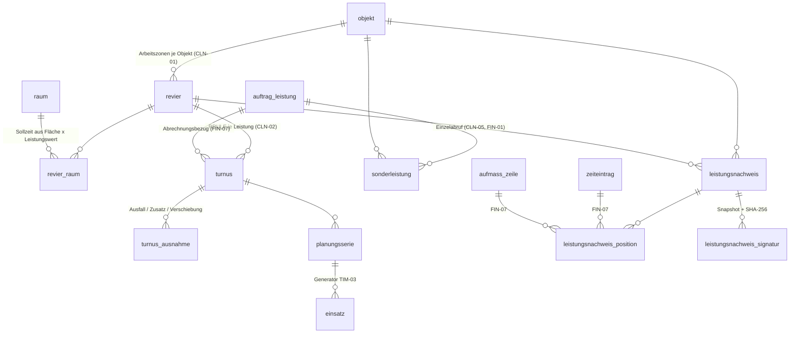
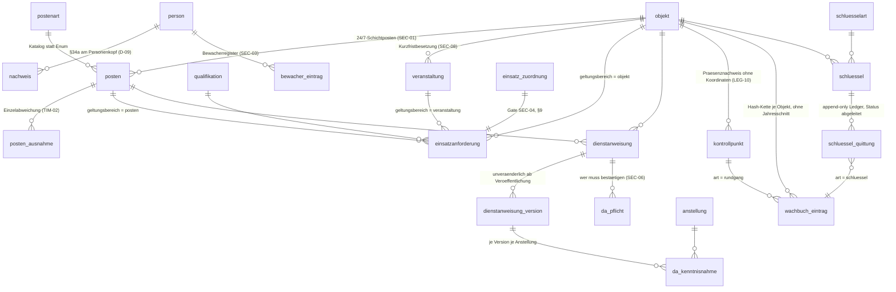
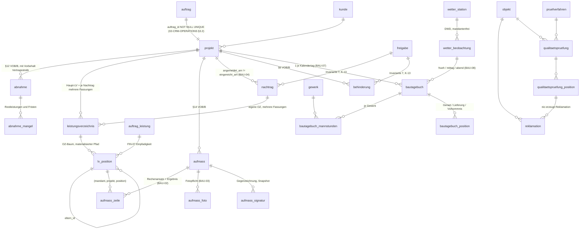

# Datenmodell — Gewerke (Reinigung, Security, Bau)

This document is the schema contract for the three trade modules of SPEC §8 — Reinigung (CLN-01..CLN-05), Security (SEC-01..SEC-08), Bau (BAU-01..BAU-08) — plus the cross-trade quality tables (OPS-11). It specifies 43 tables, their columns, keys, indexes, RLS policies, triggers and the constraints they place on neighbouring domains, so that the work that is actually performed on an object becomes an evidentiary record a customer signs, a court reads and an invoice is derived from. It is written against `00-KONVENTIONEN.md`; **where this document and a convention disagree, the convention wins and this document is wrong** — every resolution below cites the `K-id` it applies. Where SPEC and DECISIONS leave a legal, financial or tariff value open, this document states a labelled placeholder behind an interface and a `// TODO(client)`, never a plausible value (K-17).

---

## 0. Scope, files and standing

### 0.1 Tables this document owns

| Group | Tables | Count |
|---|---|---|
| Reinigung | `revier` · `revier_raum` · `turnus` · `turnus_ausnahme` · `sonderleistung` · `leistungsnachweis` · `leistungsnachweis_position` · `leistungsnachweis_signatur` | 8 |
| Security | `postenart` · `posten` · `posten_ausnahme` · `einsatzanforderung` · `veranstaltung` · `dienstanweisung` · `dienstanweisung_version` · `da_pflicht` · `da_kenntnisnahme` · `kontrollpunkt` · `wachbuch_eintrag` · `schluesselart` · `schluessel` · `schluessel_quittung` | 14 |
| Bau | `projekt` · `abnahme` · `abnahme_mangel` · `leistungsverzeichnis` · `lv_position` · `aufmass` · `aufmass_zeile` · `aufmass_foto` · `aufmass_signatur` · `nachtrag` · `behinderung` · `bautagebuch` · `bautagebuch_mannstunden` · `bautagebuch_position` · `gewerk` · `wetter_station` · `wetter_beobachtung` | 17 |
| Qualität | `pruefverfahren` · `reklamation` · `qualitaetspruefung` · `qualitaetspruefung_position` | 4 |

Schema file: `src/server/db/schema/gewerke.ts` (`01-ORDNERSTRUKTUR.md` §4.9). Three tables that document names in `zeit.ts` are specified **here** because their subject matter is trade quality, not scheduling: `reklamation`, `qualitaetspruefung`, `qualitaetspruefung_position` — see the cross-document note in §17. Four tables named in `01-ORDNERSTRUKTUR.md` §4.9 that the first draft omitted are added here: `sonderleistung` (CLN-05), `veranstaltung` (SEC-08), and — new against both — `einsatzanforderung`, `da_pflicht`, `abnahme`, `kontrollpunkt`, `posten_ausnahme`, each carrying the feature ID that forced it.

### 0.2 What this document does not decide

`mandant`, `benutzer`, `rolle`, `berechtigung`, `audit_log`, `person`, `anstellung`, `qualifikation`, `nachweis`, `bewacher_eintrag` belong to `01-KERN.md`. `kunde`, `objekt`, `raum`, `belagsart`, `leistungskatalog`, `angebot`, `kalkulation`, `auftrag`, `auftrag_leistung`, `dokument` belong to `02-CRM-OPERATIONS.md`. `planungsserie`, `einsatz`, `einsatz_zuordnung`, `zeiteintrag`, `checkin_token`, `medien` belong to the Dienstplan/Zeit document; `rechnung`, `rechnungsposition`, `nummernkreis` to the finance document; `freigabe`, `freigabe_snapshot`, `agent_aufgabe` to the approval and agent documents (K-13); `referenz` to the website document; `feiertag` to the shared reference schema. §2 states every column and constraint this domain **requires** of them — those shapes are binding on the sibling document, exactly as `02-CRM-OPERATIONS.md` §3.2 is binding on this one.

### 0.3 Identifier language

Domain identifiers are German because they carry legal meaning under VOB/B, GoBD, GewO and UStG: `revier · turnus · leistungsnachweis · posten · dienstanweisung · wachbuch · schluessel · aufmass · nachtrag · behinderung · bautagebuch · reklamation`. Infrastructure identifiers are English: `withTenant`, `hashChain`, `assertQualifikation`. UI copy is German; worker-facing catalogue labels additionally carry `bezeichnung_i18n` in de/en/ar/tr (EMP-12, `01-KERN.md` §4).

---

## 1. Conventions applied in this domain

### 1.1 Types (invariant 1, invariant 2, K-16)

| Concept | Type | Reason |
|---|---|---|
| Money | `bigint`, column suffix `_cent` | Invariant 1. Never `numeric`, never `float`. **No product of two stored columns is ever stored** — §10.3 |
| Quantities (m², m, Stk, t, m³) | `numeric(12,3)` | K-16: a quantity is not money. The scale is unit-dependent and VOB/ATV rounding is per Leistungsposition. BAU-02's worked example lands on `30.870` |
| Hours, Mannstunden, Sollzeiten | `numeric(8,2)` | 2 decimals = 36 s granularity. **One type for the concept everywhere**, so the OPS-07 costing engine never rounds twice between two carriers of the same number |
| Percentages | `numeric(5,2)` | 0.00–100.00 |
| Coordinates | `numeric(9,6)` | ~11 cm; never `float`. Matches `objekt.geo_lat` / `geo_lon` (`02-CRM-OPERATIONS.md` §4.2) |
| Instants | `timestamptz`, stored UTC, displayed `Europe/Berlin` | Invariant 2 |
| Durations | `integer` with the unit in the name — `dauer_minuten`, `zeitabweichung_sek` | K-16 |
| Calendar dates (Messdatum, Bautagebuchtag, Gültigkeit) | `date` | They are Berlin calendar dates, not instants (K-11) |
| Wall-clock recurrence anchors | `timestamp` (naive) + `zeitzone text` | Documented exception, §10.1 |
| Free text | `text`, never `varchar(n)` | — |
| Structured evidence, snapshots, raw payloads | `jsonb` | — |
| PK | `uuid primary key default gen_random_uuid()` | K-16. One exception: `wetter_station.id text` (§7.16) |

`einheit text not null`, validated in Zod against the shared `EINHEITEN` constant (`02-CRM-OPERATIONS.md` §0.11) — deliberately not an enum, because a GAEB import legitimately brings units the list does not contain and an import must not fail on a unit string.

### 1.2 Common columns, the actor, and deletion (K-16, SEC-A9)

Every table carries `id uuid primary key default gen_random_uuid()` and `erstellt_am timestamptz not null default now()`; mutable tables add `geaendert_am timestamptz`. Tenant tables add `mandant_id uuid not null references mandant(id)` and declare `unique (mandant_id, id)` (K-16).

**Accountability is four columns, not one (review: MISSING, SEC-A9).** SEC-A9 requires the actor to be *human / agent / system*, and `erstellt_von uuid references benutzer(id)` with the convention "NULL = system" puts a cron job, an AI agent and a guard writing a Wachbuch entry in the same bucket. This domain therefore uses the `akteur_art` enum owned by `01-KERN.md` §4:

```sql
erstellt_von_art        akteur_art  not null default 'mensch',   -- mensch | agent | system
erstellt_von            uuid        null references benutzer(id),
erstellt_von_person_id  uuid        null references person(id),  -- the human behind the login (D-09)
erstellt_von_agent_id   uuid        null,                        -- agent_aufgabe.id, boundary ref §2.2
geaendert_am            timestamptz null,
geaendert_von_art       akteur_art  null,
geaendert_von           uuid        null references benutzer(id),
constraint akteur_stimmig check (
      (erstellt_von_art = 'mensch' and erstellt_von is not null and erstellt_von_agent_id is null)
   or (erstellt_von_art = 'agent'  and erstellt_von_agent_id is not null)
   or (erstellt_von_art = 'system' and erstellt_von is null and erstellt_von_agent_id is null))
```

Referred to below as the **Auditblock**. `erstellt_von_person_id` is not a second identity: per `01-KERN.md` §2 every activated worker access has a `benutzer` row and `benutzer.person_id` resolves it, so the column is a denormalised copy that makes "which human wrote this Wachbuch page" answerable without a join under a policy. Append-only tables omit `geaendert_*` and say so per table. `kern.setze_geaendert_am()` maintains `geaendert_am`; the service supplies `geaendert_von`.

**No hard deletes (invariant 8, LEG-01), stated per table and not assumed.** `kern.verhindere_loeschung()` — the `BEFORE DELETE` trigger of `02-CRM-OPERATIONS.md` §1.8 — is installed on **every** table in this domain, master data included. It raises `SQLSTATE 'P0001'` with the message `Löschen ist in dieser Domäne nicht zulässig (Invariante 8, LEG-01): <tabelle>`, **not** `23514` (review, MINOR): a delete refusal is not a check violation, and error-mapping code that conflates the two shows a user "ungültige Daten" for an operation that was refused on principle.

The trigger exists **independently of RLS**, because "there is no DELETE policy" is not deletion protection: a missing policy deletes zero rows and returns success, so a service bug that deletes the wrong rows is indistinguishable from a no-op, and any connection that is not `cse_app` never consults the policy at all (review B2). Both defences are present; §12 lists the trigger per table.

### 1.3 Exactly one liveness column per row

Master data (`revier`, `turnus`, `posten`, `postenart`, `schluesselart`, `einsatzanforderung`, `dienstanweisung`, `schluessel`, `kontrollpunkt`, `projekt`, `leistungsverzeichnis`, `lv_position`, `gewerk`, `veranstaltung`, `wetter_station`) carries `archiviert_am timestamptz` + `archiviert_von uuid`. Evidentiary records (`leistungsnachweis*`, `aufmass*`, `wachbuch_eintrag`, `schluessel_quittung`, `da_kenntnisnahme`, `bautagebuch*`, `nachtrag`, `behinderung`, `abnahme*`, `sonderleistung`) carry `storniert_am`, `storniert_von`, `storno_grund text`, `ersetzt_durch_id uuid` (self FK). Correction is a new row that reverses or replaces; never an `UPDATE` of the original. No table carries both.

**Every uniqueness constraint on a soft-deletable row is partial** (`02-CRM-OPERATIONS.md` §0.5, review MINOR). `unique (objekt_id, kurzzeichen) where archiviert_am is null` — not the unconditional form. An archived Revier, Posten or Schlüssel must not permanently reserve a short code or an engraved key number: when a Schließanlage is replaced after a loss, the new keys legitimately carry the same numbers, and an unconditional unique makes the replacement unenterable.

### 1.4 Tenant consistency is a composite foreign key, not a trigger (K-16)

```sql
-- parent, on every tenant table:
unique (mandant_id, id)

-- child:
foreign key (mandant_id, revier_id) references revier (mandant_id, id)
  on delete no action on update no action
```

Every mandant-bearing FK in this domain is composite, and §12 enumerates all of them together with the parent unique each one needs. **A composite FK requires the referenced column list to be backed by a unique constraint**, which is why §2.1 states `unique (mandant_id, id)` as a requirement on every consumed table rather than assuming it (review B6): without that row in the contract, every cross-domain composite FK in §5–§8 fails at migration time and the entire "a cross-tenant child row is unrepresentable" defence does not build.

**Same tenant is not the same parent (review B14).** A composite FK on `(mandant_id, x_id)` stops a cross-tenant child; it does nothing about a child attached to the *wrong sibling inside the same tenant*, and every such path in this domain is a billing path. An `aufmass_zeile` measured in `m` booked against an `lv_position` priced in `m²`, or against the right OZ in the wrong project, produces a wrong invoice amount that is structurally invisible: the FK is valid, RLS is satisfied, the nightly recomputation job re-evaluates only the Rechenansatz and not its target, and the error survives into a `festgeschriebene` Rechnung correctable only by Storno. The grandparent key is therefore carried down and used in the key:

| Child | Key | Prevents |
|---|---|---|
| `aufmass_zeile` | `(mandant_id, projekt_id, lv_position_id) → lv_position (mandant_id, projekt_id, id)` | measuring against another project's LV |
| `aufmass_foto` | `(mandant_id, aufmass_id, aufmass_zeile_id) → aufmass_zeile (mandant_id, aufmass_id, id)` | a photo filed under the wrong Aufmaßblatt |
| `leistungsnachweis_position` | `(mandant_id, auftrag_leistung_id, zeiteintrag_id) → zeiteintrag (mandant_id, auftrag_leistung_id, id)` | billing an hour recorded on another order line (FIN-07) |
| `bautagebuch` | `(mandant_id, projekt_id, behinderung_id) → behinderung (mandant_id, projekt_id, id)` | citing another project's Behinderung as the day's cause |
| `schluessel_quittung` | `(mandant_id, objekt_id, wachbuch_eintrag_id) → wachbuch_eintrag (mandant_id, objekt_id, id)` | a key movement logged in another object's Wachbuch |
| `revier_raum` | `(mandant_id, objekt_id, raum_id) → raum (mandant_id, objekt_id, id)` | assigning a room of another object to a Revier |
| `qualitaetspruefung_position` | `(mandant_id, revier_id, revier_raum_id) → revier_raum (mandant_id, revier_id, id)` | scoring a room outside the Revier under inspection |

Unit agreement is not expressible as a foreign key, so `aufmass_zeile` carries a `BEFORE INSERT OR UPDATE` trigger `pruefe_einheit_gegen_lv()` asserting `aufmass_zeile.einheit = lv_position.einheit` whenever `lv_position_id is not null`. A mismatch raises; it is never silently converted, because the conversion factor between `m` and `m²` is not a fact the database has.

### 1.5 Database roles and FORCE RLS (K-01)

Six named roles, **none with `BYPASSRLS`**, and the application never connects as `postgres`: `cse_migrator` (DDL, CI only), `cse_definer` (owns every `SECURITY DEFINER` helper, cannot log in), `cse_app` (every authenticated request), `cse_anon` (the three K-08 pre-session functions only), `cse_checkin` (`app.checkin_verbrauchen` only), `cse_job` (cron and Edge Functions, per-job grants). Supabase's `service_role` is **forbidden at runtime** and appears in no connection string outside migrations.

```sql
alter table <t> enable row level security;
alter table <t> force  row level security;   -- K-01: the owner is not exempt
```

`FORCE` is not optional. Without it RLS does not apply to the table owner, and a migration-owned or pooled owner connection silently sees and deletes everything — which is the failure invariant 3 names when it says RLS is the second line of defence and never the only one (review B2).

Every `SECURITY DEFINER` function in §1.10 and §9 is owned by `cse_definer` and carries `SET search_path = pg_catalog, public` verbatim (K-01); an unqualified `search_path` on a definer function is a privilege-escalation vector, which is why every body below schema-qualifies `app.`, `kern.` and `public.`.

### 1.6 The standard policy set (K-03)

Applied verbatim to every tenant table in this domain and referred to below as *standard*. It is stated once here in the hoisted form `src/server/db/rls.ts` emits — `app.hat_recht` is `SECURITY DEFINER`, so the planner cannot inline it and would otherwise call it once per candidate row:

```sql
create policy t_mandant on <tabelle>
  for all to cse_app
  using      (mandant_id = app.aktiver_mandant()
              and (select app.hat_recht('<modul>.lesen', app.aktiver_mandant())))
  with check (mandant_id = app.aktiver_mandant()
              and not app.ist_readonly()
              and (select app.hat_recht('<modul>.schreiben', app.aktiver_mandant()))
              and exists (select 1 from mandant m
                           where m.id = mandant_id and m.archiviert_am is null));

create policy t_gruppe on <tabelle>
  for select to cse_app
  using (app.ist_gruppenansicht()
         and mandant_id = any (select app.rechte_mandanten('gruppe.<modul>.lesen')));
```

**This replaces the draft's `USING (mandant_id = aktiver_mandant() OR (ist_gruppenansicht() AND hat_mandant_zugriff(mandant_id)))`, which was a defect (review B1), and K-03 had already resolved it.** The old predicate granted `SELECT` on all of this domain's tables to *every* principal whose session had that mandant active. A `kunde` login read every other customer's `leistungsnachweis`, every `projekt` value and every `lv_position.einheitspreis_cent`; a `mitarbeiter` read every colleague's Wachbuch entry and every customer's commercials — breaking EMP-13, AUT-01, AUT-05 and D-09 §6. The four hand-written role branches beneath it were pure no-ops: they only widened a grant that was already total, which is the proof the widening went unnoticed. Three consequences now hold:

- **Membership alone grants nothing.** The `hat_recht` conjunct is mandatory; a policy that omits it is a defect (K-03).
- **The active mandant narrows reads.** `app.sichtbare_mandanten()` is reachable only through `t_gruppe`, i.e. only in the read-only group view.
- **Invariant 10 is enforced by Postgres.** No `INSERT`/`UPDATE`/`DELETE` policy anywhere in this domain references group scope, so a write under group scope matches no policy and the database refuses it. `withTenant` is the first line; this is the second.

Where a table needs a *narrower or wider* audience than its module right, that is expressed as a **restrictive ceiling** (§1.8), never as a third permissive policy and never as an `OR` bolted onto `t_mandant`.

### 1.7 Right keys per table

| Module | Tables | Read | Write | Group read |
|---|---|---|---|---|
| `reinigung` | `revier`, `revier_raum`, `turnus`, `turnus_ausnahme`, `sonderleistung` | `reinigung.lesen` | `reinigung.schreiben` | `gruppe.reinigung.lesen` |
| `nachweis` | `leistungsnachweis`, `leistungsnachweis_position`, `leistungsnachweis_signatur` | `nachweis.lesen` | `nachweis.schreiben` | `gruppe.nachweis.lesen` |
| `security` | `postenart`, `posten`, `posten_ausnahme`, `einsatzanforderung`, `veranstaltung`, `kontrollpunkt` | `security.lesen` | `security.schreiben` | `gruppe.security.lesen` |
| `dienstanweisung` | `dienstanweisung`, `dienstanweisung_version`, `da_pflicht`, `da_kenntnisnahme` | `dienstanweisung.lesen` | `dienstanweisung.schreiben` | — (no group read: Kenntnisnahmen are personal data) |
| `wachbuch` | `wachbuch_eintrag` | `wachbuch.lesen` | `wachbuch.schreiben` | — (no group read) |
| `schluessel` | `schluesselart`, `schluessel`, `schluessel_quittung` | `schluessel.lesen` | `schluessel.schreiben` | — (no group read) |
| `bau` | `projekt`, `abnahme`, `abnahme_mangel`, `leistungsverzeichnis`, `lv_position`, `aufmass`, `aufmass_zeile`, `aufmass_foto`, `aufmass_signatur`, `nachtrag`, `behinderung`, `bautagebuch`, `bautagebuch_mannstunden`, `bautagebuch_position`, `gewerk` | `bau.lesen` | `bau.schreiben` | `gruppe.bau.lesen` |
| `qualitaet` | `reklamation`, `qualitaetspruefung`, `qualitaetspruefung_position` | `qualitaet.lesen` | `qualitaet.schreiben` | `gruppe.qualitaet.lesen` |

`wetter_station` and `wetter_beobachtung` carry no module: they are global reference data (`01-ORDNERSTRUKTUR.md` §5.3, bucket 3).

Three allocations are load-bearing and are stated as requirements on `04-BERECHTIGUNGSMODELL.md`: the `mitarbeiter` role holds **none** of `bau`, `qualitaet`, `reinigung` write rights and none of the pricing columns of §1.9 (EMP-13); the `kunde` role holds only `nachweis.lesen`, `bau.lesen` and `qualitaet.lesen`, each further narrowed by §1.8; and `wachbuch.lesen` is **not** in the default `mitarbeiter` grant — a guard reaches their own entries through the ceiling, not through the module right.

### 1.8 Portal ceilings (K-04)

Rights decide *which module*; the ceiling decides *whose rows*. Both are needed, because a right is granted per role and a role is shared by many people. Ceilings are **restrictive**, evaluated in addition to K-03, and cannot widen anything.

```sql
-- employee ceiling, K-04 verbatim, on every table hanging off anstellung_id or person_id
create policy p_ma_ceiling on <tabelle> as restrictive for all to cse_app
  using (app.portal() <> 'mitarbeiter'
         or anstellung_id in (select id from anstellung
                              where person_id = app.aktuelle_person()));

-- customer ceiling, keyed on the customer's own kunde_id — never on a subquery over a base table
create policy p_kunde_ceiling on <tabelle> as restrictive for all to cse_app
  using (app.portal() <> 'kunde'
         or (kunde_id = app.aktueller_kunde() and <sichtbarkeitsklausel>));

-- internal-only ceiling: commercial internals are invisible to both non-internal portals
create policy p_intern_ceiling on <tabelle> as restrictive for all to cse_app
  using (app.portal() = 'intern');
```

Enumerated, not exemplified. `src/server/db/rls.ts` holds the lists and **the build fails when a table in this domain carries none of the three**:

| Ceiling | Tables | Clause |
|---|---|---|
| `p_ma_ceiling` | `da_kenntnisnahme`, `da_pflicht`, `wachbuch_eintrag`, `schluessel_quittung`, `leistungsnachweis_signatur` (when `rolle = 'auftragnehmer'`), `aufmass_signatur` (same), `qualitaetspruefung` (`pruefer_anstellung_id`) | own `anstellung_id`, widened only by `app.uebergabe_sichtbar()` for `wachbuch_eintrag` (§6.11) |
| `p_kunde_ceiling` | `leistungsnachweis` | `kunde_id = app.aktueller_kunde() and status in ('vorgelegt','signiert') and storniert_am is null` — a customer never sees a draft |
| | `leistungsnachweis_position`, `leistungsnachweis_signatur` | parent `leistungsnachweis` via the denormalised `kunde_id` |
| | `projekt`, `abnahme`, `abnahme_mangel` | `kunde_id = app.aktueller_kunde()` |
| | `reklamation`, `qualitaetspruefung`, `qualitaetspruefung_position` | `kunde_id = app.aktueller_kunde()`; `qualitaetspruefung` additionally `mit_kunde` |
| | `aufmass`, `aufmass_zeile`, `aufmass_foto`, `aufmass_signatur` | denormalised `kunde_id`, and `status <> 'entwurf'` |
| | `dienstanweisung`, `dienstanweisung_version` | never — an internal instruction is not customer-visible |
| `p_intern_ceiling` | `revier`, `revier_raum`, `turnus`, `turnus_ausnahme`, `sonderleistung`, `postenart`, `posten`, `posten_ausnahme`, `einsatzanforderung`, `veranstaltung`, `kontrollpunkt`, `schluesselart`, `schluessel`, `leistungsverzeichnis`, `lv_position`, `nachtrag`, `behinderung`, `bautagebuch`, `bautagebuch_mannstunden`, `bautagebuch_position`, `gewerk` | — |
| both `p_ma_ceiling` and a widened read | `dienstanweisung`, `dienstanweisung_version` | `app.portal() <> 'mitarbeiter' or app.ist_eingesetzt_auf_objekt(objekt_id)` — EMP-09 |

**Ceilings key on a column of the row, never on a subquery over a base table (review B16).** A subquery inside a policy is itself subject to the referenced table's RLS: the draft's `EXISTS (SELECT 1 FROM objekt o WHERE o.id = objekt_id AND o.kunde_id = aktueller_kunde())` returns no rows the moment `objekt` is correctly closed to role `kunde`, and `EXISTS (SELECT 1 FROM einsatz e WHERE …)` does the same for a `mitarbeiter` session. Both were masked by the over-broad tenant branch of the draft; the moment §1.6 fixed that, EMP-09 and the customer's view of a joint Begehung would have stopped working, and the failure would have looked like an empty list rather than an error. Hence: `qualitaetspruefung`, `reklamation`, `aufmass*` and `leistungsnachweis*` each carry their own denormalised `kunde_id` (composite FK, maintained by trigger from the parent), and the two genuinely relational predicates go through `SECURITY DEFINER` helpers (§1.10).

`app.portal()` is derived from **the role of the active membership**, not from the existence of one (K-04), and defaults to `mitarbeiter` when the GUC is unset (`01-KERN.md` §3.1) — so an unset session narrows every ceiling instead of lifting it (K-02, fail-closed).

### 1.9 Column privileges where the row is shared but a column is not (K-05)

Two places in this domain hand a readable row to a principal who must not read every column of it. K-05 forbids masking views for this purpose and prescribes column-level `GRANT`, which composes correctly with RLS:

```sql
revoke select on lv_position from cse_app;
grant  select (id, mandant_id, leistungsverzeichnis_id, projekt_id, eltern_id, oz, pfad,
               sortier_pfad, ebene, art, positionsart, kurztext, langtext, einheit,
               menge_vertrag, quelle_seite, quelle_bereich, konfidenz, gaeb_dp,
               archiviert_am, erstellt_am, geaendert_am)
       on lv_position to cse_app;          -- einheitspreis_cent, steuer_kennzeichen omitted

revoke select on leistungsnachweis_position from cse_app;
grant  select (id, mandant_id, leistungsnachweis_id, kunde_id, reihenfolge, bezeichnung,
               menge, einheit, quelle, zeiteintrag_id, aufmass_zeile_id,
               leistungskatalog_position_id, materialverbrauch_id, leistung_von, leistung_bis,
               bemerkung, erstellt_am, geaendert_am)
       on leistungsnachweis_position to cse_app;   -- einzelpreis_cent omitted
```

The price is reachable only through `app.lv_preis_lesen(p_lv_position uuid)` and `app.nachweis_preis_lesen(p_position uuid)` — `SECURITY DEFINER`, each re-checking `bau.preis_lesen` / `nachweis.preis_lesen` **and** `mandant_id = app.aktiver_mandant()`, each writing `audit_log`. The customer's own copy of a price is not read through these: it is the frozen `leistungsnachweis_signatur.snapshot` (§5.8), which is what the customer actually signed.

### 1.10 `SECURITY DEFINER` helpers owned by this domain

All live in schema `app`, are owned by `cse_definer`, carry `SET search_path = pg_catalog, public`, and are `STABLE` so the planner hoists them into a single InitPlan per statement rather than calling them per row (review, MINOR).

| Function | Returns | Guards | SPEC |
|---|---|---|---|
| `app.eigene_einsatz_objekte()` | `uuid[]` | the objects the caller's own `anstellung` rows are assigned to, in the active mandant, within the SEC-06 lookahead window | EMP-09, SEC-06 |
| `app.ist_eingesetzt_auf_objekt(p_objekt uuid)` | `boolean` | `p_objekt = any (app.eigene_einsatz_objekte())` | EMP-09 |
| `app.uebergabe_sichtbar(p_objekt uuid, p_erfasst_am timestamptz)` | `boolean` | `app.ist_eingesetzt_auf_objekt(p_objekt)` **and** `p_erfasst_am > now() - app.uebergabe_fenster()` | SEC-05, EMP-13 |
| `app.uebergabe_fenster()` | `interval` | reads `mandant_einstellung('wachbuch.uebergabe_fenster')`, **default `interval '0'`** — no handover window until the client sets one (§1.16) | SEC-05, LEG-10 |
| `app.planungsbedarf(p_von date, p_bis date)` | `setof planungsbedarf_zeile` | the generator's single read across both demand carriers — one row per `turnus` and per `posten` occurrence due in the window, with its exceptions already applied (§2.3, §10.7) | TIM-02, TIM-03, CLN-02, SEC-01 |
| `app.qualifikationsanforderung(p_einsatz uuid)` | `setof einsatzanforderung` | resolves the requirement set for one shift: Posten → Veranstaltung → Objekt → mandant baseline (§9.2) | SEC-01, SEC-04, SEC-08 |
| `app.einsatz_qualifikation_erfuellt(p_anstellung uuid, p_einsatz uuid)` | `jsonb` | the SEC-04 gate; reads `nachweis` and `bewacher_eintrag` at the person head (§9) | SEC-02, SEC-03, SEC-04, LEG-04 |
| `app.lv_preis_lesen(p_lv_position uuid)` | `bigint` | `bau.preis_lesen` + active mandant; writes `audit_log` | K-05, EMP-13 |
| `app.nachweis_preis_lesen(p_position uuid)` | `bigint` | `nachweis.preis_lesen` + active mandant; writes `audit_log` | K-05, EMP-13 |

`app.einsatz_qualifikation_erfuellt` and `app.qualifikationsanforderung` require `cse_definer` to read `nachweis`, `bewacher_eintrag`, `anstellung` and `einsatz`. `01-KERN.md` §3.5 already lists `anstellung`; **this document requires `nachweis`, `bewacher_eintrag`, `einsatz` and `einsatz_zuordnung` to be added to that registry** (cross-document note, §17).

**Inside a definer function, every precondition is an explicit predicate against the caller's session GUCs, never a call to an invoker helper** (`01-KERN.md` §3.2): a `SECURITY INVOKER` helper called from a definer function evaluates as the definer, which would silently void the precondition it was meant to enforce. §9 writes those predicates literally.

### 1.11 The server clock is the source of truth (invariant 5, TIM-08)

`DEFAULT now()` applies only when the column is omitted, so an INSERT that supplies a value writes an arbitrary timestamp — and the freeze triggers below then make the fabricated instant permanent. Two functions, and **each table names which one applies** (review B15):

```sql
-- (a) server-only: for tables with no device columns
create function kern.erzwinge_serverzeit() returns trigger …   -- 02-CRM-OPERATIONS.md §0.9
  -- BEFORE INSERT: new.<spalte> := now();  BEFORE UPDATE: raises on any change

-- (b) field capture: for tables that additionally carry geraete_zeit / zeitabweichung_sek
create function gewerke.stempel_feldzeit() returns trigger language plpgsql as $$
begin
  new.<zeit> := now();                                     -- client value discarded, always
  if new.geraete_zeit is not null then
    new.zeitabweichung_sek := extract(epoch from (new.geraete_zeit - now()))::integer;
  end if;
  return new;
end $$;
```

The draft applied one unconditional body — referencing `NEW.geraete_zeit` — to tables that have no such column. On `reklamation` that raises `record "new" has no field "geraete_zeit"` (42703) on **every** insert, so no Reklamation could be created at all; and quietly "fixing" it by dropping the device column from invariant 5's contract would leave the SLA clock of a customer-reported defect (NOT-01, CRM-03) unaudited. The mapping is therefore explicit:

| Trigger | Tables and columns |
|---|---|
| `gewerke.stempel_feldzeit()` | `leistungsnachweis_signatur.unterzeichnet_am` · `wachbuch_eintrag.erfasst_am` · `schluessel_quittung.quittiert_am` · `da_kenntnisnahme.bestaetigt_am` · `aufmass_foto.empfangen_am` · `aufmass_signatur.unterzeichnet_am` · `qualitaetspruefung.geprueft_am` |
| `kern.erzwinge_serverzeit()` | `reklamation.eingang_am` · `leistungsnachweis.vorgelegt_am` · `leistungsnachweis.gesperrt_am` · `aufmass.gesperrt_am` · `bautagebuch.abgeschlossen_am` · `bautagebuch.gegengezeichnet_am` · `abnahme.protokolliert_am` · `dienstanweisung_version.veroeffentlicht_am` · every `storniert_am` and `archiviert_am` |

Every table under (b) carries `geraete_zeit timestamptz null`, `zeitabweichung_sek integer null` **and** `nachgetragen boolean not null default false` (TIM-09, review MISSING). `zeitabweichung_sek` measures clock drift; `nachgetragen` records that the row sat in an offline queue. Conflating the two makes a signature collected at 14:00 and uploaded at 22:00 indistinguishable from one collected at 22:00, which is exactly what TIM-09 exists to prevent.

### 1.12 Calendar boundaries are Berlin wall-clock (K-11)

Instants are stored UTC; a day, a month and a billing period are **Berlin** boundaries converted to instants, never UTC midnight. `bautagebuch.datum`, `aufmass.messdatum`, `turnus_ausnahme.datum`, `leistungsnachweis.leistungszeitraum_*` and the `jahr` of the Wachbuch chain are all derived as `(<instant> at time zone 'Europe/Berlin')::date`, never as `(<instant>)::date`. `splitteNachMonat` and `berlinTag` live in `src/server/services/zeit/` and every reference test carries a CET case **and** a CEST case, so a UTC implementation cannot pass by accident (K-11).

### 1.13 No volatile or stable function in a `CHECK` or in an index predicate

`current_date`, `now()` and `current_timestamp` are `STABLE`, not `IMMUTABLE`. A `CHECK` containing one changes its truth value under a row that never changes, which makes every later `UPDATE` fail and aborts a `pg_dump`/restore (SEC-A10). **The same rule applies to partial-index predicates, and PostgreSQL enforces it outright:** the draft's `create index turnus_generator_idx … where archiviert_am is null and (gueltig_bis is null or gueltig_bis >= current_date)` is rejected with *"functions in index predicate must be marked IMMUTABLE"*, so the migration fails and the index the TIM-03 nightly generator depends on does not exist (review B7). A predicate on "today" is also semantically wrong — the index would need rebuilding every midnight. Time-dependent rules are expressed as (a) a trigger that raises only on an illegal *transition*, (b) a `WHERE` clause in the query, (c) a scheduled job.

### 1.14 Retention, Löschsperre and the deletion concept (LEG-01, LEG-02, LEG-09, DOC-07)

The draft's answer to retention was "until the client answers: no deletion". That is the right default and the wrong schema: with no field a Löschkonzept could ever drive, answering the open question later becomes a migration across 43 tables instead of a configuration change (review, MISSING). Every evidentiary table in this domain therefore carries two columns from the first migration:

```sql
aufbewahrung_bis  date    null,                    -- computed by job:aufbewahrung from the class
loeschsperre      boolean not null default true    -- fail-closed: nothing is deletable by default
```

The class itself is **not** a column on 43 tables: it is a row in the shared `dokument_aufbewahrung` catalogue (`02-CRM-OPERATIONS.md` §4.6), extended with non-document record classes, and §11 maps every table in this domain to its class. `aufbewahrung_bis` is written by a nightly job, never by a `CHECK` (§1.13), and reaching it deletes nothing on its own — it makes a row *eligible*, and the actual erasure path is the DSGVO inventory of `01-KERN.md` §15. Two periods are stated by the SPEC and are therefore not placeholders: GoBD ten years (LEG-01) and §17 MiLoG two years (LEG-02). Everything else is `unbefristet` behind a `// TODO(client)`.

### 1.15 A signature is a snapshot, and an evidentiary book is a chain

Three patterns recur and are defined once:

1. **Signature snapshot** (`leistungsnachweis_signatur`, `aufmass_signatur`, `schluessel_quittung`, `abnahme`): `snapshot jsonb not null` freezes what stood on the screen — positions, prices, header data, display texts and the display time zone — plus `snapshot_hash text not null check (snapshot_hash ~ '^[0-9a-f]{64}$')` over its canonical JSON. The rendered PDF is produced **from the snapshot**, never from live master data (the K-12 rule for invoices, applied here for the same reason).
2. **Hash chain** (`wachbuch_eintrag`): `hash = sha256(canonical_payload ‖ vorheriger_hash)` with the payload field list enumerated in §6.11 and a nightly verification job, the FIN-06 construction.
3. **Approval chain** (`behinderung`, `nachtrag`): **not** re-implemented here. K-13 fixes the approval record as `freigabe` + `freigabe_snapshot` with `kette_nr` assigned under `SELECT … FOR UPDATE` and `pruefdauer_sek` measured server-side; this domain stores only `freigabe_id` plus the denormalised `freigegeben_am` / `freigegeben_von` (the `02-CRM-OPERATIONS.md` §3.2 pattern for `angebot.freigabe_id`).

### 1.16 Placeholder marking (K-17)

Any row carrying a value the client has not confirmed sets `ist_platzhalter boolean not null default true`, and every screen consuming such a row renders the DESIGN §5 `warning` pill "Unbestätigter Wert". Tables carrying it: `postenart`, `schluesselart`, `gewerk`, `einsatzanforderung`, `qualitaetspruefung`. A placeholder enum value is marked **PLACEHOLDER** in §3 and carries a `// TODO(client)`; `pnpm lint:todo` fails when a `// TODO(client)` in this domain has no matching row in `DECISIONS.md` § Open. Values the client is likely to edit are **catalogue tables**, not enums, so changing one needs no migration — which is why `postenart` and `schluesselart` are tables in this final version and single-value placeholder enums in the draft (review, MINOR: the draft argued exactly this for `gewerk` and then chose the opposite for the other two).

Configurable operational values that are neither legal facts nor tariff values live in `mandant_einstellung(schluessel, wert jsonb)`, read through `app.einstellung(schluessel)`; §16 lists each with its default. The handover window of §1.10 is the first of them, and its default is zero.

---

## 2. Cross-domain contract

### 2.1 Tables this domain consumes, and the constraints they must declare

Every row is a requirement on the owning document. **`unique (mandant_id, id)` is listed explicitly on every tenant table**, because Postgres refuses a foreign key whose referenced column list is not backed by a unique constraint, and without these rows every composite FK in §5–§8 fails at migration time (review B6).

| Table | Owner | Required constraints | Required columns this domain reads | SPEC |
|---|---|---|---|---|
| `mandant` | KERN | — | `id`, `archiviert_am`, `module` | TEN-01, TEN-08 |
| `benutzer` | KERN | — | `id`, `person_id` | AUT-01, SEC-A9 |
| `person` | KERN | — | `id`, `sprache` | D-09, EMP-12 |
| `anstellung` | KERN | `unique (mandant_id, id)`, **`unique (id, person_id)`** | `id`, `person_id`, `mandant_id`, `status`, `eintritt`, `austritt` | D-09, §10.5 |
| `qualifikation` | KERN | `unique nulls not distinct (mandant_id, schluessel)` | `id`, `mandant_id` (**nullable — NULL = platform-wide**), `schluessel`, `bezeichnung`, `bezeichnung_i18n`, `blockiert_einsatz`, `warnung_tage`, `archiviert_am` | SEC-01, SEC-02, LEG-04 |
| `nachweis` | KERN | — | `person_id`, `qualifikation_id`, `gueltig_ab date`, `gueltig_bis date null`, `status nachweis_status`, `widerrufen_am` | SEC-02, SEC-04 |
| `bewacher_eintrag` | KERN | `unique (bewacher_id)`, `unique (person_id) where erloschen_am is null` | `person_id`, `bewacher_id`, `status bewacher_status`, `gueltig_bis`, `erloschen_am` | **SEC-03**, SEC-04, LEG-04 |
| `kunde` | CRM-OPS | `unique (mandant_id, id)` | `id`, `name`, `typ` | AUT-01, CRM-06 |
| `objekt` | CRM-OPS | `unique (mandant_id, id)`, **`unique (mandant_id, objekt_id → id)` reachable as `(mandant_id, id)`** | `kunde_id` (**nullable**), `geo_lat`, `geo_lon`, `archiviert_am` | OPS-01, OPS-02, BAU-08 |
| `raum` | CRM-OPS | `unique (mandant_id, id)`, **`unique (mandant_id, objekt_id, id)`** | `objekt_id`, `flaeche_qm`, `fenster_flaeche_qm`, `belagsart_id`, `reinigungsklasse_id` | OPS-02, CLN-01, CLN-05 |
| `belagsart` | CRM-OPS | `unique (mandant_id, id)` | `leistungswert_qm_pro_stunde`, `gueltig_ab`, `gueltig_bis`, `ist_platzhalter` | OPS-03, OPS-07 |
| `leistungskatalog_position` | CRM-OPS | `unique (mandant_id, id)` | `id`, `bezeichnung`, `einheit`, `zeitwert`, `erloeskonto_schluessel` | OPS-06, CLN-05 |
| `auftrag` | CRM-OPS | `unique (mandant_id, id)` | `id`, `kunde_id`, `status`, `freigabe_id` | OPS-05, OPS-09 |
| `auftrag_leistung` | CRM-OPS | `unique (mandant_id, id)`, **`unique (mandant_id, auftrag_id, id)`** | `id`, `auftrag_id`, `leistungskatalog_position_id`, `abrechnungsart`, `steuer_kennzeichen`, `gueltig_ab`, `gueltig_bis` | FIN-01, FIN-07 |
| `dokument` | CRM-OPS | `unique (mandant_id, id)` | `id`, `kategorie`, `sichtbar_fuer_kunde` | DOC-01, DOC-03 |
| `einsatz` | Zeit | `unique (mandant_id, id)`, **`unique (mandant_id, objekt_id, id)`** | `id`, `mandant_id`, `objekt_id`, `posten_id`, `revier_id`, `turnus_id`, `projekt_id`, `veranstaltung_id`, `auftrag_leistung_id`, `beginn_zeitpunkt`, `ende_zeitpunkt` (all trade FKs nullable, all composite on `(mandant_id, …)`) | TIM-01..TIM-05 |
| `einsatz_zuordnung` | Zeit | `unique (mandant_id, id)` | `id`, `einsatz_id`, `anstellung_id`, `beginn_zeitpunkt`, `ende_zeitpunkt`, **`qualifikation_geprueft_am timestamptz`**, **`qualifikation_snapshot jsonb`**, `abgesagt_am` | TIM-04, SEC-04, §9 |
| `zeiteintrag` | Zeit | `unique (mandant_id, id)`, **`unique (mandant_id, auftrag_leistung_id, id)`** | `id`, `anstellung_id`, `auftrag_leistung_id`, `revier_id`, `posten_id`, `projekt_id`, `beginn_zeitpunkt`, `ende_zeitpunkt` | TIM-12, FIN-07, FIN-18 |
| `planungsserie` | Zeit | `unique (mandant_id, id)` | `turnus_id`, `posten_id`, `veranstaltung_id` (all nullable) — the generator's execution record over this domain's two demand carriers (§2.3) | TIM-02, TIM-03 |
| `medien` | Zeit | `unique (mandant_id, id)` | `bezug_tabelle text`, `bezug_id uuid`, `mandant_id`, `mime`, EXIF stripped on ingest, private bucket + signed URL only | TIM-10, DOC-03, DOC-06 |
| `nummernkreis` | Finanzen | `unique (mandant_id, kreis_typ, kontext_id, jahr)` | `naechste_nummer bigint` lockable with `SELECT … FOR UPDATE`, plus `letzter_hash text` | FIN-03, SEC-05 |
| `steuersatz` / `steuer_kennzeichen` | Finanzen | — | the enum `steuer_kennzeichen` of `02-CRM-OPERATIONS.md` §2 is what `lv_position` carries; **there is no separate `steuersatz` table** — the draft's `lv_position.steuersatz_id` is corrected to `steuer_kennzeichen` | FIN-09, invariant 1 |
| `freigabe` · `freigabe_snapshot` | Freigaben | `unique (mandant_id, id)` | `id`, `status`, `freigegeben_am`, `freigegeben_von`, `kette_nr` | APR-07, APR-08, K-13 |
| `agent_aufgabe` | Agenten | `unique (mandant_id, id)` | `id` — the `erstellt_von_agent_id` target of §1.2 | AGT-04, SEC-A9, APR-03 |
| `ausschreibung` | Radar | `unique (mandant_id, id)` | `id` — `leistungsverzeichnis.ausschreibung_id` | RAD-01, RAD-02 |
| `referenz` | Website | — | `auftrag_id` plus copied fields; **owns PRO-05 entirely** (§2.2) | PRO-05, SOC-04 |
| `feiertag` | Referenz (global) | `unique (bundesland, datum)` | `datum date`, `bundesland char(2)`, `bezeichnung`, `gesetzlich boolean` | **CLN-03** |
| `mandant_einstellung` | KERN | `unique (mandant_id, schluessel)` | `wert jsonb` | §1.16 |

Three of these rows deserve their reason stated, because getting them wrong is silent:

- **`nachweis.status`.** §9 compares against the literal `'gueltig'`. That value is not invented here: `nachweis_status` is `beantragt · gueltig · abgelaufen · widerrufen · abgelehnt`, fixed by `01-KERN.md` §4. A Personal domain that renamed it `aktiv` would turn the SEC-04 gate into a universal block, so the vocabulary is part of the contract and a schema test asserts the literal resolves.
- **`qualifikation.mandant_id` is nullable**, NULL meaning platform-wide (`01-KERN.md` §6.16) — a §34a Sachkunde must be nameable in cleaning as well as in security. `einsatzanforderung.qualifikation_id` is therefore a **single-column** FK, and the cross-tenant hole the review worried about is closed by a `BEFORE INSERT OR UPDATE` trigger asserting `qualifikation.mandant_id is null or qualifikation.mandant_id = einsatzanforderung.mandant_id`.
- **`feiertag` is a real table, not a TypeScript constant.** CLN-03 ("Berlin public holidays excluded automatically") had an enum and a `feiertagsregel` column in the draft and no holiday source at all, so the generator could not honour `feiertagsregel = 'ausfall'` against data that does not exist. `feiertag` lives in the global reference bucket (`01-ORDNERSTRUKTUR.md` §5.3), is **computed and seeded** by `src/lib/datum/feiertage-berlin.ts` (movable feasts from Easter, Berlin's Internationaler Frauentag included, Fronleichnam and Reformationstag excluded — `01-ORDNERSTRUKTUR.md` §8.5), and is a table so seed data, the generator and an operational calendar screen all see the same list.

### 2.2 Boundary references leaving this domain

| Foreign table | Key into this domain | Owner / phase | SPEC | Note |
|---|---|---|---|---|
| `einsatz` | `revier_id`, `turnus_id`, `posten_id`, `veranstaltung_id`, `projekt_id`, `sonderleistung_id` | Zeit / Phase 5 | TIM-01..TIM-05 | all nullable, all composite on `(mandant_id, …)` |
| `einsatz_zuordnung` | the SEC-04 gate trigger and its two proof columns | Zeit / Phase 5 | SEC-04, LEG-04 | §9 |
| `zeiteintrag` | `revier_id`, `posten_id`, `projekt_id` | Zeit / Phase 5 | TIM-12, FIN-07 | feeds `leistungsnachweis_position` |
| `rechnung` / `rechnungsposition` | `leistungsnachweis_id`, `aufmass_id`, `lv_position_id`, `nachtrag_id` | Finanzen / Phase 6 | FIN-01, FIN-07, FIN-08 | the invoice snapshots identity and never references it (K-12) |
| `referenz` | `auftrag_id` + copied fields | Website / Phase 9 | **PRO-05** | see below |
| `freigabe` | `behinderung.freigabe_id`, `nachtrag.freigabe_id` | Freigaben / Phase 8 | APR-07, K-13, invariant 7 | |
| `materialverbrauch` | `leistungsnachweis_position.materialverbrauch_id` | **no owner yet** | FIN-07 | see below |

**PRO-05 belongs to `referenz`, and the flag is removed from `projekt` (review, MISSING).** `02-CRM-OPERATIONS.md` §3.2 already assigns PRO-05 to the website document's `referenz` table, keyed on `auftrag_id` and populated by a human who copies `titel`, `bereich`, `ort` (city only), `leistungsbeschreibung`, `freigabe_text` and released photo `dokument_id`s — never the order value, never `kunde_id`, never the address. The draft's `projekt.freigegeben_vom_kunden` / `freigabe_dokument_id` / `projekt_referenz_idx` are therefore **deleted**: they were a second, competing carrier that only Bau could ever populate, so under that schema three of the four business areas could never produce a website reference at all, while cleaning and security work — which hangs off `auftrag`/`objekt`, not `projekt` — had nowhere to record a release.

**FIN-07's fourth source has no owning table anywhere, and that gap is declared rather than papered over.** FIN-07 names *Zeiteintrag · Aufmaß · contract · material*; three of the four resolve. Material consumption is owned by no Phase 0 document. This domain adds the enum value `material` to `leistungsnachweis_quelle` and the nullable column `leistungsnachweis_position.materialverbrauch_id uuid` as a declared boundary reference with **no foreign key until an owner exists**, and records the open question (§16). Forcing a material line into `manuell` would lose exactly the trace FIN-07 requires, and inventing a `material` table here would put stock-keeping in the trade domain by accident.

### 2.3 Requirements this document places on sibling documents

1. `01-KERN.md` §3.5 — the `cse_definer` read registry gains `nachweis`, `bewacher_eintrag`, `einsatz` and `einsatz_zuordnung` (§1.10, §9).
2. `01-KERN.md` §4 — no new enum; `akteur_art`, `nachweis_status`, `bewacher_status` are imported unchanged.
3. The Dienstplan/Zeit document owns `planungsserie` and must state that it carries `turnus_id`, `posten_id` and `veranstaltung_id` (all nullable, exactly one non-null). **SPEC §22 names one recurrence entity; this domain deliberately keeps two demand carriers and no third.** `turnus` (CLN-02) and `posten` (SEC-01) are *what is contractually owed* — a cleaning frequency and a post to be manned — and they differ in every column that matters: a Turnus has a Leistung and a duration per pass, a Posten has a minimum and a target staffing level and a Dienstanweisung. `planungsserie` is the generator's *execution* record: which series, expanded how far, last run when. One shared generator reads both carriers through `app.planungsbedarf(von, bis)` and writes one `planungsserie` row per source. Collapsing the two into one table would put four always-null columns on every row and make TIM-03's eight-week bookkeeping ambiguous; duplicating the generator per trade would give the DST expansion two implementations, which is the bug K-11 exists to prevent.
4. The finance document must key `nummernkreis` on `(mandant_id, kreis_typ, kontext_id, jahr)`. This domain needs two differently-scoped counters — one per `(mandant_id)` for `leistungsnachweis.nummer` and one per `(mandant_id, objekt_id, jahr)` for `wachbuch_eintrag.laufnummer` — so a counter table designed for a handful of invoice circles will otherwise not hold them (review, MISSING).
5. `docs/DESIGN.md` must gain the status-pill labels listed in §3.4 before any trade screen renders them (CLAUDE.md: add to DESIGN.md first, then use).

---

## 3. Enums and catalogue tables

Vocabularies marked **STATED** come verbatim from the SPEC. **PLACEHOLDER** vocabularies are not stated anywhere: they are implemented so the system runs, labelled, carry a `// TODO(client)`, and changing one is a reviewed `ALTER TYPE` migration rather than an invisible data edit — that visibility is why they are enums and not free text (K-17). Where a vocabulary carries legal weight *and* the client will want to edit it in the UI, it is a **catalogue table** instead.

**Enum type names are schema-global in Postgres, so every one below is domain-prefixed** (review, MINOR). The draft's `prioritaet`, `versandart`, `empfaenger_art`, `abnahme_art`, `vertragsgrundlage`, `foto_zweck` and `wetter_quelle` are generic names other domains will need — CRM-02 has its own lead priority, and `01-KERN.md`/`02-CRM-OPERATIONS.md` already own `lead_prioritaet`. The first domain to create an unprefixed type wins and the second gets a migration conflict or an enum carrying foreign values.

### 3.1 Reinigung

```sql
-- PLACEHOLDER — CLN-03 says holidays are excluded; it does not say what happens to the round.
-- // TODO(client): Werden an Feiertagen ausgefallene Turnusse vorgezogen oder nachgeholt, oder
--                  entfallen sie ersatzlos? Falls vorgezogen/nachgeholt, kommen die Werte
--                  'vorziehen'/'nachholen' per Migration hinzu (CLN-03).
create type turnus_feiertagsregel as enum ('ausfall','unveraendert');

create type turnus_ausnahme_art        as enum ('ausfall','zusatz','verschiebung');
create type leistungsnachweis_status   as enum ('entwurf','vorgelegt','signiert','abgelehnt','storniert');

-- FIN-07 names four sources; 'material' has no owning table yet (§2.2).
create type leistungsnachweis_quelle   as enum
  ('zeiteintrag','aufmass_zeile','leistungskatalog','material','manuell');

create type unterschrift_rolle         as enum ('auftraggeber','auftragnehmer');
create type sonderleistung_status      as enum ('angefragt','beauftragt','geplant','erbracht','abgerechnet','storniert');
```

### 3.2 Security

```sql
-- STATED — SPEC SEC-05 names exactly these five entry kinds.
create type wachbuch_art as enum ('rundgang','vorkommnis','uebergabe','schluessel','alarm');

create type einsatzanforderung_bereich as enum ('posten','veranstaltung','objekt','mandant');
create type qualifikation_geltung      as enum ('jeder','mindestens_einer');
create type dienstanweisung_status     as enum ('entwurf','veroeffentlicht','archiviert');
create type kenntnisnahme_art          as enum ('portal_klick','canvas_signatur','papier_erfassung');
create type da_pflicht_quelle          as enum ('objekt_einsatz','posten','manuell');

-- B12: the ledger is the only source of truth for a key's state, so every state change is a
-- ledger event. The draft's two-value 'richtung' could not reach verloren/gesperrt/vernichtet.
create type schluessel_ereignis_art as enum
  ('ausgabe','ruecknahme','verlustmeldung','wiedergefunden','sperrung','entsperrung',
   'vernichtung','inventur');

create type schluessel_status        as enum ('im_depot','ausgegeben','verloren','gesperrt','vernichtet');
create type schluessel_empfaenger_art as enum ('mitarbeiter','kunde','fremdfirma');

-- PLACEHOLDER — LEG-10 permits a single point at check-in start and end, nothing continuous.
-- // TODO(client): Fordert ein Auftraggebervertrag einen Präsenznachweis je Rundgang, und in
--                  welcher Form (NFC-Tag, QR, Barcode)? Ohne Antwort bleibt der Katalog leer.
create type kontrollpunkt_nachweisart as enum ('nfc','qr','barcode','manuell','unbestimmt');
```

`postenart` and `schluesselart` are **catalogue tables**, not enums (review, MINOR). The draft made them single-value placeholder enums while arguing — correctly — that `gewerk` must be a table "weil die Liste keine Migration erfordern darf". The same argument applies to both: SEC-01 names no post types and SEC-07 names no key types, and when the client answers, the answer must not be a migration.

### 3.3 Bau

```sql
-- CLAUDE.md names the three trades of REALTIME Service GmbH verbatim.
create type projekt_art    as enum ('hochbau','ausbau','rueckbau');
create type projekt_status as enum ('geplant','in_arbeit','abgenommen','abgeschlossen','archiviert');

-- NOT NULL, NO DEFAULT — see §7.1. The legal regime is chosen per contract, never defaulted.
create type bau_vertragsgrundlage as enum ('vob_b','bgb');

-- §12 VOB/B distinguishes these three; the values are the statute's own structure.
create type bau_abnahme_art as enum ('foermlich','fiktiv','konkludent','teilabnahme');

create type leistungsverzeichnis_art as enum ('hauptauftrag','nachtrag','ausschreibung','eigenkalkulation');

-- GAEB DA XML hierarchy levels.
create type lv_art as enum ('los','titel','untertitel','position','hinweistext');

-- Values from GAEB DA XML. PLACEHOLDER as to their commercial effect.
-- // TODO(client): Welche dieser Positionsarten kommen vor, und wie geht jede in die Angebots-
--                  bzw. Auftragssumme ein? Bedarfs- und Alternativpositionen zählen üblicherweise
--                  NICHT — bis zur Antwort rechnet keine Summenfunktion sie ein und die UI zeigt
--                  sie mit der Pille „Unbestätigter Wert".
create type lv_positionsart as enum
  ('unbestimmt','normalposition','bedarfsposition','alternativposition',
   'zuschlagsposition','grundposition');

create type aufmass_erhebungsart as enum ('gemeinsam','einseitig');   -- §14 VOB/B

-- B10: 'einseitig_festgestellt' is a distinct terminal state. A contractor's own signature must
-- never produce a record that says the Auftraggeber countersigned.
create type aufmass_status as enum
  ('entwurf','vorgelegt','gegengezeichnet','einseitig_festgestellt','abgelehnt','storniert');

create type aufmass_foto_zweck as enum ('nachweis','uebersicht','detail');

-- The values are the structure of the statute (VOB/B §1/§2, BGB §650b), not an invented rule.
create type nachtrag_grundlage as enum
  ('p1_abs_3','p1_abs_4','p2_abs_3','p2_abs_4','p2_abs_5','p2_abs_6','p2_abs_7','p2_abs_8','bgb_650b');

create type nachtrag_status   as enum
  ('angemeldet','kalkuliert','eingereicht','beauftragt','abgelehnt','zurueckgezogen');
create type nachtrag_anordnung_form as enum ('schriftlich','muendlich','e_mail','unbekannt');

create type behinderung_grund   as enum ('risikobereich_ag','streik_aussperrung','hoehere_gewalt'); -- §6 Abs.2 VOB/B
create type behinderung_status  as enum ('entwurf','freigegeben','angezeigt','weggefallen','abgeschlossen');
create type behinderung_versandart as enum
  ('e_mail','brief','einschreiben','bote','bauleiterprotokoll','portal');

create type bautagebuch_status       as enum ('entwurf','abgeschlossen','gegengezeichnet');
-- STATED — BAU-07 names equipment, deliveries and incidents.
create type bautagebuch_position_art as enum ('geraet','lieferung','vorkommnis');
create type mannstunden_herkunft     as enum ('eigen','nachunternehmer');

-- Split, because the draft reused one type for three unrelated concepts and a station with
-- quelle = 'keine' is meaningless (review, MINOR).
create type bautagebuch_wetter_quelle as enum ('dwd','manuell','keine');
create type messwert_quelle           as enum ('dwd','manuell');
```

### 3.4 Qualität

```sql
create type reklamation_quelle     as enum ('kunde','eigenkontrolle','qualitaetspruefung','mitarbeiter');
create type reklamation_status     as enum ('offen','in_arbeit','behoben','abgelehnt','geschlossen');

-- PLACEHOLDER — the ladder exists so the UI can sort; it steers nothing until the SLA is known.
-- // TODO(client): Welche Reaktions- und Behebungsfrist gilt je Priorität (Vertrags-SLA je
--                  Auftrag oder je Gesellschaft)? Bis zur Antwort setzt kein Job faellig_am.
create type reklamation_prioritaet as enum ('niedrig','mittel','hoch');

create type pruefergebnis as enum ('io','nio','nicht_pruefbar');
```

`qualitaetspruefung.verfahren` is a **catalogue table** (`pruefverfahren`), not the draft's single-value placeholder enum, for the same reason as `postenart`. `// TODO(client): Welches Prüfverfahren wird verwendet — DIN 13549 Annahmestichprobe, eigene Checkliste oder Kundenprotokoll —, und welcher Erfüllungsgrad gilt als bestanden?` Until the answer arrives the catalogue ships with one row `unbestimmt` marked `ist_platzhalter = true`, `bestanden` stays NULL, and no screen renders a pass/fail badge.

### 3.5 DESIGN §5 status-pill mapping

DESIGN §5 fixes five pill classes and the German labels belonging to each. Most values below have no label in that list, so this table is both the mapping and the change request on `docs/DESIGN.md` (§2.3, item 5):

| Enum value | Pill | Label | In DESIGN §5 today |
|---|---|---|---|
| `leistungsnachweis_status.entwurf` · `vorgelegt` · `signiert` · `abgelehnt` · `storniert` | info · warning · success · danger · muted | Entwurf · Wartet · Signiert · Abgelehnt · Storniert | Entwurf, Wartet, Abgelehnt yes; **Signiert, Storniert — add** |
| `aufmass_status.gegengezeichnet` · `einseitig_festgestellt` | success · warning | Gegengezeichnet · Einseitig festgestellt | **both — add** |
| `nachtrag_status.angemeldet` · `kalkuliert` · `eingereicht` · `beauftragt` | info · info · warning · success | Angemeldet · Kalkuliert · Eingereicht · Beauftragt | **all four — add** |
| `behinderung_status.angezeigt` · `weggefallen` | warning · muted | Angezeigt · Weggefallen | **both — add** |
| `projekt_status.abgenommen` | success | Abgenommen | **add** |
| `bautagebuch_status.abgeschlossen` · `gegengezeichnet` | muted · success | Abgeschlossen · Gegengezeichnet | Abgeschlossen yes; **Gegengezeichnet — add** |
| `reklamation_status.offen` · `in_arbeit` · `behoben` · `geschlossen` | warning · success · success · muted | Offen · In Arbeit · Behoben · Geschlossen | Offen, In Arbeit yes; **Behoben, Geschlossen — add** |
| `schluessel_status.verloren` · `gesperrt` | danger · danger | Verloren · Gesperrt | **both — add** |
| `ist_platzhalter = true` (any row) | warning | Unbestätigter Wert | **add** (already requested by `02-CRM-OPERATIONS.md`) |

---

## 4. Entity–relationship







---

## 5. Reinigung

Every table below carries the common columns of §1.2, `ENABLE`/`FORCE ROW LEVEL SECURITY` (K-01), `kern.verhindere_loeschung()`, `unique (mandant_id, id)` if it is tenant-scoped, the *standard* policy set of §1.6 with the module named in §1.7, and the ceiling of §1.8. Only deviations are restated per table.

### 5.1 revier

A Revier is a work zone inside an object — the area one cleaner works through in one pass, with a stored target time. It is the unit CLN-01 prices and the unit the Dienstplan schedules against.

| Column | Type | Null | Default | Notes |
|---|---|---|---|---|
| id | uuid | no | `gen_random_uuid()` | PK; `unique (mandant_id, id)` |
| mandant_id | uuid | no | — | FK → `mandant.id` |
| objekt_id | uuid | no | — | composite FK `(mandant_id, objekt_id)` |
| bezeichnung | text | no | — | `check (btrim(bezeichnung) <> '')` |
| kurzzeichen | text | yes | — | Revierkürzel on plans |
| beschreibung | text | yes | — | |
| sollzeit_minuten | numeric(8,2) | no | — | CLN-01 target minutes per pass; `check (sollzeit_minuten > 0)`. **`numeric(8,2)`, not `integer`** (review, MINOR): `revier_raum.sollzeit_minuten` is the same concept and the OPS-07 engine must not round twice between the two carriers |
| verantwortlich_anstellung_id | uuid | yes | — | Objektleiter; composite FK `(mandant_id, verantwortlich_anstellung_id)` |
| auftrag_leistung_id | uuid | yes | — | composite FK; billing anchor (FIN-07) |
| aktiv_ab | date | no | — | contractual start of the zone |
| aktiv_bis | date | yes | — | `check (aktiv_bis is null or aktiv_bis >= aktiv_ab)` — inclusive (§1.1) |
| sortierung | smallint | no | `0` | display order |
| archiviert_am · archiviert_von | timestamptz / uuid | yes | — | §1.3 |
| *Auditblock* | | | | §1.2 |

- **Indexes:** `revier_objekt_idx on (mandant_id, objekt_id, sortierung) where archiviert_am is null` — "all active Reviere of an object", the object detail screen and the TIM-03 generator. `revier_bezeichnung_uk unique (objekt_id, lower(bezeichnung)) where archiviert_am is null`. `revier_kurzzeichen_uk unique (objekt_id, kurzzeichen) where archiviert_am is null and kurzzeichen is not null` — **partial** (§1.3), so an archived Revier does not permanently reserve a short code. `revier_auftrag_idx on (mandant_id, auftrag_leistung_id) where auftrag_leistung_id is not null`.
- **RLS:** standard, module `reinigung`; `p_intern_ceiling`.
- **Constraints/triggers:** `kern.setze_geaendert_am()`, `kern.verhindere_loeschung()`. Deletion additionally fails on the `ON DELETE NO ACTION` FKs from `revier_raum` and `turnus`, so it fails twice (§1.2).
- **SPEC:** CLN-01, OPS-02, OPS-07, TEN-03.

### 5.2 revier_raum

The assignment of a Raumbuch room to a Revier, with the target time derived from area and Leistungswert and the walking order — the join that turns OPS-02 data into a CLN-01 workload.

| Column | Type | Null | Default | Notes |
|---|---|---|---|---|
| id | uuid | no | `gen_random_uuid()` | PK; **`unique (mandant_id, id)`** and `unique (mandant_id, revier_id, id)` — both are needed as FK targets (§1.4; review, MINOR: the draft omitted them and the FK from `qualitaetspruefung_position` would not compile) |
| mandant_id | uuid | no | — | |
| revier_id | uuid | no | — | composite FK `(mandant_id, revier_id)` |
| objekt_id | uuid | no | — | denormalised, so the room FK can be object-scoped |
| raum_id | uuid | no | — | composite FK `(mandant_id, objekt_id, raum_id)` → `raum (mandant_id, objekt_id, id)` (§1.4) |
| reihenfolge | smallint | no | `0` | walking order |
| sollzeit_minuten | numeric(8,2) | yes | — | written by the costing service (OPS-07), never computed by the database |
| leistungswert_qm_pro_stunde | numeric(10,3) | yes | — | **snapshot** of the Belagsart value at costing time (OPS-03) |
| flaeche_qm | numeric(12,3) | yes | — | snapshot of the room area at costing time |
| fenster_flaeche_qm | numeric(12,3) | yes | — | snapshot; CLN-05 prices glass on glass area |
| bemerkung | text | yes | — | |
| *Auditblock* | | | | §1.2 |

- **Indexes:** `revier_raum_uk unique (revier_id, raum_id)` · `revier_raum_raum_idx on (mandant_id, raum_id)` — "which Reviere contain this room" (Raumbuch detail, double-assignment check) · `revier_raum_reihenfolge_idx on (revier_id, reihenfolge)` — the walking list for the app.
- **RLS:** standard, module `reinigung`; `p_intern_ceiling`.
- **Constraints/triggers:** `kern.setze_geaendert_am()`, `kern.verhindere_loeschung()`. The snapshot columns are **never** refreshed automatically: when a Leistungswert changes in the catalogue the costed target time stays reproducible until the costing service rewrites it, which is the same reason `belagsart` is time-versioned rather than mutable.
- **SPEC:** CLN-01, CLN-05, OPS-02, OPS-03, OPS-07.

### 5.3 turnus

The cleaning cycle: which service is performed in which Revier under which recurrence rule — Unterhaltsreinigung three times a week, Glasreinigung quarterly, Sonderreinigung on call.

| Column | Type | Null | Default | Notes |
|---|---|---|---|---|
| id | uuid | no | `gen_random_uuid()` | PK; `unique (mandant_id, id)` |
| mandant_id | uuid | no | — | |
| revier_id | uuid | no | — | composite FK |
| leistungskatalog_position_id | uuid | no | — | composite FK — Glas, Sonderreinigung and Warenräumung are catalogue rows, not an enum (CLN-05) |
| auftrag_leistung_id | uuid | yes | — | composite FK; billing anchor (FIN-01, FIN-07). **`auftrag_leistung_id`, not `auftrag_id`** — `02-CRM-OPERATIONS.md` §3.2 |
| bezeichnung | text | no | — | |
| rrule | text | no | — | **RFC 5545 RRULE without DTSTART/TZID**, e.g. `FREQ=WEEKLY;BYDAY=MO,WE,FR` (CLN-02) |
| dtstart_lokal | timestamp | no | — | wall-clock anchor, **without** time zone — §10.1 |
| zeitzone | text | no | `'Europe/Berlin'` | IANA zone; `check (zeitzone <> '')` |
| dauer_minuten | integer | no | — | RFC 5545 DURATION rather than DTEND; `check (dauer_minuten > 0)` |
| feiertagsregel | turnus_feiertagsregel | no | `'ausfall'` | CLN-03; resolved against the `feiertag` table (§2.1) |
| gueltig_ab | date | no | — | |
| gueltig_bis | date | yes | — | inclusive; `check (gueltig_bis is null or gueltig_bis >= gueltig_ab)` |
| letzte_generierung_bis | date | yes | — | generator bookkeeping (TIM-03, eight weeks) |
| archiviert_am · archiviert_von | timestamptz / uuid | yes | — | §1.3 |
| *Auditblock* | | | | §1.2 |

- **Indexes:** `turnus_generator_idx on (mandant_id, letzte_generierung_bis) where archiviert_am is null` — **the `current_date` conjunct is removed** (review B7, §1.13); the generator applies `gueltig_bis is null or gueltig_bis >= :heute` in its own `WHERE`, where a moving boundary belongs. `turnus_revier_idx on (mandant_id, revier_id) where archiviert_am is null` · `turnus_leistung_idx on (mandant_id, leistungskatalog_position_id)` — "where is glass cleaning performed" (CLN-05).
- **RLS:** standard, module `reinigung`; `p_intern_ceiling`.
- **Constraints/triggers:** `check (rrule !~ 'DTSTART' and rrule !~ 'TZID' and rrule !~ 'RRULE:')` — anchors belong in their own columns. **The draft's shape regex `^FREQ=(DAILY|WEEKLY|MONTHLY|YEARLY)(;[A-Z]+=[^;]+)*$` is removed** (review, MINOR): RFC 5545 does not fix part order, so the regex rejects valid rules such as `BYDAY=MO;FREQ=WEEKLY` while the document already states that full validation lives in a tested RFC-5545 parser — a false-negative risk for no gain. `kern.setze_geaendert_am()`, `kern.verhindere_loeschung()`.
- **SPEC:** CLN-02, CLN-03, CLN-05, TIM-02, TIM-03, OPS-06, FIN-07.

### 5.4 turnus_ausnahme

The documented deviation from a cycle on one concrete day — cancellation, extra visit or postponement, each with a reason and an author.

| Column | Type | Null | Default | Notes |
|---|---|---|---|---|
| id | uuid | no | `gen_random_uuid()` | PK; `unique (mandant_id, id)` |
| mandant_id | uuid | no | — | |
| turnus_id | uuid | no | — | composite FK |
| datum | date | no | — | the affected **Berlin** calendar day of the occurrence (K-11) |
| art | turnus_ausnahme_art | no | — | |
| ersatz_beginn_lokal | timestamp | yes | — | only for `verschiebung`; `check (art <> 'verschiebung' or ersatz_beginn_lokal is not null)` |
| dauer_minuten | integer | yes | — | only for `zusatz`/`verschiebung`; otherwise the occurrence inherits the cycle duration |
| grund | text | no | — | `check (btrim(grund) <> '')` — an EXDATE without a reason is worthless |
| abrechnungsrelevant | boolean | yes | — | `// TODO(client): Wird ein ausgefallener Turnus bei Monatspauschale gutgeschrieben, und mit welchem Betrag?` (FIN-01) — NULL until answered; no job derives a credit from it |
| *Auditblock* | | | | §1.2 |

- **Indexes:** `turnus_ausnahme_uk unique (turnus_id, datum) where art in ('ausfall','verschiebung')` — **narrowed** (review, MINOR): the draft's `unique (turnus_id, datum, art)` still allowed only one `zusatz` per day, and two extra cleanings on one day (morning and evening special) are ordinary in Unterhaltsreinigung. A day can be cancelled once and moved once; extras are unbounded. `turnus_ausnahme_datum_idx on (mandant_id, datum)` — the generator reads all exceptions of the window in one pass.
- **RLS:** standard, module `reinigung`; `p_intern_ceiling`.
- **Constraints/triggers:** `kern.setze_geaendert_am()`, `kern.verhindere_loeschung()`. The generator converts exceptions to EXDATE/RDATE in the serialised VEVENT representation, so the combination stays exportable as RFC 5545.
- **SPEC:** CLN-02, CLN-03, TIM-02, FIN-01.

### 5.5 sonderleistung

A one-off ordered service — Sonderreinigung, Warenräumung, Grundreinigung after a handover — that is not a recurring cycle and is billed as `einzelabruf`. Named in `01-ORDNERSTRUKTUR.md` §4.9 and missing from the draft, where a call-off had nowhere to live between the offer and the Leistungsnachweis.

| Column | Type | Null | Default | Notes |
|---|---|---|---|---|
| id | uuid | no | `gen_random_uuid()` | PK; `unique (mandant_id, id)` |
| mandant_id | uuid | no | — | |
| objekt_id | uuid | no | — | composite FK |
| revier_id | uuid | yes | — | composite FK, where the call-off is zone-bound |
| auftrag_leistung_id | uuid | yes | — | composite FK; the billing anchor (FIN-01 `einzelabruf`, FIN-07) |
| leistungskatalog_position_id | uuid | no | — | composite FK — CLN-05 |
| kunde_id | uuid | no | — | composite FK; denormalised for the customer ceiling (§1.8) |
| bezeichnung | text | no | — | |
| beauftragt_am | date | no | — | when the customer called it off |
| beauftragt_durch | text | yes | — | who called it off, on the customer side |
| ausfuehrung_von · ausfuehrung_bis | date | yes | — | `check (ausfuehrung_bis is null or ausfuehrung_von is null or ausfuehrung_bis >= ausfuehrung_von)` |
| menge | numeric(12,3) | yes | — | quantity, not money |
| einheit | text | yes | — | `check ((menge is null) = (einheit is null))` |
| status | sonderleistung_status | no | `'angefragt'` | |
| leistungsnachweis_id | uuid | yes | — | composite FK; set when the proof is raised |
| storniert_am · storniert_von · storno_grund · ersetzt_durch_id | | yes | — | §1.3 |
| *Auditblock* | | | | §1.2 |

- **Indexes:** `sonderleistung_objekt_idx on (mandant_id, objekt_id, beauftragt_am desc)` · `sonderleistung_offen_idx on (mandant_id, status, ausfuehrung_von) where status in ('beauftragt','geplant')` — the work list · `sonderleistung_abrechnung_idx on (mandant_id, auftrag_leistung_id) where status = 'erbracht'` — FIN-18 "completed, not yet invoiced".
- **RLS:** standard, module `reinigung`; `p_intern_ceiling`. Deliberately **not** customer-visible as a row: the customer sees the resulting `leistungsnachweis`, which is the document they signed.
- **Constraints/triggers:** `kern.setze_geaendert_am()`, `kern.verhindere_loeschung()`. **No price column**: a call-off is priced through `auftrag_leistung` and the costing service, never on the work record (§10.3).
- **SPEC:** CLN-05, FIN-01, FIN-07, OPS-05.

### 5.6 leistungsnachweis

The proof of service the customer signs on site — monthly per object in cleaning, per shift in security, per Regie day in construction. It is the document invoicing is derived from, so it freezes on signature.

| Column | Type | Null | Default | Notes |
|---|---|---|---|---|
| id | uuid | no | `gen_random_uuid()` | PK; `unique (mandant_id, id)` |
| mandant_id | uuid | no | — | |
| nummer | text | yes | — | assigned from `nummernkreis` at the `entwurf → vorgelegt` transition (§2.1). **PLACEHOLDER moment.** `// TODO(client): Sollen Leistungsnachweise fortlaufend und lückenlos nummeriert sein, und ab welchem Schritt — Vorlage oder Unterschrift? Ein abgelehnter und neu erstellter Nachweis verbraucht sonst eine Nummer, und der Kunde sieht nach Nr. 39 die Nr. 41.` **Gaplessness is not claimed** — FIN-03 requires it for invoices only |
| objekt_id | uuid | yes | — | composite FK |
| projekt_id | uuid | yes | — | composite FK |
| revier_id | uuid | yes | — | composite FK |
| posten_id | uuid | yes | — | composite FK — the security variant |
| sonderleistung_id | uuid | yes | — | composite FK |
| auftrag_leistung_id | uuid | yes | — | composite FK (FIN-07) |
| kunde_id | uuid | no | — | composite FK; the customer ceiling keys on this column, not on a subquery (§1.8) |
| leistungszeitraum_von | date | no | — | FIN-05 — without it there is no invoice; Berlin calendar dates (K-11) |
| leistungszeitraum_bis | date | no | — | `check (leistungszeitraum_bis >= leistungszeitraum_von)` |
| status | leistungsnachweis_status | no | `'entwurf'` | |
| vorgelegt_am | timestamptz | yes | — | server-stamped, `kern.erzwinge_serverzeit()` (§1.11) |
| abgelehnt_grund | text | yes | — | `check (status <> 'abgelehnt' or abgelehnt_grund is not null)` |
| gesperrt_am | timestamptz | yes | — | set on signature; from here the row is immutable |
| aufbewahrung_bis · loeschsperre | date / boolean | yes / no | — / `true` | §1.14 |
| storniert_am · storniert_von · storno_grund · ersetzt_durch_id | | yes | — | §1.3; `ersetzt_durch_id` self FK |
| *Auditblock* | | | | §1.2 |

- **Indexes:**
  `ln_abrechnung_idx on (mandant_id, auftrag_leistung_id, leistungszeitraum_bis) where status = 'signiert' and storniert_am is null` — "which signed proofs are not yet invoiced" (FIN-01, FIN-18).
  `ln_objekt_zeitraum_idx on (mandant_id, objekt_id, leistungszeitraum_von desc)` — the object file.
  `ln_offen_idx on (mandant_id, vorgelegt_am) where status = 'vorgelegt'` — the watchdog "submitted, unsigned for X days".
  **`ln_kunde_idx on (mandant_id, kunde_id, leistungszeitraum_bis desc) where status in ('vorgelegt','signiert') and storniert_am is null`** — the customer-portal list its own ceiling defines; the draft had no index serving it (review, MISSING).
  `ln_nummer_uk unique (mandant_id, nummer) where nummer is not null`.
- **RLS:** standard, module `nachweis`; `p_kunde_ceiling` with `kunde_id = app.aktueller_kunde() and status in ('vorgelegt','signiert') and storniert_am is null` — a customer sees their own, never a draft (AUT-01).
- **Constraints/triggers:** `check (objekt_id is not null or projekt_id is not null)`; `check (status <> 'signiert' or gesperrt_am is not null)`. `freeze_after_signature()` (BEFORE UPDATE): once `gesperrt_am` is set only `storniert_*`, `ersetzt_durch_id`, `aufbewahrung_bis` and `loeschsperre` are writable and any other change raises. `enforce_ln_status_transition()` allows only `entwurf → vorgelegt → signiert | abgelehnt` and `* → storniert`. `kern.verhindere_loeschung()`.
- **SPEC:** CLN-04, SEC-05, BAU-02, FIN-05, FIN-07, FIN-18, LEG-01, AUT-01.

### 5.7 leistungsnachweis_position

One line of the proof: service, quantity, unit — each with a back-reference to its source, which is what makes FIN-07 traceability a join rather than an assertion.

| Column | Type | Null | Default | Notes |
|---|---|---|---|---|
| id | uuid | no | `gen_random_uuid()` | PK; `unique (mandant_id, id)` |
| mandant_id | uuid | no | — | |
| leistungsnachweis_id | uuid | no | — | composite FK |
| kunde_id | uuid | no | — | denormalised from the head by trigger; carries the customer ceiling (§1.8) |
| auftrag_leistung_id | uuid | yes | — | composite FK; also the middle key of the Zeiteintrag FK below |
| reihenfolge | smallint | no | — | `unique (leistungsnachweis_id, reihenfolge) deferrable initially immediate` — **deferrable** so reordering lines in the UI is one statement rather than a temporary-value dance (review, MINOR) |
| bezeichnung | text | no | — | the text as printed on the document |
| menge | numeric(12,3) | no | — | quantity, not money (§1.1) |
| einheit | text | no | — | `check (btrim(einheit) <> '')` |
| einzelpreis_cent | bigint | yes | — | integer cents at creation time. **No stored line total** — §10.3. Column-restricted (§1.9) |
| quelle | leistungsnachweis_quelle | no | — | |
| zeiteintrag_id | uuid | yes | — | FK `(mandant_id, auftrag_leistung_id, zeiteintrag_id)` → `zeiteintrag (mandant_id, auftrag_leistung_id, id)` (§1.4) |
| aufmass_zeile_id | uuid | yes | — | composite FK |
| leistungskatalog_position_id | uuid | yes | — | composite FK |
| materialverbrauch_id | uuid | yes | — | declared boundary reference, **no FK until an owner exists** (§2.2) |
| leistung_von · leistung_bis | timestamptz | yes | — | the line's execution window; `check (leistung_bis is null or leistung_von is null or leistung_bis >= leistung_von)` |
| bemerkung | text | yes | — | |
| *Auditblock* | | | | §1.2 |

- **Indexes:** `lnp_ln_idx on (leistungsnachweis_id, reihenfolge)` · `lnp_zeiteintrag_idx on (mandant_id, zeiteintrag_id) where zeiteintrag_id is not null` — "is this time entry already proven and billed" (FIN-07, FIN-18) · `lnp_aufmass_idx on (mandant_id, aufmass_zeile_id) where aufmass_zeile_id is not null`.
- **RLS:** standard, module `nachweis`; `p_kunde_ceiling` on the row's own `kunde_id`, with the same `status`/`storniert_am` clause applied through a trigger-maintained copy of the head status.
- **Constraints/triggers:** `check (num_nonnulls(zeiteintrag_id, aufmass_zeile_id, leistungskatalog_position_id, materialverbrauch_id) <= 1)` and one `check` per source of the shape `check ((quelle = 'zeiteintrag') = (zeiteintrag_id is not null))` (analogously for the other three, with `manuell` = all four NULL) — the source declaration cannot lie. `freeze_after_signature()` evaluated against the head's `gesperrt_am`; `kern.verhindere_loeschung()`.
- **SPEC:** CLN-04, FIN-01, FIN-07, TIM-12, BAU-02.

### 5.8 leistungsnachweis_signatur

The signature on the proof: who signed, **when by server time**, where, and an immutable JSONB copy of the lines exactly as they were displayed at signing.

| Column | Type | Null | Default | Notes |
|---|---|---|---|---|
| id | uuid | no | `gen_random_uuid()` | PK; `unique (mandant_id, id)` |
| mandant_id | uuid | no | — | |
| leistungsnachweis_id | uuid | no | — | composite FK |
| kunde_id | uuid | no | — | denormalised; customer ceiling |
| rolle | unterschrift_rolle | no | — | `unique (leistungsnachweis_id, rolle)` |
| anstellung_id | uuid | yes | — | composite FK — set only when `rolle = 'auftragnehmer'`; carries the employee ceiling (§1.8) |
| unterzeichner_name | text | no | — | `check (btrim(unterzeichner_name) <> '')` — CLN-04 |
| unterzeichner_funktion | text | yes | — | „Objektverantwortliche", „Hausmeister" |
| unterzeichnet_am | timestamptz | no | `now()` | **server time**, forced by `gewerke.stempel_feldzeit()` (§1.11) |
| geraete_zeit · zeitabweichung_sek · nachgetragen | timestamptz / integer / boolean | yes / yes / no | — / — / `false` | TIM-08, TIM-09 |
| breitengrad · laengengrad · geo_genauigkeit_m | numeric(9,6) / numeric(9,6) / numeric(8,2) | yes | — | single point, never a trail (LEG-10) — see the note below |
| signatur_medien_id | uuid | yes | — | composite FK → `medien`; canvas PNG in a private bucket (DOC-03) |
| snapshot | jsonb | no | — | **immutable copy** of the lines, prices, header, display texts and the display time zone |
| snapshot_hash | text | no | — | `sha256(canonical_json(snapshot))`, hex; `check (snapshot_hash ~ '^[0-9a-f]{64}$')` |
| ip | inet | yes | — | SEC-A9 |
| user_agent | text | yes | — | |
| aufbewahrung_bis · loeschsperre | date / boolean | yes / no | — / `true` | §1.14 |
| erstellt_am · erstellt_von_art · erstellt_von · erstellt_von_person_id | | | | append-only: **no** `geaendert_*` |

- **Indexes:** `ln_signatur_uk unique (leistungsnachweis_id, rolle)` · `ln_signatur_zeit_idx on (mandant_id, unterzeichnet_am desc)` — "recently signed proofs" on the dashboard (DSH-04).
- **RLS:** standard, module `nachweis`; **`INSERT`/`SELECT` only** — no `UPDATE` policy, no `DELETE` policy, and a `BEFORE UPDATE` trigger that raises unconditionally. `p_kunde_ceiling` via `kunde_id`; `p_ma_ceiling` via `anstellung_id` for the contractor role.
- **Constraints/triggers:** `gewerke.stempel_feldzeit()`; `enforce_ln_signierbar()` — an INSERT is allowed only while the head is `status = 'vorgelegt'`, and the same trigger then sets `status = 'signiert'`, `gesperrt_am = now()`. `check (rolle <> 'auftragnehmer' or anstellung_id is not null)`. `kern.verhindere_loeschung()`.
- **Geolocation, precisely scoped (LEG-10, O-06).** The coordinate columns are populated **only** when `app.einstellung('geo.erfassung_erlaubt')` is true, and the distinction is legal, not technical: a **customer** representative signing on site is not a Beschäftigtendatum, while the contractor's own countersignature is. `// TODO(client): Gibt es einen Betriebsrat? Ein Standortdatum an einer Mitarbeiterunterschrift ist mitbestimmungspflichtig nach §87 Abs. 1 Nr. 6 BetrVG (O-06, LEG-10).` Until answered the setting is false and both columns stay NULL.
- **SPEC:** CLN-04, TIM-08, TIM-09, TIM-10, LEG-10, APR-07, DOC-03, SEC-A9.

---

## 6. Security

### 6.1 postenart · 6.2 schluesselart (catalogue tables)

Two catalogues replacing the draft's single-value placeholder enums (§3.2). Identical shape, stated once:

| Column | Type | Null | Default | Notes |
|---|---|---|---|---|
| id | uuid | no | `gen_random_uuid()` | PK; `unique (mandant_id, id)` |
| mandant_id | uuid | no | — | |
| schluessel | text | no | — | `unique (mandant_id, schluessel)` |
| bezeichnung | text | no | — | German label |
| bezeichnung_i18n | jsonb | no | `'{}'` | de/en/ar/tr (EMP-12) — a guard reads the post type in the portal |
| beschreibung | text | yes | — | |
| sortierung | smallint | no | `0` | |
| ist_platzhalter | boolean | no | `true` | §1.16 |
| archiviert_am · archiviert_von | timestamptz / uuid | yes | — | §1.3 |
| *Auditblock* | | | | §1.2 |

- **Indexes:** `unique (mandant_id, schluessel) where archiviert_am is null` · `(mandant_id, sortierung) where archiviert_am is null`.
- **RLS:** standard, modules `security` and `schluessel`; `p_intern_ceiling` on `schluesselart`, none on `postenart` (a guard sees their post's type).
- **Placeholders.** `// TODO(client): Welche Postenarten werden geführt (Objektschutz, Empfang, Streife, Revierdienst, Veranstaltungsdienst, …)? (SEC-01)` and `// TODO(client): Welche Schlüsselarten werden geführt (mechanisch, Transponder, Chipkarte, Zylindercode), und hängt an der Art eine unterschiedliche Sorgfaltspflicht? (SEC-07)`. Until answered both ship empty and the UI shows „keine Arten hinterlegt" rather than a guessed list.
- **SPEC:** SEC-01, SEC-07, EMP-12, TEN-08.

### 6.3 posten

A shift post is a guard position to be manned at an object — reception, patrol, round-the-clock object protection — with minimum staffing and required qualifications.

| Column | Type | Null | Default | Notes |
|---|---|---|---|---|
| id | uuid | no | `gen_random_uuid()` | PK; `unique (mandant_id, id)` |
| mandant_id | uuid | no | — | FK → `mandant.id` — **no restriction to the security mandant**: a fifth area may run posts without a code change (TEN-08) |
| objekt_id | uuid | no | — | composite FK |
| auftrag_leistung_id | uuid | yes | — | composite FK (FIN-07) |
| postenart_id | uuid | yes | — | composite FK → `postenart` |
| bezeichnung | text | no | — | |
| kurzzeichen | text | yes | — | |
| min_besetzung | smallint | no | `1` | `check (min_besetzung >= 1)` |
| soll_besetzung | smallint | no | `1` | `check (soll_besetzung >= min_besetzung)` |
| abdeckung_rrule | text | yes | — | RFC 5545 as on `turnus`; NULL = continuous 24/7 |
| dtstart_lokal | timestamp | yes | — | wall-clock anchor (§10.1); `check ((abdeckung_rrule is null) = (dtstart_lokal is null))` |
| zeitzone | text | no | `'Europe/Berlin'` | |
| dauer_minuten | integer | yes | — | shift length; `check (dauer_minuten is null or dauer_minuten > 0)` |
| dienstanweisung_id | uuid | yes | — | composite FK |
| gueltig_ab | date | no | — | |
| gueltig_bis | date | yes | — | inclusive; `check (gueltig_bis is null or gueltig_bis >= gueltig_ab)` |
| archiviert_am · archiviert_von | timestamptz / uuid | yes | — | §1.3 |
| *Auditblock* | | | | §1.2 |

- **Indexes:** `posten_objekt_idx on (mandant_id, objekt_id) where archiviert_am is null` — object detail and the Dienstplan columns (TIM-04) · `posten_generator_idx on (mandant_id, gueltig_ab, gueltig_bis) where archiviert_am is null` · `posten_kurzzeichen_uk unique (objekt_id, kurzzeichen) where archiviert_am is null and kurzzeichen is not null` (partial, §1.3).
- **RLS:** standard, module `security`; `p_intern_ceiling`.
- **Constraints/triggers:** `kern.setze_geaendert_am()`, `kern.verhindere_loeschung()`. **Minimum staffing is deliberately not a database constraint**: an understaffed plan must be storable or nobody can plan at all, and TIM-04's parallel columns plus the SPEC §14 watchdog "Tomorrow's shift unstaffed" both need an unstaffed row to exist. It surfaces through the view `posten_unterbesetzung` and that watchdog. The draft's `ist_veranstaltung boolean` is **removed** — SEC-08 event work is its own table (§6.5), because an event has a customer, a location, a date window and an attendance figure that a permanent post has no column for.
- **SPEC:** SEC-01, SEC-04, TIM-04, TEN-08.

### 6.4 posten_ausnahme

The single-occurrence override for a post — this night is cancelled, this shift moves two hours. TIM-02 requires overrides on *recurring series*; the draft gave them to `turnus` and not to `posten`, so a post shift could not be cancelled for one night at all (review, MISSING).

Same shape as `turnus_ausnahme` (§5.4), keyed on `posten_id`, with `art turnus_ausnahme_art`, `datum date` (Berlin, K-11), `ersatz_beginn_lokal`, `dauer_minuten`, `grund text not null`, plus `ersatz_besetzung smallint null` for a night that runs at reduced strength. Indexes, RLS (`security`, `p_intern_ceiling`), triggers and SPEC IDs are as in §5.4, with SEC-01 and TIM-02 in place of CLN-02.

### 6.5 veranstaltung

Event security (SEC-08): short-notice staffing at a location where no permanent post exists. Named in `01-ORDNERSTRUKTUR.md` §4.9; absent from the draft, which is what left the SEC-04 gate bypassable (§9, review B5).

| Column | Type | Null | Default | Notes |
|---|---|---|---|---|
| id | uuid | no | `gen_random_uuid()` | PK; `unique (mandant_id, id)` |
| mandant_id | uuid | no | — | |
| objekt_id | uuid | yes | — | composite FK — the venue, where it is a known object |
| veranstaltungsort_text | text | yes | — | free text where it is not; `check (objekt_id is not null or btrim(coalesce(veranstaltungsort_text,'')) <> '')` |
| kunde_id | uuid | no | — | composite FK; customer ceiling |
| auftrag_leistung_id | uuid | yes | — | composite FK (FIN-07) |
| bezeichnung | text | no | — | |
| anlass | text | yes | — | REQ-03 |
| beginn | timestamptz | no | — | UTC instant; a single event is not a recurrence |
| ende | timestamptz | no | — | `check (ende > beginn)` |
| erwartete_besucher | integer | yes | — | REQ-03 |
| soll_besetzung | smallint | no | `1` | `check (soll_besetzung >= 1)` |
| leitung_anstellung_id | uuid | yes | — | composite FK |
| dienstanweisung_id | uuid | yes | — | composite FK |
| archiviert_am · archiviert_von | timestamptz / uuid | yes | — | §1.3 |
| *Auditblock* | | | | §1.2 |

- **Indexes:** `veranstaltung_zeit_idx on (mandant_id, beginn) where archiviert_am is null` — the short-notice board · `veranstaltung_kunde_idx on (mandant_id, kunde_id, beginn desc)`.
- **RLS:** standard, module `security`; `p_intern_ceiling`.
- **SPEC:** SEC-08, REQ-03, TIM-04.

### 6.6 einsatzanforderung

Which qualification an assignment requires, and whether every deployed person or at least one per shift must hold it. **This replaces the draft's `posten_qualifikation`** and is the structural answer to review B5.

| Column | Type | Null | Default | Notes |
|---|---|---|---|---|
| id | uuid | no | `gen_random_uuid()` | PK; `unique (mandant_id, id)` |
| mandant_id | uuid | no | — | |
| geltungsbereich | einsatzanforderung_bereich | no | — | `posten` \| `veranstaltung` \| `objekt` \| `mandant` |
| posten_id | uuid | yes | — | composite FK |
| veranstaltung_id | uuid | yes | — | composite FK |
| objekt_id | uuid | yes | — | composite FK |
| qualifikation_id | uuid | no | — | **single-column** FK → `qualifikation.id`, because the catalogue is platform-wide where `mandant_id is null` (§2.1); the trigger `pruefe_qualifikation_mandant()` closes the cross-tenant hole |
| zwingend | boolean | no | `true` | `false` = warning instead of hard block |
| geltung | qualifikation_geltung | no | `'jeder'` | |
| mindestanzahl | smallint | no | `1` | relevant only for `mindestens_einer`; `check (mindestanzahl >= 1)` |
| gueltig_ab | date | yes | — | the requirement takes effect from this date (contract change) |
| rechtsgrundlage | text | yes | — | in plain words, e.g. „§34a Abs. 1a GewO" |
| ist_platzhalter | boolean | no | `true` | §1.16 |
| archiviert_am · archiviert_von | timestamptz / uuid | yes | — | §1.3 |
| *Auditblock* | | | | §1.2 |

- **Indexes:**
  `ea_scope_uk unique (coalesce(posten_id, veranstaltung_id, objekt_id, mandant_id), qualifikation_id) where archiviert_am is null` — one requirement per scope object and qualification.
  `ea_gate_posten_idx on (posten_id) where zwingend and archiviert_am is null` · `ea_gate_veranstaltung_idx on (veranstaltung_id) where zwingend and archiviert_am is null` · `ea_gate_objekt_idx on (objekt_id) where zwingend and archiviert_am is null` · `ea_gate_mandant_idx on (mandant_id) where geltungsbereich = 'mandant' and zwingend and archiviert_am is null` — the four hot paths of §9.2.
  `ea_rueckwaerts_idx on (mandant_id, qualifikation_id)` — "which assignments can I no longer staff when this certificate expires" (the 60/30/7 watchdog).
- **RLS:** standard, module `security`; `p_intern_ceiling`.
- **Constraints/triggers:**
  `check ((geltungsbereich = 'posten')        = (posten_id is not null))` and the analogous three, with `mandant` requiring all three scope FKs NULL — exactly one scope, always.
  `check (not zwingend or geltung = 'jeder')` — **interim**, and it is removed the moment the deferred check of §9.4 ships. Without it a hard §34a requirement entered with `geltung = 'mindestens_einer'` would be enforced nowhere at write time, and SEC-04's hard block would silently not apply (review, MINOR).
  `pruefe_qualifikation_mandant()` (BEFORE INSERT OR UPDATE): `qualifikation.mandant_id is null or qualifikation.mandant_id = new.mandant_id`.
  `kern.setze_geaendert_am()`, `kern.verhindere_loeschung()`.
- **The `mandant` scope carries the open question.** SEC-08 staffing without a post still needs a requirement set, and §34a Abs. 1a GewO attaches to the deployment of a person in a Bewachungstätigkeit, not to the existence of a planning artefact. `// TODO(client): Welche Qualifikationsanforderung gilt für Bewachungseinsätze ohne festen Posten — Veranstaltungsdienst, Springer, kurzfristige Objektbetreuung (SEC-08)? Bis zur Antwort ist die mandantenweite Grundanforderung leer, und §9.2 meldet jeden solchen Einsatz als ungeprüft statt ihn stillschweigend durchzulassen.`
- **SPEC:** SEC-01, SEC-02, SEC-04, SEC-08, LEG-04, TIM-05.

### 6.7 dienstanweisung

The standing instruction for an object or a post — the rulebook the guard service works to there. The head is stable; the content lives in versions.

| Column | Type | Null | Default | Notes |
|---|---|---|---|---|
| id | uuid | no | `gen_random_uuid()` | PK; `unique (mandant_id, id)` |
| mandant_id | uuid | no | — | |
| objekt_id | uuid | yes | — | composite FK; NULL = valid across the mandant |
| posten_id | uuid | yes | — | composite FK |
| titel | text | no | — | |
| status | dienstanweisung_status | no | `'entwurf'` | |
| aktive_version_id | uuid | yes | — | FK → `dienstanweisung_version.id`, `deferrable initially deferred` (chicken-and-egg on creation) |
| kenntnisnahme_pflicht | boolean | no | `true` | SEC-06 |
| neue_version_oeffnet_pflicht | boolean | no | `true` | **PLACEHOLDER.** `// TODO(client): Muss eine neue Fassung von allen erneut bestätigt werden, oder nur bei wesentlicher Änderung — und wer entscheidet das?` (SEC-06) |
| archiviert_am · archiviert_von | timestamptz / uuid | yes | — | §1.3 |
| *Auditblock* | | | | §1.2 |

- **Indexes:** `da_objekt_idx on (mandant_id, objekt_id) where archiviert_am is null` · `da_posten_idx on (mandant_id, posten_id) where posten_id is not null`.
- **RLS:** standard, module `dienstanweisung`; **plus** the employee ceiling in its widened form, expressed against a `SECURITY DEFINER` helper and never against a base table (§1.8, review B16):
  ```sql
  create policy p_ma_ceiling on dienstanweisung as restrictive for all to cse_app
    using (app.portal() <> 'mitarbeiter'
           or (status = 'veroeffentlicht' and app.ist_eingesetzt_auf_objekt(objekt_id)));
  ```
  EMP-09: the employee sees exactly the instructions for the objects they are deployed on, and only published ones.
- **Constraints/triggers:** `check (status <> 'veroeffentlicht' or aktive_version_id is not null)`; `kern.setze_geaendert_am()`, `kern.verhindere_loeschung()`.
- **SPEC:** SEC-06, EMP-09, DOC-05.

### 6.8 dienstanweisung_version

A published version — content-immutable from publication, so an acknowledgement refers to a provable text.

| Column | Type | Null | Default | Notes |
|---|---|---|---|---|
| id | uuid | no | `gen_random_uuid()` | PK; `unique (mandant_id, id)` |
| mandant_id | uuid | no | — | |
| dienstanweisung_id | uuid | no | — | composite FK |
| version | integer | no | — | `check (version >= 1)`; `unique (dienstanweisung_id, version)` |
| inhalt | text | yes | — | Markdown; NULL when the version is a document only |
| inhalt_i18n | jsonb | yes | — | de/en/ar/tr where translated (EMP-12); the acknowledgement records which language was shown |
| dokument_id | uuid | yes | — | composite FK → `dokument` (the PDF version) |
| inhalt_hash | text | no | — | `sha256(coalesce(inhalt,'') ‖ coalesce(dokument_id::text,''))`; `check (inhalt_hash ~ '^[0-9a-f]{64}$')` |
| aenderungshinweis | text | yes | — | "what changed" — the basis of the diff view (APR-02) |
| gueltig_ab | date | no | — | |
| veroeffentlicht_am | timestamptz | yes | — | NULL = draft version; `kern.erzwinge_serverzeit()` |
| veroeffentlicht_von | uuid | yes | — | FK → `benutzer.id` |
| aufbewahrung_bis · loeschsperre | date / boolean | yes / no | — / `true` | §1.14 |
| erstellt_am · erstellt_von_art · erstellt_von | | | | append-only after publication |

- **Indexes:** `da_version_uk unique (dienstanweisung_id, version)` · `da_version_aktuell_idx on (dienstanweisung_id, version desc) where veroeffentlicht_am is not null`.
- **RLS:** standard, module `dienstanweisung`; the same employee ceiling as the head, keyed on a trigger-maintained copy of `objekt_id` so the policy needs no join.
- **Constraints/triggers:** `check (inhalt is not null or dokument_id is not null)`; `freeze_after_publish()` — once `veroeffentlicht_am` is set, `inhalt`, `inhalt_i18n`, `dokument_id`, `inhalt_hash` and `version` are read-only; `assign_da_version()` assigns `version = max + 1` per head under `select … for update` on the head row; `kern.verhindere_loeschung()`.
- **SPEC:** SEC-06, DOC-05, APR-02, EMP-12.

### 6.9 da_pflicht

**Who must acknowledge which instruction.** SEC-06 says "read acknowledgement per employee" and the draft derived the obligated population from an anti-join against `einsatz`: a newly hired guard assigned to an object but not yet scheduled therefore never appeared as outstanding, and the gap became visible only after the shift (review, MISSING).

| Column | Type | Null | Default | Notes |
|---|---|---|---|---|
| id | uuid | no | `gen_random_uuid()` | PK; `unique (mandant_id, id)` |
| mandant_id | uuid | no | — | |
| dienstanweisung_id | uuid | no | — | composite FK |
| anstellung_id | uuid | no | — | composite FK; the duty arises from the employment with **this** entity |
| person_id | uuid | no | — | `foreign key (anstellung_id, person_id) references anstellung (id, person_id)` — §10.5 |
| quelle | da_pflicht_quelle | no | — | `objekt_einsatz` \| `posten` \| `manuell` |
| aus_zuordnung | boolean | no | `false` | **K-14 pattern.** The maintaining trigger inserts only when the row is absent and removes only rows it owns, so a manually added obligation is never overwritten by the derivation and ending a deployment never strips a manual one |
| zugewiesen_am | timestamptz | no | `now()` | `kern.erzwinge_serverzeit()` |
| entfallen_am | timestamptz | yes | — | the obligation ended; the row stays (LEG-04 evidence) |
| *Auditblock* | | | | §1.2 |

- **Indexes:** `da_pflicht_uk unique (dienstanweisung_id, anstellung_id) where entfallen_am is null` · `da_pflicht_offen_idx on (mandant_id, dienstanweisung_id) where entfallen_am is null` — the "who is still missing" anti-join, now against a real population · `da_pflicht_person_idx on (person_id) where entfallen_am is null`.
- **RLS:** standard, module `dienstanweisung`; `p_ma_ceiling` on `anstellung_id`.
- **Constraints/triggers:** `pflege_da_pflicht()` (AFTER INSERT OR UPDATE on `einsatz_zuordnung` and on `posten`) maintains the `aus_zuordnung = true` rows. When a new `dienstanweisung_version` is published and `neue_version_oeffnet_pflicht` is true, `oeffne_kenntnisnahme_pflicht()` re-opens the obligation for everyone — that is a **configured** behaviour, not an assumed one (§6.7).
- **SPEC:** SEC-06, EMP-09, LEG-04, K-14.

### 6.10 da_kenntnisnahme

The employee's confirmation of having read **one specific version** — in a liability case the only evidence that the briefing took place.

| Column | Type | Null | Default | Notes |
|---|---|---|---|---|
| id | uuid | no | `gen_random_uuid()` | PK; `unique (mandant_id, id)` |
| mandant_id | uuid | no | — | |
| dienstanweisung_version_id | uuid | no | — | composite FK — **version, not head** (SEC-06) |
| da_pflicht_id | uuid | yes | — | composite FK; which obligation this discharges |
| anstellung_id | uuid | no | — | composite FK |
| person_id | uuid | no | — | `foreign key (anstellung_id, person_id) references anstellung (id, person_id)` |
| bestaetigt_am | timestamptz | no | `now()` | server time, `gewerke.stempel_feldzeit()` |
| geraete_zeit · zeitabweichung_sek · nachgetragen | timestamptz / integer / boolean | yes / yes / no | — / — / `false` | TIM-08, TIM-09 |
| art | kenntnisnahme_art | no | `'portal_klick'` | |
| signatur_medien_id | uuid | yes | — | composite FK; `check (art <> 'canvas_signatur' or signatur_medien_id is not null)` |
| bestaetigter_inhalt_hash | text | no | — | copy of `dienstanweisung_version.inhalt_hash` at confirmation time — the evidence stands without a join |
| sprache | sprache | yes | — | which language the text was displayed in (EMP-12) |
| ip | inet | yes | — | |
| aufbewahrung_bis · loeschsperre | date / boolean | yes / no | — / `true` | §1.14 |
| erstellt_am · erstellt_von_art · erstellt_von · erstellt_von_person_id | | | | append-only |

- **No geolocation columns.** The draft had none here either; they are named as removed so nobody adds them: acknowledging an instruction on a phone needs no location, and a coordinate on an evidentiary row that can never be deleted is a permanent Beschäftigtendatum with no purpose (LEG-10, DSGVO Art. 5(1)(c)).
- **Indexes:** `da_kenntnis_uk unique (dienstanweisung_version_id, anstellung_id)` · `da_kenntnis_person_idx on (person_id, bestaetigt_am desc)` — the employee portal across all employments (EMP-14). The draft's `da_kenntnis_offen_idx (mandant_id, dienstanweisung_version_id)` is **dropped**: it duplicates the leading column of the unique above it and the "who is missing" query now runs against `da_pflicht` (review, MINOR).
- **RLS:** standard, module `dienstanweisung`, **plus** `p_ma_ceiling` on `anstellung_id`; no `UPDATE` policy, no `DELETE` policy, `BEFORE UPDATE` raises.
  **The three sibling tables now share one policy shape** (review, MINOR). The draft gave `da_kenntnisnahme`, `wachbuch_eintrag` and `schluessel_quittung` three different shapes for the same "my rows across my employments" requirement: `da_kenntnisnahme` ANDed `mandant_id = aktiver_mandant()` while its own index was justified by a cross-employment query the policy forbade, the other two ORed the employment branch *outside* the tenant predicate, and `da_kenntnisnahme` silently dropped the group branch. Under K-03 + K-04 all three are identical: the two standard policies, plus a restrictive employee ceiling. The cross-employment portal view (EMP-14) is served by `withTenant` running once per employment, not by a policy that reaches across tenants.
- **Constraints/triggers:** `gewerke.stempel_feldzeit()`; an INSERT against an unpublished version is refused by trigger; `kern.verhindere_loeschung()`.
- **SPEC:** SEC-06, EMP-09, EMP-12, EMP-13, EMP-14, LEG-04, K-04.

### 6.11 kontrollpunkt

A registered patrol checkpoint — an NFC tag, a QR code or a numbered station. It exists so that "the guard was at checkpoint 4" can be recorded **without recording where the guard was** (review B8).

| Column | Type | Null | Default | Notes |
|---|---|---|---|---|
| id | uuid | no | `gen_random_uuid()` | PK; `unique (mandant_id, id)` |
| mandant_id | uuid | no | — | |
| objekt_id | uuid | no | — | composite FK; `unique (mandant_id, objekt_id, id)` as an FK target |
| bezeichnung | text | no | — | „Treppenhaus B, 3. OG" |
| kurzzeichen | text | yes | — | `unique (objekt_id, kurzzeichen) where archiviert_am is null` |
| nachweisart | kontrollpunkt_nachweisart | no | `'unbestimmt'` | §3.2 |
| tag_kennung_hash | text | yes | — | hash of the tag id, never the raw serial |
| reihenfolge | smallint | no | `0` | intended patrol order |
| archiviert_am · archiviert_von | timestamptz / uuid | yes | — | §1.3 |
| *Auditblock* | | | | §1.2 |

- **RLS:** standard, module `security`; `p_intern_ceiling` lifted for `mitarbeiter` via `app.ist_eingesetzt_auf_objekt(objekt_id)` — a guard must see the checkpoints of the object they patrol.
- **Placeholder.** The catalogue ships empty. `// TODO(client): Fordert ein Auftraggebervertrag einen Präsenznachweis je Rundgang, in welcher Form, und ist der Betriebsrat beteiligt (SEC-05, LEG-10, O-06)?`
- **SPEC:** SEC-05, LEG-10.

### 6.12 wachbuch_eintrag

The Wachbuch: every patrol, incident, handover, key movement and alarm with server time and photos — consecutively numbered and secured against later insertion by a hash chain.

| Column | Type | Null | Default | Notes |
|---|---|---|---|---|
| id | uuid | no | `gen_random_uuid()` | PK; `unique (mandant_id, id)` and `unique (mandant_id, objekt_id, id)` |
| mandant_id | uuid | no | — | |
| objekt_id | uuid | no | — | composite FK |
| posten_id | uuid | yes | — | composite FK |
| veranstaltung_id | uuid | yes | — | composite FK |
| einsatz_id | uuid | yes | — | composite FK |
| anstellung_id | uuid | no | — | author; composite FK |
| person_id | uuid | no | — | `foreign key (anstellung_id, person_id) references anstellung (id, person_id)` |
| jahr | smallint | no | — | **display key only**; derived by trigger from `erfasst_am` in `Europe/Berlin` (K-11) |
| laufnummer | bigint | no | — | consecutive per `(mandant, objekt, jahr)` from `nummernkreis` under `select … for update` (§2.1) |
| art | wachbuch_art | no | — | SEC-05 |
| erfasst_am | timestamptz | no | `now()` | **server time**, `gewerke.stempel_feldzeit()` (TIM-08) |
| geraete_zeit · zeitabweichung_sek | timestamptz / integer | yes | — | TIM-08 |
| nachgetragen | boolean | no | `false` | captured offline, submitted later (TIM-09) |
| betreff | text | no | — | |
| eintragstext | text | no | — | `check (btrim(eintragstext) <> '')`. **Renamed from `text`** (review, MINOR): a column named after a type keyword is a permanent quoting and ORM-mapping footgun and costs nothing to avoid |
| kontrollpunkt_id | uuid | yes | — | composite FK `(mandant_id, objekt_id, kontrollpunkt_id)`. **No CHECK forcing a checkpoint on a patrol entry**: whether a Präsenznachweis is owed at all is the open question of §6.11, and a constraint would answer it. A patrol entry without a checkpoint is reported by `job:kontrollpunkt_luecke` once the client has enabled checkpoints for an object, never refused |
| praesenz_bestaetigt | boolean | no | `false` | the tag/QR match succeeded |
| schluessel_id | uuid | yes | — | composite FK; `check (art <> 'schluessel' or schluessel_id is not null)` |
| polizei_informiert | boolean | no | `false` | incident documentation |
| vorheriger_hash | text | yes | — | NULL **only** for the first entry of an object's chain, ever |
| hash | text | no | — | `check (hash ~ '^[0-9a-f]{64}$')` |
| aufbewahrung_bis · loeschsperre | date / boolean | yes / no | — / `true` | §1.14 |
| storniert_am · storniert_von · storno_grund · ersetzt_durch_id | | yes | — | §1.3 — correction is a follow-up entry, never an edit |
| erstellt_am · erstellt_von_art · erstellt_von · erstellt_von_person_id | | | | append-only |

**No coordinate columns (review B8).** The draft carried `breitengrad`/`laengengrad` on every entry including `art = 'rundgang'`. A guard writing ten to twenty patrol entries across a night shift produces a timestamped movement profile of an identifiable employee inside a table that can never be deleted (§1.2). LEG-10 is explicit and is not an open question: *single point at start and end, no continuous tracking*. A consent GUC does not cure this — even with a works agreement, a per-patrol coordinate trail is a §87 Abs. 1 Nr. 6 BetrVG performance-monitoring system, and DSGVO Art. 5(1)(c) is the second problem. Proximity proof, where a customer contract genuinely requires it, is `kontrollpunkt_id` + `praesenz_bestaetigt`: "was at checkpoint 4", never "was at 52.5013, 13.3300 at 03:14".

**The chain (review B9).** Three corrections to the draft, each closing a hole in the only anti-tamper control the security domain has:

1. **The chain does not reset.** It runs per `(mandant_id, objekt_id)` with no year boundary; `jahr` remains only as part of the human-readable `laufnummer`. The draft restarted the chain unanchored on 1 January, so an entire prior year could be regenerated and re-hashed with no surviving link contradicting it — the control evaporating at exactly the boundary an auditor tests. The first entry of a new year takes `vorheriger_hash` from the last entry of the previous one.
2. **The canonical payload is enumerated**, because a hash over an unspecified payload cannot be verified by anyone, including the nightly job. In this order, JCS-canonical JSON, UTF-8:
   `objekt_id · anstellung_id · person_id · art · erfasst_am (RFC 3339, UTC, ms) · jahr · laufnummer · betreff · eintragstext · kontrollpunkt_id · praesenz_bestaetigt · schluessel_id · einsatz_id · posten_id · veranstaltung_id · polizei_informiert · geraete_zeit · nachgetragen`.
   **The storno columns are excluded by construction** — they are written after hashing, and including them would make every Storno break the chain.
3. **`wachbuch_kette_uk unique (mandant_id, objekt_id, vorheriger_hash)`.** Without it two rows can claim the same predecessor and fork the chain, which is precisely how an inserted page hides.

**Trigger firing order is pinned.** Postgres fires `BEFORE` triggers in alphabetical order, so the draft's `assign_wachbuch_laufnummer` ran before `stamp_server_time` and derived `jahr` from an unstamped `erfasst_am`. There is therefore **one** `BEFORE INSERT` trigger, `a_wachbuch_eintrag_vorbereiten()`, which stamps the server time, derives `jahr` in `Europe/Berlin`, takes the `nummernkreis` lock, assigns `laufnummer`, reads the chain head and computes `hash` — all in one function and one transaction.

- **Indexes:** `wachbuch_lfd_uk unique (mandant_id, objekt_id, jahr, laufnummer)` · `wachbuch_kette_uk unique (mandant_id, objekt_id, vorheriger_hash)` · `wachbuch_objekt_zeit_idx on (mandant_id, objekt_id, erfasst_am desc)` — the book view and the handover · `wachbuch_art_idx on (mandant_id, art, erfasst_am desc) where art in ('vorkommnis','alarm')` — the incident report · **`wachbuch_anstellung_idx on (mandant_id, anstellung_id, erfasst_am desc)`** — the employee ceiling filters on `anstellung_id` on the largest table in the domain, and without this index the portal's own-entries view is a sequential scan under a per-row policy (review, MISSING) · `wachbuch_kettenpruef_idx on (mandant_id, objekt_id, laufnummer desc)` — the verification job.
- **RLS:** standard, module `wachbuch`; **plus** the employee ceiling in its widened form:
  ```sql
  create policy p_ma_ceiling on wachbuch_eintrag as restrictive for all to cse_app
    using (app.portal() <> 'mitarbeiter'
           or anstellung_id in (select id from anstellung where person_id = app.aktuelle_person())
           or app.uebergabe_sichtbar(objekt_id, erfasst_am));
  ```
  No `UPDATE` policy except for the storno columns, no `DELETE` policy.
  **The handover window is configuration, not a literal (review, INVENTED RULE).** The draft hard-coded `interval '24 hours'` inside an RLS policy — an access rule with data-protection consequences (a guard reads a named colleague's incident reports) that no SPEC line states. `app.uebergabe_fenster()` reads `mandant_einstellung('wachbuch.uebergabe_fenster')` and **defaults to zero**, so until the client answers, the handover branch grants nothing. `// TODO(client): Welche Wachbuch-Einträge darf die Folgeschicht zur Übergabe sehen, für welchen Zeitraum, und ist der Betriebsrat beteiligt (SEC-05, EMP-13, O-06)?`
- **Constraints/triggers:** `a_wachbuch_eintrag_vorbereiten()` (above); a `BEFORE UPDATE` trigger permitting only the storno columns; `kern.verhindere_loeschung()`; the nightly `job:wachbuch_kette` verifying every object's chain, the FIN-06 construction and the same alert path.
- **SPEC:** SEC-05, SEC-07, TIM-08, TIM-09, TIM-10, LEG-01, LEG-10, EMP-13, SEC-A9.

### 6.13 schluessel

One key, transponder or cylinder code of an object — physically unique, so "who has it right now" is always answerable.

| Column | Type | Null | Default | Notes |
|---|---|---|---|---|
| id | uuid | no | `gen_random_uuid()` | PK; `unique (mandant_id, id)` |
| mandant_id | uuid | no | — | |
| objekt_id | uuid | no | — | composite FK |
| schluesselart_id | uuid | yes | — | composite FK → `schluesselart` |
| bezeichnung | text | no | — | |
| schluessel_nummer | text | yes | — | engraving; `unique (objekt_id, schluessel_nummer) where archiviert_am is null and schluessel_nummer is not null` — **partial** (§1.3), because a replacement Schließanlage legitimately reissues the same numbers |
| schliessanlage | text | yes | — | |
| sicherungskarte_nummer | text | yes | — | prerequisite for reordering |
| status | schluessel_status | no | `'im_depot'` | **derived** from the ledger; never written directly |
| aktueller_besitzer_text | text | yes | — | denormalised display name from the last handover |
| letzte_quittung_id | uuid | yes | — | composite FK, `deferrable` |
| verlust_gemeldet_am | timestamptz | yes | — | `check (status <> 'verloren' or verlust_gemeldet_am is not null)` — now reachable, see below |
| archiviert_am · archiviert_von | timestamptz / uuid | yes | — | §1.3 |
| *Auditblock* | | | | §1.2 |

**The ledger is the only source of truth for every state (review B12).** The draft declared `status` derived from a two-value `richtung` (`ausgabe` / `ruecknahme`), which made `verloren`, `gesperrt` and `vernichtet` unreachable through the derivation — and any manual `UPDATE` setting one of them was overwritten by the next handover's AFTER trigger. `CHECK (status <> 'verloren' OR verlust_gemeldet_am IS NOT NULL)` guarded a state the design could not enter, and SEC-07 key management is precisely about knowing that a key is lost, because that is the event that triggers a Schließanlagen-Austausch and a liability claim. `schluessel_ereignis_art` (§3.2) therefore covers every lifecycle event as an append-only, signed ledger row, and `refresh_schluessel_status()` derives `status`, `aktueller_besitzer_text` and `letzte_quittung_id` from the **last ledger row of any kind**. The three columns are a cache over the ledger, never an independent truth.

- **Indexes:** `schluessel_objekt_idx on (mandant_id, objekt_id, status) where archiviert_am is null` · `schluessel_ausgegeben_idx on (mandant_id, status) where status = 'ausgegeben'` — "which keys are out".
- **RLS:** standard, module `schluessel`; `p_intern_ceiling`.
- **Constraints/triggers:** `refresh_schluessel_status()` (AFTER INSERT on `schluessel_quittung`); a `BEFORE UPDATE` trigger refusing any direct write to `status`; `kern.setze_geaendert_am()`, `kern.verhindere_loeschung()`.
- **SPEC:** SEC-05, SEC-07.

### 6.14 schluessel_quittung

The key ledger: who received, returned, lost, blocked or destroyed which key, with a signature and an immutable copy of the receipt text. A journal that only grows.

| Column | Type | Null | Default | Notes |
|---|---|---|---|---|
| id | uuid | no | `gen_random_uuid()` | PK; `unique (mandant_id, id)` |
| mandant_id | uuid | no | — | |
| schluessel_id | uuid | no | — | composite FK |
| objekt_id | uuid | no | — | denormalised, so the Wachbuch FK can be object-scoped |
| art | schluessel_ereignis_art | no | — | §3.2 — every lifecycle event, not just two directions |
| empfaenger_art | schluessel_empfaenger_art | yes | — | only for `ausgabe`/`ruecknahme` |
| anstellung_id | uuid | yes | — | composite FK |
| person_id | uuid | yes | — | `foreign key (anstellung_id, person_id) references anstellung (id, person_id)` |
| kunde_id | uuid | yes | — | composite FK |
| firma_id | uuid | yes | — | FK → `firma.id` (not tenant-bound by design, `02-CRM-OPERATIONS.md` §0.8) — Fremdfirma |
| empfaenger_name | text | yes | — | name snapshot, independent of later master-data edits |
| quittiert_am | timestamptz | no | `now()` | server time, `gewerke.stempel_feldzeit()` |
| geraete_zeit · zeitabweichung_sek · nachgetragen | timestamptz / integer / boolean | yes / yes / no | — / — / `false` | TIM-08, TIM-09 |
| ausgegeben_von_benutzer_id | uuid | yes | — | FK → `benutzer.id` |
| geplante_rueckgabe | date | yes | — | the "overdue keys" watchdog |
| unterzeichner_name | text | yes | — | `check (art not in ('ausgabe','ruecknahme') or unterzeichner_name is not null)` |
| signatur_medien_id | uuid | yes | — | composite FK |
| snapshot | jsonb | no | — | receipt text, key data, object, recipient — as displayed |
| snapshot_hash | text | no | — | `check (snapshot_hash ~ '^[0-9a-f]{64}$')` |
| wachbuch_eintrag_id | uuid | yes | — | FK `(mandant_id, objekt_id, wachbuch_eintrag_id)` (§1.4) — a handover also writes a Wachbuch entry of `art = 'schluessel'` |
| bemerkung | text | yes | — | |
| aufbewahrung_bis · loeschsperre | date / boolean | yes / no | — / `true` | §1.14 |
| erstellt_am · erstellt_von_art · erstellt_von · erstellt_von_person_id | | | | append-only |

- **Indexes:** `quittung_schluessel_idx on (schluessel_id, quittiert_am desc)` — history and status derivation · `quittung_person_idx on (mandant_id, person_id) where person_id is not null` — "which keys does this employee hold" (the exit checklist) · `quittung_ueberfaellig_idx on (mandant_id, geplante_rueckgabe) where art = 'ausgabe' and geplante_rueckgabe is not null`.
- **RLS:** standard, module `schluessel`; `p_ma_ceiling` on `anstellung_id` (own receipts in the portal). No `UPDATE` policy, no `DELETE` policy.
- **Constraints/triggers:** `check ((empfaenger_art = 'mitarbeiter') = (anstellung_id is not null))`, and the analogous two for `kunde` and `fremdfirma`; `check (art in ('ausgabe','ruecknahme') = (empfaenger_art is not null))`; `gewerke.stempel_feldzeit()`; `kern.verhindere_loeschung()`; `BEFORE UPDATE` raises — a wrong entry is corrected by a counter-entry, never by overwriting.
- **SPEC:** SEC-05, SEC-07, TIM-08, TIM-09, LEG-01.

---

## 7. Bau

### 7.1 projekt

A construction project of REALTIME Service GmbH — Hochbau, Ausbau or Rückbau — with its legal regime, contract value, site management and acceptance state. Per `02-CRM-OPERATIONS.md` §3.2 a project is **an `auftrag` with a construction extension row**, not a parallel commercial head: `auftrag_id` is `NOT NULL UNIQUE`, so OPS-09's one-action conversion, FIN-07 traceability and the invoice number circle all work unchanged.

| Column | Type | Null | Default | Notes |
|---|---|---|---|---|
| id | uuid | no | `gen_random_uuid()` | PK; `unique (mandant_id, id)` |
| mandant_id | uuid | no | — | |
| auftrag_id | uuid | no | — | composite FK; `unique (mandant_id, auftrag_id)` |
| nummer | text | no | — | `unique (mandant_id, nummer)` |
| bezeichnung | text | no | — | |
| kunde_id | uuid | no | — | composite FK; customer ceiling |
| objekt_id | uuid | yes | — | composite FK — the site |
| art | projekt_art | no | — | CLAUDE.md vocabulary |
| status | projekt_status | no | `'geplant'` | |
| vertragsgrundlage | bau_vertragsgrundlage | no | **no default** | see below |
| verantwortlich_benutzer_id | uuid | yes | — | Bauleiter (OPS-05) |
| soll_beginn · soll_ende | date | yes | — | `check (soll_ende is null or soll_beginn is null or soll_ende >= soll_beginn)` |
| ist_beginn · ist_ende | date | yes | — | |
| auftragssumme_netto_cent | bigint | yes | — | integer cents; column-restricted with `lv_position.einheitspreis_cent` (§1.9) |
| sicherheitseinbehalt_prozent | numeric(5,2) | yes | — | **no default.** `// TODO(client): Welcher Sicherheitseinbehalt ist üblich vereinbart, und wird er durch Bürgschaft abgelöst?` |
| gewaehrleistung_bis | date | yes | — | **stored, never computed.** `// TODO(client): Gewährleistungsfrist je Vertragsart — VOB/B §13 Abs. 4 (4 Jahre) vs. BGB §634a (5 Jahre) —, und ab welchem Ereignis läuft sie?` |
| wetter_station_id | text | yes | — | FK → `wetter_station.id`; the DWD station resolved once, so BAU-08 stays reproducible |
| archiviert_am · archiviert_von | timestamptz / uuid | yes | — | §1.3 |
| *Auditblock* | | | | §1.2 |

**`vertragsgrundlage` is `NOT NULL` with no default (review, INVENTED RULE).** The draft defaulted every project to `'vob_b'` while its own open question asked whether BGB construction contracts occur at all. VOB/B and BGB differ on Nachtragsanspruch (§2 VOB/B vs §650b/c BGB), Behinderung (§6 VOB/B), Abnahme (§12) and warranty period (4 vs 5 years) — the four things this schema models. Defaulting the legal regime while the question is open is exactly the "silently pick a plausible value for a legal rule" failure CLAUDE.md forbids. The choice is forced at project creation, and the column carries `// TODO(client): Kommen BGB-Bauverträge vor, oder ausschließlich VOB/B? Falls beides: woran erkennt die Bauleitung, welches Regime gilt?`

**`freigegeben_vom_kunden` and `freigabe_dokument_id` are removed** — PRO-05 belongs to `referenz` (§2.2).

- **Indexes:** `projekt_status_idx on (mandant_id, status, soll_ende) where archiviert_am is null` — project list and deadline watch (REP-05) · `projekt_kunde_idx on (mandant_id, kunde_id)` — customer file (CRM-06) · `projekt_gewaehrleistung_idx on (mandant_id, gewaehrleistung_bis) where gewaehrleistung_bis is not null` · `projekt_auftrag_uk unique (mandant_id, auftrag_id)`.
- **RLS:** standard, module `bau`; `p_kunde_ceiling` on `kunde_id`.
- **Constraints/triggers:** `kern.setze_geaendert_am()`, `kern.verhindere_loeschung()`. §13b UStG and §48 EStG are **not** decided here — they hang off customer and invoice (FIN-09, FIN-10); the project supplies only the service date.
- **SPEC:** OPS-05, OPS-11, BAU-01, REP-05, FIN-08, CRM-06.

### 7.2 abnahme

The acceptance record under §12 VOB/B — the protocol, the reservations made at it, and the defects list. **New against the draft (review, MISSING).** The draft modelled Abnahme as two columns on `projekt` with no protocol, no defects list and, critically, no `vorbehalt_vertragsstrafe`: under §11 Abs. 4 VOB/B a contractual-penalty claim is forfeited unless reserved at acceptance, so the schema recorded the date on which the claim was lost without recording whether it was preserved.

| Column | Type | Null | Default | Notes |
|---|---|---|---|---|
| id | uuid | no | `gen_random_uuid()` | PK; `unique (mandant_id, id)` |
| mandant_id | uuid | no | — | |
| projekt_id | uuid | no | — | composite FK; `unique (mandant_id, projekt_id, id)` as an FK target |
| kunde_id | uuid | no | — | denormalised; customer ceiling |
| art | bau_abnahme_art | no | — | §12 VOB/B |
| abnahme_am | date | no | — | Berlin calendar date (K-11) |
| protokolliert_am | timestamptz | no | `now()` | `kern.erzwinge_serverzeit()` |
| leistungsumfang | text | yes | — | which part was accepted (`teilabnahme`) |
| **vorbehalt_vertragsstrafe** | boolean | no | `false` | §11 Abs. 4 VOB/B — reserved or forfeited, recorded either way |
| vorbehalt_maengel | boolean | no | `false` | §12 Abs. 3 |
| vorbehalt_text | text | yes | — | the reservation as it was minuted |
| abgenommen | boolean | no | — | acceptance may be refused; refusal is still a record |
| verweigerung_grund | text | yes | — | `check (abgenommen or verweigerung_grund is not null)` |
| teilnehmer | jsonb | no | `'[]'` | who attended, on both sides |
| dokument_id | uuid | yes | — | composite FK — the signed protocol PDF |
| snapshot | jsonb | no | — | the protocol as displayed at signing (§1.15) |
| snapshot_hash | text | no | — | `check (snapshot_hash ~ '^[0-9a-f]{64}$')` |
| aufbewahrung_bis · loeschsperre | date / boolean | yes / no | — / `true` | §1.14 |
| storniert_am · storniert_von · storno_grund · ersetzt_durch_id | | yes | — | §1.3 |
| *Auditblock* | | | | §1.2 |

- **Indexes:** `abnahme_projekt_idx on (mandant_id, projekt_id, abnahme_am desc)` · `abnahme_strafe_idx on (mandant_id, abnahme_am) where abgenommen and not vorbehalt_vertragsstrafe` — the report that makes a forfeited penalty claim visible rather than silent.
- **RLS:** standard, module `bau`; `p_kunde_ceiling` on `kunde_id`.
- **Constraints/triggers:** `freeze_after_signature()` once `snapshot_hash` is set; `kern.verhindere_loeschung()`. A trigger sets `projekt.status = 'abgenommen'` on the first `abgenommen = true` row of `art <> 'teilabnahme'`.
- **`gewaehrleistung_bis` is not derived here.** Deriving it needs the warranty period per contract regime, which is open (§7.1); until it is answered the service that writes `projekt.gewaehrleistung_bis` is a labelled placeholder behind `GewaehrleistungsFrist`, and the column stays NULL rather than carrying a guessed date.
- **SPEC:** BAU-01, OPS-11, LEG-01, FIN-08.

### 7.3 abnahme_mangel

One defect or outstanding item recorded at acceptance, with its remedy deadline.

| Column | Type | Null | Default | Notes |
|---|---|---|---|---|
| id | uuid | no | `gen_random_uuid()` | PK; `unique (mandant_id, id)` |
| mandant_id | uuid | no | — | |
| abnahme_id | uuid | no | — | composite FK |
| projekt_id | uuid | no | — | denormalised for the FK chain and the ceiling |
| kunde_id | uuid | no | — | customer ceiling |
| lv_position_id | uuid | yes | — | FK `(mandant_id, projekt_id, lv_position_id)` (§1.4) |
| reihenfolge | smallint | no | `0` | `unique (abnahme_id, reihenfolge) deferrable initially immediate` |
| beschreibung | text | no | — | `check (btrim(beschreibung) <> '')` |
| frist_am | date | yes | — | remedy deadline as minuted |
| behoben_am | date | yes | — | |
| reklamation_id | uuid | yes | — | composite FK — a defect becomes a tracked Reklamation (§8.2) |
| *Auditblock* | | | | §1.2 |

- **Indexes:** `abnahme_mangel_kopf_idx on (abnahme_id, reihenfolge)` · `abnahme_mangel_offen_idx on (mandant_id, frist_am) where behoben_am is null` — the deadline watchdog.
- **RLS/triggers:** as `abnahme`.
- **SPEC:** BAU-01, OPS-11, NOT-01.

### 7.4 leistungsverzeichnis

The head of a bill of quantities — main contract LV, Nachtrags-LV, tender LV or own costing; it holds provenance, version and currency together.

| Column | Type | Null | Default | Notes |
|---|---|---|---|---|
| id | uuid | no | `gen_random_uuid()` | PK; `unique (mandant_id, id)` |
| mandant_id | uuid | no | — | |
| projekt_id | uuid | no | — | composite FK |
| nachtrag_id | uuid | yes | — | composite FK, `deferrable`; `check ((art = 'nachtrag') = (nachtrag_id is not null))` |
| ausschreibung_id | uuid | yes | — | composite FK → `ausschreibung` (Radar domain, §2.1) |
| art | leistungsverzeichnis_art | no | — | |
| bezeichnung | text | no | — | |
| fassung | integer | no | `1` | `check (fassung >= 1)` |
| quelle_dokument_id | uuid | yes | — | composite FK — the GAEB/PDF that was imported |
| gaeb_version | text | yes | — | e.g. `DA XML 3.2`, for re-export |
| waehrung | text | no | `'EUR'` | `check (waehrung = 'EUR')` until otherwise required |
| importiert_am | timestamptz | yes | — | |
| agent_aufgabe_id | uuid | yes | — | which `extrahiere_lv` run produced it (AGT-04, APR-03) |
| archiviert_am · archiviert_von | timestamptz / uuid | yes | — | §1.3 |
| *Auditblock* | | | | §1.2 |

**Versioning a Nachtrags-LV is possible, and the draft made it impossible (review B11).** `lv_nachtrag_uk unique (nachtrag_id) where nachtrag_id is not null` — "exactly one LV per Nachtrag" — contradicted the `fassung` column beside it. A Nachtrag is renegotiated: submitted, priced down, resubmitted; `nachtrag_status` itself models `kalkuliert → eingereicht → beauftragt | abgelehnt`. Under that unique the only way to revise a Nachtrag price is to overwrite the existing LV positions in place, destroying the record of what was originally submitted — the document a §2 Abs. 6 VOB/B dispute turns on, and precisely what BAU-04 exists to preserve. The constraint is dropped and replaced by:

```sql
create unique index lv_fassung_uk on leistungsverzeichnis
  (projekt_id, art,
   coalesce(nachtrag_id, '00000000-0000-0000-0000-000000000000'::uuid),
   fassung);

create unique index lv_nachtrag_aktuell_uk on leistungsverzeichnis (nachtrag_id)
  where nachtrag_id is not null and archiviert_am is null;   -- one *current* Fassung
```

The draft wrote the sentinel as a literal ellipsis (`coalesce(nachtrag_id,'…')`), which does not compile; a real sentinel UUID is used.

- **Indexes:** the two above, plus `lv_projekt_idx on (mandant_id, projekt_id, art)`.
- **RLS:** standard, module `bau`; `p_intern_ceiling`.
- **SPEC:** BAU-01, BAU-04, AGT-02, RAD-01, RAD-02.

### 7.5 lv_position

One line of the bill of quantities — Los, Titel, Untertitel, Position or Hinweistext — with its ordering number, short and long text, contract quantity and unit price.

| Column | Type | Null | Default | Notes |
|---|---|---|---|---|
| id | uuid | no | `gen_random_uuid()` | PK; `unique (mandant_id, id)`, **`unique (mandant_id, projekt_id, id)`** (FK target, §1.4) |
| mandant_id | uuid | no | — | |
| leistungsverzeichnis_id | uuid | no | — | composite FK |
| projekt_id | uuid | no | — | denormalised from the head by trigger; carries the grandparent key |
| auftrag_leistung_id | uuid | yes | — | composite FK. **`auftrag_leistung_id`, not `auftrag_id`** — `02-CRM-OPERATIONS.md` §3.2 makes this normative: an LV position is the construction specialisation of an order line, so FIN-07 has one path and BAU-05 has a join to evaluate |
| eltern_id | uuid | yes | — | composite FK → `lv_position`; NULL = root |
| oz | text | no | — | ordering number **exactly as in the customer's LV** ("01.02.0030"), byte-identical for GAEB re-export |
| pfad | text | no | — | materialised path of the OZ segments, `.`-separated (§10.2) |
| sortier_pfad | text | no | — | normalised, zero-padded path ("0001.0002.0030") for LV order |
| ebene | smallint | no | — | depth; `check (ebene between 1 and 8)` |
| art | lv_art | no | — | |
| positionsart | lv_positionsart | no | `'unbestimmt'` | §3.3 |
| kurztext | text | no | — | |
| langtext | text | yes | — | |
| einheit | text | yes | — | `check (art <> 'position' or einheit is not null)` |
| menge_vertrag | numeric(12,3) | yes | — | `check (art <> 'position' or menge_vertrag is not null)` |
| einheitspreis_cent | bigint | yes | — | integer cents; **no stored line total** (§10.3). Column-restricted (§1.9) |
| steuer_kennzeichen | steuer_kennzeichen | yes | — | the enum owned by `02-CRM-OPERATIONS.md` §2 — VAT per tax-rate group, never from a gross figure (invariant 1). **Replaces the draft's `steuersatz_id`**, which referenced a table no document owns |
| gaeb_dp | text | yes | — | GAEB position key for re-export |
| quelle_seite | integer | yes | — | **APR-03**: which page of `quelle_dokument_id` this value came from |
| quelle_bereich | jsonb | yes | — | **APR-03**: the table/region on that page |
| konfidenz | numeric(5,2) | yes | — | **APR-03**: extraction confidence, 0–100; `check (konfidenz is null or konfidenz between 0 and 100)` |
| geprueft_von · geprueft_am | uuid / timestamptz | yes | — | who confirmed the extracted line, and when |
| archiviert_am | timestamptz | yes | — | §1.3 |
| *Auditblock* | | | | §1.2 |

**APR-03 provenance is schema, not UI (review, MISSING).** APR-03 requires every extracted value to carry its source — page, table — and a confidence flag, with uncertain fields highlighted. `extrahiere_lv` (AGT-02) writes into this table, and without these five columns the approval screen cannot highlight anything, so the reviewer is approving unmarked machine output — which is what APR-08's rubber-stamping detector exists to catch. A row with `konfidenz` below the threshold and `geprueft_am is null` renders the DESIGN §5 `warning` pill and is excluded from batch approval (APR-04).

- **Indexes:** `lv_position_oz_uk unique (leistungsverzeichnis_id, oz)` · `lv_position_reihenfolge_idx on (leistungsverzeichnis_id, sortier_pfad)` — render the LV in order · `lv_position_teilbaum_idx on (leistungsverzeichnis_id, pfad text_pattern_ops)` — subtree by `pfad like '01.02.%'` (title sums, expand) · `lv_position_eltern_idx on (eltern_id)` · `lv_position_pruefung_idx on (mandant_id, leistungsverzeichnis_id) where geprueft_am is null` — the APR-03 review queue.
- **RLS:** standard, module `bau`; `p_intern_ceiling`; column privileges of §1.9.
- **Constraints/triggers:** `maintain_lv_pfad()` (BEFORE INSERT/UPDATE) derives `pfad`, `sortier_pfad`, `ebene` and `projekt_id` from `eltern_id`/`oz`/the head, rewrites the subtree on reparenting, and rejects a cycle (`eltern_id` may not lie inside the row's own `pfad`); `check (art = 'position' or einheitspreis_cent is null)` — only positions carry prices; `kern.verhindere_loeschung()`.
- **SPEC:** BAU-01, BAU-02, BAU-05, FIN-01, FIN-07, AGT-02, APR-03, APR-04.

### 7.6 aufmass

An Aufmaß sheet under §14 VOB/B — the jointly or unilaterally established quantity for a section of work, and the basis of interim and final invoicing.

| Column | Type | Null | Default | Notes |
|---|---|---|---|---|
| id | uuid | no | `gen_random_uuid()` | PK; `unique (mandant_id, id)` — the FK target for `aufmass_zeile`, `aufmass_foto` and `aufmass_signatur` |
| mandant_id | uuid | no | — | |
| projekt_id | uuid | no | — | composite FK |
| kunde_id | uuid | no | — | denormalised; customer ceiling |
| auftrag_leistung_id | uuid | yes | — | composite FK — `02-CRM-OPERATIONS.md` §3.2 |
| leistungsverzeichnis_id | uuid | yes | — | composite FK |
| nummer | text | no | — | `unique (projekt_id, nummer)` |
| bezeichnung | text | no | — | |
| bereich | text | yes | — | building part / storey / axis |
| messdatum | date | no | — | the Berlin calendar day of the measurement (K-11) |
| erhebungsart | aufmass_erhebungsart | no | — | §14 VOB/B |
| status | aufmass_status | no | `'entwurf'` | §3.3 |
| ankuendigung_am | date | yes | — | §14 Abs. 2 VOB/B notice; `check (status <> 'einseitig_festgestellt' or ankuendigung_am is not null)` |
| aufgenommen_von_anstellung_id | uuid | yes | — | composite FK |
| gesperrt_am | timestamptz | yes | — | set with the countersignature; `kern.erzwinge_serverzeit()` |
| aufbewahrung_bis · loeschsperre | date / boolean | yes / no | — / `true` | §1.14 |
| storniert_am · storniert_von · storno_grund · ersetzt_durch_id | | yes | — | §1.3 |
| *Auditblock* | | | | §1.2 |

**A one-sided Aufmaß is not "countersigned" (review B10).** The draft's trigger promoted the sheet to `gegengezeichnet` when the *contractor* signed and `erhebungsart = 'einseitig'`. The record then asserted that the Auftraggeber took part in the measurement when he did not, and `aufmass_abrechenbar_idx` fed those sheets straight into invoicing. BAU-03 requires countersignature; §14 Abs. 2 VOB/B permits a one-sided Aufmaß only under its own notice conditions, and it carries different evidentiary weight in a Werklohnprozess. Falsifying that distinction inside a frozen, hash-snapshotted record is worse than not recording it. `einseitig_festgestellt` is therefore a distinct terminal state, `gegengezeichnet` means the Auftraggeber signed, and the billing index covers both so invoicing still works while the service decides which is invoiceable. `// TODO(client): Unter welchen Voraussetzungen wird ein einseitiges Aufmaß abgerechnet — Ankündigungsfrist, Teilnahmeaufforderung, Widerspruchsfrist (§14 Abs. 2 VOB/B)? Bis zur Antwort stellt der Rechnungsservice einseitig festgestellte Blätter zur Einzelprüfung zurück statt sie automatisch einzubeziehen.`

- **Indexes:** `aufmass_projekt_idx on (mandant_id, projekt_id, messdatum desc)` · `aufmass_abrechenbar_idx on (mandant_id, projekt_id, status) where status in ('gegengezeichnet','einseitig_festgestellt') and storniert_am is null` — invoice preparation (FIN-01 "unit price by Aufmaß", FIN-08) · `aufmass_offen_idx on (mandant_id, status) where status = 'vorgelegt'` — the "submitted, not countersigned" watchdog.
- **RLS:** standard, module `bau`; `p_kunde_ceiling` with `kunde_id = app.aktueller_kunde() and status <> 'entwurf'`.
- **Constraints/triggers:** `check (status not in ('gegengezeichnet','einseitig_festgestellt') or gesperrt_am is not null)`; `freeze_after_signature()`; `enforce_aufmass_fotopflicht()` refuses the transition to `vorgelegt` while no `aufmass_foto` with `zweck = 'nachweis'` exists (BAU-03); `kern.verhindere_loeschung()`.
- **SPEC:** BAU-02, BAU-03, FIN-01, FIN-07, FIN-08, LEG-01.

### 7.7 aufmass_zeile

One measurement line: the **Rechenansatz as text**, exactly as the Polier wrote it, beside the computed result — both stored, so an auditor sees how the number arose (BAU-02).

| Column | Type | Null | Default | Notes |
|---|---|---|---|---|
| id | uuid | no | `gen_random_uuid()` | PK; `unique (mandant_id, id)`, **`unique (mandant_id, aufmass_id, id)`** (FK target for `aufmass_foto`, §1.4) |
| mandant_id | uuid | no | — | |
| aufmass_id | uuid | no | — | composite FK |
| projekt_id | uuid | no | — | denormalised from the head; the grandparent key |
| lv_position_id | uuid | yes | — | FK `(mandant_id, projekt_id, lv_position_id)` → `lv_position (mandant_id, projekt_id, id)` (§1.4) |
| nachtrag_id | uuid | yes | — | composite FK |
| ausserhalb_lv | boolean | no | `false` | BAU-05 |
| reihenfolge | smallint | no | — | `unique (aufmass_id, reihenfolge) deferrable initially immediate` |
| bezeichnung | text | no | — | „Wand Achse C, OG1" |
| rechenansatz | text | no | — | e.g. `3 × (4,20 × 2,75) − 2 × (0,90 × 2,10)`; `check (btrim(rechenansatz) <> '')` — BAU-02 |
| rechenansatz_ast | jsonb | yes | — | the parsed syntax tree — the evidence that the number came from the formula |
| parser_version | text | yes | — | which parser build produced the result |
| menge | numeric(12,3) | no | — | result (`30.870`); a quantity, not money |
| einheit | text | no | — | `check (btrim(einheit) <> '')`; equality with `lv_position.einheit` enforced by trigger (§1.4) |
| uebermessung_hinweis | text | yes | — | `// TODO(client): Welche Übermessungsregeln (ATV je Gewerk, DIN 18299 ff.) sind vereinbart, und werden Öffnungen unter einer Grenzfläche übermessen?` |
| bemerkung | text | yes | — | |
| *Auditblock* | | | | §1.2 |

- **Indexes:** `aufmass_zeile_blatt_idx on (aufmass_id, reihenfolge)` · `aufmass_zeile_lv_idx on (mandant_id, lv_position_id) where lv_position_id is not null` — accumulated quantity per LV position (Mengenmehrung §2 Abs. 3, FIN-08) · `aufmass_zeile_bau05_idx on (mandant_id, aufmass_id) where ausserhalb_lv and nachtrag_id is null` — **the BAU-05 warning**: work outside the LV with no Nachtrag.
- **RLS:** standard, module `bau`; `p_kunde_ceiling` via a denormalised `kunde_id`, `status <> 'entwurf'`.
- **Constraints/triggers:** `check (lv_position_id is not null or ausserhalb_lv)` — a line hangs off an LV position or is explicitly marked as outside it. **No sign check on `menge`**: Rückbau and reduction lines are negative. `pruefe_einheit_gegen_lv()` (§1.4). `freeze_after_signature()` via the head; `kern.verhindere_loeschung()`.
- **`menge = eval(rechenansatz)` is deliberately not a database constraint.** The parser lives in TypeScript, is enforced in the service, and is re-checked by a nightly job on the FIN-06 pattern. Divergences are **reported**, never silently corrected — a parser bugfix must not retroactively change quantities that have already been invoiced.
- **SPEC:** BAU-02, BAU-05, FIN-07, FIN-08, LEG-01.

### 7.8 aufmass_foto

A measurement photograph: the visual backing of a measurement, mandatory for every submitted Aufmaß sheet.

| Column | Type | Null | Default | Notes |
|---|---|---|---|---|
| id | uuid | no | `gen_random_uuid()` | PK; `unique (mandant_id, id)` |
| mandant_id | uuid | no | — | |
| aufmass_id | uuid | no | — | composite FK |
| aufmass_zeile_id | uuid | yes | — | FK `(mandant_id, aufmass_id, aufmass_zeile_id)` (§1.4) |
| medien_id | uuid | no | — | composite FK → `medien`; `unique (aufmass_id, medien_id)` |
| zweck | aufmass_foto_zweck | no | `'nachweis'` | |
| reihenfolge | smallint | no | `0` | |
| beschreibung | text | yes | — | |
| **empfangen_am** | timestamptz | no | `now()` | **server receipt time**, `gewerke.stempel_feldzeit()`. Renamed from the draft's `aufgenommen_am` (review, MINOR): the column was documented as receipt time and named "taken at", and with TIM-09 offline queues the two differ by hours — a BAU-03 evidence photo must not read as taken at upload time |
| geraete_zeit · zeitabweichung_sek · nachgetragen | timestamptz / integer / boolean | yes / yes / no | — / — / `false` | the claimed capture time lives here (TIM-08, TIM-09) |
| breitengrad · laengengrad | numeric(9,6) | yes | — | from the capture API, **never from EXIF** — EXIF is stripped on upload (TIM-10, DOC-06). Populated only when `app.einstellung('geo.erfassung_erlaubt')` is true; the coordinate documents *the measured place*, not a person's movement, and it is a single point per photograph, never a trail (LEG-10) |
| aufbewahrung_bis · loeschsperre | date / boolean | yes / no | — / `true` | §1.14 |
| erstellt_am · erstellt_von_art · erstellt_von · erstellt_von_person_id | | | | append-only |

- **Indexes:** `aufmass_foto_blatt_idx on (aufmass_id, reihenfolge)` · `aufmass_foto_zeile_idx on (aufmass_zeile_id) where aufmass_zeile_id is not null`.
- **RLS:** standard, module `bau`; `p_kunde_ceiling` via the denormalised `kunde_id`.
- **Constraints/triggers:** `gewerke.stempel_feldzeit()`; `kern.verhindere_loeschung()`; the photo obligation itself is enforced on `aufmass` by `enforce_aufmass_fotopflicht()`.
- **SPEC:** BAU-02, BAU-03, TIM-08, TIM-09, TIM-10, DOC-03, DOC-06, AGT-02.

### 7.9 aufmass_signatur

The signature on the Aufmaß sheet — with server time and an immutable copy of the lines as displayed at signing.

| Column | Type | Null | Default | Notes |
|---|---|---|---|---|
| id | uuid | no | `gen_random_uuid()` | PK; `unique (mandant_id, id)` |
| mandant_id | uuid | no | — | |
| aufmass_id | uuid | no | — | composite FK |
| kunde_id | uuid | no | — | denormalised; customer ceiling |
| rolle | unterschrift_rolle | no | — | `unique (aufmass_id, rolle)` |
| anstellung_id | uuid | yes | — | composite FK; set only for `auftragnehmer` (employee ceiling) |
| unterzeichner_name | text | no | — | |
| unterzeichner_funktion | text | yes | — | „Bauleiter AG" |
| unterzeichnet_am | timestamptz | no | `now()` | server time, `gewerke.stempel_feldzeit()` |
| geraete_zeit · zeitabweichung_sek · nachgetragen | timestamptz / integer / boolean | yes / yes / no | — / — / `false` | TIM-08, TIM-09 |
| breitengrad · laengengrad | numeric(9,6) | yes | — | as §5.8 — customer signature is not employee data; the contractor's is |
| signatur_medien_id | uuid | yes | — | composite FK |
| snapshot | jsonb | no | — | lines including Rechenansätze, quantities and units as displayed |
| snapshot_hash | text | no | — | `check (snapshot_hash ~ '^[0-9a-f]{64}$')` |
| vorbehalt | text | yes | — | „unter Vorbehalt der Prüfung" — legally material |
| erstellt_am · erstellt_von_art · erstellt_von · erstellt_von_person_id | | | | append-only |

- **Indexes:** `aufmass_signatur_uk unique (aufmass_id, rolle)` · `aufmass_signatur_zeit_idx on (mandant_id, unterzeichnet_am desc)`.
- **RLS:** standard, module `bau`; `INSERT`/`SELECT` only; `p_kunde_ceiling`, `p_ma_ceiling` for the contractor role.
- **Constraints/triggers:** `gewerke.stempel_feldzeit()`. `setze_aufmass_status()` sets the head to **`gegengezeichnet` only when `rolle = 'auftraggeber'` is present**; a contractor-only signature on an `erhebungsart = 'einseitig'` sheet sets `einseitig_festgestellt`, and only when `ankuendigung_am` is set. `kern.verhindere_loeschung()`; `BEFORE UPDATE` raises.
- **SPEC:** BAU-02, BAU-03, TIM-08, APR-07.

### 7.10 nachtrag

A Nachtrag under §2 VOB/B: changed or additional work — with the announcement date kept separate from the submission date, because timely **announcement** is what decides the claim.

| Column | Type | Null | Default | Notes |
|---|---|---|---|---|
| id | uuid | no | `gen_random_uuid()` | PK; `unique (mandant_id, id)` |
| mandant_id | uuid | no | — | |
| projekt_id | uuid | no | — | composite FK |
| auftrag_id · auftrag_leistung_id | uuid | no / yes | — | composite FKs — `02-CRM-OPERATIONS.md` §3.2 |
| nummer | text | no | — | `unique (projekt_id, nummer)` |
| titel | text | no | — | |
| grundlage | nachtrag_grundlage | no | — | the statute's own structure (§3.3). `// TODO(client): Kommen BGB-Bauverträge vor? Falls nein, entfällt `bgb_650b` per Migration` |
| begruendung | text | no | — | `check (btrim(begruendung) <> '')` |
| status | nachtrag_status | no | `'angemeldet'` | |
| **angemeldet_am** | date | yes | — | announcement before execution begins (§2 Abs. 6 Nr. 1) — BAU-04 |
| **eingereicht_am** | date | yes | — | submission of the costed Nachtrag — BAU-04 |
| beauftragt_am · abgelehnt_am · zurueckgezogen_am | date | yes | — | |
| abgelehnt_grund | text | yes | — | `check (abgelehnt_am is null or abgelehnt_grund is not null)` |
| angeordnet_von | text | yes | — | who ordered it, on the customer side |
| anordnung_form | nachtrag_anordnung_form | no | `'unbekannt'` | a verbal instruction is a risk marker |
| ausgefuehrt_ohne_beauftragung | boolean | no | `false` | risk report (BAU-05) |
| betrag_netto_cent | bigint | yes | — | submitted amount, integer cents; column-restricted (§1.9) |
| beauftragter_betrag_netto_cent | bigint | yes | — | ordered amount |
| bauzeit_verlaengerung_tage | integer | yes | — | |
| freigabe_id | uuid | yes | — | composite FK → `freigabe` (K-13) — submission is an outbound act |
| freigegeben_am · freigegeben_von | timestamptz / uuid | yes | — | denormalised from `freigabe` (§1.15) |
| aufbewahrung_bis · loeschsperre | date / boolean | yes / no | — / `true` | §1.14 |
| storniert_am · storniert_von · storno_grund · ersetzt_durch_id | | yes | — | §1.3 |
| *Auditblock* | | | | §1.2 |

- **Indexes:** `nachtrag_projekt_idx on (mandant_id, projekt_id, status)` · **`nachtrag_watchdog_idx on (mandant_id, angemeldet_am) where eingereicht_am is null and status = 'angemeldet' and storniert_am is null`** — the SPEC §14 watchdog "Nachtrag announced, not submitted after 14 days" · `nachtrag_offen_idx on (mandant_id, eingereicht_am) where status = 'eingereicht'`.
- **RLS:** standard, module `bau`; `p_intern_ceiling` — a Nachtrag is an internal commercial position until it is submitted, and what the customer receives is the submitted document, not the row.
- **Constraints/triggers:** `check (eingereicht_am is null or angemeldet_am is null or eingereicht_am >= angemeldet_am)`; `check (status <> 'eingereicht' or (eingereicht_am is not null and freigabe_id is not null))` — **invariant 7: nothing leaves the system without human approval**; `check (status <> 'beauftragt' or beauftragt_am is not null)`; `kern.setze_geaendert_am()`, `kern.verhindere_loeschung()`.
- **SPEC:** BAU-04, BAU-05, FIN-01, FIN-07, NOT-01, APR-07, K-13.

### 7.11 behinderung

The Behinderungsanzeige under §6 VOB/B — the documented notice that execution is obstructed, with a provable send date and a later cessation notice.

| Column | Type | Null | Default | Notes |
|---|---|---|---|---|
| id | uuid | no | `gen_random_uuid()` | PK; `unique (mandant_id, id)`, **`unique (mandant_id, projekt_id, id)`** (FK target, §1.4) |
| mandant_id | uuid | no | — | |
| projekt_id | uuid | no | — | composite FK |
| nummer | text | no | — | `unique (projekt_id, nummer)` |
| status | behinderung_status | no | `'entwurf'` | |
| grund_kategorie | behinderung_grund | no | — | §6 Abs. 2 VOB/B |
| ursache | text | no | — | `check (btrim(ursache) <> '')` |
| beginn_am | date | no | — | |
| ende_am | date | yes | — | `check (ende_am is null or ende_am >= beginn_am)` |
| **freigabe_id** | uuid | yes | — | composite FK → `freigabe` (K-13) |
| **freigegeben_am · freigegeben_von** | timestamptz / uuid | yes | — | denormalised from `freigabe`; server-stamped |
| **angezeigt_am** | date | yes | — | the documented send date (BAU-06) |
| versandart | behinderung_versandart | yes | — | `check ((angezeigt_am is null) = (versandart is null))` |
| empfaenger | text | yes | — | |
| versand_dokument_id | uuid | yes | — | composite FK — the generated PDF / proof of dispatch |
| wegfall_angezeigt_am | date | yes | — | §6 Abs. 3 |
| anzeigetext | text | yes | — | the generated notice text. **Renamed from `text`** (review, MINOR) |
| vorlage_schluessel | text | yes | — | which template was used |
| auswirkung_tage | integer | yes | — | claimed extension of time |
| bauzeit_verlaengerung_bis | date | yes | — | |
| aufbewahrung_bis · loeschsperre | date / boolean | yes / no | — / `true` | §1.14 |
| storniert_am · storniert_von · storno_grund · ersetzt_durch_id | | yes | — | §1.3 |
| *Auditblock* | | | | §1.2 |

**Who authorised the notice is now recorded, and the draft recorded only what was sent (review B13).** A Behinderungsanzeige is an outbound legal declaration to the Auftraggeber with a claim-preserving effect. Invariant 7 and APR-07 both apply, and the draft cited APR-07 on this very table while providing neither approver nor approval timestamp nor a snapshot of what was approved — freezing the text after the fact records *what* was sent, not *who authorised sending it*, which in a dispute over whether the Anzeige was properly issued is the missing half. Per **K-13** the approval record is not re-implemented here: `freigabe` + `freigabe_snapshot` own it, with `kette_nr` serialised under `SELECT … FOR UPDATE` and `pruefdauer_sek` measured server-side; this table stores the FK and the denormalised pair.

- **Indexes:** `behinderung_projekt_idx on (mandant_id, projekt_id, beginn_am desc)` · `behinderung_laufend_idx on (mandant_id, beginn_am) where status = 'angezeigt' and ende_am is null` — running obstructions (scheduling, the cessation-notice watchdog).
- **RLS:** standard, module `bau`; `p_intern_ceiling`.
- **Constraints/triggers:** `check (status <> 'angezeigt' or (angezeigt_am is not null and freigabe_id is not null and freigegeben_am is not null))`; `freeze_after_send()` — once `angezeigt_am` is set, `anzeigetext`, `angezeigt_am`, `versandart`, `empfaenger`, `versand_dokument_id`, `freigabe_id` and `freigegeben_*` are read-only, because the evidentiary value of the notice hangs on them; `kern.verhindere_loeschung()`. Dispatch itself runs only through `server/agent/policy.ts` with human approval (invariant 7).
- **SPEC:** BAU-06, BAU-07, APR-07, LEG-01, K-13.

### 7.12 bautagebuch

The site diary: one entry per site and calendar day with weather, Mannstunden, equipment, deliveries and incidents — immutable after the day is closed.

| Column | Type | Null | Default | Notes |
|---|---|---|---|---|
| id | uuid | no | `gen_random_uuid()` | PK; `unique (mandant_id, id)` |
| mandant_id | uuid | no | — | |
| projekt_id | uuid | no | — | composite FK |
| datum | date | no | — | Berlin calendar day (K-11); `unique (projekt_id, datum)`. `// TODO(client): Wird ein Bautagebuch je Baustelle oder je Bauabschnitt geführt? Bei Bauabschnitten braucht der Schlüssel eine dritte Spalte` |
| arbeitsbeginn · arbeitsende | timestamptz | yes | — | UTC instants, displayed Berlin (invariant 2); `check (arbeitsende is null or arbeitsbeginn is null or arbeitsende > arbeitsbeginn)` |
| status | bautagebuch_status | no | `'entwurf'` | |
| wetter_quelle | bautagebuch_wetter_quelle | no | `'keine'` | BAU-08 |
| wetter_frueh_id · wetter_mittag_id · wetter_abend_id | uuid | yes | — | FK → `wetter_beobachtung.id` |
| wetter_snapshot | jsonb | yes | — | the values **as attached**, including station and DWD quality level — the DWD revises measurements after the fact |
| temperatur_min_c · temperatur_max_c | numeric(4,1) | yes | — | |
| niederschlag_mm | numeric(6,2) | yes | — | |
| wetter_notiz | text | yes | — | manual observation |
| arbeitsbehindernde_witterung | boolean | yes | — | `// TODO(client): Ab welchem Schwellenwert gilt Witterung als arbeitsbehindernd — Temperatur, Niederschlag, Windstärke, je Gewerk? Bis zur Antwort setzt kein Job dieses Feld; es ist ausschließlich manuell` |
| behinderung_id | uuid | yes | — | FK `(mandant_id, projekt_id, behinderung_id)` (§1.4) |
| besondere_vorkommnisse · bemerkungen | text | yes | — | |
| gegengezeichnet_von_name | text | yes | — | Bauleiter AG |
| gegengezeichnet_am | timestamptz | yes | — | `kern.erzwinge_serverzeit()` |
| abgeschlossen_am | timestamptz | yes | — | locks the day; `kern.erzwinge_serverzeit()` |
| aufbewahrung_bis · loeschsperre | date / boolean | yes / no | — / `true` | §1.14 |
| storniert_am · storniert_von · storno_grund · ersetzt_durch_id | | yes | — | §1.3 |
| *Auditblock* | | | | §1.2 |

- **Indexes:** `bautagebuch_tag_uk unique (projekt_id, datum)` · `bautagebuch_projekt_idx on (mandant_id, projekt_id, datum desc)` · `bautagebuch_offen_idx on (mandant_id, datum) where status = 'entwurf'` — the "diary not closed" watchdog · `bautagebuch_witterung_idx on (mandant_id, projekt_id, datum) where arbeitsbehindernde_witterung` — weather evidence for the Behinderungsanzeige (BAU-06).
- **RLS:** standard, module `bau`; `p_intern_ceiling`.
- **Constraints/triggers:** `check (status <> 'abgeschlossen' or abgeschlossen_am is not null)`; `freeze_after_close()` — from `abgeschlossen_am` only the countersignature and storno columns are writable, **including for child rows** (the triggers on `bautagebuch_mannstunden` and `bautagebuch_position` check the head); `kern.verhindere_loeschung()`.
- **SPEC:** BAU-06, BAU-07, BAU-08, LEG-01, REP-05.

### 7.13 bautagebuch_mannstunden

The day's man-hours, broken down by trade and by own crew or subcontractor — the figure that carries progress and any obstruction claim.

| Column | Type | Null | Default | Notes |
|---|---|---|---|---|
| id | uuid | no | `gen_random_uuid()` | PK; `unique (mandant_id, id)` |
| mandant_id | uuid | no | — | |
| bautagebuch_id | uuid | no | — | composite FK |
| gewerk_id | uuid | no | — | composite FK |
| herkunft | mannstunden_herkunft | no | — | |
| nachunternehmer_firma_id | uuid | yes | — | FK → `firma.id` (CRM domain, not tenant-bound) |
| nachunternehmer_name | text | yes | — | name snapshot |
| anzahl_personen | smallint | no | — | `check (anzahl_personen > 0)` |
| stunden | numeric(8,2) | no | — | `check (stunden >= 0 and stunden <= 24)` — **a data-entry plausibility bound (a calendar day has 24 hours), explicitly not an ArbZG rule** (review, INVENTED RULE). ArbZG limits are 8h/10h, apply **per person aggregated across entities**, and are checked by `app.arbzg_belastung` under K-06 — never by a column check on a crew total that may legitimately count ten people |
| mannstunden | numeric(10,2) | no | GENERATED | `generated always as (anzahl_personen * stunden) stored` — cannot diverge from its inputs |
| taetigkeit · bereich | text | yes | — | |
| *Auditblock* | | | | §1.2 |

- **Indexes:** `btb_mannstunden_kopf_idx on (bautagebuch_id)` · `btb_mannstunden_gewerk_idx on (mandant_id, gewerk_id)` — man-hours per trade over the project (REP-05) · `btb_mannstunden_nu_idx on (mandant_id, nachunternehmer_firma_id) where herkunft = 'nachunternehmer'`.
- **RLS:** standard, module `bau`; `p_intern_ceiling`.
- **Constraints/triggers:** `check ((herkunft = 'nachunternehmer') = (nachunternehmer_firma_id is not null or nachunternehmer_name is not null))`; head lock via `freeze_after_close()`; `kern.verhindere_loeschung()`. Reconciliation of own man-hours against `zeiteintrag` of the same day is a **report**, not a constraint — the diary also counts subcontractors, who never produce a `zeiteintrag` (TIM-12, FIN-18).
- **SPEC:** BAU-07, REP-05, TIM-12, FIN-18.

### 7.14 bautagebuch_position

The rest of the day's entries — equipment on site, materials delivered, incidents — one row each, so they stay analysable instead of disappearing into prose.

| Column | Type | Null | Default | Notes |
|---|---|---|---|---|
| id | uuid | no | `gen_random_uuid()` | PK; `unique (mandant_id, id)` |
| mandant_id | uuid | no | — | |
| bautagebuch_id | uuid | no | — | composite FK |
| art | bautagebuch_position_art | no | — | BAU-07 |
| reihenfolge | smallint | no | `0` | |
| bezeichnung | text | no | — | |
| menge | numeric(12,3) | yes | — | Stück, t, m³ — a quantity |
| einheit | text | yes | — | `check ((menge is null) = (einheit is null))` |
| lieferant_firma_id | uuid | yes | — | FK → `firma.id` |
| lieferschein_nummer | text | yes | — | |
| gewerk_id | uuid | yes | — | composite FK |
| zeitpunkt | timestamptz | yes | — | when the incident occurred |
| beschreibung | text | yes | — | `check (art <> 'vorkommnis' or beschreibung is not null)` |
| *Auditblock* | | | | §1.2 |

- **Indexes:** `btb_position_kopf_idx on (bautagebuch_id, art, reihenfolge)` · `btb_position_lieferung_idx on (mandant_id, lieferant_firma_id) where art = 'lieferung'` — delivery history and reconciliation with incoming invoices (ACC-04 groundwork).
- **RLS/triggers:** as §7.13.
- **SPEC:** BAU-07, LEG-01.

### 7.15 gewerk

The mandant's trade catalogue — Rohbau, Trockenbau, Elektro — as the reference for man-hours and diary lines.

| Column | Type | Null | Default | Notes |
|---|---|---|---|---|
| id | uuid | no | `gen_random_uuid()` | PK; `unique (mandant_id, id)` |
| mandant_id | uuid | no | — | |
| code | text | no | — | `unique (mandant_id, code) where archiviert_am is null` |
| bezeichnung | text | no | — | |
| bezeichnung_i18n | jsonb | no | `'{}'` | de/en/ar/tr (EMP-12) |
| leistungsbereich | text | yes | — | STLB-Bau Leistungsbereich, where used |
| sortierung | smallint | no | `0` | |
| ist_platzhalter | boolean | no | `true` | §1.16 |
| archiviert_am · archiviert_von | timestamptz / uuid | yes | — | §1.3 |
| *Auditblock* | | | | §1.2 |

- **Indexes:** the unique above · `gewerk_liste_idx on (mandant_id, sortierung) where archiviert_am is null`.
- **RLS:** standard, module `bau`; `p_intern_ceiling`.
- **Constraints/triggers:** `kern.setze_geaendert_am()`, `kern.verhindere_loeschung()`. Deliberately **not** an enum: the trade list changes with the project portfolio and must not require a migration — the same argument now applied consistently to `postenart`, `schluesselart` and `pruefverfahren` (§3.2, §3.4). `// TODO(client): Welche Gewerke werden im Bautagebuch geführt, und richtet sich die Liste nach STLB-Bau-Leistungsbereichen?` Until answered the catalogue ships empty and the UI shows „keine Gewerke hinterlegt".
- **SPEC:** BAU-07, OPS-06, EMP-12.

### 7.16 wetter_station

A DWD measuring station with coordinates and operating period — the reference point for automatic weather attachment in the site diary.

| Column | Type | Null | Default | Notes |
|---|---|---|---|---|
| id | text | no | — | **PK**, the DWD station id (e.g. `00433`). A reasoned exception to the uuid rule (§1.1): externally assigned, stable, human-readable, and it makes the import idempotent through `on conflict` |
| name | text | no | — | „Berlin-Tempelhof" |
| bundesland | text | yes | — | |
| breitengrad · laengengrad | numeric(9,6) | no | — | `check (breitengrad between -90 and 90 and laengengrad between -180 and 180)` |
| hoehe_m | integer | yes | — | |
| aktiv_von · aktiv_bis | date | yes | — | stations are decommissioned |
| archiviert_am | timestamptz | yes | — | §1.3 |
| erstellt_am · geaendert_am | timestamptz | | | §1.2 without the `*_von` columns — only jobs write here, and the Auditblock's `erstellt_von_art` is `'system'` |

- **Indexes:** `wetter_station_geo_idx on (breitengrad, laengengrad) where archiviert_am is null` — nearest-station lookup from the object's coordinates (BAU-08, OPS-01).
- **RLS:** **not tenant-scoped** — public DWD master data with no relationship to any company. `ENABLE`/`FORCE` RLS with `select` policy `using (true)` for `cse_app`; `insert`/`update` for `cse_job` only. There is nothing to isolate, and a copy per mandant would be pure redundancy.
- **SPEC:** BAU-08, OPS-01.

### 7.17 wetter_beobachtung

A single DWD observation for a station and an instant — the source the site diary draws its weather from.

| Column | Type | Null | Default | Notes |
|---|---|---|---|---|
| id | uuid | no | `gen_random_uuid()` | PK |
| station_id | text | no | — | FK → `wetter_station.id` |
| zeitpunkt | timestamptz | no | — | the UTC instant of the measurement |
| temperatur_c | numeric(4,1) | yes | — | |
| niederschlag_mm | numeric(6,2) | yes | — | |
| windgeschwindigkeit_ms · windboe_ms | numeric(5,2) | yes | — | |
| luftfeuchte_prozent | numeric(5,2) | yes | — | `check (luftfeuchte_prozent between 0 and 100)` |
| sonnenscheindauer_min | smallint | yes | — | |
| schneehoehe_cm | numeric(6,2) | yes | — | |
| bewoelkung_achtel | smallint | yes | — | `check (bewoelkung_achtel between 0 and 8)` |
| dwd_qualitaetsniveau | smallint | yes | — | the DWD revises values; the level is part of the evidence |
| quelle | messwert_quelle | no | `'dwd'` | §3.3 |
| roh | jsonb | yes | — | the raw record, kept unchanged (the RAD-03 pattern) |
| abgerufen_am | timestamptz | no | `now()` | |
| erstellt_am | timestamptz | no | `now()` | append-only |

- **Indexes:** `wetter_beobachtung_uk unique (station_id, zeitpunkt)` — idempotent import **and** the query the site diary actually runs (one station, one day). **The draft's BRIN index on `zeitpunkt` is dropped** (review, MINOR): BRIN assumes physical/temporal correlation, which a per-station historical backfill destroys, and the unique above already serves the access path.
- **RLS:** not tenant-scoped, as §7.16. The tenant relationship arises only through `bautagebuch.wetter_*_id` plus `wetter_snapshot`.
- **Constraints/triggers:** `kern.verhindere_loeschung()` — a measurement a site diary relies on does not disappear; revisions arrive as a new row with a higher quality level, and `bautagebuch.wetter_snapshot` keeps what was attached at the time.
- **SPEC:** BAU-07, BAU-08.

---

## 8. Qualität (cross-trade)

### 8.1 pruefverfahren

The inspection-method catalogue, replacing the draft's single-value placeholder enum (§3.4).

| Column | Type | Null | Default | Notes |
|---|---|---|---|---|
| id | uuid | no | `gen_random_uuid()` | PK; `unique (mandant_id, id)` |
| mandant_id | uuid | no | — | |
| schluessel · bezeichnung | text | no | — | `unique (mandant_id, schluessel) where archiviert_am is null` |
| bezeichnung_i18n | jsonb | no | `'{}'` | EMP-12 |
| beschreibung | text | yes | — | what the method actually requires |
| max_punkte | numeric(8,2) | yes | — | the scale of the checklist; **no threshold column** |
| bestehensschwelle_prozent | numeric(5,2) | yes | — | `// TODO(client): Welcher Erfüllungsgrad gilt als bestanden, und ist er vertraglich je Kunde vereinbart?` — NULL until answered, and `qualitaetspruefung.bestanden` stays NULL while it is |
| ist_platzhalter | boolean | no | `true` | §1.16 |
| archiviert_am · archiviert_von | timestamptz / uuid | yes | — | §1.3 |
| *Auditblock* | | | | §1.2 |

- **RLS:** standard, module `qualitaet`; `p_intern_ceiling`.
- **Placeholder.** `// TODO(client): Welches Prüfverfahren wird verwendet — DIN 13549 Annahmestichprobe, eigene Checkliste oder Kundenprotokoll?` The catalogue ships with one row `unbestimmt`, `ist_platzhalter = true`.
- **SPEC:** OPS-11, CLN-01.

### 8.2 reklamation

A complaint — reported by the customer, found in self-inspection, or arising from an inspection — with an owner, a deadline and a documented corrective action.

| Column | Type | Null | Default | Notes |
|---|---|---|---|---|
| id | uuid | no | `gen_random_uuid()` | PK; `unique (mandant_id, id)` |
| mandant_id | uuid | no | — | |
| nummer | text | no | — | `unique (mandant_id, nummer)` |
| objekt_id · projekt_id · revier_id · posten_id · veranstaltung_id | uuid | yes | — | composite FKs |
| auftrag_leistung_id | uuid | yes | — | composite FK |
| kunde_id | uuid | yes | — | composite FK; the customer ceiling keys on this column |
| leistungsnachweis_id | uuid | yes | — | composite FK |
| qualitaetspruefung_position_id | uuid | yes | — | composite FK |
| abnahme_mangel_id | uuid | yes | — | composite FK (§7.3) |
| quelle | reklamation_quelle | no | — | |
| prioritaet | reklamation_prioritaet | no | `'mittel'` | §3.4 |
| status | reklamation_status | no | `'offen'` | |
| eingang_am | timestamptz | no | `now()` | server time, `kern.erzwinge_serverzeit()` (§1.11) |
| gemeldet_von_name | text | yes | — | |
| beschreibung | text | no | — | `check (btrim(beschreibung) <> '')` |
| ursache | text | yes | — | |
| massnahme | text | yes | — | `check (status <> 'behoben' or massnahme is not null)` |
| verantwortlich_benutzer_id | uuid | yes | — | FK → `benutzer.id` |
| faellig_am | timestamptz | yes | — | **written by the SLA service, never computed in the database, and NULL while the SLA is open** (§3.4) |
| behoben_am | timestamptz | yes | — | `check (status <> 'behoben' or behoben_am is not null)` |
| geschlossen_am | timestamptz | yes | — | |
| nacharbeit_einsatz_id | uuid | yes | — | composite FK → `einsatz` |
| wiederholung_von_id | uuid | yes | — | composite FK → `reklamation` — the repeat case |
| aufbewahrung_bis · loeschsperre | date / boolean | yes / no | — / `true` | §1.14 — a complaint is not a financial record but it is warranty evidence |
| archiviert_am · archiviert_von | timestamptz / uuid | yes | — | §1.3 |
| *Auditblock* | | | | §1.2 |

- **Indexes:** `reklamation_offen_idx on (mandant_id, status, faellig_am) where status in ('offen','in_arbeit')` — the work list and the overdue view · `reklamation_objekt_idx on (mandant_id, objekt_id, eingang_am desc)` · `reklamation_kunde_idx on (mandant_id, kunde_id, eingang_am desc)` — customer history (CRM-06) · **`reklamation_wiederholung_idx on (wiederholung_von_id) where wiederholung_von_id is not null`** — the repeat-case traversal the column exists for; the draft had no index for it (review, MISSING).
- **RLS:** standard, module `qualitaet`; `p_kunde_ceiling` on `kunde_id`.
- **Constraints/triggers:** `check (num_nonnulls(objekt_id, projekt_id) >= 1)`. **`reklamation` deliberately carries no `geraete_zeit` / `zeitabweichung_sek`**, and therefore takes `kern.erzwinge_serverzeit()` rather than `gewerke.stempel_feldzeit()` (§1.11): a complaint arrives at the server — by phone, e-mail or portal — and has no field-capture device whose clock could drift. The draft applied one unconditional trigger body referencing `NEW.geraete_zeit` to this table, which raises `42703` on every insert and made a Reklamation uncreatable (review B15). `kern.setze_geaendert_am()`, `kern.verhindere_loeschung()`.
- **SPEC:** OPS-11, CRM-03, CRM-06, NOT-01, REP-05, CLN-04, SEC-05, BAU-01.

### 8.3 qualitaetspruefung

A quality inspection: the walk-through of a Revier, object or construction section with a minuted result — the basis for customer conversations and retraining.

| Column | Type | Null | Default | Notes |
|---|---|---|---|---|
| id | uuid | no | `gen_random_uuid()` | PK; `unique (mandant_id, id)` |
| mandant_id | uuid | no | — | |
| nummer | text | no | — | `unique (mandant_id, nummer)` |
| objekt_id · revier_id · projekt_id · posten_id | uuid | yes | — | composite FKs |
| kunde_id | uuid | yes | — | composite FK. **New against the draft**: the customer ceiling keys on this column instead of a subquery over `objekt`, which under corrected RLS would have returned nothing (review B16, §1.8) |
| pruefverfahren_id | uuid | no | — | composite FK → `pruefverfahren` (§8.1) |
| geprueft_am | timestamptz | no | `now()` | server time, `gewerke.stempel_feldzeit()` |
| geraete_zeit · zeitabweichung_sek · nachgetragen | timestamptz / integer / boolean | yes / yes / no | — / — / `false` | TIM-08, TIM-09 |
| pruefer_anstellung_id | uuid | yes | — | composite FK; carries the employee ceiling |
| pruefer_extern_name | text | yes | — | customer representative on a joint walk-through |
| mit_kunde | boolean | no | `false` | |
| punkte · max_punkte | numeric(8,2) | yes | — | written by the service. **`skala_max` is removed** — it duplicated `max_punkte` (review, MINOR) |
| erfuellungsgrad_prozent | numeric(5,2) | yes | GENERATED | `generated always as (round(punkte / nullif(max_punkte,0) * 100, 2)) stored` — a ratio, deterministic, and not money |
| bestanden | boolean | yes | — | **not computed**: the threshold is a contractual rule. Set by the swappable `QualitaetsBewertung` service from `pruefverfahren.bestehensschwelle_prozent`; NULL while that is NULL (§8.1) |
| bemerkung | text | yes | — | |
| dokument_id | uuid | yes | — | composite FK — the protocol PDF |
| aufbewahrung_bis · loeschsperre | date / boolean | yes / no | — / `true` | §1.14 |
| archiviert_am · archiviert_von | timestamptz / uuid | yes | — | §1.3 |
| *Auditblock* | | | | §1.2 |

- **Indexes:** `qp_objekt_idx on (mandant_id, objekt_id, geprueft_am desc)` · `qp_revier_idx on (mandant_id, revier_id, geprueft_am desc) where revier_id is not null` · `qp_durchgefallen_idx on (mandant_id, geprueft_am desc) where bestanden is false` — escalation and re-inspection.
- **RLS:** standard, module `qualitaet`; `p_kunde_ceiling` with `kunde_id = app.aktueller_kunde() and mit_kunde`; `p_ma_ceiling` on `pruefer_anstellung_id`.
- **Constraints/triggers:** `check (num_nonnulls(objekt_id, projekt_id) >= 1)`; `check (punkte is null or max_punkte is not null)`; `gewerke.stempel_feldzeit()`; `kern.setze_geaendert_am()`, `kern.verhindere_loeschung()`.
- **SPEC:** OPS-11, CLN-01, REP-05, PRO-05.

### 8.4 qualitaetspruefung_position

One result inside an inspection — a room, a criterion, a finding of in Ordnung / nicht in Ordnung.

| Column | Type | Null | Default | Notes |
|---|---|---|---|---|
| id | uuid | no | `gen_random_uuid()` | PK; `unique (mandant_id, id)` |
| mandant_id | uuid | no | — | |
| qualitaetspruefung_id | uuid | no | — | composite FK |
| kunde_id | uuid | yes | — | denormalised from the head; customer ceiling |
| revier_id | uuid | yes | — | denormalised from the head, so the `revier_raum` FK can be Revier-scoped |
| raum_id | uuid | yes | — | composite FK |
| revier_raum_id | uuid | yes | — | FK `(mandant_id, revier_id, revier_raum_id)` → `revier_raum (mandant_id, revier_id, id)` (§1.4) |
| lv_position_id | uuid | yes | — | composite FK — construction acceptance inspection |
| reihenfolge | smallint | no | `0` | `unique (qualitaetspruefung_id, reihenfolge) deferrable initially immediate` |
| kriterium | text | no | — | |
| ergebnis | pruefergebnis | no | — | |
| punkte | numeric(8,2) | yes | — | `check (punkte is null or punkte >= 0)`. **`numeric(8,2)`, not `smallint`** (review, MINOR): the head sums these, and summing `smallint` into `numeric(8,2)` invited a silent type mismatch |
| mangel_beschreibung | text | yes | — | `check (ergebnis <> 'nio' or mangel_beschreibung is not null)` |
| frist_am | date | yes | — | remedy deadline |
| medien_id | uuid | yes | — | composite FK — the finding photo (TIM-10, DOC-03) |
| *Auditblock* | | | | §1.2 |

- **Indexes:** `qpp_kopf_idx on (qualitaetspruefung_id, reihenfolge)` · `qpp_mangel_idx on (mandant_id, frist_am) where ergebnis = 'nio'` — **`ergebnis` removed from the key** (review, MINOR): a column that is constant in the predicate is dead weight on every write · `qpp_raum_idx on (mandant_id, raum_id) where raum_id is not null` — repeatedly failing rooms.
- **RLS:** standard, module `qualitaet`; ceilings inherited via the denormalised `kunde_id`.
- **Constraints/triggers:** `kern.setze_geaendert_am()`, `kern.verhindere_loeschung()`.
- **SPEC:** OPS-02, OPS-11, REP-05, TIM-10.

---

## 9. The qualification gate (SEC-01..SEC-04, LEG-04) — three layers

SEC-04 requires a **hard block**: assigning a person to a post whose required certificate is expired at the shift date must fail in the service layer, not just the UI, and LEG-04 places the enforcement at assignment. This is satisfied on three layers, because each one alone leaves a gap.

### 9.1 Where the gate sits: `einsatz_zuordnung`, not `einsatz`

The draft attached the trigger to `einsatz` and guarded it with `IF NEW.posten_id IS NULL THEN RETURN NEW`. Both choices were wrong, and each broke something the SPEC requires.

**An unstaffed shift must be insertable (review B4).** With the gate on `einsatz`, `SELECT a.person_id INTO v_person WHERE a.id = NULL` yields NULL, the inner `NOT EXISTS` matches nothing, the check returns false and the INSERT raises. Unstaffed shifts therefore could not exist — which kills the TIM-03 generator (eight weeks of post shifts are generated before anyone is assigned), TIM-04's parallel columns of open shifts, SEC-08 short-notice staffing, and the SPEC §14 watchdog "Tomorrow's shift unstaffed", which by definition needs an unstaffed row to find. It also contradicted the draft's own reason for not constraining `min_besetzung`. The same NULL path bit `NEW.ende`: with a NULL end, `n.gueltig_bis >= NULL` is NULL, no certificate matches, and every such assignment was rejected — three-valued logic deciding a compliance question.

`einsatz` is the shift; `einsatz_zuordnung` is the assignment of one `anstellung` to it (§2.1, K-04). The gate belongs on the assignment: an unstaffed shift simply has no assignment rows, and `anstellung_id` is `NOT NULL` there, so the NULL path does not exist. `coalesce(ende_zeitpunkt, beginn_zeitpunkt)` handles an open-ended shift explicitly rather than letting NULL decide.

**The gate is keyed on the work, not on a planning artefact (review B5).** §34a Abs. 1a GewO attaches to the deployment of a person in a Bewachungstätigkeit, not to the existence of a `posten` row in this database. SEC-08 event security is short-notice staffing where no permanent post is created; under the draft, a planner booking guards against an object or a bare shift bypassed the §34a check and the Bewacherregister check completely — an unlawful assignment the platform would not stop. §9.2 resolves the requirement set from four scopes in order, and a Bewachungseinsatz with no resolvable requirement set is **reported as ungeprüft**, never silently passed.

### 9.2 Layer 1 — the resolver and the service (authoritative, tested, good error messages)

```sql
create function app.qualifikationsanforderung(p_einsatz uuid)
returns setof public.einsatzanforderung
language sql stable security definer set search_path = pg_catalog, public as $$
  with e as (select * from public.einsatz where id = p_einsatz)
  select a.* from public.einsatzanforderung a, e
   where a.archiviert_am is null
     and (a.gueltig_ab is null
          or a.gueltig_ab <= (e.beginn_zeitpunkt at time zone 'Europe/Berlin')::date)   -- K-11
     and (   (a.geltungsbereich = 'posten'        and a.posten_id        = e.posten_id)
          or (a.geltungsbereich = 'veranstaltung' and a.veranstaltung_id = e.veranstaltung_id)
          or (a.geltungsbereich = 'objekt'        and a.objekt_id        = e.objekt_id)
          or (a.geltungsbereich = 'mandant'       and a.mandant_id       = e.mandant_id));
$$;
```

The four scopes are **additive, not a fallback chain**: a post requirement does not cancel the mandant-wide §34a baseline, because a baseline that could be switched off by creating a post would be no baseline at all.

`src/server/services/dienstplan/assertQualifikation.ts` calls the gate before every write to `einsatz_zuordnung`, produces the human-readable error, and writes the result into `einsatz_zuordnung.qualifikation_geprueft_am` and `qualifikation_snapshot` — the list of requirements checked, the certificates found with their `gueltig_bis`, the Bewacherregister status, and the check instant.

### 9.3 Layer 2 — database function plus constraint trigger (defence in depth)

```sql
create function app.einsatz_qualifikation_erfuellt(p_anstellung uuid, p_einsatz uuid)
returns jsonb
language plpgsql stable security definer set search_path = pg_catalog, public as $$
declare
  v_person  uuid;
  v_stichtag date;
  v_fehlend  jsonb := '[]'::jsonb;
  v_bewachung boolean;
begin
  select a.person_id into v_person from public.anstellung a where a.id = p_anstellung;
  select (e.beginn_zeitpunkt at time zone 'Europe/Berlin')::date      -- K-11, and 01-KERN §6.17
    into v_stichtag from public.einsatz e where e.id = p_einsatz;

  -- 1. every mandatory requirement with geltung = 'jeder' must be covered at the shift date
  select coalesce(jsonb_agg(jsonb_build_object('qualifikation_id', a.qualifikation_id)), '[]'::jsonb)
    into v_fehlend
    from app.qualifikationsanforderung(p_einsatz) a
   where a.zwingend
     and a.geltung = 'jeder'
     and not exists (
       select 1 from public.nachweis n
        where n.person_id        = v_person          -- person head, not employment (D-09)
          and n.qualifikation_id = a.qualifikation_id
          and n.status           = 'gueltig'         -- vocabulary fixed by 01-KERN §4
          and n.widerrufen_am is null
          and n.gueltig_ab <= v_stichtag
          and (n.gueltig_bis is null or n.gueltig_bis >= v_stichtag));

  -- 2. SEC-03: a valid certificate is not enough if the register entry is gone
  select exists (select 1 from app.qualifikationsanforderung(p_einsatz) a
                   join public.qualifikation q on q.id = a.qualifikation_id
                  where a.zwingend and q.rechtsgrundlage ilike '%34a%')
    into v_bewachung;

  if v_bewachung and not exists (
       select 1 from public.bewacher_eintrag b
        where b.person_id = v_person
          and b.erloschen_am is null
          and b.status = 'registriert'
          and (b.gueltig_bis is null or b.gueltig_bis >= v_stichtag))
  then
    v_fehlend := v_fehlend || jsonb_build_array(jsonb_build_object('bewacherregister', 'fehlt'));
  end if;

  return jsonb_build_object('erfuellt', jsonb_array_length(v_fehlend) = 0,
                            'fehlend',  v_fehlend,
                            'stichtag', v_stichtag,
                            'geprueft_am', now());
end $$;

create function gewerke.erzwinge_einsatz_qualifikation() returns trigger
language plpgsql as $$
declare v_ergebnis jsonb;
begin
  if new.abgesagt_am is not null then return new; end if;
  v_ergebnis := app.einsatz_qualifikation_erfuellt(new.anstellung_id, new.einsatz_id);
  if not (v_ergebnis->>'erfuellt')::boolean then
    raise exception 'Zuweisung verletzt SEC-04/LEG-04: %', v_ergebnis->'fehlend'
      using errcode = 'P0002';
  end if;
  new.qualifikation_geprueft_am := now();
  new.qualifikation_snapshot    := v_ergebnis;
  return new;
end $$;

create constraint trigger einsatz_zuordnung_qualifikation
  after insert or update of anstellung_id, einsatz_id on einsatz_zuordnung
  deferrable initially immediate
  for each row execute function gewerke.erzwinge_einsatz_qualifikation();
```

**Both functions are `SECURITY DEFINER` (review B3).** A trigger function runs as the invoker and is subject to RLS, aggravated by this domain's own `FORCE ROW LEVEL SECURITY`. The reviewer's stated failure — that a planner in `security` cannot see a certificate filed by `reinigung` — is not quite the failure that would occur: `01-KERN.md` §6.17 makes `nachweis` visible wherever `app.person_sichtbar(person_id)` holds and `erfasst_von_mandant_id` explicitly does **not** control visibility, so a cross-entity certificate is readable by design. The real failure is narrower and just as bad: a caller who does not hold `personal.nachweis_lesen` in the active mandant — a planner without the personnel module, a `cse_job` backfill, a console session — reads zero `nachweis` rows, the `NOT EXISTS` matches, and **every** assignment is refused. It fails closed, which is safe, and it blocks lawful assignments across the board, which is not acceptable. Running as `cse_definer` decouples the compliance check from the caller's read rights entirely; `EXECUTE` is granted to `cse_app` and `cse_job` and to nothing else, and §2.3 requires `nachweis`, `bewacher_eintrag`, `einsatz` and `einsatz_zuordnung` in the `01-KERN.md` §3.5 definer read registry.

**SEC-03 is part of the gate, and the draft omitted it entirely (review, MISSING).** §34a GewO requires the guard to be entered in the Bewacherregister and the employer to verify it. A person can hold a valid Sachkunde certificate and still be barred — a negative Zuverlässigkeitsüberprüfung, a withdrawn registration. Checking `nachweis` alone would have scheduled a guard whose registration was revoked.

**The validity window against the shift date.** The predicate is `n.gueltig_bis >= v_stichtag` where `v_stichtag` is the **Berlin calendar date of the shift start** — the rule `01-KERN.md` §6.17 already states, adopted verbatim rather than reinvented. The draft required validity through the shift *end*, which is stricter than SEC-04's wording and refuses a lawful assignment when a certificate expires at midnight of a night shift. `// TODO(client): Ein §34a-Nachweis, der um Mitternacht während einer Nachtschicht abläuft — darf die begonnene Schicht zu Ende geführt werden, oder ist die Zuweisung ab Ablauf unzulässig (SEC-04, LEG-04)?` Until answered the shift-start rule applies and the shift-end case is reported as a warning in the Dienstplan rather than blocked.

A `CHECK` cannot do any of this: `CHECK` must be immutable and may not read other tables, so the expression is necessarily a trigger. The trigger also fires on backfills, scripts and console access that bypass the service.

### 9.4 Layer 3 — a real `CHECK` on the evidence of the check, and the shift-level rule

```sql
alter table einsatz_zuordnung add constraint ez_qualifikation_geprueft check (
  abgesagt_am is not null
  or (qualifikation_geprueft_am is not null and qualifikation_snapshot is not null)
);
```

A staffed assignment **without a documented check is structurally unrepresentable** — the part that is expressible as a constraint, and the part a supervisory authority actually wants to see: not only "somebody was qualified", but "the check took place, and here is its result". The condition is on `abgesagt_am`, not on `posten_id` (review B4): a cancelled assignment is a historical record, and an assignment against an object or an event needs the proof just as much as one against a post.

`geltung = 'mindestens_einer'` concerns the staffing of a shift as a whole, not one row, and is therefore a **deferred** constraint trigger:

```sql
create constraint trigger einsatz_mindestbesetzung_qualifikation
  after insert or update or delete on einsatz_zuordnung
  deferrable initially deferred
  for each row execute function gewerke.pruefe_schicht_qualifikation();
```

At transaction end it counts, per shift, the assignments holding each `mindestens_einer` requirement and raises when the count is below `mindestanzahl`. Until it ships, `einsatzanforderung` carries the interim `check (not zwingend or geltung = 'jeder')` of §6.6, so a hard §34a requirement can never be entered in a form the row trigger does not enforce (review, MINOR). The Dienstplan renders the same evaluation as a TIM-05 conflict.

---

## 10. Why the structure looks like this

### 10.1 Turnus and Posten store wall-clock time, not instants

`dtstart_lokal timestamp` + `zeitzone text` is a deliberate, documented exception to invariant 2. A recurrence rule is not a point in time, it is a wall-clock statement: "Mondays at 06:00" stays 06:00 on 30 March. Store `dtstart` as `timestamptz` and expand the RRULE in UTC, and the crew cleans at 05:00 or 07:00 for half a year after the changeover — an error nobody notices in summer and which produces contractual penalties in winter. The **generated** occurrences (`einsatz.beginn_zeitpunkt` / `ende_zeitpunkt`) are `timestamptz` in UTC again, and duration is the difference of UTC instants — which is exactly why the transition nights yield 420 and 540 minutes (K-11, SPEC §9). The two DST reference cases are the K-11 table verbatim, including the fact that the transition **night** begins on the evening *before* the transition day.

### 10.2 OZ as a materialised path, not `ltree`

`ltree` labels are restricted to alphanumerics and underscore; real ordering numbers contain dots, leading zeros and letter suffixes ("01.02.0030.A"). Going through `ltree` forces a mutilation of the OZ, and the original still has to be carried separately because it must be byte-identical in the GAEB re-export and in every legal filing. Sorting is the second reason: "10" before "2" is wrong under plain text ordering, so a normalised `sortier_pfad` is needed regardless. An LV has a few thousand lines, not a million-node tree; a B-tree prefix scan over `pfad text_pattern_ops` is sufficient, and it saves an extension that would have to be enabled on Supabase. The naive alternative — `eltern_id` alone — turns every title sum into a recursive CTE per row.

### 10.3 Formula and result stand side by side; no money product is ever stored

`aufmass_zeile` holds `rechenansatz` (text), `rechenansatz_ast` (parsed) and `menge` (result). Storing only the result takes the auditor's ability to follow it — BAU-02 explicitly demands both. Storing only the formula moves evaluation into every read, so a parser bugfix retroactively changes historical, already-invoiced quantities. Hence both, plus `parser_version`, plus a nightly recomputation job that **reports** divergences rather than correcting them.

Quantities are `numeric(12,3)`, not an integer-cents analogue: the scale depends on the unit and quantities are not added the way money is. Money is `bigint` cents without exception — and **products of quantity × unit price are stored nowhere**. The rounding rule is a commercial decision and belongs in a tested function in `server/services/`, not in a generated column that nobody recognises as a rounding rule three years later (invariants 1 and 6). The one generated column in this domain, `bautagebuch_mannstunden.mannstunden`, is not money and not a price: it is `anzahl_personen × stunden`, a definition rather than a decision.

### 10.4 A signature means a snapshot, not a join

`leistungsnachweis_signatur.snapshot`, `aufmass_signatur.snapshot`, `schluessel_quittung.snapshot` and `abnahme.snapshot` freeze what was on the screen, plus SHA-256 over it. The naive alternative — joining the positions live when a signed proof is displayed — shows today's prices and today's room assignments against a signature from March, and is worthless as evidence. This is the same rule K-12 states for invoices (the payload snapshots identity, it does not reference it), applied to every document a human signs. The Wachbuch adds a chain over `(mandant, objekt)` on top, because a guard book with insertable pages defeats its own purpose.

### 10.5 Acknowledgement, Wachbuch and key receipts hang off the employment and carry the person

`da_kenntnisnahme`, `da_pflicht`, `wachbuch_eintrag` and `schluessel_quittung` carry `anstellung_id` **and** `person_id`, joined by the composite FK `(anstellung_id, person_id) → anstellung (id, person_id)`. The duty arises from the employment with one specific entity (tenant scope, the liability of that particular GmbH), while the portal view is person-based across all employments (EMP-14, one login per person). Without the composite FK, `person_id` would be a freely inventable denormalisation; with it, a row cannot claim a person who does not belong to that employment. Certificates themselves remain exclusively at `person_id` — a Sachkundeprüfung belongs to the human, not to the job (D-09) — and that is exactly what the gate in §9 reads.

### 10.6 Nachträge get their own Leistungsverzeichnis, not their own position table

`leistungsverzeichnis.art = 'nachtrag'` with `nachtrag_id` means Nachtrag positions are ordinary `lv_position` rows with their own OZ hierarchy. A parallel `nachtrag_position` would have implemented the same OZ logic, the same Aufmaß linkage and the same price structure a second time — and every "total performance including Nachträge" report would have become a UNION with two diverging rounding paths. With versioning restored (§7.4), the history of what was submitted, priced down and resubmitted is preserved as separate Fassungen rather than overwritten.

### 10.7 Two demand carriers, one generator, one gate

`turnus` and `posten` differ in what they owe (a frequency vs a manned position) and are therefore two tables (§2.3). They converge in exactly two places, and both are single implementations: the generator, which reads both through `app.planungsbedarf` and writes `planungsserie`; and the SEC-04 gate, which reads neither and instead resolves requirements from `einsatzanforderung` across four scopes (§9.2). Convergence at the point where a mistake is expensive, divergence where the domains genuinely differ.

---

## 11. Retention register (LEG-01, LEG-02, LEG-09, DOC-07)

The class per table, so that answering the open retention question is a configuration change rather than a migration across 43 tables (§1.14). Periods marked **stated** come from the SPEC; everything else is `unbefristet` behind the open question in §16.

| Class | Period | Tables |
|---|---|---|
| `gobd_10j` | 10 years — **stated** (LEG-01, ACC-06) | `leistungsnachweis`, `leistungsnachweis_position`, `leistungsnachweis_signatur`, `aufmass`, `aufmass_zeile`, `aufmass_foto`, `aufmass_signatur`, `nachtrag`, `abnahme`, `abnahme_mangel`, `sonderleistung` |
| `bau_gewaehrleistung` | acceptance + warranty period + limitation buffer — **open**, depends on §7.1 | `projekt`, `leistungsverzeichnis`, `lv_position`, `behinderung`, `bautagebuch`, `bautagebuch_mannstunden`, `bautagebuch_position` |
| `arbeitszeit_2j` | 2 years — **stated** (LEG-02, §17 MiLoG) | the `zeiteintrag` rows this domain references; no table of this domain carries hour records itself |
| `sicherheitsnachweis` | **open** — deregistration from the Bewacherregister plus a period | `da_kenntnisnahme`, `da_pflicht`, `wachbuch_eintrag`, `schluessel_quittung` |
| `betrieb` | **open** | `revier`, `revier_raum`, `turnus`, `turnus_ausnahme`, `posten`, `posten_ausnahme`, `einsatzanforderung`, `veranstaltung`, `kontrollpunkt`, `dienstanweisung`, `dienstanweisung_version`, `schluessel`, `reklamation`, `qualitaetspruefung`, `qualitaetspruefung_position` |
| `stammdaten` | until archived + **open** | `postenart`, `schluesselart`, `gewerk`, `pruefverfahren` |
| `referenzdaten` | not personal data; retained indefinitely | `wetter_station`, `wetter_beobachtung` |

`loeschsperre` defaults to `true` on every evidentiary table, so a row is never eligible for deletion by accident; `job:aufbewahrung` computes `aufbewahrung_bis` from the class and does nothing else. Reaching the date makes a row eligible; the erasure path itself is the DSGVO inventory of `01-KERN.md` §15, and no job in this domain deletes anything.

---

## 12. Composite foreign keys and the parent uniques they require

The complete inventory. A schema test walks `information_schema` and fails on a single-column FK into a table that carries `mandant_id` (`01-KERN.md` §1.6, `02-CRM-OPERATIONS.md` §0.8).

| Child column(s) | Parent | Parent unique required |
|---|---|---|
| `revier (mandant_id, objekt_id)` | `objekt` | `unique (mandant_id, id)` |
| `revier_raum (mandant_id, revier_id)` | `revier` | `unique (mandant_id, id)` |
| `revier_raum (mandant_id, objekt_id, raum_id)` | `raum` | **`unique (mandant_id, objekt_id, id)`** |
| `turnus (mandant_id, revier_id)` | `revier` | `unique (mandant_id, id)` |
| `turnus (mandant_id, leistungskatalog_position_id)` | `leistungskatalog_position` | `unique (mandant_id, id)` |
| `turnus (mandant_id, auftrag_leistung_id)` | `auftrag_leistung` | `unique (mandant_id, id)` |
| `turnus_ausnahme (mandant_id, turnus_id)` | `turnus` | `unique (mandant_id, id)` |
| `sonderleistung (mandant_id, objekt_id \| revier_id \| kunde_id \| auftrag_leistung_id \| leistungskatalog_position_id \| leistungsnachweis_id)` | each | `unique (mandant_id, id)` |
| `leistungsnachweis (mandant_id, objekt_id \| projekt_id \| revier_id \| posten_id \| sonderleistung_id \| auftrag_leistung_id \| kunde_id)` | each | `unique (mandant_id, id)` |
| `leistungsnachweis_position (mandant_id, leistungsnachweis_id)` | `leistungsnachweis` | `unique (mandant_id, id)` |
| `leistungsnachweis_position (mandant_id, auftrag_leistung_id, zeiteintrag_id)` | `zeiteintrag` | **`unique (mandant_id, auftrag_leistung_id, id)`** |
| `leistungsnachweis_position (mandant_id, aufmass_zeile_id)` | `aufmass_zeile` | `unique (mandant_id, id)` |
| `leistungsnachweis_signatur (mandant_id, leistungsnachweis_id)` | `leistungsnachweis` | `unique (mandant_id, id)` |
| `posten (mandant_id, objekt_id \| auftrag_leistung_id \| postenart_id \| dienstanweisung_id)` | each | `unique (mandant_id, id)` |
| `posten_ausnahme (mandant_id, posten_id)` | `posten` | `unique (mandant_id, id)` |
| `veranstaltung (mandant_id, objekt_id \| kunde_id \| auftrag_leistung_id \| leitung_anstellung_id \| dienstanweisung_id)` | each | `unique (mandant_id, id)` |
| `einsatzanforderung (mandant_id, posten_id \| veranstaltung_id \| objekt_id)` | each | `unique (mandant_id, id)` |
| `einsatzanforderung.qualifikation_id` | `qualifikation` | **single-column by design** (§2.1), guarded by `pruefe_qualifikation_mandant()` |
| `dienstanweisung (mandant_id, objekt_id \| posten_id)` | each | `unique (mandant_id, id)` |
| `dienstanweisung_version (mandant_id, dienstanweisung_id \| dokument_id)` | each | `unique (mandant_id, id)` |
| `da_pflicht (mandant_id, dienstanweisung_id \| anstellung_id)` | each | `unique (mandant_id, id)` |
| `da_pflicht (anstellung_id, person_id)` | `anstellung` | **`unique (id, person_id)`** |
| `da_kenntnisnahme (mandant_id, dienstanweisung_version_id \| da_pflicht_id \| anstellung_id \| signatur_medien_id)` | each | `unique (mandant_id, id)` |
| `da_kenntnisnahme (anstellung_id, person_id)` | `anstellung` | **`unique (id, person_id)`** |
| `kontrollpunkt (mandant_id, objekt_id)` | `objekt` | `unique (mandant_id, id)` |
| `wachbuch_eintrag (mandant_id, objekt_id \| posten_id \| veranstaltung_id \| einsatz_id \| anstellung_id \| schluessel_id)` | each | `unique (mandant_id, id)` |
| `wachbuch_eintrag (mandant_id, objekt_id, kontrollpunkt_id)` | `kontrollpunkt` | **`unique (mandant_id, objekt_id, id)`** |
| `wachbuch_eintrag (anstellung_id, person_id)` | `anstellung` | **`unique (id, person_id)`** |
| `schluessel (mandant_id, objekt_id \| schluesselart_id \| letzte_quittung_id)` | each | `unique (mandant_id, id)` |
| `schluessel_quittung (mandant_id, schluessel_id \| anstellung_id \| kunde_id \| signatur_medien_id)` | each | `unique (mandant_id, id)` |
| `schluessel_quittung (mandant_id, objekt_id, wachbuch_eintrag_id)` | `wachbuch_eintrag` | **`unique (mandant_id, objekt_id, id)`** |
| `schluessel_quittung (anstellung_id, person_id)` | `anstellung` | **`unique (id, person_id)`** |
| `projekt (mandant_id, auftrag_id \| kunde_id \| objekt_id)` | each | `unique (mandant_id, id)` |
| `abnahme (mandant_id, projekt_id \| kunde_id \| dokument_id)` | each | `unique (mandant_id, id)` |
| `abnahme_mangel (mandant_id, abnahme_id \| reklamation_id)` | each | `unique (mandant_id, id)` |
| `abnahme_mangel (mandant_id, projekt_id, lv_position_id)` | `lv_position` | **`unique (mandant_id, projekt_id, id)`** |
| `leistungsverzeichnis (mandant_id, projekt_id \| nachtrag_id \| ausschreibung_id \| quelle_dokument_id)` | each | `unique (mandant_id, id)` |
| `lv_position (mandant_id, leistungsverzeichnis_id \| auftrag_leistung_id \| eltern_id)` | each | `unique (mandant_id, id)` |
| `aufmass (mandant_id, projekt_id \| kunde_id \| auftrag_leistung_id \| leistungsverzeichnis_id \| aufgenommen_von_anstellung_id)` | each | `unique (mandant_id, id)` |
| `aufmass_zeile (mandant_id, aufmass_id \| nachtrag_id)` | each | `unique (mandant_id, id)` |
| `aufmass_zeile (mandant_id, projekt_id, lv_position_id)` | `lv_position` | **`unique (mandant_id, projekt_id, id)`** |
| `aufmass_foto (mandant_id, aufmass_id \| medien_id)` | each | `unique (mandant_id, id)` |
| `aufmass_foto (mandant_id, aufmass_id, aufmass_zeile_id)` | `aufmass_zeile` | **`unique (mandant_id, aufmass_id, id)`** |
| `aufmass_signatur (mandant_id, aufmass_id \| kunde_id \| anstellung_id \| signatur_medien_id)` | each | `unique (mandant_id, id)` |
| `nachtrag (mandant_id, projekt_id \| auftrag_id \| auftrag_leistung_id \| freigabe_id)` | each | `unique (mandant_id, id)` |
| `behinderung (mandant_id, projekt_id \| versand_dokument_id \| freigabe_id)` | each | `unique (mandant_id, id)` |
| `bautagebuch (mandant_id, projekt_id)` | `projekt` | `unique (mandant_id, id)` |
| `bautagebuch (mandant_id, projekt_id, behinderung_id)` | `behinderung` | **`unique (mandant_id, projekt_id, id)`** |
| `bautagebuch_mannstunden (mandant_id, bautagebuch_id \| gewerk_id)` | each | `unique (mandant_id, id)` |
| `bautagebuch_position (mandant_id, bautagebuch_id \| gewerk_id)` | each | `unique (mandant_id, id)` |
| `reklamation (mandant_id, <ten optional parents>)` | each | `unique (mandant_id, id)` |
| `qualitaetspruefung (mandant_id, objekt_id \| revier_id \| projekt_id \| posten_id \| kunde_id \| pruefverfahren_id \| pruefer_anstellung_id \| dokument_id)` | each | `unique (mandant_id, id)` |
| `qualitaetspruefung_position (mandant_id, qualitaetspruefung_id \| raum_id \| medien_id)` | each | `unique (mandant_id, id)` |
| `qualitaetspruefung_position (mandant_id, revier_id, revier_raum_id)` | `revier_raum` | **`unique (mandant_id, revier_id, id)`** |
| `qualitaetspruefung_position (mandant_id, projekt_id, lv_position_id)` | `lv_position` | **`unique (mandant_id, projekt_id, id)`** |

Deliberate single-column FKs, and why: `*.firma_id` (the parent carries no `mandant_id` by design, `02-CRM-OPERATIONS.md` §4.1), `einsatzanforderung.qualifikation_id` (platform-wide catalogue, §2.1), `*_benutzer_id` / `erstellt_von` / `geaendert_von` (identity is platform-wide), `wetter_beobachtung.station_id` and `projekt.wetter_station_id` (global reference data, §7.16).

---

## 13. Triggers, functions and jobs

### 13.1 Trigger inventory

| Trigger | Timing | Tables | Purpose |
|---|---|---|---|
| `kern.setze_geaendert_am()` | BEFORE UPDATE | every mutable table | K-16 |
| `kern.verhindere_loeschung()` | BEFORE DELETE | **every table in this domain** | invariant 8; `SQLSTATE 'P0001'` (§1.2) |
| `kern.erzwinge_serverzeit()` | BEFORE INSERT / UPDATE | the columns listed in §1.11 | invariant 5 |
| `gewerke.stempel_feldzeit()` | BEFORE INSERT | the seven field-capture tables of §1.11 | invariant 5, TIM-08, TIM-09 |
| `a_wachbuch_eintrag_vorbereiten()` | BEFORE INSERT | `wachbuch_eintrag` | one function: server time → `jahr` → `nummernkreis` lock → `laufnummer` → chain head → `hash`. Named with a leading `a_` and it is the **only** BEFORE INSERT trigger on the table, so alphabetical firing order cannot reorder its steps (review B9) |
| `refresh_schluessel_status()` | AFTER INSERT | `schluessel_quittung` | derives `schluessel.status` from the last ledger row of any kind (review B12) |
| `gewerke.erzwinge_einsatz_qualifikation()` | AFTER INSERT/UPDATE, constraint, immediate | `einsatz_zuordnung` | §9.3 |
| `gewerke.pruefe_schicht_qualifikation()` | AFTER, constraint, **deferred** | `einsatz_zuordnung` | §9.4, `geltung = 'mindestens_einer'` |
| `pflege_da_pflicht()` | AFTER INSERT/UPDATE | `einsatz_zuordnung`, `posten` | maintains `da_pflicht` rows it owns (K-14 pattern) |
| `oeffne_kenntnisnahme_pflicht()` | AFTER UPDATE | `dienstanweisung_version` | re-opens obligations on publication when configured (§6.7) |
| `freeze_after_signature()` | BEFORE UPDATE | `leistungsnachweis*`, `aufmass*`, `abnahme` | immutability after signing |
| `freeze_after_publish()` | BEFORE UPDATE | `dienstanweisung_version` | immutability after publication |
| `freeze_after_send()` | BEFORE UPDATE | `behinderung` | immutability after dispatch |
| `freeze_after_close()` | BEFORE UPDATE | `bautagebuch`, `bautagebuch_mannstunden`, `bautagebuch_position` | immutability after day close, children included |
| `enforce_ln_status_transition()` | BEFORE UPDATE | `leistungsnachweis` | forward-only status |
| `enforce_ln_signierbar()` | BEFORE INSERT | `leistungsnachweis_signatur` | head must be `vorgelegt`; sets `signiert` + `gesperrt_am` |
| `setze_aufmass_status()` | AFTER INSERT | `aufmass_signatur` | `gegengezeichnet` only on an Auftraggeber signature (review B10) |
| `enforce_aufmass_fotopflicht()` | BEFORE UPDATE | `aufmass` | BAU-03 |
| `pruefe_einheit_gegen_lv()` | BEFORE INSERT/UPDATE | `aufmass_zeile` | §1.4 |
| `pruefe_qualifikation_mandant()` | BEFORE INSERT/UPDATE | `einsatzanforderung` | §2.1 |
| `maintain_lv_pfad()` | BEFORE INSERT/UPDATE | `lv_position` | path, sort path, depth, `projekt_id`, cycle guard |
| `denormalisiere_kunde()` | BEFORE INSERT/UPDATE | `leistungsnachweis_position`, `leistungsnachweis_signatur`, `aufmass_zeile`, `aufmass_foto`, `aufmass_signatur`, `abnahme_mangel`, `qualitaetspruefung_position` | copies `kunde_id` from the head so the customer ceiling needs no subquery (§1.8) |
| `app.protokolliere()` | AFTER INSERT/UPDATE | `leistungsnachweis`, `aufmass`, `nachtrag`, `behinderung`, `abnahme`, `einsatzanforderung`, `dienstanweisung_version`, `schluessel_quittung`, `wachbuch_eintrag`, `projekt`, `lv_position` | SEC-A9, LEG-01. `bautagebuch_position` and `revier_raum` are logged at head granularity, so a 400-row import does not write 400 chained audit rows |

### 13.2 Scheduled jobs

| Job | Cadence | Does | SPEC |
|---|---|---|---|
| `job:turnus_generator` | nightly | expands `turnus` and `posten` eight weeks ahead into `planungsserie`/`einsatz`, honouring `feiertag`, `turnus_ausnahme` and `posten_ausnahme` | TIM-02, TIM-03, CLN-02, CLN-03 |
| `job:wachbuch_kette` | nightly | verifies every `(mandant, objekt)` chain; a break alerts immediately | SEC-05, LEG-01, FIN-06 pattern |
| `job:aufmass_nachrechnung` | nightly | re-evaluates `rechenansatz` against `menge`; **reports** divergences | BAU-02 |
| `job:dwd_import` | hourly | idempotent `on conflict` load of `wetter_beobachtung` | BAU-08 |
| `job:wetter_zuordnung` | daily | attaches the three observations and writes `bautagebuch.wetter_snapshot` | BAU-08 |
| `job:nachweis_ablauf` | daily | 60/30/7 escalation over `nachweis` and `bewacher_eintrag`, joined to `einsatzanforderung` to name the assignments at risk | SEC-02, SEC-03, SPEC §14 |
| `job:schicht_unbesetzt` | daily 18:00 | tomorrow's shifts below `min_besetzung` | SEC-01, SPEC §14 |
| `job:nachtrag_frist` | daily | Nachtrag announced, not submitted after 14 days | BAU-04, SPEC §14 |
| `job:ln_unsigniert` | daily | Leistungsnachweis submitted and unsigned | CLN-04, FIN-18 |
| `job:schluessel_ueberfaellig` | daily | keys past `geplante_rueckgabe` | SEC-07 |
| `job:kontrollpunkt_luecke` | daily | patrol entries with no checkpoint match, on objects where checkpoints are enabled; reports, never blocks (§6.11, §6.12) | SEC-05 |
| `job:aufbewahrung` | weekly | computes `aufbewahrung_bis` from the class; deletes nothing | §1.14, LEG-09 |

All jobs run as `cse_job` with per-job grants (K-01) and record a `job_lauf` row.

---

## 14. Test obligations

Nothing here is optional; each line names the failure it prevents.

**Tenancy and authorization (SEC-A3, highest priority)**
1. For each of the 43 tables: a user of mandant A gets **404, not 403** on every entity of mandant B (AUT-06, K-02).
2. A `kunde` session reads its own `leistungsnachweis` rows and **zero** rows of `projekt`, `lv_position`, `wachbuch_eintrag`, `nachtrag`, `bautagebuch` belonging to another customer — the regression test for review B1.
3. A `mitarbeiter` session reads its own `da_kenntnisnahme` and `wachbuch_eintrag` rows and **zero** `einheitspreis_cent`, `auftragssumme_netto_cent` or colleague rows (EMP-13, §1.9).
4. With `app.uebergabe_fenster()` at its default of zero, a guard reads **no** colleague Wachbuch entry; with a configured window, exactly the entries inside it.
5. An unset session (no GUCs) reads zero rows from every table, never all rows (K-02 fail-closed).
6. A write attempted under `app.scope = 'gruppe'` is refused by the database on every table (invariant 10, K-03).
7. `EMP-09`: an employee assigned to object X reads the published Dienstanweisung of X and not that of object Y — and the test runs with `objekt` closed to the `mitarbeiter` role, which is what makes it a regression test for review B16.
8. A `DELETE` against every table in the domain raises `P0001`, executed as `cse_app` **and** as the table owner (review B2, K-01 `FORCE`).

**The qualification gate (SEC-02, SEC-03, SEC-04, LEG-04)**
9. An expired §34a certificate at the shift's Berlin start date → the `einsatz_zuordnung` INSERT fails.
10. A guard employed in both `reinigung` and `security`, certificate filed by `reinigung`, planner session in `security` → the check **sees** it and the assignment succeeds (D-09, §9.3).
11. The same case with a caller who does **not** hold `personal.nachweis_lesen` → still succeeds, because the gate runs as `cse_definer` (review B3).
12. A valid certificate plus a `bewacher_eintrag` with `status <> 'registriert'` → the assignment fails (SEC-03).
13. **An unstaffed generated post shift is insertable** and appears in the "tomorrow unstaffed" watchdog (review B4, TIM-03, SEC-08).
14. An `einsatz` with `posten_id IS NULL` against an object carrying a mandant-wide §34a requirement → the gate fires (review B5, SEC-08).
15. An `einsatz_zuordnung` cannot exist with `qualifikation_geprueft_am IS NULL` unless `abgesagt_am` is set (§9.4).

**Money and time (CLAUDE.md: before any scheduling UI)**
16. 22:00–06:00 → 480 minutes.
17. Spring-forward night `2026-03-28 22:00 → 2026-03-29 06:00` → **420** minutes.
18. Fall-back night `2026-10-24 22:00 → 2026-10-25 06:00` → **540** minutes.
19. Ten shifts starting at the same instant on one object render as ten parallel columns (TIM-04).
20. Month split at the **Berlin** boundary: `2026-01-31 20:00 → 2026-02-01 04:00` → `[{2026,1,240},{2026,2,240}]`, with a CET case and a CEST case (K-11).
21. RRULE expansion across both transition nights produces occurrences at the intended wall-clock time (§10.1).
22. No money product is stored anywhere: a schema test asserts no column matching `%_cent` is a generated column, and that no table carries both `menge` and a `gesamt%_cent`.

**Evidence integrity**
23. Aufmaß parser: `"3 × (4,20 × 2,75) − 2 × (0,90 × 2,10)"` → `30.870`, with the formula text preserved byte-for-byte and `parser_version` recorded.
24. Wachbuch chain: N entries across a **year boundary** verify as one unbroken chain; the first entry of the new year references the last of the old (review B9).
25. Two concurrent inserts for the same `(mandant, objekt)` cannot produce two rows with the same `vorheriger_hash` (`wachbuch_kette_uk`).
26. `UPDATE leistungsnachweis SET leistungszeitraum_bis = … WHERE gesperrt_am IS NOT NULL` raises; `UPDATE wachbuch_eintrag SET eintragstext = …` raises.
27. A contractor-only signature on an `erhebungsart = 'einseitig'` sheet yields `einseitig_festgestellt`, **never** `gegengezeichnet`, and only when `ankuendigung_am` is set (review B10).
28. A second Fassung of a Nachtrags-LV is insertable and the first survives unchanged (review B11).
29. A `verlustmeldung` ledger row sets `schluessel.status = 'verloren'`, and a subsequent `ausgabe` for a different key does not reset it (review B12).
30. `behinderung` cannot reach `status = 'angezeigt'` without `freigabe_id` and `freigegeben_am` (review B13, invariant 7).
31. `aufmass_zeile` cannot reference an `lv_position` of another project, and its `einheit` must match the position's (review B14).
32. `INSERT INTO reklamation` succeeds — the regression test for the trigger that referenced a non-existent `geraete_zeit` column (review B15).

**Migration and schema**
33. Every migration applies to an empty database and to the seeded one; `turnus_generator_idx` in particular creates without error (review B7).
34. A schema test fails on any single-column FK into a table carrying `mandant_id` (§12), and on any table in this domain without a K-04 ceiling (§1.8).
35. A schema test fails on any `CHECK` or index predicate containing `now()`, `current_date` or `current_timestamp` (§1.13).
36. No `wachbuch_eintrag` or `da_kenntnisnahme` column matches `%breitengrad%` or `%laengengrad%` (review B8, LEG-10) — the test exists so the columns cannot quietly return.

---

## 15. Seed data (`pnpm db:seed`)

Realistic Berlin data, per mandant, exercising every path above:

- One object with a Raumbuch of ~40 rooms across three Belagsarten, two Reviere, and a `revier_raum` set whose `sollzeit_minuten` was written by the costing service.
- Two Turnusse — Unterhaltsreinigung `FREQ=WEEKLY;BYDAY=MO,WE,FR`, Glasreinigung `FREQ=MONTHLY;INTERVAL=3` — plus one `turnus_ausnahme` of each kind, including **two `zusatz` rows on the same day** (the §5.4 regression).
- One `sonderleistung` (Warenräumung) from call-off to signed Leistungsnachweis.
- A 24/7 `posten` with two `einsatzanforderung` rows (§34a Sachkunde, Ersthelfer), one `posten_ausnahme`, and **one generated shift with no assignment at all** — the unstaffed case of test 13.
- One `veranstaltung` with a mandant-wide §34a requirement and no post — the SEC-08 case of test 14.
- **A person employed in both `reinigung` and `security`**, whose §34a certificate is filed by `reinigung` and must be visible to the security planner's session (test 10), with a valid `bewacher_eintrag`.
- A published `dienstanweisung` with two versions, `da_pflicht` rows for four employments, and Kenntnisnahmen for three of them, so "who is still missing" returns exactly one.
- Ten `wachbuch_eintrag` rows with an intact hash chain **spanning 31 December → 1 January** (test 24), including one `rundgang` with a `kontrollpunkt` match and one `schluessel` entry paired with a `schluessel_quittung`.
- A key set with a full ledger: issue, return, loss report, blocking.
- A construction project with a three-level LV (Los → Titel → Position) including an OZ with a letter suffix, `konfidenz` values on the extracted lines and one unreviewed line.
- Two Aufmaß sheets — one `gegengezeichnet`, one `einseitig_festgestellt` with `ankuendigung_am` — with photos and the BAU-02 worked example as a line.
- One announced and one submitted Nachtrag with two LV Fassungen; one approved and dispatched Behinderungsanzeige with its `freigabe`.
- One `abnahme` with `vorbehalt_vertragsstrafe = true` and two `abnahme_mangel` rows, and a second with the reservation missing, so the §7.2 report has something to find.
- Five `bautagebuch` days with DWD weather, man-hours per trade including a subcontractor, deliveries and one incident.
- One Reklamation with a repeat case, and one Qualitätsprüfung with `nio` positions that generated it.

Migration order: enums and catalogue tables → `feiertag`, `wetter_station` → `revier` / `posten` / `veranstaltung` / `projekt` → child tables → functions and triggers → policies and grants. **Every table gets its RLS in the same migration that creates it — never afterwards** (SEC-A2).

---

## 16. Open questions this document raises

Every one is a `// TODO(client)` in the text above and belongs in `DECISIONS.md` under **Open** (K-17). None is answered here.

| # | Question | Blocks |
|---|---|---|
| a | Werden an Feiertagen ausgefallene Turnusse vorgezogen oder nachgeholt, oder entfallen sie ersatzlos? | `turnus_feiertagsregel`, CLN-03 |
| b | Wird ein ausgefallener Turnus bei Monatspauschale gutgeschrieben, und mit welchem Betrag? | `turnus_ausnahme.abrechnungsrelevant`, FIN-01 |
| c | Sollen Leistungsnachweise fortlaufend und lückenlos nummeriert sein, und ab welchem Schritt wird die Nummer vergeben? | `leistungsnachweis.nummer`, `nummernkreis` |
| d | Welche Postenarten und welche Schlüsselarten werden geführt? | `postenart`, `schluesselart`, SEC-01, SEC-07 |
| e | Welche Qualifikationsanforderung gilt für Bewachungseinsätze ohne festen Posten (Veranstaltung, Springer)? | `einsatzanforderung` scope `mandant`, SEC-08 |
| f | Darf eine begonnene Nachtschicht zu Ende geführt werden, wenn der §34a-Nachweis um Mitternacht abläuft? | §9.3, SEC-04 |
| g | Welche Wachbuch-Einträge darf die Folgeschicht zur Übergabe sehen, und für welchen Zeitraum? | `app.uebergabe_fenster()`, SEC-05, EMP-13 |
| h | Fordert ein Auftraggebervertrag einen Präsenznachweis je Rundgang, und in welcher Form? | `kontrollpunkt`, SEC-05, LEG-10 |
| i | Muss eine neue Fassung einer Dienstanweisung von allen erneut bestätigt werden, oder nur bei wesentlicher Änderung? | `dienstanweisung.neue_version_oeffnet_pflicht`, SEC-06 |
| j | Kommen BGB-Bauverträge vor, oder ausschließlich VOB/B — und woran erkennt die Bauleitung, welches Regime gilt? | `projekt.vertragsgrundlage`, `nachtrag_grundlage` |
| k | Gewährleistungsfrist je Vertragsart und ab welchem Ereignis sie läuft; üblicher Sicherheitseinbehalt und Ablösung durch Bürgschaft | `projekt.gewaehrleistung_bis`, `sicherheitseinbehalt_prozent` |
| l | Welche LV-Positionsarten kommen vor, und wie geht jede in die Auftragssumme ein? | `lv_positionsart`, FIN-01 |
| m | Unter welchen Voraussetzungen wird ein einseitiges Aufmaß abgerechnet (§14 Abs. 2 VOB/B)? | `aufmass_status.einseitig_festgestellt`, FIN-08 |
| n | Welche Übermessungsregeln (ATV je Gewerk) sind vereinbart? | `aufmass_zeile.uebermessung_hinweis`, BAU-02 |
| o | Wird ein Bautagebuch je Baustelle oder je Bauabschnitt geführt? | `bautagebuch` unique key, BAU-07 |
| p | Ab welchem Schwellenwert gilt Witterung als arbeitsbehindernd, je Gewerk? | `bautagebuch.arbeitsbehindernde_witterung`, BAU-06 |
| q | Welche Gewerke werden im Bautagebuch geführt (STLB-Bau-Leistungsbereiche)? | `gewerk`, BAU-07 |
| r | Welches Prüfverfahren wird verwendet, und welcher Erfüllungsgrad gilt als bestanden? | `pruefverfahren`, OPS-11 |
| s | Welche Reaktions- und Behebungsfrist gilt je Reklamationspriorität (Vertrags-SLA)? | `reklamation.faellig_am`, NOT-01 |
| t | Welche Tabelle führt Materialverbrauch, damit FIN-07 seine vierte Quelle bekommt? | `leistungsnachweis_position.materialverbrauch_id`, FIN-07 |
| u | Bestätigte Aufbewahrungsfrist und Rechtsgrundlage je Datenklasse dieser Domäne | §11, LEG-09, DOC-07 |

Already tracked elsewhere and referenced here rather than re-raised: **O-06** (Betriebsrat → LEG-10 → the geolocation setting of §5.8, §6.11, §6.12, §7.8), **O-04** (the five billing types → `sonderleistung`, `abrechnungsart`), **O-05** (DATEV → `erloeskonto_schluessel` on the consumed `auftrag_leistung`).

---

## 17. Cross-document notes

1. **`01-KERN.md` §3.5** must add `nachweis`, `bewacher_eintrag`, `einsatz` and `einsatz_zuordnung` to the `cse_definer` read registry, for §9.3.
2. **`01-KERN.md` §4** — no new enum required; `akteur_art`, `nachweis_status`, `bewacher_status`, `sprache` are imported unchanged. The §34a gate depends on `nachweis_status` containing the literal `'gueltig'`.
3. **`02-CRM-OPERATIONS.md`** must declare `unique (mandant_id, objekt_id, id)` on `raum` and `unique (mandant_id, auftrag_id, id)` on `auftrag_leistung`, for the grandparent keys of §1.4. `objekt` and `auftrag_leistung` otherwise already declare what §2.1 requires.
4. **The Dienstplan/Zeit document** owns `einsatz`, `einsatz_zuordnung`, `zeiteintrag`, `planungsserie` and `medien` and must declare the columns and uniques of §2.1 — in particular `einsatz_zuordnung.qualifikation_geprueft_am` / `qualifikation_snapshot`, `unique (mandant_id, objekt_id, id)` on `einsatz`, and `unique (mandant_id, auftrag_leistung_id, id)` on `zeiteintrag`.
5. **The finance document** must key `nummernkreis` on `(mandant_id, kreis_typ, kontext_id, jahr)` (§2.3).
6. **`01-ORDNERSTRUKTUR.md` §4.9** places `reklamation` and `qualitaetspruefung` in `zeit.ts`; this document specifies them because they are cross-trade quality records rather than scheduling records, and they are listed here as an intentional divergence to be resolved in one direction before the Phase 5 migration — the file placement, not the schema, is what differs.
7. **`docs/DESIGN.md`** must gain the status-pill labels of §3.5 before any trade screen renders them.
8. **`DECISIONS.md` § Open** must gain the twenty-one questions of §16; `pnpm lint:todo` fails until it does.
