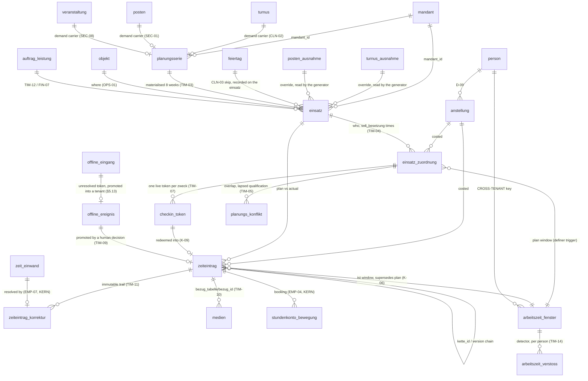

# Datenmodell — Planung & Zeit (Dienstplan, Einsätze, Zeiterfassung, Check-in)

This document is the schema contract for SPEC §9 (TIM-01..TIM-14) and the time half of SPEC §10 (EMP-02, EMP-07, EMP-14, EMP-15): the recurring plan, the concrete shift, who is assigned to it, the tokenised check-in, the worked-time record, its immutable correction trail, the media captured on site, the offline landing zone, and the ArbZG evidence that has to aggregate across three legal entities. It is the domain that carries the platform's legal risk — it produces the §17 MiLoG hour records for cleaning and construction, the ArbZG findings for all four areas, and the raw material every hour-based invoice line is traced back to (FIN-07) — so it is written so that a Gewerbeaufsicht inspector, a wage-dispute lawyer and a tax auditor can each be shown the same rows and reach the same conclusion. It is written against `00-KONVENTIONEN.md`; **where this document and a convention disagree, the convention wins and this document is wrong** — every resolution below cites the `K-id` it applies. Where SPEC and DECISIONS leave a legal, financial or tariff value open, this document states a labelled placeholder behind a swappable interface and a `// TODO(client)`, never a plausible value (K-17).

---

## 0. Scope, standing and ownership

### 0.1 Tables this document owns

| Group | Tables | Count |
|---|---|---|
| Planung | `planungsserie` · `einsatz` · `einsatz_zuordnung` | 3 |
| Zeiterfassung | `zeiteintrag` · `zeiteintrag_korrektur` · `checkin_token` · `offline_ereignis` · `medien` | 5 |
| Konflikte | `planungs_konflikt` · `arbeitszeit_verstoss` | 2 |
| `zeit_intern` (non-tenant, schema not exposed by PostgREST) | `zeit_intern.arbeitszeit_fenster` (K-06) · `zeit_intern.offline_eingang` (§5.13) | 2 |
| Referenz (global, tenant-free) | `feiertag` · `medien_bezug` (§5.8.1) | 2 |

Schema files: `src/server/db/schema/zeit.ts` and `src/server/db/schema/zeit-intern.ts` (`01-ORDNERSTRUKTUR.md` §4.9), RLS in `src/server/db/rls/zeit.sql`, definer functions in `src/server/db/funktionen/`.

**Two deviations from the file map in `01-ORDNERSTRUKTUR.md` §4.9, both settled by the sibling documents and restated here so the deviation is deliberate and not a merge accident.** That table lists `reklamation`, `qualitaetspruefung`, `abwesenheit`, `stundenkonto`, `urlaubskonto`, `zeit_einwand` and `antrag` under `zeit.ts`. `03-GEWERKE.md` §0.1 specifies `reklamation` and `qualitaetspruefung` — their subject is trade quality, not scheduling — and `01-KERN.md` §6.22–§6.29 specifies the other five in `personal.ts`, because they hang off `anstellung_id`/`person_id` and share the K-04 ceiling registry with the rest of the personnel domain. This document adds `planungs_konflikt`, `offline_ereignis` and `feiertag`, each carrying the feature ID that forced it (TIM-05, TIM-09, CLN-03).

**`planungsserie_ausnahme` does not exist.** The draft carried a third single-occurrence override table beside `turnus_ausnahme` (`03-GEWERKE.md` §5.4) and `posten_ausnahme` (§6.4). Overrides belong to the demand carrier, where the planner edits them and where the customer contract lives; a second carrier in the execution record would mean two answers to "was the cleaning on 3 October cancelled" and a generator that has to reconcile them. §8 reads exceptions from the carriers through `app.planungsbedarf()`.

### 0.2 What this document does not decide

`mandant`, `benutzer`, `rolle`, `berechtigung`, `audit_log`, `job_lauf`, `person`, `anstellung`, `qualifikation`, `nachweis`, `bewacher_eintrag`, `stundenkonto`, `stundenkonto_bewegung`, `urlaubskonto`, `abwesenheit`, `zeit_einwand`, `antrag`, `benutzer_feed_token` belong to `01-KERN.md`. `kunde`, `objekt`, `raum`, `auftrag`, `auftrag_leistung`, `dokument`, `dokument_aufbewahrung` belong to `02-CRM-OPERATIONS.md`. `revier`, `turnus`, `turnus_ausnahme`, `sonderleistung`, `posten`, `posten_ausnahme`, `veranstaltung`, `einsatzanforderung`, `leistungsnachweis`, `wachbuch_eintrag`, `projekt`, `aufmass`, `bautagebuch`, `reklamation`, `qualitaetspruefung` belong to `03-GEWERKE.md`. `rechnung`, `rechnungsposition`, `nummernkreis` belong to the finance document; `freigabe`, `freigabe_snapshot`, `agent_aufgabe` to the approval and agent documents (K-13); `kalender_eintrag`, `aufgabe`, `benachrichtigung` to the calendar document. §2 states every column and constraint this domain **requires** of them, and §2.3 every requirement this document places on a sibling — those shapes are binding, exactly as `03-GEWERKE.md` §2.1 is binding on this document.

### 0.3 Identifier language

Domain identifiers are German because they carry legal meaning under MiLoG, ArbZG, GewO and GoBD: `planungsserie · einsatz · einsatz_zuordnung · zeiteintrag · zeiteintrag_korrektur · checkin_token · medien · feiertag · arbeitszeit_verstoss`. SQL functions in `app.` and `zeit.` are German, following `01-KERN.md` §3 and `02-CRM-OPERATIONS.md` §0.3. Postgres roles are English per K-01 (`cse_app`, `cse_checkin`, `cse_job`, `cse_definer`). TypeScript infrastructure is English (`withTenant`, `splitteNachMonat`, `ArbzgDetektor`). UI copy is German; every worker-facing label is additionally translatable de/en/ar/tr (EMP-12).

### 0.4 The naming of instant columns, stated once

Two naming schemes meet in this domain, and both are imposed from outside:

| Where | Columns | Fixed by |
|---|---|---|
| `einsatz`, `einsatz_zuordnung`, `zeiteintrag` | `beginn_zeitpunkt` · `ende_zeitpunkt` | `03-GEWERKE.md` §2.1, which already declares composite FKs and read paths against these names |
| `zeit_intern.arbeitszeit_fenster` and the reader of §6 | `beginn_utc` · `ende_utc` | **K-06**, verbatim |

Both are `timestamptz`, both are stored UTC and displayed `Europe/Berlin` (invariant 2). The draft's `beginn_utc` on the tenant tables is corrected to `beginn_zeitpunkt`; renaming K-06's window columns to match would contradict a convention, and inventing a third scheme would guarantee that one of the three is wrong in every join written later. Wall-clock snapshots always carry the `_lokal` suffix and are `timestamp`/`time` **without** time zone, never a duplicate of the instant in another zone.

---

## 1. Conventions applied in this domain

### 1.1 Database roles, FORCE RLS, and the sanctioned definer write paths (K-01, K-06, K-08)

Six roles, **none with `BYPASSRLS`**; the application never connects as `postgres` and Supabase's `service_role` appears in no runtime connection string.

| Role | Use in this domain |
|---|---|
| `cse_migrator` | DDL, CI only |
| `cse_definer` | owns every `SECURITY DEFINER` function of §6, §8, §9 and §11; the only role exempt from `FORCE RLS`, and only on the tables named in the read registry (§2.3) |
| `cse_app` | every authenticated request — planner, Leitung, worker portal, customer portal |
| `cse_anon` | `EXECUTE` on exactly its rows of the **closed K-08 register** — `app.sitzung_aufloesen`, `app.versuch_protokollieren` and `app.ical_feed_lesen` (§12.3); **no table in this domain is readable by `cse_anon`**, and it holds no table grant at all |
| `cse_checkin` | `EXECUTE` on `app.checkin_verbrauchen` **and `app.offline_ereignis_annehmen`** — its two rows of the K-08 register (K-01, K-08). The offline replay is check-in data arriving late over the *same* token: same subject, same authentication, same conditional-write discipline, which is why K-08 sanctions it on this role rather than on a sixth mechanism (§9.4) |
| `cse_job` | the generator, the ArbZG detector, the watchdogs, the retention job and the reconciliation jobs, each with the per-job grant enumerated in §14.3 |

```sql
alter table <t> enable row level security;
alter table <t> force  row level security;   -- K-01: the owner is not exempt
```

`FORCE` is applied to **every** table in this domain including the two `zeit_intern` tables, `arbeitszeit_fenster` and `offline_eingang`. The draft exempted the window table, which is the wrong tool: without `FORCE` the owner is exempt and any connection that happens to run as the owner reads every person's cross-entity hours. Both `zeit_intern` tables are protected instead by living in a schema that is not exposed by PostgREST (§2.3 item 10), by having **no policy for `cse_app` at all**, and — in the window table's case — by holding no column that could identify a shift (§5.12, §5.13, §6.2).

**The review's B4 is correct and is resolved here rather than by a bypass.** A `SECURITY DEFINER` function runs as `cse_definer`, and under `FORCE RLS` a role with no applicable policy reads zero rows and fails every write. So the two paths that must cross RLS carry **named, narrow policies for `cse_definer`, enumerated in `src/server/db/rls.ts`** — not a role privilege, not `BYPASSRLS`, and not a fourth mechanism:

```sql
-- K-08: the tokenised check-in path. It has no session, so no K-03 policy can ever match it.
create policy ct_definer on checkin_token as permissive for all to cse_definer
  using (true)
  with check (true);                          -- only app.checkin_verbrauchen holds EXECUTE

create policy z_definer_insert on zeiteintrag as permissive for insert to cse_definer
  with check (erfassungsart_beginn = 'checkin_token'
              and quelle_beginn    = 'server_uhr'
              and ende_zeitpunkt is null);     -- it may open an entry, never close one silently

create policy z_definer_update on zeiteintrag as permissive for update to cse_definer
  using      (ende_zeitpunkt is null and storniert_am is null and ersetzt_am is null)
  with check (quelle_ende = 'server_uhr' and erfassungsart_ende = 'checkin_token');

-- K-08 / TIM-09: the promotion of an offline claim. app.offline_uebernehmen must run as
-- cse_definer (offline_ereignis has no UPDATE policy for cse_app, §5.9), and the entry it writes is
-- by definition NOT a token stamp — so z_definer_insert above can never match it. Without this
-- second, equally narrow policy the whole §9.4 promotion path is refused by the database.
create policy z_definer_nacherfassung on zeiteintrag as permissive for insert to cse_definer
  with check (nacherfasst
              and erfassungsart_beginn = 'nacherfassung'
              and quelle_beginn        = 'planer_entscheidung'
              and (quelle_ende is null or quelle_ende = 'planer_entscheidung'));

create policy oe_definer on offline_ereignis as permissive for all to cse_definer
  using (true) with check (true);
create policy eingang_definer on zeit_intern.offline_eingang as permissive for all to cse_definer
  using (true) with check (true);                -- the pre-resolution landing zone, §5.13

create policy me_definer_insert on medien as permissive for insert to cse_definer
  with check (erstellt_von_art = 'mensch' and erstellt_von_person_id is not null);
  -- erstellt_von_art is the COLUMN (§1.6); akteur_art is the enum TYPE. A policy naming the type
  -- does not create, and the migration fails.

-- K-06: the cross-entity window and its findings.
create policy fenster_definer on zeit_intern.arbeitszeit_fenster
  as permissive for all to cse_definer using (true) with check (true);
create policy verstoss_definer_write on arbeitszeit_verstoss
  as permissive for insert to cse_definer with check (true);
create policy verstoss_definer_update on arbeitszeit_verstoss
  as permissive for update to cse_definer using (true) with check (true);

-- read-only, for the preconditions the definer functions check themselves
create policy e_definer on einsatz            for select to cse_definer using (true);
create policy ez_definer on einsatz_zuordnung for select to cse_definer using (true);
```

Every `SECURITY DEFINER` function is owned by `cse_definer` and carries `SET search_path = pg_catalog, public` verbatim (K-01), which is why every body below schema-qualifies `app.`, `zeit.` and `public.`. A CI test enumerates `pg_policies` and fails on any `cse_definer` policy outside the list above plus the registry of `01-KERN.md` §3.5; a second test asserts no role in the platform holds `BYPASSRLS`.

### 1.2 Session state (K-02)

All database access runs inside one of the **four** session wrappers — `withTenant`, `withGroupScope`, `withPersonScope`, `withKundeScope` (K-18) — which issue `set_config(..., true)` for the GUCs of K-02: `app.benutzer_id`, `app.person_id`, `app.mandant_id`, `app.mandant_ids`, `app.scope`, `app.portal`, `app.readonly` (**default `on`**), `app.aal`, plus `app.sitzung_id` from `01-KERN.md` §3.1. `app.scope` takes four values — `mandant` · `gruppe` · `person` · `kunde` — and **`app.mandant_id` is NULL in all three multi-tenant scopes**, where `app.mandant_ids` carries the set and is always derived server-side (K-02, K-18). The active mandant is never read from a URL parameter, a header or a request body (TEN-04, AUT-04, invariant 3). Every accessor of `01-KERN.md` §3.1 fails closed: an unset session produces zero rows in this domain, never all rows.

The `[mandant]` segment under `/portal` (K-07) is routing only, validated against the session; on mismatch the route returns **404, not 403** (AUT-06). Two URLs in this domain carry no session at all: `/check-in/[token]` (K-07, K-08), which reaches the database exclusively through `app.checkin_verbrauchen` and, for the late replay, `app.offline_ereignis_annehmen` (§9), and the iCal feed URL of CAL-03, which reaches it exclusively through `app.ical_feed_lesen` (§12.3). All three are rows of the closed K-08 register; this domain adds **no** function to it, and the route-manifest test fails the build on any new pre-session path that is not added to K-08 in the same PR.

### 1.3 The standard policy set and the right keys (K-03, AUT-03, AUT-05)

Applied verbatim to every tenant table below and referred to as *standard*, in the hoisted form `src/server/db/rls.ts` emits (`01-KERN.md` §1.3):

```sql
create policy t_mandant on <tabelle>
  for all to cse_app
  using      (mandant_id = app.aktiver_mandant()
              and (select app.hat_recht('<modul>.<aktion>', app.aktiver_mandant())))
  with check (mandant_id = app.aktiver_mandant()
              and not app.ist_readonly()
              and (select app.hat_recht('<modul>.schreiben', app.aktiver_mandant()))
              and exists (select 1 from mandant m
                           where m.id = mandant_id and m.archiviert_am is null));

create policy t_gruppe on <tabelle>
  for select to cse_app
  using (app.ist_gruppenansicht()
         and mandant_id = any (select app.rechte_mandanten('gruppe.<modul>.lesen')));
```

`app.rechte_mandanten('gruppe.<modul>.lesen')` is the hoisted form `01-KERN.md` §1.3 emits for K-03's `mandant_id = any (app.sichtbare_mandanten()) and app.hat_recht('gruppe.<modul>.lesen', mandant_id)` — the same predicate, evaluated once per query instead of once per row. It is not a weaker rule, and a policy that drops the right key is a defect either way.

**And two more policies, because there are four scopes and not two (K-18).** The employee portal and the customer portal genuinely span tenants — EMP-14 shows one person's shifts across all employments, and a customer sees the shifts on all of their objects — but they span them **as a subject, not as a manager**. Routing them through group scope is the category error K-18 forbids: `t_gruppe` demands `gruppe.dienstplan.lesen`, a right no cleaner and no customer will ever hold, so both portals would read zero rows, and widening that right would hand every cleaner a group-level read of all four entities. Each therefore gets its own **`SELECT`-only** policy keyed on the subject:

```sql
-- /portal/mein, withPersonScope (EMP-02, EMP-03, EMP-14, EMP-15)
create policy t_person on <tabelle>
  for select to cse_app
  using (app.scope() = 'person'
         and mandant_id = any (app.sichtbare_mandanten())
         and person_id = app.aktuelle_person());        -- the subject predicate, per table below

-- /portal/kunde, withKundeScope (CRM-06)
create policy t_kunde on <tabelle>
  for select to cse_app
  using (app.scope() = 'kunde'
         and mandant_id = any (app.sichtbare_mandanten())
         and kunde_id = app.aktueller_kunde());
```

| Policy | Tables in this domain | Subject predicate |
|---|---|---|
| `t_person` | `einsatz_zuordnung`, `zeiteintrag`, `medien` | `person_id = app.aktuelle_person()`; on `medien` additionally `or erstellt_von_person_id = app.aktuelle_person()` |
| `t_person` | `einsatz` | `exists (select 1 from einsatz_zuordnung z where z.einsatz_id = einsatz.id and z.person_id = app.aktuelle_person() and z.entfernt_am is null)` — `einsatz` carries no `person_id`, and the subquery resolves through `einsatz_zuordnung`'s own `t_person` policy, so the chain never leaves the subject |
| `t_kunde` | `einsatz`, `medien` | `kunde_id = app.aktueller_kunde()` on a **denormalised** `kunde_id` (§5.3, §5.8), never a subquery over `objekt`, which a `kunde` session cannot read |
| neither | `planungsserie`, `checkin_token`, `zeiteintrag_korrektur`, `offline_ereignis`, `planungs_konflikt`, `arbeitszeit_verstoss`, `feiertag` | a worker sees shifts, not the pattern, the correction trail, the token store or the employer's assessment of them (EMP-13); a customer sees neither |

`app.sichtbare_mandanten()` is derived server-side in every scope — in person scope from the person's own `anstellung` rows, in kunde scope from the customer's own `auftrag`/`angebot`/`rechnung` rows (`01-KERN.md` §3.2) — and never from the request (K-02). Its `kunde` branch is still `false` in `01-KERN.md`, so until the owning document supplies it (§2.3 item 12) a customer in kunde scope reads zero rows here, which is the correct fail-closed state. Neither policy has a write counterpart: `app.aktiver_mandant()` is NULL in both scopes, so every `t_mandant` `WITH CHECK` is false and Postgres refuses the write — the same construction that enforces invariant 10 for group scope. And `app.portal()` (who you are, K-04) and `app.scope()` (across how many tenants you read, K-18) stay different things: the K-04 ceiling of §1.4 is `restrictive` and applies **on top** of `t_person`/`t_kunde`, so both must pass.

**The review's B1 is correct, and it was the most serious defect in the draft.** The draft's policies were `USING (mandant_id = ANY (app.current_mandanten()))` with no permission conjunct anywhere, so every authenticated user attached to a mandant — including a `kunde` login and every `mitarbeiter` — could read every colleague's §17 MiLoG record, geo point, no-show flag and ArbZG finding, and the `OR person_id = …` self-read disjuncts widened nothing because the tenant read was already total. K-03 states the rule the draft missed: *a policy that omits the `hat_recht` conjunct is a defect; tenant membership alone must never grant read access to a module.* The right keys are therefore enumerated, not exemplified:

| Table | Module | Read | Write | Group read |
|---|---|---|---|---|
| `planungsserie` | `dienstplan` | `dienstplan.lesen` | `dienstplan.schreiben` | `gruppe.dienstplan.lesen` |
| `einsatz` | `dienstplan` | `dienstplan.lesen` | `dienstplan.schreiben` | `gruppe.dienstplan.lesen` |
| `einsatz_zuordnung` | `dienstplan` | `dienstplan.lesen` | `dienstplan.schreiben` | `gruppe.dienstplan.lesen` |
| `planungs_konflikt` | `dienstplan` | `dienstplan.lesen` | `dienstplan.konflikt_quittieren` | `gruppe.dienstplan.lesen` |
| `checkin_token` | `zeit` | `zeit.checkin_verwalten` | — (definer only, §9) | — |
| `zeiteintrag` | `zeit` | `zeit.lesen` | `zeit.schreiben` | `gruppe.zeit.lesen` |
| `zeiteintrag_korrektur` | `zeit` | `zeit.lesen` | `zeit.korrigieren` | `gruppe.zeit.lesen` |
| `medien` | `zeit` | `zeit.lesen` | `zeit.schreiben` | `gruppe.zeit.lesen` |
| `offline_ereignis` | `zeit` | `zeit.nacherfassung_pruefen` | — (definer only, §9.4) | — |
| `arbeitszeit_verstoss` | `dienstplan` | `dienstplan.arbzg_lesen` | — (definer only, K-06) | `gruppe.dienstplan.arbzg_lesen` |
| `feiertag` | — | readable by every authenticated session (§5.1) | `cse_job` only | — |

`dienstplan.arbzg_pruefen` is the right K-06 names for the cross-entity reader; it is granted separately from `dienstplan.arbzg_lesen` because reading a finding in one's own plan and querying another entity's load are different acts (§6.3). Seed grants live in the permission matrix of `01-KERN.md` §14.3, and this document requires **exactly these thirteen keys** to exist there — listed, not counted, because a count is what the permission-matrix seed cannot be written against:

`dienstplan.lesen` · `dienstplan.schreiben` · `dienstplan.konflikt_quittieren` · `dienstplan.arbzg_lesen` · `dienstplan.arbzg_pruefen` · `zeit.lesen` · `zeit.schreiben` · `zeit.korrigieren` · `zeit.checkin_verwalten` · `zeit.nacherfassung_pruefen` · `gruppe.dienstplan.lesen` · `gruppe.zeit.lesen` · `gruppe.dienstplan.arbzg_lesen`

(§2.3 item 5 repeats the same list verbatim, and a seed test compares the two.) `zeit.freigeben` is deliberately **not** on it: whether a release step exists at all is O-39, and seeding a right for a step the client may not want would make the placeholder load-bearing (§3.3, K-17).

**Invariant 10 is enforced by Postgres.** No `INSERT`/`UPDATE`/`DELETE` policy in this domain references group scope, so a write under `app.scope = 'gruppe'` matches no policy and is refused by the database even with the service guard disabled.

### 1.4 Portal ceilings and the employee portal read path (K-04, EMP-13, EMP-14, EMP-15)

Every table in this domain hanging off `anstellung_id` or `person_id` carries the K-04 **restrictive** ceiling in addition to the standard set:

```sql
create policy p_ma_ceiling on <tabelle> as restrictive for all to cse_app
  using (app.portal() <> 'mitarbeiter'
         or anstellung_id in (select id from anstellung
                              where person_id = app.aktuelle_person()));
```

Tables carrying it here, enumerated for `src/server/db/rls.ts` (the build fails when an anstellung-hung or person-hung table has no ceiling): `einsatz`, `einsatz_zuordnung`, `zeiteintrag`, `zeiteintrag_korrektur` (via `ursprung_zeiteintrag_id`), `checkin_token`, `offline_ereignis`, `medien` (via `zeiteintrag_id`/`erstellt_von_person_id`), `arbeitszeit_verstoss`, `planungs_konflikt`.

**`einsatz` is on that list because K-04 enumerates it by name**, and an earlier draft of this section argued it out of the registry on the grounds that it carries no `anstellung_id`. That reasoning was wrong in a way that matters: without a restrictive ceiling, the `einsatz` self-read of §5.3 is the *only* bound on what a `mitarbeiter` session reads there, and §16 item 2 of this same document calls exactly that a blocking defect. Its ceiling keys on the existence of an own live assignment instead of on a column:

```sql
create policy p_ma_ceiling on einsatz as restrictive for all to cse_app
  using (app.portal() <> 'mitarbeiter'
         or exists (select 1 from einsatz_zuordnung z
                     where z.einsatz_id = einsatz.id
                       and z.person_id  = app.aktuelle_person()
                       and z.entfernt_am is null));
```

`planungsserie` carries neither an assignment nor a worker-visible read path at all (§5.2), so its `mitarbeiter` ceiling is the degenerate `app.portal() <> 'mitarbeiter'`. The customer ceiling is the degenerate `app.portal() <> 'kunde'` on every table except `einsatz` and `medien`, where a customer may see the shifts and photos of **their own objects** only, keyed on the row's own denormalised `kunde_id` — never on a subquery over `objekt`, which a `kunde` session cannot read — stated per table.

**How EMP-14/EMP-15 are served without widening anything: the K-18 `t_person` policy, not a disjunct on `t_mandant`.** A worker with employments in two entities has two `benutzer_mandant` rows (K-14 keeps a manual grant and a derived one side by side), and `/portal/mein` runs under `withPersonScope`, where `app.aktiver_mandant()` is NULL and `app.mandant_ids` carries every mandant the person is employed by. The read is therefore the K-18 policy of §1.3 and nothing else:

```sql
create policy t_person on zeiteintrag
  for select to cse_app
  using (app.scope() = 'person'
         and mandant_id = any (app.sichtbare_mandanten())     -- derived from anstellung, K-18
         and person_id  = app.aktuelle_person());             -- EMP-14, D-09 consequence 4
```

Four properties make it safe, and all four are structural rather than promised: it is `SELECT`-only and has no write counterpart; it matches only rows whose subject **is** the caller (`app.person_id` is a server-set GUC, K-02); these tables carry no monetary column at all (§1.5); and the K-04 ceiling still applies on top, so a `mitarbeiter` session cannot reach another employee's row even if a right were mis-granted. It spans employments without spanning tenants in the managerial sense — that is exactly what "the portal shows shifts across all employments" means (EMP-14) — and it exists on `einsatz`, `einsatz_zuordnung`, `zeiteintrag`, `medien` and nowhere else. It is **never** added to `planungsserie` (a worker sees shifts, not the pattern and its billing anchor), to `planungs_konflikt` or to `arbeitszeit_verstoss` (whether the employer has recorded a breach against a worker is an employer assessment; EMP-13 bounds the portal). The earlier construction — an `or person_id = app.aktuelle_person()` disjunct bolted onto `t_mandant` — is deleted: it read across tenants from inside a policy whose other branch is single-tenant, which K-18 replaces with a scope of its own precisely so the two cannot be confused in review.

**The one write a worker owns needs exactly one active mandant** (invariant 10, K-18). Person scope has no write policy anywhere, so the service **re-enters `withTenant`** with the single resolved tenant: `zeit_einwand` is inserted under `withTenant` for the mandant of the shift being disputed, resolved **server-side** from `zeiteintrag.mandant_id` / `einsatz.mandant_id`; the client submits an entry id, never a mandant. This answers the second half of the review's B11: a worker employed by two entities objects to a security shift while the session's active mandant is `security`, because the route resolved it, not because the browser said so.

### 1.5 This domain contains no money column — deliberately (K-05, EMP-13, D-09 §6)

There is no `stundensatz`, no `betrag`, no `zuschlag`, no `_cent` column anywhere below. Internal cost rates live on `anstellung_kondition` behind the column grants of K-05 and are reachable only through `app.entgelt_lesen()`; customer prices live on `auftrag_leistung` and `kalkulation`. The valuation of hours is a tested function in `src/server/services/`, and invoice amounts are integer cents in the finance domain (invariant 1, invariant 6).

Two consequences worth stating, because they are what makes §1.4's `t_person` read defensible: the employee self-read cannot leak a rate, and a cleaning planner reading a shift can never see a security wage. **Any PR that adds a monetary column to a table in this domain is a blocking defect** (§16). K-16(b)'s `*_mikrocent` carve-out is confined to agent cost and budget accounting and has no application here at all: if a figure in this domain ever became money, it would be `bigint` cents in the finance domain, full stop.

### 1.6 Common columns, the actor, keys and deletion (K-16, SEC-A9)

Every table carries `id uuid primary key default gen_random_uuid()` and `erstellt_am timestamptz not null default now()`; mutable tables add `geaendert_am timestamptz`, maintained by `kern.setze_geaendert_am()`. Tenant tables add `mandant_id uuid not null references mandant(id)` and declare **`unique (mandant_id, id)`** — the K-16 column order — so children can be pinned to their parent's tenant:

```sql
foreign key (mandant_id, einsatz_id) references einsatz (mandant_id, id)
```

**A single-column FK into a table that carries `mandant_id` is a review failure.** §14.4 lists every composite FK in this domain and the parent unique each one needs; a schema test walks `information_schema` and fails on any single-column reference to a `mandant_id`-bearing table. The draft's `(einsatz_id, mandant_id)` column order is corrected to `(mandant_id, einsatz_id)` throughout — the order matters because the parent unique is `(mandant_id, id)` and Postgres matches the column list positionally.

**This domain takes none of K-16's four permitted deviations, and states so rather than leaving it to be inferred.** (a) No table here is `PARTITION BY LIST`, so every primary key is the single `id` — `wissens_chunk` is the only composite PK in the platform. (b) There is no money column at all (§1.5), so the `*_mikrocent` carve-out for agent cost accounting has nothing to apply to. (c) Every duration here is *measured* — worked time, a §17 MiLoG record, a rest period — and therefore `integer`; the fractional form is for computed targets, which live in `03-GEWERKE.md` (§1.7). (d) Every `mandant_id` in this domain is `NOT NULL`, because `audit_log` is the only tenant-adjacent table K-16(d) permits a nullable one, and the pre-tenant landing zone that would otherwise have wanted one is a non-tenant table in `zeit_intern` instead (§5.9, §5.13). A deviation that is not one of K-16's four is a defect (§16 item 16), and that includes one this document might have found convenient.

Accountability is the **Auditblock** of `03-GEWERKE.md` §1.2, adopted unchanged so that one `akteur_art` vocabulary (`mensch · agent · system`, `01-KERN.md` §4) covers the whole platform:

```sql
erstellt_von_art        akteur_art  not null default 'mensch',
erstellt_von            uuid        null references benutzer(id),
erstellt_von_person_id  uuid        null references person(id),
erstellt_von_agent_id   uuid        null,
geaendert_am            timestamptz null,
geaendert_von_art       akteur_art  null,
geaendert_von           uuid        null references benutzer(id),
constraint akteur_stimmig check (
      (erstellt_von_art = 'mensch' and erstellt_von is not null and erstellt_von_agent_id is null)
   or (erstellt_von_art = 'agent'  and erstellt_von_agent_id is not null)
   or (erstellt_von_art = 'system' and erstellt_von is null and erstellt_von_agent_id is null))
```

This replaces the draft's fourth actor value `person_token`, and it answers the review's MINOR finding that no constraint bound the actor kind to the actor columns. There is **no accountless write path**: per `01-KERN.md` §2 every activated worker access has a `benutzer` row, so a check-in performed by a worker is `erstellt_von_art = 'mensch'` with `erstellt_von` = that worker's `benutzer` and `erstellt_von_person_id` = their `person`, resolved inside `app.checkin_verbrauchen` from the assignment — not from anything the browser sent. Rows the nightly generator writes are `'system'`.

**No hard deletes** (invariant 8, LEG-01, LEG-02): every table in this domain is listed in `rls.ts.kein_hard_delete`, carries the `kern.verhindere_loeschung()` `BEFORE DELETE` trigger raising `SQLSTATE 'P0001'`, and holds no `DELETE` policy and no `DELETE` grant for any application role. The trigger exists **independently** of the missing policy, because a missing policy deletes zero rows and returns success — indistinguishable from a no-op — and a connection that is not `cse_app` never consults the policy at all. Removal is expressed as `archiviert_am` (master data), `storniert_am` (shift, time entry, finding), `entfernt_am` (assignment), `widerrufen_am` (token), `hinfaellig_am` (superseded finding), `anonymisiert_am` (DSGVO erasure, §13). No table carries two liveness columns.

### 1.7 Types

| Concept | Type | Reason |
|---|---|---|
| Instants | `timestamptz`, UTC stored, Berlin displayed | invariant 2 |
| Wall-clock anchors and snapshots | `timestamp` / `time` **without** zone, plus `zeitzone text` | §0.4, `03-GEWERKE.md` §1.1 |
| Calendar days (`plan_datum`, `feiertag.datum`, `betrifft_datum`) | `date` | Berlin calendar facts (K-11) |
| Durations | `integer`, unit in the name (`dauer_netto_minuten`, `zeitabweichung_sek`) | **K-16(c)** — every duration in this domain is a *measured* one: worked time, a §17 MiLoG record, a rest period, a break. Measured durations are evidence and stay integer. The fractional `numeric(8,2)` K-16(c) permits is for *computed targets* (`revier.sollzeit_minuten`, `03-GEWERKE.md`), and **no column here is one** |
| Quantities | `numeric(12,3)` | K-16 — a quantity is not money |
| Coordinates | `numeric(9,6)` | matches `objekt.geo_lat`/`geo_lon`; never `float` |
| Money | *none in this domain* | §1.5 |
| Hashes | `text` with `check (… ~ '^[0-9a-f]{64}$')` | token hashes, payload hashes |
| Raw evidence | `text` for the byte-faithful body plus `jsonb` for the parsed copy | §5.9 |

### 1.8 The server clock is the source of truth, and what may reach an authoritative column (invariant 5, TIM-08, TIM-09)

`DEFAULT now()` applies only when the column is omitted, so an `INSERT` that supplies a value writes an arbitrary instant and the freeze triggers then make the fabrication permanent. Two triggers, and every table names which applies (`03-GEWERKE.md` §1.11): `kern.erzwinge_serverzeit()` on tables with no device columns, `zeit.stempel_feldzeit()` on the three that carry device columns (`zeiteintrag`, `offline_ereignis`, `zeit_intern.offline_eingang`), which sets the server instant and derives `zeitabweichung_sek` from the device reading.

**The rule the review's B10 asks for, stated as a rule rather than as a status value.** The authoritative columns `zeiteintrag.beginn_zeitpunkt` and `zeiteintrag.ende_zeitpunkt` may originate from exactly three sources, and a device is not one of them:

| `quelle_beginn` / `quelle_ende` | Written by | Evidence of the decision |
|---|---|---|
| `server_uhr` | `app.checkin_verbrauchen` or a portal action, `now()` at the moment of the event | the request itself, `audit_log` |
| `planer_entscheidung` | a named `benutzer` accepting a claim or entering a missed stamp | a `zeiteintrag_korrektur` row with `art = 'nacherfassung'` and a Begründung |
| `import` | the Phase 10 migration of historical records | the import batch id in `zeiteintrag_korrektur.begruendung` |

A device-claimed instant lives in `behauptet_beginn` / `behauptet_ende` on the entry and in `offline_ereignis.behauptete_zeit`, and **never** moves into an authoritative column without a human decision that leaves a correction row behind. The draft wrote the claim straight into `beginn_utc` with `zeitquelle = 'geraet_behauptet'` and relied on the provisional status value `zu_pruefen` to keep it out of billing — which makes invariant 5 depend on how the client answers an open question. It does not now: the enum value `geraet_behauptet` is deleted, and `check (quelle_beginn <> 'planer_entscheidung' or nacherfasst)` plus the correction requirement of §5.7 make laundering structurally impossible rather than procedurally discouraged.

The consequence for a fully offline shift is stated openly in §9.4: no `zeiteintrag` exists until a planner decides, the claim sits in `offline_ereignis`, and the hourly watchdog "shift ended, no `zeiteintrag`" (SPEC §14) is what surfaces it. A record created by a planner from a worker's claim is a lawful §17 MiLoG record; a record whose start time the platform accepted from an unauthenticated phone is not one it can defend.

### 1.9 Calendar boundaries are Berlin wall-clock (K-11)

Instants are stored UTC; a **day**, a **month** and a **billing period** are Berlin boundaries converted to instants, never UTC midnight. `plan_datum`, `wirksam_am`, `betrifft_datum` and every month boundary derive as `(<instant> at time zone 'Europe/Berlin')::date`, never as `(<instant>)::date`. `app.berlin_heute()` replaces every `current_date`. `splitteNachMonat` and `berlinTag` live in `src/server/services/zeit/` and every reference test carries **a CET case and a CEST case**, so a UTC implementation cannot pass by accident.

The K-11 reference cases are reproduced verbatim, because the draft named the DST nights by the transition date and would have enshrined an off-by-one in the very tests ROADMAP Phase 5 says to write first:

| Case | Shift (Berlin wall-clock) | UTC instants | Expected |
|---|---|---|---|
| Normal night | `2026-03-27 22:00` → `2026-03-28 06:00` | `21:00Z` → `05:00Z` | **480 min** |
| **Spring forward** | `2026-03-28 22:00` → `2026-03-29 06:00` | `21:00Z` → `04:00Z` | **420 min** |
| **Fall back** | `2026-10-24 22:00` → `2026-10-25 06:00` | `20:00Z` → `05:00Z` | **540 min** |

In 2026 the transitions fall on Sunday **29 March** and Sunday **25 October**; a shift starting at 22:00 *on* either of those days is an ordinary 480-minute shift and proves nothing. Month split, Berlin boundary: `2026-01-31 20:00` → `2026-02-01 04:00` → `[{2026,1,240}, {2026,2,240}]` (§7.3).

### 1.10 No volatile or stable function in a `CHECK` or in an index predicate

`current_date`, `now()` and `current_timestamp` are `STABLE`, not `IMMUTABLE`. A `CHECK` containing one changes truth value under a row that never changes, which makes later `UPDATE`s fail and aborts a `pg_dump`/restore (SEC-A10); PostgreSQL rejects the same expression in a partial-index predicate outright, so the migration fails and the index the nightly generator depends on does not exist. Every time-dependent rule in this domain is (a) a trigger that raises only on an illegal *transition*, (b) a `WHERE` clause in the query, or (c) a scheduled job. This is why `checkin_token.gueltig_ab`/`gueltig_bis` are compared in the `UPDATE` of §9.1 and not in a constraint, and why no index here carries a "future shifts" predicate.

### 1.11 Views are `security_invoker` (review B5)

A view executes with the privileges and RLS exemption of its owner. **Every view in this domain is created `WITH (security_invoker = true)`**, carries `mandant_id` in its output, and is covered by its own SEC-A3 case — per view, not only per table. The draft's `zeiteintrag_monatsanteil` without that setting would have been a full cross-tenant leak of every entity's hours through exactly the ambient-readable-relation mechanism §6.9 spends five paragraphs arguing against. `security_invoker` is safe here because this domain revokes no column (§1.5 means there is nothing to revoke).

### 1.12 Uniqueness is partial wherever removal is soft

An unconditional unique index plus a soft-delete column makes ordinary lifecycle events permanently impossible, and each collision surfaces as an opaque `duplicate key` error at the moment someone is trying to get a worker on shift.

| Index | Predicate | Why partial |
|---|---|---|
| `einsatz_quelle_uk (mandant_id, quell_schluessel)` | `where storniert_am is null` | a cancelled occurrence keeps its audit row and the same occurrence may be re-created when the exception is withdrawn |
| `ez_einsatz_anstellung_uk (einsatz_id, anstellung_id)` | `where entfernt_am is null` | a removed assignment must be re-creatable; the removal stays visible |
| `ct_live_uk (einsatz_zuordnung_id, zweck)` | `where eingeloest_am is null and widerrufen_am is null` | re-issuing a link revokes the previous one and must not collide with it |
| `z_offen_uk (anstellung_id)` | `where ende_zeitpunkt is null and storniert_am is null and ersetzt_am is null` | one open entry per employment (§10.1); a closed one must not block the next shift |
| `av_fingerprint_uk (mandant_id, fingerprint)` | `where hinfaellig_am is null` | a superseded finding must not block re-detection |

### 1.13 Retention is a class, not a hard-coded number (LEG-01, LEG-02, DOC-07, review B9)

Two periods are stated by SPEC and are therefore not placeholders: **GoBD ten years** (LEG-01, ACC-06) and **§17 MiLoG two years** (LEG-02, TIM-13). Everything else is open. Every table in this domain therefore carries, from the first migration:

```sql
aufbewahrung_bis  date    null,                   -- written by job:aufbewahrung, never by a DEFAULT
loeschsperre      boolean not null default false  -- an ACTIVE hold, set by the domain that needs it
```

**`loeschsperre` defaults to `false`, and fail-closed lives in the purge predicate, not in the default.** Shipping `default true` deadlocked retention against itself, because the draft's §13 and its test 30 forbade `job:aufbewahrung` from writing `aufbewahrung_bis` on a row under Löschsperre: with every row born under one, **no deadline would ever be computed for any row**, LEG-01 and LEG-02 have no data, and §13's own sentence that the finance domain "sets `loeschsperre = true` on billing" describes a transition that could never happen. Nothing is deletable regardless, and by three independent mechanisms: `aufbewahrung_bis` is NULL until the job writes it and the purge path requires `aufbewahrung_bis is not null and aufbewahrung_bis < app.berlin_heute() and not loeschsperre`; no table here has a `DELETE` policy or grant; and `kern.verhindere_loeschung()` raises on every `DELETE` anyway (§1.6). The flag means what its name says — *an active legal hold*, set by the finance domain on billing (FIN-07), by a `medien` parent, or by a documented Betriebsprüfung — and the retention job can therefore do its job.

The class lives in the shared `dokument_aufbewahrung` catalogue (`02-CRM-OPERATIONS.md` §4.6) and is read through `app.aufbewahrung_intervall(p_schluessel)`; §13 maps every table here to its class key. The draft's `DEFAULT ((beginn_utc at time zone 'Europe/Berlin')::date + interval '2 years')` is deleted twice over: a column `DEFAULT` cannot reference another column in Postgres (review, MINOR), and the *clock start* of the MiLoG period is not stated anywhere in the statute text the SPEC cites — see the open question in §17. The draft's "invoice date + 10 years" is deleted for the reason the review gives: §147 Abs. 3 AO runs from the **end of the calendar year** in which the record arose, so an invoice-date anchor under-retains by up to eleven months on every record. The computation lives in `src/server/services/aufbewahrung/` behind

```ts
export interface Aufbewahrungsregel {
  frist(klasse: string, ereignis: { belegdatum: Date; mandantId: string }): Date | null;
}
```

with the GoBD implementation `jahresende(belegdatum) + 10 Jahre` and a test for a December and a January Belegdatum, and the MiLoG implementation behind the open question: `// TODO(client): O-30 — Ab wann läuft die zweijährige Aufbewahrung nach §17 Abs. 1 MiLoG: ab dem Tag der Arbeitsleistung, ab Erstellung der Aufzeichnung oder ab Monats- bzw. Jahresende?` Until it is answered `frist('zeiterfassung', …)` returns `null`, the job writes no `aufbewahrung_bis` for that class, and the purge path therefore selects nothing — the fail-closed direction, and the reason the default of `loeschsperre` is not where fail-closed has to live. No purge job may act on a row whose `aufbewahrung_bis` is NULL.

### 1.14 Placeholder marking and configurable operational values (K-17)

Placeholders carry a bold marker (**PLACEHOLDER** / **PROVISIONAL**), a swappable interface and a `// TODO(client): O-nn — <exact question>`; **every marker in this document names its `O-nn`**, and §17.1 additionally gives each question a stable slug, because the `O-30+` range is claimed by several Phase 0 documents at once and the final numbers are allocated when they are merged into `DECISIONS.md` (§17.1). `pnpm lint:todo` fails when a `// TODO(client)` in this domain carries no number, or a number and slug with no matching row under **Open**. Operational values that are neither legal facts nor tariff values live in `mandant_einstellung(schluessel, wert jsonb)` read through `app.einstellung(schluessel)` (the mechanism `03-GEWERKE.md` §1.16 requires of `01-KERN.md`), each with its default stated in §17.2.

### 1.15 Behavioural monitoring is gated per feature, not once for geolocation (O-06, §87 Abs. 1 Nr. 6 BetrVG)

The draft treated the Betriebsrat question as gating geolocation alone. The review is right that it does not: `zeitabweichung_sek`, the device fingerprint `geraet_id`, the no-show flag, and the "who corrects a lot of time records" report are *Einrichtungen zur Verhaltens- und Leistungskontrolle* in the same sense a GPS point is, and deciding that only one of them needs the Betriebsrat is itself an unflagged legal ruling. Each is therefore behind its own setting, and the O-06 question is widened in §17:

| Setting | Default | Effect while off |
|---|---|---|
| `zeit.geolokalisierung` | `false` | all coordinate columns must be NULL, status `deaktiviert` (LEG-10) |
| `zeit.geraetekennung` | `false` | `offline_ereignis.geraet_id` is stored as a per-submission random value, not a stable install id |
| `zeit.abweichungsauswertung` | `false` | `zeitabweichung_sek` is still **stored** (invariant 5 requires it) but no report, ranking or alert may aggregate it per person |
| `zeit.korrekturstatistik` | `false` | the `(durchgefuehrt_von, durchgefuehrt_am)` index exists for audit lookup; no per-user ranking screen is rendered |
| `zeit.nichterschienen_auswertung` | `false` | the value is recorded on the assignment; no aggregate per person is rendered |

Storing a fact and evaluating it as a performance measure are different acts, and only the second is gated — which is why invariant 5's `zeitabweichung_sek` survives an unanswered O-06 while the ranking screen does not. `// TODO(client): O-42 (erweitert O-06) — Betrifft die Mitbestimmung nach §87 Abs. 1 Nr. 6 BetrVG neben der Geolokalisierung auch Geräteabweichung, Gerätekennung, Nicht-erschienen-Auswertung und Korrekturstatistiken?`

### 1.16 No `aal2` gate belongs on any table in this domain (K-15)

AUT-02 requires 2FA for `super_admin` and `admin` only; every `leitung`, `mitarbeiter` and `kunde` legitimately runs at `aal1`. A restrictive `aal2` policy on a table this domain owns would therefore blank the Dienstplan, the check-in path and the worker portal for exactly the population they exist for — and it would do so silently, as zero rows rather than as an error. **No table, view or function here carries an `app.aal()` predicate**, and a CI test asserts it. The elevation that AUT-02 does require is inside `app.ist_super_admin()` and on the write path of the permission tables, both owned by `01-KERN.md` §3.2 and §1.4.

---

## 2. Cross-domain contract

### 2.1 Tables this domain consumes, and the constraints they must declare

| Table | Owner | Required constraints | Columns this domain reads | SPEC |
|---|---|---|---|---|
| `mandant` | KERN | — | `id`, `archiviert_am`, `module` | TEN-01, TEN-08 |
| `benutzer` | KERN | — | `id`, `person_id` | AUT-01, SEC-A9 |
| `person` | KERN | — | `id`, `sprache` | D-09, EMP-12 |
| `anstellung` | KERN | `unique (mandant_id, id)`, **`unique (id, person_id)` — §2.3 item 8, not yet declared in `01-KERN.md` §6.14** | `id`, `person_id`, `mandant_id`, `status`, `eintritt`, `austritt`, `archiviert_am` | D-09 |
| `qualifikation` · `nachweis` · `bewacher_eintrag` | KERN | as `03-GEWERKE.md` §2.1 | read only through `app.einsatz_qualifikation_erfuellt` (§11) | SEC-02, SEC-03, SEC-04 |
| `stundenkonto` · `stundenkonto_bewegung` | KERN | `unique (mandant_id, id)` on both | `status`, `gesperrt_am`; the booking path of §12.2 | EMP-04, EMP-15 |
| `zeit_einwand` | KERN | `unique (mandant_id, id)` | `zeiteintrag_id`, `anstellung_id`, `status`, `korrektur_bewegung_id` | EMP-07 |
| `benutzer_feed_token` | KERN | `unique (token_hash)` | `benutzer_id`, `zweck`, `widerrufen_am` | CAL-03 |
| `job_lauf` | KERN | `unique (mandant_id, id)` | `id`, `status`, `kennzahlen jsonb` | TIM-03, SPEC §14 |
| `audit_log` | KERN | — | written through `app.protokolliere` | SEC-A9 |
| `objekt` | CRM-OPS | `unique (mandant_id, id)` | `id`, `kunde_id`, `plz`, `ort`, **`bundesland`** (§2.3) | OPS-01, CLN-03 |
| `kunde` | CRM-OPS | `unique (mandant_id, id)` | `id` — the denormalised customer key on `einsatz` and `medien` that the K-18 `t_kunde` policies and the customer ceiling are keyed on (§1.3, §5.3, §5.8) | CRM-06, AUT-01 |
| `auftrag` | CRM-OPS | `unique (mandant_id, id)` | `id`, `status` | OPS-05, TIM-12 |
| `auftrag_leistung` | CRM-OPS | `unique (mandant_id, id)`, **`unique (mandant_id, auftrag_id, id)` — §2.3 item 9, not yet in `02-CRM-OPERATIONS.md`'s parent-unique register** | `id`, `auftrag_id`, `abrechnungsart`, `gueltig_ab`, `gueltig_bis` | FIN-01, FIN-07 |
| `dokument_aufbewahrung` | CRM-OPS | `unique (coalesce(mandant_id,…), schluessel)` | via `app.aufbewahrung_intervall` | DOC-07, LEG-01 |
| `mandant_einstellung` | KERN | `unique (mandant_id, schluessel)` | `wert jsonb` via `app.einstellung` | §1.14, §1.15 |
| `revier` · `turnus` · `turnus_ausnahme` | GEWERKE | `unique (mandant_id, id)` | `rrule`, `dtstart_lokal`, `zeitzone`, `dauer_minuten`, `feiertagsregel`, `gueltig_ab/bis`, `letzte_generierung_bis`, `auftrag_leistung_id`, plus `turnus_ausnahme.art/datum/ersatz_beginn_lokal/dauer_minuten` | CLN-01..CLN-03, TIM-02 |
| `posten` · `posten_ausnahme` | GEWERKE | `unique (mandant_id, id)` | `abdeckung_rrule`, `dtstart_lokal`, `zeitzone`, `dauer_minuten`, `min_besetzung`, `soll_besetzung`, `dienstanweisung_id`, `gueltig_ab/bis`, plus the override columns | SEC-01, TIM-02 |
| `veranstaltung` | GEWERKE | `unique (mandant_id, id)` | `beginn`, `ende`, `soll_besetzung`, `objekt_id`, `kunde_id` | SEC-08 |
| `einsatzanforderung` | GEWERKE | `unique (mandant_id, id)` | resolved through `app.qualifikationsanforderung(p_einsatz)` | SEC-01, SEC-04 |
| `sonderleistung` · `projekt` | GEWERKE | `unique (mandant_id, id)` | `id` — the two remaining `einsatz` anchors | CLN-05, BAU |
| `rechnungsposition` | Finanzen | `unique (mandant_id, id)` | consumes `zeiteintrag` (§2.2) | FIN-07 |

### 2.2 Boundary references leaving this domain

| Foreign table | Key into this domain | Owner / phase | SPEC | Note |
|---|---|---|---|---|
| `stundenkonto_bewegung` | `zeiteintrag_id`, composite `(mandant_id, id)` | KERN / Phase 5 | EMP-04, TIM-12 | the only booking path into the Stundenkonto (§12.2) |
| `zeit_einwand` | `zeiteintrag_id`, composite | KERN / Phase 5 | EMP-07 | plus the `WITH CHECK` extension of §2.3 |
| `leistungsnachweis_position` | `(mandant_id, auftrag_leistung_id, zeiteintrag_id)` | GEWERKE / Phase 5 | CLN-04, FIN-07 | requires `unique (mandant_id, auftrag_leistung_id, id)` on `zeiteintrag` |
| `bautagebuch_mannstunden` | `zeiteintrag_id` or aggregated minutes per `projekt_id` | GEWERKE / Phase 5 | BAU-07 | why `zeiteintrag` carries `projekt_id` (§5.6) |
| `wachbuch_eintrag` | `einsatz_id` | GEWERKE / Phase 5 | SEC-05 | |
| `rechnungsposition` | `zeiteintrag_id`, composite; sets `abgerechnet_am` and `loeschsperre` | Finanzen / Phase 6 | FIN-07, LEG-01 | added by the finance migration to avoid a circular dependency between domain migrations |
| `kalender_eintrag` | `einsatz_id` | Kalender / Phase 5 | CAL-01, CAL-02 | |
| `benachrichtigung` | `einsatz_id`, `planungs_konflikt_id`, `arbeitszeit_verstoss_id` | Kalender / Phase 5 | NOT-01, NOT-03 | every watchdog notification links to its record |
| `agent_aufgabe` | `erstellt_von_agent_id` on `einsatz_zuordnung` | Agenten / Phase 8 | AGT-04 | the "propose a replacement" proposal (EMP-10) lands as a *proposal*, never as a write |

### 2.3 Requirements this document places on sibling documents

1. **`01-KERN.md` §3.5 — the `cse_definer` read registry** gains `einsatz` and `einsatz_zuordnung` (already required by `03-GEWERKE.md` §2.3 item 1), and the registry's stated exception "no `INSERT`/`UPDATE`/`DELETE` policy on a tenant table except the ones K-06 sanctions" is widened to "except the ones **K-06 and K-08** sanction", enumerated in §1.1 of this document. Without that, the check-in path of K-08 cannot insert the `zeiteintrag` K-08 says it inserts. **No amendment of K-08 itself is required any more:** the register is closed at five and already names `app.offline_ereignis_annehmen` (role `cse_checkin`, TIM-09) and `app.ical_feed_lesen` (role `cse_anon`, CAL-03), and K-01's `cse_checkin` row is already widened to the two functions. This document adds **no** function to the register; §9.4 and §12.3 implement the two bodies K-08 sanctions and nothing beside them.
2. **`01-KERN.md` §6.27 `zeit_einwand`** — the Phase 5 migration that adds the composite FK `(mandant_id, zeiteintrag_id) → zeiteintrag (mandant_id, id)` must extend the employee `INSERT` policy so the disputed entry belongs to the objecting employment, not merely to the objecting person's mandant (review B11):

   ```sql
   with check (
     exists (select 1 from anstellung a
              where a.mandant_id = zeit_einwand.mandant_id
                and a.id = zeit_einwand.anstellung_id
                and a.person_id = app.aktuelle_person())
     and (zeiteintrag_id is null or exists (
           select 1 from zeiteintrag z
            where z.mandant_id = zeit_einwand.mandant_id
              and z.id = zeit_einwand.zeiteintrag_id
              and z.anstellung_id = zeit_einwand.anstellung_id)))
   ```
3. **`02-CRM-OPERATIONS.md` `objekt`** gains `bundesland char(2) null` with `check (bundesland ~ '^[A-Z]{2}$')`. CLN-03 says *Berlin* public holidays; the group's own documentation anticipates work in Brandenburg, and nothing in the schema currently says which Land an object lies in. Until it exists, §8.5 falls back to `app.einstellung('zeit.feiertag_bundesland')` with the SPEC-stated default `'BE'`.
4. **`01-KERN.md`** must own `mandant_einstellung(mandant_id, schluessel, wert jsonb)` and `app.einstellung(p_schluessel)` — the same requirement `03-GEWERKE.md` §1.16 places. This document reads six settings (§17.2) and defines none of them locally.
5. **`01-KERN.md` §14.3 — the seeded permission matrix** must contain these thirteen right keys, listed rather than counted so the seed can be written against them: `dienstplan.lesen`, `dienstplan.schreiben`, `dienstplan.konflikt_quittieren`, `dienstplan.arbzg_lesen`, `dienstplan.arbzg_pruefen` (K-06), `zeit.lesen`, `zeit.schreiben`, `zeit.korrigieren`, `zeit.checkin_verwalten`, `zeit.nacherfassung_pruefen`, `gruppe.dienstplan.lesen`, `gruppe.zeit.lesen`, `gruppe.dienstplan.arbzg_lesen`.
6. **`docs/DESIGN.md`** must gain the status-pill labels of §3.6 before any Dienstplan screen renders them (CLAUDE.md: add to DESIGN.md first, then use).
7. **`feiertag`** is specified here (§5.1) because no other document owns it, matching the shape `03-GEWERKE.md` §2.1 consumes: `unique (bundesland, datum)`, `datum date`, `bundesland char(2)`, `bezeichnung`, `gesetzlich boolean`, seeded from `src/lib/datum/feiertage-berlin.ts`.
8. **`01-KERN.md` §6.14 `anstellung`** must declare **`unique (id, person_id)`** beside its existing `unique (mandant_id, id)` and `unique (mandant_id, personalnummer)`. Three composite FKs in this domain — `einsatz_zuordnung`, `zeiteintrag` and `checkin_token`, each `(anstellung_id, person_id) → anstellung (id, person_id)` — are what makes the denormalised `person_id` of §15.3 drift-proof, and Postgres refuses to create any of them until the parent declares the matching unique. It is not a redundant index: it is the only declaration that binds an employment to exactly one human.
9. **`02-CRM-OPERATIONS.md` `auftrag_leistung`** must declare **`unique (mandant_id, auftrag_id, id)`** in its "Parent uniques required" register, beside the `unique (mandant_id, id)` already there. `einsatz`'s grandparent FK `(mandant_id, auftrag_id, auftrag_leistung_id) → auftrag_leistung (mandant_id, auftrag_id, id)` is what stops a shift being booked against another order's line (FIN-07, §14.4), and it cannot be created without it.
10. **Deployment — the PostgREST exposed-schema list** must name `public` (and the `app` function schema) only. `zeit_intern` is created by `01-KERN.md` §0 as "NOT exposed by PostgREST"; this document's `zeit_intern.arbeitszeit_fenster` (§5.12), `zeit_intern.offline_eingang` (§5.13) and `zeit_intern.arbzg_belastung_job` (§6.4) rely on that literally, so it is a deployment requirement with a CI assertion (`07-INTEGRATIONEN.md`), not a comment: a configuration change that exposed the schema would turn the one sanctioned crossing into an HTTP endpoint with no code change anywhere.
11. **`01-KERN.md` §6.24 `stundenkonto`** must expose `(mandant_id, anstellung_id, jahr, monat, status, gesperrt_am)` as readable columns and permit this domain to attach `z_monat_sperren` (`AFTER UPDATE OF status ON stundenkonto`, §14.1) — the single writer of `zeiteintrag.gesperrt_am` (§5.6). Without it the column has no writer, `zk_sperre_ausgleich` never fires, and the ACC-12 payroll predicate selects zero rows.
12. **`01-KERN.md` §3.2 / `02-CRM-OPERATIONS.md` — `app.sichtbare_mandanten()` must gain its `kunde` branch** before the customer portal reads anything of this domain. KERN's branch is `false` today and says so; every `t_kunde` policy of §1.3 is keyed on that array, so until it exists a customer reads zero rows here — the correct fail-closed state, named rather than assumed.

---

## 3. Enums, catalogue values and vocabularies

Enums are used only where the vocabulary is a fixed technical fact or is stated verbatim in the SPEC. Where a vocabulary carries legal or operational weight and the SPEC does not state it, it is either a **catalogue table**, a **column on the demand carrier**, or an enum marked **PLACEHOLDER** with a `// TODO(client)` (K-17). Enums are declared once in `src/server/db/schema/enums.ts`.

### 3.1 Structural — derived from an invariant or from the SPEC text

```sql
-- Lifecycle of a planned shift. 'unbesetzt' is NEVER a status value: staffing is derived from
-- besetzt_anzahl vs soll_besetzung, and two sources of truth would drift within one sprint.
create type einsatz_status as enum ('geplant','laufend','abgeschlossen','storniert');

-- What the shift is planned against. Exactly one carrier per einsatz (§5.3).
create type einsatz_quelle as enum ('turnus','posten','veranstaltung','sonderleistung','projekt','manuell');

-- The DST classification the materialiser assigns; §7.2.
create type zeitanomalie as enum ('keine','dst_luecke','dst_doppelt');

-- Which clock produced an authoritative instant. 'geraet_behauptet' is deliberately ABSENT (§1.8).
create type zeitquelle as enum ('server_uhr','planer_entscheidung','import');

-- How the record was captured.
create type erfassungs_art as enum ('checkin_token','portal','planer_manuell','nacherfassung','import');

create type token_zweck as enum ('checkin','checkout');

create type medien_art as enum ('foto','video');            -- TIM-10 names exactly these two

create type korrektur_art as enum ('zeit_korrektur','pause_korrektur','zuordnung_korrektur',
                                   'nacherfassung','storno');

-- TIM-05 names exactly three conflict classes; the fourth is the §17 MiLoG recording deadline (§10.4).
create type konflikt_art as enum ('ueberschneidung','qualifikation_entfallen','arbzg',
                                  'aufzeichnungsfrist');

create type konflikt_status as enum ('offen','quittiert','behoben','hinfaellig');

create type erkennung_quelle as enum ('planung_live','detektor_job','import');

-- K-06 fixes these two values and their meaning.
create type fenster_quelle as enum ('plan','ist');

-- Statutory: §3 ArbZG (8h/10h), §4 ArbZG (30 min > 6h, 45 min > 9h), §5 ArbZG (11h rest).
create type arbzg_regel as enum ('tagesarbeitszeit_ueber_8h','tagesarbeitszeit_ueber_10h',
                                 'ruhezeit_unter_11h','pause_fehlt_ueber_6h','pause_fehlt_ueber_9h',
                                 'ausgleichszeitraum_ueberschritten');

create type verstoss_schwere as enum ('hinweis','warnung','verstoss');

-- LEG-10, gated on O-06 (§1.15).
create type geo_status as enum ('erfasst','deaktiviert','verweigert','nicht_verfuegbar');

create type offline_ereignis_art as enum ('checkin','checkout','pause','foto','nacherfassung');

create type offline_status as enum ('empfangen','zugeordnet','uebernommen','abgelehnt',
                                    'dupliziert','manuelle_pruefung');

create type ablehnung_grund as enum ('token_ungueltig','ausserhalb_fenster','bereits_eingeloest',
                                     'einsatz_storniert','zuordnung_entfernt','unplausibel','sonstiges');
```

`akteur_art`, `sprache`, `nachweis_status`, `bewacher_status`, `einwand_status`, `stundenkonto_status` and `bewegung_art` are imported unchanged from `01-KERN.md` §4. `turnus_feiertagsregel`, `turnus_ausnahme_art` and `einsatzanforderung_bereich` are imported from `03-GEWERKE.md` §3. **This domain introduces no duplicate of any of them.**

### 3.2 Marked placeholders

```sql
-- PROVISIONAL. SPEC names no assignment vocabulary; these five are what the Dienstplan needs to
-- render and what EMP-10's swap flow produces.
-- TODO(client): O-40 — Welche Zustände braucht eine Einsatzzuordnung zwischen Planung und Ausführung
--               (zugesagt, abgesagt, getauscht, nicht erschienen) und wer darf sie setzen?
create type zuordnung_status as enum ('geplant','zugesagt','abgesagt','ersetzt','nicht_erschienen');

-- PROVISIONAL except that a release step must be representable, because FIN-07 must not bill an
-- unreviewed record. The gate itself is a COLUMN, not this enum value (§5.6, review INVENTED RULES).
-- TODO(client): O-39 — Gibt es vor Stundenkonto und Abrechnung eine fachliche Freigabe der Zeiten,
--               und wer erteilt sie — Objektleitung, Planung oder Buchhaltung?
create type zeiteintrag_status as enum ('laufend','abgeschlossen','offen_nacherfassung','storniert');

-- PROVISIONAL. The reason vocabulary drives TIM-11 reporting and the rubber-stamp analysis.
-- TODO(client): O-43 — Welche Korrekturgründe soll die Auswertung unterscheiden (TIM-11)?
create type korrektur_grund as enum ('vergessen_auszustempeln','geraet_defekt','falsches_objekt',
                                     'einwand_mitarbeiter','nachtrag_offline','sonstiges');
```

Three vocabularies the draft invented are **deleted** rather than marked:

- `ausnahme_typ` / `ausnahme_grund` — overrides live on `turnus_ausnahme` / `posten_ausnahme` (§0.1), whose vocabulary `03-GEWERKE.md` §3 owns.
- `token_kanal` (`sms`/`email`/`qr_vor_ort`/`portal_link`) — the delivery channel is not a schema fact and no SMS provider is chosen (K-17, "no provider is chosen"). The dispatch adapter records what it used in `checkin_token.ausgabe_kanal text` validated against the adapters actually registered, and an unregistered adapter renders "nicht verbunden" in the UI and sends nothing (CLAUDE.md: no fake integrations). `// TODO(client): O-32 — Wie erreicht der Check-in-Link den Mitarbeitenden — SMS, E-Mail, aushängender QR-Code am Objekt oder Portal-Link — wer ist der SMS-Anbieter (EU-Verarbeitung, AVV), und wer trägt die Kosten?` (the same question `07-INTEGRATIONEN.md` §32 raises as its local item 1 for `SmsPort`; it must be merged into **one** `O-nn` when the numbers are allocated, not answered twice.)
- `erkennung_quelle = 'planung_live'` is kept because §6.5 makes the live path real; the draft's `zeitquelle = 'plan_uebernahme'` is deleted, because copying a planned instant into a worked-time record is precisely what invariant 5 forbids.

### 3.3 The billing gate is a column, not an enum value (review, INVENTED RULES)

The draft indexed the billing run on `status = 'freigegeben'`, a value marked provisional in the same document. If the client answers "no release step", that partial index matches nothing and the FIN-07/FIN-18 billing query silently returns **zero hours** instead of failing — a load-bearing placeholder, which is exactly what K-17 forbids. The gate is therefore:

```sql
freigegeben_am   timestamptz null,
freigegeben_von  uuid        null references benutzer(id),
check ((freigegeben_am is null) = (freigegeben_von is null))
```

and `src/server/services/zeit/freigabe.ts` implements one interface with two swappable strategies:

```ts
export interface ZeitFreigabe {
  /** Called when an entry is closed. Returns the instant the entry becomes billable, or null. */
  beiAbschluss(eintrag: ZeiteintragHandle): Promise<Date | null>;
}
// Strategie A (default until answered): freigegeben_am := abschluss_zeitpunkt — no extra step.
// Strategie B: freigegeben_am stays NULL until a holder of zeit.freigeben acts.
```

The billing index reads `where freigegeben_am is not null and abgerechnet_am is null`, and it is correct under both answers.

### 3.4 Break capture (TIM-06, ArbZG §4)

`pause_minuten` is a total per entry, and pause **events** are not modelled. The draft carried `pause_start`/`pause_ende` in the offline vocabulary while the schema had nowhere to put them, which would have produced submissions the processor could only reject. `offline_ereignis_art` therefore has one `pause` value carrying a minute total in the payload. `// TODO(client): O-37 — Werden Pausen gestempelt (Start/Ende) oder als Minutensumme je Schicht erfasst? Gestempelte Pausen brauchen eine eigene Tabelle und ändern die ArbZG-Auswertung.` Until answered, the ArbZG detector reads the recorded total and reports a missing break as a finding; it never invents one.

### 3.5 What this domain must never invent (K-17)

The 10h exception and its compensation period (**O-18**), the payroll export format (**O-27**), retention beyond the two SPEC-stated periods (**O-25**), the Bewacherregister status vocabulary (`01-KERN.md` §4 `bewacher_status`, PLACEHOLDER) and the Betriebsrat question (**O-06**) are already tracked; this document references them and does not re-raise them under new numbers. New questions it raises are listed in §17.1.

### 3.6 DESIGN §5 status-pill mapping

DESIGN §5 fixes five pill classes and the German labels belonging to each. Most values below have no label there, so this table is both the mapping and the change request on `docs/DESIGN.md` (§2.3 item 6):

| Value | Pill | Label | In DESIGN §5 today |
|---|---|---|---|
| `einsatz_status.geplant` · `laufend` · `abgeschlossen` · `storniert` | info · success · muted · muted | Geplant · Läuft · Abgeschlossen · Storniert | Geplant, Abgeschlossen yes; **Läuft, Storniert — add** |
| `besetzt_anzahl < soll_besetzung` | warning | Unterbesetzt | **add** |
| `anforderung_erfuellt = false` | danger | Qualifikation fehlt | **add** |
| `zuordnung_status.zugesagt` · `abgesagt` · `ersetzt` · `nicht_erschienen` | success · warning · muted · danger | Zugesagt · Abgesagt · Ersetzt · Nicht erschienen | **all four — add** |
| `zeiteintrag_status.laufend` · `offen_nacherfassung` | success · warning | Läuft · Nacherfassung offen | **both — add** |
| `zeiteintrag.freigegeben_am is null` | info | In Prüfung | yes |
| `konflikt_status.offen` · `quittiert` · `hinfaellig` | warning · info · muted | Offen · Quittiert · Hinfällig | Offen yes; **Quittiert, Hinfällig — add** |
| `verstoss_schwere.verstoss` · `warnung` · `hinweis` | danger · warning · info | Verstoß · Warnung · Hinweis | **all three — add** |
| `betrifft_fremden_mandant = true` | info | Anderer Bereich | **add** — the label is deliberately neutral (§6.3) |
| `offline_status.manuelle_pruefung` · `abgelehnt` · `dupliziert` | warning · danger · muted | Manuelle Prüfung · Abgelehnt · Doppelt | **all three — add** |

---

## 4. Entity–relationship



The single cross-tenant edge in the whole diagram is `person → zeit_intern.arbeitszeit_fenster`. Everything else stops at a `mandant_id`, and the only relation that crosses it is reachable through one audited `SECURITY DEFINER` function (§6). `zeit_intern.offline_eingang` is not a second crossing: it is *pre*-tenant, holds submissions that resolved to no tenant at all, and its only edge points forward into one (§5.13).

---

## 5. Tables

Every table below carries the common columns and Auditblock of §1.6, `ENABLE`/`FORCE ROW LEVEL SECURITY` (K-01), `unique (mandant_id, id)` if tenant-scoped, the `kern.verhindere_loeschung()` `BEFORE DELETE` trigger, the retention columns of §1.13, and the standard policy set of §1.3 with the module named there. Only deviations are restated per table.

### 5.1 feiertag

Public holidays of a Bundesland — reference data the generator uses to skip occurrences (CLN-03) and the day classification uses for reporting.

| Column | Type | Null | Default | Notes |
|---|---|---|---|---|
| `id` | uuid | no | `gen_random_uuid()` | PK. A surrogate, because `einsatz.feiertag_id` references it and a natural `(bundesland, datum)` key would push two columns into every referencing table |
| `bundesland` | char(2) | no | — | `check (bundesland ~ '^[A-Z]{2}$')` — Berlin is `BE` |
| `datum` | date | no | — | a genuine Berlin calendar date, never `timestamptz` |
| `bezeichnung` | text | no | — | e.g. `Tag der Arbeit` |
| `gesetzlich` | boolean | no | `true` | `false` for days that are not statutory but are treated specially by agreement (24.12., 31.12.) — the *treatment* is not decided here, only recorded |
| `quelle` | text | no | `'berechnet'` | `berechnet` (movable feasts from Easter) or `import` |
| `erstellt_am` · `geaendert_am` | timestamptz | | | K-16 |

- **Indexes:** `feiertag_uk unique (bundesland, datum)` — the generator's per-date probe and the shape `03-GEWERKE.md` §2.1 requires; `feiertag_datum_idx on (datum)` — "all Länder on this date".
- **RLS:** **not tenant-scoped** — a public holiday is a fact of the Land, identical for all four mandanten. `enable`/`force` with one policy `for select to cse_app using (true)` and **no** `INSERT`/`UPDATE`/`DELETE` policy; rows are written by `job:feiertage_pflegen` running as `cse_job`, seeded from `src/lib/datum/feiertage-berlin.ts` (movable feasts from Easter, Berlin's Internationaler Frauentag included, Fronleichnam and Reformationstag excluded).
- **Constraints/triggers:** `kern.verhindere_loeschung()`. A year that is already materialised is never re-derived silently: the job reports a diff and `job_lauf` records it.
- **SPEC:** CLN-03, TIM-03, LEG-03.

### 5.2 planungsserie

The generator's execution record for one demand carrier: which carrier, expanded to when, by which run. It holds **no recurrence rule and no times of its own** — those live on `turnus` / `posten` / `veranstaltung`, where the planner edits them and where the contract that owes the work lives (`03-GEWERKE.md` §2.3 item 3).

| Column | Type | Null | Default | Notes |
|---|---|---|---|---|
| `id` | uuid | no | `gen_random_uuid()` | PK; `unique (mandant_id, id)` |
| `mandant_id` | uuid | no | — | FK → `mandant.id`, RLS key |
| `turnus_id` | uuid | yes | — | composite FK `(mandant_id, turnus_id)` (CLN-02) |
| `posten_id` | uuid | yes | — | composite FK (SEC-01) |
| `veranstaltung_id` | uuid | yes | — | composite FK (SEC-08) |
| `quelle` | einsatz_quelle | no | — | mirrors which carrier is set, so the generator can branch without three `IS NULL` tests |
| `zeitzone` | text | no | `'Europe/Berlin'` | copied from the carrier at creation; stored, not assumed, so a Brandenburg site cannot silently inherit Berlin |
| `feiertage_ueberspringen` | boolean | no | **kein Default (§8.5)** | `NOT NULL` **with no `DEFAULT`**, so every writer must state it: a defaulted value here is a cleaning rule (CLN-03) silently applied to a 24/7 security post, which unstaffs Christmas night. `turnus` supplies it from `feiertagsregel`; for `posten`/`veranstaltung` the creating service reads `app.einstellung('zeit.feiertage_ueberspringen_posten')`, which ships `false` |
| `feiertag_bundesland` | char(2) | no | — | resolved at creation from `objekt.bundesland`, else the setting, else `'BE'` (§8.5) |
| `horizont_tage` | integer | no | `56` | TIM-03's eight weeks, stored so a single series can be extended without a code change; `check (horizont_tage between 1 and 400)` |
| `generiert_bis` | date | yes | — | horizon this series has been materialised to |
| `letzte_generierung_am` | timestamptz | yes | — | server clock (`kern.erzwinge_serverzeit()`) |
| `letzter_job_lauf_id` | uuid | yes | — | FK → `job_lauf.id` |
| `letzte_meldung` | jsonb | no | `'{}'::jsonb` | what the last run could not apply (§8.4) — never silently empty |
| `archiviert_am` · `archiviert_von` | timestamptz · uuid | yes | — | the single liveness column; pausing a series stops future materialisation without touching history |
| *Auditblock* | | | | §1.6 |

- **Indexes:** `ps_generator_idx on (mandant_id, generiert_bis) where archiviert_am is null` — the generator's driving query, *without* a `current_date` conjunct (§1.10); `ps_carrier_uk unique (coalesce(turnus_id, posten_id, veranstaltung_id)) where archiviert_am is null` — one live execution record per carrier; `ps_lauf_idx on (letzter_job_lauf_id)`.
- **RLS:** standard, module `dienstplan`. **No employee self-read**: a worker sees `einsatz` rows, never the pattern and its billing anchor (EMP-13).
- **Constraints/triggers:** `check (num_nonnulls(turnus_id, posten_id, veranstaltung_id) = 1)` and `check ((quelle = 'turnus') = (turnus_id is not null))` plus the analogous two; `kern.setze_geaendert_am()`; `kern.verhindere_loeschung()`.
- **SPEC:** TIM-02, TIM-03, CLN-02, CLN-03, SEC-01, SEC-08, TEN-03.

### 5.3 einsatz

One concrete shift at one place in one time window — the row the Dienstplan draws, the check-in link points at, and the time entry is compared against.

| Column | Type | Null | Default | Notes |
|---|---|---|---|---|
| `id` | uuid | no | `gen_random_uuid()` | PK; `unique (mandant_id, id)`; **`unique (mandant_id, objekt_id, id)`** (`03-GEWERKE.md` §2.1) |
| `mandant_id` | uuid | no | — | FK → `mandant.id` |
| `planungsserie_id` | uuid | yes | — | composite FK; NULL for an ad-hoc shift |
| `quelle` | einsatz_quelle | no | `'manuell'` | which carrier produced it |
| `turnus_id` · `posten_id` · `veranstaltung_id` · `sonderleistung_id` · `projekt_id` · `revier_id` | uuid | yes | — | all composite FKs on `(mandant_id, …)`; `check (num_nonnulls(turnus_id, posten_id, veranstaltung_id, sonderleistung_id, projekt_id) <= 1)` — a shift anchors to at most one trade structure. `revier_id` is orthogonal (a Turnus shift names its zone, CLN-01) |
| `quell_schluessel` | text | no | — | generator idempotency key (§8.3); `check (length(quell_schluessel) between 8 and 200)` |
| `plan_datum` | date | no | — | the **Berlin** calendar day the shift belongs to (its start day). Drives the Dienstplan column, never a duration |
| `beginn_zeitpunkt` | timestamptz | no | — | UTC instant |
| `ende_zeitpunkt` | timestamptz | no | — | `check (ende_zeitpunkt > beginn_zeitpunkt)` |
| `zeitzone` | text | no | `'Europe/Berlin'` | the zone the local anchor was resolved in |
| `beginn_lokal` · `ende_lokal` | time | no | — | wall-clock snapshot of what was planned — evidence, and what the plan PDF prints |
| `endet_am_folgetag` | boolean | no | `false` | `check (endet_am_folgetag or ende_lokal > beginn_lokal)` — a 22:00–06:00 Nachtschicht sets it true |
| `zeitanomalie` | zeitanomalie | no | `'keine'` | set by the materialiser (§7.2) |
| `pause_geplant_minuten` | integer | no | `0` | `check (pause_geplant_minuten >= 0)` (TIM-06) |
| `objekt_id` | uuid | no | — | composite FK (OPS-01) |
| `kunde_id` | uuid | no | — | composite FK `(mandant_id, kunde_id) → kunde (mandant_id, id)`, denormalised from `objekt` by `einsatz_kunde_setzen` and frozen with the rest of the row once worked. It exists because the customer ceiling and the K-18 `t_kunde` policy must key on a **column of this row**: a policy subquery over `objekt` is itself subject to `objekt`'s RLS and returns nothing the moment `objekt` is correctly closed to a `kunde` session (`03-GEWERKE.md` §1.8, review B16) |
| `auftrag_id` | uuid | yes | — | composite FK (`02-CRM-OPERATIONS.md` §3.2) |
| `auftrag_leistung_id` | uuid | yes | — | composite FK `(mandant_id, auftrag_id, auftrag_leistung_id) → auftrag_leistung (mandant_id, auftrag_id, id)` — the grandparent key, so a shift cannot be booked against another order's line (FIN-07) |
| `soll_besetzung` | smallint | no | `1` | `check (soll_besetzung >= 1)` (SEC-01) |
| `min_besetzung` | smallint | no | `1` | copied from `posten` where there is one; `check (min_besetzung >= 1 and min_besetzung <= soll_besetzung)` |
| `besetzt_anzahl` | smallint | no | `0` | `check (besetzt_anzahl >= 0)`. Trigger-maintained count of live assignments — it exists only so the "tomorrow unstaffed" watchdog is an index scan; reconciled nightly (§14.3) |
| `anforderung_snapshot` | jsonb | no | `'{}'::jsonb` | the resolved `einsatzanforderung` set at materialisation: `[{qualifikation_id, zwingend, geltung, mindestanzahl, rechtsgrundlage}]` — SEC-04 must be judged against what was required *then* (§11) |
| `anforderung_erfuellt` | boolean | yes | — | NULL = not yet evaluated; maintained by §11. Distinguishes "unstaffed" from "staffed by the wrong qualification mix" (review, MISSING) |
| `feiertag_id` | uuid | yes | — | FK → `feiertag.id`, set when the occurrence falls on a holiday and was kept anyway — the audit trail for "why was there cleaning on 3 October" |
| `status` | einsatz_status | no | `'geplant'` | |
| `storniert_am` · `storniert_von` · `storno_grund` | timestamptz · uuid · text | yes | — | `check (status <> 'storniert' or (storniert_am is not null and btrim(coalesce(storno_grund,'')) <> ''))` |
| `notiz` | text | yes | — | planner note. Never a price, never a rate (§1.5) |
| `generator_lauf_id` | uuid | yes | — | FK → `job_lauf.id` — which nightly run produced this row |
| `aufbewahrung_bis` · `loeschsperre` | date · boolean | | | §1.13 |
| *Auditblock* | | | | §1.6 — `'system'` for generator rows |

- **Indexes:**
  `einsatz_quelle_uk unique (mandant_id, quell_schluessel) where storniert_am is null` — generator idempotency and the `ON CONFLICT` inference target (§8.3), partial per §1.12.
  `einsatz_plan_idx on (mandant_id, beginn_zeitpunkt)` — Dienstplan week and month range scan (TIM-01).
  `einsatz_objekt_tag_idx on (mandant_id, objekt_id, beginn_zeitpunkt)` — the object day view that renders parallel columns (TIM-04).
  `einsatz_serie_idx on (planungsserie_id, plan_datum)` — the generator's diff against existing occurrences.
  `einsatz_unterbesetzt_idx on (mandant_id, beginn_zeitpunkt) where besetzt_anzahl < soll_besetzung and status in ('geplant','laufend')` — the daily 18:00 watchdog and REC-01's staffing requirement.
  `einsatz_ohne_zeit_idx on (mandant_id, ende_zeitpunkt) where status = 'geplant'` — the hourly "shift ended, no `zeiteintrag`" watchdog, combined with a `NOT EXISTS`.
  `einsatz_auftrag_idx on (mandant_id, auftrag_leistung_id, beginn_zeitpunkt) where auftrag_leistung_id is not null` — FIN-18.
  `einsatz_zeit_idx on (beginn_zeitpunkt)` — **without** a `mandant_id` prefix, for the cross-employment personal query of §12.1 and the iCal feed (review, MISSING).
- **RLS:** standard `t_mandant` / `t_gruppe`, module `dienstplan`, **plus the two K-18 subject policies of §1.3**, because `einsatz` is read by both portals and carries neither `person_id` nor a session tenant in those scopes:

  ```sql
  -- /portal/mein, person scope (EMP-02, EMP-14). einsatz carries no person_id, so the subject
  -- predicate resolves through einsatz_zuordnung, which has a t_person policy of its own.
  create policy t_person on einsatz for select to cse_app
    using (app.scope() = 'person'
           and mandant_id = any (app.sichtbare_mandanten())
           and exists (select 1 from einsatz_zuordnung z
                        where z.einsatz_id = einsatz.id
                          and z.person_id  = app.aktuelle_person()
                          and z.entfernt_am is null));

  -- /portal/kunde, kunde scope (CRM-06), keyed on this row's own column — never on a subquery
  -- over objekt, which a kunde session cannot read (03-GEWERKE.md §1.8, review B16).
  create policy t_kunde on einsatz for select to cse_app
    using (app.scope() = 'kunde'
           and mandant_id = any (app.sichtbare_mandanten())
           and kunde_id = app.aktueller_kunde()
           and status <> 'storniert');
  ```

  This is why the column table carries `kunde_id uuid not null` — denormalised from `objekt` by `z_erben`'s sibling `einsatz_kunde_setzen` (`BEFORE INSERT OR UPDATE OF objekt_id`) under the composite FK `(mandant_id, kunde_id) → kunde (mandant_id, id)`, so it cannot drift. Writes stay on `mandant_id = app.aktiver_mandant()` with `dienstplan.schreiben`, and both subject policies are `SELECT`-only with no write counterpart (K-18). The `mitarbeiter` and `kunde` **ceilings** of §1.4 apply on top of all four policies; the `notiz`, `anforderung_snapshot` and `quell_schluessel` columns are additionally withheld from a customer by the column grant of `src/server/db/rls.ts`.
- **Constraints/triggers:**
  - **No `EXCLUDE USING gist` on `(objekt_id, time range)` and no `unique (objekt_id, beginn_zeitpunkt)` in any form.** TIM-04 requires ten shifts at the same instant on one object to coexist and all to be visible. Overlap is *detected and reported* (§10.1), never *prevented by a constraint*. Adding one is a blocking defect (§16).
  - `einsatz_besetzung_zaehlen` (`AFTER INSERT OR UPDATE OF entfernt_am, status ON einsatz_zuordnung`) maintains `besetzt_anzahl`. There is **no `DELETE` branch**: `einsatz_zuordnung` has no delete path (§1.6), so the draft's `AFTER DELETE` branch was dead code and its `UPDATE` branch keyed on the wrong column (review, MINOR). The nightly reconciliation **reports** drift as a `warnung` in `audit_log` rather than silently repairing it, exactly as the window reconciliation does (§14.3).
  - `einsatz_unveraenderlich_nach_ist` (`BEFORE UPDATE`): once a non-cancelled `zeiteintrag` references the row, `beginn_zeitpunkt`, `ende_zeitpunkt`, `objekt_id`, `auftrag_leistung_id` and `plan_datum` are frozen; a planner who needs a different window cancels and re-plans, leaving the trail intact.
  - `einsatz_kunde_setzen` (`BEFORE INSERT OR UPDATE OF objekt_id`): resolves `kunde_id` from the object in the same tenant and overwrites whatever the caller supplied, so the customer-scope key cannot drift from the object it is derived from.
  - `einsatz_token_nachfuehren` (`AFTER UPDATE OF beginn_zeitpunkt, ende_zeitpunkt`): revokes every live `checkin_token` of the shift and enqueues re-issue (§9.3, review B12).
  - `einsatz_fenster_projizieren` (`AFTER UPDATE OF beginn_zeitpunkt, ende_zeitpunkt, pause_geplant_minuten, status`): refreshes the plan-side windows of every live assignment (§6.2).
  - `app.protokolliere()` (`AFTER INSERT OR UPDATE`): the before/after record NOT-01's "schedule change" notification is derived from, and the answer to "this shift was moved twice" in a wage dispute (review, MISSING). Payload: the frozen columns above plus `soll_besetzung` and `status`.
  - `kern.setze_geaendert_am()`, `kern.erzwinge_serverzeit()` on `storniert_am`, `kern.verhindere_loeschung()`.
- **SPEC:** TIM-01, TIM-02, TIM-03, TIM-04, TIM-05, TIM-12, CLN-01, CLN-03, SEC-01, SEC-08, EMP-02, EMP-14, FIN-18, NOT-01, CAL-01.

### 5.4 einsatz_zuordnung

The assignment of one employment to one shift — *who* is planned on it, per D-09 always an `anstellung`, because the assignment is costed and belongs to exactly one legal entity.

**Recorded deviation from D-09's foreign-key table (review, MINOR).** D-09 lists `einsatz` under "attaches to `anstellung_id`", and SPEC §22 names no `einsatz_zuordnung` entity. This document puts the costed link on the assignment instead, because SEC-01 requires a shift to be staffed by more than one person and TIM-04 requires each of them to be visible as their own row — an `anstellung_id` on `einsatz` would make a 24/7 post with three guards three separate shifts, or one shift with two invisible guards. D-09's *rule* is honoured exactly: anything costed hangs off an employment, and `einsatz_zuordnung.anstellung_id` is that employment. The deviation from D-09's example table is recorded in `DECISIONS.md`, as the definition of done requires.

| Column | Type | Null | Default | Notes |
|---|---|---|---|---|
| `id` | uuid | no | `gen_random_uuid()` | PK; `unique (mandant_id, id)` |
| `mandant_id` | uuid | no | — | |
| `einsatz_id` | uuid | no | — | composite FK `(mandant_id, einsatz_id)` |
| `anstellung_id` | uuid | no | — | composite FK `(mandant_id, anstellung_id)` (D-09: costed → employment) |
| `person_id` | uuid | no | — | FK `(anstellung_id, person_id) → anstellung (id, person_id)` — denormalised on purpose (§15.3): the EMP-14 self-read and the K-06 projection must reach the human without joining a tenant-scoped table, and the composite FK makes drift structurally impossible |
| `beginn_zeitpunkt` | timestamptz | no | — | the assignment's own window; defaults from the shift by trigger. A guard may cover 22:00–02:00 of a 22:00–06:00 post (`03-GEWERKE.md` §2.1) |
| `ende_zeitpunkt` | timestamptz | no | — | `check (ende_zeitpunkt > beginn_zeitpunkt)`; trigger asserts it lies within the shift window |
| `funktion` | text | yes | — | role on the shift; deliberately **not** an enum. `// TODO(client): O-40 — Welche Funktionen gibt es auf einer Schicht (Objektleiter, Vorarbeiter, Springer, Sicherheitsmitarbeiter)?` |
| `status` | zuordnung_status | no | `'geplant'` | PROVISIONAL vocabulary (§3.2) |
| `qualifikation_geprueft_am` | timestamptz | yes | — | when the SEC-04 gate last ran (`03-GEWERKE.md` §2.1) |
| `qualifikation_snapshot` | jsonb | no | `'{}'::jsonb` | what `app.einsatz_qualifikation_erfuellt` returned: requirement ids, the `nachweis` ids relied on with their `gueltig_bis`, the `bewacher_eintrag` status, the checker version and the shift date checked against — the evidence that the hard block executed (§11) |
| `ersetzt_durch_zuordnung_id` | uuid | yes | — | self composite FK — the replacement chain for a swap or a sickness stand-in (EMP-10) |
| `agent_aufgabe_id` | uuid | yes | — | set when the row originates in an approved agent proposal; **the proposal itself never writes** (invariant 7, §2.2) |
| `zugesagt_am` · `abgesagt_am` · `absage_grund` | timestamptz · timestamptz · text | yes | — | `check (status <> 'abgesagt' or (abgesagt_am is not null and btrim(coalesce(absage_grund,'')) <> ''))` |
| `entfernt_am` · `entfernt_von` | timestamptz · uuid | yes | — | soft removal — an assignment that existed and was withdrawn is part of the planning record and of the ArbZG evidence |
| `aufbewahrung_bis` · `loeschsperre` | date · boolean | | | §1.13 |
| *Auditblock* | | | | §1.6 |

- **Indexes:**
  `ez_einsatz_anstellung_uk unique (einsatz_id, anstellung_id) where entfernt_am is null` — one employment at most once per shift. It does **not** constrain parallel shifts: those are different `einsatz_id`s (TIM-04).
  `ez_person_zeit_idx on (person_id, beginn_zeitpunkt) where entfernt_am is null` — **the** index for EMP-02/EMP-14 "my shifts next week across all employments" and for the K-06 projection maintenance; deliberately not prefixed with `mandant_id`, which the cross-entity personal query cannot supply (review, MISSING).
  `ez_mandant_anstellung_idx on (mandant_id, anstellung_id, beginn_zeitpunkt)` — "this employee's roster in this entity".
  `ez_einsatz_idx on (einsatz_id) where entfernt_am is null` — staffing count and the parallel-column render.
  `ez_nichterschienen_idx on (mandant_id, status) where status = 'nicht_erschienen'` — reporting, gated by §1.15.
- **RLS:** standard `t_mandant` / `t_gruppe`, module `dienstplan`, plus the K-18 `t_person` policy (`person_id = app.aktuelle_person()`, §1.3) and the K-04 ceiling. A worker sees their own assignment rows in every entity they work for; never anyone else's, and never a rate — there is none here. No `t_kunde`: which named person is on a shift is not the customer's row (EMP-13).
- **Constraints/triggers:**
  - `ez_fenster_pruefen` (`BEFORE INSERT OR UPDATE`): defaults the window from the shift when omitted and asserts `einsatz.beginn_zeitpunkt <= beginn_zeitpunkt` and `ende_zeitpunkt <= einsatz.ende_zeitpunkt`.
  - **The SEC-04/LEG-04 gate is `03-GEWERKE.md` §9.3's pair, adopted by name — this document declares no gate of its own.** The draft's `ez_qualifikation_gate` was a second gate on a table this document owns, with a different name, a different timing and different snapshot semantics from the pair already specified next door, and both would have been created. The binding shape is theirs: `gewerke.stempel_einsatz_qualifikation()` (`BEFORE INSERT OR UPDATE OF anstellung_id, einsatz_id, abgesagt_am`) writes `qualifikation_snapshot` and `qualifikation_geprueft_am` — it must be `BEFORE`, because an `AFTER` trigger's assignment to `NEW` is discarded — and the deferrable constraint trigger `einsatz_zuordnung_qualifikation` (`AFTER`, executing `gewerke.erzwinge_einsatz_qualifikation()`) re-reads the stamped proof and raises. This document supplies the two proof columns and the tenancy the pair writes into (§11.1); `03-GEWERKE.md` supplies the functions and owns their evolution.
  - `ez_fenster_projizieren` (`AFTER INSERT OR UPDATE`, `SECURITY DEFINER`): upserts or deactivates the plan-side `arbeitszeit_fenster` row (§6.2).
  - `einsatz_besetzung_zaehlen`, `app.protokolliere()`, `kern.setze_geaendert_am()`, `kern.verhindere_loeschung()`.
  - No `DELETE` path at all; withdrawal is `entfernt_am` (invariant 8).
- **SPEC:** TIM-04, TIM-05, TIM-14, SEC-01, SEC-04, SEC-08, EMP-02, EMP-10, EMP-14, LEG-03, LEG-04.

### 5.5 checkin_token

A single-use bearer link that lets an assigned worker stamp in or out from any phone browser, with no app and no login (TIM-07).

| Column | Type | Null | Default | Notes |
|---|---|---|---|---|
| `id` | uuid | no | `gen_random_uuid()` | PK; `unique (mandant_id, id)` |
| `mandant_id` | uuid | no | — | derived server-side from the shift, never submitted |
| `einsatz_id` | uuid | no | — | composite FK |
| `einsatz_zuordnung_id` | uuid | no | — | composite FK — the token identifies exactly one person on one shift |
| `anstellung_id` | uuid | no | — | composite FK; denormalised so redemption needs one row read |
| `person_id` | uuid | no | — | FK `(anstellung_id, person_id) → anstellung (id, person_id)` |
| `zweck` | token_zweck | no | — | single use means two tokens per assignment |
| `token_hash` | text | no | — | `encode(digest(token,'sha256'),'hex')`, `unique`, `check (token_hash ~ '^[0-9a-f]{64}$')`. **The secret itself is never stored** — it exists only in the emitted URL, so a database dump does not enable forged check-ins |
| `gueltig_ab` · `gueltig_bis` | timestamptz | no | — | derived by trigger from the assignment window ± the configured tolerance (§9.3); `check (gueltig_bis > gueltig_ab)` |
| `ausgabe_kanal` | text | no | — | which dispatch adapter emitted it; validated against the registered adapters, never against an invented list (§3.2) |
| `ausgegeben_am` | timestamptz | yes | — | when the adapter reported delivery; NULL while unsent |
| `eingeloest_am` | timestamptz | yes | — | set by the atomic compare-and-set of §9.1 |
| `eingeloest_zeiteintrag_id` | uuid | yes | — | composite FK; `check ((eingeloest_am is null) = (eingeloest_zeiteintrag_id is null))` |
| `versuche` | integer | no | `0` | `check (versuche >= 0)` — failed presentations of *this* token; the enumeration case is handled in §9.2 |
| `letzter_versuch_am` | timestamptz | yes | — | |
| `widerrufen_am` · `widerruf_grund` | timestamptz · text | yes | — | set when the shift is cancelled, moved, or the assignment removed |
| `ip_adresse` | inet | yes | — | recorded at redemption (SEC-A9) |
| `user_agent` | text | yes | — | recorded at redemption |
| `aufbewahrung_bis` · `loeschsperre` | date · boolean | | | §1.13 — class `checkin_token`; the IP and user agent are the shortest-lived personal data in the domain |
| `erstellt_am` · `erstellt_von_art` · `erstellt_von` | | | | append-only: **no `geaendert_*` columns**; the permitted mutations are enumerated below |

- **Indexes:** `ct_hash_uk unique (token_hash)` — the only lookup path at redemption, so there is no scan and no timing oracle on a prefix; `ct_live_uk unique (einsatz_zuordnung_id, zweck) where eingeloest_am is null and widerrufen_am is null` (§1.12); `ct_einsatz_idx on (mandant_id, einsatz_id)` — the planner view "who has a link, who has used it"; `ct_ablauf_idx on (gueltig_bis) where eingeloest_am is null and widerrufen_am is null` — the expiry sweeper.
- **RLS:** standard for **read only**, module `zeit`, right `zeit.checkin_verwalten`, plus the K-04 ceiling. There is **no `INSERT`, `UPDATE` or `DELETE` policy for `cse_app` at all**: issuing runs through `app.checkin_ausgeben(p_zuordnung uuid, p_zweck token_zweck)` and redemption through `app.checkin_verbrauchen` (§9), both `SECURITY DEFINER` with the narrow `cse_definer` policy of §1.1. Column grants withhold `token_hash` from `cse_app` entirely — a planner screen never needs it, and `select *` from a debugging session must not hand out the lookup key.
- **Constraints/triggers:**
  - `ct_fenster_ableiten` (`BEFORE INSERT`): computes `gueltig_ab`/`gueltig_bis` from the referenced assignment and **overwrites** whatever the caller supplied — the validity window is not a client input.
  - `ct_unveraenderlich` (`BEFORE UPDATE`): only `eingeloest_am`, `eingeloest_zeiteintrag_id`, `versuche`, `letzter_versuch_am`, `widerrufen_am`, `widerruf_grund`, `ip_adresse`, `user_agent`, `ausgegeben_am`, `aufbewahrung_bis` may change; `eingeloest_am` may only go from NULL to a value, never back and never to a different one.
  - `ct_widerrufen` (`AFTER UPDATE ON einsatz` when the shift is cancelled or moved, and `AFTER UPDATE OF entfernt_am ON einsatz_zuordnung`): revokes live tokens with the reason recorded (§9.3).
  - `kern.verhindere_loeschung()`.
- **SPEC:** TIM-07, TIM-08, AUT-06, AUT-07, SEC-A6, SEC-A9, EMP-01.

### 5.6 zeiteintrag

The actual worked-time record: the §17 MiLoG evidence, the source of "currently working", and the row every hour-based invoice line traces back to. Append-only; corrections are new versions (§15.6).

| Column | Type | Null | Default | Notes |
|---|---|---|---|---|
| `id` | uuid | no | `gen_random_uuid()` | PK; `unique (mandant_id, id)`; **`unique (mandant_id, auftrag_leistung_id, id)`** (`03-GEWERKE.md` §1.4 — so `leistungsnachweis_position` cannot bill an hour recorded on another order line) |
| `mandant_id` | uuid | no | — | |
| `kette_id` | uuid | no | `gen_random_uuid()` | the logical entry's stable identity across corrections; a new version inherits it |
| `version` | integer | no | `1` | `check (version >= 1)`; `unique (kette_id, version)` |
| `ersetzt_zeiteintrag_id` | uuid | yes | — | composite FK — the predecessor this row corrects |
| `ersetzt_am` | timestamptz | yes | — | set on the *old* row when superseded; current version ⇔ `ersetzt_am is null` |
| `ersetzt_durch_zeiteintrag_id` | uuid | yes | — | composite FK; the only value-free linkage mutation the immutability trigger permits |
| `anstellung_id` | uuid | no | — | composite FK (D-09: costed → employment) |
| `person_id` | uuid | no | — | FK `(anstellung_id, person_id) → anstellung (id, person_id)`; the K-06 projection key and the EMP-14 self-read |
| `einsatz_id` | uuid | yes | — | composite FK; NULL for unplanned work (call-off, emergency call-out) |
| `einsatz_zuordnung_id` | uuid | yes | — | composite FK |
| `objekt_id` | uuid | yes | — | composite FK; defaulted from the shift |
| `auftrag_leistung_id` | uuid | yes | — | composite FK. **Not `auftrag_id`** — time attaches to the order *line* (`02-CRM-OPERATIONS.md` §3.2, FIN-07); the order is one join away |
| `revier_id` · `posten_id` · `projekt_id` | uuid | yes | — | composite FKs, defaulted from the shift by trigger. Without them CLN-01 cannot compare target minutes against actual, SEC-01 cannot report hours per Posten, and BAU-07's Mannstunden have no source for unplanned time (`03-GEWERKE.md` §2.2, review MISSING) |
| `beginn_zeitpunkt` | timestamptz | no | — | authoritative start; its origin is stated in `quelle_beginn` (§1.8) |
| `ende_zeitpunkt` | timestamptz | yes | — | NULL ⇔ still running (DSH-05); `check (ende_zeitpunkt is null or ende_zeitpunkt > beginn_zeitpunkt)` |
| `pause_minuten` | integer | no | `0` | `check (pause_minuten >= 0)`; the ≤ duration relation is a trigger, not a `CHECK`, because it spans a computed column |
| `dauer_brutto_minuten` | integer | yes | — | trigger-computed as the difference of the two **UTC instants** |
| `dauer_netto_minuten` | integer | yes | — | trigger-computed `dauer_brutto_minuten - pause_minuten`, `>= 0`. This is the MiLoG "Dauer" |
| `erfassungsart_beginn` · `erfassungsart_ende` | erfassungs_art | no · yes | — | may differ (stamped in by token, closed by the planner) |
| `quelle_beginn` · `quelle_ende` | zeitquelle | no · yes | — | §1.8. `check (quelle_beginn <> 'planer_entscheidung' or nacherfasst)` and the same for `quelle_ende` — the draft had the guard on the start only, so a claimed end could be laundered into an unflagged record (review, MINOR) |
| `geraete_zeit_beginn` · `geraete_zeit_ende` | timestamptz | yes | — | device clock readings, stored **separately**, never used as the authoritative instant (TIM-08) |
| `zeitabweichung_beginn_sek` · `zeitabweichung_ende_sek` | integer | yes | — | signed, device minus server, in seconds; derived by `zeit.stempel_feldzeit()`. Invariant 5 names one column `zeitabweichung_sek`; splitting it per event is recorded in DECISIONS.md so a conformance check looking for the literal name finds the reason (review, MINOR) |
| `behauptet_beginn` · `behauptet_ende` · `behauptet_pause_minuten` | timestamptz · timestamptz · integer | yes | — | what the worker claims (TIM-09). **Never** copied into an authoritative column without a `zeiteintrag_korrektur` (§1.8) |
| `nacherfasst` | boolean | no | `false` | TIM-09 "flagged as late". The claim constraint is **per event**: `check (not nacherfasst or behauptet_beginn is not null or behauptet_ende is not null)`. The draft required a `behauptet_beginn` on every late-flagged row, which composes with `check (quelle_ende <> 'planer_entscheidung' or nacherfasst)` into an impossible-to-satisfy-honestly rule for the *commonest* correction of all: a worker stamps in by token and forgets to stamp out, the planner closes the entry, `quelle_ende = 'planer_entscheidung'` forces `nacherfasst`, and `nacherfasst` then demands a start the worker never claimed — so the planner must invent one to record a real correction. The side that *was* decided is evidenced by its own `zeiteintrag_korrektur` row and its Begründung (§5.7), which is where the accountability belongs |
| `nacherfassung_verzoegerung_sek` | integer | yes | — | server receipt minus claimed start; read by the §17 recording-deadline rule (§10.4) |
| `offline_ereignis_id` | uuid | yes | — | composite FK — which claim this entry was promoted from |
| `checkin_token_id` · `checkout_token_id` | uuid | yes | — | composite FKs |
| `geo_beginn_lat` · `geo_beginn_lon` · `geo_beginn_genauigkeit_m` | numeric(9,6) · numeric(9,6) · numeric(12,3) | yes | — | LEG-10 — a single point at start |
| `geo_beginn_status` | geo_status | no | `'deaktiviert'` | why there is (or is not) a point |
| `geo_ende_lat` · `geo_ende_lon` · `geo_ende_genauigkeit_m` · `geo_ende_status` | | yes · no | `'deaktiviert'` | a single point at end. **There is deliberately no table in which a third point could be stored** (§9.5) |
| `status` | zeiteintrag_status | no | `'laufend'` | PROVISIONAL (§3.2) |
| `freigegeben_am` · `freigegeben_von` | timestamptz · uuid | yes | — | the billing and Stundenkonto gate (§3.3); `check ((freigegeben_am is null) = (freigegeben_von is null))` |
| `gesperrt_am` | timestamptz | yes | — | set when the entry's `stundenkonto` month locks (EMP-04), by exactly one writer: **`z_monat_sperren`**, an `AFTER UPDATE OF status ON stundenkonto` trigger (`SECURITY DEFINER`, §14.1, §2.3 item 11) that stamps `now()` on every live `zeiteintrag` of that `anstellung_id` whose `beginn_zeitpunkt` falls in the locked **Berlin** month — the boundary computed as `(monat at time zone 'Europe/Berlin')`, never UTC midnight (K-11). Naming the writer is not a detail: without one the column stays NULL for ever, `zk_sperre_ausgleich` (§5.7) never fires, so a correction to a locked month can be recorded with no compensating booking, and ACC-12's payroll predicate `freigegeben_am is not null and gesperrt_am is not null` (§7.3) selects zero rows. After it is set, a correction books into the next open month (§12.2) and the entry itself is never re-dated |
| `abgerechnet_am` · `abrechnung_referenz` | timestamptz · uuid | yes | — | double-billing lock; the FK to `rechnungsposition` is added by the finance migration (§2.2) |
| `aufbewahrung_bis` · `loeschsperre` | date · boolean | | | §1.13 — class `zeiterfassung`, ten-year GoBD class once billed |
| `storniert_am` · `storniert_von` · `storno_grund` | | yes | — | reversal instead of deletion (invariant 8) |
| `notiz` | text | yes | — | |
| *Auditblock* | | | | §1.6; `erstellt_am` is the **server receipt instant**, authoritative for TIM-09 lateness |

- **Indexes:**
  `z_offen_uk unique (anstellung_id) where ende_zeitpunkt is null and storniert_am is null and ersetzt_am is null` — **one open entry per employment**. Two simultaneously open entries in one entity are not a legitimate duplicate; they double-count DSH-05 and strand a record the check-out token can never close (review, MISSING). The cross-entity case cannot be constrained and is detected instead (§10.1).
  `z_plan_idx on (mandant_id, beginn_zeitpunkt)` — day, week and month lists and the month-split view.
  `z_anstellung_idx on (mandant_id, anstellung_id, beginn_zeitpunkt) where ersetzt_am is null and storniert_am is null` — hours per employment; feeds `stundenkonto` (EMP-03, EMP-15, REP-04).
  `z_person_idx on (person_id, beginn_zeitpunkt) where ersetzt_am is null and storniert_am is null` — the combined portal view (EMP-14/15) and the K-06 projection; deliberately not prefixed with `mandant_id`.
  `z_laufend_idx on (mandant_id) where ende_zeitpunkt is null and storniert_am is null and status = 'laufend'` — "currently working", live on every dashboard (DSH-01, DSH-05); a tiny partial index.
  `z_einsatz_idx on (mandant_id, einsatz_id)` — plan vs. actual on the Dienstplan.
  `z_abrechnung_idx on (mandant_id, auftrag_leistung_id, beginn_zeitpunkt) where freigegeben_am is not null and abgerechnet_am is null and storniert_am is null and ersetzt_am is null` — the billing run and FIN-18 (§3.3).
  `z_pruefliste_idx on (mandant_id, erstellt_am) where freigegeben_am is null and storniert_am is null and ersetzt_am is null` — the planner's review queue.
  `z_ende_idx on (mandant_id, ende_zeitpunkt) where ende_zeitpunkt is not null` — month-boundary range queries (§7.3).
  `z_aufbewahrung_idx on (aufbewahrung_bis) where loeschsperre = false and aufbewahrung_bis is not null` — the retention job (§13).
- **RLS:** standard `t_mandant` / `t_gruppe`, module `zeit`, plus the K-18 `t_person` policy (`person_id = app.aktuelle_person()`, **`SELECT` only**, EMP-14/15, §1.3) and the K-04 ceiling. **No employee `INSERT` or `UPDATE` branch of any kind** — EMP-07 is categorical: the worker never writes a time entry, not even their own; they write a `zeit_einwand` (KERN §6.27), and `t_person` has no write counterpart to add one to. No `t_kunde`: hours are an employment record, not a customer document. No `DELETE` policy (invariant 8).
- **Constraints/triggers:**
  - `z_dauer_berechnen` (`BEFORE INSERT OR UPDATE`): computes `dauer_brutto_minuten` and `dauer_netto_minuten` from `ende_zeitpunkt - beginn_zeitpunkt` and raises when `pause_minuten > dauer_brutto_minuten`. Deliberately a trigger and not a `GENERATED ALWAYS AS … STORED` column: `extract(epoch from …)` is not `IMMUTABLE`, so a generated column is rejected, and hand-rolling the arithmetic in DDL would put the DST-critical calculation where no test can reach it. The trigger calls the same SQL helper the reference tests call.
  - `z_unveraenderlich` (`BEFORE UPDATE`): once `status <> 'laufend'`, the only columns that may change are `ersetzt_am`, `ersetzt_durch_zeiteintrag_id`, `status` (forward only), `freigegeben_*`, `gesperrt_am`, `abgerechnet_am`, `abrechnung_referenz`, `aufbewahrung_bis`, `loeschsperre`, `storniert_*` and `geaendert_*`. Any change to a time, pause, person, object or order value raises. **Corrections are new rows** (TIM-11).
  - `z_erben` (`BEFORE INSERT`): copies `objekt_id`, `auftrag_leistung_id`, `revier_id`, `posten_id`, `projekt_id` from the referenced shift when not supplied (TIM-12 — time attaches to the order with no manual transfer).
  - `zeit.stempel_feldzeit()` (`BEFORE INSERT OR UPDATE`): sets the server instant on the authoritative column for `quelle = 'server_uhr'`, discards any client value, and derives `zeitabweichung_*_sek` from the device reading.
  - `z_geo_gate` (`BEFORE INSERT OR UPDATE`): when `app.einstellung('zeit.geolokalisierung')` is false, all six coordinate columns must be NULL and both status columns `'deaktiviert'`; otherwise it raises. LEG-10 is gated on O-06, so the setting ships false and the schema refuses to accumulate location data until the question is answered (§1.15).
  - `z_fenster_projizieren` (`AFTER INSERT OR UPDATE`, `SECURITY DEFINER`): maintains the `ist` window and deactivates the matching `plan` window in the same statement (§6.2).
  - `app.protokolliere()`, `kern.verhindere_loeschung()`.
  - **The draft's `check (einsatz_id is not null or auftrag_id is not null or not abrechenbar_flag)` is deleted.** The column `abrechenbar_flag` never existed on this table, so the migration would not have applied (review B16); and the fallback the draft proposed forecloses internal work, training and Bereitschaft by constraint. Billability is decided in `src/server/services/rechnung/positionen.ts`, where an unbillable internal entry is a legitimate row, and FIN-18's warning is a query, not an invariant. `// TODO(client): O-38 — Gibt es Zeiten ohne Auftragsbezug — interne Arbeit, Schulung, Bereitschaft, Fahrzeit — und wie werden sie kostenmäßig behandelt?`
- **SPEC:** TIM-08, TIM-09, TIM-10, TIM-11, TIM-12, TIM-13, DSH-01, DSH-05, EMP-03, EMP-04, EMP-07, EMP-13, EMP-14, EMP-15, FIN-07, FIN-18, ACC-12, REP-04, LEG-01, LEG-02, LEG-10, SEC-A9.

### 5.7 zeiteintrag_korrektur

The immutable correction trail: who changed a time record, when, why, and exactly what the values were before and after (TIM-11). It is also the record that makes a promoted offline claim lawful (§1.8).

| Column | Type | Null | Default | Notes |
|---|---|---|---|---|
| `id` | uuid | no | `gen_random_uuid()` | PK; `unique (mandant_id, id)` |
| `mandant_id` | uuid | no | — | |
| `kette_id` | uuid | no | — | the logical entry corrected — the whole history reads with one indexed lookup |
| `ursprung_zeiteintrag_id` | uuid | no | — | composite FK — the version being corrected |
| `ersatz_zeiteintrag_id` | uuid | yes | — | composite FK; `check (art = 'storno' or ersatz_zeiteintrag_id is not null)` |
| `art` | korrektur_art | no | — | |
| `grund_kategorie` | korrektur_grund | no | — | PROVISIONAL vocabulary (§3.2) |
| `begruendung` | text | no | — | `check (btrim(begruendung) <> '')`. The draft's `length >= 10` is **removed**: it rejects legitimate short reasons ("Krank", an Arabic or Turkish equivalent) while EMP-12 makes short multilingual text likely, and a character count is not a quality control (review, INVENTED RULES) |
| `vorher` · `nachher` | jsonb | no | — | full field snapshots of the superseded and the replacing row (SEC-A9 "before"/"after") |
| `zeit_einwand_id` | uuid | yes | — | composite FK → `zeit_einwand` (KERN) — the objection this correction answers (EMP-07) |
| `ausgleich_bewegung_id` | uuid | yes | — | composite FK → `stundenkonto_bewegung` (KERN) — the compensating booking when the affected month was already locked (§12.2). This is what makes "the delta landed in the next open month" provable rather than asserted |
| `durchgefuehrt_von` | uuid | no | — | FK → `benutzer.id`. Never the affected worker (trigger below) |
| `durchgefuehrt_am` | timestamptz | no | `now()` | server clock, `kern.erzwinge_serverzeit()` (invariant 5) |
| `ip_adresse` | inet | yes | — | SEC-A9 |
| `aufbewahrung_bis` · `loeschsperre` | date · boolean | | | §1.13 — it shares the class of the entry it corrects |
| `erstellt_am` · `erstellt_von_art` · `erstellt_von` | | | | **write-once**: no `geaendert_*`, no soft-delete column |

- **Indexes:** `zk_kette_idx on (mandant_id, kette_id, durchgefuehrt_am)` — "the history of this time entry", the screen an auditor or a lawyer is shown; `zk_ursprung_idx on (mandant_id, ursprung_zeiteintrag_id)`; `zk_akteur_idx on (mandant_id, durchgefuehrt_von, durchgefuehrt_am)` — the audit lookup, whose *aggregation* is gated by §1.15; `zk_zeitraum_idx on (mandant_id, durchgefuehrt_am)` — corrections in a payroll period.
- **RLS:** standard, module `zeit`, `SELECT` and `INSERT` only, right `zeit.korrigieren` for the write. **No `UPDATE` and no `DELETE` policy exists for anyone**, including `super_admin`; `UPDATE`/`DELETE` are additionally revoked at the grant level.
- **Constraints/triggers:**
  - `zk_write_once` (`BEFORE UPDATE OR DELETE`): raises unconditionally — belt and braces, because this table's whole value is that it cannot be edited.
  - `zk_kette_pruefen` (`BEFORE INSERT`): `kette_id` equals the origin's; the replacement carries the same `kette_id` and `version = origin.version + 1`; the origin is not already superseded. It then sets the origin's `ersetzt_am` / `ersetzt_durch_zeiteintrag_id` — the one mutation `z_unveraenderlich` permits.
  - `zk_nicht_selbst` (`BEFORE INSERT`): the person behind `durchgefuehrt_von` must differ from the affected `person_id` (EMP-07 — the worker's own hands never touch the record).
  - `zk_sperre_ausgleich` (`BEFORE INSERT`): when the origin's month is locked (`zeiteintrag.gesperrt_am is not null`), `ausgleich_bewegung_id` must be present, so a correction to a locked period cannot be recorded without its compensating booking (§12.2, EMP-04).
- **SPEC:** TIM-11, EMP-04, EMP-07, LEG-01, LEG-02, SEC-A9.

### 5.8 medien

Photos and videos captured on a shift — proof of condition, damage, completion (TIM-10) — stored in a private bucket with EXIF stripped.

| Column | Type | Null | Default | Notes |
|---|---|---|---|---|
| `id` | uuid | no | `gen_random_uuid()` | PK; `unique (mandant_id, id)` |
| `mandant_id` | uuid | no | — | |
| `bezug_tabelle` | text | no | — | the parent relation, restricted to the registry of §5.8.1 |
| `bezug_id` | uuid | no | — | the parent row; existence and tenant agreement asserted by trigger |
| `zeiteintrag_id` | uuid | yes | — | **generated** convenience copy: `generated always as (case when bezug_tabelle = 'zeiteintrag' then bezug_id end) stored`, so the hot index and the K-04 ceiling need no `CASE` |
| `kunde_id` | uuid | yes | — | composite FK `(mandant_id, kunde_id) → kunde (mandant_id, id)`, resolved from the parent row by `me_bezug_pruefen` and NULL where the parent has no customer (an internal `zeiteintrag`). It exists for the same reason `einsatz.kunde_id` does: the customer ceiling and the K-18 `t_kunde` policy must key on a column of this row, never on a subquery over a table a `kunde` session cannot read. A NULL is invisible in kunde scope, which is the fail-closed direction |
| `art` | medien_art | no | — | `foto` or `video` (TIM-10) |
| `bucket` | text | no | `'einsatz-medien'` | Supabase Storage bucket — **private**, signed URLs with 15-minute expiry only, never a public path (DOC-03) |
| `pfad` | text | no | — | object path; `unique (bucket, pfad)`; uuid segments only, so the path itself carries no personal data |
| `mime_typ` | text | no | — | server-verified by magic bytes, not by the client's claim (DOC-06); `check (mime_typ in ('image/jpeg','image/png','image/webp','image/heic','video/mp4','video/quicktime'))` |
| `groesse_bytes` | bigint | no | — | `check (groesse_bytes > 0 and groesse_bytes <= 104857600)` — a technical ceiling mirrored from the upload service constant, not a business rule |
| `sha256` | text | no | — | content hash — deduplication and tamper evidence; `check (sha256 ~ '^[0-9a-f]{64}$')` |
| `breite` · `hoehe` · `dauer_sek` | integer | yes | — | `check (art = 'video' or dauer_sek is null)` |
| `exif_entfernt` | boolean | no | `true` | `check (exif_entfernt)` — the row cannot exist unless EXIF was stripped. TIM-10 and LEG-10 together: an unstripped photo carries a GPS track the platform is not allowed to accumulate |
| `aufgenommen_am_geraet` | timestamptz | yes | — | claimed capture time; never authoritative — `erstellt_am` is the server receipt |
| `beschreibung` | text | yes | — | |
| `storage_geloescht_am` | timestamptz | yes | — | the binary was removed (DSGVO erasure, LEG-09) while the row remains as a tombstone, so the audit still shows a file existed |
| `archiviert_am` · `archiviert_von` | timestamptz · uuid | yes | — | the single liveness column; refused by trigger while the parent carries `loeschsperre` |
| `aufbewahrung_bis` · `loeschsperre` | date · boolean | | | §1.13 — class `einsatz_medien`; DOC-07 requires a retention rule per category and the draft had none (review, MISSING) |
| *Auditblock* | | | | §1.6 — `erstellt_von_person_id` answers "which human took this photo" without a join |

- **Indexes:** `me_bezug_idx on (mandant_id, bezug_tabelle, bezug_id) where archiviert_am is null` — the attachments of one parent; `me_zeiteintrag_idx on (mandant_id, zeiteintrag_id) where zeiteintrag_id is not null and archiviert_am is null`; `me_pfad_uk unique (bucket, pfad)`; `me_sha_idx on (mandant_id, sha256)` — duplicate detection on re-upload after a flaky connection; `me_person_idx on (erstellt_von_person_id, erstellt_am)` — the worker's own uploads.
- **RLS:** standard `t_mandant` / `t_gruppe`, module `zeit`, plus the K-18 `t_person` policy — `erstellt_von_person_id = app.aktuelle_person() or exists (select 1 from zeiteintrag z where z.id = medien.zeiteintrag_id and z.person_id = app.aktuelle_person())`, so a worker sees the photos they took and those on their own entry — plus the K-18 `t_kunde` policy on `kunde_id` (TIM-10: the customer sees the documentation of their own object), plus the K-04 ceiling via `zeiteintrag_id` / `erstellt_von_person_id`. Both subject policies are `SELECT`-only. Signed-URL issuance is a server route that re-checks the same predicate — a Storage policy alone would not (SEC-A6, DOC-04).
- **Constraints/triggers:**
  - `me_bezug_pruefen` (`BEFORE INSERT OR UPDATE`, `SECURITY DEFINER`): looks the parent up through the registry and raises unless it exists **and** carries the same `mandant_id`; in the same lookup it copies the parent's `kunde_id` (NULL where the parent has none) so the customer-scope key is derived, never submitted. This is what a foreign key would have given, obtained by other means (§5.8.1, §15.4).
  - `me_loeschsperre` (`BEFORE UPDATE OF archiviert_am`): refuses while the parent carries `loeschsperre`.
  - `kern.verhindere_loeschung()`, `app.protokolliere()` on archive and on `storage_geloescht_am`.
- **SPEC:** TIM-10, DOC-03, DOC-04, DOC-06, DOC-07, LEG-09, LEG-10, SEC-A6.

#### 5.8.1 The parent registry, and why this table is addressed and not foreign-keyed

`03-GEWERKE.md` §2.1 consumes `medien` as `bezug_tabelle text` + `bezug_id uuid`, and five domains attach media to it: `zeiteintrag` and `einsatz` here, `wachbuch_eintrag` (SEC-05), `bautagebuch` (BAU-07), `leistungsnachweis` (CLN-04), `reklamation` and `qualitaetspruefung` (OPS-11). The draft used one nullable FK column per parent plus `check (num_nonnulls(...) = 1)`, which is stronger referentially and which the review itself flagged as an ownership problem: every new referencing domain has to `ALTER` a table this domain owns, in its own migration, and keep a `CHECK` in this document consistent with it. The sibling contract settles it, and the integrity is recovered explicitly:

```sql
create table medien_bezug (               -- the registry, seeded by migration, not user-editable
  tabelle    text primary key,
  modul      text not null,               -- the right key that governs reading the parent
  kunde_pfad text null,                   -- the parent's own kunde_id column, or NULL if it has none
  check (tabelle in ('zeiteintrag','einsatz','wachbuch_eintrag','bautagebuch',
                     'leistungsnachweis','reklamation','qualitaetspruefung')));

alter table medien add constraint medien_bezug_fk
  foreign key (bezug_tabelle) references medien_bezug (tabelle);
```

`medien_bezug` is **platform reference data, not a tenant table**: it carries no `mandant_id`, and K-16's tenant rule therefore does not apply to it any more than it does to `feiertag` (§5.1). It runs `enable`/`force row level security` with one policy `for select to cse_app using (true)` and **no** `INSERT`/`UPDATE`/`DELETE` policy for any application role — rows arrive by migration only — plus `kern.verhindere_loeschung()`.

`me_bezug_pruefen` resolves the parent with `format('select 1 from public.%I where id = $1 and mandant_id = $2', tabelle)` — the table name comes from a registry row, never from user input, so there is no injection surface — and a nightly `job:medien_waisen` reports any row whose parent has vanished as a `kritisch` audit entry. Adding a sixth parent is one registry row and one test, in the adding domain's own migration.

### 5.9 offline_ereignis

The tenant-side landing zone for events a phone captured with no network: what was claimed, when it actually arrived, and what a human decided about it (TIM-09). A submission whose token does **not** resolve never reaches this table; it lands in `zeit_intern.offline_eingang` (§5.13), which is where the tenancy problem is solved.

| Column | Type | Null | Default | Notes |
|---|---|---|---|---|
| `id` | uuid | no | `gen_random_uuid()` | PK; `unique (mandant_id, id)` |
| `mandant_id` | uuid | **no** | — | resolved server-side from the token, never submitted. **Not nullable** — the amended K-16 permits exactly four deviations and `audit_log` (K-16(d)) is the only tenant-adjacent table allowed a nullable `mandant_id`; a domain document cannot grant itself a fifth. An earlier draft made this column nullable to keep an unresolvable submission — the disputed ones, a worker claiming they stamped in with a link that had been revoked (review B13, LEG-02) — and that requirement is genuine and survives intact: it is served by `zeit_intern.offline_eingang`, a **non-tenant** table in a schema no browser can reach, from which a human promotes a resolved submission into this one. The evidence is kept; the convention is not bent |
| `client_ereignis_id` | uuid | no | — | the id the device minted for the event |
| `geraet_id` | text | no | — | pseudonymous install id when `app.einstellung('zeit.geraetekennung')` is on, otherwise a per-submission random value (§1.15). Duplicate and rogue-device detection only; never a movement tracker (LEG-10) |
| `eingang_id` | uuid | yes | — | FK → `zeit_intern.offline_eingang.id` — set when this row was promoted out of the pre-resolution landing zone rather than resolved on arrival; `unique` so one submission cannot be promoted twice (§5.13) |
| `checkin_token_id` · `einsatz_id` · `einsatz_zuordnung_id` · `anstellung_id` · `person_id` | uuid | yes | — | all composite FKs on `(mandant_id, …)`. Still nullable: the token resolves the **tenant** and the assignment, but a submission may name an event the assignment no longer supports (a removed assignment, a cancelled shift), and that is recorded and rejected rather than refused at the FK |
| `art` | offline_ereignis_art | no | — | |
| `behauptete_zeit` | timestamptz | no | — | the claimed event instant (TIM-09) |
| `geraete_zeit_bei_uebertragung` | timestamptz | no | — | device clock at submission |
| `empfangen_am` | timestamptz | no | `now()` | server clock — authoritative for lateness (invariant 5), written by `zeit.stempel_feldzeit()` |
| `zeitabweichung_sek` | integer | no | — | `geraete_zeit_bei_uebertragung - empfangen_am`, signed (TIM-08) |
| `verzoegerung_sek` | integer | no | — | `empfangen_am - behauptete_zeit`. **No `check (>= 0)`**: a device clock running fast produces a negative value, and that fact must be visible rather than rejected |
| `nutzlast_roh` | text | no | — | the submitted body **byte-faithfully**, plus `nutzlast_sha256 text not null check (~ '^[0-9a-f]{64}$')`. `jsonb` reorders keys, drops duplicates and normalises numbers, so a `jsonb` copy is not evidence (review, MINOR) |
| `nutzlast` | jsonb | no | `'{}'::jsonb` | the parsed convenience copy; never trusted as input |
| `geo_lat` · `geo_lon` · `geo_genauigkeit_m` · `geo_status` | | yes · no | `'deaktiviert'` | gated identically to `zeiteintrag` (§9.5) |
| `status` | offline_status | no | `'empfangen'` | |
| `ablehnungsgrund` | ablehnung_grund | yes | — | `check (status <> 'abgelehnt' or ablehnungsgrund is not null)` |
| `zeiteintrag_id` | uuid | yes | — | composite FK — what a human decided to promote it into; `check (status <> 'uebernommen' or zeiteintrag_id is not null)` |
| `entschieden_am` · `entschieden_von` | timestamptz · uuid | yes | — | `check (status not in ('uebernommen','abgelehnt') or entschieden_von is not null or status = 'abgelehnt')` — an automatic rejection (bad token) has no decider; a promotion always has one |
| `ip_adresse` · `user_agent` | inet · text | yes | — | SEC-A9 |
| `aufbewahrung_bis` · `loeschsperre` | date · boolean | | | §1.13 — class `offline_ereignis` |
| `erstellt_am` · `erstellt_von_art` | | | | append-only |

- **Indexes:** `oe_idem_uk unique (geraet_id, client_ereignis_id)` — **not** prefixed with `mandant_id`, so replay of one submission deduplicates across every tenant the device's worker is employed by (review B13); `oe_eingang_uk unique (eingang_id) where eingang_id is not null`; `oe_queue_idx on (mandant_id, status, empfangen_am) where status in ('empfangen','zugeordnet','manuelle_pruefung')` — the processor's and the planner's queues; `oe_person_idx on (person_id, behauptete_zeit) where person_id is not null` — reconstructing what one worker submitted late; `oe_geraet_idx on (geraet_id, empfangen_am)`.
- **RLS:** standard for read, module `zeit`, right `zeit.nacherfassung_pruefen`, plus the K-04 ceiling. No `t_person` and no `t_kunde`: a claim under review is not a portal row (EMP-13). Ingestion is `app.offline_ereignis_annehmen()` under `cse_checkin` — **row four of the closed K-08 register**, sanctioned there because the replay is check-in data arriving late over the same token, with the same subject, the same authentication and the same conditional-write discipline (K-08, K-09). There is no `INSERT` policy for `cse_app` and none for `cse_anon`; the function writes under the `oe_definer` policy of §1.1. A submission whose token does not resolve is written to `zeit_intern.offline_eingang` instead (§5.13) and is invisible to every `cse_app` session by construction.
- **Constraints/triggers:** `zeit.stempel_feldzeit()` derives both interval columns from the server clock so the client cannot supply them; `kern.verhindere_loeschung()`; a submission older than `app.einstellung('zeit.nacherfassung_fenster_tage')` becomes `manuelle_pruefung`, never silently dropped.
- **SPEC:** TIM-08, TIM-09, TIM-10, TIM-11, EMP-07, LEG-02, SEC-A9.

### 5.10 planungs_konflikt

TIM-05 names three conflict classes — overlap, missing qualification, ArbZG breaches — and the draft had a table for one of them. The `arbzg_regel` enum has no value for a double booking and no place to record that the certificate an assignment relied on has lapsed since, so two of the three classes had nowhere to live (review, MISSING). This table holds the two tenant-local classes plus the §17 recording deadline; the cross-entity ArbZG findings stay in `arbeitszeit_verstoss` because K-06 fixes their name and their definer-only write path, and because a finding that must be mirrored into another entity cannot share a write path with one that must not leave this one.

| Column | Type | Null | Default | Notes |
|---|---|---|---|---|
| `id` | uuid | no | `gen_random_uuid()` | PK; `unique (mandant_id, id)` |
| `mandant_id` | uuid | no | — | |
| `art` | konflikt_art | no | — | `ueberschneidung` · `qualifikation_entfallen` · `arbzg` (a local mirror pointer) · `aufzeichnungsfrist` |
| `person_id` | uuid | no | — | the subject; the limit belongs to the human (D-09) |
| `anstellung_id` | uuid | no | — | composite FK — the employment in *this* mandant the conflict attaches to |
| `einsatz_id` · `einsatz_zuordnung_id` · `zeiteintrag_id` | uuid | yes | — | composite FKs; `check (num_nonnulls(einsatz_id, einsatz_zuordnung_id, zeiteintrag_id) >= 1)` |
| `gegen_zuordnung_id` | uuid | yes | — | for `ueberschneidung`: the other assignment. NULL when the other side is in another entity — then `betrifft_fremden_mandant` carries the fact and no identifier crosses (§6.3) |
| `betrifft_fremden_mandant` | boolean | no | `false` | drives the neutral label "Anderer Bereich" (§3.6) |
| `qualifikation_id` | uuid | yes | — | for `qualifikation_entfallen`: which requirement is no longer met (§11.2) |
| `arbeitszeit_verstoss_id` | uuid | yes | — | composite FK, for `art = 'arbzg'`: the badge on the shift points at the finding rather than duplicating it |
| `zeitraum_beginn` · `zeitraum_ende` | timestamptz | no | — | the window the conflict concerns; `check (zeitraum_ende > zeitraum_beginn)` |
| `schwere` | verstoss_schwere | no | — | |
| `blockiert` | boolean | no | `false` | whether this finding blocked the planning action. **PLACEHOLDER** — SPEC TIM-06 says "warnings", not "blocks", and SEC-04 says "hard block" for certificates only. Fed from `app.einstellung('zeit.konflikt_blockiert')` per `art`; ships `false` except `qualifikation_entfallen`, where SEC-04 makes it `true`. `// TODO(client): O-35 — Welche Konflikte sollen das Speichern verhindern und welche nur warnen?` |
| `details` | jsonb | no | `'{}'::jsonb` | the contributing intervals, reduced to durations and boundaries for a foreign entity |
| `fingerprint` | text | no | — | **granularity depends on the `art`, and the two cases are different questions.** For `arbzg` and `aufzeichnungsfrist` it is `sha256(mandant_id ‖ person_id ‖ art ‖ berlin_tag)` — a person breaches a daily limit once per day however many shifts contributed, which is §6.7's argument. For `ueberschneidung` and `qualifikation_entfallen` the anchoring row is part of it: `sha256(mandant_id ‖ person_id ‖ art ‖ berlin_tag ‖ coalesce(einsatz_zuordnung_id, einsatz_id))`. Carrying the day-granularity form over to those two collapses **two different shifts on one day that each lost a qualification** into one row with one `einsatz_id` — the planner sees one badge, fixes one shift, and the other stays unstaffed or unlawfully staffed with nothing on screen to say so. The `art` decides which expression is hashed, and the choice is stated here rather than inferred from the index |
| `status` | konflikt_status | no | `'offen'` | |
| `quittiert_von` · `quittiert_am` · `quittierung_begruendung` | uuid · timestamptz · text | yes | — | `check (status <> 'quittiert' or btrim(coalesce(quittierung_begruendung,'')) <> '')` — an acknowledged conflict without a stated reason is worthless at an inspection |
| `hinfaellig_am` | timestamptz | yes | — | set when the underlying plan changed; findings are superseded, never deleted (invariant 8) |
| `erkannt_am` · `erkannt_durch` | timestamptz · erkennung_quelle | no | `now()` | |
| `aufbewahrung_bis` · `loeschsperre` | date · boolean | | | §1.13 |
| *Auditblock* | | | | §1.6 |

- **Indexes:** `pk_fingerprint_uk unique (mandant_id, fingerprint) where hinfaellig_am is null` — the detector upserts against it, and it is the *fingerprint expression* (above), not the index, that decides how much collapses into one row; `pk_offen_idx on (mandant_id, status, zeitraum_beginn) where status = 'offen'` — the planner's conflict list and the Dienstplan badge count; `pk_einsatz_idx on (mandant_id, einsatz_id) where einsatz_id is not null` — the marker rendered on the shift (TIM-05); `pk_person_idx on (mandant_id, person_id, zeitraum_beginn)`.
- **RLS:** standard, module `dienstplan`, plus the K-04 ceiling. **No employee self-read** (EMP-13, §1.4).
- **Constraints/triggers:** `kern.verhindere_loeschung()`; `pk_quittierung` (`BEFORE UPDATE`) requires `dienstplan.konflikt_quittieren` and stamps `quittiert_am` from the server clock; `app.protokolliere()`.
- **SPEC:** TIM-05, TIM-13, SEC-04, LEG-02, LEG-03, LEG-04, NOT-01.

### 5.11 arbeitszeit_verstoss

A detected ArbZG finding — too long a day, too short a rest, a missing break — recorded so the planner sees it in their own Dienstplan and so the group can prove it was noticed (TIM-06, TIM-14, LEG-03). A finding spanning two entities is written **once per involved mandant**, so each planner sees it in their own plan without either gaining a query path into the other's data.

| Column | Type | Null | Default | Notes |
|---|---|---|---|---|
| `id` | uuid | no | `gen_random_uuid()` | PK; `unique (mandant_id, id)` |
| `mandant_id` | uuid | no | — | the tenant this finding is *surfaced in* |
| `person_id` | uuid | no | — | the subject — per D-09 the limit belongs to the human |
| `anstellung_id` | uuid | no | — | composite FK — the employment in *this* mandant |
| `regel` | arbzg_regel | no | — | §3 / §4 / §5 ArbZG |
| `schwere` | verstoss_schwere | no | — | |
| `zeitraum_beginn` · `zeitraum_ende` | timestamptz | no | — | the window the finding concerns; `check (zeitraum_ende > zeitraum_beginn)` |
| `ist_minuten` · `grenzwert_minuten` | integer | no | — | measured value and statutory limit, in whole minutes — integers, never float (K-16) |
| `betrifft_fremden_mandant` | boolean | no | `false` | true when a window from another group entity contributed (TIM-14) |
| `quelle_art` | fenster_quelle | yes | — | `plan`, `ist`, or NULL when both contributed |
| `einsatz_id` · `zeiteintrag_id` | uuid | yes | — | composite FKs — the row in *this* tenant that triggered detection |
| `ursache` | jsonb | no | — | the contributing windows as `[{eigen, fenster_gruppe, beginn, ende, minuten}]`. For a foreign window `eigen = false`, the source row id is **absent**, and `mandant_id` is **never** included — the caller learns *that* the person is committed, never *where* (K-06, §6.3) |
| `fingerprint` | text | no | — | `sha256(mandant_id ‖ person_id ‖ regel ‖ berlin_tag)` (§6.7) |
| `status` | konflikt_status | no | `'offen'` | shares the vocabulary of `planungs_konflikt` so one badge component renders both |
| `quittiert_von` · `quittiert_am` · `quittierung_begruendung` | | yes | — | `check (status <> 'quittiert' or btrim(coalesce(quittierung_begruendung,'')) <> '')` |
| `hinfaellig_am` | timestamptz | yes | — | set by the writer when the underlying windows change (§6.7) |
| `erkannt_am` · `erkannt_durch` | timestamptz · erkennung_quelle | no | `now()` | |
| `aufbewahrung_bis` · `loeschsperre` | date · boolean | | | §1.13 |
| *Auditblock* | | | | §1.6 — `'system'` for detector rows |

- **Indexes:** `av_fingerprint_uk unique (mandant_id, fingerprint) where hinfaellig_am is null`; `av_offen_idx on (mandant_id, status, zeitraum_beginn) where status = 'offen'`; `av_person_idx on (mandant_id, person_id, zeitraum_beginn)`; `av_einsatz_idx on (mandant_id, einsatz_id) where einsatz_id is not null`; `av_fremd_idx on (mandant_id, zeitraum_beginn) where betrifft_fremden_mandant` — the cross-entity cases, which are what a Leitung most needs to see.
- **RLS:** read under the standard policy, module `dienstplan`, right `dienstplan.arbzg_lesen`, plus the K-04 ceiling; group read under `gruppe.dienstplan.arbzg_lesen`. **There is no `INSERT` or `UPDATE` policy for `cse_app` at all** (K-06): a breach spanning two entities must be recorded in both, and a request scoped to mandant A cannot write a row in mandant B. Findings are written only by `app.arbzg_befund_schreiben(...)` (§6.6). The one field a planner changes — the acknowledgement — goes through `app.arbzg_befund_quittieren(p_id, p_begruendung)`, `SECURITY DEFINER`, which re-checks `dienstplan.arbzg_lesen` in the finding's own mandant and writes `audit_log`.
- **Constraints/triggers:** `kern.verhindere_loeschung()` — findings go `hinfaellig`, they do not disappear.
- **SPEC:** TIM-05, TIM-06, TIM-14, LEG-03, NOT-01, SEC-A9.

### 5.12 zeit_intern.arbeitszeit_fenster

The one deliberately cross-tenant relation in the platform: a minimal per-person projection of planned and actual working windows, so ArbZG limits can be evaluated across all employments and all four entities (TIM-14, LEG-03, D-09 consequences 1 and 2). Its shape is fixed by **K-06** and is reproduced here rather than reinterpreted.

| Column | Type | Null | Default | Notes |
|---|---|---|---|---|
| `id` | uuid | no | `gen_random_uuid()` | PK |
| `zuordnung_quelle_id` | uuid | no | — | **the `einsatz_zuordnung` this window derives from** — carried by the `plan` row *and* by the `ist` row, which is what makes the supersede rule of K-06 addressable. It is a **deduplication key and deliberately receives no foreign key, ever** (§19): for unplanned work there is no assignment, and §6.2 fills it with the `zeiteintrag.id` — its own identity — so a total key exists in every case. An FK to `einsatz_zuordnung` would be uncreatable the moment the first call-out is recorded, and a *conditional* FK does not exist in Postgres. Integrity is asserted instead by `job:arbzg_fenster_abgleich`, which re-derives the projection nightly and reports a window whose source has vanished as an error (§14.3) |
| `quelle` | fenster_quelle | no | — | `plan` \| `ist` |
| `quelle_id` | uuid | no | — | the `einsatz_zuordnung.id` or `zeiteintrag.id` this row mirrors; `unique (quelle, quelle_id)` makes the maintenance trigger a plain `on conflict … do update` with no surrogate lookup |
| `aktiv` | boolean | no | `true` | **the `ist` row supersedes its `plan` row in the same statement** (K-06); also set false when the source is cancelled, removed or superseded |
| `person_id` | uuid | no | — | FK → `person.id`. The query key |
| `mandant_id` | uuid | no | — | which entity the window came from — used only to answer "is this my own shift or another entity's", never returned (§6.3) |
| `anstellung_id` | uuid | no | — | never returned to a caller from another tenant |
| `beginn_utc` · `ende_utc` | timestamptz | no · yes | — | K-06 naming (§0.4); `ende_utc` NULL while a time entry is running |
| `pause_minuten` | integer | no | `0` | `check (pause_minuten >= 0)` |
| `erstellt_am` · `geaendert_am` | timestamptz | | | |

There is no rate, no object, no customer, no order, no note and no free text. **That absence is the security control**: even a bug in the reader cannot leak what the table does not contain.

- **Indexes:**
  `fenster_quelle_uk unique (quelle, quelle_id)`.
  **`fenster_person_idx on (person_id, beginn_utc) where aktiv`** — *the* index. The detector's whole question is "all windows of person X between t1 and t2" with no tenant predicate, and this answers it with one range scan however many entities the person works for.
  `fenster_ende_idx on (person_id, ende_utc) where aktiv` — the §5 ArbZG rest lookback. **The draft's `and ende_utc is not null` is removed**: a worker still stamped in from yesterday would have been invisible to the rest check, which is the one direction that must never produce a false clean pass (review, MISSING). §6.7 states how an open window is treated.
  `fenster_zuordnung_idx on (zuordnung_quelle_id, quelle)` — the supersede lookup.
  `fenster_mandant_idx on (mandant_id, quelle, quelle_id)` — maintenance and nightly reconciliation.
- **RLS:** `enable` **and `force`** (§1.1), **no policy for `cse_app` or `cse_anon` at all**, so every direct read returns zero rows; no `GRANT SELECT` is issued either. It lives in schema `zeit_intern`, which is **not** in the PostgREST exposed schema list, so it is unreachable from a browser under any key. The only two ways in are the `SECURITY DEFINER` maintenance triggers (§6.2) and the readers of §6.3/§6.4, all owned by `cse_definer` with the one narrow policy of §1.1.
- **Constraints/triggers:** maintained exclusively by `ez_fenster_projizieren` (`einsatz_zuordnung`), `einsatz_fenster_projizieren` (`einsatz`, fanning out over that shift's live assignments) and `z_fenster_projizieren` (`zeiteintrag`). Rows are **deactivated, never deleted**, so a maintenance bug shows up as a stale window — visible and conservative — rather than as a missing one, which is invisible and unsafe. `job:arbzg_fenster_abgleich` re-derives the projection for a rolling ±90-day window nightly and reports drift as an error; the projection is never allowed to be "probably right".
- **SPEC:** TIM-05, TIM-06, TIM-14, LEG-03, TEN-03, SEC-A2, SEC-A3.

### 5.13 zeit_intern.offline_eingang

The pre-resolution landing zone: a submission that arrived over the check-in endpoint and whose token did **not** resolve to a live assignment. It exists because the evidence must survive — a worker claiming they stamped in with a link that had been revoked is exactly the disputed case a wage record has to be able to answer (review B13, LEG-02) — and because the amended **K-16 leaves no room to solve that with a nullable `mandant_id`**: `audit_log` is the only tenant-adjacent table permitted one (K-16(d)), and this document may not mint a fifth deviation. So the row is kept where tenancy does not apply at all, in the same non-exposed schema and under the same discipline as `arbeitszeit_fenster`.

| Column | Type | Null | Default | Notes |
|---|---|---|---|---|
| `id` | uuid | no | `gen_random_uuid()` | PK |
| `empfangen_am` | timestamptz | no | `now()` | server clock, `zeit.stempel_feldzeit()` — authoritative for lateness (invariant 5) |
| `geraet_id` | text | no | — | as `offline_ereignis` (§1.15) |
| `client_ereignis_id` | uuid | no | — | the id the device minted |
| `praesentierter_token_hash` | text | no | — | the hash that was presented, `check (~ '^[0-9a-f]{64}$')`. **The hash only** — the raw token is never stored anywhere (§5.5) |
| `art` | offline_ereignis_art | no | — | |
| `behauptete_zeit` | timestamptz | no | — | the claim |
| `geraete_zeit_bei_uebertragung` | timestamptz | no | — | device clock at submission |
| `zeitabweichung_sek` · `verzoegerung_sek` | integer | no | — | derived server-side, signed, no `>= 0` check (§5.9) |
| `nutzlast_roh` · `nutzlast_sha256` | text | no | — | the byte-faithful body and its hash — evidence, not a `jsonb` normalisation (§5.9) |
| `grund` | ablehnung_grund | no | — | why it did not resolve: `token_ungueltig`, `bereits_eingeloest`, `ausserhalb_fenster`, … |
| `uebernommen_in_ereignis_id` | uuid | yes | — | the `offline_ereignis` a human later created from it; `unique` |
| `entschieden_am` · `entschieden_von` | timestamptz · uuid | yes | — | who resolved it, if anyone did |
| `ip_adresse` · `user_agent` | inet · text | yes | — | SEC-A9 |
| `aufbewahrung_bis` · `loeschsperre` | date · boolean | | | §1.13 — class `offline_ereignis` |
| `erstellt_am` | timestamptz | no | `now()` | append-only; no `geaendert_*` beyond the decision columns |

- **Indexes:** `eingang_idem_uk unique (geraet_id, client_ereignis_id)` — the same idempotency key as `offline_ereignis`, so a device replaying a rejected submission produces one row and not twenty; `eingang_offen_idx on (empfangen_am) where uebernommen_in_ereignis_id is null and entschieden_am is null` — the operations queue; `eingang_token_idx on (praesentierter_token_hash)` — "was this link ever presented", the question a dispute actually asks.
- **RLS:** `enable` **and `force`**, **no policy and no grant for `cse_app` or `cse_anon`**, one `eingang_definer` policy (§1.1). It lives in `zeit_intern`, which is not in the PostgREST exposed schema list (§2.3 item 10), so it is unreachable from a browser under any key. Two doors only: `app.offline_ereignis_annehmen` writes it, and `app.offline_unzugeordnet_lesen()` reads it (`SECURITY DEFINER`, requires `system.betrieb_lesen`, writes `audit_log` on every call). Promotion is `app.offline_eingang_zuordnen(p_eingang uuid, p_einsatz_zuordnung uuid, p_begruendung text)`, `SECURITY DEFINER`, which requires `zeit.nacherfassung_pruefen` **in the mandant of the named assignment**, inserts the `offline_ereignis` row with that tenant and `eingang_id` set, and stamps `uebernommen_in_ereignis_id` in the same transaction.
- **Constraints/triggers:** `zeit.stempel_feldzeit()`; `kern.verhindere_loeschung()`; no `DELETE` path. **It carries no coordinate columns at all** — the LEG-10 gate that governs `zeiteintrag` and `offline_ereignis` cannot be applied to a row with no tenant whose setting could be read, so the answer is not to store any. A coordinate that happens to sit inside `nutzlast_roh` is untouched evidence of what the device sent, is never indexed, queried or aggregated, and is overwritten with a hash-only marker on erasure (§13).
- **Why not a tenant table with a sentinel mandant.** A platform-level "unknown" mandant row would put unattributable submissions inside the tenancy model and inside every group aggregate that counts rows per mandant, and it would invent a legal entity that does not exist (TEN-01). A separate relation says what is true: this submission has no tenant *yet*.
- **SPEC:** TIM-09, LEG-02, SEC-A3, SEC-A9.

---

## 6. The cross-entity ArbZG path (K-06, TIM-14, LEG-03, D-09)

### 6.1 Why the naive query is the dangerous one

TIM-14 and D-09 require: *a person with a 6 h cleaning shift and a 5 h security shift on the same day is an 11 h breach and must be detected as one.* The rows live in two tenants. K-03 makes the obvious query wrong in the most dangerous possible way: under RLS, `select … from einsatz where person_id = X` returns only the shifts of the active mandant, the detector finds 6 h, concludes "no breach", and the platform ships a legally-required check that **always passes**. Nobody notices, because a check that finds nothing looks exactly like a clean plan. So there is exactly one sanctioned crossing, and it is narrow, audited and tested (K-06).

### 6.2 Storage, and the supersede rule that keeps 6 h from becoming 12 h

The draft projected a `plan` row from the assignment and an `ist` row from the time entry and deactivated neither. The detector then summed both for the same worked shift and reported 12 h for a 6 h day — and because the reader strips identifiers, a foreign-tenant plan/actual pair is indistinguishable from two genuine back-to-back shifts, so the error could not be filtered out downstream. The check would have been wrong in both directions: false breaches inside the tenant, unreliable aggregation across it (review B3). K-06 fixes the resolution and this document implements it literally:

```sql
create function zeit.fenster_setzen(
    p_quelle              fenster_quelle,
    p_quelle_id           uuid,
    p_zuordnung_quelle_id uuid,
    p_person              uuid,
    p_mandant             uuid,
    p_anstellung          uuid,
    p_beginn              timestamptz,
    p_ende                timestamptz,
    p_pause               integer,
    p_aktiv               boolean)
returns void
language plpgsql security definer set search_path = pg_catalog, public as $$
begin
  insert into zeit_intern.arbeitszeit_fenster
        (quelle, quelle_id, zuordnung_quelle_id, person_id, mandant_id, anstellung_id,
         beginn_utc, ende_utc, pause_minuten, aktiv)
  values (p_quelle, p_quelle_id, p_zuordnung_quelle_id, p_person, p_mandant, p_anstellung,
          p_beginn, p_ende, coalesce(p_pause, 0), p_aktiv)
  on conflict (quelle, quelle_id) do update
     set beginn_utc = excluded.beginn_utc, ende_utc = excluded.ende_utc,
         pause_minuten = excluded.pause_minuten, aktiv = excluded.aktiv,
         zuordnung_quelle_id = excluded.zuordnung_quelle_id,
         geaendert_am = now();

  -- K-06: the ist row supersedes its plan row IN THE SAME STATEMENT.
  if p_quelle = 'ist' and p_aktiv and p_zuordnung_quelle_id is not null then
    update zeit_intern.arbeitszeit_fenster
       set aktiv = false, geaendert_am = now()
     where quelle = 'plan'
       and zuordnung_quelle_id = p_zuordnung_quelle_id
       and aktiv;
  end if;
end $$;
```

One window per assignment. Unplanned work (`zeiteintrag.einsatz_zuordnung_id is null`) has no plan row to supersede and projects an `ist` window with `zuordnung_quelle_id = zeiteintrag.id` — its own identity, so the deduplication key stays total. **That is also why the column carries no foreign key** (§5.12, §19): half its values are not assignment ids, so an FK to `einsatz_zuordnung` could never be created, and promising one in a later phase would leave a migration that cannot run. A cancelled shift, a removed assignment and a superseded time-entry version all set `aktiv = false`.

### 6.3 Reading — `app.arbzg_belastung`, the K-06 signature verbatim

```sql
create function app.arbzg_belastung(p_person uuid, p_von timestamptz, p_bis timestamptz)
returns table (fenster_gruppe text,          -- opaque hash, for deduplication only
               beginn_utc timestamptz, ende_utc timestamptz,
               minuten integer, fremd boolean)
language plpgsql
volatile                                     -- NOT stable: it writes audit_log (review B6)
security definer
set search_path = pg_catalog, public
as $$
declare v_mandant uuid := app.aktiver_mandant();
        v_zeilen  integer;
        v_fremde  integer;
begin
  -- Preconditions, written as EXPLICIT predicates against the caller's session GUCs.
  -- Calling an invoker helper such as app.person_sichtbar() here would evaluate as cse_definer
  -- and return true for every person in the platform (01-KERN.md §3.2).
  if v_mandant is null
     or not app.hat_recht('dienstplan.arbzg_pruefen', v_mandant)
     or not exists (select 1 from public.anstellung a
                     where a.person_id  = p_person
                       and a.mandant_id = v_mandant
                       and a.archiviert_am is null)
  then
    raise exception 'nicht berechtigt' using errcode = '42501';
  end if;

  if p_bis - p_von > interval '35 days' then
    raise exception 'Fenster zu gross' using errcode = '22023';   -- a planner tool, not an export
  end if;

  -- The audit row is written BEFORE the result is returned, and it counts the foreign windows
  -- explicitly. `get diagnostics … row_count` after a RETURN QUERY counts every row of that one
  -- statement and knows nothing about which tenant they came from — so a payload built from it
  -- cannot satisfy §6.8 case 5 ("a call that returns a foreign window leaves a log entry that says
  -- so", SEC-A9, LEG-09). Writing it first also means an aborted or partially consumed read still
  -- leaves its trace.
  select count(*), count(*) filter (where f.mandant_id <> v_mandant)
    into v_zeilen, v_fremde
    from zeit_intern.arbeitszeit_fenster f
   where f.person_id = p_person
     and f.aktiv
     and f.beginn_utc < p_bis
     and (f.ende_utc is null or f.ende_utc > p_von);

  perform app.protokolliere('arbzg.aggregat_gelesen', 'person', p_person,
            jsonb_build_object('von', p_von, 'bis', p_bis,
                               'zeilen', v_zeilen, 'fremde_zeilen', v_fremde));

  return query
  select encode(hmac(f.zuordnung_quelle_id::text, app.fenster_schluessel(), 'sha256'), 'hex'),
         f.beginn_utc,
         f.ende_utc,
         greatest(0, (extract(epoch from (coalesce(f.ende_utc, now()) - f.beginn_utc)) / 60)::int
                     - f.pause_minuten),
         f.mandant_id <> v_mandant
    from zeit_intern.arbeitszeit_fenster f
   where f.person_id = p_person
     and f.aktiv
     and f.beginn_utc < p_bis
     and (f.ende_utc is null or f.ende_utc > p_von);
end $$;

revoke all on function app.arbzg_belastung(uuid, timestamptz, timestamptz) from public;
grant execute on function app.arbzg_belastung(uuid, timestamptz, timestamptz) to cse_app;
```

Note what it does **not** return: no `mandant_id`, no entity name, no `anstellung_id`, no source row id, no `objekt`, no `kunde`, no `personalnummer`, no rate. A cleaning planner learns "this person is otherwise committed 22:00–06:00 somewhere in the group" and nothing more — which is exactly what §2 ArbZG obliges an employer to establish, and no more. `digest()` and `hmac()` come from `pgcrypto`, which the first migration enables platform-wide; `app.fenster_schluessel()` reads a per-installation secret injected as a database setting at deploy time and never stored in a table, so a database dump does not let the holder correlate `fenster_gruppe` values back to assignments. `fenster_gruppe` is an HMAC of the assignment id under that key, so the caller can deduplicate a plan/actual pair it is not allowed to identify and cannot reverse the value into an id (K-06's "opaque hash, for deduplication only"). **The draft's `app.arbeitszeit_fenster_lesen` is deleted**: it returned `mandant_id` for mandanten the caller could see, which is a fact about another entity's roster that no requirement asks for, and it was declared `STABLE` while promising an audit write Postgres would have refused to execute (review B6).

### 6.4 The nightly detector has no session — the job entry point (review B14)

`app.arbzg_belastung` begins with `app.aktiver_mandant()` and a permission check, and a Supabase cron job has neither. Without a second door the nightly run cannot execute at all, and the nightly run is the only mechanism by which a change in entity A surfaces in entity B's plan without A knowing B exists — so TIM-14 would degrade to whatever the live path happened to catch. The door is deliberately narrow, and it is not reachable from HTTP:

```sql
create function zeit_intern.arbzg_belastung_job(p_person uuid, p_von timestamptz, p_bis timestamptz)
returns table (fenster_gruppe text, beginn_utc timestamptz, ende_utc timestamptz,
               minuten integer, mandant_id uuid)
language plpgsql volatile security definer set search_path = pg_catalog, public as $$
begin
  perform app.protokolliere('arbzg.job_aggregat_gelesen', 'person', p_person,
            jsonb_build_object('von', p_von, 'bis', p_bis));
  return query select …;                     -- no 35-day clamp; §6.7 needs six months
end $$;

revoke all on function zeit_intern.arbzg_belastung_job(uuid, timestamptz, timestamptz) from public;
grant execute on function zeit_intern.arbzg_belastung_job(uuid, timestamptz, timestamptz) to cse_job;
```

It is created in **`zeit_intern`**, not in `zeit`: those are different namespaces, and only `zeit_intern` is stated to be outside the PostgREST exposed schema list (§5.12, §2.3 item 10). An earlier draft created it in `zeit` while justifying it with `zeit_intern`'s protection, which would have left the whole safeguard resting on a single `EXECUTE` grant. Four properties make it acceptable: it lives in the non-exposed `zeit_intern` schema and is executable by `cse_job` only; it writes `audit_log` on every invocation; the **route-manifest test of K-08 asserts no HTTP route reaches it**, directly or through a service module reachable from a route; and the job iterates persons from `anstellung` rather than from a tenant session, so it never depends on a GUC that a cron run cannot set. It returns `mandant_id` because the writer of §6.6 needs to know which entities to mirror a finding into — that value never leaves the job process, and the rows it writes carry only what §5.11 permits.

### 6.5 The live path, and the lock that makes it correct under concurrency (review B15)

Detection runs twice: **live**, inside the transaction that creates or moves an assignment or closes a time entry (TIM-05, so the planner is warned before saving), and **nightly**, over a rolling window. The live path has a race that is not a corner case — it is the exact scenario TIM-14 exists for. A `reinigung` planner and a `security` planner assign the same person at the same moment; both transactions read the projection before the other's `AFTER` trigger commits; both see 6 h resp. 5 h; neither detects the 11 h breach; both commit. The plan then looks clean until the nightly run, and the roster that was published in between is the unlawful one.

```ts
// src/server/services/arbzg/pruefen.ts — the first statement of any transaction that writes
// einsatz_zuordnung or zeiteintrag for a person, before anything is read.
await tx.execute(sql`select pg_advisory_xact_lock(hashtext(${'arbzg:' + personId}))`);
```

Advisory locks are database-global, which is precisely what is needed here: the lock is taken on the **person**, so it serialises two planners in two different tenants who have no other point of contact. It is transaction-scoped, so it is released on commit or rollback with no cleanup path. Test: two parallel transactions in two mandanten for one person produce exactly one detected breach, never zero.

### 6.6 Writing findings — `app.arbzg_befund_schreiben` (review B2, K-06)

`arbeitszeit_verstoss` has no `INSERT` policy for `cse_app` (§5.11), because a request scoped to mandant A cannot write the mirror row in mandant B and the draft's standard `WITH CHECK (mandant_id = app.aktiver_mandant())` made the flagship TIM-14 requirement unimplementable as designed.

```sql
create function app.arbzg_befund_schreiben(
    p_person       uuid,
    p_regel        arbzg_regel,
    p_schwere      verstoss_schwere,
    p_beginn       timestamptz,
    p_ende         timestamptz,
    p_ist_minuten  integer,
    p_grenzwert    integer,
    p_ursache      jsonb,
    p_mandanten    uuid[])                 -- every entity that contributed a window
returns setof uuid
language plpgsql volatile security definer set search_path = pg_catalog, public as $$
declare v_aufrufer uuid := app.aktiver_mandant();
        v_m uuid;
begin
  -- The caller must have been entitled to this person in the active mandant, exactly as in §6.3;
  -- cse_job calls it with app.mandant_id unset and is admitted by the second branch only.
  --
  -- SESSION_USER, not CURRENT_USER. Inside a SECURITY DEFINER body owned by cse_definer (K-01)
  -- CURRENT_USER *is* cse_definer, for every caller — so `current_user <> 'cse_job'` is always true,
  -- the elsif always raises 42501, and the nightly detector can never write a finding. It would fail
  -- at exactly the moment a cross-entity breach was detected, only in production cron, and never in
  -- a session-backed test. SESSION_USER is unaffected by SECURITY DEFINER and names the role that
  -- actually connected.
  if v_aufrufer is not null then
    if not app.hat_recht('dienstplan.arbzg_pruefen', v_aufrufer)
       or not exists (select 1 from public.anstellung a
                       where a.person_id = p_person and a.mandant_id = v_aufrufer
                         and a.archiviert_am is null)
    then raise exception 'nicht berechtigt' using errcode = '42501'; end if;
  elsif session_user <> 'cse_job' then
    raise exception 'nicht berechtigt' using errcode = '42501';
  end if;

  foreach v_m in array p_mandanten loop
    return query
    insert into public.arbeitszeit_verstoss
          (mandant_id, person_id, anstellung_id, regel, schwere,
           zeitraum_beginn, zeitraum_ende, ist_minuten, grenzwert_minuten,
           betrifft_fremden_mandant, ursache, fingerprint, erkannt_durch, erstellt_von_art)
    select v_m, p_person, a.id, p_regel, p_schwere, p_beginn, p_ende, p_ist_minuten, p_grenzwert,
           array_length(p_mandanten, 1) > 1,
           zeit.ursache_fuer_mandant(p_ursache, v_m),      -- foreign windows reduced, §5.11
           encode(digest(v_m::text || p_person::text || p_regel::text ||
                         (p_beginn at time zone 'Europe/Berlin')::date::text, 'sha256'), 'hex'),
           case when v_aufrufer is null then 'detektor_job' else 'planung_live' end, 'system'
      from public.anstellung a
     where a.person_id = p_person and a.mandant_id = v_m and a.archiviert_am is null
     limit 1
    on conflict (mandant_id, fingerprint) where hinfaellig_am is null
    do update set ist_minuten = excluded.ist_minuten, ursache = excluded.ursache,
                  zeitraum_beginn = excluded.zeitraum_beginn, zeitraum_ende = excluded.zeitraum_ende,
                  geaendert_am = now()
    returning id;
  end loop;

  perform app.protokolliere('arbzg.befund_geschrieben', 'person', p_person,
            jsonb_build_object('regel', p_regel, 'mandanten', p_mandanten));
end $$;
```

`zeit.ursache_fuer_mandant` is the reduction K-06 requires: for a window that did not originate in the target mandant it emits `{eigen:false, fenster_gruppe, beginn, ende, minuten}` and drops every identifier including `mandant_id`. **Only caller:** `src/server/services/arbzg/`. `EXECUTE` is granted to `cse_app` and `cse_job` and to nothing else, and the job branch is covered by its own test: a `cse_job` invocation with `app.mandant_id` unset writes **both** mirror rows (§18).

### 6.7 What the detector computes — and what it refuses to compute

`src/server/services/arbzg/regeln.ts` applies §3, §4 and §5 ArbZG in pure TypeScript over the returned intervals, all arithmetic on UTC instants with minutes as integers (invariant 6: the AI computes none of this, and neither does a `CHECK`).

| Rule | Window read | Notes |
|---|---|---|
| `tagesarbeitszeit_ueber_8h` | the Berlin calendar day (K-11) | 8 h is the §3 baseline |
| `tagesarbeitszeit_ueber_10h` | the Berlin calendar day | the 10 h exception and its compensation window are **O-18**; until answered the platform warns above 8 h and flags above 10 h, and applies **no** compensation rule |
| `ruhezeit_unter_11h` | 35 h back from the shift start | §5 ArbZG; spans two calendar days and two entities (D-09 consequence 2) |
| `pause_fehlt_ueber_6h` / `…_ueber_9h` | the single window | §4 ArbZG, read from `pause_minuten` (§3.4) |
| `ausgleichszeitraum_ueberschritten` | six months / 24 weeks | **computable only in the nightly job** (§6.4). `app.arbzg_belastung`'s 35-day clamp is an anti-extraction bound and makes this rule unanswerable interactively; the draft declared the enum value with no data path at all (review, MISSING). It stays disabled until O-18 names the compensation window, because averaging over an unknown period is inventing the rule the statute leaves to the Tarifvertrag |

**An open window** (`ende_utc is null` — a worker still stamped in) is treated as follows, stated so it is not rediscovered by guessing: for the daily rules it is clamped to `now()` and the finding is re-evaluated on each run; for the rest rule it means **no rest has started yet**, which produces a `hinweis` and never a clean pass. A rule that silently ignores an open window is the same class of failure as §6.1.

**Fingerprinting on the Berlin day, not on the instants.** The draft hashed `zeitraum_beginn/ende`, so moving a shift by one minute minted a new finding while the old one stayed `offen` for ever (review, MINOR). The fingerprint is `(mandant_id, person_id, regel, berlin_tag)`, the writer upserts against it, and the same service marks findings `hinfaellig` when a re-run over that person and day produces no breach — so a resolved conflict disappears from the planner's list by being superseded, never by being deleted (invariant 8).

**§9 ArbZG Sonn- und Feiertagsruhe is not detected**, and the draft's claim that `feiertag` feeds such a check is removed. SPEC TIM-06 lists exactly three rule families, and cleaning and security both operate under §10 exceptions whose scope is a legal determination this schema must not make. `// TODO(client): O-41 — Soll die Plattform Sonn- und Feiertagsarbeit nach §§9–13 ArbZG nachweisen (Ausnahmetatbestand je Bereich, Ersatzruhetag), oder bleibt das außerhalb des Systems?`

### 6.8 The isolation tests this section is judged by

1. One person, a 6 h `reinigung` shift and a 5 h `security` shift on the same Berlin day → **one finding in each mandant**, `betrifft_fremden_mandant = true` in both (ROADMAP Phase 5 acceptance criterion).
2. The `reinigung` planner reading that finding gets **zero fields identifying the security shift**: no mandant, no object, no customer, no assignment id, and `fenster_gruppe` is not reversible.
3. One person, one shift, plan **and** actual present → `app.arbzg_belastung` returns **exactly one** window (the supersede rule, review B3).
4. A caller without `dienstplan.arbzg_pruefen` gets `42501`, and a caller with the right but no employment for that person in the active mandant also gets `42501`.
5. Every call leaves an `audit_log` row; a call that returns a foreign window leaves one that says so.
6. `select * from zeit_intern.arbeitszeit_fenster` as `cse_app` returns **zero rows** in every session state, including an unset one (SEC-A3, K-02).
7. Two parallel transactions in two mandanten for one person produce exactly one breach (§6.5).

---

## 7. Durations, DST and the month-end split

### 7.1 Duration is the difference of two instants

`dauer_brutto_minuten = ende_zeitpunkt - beginn_zeitpunkt` in minutes; `dauer_netto_minuten = dauer_brutto_minuten - pause_minuten`. Both are computed by `z_dauer_berechnen` from the two **UTC instants**, never from wall-clock arithmetic, so the SPEC's three cases fall out with no special code (K-11, §1.9). A recurring shift is defined by a local wall-clock **start and end** (`beginn_lokal`, `ende_lokal`, `endet_am_folgetag`), never by a start plus a stored duration: storing `dauer_minuten = 480` and adding it to the start yields 8 h on all three nights — a wrong wage on two nights a year, in a wage-record system. (`turnus` and `posten` do carry `dauer_minuten`, which is RFC 5545 DURATION on the *demand carrier*; §8.2 resolves the pair of local anchors before the instants are computed, so the shift's own end is a wall-clock fact, not a sum.)

Ten shifts starting at the same instant on one object are ten `einsatz` rows with identical `beginn_zeitpunkt` — permitted, because no unique or exclusion constraint touches `(objekt_id, beginn_zeitpunkt)` (TIM-04, §15.2).

### 7.2 The two pathological local times

Materialisation resolves a local anchor to an instant **in Postgres** (`(plan_datum + beginn_lokal) at time zone serie.zeitzone`), so one IANA tz database — the server's — is authoritative and the Node process never converts a zone itself. Two local times a year are pathological, and the materialiser classifies rather than guesses. After computing the instant it round-trips it back to local:

- round-trip ≠ input → the local time does not exist (spring-forward gap) → `zeitanomalie = 'dst_luecke'`, and the instant used is the transition instant itself;
- the local time maps to two instants (fall-back overlap) → `zeitanomalie = 'dst_doppelt'`, and the **earlier** (still CEST) instant is used.

**The second rule is flagged, because choosing the instant is choosing the pay** (review, INVENTED RULES). The earlier instant systematically produces the longer, better-paid duration; the later one produces the shorter. The draft deferred only the *consequence* while quietly deciding the *rule*.

```ts
// src/server/services/zeit/dst.ts
export interface DstStrategie {
  /** Which instant a doubly-mapped local time resolves to. */
  beiUeberlappung(kandidaten: [Date, Date]): Date;   // PLACEHOLDER: kandidaten[0] (früher/CEST)
}
// TODO(client): O-31 — Wie werden die beiden Nächte der Zeitumstellung bezahlt — zählt die
// geleistete Zeit (7 h bzw. 9 h), oder gilt die geplante Schichtlänge? Bei doppelt vorhandener
// Ortszeit in der Rückstellungsnacht: früherer oder späterer Zeitpunkt?
```

Both rules are pinned by tests, and both DST nights carry the K-11 dates verbatim (§1.9), including a normal-night control case so a UTC implementation cannot pass by accident.

### 7.3 The month-end split is a derived allocation, not a split record

A shift 31.03. 22:00 → 01.04. 06:00 belongs to two months. The `zeiteintrag` row is **not** split: splitting it would falsify the MiLoG record, which must show the start and end that actually happened, once.

```sql
create view zeiteintrag_monatsanteil with (security_invoker = true) as    -- §1.11, review B5
select z.id as zeiteintrag_id, z.mandant_id, z.anstellung_id, z.person_id,
       z.auftrag_leistung_id, z.freigegeben_am, z.gesperrt_am,
       (m.monat_lokal)::date                                  as monat,
       greatest(z.beginn_zeitpunkt, m.monat_beginn)           as anteil_beginn,
       least(z.ende_zeitpunkt,      m.monat_ende)             as anteil_ende,
       (extract(epoch from (least(z.ende_zeitpunkt, m.monat_ende)
                          - greatest(z.beginn_zeitpunkt, m.monat_beginn))) / 60)::integer
                                                              as brutto_minuten
from zeiteintrag z
cross join lateral (
  select g.monat_lokal,
         (g.monat_lokal)                      at time zone 'Europe/Berlin' as monat_beginn,
         (g.monat_lokal + interval '1 month') at time zone 'Europe/Berlin' as monat_ende
  from generate_series(
         date_trunc('month',  z.beginn_zeitpunkt                          at time zone 'Europe/Berlin'),
         date_trunc('month', (z.ende_zeitpunkt - interval '1 microsecond') at time zone 'Europe/Berlin'),
         interval '1 month') as g(monat_lokal)
) m
where z.ende_zeitpunkt is not null
  and z.storniert_am is null
  and z.ersetzt_am   is null;
```

Month boundaries are **Berlin local midnights converted to UTC instants**, so the split point of a March/April shift is 22:00Z on 31.03., not 00:00Z (K-11). `brutto_minuten` per part is again a difference of instants, so a month boundary that coincides with a DST change is handled by the same arithmetic as everything else.

**The locked month renders once, and then never again.** A correction in May mints a *new* `zeiteintrag` version with March instants and `ersetzt_am is null` (§15.6), so re-rendering March's Stundennachweis from the live view after that correction would produce a document that differs from the one the worker was issued — for exactly the month §12.2's mechanism exists to keep stable. So once `gesperrt_am` is set the PDF is an artefact, not a query: it is stored with its hash and re-issued byte-identically, and the later correction appears where it belongs — in the correction trail (§5.7) and as a compensating booking in the first open month (§12.2), which the next month's document shows.

The view deliberately carries `freigegeben_am` and `gesperrt_am` rather than filtering on them, and each consumer states its own predicate — the draft filtered neither, so unreviewed claims flowed into EMP-04, EMP-06, ACC-12 and REP-04 while §9 of the same document promised they could not (review, MINOR):

| Consumer | Predicate | SPEC |
|---|---|---|
| `stundenkonto` booking | `freigegeben_am is not null` | EMP-04 |
| Monthly PDF (EMP-06), month **not yet locked** | `freigegeben_am is not null` — a provisional view, watermarked as such | EMP-06 |
| Monthly PDF (EMP-06), month **locked** | rendered **once** from `freigegeben_am is not null and gesperrt_am is not null` and stored as an immutable artefact with its hash (`stundenkonto.abrechnung_dokument_id`, `01-KERN.md` §6.24); never re-derived | EMP-06, EMP-04 |
| Payroll export | `freigegeben_am is not null and gesperrt_am is not null` | ACC-12 |
| Worker "hours this month" (EMP-03) | no filter; unreleased minutes are shown with the DESIGN §5 `info` pill "In Prüfung" | EMP-03 |
| Utilisation report (REP-04) | `freigegeben_am is not null` | REP-04 |

### 7.4 Pause allocation across the boundary

`pause_minuten` is allocated across the parts in `src/server/services/zeit/monatsanteil.ts` by **largest remainder**, never by rounding each part independently: the parts must sum to the recorded total exactly, or a minute is created or destroyed at every month end and reappears as a cent difference on an invoice. The rounding rule is a tested function, never inline SQL. Support comes from `z_plan_idx` and `z_ende_idx`; if profiling under real volumes (**O-09**) demands it, add `btree_gist` and an index on `(mandant_id, tstzrange(beginn_zeitpunkt, ende_zeitpunkt))`.

---

## 8. The generator (TIM-03)

`src/server/jobs/einsaetzeGenerieren.ts`, nightly plus on demand, per mandant and per `planungsserie`, running as `cse_job`.

### 8.1 Its input is the demand carriers, through one function

```sql
app.planungsbedarf(p_mandant uuid, p_von date, p_bis date)
  returns table (planungsserie_id uuid, quelle einsatz_quelle, carrier_id uuid,
                 objekt_id uuid, revier_id uuid, posten_id uuid, veranstaltung_id uuid,
                 auftrag_leistung_id uuid, rrule text, dtstart_lokal timestamp, zeitzone text,
                 dauer_minuten integer, soll_besetzung smallint, min_besetzung smallint,
                 feiertagsregel turnus_feiertagsregel, gueltig_ab date, gueltig_bis date)
```

`03-GEWERKE.md` §2.3 requires exactly one shared generator over both demand carriers, for a reason that matters here: duplicating it per trade would give the DST expansion two implementations, which is the bug K-11 exists to prevent. `veranstaltung` (SEC-08) is a single window rather than a recurrence and enters the same function with `rrule = null`.

### 8.2 The algorithm

1. `select pg_advisory_xact_lock(hashtext('einsatz_generator:' || planungsserie_id))` — two concurrent runs must not both materialise the same night.
2. Enumerate RRULE occurrences from `greatest(gueltig_ab, app.berlin_heute())` to `app.berlin_heute() + horizont_tage` (TIM-03's eight weeks by default), in `zeitzone`, with the RFC 5545 parser of `src/lib/datum/rrule.ts` — the same parser the service uses to validate a rule on save. The draft's `check (rrule ~ '^FREQ=')` is **deleted**: RFC 5545 does not fix part order, so `INTERVAL=2;FREQ=WEEKLY;BYDAY=MO,WE` is legal and would have been rejected at the constraint (review, MINOR). `03-GEWERKE.md` §5.3 already carries the only constraints the carrier needs (`rrule !~ 'DTSTART'`, `!~ 'TZID'`, `!~ 'RRULE:'`).
3. Apply the carrier's exceptions from `turnus_ausnahme` / `posten_ausnahme`: `ausfall` removes, `verschiebung` moves, `zusatz` adds, `ersatz_besetzung` overrides the staffing for that night.
4. Drop occurrences that fall on a `feiertag` for the resolved Bundesland when the carrier's `feiertagsregel` says so (CLN-03), and record the fact: the shift is **not** silently absent, it is either not created with a `job_lauf` entry naming the date and the holiday, or created with `feiertag_id` set when the carrier works through holidays.
5. Resolve each occurrence's local anchors to instants per §7.2, setting `zeitanomalie`.
6. Resolve `anforderung_snapshot` through `app.qualifikationsanforderung(p_einsatz)` (§11) and freeze it on the row.
7. Upsert:

```sql
insert into einsatz (…, quell_schluessel, …)
values (…)
on conflict (mandant_id, quell_schluessel) where storniert_am is null
do update set beginn_zeitpunkt = excluded.beginn_zeitpunkt,
              ende_zeitpunkt   = excluded.ende_zeitpunkt,
              soll_besetzung   = excluded.soll_besetzung, …
where einsatz.beginn_zeitpunkt > now()                       -- never touch the past
  and not exists (select 1 from zeiteintrag t
                   where t.einsatz_id = einsatz.id and t.storniert_am is null)
returning id, quell_schluessel, (xmax = 0) as neu;
```

8. Cancel — never delete — materialised future shifts whose occurrence no longer exists: `status = 'storniert'`, `storno_grund = 'serie_geaendert'`, and their live tokens are revoked by `ct_widerrufen`.
9. Set `generiert_bis`, `letzte_generierung_am`, `letzter_job_lauf_id`, and `letzte_meldung` (§8.4).

### 8.3 The idempotency key

`quell_schluessel` is built from the occurrence's *original* identity, so an override does not mint a second shift:

| Origin | `quell_schluessel` |
|---|---|
| RRULE occurrence | `serie:<planungsserie_id>:<original plan_datum>:<original beginn_lokal HHMM>` |
| `zusatz` exception | `ausnahme:<turnus_ausnahme_id \| posten_ausnahme_id>` |
| Veranstaltung | `veranstaltung:<veranstaltung_id>:<lfd>` |
| Manually planned shift | `manuell:<uuid minted by the service>` |

The manual key is minted **by the service**, which generates the row's `id` in application code and uses it in both places; a `DEFAULT gen_random_uuid()` id cannot be referenced in the same `INSERT` that computes the key from it (review, MINOR). A `BEFORE INSERT` trigger fills the key with `manuell:<id>` when it is NULL, so a hand-written statement cannot produce a keyless row.

Three properties this buys: **idempotent** (re-running produces zero new rows); **stable under editing** (a `verschiebung` changes the date and instants of the same row, and the key still names the occurrence it came from, so a third run does not create a duplicate on the new date); **non-collapsing** (the key contains the series and the original local start, never `(objekt_id, beginn)`, so two series producing a shift at the same instant on the same object get two keys and two visible rows — TIM-04).

### 8.4 What the run could not apply is reported, not swallowed

The `where` guard in step 7 silently skips occurrences that are in the past or already worked. A series edit that cannot be applied would then leave the plan quietly out of sync with the pattern (review, MINOR). The upsert's `returning` feeds `planungsserie.letzte_meldung` and `job_lauf.kennzahlen`:

```json
{"erzeugt": 41, "aktualisiert": 6, "storniert": 2,
 "uebersprungen": [{"quell_schluessel": "serie:…:20260312:0600", "grund": "zeiteintrag_vorhanden"}]}
```

and the Dienstplan header renders "Serie geändert — 3 Termine nicht aktualisiert" with a link to them (NOT-01, DSH-04: no dead numbers).

### 8.5 Which Bundesland's holidays apply

CLN-03 says *Berlin* public holidays, and the group works in Berlin — but `objekt` carries no `bundesland` (§2.3 item 3) and the group anticipates work in Brandenburg, whose holiday set differs (Reformationstag). Deriving the Land from the postcode is inventing a rule. Resolution order, fixed at series creation and stored on the row so a later master-data edit cannot silently re-date history:

`objekt.bundesland` → `app.einstellung('zeit.feiertag_bundesland')` → `'BE'` (the SPEC-stated default).

`// TODO(client): O-36 — Arbeitet die Gruppe an Objekten außerhalb Berlins, und in welchen Bundesländern? Davon hängen Feiertagsausfall und Zuschläge ab.`

`planungsserie.feiertage_ueberspringen` is `NOT NULL` **with no default**. The draft defaulted it to `true` for every trade, which is a cleaning rule (CLN-03) applied to a 24/7 security post — where skipping the holiday silently unstaffs Christmas night (review, INVENTED RULES). `turnus` supplies it from `feiertagsregel`; for `posten` and `veranstaltung` the creating service reads `app.einstellung('zeit.feiertage_ueberspringen_posten')`, which ships **`false`**, because the fail-safe direction is "never silently remove a planned shift". `// TODO(client): O-36 — Werden Schichtposten und Veranstaltungsdienste an gesetzlichen Feiertagen regulär besetzt?`

---

## 9. Check-in, check-out and offline capture (TIM-07, TIM-08, TIM-09, K-08, K-09)

### 9.1 Redemption is one conditional write (K-09)

`POST /check-in/[token]` → a thin route handler (authorize → service → return) → `app.checkin_verbrauchen`, the K-08 function, under `cse_checkin`, in one transaction. The check-in path has no session, so it has no GUCs, so every K-03 policy evaluates false for it — which is why the function derives `mandant_id`, `anstellung_id` and `person_id` from the token's assignment itself and does no table access on the caller's behalf (K-08).

```sql
create function app.checkin_verbrauchen(p_token_hash text, p_geraete_zeit timestamptz,
                                        p_ip inet, p_user_agent text,
                                        p_geo jsonb default null)
returns table (ergebnis text, zeiteintrag_id uuid, objekt text, beginn timestamptz)
language plpgsql volatile security definer set search_path = pg_catalog, public as $$
declare t          record;
        v_benutzer uuid;
        v_eintrag  uuid;
begin
  -- ONE statement decides. Check-then-act is a race, and a worker double-tapping a link on a slow
  -- connection is not an edge case: a duplicated zeiteintrag is duplicated billable time (FIN-07,
  -- TIM-12) and a duplicated §17 MiLoG record (K-09).
  update public.checkin_token
     set eingeloest_am = now(), ip_adresse = p_ip, user_agent = p_user_agent
   where token_hash = p_token_hash
     and eingeloest_am is null
     and widerrufen_am is null
     and now() between gueltig_ab and gueltig_bis
  returning * into t;

  if not found then
    perform app.versuch_protokollieren('checkin:' || left(p_token_hash, 16), p_ip, false, 'checkin');
    return query select 'abgelehnt'::text, null::uuid, null::text, null::timestamptz;
    return;                       -- ONE generic result, no oracle (AUT-06, AUT-07, §9.2)
  end if;
  …
```

Zero rows returned **is** the 409: already used, revoked, or outside the window. Pre-checks may exist to produce a friendlier message, never to decide. The `zeiteintrag` is written in the same transaction, only if a row came back:

```sql
  if t.zweck = 'checkin' then
    -- The actor is resolved FIRST, into a variable, and its absence is an error.
    -- Selecting the benutzer inside the INSERT would make a missing row write nothing at all:
    -- the token is already burnt by the compare-and-set above, v_eintrag stays NULL, and the
    -- function returns success having destroyed a single-use link with no §17 MiLoG record and no
    -- error anywhere. §1.6's "every activated worker access has a benutzer row" does not cover a
    -- worker who was sent a link before activation — and that is precisely a first shift.
    select b.id into v_benutzer
      from public.benutzer b
     where b.person_id = t.person_id and b.deaktiviert_am is null;
    if not found then
      raise exception 'kein Benutzerkonto für diese Person' using errcode = 'P0003';
    end if;                       -- rolls back the token consumption: the link stays usable

    insert into public.zeiteintrag
          (mandant_id, anstellung_id, person_id, einsatz_id, einsatz_zuordnung_id,
           beginn_zeitpunkt, quelle_beginn, erfassungsart_beginn,
           geraete_zeit_beginn, checkin_token_id, status,
           erstellt_von_art, erstellt_von, erstellt_von_person_id, …)
    values (t.mandant_id, t.anstellung_id, t.person_id, t.einsatz_id, t.einsatz_zuordnung_id,
            now(), 'server_uhr', 'checkin_token',
            p_geraete_zeit, t.id, 'laufend',
            'mensch', v_benutzer, t.person_id, …)
    returning id into v_eintrag;
  else
    update public.zeiteintrag
       set ende_zeitpunkt = now(), quelle_ende = 'server_uhr',
           erfassungsart_ende = 'checkin_token', geraete_zeit_ende = p_geraete_zeit,
           checkout_token_id = t.id, status = 'abgeschlossen'
     where einsatz_zuordnung_id = t.einsatz_zuordnung_id
       and ende_zeitpunkt is null and storniert_am is null and ersetzt_am is null
    returning id into v_eintrag;
  end if;
```

`beginn_zeitpunkt` is `now()` — the **server clock**, never anything the phone sent (invariant 5, TIM-08). The device reading goes into `geraete_zeit_beginn`, and `zeit.stempel_feldzeit()` derives `zeitabweichung_beginn_sek` from it. The actor is `mensch` with the worker's own `benutzer` resolved from `person_id` (§1.6), not an anonymous token identity — and, per the guard above, an unresolvable actor aborts the transaction rather than consuming the link. The check-out branch takes the same shape: it raises when its `UPDATE` matches no open entry, because a check-out token consumed against nothing is the same silent loss. Finally `checkin_token.eingeloest_zeiteintrag_id` is set, and `app.protokolliere` records the redemption with the IP (SEC-A9).

`app.versuch_protokollieren` is called from *inside* this function, so it runs as `cse_definer`, the owner — `cse_checkin` needs no grant on it and K-01 gives it none (K-08).

**Concurrency test:** N simultaneous requests against one token yield exactly one `zeiteintrag` (K-09). **Actor test:** an assignment whose person has no `benutzer` row → the token is **not** consumed and the caller gets an explicit error, not a silent success (§18).

### 9.2 Rate limiting belongs to the route, not to the row

The draft said every failure "increments `versuche`" — impossible when no token row matches the hash, which is exactly the brute-force case (review, MINOR). `versuche` counts failed presentations of a token that **exists** (useful for "this link keeps being presented after the shift"); enumeration is stopped by `app.versuch_protokollieren` (K-08), which this domain reuses rather than inventing a second limiter, keyed on the IP and a truncated hash prefix. AUT-07's thresholds are `01-KERN.md` §16(k), not re-raised here. Every failure returns the same shape, the same status and the same timing budget — no oracle distinguishing "no such token" from "wrong shift" from "already used" (AUT-06).

### 9.3 The validity window, and what happens when the shift moves (review B12)

`gueltig_ab := beginn_zeitpunkt - toleranz` and `gueltig_bis := ende_zeitpunkt + toleranz_ende`, derived by trigger from the **assignment's** window (§5.4), never from a client input.

- The check-in tolerance is **±1 h**, which TIM-07 states verbatim.
- The check-out tail is **not** stated by TIM-07. Applying ±1 h verbatim to the check-out token invents the operational rule that a worker who stays 90 minutes past the planned end cannot close their own record (review, INVENTED RULES). It reads `app.einstellung('zeit.checkout_toleranz_minuten')`, ships at 60 minutes to match the check-in side, and the documented fallback when it is exceeded is a planner correction with `quelle_ende = 'planer_entscheidung'` and a `zeiteintrag_korrektur` row. `// TODO(client): O-33 — Wie lange nach Schichtende soll der Check-out-Link gültig bleiben — und was passiert, wenn jemand deutlich länger arbeitet als geplant?`

`ct_fenster_ableiten` runs `BEFORE INSERT` only, so moving a shift after a link went out would leave the outstanding token carrying yesterday's window: the worker cannot stamp in at the real time (no §17 record is created and the "shift ended, no `zeiteintrag`" watchdog fires for a shift that was worked), or a token is accepted in a window in which no shift exists. `einsatz_token_nachfuehren` therefore fires `AFTER UPDATE OF beginn_zeitpunkt, ende_zeitpunkt ON einsatz` (and on the assignment window) and **revokes** every live token of that shift with `widerruf_grund = 'einsatz_verschoben'`, enqueueing a re-issue through `app.checkin_ausgeben`. Revocation rather than mutation, because the old link is a bearer secret that has already left the building. Tests: move the shift, present the old link → rejected; present the re-issued link at the new time → accepted.

### 9.4 Offline capture: a claim is recorded, and a human promotes it (TIM-09, review B10)

The device queues events locally and replays them to `app.offline_ereignis_annehmen(p_token_hash, p_ereignisse jsonb, p_ip)` under `cse_checkin` — **row four of the closed K-08 register**, `SECURITY DEFINER` owned by `cse_definer`, sanctioned there because the replay is the same token, the same subject, the same authentication and the same conditional-write discipline as the live check-in, and splitting it onto another mechanism would mean two trust boundaries for one fact (K-08, K-09). It writes `offline_ereignis` under the `oe_definer` policy when the token resolves, and `zeit_intern.offline_eingang` (§5.13) when it does not. The honest reading of TIM-08 **and** invariant 5 together:

1. The **arrival** is server-authoritative (`empfangen_am`) and is what "late" is measured against.
2. The **claim** is recorded (`behauptete_zeit`, plus the byte-faithful `nutzlast_roh` and its hash) and is *never* an authoritative instant on its own.
3. `client_ereignis_id` + `geraet_id` make replay idempotent: a flapping connection produces one row, not two shifts.
4. Where the submission resolves to a live token and an **open** entry, the processor may close that entry only with a server instant — a check-out that arrives late is a planner decision, not an automatic backdating.
5. Otherwise the row waits at `status = 'empfangen'` (or `manuelle_pruefung` beyond the acceptance window) in the planner's queue. Promotion is `app.offline_uebernehmen(p_ereignis, p_beginn, p_ende, p_begruendung)`, which requires `zeit.nacherfassung_pruefen`, writes the `zeiteintrag` with `quelle_* = 'planer_entscheidung'`, `erfassungsart_* = 'nacherfassung'`, `nacherfasst = true`, sets `offline_ereignis.status = 'uebernommen'`, and **writes the `zeiteintrag_korrektur` row (`art = 'nacherfassung'`) in the same transaction** — a named `benutzer`, a Begründung, before and after.

   **It is `SECURITY DEFINER`, owned by `cse_definer`, with `EXECUTE` granted to `cse_app` only — and it needs the second definer policy of §1.1 to work at all.** `offline_ereignis` has no `UPDATE` policy for `cse_app` (§5.9), so the status change cannot be made by the caller; and running as `cse_definer`, its `zeiteintrag` `INSERT` does **not** match `z_definer_insert`, whose `WITH CHECK` demands `erfassungsart_beginn = 'checkin_token'` and `quelle_beginn = 'server_uhr'` — the exact opposite of what a promotion writes. Without `z_definer_nacherfassung` the whole path is refused by the database, so TIM-09's only lawful route from a claim to a record does not exist. The function re-checks the right **in the mandant of the event's own row**, not in the session's, and writes `audit_log`. It is not a K-08 function: it runs inside an ordinary `withTenant` transaction with a full session behind it.

So a purely offline shift produces **no `zeiteintrag` at all** until a human decides, and the hourly "shift ended, no `zeiteintrag`" watchdog is what surfaces it. That is a deliberate cost, and it is the cheaper one: the draft wrote the device-claimed instant into the authoritative column and relied on the provisional status `zu_pruefen` to keep it out of billing, which makes invariant 5 conditional on how the client answers an open question — and if the answer is "no release step", an unreviewed device-claimed duration flows into the §17 record, the Stundenkonto and an invoice line. A record a planner created from a worker's written claim is defensible in a wage dispute; a record whose start time the platform accepted from an unauthenticated phone is not.

### 9.5 Geolocation (LEG-10, O-06)

Written only when `app.einstellung('zeit.geolokalisierung')` is on; otherwise all six coordinate columns stay NULL with status `deaktiviert`, enforced by `z_geo_gate` and by the identical gate on `offline_ereignis`. Exactly two points per record — start and end — and there is deliberately **no table in which a third point could be stored**. That absence *is* the enforcement of "no continuous tracking": a `position` table would make continuous tracking a one-line feature request, and a `check` on row count would not survive the first migration that needed "just one more point". The employee notice LEG-10 requires is `mitarbeiter_zugang.geolokalisierung_hinweis_am` (`01-KERN.md` §16), and the setting cannot be turned on for a mandant whose workers have no notice date — asserted by `app.einstellung`'s writer, not by this schema.

---

## 10. Conflict detection — TIM-05's three classes, and the fourth

### 10.1 Overlap (`ueberschneidung`)

Two live assignments of one **person** whose windows intersect. Inside one mandant the detector reads `einsatz_zuordnung` directly and records `gegen_zuordnung_id`; across mandanten it reads `app.arbzg_belastung` and records only `betrifft_fremden_mandant = true` with durations — the other assignment's id never crosses (§6.3). Overlap is **detected, never prevented**: a 24/7 post routinely has two or three guards on the same window (SEC-01), an event has ten (SEC-08), and a cleaning object has a day team and a night team; TIM-04 says none may be hidden (§15.2).

The one case that *is* constrained is two simultaneously **open time entries** for one employment (`z_offen_uk`, §5.6): inside a tenant that is not a legitimate duplicate but a stranded record. The cross-entity version of the same situation cannot be constrained — the constraint would need to see another tenant's rows — and is reported as `ueberschneidung` with `betrifft_fremden_mandant`.

### 10.2 Lapsed qualification (`qualifikation_entfallen`)

See §11.2 — the nightly re-validation over the eight-week horizon.

### 10.3 ArbZG (`arbzg`)

A local pointer row so the Dienstplan badge, the conflict list and the notification path are one component, with the finding itself in `arbeitszeit_verstoss` under the K-06 write path (§5.10, §6.6).

### 10.4 The §17 MiLoG recording deadline (`aufzeichnungsfrist`)

§17 Abs. 1 MiLoG requires the record to be created by the end of the **seventh calendar day** following the work. The draft stored `nacherfassung_verzoegerung_sek` and had no rule that read it, and the review is right that an internal acceptance threshold is constrained from above by a statutory ceiling — so the threshold cannot simply be asked without saying what bounds it.

```ts
// src/server/services/zeit/aufzeichnungsfrist.ts
export interface AufzeichnungsfristRegel {
  /** Berlin end-of-day deadline by which the record must exist. */
  frist(leistungstag: Date): Date;
  /** Internal warning threshold, at or below the statutory ceiling. */
  warnschwelle(): number;   // days
}
// PLACEHOLDER: frist = Berlin end of the 7th calendar day after leistungstag (§17 Abs. 1 MiLoG);
// warnschwelle = 7, i.e. the ceiling itself, so nothing is invented below it.
// TODO(client): O-34 — Welche interne Frist gilt für die Nacherfassung — die gesetzlichen sieben
// Kalendertage oder eine kürzere betriebliche Frist, und wer wird beim Überschreiten informiert?
```

The nightly job writes a `planungs_konflikt` with `art = 'aufzeichnungsfrist'` for every shift that was staffed and has no released time entry past the deadline, and for every promoted claim whose `nacherfassung_verzoegerung_sek` exceeds it. It is a finding, never a block: refusing to record late work would destroy the record the statute asks for.

---

## 11. The SEC-04 / LEG-04 gate and its re-validation (review B8)

### 11.1 At assignment: one function, two enforcement layers

The requirement set is resolved by `app.qualifikationsanforderung(p_einsatz)` and evaluated by `app.einsatz_qualifikation_erfuellt(p_anstellung uuid, p_einsatz uuid)` — both owned by `03-GEWERKE.md` §1.10, both reading `nachweis` **and `bewacher_eintrag`** at the person head. This document supplies the two proof columns; **the trigger pair belongs to `03-GEWERKE.md` §9.3 and is adopted by name, not re-declared here** (§5.4):

- `gewerke.stempel_einsatz_qualifikation()` (`BEFORE INSERT OR UPDATE OF anstellung_id, einsatz_id, abgesagt_am ON einsatz_zuordnung`) writes `qualifikation_snapshot` and `qualifikation_geprueft_am`; the deferrable constraint trigger `einsatz_zuordnung_qualifikation` (`AFTER`, `gewerke.erzwinge_einsatz_qualifikation()`) re-reads that proof and **raises** when a `zwingend` requirement is unmet. Two triggers rather than one, because a constraint trigger is always `AFTER` and an `AFTER` row trigger's assignment to `NEW` is discarded. An earlier draft of this document declared its own `ez_qualifikation_gate` beside them: two gates on one table, with different names, different timings and different snapshot semantics, both created by the migrations. One owner is the fix, and it is the document that owns the functions.
- **The reference date is not a parameter.** The binding signature is `app.einsatz_qualifikation_erfuellt(p_anstellung uuid, p_einsatz uuid)`; the function derives the Stichtag itself as the **Berlin calendar date of the shift start** (`01-KERN.md` §6.17, adopted verbatim by `03-GEWERKE.md` §9.3). An earlier sentence here described the gate as being called "with the shift's `beginn_zeitpunkt` as the reference date", which reads as a third argument that does not exist and invites an implementer to add one.
- SEC-04 demands enforcement in the service layer, and `src/server/services/dienstplan/zuordnen.ts` is the primary gate; the trigger pair exists so an import, a console statement or a future service that forgets cannot bypass it.
- LEG-04 names "**§34a GewO + Bewacherregister** — enforced at assignment", not "§34a certificates only". The draft checked `nachweis` alone, so a guard whose register entry was absent, suspended or withdrawn passed every check in the schema. The register status vocabulary is `bewacher_status`, a **PLACEHOLDER** in `01-KERN.md` §4; which of its values count as assignable is that document's open question (i), and until it is answered `app.einsatz_qualifikation_erfuellt` treats only `registriert` as assignable and reports every other value as **ungeprüft rather than passing** — the conservative direction, and the one `03-GEWERKE.md` §6.6 already chose for the missing mandant-wide baseline.
- `soll_besetzung` alone cannot express "3 guards, of whom 1 with Sachkunde §34a" (review, MISSING). It does not have to: `einsatzanforderung.geltung` (`jeder` | `mindestens_einer`) with `mindestanzahl` carries it, `anforderung_snapshot` freezes the resolved set on the shift, and `anforderung_erfuellt` is maintained per shift so the watchdog distinguishes *unstaffed* from *staffed by the wrong qualification mix*.

### 11.2 Between assignment and shift: the eight-week problem

The gate is a `BEFORE INSERT OR UPDATE` trigger on the assignment, and the plan runs eight weeks ahead. A certificate valid today and expiring in three weeks leaves a materialised shift in week six that no longer satisfies SEC-04 — and the frozen `qualifikation_snapshot` actively documents that the check passed against facts that have since changed. The SPEC §14 watchdog "Certificate expiring in 60/30/7 days" notifies the **person**; nothing flagged the affected future assignments.

`job:qualifikation_revalidieren` (nightly, `cse_job`) re-evaluates every live assignment whose shift starts within the horizon, and for each newly-unmet requirement writes a `planungs_konflikt` with `art = 'qualifikation_entfallen'`, `blockiert = true` (SEC-04 is a hard block), `qualifikation_id` naming the requirement, and a notification to the planner (NOT-01, NOT-03). It never silently removes the assignment: unstaffing a shift six weeks out without telling anyone is how a post ends up empty on the night. The re-validation writes a fresh `qualifikation_snapshot`, so the row always documents the *current* assessment beside the historical one in `audit_log`.

---

## 12. The employee portal, the Stundenkonto and the calendar feed

### 12.1 What the portal reads, and by which path (EMP-02, EMP-03, EMP-14, EMP-15)

`/portal/mein/…` (K-07) runs under **`withPersonScope`** — `app.scope() = 'person'`, `app.mandant_id` NULL, `app.mandant_ids` derived server-side from the person's own `anstellung` rows (K-18, K-02) — and `app.portal() = 'mitarbeiter'`, so the K-04 ceiling is active on top and `app.readonly` is `on` for every aggregate screen. It runs under **neither** of the two scopes an earlier draft named: `withTenant` pins one mandant and silently truncates EMP-14/EMP-15 to a single employment with no error, and `withGroupScope` requires `gruppe.<modul>.lesen`, which no cleaner holds, so the portal would read zero rows — the two failures K-18 exists to prevent. A single-employment screen that genuinely needs one tenant (raising a `zeit_einwand`, EMP-07) re-enters `withTenant` in the service with the resolved mandant. The reads are:

| Screen | Path | Index |
|---|---|---|
| My shifts, next 14 days, all employments (EMP-02, EMP-14) | `einsatz_zuordnung` join `einsatz`, both under their `t_person` policy (§1.3) | `ez_person_zeit_idx` |
| Hours today / this week / this month (EMP-03) | `zeiteintrag_monatsanteil`, no release filter, "In Prüfung" pill | `z_person_idx` |
| Stundenkonto per employment (EMP-04, EMP-15) | `stundenkonto` (KERN), one row per employment per month | KERN `stundenkonto_person_idx` |
| Objection (EMP-07) | `zeit_einwand` insert in a **re-entered `withTenant`**, mandant resolved server-side (§1.4, K-18) | KERN |
| Photos I took (TIM-10) | `medien`, `erstellt_von_person_id` branch | `me_person_idx` |

Every shift is labelled with its entity (EMP-14) from `mandant.schluessel`, which the worker's own membership already exposes — it is not a cross-tenant read.

### 12.2 Corrections after a month locks (EMP-04, review B7)

EMP-04 is categorical: *a locked month never changes; corrections flow into the next month — exactly like invoices.* The mechanism already exists in `01-KERN.md` §6.25 and this domain uses it rather than building a second one:

1. `zeiteintrag` keeps its true instants for ever. It is the §17 MiLoG record of when the work happened, and re-dating it into another month would falsify exactly the fact the record exists to carry. **This is why the review's proposed `wirkungs_monat date` column is not adopted** — see §15.7.
2. A correction mints a new `zeiteintrag` version (§5.7) and a `zeiteintrag_korrektur` row.
3. The booking service posts the delta to `stundenkonto_bewegung`. `bewegung_sperre_pruefen` (KERN) refuses a booking into a locked `stundenkonto`, so the service books into the **first open month** with `korrektur_fuer_stundenkonto_id` pointing at the locked one and `art = 'korrektur'`.
4. `zk_sperre_ausgleich` (§5.7) requires that booking's id on the correction row, so "the delta landed in the next open month" is provable from the correction, not asserted by a service.

Test: lock March, correct a March entry in May, assert March's `stundenkonto` totals are byte-identical and the delta appears in the first open month with a reference back to March.

### 12.3 The iCal feed (CAL-01, CAL-02, CAL-03)

CAL-03's per-user read-only feed is an **unauthenticated bearer-token read of a person's whole roster** — the same class of secret `checkin_token` guards so carefully, and the draft did not mention it (review, MISSING). The token lives in `benutzer_feed_token` (`01-KERN.md` §6.10): SHA-256 of a 256-bit random value, the raw value shown once, revocable, one live token per `(benutzer, zweck)`. This domain supplies the read path and the content rule:

```sql
-- The K-08 entry point (register row five). SECURITY DEFINER, owner cse_definer,
-- SET search_path = pg_catalog, public, EXECUTE granted to cse_anon and to nothing else.
app.ical_feed_lesen(p_feed_token_hash text)
  returns table (einsatz_id uuid, beginn timestamptz, ende timestamptz,
                 bereich text, objekt_bezeichnung text, adresse text, funktion text)

-- The in-session reader the portal itself uses, keyed on app.aktuelle_person().
app.kalender_eigene_einsaetze(p_von timestamptz, p_bis timestamptz)
  returns table (einsatz_id uuid, beginn timestamptz, ende timestamptz,
                 bereich text, objekt_bezeichnung text, adresse text, funktion text)
```

**The feed is a K-08 path, and the amended register says so.** Resolving the token *is* a database access before any principal exists — `benutzer_feed_token`'s own `cse_app` policy is `benutzer_id = app.aktueller_benutzer()`, which is NULL at that moment, so a route that tried to resolve it inside an ordinary session would read zero rows and the feed could not work at all. `app.ical_feed_lesen` therefore validates the hash and stamps `letzte_nutzung_am` in **one** statement (`widerrufen_am is null`, K-09's conditional-write discipline), derives `benutzer_id` → `person_id` → the mandanten of that person's employments itself, and returns finished calendar rows; `cse_anon` gets no table grant and no session (`01-KERN.md` §6.10). The body reuses the same projection as `app.kalender_eigene_einsaetze`, which the portal calls under `withPersonScope`, so there is one definition of what a worker's calendar contains and not two. The feed carries **no** customer commercials, no rate, no `notiz`, no conflict and no colleague (EMP-13): a shift, a place, a time, an entity label. It is read-only by construction — there is no write path behind it at all — and revoking the token in the portal invalidates the URL immediately, while `letzte_nutzung_am` makes an abandoned feed visible.

---

## 13. Retention, Löschsperre and erasure (LEG-01, LEG-02, LEG-09, DOC-07)

Every table carries `aufbewahrung_bis date` and `loeschsperre boolean not null default false` (§1.13 — an *active* hold, not a birth state), and each is mapped to a class in `dokument_aufbewahrung`:

| Table | Class key | Basis | Notes |
|---|---|---|---|
| `zeiteintrag`, `zeiteintrag_korrektur` | `zeiterfassung` | §17 MiLoG, two years (SPEC-stated) | on billing, the finance domain sets `loeschsperre = true` and re-computes `aufbewahrung_bis` from the GoBD class |
| `zeiteintrag` once invoiced | `gobd` | §147 AO, ten years **from the end of the calendar year** the record arose (§1.13) | the year-end anchor is why the draft's "invoice date + 10 years" was a defect |
| `einsatz`, `einsatz_zuordnung`, `planungsserie` | `dienstplan` | none stated | `// TODO(client): O-25 — Aufbewahrungsfrist für Planungsdaten?` — planning data is evidence in an ArbZG inspection and in a wage dispute; the period is O-25 |
| `medien` | `einsatz_medien` | none stated | DOC-07 requires a rule per category; O-25 |
| `checkin_token`, `offline_ereignis`, `zeit_intern.offline_eingang` | `checkin_token` / `offline_ereignis` | none stated | shortest-lived personal data in the domain (IP, user agent, device id); the rejected claims are wage-dispute evidence, so the period is asked, not guessed (O-25) |
| `planungs_konflikt`, `arbeitszeit_verstoss` | `arbzg_befund` | none stated | `01-KERN.md` §16(h) asks the same question for audit classes |

Rules that hold regardless of the answers: `job:aufbewahrung` writes `aufbewahrung_bis` **for every row whose class has an answer, whether or not the row is under Löschsperre** — computing a deadline is not deleting anything, and refusing to compute one under a hold is what deadlocked the draft (§1.13); it never deletes; the purge path may consider only rows with `aufbewahrung_bis is not null and aufbewahrung_bis < app.berlin_heute() and not loeschsperre`, which is where the hold does its work; and even then it does not `DELETE` — every table here carries `kern.verhindere_loeschung()` (invariant 8). What "purge" means for a MiLoG record whose retention has expired while the DSGVO deletion concept wants it gone is a determination for the client's DPO, and the schema's job is to record the deadline and the lock, which it does.

**DSGVO erasure (LEG-09)** of a person whose costed records must survive is `person.anonymisiert_am` in `01-KERN.md` §15; this domain contributes: `medien.storage_geloescht_am` (binary removed, row kept as a tombstone), `offline_ereignis.nutzlast_roh` and `zeit_intern.offline_eingang.nutzlast_roh` overwritten with a hash-only marker, `checkin_token.ip_adresse`/`user_agent` nulled, and `zeiteintrag` untouched — the hours themselves are the record the law requires to exist.

---

## 14. Inventories

### 14.1 Trigger inventory

| Trigger | Table / timing | Purpose | SPEC |
|---|---|---|---|
| `kern.setze_geaendert_am()` | every mutable table, `BEFORE UPDATE` | K-16 | — |
| `kern.verhindere_loeschung()` | **every** table in this domain, `BEFORE DELETE` | invariant 8 | LEG-01, LEG-02 |
| `kern.erzwinge_serverzeit()` | `storniert_am`, `entfernt_am`, `widerrufen_am`, `durchgefuehrt_am`, `letzte_generierung_am` | invariant 5 | TIM-08 |
| `zeit.stempel_feldzeit()` | `zeiteintrag`, `offline_ereignis`, `zeit_intern.offline_eingang`, `BEFORE INSERT OR UPDATE` | server instant + `zeitabweichung_sek` | TIM-08, TIM-09 |
| `ct_fenster_ableiten` | `checkin_token`, `BEFORE INSERT` | validity window is not a client input | TIM-07 |
| `ct_unveraenderlich` | `checkin_token`, `BEFORE UPDATE` | column allowlist; `eingeloest_am` one-way | TIM-07, K-09 |
| `ct_widerrufen` | `einsatz`, `einsatz_zuordnung`, `AFTER UPDATE` | revoke on cancel / move / removal | TIM-07, §9.3 |
| `einsatz_token_nachfuehren` | `einsatz`, `AFTER UPDATE OF beginn/ende` | revoke + re-issue | TIM-07, review B12 |
| `einsatz_besetzung_zaehlen` | `einsatz_zuordnung`, `AFTER INSERT OR UPDATE OF entfernt_am, status` | maintain `besetzt_anzahl` | SPEC §14, REC-01 |
| `einsatz_unveraenderlich_nach_ist` | `einsatz`, `BEFORE UPDATE` | freeze once worked | TIM-11 |
| `einsatz_kunde_setzen` | `einsatz`, `BEFORE INSERT OR UPDATE OF objekt_id` | derives `kunde_id` from the object — the key `t_kunde` and the customer ceiling need on the row itself | CRM-06, §5.3 |
| `ez_fenster_pruefen` | `einsatz_zuordnung`, `BEFORE INSERT OR UPDATE` | assignment window within the shift | TIM-04 |
| `gewerke.stempel_einsatz_qualifikation()` · `einsatz_zuordnung_qualifikation` | `einsatz_zuordnung`, `BEFORE` + `AFTER` constraint | SEC-04 hard block + snapshot — **owned and declared by `03-GEWERKE.md` §9.3**, listed here because it fires on a table this document owns (§5.4, §11.1) | SEC-04, LEG-04 |
| `z_monat_sperren` | `stundenkonto` (KERN), `AFTER UPDATE OF status`, `SECURITY DEFINER` | the **single writer** of `zeiteintrag.gesperrt_am`: stamps every live entry of that `anstellung_id` in the locked **Berlin** month (K-11). Declared here because it writes this domain's table; §2.3 item 11 places the matching requirement on KERN | EMP-04, ACC-12 |
| `ez_fenster_projizieren` · `einsatz_fenster_projizieren` · `z_fenster_projizieren` | `AFTER`, `SECURITY DEFINER` | K-06 projection incl. supersede | TIM-14, LEG-03 |
| `z_dauer_berechnen` | `zeiteintrag`, `BEFORE INSERT OR UPDATE` | duration from UTC instants | invariant 2, TIM-13 |
| `z_unveraenderlich` | `zeiteintrag`, `BEFORE UPDATE` | column allowlist once closed | TIM-11 |
| `z_erben` | `zeiteintrag`, `BEFORE INSERT` | inherit order line, object, revier, posten, projekt | TIM-12, FIN-07 |
| `z_geo_gate` | `zeiteintrag`, `offline_ereignis`, `BEFORE INSERT OR UPDATE` | LEG-10 gate on O-06 | LEG-10 |
| `zk_write_once` · `zk_kette_pruefen` · `zk_nicht_selbst` · `zk_sperre_ausgleich` | `zeiteintrag_korrektur`, `BEFORE` | the trail cannot be edited, forked, self-signed, or hide a locked-month effect | TIM-11, EMP-04, EMP-07 |
| `me_bezug_pruefen` · `me_loeschsperre` | `medien`, `BEFORE` | parent exists in the same tenant; no archive under Löschsperre | TIM-10, DOC-07 |
| `pk_quittierung` | `planungs_konflikt`, `BEFORE UPDATE` | right + server clock on acknowledgement | TIM-05 |
| `app.protokolliere()` | `einsatz`, `einsatz_zuordnung`, `zeiteintrag`, `medien`, `planungs_konflikt`, `arbeitszeit_verstoss`, `AFTER` | SEC-A9 before/after; NOT-01's schedule-change source | SEC-A9, NOT-01 |

Triggers that write to RLS-protected tables (`*_fenster_projizieren`, `me_bezug_pruefen`) are `SECURITY DEFINER` owned by `cse_definer` with `SET search_path = pg_catalog, public`, and are covered by the narrow policies of §1.1.

### 14.2 Views

| View | `security_invoker` | Purpose |
|---|---|---|
| `zeiteintrag_monatsanteil` | yes (§1.11) | month allocation (§7.3) |
| `einsatz_besetzung` | yes | `soll` vs `ist` vs `anforderung_erfuellt` per shift; the watchdog and the Dienstplan badge read it |
| `zeiteintrag_offen` | yes | DSH-05 "currently working" |

Each carries `mandant_id` in its output and has its own SEC-A3 case.

### 14.3 Scheduled jobs owned by this domain

| Job | Cadence | Role and grants | Writes | SPEC |
|---|---|---|---|---|
| `job:einsaetze_generieren` | nightly + on demand | `cse_job`; `select` on the carriers, `insert/update` on `einsatz`, `update` on `planungsserie` | `einsatz`, `planungsserie.letzte_meldung`, `job_lauf` | TIM-03 |
| `job:arbzg_detektor` | nightly | `cse_job`; `execute` on `zeit_intern.arbzg_belastung_job`, `app.arbzg_befund_schreiben` (admitted by its `session_user = 'cse_job'` branch, §6.6) | `arbeitszeit_verstoss`, `planungs_konflikt` | TIM-14, LEG-03 |
| `job:arbzg_fenster_abgleich` | nightly | `cse_job`; `select/update` on `zeit_intern.arbeitszeit_fenster` | reports drift as `kritisch`, **including a window whose `zuordnung_quelle_id` no longer resolves** — the integrity check that stands in for the foreign key that column cannot have (§5.12); never silently repairs | TIM-14 |
| `job:qualifikation_revalidieren` | nightly | `cse_job`; `execute` on the gate function | `planungs_konflikt`, notifications | SEC-04, LEG-04 |
| `job:aufzeichnungsfrist` | daily | `cse_job` | `planungs_konflikt` (`aufzeichnungsfrist`) | TIM-13, LEG-02 |
| `job:schicht_ohne_zeiteintrag` | hourly | `cse_job` | notifications | SPEC §14 |
| `job:schicht_unbesetzt` | daily 18:00 | `cse_job` | notifications | SPEC §14, REC-01 |
| `job:besetzung_abgleich` | nightly | `cse_job` | reports `besetzt_anzahl` drift | §5.3 |
| `job:checkin_ablauf` | every 15 min | `cse_job` | revokes expired unredeemed tokens | TIM-07 |
| `job:offline_altbestand` | hourly | `cse_job` | moves stale claims to `manuelle_pruefung`; reports the depth and age of `zeit_intern.offline_eingang`'s unresolved queue (§5.13) | TIM-09 |
| `job:medien_waisen` | nightly | `cse_job` | reports orphaned media | §5.8.1 |
| `job:aufbewahrung` | nightly | `cse_job` | writes `aufbewahrung_bis` | LEG-01, DOC-07 |
| `job:feiertage_pflegen` | yearly + on demand | `cse_job` | `feiertag` | CLN-03 |

Every job writes a `job_lauf` row with counts and its skipped set; a job that reports nothing at all for a mandant that has active series is itself an alert.

### 14.4 Composite foreign keys and the parent uniques they require (K-16)

| Child | Foreign key | Parent unique required |
|---|---|---|
| `planungsserie` | `(mandant_id, turnus_id) → turnus (mandant_id, id)` | `03-GEWERKE.md` §5.3 |
| `planungsserie` | `(mandant_id, posten_id) → posten (mandant_id, id)` | `03-GEWERKE.md` §6.3 |
| `planungsserie` | `(mandant_id, veranstaltung_id) → veranstaltung (mandant_id, id)` | `03-GEWERKE.md` §6.5 |
| `einsatz` | `(mandant_id, planungsserie_id) → planungsserie (mandant_id, id)` | §5.2 |
| `einsatz` | `(mandant_id, objekt_id) → objekt (mandant_id, id)` | `02-CRM-OPERATIONS.md` §4.2 |
| `einsatz` | `(mandant_id, kunde_id) → kunde (mandant_id, id)` | `02-CRM-OPERATIONS.md` — the denormalised customer key of §5.3 |
| `einsatz` | `(mandant_id, feiertag_id)` — **not composite**: `feiertag` is tenant-free reference data (§5.1), so the FK is the single column `feiertag_id → feiertag (id)`. Listed so the schema test's "single-column reference" rule knows this is the intended exception | §5.1 |
| `einsatz` | `(mandant_id, auftrag_id, auftrag_leistung_id) → auftrag_leistung (mandant_id, auftrag_id, id)` | `02-CRM-OPERATIONS.md` §4 — the grandparent key |
| `einsatz` | the five trade anchors, each `(mandant_id, x_id)` | the owning table's `unique (mandant_id, id)` |
| `einsatz_zuordnung` | `(mandant_id, einsatz_id) → einsatz (mandant_id, id)` | §5.3 |
| `einsatz_zuordnung` | `(mandant_id, anstellung_id) → anstellung (mandant_id, id)` | `01-KERN.md` §6.14 |
| `einsatz_zuordnung` | `(anstellung_id, person_id) → anstellung (id, person_id)` | **`unique (id, person_id)`** on `anstellung` |
| `einsatz_zuordnung` | `(mandant_id, ersetzt_durch_zuordnung_id) → einsatz_zuordnung (mandant_id, id)` — self-reference, the EMP-10 swap chain | §5.4 |
| `checkin_token` | `(mandant_id, einsatz_id)`, `(mandant_id, einsatz_zuordnung_id)`, `(mandant_id, anstellung_id)`, `(anstellung_id, person_id)`, `(mandant_id, eingeloest_zeiteintrag_id)` | §5.3, §5.4, `01-KERN.md` §6.14, §5.6 |
| `zeiteintrag` | `(mandant_id, einsatz_id)`, `(mandant_id, einsatz_zuordnung_id)`, `(mandant_id, anstellung_id)`, `(anstellung_id, person_id)`, `(mandant_id, auftrag_leistung_id)` — the line, never `auftrag_id`, which is one join away (§5.6) — `(mandant_id, objekt_id)`, `(mandant_id, revier_id)`, `(mandant_id, posten_id)`, `(mandant_id, projekt_id)`, `(mandant_id, checkin_token_id)`, `(mandant_id, checkout_token_id)`, `(mandant_id, offline_ereignis_id)`, `(mandant_id, ersetzt_zeiteintrag_id)`, `(mandant_id, ersetzt_durch_zeiteintrag_id)` | as above; the last two are self-references (the correction chain, §5.6) |
| `zeiteintrag_korrektur` | `(mandant_id, ursprung_zeiteintrag_id)`, `(mandant_id, ersatz_zeiteintrag_id)`, `(mandant_id, zeit_einwand_id)`, `(mandant_id, ausgleich_bewegung_id)` | §5.6, `01-KERN.md` §6.25/§6.27 |
| `offline_ereignis` | `(mandant_id, checkin_token_id)`, `(mandant_id, einsatz_id)`, `(mandant_id, einsatz_zuordnung_id)`, `(mandant_id, anstellung_id)`, `(anstellung_id, person_id)`, `(mandant_id, zeiteintrag_id)`; plus the single-column `eingang_id → zeit_intern.offline_eingang (id)`, which is **not** composite because its parent is not a tenant table (§5.13) | §5.5, §5.6, §5.9 |
| `planungs_konflikt` | `(mandant_id, anstellung_id)`, `(mandant_id, arbeitszeit_verstoss_id)`, `(mandant_id, einsatz_id)`, `(mandant_id, einsatz_zuordnung_id)`, `(mandant_id, gegen_zuordnung_id)`, `(mandant_id, zeiteintrag_id)` | §5.3–§5.11 |
| `arbeitszeit_verstoss` | `(mandant_id, anstellung_id)`, `(mandant_id, einsatz_id)`, `(mandant_id, zeiteintrag_id)` | §5.11 |
| `medien` | `bezug_tabelle → medien_bezug (tabelle)` plus the tenant assertion trigger; `(mandant_id, kunde_id) → kunde (mandant_id, id)` | §5.8.1, §5.8 |

**`checkin_token` ↔ `zeiteintrag` is a genuine cycle, and it is resolved by the nullable side.** `checkin_token.eingeloest_zeiteintrag_id` points forward to the entry the token created, and `zeiteintrag.checkin_token_id` points back to the token that created it. Both are nullable and both are set inside the one transaction of §9.1: the `zeiteintrag` is inserted first with `checkin_token_id` known, then the token row is updated with the new entry's id. Neither FK is deferrable and neither needs to be — a cycle only requires deferral when both sides are `NOT NULL` in the same statement. Stated here because a schema tool that walks this table to order migrations will otherwise find the cycle and guess.

This document therefore declares `unique (mandant_id, id)` on `planungsserie`, `einsatz`, `einsatz_zuordnung`, `checkin_token`, `zeiteintrag`, `zeiteintrag_korrektur`, `medien`, `offline_ereignis`, `planungs_konflikt` and `arbeitszeit_verstoss`, plus `unique (mandant_id, objekt_id, id)` on `einsatz` and `unique (mandant_id, auftrag_leistung_id, id)` on `zeiteintrag` for the sibling contracts of `03-GEWERKE.md` §1.4 and §2.1.

### 14.5 The agent surface, and what leaves the system (K-10, invariants 6 and 7)

The Back-office agent's "propose a replacement for an absence" (SPEC §17 autonomy matrix) is a **proposal**. Its tool surface over this domain is read-only handles and never a number or a free-text time:

```ts
type EinsatzHandle       = { einsatzId: string };
type AnstellungHandle    = { anstellungId: string };
// The tool returns candidate handles with the REASONS the service computed (qualification met,
// no ArbZG conflict, no overlap). It never returns or accepts an instant, a duration or a rate.
schlage_ersatz_vor(einsatz: EinsatzHandle): Promise<{ kandidat: AnstellungHandle; gruende: string[] }[]>;
```

Writing the assignment is a human action through the ordinary service, which re-runs the SEC-04 gate and the ArbZG check in its own transaction (§6.5, §11.1); `einsatz_zuordnung.agent_aufgabe_id` records that the row began as a proposal. **No model-authored value ever reaches a duration, a break, a deadline or a staffing figure** (invariant 6, K-10); a test asserts no branch of the scheduling services accepts a numeric literal or an expression string originating in a tool argument.

**Dispatching a check-in link is an outbound message.** Invariant 7 routes external sends through `server/agent/policy.ts`. This domain's position, stated so it is not decided by accident in Phase 5: a transactional worker notification (the check-in link, a shift change, a conflict alert) is **operational communication to a person the entity employs**, not advertising, so §7 UWG and CRM-08's `rechtsgrundlage` gate do not apply — but it still passes the policy gate, in the "notify, do not require approval" class, so that the send is logged, rate-limited and suppressible per mandant like every other outbound path. Recorded in DECISIONS.md, because the alternative reading (every shift change waits for a human approval) would make the platform unusable and the wrong choice is invisible until a worker misses a shift.

---

## 15. Why it is shaped this way

**15.1 The projection plus a definer function, rather than "just query `einsatz`".** Covered in §6.1. The point worth repeating: the naive alternative does not fail loudly. RLS filters the other entity's shifts, the detector concludes "no conflict", the plan looks clean, and the group discovers the problem when a Gewerbeaufsicht inspector adds two rosters together. A legally-mandated check that silently always passes is worse than no check, because it is documented as present.

**15.2 No uniqueness or exclusion constraint on `(objekt, time)`.** The database-shaped instinct for a scheduling table is `exclude using gist (objekt_id with =, tstzrange(beginn, ende) with &&)`. It would be a blocking defect. A 24/7 post routinely has two or three guards on one window (SEC-01), an event has ten (SEC-08), and a cleaning object has a day team and a night team. TIM-04 says none may be hidden. Overlap is therefore *detected* — per person, in `planungs_konflikt` and `arbeitszeit_verstoss` — and never *prevented*. The only uniqueness on `einsatz` is the generator's idempotency key, and even that is partial so a cancellation does not block re-creation.

**15.3 `person_id` denormalised onto `einsatz_zuordnung` and `zeiteintrag`.** D-09 hangs costed rows off `anstellung_id`, and `anstellung` is strictly tenant-scoped with column privileges over the rate (K-05). But the two hottest cross-employment questions — the ArbZG aggregate (TIM-14) and "my shifts across all my employments" (EMP-14) — need the human, and reaching it through a tenant-scoped join either returns nothing under RLS or requires widening RLS on the wage table. Carrying `person_id` directly, bound by `(anstellung_id, person_id) references anstellung (id, person_id)`, gives both an index that starts with `person_id` and a policy branch that never touches `anstellung`. The composite FK makes drift structurally impossible — no trigger, no reconciliation, no chance of a row whose `person_id` and `anstellung_id` disagree.

**15.4 Media addressed through a registry, not a per-parent foreign key.** The draft used one nullable FK column per parent plus `check (num_nonnulls(...) = 1)`, and argued — correctly, in isolation — that real foreign keys are stronger than a polymorphic pair. Two things override that here. `03-GEWERKE.md` §2.1 already consumes `medien` as `bezug_tabelle`/`bezug_id` and five domains attach to it, so the FK-per-parent shape means every new referencing domain `ALTER`s a table this domain owns and edits a `CHECK` in this document — which the review itself flagged as an ownership problem with no stated migration order. And the property that actually matters for evidence is not the FK mechanism but the guarantee: *the parent exists, and it is in the same tenant.* §5.8.1 obtains that with a registry-bounded existence trigger and a nightly orphan job, at the cost of a per-insert dynamic lookup. It is a genuine trade, recorded rather than hidden: referential integrity is enforced by a trigger instead of by the planner, and the test for it is in §18.

**15.5 Required qualifications resolved from `einsatzanforderung`, snapshotted on the shift.** The draft carried `erforderliche_qualifikation_ids uuid[]` with a validation trigger, because arrays cannot carry a foreign key. `03-GEWERKE.md` §6.6 has since made the requirement a first-class row with `zwingend`, `geltung` and `mindestanzahl` — which is what SEC-01's "3 guards, of whom 1 with Sachkunde" needs and what an array cannot express. So the array is gone; what remains is the **snapshot** (`anforderung_snapshot jsonb`), and it remains for the original reason: SEC-04 must be judged against what was required *when the shift was planned and staffed*, and a live join is a set someone can edit after the fact.

**15.6 Corrections as new rows with a `kette_id`.** TIM-11 requires an immutable trail. An `UPDATE` with an audit row alongside is the common shortcut and it loses the thing that matters: the *record that was in force when the wage was paid*. Here each correction mints a new `zeiteintrag` version, the old row is marked superseded (the only mutation `z_unveraenderlich` allows), and `zeiteintrag_korrektur` holds who/when/why plus before/after and cannot itself be edited by anyone. `kette_id` gives the logical entry a stable identity so a screen can show "this shift's history" as one indexed lookup, while every invoice keeps pointing at the exact immutable version it billed.

**15.7 Why there is no `wirkungs_monat` on `zeiteintrag`.** The review is right that the draft had no answer to EMP-04 — correcting a March entry in May would have changed a locked March total. Its proposed fix, a `wirkungs_monat date` on the entry that re-points a correction into the first open month, is not adopted, for two reasons. It would make the MiLoG record say the work happened in a month in which it did not, which is the one thing that record must not do; and it would be a **second** mechanism beside `stundenkonto_bewegung`, whose `bewegung_sperre_pruefen` and `korrektur_fuer_stundenkonto_id` already implement precisely "corrections flow into the next month" (`01-KERN.md` §6.25). Two mechanisms for one rule means the day someone books through the other one, the locked month changes after all. §12.2 states the single path and §5.7 makes the compensating booking a precondition of recording the correction at all.

**15.8 Why the offline path costs a planner decision.** §9.4. The alternative is a §17 MiLoG record whose start time came from an unauthenticated device, defended by a status value the client has not yet agreed to.

**15.9 Why the window table has no columns worth stealing.** §5.12. Every design that reads `einsatz`/`zeiteintrag` directly from a definer function makes the bypass surface the *entire rows of two tenant tables*, including every column a later migration adds. With the projection, the columns that must not leak **do not exist in the relation being bypassed**. That is the difference between a promise and a structural guarantee — and it is why the reader returns an HMAC rather than an id: a value that cannot be reversed cannot be joined back to a foreign tenant's roster by a caller who later gains a different read path.

---

## 16. Constructs that are blocking defects in this domain

1. Any monetary column on any table here (§1.5, invariant 1, EMP-13).
2. A `t_mandant` or `t_gruppe` policy without a `hat_recht` conjunct; a `t_person` or `t_kunde` policy without a subject predicate; or any of the four on a table that has no K-04 ceiling beneath it (K-03, K-04, K-18, review B1).
3. `EXCLUDE` or `UNIQUE` on `(objekt_id, time)` in any form (TIM-04, §15.2).
4. A duration derived from local wall-clock values instead of the difference of two UTC instants, or a month boundary at UTC midnight (invariant 2, K-11).
5. Any `UPDATE` path that changes a time value on a non-`laufend` `zeiteintrag` (TIM-11, invariant 8).
6. Any `DELETE` policy, `DELETE` grant, or `ON DELETE CASCADE` into any table in this domain (invariant 8).
7. A `SELECT` policy, a `GRANT`, a view, or a `cse_app`-reachable function over either `zeit_intern` table — `arbeitszeit_fenster` or `offline_eingang` — or a deployment that puts `zeit_intern` on the PostgREST exposed-schema list (§5.12, §5.13, §2.3 item 10, K-06).
8. A view created without `with (security_invoker = true)` (§1.11, review B5).
9. A `plan` window left active while its `ist` window exists (§6.2, K-06).
10. Writing a device-claimed instant into `beginn_zeitpunkt`/`ende_zeitpunkt` (§1.8, invariant 5).
11. Storing the raw check-in token instead of its hash, or checking single use with a read followed by a write (§9.1, K-09).
12. A third geolocation storage site of any kind (§9.5, LEG-10).
13. Any write path that runs without exactly one active mandant, or any write policy under group, person or kunde scope (invariant 10, TEN-04, TEN-05, K-18).
14. A `CHECK` constraint or index predicate containing `now()`, `current_date` or `current_timestamp` (§1.10).
15. A concrete legal, financial or tariff value not stated by SPEC and not carrying a `// TODO(client)` with a matching row in `DECISIONS.md` (K-17).
16. A nullable `mandant_id` on any table in this domain. K-16(d) makes `audit_log` the **only** tenant-adjacent table permitted one, and a landing zone that has no tenant yet belongs in `zeit_intern`, not in a tenant table with a hole in it (§5.9, §5.13).
17. Routing `/portal/mein` or `/portal/kunde` through `withGroupScope`, or keying either portal's read on `gruppe.<modul>.lesen` (K-18, §1.3, §12.1) — it reads zero rows, and the "fix" is a group right for every cleaner.
18. A policy predicate that resolves the subject through a **subquery over another tenant table** (`objekt`, `anstellung`) instead of a column on the row: under RLS that subquery returns nothing the moment the referenced table is correctly closed, and the failure looks like an empty list rather than an error (§5.3, `03-GEWERKE.md` §1.8, review B16).
19. `CURRENT_USER` used to identify the caller inside a `SECURITY DEFINER` body — it is always `cse_definer` there; the role that connected is `SESSION_USER` (§6.6, K-01).

---

## 17. Open questions this document raises

### 17.1 New — for `DECISIONS.md` under **Open**

**These numbers are proposals, and every one of them carries a stable slug.** `DECISIONS.md` today lists `O-01`, `O-04 … O-13`; `08-PR-PLAN.md` adds `O-14 … O-29`. Beyond that, several Phase 0 documents have each minted their own `O-30+` block, so `O-30`, `O-38` and `O-42` currently mean different things in `01-KERN.md`, `03-AUTH-BERECHTIGUNGEN.md` and `04-SEITENKARTE.md` than they do here (`07-INTEGRATIONEN.md` §32 notes the same overlap and declines to claim global numbers at all). Renumbering is therefore expected: whoever merges these into `DECISIONS.md` allocates the final `O-nn`, and the **slug** in the last column is what each `// TODO(client)` is keyed to, so a renumber cannot orphan a marker. `pnpm lint:todo` matches slug first and number second, and fails when either is missing from `DECISIONS.md`.

| # | Slug | Question | Blocks |
|---|---|---|---|
| O-30 | `zeit-milog-aufbewahrungsbeginn` | Ab wann läuft die zweijährige Aufbewahrung nach §17 Abs. 1 MiLoG — ab dem Tag der Arbeitsleistung, ab Erstellung der Aufzeichnung oder ab Monats- bzw. Jahresende? Und gilt für einen bereits abgerechneten Zeiteintrag zusätzlich die zehnjährige GoBD-Frist ab Ende des Kalenderjahres (§147 Abs. 3 AO)? | `aufbewahrung_bis`, `job:aufbewahrung`, LEG-01, LEG-02 |
| O-31 | `zeit-dst-verguetung` | Wie werden die beiden Nächte der Zeitumstellung bezahlt — nach tatsächlich geleisteter Zeit (7 h bzw. 9 h) oder nach geplanter Schichtlänge? Bei doppelt vorhandener Ortszeit in der Rückstellungsnacht: früherer oder späterer Zeitpunkt? | `DstStrategie`, TIM-06, EMP-04 |
| O-32 | `zeit-checkin-kanal` | Wie erreicht der Check-in-Link den Mitarbeitenden — SMS, E-Mail, aushängender QR-Code am Objekt oder Portal-Link — wer ist der SMS-Anbieter (EU-Verarbeitung, AVV), und wer trägt die Kosten? | `checkin_token.ausgabe_kanal`, TIM-07, EMP-01 |
| O-33 | `zeit-checkout-toleranz` | Wie lange nach Schichtende bleibt der Check-out-Link gültig, und was geschieht, wenn deutlich länger gearbeitet wird als geplant? | `zeit.checkout_toleranz_minuten`, TIM-07 |
| O-34 | `zeit-nacherfassungsfrist` | Welche interne Frist gilt für die Nacherfassung, unterhalb der gesetzlichen Höchstfrist von sieben Kalendertagen (§17 Abs. 1 MiLoG), und wer wird beim Überschreiten informiert? | `AufzeichnungsfristRegel`, TIM-09, TIM-13 |
| O-35 | `zeit-konflikt-blockiert` | Welche Konflikte sollen das Speichern verhindern und welche nur warnen (Überschneidung, ArbZG, Qualifikation)? SPEC nennt „Warnungen" für ArbZG und einen „harten Block" nur für Qualifikationen. | `planungs_konflikt.blockiert`, TIM-05, TIM-06 |
| O-36 | `zeit-feiertage-bundesland` | Werden Schichtposten und Veranstaltungsdienste an gesetzlichen Feiertagen regulär besetzt, und arbeitet die Gruppe an Objekten außerhalb Berlins (welche Bundesländer)? | `feiertage_ueberspringen`, `feiertag_bundesland`, CLN-03 |
| O-37 | `zeit-pausenerfassung` | Werden Pausen gestempelt (Start/Ende) oder als Minutensumme je Schicht erfasst? | `pause_minuten`, §3.4, TIM-06 |
| O-38 | `zeit-ohne-auftragsbezug` | Gibt es Zeiten ohne Auftragsbezug — interne Arbeit, Schulung, Bereitschaft, Fahrzeit — und wie werden sie kostenmäßig behandelt? | `zeiteintrag.auftrag_leistung_id`, FIN-18 |
| O-39 | `zeit-freigabeschritt` | Gibt es vor Stundenkonto und Abrechnung eine fachliche Freigabe der Zeiten, und wer erteilt sie? | `ZeitFreigabe`, EMP-04, FIN-07 |
| O-40 | `zeit-schichtfunktionen` | Welche Funktionen gibt es auf einer Schicht (Objektleiter, Vorarbeiter, Springer), und welche Zustände braucht eine Einsatzzuordnung? | `funktion`, `zuordnung_status`, TIM-04 |
| O-41 | `zeit-sonntagsarbeit` | Soll die Plattform Sonn- und Feiertagsarbeit nach §§9–13 ArbZG nachweisen (Ausnahmetatbestand je Bereich, Ersatzruhetag)? | §6.7, LEG-03 |
| O-42 | `zeit-betriebsrat-erweiterung` | **O-06 erweitern:** Betrifft die Mitbestimmung nach §87 Abs. 1 Nr. 6 BetrVG neben der Geolokalisierung auch Geräteabweichung, Gerätekennung, Nicht-erschienen-Auswertung und Korrekturstatistiken? Alle sind Einrichtungen zur Verhaltens- und Leistungskontrolle. | §1.15, LEG-10, LEG-09 |
| O-43 | `zeit-korrekturgruende` | Welche Korrekturgründe soll die Auswertung unterscheiden — die fünf vorläufigen Werte (`vergessen_auszustempeln`, `geraet_defekt`, `falsches_objekt`, `einwand_mitarbeiter`, `nachtrag_offline`) oder eine andere Systematik? Die Auswertung nach TIM-11 und die Rubber-Stamp-Analyse hängen daran. | `korrektur_grund` (§3.2), TIM-11 |

### 17.2 Settings this domain reads, with their shipped defaults

| Key | Default | Section |
|---|---|---|
| `zeit.geolokalisierung` | `false` | §9.5 |
| `zeit.geraetekennung` | `false` | §1.15 |
| `zeit.abweichungsauswertung` · `zeit.korrekturstatistik` · `zeit.nichterschienen_auswertung` | `false` | §1.15 |
| `zeit.checkout_toleranz_minuten` | `60` | §9.3 |
| `zeit.nacherfassung_fenster_tage` | `7` (the statutory ceiling, §10.4) | §5.9 |
| `zeit.feiertage_ueberspringen_posten` | `false` | §8.5 |
| `zeit.feiertag_bundesland` | `'BE'` (SPEC-stated) | §8.5 |
| `zeit.konflikt_blockiert` | `{"qualifikation_entfallen": true}`, all others `false` | §5.10 |

### 17.3 Already tracked elsewhere — referenced, not re-raised

Two of these are already in `docs/DECISIONS.md` under **Open**: **O-06** (Betriebsrat → LEG-10, widened by O-42) and **O-09** (data volumes → the index decision of §7.4). Three are in `08-PR-PLAN.md`'s "New — surfaced by this plan" block (`O-14 … O-29`), which is the allocated range and not a per-document mint: **O-18** (Arbeitszeitmodelle incl. the ArbZG 10 h exception and its compensation window → §6.7), **O-25** (Aufbewahrungsfristen je Dokumentkategorie → §13) and **O-27** (Lohnexport-Zielsystem und Format → the ACC-12 consumer of §7.3). This document references all five by those numbers and does **not** re-raise them under new ones. Plus `01-KERN.md` §16 items (i) Bewacherregister status vocabulary → §11.1, (k) AUT-07 thresholds → §9.2, (h) audit retention → §13.

---

## 18. Test obligations

Nothing here is optional; each line names the failure it prevents. The five marked **first** are ROADMAP Phase 5's "write these tests before any scheduling UI".

**Time and calendar (K-11, invariant 2)**

1. **first** — 22:00–06:00 on a normal night → **480 min**; the K-11 dates, not a paraphrase.
2. **first** — spring-forward night `2026-03-28 22:00 → 2026-03-29 06:00` → **420 min**.
3. **first** — fall-back night `2026-10-24 22:00 → 2026-10-25 06:00` → **540 min**.
4. **first** — ten shifts at the same instant on one object: all ten insert, all ten render (TIM-04).
5. **first** — `2026-01-31 20:00 → 2026-02-01 04:00` splits `[{2026,1,240},{2026,2,240}]`; a CET **and** a CEST case; `pause_minuten` splits by largest remainder and the parts sum to the recorded total exactly.
6. A local time inside the spring-forward gap materialises with `zeitanomalie = 'dst_luecke'`; a doubly-mapped local time with `'dst_doppelt'` and the strategy's documented instant.

**Cross-entity ArbZG (TIM-14, D-09, K-06)** — the seven cases of §6.8, in full, including the concurrency case and the zero-rows-on-direct-select case, plus:

6a. **The job branch of `app.arbzg_befund_schreiben` actually writes.** Invoked as `cse_job` with `app.mandant_id` unset, it inserts **both** mirror rows. This is the case a `current_user` check silently killed: inside a definer body `current_user` is `cse_definer` for every caller, so the guard raised 42501 on every nightly run and the flagship TIM-14 path could never record a finding — in production only, never in a session-backed test (§6.6).
6b. **The audit payload names the crossing.** A call that returns a foreign window leaves an `audit_log` row with `fremde_zeilen > 0`; a call that returns only own windows leaves one with `fremde_zeilen = 0`. Both are written even when the caller consumes no rows (§6.3, SEC-A9, LEG-09).

**Tenant and role isolation (SEC-A3, the highest-priority suite)**

7. A user of area A gets **404** on every entity of this domain in area B — direct fetch, API route, deep link — and the write paths surface `42501`, `23503` and `23505` as 404 too (AUT-06).
8. **Per role, not only per tenant** (review B1): a `kunde` login in `reinigung` reads zero rows of `zeiteintrag`, `einsatz_zuordnung`, `planungs_konflikt` and `arbeitszeit_verstoss`; a `mitarbeiter` login reads only their own.
9. `withTenant` with no session produces **zero rows** on every table here (K-02 fail-closed).
10. A write attempted under `app.scope` = `gruppe`, `person` **or** `kunde` is refused by Postgres with the service guard disabled (invariant 10, K-18) — three cases, not one.
11. Every view is covered by its own isolation case (§1.11).
11a. **Person scope (K-18).** A worker employed by `reinigung` *and* `security` reads, under `withPersonScope`, exactly their own `einsatz_zuordnung`, `einsatz`, `zeiteintrag` and `medien` rows **in both entities**, and zero rows of `planungsserie`, `checkin_token`, `zeiteintrag_korrektur`, `offline_ereignis`, `planungs_konflikt` and `arbeitszeit_verstoss`. A colleague's row in the same tenant is not returned (the K-04 ceiling), and the same session under `withGroupScope` reads **zero** rows — the misrouting K-18 forbids must fail visibly, not degrade.
11b. **Kunde scope (K-18).** A customer session reads, under `withKundeScope`, only `einsatz` and `medien` rows whose own `kunde_id` is theirs; a cancelled shift and a photo whose parent has no customer are not returned. With `app.sichtbare_mandanten()`'s `kunde` branch still unimplemented the same session reads zero rows and raises nothing (§2.3 item 12).
11c. **`zeit_intern`.** `select * from zeit_intern.offline_eingang` as `cse_app` returns zero rows in every session state, and a PostgREST request naming the schema is refused (§5.13, §2.3 item 10).

**Check-in (TIM-07, TIM-08, K-09)**

12. N simultaneous requests against one token yield exactly one `zeiteintrag`; the losers get the generic result.
13. A token presented 61 minutes before shift start is rejected; at 59 minutes it is accepted.
14. Move the shift → the old link is rejected and a re-issued link at the new time is accepted (review B12).
15. `beginn_zeitpunkt` equals the server instant even when the request carries a device time an hour away, and `zeitabweichung_beginn_sek` records the difference (invariant 5).
16. An unresolvable token still produces a row — in `zeit_intern.offline_eingang`, with the presented hash, the byte-faithful payload and the rejection reason — and that row is invisible to every `cse_app` session in every scope; `offline_ereignis` gets **no** row, and no row anywhere in this domain has a NULL `mandant_id` (review B13, K-16(d), §5.13). Promoting it through `app.offline_eingang_zuordnen` then creates exactly one `offline_ereignis` in the assignment's tenant, and a second promotion of the same submission is refused.
16a. **The check-in actor.** An assignment whose person has no `benutzer` row: the redemption raises, the token is **not** consumed (`eingeloest_am is null` after rollback), and no `zeiteintrag` exists — never a silent success that burns the link (§9.1).
16b. **The offline promotion path executes.** `app.offline_uebernehmen` run as `cse_definer` writes the `zeiteintrag` (`nacherfasst`, `planer_entscheidung`, `nacherfassung`), flips `offline_ereignis.status` to `uebernommen` and writes the correction row — all four in one transaction. A test that removes `z_definer_nacherfassung` must make it fail, so the policy cannot be dropped unnoticed (§1.1, §9.4).

**Time records (TIM-11, TIM-13, EMP-04, EMP-07)**

17. `update zeiteintrag set beginn_zeitpunkt = …` on a closed entry raises; the correction path produces version 2 plus a `zeiteintrag_korrektur` row with before/after.
18. An employee attempting to insert or update their own `zeiteintrag` is denied; the `zeit_einwand` insert succeeds — and an objection against **a colleague's** entry is denied (review B11).
19. Lock March, correct a March entry in May: locking stamps `gesperrt_am` on every March entry of that employment via `z_monat_sperren` (Berlin month boundaries, K-11); `zk_sperre_ausgleich` then **refuses** the correction until `ausgleich_bewegung_id` is supplied; March's `stundenkonto` totals are unchanged and the delta appears in the first open month with `korrektur_fuer_stundenkonto_id` set (EMP-04, §12.2, §5.6). A second case asserts the ACC-12 payroll predicate (`freigegeben_am is not null and gesperrt_am is not null`) selects the locked month's entries and not zero rows.
19a. Re-rendering the March Stundennachweis after that May correction returns the **stored artefact**, byte-identical to the one issued at lock time, and the correction appears in the trail and in the next open month instead (EMP-06, §7.3).
20a. A planner closing a forgotten check-out — token-stamped start, `quelle_ende = 'planer_entscheidung'`, `nacherfasst = true`, `behauptet_ende` set and **`behauptet_beginn` NULL** — is accepted, and the correction row carries the Begründung (§5.6, the per-event claim rule). No path forces the planner to invent a claim the worker never made.
20. A promoted offline claim carries `quelle_beginn = 'planer_entscheidung'`, `nacherfasst = true` and a correction row naming a `benutzer`; no path writes a device instant into an authoritative column (§1.8).
21. Two open entries for one `anstellung` are refused by `z_offen_uk`.
22. `DELETE` on every table in this domain raises (invariant 8).

**Planning (TIM-03, TIM-05, SEC-04)**

23. Generator run twice, then a third time after a `verschiebung`: row counts identical, the moved occurrence has one row and not two, and skipped keys appear in `job_lauf`.
24. A holiday-skipped date produces no shift **and** an explaining entry; a `feiertagsregel` that works through holidays produces a shift with `feiertag_id` set.
25. Assigning a guard whose §34a `nachweis` expires before the shift date is denied in the service **and** by the trigger; assigning one whose `bewacher_eintrag` is not `registriert` is denied too (LEG-04).
26. A certificate expiring between assignment and shift produces a `planungs_konflikt` with `art = 'qualifikation_entfallen'` on the next nightly run (review B8). **Two** shifts on the same Berlin day that each lose a qualification produce **two** rows, one per anchoring assignment — while two ArbZG findings for one person on one day still collapse to one (§5.10's per-`art` fingerprint).
26a. Exactly **one** qualification gate exists on `einsatz_zuordnung`: a `pg_trigger` enumeration finds `03-GEWERKE.md` §9.3's `BEFORE` stamper and its `AFTER` constraint trigger and no third trigger of this document's own (§5.4, §11.1).
27. A shift requiring `mindestens_einer` with `mindestanzahl = 1` staffed by three unqualified guards has `besetzt_anzahl = 3` and `anforderung_erfuellt = false`.

**Media, geo and retention**

28. Coordinates written while `zeit.geolokalisierung` is off raise (LEG-10).
29. `medien` insert whose parent lives in another tenant raises; the orphan job reports a parent that vanished (§5.8.1).
30. `job:aufbewahrung` **does** compute and write `aufbewahrung_bis` for a row under `loeschsperre` — computing a deadline is not deleting — while the purge path selects nothing whose `aufbewahrung_bis` is NULL, nothing whose deadline is in the future, and nothing under `loeschsperre`. A companion case asserts that a freshly inserted row has `loeschsperre = false` and receives a deadline on the first nightly run, which the `default true` of the draft made impossible for every row in the domain (§1.13, §13).
31. A schema test walks `information_schema` and asserts: no column named `mandant_id` in this domain is nullable (§16 item 16); every composite FK of §14.4 exists with the column order `(mandant_id, …)` and a matching parent unique; and no single-column FK points at a `mandant_id`-bearing table except the two §14.4 names (`feiertag_id`, `eingang_id`).

---

## 19. Forward references to later phases

These columns are created without a foreign key and receive it in the phase named; each of those migrations adds **constraints only, no columns** — the structure stands from the first migration.

| Column | Target | Phase |
|---|---|---|
| `zeiteintrag.abrechnung_referenz` | `rechnungsposition` | Phase 6 (FIN-07) |
| `zeiteintrag_korrektur.ausgleich_bewegung_id` | `stundenkonto_bewegung` | Phase 5 (EMP-04) |
| `zeiteintrag_korrektur.zeit_einwand_id` | `zeit_einwand` | Phase 5 (EMP-07) |
| `einsatz_zuordnung.agent_aufgabe_id` | `agent_aufgabe` | Phase 8 (AGT-04) |
| `einsatz.veranstaltung_id`, `sonderleistung_id` | `veranstaltung`, `sonderleistung` | Phase 5 (`03-GEWERKE.md`) |
| `medien_bezug` rows for `wachbuch_eintrag`, `bautagebuch`, `leistungsnachweis`, `reklamation`, `qualitaetspruefung` | the owning domain's migration | Phase 5 (§5.8.1) |

**One column deliberately receives no foreign key, in this phase or any later one:** `zeit_intern.arbeitszeit_fenster.zuordnung_quelle_id`. An earlier draft promised it an FK to `einsatz_zuordnung` in Phase 5, and that migration could never have run: §6.2 fills the column with the `zeiteintrag.id` for unplanned work, so half its values are not assignment ids, and Postgres has no conditional foreign key. It is a deduplication key, its totality is what makes the K-06 supersede rule addressable, and its integrity is asserted nightly by `job:arbzg_fenster_abgleich` instead (§5.12, §14.3). Any later PR that adds the FK will fail on the first emergency call-out in production data, which is the worst possible moment to discover it.

Two contracts other domains must honour, restated so they are not rediscovered late:

- **K-06 — the crossing is the only one.** Any later requirement to compare something across entities (utilisation, cost, availability) gets its own narrow, audited definer function over a purpose-built projection, or it does not get built. Widening `arbzg_belastung`'s return type is the failure mode to watch for in review.
- **FIN-07 — the invoice references the exact `zeiteintrag` version it billed.** Because corrections mint a new version rather than mutating the old one (§15.6), a finalised invoice keeps pointing at an immutable row, and K-12's hash chain covers what it snapshotted. A finance implementation that resolves `kette_id` to "the current version" at render time would silently change what a finalised invoice says.
