# Datenmodell — Finanzen & Buchhaltung

This document specifies the invoicing, receivables, payables and accounting domain: outgoing invoices
with their number circles, their §14 UStG pre-flight, their immutable snapshot and hash chain
(FIN-01…FIN-18), and the bookkeeping layer that turns them into DATEV-shaped booking records, bank
reconciliation, open items and audit-proof archive (ACC-01…ACC-12). It is the domain in which every
one of the ten invariants is load-bearing at once — integer cents, UTC instants with Berlin calendar
boundaries, tenant isolation, one-way finalisation, no hard deletes, no AI-computed number, no
external send without a human — and it is written against `00-KONVENTIONEN.md`; where this document
and a convention disagree, **the convention wins** and this document is wrong. Every resolution below
cites the `K-id` it applies, every open legal or financial value is a labelled placeholder with a
`// TODO(client)` (K-17), and nothing here simulates an external system that is not connected.

---

## 0. Scope, files and standing

### 0.1 Tables this document owns

| Schema file | Tables | Phase |
|---|---|---|
| `src/server/db/schema/finanzen.ts` | `nummernkreis`, `rechnung`, `rechnungsposition`, `rechnung_zuschlag`, `rechnungsposition_quelle`, `rechnung_steuer`, `abschlagsplan`, `abschlagsrechnung_bezug`, `rechnung_beziehung`, `rechnung_snapshot`, `rechnung_hash`, `rechnung_dokument`, `rechnung_versand` | 6 |
| `src/server/db/schema/zahlung.ts` | `bankkonto`, `kasse`, `kassenbewegung`, `zahlung`, `zahlung_zuordnung`, `offener_posten`, `op_ausgleich`, `camt_import`, `camt_umsatz`, `mahnstufe`, `mahnung`, `mahnung_position`, `mahnung_eskalation` | 6 |
| `src/server/db/schema/eingang.ts` | `lieferant`, `eingangsrechnung`, `eingangsrechnung_steuer`, `eingangsrechnung_extraktion`, `beleg`, `ausgabe_kategorie`, `ausgabe`, `ausgabe_steuer`, `bauleistung_jahressumme`, `bauabzug_anmeldung` | 6 / 7 |
| `src/server/db/schema/buchhaltung.ts` | `datev_konfiguration`, `konto_mapping`, `periode`, `buchungssatz`, `datev_export`, `datev_buchungsstapel_zeile`, `export_zeile`, `verfahrensdokumentation` | 7 |
| `src/server/db/schema/referenz_steuer.ts` (global, not tenant-scoped) | `steuersatz_gruppe`, `masseinheit`, `kleinbetrag_grenze`, `bauabzugsteuer_freigrenze`, `basiszinssatz` | 6 |

Services: `src/server/services/finanz/**` and `src/server/services/buchhaltung/**`, laid out verbatim
as in `01-ORDNERSTRUKTUR.md` §7. Jobs: `src/server/jobs/**`. Seed: `seed/08-finanzen.ts` — "drafts
without numbers plus a finalised hash chain".

**Two of these are ownership assignments K-21 makes explicitly, and both were declared nowhere or
twice before it did:**

- **`steuersatz_gruppe`** (§3.2) is the platform's **only** VAT catalogue. There is **no `steuersatz`
  table**, no `steuersatz_id` column, no `prozent_bp` and no `hinweistext`; every foreign key in the
  platform is `*.steuersatz_gruppe_id`, and the rate is `satz_bp` with the exemption text in
  `befreiungsgrund_code` / `befreiungsgrund_text`. **Met platform-wide:** `05-API-KARTE.md` §D.2/§H
  and `08-PR-PLAN.md` PR 1 now state the same in their own words — every occurrence of the name in
  either document is a denial of it, not a use — and §2.3 records the correction. The §15 schema
  test greps the identifiers `steuersatz_id`, `prozent_bp` and `hinweistext`, not only the table
  name, because the phantom survived one pass as a column after the table had gone.
- **`rechnung_beziehung`** (§4.8) is the Storno back-reference K-12 names. The draft called it
  `storno_verweis`; that name is deleted from this document, including
  `op_ausgleich.rechnung_beziehung_id` (§7.4), the ERD and the composite-FK register of §13.

Every other table this document references but does not own is listed in §2.1 with its owner, and is
spelled the way that owner spells it — `job_lauf` and `job_lauf_mandant`, `mandant_einstellung`,
`nachweis_art`, `sicherheitsvorfall` and `loeschprotokoll` all belong to `01-KERN.md`,
`agent_artefakt` to `06-RADAR-KI-INHALT.md` (K-21).

### 0.2 What this document does **not** own

Four tables the finance phase leans on hard belong to sibling documents, and duplicating them here
would create two owners for one legal fact:

| Table | Owner | Why it is not here |
|---|---|---|
| `freistellungsbescheinigung` | `02-CRM-OPERATIONS.md` §4.1 | the §48b EStG certificate is customer/supplier master data with its own validity range and scan; finance **reads** it at the service date and adds two columns to it by cross-document note (§2.3) |
| `kunde_bauleistender_status` | `02-CRM-OPERATIONS.md` §4.1 | §13b evidence, dated, with its own document; finance reads it at the service date |
| `dokument`, `dokument_version`, `dokument_aufbewahrung` | `02-CRM-OPERATIONS.md` §4.7 | the private-bucket storage contract and the retention catalogue are one mechanism for the whole platform (DOC-03, DOC-07) |
| `freigabe`, `freigabe_snapshot`, `freigabe_ansicht` | the approvals document, per **K-13** | the approval chain, its `kette_nr` under `SELECT … FOR UPDATE` and the **server-measured** `pruefdauer_sek` are one construction; APR-07/APR-08 for an incoming invoice use it rather than a second one |

Likewise `abrechnungsart` is an **enum owned by `02-CRM-OPERATIONS.md` §2** with the strategy registry
in `src/server/services/finanz/abrechnungsart/`; this document consumes it and never redeclares it.
The draft of this document carried a competing `abrechnungsart` catalogue table and a second
`freistellungsbescheinigung`; both are deleted.

Conversely, `lieferant` **is** owned here. `02-CRM-OPERATIONS.md` §3.2 states explicitly that the CRM
domain models the debtor side only and that "there is no creditor master here and none is implied";
ACC-05, ACC-07, FIN-10 and FIN-14 need one, so it is defined in §8.

### 0.3 Identifier language

Domain identifiers are German because they carry legal meaning under UStG, EStG, HGB, AO and GoBD:
`nummernkreis · rechnung · rechnungsposition · abschlagsrechnung · storno · offener_posten · mahnung ·
eingangsrechnung · beleg · buchungssatz · ausgabe · kasse`. Infrastructure is English:
`withTenant`, `hashChain`, `buildExtf`, `Cent`. UI copy is German. Code-list identifiers keep their
official form (`BT-115`, `UNTDID 1001`, `VATEX-EU-AE`, `H87`) because renaming a normative code is how
an export silently stops validating.

---

## 1. Conventions applied in this domain

### 1.1 Database roles and FORCE RLS (K-01)

Six roles, none with `BYPASSRLS`; the application never connects as `postgres`. Every table here
carries:

```sql
alter table <t> enable row level security;
alter table <t> force  row level security;    -- K-01: the owner is not exempt either
```

Every `SECURITY DEFINER` function is owned by `cse_definer` and carries
`SET search_path = pg_catalog, public` verbatim, so every body below schema-qualifies `app.`, `fin.`
and `public.` references.

**The one sanctioned definer write path in this domain** is the finalisation writer of §5.6, and it
is a **policy grant, not an RLS exemption**. K-01 exempts `cse_definer` from FORCE RLS only on the
tables named in K-06 and K-08; no table in this domain is one of those, so no exemption is
requested — FORCE RLS keeps applying to `cse_definer` here, and the two finalisation functions reach
their four tables through six narrow policies addressed to that role, plus column-level `GRANT`s
that bound the writable column set (§2.3 item 1, §5.6, §14):

| Table | Policies | Command | Bounded by |
|---|---|---|---|
| `rechnung` | `d_rechnung_lesen`, `d_rechnung_festschreiben` | `select`, `update` | `_lesen`: active mandant. `_festschreiben`: active mandant, `using (status = 'entwurf')`, `with check (status = 'festgeschrieben')`; column grant = the step-6 column set of §5.6 |
| `nummernkreis` | `d_kreis_lesen`, `d_kreis_ziehen` | `select`, `update` | `_lesen`: active mandant — unrestricted, so the function can read a placeholder or closed circle and raise a *named* error instead of finding nothing. `_ziehen`: active mandant, `geschlossen_am IS NULL`, `NOT ist_platzhalter`; column grant = `naechste_nummer`, `letzter_hash`, `geaendert_*` |
| `rechnung_snapshot` | `d_snapshot_schreiben` | `insert` | active mandant, parent `festgeschrieben` |
| `rechnung_hash` | `d_hash_schreiben` | `insert` | active mandant, parent `festgeschrieben` |

The `USING`/`WITH CHECK` pair on `rechnung` is what makes `entwurf → festgeschrieben` the **only**
transition the definer can perform, and only in the mandant of the session that called it: the
elevated path is *narrower* than the ordinary one, not wider. This is the correction of a real
defect — as first drafted, §5.6 updated `nummernkreis` and `rechnung` as the definer while this
paragraph asserted that no such write existed, so under FORCE RLS the counter `UPDATE` would have
matched no policy, affected zero rows, and **no invoice could ever have been finalised**; the
obvious field fix (make `cse_definer` the owner, or grant it `BYPASSRLS`) breaches K-01 silently.
Nothing else in this domain writes as the definer, and the §14 test enumerates `pg_policies` and
fails on a `cse_definer` policy anywhere outside these six.

`cse_job` holds per-job grants, enumerated in §11; it holds **no** `DELETE` and **no** `TRUNCATE`
anywhere in this domain.

### 1.2 Session state and the four read scopes (K-02, K-18)

Transaction-local GUCs set only inside `withTenant`, `withGroupScope`, `withPersonScope` or
`withKundeScope`, never from a URL parameter, header or client payload (TEN-04, AUT-04,
invariant 3). `app.scope` takes **four** values — `mandant | gruppe | person | kunde` (K-18) — and
`app.mandant_id` is NULL in all three multi-tenant scopes, where `app.mandant_ids` carries the set.
`app.sichtbare_mandanten()` is derived **server-side** in every one of them: from `benutzer_mandant`
in group scope, from the person's `anstellung` rows in person scope, and from the customer's own
`auftrag` / `angebot` / `rechnung` rows in kunde scope. It is never taken from the request.

The GUC list is **closed**: there is no customer-id GUC and no "finance mode" GUC. The customer
identity is *resolved* through `app.aktuelle_kunden()` against `kunde_zugang`
(`02-CRM-OPERATIONS.md` §1.4) — the `kunde` rows this login is linked to, at most one per mandant,
returned as `uuid[]` so one predicate serves both scopes: in `mandant` scope the array holds at most
one element, in `kunde` scope one per visible entity. The draft's invented `app.kunden_id()` is
deleted throughout, and the singular `app.aktueller_kunde()` is replaced by the array form
everywhere below (§2.3 item 10).

**Which portal runs in which scope (K-18).** The employee portal and the customer portal do **not**
run under group scope. K-03's group policy requires `gruppe.<modul>.lesen`, a management right
neither an employee nor a customer will ever hold, so both portals would read zero rows — and
widening that right to make them work would hand every cleaner a group-level read of all four
entities' books. The employee portal therefore runs `withPersonScope` and the customer portal
`withKundeScope`, each reading through the SELECT-only subject policy of §1.4. Both genuinely span
tenants — one person's reimbursements across employments, one customer's invoices across all four
areas (CRM-06) — but **as a subject, not as a manager**.

Every accessor is fail-closed: no mandant, no rights, read-only, `aal1`. An unset session produces
zero invoice rows, never all of them.

**But fail-closed is not the same as undefined, and K-20 draws the line.** An accessor that resolves
through `app.aktiver_mandant()` returns NULL in the three multi-tenant scopes, so every predicate
built on it is false and the page reads nothing — the same silent zero-row failure K-18 exists to
remove, one layer down. Two accessors this domain leans on are affected by name, and K-20 fixes
both: `app.aktuelle_kunden()` resolves from the session's `kunde_zugang` binding and **never**
through `aktiver_mandant()`, and `app.portal()` is **bound when the scope is entered** and defined in
all four scopes — it is never recomputed from the active membership outside `mandant` scope, because
falling through to the fail-closed `'mitarbeiter'` there would fire every `p_ma_ceiling` of §1.4
inside the group view and ceiling every customer as though they were staff.

Every `app.*` accessor this domain calls therefore states its value in all four scopes (K-20):

| Accessor | `mandant` | `gruppe` | `person` | `kunde` |
|---|---|---|---|---|
| `app.scope()` | `'mandant'` | `'gruppe'` | `'person'` | `'kunde'` |
| `app.aktiver_mandant()` | the one active mandant | **NULL** | **NULL** | **NULL** |
| `app.sichtbare_mandanten()` | `{aktiver_mandant}` | from `benutzer_mandant` | from the person's `anstellung` rows | from the customer's own `auftrag`/`angebot`/`rechnung` rows |
| `app.portal()` | the **active membership's** role → `intern` \| `mitarbeiter` \| `kunde` (K-04) | `intern`, bound on entering the scope | `mitarbeiter`, by construction | `kunde`, by construction |
| `app.aktuelle_kunden()` | at most one element — the `kunde` this login is linked to in the active mandant | `{}` | `{}` | one `kunde` per visible entity, from `kunde_zugang` |
| `app.aktuelle_person()` | the session's `person`, or NULL | the session's `person`, or NULL | the subject | NULL |
| `app.hat_recht(recht, mandant)` | evaluated for the active mandant | evaluated per row's `mandant_id` for `gruppe.*` keys | not referenced by any policy of this domain reachable from `person` scope | not referenced by any policy of this domain reachable from `kunde` scope |
| `app.ist_gruppenansicht()` | false | true | false | false |
| `app.ist_readonly()` | `off` when a write route entered the scope, else `on` | **`on`, always** (invariant 10) | `on` for this domain — it has no K-18 write path | `on` for this domain |
| `app.ist_super_admin()` | from the global role — defined and identical in all four scopes | idem | idem | idem |
| `app.einstellung(p_schluessel)` | the active mandant's row | **undefined — NULL** | **undefined — NULL** | **undefined — NULL** |
| `app.aufbewahrung_intervall(p_mandant, p_schluessel)` | the mandant passed in | the mandant passed in | the mandant passed in | the mandant passed in |

Two consequences follow, and both are stated rather than assumed.

`app.einstellung` (owned by `03-GEWERKE.md` §1.16) resolves through the active mandant and is
therefore **defined in `mandant` scope only**. K-20 permits that on the condition it is declared and
that no policy reachable from another scope names it: the four settings this domain reads (§1.11) are
read by *services* on a write path, which by invariant 10 exists only in `mandant` scope, and by no
RLS predicate anywhere. The §14 policy test asserts it.

`app.aufbewahrung_intervall` takes the mandant as an **argument** rather than reading
`aktiver_mandant()`, and that is not a stylistic choice: it is called from `cse_job` policies and
from `BEFORE INSERT` triggers (§1.10, §11) where there is no active mandant at all, so a
one-argument form would return NULL and resolve retention to "no period" — a fail-*open* on the one
mechanism that guards invariant 8. The owner is `02-CRM-OPERATIONS.md` §4.7 and the signature is
`app.aufbewahrung_intervall(p_mandant uuid, p_schluessel text) returns interval`; every call site in
this document passes the row's own `mandant_id`.

`app.hat_recht()` is never called from a policy reachable in `person` or `kunde` scope in this
domain, because K-18's subject policies carry no right conjunct — which is exactly why the
customer portal works without granting a customer a management key.

The `[mandant]` segment lives under `/portal` (K-07), is routing only, is validated against the
session, and a mismatch returns **404, not 403** (AUT-06) — including on write routes: a POST to
`/portal/security/finanzen/rechnungen` from a session whose active mandant is `reinigung` is a 404
before any service runs.

### 1.3 The standard policy set and the right keys (K-03, AUT-03, AUT-05)

**The review's B1 is correct and K-03 has already resolved it.** `app.hat_recht()` takes a mandant
argument; a global permission predicate carries a right granted in one entity into every other entity
the user can reach, which is the exact leak D-09 §6 forbids ("a cleaning manager must not see
security wage rates" — and its commercial twin, security prices). Every tenant table in this domain
therefore gets the two K-03 permissive policies for `cse_app`, in the hoistable form
`01-KERN.md` §1.3 emits — plus, on the ten tables one of the two subject portals reads, the
SELECT-only K-18 subject policy of §1.4 — and no others:

```sql
create policy t_mandant on <tabelle>
  for all to cse_app
  using      (mandant_id = app.aktiver_mandant()
              and (select app.hat_recht('<modul>.lesen', app.aktiver_mandant())))
  with check (mandant_id = app.aktiver_mandant()
              and not app.ist_readonly()
              and (select app.hat_recht('<modul>.schreiben', app.aktiver_mandant()))
              and exists (select 1 from mandant m
                           where m.id = mandant_id and m.archiviert_am is null));

create policy t_gruppe on <tabelle>
  for select to cse_app
  using (app.ist_gruppenansicht()
         and mandant_id = any (select app.rechte_mandanten('gruppe.<modul>.lesen')));
```

Referred to below as *standard*. A policy that omits the `hat_recht` conjunct is a defect (K-03):
tenant membership alone must never grant read access to a module, or a `kunde` login reads the
Rechnungsausgangsbuch and a `mitarbeiter` reads every contract's margin (EMP-13).

**Invariant 10 is enforced by Postgres, and it covers three scopes, not one.** No
`INSERT`/`UPDATE`/`DELETE` policy anywhere in this domain references `gruppe`, `person` or `kunde`
scope, so a write attempted in any of the three multi-tenant scopes matches no policy and the
database refuses it. The service guard in `withGroupScope` / `withPersonScope` / `withKundeScope` is
the first line; this is the second. There is no "finalise from the group view" path and no
"customer edits an invoice" path, by construction. K-18's two narrow write exceptions — an
employee's `zeit_einwand` and `antrag` (EMP-07, EMP-10), a customer's own messages and uploads —
belong to `04-PLANUNG-ZEIT.md` and `02-CRM-OPERATIONS.md`; **this domain has neither**, so every
K-18 policy here is `for select` only.

**Right keys per table — stated per table, not implied** (review, MINOR: the draft hard-coded
`finanzen.lesen` in the template and then named five other rights in prose, leaving an implementer to
guess whether they replace or add):

| Module | Tables | Read | Write | Group read |
|---|---|---|---|---|
| `finanzen` | `rechnung`, `rechnungsposition`, `rechnung_zuschlag`, `rechnungsposition_quelle`, `rechnung_steuer`, `abschlagsplan`, `abschlagsrechnung_bezug`, `rechnung_beziehung`, `rechnung_snapshot`, `rechnung_hash`, `rechnung_dokument` | `finanzen.lesen` | `finanzen.schreiben` | `gruppe.finanzen.lesen` |
| `finanzen` (+ action) | finalisation | — | `finanzen.festschreiben` | — |
| `versand` | `rechnung_versand` | `versand.lesen` | `versand.freigeben` | — |
| `nummernkreis` | `nummernkreis` | `nummernkreis.lesen` | `nummernkreis.ziehen` (counter draw), `nummernkreis.verwalten` (mask, scope, closing — 2FA) | `gruppe.nummernkreis.lesen` |
| `zahlung` | `bankkonto`, `kasse`, `kassenbewegung`, `zahlung`, `zahlung_zuordnung`, `offener_posten`, `op_ausgleich`, `camt_import`, `camt_umsatz` | `zahlung.lesen` | `zahlung.schreiben` | `gruppe.zahlung.lesen` |
| `mahnung` | `mahnstufe`, `mahnung`, `mahnung_position`, `mahnung_eskalation` | `mahnung.lesen` | `mahnung.schreiben`, `mahnung.freigeben` | — |
| `eingang` | `lieferant`, `eingangsrechnung`, `eingangsrechnung_steuer`, `eingangsrechnung_extraktion`, `beleg`, `ausgabe_kategorie`, `ausgabe`, `ausgabe_steuer`, `bauleistung_jahressumme`, `bauabzug_anmeldung` | `eingang.lesen` | `eingang.schreiben`, `eingang.freigeben` | `gruppe.eingang.lesen` |
| `buchhaltung` | `periode`, `buchungssatz` | `buchhaltung.lesen` | `buchhaltung.schreiben`, `buchhaltung.festschreiben` | `gruppe.buchhaltung.lesen` |
| `buchhaltung` (+ action) | `datev_export`, `datev_buchungsstapel_zeile`, `export_zeile` | `buchhaltung.lesen` | `buchhaltung.exportieren` | — |
| `buchhaltung_konfiguration` | `datev_konfiguration`, `konto_mapping`, `verfahrensdokumentation` | `buchhaltung_konfiguration.lesen` | `buchhaltung_konfiguration.verwalten` | — |

The five global reference tables (§3.2) are **not** tenant-scoped and carry the read policy of §3.2
instead. The seeded role matrix that decides which role holds which key is owned by
`03-AUTH-BERECHTIGUNGEN.md` §12.5 — there is no `04-BERECHTIGUNGSMODELL.md`, and the two references
the draft carried to that filename are corrected here and in §2.3; three allocations are load-bearing
here and are stated as requirements on that document in §2.3.

**Every key above is spelled as the catalogue spells it (K-19).** `03-AUTH-BERECHTIGUNGEN.md` §7.4
owns the module vocabulary and §7.2 the action vocabulary, and they are the only ones:
`app.hat_recht()` returns **false** for a key it does not know, so a misspelled or unregistered key
is not an error but a screen that is permanently empty. Every module named above — `finanzen`,
`versand`, `nummernkreis`, `zahlung`, `mahnung`, `eingang`, `buchhaltung`,
`buchhaltung_konfiguration` — is one of the catalogue's 46, and CI extracts every right-key literal
and fails on any key absent from it.

Three keys this domain uses need a catalogue row that §12.5 does not yet carry, and they are stated
as requirements in §2.3 rather than minted here: `nummernkreis.ziehen` (§5.6 draws a counter on every
finalisation, and `03-GEWERKE.md` §2.3 draws the Leistungsnachweis and Wachbuch circles the same
way), its action value `ziehen`, and `personal.erstattung_lesen` (the K-05 column gate on
`ausgabe.anstellung_id`, §1.5). The module for the **global reference tables** is likewise not
invented: `referenz` in the catalogue means published website content (PUB-07, PRO-05), so §3.2 uses
the catalogue's dedicated **`system.referenzdaten_verwalten`** — not a second meaning for one module
name, and not the per-tenant `system.einstellung_verwalten` either (§3.2).

### 1.4 Portal ceilings (K-04) — and the answer to the group-scope objection (review B2)

Rights decide *which module*; the ceiling decides *whose rows*. Both are needed, both are
**restrictive**, and both compose on top of §1.3 without being able to widen anything.

```sql
-- customer ceiling
create policy p_kunde_ceiling on <tabelle> as restrictive for all to cse_app
  using (app.portal() <> 'kunde'
         or (<pfad zu kunde_id> = any (app.aktuelle_kunden())
             and <sichtbarkeitsklausel>));

-- internal-only ceiling
create policy p_intern_ceiling on <tabelle> as restrictive for all to cse_app
  using (app.portal() = 'intern');

-- employee ceiling, for the two tables in this domain that hang off an anstellung (K-04)
create policy p_ma_ceiling on ausgabe as restrictive for all to cse_app
  using (app.portal() <> 'mitarbeiter'
         or anstellung_id in (select id from anstellung
                              where person_id = app.aktuelle_person()));
```

**All three read `app.portal()`, and all three depend on K-20 to mean anything.** The accessor is
bound when the scope is entered and is defined in all four scopes (§1.2), so in `gruppe` scope it is
`'intern'` and in `kunde` scope it is `'kunde'`. Recomputing it from the active membership outside
`mandant` scope — where `aktiver_mandant()` is NULL by construction — falls through to the
fail-closed `'mitarbeiter'`, and the consequence is not a small one: `p_ma_ceiling` would then fire
on `ausgabe` for a `leitung` reading the group view, `p_intern_ceiling` would be false on **every
other table in this domain**, and the whole group finance view of TEN-05 would render empty with no
error anywhere. The K-20 CI test that enumerates the accessors under all four scopes is what keeps
that from being discovered in Phase 7.

Enumerated, not exemplified. `src/server/db/rls.ts` holds the lists and **the build fails when a
table in this domain carries neither a customer ceiling nor an internal-only ceiling, hangs off
`anstellung_id` without an employee ceiling, or appears in the K-18 registry of §14 without its
subject policy** — the last one because a missing subject policy is not a visible error, it is a
portal that renders an empty list and looks like a customer with no invoices.

| Ceiling | Tables | Visibility clause |
|---|---|---|
| `p_kunde_ceiling` | `rechnung` | `kunde_id = any (app.aktuelle_kunden()) and status = 'festgeschrieben'` — a customer never sees a draft |
| | `rechnungsposition`, `rechnung_zuschlag`, `rechnung_steuer`, `rechnung_dokument`, `abschlagsrechnung_bezug`, `rechnung_beziehung` | through the parent `rechnung`, same clause **(review B18)** |
| | `offener_posten` | `art = 'debitor' and kunde_id = any (app.aktuelle_kunden())` |
| `p_ma_ceiling` + `p_kunde_ceiling` (degenerate) | `ausgabe`, `ausgabe_steuer` | own reimbursements only; `app.portal() <> 'kunde'` |
| `p_intern_ceiling` | every other table in this domain, including `rechnungsposition_quelle`, `rechnung_snapshot`, `rechnung_hash`, `nummernkreis`, `mahnung*`, `zahlung*`, `camt_*`, `lieferant`, `eingangsrechnung*`, `beleg`, `buchungssatz`, `periode`, `datev_*`, `konto_mapping`, `verfahrensdokumentation`, `bauleistung_jahressumme`, `bauabzug_anmeldung` | — |

**The two subject policies (K-18).** A ceiling can only narrow; it never grants a row. In `person`
and `kunde` scope the `t_mandant` policy is false (there is no active mandant) and `t_gruppe` is
false (neither subject holds `gruppe.<modul>.lesen`), so without a third **permissive** policy both
portals read nothing at all. K-18 supplies it, keyed on the subject, SELECT-only, and this domain
adds it to exactly ten tables:

```sql
-- customer portal: the finalised invoice and its customer-visible children
create policy t_kunde on rechnung
  for select to cse_app
  using (app.scope() = 'kunde'
         and mandant_id = any (app.sichtbare_mandanten())
         and kunde_id   = any (app.aktuelle_kunden())
         and status = 'festgeschrieben');

-- employee portal: own reimbursements only
create policy t_person on ausgabe
  for select to cse_app
  using (app.scope() = 'person'
         and mandant_id = any (app.sichtbare_mandanten())
         and anstellung_id in (select id from anstellung
                                where person_id = app.aktuelle_person()));
```

| Policy | Tables | Subject predicate |
|---|---|---|
| `t_kunde` | `rechnung` | `kunde_id = any (app.aktuelle_kunden())` **and** `status = 'festgeschrieben'` |
| | `rechnungsposition`, `rechnung_zuschlag`, `rechnung_steuer`, `rechnung_dokument`, `abschlagsrechnung_bezug`, `rechnung_beziehung` | through the parent `rechnung`, same predicate |
| | `offener_posten` | `art = 'debitor' and kunde_id = any (app.aktuelle_kunden())` |
| `t_person` | `ausgabe`, `ausgabe_steuer` | the row's `anstellung_id` belongs to `app.aktuelle_person()` — through the parent for `ausgabe_steuer` |

The subject predicate is **not** a second implementation of the ceiling. The K-04 ceiling is
`restrictive` and still applies on top, so both must pass: the ceiling says *at most your own rows*,
this policy says *these rows, in these tenants* (K-18). Neither policy has a write counterpart in
this domain.

**Why `rechnungsposition_quelle` is internal-only** even though its parent line is customer-visible:
it names the `zeiteintrag` rows behind a line, i.e. who worked which hours. DSH-04 ("every figure
links to the records behind it") is a requirement of the *internal* dashboards; a customer gets the
invoice line, the Leistungsnachweis and the Aufmaß through their own documents, never the staff
roster.

**The group-scope objection (review B2), resolved.** The reviewer is right about the substance —
D-09 §6 keeps `anstellung` and everything below it strictly tenant-scoped, so a security employee's
reimbursement must not become readable from a Reinigung session — and wrong about the mechanism:
removing the `t_gruppe` policy from six tables would break K-03's "exactly two policies, and no
others", and it is not needed. Three things do the work instead:

1. the group policy is gated on a **separate** right (`gruppe.<modul>.lesen`), which the role matrix
   grants for `finanzen`, `zahlung`, `eingang` and `buchhaltung` and **never** for anything keyed on
   a person;
2. one additional restrictive ceiling makes the **person-bearing rows** unreachable in group scope
   at the database layer, independently of how the right is seeded:

   ```sql
   create policy p_gruppe_kein_personenbezug on ausgabe as restrictive for all to cse_app
     using (not app.ist_gruppenansicht() or anstellung_id is null);

   -- ausgabe_steuer carries no anstellung_id of its own, so it is keyed on its parent — which is
   -- in the same module, so the same group right already decides both:
   create policy p_gruppe_kein_personenbezug on ausgabe_steuer as restrictive for all to cse_app
     using (not app.ist_gruppenansicht()
            or exists (select 1 from ausgabe a
                        where a.mandant_id = ausgabe_steuer.mandant_id
                          and a.id = ausgabe_steuer.ausgabe_id));
   ```

   **`buchungssatz` deliberately does *not* carry this ceiling.** The draft put one there, keyed on
   `ausgabe_id`, and it silently corrupted the very figure it was meant to protect: the views of §10
   are `security_invoker` (§1.12), so `finanz_kennzahl_monat` reads `buchungssatz` **as the caller**;
   the ceiling then removed every expense-derived booking in group scope and the group
   `aufwand_cent` and `ergebnis_cent` came out understated with no error — and the test below only
   reconciled *revenue*, so nothing caught it. It also over-blocked, because most `ausgabe` rows
   carry no `anstellung_id` at all and a reader holding `gruppe.buchhaltung.lesen` but not
   `gruppe.eingang.lesen` would have lost those bookings too. A `buchungssatz` row names an account,
   an amount, a date and a `buchungstext`; the only person-bearing thing about it is the `ausgabe_id`
   link, whose target is already hidden by the ceiling above and whose `anstellung_id` is revoked at
   column level from every caller without `personal.erstattung_lesen` (§1.5). Hiding the booking row
   buys no confidentiality and costs the correctness of the one number the group view exists to show.

3. the group dashboard reads the aggregate views of §10 — FIN-17, ACC-08, DSH-01, DSH-02 — which
   carry `mandant_id`, period and account and **no** `anstellung_id`, `person_id`, `kunde_id` or
   `lieferant_id`. Those views are `security_invoker`, so they *do* read the base tables, as the
   caller, under exactly the policies above: the person-bearing `ausgabe` rows stay invisible and
   every booking row stays countable. That combination is what makes the group total confidential
   **and** complete; either property alone is a bug that reports a number nobody can reconcile.

Test (SEC-A3): a group-scope session with every `gruppe.*` right reads zero rows from `ausgabe` where
`anstellung_id is not null`, and the group **revenue, expense and result** figures each reconcile
with the sum of the four per-entity figures — expense included, because that is the number the
removed ceiling used to eat.

### 1.5 Column privileges where a row is shared but a column is not (K-05)

K-05 forbids masking views for this purpose and prescribes column-level `GRANT`. Two cases exist in
this domain, plus one the domain **consumes**:

```sql
-- Debitor terms live on kunde and are column-restricted there (02-CRM-OPERATIONS.md §1.5).
-- The invoice draft service therefore resolves the payment term through the narrow reader,
-- never by selecting the column:
--   app.zahlungskondition_lesen(p_kunde uuid)   -- right crm_entgelt.lesen, writes audit_log

revoke select on lieferant from cse_app;
grant  select (id, mandant_id, firma_id, lieferantennummer, name, ust_id, steuernummer,
               strasse, hausnummer, plz, ort, land, email, telefon, ist_bauleistender_bis,
               leistungsart, status, archiviert_am, erstellt_am, geaendert_am)
       on lieferant to cse_app;      -- iban, bic, kreditorennummer, zahlungsziel_tage omitted

revoke select on ausgabe from cse_app;
grant  select (id, mandant_id, kategorie_id, bezeichnung, ausgabedatum, netto_cent, steuer_cent,
               brutto_cent, zahlungsmittel, beleg_id, eingangsrechnung_id, auftrag_id, projekt_id,
               objekt_id, weiterberechenbar, status, freigegeben_am, erstellt_am, geaendert_am)
       on ausgabe to cse_app;        -- anstellung_id omitted
```

`lieferant.iban` is reachable only through `app.bankverbindung_lesen(p_lieferant uuid)` — right
`zahlung.schreiben`, re-checks `mandant_id = app.aktiver_mandant()`, writes `audit_log`
(`lieferant.bankverbindung_gelesen`). A payment-fraud attempt starts by reading or changing an IBAN,
so both directions are audited and the change is a `vorher`/`nachher` pair (SEC-A9).

`ausgabe.anstellung_id` is reachable only through `app.ausgabe_erstattung_lesen(p_ausgabe uuid)` —
right `personal.erstattung_lesen` — because "which employee got which reimbursement" is
person-bearing data under D-09 §6, and the expense list itself is not.

### 1.6 Common columns, the actor, keys and deletion (K-16, SEC-A9, invariant 8)

Every table: `id uuid primary key default gen_random_uuid()`,
`erstellt_am timestamptz not null default now()`; mutable tables add `geaendert_am timestamptz`
maintained by `kern.setze_geaendert_am()`. Tenant tables add
`mandant_id uuid not null references mandant(id)` and declare **`UNIQUE (mandant_id, id)`**, because
every intra-domain child is pinned to its parent's tenant with a composite foreign key (§13).

**Accountability is the Auditblock of `03-GEWERKE.md` §1.2, not a single `erstellt_von`** (review,
MISSING). The draft imposed `erstellt_von uuid NOT NULL REFERENCES benutzer(id)` on every table while
`offener_posten` and `buchungssatz` are written by the finalisation function, `camt_import` by a
cron job, `rechnung_hash` by the chain writer and `eingangsrechnung_extraktion` by an agent — the
contract forced a fake human onto every automated row, which is precisely what SEC-A9's three-way
actor exists to prevent:

```sql
erstellt_von_art        akteur_art  not null default 'mensch',   -- mensch | agent | system
erstellt_von            uuid        null references benutzer(id),
erstellt_von_agent_id   uuid        null,                        -- agent_aufgabe.id (Phase 8)
erstellt_von_dienst     text        null,                        -- 'job:camt_import', 'fn:rechnung_kette_schreiben'
geaendert_am            timestamptz null,
geaendert_von_art       akteur_art  null,
geaendert_von           uuid        null references benutzer(id),
constraint akteur_stimmig check (
      (erstellt_von_art = 'mensch' and erstellt_von is not null and erstellt_von_agent_id is null)
   or (erstellt_von_art = 'agent'  and erstellt_von_agent_id is not null)
   or (erstellt_von_art = 'system' and erstellt_von is null and erstellt_von_dienst is not null))
```

**Eight columns never carry a `system` or `agent` actor**, because a human is legally required
there and "system" would be a lie. Three of them are `NOT NULL REFERENCES benutzer(id)`, because the
row cannot exist before the act: `rechnung_versand.freigegeben_von` (invariant 7),
`datev_export.erzeugt_von` and `rechnung_snapshot.erzeugt_von`. The other five are NULL until the
act happens — a draft has no approver — and are forced by their table's status `CHECK` instead:
`rechnung.festgeschrieben_von` (invariant 4, §14 UStG, §4.1), `mahnung.freigegeben_von` (§7.5),
`eingangsrechnung.freigegeben_von` (§8.2), `buchungssatz.festgeschrieben_von` (§9.2) and
`periode.geschlossen_von` (§9.1). An agent may prepare all eight; none may ever be a `system` row,
and none is part of the `erstellt_von_art` triple above.

**Deletion — four layers, stated per table, never assumed globally:**

1. no `DELETE` policy for any role on any table in this domain;
2. `REVOKE DELETE, TRUNCATE ON <t> FROM PUBLIC, cse_app, cse_anon, cse_checkin, cse_job`;
3. `kern.verhindere_loeschung()` `BEFORE DELETE` on every table, raising `SQLSTATE 'P0001'`;
4. **`fin.verhindere_truncate()` `BEFORE TRUNCATE` (statement-level) on every table** (review B15).
   `TRUNCATE` fires no row triggers, consults no policy and is not covered by `REVOKE DELETE`; a
   truncated `rechnung_hash` leaves the nightly job reporting an *empty* chain rather than a broken
   one, which reads as "nothing to verify". Layers 2 and 4 together also survive the case layer 2
   alone does not: the table owner is not subject to `REVOKE`, so the trigger is the defence that
   holds when a migration runs as `cse_migrator`.

No `ON DELETE CASCADE` and no `ON DELETE SET NULL` exists anywhere in this domain; every FK is
`ON DELETE NO ACTION ON UPDATE NO ACTION`, and a schema test greps the emitted DDL for both.

Removal is expressed as state, never as absence: `verworfen_am` (a discarded draft — invariant 8
forbids deleting it), `storniert_am` plus a reversing row (finalised documents, payments, bookings),
`archiviert_am` (master data: `lieferant`, `bankkonto`, `kasse`, `ausgabe_kategorie`), `gueltig_bis`
(dated configuration: `konto_mapping`, `steuersatz_gruppe`, `mahnstufe`), `geschlossen_am`
(`nummernkreis`, `periode`), `widerrufen_am` (certificates, in the CRM domain).

### 1.7 Types (invariant 1, K-16)

| Concept | Type | Rule |
|---|---|---|
| Money | `bigint`, suffix `_cent` | invariant 1. No `numeric`, `real` or `double precision` money column exists in this domain. Drizzle `bigint({ mode: 'bigint' })`; `mode:'number'` is **forbidden** — it silently becomes a JS double at 2^53. Branded TS type `Cent` from `services/finanz/geld.ts` |
| Percentage / rate | `integer`, suffix `_bp` | basis points, `1900` = 19,00 % — the `02-CRM-OPERATIONS.md` §0.6 convention, so `angebot` and `rechnung` carry the same VAT rate in the same unit |
| Quantity | `numeric(12,3)` | K-16: a quantity is not money. BAU-02's worked example lands on `30.870` |
| Confidence, ratio | `numeric(4,3)` | `eingangsrechnung_extraktion.gesamt_konfidenz` only; it is neither money nor a quantity |
| Instant | `timestamptz`, stored UTC, displayed `Europe/Berlin` | invariant 2 |
| Calendar date | `date` | `rechnungsdatum`, `leistung_von`, `faellig_am`, `gueltig_bis`, `buchungsdatum` — a due date has no time zone |
| Duration | `integer` with the unit in the name | `verzugstage`, `zahlungsziel_tage`, `dauer_ms` |
| Hash | `text` with `CHECK (x ~ '^[0-9a-f]{64}$')` | not `char(64)`: `char(n)` pads on comparison, and a padded hash compares equal to a shorter one under `bpchar` semantics |
| Free text | `text`, never `varchar(n)` | field-length limits of an export format are `CHECK`s (§9.3), not column types |
| Currency | `waehrung text not null default 'EUR' check (waehrung = 'EUR')` | documents the assumption and makes multi-currency a visible migration rather than a silent rounding bug. `// TODO(client): Wird eine der drei Gesellschaften jemals in einer anderen Währung als EUR fakturieren oder Eingangsrechnungen in Fremdwährung erhalten? (O-189)` |

**The K-16 deviations this domain takes: none of the four.** K-16's list of permitted deviations is
closed, so it is worth stating which of them apply here — no partitioned table exists in this
domain, so no composite primary key (K-16 a); no `*_mikrocent` column exists, because sub-cent
accounting is permitted **only** in agent cost and budget accounting (`agent_schritt`,
`agent_budget` and their carry columns, whose cap is `budget_cent` and whose consumption is
`verbrauch_mikrocent` — K-21) and `eingangsrechnung_extraktion.kosten_cent` (§8.4) sits *at* that
boundary — it holds the figure converted once, half-up
(`cent = div(mikrocent + 5000, 10000)`). **This column is the third conversion site**, beside the two
`06-AGENTEN-FREIGABEN.md` §8.2 and `06-RADAR-KI-INHALT.md` §1.12 name (a run's total and the REP-01
reporting boundary) — both of which now count three and name this one, and K-16 (b)
requires the rounding rule to be stated where the conversion happens — so it is stated at the column
itself in §8.4 and again in §12.2, not delegated to the agent runtime. Nothing invoiced, booked or
exported is ever micro-cents (K-16 b); every
duration here is a **measured** one — `verzugstage` counted from a stored date, `dauer_ms` elapsed —
so all of them are `integer` and none is `numeric(8,2)` (K-16 c); and no table here carries a
nullable `mandant_id`, `audit_log` being the only tenant-adjacent table permitted one and belonging
to KERN (K-16 d).

**No product of two stored columns is ever stored** (`03-GEWERKE.md` §1.1). `netto_cent` on an
invoice line is written by the pricing service from `menge`, `preis_basismenge`, `einzelpreis_cent`
and `rabatt_bp`; it is not a generated column, because a `numeric × bigint` generated column
re-rounds on every rewrite of the row and a finalised line must never change value. Generated
columns are used only for **differences and sums of stored cent columns**, which are exact and
immutable: `offener_posten.offen_cent`, `rechnung.ueberweisungsbetrag_cent`.

### 1.8 Calendar boundaries are Berlin wall-clock (K-11)

Instants are UTC; a day, a month and a **billing period** are Berlin boundaries converted to
instants, never UTC midnight. Every `current_date` in the draft is replaced by `app.berlin_heute()`
(review, MINOR): with the connection on UTC — the Supabase default — an incoming invoice registered
at 00:30 Berlin in summer is stamped the previous day, and a `faellig_am` computed at 01:00 is a day
early into the dunning run.

```sql
eingang_am date not null default (now() at time zone 'Europe/Berlin')::date
```

The period split of an invoice (FIN-07, FIN-05) uses `splitteNachMonat` from
`src/server/services/zeit/`, the same implementation the §17 MiLoG records use, so a shift from
2026-01-31 22:00 to 2026-02-01 06:00 is billed 120 minutes to January and 360 to February — not
180/300 as a UTC split would produce. Every reference test carries a CET case and a CEST case, so a
UTC implementation cannot pass by accident (K-11), and the three DST cases of K-11 are reused
verbatim in the billing tests.

### 1.9 No volatile or stable function in a `CHECK` or in an index predicate

`current_date`, `now()` and `current_timestamp` are `STABLE`, not `IMMUTABLE`; a `CHECK` containing
one changes its truth value under a row that never changes, which makes every later `UPDATE` to that
row fail and makes a `pg_dump`/restore abort — breaking SEC-A10's tested restore at the worst
possible moment. No `CHECK` and no index predicate in this document contains one. Time-dependent
rules — a certificate valid at the service date, a retention date reached, an invoice overdue — are
(a) a `BEFORE INSERT OR UPDATE` trigger that raises only on an illegal *transition*, (b) a scheduled
job, and (c) a monitoring query (§11).

### 1.10 Retention is a class, not a generated column (review B3, INVENTED RULE)

The draft's
`aufbewahrung_bis date GENERATED ALWAYS AS (make_date(extract(year from erstellt_am at time zone 'Europe/Berlin')::int + 10, 12, 31)) STORED`
does not create. `timestamptz AT TIME ZONE text` is `timezone(text, timestamptz)`, which Postgres
marks **STABLE**; a `STORED` generated column requires an immutable expression, so every
archive-bearing table in the domain fails DDL and the first Phase 6 migration does not apply. On
`rechnung_snapshot` the expression additionally referenced `erstellt_am`, a column that table does
not have. Both defects are real.

The ten years are also not ours to hard-code. §147 Abs. 3 AO and §14b Abs. 1 UStG were amended by the
Viertes Bürokratieentlastungsgesetz with effect from 1 January 2025, and the periods now differ by
document class. Selecting one number for every table is an invented compliance boundary (K-17).

Resolution — the mechanism the platform already has (`02-CRM-OPERATIONS.md` §4.7,
`03-GEWERKE.md` §1.14):

```sql
aufbewahrung_klasse text    not null,          -- a dokument_aufbewahrung.schluessel
aufbewahrung_bis    date    null,              -- written by kern.setze_aufbewahrung() BEFORE INSERT
loeschsperre        boolean not null default true   -- fail-closed: nothing is deletable by default
```

`kern.setze_aufbewahrung()` resolves the period from `dokument_aufbewahrung` for the class and the
mandant and computes `aufbewahrung_bis` from a **plain `date` column** — `belegdatum`,
`buchungsdatum`, `rechnungsdatum`, `zeitraum_bis` — never from a `timestamptz`. Reaching the date
deletes nothing (invariant 8); it makes a row *eligible*, and the erasure path is §16.

Classes used by this domain, seeded `ist_platzhalter = true` in `dokument_aufbewahrung`:
`buchungsbeleg` · `rechnung_ausgang` · `rechnung_eingang` · `bankauszug` · `jahresabschluss_relevant`
· `bauabzug_nachweis` · `extraktion_protokoll`.

`// TODO(client): Aufbewahrungsfrist je Belegklasse mit dem Steuerberater bestätigen — §147 Abs. 3 AO
und §14b Abs. 1 UStG wurden zum 01.01.2025 für Buchungsbelege von zehn auf acht Jahre verkürzt,
während Bücher, Inventare und Jahresabschlüsse bei zehn Jahren bleiben. Welche Klasse fällt wohin,
und gilt für laufende Verfahren eine Ablaufhemmung? (O-25)`

### 1.11 Placeholder marking (K-17)

Any row carrying a value the client has not confirmed sets
`ist_platzhalter boolean not null default true`, and every screen consuming such a row renders the
DESIGN §5 `warning` pill "Unbestätigter Wert". Tables carrying it: `nummernkreis`, `mahnstufe`,
`konto_mapping`, `datev_konfiguration`, `ausgabe_kategorie`, `masseinheit`, `kleinbetrag_grenze`,
`bauabzugsteuer_freigrenze`.

The marker is not decoration. **Five** gates read it — the table below is the list, not a sample —
and each names the failure it prevents:

| Gate | Refuses when | Prevents |
|---|---|---|
| `fin.rechnung_nummer_ziehen` (§5.6) | the invoice's `nummernkreis.ist_platzhalter` | issuing a legal document under an unconfirmed number mask (FIN-03, LEG-05) |
| pre-flight rule 14 | a line's `masseinheit.ist_platzhalter` and the buyer requires XRechnung | shipping a guessed BT-130 unit code (FIN-11) |
| `datev_export` insert trigger | `datev_konfiguration.ist_platzhalter` | delivering a file built on guessed Beraternummer/SKR/Sachkontenlänge (ACC-02, O-05) |
| dunning run | `mahnstufe.ist_platzhalter` | sending a Mahnung with an invented fee or interest basis (FIN-15) |
| §48 EStG validator rule | `bauabzugsteuer_freigrenze.ist_platzhalter` | withholding — or not withholding — 15 % on a guessed threshold (FIN-10) |

`pnpm lint:todo` fails when a `// TODO(client)` in this domain has no matching row in
`DECISIONS.md` § Open (`01-ORDNERSTRUKTUR.md` L6). §17 is the index.

Configurable operational values that are neither legal facts nor tariff values live in
`mandant_einstellung(schluessel, wert jsonb)` and are read through `app.einstellung(schluessel)`
(`03-GEWERKE.md` §1.16). This domain uses four, each with its default stated in §17:
`finanzen.zahlungsziel_tage_standard`, `finanzen.verzugsbeginn_regel`,
`eingang.vier_augen_ab_cent`, `zahlung.skonto_toleranz_cent`.

### 1.12 Views are `security_invoker`

Every view in §10 is created `WITH (security_invoker = true)` and carries `mandant_id` in its output.
A view executes with the privileges and RLS exemption of its owner otherwise, which would hand the
whole group's revenue to any caller who can name the view. `security_invoker` is safe here precisely
because K-05's column grants are the only revoked privileges and **no view in §10 selects a revoked
column** — the aggregate views deliberately drop `anstellung_id`, `kunde_id` and `lieferant_id`
before grouping (§1.4).

It also has a consequence that must be read together with §1.4: because the view executes as the
caller, **every restrictive ceiling on a base table silently subtracts from the aggregate**. That is
correct for `ausgabe`, where the hidden rows are person-bearing and the group figure is a
confidentiality boundary; it is wrong for `buchungssatz`, where hiding a row understates the group
result with no error at all. Which tables may carry a group ceiling is therefore decided in §1.4 and
enumerated in §14 — never table by table as a matter of taste.

### 1.13 Extensions

`pgcrypto` (`gen_random_uuid`), **`btree_gist`** (review, MISSING — the `EXCLUDE` constraints and the
GiST indexes on `(uuid, daterange)` in §3.2, §7 and §9 do not create without it), `pg_trgm`
(supplier and Verwendungszweck search). All three are created by the first migration of Phase 1 and
re-asserted by the Phase 6 migration, because a missing extension surfaces as a migration failure at
deploy time and not before.

---

## 2. Cross-domain contract

### 2.1 Tables this domain consumes, and the constraints they must declare

`UNIQUE (mandant_id, id)` is listed explicitly on every tenant table, because Postgres refuses a
foreign key whose referenced column list is not backed by a unique constraint — without these rows
every composite FK in §4–§9 fails at migration time.

| Table | Owner | Required constraints | Columns this domain reads | SPEC |
|---|---|---|---|---|
| `mandant` | KERN | — | `id`, `firma`, `rechtsform`, `strasse`, `plz`, `ort`, `land`, `ust_id`, `steuernummer`, `handelsregister_gericht`, `handelsregister_nummer`, `geschaeftsfuehrer`, `iban`, `bic`, `bank`, `ist_rechtseinheit`, `eigener_nummernkreis`, `archiviert_am` | TEN-02, FIN-04, LEG-05, K-12 |
| `benutzer` | KERN | — | `id` | SEC-A9 |
| `person`, `anstellung` | KERN | `unique (mandant_id, id)` on `anstellung` | `anstellung.id`, `person_id`, `mandant_id` — reimbursements only | D-09, FIN-14 |
| `audit_log` | KERN | — | written through `app.protokolliere(...)` only | SEC-A9, AUT-08 |
| `job_lauf` | KERN (K-21) | — | `id`, `job`, `gestartet_am`, `beendet_am`, `ergebnis`, `kennzahlen jsonb`, `fehlertext` — **platform-level, no `mandant_id`**; written by every job of §11 | ACC-04, LEG-01 |
| `job_lauf_mandant` | KERN (K-21) | `unique (job_lauf_id, mandant_id)` | `job_lauf_id`, `mandant_id`, `ergebnis`, `kennzahlen` — the per-tenant outcome of one run | ACC-04, ACC-07 |
| `mandant_einstellung` | KERN (K-21) | `unique (mandant_id, schluessel)` | `schluessel`, `wert jsonb` | §1.11 |
| `freigabe`, `freigabe_snapshot`, `freigabe_ansicht` | Freigaben (K-13) | `unique (mandant_id, id)`; `freigabe_snapshot.kette_nr` under `SELECT … FOR UPDATE` | `id`, `status`, `freigegeben_am`, `freigegeben_von`, `pruefdauer_sek` | APR-07, APR-08 |
| `kunde` | CRM-OPS | `unique (mandant_id, id)` | `name`, `typ`, `ust_id`, `steuernummer`, `strasse`, `hausnummer`, `plz`, `ort`, `land`, `rechnungsadresse_abweichend` + the `rechnung_*` block, `rechnung_email`, `leitweg_id`, `kaeufer_referenz`, `elektronische_adresse`, `elektronische_adresse_schema`, `uebertragungsweg`, `rechnungsformat`, `ist_oeffentlicher_auftraggeber`, `xrechnung_pflicht`, `mahnsperre_bis`, `firma_id` | FIN-04, FIN-11, FIN-15, LEG-05 |
| `kunde` (column-restricted) | CRM-OPS | K-05 grants | `zahlungsziel_tage`, `debitorennummer` — **only** through `app.zahlungskondition_lesen()` | ACC-01, ACC-07 |
| `kunde_bauleistender_status` | CRM-OPS | `EXCLUDE` on `(kunde_id, daterange)` | `ist_bauleistender`, `gilt_ab`, `gilt_bis`, `grundlage`, **`leistungsart`** (§2.3) | FIN-09, LEG-06 |
| `freistellungsbescheinigung` | CRM-OPS | `unique (mandant_id, id)`, `unique (mandant_id, bescheinigung_nummer)` | `kunde_id`, `lieferant_id`, `bescheinigung_nummer`, `finanzamt`, `gueltig_von`, `gueltig_bis`, `widerrufen_am`, `dokument_id`, **`umfang`**, **`auftrag_id`** (§2.3) | FIN-10, LEG-06 |
| `firma` | CRM-OPS | `unique (id)`; **no `mandant_id` by design** | `id` — the cross-entity identity behind `lieferant.firma_id`, resolved through `app.firma_aufloesen()` | ACC-05, TEN-05 |
| `kunde_zugang` | CRM-OPS | `UNIQUE (benutzer_id, mandant_id) WHERE entzogen_am IS NULL` — the owner's constraint (`02-CRM-OPERATIONS.md` §4.1); the draft's `unique (benutzer_id, kunde_id)` is deleted, one login may be linked to one customer per **mandant** | read only through `app.aktuelle_kunden()` (§2.3 item 10); lifecycle is `eingeladen_am` / `aktiviert_am` / `entzogen_am`, there is no `status` column | CRM-06, K-18 |
| `ansprechpartner` | CRM-OPS | `unique (mandant_id, kunde_id, id)` | `id`, `email` — the dispatch recipient (§9.6) | FIN-11, CRM-08 |
| `auftrag` | CRM-OPS | `unique (mandant_id, id)` | `id`, `kunde_id`, `objekt_id`, `status`, `sicherheitseinbehalt_bp`, `sicherheitseinbehalt_cent`, `abgeschlossen_am` | FIN-08, FIN-18, CRM-05 |
| `auftrag_leistung` | CRM-OPS | `unique (mandant_id, id)`, `unique (mandant_id, auftrag_id, id)` | `id`, `auftrag_id`, `objekt_id`, `bezeichnung`, `menge`, `einheit`, `einzelpreis_cent`, `steuersatz_bp`, `steuer_kennzeichen`, `steuerbefreiung_grund`, `erloeskonto_schluessel`, `leistungskatalog_position_id`, `gueltig_ab`, `gueltig_bis` | FIN-01, FIN-07, ACC-01 |
| `vertrag_abrechnung` | CRM-OPS | `unique (mandant_id, id)` | `abrechnungsart`, `parameter`, the four price columns, `abrechnungsintervall`, `leistungszeitraum_modus`, `zahlungsziel_tage`, `skonto_prozent_bp`, `skonto_tage`, `reverse_charge_13b`, `unterliegt_bauabzugsteuer`, `leitweg_id`, `bestellnummer`, `kostenstelle`, `gueltig_ab`, `gueltig_bis` | FIN-01, FIN-05, FIN-08…FIN-11 |
| `objekt` | CRM-OPS | `unique (mandant_id, id)` | `id`, `kunde_id`, address — the Leistungsort on the document | OPS-01, REP-05 |
| `leistungskatalog_position` | CRM-OPS | `unique (mandant_id, id)` | `id`, `erloeskonto_schluessel` | ACC-01 |
| `dokument`, `dokument_version` | CRM-OPS | `unique (mandant_id, id)`; `dokument_version.sha256` | `id`, `kategorie`, `sichtbar_fuer_kunde`, `geloescht_am`, `sha256`, `speicher_pfad` | DOC-03, ACC-03, ACC-06 |
| `dokument_aufbewahrung` | CRM-OPS | `unique nulls not distinct (mandant_id, schluessel)` | read through `app.aufbewahrung_intervall(mandant_id, schluessel)` — **two arguments**, the owner's signature (§1.2) | DOC-07, LEG-01 |
| `zeiteintrag` | Zeit | `unique (mandant_id, id)`, `unique (mandant_id, auftrag_leistung_id, id)` | `id`, `anstellung_id`, `auftrag_leistung_id`, `beginn_zeitpunkt`, `ende_zeitpunkt`, `dauer_netto_minuten`, `freigegeben_am`, `abgerechnet_am`, `loeschsperre` | FIN-07, FIN-18, TIM-12 |
| `einsatz` | Zeit | `unique (mandant_id, id)` | `id`, `auftrag_leistung_id`, `ende_zeitpunkt` — the FIN-18 warning | FIN-18 |
| `leistungsnachweis`, `leistungsnachweis_position` | GEWERKE | `unique (mandant_id, id)` | `id`, `auftrag_leistung_id`, `zeiteintrag_id`, signature snapshot | CLN-04, FIN-07 |
| `aufmass`, `aufmass_position` | GEWERKE | `unique (mandant_id, id)` | `id`, `auftrag_leistung_id`, `menge`, `rechenansatz`, `storniert_am` | BAU-02, FIN-07 |
| `lv_position` | GEWERKE | `unique (mandant_id, id)` | `id`, `auftrag_leistung_id`, `ordnungszahl` | BAU-01 |
| `nachtrag` | GEWERKE | `unique (mandant_id, id)` | `id`, `auftrag_id`, `auftrag_leistung_id`, `freigabe_id` | BAU-04, FIN-07 |
| `projekt` | GEWERKE | `unique (mandant_id, id)`, `auftrag_id NOT NULL UNIQUE` | `id`, `auftrag_id` | REP-05 |
| `agent_aufgabe` | Agenten | `unique (mandant_id, id)` | `id` — the `erstellt_von_agent_id` target | AGT-04 |
| `benachrichtigung` | Kalender | `unique (mandant_id, id)` | written by the watchdogs of §11 | NOT-01, NOT-03 |

### 2.2 Boundary references leaving this domain

| Foreign table | Key into this domain | Owner / phase | SPEC | Note |
|---|---|---|---|---|
| `angebot.angebotsnummer`, `auftrag.auftragsnummer` | `nummernkreis` with `lueckenlos = false` | CRM-OPS / Phase 4 | CRM-05, OPS-05 | drawn at send and at creation respectively; **not** gapless, and the circle row says so rather than the prose |
| `leistungsnachweis.nummer` | `nummernkreis` keyed `(mandant_id, 'leistungsnachweis', null, jahr)` | GEWERKE / Phase 5 | CLN-04 | `03-GEWERKE.md` §2.3 item 4 |
| `wachbuch_eintrag.laufnummer` | `nummernkreis` keyed `(mandant_id, 'wachbuch', objekt_id, jahr)` plus `letzter_hash` | GEWERKE / Phase 5 | SEC-05 | the `kontext_id` column exists for exactly this |
| `zeiteintrag.abgerechnet_am`, `.loeschsperre` | set by the finalisation transaction | Zeit / Phase 5 | FIN-07, LEG-01 | the FK sits on `rechnungsposition_quelle`, not on `zeiteintrag`; the write is a narrow `UPDATE` from `markiereQuellenAbgerechnet()` in the finalisation transaction (§5.6 step 6), as `cse_app` |
| `aufmass.abgerechnet_menge` | maintained by the deferred trigger of §4.4 | GEWERKE / Phase 5 | BAU-02, FIN-08 | see §2.3 item 4 |
| `medien` | `beleg.medien_id` is **not** used; a Beleg references `dokument` | Zeit / Phase 5 | DOC-03 | stated so the two file paths do not merge by accident |

### 2.3 Requirements this document places on sibling documents

1. **`01-KERN.md` §3.5 — the `cse_definer` registry** gains a *write* entry, phrased as
   `04-PLANUNG-ZEIT.md` §2.3 phrased the K-08 one: "no `INSERT`/`UPDATE`/`DELETE` policy on a tenant
   table except the ones K-06, K-08 **and the FIN-06 finalisation writer** sanction". The entry is
   **not** an RLS exemption — FORCE RLS keeps applying to `cse_definer` on every table in this
   domain (§1.1) — it registers the six narrow policies of §1.1 across four tables: `INSERT` on
   `rechnung_snapshot` and `rechnung_hash`; `UPDATE` on `nummernkreis` (counter and `letzter_hash`
   only) and on `rechnung` (`entwurf → festgeschrieben` only); and the two `SELECT` policies those
   `UPDATE`s need in order to take their `FOR UPDATE` locks. The functions are
   `fin.rechnung_nummer_ziehen` and `fin.rechnung_kette_schreiben` (§5.6). Without the two `INSERT`
   policies the review's B16 cannot be fixed: the chain tables would have to keep an `INSERT` policy
   for `cse_app` and anyone holding `finanzen.schreiben` could forge a chain link. Without the two
   `UPDATE` policies the counter draw matches no policy, affects zero rows, and **no invoice can be
   finalised at all** — while the fix an implementer reaches for first, making `cse_definer` the
   table owner or granting it `BYPASSRLS`, breaches K-01 silently.
2. **`03-AUTH-BERECHTIGUNGEN.md` §7.2 — the action vocabulary, and §12.5 — three missing rows.**
   Under **K-19** the catalogue lives in one document and its action vocabulary is the only one, so
   this requirement is addressed to the catalogue owner and `01-KERN.md` §4's enum follows it rather
   than competing with it. The vocabulary must carry the seven K-19 names — `lesen`, `schreiben`,
   `loeschen`, `pruefen`, `freigeben`, `exportieren`, `verwalten` — plus `festschreiben` and
   **`ziehen`**, which are this domain's. `schreiben` is not optional in any of them: K-03's
   `WITH CHECK` names `<modul>.schreiben` verbatim on every tenant table in every domain, so an
   action vocabulary without it authorises no write anywhere in the platform. And because
   `app.hat_recht()` returns **false** for a key it does not know, each absence is a permanently
   empty screen rather than a noisy failure. The three catalogue rows §12.5 still owes this domain:
   `nummernkreis.ziehen` (drawn on every finalisation, §5.6, and by `03-GEWERKE.md` §2.3 for the
   Leistungsnachweis and Wachbuch circles), `personal.erstattung_lesen` (the K-05 column gate of
   §1.5) and — if it is to stay bindable — `finanzen.herunterladen` for the `kunde` role (item 7).
3. **`02-CRM-OPERATIONS.md` §4.1 — `freistellungsbescheinigung`** gains two columns:
   `umfang freistellung_umfang not null` (the enum is declared in §3.1 here and mirrored there, as
   `steuer_kennzeichen` is mirrored the other way) and `auftrag_id uuid null` with
   `CHECK ((umfang = 'auftragsbezogen') = (auftrag_id IS NOT NULL))`. §48b EStG issues both an
   unrestricted and an order-related certificate, and the FIN-10 validator cannot tell them apart
   without the distinction — it would accept an order-related certificate for a different order.
4. **`02-CRM-OPERATIONS.md` §4.1 — `kunde_bauleistender_status`** gains
   `leistungsart bauleistungsart not null` (`bau` | `gebaeudereinigung`), and the same column is
   required on `lieferant` here. §13b Abs. 2 Nr. 8 UStG shifts the tax for **Gebäudereinigungs­leistungen
   an einen Unternehmer, der selbst Gebäudereinigungsleistungen erbringt** — `reinigung` is one of the
   four mandanten and subcontracting cleaning to another cleaning contractor is routine, so a
   construction-only flag makes the most common reverse-charge case in this group unrepresentable.
5. **`03-GEWERKE.md` — `aufmass`** gains `abgerechnet_menge numeric(12,3) not null default 0`,
   maintained by the deferred trigger of §4.4, and `aufmass_position` keeps its `menge` as the
   ceiling. Under VOB/B §16 an Aufmaß is billed partially across successive Abschläge and again in
   the Schlussrechnung; the guard is a sum, not a unique index (review B11).
6. **`04-PLANUNG-ZEIT.md` — `zeiteintrag`** must expose `abgerechnet_am` and `loeschsperre` as
   writable by the finance migration's narrow `UPDATE` path, and keep
   `unique (mandant_id, auftrag_leistung_id, id)` so `rechnungsposition_quelle` can pin an entry to
   the order line it bills.
7. **`03-AUTH-BERECHTIGUNGEN.md` §12.5 — the seeded role matrix.** (The draft addressed this to
   `04-BERECHTIGUNGSMODELL.md`, a file that does not exist; `03-AUTH-BERECHTIGUNGEN.md` is the owner
   of the catalogue and of the matrix, per K-19 and its own §21.) `mitarbeiter` holds **none** of the
   modules in §1.3 (EMP-13). **Of this document's modules**, `kunde` holds `finanzen.lesen`,
   `finanzen.herunterladen`, `zahlung.lesen` and `mahnung.lesen` — the "only" is scoped to the
   finance modules and says nothing about `objekt.lesen`, `angebot.lesen`, `auftrag.lesen`,
   `dokument.lesen`, `nachweis.lesen`, `bau.lesen`, `qualitaet.lesen` or `nachricht.lesen`, which
   §12.7 of that document grants and `04-SEITENKARTE.md` gates `/portal/kunde/**` on. `kunde` holds
   no `versand.*`, no `eingang.*`, no `buchhaltung*` and no `nummernkreis.*` key at all, and never
   sees a draft (§1.4). Three allocations are load-bearing, because getting them wrong fails
   **after** the number has been drawn: every role holding `finanzen.festschreiben` must also hold
   `buchhaltung.schreiben` and `zahlung.schreiben`, since step 4 of §5.6 writes `offener_posten` and
   `buchungssatz` as `cse_app` in the same transaction; every role that finalises an invoice,
   releases a Mahnung, books an incoming invoice or writes a `kassenbewegung` holds
   `nummernkreis.ziehen`; and `nummernkreis.ziehen` carries **no** second-factor requirement, because
   a step-up on the counter draw would fire in the middle of the finalisation transaction, after the
   §14 UStG pre-flight has passed.

   **Whether the four finance acts additionally require a second factor is a client decision, not a
   requirement of this document (K-17).** The draft fixed
   `erfordert_2fa = true` on `finanzen.festschreiben`, `buchhaltung.festschreiben`,
   `buchhaltung.exportieren` and `nummernkreis.verwalten`; that is a legal-process value nobody has
   confirmed, and AUT-02 obliges a standing second factor only for `super_admin` and `admin`. The
   flag is therefore **data, blocked on O-90**, and until it is answered the four keys are seeded
   with `erfordert_2fa = false` and the mechanism is left intact:

   ```
   // TODO(client, O-90): Should invoice finalisation (finanzen.festschreiben), Storno and DATEV
   // export additionally require a second factor at the moment of the act, even for a Leitung who
   // has no standing 2FA obligation under AUT-02?
   ```

   The mechanism is unchanged either way and is the K-15-compatible one: `berechtigung.erfordert_2fa`
   makes `hat_recht` false at `aal1` on a **write path**, never on a membership `SELECT` — a
   restrictive `aal2` policy on `benutzer_mandant` would return zero rows for every non-admin and
   blank the whole platform.
8. **`docs/DESIGN.md` §5** must gain the status-pill labels this domain renders before Phase 6 builds
   a screen with them: `Entwurf`, `Festgeschrieben`, `Storniert`, `Verworfen`, `Freigegeben`,
   `Gebucht`, `Überfällig`, `Teilweise bezahlt`, `Ausgeglichen`, `Nicht verbunden`,
   `Unbestätigter Wert`. Six of them have no entry in the fixed vocabulary; per CLAUDE.md they are
   added to DESIGN.md first and used afterwards.
9. **`docs/DECISIONS.md`** — the thirty-one questions of §17 belong under **Open**. Eleven of them
   map to numbers that already exist (O-05, O-19, O-20, O-21, O-25 and O-90, the last owned by
   `03-AUTH-BERECHTIGUNGEN.md` §3.2) and are recorded as refinements or references rather than as new
   rows; the remaining twenty-one need new numbers, proposed as **O-134 … O-190** and carried at their
   point of use in the `// TODO(client)` itself, so `pnpm lint:todo` can match them. No question in
   this domain mints a number another document already holds.
10. **`02-CRM-OPERATIONS.md` §1.4 — `kunde_zugang`** must expose
    `app.aktuelle_kunden() returns uuid[]`: the `kunde` rows one login is linked to, at most one per
    mandant, derived server-side and never from the request. K-18 makes the singular
    `app.aktueller_kunde()` unusable, because in `kunde` scope there is no active mandant to resolve
    it against — a customer served by two entities would read either nothing or the wrong entity's
    invoices. The same function is the source of `app.sichtbare_mandanten()` in kunde scope.
11. **`04-SEITENKARTE.md` and K-07** — the customer portal needs a route that is **not** under
    `/portal/[mandant]`, because `kunde` scope carries no single active mandant (K-02, K-18) and
    CRM-06 is explicitly cross-entity. `/portal/kunde/…` is that route, and K-21 has since settled
    the reserved list: `mandant.slug`'s `CHECK` excludes **`gruppe`, `mein`, `kunde`, `konto` and
    `api`** — one list, in that document, and K-07's route-manifest test fails the build when a new
    static segment under `/portal` is added without being added to the constraint. That is the
    intended behaviour, not an obstacle. The column is `mandant.slug` (K-21), never
    `mandant.schluessel`, and the legal-entity flag this domain reads in §2.1 is
    `mandant.ist_rechtseinheit`, never `ist_rechtstraeger`.
12. **`05-API-KARTE.md` §C.14 and `01-ORDNERSTRUKTUR.md` §4.9 — `rechnung_beziehung`.** K-21 assigns
    the table to this document and §4.8 declares it once, with `von_rechnung_id`, `zu_rechnung_id`,
    `art rechnung_beziehung_art`, `storno_art` and `grund`. Two corrections follow for both
    documents: the `art` enum carries **`storno` and `ersetzt` only** — the inverse readings
    `storniert_durch` and `schluss_zu` are not stored, because an inverse row is a second copy of one
    fact — and `abschlag_zu` is not one of its values either, because the Abschlag → Schlussrechnung
    relation carries per-tax-group amounts and stays in `abschlagsrechnung_bezug` (§4.7). The
    `finanz.ts` schema list keeps both tables.

---

## 3. Enums, catalogue tables and global reference data

### 3.1 Enums

Vocabularies marked **STATED** come verbatim from the SPEC or from a normative code list.
**PLACEHOLDER** vocabularies are not stated anywhere: they are implemented so the system runs,
labelled, carry a `// TODO(client)`, and changing one is a reviewed `ALTER TYPE` migration rather
than an invisible data edit (K-17).

| Enum | Values | Standing |
|---|---|---|
| `rechnung_status` | `entwurf` · `festgeschrieben` · `verworfen` | STATED — FIN-02, invariant 4. Exactly two transitions exist: `entwurf→festgeschrieben` and `entwurf→verworfen`. `verworfen` exists because invariant 8 forbids deleting the row |
| `rechnungsart` | `standard` · `abschlag` · `anzahlung` · `schluss` · `storno` | STATED — FIN-08 (Abschlag/Schluss), invariant 4 (Storno); `anzahlung` is required by §14 Abs. 4 Nr. 6 UStG's *Vereinnahmung* alternative (review B10). Deliberately **no** `gutschrift`: under §14 Abs. 2 UStG "Gutschrift" means self-billing, which is an *incoming* document numbered by us and is modelled on `eingangsrechnung` (§8.2); a credit note is a `storno` |
| `rechnungsart_code` | not an enum — `text` carrying UNTDID 1001 (`380` standard, `386` Abschlag/Vorauszahlung, `384` korrigiert, `381` Gutschrift) | STATED — EN 16931 BT-3. Mapped from `rechnungsart` by a table in `services/finanz/xrechnung.ts` and **frozen in the snapshot** |
| `steuer_kennzeichen` | `regelsatz` · `ermaessigt` · `steuerfrei` · `reverse_charge_13b` | **Owned here**, mirrored in `02-CRM-OPERATIONS.md` §2. `// TODO(client): Kommen innergemeinschaftliche Lieferungen (§4 Nr. 1b UStG) oder die Kleinunternehmerregelung (§19 UStG) in einer der drei Gesellschaften vor? Falls ja, fehlen hier Werte und in steuersatz_gruppe Zeilen. (O-60)` |
| `en16931_steuerkategorie` | `S` · `AE` · `Z` · `E` · `K` · `G` · `O` | STATED — UNTDID 5305 subset of EN 16931 (FIN-11). `AE` reverse charge (§13b), `E` exempt §4 UStG, `K` intra-community, `G` export, `O` out of scope. A normative code list, not an invention |
| `bauleistungsart` | `bau` · `gebaeudereinigung` | STATED — §13b Abs. 2 Nr. 4 and Nr. 8 UStG. Mirrored onto `kunde_bauleistender_status` and `lieferant` (§2.3 item 4) |
| `freistellung_umfang` | `unbeschraenkt` · `auftragsbezogen` | STATED — §48b EStG issues both forms. Mirrored onto `freistellungsbescheinigung` (§2.3 item 3) |
| `nummernkreis_typ` | `ausgangsrechnung` · `gutschrift` · `eingangsrechnung_beleg` · `mahnung` · `angebot` · `auftrag` · `leistungsnachweis` · `wachbuch` · `kassenbuch` | derived: three from FIN-03/FIN-16/ACC-06, two demanded by `02-CRM-OPERATIONS.md` §13 item 9, two by `03-GEWERKE.md` §2.3 item 4, one by §7.8 |
| `nummernkreis_zuruecksetzung` | `nie` · `jaehrlich` | PLACEHOLDER, **no default** (review, INVENTED RULE). `// TODO(client): Läuft die Rechnungsnummer je Gesellschaft fortlaufend weiter oder beginnt sie am 1. Januar neu, und wie lautet die exakte Maske (z. B. RE-2026-00042)? (O-134)` |
| `positionsart` | `leistung` · `textzeile` · `zwischensumme` | derived — a text line carries no amounts (§14 free text, VOB references); a Zwischensumme is display-only and is excluded from every sum |
| `zuschlag_art` | `nachlass` · `zuschlag` | STATED — EN 16931 BG-20 (Allowance) / BG-21 (Charge) |
| `quelle_typ` | `zeiteintrag` · `aufmass` · `vertrag` · `material` · `leistungsnachweis` · `nachtrag` · `manuell` | FIN-07 names the first four verbatim; `leistungsnachweis` and `nachtrag` are required by `03-GEWERKE.md` §2.2, which declares `rechnungsposition` referencing both. `manuell` exists so a hand-typed line is *explicitly* sourceless with a mandatory reason rather than silently unsourced |
| `storno_art` | `vollstorno` · `teilstorno` | PLACEHOLDER. `// TODO(client): Ist eine Teilstornierung zulässig, oder ist jede Korrektur ein Vollstorno mit Neuausstellung? Bitte mit dem Steuerberater klären. (O-178)` Until answered the service emits only `vollstorno`; the value exists so answering it is data, not a migration |
| `rechnung_beziehung_art` | `storno` · `ersetzt` | STATED — the two directed invoice-to-invoice relations of `rechnung_beziehung` (§4.8), the table **K-12 names and K-21 assigns to this document**. The inverse readings (`storniert_durch`, `schluss_zu`) are deliberately **not** values: an inverse row is a second copy of one fact. The Abschlag → Schlussrechnung relation is not here either — it carries per-tax-group amounts and stays in `abschlagsrechnung_bezug` (§4.7) |
| `zahlung_richtung` | `eingang` · `ausgang` | structural |
| `zahlungsmittel` | `ueberweisung` · `lastschrift` · `bar` · `karte` · `verrechnung` | working vocabulary; carries no legal rule |
| `zahlungsmittel_code` | not an enum — `text` carrying UNTDID 4461 (`58` SEPA credit transfer, `59` SEPA direct debit, `10` cash, `48` card, `97` clearing) | STATED — EN 16931 BT-81. Required for a valid XRechnung |
| `zahlung_zuordnung_art` | `zahlung` · `skonto` · `gebuehr` · `differenz` · `mahngebuehr` · `zins` · `bauabzugsteuer_einbehalt` · `ueberzahlung` | derived. The last two are review findings: a §48 EStG withholding clears an open item without money arriving (B4), and an overpayment must be recordable without inventing a `differenz` write-off (MISSING) |
| `offener_posten_art` | `debitor` · `kreditor` · `debitor_guthaben` · `kreditor_guthaben` | ACC-07. The two `guthaben` values carry a credit balance as a **positive** amount owed in the other direction, so no cent column in this domain ever needs a sign |
| `mahnung_status` | `entwurf` · `freigegeben` · `versendet` · `erledigt` · `verworfen` | FIN-15; `freigegeben` is the invariant 7 gate |
| `mahn_zinsberechnung` | `keine` · `gesetzlich_b2b` · `gesetzlich_b2c` · `vertraglich` | PLACEHOLDER — §288 BGB distinguishes B2B (base rate + 9 pp) from B2C (+ 5 pp). `// TODO(client): Welche Basis je Gesellschaft, und wird überhaupt eine Mahngebühr erhoben — in welcher Höhe? (O-19)` |
| `zins_methode` | `act_365` · `act_360` · `act_act` | PLACEHOLDER, no default (review, INVENTED RULE). The day-count convention changes the amount claimed. `// TODO(client): Welche Zinsmethode und welche Tageszählung nach §187/§188 BGB wird für Verzugszinsen angewandt? (O-19)` The applied value is **stored on every `mahnung_position`**, so a claim stays reproducible even after the setting changes |
| `verzugsbeginn_regel` | `mit_faelligkeit` · `nach_mahnung` · `dreissig_tage_nach_zugang` | PLACEHOLDER (review, INVENTED RULE). §286 BGB requires a Mahnung, or §286 Abs. 3 (30 days after Fälligkeit **and** receipt of the invoice, and against a consumer only where they were warned of that consequence). `// TODO(client): Ab wann läuft der Verzug — mit Fälligkeit, erst nach der ersten Mahnung, oder 30 Tage nach Rechnungszugang? Und wird gegenüber Verbrauchern auf die Folge hingewiesen? (O-19)` |
| `mahn_folgeaktion` | `keine` · `lieferstopp` · `inkasso` · `mahnbescheid` | PLACEHOLDER. `// TODO(client): Welche Eskalation nutzt die Gruppe nach der letzten Stufe? (O-181)` Each one is separately approved (§7.7) |
| `eingangsrechnung_status` | `eingegangen` · `in_pruefung` · `freigegeben` · `gebucht` · `abgelehnt` | FIN-14, ACC-05. No `bezahlt`: payment state is derived from `offener_posten` and never stored twice |
| `extraktion_status` | `vorschlag` · `akzeptiert` · `korrigiert` · `verworfen` | ACC-05, APR-02, APR-03 |
| `beleg_typ` | `ausgangsrechnung` · `eingangsrechnung` · `gutschrift` · `kassenbeleg` · `bankbeleg` · `vertrag` · `sonstiges` | the accounting-relevant subset of DOC-01 |
| `beleg_quelle` | `upload` · `email` · `scan` · `api` | ACC-05 intake paths; each one must appear in the Verfahrensdokumentation (ACC-10, §9.7) |
| `ausgabe_status` | `erfasst` · `freigegeben` · `gebucht` · `abgelehnt` | mirrors `eingangsrechnung_status` without `in_pruefung` |
| `kontenrahmen` | `skr03` · `skr04` | ACC-01. `// TODO(client): SKR03 oder SKR04 je Gesellschaft (O-05).` |
| `versteuerungsart` | `soll` · `ist` | STATED — §16 Abs. 1 vs §20 UStG. **Nullable, no default** (review, MISSING): it changes the booking date and the DATEV BU-Schlüssel on every outgoing invoice. `// TODO(client): Versteuert jede Gesellschaft nach vereinbarten Entgelten (Soll) oder ist eine Ist-Versteuerung nach §20 UStG genehmigt (O-05)?` |
| `konto_schluessel_typ` | `erloes_leistung` · `aufwand_kategorie` · `debitor_kunde` · `kreditor_lieferant` · `geldkonto` · `steuer_gruppe` · `bauabzugsteuer_verbindlichkeit` · `skonto_aufwand` · `skonto_ertrag` · `mahngebuehr_ertrag` · `zins_ertrag` · `durchlaufender_posten` | ACC-01 |
| `soll_haben` | `soll` · `haben` | mapped to `S`/`H` in the EXTF writer only |
| `buchung_herkunft` | `rechnung` · `eingangsrechnung` · `zahlung` · `ausgabe` · `kassenbewegung` · `manuell` | ACC-01, ACC-03 |
| `export_typ` | `extf_buchungsstapel` · `extf_debitoren_kreditoren` · `z3_gdpdu` · `lohn_zeitdaten` · `jahrespaket` | ACC-02, ACC-09, ACC-11, ACC-12 |
| `export_status` | `erzeugt` · `heruntergeladen` · `verworfen` | Deliberately **no** `uebermittelt`: there is no DATEV connection, and a transmitted state would be a lie in the schema (no fake integrations) |
| `camt_import_status` | `importiert` · `verarbeitet` · `fehler` | ACC-04 |
| `camt_zuordnung_status` | `offen` · `vorgeschlagen` · `zugeordnet` · `ignoriert` | ACC-04 |
| `rechnungsformat` | `xrechnung_ubl` · `zugferd` · `pdf` | declared in `02-CRM-OPERATIONS.md` §2 and **reused unchanged** — the draft's parallel `rechnung_dokument_format` is deleted. FIN-11 builds the UBL profile; CII is not built until a buyer demands it, and a value that names an unbuilt format would be a promise the renderer cannot keep |
| `uebertragungsweg` | `peppol` · `zre` · `ozg_re` · `email` · `kundenportal` · `post` | declared in `02-CRM-OPERATIONS.md` §2 and reused. `peppol`, `zre` and `ozg_re` render as **"nicht verbunden"**; the sender raises rather than simulating (§9.6) |
| `validierung_status` | `nicht_geprueft` · `gueltig` · `ungueltig` | FIN-11 KoSIT result |
| `versand_status` | `freigegeben` · `gesendet` · `fehlgeschlagen` · `nicht_verbunden` | invariant 7 |
| `periode_status` | `offen` · `vorlaeufig_geschlossen` · `geschlossen` | ACC-08, ACC-11 |

### 3.2 Global reference tables — not tenant-scoped, and why

Five tables carry federal law or a normative code list. They are identical for all four entities, so
scoping them by `mandant_id` would mean four copies of §12 UStG and four chances to edit one of them
(review, MINOR: the draft said "the four global reference tables named in §1" and §1 named none).
They are exactly: **`steuersatz_gruppe`, `masseinheit`, `kleinbetrag_grenze`,
`bauabzugsteuer_freigrenze`, `basiszinssatz`**. Per-entity DATEV keys are *not* here; they live in
`konto_mapping`, which is tenant-scoped.

Their policy set, stated once and applying to all five:

```sql
alter table <t> enable row level security;
alter table <t> force  row level security;
create policy r_lesen  on <t> for select to cse_app using (true);
create policy r_pflege on <t> for insert to cse_app
  with check (app.ist_super_admin() and not app.ist_readonly()
              and (select app.hat_recht('system.referenzdaten_verwalten', app.aktiver_mandant())));
create policy r_pflege_u on <t> for update to cse_app
  using (app.ist_super_admin())
  with check (not app.ist_readonly()
              and (select app.hat_recht('system.referenzdaten_verwalten', app.aktiver_mandant())));
-- no delete policy; kern.verhindere_loeschung() and fin.verhindere_truncate() as everywhere else
```

**The write path is named, not implied** (review, MINOR). The draft said these rows "come from
migrations/seed" and "are entered by an admin" while granting no write policy at all, which means the
Bundesbank base rate for the next half-year can never be entered and §288 BGB interest goes stale by
design. Rows are entered either by a migration (`cse_migrator`) or by a super-admin holding
`system.referenzdaten_verwalten` at `aal2`, and every write goes to `audit_log`.

**The key is `system.referenzdaten_verwalten` — not `referenz.verwalten`, and not
`system.einstellung_verwalten` (K-19).** Two spellings were tried here and both are wrong.

`referenz.verwalten` **collides**: in `03-AUTH-BERECHTIGUNGEN.md` §7.4 the module `referenz` is
*published website content* (`seite`, `referenz` — PUB-07, PRO-05), so one module name would carry
two unrelated meanings and a web editor's grant would open §12 UStG.

`system.einstellung_verwalten` is the right module and **still the wrong key**: it is the per-tenant
`mandant_einstellung` right (`01-KERN.md` §6.30), bindable to an administrator *per mandant* and
carrying no `erfordert_2fa`. These five tables are **not tenant data** — a VAT rate and the §288 BGB
base rate are the same fact in all four entities — so reusing the tenant settings key reintroduces
exactly the one-key-two-meanings collision the paragraph above rejects, one level down: an admin
granted the right to edit their own entity's monitoring switches would also be able to edit the
platform's tax table.

`system.referenzdaten_verwalten` is the catalogue's own key for this (`03-AUTH-BERECHTIGUNGEN.md`
§12.1): module `system`, `erfordert_2fa`, `SA ✔ / AD ○ / LT —`, not bindable per mandant. It exists
in the catalogue already, so nothing is minted here — and under K-19's CI assertion 2 it stops being
a catalogue row no code uses, which it was while this document named something else.

Both write policies read `app.aktiver_mandant()`, and under K-20 that is stated rather than assumed:
a write to a global reference table happens only in `mandant` scope, because invariant 10 gives the
other three scopes no write path at all. In those scopes the predicate is NULL-false and the policy
correctly refuses — a fail-*closed* NULL, not a silent zero-row read. The `r_lesen` policy is
deliberately `using (true)` and unaffected: every scope must be able to read a VAT rate, or a
customer cannot be shown the tax line on their own invoice.

#### steuersatz_gruppe

The tax-rate group an invoice line belongs to — the unit in which VAT is computed and shown
(§14 Abs. 4 Nr. 8 UStG) and the carrier of the EN 16931 category and exemption reason.

**This document owns it and it is declared exactly once, here (K-21). There is no `steuersatz`
table.** Every VAT foreign key in the platform is `*.steuersatz_gruppe_id` — on `rechnungsposition`
(§4.3), `rechnung_steuer` (§4.5), `abschlagsrechnung_bezug` (§4.7), `eingangsrechnung_steuer` and
`ausgabe_steuer` (§8.3) and `konto_mapping` (§9.3) — and it is one of the four sanctioned
single-column FKs of §13, because this table is global and carries no `mandant_id` to pair with.
RLS is the shared five-table policy set above; there is no per-table variant.

| Column | Type | Null | Default | Notes |
|---|---|---|---|---|
| id | uuid | no | `gen_random_uuid()` | PK |
| schluessel | text | no | — | UNIQUE. `ust_19`, `ust_07`, `ust_0_13b_bau`, `ust_0_13b_reinigung`, `ust_0_4nr12` |
| bezeichnung | text | no | — | German UI label |
| satz_bp | integer | no | — | `CHECK (satz_bp BETWEEN 0 AND 10000)` — a definitional bound (a VAT rate cannot exceed 100 %), not a business rule |
| kategorie | en16931_steuerkategorie | no | — | drives BT-118 |
| steuer_kennzeichen | steuer_kennzeichen | no | — | the CRM-side vocabulary, so an `auftrag_leistung` resolves to exactly one group |
| befreiungsgrund_code | text | yes | — | BT-121, e.g. `VATEX-EU-AE` |
| befreiungsgrund_text | text | yes | — | BT-120, printed on the PDF (`Steuerschuldnerschaft des Leistungsempfängers`) |
| gueltig_von | date | no | — | rate history: 16 % in 2020 was real |
| gueltig_bis | date | yes | — | inclusive; NULL = open |
| erstellt_am · geaendert_am | | | | |

- **Indexes:** `UNIQUE (schluessel)`; `btree (gueltig_von, gueltig_bis)` — "the rate valid at the service date"; `EXCLUDE USING gist (schluessel WITH =, daterange(gueltig_von, coalesce(gueltig_bis + 1, 'infinity'::date), '[)') WITH &&)` — one rate per key per day, which is what makes "the rate on 1 January" have exactly one answer (`02-CRM-OPERATIONS.md` §0.7).
- **Constraints/triggers:** `CHECK (kategorie = 'S' OR befreiungsgrund_text IS NOT NULL)` — a non-standard category without a printed reason produces an invoice that fails §14 and KoSIT alike. `CHECK (gueltig_bis IS NULL OR gueltig_bis >= gueltig_von)`. `BEFORE UPDATE` allows only `bezeichnung`, `gueltig_bis` and the two `befreiungsgrund_*` columns to change: a rate referenced by a finalised invoice must never move, and the invoice's own copy is frozen anyway (§4.5).
- **SPEC:** FIN-04, FIN-09, FIN-11, LEG-05, LEG-06, invariant 1.

#### masseinheit (review B5)

The UN/ECE Recommendation 20 code behind a German unit label — EN 16931 **BT-130**, which is
mandatory and must be a code, not a word.

| Column | Type | Null | Default | Notes |
|---|---|---|---|---|
| id | uuid | no | `gen_random_uuid()` | PK |
| schluessel | text | no | — | UNIQUE; a value of the shared `EINHEITEN` constant (`02-CRM-OPERATIONS.md` §0.11): `h`, `m2`, `stk`, `monat`, `psch`, … |
| bezeichnung | text | no | — | the German display label (`Std.`, `m²`, `Stk`, `Monat`, `pauschal`) |
| unece_code | text | yes | — | `CHECK (unece_code IS NULL OR unece_code ~ '^[A-Z0-9]{2,3}$')` plus `CHECK (ist_platzhalter OR unece_code IS NOT NULL)` — a confirmed row carries a code; a placeholder row may carry only the German label until the client confirms the mapping. `HUR`, `MTK`, `H87`, `MON`, `LS` |
| ist_platzhalter | boolean | no | `true` | see below |
| erstellt_am · geaendert_am | | | | |

A free-text label cannot be mapped deterministically at render time — `Stk` is `H87` or `C62`
depending on convention, `pauschal` is `LS` — so either the XRechnung is invalid or the mapping is
guessed at render time and two renders of the same finalised invoice differ. The code list itself is
normative and lives in `src/lib/codelisten/unece-rec20.ts`, checked in CI against the published list;
the **assignment of a German label to a code** is the part nobody has confirmed, so every seeded row
starts `ist_platzhalter = true`, the UI shows the DESIGN §5 `warning` pill, and the pre-flight raises
a *Fehler* for an XRechnung-bound invoice whose line uses a placeholder unit (§6, rule 14).

**What happens to a unit this table does not know.** `02-CRM-OPERATIONS.md` §0.11 declares
`auftrag_leistung.einheit` as free `text` and says so deliberately: a VOB Leistungsverzeichnis
import (BAU-01) legitimately brings units this list does not contain, and an import must not fail on
a unit string. That decision stands — the import keeps succeeding — but it collides with
`rechnungsposition.masseinheit_id` (§4.3), and the collision is resolved here rather than left for an
implementer to find on the first LV: the invoice **draft** service resolves `einheit →
masseinheit.schluessel` and, on a miss, raises the named error `UnbekannteMengeneinheit(einheit)`
pointing at the Mengeneinheiten screen. It never invents a code, never falls back to `C62`, and never
silently drops BT-130. Adding the row is a super-admin act under `system.referenzdaten_verwalten` (the `r_pflege`
policy above), and the row may be added with the German label alone and `unece_code` NULL while
`ist_platzhalter = true` — so the invoice can be drafted and printed at once, and pre-flight rule 14
blocks only the XRechnung-bound finalisation until the code is confirmed. Auto-creating the row from
the import path was the tempting alternative and is refused: it would put a write path into a global
reference table onto the LV importer, which is the exact quiet privilege this section's policy set
exists to prevent.

`// TODO(client): Bestätigen Sie die Zuordnung Ihrer Mengeneinheiten zu den UN/ECE-Rec-20-Codes —
insbesondere „Stk" (H87 oder C62), „pauschal" (LS) und „Einsatz". Öffentliche Auftraggeber prüfen
BT-130 gegen die Codeliste. Und: welche Einheiten bringt ein VOB-Leistungsverzeichnis mit, die hier
noch fehlen? (O-174)`

- **Indexes:** `UNIQUE (schluessel)`; `btree (unece_code)`.
- **SPEC:** FIN-11, FIN-12.

#### kleinbetrag_grenze (review, MISSING)

The §33 UStDV threshold, versioned — the same construction `basiszinssatz` already uses correctly.

| Column | Type | Null | Default | Notes |
|---|---|---|---|---|
| id | uuid | no | `gen_random_uuid()` | PK |
| grenze_brutto_cent | bigint | no | — | `CHECK (> 0)` |
| gueltig_von | date | no | — | UNIQUE |
| gueltig_bis | date | yes | — | inclusive |
| fundstelle | text | no | — | `§33 UStDV` |
| ist_platzhalter | boolean | no | `true` | |
| erstellt_am | | | | |

The draft asserted the threshold in prose ("currently €250 gross") and evaluated it "against the
threshold then in force", with no table to read — so `ist_kleinbetrag` would freeze a decision made
against a constant compiled into code, and the day the threshold changes every historical invoice is
re-evaluated against the new one. `services/finanz/kleinbetrag.ts` takes the service date as a
parameter and reads this table.

`// TODO(client): Sollen Kleinbetragsrechnungen überhaupt ausgestellt werden? Viele gewerbliche
Kunden weisen sie zurück, weil ihnen die Empfängerangaben fehlen. (O-175)`

- **SPEC:** FIN-13, LEG-05.

#### bauabzugsteuer_freigrenze (review B12)

The §48 Abs. 2 EStG threshold below which no Bauabzugsteuer is withheld, per calendar year and per
recipient category.

| Column | Type | Null | Default | Notes |
|---|---|---|---|---|
| id | uuid | no | `gen_random_uuid()` | PK |
| empfaenger_art | text | no | — | `regelfall` \| `nur_steuerfreie_vermietung` — §48 Abs. 2 states two |
| freigrenze_cent | bigint | no | — | **PLACEHOLDER `0` in the seed**, which with `ist_platzhalter = true` blocks rather than withholds |
| satz_bp | integer | no | — | the withholding rate; seeded `1500` with `fundstelle = '§48 Abs. 1 S. 1 EStG'` |
| gueltig_von | date | no | — | |
| gueltig_bis | date | yes | — | |
| fundstelle | text | no | — | |
| ist_platzhalter | boolean | no | `true` | |

**Why this table exists at all.** Validator rule 13 in the draft offered exactly two outcomes: a
valid Freistellungsbescheinigung, or a 15 % withholding. §48 Abs. 1 S. 1 EStG requires withholding
only where the consideration paid to that Leistender in the current calendar year is expected to
exceed the statutory Freigrenze, and a higher one applies where the recipient performs only
tax-exempt lettings. Withholding on a €900 subcontractor invoice is unlawful over-withholding and
the group is liable to the subcontractor for the amount it kept — and "always withhold" is exactly
the class of legal rule CLAUDE.md forbids picking. Until a row is confirmed, the validator **blocks**
(a `fehler`); it never withholds and never waives.

`// TODO(client): §48 Abs. 2 EStG — welche Bagatellgrenze gilt je Gesellschaft (Regelfall bzw. nur
steuerfreie Vermietungsumsätze), wie wird die Jahressumme je Leistendem prognostiziert, und wer gibt
den Einbehalt frei? (O-176)`

- **SPEC:** FIN-10, LEG-06.

#### basiszinssatz

The Bundesbank base rate per half-year, from which §288 BGB default interest is computed.

| Column | Type | Null | Default | Notes |
|---|---|---|---|---|
| id | uuid | no | `gen_random_uuid()` | PK |
| gueltig_von | date | no | — | UNIQUE — changes 1 January and 1 July |
| gueltig_bis | date | yes | — | inclusive |
| satz_bp | integer | no | — | may be negative; it was −88 bp for years, so no `CHECK (>= 0)` |
| quelle | text | no | `'Deutsche Bundesbank'` | provenance for the audit |
| erstellt_am | | | | |

- **Indexes:** `UNIQUE (gueltig_von)`; `EXCLUDE USING gist (daterange(gueltig_von, coalesce(gueltig_bis + 1, 'infinity'::date), '[)') WITH &&)`.
- **Behaviour when no row covers the date** (review, MISSING): `services/finanz/mahnung/lauf.ts` **refuses** to compute interest and the dunning proposal is created with `zinsen_cent = 0` and a blocking `hinweis`; it never falls back to the previous half-year, because a stale base rate produces a claim that is wrong in the customer's favour or in ours, and both are recoverable only by a corrected letter. The watchdog `basiszinssatz_fehlt` (§11) fires on 15 June and 15 December.
- Rows are never derived and never proposed by a model (invariant 6, AGT-07).
- **SPEC:** FIN-15.

---

### 3.3 Tenant-scoped configuration

#### nummernkreis

The counter row for one document number series of one entity — the row `SELECT … FOR UPDATE` locks at
finalisation, and the head of the hash chain for the books that carry one.

Its key shape is **binding from `03-GEWERKE.md` §2.1 and §2.3 item 4**, which needs two differently
scoped counters (`leistungsnachweis` per mandant, `wachbuch` per mandant × objekt × year); the
draft's `(mandant_id, typ, periode)` could not hold them.

| Column | Type | Null | Default | Notes |
|---|---|---|---|---|
| id | uuid | no | `gen_random_uuid()` | PK; `UNIQUE (mandant_id, id)` |
| mandant_id | uuid | no | — | FK → `mandant.id` |
| kreis_typ | nummernkreis_typ | no | — | |
| kontext_id | uuid | yes | — | the object, project or other scope of a scoped circle; NULL for an entity-wide circle |
| jahr | integer | no | — | `CHECK (jahr = 0 OR jahr BETWEEN 2000 AND 2100)`; `0` = fortlaufend über Jahre |
| bezeichnung | text | no | — | German label in the Nummernkreise screen |
| lueckenlos | boolean | no | — | **no default.** `true` for `ausgangsrechnung`, `gutschrift`, `eingangsrechnung_beleg`, `leistungsnachweis`, `wachbuch`, `kassenbuch`; `false` for `angebot` and `auftrag`, which `02-CRM-OPERATIONS.md` §4.6 explicitly declines to claim gaplessness for. Claiming it where nothing enforces it is an unenforceable promise |
| format_maske | text | no | — | e.g. `RE-{jahr}-{nr:5}`; resolved by `services/finanz/nummernkreis.ts`, never by string concatenation at the call site |
| zuruecksetzung | nummernkreis_zuruecksetzung | yes | — | **nullable, no default** (review, INVENTED RULE): a `DEFAULT 'nie'` would make "continuous" the operative numbering policy of every circle created before the client answers |
| naechste_nummer | bigint | no | `1` | **the counter.** `CHECK (naechste_nummer >= 1)` |
| letzter_hash | text | yes | — | the running chain head for the books that chain (`wachbuch`, and the invoice chain of §5.4); `CHECK (letzter_hash IS NULL OR letzter_hash ~ '^[0-9a-f]{64}$')` |
| vorgaenger_nummernkreis_id | uuid | yes | — | composite FK → `nummernkreis`; the circle this one continues (§5.4) |
| genesis_hash | text | yes | — | the predecessor's final `letzter_hash`, copied when this circle opens; NULL only for an entity's very first circle. `CHECK (genesis_hash IS NULL OR genesis_hash ~ '^[0-9a-f]{64}$')` — the same hex constraint §1.7 requires of every hash column, and of `letzter_hash` above |
| geoeffnet_am | date | no | — | |
| geschlossen_am | date | yes | — | a closed circle refuses every further draw |
| ist_platzhalter | boolean | no | `true` | while true, `fin.rechnung_nummer_ziehen` refuses (§1.11, §5.6) |
| Auditblock | | | | §1.6 |

- **Indexes:**
  `CREATE UNIQUE INDEX nummernkreis_key ON nummernkreis (mandant_id, kreis_typ, kontext_id, jahr) NULLS NOT DISTINCT` — the exact lookup the finalisation transaction performs before locking, and the shape `03-GEWERKE.md` §2.1 requires; `NULLS NOT DISTINCT` (PG 15+) because `kontext_id` is NULL for every entity-wide circle and the default distinct-NULL semantics would constrain nothing for exactly that population.
  `CREATE UNIQUE INDEX nummernkreis_offen_key ON nummernkreis (mandant_id, kreis_typ, kontext_id) NULLS NOT DISTINCT WHERE geschlossen_am IS NULL` — **at most one open circle per scope**, which is what makes the cross-circle chain of §5.4 a line rather than a fork.
  `btree (mandant_id, kreis_typ) WHERE geschlossen_am IS NULL`.
  `UNIQUE (vorgaenger_nummernkreis_id) WHERE vorgaenger_nummernkreis_id IS NOT NULL` — a circle is continued by at most one successor.
- **RLS:** standard, module `nummernkreis`; internal-only ceiling. The write side is **two rights, not one**, because five of the nine circle types are drawn by ordinary application code: the `t_mandant` `WITH CHECK` accepts `nummernkreis.ziehen` **or** `nummernkreis.verwalten`, and `fin.nummernkreis_pruefen()` raises when a caller holding only `ziehen` changed anything but `naechste_nummer`, `letzter_hash` and the `geaendert_*` trio. Only `verwalten` carries 2FA (§2.3 item 7) — requiring a second factor of `ziehen` would demand one for every Mahnung release, every `eingangsrechnung` booking and every `kassenbewegung`. The **invoice** counter draw is not a `cse_app` `UPDATE` at all: it happens inside `fin.rechnung_nummer_ziehen` under the `d_kreis_ziehen` policy of §1.1, which the function backs with an explicit `finanzen.festschreiben` check against the session GUCs.
- **Constraints/triggers:**
  `CHECK (NOT lueckenlos OR format_maske IS NOT NULL)`;
  `CHECK (zuruecksetzung IS DISTINCT FROM 'jaehrlich' OR (jahr <> 0 AND format_maske LIKE '%{jahr}%'))` — **review B7's second half**: with a yearly reset and a mask that does not embed the year, two circles of the same GmbH produce `RE-00042` twice;
  `CHECK (geschlossen_am IS NULL OR geschlossen_am >= geoeffnet_am)`;
  `CHECK (ist_platzhalter OR zuruecksetzung IS NOT NULL)` — confirming a circle means answering the reset question;
  a trigger requiring `mandant.eigener_nummernkreis = true` on INSERT (review, MISSING): TEN-02 gives an invoice circle to a **separate legal entity**, `01-KERN.md` §6.1 already carries
  `CHECK (NOT eigener_nummernkreis OR ist_rechtseinheit IS TRUE)`, and O-01 leaves `operations`
  unresolved — so nothing else stops a department from issuing invoices;
  `fin.nummernkreis_pruefen()` `BEFORE UPDATE` — **rewritten (review B19).** The draft's
  `NEW.letzter_wert = OLD.letzter_wert + 1` on *every* update made confirming the mask, editing the
  label or closing the circle impossible, so finalisation — which refuses while the circle is a
  placeholder — was permanently blocked in production:

  ```sql
  if new.naechste_nummer <> old.naechste_nummer
     and new.naechste_nummer <> old.naechste_nummer + 1 then
    raise exception 'Nummernkreis: der Zähler darf nur um genau 1 erhöht werden (FIN-03)';
  end if;
  if old.naechste_nummer > 1
     and (new.format_maske, new.zuruecksetzung, new.kreis_typ, new.jahr, new.kontext_id, new.lueckenlos)
      is distinct from
         (old.format_maske, old.zuruecksetzung, old.kreis_typ, old.jahr, old.kontext_id, old.lueckenlos) then
    raise exception 'Nummernkreis: Maske und Geltungsbereich sind nach der ersten Vergabe unveränderlich (LEG-01)';
  end if;
  if old.geschlossen_am is not null and new.naechste_nummer <> old.naechste_nummer then
    raise exception 'Nummernkreis: geschlossener Kreis vergibt keine Nummern mehr';
  end if;
  -- the counter right is not the administration right
  if not app.hat_recht('nummernkreis.verwalten', new.mandant_id)
     and (to_jsonb(new) - 'naechste_nummer' - 'letzter_hash'
                        - 'geaendert_am' - 'geaendert_von' - 'geaendert_von_art')
      is distinct from
         (to_jsonb(old) - 'naechste_nummer' - 'letzter_hash'
                        - 'geaendert_am' - 'geaendert_von' - 'geaendert_von_art') then
    raise exception 'Nummernkreis: mit nummernkreis.ziehen darf nur der Zähler bewegt werden';
  end if;
  ```

  which is the property that actually matters: the counter moves by one or not at all, and the mask
  and scope freeze the moment the first number leaves the building.
  `kern.verhindere_loeschung()`, `fin.verhindere_truncate()`, `app.protokolliere()`.
- **SPEC:** FIN-03, FIN-16, TEN-02, LEG-01, SEC-05, CLN-04.

#### mahnstufe

One dunning level of one entity: when it fires, what it costs, what interest it carries.

| Column | Type | Null | Default | Notes |
|---|---|---|---|---|
| id | uuid | no | `gen_random_uuid()` | PK; `UNIQUE (mandant_id, id)` |
| mandant_id | uuid | no | — | |
| stufe | integer | no | — | `CHECK (stufe > 0)`. The draft's `BETWEEN 1 AND 9` was an unsourced business rule (review, INVENTED RULE); the lower bound is definitional, the upper was not |
| bezeichnung | text | no | — | „Zahlungserinnerung", „1. Mahnung" … |
| tage_nach_faelligkeit | integer | no | — | `CHECK (>= 0)`. The SPEC §14 watchdog proposes at 14 days; that is the *watchdog's* trigger, not this level's |
| gebuehr_cent | bigint | no | `0` | **PLACEHOLDER 0.** `CHECK (>= 0)` |
| zinsberechnung | mahn_zinsberechnung | no | `'keine'` | PLACEHOLDER |
| zins_aufschlag_bp | integer | yes | — | only for `vertraglich`; the statutory 900/500 bp come from `services/finanz/mahnung/` plus `basiszinssatz` |
| zins_methode | zins_methode | yes | — | the day-count convention actually applied; copied onto every `mahnung_position` |
| textbaustein | text | yes | — | |
| folgeaktion | mahn_folgeaktion | no | `'keine'` | |
| ist_platzhalter | boolean | no | `true` | while true the dunning run creates nothing and the screen shows why |
| gueltig_ab · gueltig_bis | date | no/yes | — | inclusive; a level as applied must stay reproducible |
| Auditblock | | | | |

`// TODO(client): Wie viele Mahnstufen, in welchen Abständen, mit welcher Gebühr je Stufe, und werden
Verzugszinsen erhoben (§288 BGB: B2B Basiszins + 9 %-Punkte, B2C + 5 %-Punkte) oder darauf verzichtet? (O-19)`

- **Indexes:** `UNIQUE (mandant_id, stufe, gueltig_ab)`; `btree (mandant_id, tage_nach_faelligkeit) WHERE gueltig_bis IS NULL`.
- **RLS:** standard, module `mahnung`; internal-only ceiling.
- **Constraints/triggers:** `CHECK (zinsberechnung <> 'vertraglich' OR zins_aufschlag_bp IS NOT NULL)`; `CHECK (zinsberechnung = 'keine' OR zins_methode IS NOT NULL)`; `CHECK (ist_platzhalter OR zinsberechnung IS NOT NULL)`. No deletion; supersede with `gueltig_bis`.
- **SPEC:** FIN-15, ACC-07.

#### bankkonto

A bank account of one entity — the account CAMT.053 statements arrive for, the IBAN printed on the
invoice, and the DATEV Geldkonto it books to.

| Column | Type | Null | Default | Notes |
|---|---|---|---|---|
| id | uuid | no | `gen_random_uuid()` | PK; `UNIQUE (mandant_id, id)` |
| mandant_id | uuid | no | — | |
| bezeichnung | text | no | — | |
| iban | text | no | — | `CHECK (iban ~ '^[A-Z]{2}[0-9]{2}[A-Z0-9]{11,30}$')`; the mod-97 check runs in `services/finanz/zahlung.ts`, not in a `CHECK` |
| bic | text | yes | — | |
| kontoinhaber | text | no | — | **frozen into the invoice snapshot** (BT-85) |
| waehrung | text | no | `'EUR'` | |
| ist_standard | boolean | no | `false` | the account a new invoice proposes |
| sachkonto | text | yes | — | DATEV Geldkonto; NULL until O-05 |
| archiviert_am | timestamptz | yes | — | single liveness column |
| Auditblock | | | | |

- **Indexes:** `UNIQUE (mandant_id, iban) WHERE archiviert_am IS NULL` — the CAMT import resolves a statement's IBAN to an account, and a closed account's IBAN must be re-usable; `UNIQUE (mandant_id) WHERE ist_standard AND archiviert_am IS NULL`.
- **RLS:** standard, module `zahlung`; internal-only ceiling.
- **Constraints/triggers:** `iban`, `bic` and `kontoinhaber` are immutable once any `rechnung_snapshot` references the account — the snapshot froze what it said, and changing the master row afterwards would make the archived document and the live master disagree without breaking the chain (K-12). Change is expressed as a new row plus `archiviert_am`.
- **SPEC:** ACC-01, ACC-04, FIN-11.

#### kasse · kassenbewegung (review, MISSING)

Cash was unmodelled while `zahlungsmittel` carried `bar` and `karte`, `beleg_typ` carried
`kassenbeleg`, and `konto_schluessel_typ = 'geldkonto'` resolved only through an IBAN-bearing
`bankkonto_id` — so a cash payment could never resolve a Geldkonto and GoBD Kassensturzfähigkeit had
no running balance to check against.

**`kasse`** — one cash box of one entity: `id`, `mandant_id`, `bezeichnung`, `standort`,
`sachkonto text null`, `archiviert_am`, Auditblock. `UNIQUE (mandant_id, bezeichnung) WHERE archiviert_am IS NULL`.

**`kassenbewegung`** — one cash movement, append-only, in strict order:

| Column | Type | Null | Notes |
|---|---|---|---|
| id · mandant_id | uuid | no | `UNIQUE (mandant_id, id)` |
| kasse_id | uuid | no | composite FK |
| laufnummer | bigint | no | from `nummernkreis` `kreis_typ = 'kassenbuch'`, `kontext_id = kasse_id`, gapless |
| bewegungsdatum | date | no | Berlin calendar date (§1.8) |
| richtung | zahlung_richtung | no | `eingang` = Einlage/Einnahme, `ausgang` = Ausgabe/Entnahme |
| betrag_cent | bigint | no | `CHECK (> 0)` — the direction lives in `richtung`, never in a sign |
| bestand_danach_cent | bigint | no | the running balance after this movement; `CHECK (>= 0)` — a cash box cannot be negative, and a movement that would make it so is refused, which is the point of Kassensturzfähigkeit |
| zweck | text | no | |
| beleg_id | uuid | no | composite FK → `beleg` — keine Kassenbuchung ohne Beleg |
| ausgabe_id · zahlung_id | uuid | yes | composite FKs, where the movement is also one of those |
| storniert_am · storno_grund · storniert_durch_id | | yes | correction is a reversing row, never an edit |
| Auditblock | | | |

- **Indexes:** `UNIQUE (kasse_id, laufnummer)`; `btree (mandant_id, kasse_id, bewegungsdatum, laufnummer)` — the Kassenbuch print and the daily balance.
- **Constraints/triggers:** `fin.kassenbestand_fortschreiben()` `BEFORE INSERT` recomputes `bestand_danach_cent` from the previous row under `SELECT … FOR UPDATE` on the `nummernkreis` row, so two concurrent cash entries cannot both claim the same balance. Append-only: no `UPDATE` policy except the three `storno_*` columns.
- `// TODO(client): Wird eine elektronische Registrierkasse mit TSE nach §146a AO eingesetzt, oder ausschließlich eine offene Ladenkasse mit Kassenbuch? Eine TSE-Kasse hat eigene Sicherungs- und Belegausgabepflichten, die dieses Modell bewusst nicht behauptet. (O-186)`
- **SPEC:** FIN-14, ACC-01, ACC-06, LEG-01.

#### ausgabe_kategorie

The expense category of one entity — the hook the expense account mapping hangs on.

`id`, `mandant_id`, `schluessel`, `bezeichnung`, `ist_platzhalter`, `archiviert_am`, Auditblock.
`UNIQUE (mandant_id, schluessel) WHERE archiviert_am IS NULL`. Standard RLS, module `eingang`,
internal-only ceiling.
`// TODO(client): Welche Aufwandskategorien erwartet der Steuerberater, und wie bilden sie auf
SKR-Konten ab (O-05)?` **SPEC:** ACC-01, FIN-14, FIN-17.

#### datev_konfiguration

The per-entity DATEV parameters the EXTF header requires — all unknown until O-05 is answered.

| Column | Type | Null | Default | Notes |
|---|---|---|---|---|
| id · mandant_id | uuid | no | — | `UNIQUE (mandant_id)` |
| berater_nummer · mandanten_nummer | text | yes | — | `// TODO(client): O-05` |
| kontenrahmen | kontenrahmen | yes | — | `// TODO(client): SKR03 oder SKR04 (O-05)` |
| sachkontenlaenge | integer | yes | — | `CHECK (BETWEEN 4 AND 8)`; `// TODO(client): Sachkontenlänge je Gesellschaft (O-05)` |
| wj_beginn_monat | smallint | yes | — | `CHECK (BETWEEN 1 AND 12)` |
| wj_beginn_tag | smallint | yes | — | `CHECK (BETWEEN 1 AND 31)`. **Two smallints, not a `date`** (review, MINOR): a fiscal year start recurs annually, and a stored `2026-01-01` would have to be edited every January — which would also make the frozen copy on `datev_export` meaningless |
| versteuerungsart | versteuerungsart | yes | — | §16/§20 UStG; `// TODO(client): Soll- oder Ist-Versteuerung (O-05)` (review, MISSING) |
| extf_version | text | yes | — | e.g. `700`; confirm against a real sample export |
| festschreibung_standard | boolean | no | `true` | GoBD Festschreibungskennzeichen in the export |
| verbunden | boolean | no | `false` | **always false until credentials exist**; the UI renders „DATEV: nicht verbunden" |
| ist_platzhalter | boolean | no | `true` | while true, `datev_export` refuses to run |
| Auditblock | | | | |

- **Constraints/triggers:** `BEFORE UPDATE` — `ist_platzhalter` may only become `false` when
  `berater_nummer`, `mandanten_nummer`, `kontenrahmen`, `sachkontenlaenge`, `wj_beginn_monat`,
  `wj_beginn_tag`, `versteuerungsart` and `extf_version` are all `NOT NULL`.
  `CHECK (NOT verbunden)` is **not** written — the column exists so a future connection is a data
  change, but no code path in Phase 7 reads `verbunden = true`, and `integrations/datev/nicht-verbunden.ts`
  raises on every call.
- **RLS:** standard, module `buchhaltung_konfiguration`; internal-only ceiling; write requires 2FA.
- **SPEC:** ACC-02, ACC-09, ACC-10, ACC-11, O-05.

#### konto_mapping

The bridge from a business object to a Sachkonto / Gegenkonto / BU-Schlüssel in one chart of accounts,
valid for a period.

| Column | Type | Null | Default | Notes |
|---|---|---|---|---|
| id · mandant_id | uuid | no | — | `UNIQUE (mandant_id, id)` |
| kontenrahmen | kontenrahmen | no | — | |
| schluessel_typ | konto_schluessel_typ | no | — | discriminator |
| leistungskatalog_position_id | uuid | yes | — | composite FK (`erloes_leistung`) |
| erloeskonto_schluessel | text | yes | — | the ACC-01 carrier column `auftrag_leistung` and `leistungskatalog_position` already declare; a mapping may key on the label instead of the row |
| ausgabe_kategorie_id · kunde_id · lieferant_id · bankkonto_id · kasse_id | uuid | yes | — | composite FKs — together with `leistungskatalog_position_id` above, the **six** tenant-scoped discriminator columns registered in §13 |
| steuersatz_gruppe_id | uuid | yes | — | **single-column FK** into the global `steuersatz_gruppe` (§3.2), which carries no `mandant_id`, so `(mandant_id, steuersatz_gruppe_id)` cannot be created at all; §13's closing paragraph already names it one of the four deliberate single-column FKs. It is the discriminator column for `schluessel_typ = 'steuer_gruppe'` **and** the qualifier on an `erloes_leistung` row (see the precedence rule below) — seven discriminator columns in total, of which six are composite |
| konto | text | no | — | `CHECK (konto ~ '^[0-9]+$')` |
| gegenkonto | text | yes | — | |
| bu_schluessel | text | yes | — | DATEV Steuerschlüssel; `// TODO(client): Steuerschlüsseltabelle vom Steuerberater (O-05)` |
| prioritaet | integer | no | `100` | see the precedence rule below |
| gueltig_von · gueltig_bis | date | no/yes | — | inclusive |
| ist_platzhalter | boolean | no | `true` | an unconfirmed mapping produces `buchungssatz.konto = NULL` **plus a `pruefhinweis`**, never a guessed account |
| Auditblock | | | | |

- **Indexes:** `btree (mandant_id, kontenrahmen, schluessel_typ, prioritaet, gueltig_von DESC)` — the resolver query; one partial unique per discriminator, e.g. `UNIQUE (mandant_id, kontenrahmen, leistungskatalog_position_id, steuersatz_gruppe_id, gueltig_von) WHERE schluessel_typ = 'erloes_leistung'`.
- **The precedence rule, stated because two rows can otherwise contradict each other silently**
  (review, MINOR): the DATEV BU-Schlüssel depends on the account **and** the tax rate together, so an
  `erloes_leistung` row may carry `steuersatz_gruppe_id`. `app.konto_aufloesen(...)` resolves in this
  order and stops at the first hit — (1) exact match on service *and* tax group, (2) service only,
  (3) `erloeskonto_schluessel` *and* tax group, (4) `erloeskonto_schluessel` only, (5) the
  `steuer_gruppe` row alone for the BU-Schlüssel. Ties inside one step are broken by `prioritaet`
  ascending, then `gueltig_von` descending. A tie that survives both is a **configuration error**, not
  a coin flip: the resolver raises and the booking is written with `konto = NULL` and
  `pruefhinweis = 'Kontierung mehrdeutig'`.
- **Constraints/triggers:** `CHECK (num_nonnulls(leistungskatalog_position_id, ausgabe_kategorie_id, kunde_id, lieferant_id, bankkonto_id, kasse_id, steuersatz_gruppe_id) = CASE WHEN schluessel_typ IN ('bauabzugsteuer_verbindlichkeit','skonto_aufwand','skonto_ertrag','mahngebuehr_ertrag','zins_ertrag','durchlaufender_posten') THEN 0 ELSE 1 END)` plus a per-discriminator `CHECK` that the *right* column is the non-null one. No deletion; close with `gueltig_bis`.
- **RLS:** standard, module `buchhaltung_konfiguration`; internal-only ceiling.
- **SPEC:** ACC-01, ACC-02, ACC-07, O-05.

---

## 4. Outgoing invoices

### 4.1 rechnung

An outgoing invoice of one entity: a mutable draft while it is being built, frozen and numbered the
moment it is finalised, and never touched again.

| Column | Type | Null | Default | Notes |
|---|---|---|---|---|
| id | uuid | no | `gen_random_uuid()` | PK; `UNIQUE (mandant_id, id)` |
| mandant_id | uuid | no | — | FK → `mandant.id` |
| nummernkreis_id | uuid | yes | — | composite FK → `nummernkreis`. **Nullable until finalisation** (review, MINOR): the draft made it NOT NULL at creation while the finalisation transaction resolved the circle by `(kreis_typ, jahr)` and ignored the column, so a draft created 2026-12-30 and finalised 2027-01-02 under a yearly reset referenced one circle and consumed another. The circle is resolved **at finalisation** from `rechnungsdatum`, and written here in the same statement |
| rechnungsart | rechnungsart | no | `'standard'` | |
| rechnungsart_code | text | yes | — | UNTDID 1001 (BT-3), derived at finalisation and frozen |
| status | rechnung_status | no | `'entwurf'` | |
| nummer | text | yes | — | **NULL for drafts** |
| nummer_laufend | bigint | yes | — | the raw counter value |
| kunde_id | uuid | no | — | composite FK → `kunde` |
| auftrag_id | uuid | yes | — | composite FK (CRM-05 chain) |
| projekt_id | uuid | yes | — | composite FK |
| objekt_id | uuid | yes | — | composite FK (review, MINOR): cleaning and security invoice per building (OPS-01, OPS-02), the Leistungsort belongs on the document, and per-object margin reporting (REP-05) has no other join |
| rechnungsdatum | date | yes | — | Ausstellungsdatum §14 Abs. 4 Nr. 3; set at finalisation from `app.berlin_heute()` |
| leistung_von · leistung_bis | date | yes | — | FIN-05. `leistung_bis` is also the **service date** for FIN-09 and FIN-10 — see the TODO below |
| vereinnahmung_geplant_am | date | yes | — | §14 Abs. 4 Nr. 6 UStG's alternative for an Anzahlungsrechnung (review B10) |
| waehrung | text | no | `'EUR'` | |
| netto_gesamt_cent | bigint | no | `0` | Σ line net **plus** document-level allowances and charges (§4.3) |
| steuer_gesamt_cent | bigint | no | `0` | Σ `rechnung_steuer.steuer_cent` — never derived from a gross |
| brutto_cent | bigint | no | `0` | `CHECK (brutto_cent = netto_gesamt_cent + steuer_gesamt_cent)` |
| abzug_brutto_cent | bigint | no | `0` | FIN-08 sum of deducted Abschläge, gross |
| zahlbetrag_cent | bigint | no | `0` | **EN 16931 BT-115.** `CHECK (zahlbetrag_cent = brutto_cent - abzug_brutto_cent)` |
| bauabzugsteuer_pflichtig | boolean | no | `false` | FIN-10 |
| bauabzugsteuer_satz_bp | integer | yes | — | frozen from `bauabzugsteuer_freigrenze.satz_bp` at finalisation |
| bauabzugsteuer_grundlage_cent | bigint | yes | — | Gegenleistung |
| einbehalt_bauabzugsteuer_cent | bigint | no | `0` | **not part of BT-115** — see below |
| ueberweisungsbetrag_cent | bigint | no | `GENERATED ALWAYS AS (zahlbetrag_cent - einbehalt_bauabzugsteuer_cent) STORED` | the cash the entity expects; printed on the PDF, never in the XML's payable amount |
| freistellungsbescheinigung_id | uuid | yes | — | composite FK → `freistellungsbescheinigung`; the certificate that exempted this invoice |
| reverse_charge | boolean | no | `false` | FIN-09 |
| reverse_charge_grundlage | bauleistungsart | yes | — | which §13b case: `bau` (Abs. 2 Nr. 4) or `gebaeudereinigung` (Abs. 2 Nr. 8) |
| steuerhinweis | text | yes | — | `CHECK (NOT reverse_charge OR steuerhinweis IS NOT NULL)` — BT-120 text |
| ist_kleinbetrag | boolean | no | `false` | FIN-13; evaluated **at finalisation** against `kleinbetrag_grenze` and frozen |
| leitweg_id | text | yes | — | BT-10 |
| kaeufer_referenz | text | yes | — | BT-10 alternative |
| bestellnummer_kunde | text | yes | — | BT-13; many public buyers reject without it |
| verkaeufer_eadresse · verkaeufer_eadresse_schema | text | yes | — | BT-34 / BT-34-1 |
| kaeufer_eadresse · kaeufer_eadresse_schema | text | yes | — | BT-49 / BT-49-1 |
| bankkonto_id | uuid | yes | — | composite FK → `bankkonto`; **frozen into the snapshot** (BG-16) |
| zahlungsmittel_code | text | yes | — | BT-81, UNTDID 4461 |
| zahlungsbedingung_text | text | yes | — | BT-20, printed and hashed |
| zahlungsziel_tage | integer | yes | — | **nullable, no default** (review, INVENTED RULE) — see §4.2 |
| faellig_am | date | yes | — | set at finalisation |
| skonto_bp · skonto_tage | integer | yes | — | resolved like `zahlungsziel_tage` |
| kopftext · fusstext | text | yes | — | in the payload (review B6) |
| sprache | text | no | `'de'` | in the payload |
| festgeschrieben_am | timestamptz | yes | — | server clock, `kern.erzwinge_serverzeit()` |
| festgeschrieben_von | uuid | yes | — | FK → `benutzer.id`, never `system` |
| verworfen_am · verworfen_von · verworfen_grund | | yes | — | draft discard |
| aufbewahrung_klasse | text | no | `'rechnung_ausgang'` | §1.10 |
| aufbewahrung_bis | date | yes | — | set by `kern.setze_aufbewahrung()` from `rechnungsdatum` |
| loeschsperre | boolean | no | `true` | |
| Auditblock | | | | `versendet_am` and the Storno back-reference are **not** here — see K-12 below |

**K-12 in two places.** Nothing that changes after finalisation lives on this row: `versendet_am`
moves to `rechnung_versand` (§9.6) and the Storno back-reference to `rechnung_beziehung` (§4.8), so the
immutability trigger stays **unconditional** and needs no column allowlist. A column allowlist in that
trigger would leave invariant 4 with no database-level guarantee at all. The draft carried
`versendet_am` and `storniert_durch_rechnung_id` on this table and then allowlisted them; both are
deleted.

**Why the withholding is not inside BT-115 (review B4).** EN 16931 rule **BR-CO-16** requires
`BT-115 = BT-112 − BT-113 + BT-114`. Bauabzugsteuer is not an EN 16931 concept and has no slot in
BT-113, so folding it into `zahlbetrag_cent` produces a document the KoSIT validator rejects — and
FIN-11 requires that validator to pass in CI, without which the group cannot invoice GIZ, DRV Bund or
the Berlin districts at all. The withholding is therefore a separate column, rendered on the PDF and
emitted as a BT-22 note ("Steuerabzug nach §48 EStG in Höhe von … wird vom Leistungsempfänger
einbehalten und an das Finanzamt abgeführt"), and the open item is opened for the **full**
`zahlbetrag_cent` and cleared for the withheld part by a `zahlung_zuordnung` of art
`bauabzugsteuer_einbehalt` when the §48a Abrechnung arrives (§8.6).

- **Indexes:**
  `UNIQUE (mandant_id, nummer)` — **review B7.** §14 Abs. 4 Nr. 4 UStG requires a number "die zur Identifizierung der Rechnung vom Rechnungsaussteller **einmalig** vergeben wird", i.e. unique per issuer, not per counter row; one Mandant legitimately owns several circles.
  `UNIQUE (nummernkreis_id, nummer_laufend)` — the gap proof and the Rechnungsausgangsbuch order.
  `btree (mandant_id, kunde_id, faellig_am) WHERE status = 'festgeschrieben'` — customer portal and dunning.
  `btree (mandant_id, status, rechnungsdatum DESC)` — the invoice list.
  `btree (mandant_id, auftrag_id) WHERE auftrag_id IS NOT NULL` — FIN-08, FIN-18, CRM-05.
  `btree (mandant_id, objekt_id) WHERE objekt_id IS NOT NULL` — REP-05.
  `btree (mandant_id, erstellt_am DESC) WHERE status = 'entwurf'` — the drafts worklist.
  `btree (mandant_id, rechnungsdatum) WHERE status = 'festgeschrieben' AND bauabzugsteuer_pflichtig` — the §48a monthly return (§8.6).
- **RLS:** standard, module `finanzen`; customer ceiling `kunde_id = any (app.aktuelle_kunden()) AND status = 'festgeschrieben'`, plus the K-18 `t_kunde` policy of §1.4 for the customer portal. `WITH CHECK` additionally requires `status = 'entwurf'` for `cse_app`: **the transition to `festgeschrieben` is not reachable through an ordinary UPDATE at all**, only through `fin.rechnung_nummer_ziehen` (§5.6) under the narrow `d_rechnung_festschreiben` policy of §1.1, whose own `USING`/`WITH CHECK` pair admits exactly that one transition and only in the active mandant.
- **Constraints/triggers:**
  `CHECK (status <> 'entwurf' OR (nummer IS NULL AND nummer_laufend IS NULL AND festgeschrieben_am IS NULL))` — drafts have no number;
  `CHECK (status <> 'festgeschrieben' OR (nummernkreis_id IS NOT NULL AND nummer IS NOT NULL AND nummer_laufend IS NOT NULL AND rechnungsdatum IS NOT NULL AND festgeschrieben_am IS NOT NULL AND festgeschrieben_von IS NOT NULL AND rechnungsart_code IS NOT NULL AND zahlungsziel_tage IS NOT NULL AND faellig_am IS NOT NULL))`;
  `CHECK (status <> 'festgeschrieben' OR (leistung_von IS NOT NULL AND leistung_bis IS NOT NULL) OR (rechnungsart IN ('abschlag','anzahlung') AND vereinnahmung_geplant_am IS NOT NULL))` — **review B10.** §14 Abs. 4 Nr. 6 UStG requires the Zeitpunkt der Leistung **or** the Zeitpunkt der Vereinnahmung des Entgelts; a Vorauszahlungsrechnung is issued before any service is rendered, and the draft's unconditional requirement made it impossible to finalise one while FIN-08 requires Abschlagsrechnungen;
  `CHECK (leistung_bis IS NULL OR leistung_von IS NULL OR leistung_bis >= leistung_von)`;
  `CHECK (verworfen_grund IS NOT NULL) WHEN status = 'verworfen'`, expressed as `CHECK (status <> 'verworfen' OR (verworfen_am IS NOT NULL AND verworfen_von IS NOT NULL AND verworfen_grund IS NOT NULL))`;
  sign coherence instead of `>= 0` (**review B9**) — a Storno must mirror the original, and the draft's `CHECK (abzug_brutto_cent >= 0)` / `CHECK (bauabzugsteuer_cent >= 0)` made the single most common construction correction, a Storno of a Schlussrechnung, impossible to record:

  ```sql
  check (sign(abzug_brutto_cent)              in (0, sign(brutto_cent)))
  check (sign(einbehalt_bauabzugsteuer_cent)  in (0, sign(brutto_cent)))
  check (sign(bauabzugsteuer_grundlage_cent)  in (0, sign(brutto_cent)) or bauabzugsteuer_grundlage_cent is null)
  check (rechnungsart = 'storno' or brutto_cent >= 0)
  ```

  `fin.rechnung_status_uebergang()` `BEFORE UPDATE` — only `entwurf→festgeschrieben` and
  `entwurf→verworfen`; anything else raises;
  `fin.rechnung_unveraenderlich()` `BEFORE UPDATE` — when `OLD.status <> 'entwurf'`, compares
  `to_jsonb(old) - 'geaendert_am' - 'geaendert_von' - 'geaendert_von_art' - 'aufbewahrung_bis'` with
  the same projection of `NEW` and raises on any difference. It fires for `verworfen` as well as for
  `festgeschrieben` (**review, MINOR**): a discarded draft with a stated reason is a GoBD record, and
  the draft froze its positions with `fin.kind_unveraenderlich()` while leaving the header fully
  mutable;
  the deferred `fin.rechnung_summen_stimmig()` of §4.9;
  `kern.setze_aufbewahrung()`, `kern.verhindere_loeschung()`, `fin.verhindere_truncate()`,
  `app.protokolliere()`.

`// TODO(client): Welches Datum ist für §48b EStG und §13b UStG maßgeblich, wenn der
Leistungszeitraum die Gültigkeit einer Freistellungsbescheinigung überschreitet — das Leistungsende,
der Zahlungszeitpunkt, oder wird der Zeitraum geteilt abgerechnet? (O-21)` Until answered,
`services/finanz/estg48/abzug.ts` evaluates at `leistung_bis`, the value is **stored on the invoice**
(`bauabzugsteuer_satz_bp`, `freistellungsbescheinigung_id`), and the pre-flight emits a *Warnung*
whenever the certificate's validity ends inside `[leistung_von, leistung_bis]` — so the case is
visible to the human who signs rather than decided silently.

- **SPEC:** FIN-02…FIN-13, FIN-16, FIN-17, LEG-01, LEG-05, LEG-06, CRM-05, DSH-01, DSH-04, TEN-02, TEN-03, ACC-06.

### 4.2 How `zahlungsziel_tage` is resolved (review, INVENTED RULE)

`NOT NULL DEFAULT 14` is not a placeholder; it is a production value that silently sets `faellig_am`
on every invoice and thereby drives the dunning run, the "overdue > 14 days" watchdog and §288 BGB
interest. The column is nullable with no default, and
`services/finanz/rechnung.ts::ermittleZahlungsziel()` resolves in this order:

1. `vertrag_abrechnung.zahlungsziel_tage` for the billing configuration in force at `leistung_bis`;
2. `kunde.zahlungsziel_tage`, read through `app.zahlungskondition_lesen()` (K-05, §1.5);
3. `app.einstellung('finanzen.zahlungsziel_tage_standard')`, whose seeded value is **NULL**.

If all three are NULL the pre-flight raises a `fehler` and finalisation is refused. That is the same
`ist_platzhalter` discipline the rest of the domain uses: the invoice cannot go out under a guessed
payment term, and the message names the three places the term can be entered.

`// TODO(client): Standard-Zahlungsziel je Gesellschaft, und gilt es auch für öffentliche
Auftraggeber (dort häufig 30 Tage)? (O-66)` — the same question `02-CRM-OPERATIONS.md` §12 row 25 records
for `kunde.zahlungsziel_tage`; one question, two places of use.

### 4.3 rechnungsposition · rechnung_zuschlag

#### rechnungsposition

One invoice line — quantity, unit price, unit **code** and tax group of a single billed service.

| Column | Type | Null | Default | Notes |
|---|---|---|---|---|
| id · mandant_id | uuid | no | — | `UNIQUE (mandant_id, id)` |
| rechnung_id | uuid | no | — | composite FK → `rechnung` |
| position_nr | integer | no | — | `CHECK (> 0)`; `UNIQUE (rechnung_id, position_nr)` |
| positionsart | positionsart | no | `'leistung'` | |
| auftrag_leistung_id | uuid | yes | — | composite FK — **required by `02-CRM-OPERATIONS.md` §3.2** as the FIN-07 anchor |
| vertrag_abrechnung_id | uuid | yes | — | composite FK — which billing configuration produced this line |
| abrechnungsart | abrechnungsart | yes | — | the CRM enum, **frozen copy**; `CHECK (positionsart <> 'leistung' OR abrechnungsart IS NOT NULL)` (FIN-01) |
| leistungskatalog_position_id | uuid | yes | — | composite FK — drives the Erlöskonto (ACC-01) |
| erloeskonto_schluessel | text | yes | — | frozen copy of the carrier column |
| lv_position_id | uuid | yes | — | composite FK (BAU-01 Ordnungszahl) |
| bezeichnung | text | no | — | handelsübliche Bezeichnung, §14 Abs. 4 Nr. 5 |
| beschreibung | text | yes | — | |
| menge | numeric(12,3) | yes | — | **nullable**, because §3.1 says a `textzeile` carries no amounts and a `zwischensumme` is display-only: NOT NULL made two of the three `positionsart` values unenterable while the neighbouring CHECKs were already written as though all three were nullable. `CHECK (positionsart <> 'leistung' OR (menge IS NOT NULL AND menge <> 0))` |
| einheit | text | yes | — | the display label; nullable for the same reason |
| masseinheit_id | uuid | yes | — | FK → `masseinheit` — **BT-130** (review B5); nullable for the same reason and required for a `leistung` line by the CHECK below |
| preis_basismenge | numeric(12,3) | no | `1` | BT-149/150 base quantity: how a sub-cent unit price is expressed **without fractional cents** |
| einzelpreis_cent | bigint | yes | — | price per `preis_basismenge` units |
| rabatt_bp | integer | no | `0` | `CHECK (BETWEEN 0 AND 10000)` |
| netto_cent | bigint | yes | — | `rundeCent(menge / preis_basismenge × einzelpreis_cent × (10000 − rabatt_bp) / 10000)`, written by the pricing service |
| steuersatz_gruppe_id | uuid | no | — | FK → `steuersatz_gruppe` |
| satz_bp | integer | no | — | **frozen copy** (review, MINOR): reconstructing a per-line VAT figure for a Storno mirror or a customer query after a rate change must not read today's rate |
| kategorie | en16931_steuerkategorie | no | — | frozen copy |
| leistung_von · leistung_bis | date | yes | — | per-line period where a line differs from the invoice period |
| Auditblock (insert only) | | | | |

- **Indexes:** `UNIQUE (rechnung_id, position_nr)`; `btree (mandant_id, rechnung_id, position_nr)` — the render and export read; `btree (rechnung_id, steuersatz_gruppe_id)` — the VAT grouping; `btree (mandant_id, lv_position_id) WHERE lv_position_id IS NOT NULL` — LV progress (BAU-01); `btree (mandant_id, auftrag_leistung_id) WHERE auftrag_leistung_id IS NOT NULL` — "what has this order line been billed".
- **RLS:** standard, module `finanzen`; customer ceiling through `rechnung`, and the K-18 `t_kunde` policy of §1.4 through the same parent.
- **Constraints/triggers:** `CHECK (positionsart <> 'leistung' OR (einzelpreis_cent IS NOT NULL AND netto_cent IS NOT NULL AND menge IS NOT NULL AND einheit IS NOT NULL AND masseinheit_id IS NOT NULL))` — everything a `leistung` line owes §14 Abs. 4 Nr. 5 and BT-130 — and its mirror `CHECK (positionsart = 'leistung' OR (netto_cent IS NULL AND einzelpreis_cent IS NULL AND menge IS NULL AND masseinheit_id IS NULL))`, so a text line or a subtotal cannot smuggle an amount or a quantity into a sum; `CHECK (preis_basismenge > 0)`; `fin.kind_unveraenderlich()` `BEFORE INSERT OR UPDATE OR DELETE` — raises when the parent `rechnung.status <> 'entwurf'`; `kern.verhindere_loeschung()`.
- **SPEC:** FIN-01, FIN-04, FIN-05, FIN-07, FIN-11, FIN-12, BAU-01, ACC-01.

#### rechnung_zuschlag (review, MISSING)

EN 16931 document-level allowances and charges — BG-20 / BG-21, BT-92…BT-99.

| Column | Type | Null | Notes |
|---|---|---|---|
| id · mandant_id · rechnung_id | uuid | no | composite FK |
| art | zuschlag_art | no | `nachlass` = BG-20, `zuschlag` = BG-21 |
| bezeichnung | text | no | BT-97 / BT-104 reason text |
| grund_code | text | yes | BT-98 / BT-105 (UNTDID 5189 / 7161) |
| basis_cent | bigint | yes | BT-93 / BT-100 |
| satz_bp | integer | yes | BT-94 / BT-101 |
| betrag_cent | bigint | no | BT-92 / BT-99, always positive; `art` carries the sign |
| steuersatz_gruppe_id | uuid | no | the allowance belongs to a tax-rate group, or the VAT breakdown does not add up |
| gruppe_satz_bp · gruppe_kategorie | | no | frozen copies, as on the line |
| Auditblock (insert only) | | | |

Without this table a negotiated global discount or an Anfahrtspauschale has to be smuggled in as a
negative line, which then also needs a `handelsübliche Bezeichnung` under §14 Abs. 4 Nr. 5 and a
quantity that does not exist — and a negative `einzelpreis_cent` written by an agent is refused by
the policy gate anyway (`02-CRM-OPERATIONS.md` §7.2, autonomy matrix "Discount or concession —
never"). `netto_gesamt_cent` is the sum of the lines **plus** `Σ zuschlag − Σ nachlass`, and
`rechnung_steuer` groups both. `UNIQUE (rechnung_id, art, bezeichnung)`; `fin.kind_unveraenderlich()`.
**SPEC:** FIN-04, FIN-11, LEG-05.

### 4.4 rechnungsposition_quelle

The evidence row: which `zeiteintrag`, `aufmass`, contract line, expense, Leistungsnachweis or
Nachtrag produced this invoice line (FIN-07) — and the guard that stops the same source being billed
twice.

| Column | Type | Null | Notes |
|---|---|---|---|
| id · mandant_id | uuid | no | `UNIQUE (mandant_id, id)` |
| rechnungsposition_id | uuid | no | composite FK |
| rechnung_id | uuid | no | denormalised composite FK — lets "is this time entry billed?" avoid a join |
| quelle_typ | quelle_typ | no | discriminator |
| zeiteintrag_id | uuid | yes | composite FK → `zeiteintrag` (TIM-12) |
| aufmass_id | uuid | yes | composite FK → `aufmass` (BAU-02) |
| auftrag_leistung_id | uuid | yes | composite FK — „Vertrag" |
| ausgabe_id | uuid | yes | composite FK — „Material" |
| leistungsnachweis_id | uuid | yes | composite FK (CLN-04) |
| nachtrag_id | uuid | yes | composite FK (BAU-04) |
| menge_anteil | numeric(12,3) | yes | the quantity taken from the source; NULL = the whole source |
| notiz | text | yes | `CHECK (quelle_typ <> 'manuell' OR notiz IS NOT NULL)` |
| wirksam | boolean | no | `false` once the invoice is stornoed or the draft discarded — the source is free again |
| Auditblock (insert only) | | | |

- **Indexes:**
  `CREATE UNIQUE INDEX quelle_zeiteintrag_uk ON rechnungsposition_quelle (zeiteintrag_id) WHERE quelle_typ = 'zeiteintrag' AND wirksam` — **the double-billing guard**, and the mirror of `zeiteintrag.abgerechnet_am`.
  `CREATE UNIQUE INDEX quelle_ausgabe_uk ON rechnungsposition_quelle (ausgabe_id) WHERE quelle_typ = 'material' AND wirksam` — a rebilled expense is rebilled once.
  `CREATE UNIQUE INDEX quelle_leistungsnachweis_uk ON rechnungsposition_quelle (leistungsnachweis_id) WHERE quelle_typ = 'leistungsnachweis' AND wirksam`.
  **No unique index on `aufmass_id`** (review B11) and none on `auftrag_leistung_id`.
  Plain: `btree (mandant_id, aufmass_id) WHERE wirksam`, `btree (rechnungsposition_id)` — "show me the 87 time entries behind this line" (DSH-04), `btree (mandant_id, rechnung_id)`, `btree (mandant_id, nachtrag_id) WHERE nachtrag_id IS NOT NULL`.
- **Why `aufmass_id` must not be unique.** Under VOB/B §16 an Aufmaß is billed partially across
  successive Abschlagsrechnungen and again, net of the deduction, in the Schlussrechnung, and partial
  quantities of one Aufmaß are routine. The draft's global partial unique made the second reference a
  constraint violation, so FIN-08 could not be executed on measured work — which is the only kind Bau
  produces (BAU-02) — and `menge_anteil`, which exists precisely for partial takes, was unusable. The
  guard is a **sum**, enforced by a deferred constraint trigger:

  ```sql
  create constraint trigger quelle_aufmass_menge
    after insert or update on rechnungsposition_quelle
    deferrable initially deferred for each row
    when (new.quelle_typ = 'aufmass')
    execute function fin.pruefe_aufmass_menge();
  -- raises when  sum(menge_anteil) over all wirksam rows for this aufmass_id
  --              >  aufmass.menge   (the measured total, GEWERKE)
  -- and writes the running total back to aufmass.abgerechnet_menge (§2.3 item 5)
  ```

  `menge_anteil` is therefore `NOT NULL` for `quelle_typ = 'aufmass'`. The same shape is available
  for `zeiteintrag` if the client ever needs a split entry; until then the unique index is the
  stronger guard and matches the Zeit domain's own `abgerechnet_am` gate.
  `// TODO(client): Soll der kundenunterschriebene Leistungsnachweis (CLN-04) zusätzlich zu den
  Zeiteinträgen als Quelle hinter einer Reinigungs-Rechnungsposition geführt werden, oder ersetzt er
  sie? Beides ist zulässig — nur „beides gleichzeitig, ungeklärt" nicht, weil dieselbe Leistung dann
  zweimal als Nachweis zählt und die Doppelabrechnungssperre an der falschen Spalte hängt. (O-190)`
  `// TODO(client): Kann ein einzelner Zeiteintrag auf zwei Rechnungen aufgeteilt werden (z. B.
  Monatsgrenze innerhalb einer Nachtschicht), oder wird die Schicht immer der Periode ihres Beginns
  zugeordnet? (O-179)` — until answered, `splitteNachMonat` (K-11) assigns the minutes and the entry itself is
  billed once.
- **RLS:** standard, module `finanzen`; **internal-only ceiling** (§1.4).
- **Constraints/triggers:** `CHECK (num_nonnulls(zeiteintrag_id, aufmass_id, auftrag_leistung_id, ausgabe_id, leistungsnachweis_id, nachtrag_id) = CASE quelle_typ WHEN 'manuell' THEN 0 ELSE 1 END)` plus a per-discriminator `CHECK` that the matching column is the populated one. `wirksam` is the only column the immutability trigger allows to change after finalisation, only from `true` to `false`, and only inside the Storno transaction.
- **The `material` gap is declared, not papered over.** FIN-07 names *Zeiteintrag · Aufmaß · contract
  · material*; `03-GEWERKE.md` §2.2 records that material consumption has no owning table anywhere.
  This domain offers `ausgabe` with `weiterberechenbar = true` as the material carrier, which covers
  "goods bought for this job and rebilled". It does **not** cover stock issued from a warehouse.
  `// TODO(client): Wird Material aus einem Lager entnommen und weiterberechnet, oder ausschließlich
  auftragsbezogen eingekauft? Ersteres braucht eine Materialwirtschaft, die bewusst niemand hier
  modelliert. (O-180)`
- **SPEC:** FIN-07, FIN-18, TIM-12, BAU-02, BAU-04, CLN-04, ACC-03, DSH-04.

### 4.5 rechnung_steuer

The VAT summary of one invoice per tax-rate group — §14 Abs. 4 Nr. 8 UStG "nach Steuersätzen
aufgeschlüsselt" and EN 16931 `TaxSubtotal`.

| Column | Type | Null | Notes |
|---|---|---|---|
| id · mandant_id · rechnung_id | uuid | no | composite FK |
| steuersatz_gruppe_id | uuid | no | FK; `UNIQUE (rechnung_id, steuersatz_gruppe_id)` |
| satz_bp | integer | no | **frozen copy** — a later rate change must not alter a finalised invoice |
| kategorie | en16931_steuerkategorie | no | frozen copy |
| netto_cent | bigint | no | Σ of the group's lines **and** its share of the document-level allowances and charges |
| steuer_cent | bigint | no | `rundeCent(netto_cent × satz_bp / 10000)` — computed **once per group**, not per line |
| befreiungsgrund_code · befreiungsgrund_text | text | yes | frozen copies; `CHECK (kategorie = 'S' OR befreiungsgrund_text IS NOT NULL)` |
| erstellt_am | timestamptz | no | |

- **Indexes:** `UNIQUE (rechnung_id, steuersatz_gruppe_id)`; `btree (mandant_id, steuersatz_gruppe_id)` — the UStVA-style aggregation.
- **RLS:** standard, module `finanzen`; customer ceiling through `rechnung`, and the K-18 `t_kunde` policy of §1.4 through the same parent.
- **Constraints/triggers:** `fin.kind_unveraenderlich()`; `kern.verhindere_loeschung()`. Written only by `berechneSteuer()` in `services/finanz/steuer/satz.ts` — the one function invariant 1 points at.
- **Ordering (review, MINOR).** `fin.kind_unveraenderlich()` raises when the parent is not `entwurf`, and the finalisation transaction sets `status` before it writes the snapshot. `rechnungsposition`, `rechnung_zuschlag` and `rechnung_steuer` are therefore **complete before step 1 of §5.6**: `berechneSteuer()` runs during draft editing, on every position change, and the finalisation transaction only *reads* them. §5.6 states this as a precondition, and a test asserts that calling `berechneSteuer()` against a finalised invoice raises rather than silently rewriting the breakdown.
- **SPEC:** FIN-04, FIN-09, FIN-11, FIN-12, LEG-05, invariant 1.

### 4.6 abschlagsplan

The agreed schedule of Abschlagsrechnungen for one billing configuration — the table
`02-CRM-OPERATIONS.md` §3.2 declares as `abschlagsplan.vertrag_abrechnung_id` and this domain owns.

| Column | Type | Null | Notes |
|---|---|---|---|
| id · mandant_id | uuid | no | `UNIQUE (mandant_id, id)` |
| vertrag_abrechnung_id | uuid | no | composite FK |
| auftrag_id | uuid | no | composite FK — denormalised so the FIN-08 completeness query needs no join |
| folge_nr | integer | no | `CHECK (> 0)`; `UNIQUE (vertrag_abrechnung_id, folge_nr)` |
| bezeichnung | text | no | „1. Abschlag nach Rohbau" |
| faellig_ab | date | yes | |
| betrag_netto_cent | bigint | yes | an absolute instalment |
| anteil_bp | integer | yes | or a percentage of the order value |
| bedingung_text | text | yes | the contractual milestone in words |
| rechnung_id | uuid | yes | composite FK — the invoice that discharged this instalment |
| entfallen_am · entfallen_grund | | yes | an instalment that is not invoiced is closed, never deleted |
| Auditblock | | | |

- **Constraints/triggers:** `CHECK (num_nonnulls(betrag_netto_cent, anteil_bp) = 1)`; `UNIQUE (rechnung_id) WHERE rechnung_id IS NOT NULL`. `kern.verhindere_loeschung()`.
- `// TODO(client): Nach welchen Bedingungen werden Abschläge gestellt — Zahlungsplan nach VOB/B §16 Abs. 1 (nach Wert erbrachter Leistung), fester Zahlungsplan, oder Baufortschritt in Prozent? Und wird ein Sicherheitseinbehalt nach VOB/B §17 vom Abschlag oder erst von der Schlussrechnung einbehalten? (O-20; Sicherheitseinbehalt O-20)`
- **SPEC:** FIN-08, OPS-05.

### 4.7 abschlagsrechnung_bezug

The deduction of one prior Abschlags- or Anzahlungsrechnung, **per tax-rate group**, inside a
Schlussrechnung (FIN-08).

| Column | Type | Null | Notes |
|---|---|---|---|
| id · mandant_id | uuid | no | |
| schluss_rechnung_id | uuid | no | composite FK → `rechnung` |
| abschlag_rechnung_id | uuid | no | composite FK → `rechnung` |
| steuersatz_gruppe_id | uuid | no | FK |
| abzug_netto_cent | bigint | no | sign-coherent with the Schlussrechnung (review B9) |
| abzug_steuer_cent | bigint | no | sign-coherent |
| wirksam | boolean | no | `false` when the Schlussrechnung is stornoed — the Abschlag becomes deductible again |
| Auditblock (insert only) | | | |

- **Indexes:** `UNIQUE (schluss_rechnung_id, abschlag_rechnung_id, steuersatz_gruppe_id)`; `UNIQUE (abschlag_rechnung_id) WHERE wirksam` — an Abschlag is settled by exactly one Schlussrechnung; `btree (mandant_id, schluss_rechnung_id)`.
- **RLS:** standard, module `finanzen`; **customer ceiling through `rechnung`, and the K-18 `t_kunde` policy of §1.4 through the same parent** (review B18): without it the customer portal renders a Schlussrechnung with zero deduction rows, so the customer sees positions and totals that do not reconcile with `zahlbetrag_cent`.
- **Constraints/triggers:** `CHECK (schluss_rechnung_id <> abschlag_rechnung_id)`; `CHECK (sign(abzug_netto_cent) = sign(abzug_steuer_cent) OR abzug_steuer_cent = 0)`. `fin.abschlag_pruefen()` `BEFORE INSERT`: the referenced Abschlag must be `festgeschrieben`, of `rechnungsart IN ('abschlag','anzahlung')`, the same `mandant_id`, `kunde_id` and `auftrag_id`, and not stornoed. Finalising a `schluss` invoice whose `auftrag_id` still has un-deducted finalised Abschläge is refused by pre-flight rule 12 — FIN-08's "finalization blocked otherwise".
- **SPEC:** FIN-08, FIN-04, LEG-05.

### 4.8 rechnung_beziehung

The link from one finalised invoice back to another — the Storno that reverses it and the re-issue
that replaces it. Correcting a finalised invoice by reversing entry is the only lawful correction
(invariant 4), and **K-12 names this table**: the back-reference cannot live on `rechnung`, because
it comes into existence after finalisation and the immutability trigger is unconditional.

**This document owns the table (K-21)** and it is declared exactly once, here. The draft called it
`storno_verweis`; that name is deleted throughout, together with its two id columns.

| Column | Type | Null | Notes |
|---|---|---|---|
| id · mandant_id | uuid | no | |
| von_rechnung_id | uuid | no | composite FK → `rechnung` — the **later** document: the Storno, or the re-issue |
| zu_rechnung_id | uuid | no | composite FK → `rechnung` — the document it refers back to |
| art | rechnung_beziehung_art | no | `storno` \| `ersetzt` (§3.1) |
| storno_art | storno_art | yes | only when `art = 'storno'`; `'vollstorno'` until O-178 is answered |
| grund | text | yes | required for `art = 'storno'` — an auditable reason, not „Fehler" |
| Auditblock (insert only) | | | |

- **Indexes:** `UNIQUE (von_rechnung_id, art)` — a Storno reverses exactly one invoice and a re-issue replaces exactly one; `UNIQUE (zu_rechnung_id) WHERE art = 'storno' AND storno_art = 'vollstorno'` — an invoice is fully reversed at most once; `btree (mandant_id, zu_rechnung_id)`.
- **RLS:** standard, module `finanzen`; **customer ceiling through `rechnung`, and the K-18 `t_kunde` policy of §1.4 through the same parent** (review B18) — a customer whose invoice was cancelled must see that it was.
- **Constraints/triggers:** `CHECK (von_rechnung_id <> zu_rechnung_id)`; `CHECK ((art = 'storno') = (storno_art IS NOT NULL))`; `CHECK (art <> 'storno' OR length(btrim(grund)) >= 10)`. Trigger: both invoices are `festgeschrieben`, same mandant, same `kunde_id`, and for `vollstorno` the Storno's amounts are the exact negation of the original's **per tax group**. A Storno **draws its own number from the same circle** — it is an invoice, and gapless numbering covers it — and it is chained like any other (§5.4).
- **The open items net out without a fake payment** (review B20): the Storno transaction writes an `op_ausgleich` row (§7.4) linking the two open items, so neither is dunned and neither waits for money that never moved.
- **One row per fact, and the inverse is a query, not a row.** `art` carries exactly the two directed relations above. The `storniert_durch` / `schluss_zu` inverses that `05-API-KARTE.md` §C.14 and `01-ORDNERSTRUKTUR.md` §4.9 list in their enum are **not** stored: an inverse row is a second copy of one fact, and two copies drift. "What reversed me" is `where zu_rechnung_id = $1 and art = 'storno'`, served by the third index.
- **The Abschlag → Schlussrechnung relation is not here** — it stays in `abschlagsrechnung_bezug` (§4.7), and this is the settlement of the open question the cross-check raised. That relation is not a pure link: it carries `abzug_netto_cent` and `abzug_steuer_cent` **per tax-rate group** plus the `wirksam` flag that §4.9's third sum reconciles against the header. Folding it into an `art = 'abschlag_zu'` row would either drop the amounts or duplicate them, and FIN-08 needs them at exactly the granularity §4.7 stores them.
- **SPEC:** FIN-02, FIN-06, LEG-01, LEG-05, ACC-07. **K-12, K-21.**

### 4.9 The deferred totals check

```sql
create constraint trigger rechnung_summen_stimmig
  after insert or update on rechnung
  deferrable initially deferred for each row
  execute function fin.rechnung_summen_stimmig();
```

At `COMMIT` of a finalisation it re-sums, from the child tables, and raises on any mismatch:

1. `netto_gesamt_cent` = Σ `rechnungsposition.netto_cent` (positionsart `leistung`) + Σ charges − Σ allowances;
2. `steuer_gesamt_cent` = Σ `rechnung_steuer.steuer_cent`, and each group's `netto_cent` equals the sum of its lines and its share of the document-level items;
3. **`abzug_brutto_cent` = Σ (`abzug_netto_cent` + `abzug_steuer_cent`) over `wirksam` rows of `abschlagsrechnung_bezug`** — the third sum the draft omitted (review, MINOR), without which the deduction rows and the header can disagree while every `CHECK` passes and `zahlbetrag_cent` is quietly wrong;
4. `zahlbetrag_cent` = `brutto_cent` − `abzug_brutto_cent`, and the withholding never exceeds the
   payable amount — stated **in magnitudes**,
   `abs(einbehalt_bauabzugsteuer_cent) <= abs(zahlbetrag_cent)`, alongside the sign-coherence
   `CHECK`s of §4.1. Written the obvious way, `einbehalt_bauabzugsteuer_cent <= zahlbetrag_cent`, it
   quietly undoes B9 one section later: on a Storno both values are negative, `−150 ≤ −1000` is
   false, and the trigger raises at `COMMIT` on precisely the row §15 test 11 requires to insert. The
   condition may equivalently be scoped `rechnungsart <> 'storno'`; the magnitude form is preferred
   because it keeps the guard active on the reversing document too.

Deferred, because the finalisation transaction writes the header and the children in one statement
sequence and an immediate trigger would fire between them.

---

## 5. Immutability, the number, and the hash chain (FIN-03, FIN-06, LEG-01)

### 5.1 rechnung_snapshot

The frozen, byte-exact document as it was finalised — the thing that is hashed, re-printed, exported
and shown to an auditor.

| Column | Type | Null | Notes |
|---|---|---|---|
| id | uuid | no | `gen_random_uuid()`, **PK** — K-16's common column. The first draft made `rechnung_id` the primary key and called it a justified exception to the uuid-PK rule; K-16's list of permitted deviations is **closed** (a partitioned table, agent micro-cents, a computed target duration, `audit_log.mandant_id`) and "one row per parent" is not on it. Nothing is lost by moving it: the `UNIQUE` below states the same fact |
| rechnung_id | uuid | no | composite FK → `rechnung`; **`UNIQUE (rechnung_id)`** — exactly one snapshot per invoice |
| mandant_id | uuid | no | FK |
| schema_version | text | no | `cse.rechnung.v1` — the payload shape, so old invoices stay verifiable after the schema evolves |
| nutzlast_bytes | bytea | no | **the canonical UTF-8 bytes that were hashed.** Authoritative |
| nutzlast | jsonb | no | the same content for querying only. `jsonb` re-orders keys and re-formats numbers, so it can never be the hash input |
| pflichtfeld_pruefung | jsonb | no | the §14 UStG pre-flight report as it stood at finalisation (FIN-04) |
| regelwerk_version | text | no | version of the validator ruleset that produced it |
| erzeugt_am | timestamptz | no | `now()`, `kern.erzwinge_serverzeit()` |
| erzeugt_von | uuid | no | FK → `benutzer.id` |
| aufbewahrung_klasse | text | no | `'rechnung_ausgang'` |
| aufbewahrung_bis | date | yes | set from `rechnung.rechnungsdatum` (§1.10) — **not** a generated column, and not from `erstellt_am`, which this table does not have (review B3) |
| loeschsperre | boolean | no | `true` |

- **Indexes:** PK on `id`; `UNIQUE (rechnung_id)`; `UNIQUE (mandant_id, id)` (§13); `btree (mandant_id, erzeugt_am)` — the Z3 period export; `GIN (nutzlast jsonb_path_ops)` — audit search ("every invoice mentioning Leitweg-ID X").
- **RLS:** standard read, module `finanzen`; internal-only ceiling. **No `INSERT` policy for `cse_app`** and `REVOKE INSERT, UPDATE, DELETE, TRUNCATE ON rechnung_snapshot FROM cse_app, cse_job` (review B16). Insert is reachable only from `fin.rechnung_kette_schreiben` (§5.6), `SECURITY DEFINER` owned by `cse_definer`, through the narrow `d_snapshot_schreiben` policy registered under §2.3 item 1 — a policy, not an RLS exemption: FORCE RLS applies to the definer here as to everyone (§1.1).
- **Constraints/triggers:** `BEFORE UPDATE OR DELETE` raises unconditionally; `fin.verhindere_truncate()`.
- **SPEC:** FIN-04, FIN-06, FIN-11, FIN-12, ACC-06, ACC-09, LEG-01, APR-07.

### 5.2 rechnung_hash

One link of the hash chain: this invoice's payload hash bound to its predecessor.

| Column | Type | Null | Notes |
|---|---|---|---|
| id | uuid | no | `gen_random_uuid()`, **PK** — K-16's common column, for the same reason as `rechnung_snapshot` |
| rechnung_id | uuid | no | composite FK → `rechnung`; **`UNIQUE (rechnung_id)`** — one link per invoice |
| mandant_id | uuid | no | FK |
| nummernkreis_id | uuid | no | composite FK — the circle this link sits in |
| kette_position | bigint | no | `= rechnung.nummer_laufend`; `CHECK (> 0)` |
| vorheriger_hash | text | no | the predecessor's `hash`, or the circle's `genesis_hash`, or 64 `0` for an entity's very first invoice |
| nutzlast_sha256 | text | no | SHA-256 of the canonical bytes alone — lets a payload be checked without walking the chain |
| hash | text | no | the chain value |
| algorithmus | text | no | `'sha256-jcs-v1'` — names both the digest and the canonicalisation |
| erstellt_am | timestamptz | no | |

- **Indexes:** PK on `id`; `UNIQUE (rechnung_id)`; `UNIQUE (mandant_id, id)`; `UNIQUE (nummernkreis_id, kette_position)` — the nightly walk and the contiguity check; `UNIQUE (nummernkreis_id, vorheriger_hash)` — **makes a fork impossible**: two invoices cannot both claim the same predecessor, so a concurrency bug is a unique violation rather than a silent branch; `UNIQUE (mandant_id, hash)`.
- **RLS / grants:** exactly as `rechnung_snapshot` — read through the standard policy, **no insert
  policy for `cse_app`**, insert only through `fin.rechnung_kette_schreiben` under the narrow
  `d_hash_schreiben` policy (§1.1).
- **Constraints/triggers:** `CHECK (x ~ '^[0-9a-f]{64}$')` on all three hash columns; `BEFORE UPDATE OR DELETE` raises; `fin.verhindere_truncate()`.
- **SPEC:** FIN-06, LEG-01, ACC-06, ACC-09.

### 5.3 The canonical payload — `cse.rechnung.v1`

Serialised with **RFC 8785 JSON Canonicalization Scheme**: keys sorted by UTF-16 code unit, no
insignificant whitespace, UTF-8 output, all text NFC-normalised. Amounts are JSON **integers of
cents**. Quantities and rates with decimals are **strings** with exactly three decimals and `.` as
the separator (`"12.500"`) — never JSON numbers, because a decimal-to-double round trip is not
reproducible. Dates are `YYYY-MM-DD`; instants are RFC 3339 UTC with `Z` and millisecond precision.
Nulls are written explicitly, never omitted, so adding a field later is visible in the hash rather
than invisible. Arrays are ordered deterministically: `positionen` by `nr`, `zuschlaege` by
`(art, bezeichnung)`, `steuerzeilen` by tax-group `schluessel`, `abzuege` by `abschlag_nummer`,
`quellen` by `(typ, id)`.

```jsonc
{
  "schema": "cse.rechnung.v1",
  "leistender": { "id", "name", "rechtsform", "anschrift", "steuernummer", "ustid",
                  "gericht", "hrb", "geschaeftsfuehrer", "eadresse", "eadresse_schema" },
  "empfaenger": { "id", "name", "anschrift", "ustid", "leitweg_id", "kaeufer_referenz",
                  "bestellnummer", "eadresse", "eadresse_schema" },
  "nummernkreis_id", "nummer", "kette_position",
  "rechnungsart", "rechnungsart_code",            // UNTDID 1001 — BT-3
  "rechnungsdatum", "leistung_von", "leistung_bis", "vereinnahmung_geplant_am",
  "objekt": null | { "id", "bezeichnung", "anschrift" },
  "sprache", "waehrung": "EUR",
  "kopftext", "fusstext", "steuerhinweis", "hinweise": [ "..." ],
  "positionen": [ { "nr", "art", "bezeichnung", "beschreibung",
                    "menge", "einheit", "einheit_code",        // BT-130, UN/ECE Rec 20
                    "preis_basismenge", "einzelpreis_cent", "rabatt_bp", "netto_cent",
                    "steuersatz_gruppe", "satz_bp", "kategorie",
                    "abrechnungsart", "leistung_von", "leistung_bis",
                    "quellen": [ { "typ", "id", "menge_anteil" } ] } ],
  "zuschlaege": [ { "art", "bezeichnung", "grund_code", "basis_cent", "satz_bp",
                    "betrag_cent", "steuersatz_gruppe", "satz_bp", "kategorie" } ],
  "steuerzeilen": [ { "steuersatz_gruppe", "kategorie", "satz_bp", "netto_cent",
                      "steuer_cent", "befreiungsgrund_code", "befreiungsgrund_text" } ],
  "abzuege": [ { "abschlag_nummer", "steuersatz_gruppe",
                 "abzug_netto_cent", "abzug_steuer_cent" } ],
  "netto_gesamt_cent", "steuer_gesamt_cent", "brutto_cent", "abzug_brutto_cent",
  "zahlbetrag_cent",                               // BT-115
  "bauabzugsteuer": { "pflichtig", "satz_bp", "grundlage_cent", "einbehalt_cent",
                      "freistellungsbescheinigung": null | { "nummer", "finanzamt",
                        "gueltig_von", "gueltig_bis", "umfang" } },
  "ueberweisungsbetrag_cent",
  "zahlung": { "bankkonto": { "iban", "bic", "kontoinhaber" },   // BG-16 / BT-84 / BT-85
               "zahlungsmittel_code",                            // BT-81
               "zahlungsbedingung_text",                         // BT-20
               "zahlungsziel_tage", "faellig_am", "skonto_bp", "skonto_tage" },
  "ist_kleinbetrag", "kleinbetrag_grenze_cent",
  "reverse_charge", "reverse_charge_grundlage",
  "festgeschrieben_am", "festgeschrieben_von"
}
```

**Why every one of those fields is in there (review B6).** §18 justifies the design with "the PDF is
a rendering of the snapshot". That is only true if the snapshot can reproduce the document. The
draft's payload omitted the paying bank account, the payment means code, the payment terms text,
`kopftext`/`fusstext`, `steuerhinweis`, `sprache`, the per-line unit code and both electronic
addresses — so changing the entity's bank account in 2028 would make every re-render of a 2026
invoice show a different IBAN while the hash still verified, and BT-34/BT-49 are mandatory in
XRechnung, so FIN-11 could not produce a valid document at all. The rule is K-12's: **the payload
snapshots identity and every printed value, never a reference to it.**

`schema_version` is bumped before any invoice is finalised, never after; a payload shape that
changes under existing links is not a shape, and the verification job selects the canonicaliser by
this field.

### 5.4 The hash, and why the chain crosses the year boundary (review B8)

```
nutzlast_sha256 = SHA256( canonical_bytes )
hash            = SHA256( canonical_bytes || 0x1E || vorheriger_bytes )
```

`vorheriger_bytes` is the 32 raw bytes of the predecessor's `hash`, or 32 zero bytes for an entity's
very first invoice. The `0x1E` record separator prevents a length-extension ambiguity between payload
and predecessor. Both values are stored lowercase hex.

The chain is scoped to the `nummernkreis`, and **the circles of one mandant form one line**:

```
nummernkreis(2026)  kette_position 1..n     letzter_hash = h_n
        ▲ vorgaenger_nummernkreis_id
nummernkreis(2027)  genesis_hash = h_n      kette_position 1 has vorheriger_hash = h_n
```

The draft scoped the chain per circle with a 64-zero genesis in each one, so under
`zuruecksetzung = 'jaehrlich'` **every year started a fresh chain** — an entire fiscal year of
invoices could be removed and the following year would still verify cleanly, with the nightly
watchdog (SPEC §14: "Invoice hash chain broken → nightly → alert immediately") reporting nothing.
That is the most valuable tampering case, made invisible.

Two properties keep the crossing sound, and both are enforced rather than assumed:

- `nummernkreis_offen_key` allows **at most one open circle per `(mandant_id, kreis_typ, kontext_id)`**,
  so no invoice can be added to a circle after its successor copied its head;
- opening a successor is a single transaction that locks the predecessor `FOR UPDATE`, sets its
  `geschlossen_am`, copies `letzter_hash` into the new row's `genesis_hash` and writes
  `vorgaenger_nummernkreis_id` — so the two values cannot drift apart even under concurrent
  finalisations.

Keeping the chain per circle rather than making it mandant-wide preserves the two properties that
matter operationally: **two legal entities never block each other** (a mandant-wide serialisation
would be fine; a group-wide one would put all four entities behind one lock), and one entity's
records can be handed to an auditor without exposing another entity's existence.

The verification job walks the circles of a mandant in `vorgaenger` order and checks the crossing
link explicitly (§5.7 step 3b), so a removed year breaks the chain at the boundary rather than at
none.

### 5.5 Why a deleted draft cannot create a gap, and why a `SEQUENCE` is forbidden

A draft never touches `nummernkreis`: `nummer` is NULL until the finalisation transaction, the
counter is drawn inside that transaction, and if anything after the draw fails, the `UPDATE` rolls
back with it and the number is not consumed. A discarded draft is not deleted at all (invariant 8):
it becomes `status = 'verworfen'` with a mandatory reason and still has no number.

A Postgres `SEQUENCE` is **explicitly non-transactional** — `nextval()` survives a rollback — so it
would manufacture exactly the gap a GoBD audit asks about, invisibly, months before anyone looks.
`SELECT … FOR UPDATE` on a counter row makes number assignment transactional, which is the whole
point of FIN-03's wording.

**Roadmap Phase 6 acceptance, as a test:** discard 1 000 drafts, finalise 10, assert
`nummer_laufend` is exactly `1..10` with no hole, `rechnung_hash.kette_position` likewise, and every
discarded draft still readable with its reason.

### 5.6 The finalisation transaction, and where the validator runs (review B21)

A plpgsql function cannot call TypeScript. The draft specified one
`fin.finalisiere_rechnung(...)` whose step 2 was "pre-flight validator → zero Fehler, else ABORT" while §5 placed the validator in
`services/finanz/ustg14.ts`. Two readings were possible and the document did not say which: run the
validator *before* the lock, and a concurrent edit between validation and lock acquisition finalises
an invoice that fails §14 UStG (LEG-05, FIN-04); or duplicate the rules in SQL, and the two copies
drift. The boundary is therefore stated explicitly, and the lock comes **first**:

```ts
// src/server/services/finanz/rechnung.ts
export async function finalisiere(rechnungId: RechnungHandle, benutzer: BenutzerId) {
  return withTenant(async (tx) => {                       // sets the K-02 GUCs, transaction-local
    // 1 — lock the invoice. Nothing may change under us from here on.
    const r = await tx.selectForUpdate('rechnung', rechnungId);   // status must be 'entwurf'

    // 2 — the §14 UStG / EN 16931 pre-flight, in TypeScript, INSIDE the same transaction,
    //     reading the rows the lock protects. Returns { fehler, warnungen, regelwerk_version }.
    const bericht = await pruefePflichtfelder(tx, r);
    if (bericht.fehler.length > 0) throw new PflichtfeldFehler(bericht);

    // 3 — SECURITY DEFINER call A: steps 2-6 below. Resolves and LOCKS the circle, draws the
    //     number, stamps the header. The circle row stays locked until COMMIT.
    const kopf = await tx.rpc('fin.rechnung_nummer_ziehen',
                              { p_rechnung: r.id, p_bericht: bericht });

    // 4 — the canonical payload is built HERE, by the one canonicaliser the platform has
    //     (§5.3, §12.1). It cannot be built earlier: it contains `nummer` and `kette_position`.
    const bytes = buildKanonischePayload(await tx.ladeRechnungVollstaendig(r.id), kopf);

    // 5 — SECURITY DEFINER call B: steps 7-9. The DATABASE computes both hashes, from these bytes
    //     and the head of the circle it still holds locked.
    const { hash } = await tx.rpc('fin.rechnung_kette_schreiben', {
      p_rechnung: r.id, p_nutzlast_bytes: bytes, p_nutzlast: JSON.parse(bytes.toString('utf8')),
      p_bericht: bericht, p_schema_version: 'cse.rechnung.v1',
      p_regelwerk_version: bericht.regelwerk_version });

    // 6 — bookkeeping that needs no elevated rights, same transaction.
    await sicherePeriode(tx, r.mandant_id, kopf.rechnungsdatum);  // §9.1 — the parent must exist
    await eroeffneOffenenPosten(tx, r.id);
    await erzeugeBuchungssaetze(tx, r.id);                // ACC-01
    await markiereQuellenAbgerechnet(tx, r.id);           // zeiteintrag.abgerechnet_am, aufmass
    return kopf.nummer;
  });
}
```

**Why two definer calls and not one.** One call cannot do it. The payload that gets hashed carries
`nummer` and `kette_position`, so it can only be built *after* the draw — and
`buildKanonischePayload` is TypeScript (§5.3, §12.1), the platform's only RFC 8785 canonicaliser. A
plpgsql re-implementation would be a second one, and two canonicalisers means a chain that verifies
against neither. Splitting the writer at exactly that seam keeps one implementation of the byte
string and still keeps the *chain* inside the database: call B recomputes `nutzlast_sha256` and
`hash` itself, with `pgcrypto`, from the bytes it was handed and the head of the circle it is still
holding locked. **The application supplies the document; the database supplies the chain.** Both
calls run inside the single transaction `withTenant` opened, so the locks taken in call A are still
held in call B.

Both are `SECURITY DEFINER`, owner `cse_definer`, `SET search_path = pg_catalog, public`, `EXECUTE`
granted to `cse_app` only, and both re-check
`app.hat_recht('finanzen.festschreiben', <mandant of the row>)` and
`mandant_id = app.aktiver_mandant()` **inside** the function, as explicit predicates against the
session GUCs rather than by calling an invoker helper (`01-KERN.md` §3.2). FORCE RLS applies to
`cse_definer` on all four tables, so every write below matches one of the six narrow policies of
§1.1 or it does not happen at all — the first draft of this section updated `nummernkreis` and
`rechnung` while §1.1 asserted that no such definer write existed, which under FORCE RLS means the
counter `UPDATE` matches no policy, touches zero rows, and no invoice is ever finalised.

`fin.rechnung_nummer_ziehen(p_rechnung uuid, p_bericht jsonb)` →
`(nummer text, nummer_laufend bigint, nummernkreis_id uuid, kette_position bigint, rechnungsdatum date)`

```
 1  assert status = 'entwurf', row already locked by the caller
 2  resolve the circle on the OPEN key, not on jahr:
      SELECT id, jahr, zuruecksetzung FROM nummernkreis
       WHERE mandant_id = :m AND kreis_typ = 'ausgangsrechnung' AND kontext_id IS NULL
         AND geschlossen_am IS NULL         -- nummernkreis_offen_key makes this at most one row
    then assert the year matches the reset rule:
      zuruecksetzung = 'jaehrlich'  ⇒  jahr = extract(year from app.berlin_heute())
      zuruecksetzung = 'nie'        ⇒  jahr = 0          -- fortlaufend über Jahre (§3.3)
    -- Looking the circle up BY (mandant_id, kreis_typ, kontext_id, jahr(heute)) is the trap: a
    -- 'nie' circle carries jahr = 0, the lookup finds nothing, and finalisation fails for every
    -- invoice of every entity that numbers continuously across years -- which is one of the two
    -- answers O-134 may well come back with.
    -- Opening the successor circle, if the year turned under 'jaehrlich', happens here under the
    -- fixed lock order (predecessor first, by jahr ascending), copying letzter_hash into genesis_hash
 3  SELECT … FROM nummernkreis WHERE id = :kreis FOR UPDATE      -- serialises this circle
    assert not ist_platzhalter, not geschlossen, lueckenlos      -- read under d_kreis_lesen
 4  nummer_laufend := naechste_nummer;  UPDATE nummernkreis SET naechste_nummer = naechste_nummer + 1
                                                                -- d_kreis_ziehen, column-granted
 5  nummer := format_maske applied to nummer_laufend
 6  UPDATE rechnung SET status = 'festgeschrieben', nummernkreis_id, nummer, nummer_laufend,
       rechnungsdatum = app.berlin_heute(), faellig_am, ist_kleinbetrag, rechnungsart_code,
       bauabzugsteuer_*, einbehalt_bauabzugsteuer_cent,
       festgeschrieben_am = now(), festgeschrieben_von = app.aktueller_benutzer()
                                                                -- d_rechnung_festschreiben:
                                                                -- using(status='entwurf'),
                                                                -- with check(status='festgeschrieben')
```

`fin.rechnung_kette_schreiben(p_rechnung uuid, p_nutzlast_bytes bytea, p_nutzlast jsonb,
p_bericht jsonb, p_schema_version text, p_regelwerk_version text)` → `(hash text)`

```
 7  assert rechnung.status = 'festgeschrieben', no rechnung_hash row exists for it yet, and
    p_nutzlast->>'nummer' and ->>'kette_position' equal the values stored on the row
    -- so bytes belonging to a different invoice cannot be handed in
    INSERT INTO rechnung_snapshot (nutzlast_bytes, nutzlast, p_bericht, versions)  -- d_snapshot_schreiben
 8  nutzlast_sha256 := encode(digest(p_nutzlast_bytes, 'sha256'), 'hex')
    vorheriger      := coalesce(nummernkreis.letzter_hash, nummernkreis.genesis_hash, 64×'0')
    hash            := encode(digest(p_nutzlast_bytes || '\x1e'::bytea
                                     || decode(vorheriger, 'hex'), 'sha256'), 'hex')
    INSERT INTO rechnung_hash (…)                                -- d_hash_schreiben
 9  UPDATE nummernkreis SET letzter_hash = hash                  -- same locked row, no second lock
COMMIT
```

The lock taken in step 3 is held to `COMMIT`, so number order and `kette_position` order are the same
order and two concurrent finalisations in one circle serialise instead of interleaving. Steps 7–9 are
the only writes to `rechnung_snapshot` and `rechnung_hash` in the entire platform.

**A finalised invoice without a chain link is impossible, not merely unlikely.** A caller could in
principle stop after call A. A **deferred** constraint trigger on `rechnung`, checked at `COMMIT`,
raises unless every row that is `festgeschrieben` has exactly one `rechnung_snapshot` and exactly one
`rechnung_hash` row — so the transaction has two outcomes and no third: a fully chained invoice, or
no invoice.

**Preconditions, stated because the ordering matters (§4.5):** `rechnungsposition`,
`rechnung_zuschlag`, `rechnung_steuer` and `abschlagsrechnung_bezug` are complete before step 1;
`fin.kind_unveraenderlich()` raises for any write to them once step 6 has run.

**Concurrency test (Phase 6):** twenty simultaneous finalisations in one circle produce twenty
invoices with `nummer_laufend` `1..20`, twenty chain links with no fork, and no
`could not serialize` surfacing to the user — the second transaction waits on the row lock and
proceeds.

### 5.7 The nightly verification job

`src/server/jobs/verifiziereHashKette.ts`, Supabase cron, `cse_job` with `SELECT` on
`rechnung`, `rechnung_snapshot`, `rechnung_hash`, `nummernkreis` and `EXECUTE` on
`app.protokolliere`. It matches the SPEC §14 watchdog "Invoice hash chain broken → nightly → alert
immediately". Per mandant, per circle, in `kette_position` order:

1. **contiguity** — positions form `1..n` with no hole and no duplicate (a hole means a row was
   removed below the application layer);
2. **payload integrity** — `SHA256(rechnung_snapshot.nutzlast_bytes) = rechnung_hash.nutzlast_sha256`;
3. **chain integrity** — `SHA256(bytes || 0x1E || vorheriger) = hash`, and `vorheriger_hash` equals
   the predecessor's `hash`;
   3b. **the crossing** — the first link of a circle whose `vorgaenger_nummernkreis_id` is set carries
   `vorheriger_hash = genesis_hash`, and that value equals the predecessor circle's last `hash`
   (§5.4);
4. **coherence** — `rechnung.nummer`, `nummer_laufend`, the four totals and `zahlbetrag_cent` equal
   the values inside the snapshot, which catches a mutation that reached the row below the trigger;
5. **re-render** — on a sample, the canonicaliser applied to `nutzlast` reproduces `nutzlast_bytes`
   byte for byte, which is what keeps the *verifier* honest as the schema evolves.

Result → `audit_log` (`rechnung.kette_geprueft`, `akteur_art = 'system'`,
`akteur_dienst = 'job:hashkette_pruefen'`) plus, on any failure, an immediate `kritisch`
notification (NOT-01, NOT-03). **The job never writes to `rechnung_hash`** — it holds no grant that
would let it.

---

## 6. The pre-flight validator (FIN-04, FIN-05, FIN-10, FIN-13, LEG-05, LEG-06)

`src/server/services/finanz/ustg14.ts` — pure, tested, no HTTP. It takes a transaction handle and the
invoice, returns `{ fehler: Befund[], warnungen: Befund[], regelwerk_version: string }` where each
`Befund` carries `feld`, `regel`, `text_de` and, where one exists, `link` to the record that fixes it
(DSH-04). Finalisation aborts on any `fehler` (§5.6 step 2). The whole report is stored in
`rechnung_snapshot.pflichtfeld_pruefung` as evidence that the check ran, with its ruleset version —
so an audit in 2032 can see *which* rules were applied in 2026.

| # | Rule | Source | Level |
|---|---|---|---|
| 1 | Supplier full name and address, from `mandant` | §14 Abs. 4 Nr. 1 | fehler |
| 2 | Recipient full name and address, from `kunde` or the `rechnung_*` block | §14 Abs. 4 Nr. 1 | fehler |
| 3 | Supplier `steuernummer` **or** `ust_id` | §14 Abs. 4 Nr. 2 | fehler |
| 4 | `rechnungsdatum` present | §14 Abs. 4 Nr. 3 | fehler |
| 5 | `nummer` drawn from the circle and unique per mandant | §14 Abs. 4 Nr. 4, FIN-03 | fehler |
| 6 | Every `leistung` line has quantity, `masseinheit_id` and a handelsübliche Bezeichnung | §14 Abs. 4 Nr. 5 | fehler |
| 7 | `leistung_von`/`leistung_bis` present, **or** `vereinnahmung_geplant_am` on an `abschlag`/`anzahlung` | §14 Abs. 4 Nr. 6, FIN-05 | fehler |
| 8 | Net amount split per tax-rate group; every pre-agreed reduction shown (BG-20) | §14 Abs. 4 Nr. 7 | fehler |
| 9 | Rate and tax amount per group, or the exemption note | §14 Abs. 4 Nr. 8 | fehler |
| 10 | §14b Abs. 1 S. 5 retention notice when the recipient is a private person and the service relates to a Grundstück — reachable for Reinigung and Bau | §14 Abs. 4 Nr. 9 | fehler |
| 11 | §13b: category `AE` ⇒ recipient `ust_id` present **and** the note „Steuerschuldnerschaft des Leistungsempfängers"; and `kunde_bauleistender_status` valid at the service date **with a matching `leistungsart`** | FIN-09, LEG-06 | fehler |
| 12 | `rechnungsart = 'schluss'` ⇒ every finalised `abschlag`/`anzahlung` on the same `auftrag_id` is deducted | FIN-08 | fehler |
| 13 | §48 EStG, three-way (below) | FIN-10, LEG-06 | fehler / warnung |
| 14 | XRechnung-bound recipients (`kunde.xrechnung_pflicht` or `typ = 'behoerde'`): `leitweg_id` or `kaeufer_referenz` present and syntactically valid, both electronic addresses present, `bestellnummer_kunde` where the buyer requires it, and **no line whose `masseinheit.ist_platzhalter`** | FIN-11 | fehler |
| 15 | `zahlbetrag_cent` reconciles (§4.9), and `zahlungsziel_tage` resolved (§4.2) | invariant 1 | fehler |
| 16 | Every `leistung` line has at least one `rechnungsposition_quelle` | FIN-07 | fehler |
| 17 | The order has `einsatz` rows that ended with no `zeiteintrag`, or `zeiteintrag` rows not yet `freigegeben` | FIN-18 | warnung |
| 18 | The Freistellungsbescheinigung's validity ends inside the Leistungszeitraum | §4.1 TODO | warnung |
| 19 | A line references a `steuersatz_gruppe` whose `gueltig_bis` is before `leistung_bis` | LEG-05 | warnung |

**Rule 13 in full (review B12).** §48 EStG has three outcomes, not two:

1. a `freistellungsbescheinigung` valid at the service date, whose `umfang = 'unbeschraenkt'` or
   whose `auftrag_id` matches, and not `widerrufen_am` → **no withholding**, the certificate id is
   stored on the invoice and its identity is snapshotted;
2. no certificate, and the entity's expected `gegenleistung_cent` for this Leistender in the calendar
   year is at or below `bauabzugsteuer_freigrenze` → **no withholding** (§48 Abs. 2 EStG);
3. no certificate and the threshold is exceeded → withhold
   `rundeCent(grundlage_cent × satz_bp / 10000)`.

While the applicable `bauabzugsteuer_freigrenze` row is `ist_platzhalter`, the rule is a **fehler**
and finalisation is refused with the message naming the open question. It never defaults to
withholding: over-withholding on a small subcontractor invoice is unlawful, and the group is liable
to the subcontractor for the amount it kept.

**Rule 9, Kleinbetrag relaxation (FIN-13).** When the finalised gross is at or below the
`kleinbetrag_grenze` in force at `rechnungsdatum`, §33 UStDV drops the *recipient* data and the
per-rate breakdown: **rule 2** relaxes, and the per-group split of **rules 8 and 9** relaxes to
"gross amount plus tax rate, or the exemption note". **Rule 5 does not relax.** It is the number
drawn from the circle, it has no recipient-specific part, and FIN-03's gapless numbering covers every
issued document regardless of amount — the earlier phrasing "rules 2, 5 (recipient-specific parts)"
named a rule that has no such part and would have been read as licence to issue an unnumbered
invoice. The relaxation is **suppressed** for categories `AE` and `K`, where §33 UStDV does not
apply.
`ist_kleinbetrag` and the threshold that was applied are both frozen into the snapshot, so a later
change to the threshold cannot retroactively invalidate an issued invoice.

**What the validator never does.** It does not compute an amount, propose a price or fill a field. It
reads and reports. Every number it checks was produced by `services/finanz/geld.ts` and
`steuer/satz.ts` (invariant 6).

---

## 7. Receivables: payments, open items, clearing, dunning, bank

### 7.1 zahlung

A recorded payment event — money that actually moved, in either direction. The platform **records**
payments; it never initiates them, because no bank connection exists (no fake integrations).

| Column | Type | Null | Notes |
|---|---|---|---|
| id · mandant_id | uuid | no | `UNIQUE (mandant_id, id)` |
| richtung | zahlung_richtung | no | |
| betrag_cent | bigint | no | `CHECK (> 0)` — direction lives in `richtung`, never in a sign |
| waehrung | text | no | `'EUR'` |
| zahlungsdatum | date | no | Buchungstag |
| valuta | date | yes | Wertstellung |
| zahlungsmittel | zahlungsmittel | no | |
| bankkonto_id | uuid | yes | composite FK |
| kasse_id | uuid | yes | composite FK |
| camt_umsatz_id | uuid | yes | composite FK; `UNIQUE` — one bank line becomes at most one payment |
| referenz | text | yes | end-to-end reference or cash receipt number |
| notiz | text | yes | |
| storniert_am · storno_grund · storniert_durch_id | | yes | correction by reversal, never by edit |
| Auditblock | | | |

- **Indexes:** `UNIQUE (camt_umsatz_id) WHERE camt_umsatz_id IS NOT NULL`; `btree (mandant_id, zahlungsdatum DESC)` — the cash view (DSH-01); `btree (mandant_id, bankkonto_id, zahlungsdatum)`.
- **RLS:** standard, module `zahlung`; internal-only ceiling.
- **Constraints/triggers:** `CHECK (num_nonnulls(bankkonto_id, kasse_id) <= 1)`; `CHECK (zahlungsmittel <> 'bar' OR kasse_id IS NOT NULL)`. Once a `zahlung_zuordnung` exists, only `notiz` and the three `storno_*` columns may change. `kern.verhindere_loeschung()`.
- **SPEC:** FIN-14, ACC-04, ACC-07.

### 7.2 zahlung_zuordnung

The allocation of one payment to one open item — how a single transfer settles three invoices, and
how Skonto, a €0,03 bank difference and a §48 EStG withholding clear an item without pretending money
arrived.

| Column | Type | Null | Notes |
|---|---|---|---|
| id · mandant_id | uuid | no | |
| zahlung_id | uuid | yes | composite FK — NULL for the two arts that move no money (`skonto`, `bauabzugsteuer_einbehalt`) when they are booked without a payment |
| offener_posten_id | uuid | no | composite FK → `offener_posten` — **the allocation targets the open item, not the document** |
| art | zahlung_zuordnung_art | no | |
| betrag_cent | bigint | no | `CHECK (> 0)` |
| steuersatz_gruppe_id | uuid | yes | **required for `skonto`** — see below |
| skonto_netto_cent · skonto_steuer_cent | bigint | yes | the §17 UStG split of a Skonto deduction, per group |
| notiz | text | yes | `CHECK (art <> 'differenz' OR notiz IS NOT NULL)` — a written-off difference states why |
| Auditblock (insert only) | | | |

- **Indexes:** `btree (zahlung_id)`; `btree (mandant_id, offener_posten_id)`; `btree (mandant_id, art) WHERE art = 'differenz'` — the write-off report.
- **Skonto is a §17 UStG correction, not a discount line** (review, MISSING). A Skonto deduction
  reduces the Entgelt and therefore the VAT, split across the invoice's tax-rate groups; the draft's
  allocation row had no `steuersatz_gruppe_id` and no correction booking path, so an invoice mixing
  19 % lines with §13b lines could not have its Skonto booked correctly at all.
  `services/finanz/zahlung.ts::verteileSkonto()` splits the deduction across the groups of
  `rechnung_steuer` **in proportion to each group's net**, writes one allocation row per group with
  its `skonto_netto_cent`/`skonto_steuer_cent`, and `erzeugeBuchungssaetze()` emits the matching
  `skonto_aufwand` / `steuer_gruppe` bookings. The tolerance
  `app.einstellung('zahlung.skonto_toleranz_cent')` decides when an underpayment is *offered* as a
  Skonto rather than silently treated as one; its seeded value is `0`, so nothing is assumed.
  `// TODO(client): Werden Skonti gewährt — in welcher Höhe, mit welcher Frist, und ab welcher
  Differenz gilt eine Unterzahlung als Skontoabzug statt als offener Restbetrag? (O-177)`
- **Constraints/triggers:** `CHECK (art <> 'skonto' OR (steuersatz_gruppe_id IS NOT NULL AND skonto_netto_cent IS NOT NULL AND skonto_steuer_cent IS NOT NULL))`; `CHECK (art IN ('skonto','bauabzugsteuer_einbehalt') OR zahlung_id IS NOT NULL)`. `fin.op_fortschreiben()` `AFTER INSERT` updates `offener_posten.bezahlt_cent` and stamps `ausgeglichen_am` when `offen_cent = 0`; it **refuses** an allocation that would push `bezahlt_cent` above `betrag_cent` unless `art = 'differenz'`, and routes a genuine overpayment to `art = 'ueberzahlung'`, which opens a `debitor_guthaben` item instead (§7.3). No deletion; a wrong allocation is reversed by a counter-row on a `storniert` payment.
- **SPEC:** ACC-04, ACC-07, FIN-14, FIN-15.

### 7.3 offener_posten

One unsettled receivable, payable or credit balance — the row the open-item list, the dunning run and
the aging report read.

| Column | Type | Null | Notes |
|---|---|---|---|
| id · mandant_id | uuid | no | `UNIQUE (mandant_id, id)` |
| art | offener_posten_art | no | |
| rechnung_id · eingangsrechnung_id | uuid | yes | composite FKs; each `UNIQUE` where not null |
| kunde_id · lieferant_id | uuid | yes | composite FKs |
| betrag_cent | bigint | no | `abs(zahlbetrag_cent)` of the document at finalisation — **including** the §48 withholding (§4.1). `CHECK (betrag_cent > 0)`: the direction lives in `art`, never in a sign (§3.1). A document whose `zahlbetrag_cent` is 0 opens no open item at all |
| bezahlt_cent | bigint | no | maintained by `fin.op_fortschreiben()` |
| offen_cent | bigint | no | `GENERATED ALWAYS AS (betrag_cent - bezahlt_cent) STORED` |
| faellig_am | date | no | |
| letzte_mahnstufe | integer | no | `0` |
| letzte_mahnung_am | date | yes | |
| mahnsperre_bis | date | yes | a per-item block, on top of `kunde.mahnsperre_bis` |
| ausgeglichen_am | date | yes | set when `offen_cent = 0` |
| neu_berechnet_am | timestamptz | no | stamped by the nightly reconciliation |
| Auditblock (insert only) | | | |

- **Indexes:** `UNIQUE (rechnung_id) WHERE rechnung_id IS NOT NULL`; `UNIQUE (eingangsrechnung_id) WHERE eingangsrechnung_id IS NOT NULL`; `btree (mandant_id, art, faellig_am) WHERE ausgeglichen_am IS NULL` — the dunning run and the "overdue > 14 days" watchdog; `btree (mandant_id, kunde_id) WHERE ausgeglichen_am IS NULL` — customer open items (DSH-04); `btree (mandant_id, lieferant_id) WHERE ausgeglichen_am IS NULL` — the payment run worklist.
- **RLS:** standard, module `zahlung`; customer ceiling `art = 'debitor' AND kunde_id = any (app.aktuelle_kunden())`, plus the K-18 `t_kunde` policy of §1.4 with the same predicate — the ceiling narrows, the policy grants, and the customer portal needs both (§1.2).
- **Constraints/triggers:** `CHECK (num_nonnulls(rechnung_id, eingangsrechnung_id) <= 1)` — a `guthaben` item may reference neither; `CHECK ((art IN ('debitor','debitor_guthaben')) = (kunde_id IS NOT NULL))`; `CHECK (bezahlt_cent >= 0)`; `CHECK (betrag_cent > 0)`.
- **Which `art` a finalised document opens — and why a Storno never opens a negative one.** `art`
  comes from the sign of the document and `betrag_cent` from its magnitude: `zahlbetrag_cent > 0` on
  an outgoing invoice → `debitor`; `zahlbetrag_cent < 0`, i.e. a Storno → **`debitor_guthaben`** with
  `betrag_cent = abs(zahlbetrag_cent)`; the creditor side mirrors both. Carrying the Storno as a
  `debitor` row with `betrag_cent = −1000` is arithmetically impossible against the columns above:
  `offen_cent` is `betrag_cent − bezahlt_cent`, reaching zero would require `bezahlt_cent = −1000`,
  and `CHECK (bezahlt_cent >= 0)` forbids it — so the item B20 introduced `op_ausgleich` to close
  could never be closed, the aging report would carry it forever, and §3.1's promise that "no cent
  column in this domain ever needs a sign" would be false in exactly the place it matters. With the
  mapping above, the Storno's `debitor_guthaben` and the original's `debitor` are cleared against
  each other by one `op_ausgleich` row of `betrag_cent = min(offen_soll, offen_haben)`, both reach
  `offen_cent = 0`, and no `zahlung` row is invented (§7.4, §15 test 11).
- Rows are created by the finalisation transaction (`debitor` / `debitor_guthaben`), by
  `eingangsrechnung` booking (`kreditor`), by an `ueberzahlung` allocation (`debitor_guthaben`) and
  by the §48a return (§8.6). No deletion.
- **This table is a maintained projection, not a source of truth.** The nightly job
  `abgleichOffenePosten` compares every row against the view `offener_posten_berechnet` (§10) and
  reports drift to `audit_log` and to a notification. It is stored rather than derived because
  dunning must remember what it already dunned and an aging report must be reproducible after the
  fact — but the derivation stays the arbiter, so a bug in the trigger surfaces the next morning
  instead of at year-end.
- **SPEC:** ACC-07, FIN-15, FIN-17, DSH-01, DSH-04.

### 7.4 op_ausgleich (review B20)

Open-item-to-open-item clearing, without inventing a payment.

| Column | Type | Null | Notes |
|---|---|---|---|
| id · mandant_id | uuid | no | |
| op_soll_id | uuid | no | composite FK → `offener_posten` — the item being reduced |
| op_haben_id | uuid | no | composite FK → `offener_posten` — the item reducing it |
| betrag_cent | bigint | no | `CHECK (> 0)` |
| grund | text | no | `CHECK (length(btrim(grund)) >= 5)` — `storno`, `verrechnung`, `guthaben_verwendung` |
| rechnung_beziehung_id | uuid | yes | composite FK, set when the clearing is the automatic consequence of a Storno |
| Auditblock (insert only) | | | |

Without this table the normal correction sequence — finalise, customer disputes, Storno, re-issue —
leaves two open items, one positive and one negative in economic terms, that can only be closed by
recording a payment that never happened. The aging report and ACC-07 are then permanently wrong, and
the "Invoice overdue > 14 days" watchdog duns an invoice that was cancelled. The Storno transaction
of §4.8 writes the clearing row automatically; a manual clearing (customer credit used against a new
invoice, netting against a supplier who is also a customer) is a human action with a stated reason.

`fin.op_fortschreiben()` consumes both directions: one clearing row raises `bezahlt_cent` on
`op_soll_id` **and** on `op_haben_id`, which is exactly why both amounts are positive and why a
Storno opens a `debitor_guthaben` rather than a negative `debitor` (§7.3) — a negative item could
never be driven to `offen_cent = 0` from either end. `CHECK (op_soll_id <> op_haben_id)`, `CHECK
(betrag_cent > 0)`, and a trigger asserts both items belong to the same mandant, that neither
clearing exceeds either item's `offen_cent`, and — for a Storno clearing — that both carry the same
`kunde_id`.
`// TODO(client): Darf ein Guthaben eines Kunden gegen eine offene Verbindlichkeit desselben
Unternehmens als Lieferant aufgerechnet werden (§387 BGB), und wer gibt das frei? (O-182)`
**SPEC:** ACC-07, FIN-15, invariant 4.

### 7.5 mahnung

One dunning letter to one customer at one escalation level, covering that customer's overdue
invoices.

| Column | Type | Null | Notes |
|---|---|---|---|
| id · mandant_id | uuid | no | `UNIQUE (mandant_id, id)` |
| kunde_id | uuid | no | composite FK |
| nummernkreis_id | uuid | yes | composite FK — **added (review, MINOR)**: `nummernkreis_typ` carries `mahnung`, and without the column the service cannot tell which circle and which `jahr` to lock |
| mahnstufe_id | uuid | no | composite FK |
| stufe | integer | no | frozen copy |
| nummer | text | yes | drawn at `freigegeben`; NULL while `entwurf` |
| mahndatum | date | no | |
| zahlbar_bis | date | no | |
| forderung_cent | bigint | no | Σ of the positions' open amounts |
| gebuehr_cent | bigint | no | `0`, frozen from the level |
| zinsen_cent | bigint | no | `0`, Σ of the positions' interest |
| gesamt_cent | bigint | no | `CHECK (gesamt_cent = forderung_cent + gebuehr_cent + zinsen_cent)` |
| status | mahnung_status | no | `'entwurf'` |
| freigabe_id | uuid | yes | composite FK → `freigabe` (K-13) — the approval record |
| freigegeben_von · freigegeben_am | | yes | denormalised snapshot of the K-13 decision; invariant 7 |
| versendet_am | timestamptz | yes | |
| dokument_id | uuid | yes | composite FK — the PDF |
| Auditblock | | | |

- **Indexes:** `btree (mandant_id, kunde_id, mahndatum DESC)`; `btree (mandant_id, status) WHERE status IN ('entwurf','freigegeben')` — the approval inbox (APR-01); `UNIQUE (mandant_id, nummer) WHERE nummer IS NOT NULL`.
- **RLS:** standard, module `mahnung`; **internal-only ceiling** — customers do not see dunning drafts, and by design do not see dunning at all in the portal.
- **Constraints/triggers:** `CHECK (status = 'entwurf' OR status = 'verworfen' OR (nummer IS NOT NULL AND freigegeben_von IS NOT NULL AND freigabe_id IS NOT NULL))` — nothing leaves without a human (invariant 7); a transition trigger permitting exactly `entwurf→freigegeben→versendet→erledigt` and `entwurf→verworfen`; immutable once `versendet`; `kern.verhindere_loeschung()`.
- The run refuses to create a draft when `mahnstufe.ist_platzhalter`, when `kunde.mahnsperre_bis >= app.berlin_heute()`, when `offener_posten.mahnsperre_bis` blocks the item, or when no `basiszinssatz` covers `mahndatum` and the level charges interest (§3.2).
- **SPEC:** FIN-15, ACC-07, APR-01, APR-07, invariant 7.

### 7.6 mahnung_position

One overdue invoice inside a dunning letter, with the interest actually claimed on it and the basis
on which it was claimed.

| Column | Type | Null | Notes |
|---|---|---|---|
| id · mandant_id · mahnung_id | uuid | no | composite FK |
| rechnung_id | uuid | no | composite FK; `UNIQUE (mahnung_id, rechnung_id)` |
| offener_posten_id | uuid | no | composite FK |
| offener_betrag_cent | bigint | no | the open amount at `mahndatum` |
| faellig_am | date | no | |
| zugang_am | date | yes | the date the invoice reached the customer — from `rechnung_versand` (§9.6) |
| verzugsbeginn_am | date | yes | derived from `verzugsbeginn_regel`; NULL when Verzug has not begun |
| verzugsbeginn_regel | verzugsbeginn_regel | no | **the rule as applied**, frozen |
| verzugstage | integer | no | `CHECK (>= 0)`, counted from `verzugsbeginn_am` |
| zins_bp | integer | no | `0`; base rate + statutory margin, resolved at `mahndatum` |
| zins_methode | zins_methode | yes | **the convention as applied**, frozen |
| zins_cent | bigint | no | `0` |
| Auditblock (insert only) | | | |

**Two invented rules, corrected.** The draft computed `verzugstage` from `faellig_am`, i.e. it assumed
Verzug begins at Fälligkeit. §286 BGB requires a Mahnung, or §286 Abs. 3 (30 days after Fälligkeit
*and* receipt of the invoice, and against a consumer only where they were warned of that
consequence) — so charging interest from `faellig_am` over-claims, and the design could not even
represent Zugang. And `zins_cent = rundeCent(betrag × bp / 10000 × tage / 365)` silently picked
act/365 as the day-count convention, which is a commercial choice that changes the amount claimed.
Both the rule and the convention are now configuration, both are **stored on the row**, and both
carry a `// TODO(client)` (§3.1). `zugang_am` comes from the dispatch record, not from an assumption:
where no dispatch is recorded, `verzugsbeginn_am` stays NULL, `verzugstage = 0` and `zins_cent = 0`,
and the letter claims the principal only.

- **Indexes:** `UNIQUE (mahnung_id, rechnung_id)`; `btree (mandant_id, rechnung_id)` — the dunning history of an invoice.
- **Constraints/triggers:** `CHECK (zins_cent = 0 OR (zins_methode IS NOT NULL AND verzugsbeginn_am IS NOT NULL))`; immutable once the parent is `versendet`; no deletion.
- **SPEC:** FIN-15, ACC-07.

### 7.7 mahnung_eskalation (review, MINOR)

The escalation a level triggers is its own approved act, not a side effect of the letter.

`id`, `mandant_id`, `mahnung_id` (composite FK), `aktion mahn_folgeaktion`, `begruendung text`,
`freigabe_id` (K-13), `freigegeben_von`, `freigegeben_am`, `ausgefuehrt_am`, `widerrufen_am`,
Auditblock. `UNIQUE (mahnung_id, aktion)`.

`lieferstopp`, `inkasso` and `mahnbescheid` have legal effect and, against a natural person, touch
DSGVO Art. 22 and LEG-12; approving the *letter* is not approving the handover to a debt collector.
Each escalation therefore carries its own approval record and its own audit entry, and
`services/finanz/mahnung/lauf.ts` never executes one automatically.
`// TODO(client): Wer darf eine Inkasso-Übergabe oder einen Mahnbescheid freigeben, und ab welcher
Stufe bzw. welchem Betrag? (O-181)` **SPEC:** FIN-15, APR-07, LEG-12, invariant 7.

### 7.8 camt_import

One imported CAMT.053 bank statement file.

| Column | Type | Null | Notes |
|---|---|---|---|
| id · mandant_id | uuid | no | `UNIQUE (mandant_id, id)` |
| bankkonto_id | uuid | no | composite FK, resolved from the statement IBAN |
| datei_name | text | no | |
| datei_sha256 | text | no | `UNIQUE (mandant_id, datei_sha256)` — re-importing the identical file is a no-op |
| format | text | no | e.g. `camt.053.001.02` |
| auszug_nummer | text | yes | |
| auszug_von · auszug_bis | date | no | |
| anfangssaldo_cent · endsaldo_cent | bigint | no | **may be negative** — a bank balance genuinely can be; the sign is meaningful here and nowhere else in the domain |
| waehrung | text | no | `'EUR'` |
| anzahl_umsaetze | integer | no | |
| status | camt_import_status | no | `'importiert'` |
| fehlertext | text | yes | |
| dokument_id | uuid | yes | composite FK — the raw XML, retained (GoBD) |
| aufbewahrung_klasse · aufbewahrung_bis · loeschsperre | | | `'bankauszug'` |
| Auditblock | | | `erstellt_von_art = 'system'` for the cron path |

- **Indexes:** `UNIQUE (mandant_id, datei_sha256)`; `btree (mandant_id, bankkonto_id, auszug_von DESC)`.
- **Constraints/triggers:** a trigger verifies `anzahl_umsaetze` equals the inserted `camt_umsatz` rows before `status` may become `verarbeitet`, and that `anfangssaldo_cent + Σ signed movements = endsaldo_cent` — a statement that does not add up is not a statement. Balances and counts immutable after `verarbeitet`. No deletion.
- **SPEC:** ACC-04, ACC-06.

### 7.9 camt_umsatz

One booking line of a bank statement, with the deterministic matching proposal attached.

| Column | Type | Null | Notes |
|---|---|---|---|
| id · mandant_id | uuid | no | `UNIQUE (mandant_id, id)` |
| camt_import_id · bankkonto_id | uuid | no | composite FKs |
| position | integer | no | `UNIQUE (camt_import_id, position)` |
| richtung | zahlung_richtung | no | from the CRDT/DBIT indicator |
| betrag_cent | bigint | no | `CHECK (> 0)` |
| waehrung | text | no | `'EUR'` |
| buchungsdatum | date | no | |
| valuta | date | yes | |
| gegenpartei_name · gegenpartei_iban · gegenpartei_bic | text | yes | ACC-04 match keys |
| verwendungszweck | text | yes | ACC-04 match key — the invoice number is extracted **by regex, not by an LLM** |
| end_to_end_id · mandatsreferenz · bank_referenz | text | yes | |
| geschaeftsvorfallcode | text | yes | GVC/BTC |
| dedup_schluessel | text | no | see below |
| zuordnung_status | camt_zuordnung_status | no | `'offen'` |
| vorschlag | jsonb | yes | `[{ rechnung_id, score, gruende: ["Betrag exakt","Rechnungsnummer im Verwendungszweck","IBAN bekannt"] }]` — deterministic and human-readable, per RAD-05's principle applied here |
| zahlung_id | uuid | yes | composite FK, set on acceptance |
| verarbeitung_eingeschraenkt | boolean | no | `false` — the Art. 18 DSGVO restriction of §16; a restricted row is excluded from every agent tool, from every export except the statutory ones, and from every list view, and setting it is itself audited |
| anonymisiert_am | timestamptz | yes | stamped by `job:anonymisierung` when it overwrites `gegenpartei_name`, `gegenpartei_iban` and `verwendungszweck` with `Anonymisiert #<kurz-id>` (§16); amount, date and `dedup_schluessel` survive |
| aufbewahrung_klasse · aufbewahrung_bis · loeschsperre | | | `'bankauszug'` (§1.10) — §16 reads all three, and without them neither the anonymisation job nor the retention report has a date to act on. The parent `camt_import` carries its own block for the raw file |
| Auditblock (insert only) | | | |

**Transaction-level deduplication (review, MISSING).** File-level `datei_sha256` catches only
byte-identical redelivery, and banks routinely resend overlapping or corrected statement files with
different bytes; those import cleanly, create duplicate `camt_umsatz` rows, and a human then accepts
two `zahlung` rows for one transfer — an open item that reads as paid twice.

```sql
-- written by fin.setze_dedup_schluessel() BEFORE INSERT, NOT a generated column:
--   date::text and enum::text depend on DateStyle and are STABLE, not IMMUTABLE, so a STORED
--   generated column over them does not create -- the same trap as the retention column of §1.10.
new.dedup_schluessel :=
      new.bankkonto_id::text
  || '|' || to_char(new.buchungsdatum, 'YYYYMMDD')
  || '|' || new.betrag_cent::text
  || '|' || (case new.richtung when 'eingang' then 'E' else 'A' end)
  || '|' || coalesce(new.bank_referenz, new.end_to_end_id,
                     md5(coalesce(new.verwendungszweck, '')));

create unique index camt_umsatz_dedup_uk on camt_umsatz (mandant_id, dedup_schluessel);
```

The column is `text NOT NULL` and immutable after insert; the trigger is the only writer, so the key
cannot be forged from the import path. A genuine duplicate transfer on the same day with the same
reference is indistinguishable from a redelivery by any means available, so the import reports it as
a skipped line naming the file and position of the row it collided with, rather than deciding.

- **Indexes:** `UNIQUE (camt_import_id, position)`; `UNIQUE (mandant_id, dedup_schluessel)`; `btree (mandant_id, zuordnung_status, buchungsdatum DESC) WHERE zuordnung_status IN ('offen','vorgeschlagen')` — the reconciliation queue; `btree (mandant_id, betrag_cent, buchungsdatum)` — amount matching; `btree (mandant_id, gegenpartei_iban)`; `GIN (verwendungszweck gin_trgm_ops)`.
- **RLS:** standard, module `zahlung`; internal-only ceiling.
- **Constraints/triggers:** the mutable set is `zuordnung_status`, `vorschlag`, `zahlung_id`, `verarbeitung_eingeschraenkt`, `aufbewahrung_bis`, `loeschsperre`, `anonymisiert_am` and — only once `aufbewahrung_bis` has passed **and** `loeschsperre = false` — the three text columns `job:anonymisierung` overwrites. **The bank's own data is otherwise never edited**, and every one of those writes goes to `audit_log`. An allowlist of three, as first drafted, froze the row so hard that §16's own Art. 18 restriction could not be applied to it. No deletion.
- **DSGVO note:** `gegenpartei_name` and `gegenpartei_iban` are personal data when the counterparty is a natural person. They are covered by §16 and by the `bankauszug` retention class; they are never exported to a third party and never sent to a model.
- **SPEC:** ACC-04, ACC-07, FIN-14, LEG-09.

---

## 8. Payables: suppliers, incoming invoices, receipts, expenses, §48a

### 8.1 lieferant

The creditor master of one entity. `02-CRM-OPERATIONS.md` §3.2 states that the CRM domain models the
debtor side only and that no creditor master is implied there, so it is defined here.

| Column | Type | Null | Notes |
|---|---|---|---|
| id · mandant_id | uuid | no | `UNIQUE (mandant_id, id)` |
| firma_id | uuid | yes | FK → `firma` — **single-column by design**, exactly as `kunde.firma_id` (`02-CRM-OPERATIONS.md` §0.8); resolved through `app.firma_aufloesen()`, so a supplier who is also a customer of another entity is one identity without either entity seeing the other's terms |
| lieferantennummer | text | no | |
| kreditorennummer | text | yes | ACC-01/ACC-07; **column-restricted** (§1.5) |
| name | text | no | |
| ust_id · steuernummer | text | yes | §13b and §14 checks |
| strasse · hausnummer · plz · ort · land | | yes/no | |
| email · telefon | text | yes | |
| iban · bic | text | yes | **column-restricted** — the payment-fraud surface (§1.5) |
| zahlungsziel_tage | integer | yes | **column-restricted**; no default. `integer`, not `smallint`: §1.7's own type table says a duration is `integer` with the unit in the name, and this is the same column `kunde` and `vertrag_abrechnung` carry |
| leistungsart | bauleistungsart | yes | §13b Abs. 2 Nr. 4 vs Nr. 8 (§2.3 item 4) |
| ist_bauleistender_bis | date | yes | the supplier performs Bauleistungen — the §48 EStG trigger; dated, because it changes |
| status | text | no | `'aktiv'` |
| verarbeitung_eingeschraenkt | boolean | no | `false` — the Art. 18 DSGVO restriction of §16, for a supplier who is a natural person |
| anonymisiert_am | timestamptz | yes | set when the master row is anonymised after its retention period (§16); the invoice and Beleg snapshots are **not** touched |
| archiviert_am | timestamptz | yes | single liveness column |
| Auditblock | | | |

- **Indexes:** `UNIQUE (mandant_id, lieferantennummer) WHERE archiviert_am IS NULL`; `UNIQUE (mandant_id, kreditorennummer) WHERE kreditorennummer IS NOT NULL AND archiviert_am IS NULL` — DATEV creditor uniqueness; `GIN (name gin_trgm_ops)`; `btree (firma_id) WHERE firma_id IS NOT NULL`; `btree (mandant_id) WHERE ist_bauleistender_bis IS NOT NULL` — the §48 worklist.
- **RLS:** standard, module `eingang`; internal-only ceiling; K-05 column grants.
- **Constraints/triggers:** IBAN pattern as on `bankkonto`, mod-97 in the service. Every change to `iban`/`bic` writes `audit_log` with `vorher`/`nachher` and raises a `warnung` notification to the entity's Buchhaltung — a changed supplier IBAN is the classic invoice-fraud pattern and the platform makes it loud rather than silent. No deletion.
- **SPEC:** ACC-05, ACC-07, FIN-10, FIN-14, LEG-06.

### 8.2 eingangsrechnung

A supplier invoice received by one entity — checked, approved, booked, and the basis for input VAT
and §48 EStG withholding. It is also the carrier for **self-billing**: a Gutschrift under §14 Abs. 2
UStG that we issue to a subcontractor is a document we number, and its VAT is theirs.

| Column | Type | Null | Notes |
|---|---|---|---|
| id · mandant_id | uuid | no | `UNIQUE (mandant_id, id)` |
| interne_belegnummer | text | yes | from `nummernkreis` `eingangsrechnung_beleg`; **assigned at `gebucht`** (review B14) |
| nummernkreis_id | uuid | yes | composite FK, written with the number |
| lieferant_id | uuid | yes | composite FK; required from `in_pruefung` |
| rechnungsnummer_lieferant | text | yes | |
| selbst_abgerechnet | boolean | no | `false` — **§14 Abs. 2 UStG Gutschrift** (review, MISSING) |
| gutschrift_nummer | text | yes | our number for a self-billed document, from the `gutschrift` circle |
| rechnungsdatum · leistungsdatum | date | yes | `leistungsdatum` is the date FIN-09/FIN-10 are evaluated at |
| leistung_von · leistung_bis | date | yes | |
| eingang_am | date | no | `default (now() at time zone 'Europe/Berlin')::date` (§1.8) |
| netto_cent · steuer_cent · brutto_cent | bigint | yes | header totals; the per-rate split is `eingangsrechnung_steuer` |
| waehrung | text | no | `'EUR'` |
| reverse_charge | boolean | no | `false` — §13b as recipient: we owe the VAT |
| reverse_charge_grundlage | bauleistungsart | yes | which §13b case |
| bauabzugsteuer_pflichtig | boolean | no | `false` — §48 EStG as payer |
| bauabzugsteuer_satz_bp | integer | yes | |
| bauabzugsteuer_cent | bigint | no | `0` — withheld from the supplier and owed to the Finanzamt |
| freistellungsbescheinigung_id | uuid | yes | composite FK; the certificate valid at `leistungsdatum` |
| freistellung_geprueft_am | date | yes | |
| faellig_am | date | yes | |
| skonto_bp · skonto_bis | | yes | |
| status | eingangsrechnung_status | no | `'eingegangen'` |
| freigabe_id | uuid | yes | composite FK → `freigabe` (K-13) |
| freigegeben_von · freigegeben_am | | yes | denormalised snapshot of the K-13 decision |
| gebucht_am | timestamptz | yes | |
| abgelehnt_grund | text | yes | |
| beleg_id | uuid | no | composite FK → `beleg` — no incoming invoice without its document (ACC-03) |
| auftrag_id · projekt_id · objekt_id | uuid | yes | cost allocation |
| kostenstelle | text | yes | KOST1 |
| aufbewahrung_klasse · aufbewahrung_bis · loeschsperre | | | `'rechnung_eingang'` |
| Auditblock | | | |

**The number is drawn at `gebucht`, not at `freigegeben` (review B14).** The draft drew a gapless
internal Belegnummer at approval while the transition trigger permitted `→ abgelehnt` "from any
pre-booked state", which includes `freigegeben` — so an approved-then-rejected supplier invoice
consumed a number from a gapless circle and abandoned it, producing exactly the gap this document
spends §5.5 proving is impossible for outgoing invoices, and contradicting the Phase 6 acceptance
criterion inside the same document. Booking is the irreversible step, so that is where the number is
drawn. The transition table is now explicit rather than prose:

| From | To | Condition |
|---|---|---|
| `eingegangen` | `in_pruefung` | `lieferant_id` set |
| `eingegangen`, `in_pruefung` | `abgelehnt` | `abgelehnt_grund` set |
| `in_pruefung` | `freigegeben` | a K-13 `freigabe` with `status = 'freigegeben'` exists |
| `freigegeben` | `in_pruefung` | approval withdrawn before booking; writes `audit_log` |
| `freigegeben` | `gebucht` | draws `interne_belegnummer`; opens the `kreditor` open item |
| `gebucht` | — | terminal; a booked invoice is corrected by a reversing `buchungssatz`, never by a status change |

**Self-billing (review, MISSING).** A Generalunternehmer settling a subcontractor by Gutschrift is
standard practice in construction and directly affects the Bau entity; §14 Abs. 4 Nr. 10 UStG
requires the document to be designated "Gutschrift". `selbst_abgerechnet = true` means we issue the
document: `gutschrift_nummer` comes from our own gapless circle, `rechnungsnummer_lieferant` is NULL,
the renderer prints the designation, and the duplicate guard below keys on our number instead of
theirs.
`// TODO(client): Rechnet die Bau-Gesellschaft Nachunternehmer per Gutschrift (§14 Abs. 2 UStG) ab?
Falls ja: gilt das generell oder je Vertrag, und wer widerspricht einer Gutschrift? (O-184)`

- **Indexes:**
  `CREATE UNIQUE INDEX er_dublette_uk ON eingangsrechnung (mandant_id, lieferant_id, rechnungsnummer_lieferant, extract(year from rechnungsdatum)) WHERE lieferant_id IS NOT NULL AND rechnungsnummer_lieferant IS NOT NULL AND status <> 'abgelehnt'` — the **duplicate-payment guard**, with the two corrections the review asks for (MINOR): rejected documents are excluded, so an invoice rejected in error can be re-captured, and the year is part of the key, so a supplier who restarts numbering at `001` each January does not collide with themselves.
  `UNIQUE (mandant_id, interne_belegnummer) WHERE interne_belegnummer IS NOT NULL`;
  `UNIQUE (mandant_id, gutschrift_nummer) WHERE gutschrift_nummer IS NOT NULL`;
  `btree (mandant_id, status, eingang_am DESC)` — the approval queue (APR-01);
  `btree (mandant_id, faellig_am) WHERE status = 'gebucht'` — the payment run;
  `btree (mandant_id, projekt_id) WHERE projekt_id IS NOT NULL` — project cost (REP-05);
  `btree (mandant_id, lieferant_id, leistungsdatum) WHERE bauabzugsteuer_pflichtig` — the §48 year sum.
- **RLS:** standard, module `eingang`; internal-only ceiling.
- **Constraints/triggers:**
  `CHECK (status <> 'freigegeben' OR (lieferant_id IS NOT NULL AND rechnungsdatum IS NOT NULL AND leistungsdatum IS NOT NULL AND brutto_cent IS NOT NULL))`;
  `CHECK (status <> 'gebucht' OR (interne_belegnummer IS NOT NULL AND gebucht_am IS NOT NULL))`;
  `CHECK (brutto_cent IS NULL OR netto_cent IS NULL OR steuer_cent IS NULL OR brutto_cent = netto_cent + steuer_cent)`;
  `CHECK (selbst_abgerechnet = false OR rechnungsnummer_lieferant IS NULL)`;
  **four-eyes is configuration, not a `CHECK`** (review, INVENTED RULE). The draft hard-coded
  `CHECK (freigegeben_von <> erstellt_von)`; no SPEC or DECISIONS entry requires it, and in a group
  whose back office may be two people it can block approval of every supplier invoice with no
  override. `services/finanz/eingangsrechnung.ts` reads
  `app.einstellung('eingang.vier_augen_ab_cent')` — seeded **NULL**, meaning no four-eyes rule is
  applied — and where a value is set, the approval route refuses a self-approval above it and says
  so.
  `// TODO(client): Ist eine Vier-Augen-Freigabe für Eingangsrechnungen erforderlich, und ab welchem
  Betrag? Wer darf im Vertretungsfall freigeben? (O-183)`
  Immutability from `gebucht` onwards (allowlist: `geaendert_*` and `aufbewahrung_bis` only);
  `kern.setze_aufbewahrung()`, `kern.verhindere_loeschung()`, `app.protokolliere()` with `vorher`/`nachher` on every update while `in_pruefung` (SEC-A9).
- **SPEC:** FIN-09, FIN-10, FIN-14, ACC-03, ACC-05, ACC-06, ACC-07, APR-07, LEG-01, LEG-06.

### 8.3 eingangsrechnung_steuer · ausgabe_steuer

The per-rate split of an incoming document, in both places it occurs. The draft asked whether a
supplier invoice with more than one VAT rate happens often enough to need a child table, and did not
ask the same question for `ausgabe`, where it is far more frequent (review, MISSING): a petty-cash
receipt with fuel at 19 % and food at 7 % is the ordinary case, and a single
`steuersatz_gruppe_id` per expense makes it unenterable. Both tables exist, and both have the same
shape as `rechnung_steuer`:

| Column | Type | Null | Notes |
|---|---|---|---|
| id · mandant_id | uuid | no | |
| eingangsrechnung_id \| ausgabe_id | uuid | no | composite FK |
| steuersatz_gruppe_id | uuid | no | `UNIQUE (parent_id, steuersatz_gruppe_id)` |
| satz_bp · kategorie | | no | frozen copies |
| netto_cent · steuer_cent | bigint | no | |
| Auditblock (insert only) | | | |

A deferred constraint trigger asserts the parent's header totals equal the sum of its rate rows
before the parent may become `gebucht`; until then a header-only capture is allowed, because ACC-05's
extraction proposes a header first and the rate rows second.

- **Indexes:** `UNIQUE (eingangsrechnung_id, steuersatz_gruppe_id)` / `UNIQUE (ausgabe_id, steuersatz_gruppe_id)`; `btree (mandant_id, steuersatz_gruppe_id)` — the input-tax aggregation.
- **RLS:** standard, module `eingang`; internal-only ceiling on `eingangsrechnung_steuer`, and on `ausgabe_steuer` the same employee ceiling, group ceiling and K-18 `t_person` policy as its parent, each resolved through `ausgabe` (§1.4).
- **SPEC:** FIN-14, ACC-01, ACC-05, ACC-08, invariant 1.

### 8.4 eingangsrechnung_extraktion

An OCR/AI extraction run over an incoming invoice — a **proposal** with per-field confidence and
source location, never a booking.

| Column | Type | Null | Notes |
|---|---|---|---|
| id · mandant_id | uuid | no | |
| eingangsrechnung_id · beleg_id | uuid | no | composite FKs — what was actually read |
| agent_aufgabe_id | uuid | yes | AGT-04 |
| modell · modell_version · prompt_version | text | no | reproducibility |
| felder | jsonb | no | `{ "brutto_cent": { "wert": 119000, "konfidenz": 0.94, "quelle": { "seite": 1, "bbox": [...], "tabelle": null } }, … }` (APR-03) |
| gesamt_konfidenz | numeric(4,3) | yes | `CHECK (BETWEEN 0 AND 1)` — a ratio, not money |
| status | extraktion_status | no | `'vorschlag'` |
| uebernommen_felder | text[] | yes | which proposals the human accepted |
| korrekturen | jsonb | yes | proposal vs. accepted value — feeds the APR-02 diff |
| freigabe_id | uuid | yes | composite FK → `freigabe` (K-13) — **the APR-07 record** |
| geprueft_von · geprueft_am | | yes | denormalised from the K-13 decision |
| dauer_ms · tokens_ein · tokens_aus | integer | yes | AGT-04 |
| kosten_cent | bigint | yes | AGT-04, AGT-05 — money, therefore `bigint` cents (K-16). This column **is** the budget boundary of K-16 (b): the agent runtime's `*_mikrocent` step costs, which are permitted only in `agent_schritt` / `agent_budget` (cap `budget_cent`, consumption `verbrauch_mikrocent` — K-21), are converted here exactly once, half-up, `cent = div(Σ kosten_mikrocent + 5000, 10000)` — summed **before** rounding, so a hundred-step extraction cannot drift cents away from the ledger; nothing downstream of this column is ever micro-cents |
| verarbeitung_eingeschraenkt | boolean | no | `false` — the Art. 18 DSGVO restriction of §16. `felder` and `korrekturen` reproduce a scanned invoice, so this is the row a restriction request lands on most often |
| anonymisiert_am | timestamptz | yes | stamped when `felder` and `korrekturen` are overwritten after the `extraktion_protokoll` period (§16) |
| aufbewahrung_klasse · aufbewahrung_bis · loeschsperre | | | `'extraktion_protokoll'` (§1.10) — all three, because §16 anonymises this row after its period and needs both a date and an unlocked flag to act on |
| Auditblock | | | `erstellt_von_art = 'agent'` |

**Invariant 6 is structural here.** Nothing in `felder` is ever read by a booking routine. A human
accepts values in the UI; the service writes the typed columns of `eingangsrechnung` and re-validates
`netto + steuer = brutto` with `pruefeBetraege()` before the status may advance. The model proposes;
a tested function computes.

**APR-07 and APR-08 are K-13's, not a second construction** (review, MISSING). The draft left
`status`, `uebernommen_felder`, `korrekturen` and `geprueft_*` mutable, so what the human accepted
could be rewritten afterwards, and it cited APR-08 on `korrekturen` while recording no instant at
which the reviewer was *shown* the item — making the duration uncomputable. Both are fixed by using
the approval domain: the immutable record of exactly what was approved is `freigabe_snapshot`
(chained, `kette_nr` under `SELECT … FOR UPDATE`), and `pruefdauer_sek` is computed **server-side**
from `freigabe_ansicht`, written when `GET /api/freigaben/[id]` runs. `geoeffnet_am` never appears in
a request body, and a decision is refused when no view row exists — a rubber-stamping detector that
trusts a client timestamp is defeated by the exact actor it targets.

- **Indexes:** `btree (mandant_id, eingangsrechnung_id, erstellt_am DESC)`; `btree (mandant_id, status) WHERE status = 'vorschlag'` — the approval inbox; `GIN (felder jsonb_path_ops)`.
- **RLS:** standard, module `eingang`; internal-only ceiling.
- **Constraints/triggers:** append-only except `status`, `uebernommen_felder`, `korrekturen`, `freigabe_id` and `geprueft_*`, and immutable once `status <> 'vorschlag'` — **except** `verarbeitung_eingeschraenkt`, `aufbewahrung_bis`, `loeschsperre` and `anonymisiert_am`, which §16 must be able to set on a closed row and each of which is audited individually. No deletion.
- **SPEC:** ACC-05, APR-02, APR-03, APR-07, APR-08, AGT-04, AGT-05, invariant 6.

### 8.5 beleg · ausgabe

#### beleg

An accounting-relevant document in the GoBD archive — the PDF that travels with the booking line
(ACC-03).

| Column | Type | Null | Notes |
|---|---|---|---|
| id · mandant_id | uuid | no | `UNIQUE (mandant_id, id)` |
| belegnummer | text | yes | internal archive number; `UNIQUE (mandant_id, belegnummer)` |
| typ | beleg_typ | no | |
| quelle | beleg_quelle | no | required by the Verfahrensdokumentation (ACC-10) |
| dokument_id | uuid | no | composite FK → `dokument` — private bucket, signed URL only (DOC-03, SEC-A6) |
| dokument_version_id | uuid | no | composite FK — **the exact bytes**, so a later version of the document cannot silently become the Beleg |
| datei_sha256 | text | no | copied from `dokument_version.sha256` at insert |
| seiten | integer | yes | |
| belegdatum | date | yes | |
| betrag_brutto_cent | bigint | yes | for search only; the booking's amount lives on `buchungssatz` |
| eingegangen_am | timestamptz | no | `kern.erzwinge_serverzeit()` |
| aufbewahrung_klasse · aufbewahrung_bis · loeschsperre | | | `'buchungsbeleg'` |
| Auditblock | | | |

- **Indexes:** `btree (mandant_id, datei_sha256)` — **not unique** (review, MINOR). A unique index blocks filing the same PDF under two `beleg` rows, and a collective supplier invoice that is the Beleg for two bookings, or a contract PDF that is also an invoice annex, is ordinary. Duplicate detection stays: the upload path queries this index and shows "dieses Dokument liegt bereits als Beleg <nr> vor", and the human decides. `UNIQUE (mandant_id, belegnummer)`; `btree (mandant_id, typ, belegdatum DESC)` — the audit bundle (DOC-08); `btree (mandant_id, aufbewahrung_bis) WHERE loeschsperre` — the retention report.
- **RLS:** standard, module `eingang`; internal-only ceiling.
- **Constraints/triggers:** `BEFORE UPDATE` forbids changing `dokument_id`, `dokument_version_id` or `datei_sha256` — an archived document cannot be swapped. `kern.setze_aufbewahrung()`, `kern.verhindere_loeschung()`, `fin.verhindere_truncate()`.
- **SPEC:** ACC-03, ACC-06, ACC-09, DOC-01, DOC-03, DOC-05, DOC-06, DOC-07, DOC-08, LEG-01.

#### ausgabe

An expense of one entity that is not a supplier invoice — petty cash, fuel, an employee
reimbursement, material bought for a job.

| Column | Type | Null | Notes |
|---|---|---|---|
| id · mandant_id | uuid | no | `UNIQUE (mandant_id, id)` |
| kategorie_id | uuid | no | composite FK → `ausgabe_kategorie` |
| bezeichnung | text | no | |
| ausgabedatum | date | no | |
| netto_cent · steuer_cent · brutto_cent | bigint | no | `CHECK (brutto_cent = netto_cent + steuer_cent)`; the split per rate is `ausgabe_steuer` (§8.3) |
| zahlungsmittel | zahlungsmittel | no | |
| kasse_id | uuid | yes | composite FK; `CHECK (zahlungsmittel <> 'bar' OR kasse_id IS NOT NULL)` |
| beleg_id | uuid | yes | composite FK |
| eingangsrechnung_id | uuid | yes | composite FK — set when the expense originates in a supplier invoice |
| anstellung_id | uuid | yes | FK → `anstellung` — **D-09: a reimbursement is costed, so it hangs off the employment, never off `person`**; column-restricted (§1.5) |
| auftrag_id · projekt_id · objekt_id | uuid | yes | cost allocation; the hook for rebilling |
| weiterberechenbar | boolean | no | `false` — `true` ⇒ may appear as `quelle_typ = 'material'` on an invoice line (FIN-07) |
| status | ausgabe_status | no | `'erfasst'` |
| freigegeben_von · freigegeben_am | | yes | |
| Auditblock | | | |

- **Indexes:** `btree (mandant_id, ausgabedatum DESC)` — the expense list (FIN-17, DSH-01); `btree (mandant_id, projekt_id) WHERE weiterberechenbar AND status = 'freigegeben'` — "what can still be rebilled" (REP-05); `btree (mandant_id, status) WHERE status IN ('erfasst','freigegeben')`; `btree (mandant_id, anstellung_id) WHERE anstellung_id IS NOT NULL` — reimbursements per employment.
- **RLS:** standard, module `eingang`; **K-04 employee ceiling** on `anstellung_id` (§1.4) — an employee sees their own reimbursements and never the entity's expenses (EMP-13); the **K-18 `t_person` policy** of §1.4, which is what actually grants the employee portal its rows, since `t_mandant` and `t_gruppe` are both false in person scope; the group ceiling of §1.4 hides person-bearing rows in group scope; and the K-05 column grant hides `anstellung_id` from everyone without `personal.erstattung_lesen`.
- **Constraints/triggers:** `CHECK (status NOT IN ('freigegeben','gebucht') OR beleg_id IS NOT NULL)` — **"keine Buchung ohne Beleg" is enforced, not asserted** (review, INVENTED RULE): the draft required a receipt for `eingangsrechnung` and declined to for expenses and bookings without stating that as a decision. Transitions by trigger; immutable from `gebucht`; `kern.verhindere_loeschung()`.
- `// TODO(client): Gibt es Ausgaben, für die belegfrei gebucht werden darf (z. B. Eigenbelege für Trinkgelder oder Parkgebühren ohne Quittung), und bis zu welchem Betrag? (O-185)`
- **SPEC:** ACC-01, ACC-03, FIN-14, FIN-17, REP-05, D-09, EMP-13.

### 8.6 The §48 EStG apparatus: `bauleistung_jahressumme` and `bauabzug_anmeldung`

#### bauleistung_jahressumme (review B12)

The running consideration per calendar year per (entity, Leistender), which is what §48 Abs. 2 EStG's
threshold is measured against and which the draft had no way to compute.

`id`, `mandant_id`, `lieferant_id` (composite FK), `jahr integer`,
`gegenleistung_cent bigint not null default 0`, `prognose_cent bigint null`,
`letzte_aktualisierung timestamptz`, Auditblock.
`UNIQUE (mandant_id, lieferant_id, jahr)`; `btree (mandant_id, jahr)`.

Maintained by a trigger on `eingangsrechnung` when it reaches `freigegeben` — before the withholding
decision is made, not after — and re-derived nightly by `abgleichBauleistungssummen` so a manual
correction cannot make it drift. `prognose_cent` carries the *expected* annual consideration where
the contract states one, because §48 Abs. 1 turns on what is expected, not only on what has already
been paid; it is entered by a human and is never inferred.

#### bauabzug_anmeldung (review, MISSING)

The §48a EStG obligation: the withheld amount must be declared and paid to the Leistender's
Finanzamt by the 10th of the following month, and the Leistender must receive an Abrechnung. The
draft withheld the money and then lost track of the obligation entirely.

| Column | Type | Null | Notes |
|---|---|---|---|
| id · mandant_id | uuid | no | `UNIQUE (mandant_id, id)` |
| lieferant_id | uuid | no | composite FK |
| anmeldungszeitraum | date | no | the first day of the month declared; `UNIQUE (mandant_id, lieferant_id, anmeldungszeitraum)` |
| finanzamt | text | no | the Leistender's Finanzamt, from the certificate or from the supplier record |
| einbehalt_cent | bigint | no | Σ of the month's `eingangsrechnung.bauabzugsteuer_cent` |
| faellig_am | date | no | the 10th of the following month, computed by `services/finanz/estg48/abzug.ts` |
| angemeldet_am · angemeldet_von | | yes | the human act; there is **no** electronic submission — see below |
| abgefuehrt_am | date | yes | when the money left |
| zahlung_id | uuid | yes | composite FK |
| abrechnung_dokument_id | uuid | yes | composite FK — the Abrechnung handed to the Leistender |
| offener_posten_id | uuid | yes | composite FK — the liability, so the money we hold shows up as owed |
| Auditblock | | | |

The liability open item is of art `kreditor` with `lieferant_id` NULL and a `finanzamt` note; it is
opened by the same trigger that stamps `einbehalt_cent`, so the withheld cash is visible in the
payables list from the day it is withheld.

**Not connected, and not simulated.** §48a is filed through ELSTER; no ELSTER credentials exist, no
ERiC integration is built, and the platform therefore **prepares** the figures and the Abrechnung and
records the human's confirmation that the filing happened. The UI shows „ELSTER: nicht verbunden",
exactly as DATEV does. The watchdog `bauabzug_faellig` (§11) fires on the 5th of each month for any
period with `einbehalt_cent > 0` and `angemeldet_am IS NULL`.

`// TODO(client): Wer meldet die Bauabzugsteuer nach §48a EStG an — die Buchhaltung oder der
Steuerberater — und soll die Plattform die Anmeldung nur vorbereiten oder auch den Fristenkalender
führen? (O-187)`
**SPEC:** FIN-10, ACC-07, LEG-06, NOT-01.

---

## 9. Accounting, export, rendering and dispatch

### 9.1 periode (review, MISSING — ACC-08, ACC-11)

The accounting period of one entity, and the lock that makes a month handed to the tax advisor stay
what was handed over. ACC-08 ("monthly figures per entity and group") and FIN-17/REP-01 had no
structure at all in the draft — only a passing mention in an index comment — and GoBD
Festschreibung was modelled per `buchungssatz` but not per period, so a closed month could still
receive new bookings afterwards.

| Column | Type | Null | Notes |
|---|---|---|---|
| id · mandant_id | uuid | no | `UNIQUE (mandant_id, id)` |
| jahr | integer | no | |
| monat | smallint | no | `CHECK (BETWEEN 1 AND 12)`; `UNIQUE (mandant_id, jahr, monat)` |
| beginn_am · ende_am | date | no | Berlin calendar boundaries (K-11), stored so a fiscal year that does not start in January still yields correct periods |
| status | periode_status | no | `'offen'` |
| vorlaeufig_geschlossen_am | timestamptz | yes | month-end done, corrections still possible with a right |
| geschlossen_am | timestamptz | yes | |
| geschlossen_von | uuid | yes | FK → `benutzer.id`, never `system` |
| umsatz_erloes_cent · aufwand_cent · ergebnis_cent | bigint | yes | the frozen monthly figures, written at closing from the view of §10 |
| datev_export_id | uuid | yes | composite FK — which export carried this period |
| Auditblock | | | |

- **Indexes:** `UNIQUE (mandant_id, jahr, monat)`; `btree (mandant_id, status)`.
- **Where the rows come from — stated, because nothing else in the document created one.**
  `buchungssatz.periode_id` is `NOT NULL` with a composite FK, so a booking into a month that has no
  `periode` row fails on a missing parent — inside the finalisation transaction, in production, on
  the first booking of every new month, which is as late and as expensive as a failure gets. Two
  paths open periods and neither is left implicit:
  `services/buchhaltung/periode.ts::sicherePeriode(tx, mandant, datum)` runs **before** the booking
  service writes any `buchungssatz` (§5.6 step 6) as
  `INSERT … ON CONFLICT (mandant_id, jahr, monat) DO NOTHING RETURNING id`, deriving `beginn_am` and
  `ende_am` as Berlin calendar boundaries (K-11) from `datev_konfiguration.wj_beginn_monat` /
  `wj_beginn_tag` so a fiscal year that does not start in January still yields correct months; and
  the monthly job `periodenVorlauf` (§11) opens the next twelve periods per mandant, so the ordinary
  case never reaches the fallback. Both run as `cse_app` under the ordinary `t_mandant` policy with
  `buchhaltung.schreiben` — opening a month is not a privileged act. Closing one is, and that is the
  right below.
- **RLS:** standard, module `buchhaltung`; internal-only ceiling; closing requires `buchhaltung.festschreiben` (2FA).
- **Constraints/triggers:** `fin.periode_gesperrt()` `BEFORE INSERT OR UPDATE` on `buchungssatz` and on `kassenbewegung` raises when the row's `buchungsdatum` falls into a `geschlossen` period, and requires the right `buchhaltung.festschreiben` when it falls into a `vorlaeufig_geschlossen` one. Closing is refused while the period holds a `buchungssatz` with `konto IS NULL` (§9.2) or an unbalanced `buchung_id` group — the two conditions that make an export unusable at the tax advisor.
- **Reopening** is a status change back to `vorlaeufig_geschlossen`, allowed only to `super_admin`, always audited, and never available for a period already carried by a `datev_export` with `status = 'heruntergeladen'` — at that point the figures are outside the platform and a silent change would put two versions of one month in circulation.
- **SPEC:** ACC-08, ACC-11, LEG-01, REP-01, FIN-17.

### 9.2 buchungssatz

One booking record in DATEV shape — the row that becomes a line in the EXTF file and carries its
document with it.

| Column | Type | Null | Notes |
|---|---|---|---|
| id · mandant_id | uuid | no | `UNIQUE (mandant_id, id)` |
| buchung_id | uuid | no | **the economic event this row belongs to** — see below |
| buchungsdatum · belegdatum | date | no | |
| periode_id | uuid | no | composite FK → `periode`, resolved from `buchungsdatum`; the parent row is opened by `sicherePeriode()` before the month's first booking (§9.1), never assumed to exist |
| umsatz_cent | bigint | no | `CHECK (> 0)` — DATEV's Umsatz is always positive |
| soll_haben | soll_haben | no | the sign lives here, not in the amount |
| konto · gegenkonto | text | yes | NULL when `konto_mapping` is a placeholder ⇒ the row is flagged, never guessed |
| bu_schluessel | text | yes | `// TODO(client): Steuerschlüsseltabelle (O-05)` |
| steuersatz_gruppe_id | uuid | yes | FK |
| buchungstext | text | no | `CHECK (length(buchungstext) <= 60)` |
| belegfeld1 | text | yes | `CHECK (belegfeld1 IS NULL OR length(belegfeld1) <= 36)` — the EXTF field width (review, MINOR) |
| belegfeld2 | text | yes | `CHECK (belegfeld2 IS NULL OR length(belegfeld2) <= 12)` |
| kostenstelle · kostentraeger | text | yes | `CHECK (length(…) <= 36)` each — KOST1 / KOST2 |
| beleg_id | uuid | yes | composite FK — **Belegverknüpfung (ACC-03)** |
| herkunft | buchung_herkunft | no | discriminator |
| rechnung_id · eingangsrechnung_id · zahlung_id · ausgabe_id · kassenbewegung_id | uuid | yes | composite FKs |
| festgeschrieben | boolean | no | `false` — GoBD Festschreibung |
| festgeschrieben_am · festgeschrieben_von | | yes | |
| storniert_durch_id | uuid | yes | self composite FK — correction by reversing entry only |
| datev_export_id | uuid | yes | composite FK |
| pruefhinweis | text | yes | „Konto nicht zugeordnet", „Kontierung mehrdeutig" |
| aufbewahrung_klasse · aufbewahrung_bis · loeschsperre | | | `'buchungsbeleg'` |
| Auditblock | | | `erstellt_von_art = 'system'` for the finalisation path |

**`buchung_id` and the balance check (review, MISSING).** An invoice with two tax-rate groups
produces three or more rows and nothing in the draft asserted they balance; the only balance check
was at file level on `datev_export`, where an imbalance is discovered after the file is built and
cannot be attributed to an event. Every row of one economic event shares a `buchung_id`, and:

```sql
create constraint trigger buchung_ausgeglichen
  after insert or update on buchungssatz
  deferrable initially deferred for each row
  execute function fin.pruefe_buchung_ausgeglichen();
-- raises unless  sum(umsatz_cent) filter (where soll_haben='soll')
--              = sum(umsatz_cent) filter (where soll_haben='haben')   per buchung_id
```

**`konto` may be NULL, but not on a frozen row (review B17).** The draft allowed an unmapped booking
to be `festgeschrieben` and the export-selection index did not exclude it, so a row with an empty
Konto could be swept into an EXTF file — delivered, unusable, and discovered at the tax advisor
months later, which is exactly the late failure mode CLAUDE.md names. Two changes:

```sql
check (not festgeschrieben or (konto is not null and gegenkonto is not null))
create index bs_export_idx on buchungssatz (mandant_id, buchungsdatum)
  where datev_export_id is null and festgeschrieben and konto is not null;
```

- **Indexes:** the export index above; `btree (mandant_id, buchungsdatum)` — **the plain period scan** the Z3 export (ACC-09) and the year-end package (ACC-11) need, which the draft's three partial indexes could not serve (review, MISSING); `btree (buchung_id)`; `btree (mandant_id, konto, buchungsdatum)` — account statement and BWA (ACC-08); `btree (mandant_id, rechnung_id)`, `btree (mandant_id, eingangsrechnung_id)`; `btree (mandant_id) WHERE konto IS NULL` — the unmapped worklist.
- **RLS:** standard, module `buchhaltung`; internal-only ceiling. **No group ceiling** — §1.4 sets out why one keyed on `ausgabe_id` silently understates the group's own `aufwand_cent` and `ergebnis_cent` through the `security_invoker` views of §10 while protecting nothing this row actually exposes.
- **Constraints/triggers:** `CHECK (num_nonnulls(rechnung_id, eingangsrechnung_id, zahlung_id, ausgabe_id, kassenbewegung_id) = CASE herkunft WHEN 'manuell' THEN 0 ELSE 1 END)` plus a per-discriminator `CHECK`; `CHECK (NOT festgeschrieben OR beleg_id IS NOT NULL OR herkunft = 'manuell')` — keine Buchung ohne Beleg, with the manual case carrying its own `pruefhinweis`; immutable once `festgeschrieben` (allowlist: `datev_export_id`, `storniert_durch_id`); `fin.periode_gesperrt()`; `kern.verhindere_loeschung()`; `fin.verhindere_truncate()`.
- **SPEC:** ACC-01, ACC-02, ACC-03, ACC-06, ACC-08, ACC-09, LEG-01.

### 9.3 datev_export · the two line tables (review B13)

#### datev_export

One generated export file.

| Column | Type | Null | Notes |
|---|---|---|---|
| id · mandant_id | uuid | no | `UNIQUE (mandant_id, id)` |
| typ | export_typ | no | |
| zeitraum_von · zeitraum_bis | date | no | |
| format_version | text | no | frozen from `datev_konfiguration.extf_version` |
| kodierung | text | no | `'windows-1252'` (ACC-02) |
| feldtrenner · dezimaltrenner | text | no | `';'` / `','` (ACC-02) |
| berater_nummer · mandanten_nummer | text | yes | **frozen copies** — a later config change must not alter a delivered file. Nullable because a Z3 or payroll export has neither |
| kontenrahmen · sachkontenlaenge · wj_beginn_monat · wj_beginn_tag · versteuerungsart | | yes | frozen copies, same reason |
| anzahl_zeilen | integer | no | |
| summe_soll_cent · summe_haben_cent | bigint | yes | **nullable** — three of the five export types are not booking stacks |
| datei_name | text | no | |
| datei_sha256 | text | no | |
| dokument_id | uuid | yes | composite FK — the file itself, retained |
| status | export_status | no | `'erzeugt'` — no `uebermittelt`, because DATEV is not connected |
| heruntergeladen_am · heruntergeladen_von | | yes | |
| erzeugt_von | uuid | no | FK → `benutzer.id` |
| aufbewahrung_klasse · aufbewahrung_bis · loeschsperre | | | `'jahresabschluss_relevant'` |
| Auditblock | | | |

- **Constraints/triggers:** `CHECK (typ <> 'extf_buchungsstapel' OR (summe_soll_cent IS NOT NULL AND summe_haben_cent IS NOT NULL AND summe_soll_cent = summe_haben_cent AND berater_nummer IS NOT NULL AND mandanten_nummer IS NOT NULL AND kontenrahmen IS NOT NULL))` — a stapel that does not balance is not written, and the balance rule applies **only where it means anything** (review B13: the draft's unconditional `CHECK` was a fiction three export types could satisfy only with `0 = 0`). A trigger blocks INSERT when `datev_konfiguration.ist_platzhalter` for the two EXTF types. Immutable after insert except `status` and `heruntergeladen_*`. No deletion.
- **Indexes:** `btree (mandant_id, typ, zeitraum_von DESC)`; `btree (mandant_id, status)`; `UNIQUE (mandant_id, datei_sha256)`.
- **RLS:** standard, module `buchhaltung`, write right `buchhaltung.exportieren` (2FA); internal-only ceiling.
- **SPEC:** ACC-02, ACC-09, ACC-11, ACC-12, LEG-01.

#### datev_buchungsstapel_zeile

One line of an EXTF Buchungsstapel, stored as the exact field values that were written — so the
delivered file can be reproduced byte for byte years later.

`id`, `mandant_id`, `datev_export_id` (composite FK), `zeilen_nr`, `buchungssatz_id` (composite FK,
NOT NULL), `umsatz_text text not null` (exactly as written, comma decimal: `1190,00`),
`soll_haben_kz char(1) not null check (in ('S','H'))`, `konto`, `gegenkonto`, `bu_schluessel`,
`belegdatum_ddmm text` (DATEV's four-character date), `belegfeld1`, `belegfeld2`, `buchungstext`,
`kost1`, `kost2`, `beleglink text null`, `felder jsonb not null` (the complete field map, name →
written string), `erstellt_am`. `UNIQUE (datev_export_id, zeilen_nr)`;
`btree (mandant_id, buchungssatz_id)` — "which export did this booking go out in". Append-only.

`beleglink` carries the `BEDI "…"` reference and is **NULL while DATEV Unternehmen online is not
connected** — a link to a document store that does not exist is worse than no link.

#### export_zeile

One line of any other export — Z3/GDPdU (ACC-09), the debtor/creditor master export (ACC-07/ACC-11),
the payroll time export (ACC-12), the year-end package (ACC-11).

`id`, `mandant_id`, `datev_export_id` (composite FK), `abschnitt text not null` (which table or file
inside the export), `zeilen_nr`, `quelle_tabelle text`, `quelle_id uuid null` (**no FK** — a Z3
export references every domain and must never fail on a foreign-key check), `felder jsonb not null`,
`erstellt_am`. `UNIQUE (datev_export_id, abschnitt, zeilen_nr)`. Append-only.

Splitting the two tables is what makes ACC-09, ACC-11 and ACC-12 buildable at all: a Z3 export
contains arbitrary table extracts, a payroll export contains hours per employment, and a
debtor/creditor master export contains addresses and account numbers — none of them has an Umsatz or
a Soll/Haben indicator, so none of their lines could be inserted into the booking-shaped table.

**SPEC:** ACC-02, ACC-03, ACC-07, ACC-09, ACC-11, ACC-12.

### 9.4 The EXTF writer contract (ACC-02)

`services/buchhaltung/datev-extf.ts::buildExtf(export, zeilen)` is a pure function producing a byte
buffer, and it is tested against a **golden file** (`tests/compliance/datev/golden/`), not against
itself. Windows-1252 encoding, `;` separator, `,` decimal, `"` quoting, CRLF line ends, the DATEV
header record with the frozen `berater_nummer`, `mandanten_nummer`, `wj_beginn`, `sachkontenlaenge`
and Festschreibungskennzeichen from the `datev_export` row. Characters not representable in
Windows-1252 are **transliterated by an explicit table and reported**, never silently dropped — a
missing character in a Buchungstext is a reconciliation puzzle for the tax advisor.

Until a real sample EXTF export exists (O-05, ROADMAP Phase 7 "request a real sample from the tax
advisor **before** building"), the golden file is marked `PLATZHALTER` in its directory and the
export UI shows the DESIGN §5 `warning` pill. **`integrations/datev/nicht-verbunden.ts` raises on
every call**; there is no code path that reports a successful transmission.

### 9.5 rechnung_dokument

A rendered artefact of a finalised invoice — the PDF, the ZUGFeRD PDF/A-3, the XRechnung UBL — with
its KoSIT validation result.

| Column | Type | Null | Notes |
|---|---|---|---|
| id · mandant_id · rechnung_id | uuid | no | composite FK |
| format | rechnungsformat | no | the CRM-declared enum (§3.1) |
| version | integer | no | `UNIQUE (rechnung_id, format, version)` — a re-render is a new version, never an overwrite (DOC-05) |
| dokument_id · dokument_version_id | uuid | no | composite FKs (private bucket) |
| datei_sha256 | text | no | |
| generator_version | text | no | which renderer produced it |
| snapshot_schema_version | text | no | which payload shape it was rendered from — a re-render must use the same one |
| validierung_status | validierung_status | no | `'nicht_geprueft'` |
| validierung_bericht | jsonb | yes | the KoSIT report (FIN-11, also run in CI) |
| validierung_am | timestamptz | yes | |
| Auditblock (insert only) | | | |

- **Indexes:** `UNIQUE (rechnung_id, format, version)`; `btree (mandant_id, rechnung_id)`; `btree (mandant_id) WHERE validierung_status = 'ungueltig'` — the blocker list before dispatch.
- **RLS:** standard, module `finanzen`; customer ceiling through `rechnung`, and the K-18 `t_kunde` policy of §1.4 through the same parent — a customer fetches the PDF and the XML of their own finalised invoices through a signed URL.
- **Constraints/triggers:** a trigger rejects INSERT when the parent invoice is not `festgeschrieben` — you cannot render a legal document from a draft; append-only except the three validation columns; no deletion. **Every renderer reads `rechnung_snapshot`, never the live tables** (K-12).
- **SPEC:** FIN-11, FIN-12, DOC-03, DOC-05, SEC-A6.

### 9.6 rechnung_versand

One approved dispatch of one invoice artefact through one channel — the record that proves a human
released it (invariant 7), and the source of `zugang_am` for §286 BGB (§7.6).

| Column | Type | Null | Notes |
|---|---|---|---|
| id · mandant_id · rechnung_id | uuid | no | composite FK |
| rechnung_dokument_id | uuid | no | composite FK — exactly which artefact went out |
| kunde_id | uuid | no | composite FK → `kunde`. It is the first element of the composite FK that pins `empfaenger_ansprechpartner_id` to `ansprechpartner`'s `UNIQUE (mandant_id, kunde_id, id)` — §13 registered that FK while this table declared no `kunde_id`, so the register named a column that did not exist — and it freezes *which customer* the document went to, independently of the invoice row |
| kanal | uebertragungsweg | no | the CRM-declared enum |
| empfaenger_ansprechpartner_id | uuid | yes | composite FK → `ansprechpartner` (review, MINOR) — the recorded recipient is reconcilable against CRM-08 `rechtsgrundlage` and against the contact record |
| empfaenger_text | text | no | the address actually used, frozen — an ansprechpartner's email may change afterwards |
| leitweg_id | text | yes | frozen copy for public buyers |
| freigabe_id | uuid | yes | composite FK → `freigabe` (K-13) |
| freigegeben_von | uuid | no | FK → `benutzer.id` — mandatory, no automatic send |
| freigegeben_am | timestamptz | no | `kern.erzwinge_serverzeit()` |
| gesendet_am | timestamptz | yes | |
| zugang_am | date | yes | receipt, where it is known (registered post, portal read receipt, customer confirmation) |
| zugang_grundlage | text | yes | how receipt was established; NULL means it was not |
| status | versand_status | no | `'freigegeben'` |
| fehlertext | text | yes | |
| externe_id | text | yes | the provider message id, where one exists |
| Auditblock (insert only) | | | |

- **Indexes:** `btree (mandant_id, rechnung_id, freigegeben_am DESC)`; `btree (mandant_id, status) WHERE status = 'freigegeben'` — the send queue.
- **RLS:** standard, module `versand`; internal-only ceiling.
- **Constraints/triggers:** append-only except `gesendet_am`, `zugang_am`, `zugang_grundlage`, `status`, `fehlertext`, `externe_id`. A trigger rejects a row whose `kanal` is `peppol`, `zre` or `ozg_re` with any `status` other than `nicht_verbunden` while no access point is configured — **the schema refuses to record a send that did not happen** (SOC-07's rule, applied here). The dispatch route additionally checks `app.darf_kontaktiert_werden(ansprechpartner, 'email', 'vertraglich')` (`02-CRM-OPERATIONS.md` §5): an invoice is contractual communication, not advertising, so a `werbewiderspruch` does not block it — but a full `widerspruch` and a missing address do.
- **This is where `rechnung.versendet_am` went** (K-12). Dispatch state changes after finalisation; the invoice row does not.
- **SPEC:** FIN-11, FIN-12, APR-07, CRM-08, LEG-08, SOC-07, invariant 7.

### 9.7 verfahrensdokumentation (review, MISSING — ACC-10)

GoBD requires a dated, versioned Verfahrensdokumentation and the ability to show which version was in
force at any past date. The draft described `beleg_quelle` values as things the Verfahrensdokumentation
"must state" and stored nothing.

| Column | Type | Null | Notes |
|---|---|---|---|
| id · mandant_id | uuid | no | `UNIQUE (mandant_id, id)` |
| version | integer | no | `UNIQUE (mandant_id, version)` |
| gueltig_von · gueltig_bis | date | no/yes | inclusive; exactly one version is in force per day (`EXCLUDE USING gist`) |
| erzeugt_am | timestamptz | no | |
| inhalt | jsonb | no | the generated document: number circles and their masks, `beleg_quelle` intake paths and who may use them, the retention classes of §1.10 and their periods, the approval chain of K-13, the immutability and hash-chain construction of §5, the export path and its "not connected" state, the roles of §1.3 and who holds them, the jobs of §11 |
| dokument_id | uuid | yes | composite FK — the rendered PDF |
| freigegeben_von · freigegeben_am | | yes | the Geschäftsführung signs it; invariant 7 |
| Auditblock | | | |

Generated **from live configuration** by `services/buchhaltung/verfahrensdokumentation.ts`, not typed
by hand: a Verfahrensdokumentation that describes a system the platform no longer is, is worse than
none, because it is signed. A nightly job compares the live configuration against the current
version's `inhalt` and raises a `warnung` when they diverge, which is the only way this document stays
true between annual reviews.

`// TODO(client): Wer zeichnet die Verfahrensdokumentation je Gesellschaft, und in welchem Rhythmus
wird sie überprüft? (O-188)`
**SPEC:** ACC-10, ACC-06, LEG-01.

---

## 10. Views

All are `WITH (security_invoker = true)` (§1.12) and carry `mandant_id`.

| View | Definition, in words | Serves |
|---|---|---|
| `rechnungsausgangsbuch` | per `nummernkreis`, ordered by `nummer_laufend`: `mandant_id`, `nummernkreis_id`, `nummer`, `nummer_laufend`, `rechnungsdatum`, `leistung_von`, `leistung_bis`, `kunde_name` (from the **snapshot**, not from `kunde`), `netto_gesamt_cent`, `steuer_gesamt_cent`, `brutto_cent`, `rechnungsart`, `storniert`, `kette_position`, `hash`, `luecke` | FIN-16, REP-07 |
| `offener_posten_berechnet` | `betrag_cent − Σ zahlung_zuordnung.betrag_cent − Σ op_ausgleich` per open item — the derivation the nightly job proves the stored table against | ACC-07 |
| `faellige_forderung` | open `debitor` items with `offen_cent > 0`, `faellig_am < app.berlin_heute()`, days overdue, the next `mahnstufe` and whether a block applies | FIN-15, SPEC §14 watchdog |
| `finanz_kennzahl_monat` | per `mandant_id`, `jahr`, `monat`, `konto`: revenue, expense and result in cents, from `buchungssatz` joined to `periode`. **Carries no `kunde_id`, `lieferant_id`, `anstellung_id` or `person_id`** — this is the view the group dashboard reads (§1.4) | FIN-17, ACC-08, REP-01, DSH-01, DSH-02 |
| `projekt_marge` | per `auftrag_id` / `projekt_id`: invoiced net, incurred cost from `eingangsrechnung` and `ausgabe`, hours from `zeiteintrag` valued through `app.entgelt_lesen` **only for callers holding `personal.entgelt_lesen`**, otherwise NULL | REP-05, K-05 |
| `auftrag_ohne_zeiten` | orders with `abgeschlossen_am` set and completed `einsatz` rows with no `zeiteintrag`, or `zeiteintrag` rows not yet `freigegeben` | FIN-18 |
| `kontierung_offen` | `buchungssatz` rows with `konto IS NULL`, with the `konto_mapping` key that is missing | ACC-01, ACC-02 |
| `belegkette` | `buchungssatz` → `beleg` → `dokument_version`, with a flag for any booking whose Beleg is missing or whose `datei_sha256` no longer matches the stored version | ACC-03, ACC-06, DOC-08 |

**`luecke` is `coalesce`d** (review, MINOR): on the first row of every partition `lag()` is NULL, so
the draft's `luecke = nummer_laufend <> lag(nummer_laufend) OVER (…) + 1` evaluated to NULL, not
false — and the stated assertion "`luecke` must be false on every row, always" then passed or failed
depending on how the job tested it, which is the worst of the three outcomes.

```sql
coalesce(nummer_laufend <> lag(nummer_laufend) over (partition by nummernkreis_id
                                                     order by nummer_laufend) + 1,
         nummer_laufend <> 1) as luecke
```

---

## 11. Jobs and watchdogs

All run as `cse_job` with the per-job grants named here and nothing more; each writes `job_lauf` and
`audit_log` with `akteur_art = 'system'` and its own `akteur_dienst`. The four SPEC §14 watchdogs
this domain owns are marked.

**`job_lauf` is `01-KERN.md`'s table and this domain only writes it (K-21).** Its column set is the
canonical one — `id`, `job text`, `gestartet_am`, `beendet_am`, `ergebnis`, `kennzahlen jsonb`,
`fehlertext` — and it carries **no `mandant_id`**: it is a platform operations log, not tenant data,
which is what keeps `audit_log` the only tenant-adjacent table with a nullable one (K-16 d). Every
job below is per-mandant in its *effect*, so the per-tenant outcome of one run goes to
**`job_lauf_mandant`** (`job_lauf_id`, `mandant_id`, `ergebnis`, `kennzahlen`) — one row per entity
touched. That split matters here concretely: `verifiziereHashKette` walks four entities' chains in
one nightly run, and a single row with one `ergebnis` cannot say that REALTIME's chain verified while
Reinigung's did not, which is precisely the fact FIN-06 exists to surface.

| Job | Schedule | Grants | Does | SPEC |
|---|---|---|---|---|
| `verifiziereHashKette` | nightly | SELECT on the five tables of §5.7; EXECUTE `app.protokolliere` | the five checks of §5.7; alerts immediately on any failure | **SPEC §14 watchdog**, FIN-06 |
| `abgleichOffenePosten` | nightly | SELECT `offener_posten`, `zahlung_zuordnung`, `op_ausgleich`; UPDATE `offener_posten.neu_berechnet_am` | proves the projection against `offener_posten_berechnet`; reports drift | ACC-07 |
| `mahnvorschlag` | daily | SELECT `faellige_forderung`, `mahnstufe`, `basiszinssatz`; INSERT `mahnung`, `mahnung_position` | proposes dunning for items overdue > 14 days; **creates drafts only** (invariant 7) | **SPEC §14 watchdog**, FIN-15 |
| `pruefeAuftragOhneZeiten` | daily | SELECT `auftrag_ohne_zeiten`; INSERT `benachrichtigung` | the FIN-18 warning before invoicing | FIN-18 |
| `basiszinssatzFehlt` | 15 June, 15 December | SELECT `basiszinssatz` | warns that the next half-year's rate is missing before it is needed | FIN-15 |
| `bauabzugFaellig` | monthly, 5th | SELECT `bauabzug_anmeldung` | reminds that a §48a filing is due on the 10th | FIN-10, NOT-01 |
| `pruefeFreistellungAblauf` | daily | SELECT `freistellungsbescheinigung` | 60 / 30 / 7 days before expiry, per the SPEC §14 certificate cadence | FIN-10 |
| `camtImport` | on upload + hourly retry | INSERT `camt_import`, `camt_umsatz`; SELECT `bankkonto` | parses CAMT.053, deduplicates per §7.9, computes proposals deterministically | ACC-04 |
| `setzeAufbewahrung` | nightly | UPDATE the `aufbewahrung_bis` columns | resolves retention dates from `dokument_aufbewahrung`; **deletes nothing** | LEG-01, DOC-07 |
| `abgleichBauleistungssummen` | nightly | UPDATE `bauleistung_jahressumme` | re-derives the §48 year sums so a manual correction cannot make them drift | FIN-10 |
| `pruefeVerfahrensdokumentation` | nightly | SELECT the configuration tables | reports divergence between the live configuration and the signed version | ACC-10 |
| `periodenVorlauf` | monthly | INSERT `periode`; SELECT `datev_konfiguration` | opens the next twelve `periode` rows per mandant from the fiscal-year start, so no booking ever meets a missing parent (§9.1) | ACC-08, ACC-11 |
| `monatszahlen` | monthly | SELECT `finanz_kennzahl_monat`; UPDATE `periode` | writes the frozen monthly figures at closing | ACC-08 |

**No job holds `DELETE` or `TRUNCATE` on any table in this domain** (§1.6). The retention job marks;
the erasure path of §16 is a separate, human-triggered flow.

---

## 12. Service contracts and the agent tool surface

### 12.1 The functions that own the arithmetic (invariant 6)

Every number on an invoice comes from one of these, all pure, all tested, none reachable from a
model:

| Function | File | Owns |
|---|---|---|
| `addCent`, `sumCent`, `applyFactor`, `rundeCent` | `finanz/geld.ts` | the `Cent` type and every rounding. One rounding mode, injected as a **named parameter**, never a default |
| `berechnePosition` | `finanz/rechnung.ts` | `menge / preis_basismenge × einzelpreis_cent × (10000 − rabatt_bp) / 10000` |
| `berechneSteuer` | `finanz/steuer/satz.ts` | VAT **per tax-rate group**, once per group, never per line and never from a gross |
| `reverseChargeApplies` | `finanz/steuer/reverse-charge.ts` | §13b, reading `kunde_bauleistender_status` at the service date and matching `leistungsart` |
| `withholdingFor`, `certificateValidAtServiceDate` | `finanz/estg48/abzug.ts` | the three-way §48 outcome of §6 rule 13 |
| `appliesToRechnung` | `finanz/kleinbetrag.ts` | FIN-13, with the service date as a parameter |
| `deductPriorAbschlaege` | `finanz/abschlag/deduktion.ts` | FIN-08, per tax-rate group |
| `formatiereNummer`, `kreisSchluessel` | `finanz/nummernkreis.ts` | the mask resolution and the circle-lookup key of §5.6. The **draw itself is not here**: it is `fin.rechnung_nummer_ziehen`, in SQL, under `SELECT … FOR UPDATE` on the counter row, because a transactional counter cannot live in application code |
| `hashChain`, `verifyChain` | `finanz/hash-chain.ts` | §5.4 — the **verifier's** implementation. The writer's runs in SQL (`fin.rechnung_kette_schreiben`, §5.6 step 8), and that duplication is deliberate: the nightly walk of §5.7 is an independent recomputation rather than a tautology, and test 47 asserts the two agree byte for byte. The *canonicaliser* is the opposite case and has exactly one implementation, `buildKanonischePayload` |
| `buildKanonischePayload` | `finanz/snapshot.ts` | RFC 8785 canonicalisation, the K-12 identity snapshot |
| `validateForFinalization` | `finanz/ustg14.ts` | §6 |
| `verteileSkonto` | `finanz/zahlung.ts` | the §17 UStG split of §7.2 |
| `zinsFuerPosition` | `finanz/mahnung/lauf.ts` | interest under the stored `verzugsbeginn_regel` and `zins_methode` |
| `deriveFromRechnung` | `buchhaltung/buchungssatz.ts` | the ACC-01 booking rows and their `buchung_id` |
| `buildExtf`, `buildZ3`, `buildYearEndPackage` | `buchhaltung/*` | the export formats |

`splitteNachMonat` from `services/zeit/` is the **only** implementation of a period split in the
platform; the billing run imports it rather than re-deriving month boundaries (K-11).

### 12.2 What an agent may pass (K-10)

The Back-office Agent prepares monthly invoices from contracts and proposes dunning; the Finance
Agent extracts data from receipts and proposes bookings and categories. Neither ever supplies a
number, **nor an input that determines one**:

**There are nine tools and this domain adds none.** AGT-02 fixes the set, `agent_werkzeug_name` in
`02-datenmodell/06-RADAR-KI-INHALT.md` §7 is an **enum** over exactly those nine, and
`agent_werkzeug` enables them per mandant — so a tenth tool could not be logged in
`agent_schritt.werkzeug` at all and would be invisible to AGT-06's protocol. The draft of this
section tabulated four tools of its own — `erstelle_rechnungsentwurf`, `lies_beleg`,
`schlage_kontierung_vor`, `schlage_mahnung_vor` — and four handle types no registry declares.
Both are deleted; the finance acts map onto the nine without loss, because the nine were designed as
verbs, not as screens. `06-AGENTEN-FREIGABEN.md` §5 owns the signatures and §5.1/§6.4 the closed
handle set; every type below is one of those.

| Finance act | Tool (of the nine) | Accepts | Never accepts |
|---|---|---|---|
| Monthly invoice from a contract (FIN-01, FIN-07) | `berechne_preis` art `auftragsabrechnung`, then `erstelle_vorgang` art `rechnung_entwurf` | `auftrag: AuftragHandle` and `periode: { von: DatumToken; bis: DatumToken }` — the billing type comes from the Auftrag, and the service derives the lines from `vertrag_abrechnung`, `auftrag_leistung`, `zeiteintrag` and `aufmass` | any `_cent`, any `menge`, any `_bp`, any `steuersatz_gruppe_id`, any formula string. The **period is a pair of `DatumToken`s**, never a free date string — a Berlin month boundary is computed by `splitteNachMonat`, not typed by a model (K-11) |
| Offer pricing (OPS-07) | `berechne_preis` art `kalkulation` | `bezug: AuftragHandle \| AngebotHandle` | `zuschlag_profil_id` — **choosing the surcharge profile is choosing the margin, which is setting a price**, and SPEC §17 says the Back-office agent never sets prices (K-10) |
| Read a receipt or an incoming invoice (ACC-05) | `lies_dokument` with `zweck: 'beleg' \| 'eingangsrechnung'` | `dokument: DokumentHandle` — a Beleg is reached through the `dokument` row it references (§8.5), which is why there is no `BelegHandle` | returns blocks and tables marked `vertrauen: 'untrusted'` into `eingangsrechnung_extraktion` (§8.4), never a typed column on `eingangsrechnung` |
| Propose an account assignment (ACC-01) | `erstelle_vorgang` art `buchungsvorschlag` | `bezug: BezugHandle` — the `eingangsrechnung` row the run already read | a `konto` literal. It may only name an existing `konto_mapping` row, and an unmapped case is reported as unmapped rather than guessed (O-05) |
| Propose a dunning letter (FIN-15) | `berechne_preis` arts `mahn_betrag` and `frist_zahlungsziel`, then `entwirf_text` vorlage `mahnung` | `rechnung: RechnungHandle`, `stufe_id: BezugHandle` — the open item and the `mahnstufe` are dereferenced, and the fee, the interest basis and the day count come from the stored `mahn_zinsberechnung`, `zins_methode` and `verzugsbeginn_regel` | `gebuehr_cent`, `zins_bp`, `zins_cent`, or a `mahnstufe` it invented. While `mahnstufe.ist_platzhalter` is true the run is refused outright (§1.11) |
| §13b / §48 determination (FIN-09, FIN-10) | `berechne_preis` arts `reverse_charge_pruefung` and `bauabzugsteuer` | `auftrag: AuftragHandle`, `eingangsrechnung: EingangsrechnungHandle` | the outcome. The three-way §48 result comes from `withholdingFor` in §12.1, reading the certificate at the service date |
| VAT split on a draft (invariant 1) | `berechne_preis` art `ust_split` | `positionen: { betrag_token: string; steuersatz_gruppe_id: BezugHandle }[]` — verbatim from the signature owner, `06-AGENTEN-FREIGABEN.md` §5.4 tool 4. The net amounts are **tokens from the same run's register**, and the rate reference is `steuersatz_gruppe_id` because **there is no `steuersatz` table and no `steuersatz_id` column** (§0.1, K-21) | a gross total to work back from, and any per-line rounding: VAT is computed once per rate group (§12.1) |

Two vocabulary corrections follow from that mapping and are stated so no reader reaches for the old
names: there is **no `PeriodeHandle`, no `BelegHandle`, no `OffenerPostenHandle` and no
`KalkulationHandle`** — the handle registry checks the expected table per handle type, so a type
absent from `types.ts` can neither be minted nor resolved. A period is an `AuftragHandle` plus a
`DatumToken` pair, a Beleg is a `DokumentHandle`, and a Kalkulation or an open item is a
`BezugHandle`: a row the run already legitimately read.

A **number register** carries values between steps of one agent run: a tool result is referenced by
token, never re-typed by the model. Test: no branch of `berechnePosition`, `berechneSteuer`,
`withholdingFor` or `zinsFuerPosition` accepts a numeric literal or an expression string originating
in a tool argument. A second test asserts that every tool name this document names is a member of
`agent_werkzeug_name`.

**Nothing this domain produces leaves the system without a human** (invariant 7): `rechnung_versand`,
`mahnung`, `mahnung_eskalation` and `datev_export` each carry a mandatory human approver, and
`server/agent/policy.ts` refuses the send tools for all four. The autonomy matrix's "Booking to
accounting — approval required" is `eingangsrechnung.status = 'gebucht'` requiring a K-13 `freigabe`;
"Monthly invoice from contract — proposal" is `rechnung.status = 'entwurf'`, which by construction has
no number and cannot be sent.

**AGT-05 budget, and the conversion site.** `eingangsrechnung_extraktion.kosten_cent` is `bigint`
cents like every other money column in this domain (K-16), and the monthly cap is a hard stop in the
agent runtime, not a degradation: when the cap is reached, extraction stops and the invoices queue
for manual capture, which is a slower day rather than a wrong booking.

That column is a **micro-cent → cent conversion site**, and K-16(b) requires the rounding rule to be
stated where the conversion happens, so it is stated here rather than left to the agent document.
Model token pricing is genuinely sub-cent, so the agent ledger accounts in `*_mikrocent` (10⁻⁶ €) —
`agent_kosten.kosten_mikrocent`, `agent_schritt.kosten_mikrocent` and the `agent_budget` columns, whose cap is **`budget_cent`** and
whose consumption is **`verbrauch_mikrocent`**; there is no stored `verbrauch_cent` and no
`monatslimit_cent` (K-21). This column is where a figure leaves that ledger and enters the finance
domain, and it converts **once, half-up**:

```
kosten_cent = div(Σ agent_kosten.kosten_mikrocent + 5000, 10000)
```

**The summed table is `agent_kosten`, not `agent_schritt`** — the same one
`02-datenmodell/06-RADAR-KI-INHALT.md` §3.9 sums for `agent_aufgabe.kosten_cent`, and the two
formulas must name the same table or a run's total and an extraction's cost reconcile against
different ledgers. `agent_kosten` is the charge ledger; `agent_schritt.kosten_mikrocent` is the
per-step figure the run writes as it goes, and a charge without a step behind it (a retry, a
provider-side correction) exists in the first and not the second.

`+ 5000` before integer division by `10000` is half-up on a non-negative value, and the sum is taken
over the run's ledger rows **before** rounding — rounding each row first and adding the results is
what makes a hundred-step extraction land cents away from the ledger it is supposed to reconcile
with.
Nothing invoiced, booked or exported ever carries micro-cents: everything that reaches `rechnung`,
`buchungssatz` or a DATEV file is `bigint` cents, full stop.

---

## 13. Entity relationships and the composite foreign-key register

```mermaid
erDiagram
  mandant           ||--o{ nummernkreis            : "TEN-02, one legal entity"
  nummernkreis      ||--o{ rechnung                : "numbers at finalisation"
  nummernkreis      ||--o{ rechnung_hash           : "one chain per circle, crossing years"
  nummernkreis      ||--o| nummernkreis            : "vorgaenger — the chain crossing"
  rechnung          ||--o{ rechnungsposition       : ""
  rechnung          ||--o{ rechnung_zuschlag       : "BG-20 / BG-21"
  rechnung          ||--o{ rechnung_steuer         : "VAT per rate group"
  rechnung          ||--|| rechnung_snapshot       : "frozen payload"
  rechnung          ||--|| rechnung_hash           : "chain link"
  rechnung          ||--o{ rechnung_dokument       : "PDF / ZUGFeRD / UBL"
  rechnung_dokument ||--o{ rechnung_versand        : "approved dispatch"
  rechnung          ||--o{ rechnung_beziehung      : "storno / ersetzt — K-12, K-21"
  rechnung          ||--o{ abschlagsrechnung_bezug : "deducts Abschlag"
  vertrag_abrechnung||--o{ abschlagsplan           : "FIN-08 schedule"
  abschlagsplan     ||--o| rechnung                : "discharged by"
  rechnungsposition ||--o{ rechnungsposition_quelle: "FIN-07"
  rechnungsposition }o--|| steuersatz_gruppe       : ""
  rechnungsposition }o--|| masseinheit             : "BT-130"
  rechnungsposition }o--o| auftrag_leistung        : "the FIN-07 anchor"
  rechnungsposition_quelle }o--o| zeiteintrag      : ""
  rechnungsposition_quelle }o--o| aufmass          : "sum, not unique"
  rechnungsposition_quelle }o--o| leistungsnachweis: ""
  rechnungsposition_quelle }o--o| nachtrag         : ""
  rechnungsposition_quelle }o--o| ausgabe          : "Material"
  rechnung          ||--o| offener_posten          : "debitor"
  eingangsrechnung  ||--o| offener_posten          : "kreditor"
  offener_posten    ||--o{ zahlung_zuordnung       : "settled by"
  offener_posten    ||--o{ op_ausgleich            : "cleared against"
  offener_posten    ||--o{ mahnung_position        : ""
  mahnung           ||--o{ mahnung_position        : ""
  mahnung           ||--o{ mahnung_eskalation      : "own approval"
  mahnstufe         ||--o{ mahnung                 : ""
  zahlung           ||--o{ zahlung_zuordnung       : ""
  bankkonto         ||--o{ camt_import             : ""
  camt_import       ||--o{ camt_umsatz             : "ACC-04"
  camt_umsatz       ||--o| zahlung                 : "on acceptance"
  kasse             ||--o{ kassenbewegung          : "GoBD Kassensturz"
  lieferant         ||--o{ eingangsrechnung        : ""
  eingangsrechnung  ||--o{ eingangsrechnung_steuer : "per rate"
  eingangsrechnung  ||--o{ eingangsrechnung_extraktion : "ACC-05 proposal"
  eingangsrechnung  }o--|| beleg                   : "ACC-03"
  eingangsrechnung  ||--o{ bauabzug_anmeldung      : "§48a"
  lieferant         ||--o{ bauleistung_jahressumme : "§48 Abs. 2 threshold"
  ausgabe           ||--o{ ausgabe_steuer          : "per rate"
  ausgabe           }o--o| beleg                   : ""
  ausgabe           }o--|| ausgabe_kategorie       : ""
  freistellungsbescheinigung ||--o{ rechnung       : "FIN-10 at service date"
  freistellungsbescheinigung ||--o{ eingangsrechnung : ""
  periode           ||--o{ buchungssatz            : "ACC-08 lock"
  buchungssatz      }o--o| beleg                   : "Belegverknuepfung"
  konto_mapping     ||--o{ buchungssatz            : "resolves konto"
  datev_export      ||--o{ datev_buchungsstapel_zeile : "ACC-02"
  datev_export      ||--o{ export_zeile            : "ACC-09 / ACC-11 / ACC-12"
  datev_konfiguration ||..o{ datev_export          : "O-05 gate — frozen copies, no FK"
```



**Every mandant-bearing foreign key in this domain is composite**, and every parent declares the
matching `UNIQUE (mandant_id, id)` (K-16). A single-column FK into a table that carries `mandant_id`
is a review failure; a schema test walks `information_schema` and fails on one. The register:

| Child | Composite FK | Parent unique required |
|---|---|---|
| `rechnung` | `(mandant_id, nummernkreis_id)`, `(mandant_id, kunde_id)`, `(mandant_id, auftrag_id)`, `(mandant_id, projekt_id)`, `(mandant_id, objekt_id)`, `(mandant_id, bankkonto_id)`, `(mandant_id, freistellungsbescheinigung_id)` | on `nummernkreis`, `kunde`, `auftrag`, `projekt`, `objekt`, `bankkonto`, `freistellungsbescheinigung` |
| `rechnungsposition` | `(mandant_id, rechnung_id)`, `(mandant_id, auftrag_leistung_id)`, `(mandant_id, vertrag_abrechnung_id)`, `(mandant_id, leistungskatalog_position_id)`, `(mandant_id, lv_position_id)` | on each parent |
| `rechnung_zuschlag`, `rechnung_steuer`, `rechnung_snapshot`, `rechnung_hash`, `rechnung_dokument` | `(mandant_id, rechnung_id)`; `rechnung_hash` also `(mandant_id, nummernkreis_id)` | on `rechnung`, `nummernkreis` |
| `rechnungsposition_quelle` | `(mandant_id, rechnungsposition_id)`, `(mandant_id, rechnung_id)`, `(mandant_id, zeiteintrag_id)`, `(mandant_id, aufmass_id)`, `(mandant_id, auftrag_leistung_id)`, `(mandant_id, ausgabe_id)`, `(mandant_id, leistungsnachweis_id)`, `(mandant_id, nachtrag_id)` | on each parent |
| `abschlagsplan` | `(mandant_id, vertrag_abrechnung_id)`, `(mandant_id, auftrag_id)`, `(mandant_id, rechnung_id)` | on each |
| `abschlagsrechnung_bezug` | `(mandant_id, schluss_rechnung_id)`, `(mandant_id, abschlag_rechnung_id)` | on `rechnung` |
| `rechnung_beziehung` | `(mandant_id, von_rechnung_id)`, `(mandant_id, zu_rechnung_id)` | on `rechnung` |
| `rechnung_versand` | `(mandant_id, rechnung_id)`, `(mandant_id, rechnung_dokument_id)`, `(mandant_id, kunde_id)`, `(mandant_id, kunde_id, empfaenger_ansprechpartner_id)`, `(mandant_id, freigabe_id)` | on each; `ansprechpartner` needs `UNIQUE (mandant_id, kunde_id, id)` — which is why the table declares `kunde_id` (§9.6); registering the three-column FK against a table that had no such column made the register itself fail the schema test below |
| `zahlung` | `(mandant_id, bankkonto_id)`, `(mandant_id, kasse_id)`, `(mandant_id, camt_umsatz_id)` | on each |
| `zahlung_zuordnung` | `(mandant_id, zahlung_id)`, `(mandant_id, offener_posten_id)` | on each |
| `offener_posten` | `(mandant_id, rechnung_id)`, `(mandant_id, eingangsrechnung_id)`, `(mandant_id, kunde_id)`, `(mandant_id, lieferant_id)` | on each |
| `op_ausgleich` | two `(mandant_id, offener_posten_id)`, `(mandant_id, rechnung_beziehung_id)` | on each — the second into `rechnung_beziehung` (§4.8), the table K-21 assigns to this document |
| `mahnung`, `mahnung_position`, `mahnung_eskalation` | `(mandant_id, kunde_id)`, `(mandant_id, mahnstufe_id)`, `(mandant_id, nummernkreis_id)`, `(mandant_id, mahnung_id)`, `(mandant_id, rechnung_id)`, `(mandant_id, offener_posten_id)`, `(mandant_id, freigabe_id)` | on each |
| `camt_import`, `camt_umsatz` | `(mandant_id, bankkonto_id)`, `(mandant_id, camt_import_id)`, `(mandant_id, zahlung_id)`, `(mandant_id, dokument_id)` | on each |
| `kassenbewegung` | `(mandant_id, kasse_id)`, `(mandant_id, beleg_id)`, `(mandant_id, ausgabe_id)`, `(mandant_id, zahlung_id)` | on each |
| `eingangsrechnung` | `(mandant_id, lieferant_id)`, `(mandant_id, beleg_id)`, `(mandant_id, nummernkreis_id)`, `(mandant_id, freistellungsbescheinigung_id)`, `(mandant_id, auftrag_id)`, `(mandant_id, projekt_id)`, `(mandant_id, objekt_id)`, `(mandant_id, freigabe_id)` | on each |
| `eingangsrechnung_steuer`, `eingangsrechnung_extraktion` | `(mandant_id, eingangsrechnung_id)`, `(mandant_id, beleg_id)`, `(mandant_id, freigabe_id)` | on each |
| `beleg` | `(mandant_id, dokument_id)`, `(mandant_id, dokument_version_id)` | on `dokument`, `dokument_version` |
| `ausgabe`, `ausgabe_steuer` | `(mandant_id, kategorie_id)`, `(mandant_id, beleg_id)`, `(mandant_id, eingangsrechnung_id)`, `(mandant_id, kasse_id)`, `(mandant_id, auftrag_id)`, `(mandant_id, projekt_id)`, `(mandant_id, objekt_id)`, `(mandant_id, ausgabe_id)` | on each |
| `bauleistung_jahressumme`, `bauabzug_anmeldung` | `(mandant_id, lieferant_id)`, `(mandant_id, zahlung_id)`, `(mandant_id, offener_posten_id)`, `(mandant_id, dokument_id)` | on each |
| `buchungssatz` | `(mandant_id, periode_id)`, `(mandant_id, beleg_id)`, `(mandant_id, rechnung_id)`, `(mandant_id, eingangsrechnung_id)`, `(mandant_id, zahlung_id)`, `(mandant_id, ausgabe_id)`, `(mandant_id, kassenbewegung_id)`, `(mandant_id, datev_export_id)`, `(mandant_id, storniert_durch_id)` | on each |
| `datev_buchungsstapel_zeile` | `(mandant_id, datev_export_id)`, `(mandant_id, buchungssatz_id)` | on `datev_export`, `buchungssatz` |
| `export_zeile` | `(mandant_id, datev_export_id)` **only** | on `datev_export`. The table declares no `buchungssatz_id` at all, and `quelle_id` is deliberately no FK (§9.3) — a Z3 export references every domain and must never fail on a foreign-key check |
| `konto_mapping` | `(mandant_id, …)` for the **six tenant-scoped** discriminator columns: `leistungskatalog_position_id`, `ausgabe_kategorie_id`, `kunde_id`, `lieferant_id`, `bankkonto_id`, `kasse_id` | on each. The seventh discriminator, `steuersatz_gruppe_id`, is **not** composite and cannot be: `steuersatz_gruppe` is global and carries no `mandant_id` (§3.2), so `(mandant_id, steuersatz_gruppe_id)` has no unique to reference — it belongs to the single-column list below |
| `periode` | `(mandant_id, datev_export_id)` | on `datev_export` |

**The four deliberate single-column FKs**, each stated with its reason: `lieferant.firma_id` (the
parent carries no `mandant_id` by design), `*.steuersatz_gruppe_id` (including
`konto_mapping.steuersatz_gruppe_id`), `*.masseinheit_id` and `*.anstellung_id` — the first two into global reference tables, the last pinned instead by the K-04
employee ceiling and by `anstellung`'s own tenant policy. `export_zeile.quelle_id` is deliberately
**no FK at all** (§9.3).

---

## 14. The `src/server/db/rls.ts` registry entries for this domain

The build fails when any line below is missing for a table in these four schema files. This is the
list, not an example.

| Registry entry | Applies to |
|---|---|
| two K-03 policies (`t_mandant`, `t_gruppe`) with the module of §1.3 | every tenant table in §3.3 and §4–§9 |
| the five global reference tables' own policy set (§3.2) | `steuersatz_gruppe`, `masseinheit`, `kleinbetrag_grenze`, `bauabzugsteuer_freigrenze`, `basiszinssatz` |
| `p_kunde_ceiling` | the **eight** customer-visible tables of §1.4 — `rechnung`, its six customer-visible children (`rechnungsposition`, `rechnung_zuschlag`, `rechnung_steuer`, `rechnung_dokument`, `abschlagsrechnung_bezug`, `rechnung_beziehung`) and `offener_posten` — plus the degenerate `app.portal() <> 'kunde'` form on `ausgabe` and `ausgabe_steuer` |
| `p_intern_ceiling` | every other tenant table |
| `p_ma_ceiling` | `ausgabe`, `ausgabe_steuer` |
| `t_kunde` (K-18, `for select` only) | the same eight customer-visible tables |
| `t_person` (K-18, `for select` only) | `ausgabe`, `ausgabe_steuer` |
| `p_gruppe_kein_personenbezug` | `ausgabe`, `ausgabe_steuer` — **not** `buchungssatz`, and §1.4 states why |
| column grants of §1.5 | `lieferant`, `ausgabe` |
| six narrow `to cse_definer` policies — `d_snapshot_schreiben`, `d_hash_schreiben` (`insert`); `d_kreis_lesen`, `d_kreis_ziehen`, `d_rechnung_lesen`, `d_rechnung_festschreiben` (`select` / `update`) | `rechnung_snapshot`, `rechnung_hash`, `nummernkreis`, `rechnung` — and nothing else in this domain. Plus the column-level `GRANT`s that bound each `UPDATE` to its column set (§1.1) |
| `REVOKE INSERT, UPDATE, DELETE, TRUNCATE … FROM cse_app, cse_job` | `rechnung_snapshot`, `rechnung_hash` (INSERT included), and `DELETE, TRUNCATE` on every table |
| `kern.verhindere_loeschung()` + `fin.verhindere_truncate()` | every table in this domain, without exception — this domain has **no** purge table |
| per-job grants of §11 | `cse_job` |

A test enumerates `pg_policies` and fails on a `cse_definer` policy on any table in this domain
outside the six named above, on any policy of theirs whose command or predicate differs from §1.1,
and on any `cse_definer` policy that is not `for select`, `for insert` or `for update`. A second
asserts `cse_app` holds no `INSERT` privilege on `rechnung_snapshot` or `rechnung_hash`, and a third
asserts no role in this domain holds `BYPASSRLS` (K-01) — because the two obvious ways to "fix" a
definer write that matches no policy are to own the table or to bypass RLS, and both breach K-01
without an error message.

---

## 15. Test obligations

Nothing here is optional; each line names the failure it prevents. The four in **bold** are the
Roadmap Phase 6 acceptance criteria.

**Numbering and the chain**

1. **Discard 1 000 drafts, finalise 10 → `nummer_laufend` is exactly `1..10`, no hole**, every
   discarded draft still readable with its reason (FIN-03, invariant 8).
2. Twenty concurrent finalisations in one circle → twenty invoices, twenty links, no fork, no
   duplicate `kette_position` (FIN-03, FIN-06).
3. A rolled-back finalisation leaves `naechste_nummer` unchanged — the test that proves a `SEQUENCE`
   was not used.
4. **Mutating a finalised invoice fails at the database layer**, including
   `UPDATE rechnung SET kopftext = … WHERE status = 'festgeschrieben'`, and including a `verworfen`
   draft (invariant 4, K-12).
5. **Tampering breaks the chain and the nightly job reports it**: alter one byte of
   `nutzlast_bytes` → step 2 fails; alter a total on `rechnung` → step 4 fails; delete the 2026
   circle's rows → **step 3b fails at the 2027 crossing** (review B8).
6. `TRUNCATE rechnung_hash` raises as `cse_migrator`, as `cse_job` and as `cse_app` (review B15).
7. `INSERT INTO rechnung_hash` as a user holding `finanzen.schreiben` is refused (review B16).
8. A yearly reset opens circle 2027 with `genesis_hash` equal to circle 2026's `letzter_hash`, and
   circle 2026 is closed in the same transaction; a second open circle for the same scope raises.

**Money and tax**

9. VAT on a 200-line invoice mixing 19 % and §13b equals the sum of two per-group roundings, and
   differs from the per-line-rounded sum — the test that proves grouping happens (invariant 1).
10. A rate change on `steuersatz_gruppe` does not alter any finalised invoice's `rechnung_steuer`,
    its snapshot or its re-rendered PDF.
11. A Storno of a Schlussrechnung with a deducted Abschlag and a §48 withholding **inserts**, with
    negative `abzug_brutto_cent` and `einbehalt_bauabzugsteuer_cent` (review B9) — the deferred
    totals trigger passes, because §4.9 point 4 compares magnitudes (review R2) — it opens a
    `debitor_guthaben` open item with a **positive** `betrag_cent = abs(zahlbetrag_cent)`
    (review R3), and its `op_ausgleich` drives both that item and the original `debitor` item to
    `offen_cent = 0` with no `zahlung` row anywhere (review B20).
12. `zahlbetrag_cent` on a §48 invoice equals `brutto − abzug`, the KoSIT validator passes BR-CO-16,
    and the withholding appears as a BT-22 note (review B4).
13. Skonto on an invoice mixing 19 % and §13b produces one allocation row per group whose
    `skonto_netto_cent` sums to the deduction and whose `skonto_steuer_cent` matches a §17 UStG
    correction (review, MISSING).
14. `zahlungsziel_tage` unresolved at all three levels → finalisation refused with the three places
    named (review, INVENTED RULE).

**§48 EStG and §13b**

15. Below the confirmed Freigrenze → no withholding; above → withholding; `ist_platzhalter` → a
    `fehler` and finalisation refused (review B12).
16. A cleaning subcontract to a `gebaeudereiniger` customer produces category `AE` and the §13b note;
    the same customer flagged only as `bau` does **not** (§2.3 item 4).
17. An order-related Freistellungsbescheinigung for a different `auftrag_id` is not accepted.

**Time, period and calendar**

18. `splitteNachMonat` with a CET case and a CEST case; the three K-11 DST shifts reproduce
    480 / 420 / 540 minutes on the invoice as on the MiLoG record (K-11).
19. A booking dated into a `geschlossen` period is refused; into a `vorlaeufig_geschlossen` one it
    requires `buchhaltung.festschreiben` (ACC-08).
20. `eingang_am` defaults to the Berlin date at 00:30 Berlin in July, not to the previous day
    (review, MINOR).

**Tenancy and confidentiality (SEC-A3, the highest-priority suite in the codebase)**

21. A `leitung` of `reinigung` who also holds a membership in `security` reads zero `security`
    invoices, zero `security` `ausgabe` rows and zero `security` `buchungssatz` rows while their
    active mandant is `reinigung` (review B1).
22. A group-scope session with every `gruppe.*` right reads zero `ausgabe` rows carrying an
    `anstellung_id`, and the group **revenue, expense and result** figures each equal the sum of the
    four entity figures (review B2, R5). The expense assertion is the one that matters: with a
    group ceiling on `buchungssatz` it fails, which is how the silent understatement of
    `aufwand_cent` through the `security_invoker` views of §10 is caught.
23. A `mitarbeiter` session reads only their own `ausgabe` rows and no `anstellung_id` column at all
    (EMP-13, K-04, K-05).
24. A `kunde` session reads their own finalised invoices, their positions, their tax rows, **their
    deduction rows and their Storno reference** (review B18), and zero drafts, zero
    `rechnungsposition_quelle`, zero `mahnung` — under `kunde` scope, across **every** mandant in
    which that login holds a `kunde_zugang`, and zero rows of any other customer in those same
    mandanten (K-18).
25. A write attempted in group scope matches no policy on any table in this domain (invariant 10).
26. `app.bankverbindung_lesen` without `zahlung.schreiben` returns nothing and writes an audit row.

**Export and rendering**

27. A `z3_gdpdu` export inserts `export_zeile` rows with no `umsatz_text` and no `soll_haben_kz`, and
    `datev_export.summe_*` stay NULL without violating a `CHECK` (review B13).
28. A `buchungssatz` with `konto IS NULL` cannot be `festgeschrieben` and never appears in an export
    selection (review B17).
29. `buildExtf` reproduces the golden file byte for byte; a character outside Windows-1252 is
    transliterated **and reported**.
30. **A KoSIT-valid XRechnung is produced for a public buyer**, including BT-3, BT-34, BT-49, BT-81,
    BT-84, BT-115 and a BT-130 unit code on every line (FIN-11, review B5, B6).
31. Re-rendering a 2026 invoice after the entity's bank account, the customer's address and the VAT
    rate have all changed produces the identical PDF and the identical XML (K-12, review B6).
32. Every export path refuses while `datev_konfiguration.ist_platzhalter`, and
    `integrations/datev/nicht-verbunden.ts` raises rather than returning success.
33. A `peppol` dispatch row with `status <> 'nicht_verbunden'` is refused (SOC-07's rule).

**Sources and double billing**

34. The same `zeiteintrag` on two invoice lines raises a unique violation; after the invoice is
    stornoed, `wirksam = false` and the entry is billable again.
35. One Aufmaß billed 40 % in an Abschlag and 60 % in the Schlussrechnung **succeeds**; 40 % + 70 %
    raises at COMMIT (review B11).
36. A `leistung` line with no `rechnungsposition_quelle` fails the pre-flight (FIN-07).

**Incoming invoices**

37. `freigegeben → abgelehnt` consumes no `interne_belegnummer`; the gapless internal circle has no
    hole after a rejected approval (review B14).
38. The duplicate guard rejects the same supplier invoice twice, accepts the same number in the next
    calendar year, and accepts a re-capture after a rejection (review, MINOR).
39. An extraction proposal cannot be booked: no code path reads `felder` into a typed column without
    a K-13 `freigabe`, and `pruefdauer_sek` is refused when no `freigabe_ansicht` row exists
    (K-13, APR-08).

**Schema-wide**

40. No `numeric`, `real` or `double precision` money column exists in the four schema files.
41. No `CHECK` and no index predicate contains `now()`, `current_date` or `current_timestamp`.
42. No `ON DELETE CASCADE` and no `ON DELETE SET NULL` in the four schema files.
43. Every mandant-bearing FK is composite and every referenced parent declares its unique (§13) —
    with the four single-column FKs of §13 as the only exceptions, `steuersatz_gruppe_id` (including
    `konto_mapping`'s) among them, and with every FK column the register names actually present on
    the child table.
44. Every `// TODO(client)` in this domain carries an `O-nn` and has a matching row in
    `DECISIONS.md` § Open (`pnpm lint:todo`); §17 is the index and no number in it is unassigned.

**Policies, scopes and the finalisation writer**

45. `pg_policies` contains exactly the six `cse_definer` policies of §1.1 in this domain —
    `d_rechnung_lesen`, `d_rechnung_festschreiben`, `d_kreis_lesen`, `d_kreis_ziehen`,
    `d_snapshot_schreiben`, `d_hash_schreiben` — and no other; no role in the domain holds
    `BYPASSRLS`; `FORCE ROW LEVEL SECURITY` is on for every table (K-01, review R1).
46. A finalisation runs end to end with FORCE RLS on: the counter `UPDATE` affects exactly one row.
    Dropping `d_kreis_ziehen` makes finalisation **fail loudly** instead of numbering nothing — the
    regression test for the defect in which the definer wrote through no policy at all.
47. `fin.rechnung_kette_schreiben` refuses bytes whose `nummer` does not match the row, refuses a
    second call for the same invoice, and the deferred trigger raises at `COMMIT` when call B is
    skipped entirely, so `festgeschrieben` without a chain link cannot be committed (§5.6).
48. Finalisation succeeds under a circle with `zuruecksetzung = 'nie'` (`jahr = 0`) **and** under
    `'jaehrlich'` on 2 January after a year turn — the `jahr = 0` case is the one a lookup keyed on
    `jahr(heute)` silently cannot find (review R4).
49. A `person`-scope session reads its own `ausgabe` rows across two employments in two mandanten and
    zero rows of every other table here; a `kunde`-scope session reads its own finalised invoices
    across two mandanten and zero drafts (K-18). Neither can write anything anywhere in this domain,
    in any scope.
50. A `nummernkreis` UPDATE holding only `nummernkreis.ziehen` raises when it touches `format_maske`
    and succeeds when it only increments `naechste_nummer` (§3.3).
51. Booking into a month with no `periode` row succeeds because `sicherePeriode()` opened it, and
    calling it twice for the same month opens exactly one row (§9.1, review R12).
52. An invoice draft whose order line carries a unit absent from `masseinheit` raises
    `UnbekannteMengeneinheit` naming the unit, **and** the LV import that produced that unit
    succeeded (§3.2, review R10 — the CRM decision that an import never fails on a unit string
    stands).
53. A `rechnungsposition` of `positionsart = 'textzeile'` inserts with `menge`, `einheit`,
    `masseinheit_id`, `netto_cent` and `einzelpreis_cent` all NULL, and is excluded from every sum of
    §4.9 (review R9).

**Names, keys and accessors (K-19, K-20, K-21)**

54. **Every right-key literal in this domain has a row in `03-AUTH-BERECHTIGUNGEN.md`'s catalogue**,
    and the module of each is one of §7.4's — the CI extractor of K-19 runs over the policies of
    §1.3, §3.2 and §14, over the route gates and over the seed. It fails on `referenz.verwalten`
    (module collision — §3.2 uses `system.referenzdaten_verwalten`, the catalogue's dedicated
    `erfordert_2fa` key for platform-global reference data, and **not**
    `system.einstellung_verwalten`, which is the per-tenant `mandant_einstellung` right), on a
    `nummernkreis.ziehen` with no
    catalogue row, and symmetrically on any catalogue key this domain claims and no code uses.
    `hat_recht` returning **false** for an unknown key is why this is a test and not a review habit:
    the failure it catches is a permanently empty screen, not an exception.
55. **Every `app.*` accessor of §1.2 returns a defined value, or a documented NULL, in all four
    scopes** (K-20). Three assertions carry the weight: `app.portal()` is `'intern'` in `gruppe`
    scope and `'kunde'` in `kunde` scope — never the fail-closed `'mitarbeiter'`, which would fire
    every `p_ma_ceiling` of §1.4 inside the group view and ceiling a customer as staff;
    `app.aktuelle_kunden()` returns the customer's rows in `kunde` scope while `aktiver_mandant()`
    is NULL there, so a `t_kunde` policy written against a scalar keyed on the active mandant reads
    zero rows and is rejected by the test; and `app.einstellung` is named by no RLS predicate in this
    domain, which is the condition on which K-20 permits it to be `mandant`-scope only.
56. **`rechnung_beziehung` is declared once, here** (K-21): the schema test finds exactly one
    declaration platform-wide, finds no table named `storno_verweis`, and finds no `steuersatz` table
    beside `steuersatz_gruppe` — every VAT foreign key in the platform is `*.steuersatz_gruppe_id`.
    **The same test greps the identifiers, not only the table name**: `steuersatz_id`, `prozent_bp`
    and `hinweistext` must not occur anywhere in `src/**`, `docs/architecture/**` or a migration,
    because the abolished catalogue survived one pass as a *column* name in this document's own §12.2
    tool mapping after the *table* had gone, and a test that looks only for a table would not have
    seen it.
    The same test asserts this domain writes `job_lauf` without a `mandant_id` and records per-tenant
    outcomes in `job_lauf_mandant`, and that every column this document names on a sibling's table —
    `zeiteintrag.dauer_netto_minuten`, `mandant.slug`, `mandant.ist_rechtseinheit`,
    `kunde_zugang`'s `(benutzer_id, mandant_id)` unique — resolves against that sibling's declaration.
57. **A Storno records one row, not two.** Reversing invoice B against A writes exactly one
    `rechnung_beziehung` row (`von = B`, `zu = A`, `art = 'storno'`); "what reversed A" is a query on
    `zu_rechnung_id`, and inserting the mirror row is refused by `UNIQUE (von_rechnung_id, art)` the
    moment B is also stornoed. A second `vollstorno` of A raises on the partial unique index.
58. **The nine tools are the only tools.** Every tool name in §12.2 is a member of
    `agent_werkzeug_name`, and every handle type it passes is a member of the closed set in
    `06-AGENTEN-FREIGABEN.md` §5.1 — the test fails on `PeriodeHandle`, `BelegHandle`,
    `OffenerPostenHandle` and `KalkulationHandle`, none of which the handle registry can mint or
    resolve.
59. **`eingangsrechnung_extraktion.kosten_cent` converts once.** Feeding a run of 100 steps of
    1 499 micro-cents each yields `div(149900 + 5000, 10000) = 15` cents — the sum rounded once —
    and not 100 × `round_half_up(0.1499)` = 0. The test exists because rounding per step is the
    natural way to write it and it destroys the figure the budget reconciles against (K-16 b).

---

## 16. DSGVO: retention against erasure (LEG-09)

This domain holds personal data — `camt_umsatz.gegenpartei_name` and `.gegenpartei_iban` of
natural-person customers and suppliers, `ausgabe.anstellung_id` reimbursements, extraction payloads
that reproduce a scanned invoice, `beleg` scans, and the customer identity frozen inside every
`rechnung_snapshot`. The draft computed `aufbewahrung_bis` and never acted on it, and had no deletion
path of any kind (review, MISSING).

The conflict resolves in one direction and is stated rather than left implicit: **retention wins over
erasure until the period lapses**, because deleting a GoBD-relevant record is itself unlawful
(LEG-01 against LEG-09). What Art. 17 becomes in the meantime is Art. 18 — restriction of
processing — and what happens afterwards is anonymisation, not deletion of the row.

| Where | Field | On an Art. 17 request | Basis |
|---|---|---|---|
| `rechnung`, `rechnung_snapshot`, `rechnung_hash` | everything | **retained, immutable** | §14b Abs. 1 UStG, §147 AO, and the hash chain: altering a snapshot breaks every later link |
| `camt_umsatz` | `gegenpartei_name`, `gegenpartei_iban`, `verwendungszweck` | **retained** until `aufbewahrung_bis`, then replaced with `Anonymisiert #<kurz-id>` by `job:anonymisierung`, keeping amount, date and `dedup_schluessel` | §147 AO for the bank statement |
| `beleg`, `dokument_version` | the scan | retained; the storage object is removed only by the DOC-07 path after the period | §147 AO, DOC-07 |
| `eingangsrechnung_extraktion` | `felder`, `korrekturen` | **restricted immediately on request** (`verarbeitung_eingeschraenkt boolean`), anonymised after the `extraktion_protokoll` period — it is a derived working artefact, not a Beleg | Art. 18 DSGVO |
| `ausgabe` | `anstellung_id` | retained while the reimbursement is a costed record; the human behind it is anonymised through `person.anonymisiert_am` (`01-KERN.md` §15), which this domain never overrides | §147 AO, D-09 |
| `lieferant`, `kunde` (natural persons) | master data | `anonymisiert_am` on the master row; **the invoice snapshot is not touched** | LEG-01 vs LEG-09 |

Three mechanisms, and all three are schema, not prose:

- `verarbeitung_eingeschraenkt boolean not null default false`, **declared** on
  `eingangsrechnung_extraktion` (§8.4), `camt_umsatz` (§7.9) and `lieferant` (§8.1); a restricted row
  is excluded from every agent tool, every export except the statutory ones, and every list view, and
  the restriction is itself audited (Art. 18). Each of those three tables also carries
  `anonymisiert_am`, and `camt_umsatz` and `eingangsrechnung_extraktion` carry the full
  `aufbewahrung_klasse` / `aufbewahrung_bis` / `loeschsperre` block of §1.10 — the mechanisms below
  read all of them, so a section that named columns no table declared would have described a
  deletion concept the schema could not execute;
- `job:anonymisierung`, which reads `aufbewahrung_bis`, requires `loeschsperre = false`, and
  **overwrites named fields** — it holds no `DELETE` grant anywhere in this domain (§11). Each
  affected table's immutability allowlist admits exactly those columns and no others (§7.9, §8.4);
- the Art. 15 / Art. 20 export path, `services/buchhaltung/auskunft.ts`, which assembles a
  data-subject's rows across `kunde`, `lieferant`, `camt_umsatz`, `ausgabe` and the invoice snapshots
  they appear in, and delivers them as an `export_zeile`-backed file (§9.3) so the disclosure itself
  is a recorded, reproducible act.

`// TODO(client): Der DSGVO-Löschkonzept-Anhang braucht je Datenklasse dieser Domäne eine bestätigte
Aufbewahrungsfrist und die benannte Rechtsgrundlage — die Tabelle oben ist der Entwurf, nicht die
Freigabe. (O-25)` (The same question `01-KERN.md` §15 records for the personnel domain; one concept, two
domains.)

---

## 17. `TODO(client)` index for this domain

Every row is emitted as a `// TODO(client)` at its point of use, **carries its `O-nn` in the comment
itself** so `pnpm lint:todo` can match it, and belongs under **Open** in `docs/DECISIONS.md`. None has
been guessed; each has a placeholder that is visibly marked in the UI (K-17). Eleven rows refine
numbers that already exist elsewhere (O-05, O-19, O-20, O-21, O-25 and — new in this pass — **O-90**,
which `03-AUTH-BERECHTIGUNGEN.md` §3.2 already carries); the other twenty-one are new and are
proposed here as **O-134 … O-190** for `DECISIONS.md` to adopt. No number is minted here that another
document already holds: the second-factor question below is O-90's, referenced rather than
duplicated, because two numbers for one question is how a decision gets answered once and stays open
in the other index.

| # | O-Nr. | Where | Question, as it should appear in DECISIONS.md |
|---|---|---|---|
| 1 | **O-134** | `nummernkreis.zuruecksetzung`, `.format_maske` | Läuft die Rechnungsnummer je Gesellschaft fortlaufend weiter oder beginnt sie am 1. Januar neu, und wie lautet die exakte Maske (z. B. `RE-2026-00042`)? **Neu** — O-04 betrifft die fünf Abrechnungsarten, nicht die Nummernkreise. |
| 2 | **O-174** | `masseinheit` | Bestätigen Sie die Zuordnung Ihrer Mengeneinheiten zu den UN/ECE-Rec-20-Codes (BT-130) — insbesondere „Stk" (H87 oder C62), „pauschal" (LS) und „Einsatz". |
| 3 | **O-175** | `kleinbetrag_grenze` | Sollen Kleinbetragsrechnungen nach §33 UStDV überhaupt ausgestellt werden? Viele gewerbliche Kunden weisen sie zurück. |
| 4 | **O-176** | `bauabzugsteuer_freigrenze` | §48 Abs. 2 EStG — welche Bagatellgrenze gilt je Gesellschaft, wie wird die Jahressumme je Leistendem prognostiziert, und wer gibt den Einbehalt frei? |
| 5 | **O-21** | `rechnung.leistung_bis` | Welches Datum ist für §48b EStG und §13b UStG maßgeblich, wenn der Leistungszeitraum die Gültigkeit einer Freistellungsbescheinigung überschreitet — Leistungsende, Zahlungszeitpunkt, oder geteilte Abrechnung? |
| 6 | **O-66** | `rechnung.zahlungsziel_tage` | Standard-Zahlungsziel je Gesellschaft, und gilt es auch für öffentliche Auftraggeber? (dieselbe Frage wie `02-CRM-OPERATIONS.md` §12 Nr. 25) |
| 7 | **O-177** | `rechnung.skonto_bp` / `zahlung.skonto_toleranz_cent` | Werden Skonti gewährt, in welcher Höhe und mit welcher Frist, und ab welcher Differenz gilt eine Unterzahlung als Skontoabzug? |
| 8 | **O-178** | `storno_art` | Ist eine Teilstornierung zulässig, oder ist jede Korrektur ein Vollstorno mit Neuausstellung? |
| 9 | **O-20 / O-20** | `abschlagsplan` | Nach welchen Bedingungen werden Abschläge gestellt (VOB/B §16, fester Zahlungsplan, Baufortschritt), und wird der Sicherheitseinbehalt vom Abschlag oder erst von der Schlussrechnung einbehalten? |
| 10 | **O-179** | `rechnungsposition_quelle` | Kann ein einzelner Zeiteintrag auf zwei Rechnungen aufgeteilt werden (Monatsgrenze in einer Nachtschicht), oder gilt die Periode des Schichtbeginns? |
| 11 | **O-180** | `rechnungsposition_quelle` (Material) | Wird Material aus einem Lager entnommen und weiterberechnet, oder ausschließlich auftragsbezogen eingekauft? |
| 12 | **O-19** | `mahnstufe` | Wie viele Mahnstufen, in welchen Abständen, mit welcher Gebühr, und werden Verzugszinsen nach §288 BGB erhoben (B2B +9 pp / B2C +5 pp)? |
| 13 | **O-19** | `mahnung_position.verzugsbeginn_regel` | Ab wann läuft der Verzug — mit Fälligkeit, nach der ersten Mahnung, oder 30 Tage nach Rechnungszugang (§286 Abs. 3 BGB)? Wird gegenüber Verbrauchern auf die Folge hingewiesen? |
| 14 | **O-19** | `mahnung_position.zins_methode` | Welche Zinsmethode und welche Tageszählung nach §187/§188 BGB gilt für Verzugszinsen? |
| 15 | **O-181** | `mahnung_eskalation` | Wer darf eine Inkasso-Übergabe oder einen Mahnbescheid freigeben, und ab welcher Stufe bzw. welchem Betrag? |
| 16 | **O-182** | `op_ausgleich` | Darf ein Kundenguthaben gegen eine Verbindlichkeit desselben Unternehmens als Lieferant aufgerechnet werden (§387 BGB), und wer gibt das frei? |
| 17 | **O-183** | `eingangsrechnung` (Vier-Augen) | Ist eine Vier-Augen-Freigabe für Eingangsrechnungen erforderlich, ab welchem Betrag, und wer vertritt? |
| 18 | **O-184** | `eingangsrechnung.selbst_abgerechnet` | Rechnet die Bau-Gesellschaft Nachunternehmer per Gutschrift (§14 Abs. 2 UStG) ab — generell oder je Vertrag? |
| 19 | **O-185** | `ausgabe.beleg_id` | Gibt es Ausgaben, für die belegfrei gebucht werden darf (Eigenbeleg für Trinkgeld, Parkgebühr), und bis zu welchem Betrag? |
| 20 | **O-186** | `kasse` | Wird eine elektronische Registrierkasse mit TSE nach §146a AO eingesetzt, oder ausschließlich eine offene Ladenkasse mit Kassenbuch? |
| 21 | **O-187** | `bauabzug_anmeldung` | Wer meldet die Bauabzugsteuer nach §48a EStG an — Buchhaltung oder Steuerberater — und soll die Plattform nur vorbereiten oder auch den Fristenkalender führen? |
| 22 | **O-05** | `datev_konfiguration` | Beraternummer, Mandantennummer je Gesellschaft, SKR03/04, Sachkontenlänge, Steuerschlüsseltabelle, Wirtschaftsjahresbeginn, **plus ein echter EXTF-Beispielexport** (O-05). |
| 23 | **O-05** | `datev_konfiguration.versteuerungsart` | Versteuert jede Gesellschaft nach vereinbarten Entgelten (Soll) oder ist eine Ist-Versteuerung nach §20 UStG genehmigt? (verfeinert O-05) |
| 24 | **O-05** | `konto_mapping` / `ausgabe_kategorie` | Welche Aufwandskategorien erwartet der Steuerberater, und welches Erlöskonto gilt je Leistungsart? (verfeinert O-05) |
| 25 | **O-60** | `steuer_kennzeichen` | Kommen innergemeinschaftliche Lieferungen (§4 Nr. 1b UStG) oder die Kleinunternehmerregelung (§19 UStG) in einer der Gesellschaften vor? |
| 26 | **O-25** | §1.10 Aufbewahrung | Aufbewahrungsfrist je Belegklasse — §147 Abs. 3 AO und §14b Abs. 1 UStG wurden zum 01.01.2025 für Buchungsbelege auf acht Jahre verkürzt, während Bücher und Jahresabschlüsse bei zehn bleiben. Welche Klasse fällt wohin? |
| 27 | **O-25** | §16 DSGVO | Bestätigte Aufbewahrungsfrist und Rechtsgrundlage je Datenklasse dieser Domäne für das Löschkonzept. |
| 28 | **O-188** | `verfahrensdokumentation` | Wer zeichnet die Verfahrensdokumentation je Gesellschaft, und in welchem Rhythmus wird sie überprüft? |
| 29 | **O-189** | §1.7 Währung | Wird eine der drei Gesellschaften jemals in einer anderen Währung als EUR fakturieren oder Eingangsrechnungen in Fremdwährung erhalten? |
| 30 | **O-190** | `quelle_typ = 'leistungsnachweis'` | Soll der kundenunterschriebene Leistungsnachweis (CLN-04) als Nachweis hinter einer Reinigungs-Rechnungsposition geführt werden, zusätzlich zu den Zeiteinträgen? |
| 31 | **O-90** | §2.3 item 7 — `berechtigung.erfordert_2fa` on `finanzen.festschreiben`, `buchhaltung.festschreiben`, `buchhaltung.exportieren`, `nummernkreis.verwalten` | Müssen Rechnungsfestschreibung, Storno und DATEV-Export im Moment der Handlung einen zweiten Faktor verlangen — auch für eine Leitung ohne stehende 2FA-Pflicht nach AUT-02? (Frage und Nummer gehören `03-AUTH-BERECHTIGUNGEN.md` §3.2; hier nur referenziert. Bis zur Antwort sind die vier Schlüssel mit `erfordert_2fa = false` geseedet, `nummernkreis.ziehen` in keinem Fall mit 2FA.) |

**Recorded in `DECISIONS.md` § Decided, not as open questions** — they are modelling conventions, not
legal or financial values: the chain crossing circles rather than restarting per year (§5.4); the
open item carrying the full `zahlbetrag_cent` with the §48 withholding cleared as an allocation
(§4.1); `ausgabe` as FIN-07's material carrier until a stock domain exists (§4.4); dunning being
invisible in the customer portal (§7.5); and — **revised against K-18** — the customer portal being
*cross-entity*. It runs in `kunde` scope, `app.sichtbare_mandanten()` is derived server-side from the
customer's own `auftrag` / `angebot` / `rechnung` rows, and `app.aktuelle_kunden()` returns one
`kunde` row per mandant, so a company served by two of the four entities sees **one** portal
carrying both entities' invoices — which is what CRM-06 asks for. The earlier note here said the
opposite (one portal per entity, cross-area history internal only) on the reasoning that
`app.aktueller_kunde()` resolves against the active mandant; K-18 removes the premise, because in
`kunde` scope there is no active mandant at all.

---

## 18. Why it is shaped this way

**The hash covers a frozen byte string, and the byte string contains identity, not references.**
`rechnung_snapshot.nutzlast_bytes` holds the exact canonical UTF-8 that went into SHA-256; the
`jsonb` copy exists only for querying, because Postgres re-orders object keys and re-formats numbers
on input and is therefore not byte-stable. The naive alternative — recompute the payload from
`rechnung` and its children at verification time — breaks on the first ordinary event: a customer
moves office, a VAT rate is edited, a column is added in a later migration. Every finalised invoice
would then fail verification, the nightly watchdog would cry wolf, and within a month someone would
switch it off. And a snapshot that stores `kunde_id` instead of the customer's name and address is
the same failure wearing a better disguise: chain verification still reports `intakt: true` while the
re-rendered PDF says something the customer never received. K-12 is the reason the payload carries
the seller's tax number, the buyer's address, the IBAN, the payment terms and the unit code of every
line.

**The number comes from a locked counter row and the chain crosses the year boundary.**
`SELECT … FOR UPDATE` makes number assignment transactional, so a rollback un-consumes the number; a
Postgres `SEQUENCE` is explicitly non-transactional and would manufacture exactly the gap a GoBD
audit asks about, invisibly. Scoping the chain per circle keeps two entities from blocking each
other and lets one entity's records go to an auditor without exposing another's — but a chain that
restarts every January makes the removal of a whole fiscal year invisible, which is the single most
valuable tampering case. Seeding a new circle's genesis with the predecessor's head, under a
constraint that permits only one open circle per scope, keeps both properties at the cost of one
extra column and one extra check in the nightly walk.

**`status` describes the document, not the money.** `rechnung_status` has three values and two
transitions. Payment state, dispatch state and dunning state live in `offener_posten`,
`rechnung_versand` and `mahnung` — which is what lets the immutability trigger stay unconditional.
The tempting alternative, one status column running `entwurf → festgeschrieben → versendet →
teilbezahlt → bezahlt → ueberfaellig`, destroys invariant 4: the trigger can no longer say "a
finalised invoice never changes", so the allowlist grows until it swallows the rule. It is also
wrong on its own terms — `ueberfaellig` is a function of `faellig_am` and today's date, and storing
it means a row that is silently stale until a job touches it.

**VAT is a table with a frozen rate, not a per-line sum.** Rounding per line and summing produces
cent drift on long invoices, and deriving VAT from a gross total is flatly wrong the moment one
invoice mixes 19 % with a §13b position — routine for the Bau entity and, since §13b Abs. 2 Nr. 8,
for Reinigung too. The frozen `satz_bp` and `kategorie` copies are what make a 2026 invoice still
render as a 2026 invoice after a rate change, and they are what the XRechnung `TaxSubtotal` and the
§14 Abs. 4 Nr. 8 breakdown are generated from.

**Source references are typed columns with a discriminator, and the guard fits the trade.**
`rechnungsposition_quelle` carries six real foreign keys and a `CHECK` that exactly the one matching
`quelle_typ` is populated; a generic `(typ, id)` pair cannot be a foreign key, so nothing would stop
an invoice line from pointing at a corrected-away `zeiteintrag`, and "show me the hours behind this
line" would be a join by convention. But the guard differs by source and that difference is the whole
lesson of review B11: a `zeiteintrag` is billed once and a unique index says so, while an Aufmaß is
billed in parts across Abschläge under VOB/B §16 and needs a **sum**. A guard copied from one source
to the other looks tidy and makes the Bau entity's normal billing sequence impossible.

**Withholding is money that moves, so it is an allocation — but it is not an EN 16931 deduction.**
Folding §48 EStG into BT-115 fails BR-CO-16 and the invoice is rejected by the validator FIN-11
requires to pass; leaving it out of the open item makes the receivable wrong. Splitting the two —
BT-115 as the payable amount, a separate withholding column, a note in the XML, and an allocation of
art `bauabzugsteuer_einbehalt` that clears the item when the §48a Abrechnung arrives — is the only
arrangement in which the document validates *and* the ledger reconciles.

**Every intra-domain foreign key is composite on `(mandant_id, id)`.** It costs one unique index per
parent and makes a cross-tenant reference impossible at the database layer: an invoice line of CSE
Dienstleistungen cannot point at a REALTIME `aufmass` even if a service-layer bug tries. The service
guard is the first line, RLS the second, and this is the third — the one that survives a mistake in
a policy predicate.

**Placeholders block rather than default.** Five gates refuse to act while a value is unconfirmed
(§1.11), and each refusal names the question. That is deliberately more annoying than a sensible
default, because every default in this domain is a legal or financial determination: a payment term
drives §288 interest, a withholding rate moves someone else's money to the tax office, a number mask
is a §14 UStG identity, and an account mapping ends up in a file the tax advisor signs. A guessed
value here is not a rough edge — it is a wrong answer that arrives with a green checkmark, months
before anyone is in a position to notice.
