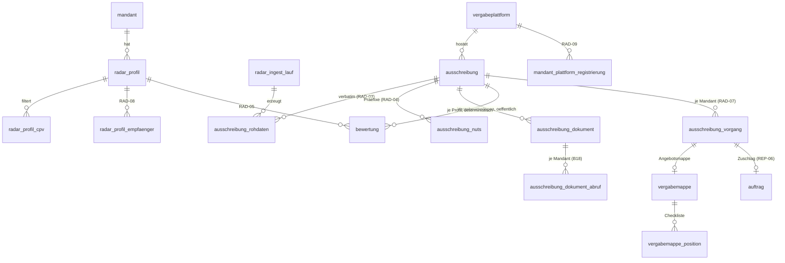
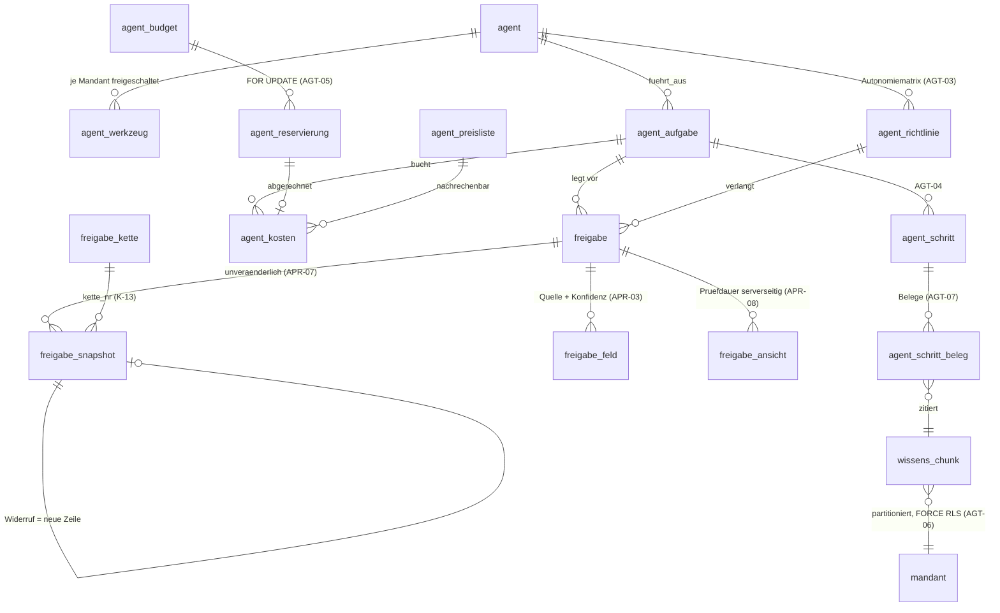
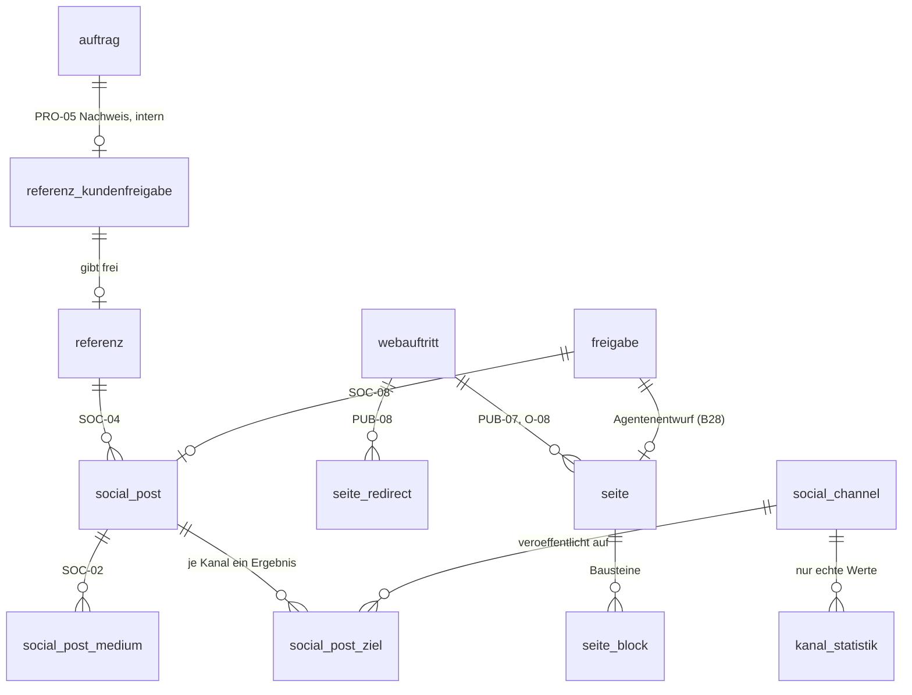
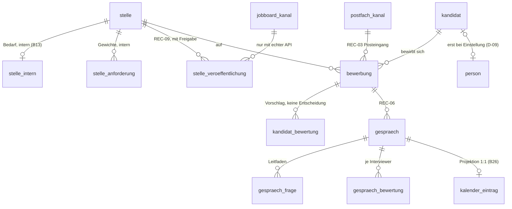
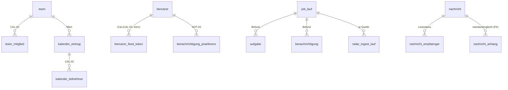

# Datenmodell — Radar, KI-Agenten, Inhalte, Recruiting, Kalender

This document specifies five domains that share one property: each of them is a path along which
something either enters the platform from outside (a public tender notice, a CV, an inbound message)
or leaves it towards the outside (a bid folder, a job advertisement, a social post, an e-mail) — and
between the two sits a model that may read, extract, classify and draft but may never compute a
number, and a human who must approve before anything crosses the boundary. It owns the tender radar
(RAD-01…RAD-09), the four agents with their tools, policies, budgets and RAG index (AGT-01…AGT-07),
the approval inbox (APR-01…APR-08, in the shape **K-13** fixes), the website and social content
(PUB-*, PRO-*, SOC-*), recruiting (REC-01…REC-09, LEG-11, LEG-12) and the calendar, task,
notification and message layer (CAL-*, NOT-*, OPS-11, EMP-11). It is written against
`00-KONVENTIONEN.md`; where this document and a convention disagree, **the convention wins** and this
document is wrong — every resolution below cites the `K-id` it applies, every open legal, financial
or tariff value is a labelled placeholder carrying a `// TODO(client)` (K-17), and nothing here
simulates an external system that is not connected.

---

## 0. Scope, files and standing

### 0.1 Tables this document owns

| Schema file | Tables | Phase |
|---|---|---|
| `src/server/db/schema/radar-ki-inhalt.ts` — radar | `vergabeplattform`, `mandant_plattform_registrierung`, `radar_profil`, `radar_profil_cpv`, `radar_profil_empfaenger`, `radar_ingest_lauf`, `ausschreibung`, `ausschreibung_nuts`, `ausschreibung_rohdaten`, `ausschreibung_dokument`, `ausschreibung_dokument_abruf`, `bewertung`, `ausschreibung_vorgang`, `vergabemappe`, `vergabemappe_position` | 8 |
| … agents | `agent`, `agent_werkzeug`, `agent_richtlinie`, `agent_preisliste`, `agent_budget`, `agent_reservierung`, `agent_kosten`, `agent_aufgabe`, `agent_schritt`, `agent_schritt_beleg`, `agent_artefakt`, `wissens_chunk` | 8 |
| … approvals (**K-13**) | `freigabe_kette`, `freigabe`, `freigabe_feld`, `freigabe_ansicht`, `freigabe_snapshot` | 8 |
| … content | `webauftritt`, `seite`, `seite_block`, `seite_redirect`, `referenz`, `referenz_kundenfreigabe`, `social_channel`, `social_post`, `social_post_medium`, `social_post_ziel`, `kanal_statistik` | 2 (`webauftritt`, `seite`, `seite_block`, `seite_redirect`, `referenz*`) / 9 (social) |
| … recruiting | `stelle`, `stelle_intern`, `stelle_anforderung`, `jobboard_kanal`, `postfach_kanal`, `stelle_veroeffentlichung`, `kandidat`, `bewerbung`, `kandidat_bewertung`, `gespraech`, `gespraech_frage`, `gespraech_bewertung` | 9 |
| `src/server/db/schema/kern.ts` — calendar and messaging (see 0.2) | `team`, `team_mitglied`, `kalender_eintrag`, `kalender_teilnehmer`, `aufgabe`, `benachrichtigung`, `benachrichtigung_praeferenz`, `nachricht`, `nachricht_anhang`, `nachricht_empfaenger` | 9 (`aufgabe` from 5, per `02-CRM-OPERATIONS.md` §3.2) |

Policies: `src/server/db/rls/radar-ki-inhalt.sql`. Services: `src/server/services/radar/**`,
`src/server/services/inhalt/**`, `src/server/services/recruiting/**`,
`src/server/services/kern/{kalender,aufgabe,benachrichtigung,nachricht}.ts`, and the agent tree
`src/server/agent/**` — laid out verbatim as in `01-ORDNERSTRUKTUR.md` §7, §9 and §10. Seeds:
`seed/09-radar.ts`, `seed/11-inhalt.ts`, `seed/12-recruiting.ts`, `seed/13-freigaben.ts`.

**Placement note, stated rather than resolved unilaterally.** `01-ORDNERSTRUKTUR.md` §4.9 lists
`kalender_eintrag`, `aufgabe`, `benachrichtigung`, `benachrichtigung_praeferenz`, `nachricht` and
`job_lauf` in `kern.ts`, while `01-KERN.md` §0 does not own them and `02-CRM-OPERATIONS.md` §3.2,
`03-GEWERKE.md` §2.1 and `04-PLANUNG-ZEIT.md` §2 all defer them to "the calendar document" — which is
this one. This document therefore **specifies** them and leaves them in the file
`01-ORDNERSTRUKTUR.md` names, so neither sibling has to move. `job_lauf` is the one exception: it is
written by `jobs/_runner.ts` for every job in the platform, so **K-21 assigns it to `01-KERN.md`**
together with `job_lauf_mandant`, and this domain only states the shape it requires of them (§8.2).

**K-21 also assigns `agent_artefakt` to this document**, and §3.12 declares it — columns, indexes,
RLS and SPEC IDs. It was referenced by `06-AGENTEN-FREIGABEN.md` §9.4 and by this document's own
`freigabe` and `freigabe_snapshot` tables while being declared nowhere, which is the failure mode
K-21 exists to end: a table every draft-class tool writes, and no migration that creates it.

### 0.2 What this document does **not** own

| Table | Owner | Why it is not here |
|---|---|---|
| `formular_definition`, `formular_zustaendigkeit`, `formular_eingang`, `lead` | `02-CRM-OPERATIONS.md` §4.4 | REQ-01…REQ-07 are the CRM domain's intake path; `seite_block_typ` contains `angebotsformular`/`kontaktformular` as **render slots** that reference a `formular_definition.id`, and this document defines no second form model. The review's MISSING item is answered by the boundary, not by a table |
| `dokument`, `dokument_version`, `dokument_aufbewahrung` | `02-CRM-OPERATIONS.md` §4.7 | one private-bucket contract and one retention catalogue for the whole platform (DOC-03, DOC-07). Applicant retention resolves through `app.aufbewahrung_intervall(mandant_id, 'bewerbung')`, never through a literal in this document |
| `person`, `anstellung`, `benutzer`, `benutzer_sitzung`, `benutzer_feed_token`, `audit_log`, `rolle`, `berechtigung` | `01-KERN.md` | identity, employment (D-09) and the CAL-03 feed secret. §7.6 states the feed contract; it does not redeclare the token table |
| `auftrag`, `auftrag_leistung`, `objekt`, `kunde`, `ansprechpartner` | `02-CRM-OPERATIONS.md` | `referenz` copies the enumerated fields of that document's §3.2 and never references `kunde_id` or the order value |
| `einsatz`, `einsatz_zuordnung`, `zeiteintrag`, `planungsserie` | `04-PLANUNG-ZEIT.md` | REC-01 reads unstaffed shifts through a service, and the calendar **projects** `einsatz`; recurrence expansion reuses that document's implementation (§7.3) |
| `rechnung`, `eingangsrechnung`, `buchungssatz` | `05-FINANZEN.md` | the Finance agent proposes; finalisation, the number circle and the hash chain live there |
| `job_lauf`, `job_lauf_mandant` | `01-KERN.md` (**K-21**) | one platform-level run log for every scheduled job, plus the per-tenant outcome of one run. `job_lauf` carries **no** `mandant_id` (§8.2) |
| `mandant_einstellung` | `01-KERN.md` (**K-21**) | one settings table for the platform; §4.9's O-06 switch is a key in it, not a column on `mandant` |
| `sicherheitsvorfall`, `nachweis_art`, `loeschprotokoll` | `01-KERN.md` (**K-21**) | SEC-A9 incidents (written when §3.9's `injektionsverdacht` fires), the certificate-type catalogue `pruefe_nachweise` reads, and the DSGVO deletion record §6.10's purge writes |
| `steuersatz_gruppe`, `rechnung_beziehung` | `05-FINANZEN.md` (**K-21**) | there is no `steuersatz` table; the Storno back-reference is `rechnung_beziehung`. Neither is referenced by this domain, and neither is redeclared here |

### 0.3 Identifier language

Domain identifiers are German because they carry legal or procedural meaning under VOB/A, VgV, UVgO,
DSGVO, AGG and UWG: `ausschreibung · vergabeplattform · vergabemappe · bewertung · freigabe ·
richtlinie · wissens_chunk · referenz · stelle · bewerbung · kandidat · gespraech ·
kalender_eintrag · nachricht`. Infrastructure is English: `withTenant`, `hashChain`, `retrieve`,
`JobDefinition`. UI copy is German. Official code lists keep their own form (`CPV 90910000-9`,
`NUTS DE300`, OCDS `ocid`, TED publication number) — renaming a normative code is how an integration
silently stops matching.

### 0.4 What changed against the draft of this document

The adversarial review found thirty blocking defects; every one is dispositioned below, and the
renames it forced are listed once here so no sibling document has to guess.

| Draft | Final | Reason |
|---|---|---|
| `freigabe_anfrage` | **`freigabe`** | **K-13** and four sibling documents already reference `freigabe` / `freigabe_snapshot` |
| `freigabe_entscheidung` | **`freigabe_snapshot`** (+ `freigabe_kette`, `freigabe_ansicht`) | K-13: the chain covers the immutable snapshot, not the row whose status changes; `kette_nr` under `SELECT … FOR UPDATE`; `pruefdauer_sek` measured server-side from `freigabe_ansicht` |
| `pruefdauer_ms` | **`pruefdauer_sek`** | K-13 names the unit; K-16 requires the unit in the name |
| `kalender_feed_token` | **`benutzer_feed_token`** (Kern) | one revocable feed secret per user already exists in `01-KERN.md` §6.10 (review B30) |
| `watchdog_lauf` | **`job_lauf`** (Kern) + `radar_ingest_lauf` | one run log, written by `jobs/_runner.ts`; the radar keeps only its per-source idempotency counters (review B8) |
| `ausschreibung_dokument` (mixed) | **`ausschreibung_dokument`** (shared facts) + **`ausschreibung_dokument_abruf`** (tenant) | one tenant's fetched file, agent run and extraction must not be visible to its three sister companies (review B18) |
| `agent_schritt.kosten_mikrocent` | **kept as `kosten_mikrocent bigint`** | K-16 was amended: **K-16(b)** sanctions `*_mikrocent bigint` (10⁻⁶ €) in agent cost and budget accounting only, converted to cents **once** at the budget boundary. The interim `kosten_cent` + `kosten_rest` carry pair this document proposed is withdrawn in favour of the convention's spelling (§1.12) |
| `anon` role, `P-OEFFENTLICH` | the `oeffentlich.lesen` read path of `02-CRM-OPERATIONS.md` §1.6 | K-01 fixes the role set at six and `cse_anon` holds no table grants at all (review B13) |
| `j_job` | **`t_job`** | one name for one policy class, platform-wide; `02-CRM-OPERATIONS.md` §1.2 registered it first under that name (§1.1) |
| `app.aktueller_kunde()` (11 uses) | **`= any (app.aktuelle_kunden())`** | **K-20**: the scalar is `(app.aktuelle_kunden())[1]` (`03-AUTH-BERECHTIGUNGEN.md` §13.1), so in `kunde` scope — where the array is the customer's whole binding set across every entity — it returns **one binding chosen arbitrarily out of several**, and a `t_kunde` policy or `p_kunde_ceiling` written against it serves that one and silently hides the rest (CRM-06). It does not fail closed, which is why the prohibition is absolute rather than a caveat (§1.2) |
| the five modules `agent_konfiguration`, `wissen`, `inhalt`, `recruiting_bewerber`, `benachrichtigung` and nine keys of the §1.3 matrix | **the catalogue spellings of `03-AUTH-BERECHTIGUNGEN.md`** | **K-19**: `app.hat_recht()` returns false for a key it does not know, so an unregistered key is a permanent zero-row failure and not an error (§1.3) |
| `freigabe_snapshot.hash` over six components | **the eleven-component formula of `06-AGENTEN-FREIGABEN.md` §14.2**, 0x1F-separated, RFC 8785 canonical | two formulas mean two chains and a nightly verification break on every link; and a six-component chain covers nothing the approver actually saw (§4.7) |
| `agent_artefakt` — referenced, declared nowhere | **declared here (§3.12)** | **K-21** assigns it to this document; `freigabe.artefakt_id` and `freigabe_snapshot.artefakt_hash` had no target |
| `job_lauf` with a nullable `mandant_id` | **`job_lauf` with none, plus `job_lauf_mandant`** (Kern) | **K-21** and K-16(d): `audit_log` is the only tenant-adjacent table permitted a nullable tenant key (§8.2) |
| `app.hat_mandant(m)`, `app.gruppenansicht()` | the accessors of `01-KERN.md` §3.1 | K-02/K-03; this also removes the `''::boolean` crash the review found (B20) and the unpinned `search_path` (B21) |

New tables the review or a SPEC ID forced: `radar_profil_empfaenger`, `ausschreibung_nuts`,
`ausschreibung_dokument_abruf`, `agent_preisliste`, `agent_reservierung`, `agent_schritt_beleg`,
`freigabe_kette`, `freigabe_ansicht`, `webauftritt`, `seite_redirect`, `referenz_kundenfreigabe`,
`social_post_medium`, `stelle_intern`, `stelle_anforderung`, `postfach_kanal`, `gespraech`,
`gespraech_frage`, `gespraech_bewertung`, `team`, `team_mitglied`, `nachricht_anhang`, and — added by
the K-21 ownership pass — **`agent_artefakt`** (§3.12).

---

## 1. Conventions applied in this domain

### 1.1 Database roles and FORCE RLS (K-01)

Six roles, none with `BYPASSRLS`. This domain adds no seventh — in particular there is **no**
`radar_ingest` role, no `webseite` role and no `anon` table grant, all three of which the draft
invented. Ingest, indexing and publication all run as `cse_job` with the per-job grants enumerated
in §8.1; the public website runs as `cse_app` under the `oeffentlich.lesen` principal of §1.6. The
one thing this domain gives `cse_anon` is `EXECUTE` on `app.ical_feed_lesen`, which is row 5 of the
**K-08 closed register** and is discussed in §7.6 — no table grant, and nothing else.

Every table in this document carries:

```sql
alter table <t> enable row level security;
alter table <t> force  row level security;   -- K-01: the owner is not exempt
```

**A grant is not a policy, and under `FORCE` RLS a job with no policy reads and writes nothing.**
`GRANT SELECT, INSERT, UPDATE … TO cse_job` lets the role *reach* the table; the row filter is still
evaluated, `cse_job` matches neither K-03 policy (both are `to cse_app`), and every statement affects
zero rows — silently, with no error, which is exactly the failure mode §2.7 was built to detect and
would itself have suffered from. Every table named in the *Writes* or *Reads* column of a §8.1 job
therefore carries **one** additional permissive policy for `cse_job`, registered literally in
`src/server/db/rls.ts` beside the `t_oeffentlich` list of §1.6:

```sql
-- reference tables (§1.5): the run is group-wide, there is no active mandant
create policy t_job on ausschreibung for all to cse_job
  using (true) with check (true);

-- tenant tables: the job runs per mandant through withSystemTenant (01-ORDNERSTRUKTUR.md §4.3),
-- so the tenant conjunct is the same one K-03 uses and the job cannot cross a tenant boundary
create policy t_job on bewertung for all to cse_job
  using      (mandant_id = app.aktiver_mandant())
  with check (mandant_id = app.aktiver_mandant());
```

**The policy class is named `t_job`, not `j_job`.** `02-CRM-OPERATIONS.md` §1.2 registered the same
class first and under that name on sixteen tables; two names for one class means
`src/server/db/rls.ts` needs two buckets and the enumeration test can pass while half the platform's
job policies are missing from the other list. The name is `t_job` here and everywhere, it is the
fifth registered permissive class beside `t_mandant`, `t_gruppe`, `t_person` and `t_kunde`, and
`03-AUTH-BERECHTIGUNGEN.md` §8.5 must carry it as such — under `FORCE` RLS a table `GRANT` is not a
policy, so "K-03 permits no `cse_job` policy" would mean every scheduled job in this domain writes
zero rows, silently.

The scope of `t_job` is narrowed by the per-job `GRANT`, not by the policy: a job that holds no
`INSERT` grant on `kandidat` cannot insert into it however permissive `t_job` is. A test walks
`_registry.ts`, collects every table each job declares, and fails the build when one of them has no
`t_job` policy — the assertion that a scheduled job which "ran successfully" actually wrote
something.

Every `SECURITY DEFINER` function in §1.7 is owned by `cse_definer` and carries
`SET search_path = pg_catalog, public` **verbatim** (K-01) — which is why every body below
schema-qualifies its references. *The review is right that the draft's helpers were a
privilege-escalation vector (B21); its suggested `set search_path = public, pg_temp` is superseded by
K-01's spelling, which is the one used here.* A CI lint fails on any `SECURITY DEFINER` function in
the repository without a pinned `search_path`.

### 1.2 Session state (K-02) — consumed, never redefined

This document defines no session accessor. It uses the ones `01-KERN.md` §3.1 defines against the
K-02 GUCs: `app.aktueller_benutzer()`, `app.aktuelle_person()`, `app.aktiver_mandant()`,
`app.scope()`, `app.ist_gruppenansicht()`, `app.ist_readonly()`, `app.portal()`, `app.aal()`,
`app.sichtbare_mandanten()`, `app.hat_recht(recht, mandant)`, `app.rechte_mandanten(recht)`,
`app.berlin_heute()`, `app.aktuelle_kunden()`.

`app.scope` takes **four** values, not two — `mandant | gruppe | person | kunde` (K-18) — and
`app.mandant_id` is `NULL` in all three multi-tenant scopes (K-02). `app.ist_gruppenansicht()` means
`app.scope() = 'gruppe'` and nothing wider: the employee portal and the customer portal are **not**
group scope, and §1.15 states what each of them reads here and under which policy.

**K-20: an accessor that resolves through `app.aktiver_mandant()` is undefined in three of the four
scopes, and a policy built on it reads zero rows.** Because `app.mandant_id` is NULL by construction
outside `mandant` scope, any predicate keyed on such an accessor is false there — the same silent
blackout K-18 exists to remove, one layer down. Two accessors this domain consumes are affected, and
this document uses them in the form K-20 fixes:

| Accessor | `mandant` | `gruppe` | `person` | `kunde` |
|---|---|---|---|---|
| `app.aktuelle_kunden()` → `uuid[]` | the caller's own `kunde_zugang` rows in the active mandant (may be empty) | `{}` — a manager is nobody's customer | `{}` | **the whole subject of the request**, resolved from the session's `kunde_zugang` binding, **never** through `aktiver_mandant()` |
| `app.portal()` | the role of the **active membership** (K-04) | `intern` | `mitarbeiter` | `kunde` |

`app.aktueller_kunde()` — the scalar this document used in eleven places in an earlier pass — is
**not** used here at all. It resolves through `app.aktiver_mandant()` and therefore returns NULL in
`kunde` scope, so every `t_kunde` policy and every `p_kunde_ceiling` written against it returns zero
rows and the customer portal is dead. The array form `= any (app.aktuelle_kunden())` is used
throughout §1.4, §1.15, §7.3, §7.4 and §7.9; the scalar survives elsewhere in the platform only as
`03-AUTH-BERECHTIGUNGEN.md`'s mandant-scope convenience `(app.aktuelle_kunden())[1]`.

`app.portal()` is **bound when the scope is entered**, in all four scopes, and is never recomputed
from `aktiver_mandant` (K-20, K-04): recomputing it falls through to the fail-closed `mitarbeiter`
in the three multi-tenant scopes, which fires every `p_ma_ceiling` of §1.4 *inside the group view*
and ceilings every customer as though they were staff.

Two consequences the review found by inspecting the draft's local copies, both removed by adoption:

- **B20 — `''::boolean` crashes the platform.** `withTenant` clears a transaction-local GUC by
  setting it to the empty string, and `coalesce(current_setting(...), 'false')::boolean` passes `''`
  through to a cast that raises. `01-KERN.md` §3.1 coalesces `nullif(current_setting(...), '')` in
  every accessor, so the failure mode does not exist here. A unit test in the Kern suite sets every
  GUC to `''` and asserts a normal tenant query still returns rows.
- **B11 — `auth.uid()` is not a `person.id`.** Any policy in this domain that means "the human this
  row is about" uses `app.aktuelle_person()` (GUC `app.person_id`, D-09, EMP-14), and any policy that
  means "the login" uses `app.aktueller_benutzer()`. The two are never interchanged; §7.9 writes the
  `nachricht_empfaenger` policy per `empfaenger_typ` for exactly this reason.

The `[mandant]` segment under `/portal` (K-07) is routing only, validated against the session, never
trusted; on mismatch the route returns **404, not 403** (AUT-06).

### 1.3 The standard tenant policy (K-03) and the module matrix

Every tenant table in this domain gets exactly the two K-03 policies and no others, in the hoistable
form of `01-KERN.md` §1.3:

```sql
create policy t_mandant on <tabelle>
  for all to cse_app
  using      (mandant_id = app.aktiver_mandant()
              and (select app.hat_recht('<modul>.<aktion>', app.aktiver_mandant())))
  with check (mandant_id = app.aktiver_mandant()
              and not app.ist_readonly()
              and (select app.hat_recht('<modul>.schreiben', app.aktiver_mandant())));

create policy t_gruppe on <tabelle>
  for select to cse_app
  using (app.ist_gruppenansicht()
         and mandant_id = any (select app.rechte_mandanten('gruppe.<modul>.lesen')));
```

**This is the answer to review finding B9, and the review's own prescription is the construction
K-03 forbids.** The reviewer is right that the draft's `P-MANDANT` had no role dimension at all — a
`kunde` login attached to the reinigung mandant could read every `kandidat`, every
`freigabe.vorschau_payload` and every `agent_schritt.eingabe` — but the fix it proposes,
`app.hat_recht(modul text, aktion text)` without a mandant argument, is precisely the global
predicate K-03 rejects, because a right granted in one entity would then carry into every other
entity the user can reach. The mandant-scoped signature is used throughout.

| Module | Tables | Read right | Write rights | Group right |
|---|---|---|---|---|
| `radar` | `radar_profil`, `radar_profil_cpv`, `radar_profil_empfaenger`, `bewertung`, `ausschreibung_vorgang`, `ausschreibung_dokument_abruf`, `mandant_plattform_registrierung` | `radar.lesen` | `radar.profil_schreiben`, `radar.status_setzen` | `gruppe.radar.lesen` |
| `vergabe` (bid folder) | `vergabemappe`, `vergabemappe_position` | `vergabe.lesen` | `vergabe.schreiben`, `vergabe.einreichung_erfassen` | — |
| `agent` | `agent_werkzeug`, `agent_aufgabe`, `agent_artefakt`, `agent_kosten`, `agent_budget`, `agent_reservierung` | `agent.lesen` | `agent.aufgabe_starten` | `gruppe.agent.lesen` |
| `agent` (protocol) | `agent_schritt`, `agent_schritt_beleg` | `agent.protokoll_lesen` | — (job only) | — |
| `agent` (configuration) | `agent_richtlinie` | `agent.lesen` | `agent.richtlinie_verwalten` | — |
| `wissen` | `wissens_chunk` | `wissen.lesen`, plus **`wissen.vertraulich_lesen`** for chunks classified `vertraulich` (§3.11) | — (job only) | **never granted** (§3.11) |
| `freigabe` | `freigabe`, `freigabe_feld`, `freigabe_ansicht`, `freigabe_snapshot`, `freigabe_kette` | `freigabe.lesen` | `freigabe.entscheiden`, `freigabe.rueckgaengig` | `gruppe.freigabe.lesen` |
| `freigabe` (APR-08) | `freigabe_snapshot.pruefdauer_sek` | `freigabe.pruefdauer_lesen` | — | — |
| `referenz` | `webauftritt`, `seite`, `seite_block`, `seite_redirect`, `referenz`, `referenz_kundenfreigabe` | `referenz.lesen` | `referenz.schreiben`, `referenz.veroeffentlichen` | `gruppe.referenz.lesen` |
| `social` | `social_channel`, `social_post`, `social_post_medium`, `social_post_ziel`, `kanal_statistik` | `social.lesen` | `social.schreiben`, `social.freigeben` | `gruppe.social.lesen` |
| `recruiting` | `stelle`, `stelle_intern`, `stelle_anforderung`, `jobboard_kanal`, `postfach_kanal`, `stelle_veroeffentlichung` | `recruiting.stelle_lesen` | `recruiting.stelle_schreiben`, `recruiting.stelle_veroeffentlichen` | `gruppe.recruiting.lesen` |
| `recruiting` (applicants) | `kandidat`, `bewerbung`, `kandidat_bewertung`, `gespraech`, `gespraech_frage`, `gespraech_bewertung` | `recruiting.bewerbung_lesen` | `recruiting.bewerbung_bewerten`, `recruiting.entscheiden` | **no `t_gruppe` policy at all** (§6.2) |
| `kalender` | `kalender_eintrag`, `kalender_teilnehmer`, `team`, `team_mitglied` | `kalender.lesen` | `kalender.schreiben` | `gruppe.kalender.lesen` |
| `aufgabe` | `aufgabe` | `aufgabe.lesen` | `aufgabe.schreiben` | `gruppe.aufgabe.lesen` |
| `nachricht` | `nachricht`, `nachricht_anhang`, `nachricht_empfaenger` | `nachricht.lesen` | `nachricht.versenden` | **never granted** |
| `nachricht` (notifications) | `benachrichtigung`, `benachrichtigung_praeferenz` | `nachricht.lesen` | `nachricht.versenden` | — |
| `oeffentlich` | the public read path of §1.6 | `oeffentlich.lesen` | — | `gruppe.oeffentlich.lesen` |

**The module and action vocabulary is not this document's to invent (K-19).** Every key above is
spelled as `03-AUTH-BERECHTIGUNGEN.md` §7.4/§12/§14 spells it, because `app.hat_recht()` returns
**false** for a key it does not know — an unregistered or misspelled key is not an error but a
permanently empty screen. An earlier pass of this table minted five modules of its own
(`agent_konfiguration`, `wissen`, `inhalt`, `recruiting_bewerber`, `benachrichtigung`) and nine keys
that no catalogue row backs; every one of them is remapped here onto the catalogue's own names:
`agent.ausfuehren` → `agent.aufgabe_starten`, `agent_konfiguration.*` → `agent.richtlinie_verwalten`,
`inhalt.*` → `referenz.*`, `benachrichtigung.*` → `nachricht.*`, `nachricht.schreiben` →
`nachricht.versenden`, `recruiting_bewerber.*` → `recruiting.bewerbung_lesen` / `.bewerbung_bewerten` /
`.entscheiden`, `recruiting.schreiben` / `.veroeffentlichen` → `recruiting.stelle_schreiben` /
`.stelle_veroeffentlichen`, `radar.schreiben` → `radar.profil_schreiben`,
`radar.vorgang_entscheiden` → `radar.status_setzen`, `freigabe.widerrufen` →
`freigabe.rueckgaengig`, and the bid folder moves out of module `radar` into module `vergabe`
(`vergabe.lesen` / `vergabe.schreiben` / `vergabe.einreichung_erfassen`, which replaces
`radar.mappe_freigeben`). The CI extractor of K-19 reads the literals in
`src/server/db/rls/radar-ki-inhalt.sql` and fails on any that the catalogue does not carry.

**Exactly one module and two keys are genuine gaps the catalogue must close, not renames.** Module
`wissen` (the 47th) with `wissen.lesen` and **`wissen.vertraulich_lesen`**, and `agent.protokoll_lesen`
— the AGT-04 payload reader `app.agent_nutzlast_lesen` re-checks the last of these and §3.11's
confidentiality gate is unsatisfiable by anyone without the second. `social.lesen` likewise needs its
catalogue row beside `social.schreiben`, and **`recruiting.stelle_lesen`** the same beside
`recruiting.stelle_schreiben` — the vacancy read this table names on six tables, which §12.2 did not
carry under any spelling. It is deliberately not `recruiting.bewerbung_lesen`: a vacancy and an
applicant record carry different LEG-11 / LEG-12 exposure and §12.2 separates them. These are stated
as requirements in §15.

The seeded role→right matrix is owned by the permission-model document. Five allocations are
load-bearing here and are stated as requirements on it in §15: `recruiting.bewerbung_*` is never held
by `kunde` or `mitarbeiter`; `agent.protokoll_lesen`, `freigabe.pruefdauer_lesen` and
`wissen.vertraulich_lesen` are `leitung` and upwards and are never held by `kunde` or `mitarbeiter`;
`gruppe.freigabe.lesen` exists (APR-01's cross-entity inbox needs it, `06-AGENTEN-FREIGABEN.md` §12
and `04-SEITENKARTE.md` `/portal/gruppe/freigaben` both key on it), while `nachricht` and `wissen`
get no `gruppe.*` key and the applicant tables carry **no `t_gruppe` policy at all** (§6.2).

The eight **non-tenant** tables — `vergabeplattform`, `ausschreibung`, `ausschreibung_nuts`,
`ausschreibung_rohdaten`, `ausschreibung_dokument`, `radar_ingest_lauf`, `agent`, `agent_preisliste`
— carry the reference policy of §1.5 instead, because a public tender notice is not any entity's
record (§2.1). They have no `mandant_id`, so they carry no K-04 portal ceiling either (§1.4).

### 1.4 Portal ceilings (K-04), and why every narrowing here is restrictive

Multiple **permissive** policies on the same command are combined with `OR`. The draft wrote four
tables as "P-MANDANT **und** *extra predicate*" and presented that as a tightening; implemented as a
second permissive policy it is a widening, and every user in the tenant would read everyone else's
notifications, preferences, message read-status and private calendar entries (review B10 — accurate
for `benachrichtigung`, `benachrichtigung_praeferenz` and `nachricht_empfaenger`; for
`kalender_eintrag` the draft did fold the clause into one `USING`, but the ambiguity is the defect
either way). **In this domain every *narrowing* is `AS RESTRICTIVE`, without exception.** A permissive
policy can only widen, so a narrowing written as one is a widening with a reassuring name.

Permissive policies beyond K-03's two exist only where a genuinely different principal needs a read
path that K-03 cannot express, and there are exactly four such kinds, each held as a literal list in
`src/server/db/rls.ts`: `t_oeffentlich` for the public principal (§1.6), `t_job` for `cse_job`
(§1.1), and `t_person` / `t_kunde` for the two subject scopes of K-18 (§1.15). The build fails on a
table that carries any other permissive policy, and on a table that carries one of these four without
appearing in its list.

```sql
-- K-04 employee ceiling, for the tables in this domain that hang off anstellung_id / person_id
create policy p_ma_ceiling on <tabelle> as restrictive for all to cse_app
  using (app.portal() <> 'mitarbeiter'
         or anstellung_id in (select id from anstellung
                              where person_id = app.aktuelle_person()));

-- customer ceiling
create policy p_kunde_ceiling on <tabelle> as restrictive for all to cse_app
  using (app.portal() <> 'kunde' or <pfad zu kunde_id> = any (app.aktuelle_kunden()));

-- internal-only ceiling: neither portal may read the row at all
create policy p_intern_ceiling on <tabelle> as restrictive for all to cse_app
  using (app.portal() = 'intern');
```

**Restrictive policies are ANDed, so `p_intern_ceiling` is exclusive and the other two are not.**
The first two shapes are written `app.portal() <> '<portal>' or <opt-in>`, so each is *true* for
every principal it does not name and the pair composes exactly as intended: a `mitarbeiter` session
passes `p_kunde_ceiling` trivially and must satisfy `p_ma_ceiling`, a `kunde` session the reverse, an
`intern` session both. `p_intern_ceiling` is written `app.portal() = 'intern'`, which is *false*
for both portals — so a table carrying it **together with** either opt-in ceiling evaluates
`false AND (…)` for every worker and every customer and returns zero rows, whatever the opt-in
disjunct says. That is not a narrowing, it is a blackout, and it is invisible in review because each
policy is individually correct.

**Therefore: a table carries either `p_intern_ceiling` or one or both opt-in ceilings — never
`p_intern_ceiling` alongside another portal ceiling.** `src/server/db/rls.ts` holds the three lists
and `tests/isolation/db/ceilings.test.ts` enumerates `pg_policies` and fails the build when (a) a
table carries `p_intern_ceiling` and any other portal ceiling, or (b) a tenant table of this domain
appears in none of the four groups below.

Enumerated, not exemplified — every tenant table of this domain appears exactly once:

| Ceiling | Tables |
|---|---|
| `p_ma_ceiling` (`anstellung_id`) | `team_mitglied` |
| **own-rows / participant ceilings — one restrictive policy per table, named per table** | `p_eigene` on `benachrichtigung` and `benachrichtigung_praeferenz` (§7.8, keyed on `empfaenger_benutzer_id` / `benutzer_id` = `app.aktueller_benutzer()`); `p_zustaendig` on `aufgabe` (§7.7, assignee, team member or creator); `p_sichtbarkeit` on `kalender_eintrag` (**§7.3**, private entries to their owner) and `p_teilnahme` on `kalender_teilnehmer` (§7.4); `p_beteiligt` on `nachricht`, `nachricht_anhang` and `nachricht_empfaenger` (§7.9, resolved per `empfaenger_typ`). **None of these is written `app.portal() = 'intern'`** — each is a disjunction that is true for the principals it does not narrow, which is why they compose with one another and with `p_ma_ceiling`. Three of them (`p_eigene`, `p_sichtbarkeit`, `p_beteiligt`) deliberately bind an `intern` session too: nobody reads another user's notifications, private calendar entries or message read-status, whatever portal they are in (review B10) |
| **no portal ceiling** | `team` — a team name is neither personal data nor a costed fact, both portals must resolve `kalender_eintrag.team_id` and `aufgabe.zugewiesen_team_id` to a label, and `kunde` holds no `kalender.lesen` in any case. Also the nine **registered public tables** of §1.6 (`webauftritt`, `seite`, `seite_block`, `seite_redirect`, `referenz`, `social_post`, `social_post_medium`, `social_post_ziel`, `stelle`): the public principal of §1.6 is a service `benutzer` whose `app.portal()` is not `intern`, so a `p_intern_ceiling` on any of them would blank the public website — the failure the exclusivity rule above exists to catch |
| `p_intern_ceiling` — the literal list, 38 tables | `mandant_plattform_registrierung`, `radar_profil`, `radar_profil_cpv`, `radar_profil_empfaenger`, `ausschreibung_dokument_abruf`, `bewertung`, `ausschreibung_vorgang`, `vergabemappe`, `vergabemappe_position`, `agent_werkzeug`, `agent_richtlinie`, `agent_budget`, `agent_reservierung`, `agent_kosten`, `agent_aufgabe`, `agent_schritt`, `agent_schritt_beleg`, `agent_artefakt`, `wissens_chunk`, `freigabe_kette`, `freigabe`, `freigabe_feld`, `freigabe_ansicht`, `freigabe_snapshot`, `referenz_kundenfreigabe`, `social_channel`, `kanal_statistik`, `stelle_intern`, `stelle_anforderung`, `jobboard_kanal`, `postfach_kanal`, `stelle_veroeffentlichung`, `kandidat`, `bewerbung`, `kandidat_bewertung`, `gespraech`, `gespraech_frage`, `gespraech_bewertung` |

The eight **non-tenant** reference tables (§1.5) carry no portal ceiling either: they have no
`mandant_id` to key one on, and the `hat_recht` conjunct of their read policy does the work.

`app.portal()` is derived from the role of the **active membership**, not from the existence of a
membership (K-04) — **in `mandant` scope, where there is one.** In the three multi-tenant scopes of
K-18 there is no active membership, so the value is **bound when the scope is entered** and is never
recomputed from `aktiver_mandant`: `intern` in `gruppe` scope, `mitarbeiter` in `person` scope,
`kunde` in `kunde` scope (K-20, §1.2). Recomputing it there would fall through to the fail-closed
`mitarbeiter` and fire every `p_ma_ceiling` above *inside the group view*, so a `leitung` reading
TEN-05 figures would read nothing at all. An unset session still resolves to `mitarbeiter`, so it
narrows the opt-in ceilings rather than lifting them, and fails `p_intern_ceiling` outright.

**Group scope carries a second restrictive ceiling where the substance demands it**, independently of
how the rights are seeded (the `05-FINANZEN.md` §1.4 construction):

```sql
create policy p_gruppe_kein_personenbezug on <tabelle> as restrictive for all to cse_app
  using (not app.ist_gruppenansicht());
```

on `kandidat`, `bewerbung`, `kandidat_bewertung`, `gespraech`, `gespraech_frage`,
`gespraech_bewertung`, `wissens_chunk`, `agent_schritt`, `agent_schritt_beleg`, `agent_artefakt`, `nachricht`,
`nachricht_anhang`, `nachricht_empfaenger` and `freigabe_feld`. TEN-05 grants the group view
aggregated figures, not another GmbH's contract text, applicant names or model payloads.

### 1.5 Reference tables: shared, read-only, and never a tenant's record

`vergabeplattform`, `ausschreibung`, `ausschreibung_nuts`, `ausschreibung_rohdaten`,
`ausschreibung_dokument`, `agent` and `agent_preisliste` carry no `mandant_id` (§2.1, §3.1) — as does
`radar_ingest_lauf`, whose own read rule is stated in §2.7. They fall into two groups, and the
difference is stated because it is the difference between ingested facts and a curated catalogue:

- **the four ingested tables** — `ausschreibung`, `ausschreibung_nuts`, `ausschreibung_rohdaten`,
  `ausschreibung_dokument` — get one permissive read policy for `cse_app`, the `t_job` policy of
  §1.1, and **no write policy for `cse_app` at all**;
- **the three curated catalogues** — `vergabeplattform`, `agent`, `agent_preisliste` — get the same
  read policy plus one named write policy for `cse_app`, gated on the right stated per table
  (`app.ist_super_admin()` for all three). They are configuration, not ingested evidence, and none of
  the three carries a `mandant_id` — so there is no per-mandant right for `hat_recht` to take, and a
  module key that reads as tenant-scoped would be the wrong shape as well as the wrong name (K-03,
  K-19). An earlier pass gated `vergabeplattform` writes on the agent-configuration right, which is a
  different module about a different thing.

The read policy, in both cases:

```sql
create policy r_lesen on ausschreibung
  for select to cse_app
  using (exists (select 1 from unnest(array(select app.sichtbare_mandanten())) m
                  where app.hat_recht('radar.lesen', m)));
grant select on ausschreibung to cse_app;      -- no insert/update/delete grant exists
grant select, insert, update on ausschreibung to cse_job;   -- ingest only, per-job grant (K-01)
```

The `hat_recht` conjunct is not decoration: without it a `kunde` login reads the whole tender
corpus, which is the second half of review finding B9. Writes happen only in
`jobs/ingest/radar-*.ts` under `cse_job`.

### 1.6 The public website read path (K-07, K-01, and `02-CRM-OPERATIONS.md` §1.6)

The draft granted `anon` `SELECT` on `seite`, `seite_block`, `referenz`, `social_post` and `stelle`.
That is wrong three times over: K-01 gives `cse_anon` no table grants at all, K-08's route-manifest
test forbids a database path outside `withTenant` / `withGroupScope` / `withPersonScope` /
`withKundeScope` except the five functions on its closed register, and — the review's substantive
point (B13) — **row policies do not filter columns**, so anonymous visitors would read
`stelle.bedarf_quelle`, a machine-readable list of which objects a *security services* company is
currently unable to staff.

The resolution is the one the CRM document already established, and it adds no mechanism:

- the public renderer opens an ordinary `cse_app` session through `withTenant(mandant)` for an area
  page and `withGroupScope()` for the group pages, always with `app.readonly = 'on'`. **Group scope
  is correct here and is not the K-18 error of §1.15**: the public principal is a service `benutzer`
  that genuinely holds `gruppe.oeffentlich.lesen` in the four mandanten, which is what K-03's group
  policy asks for. An employee or a customer holds no `gruppe.*` right and is therefore routed
  through `person` / `kunde` scope instead;
- the principal is a **service `benutzer`** whose memberships grant exactly `oeffentlich.lesen` in
  the four mandanten plus `gruppe.oeffentlich.lesen`;
- a publishable table carries a third permissive policy, registered literally in
  `src/server/db/rls.ts`:

```sql
create policy t_oeffentlich on seite
  for select to cse_app
  using (status = 'veroeffentlicht' and geloescht_am is null
         and (select app.hat_recht('oeffentlich.lesen', mandant_id)));
```

Registered public tables, and nothing else: `webauftritt`, `seite`, `seite_block`, `seite_redirect`,
`referenz`, `social_post`, `social_post_medium`, `social_post_ziel` (published targets only),
`stelle`. A test enumerates `pg_policies` and fails on a `t_oeffentlich` policy anywhere else.

**Every public route needs a URL key, and this document owns all four of them.** `04-SEITENKARTE.md`
§2.3 routes `/karriere/[stelle]`, `/projekte/[slug]`, `/news/[slug]` and `/leistungen/[slug]`, and an
earlier pass of this document gave three of the four tables no URL column at all — so those routes
could be written but not resolved, and `tests/invariants/reservierte-slugs.test.ts` could not be
written at all. The four keys, stated once:

| Route | Column | Shape |
|---|---|---|
| `/karriere/[stelle]` | `stelle.slug` (§6.3) | `^[a-z0-9]+(-[a-z0-9]+)*$`, excluding `initiativbewerbung` and `danke` |
| `/projekte/[slug]` | `referenz.slug` (§5.5) | `^[a-z0-9]+(-[a-z0-9]+)*$` |
| `/news/[slug]` | `social_post.slug` (§5.7) | `^[a-z0-9]+(-[a-z0-9]+)*$` |
| `/leistungen/[slug]` | **`seite.pfad`** (§5.2) | `^/[a-z0-9/-]*$` — a page already has a path, and a second URL column on the same row would be two names for one fact |

`seite` therefore carries **no** `slug`: the router resolves a page by `pfad`, which is the column
`seite_public_uk` is keyed on. Each of the three new keys is unique **per mandant** and not globally,
because the four areas run four Webauftritte and two of them may legitimately publish
`/projekte/buerohaus-mitte`. The reserved-value list of K-21 (`gruppe`, `mein`, `kunde`, `konto`,
`api`) applies to `mandant.slug`, not to these — a content slug never appears as a `/portal` segment.

**Because a column grant cannot distinguish the public principal from an internal one — both are
`cse_app` — the columns move instead of the privilege.** Every internal field the review named lives
on a sibling internal table with no public policy:

| Public table | Moved to | Columns |
|---|---|---|
| `stelle` | `stelle_intern` | `bedarf_quelle`, `objekt_id`, `verantwortlich_benutzer_id`, `ki_entwurf`, `freigabe_id` |
| `stelle` | `stelle_anforderung` | the structured criteria **with their weights** — the ranking model is not published |
| `referenz` | `referenz_kundenfreigabe` | `auftrag_id`, `objekt_id`, `freigegeben_durch_name`, `kundenfreigabe_dokument_id` |
| `social_post` | — (`auftrag_id` deleted) | provenance runs through `referenz_id`, which is itself public and requires a released reference (PRO-05) |

Accountability columns (`erstellt_von`, `geaendert_von`, `freigabe_id`) remain on the public tables,
exactly as `formular_definition` keeps `erstellt_von`: they are opaque uuids and the public principal
holds no right that resolves them.

**S3's `erstellt_durch_agent_id` is the one exception, and on a registered public table it is
column-revoked.** It is not an opaque uuid: `agent` is a four-row reference table whose `kennung` is
a declared enum, so the value resolves to "this job advertisement was drafted by the Akquise agent"
for anyone who can join it — precisely the fact `ki_entwurf` was moved to `stelle_intern` to keep
internal, two paragraphs above. Publishing it would cancel that decision, so the column stays on the
row and leaves the readable set:

```sql
revoke select (erstellt_durch_agent_id) on stelle from cse_app;
-- and identically on webauftritt, seite, seite_block, seite_redirect, referenz,
-- social_post, social_post_medium, social_post_ziel
```

**Nothing else has to change, and no reader function is needed.** A `CHECK` constraint is evaluated
by the system and is not subject to column privileges, so the `erstellt_durch_agent_id IS NULL OR …`
constraints of §5.2, §5.7 and §6.3 keep working unaltered — the database still refuses to publish an
agent draft without an approval. `kern.setze_akteur()` writes the column in a `BEFORE INSERT`
trigger, and an `INSERT` privilege is independent of `SELECT`. And the internal screens do not read
it: agent provenance is shown through the `freigabe_id` these tables already declare, whose
`freigabe.agent_id` (§4.2) sits on a row carrying `p_intern_ceiling`. `geloescht_von` needs no such
treatment — every public policy carries `geloescht_am IS NULL`, so no row on which it is set is ever
in a public result set.

The rule, and the test:
`tests/isolation/db/oeffentlich.test.ts` reads every registered public table as the public principal
and asserts the returned column set equals the allowlist in `src/server/db/rls.ts` — so adding a
column to a public table without deciding whether it is public fails the build.

No anonymous `INSERT` exists in this domain either. `POST /api/bewerbung` (REC-03) validates with Zod
(SEC-A4), rate-limits on `ip_hash` (AUT-07) and writes under the same tenant context.

### 1.7 `SECURITY DEFINER` helpers owned by this domain

All owned by `cse_definer`, all `SET search_path = pg_catalog, public` (K-01), all audited, each
listed with the narrow `for select to cse_definer using (true)` policy it needs — the definer-read
registry of `01-KERN.md` §3.5, which this domain extends by the eight tables named in the *Registry
addition* column below (`benutzer_feed_token` is already on Kern's own list and is repeated here only
to show which function consumes it).

| Function | Purpose | Registry addition | SPEC |
|---|---|---|---|
| `app.agent_budget_pruefen(p_mandant uuid, p_agent uuid, p_betrag_mikrocent bigint)` → `table(verdikt agent_budget_verdikt, budget_id uuid)` | locks and evaluates the mandant cap **and** the agent cap in a fixed order; returns a verdict, never raises (§3.6) | `agent_budget`, `agent_reservierung` | AGT-05 |
| `app.autonomie_aufloesen(p_mandant uuid, p_agent uuid, p_typ agent_vorgang_typ, p_betrag_cent bigint)` → `table(autonomie autonomie_stufe, grenze_cent bigint, richtlinie_id uuid)` | "strictest wins" resolution over every matching `agent_richtlinie` row; the single implementation used by the policy gate **and** the AGT-03 preview (§3.4) | `agent_richtlinie` | AGT-03, invariant 7 |
| `app.agent_nutzlast_lesen(p_schritt uuid)` → `record` | the K-05 reader for `agent_schritt.eingabe`/`ausgabe`; re-checks `agent.protokoll_lesen` **and** `mandant_id = app.aktiver_mandant()`; writes `audit_log` | `agent_schritt` | AGT-04, LEG-09 |
| `app.agent_artefakt_lesen(p_artefakt uuid)` → `jsonb` | the K-05 reader for `agent_artefakt.inhalt` (§3.12); re-checks `agent.protokoll_lesen` **and** `mandant_id = app.aktiver_mandant()`; writes `audit_log`; returns `NULL` when the right is absent, never raises | `agent_artefakt` | AGT-02, AGT-04, APR-02, LEG-09 |
| `app.mandant_domaene_einrichten(p_mandant uuid)` | the single `AFTER INSERT ON mandant` hook this domain owns: creates the `wissens_chunk` partition and its two ANN indexes (§3.11) **and** inserts the `freigabe_kette` head row with `letzte_kette_nr = 0` (§4.1). One function, because TEN-08 promises a fifth area needs a DB row and no code change, and two half-hooks would deliver that for the RAG index and break it for approvals | `freigabe_kette` (insert; DDL otherwise) | AGT-06, APR-07, TEN-08 |
| `app.freigabe_kette_naechste(p_mandant uuid)` → `bigint` | assigns `freigabe_snapshot.kette_nr` under `SELECT … FOR UPDATE` on the per-mandant head row (K-13) | `freigabe_kette` | APR-07 |
| `app.freigabe_pruefdauer_lesen(p_snapshot uuid)` → `integer` | the K-05 reader for `freigabe_snapshot.pruefdauer_sek`; re-checks `freigabe.pruefdauer_lesen` **and** `mandant_id = app.aktiver_mandant()`; writes `audit_log` (§4.7) | `freigabe_snapshot` | APR-08, LEG-10 |
| `app.ical_feed_lesen(p_token_hash text)` → `table(uid text, titel text, beginn timestamptz, ende timestamptz, ganztaegig boolean, datum_von date, datum_bis date, ort text)` | **row 5 of the K-08 closed register.** Resolves a live CAL-03 feed token, stamps `letzte_nutzung_am`, derives the owner's visible mandanten server-side, and returns that one user's own calendar projection — nothing else. `GRANT EXECUTE` to **`cse_anon`**, per K-08 and K-01 (§7.6) | `benutzer_feed_token` (Kern), `kalender_eintrag`, `kalender_teilnehmer` | CAL-03, SEC-A6, K-08 |

`REVOKE EXECUTE … FROM public` on all eight; `GRANT EXECUTE` only to the role named. A test
enumerates `pg_proc` and fails on any `SECURITY DEFINER` function in this schema outside this table.
A second test asserts that `app.ical_feed_lesen` is the **only** function of this domain executable
outside `withTenant` / `withGroupScope` / `withPersonScope` / `withKundeScope`, and that it appears
verbatim in K-08's register — the route-manifest assertion K-08 requires.

### 1.8 The one deletion path: the applicant purge

Invariant 8 forbids hard deletes in finance, time tracking and audit. Recruiting is none of the
three, and REC-07/LEG-11 require real erasure, so this domain contains the platform's **third and
last** `DELETE` grant — the first two are the CRM staging purges of `02-CRM-OPERATIONS.md` §1.8. It
is a policy plus a grant, not a sentence in a document (§6.10):

```sql
create policy d_purge on kandidat
  for delete to cse_job
  using (loeschfrist_am < app.berlin_heute() and person_id is null);
grant delete on kandidat, bewerbung, kandidat_bewertung, gespraech, gespraech_frage,
                gespraech_bewertung to cse_job;
```

Every other table in this domain carries the `kern.verhindere_loeschung()` `BEFORE DELETE` trigger
and no `DELETE` policy for any role.

### 1.9 No volatile function in a `CHECK` constraint or an index predicate

`now()` and `current_date` are `STABLE`, not `IMMUTABLE`. The draft's
`INDEX (frist_angebot) WHERE frist_angebot > now()` does not build — `CREATE INDEX` fails with
"functions in index predicate must be marked IMMUTABLE" — so the migration aborts and the index
RAD-06's countdown and the deadline watchdog depend on never exists (review B3). Conceptually it is
also wrong: a predicate that depends on the current time would need continuous rebuilding.

**Rule for this domain, matching `01-KERN.md` §1.9:** partial-index predicates and `CHECK`
constraints contain only immutable expressions over the row's own columns; every "is it due yet"
comparison lives in the query. Where a time-dependent rule must be enforced it is a
`BEFORE INSERT OR UPDATE` trigger that raises on an illegal *transition*, plus a job, plus a
monitoring query. A CI test greps the emitted DDL for volatile calls inside `CHECK` and index
predicates. Policies may use `now()` — a policy is evaluated per query, not stored.

### 1.10 Calendar boundaries are Berlin wall-clock (K-11)

Instants are `timestamptz` stored UTC (invariant 2); a day, a month and a billing period are Berlin
boundaries converted to instants. In this domain that governs:

- `agent_budget.jahr`/`monat` — the month a model call falls into is the **Berlin** month
  (`app.berlin_heute()`), not the UTC month; a call at 00:30 Berlin on 1 March is March;
- `kanal_statistik.datum` — a Berlin calendar day, deliberately `date`;
- `benachrichtigung_praeferenz.ruhezeit_von`/`_bis` — Berlin local `time`;
- `kalender_eintrag` recurrence — expanded in `zeitzone`, then converted (§7.3);
- `radar_ingest_lauf` and `job_lauf` windows — reported in Berlin, computed from UTC instants.

Every reference test carries a CET case and a CEST case so a UTC implementation cannot pass by
accident (K-11).

### 1.11 Common columns, keys and composite foreign keys (K-16)

Bundles, defined once and cited per table:

| Bundle | Columns |
|---|---|
| **S1** (every table) | `id uuid primary key default gen_random_uuid()`, `erstellt_am timestamptz not null default now()` |
| **S2** (mutable tables) | `geaendert_am timestamptz`, maintained by `kern.setze_geaendert_am()` |
| **S3** (accountability, SEC-A9) | `erstellt_von uuid references benutzer(id)`, `geaendert_von uuid references benutzer(id)`, `akteur_typ akteur_typ not null`, `erstellt_durch_agent_id uuid references agent(id)` — all four **set by `kern.setze_akteur()`**, never by the caller: `akteur_typ` is `mensch` when `app.aktueller_benutzer()` is present, `agent` when the agent run context is set, otherwise `system`. This removes the draft's `DEFAULT 'mensch'` + `CHECK` combination, which made every seed and migration insert fail (review, MINOR) |
| **S4** (soft delete) | `geloescht_am timestamptz`, `geloescht_von uuid references benutzer(id)`, plus the `kern.verhindere_loeschung()` `BEFORE DELETE` trigger |
| **S5** (tenant, invariant 3) | `mandant_id uuid not null references mandant(id)`, **`unique (mandant_id, id)`**, `ENABLE`/`FORCE ROW LEVEL SECURITY`, the two K-03 policies and the K-04 ceiling of §1.4 |

**`UNIQUE (mandant_id, id)` is part of S5, not an extra.** The draft declared it on five tables while
writing composite foreign keys against seven others; Postgres refuses a foreign key whose referenced
columns are not covered by a unique constraint, so the domain's first Drizzle migration did not apply
at all (review B1). Making it part of the tenant bundle means no future child table can repeat the
omission, and **§11** lists every composite FK with the parent unique it consumes (§12 is the test
table; the two were transposed in an earlier pass).

**A single-column foreign key into a table that carries `mandant_id` is a review failure** — the rule
`01-KERN.md` §1.6 states, applied here to the twelve columns the review enumerated (B27). It has two
consequences and the second one is the reason the rule is absolute: referential-integrity checks run
**bypassing row-level security**, so a single-column FK to a tenant table is an existence oracle —
writing a guessed uuid succeeds when the row exists in *any* tenant and raises a constraint violation
when it does not, which is exactly the signal AUT-06 refuses to give ("404, not 403, because 403
confirms existence"). Where a reference is genuinely polymorphic (§7.2) there is no FK at all, which
is the right answer; a plain FK to a tenant table is the worst of the three options. A schema test
walks `information_schema` and fails on any single-column reference to a `mandant_id`-bearing table.

**Two columns are stated exemptions, and the test carries the list rather than the rule carrying a
hole.** Both parents are *mixed platform/tenant* tables whose `mandant_id` is **nullable**, so no
`UNIQUE (mandant_id, id)` exists to point a composite FK at and none can be added — a nullable
`mandant_id` makes the pair non-unique for platform rows and the FK uncheckable for them:

| Column | Parent | Why a composite FK is impossible | What replaces it |
|---|---|---|---|
| `stelle_anforderung.qualifikation_id` (§6.4) | `qualifikation` (`01-KERN.md` §6.16) | `mandant_id` is nullable — `NULL` is a platform-wide catalogue entry, because §34a belongs to the human and must be readable across entities. Its uniques are the PK on `id` and `UNIQUE NULLS NOT DISTINCT (mandant_id, schluessel)`; neither is `(mandant_id, id)` | `trg_anforderung_qualifikation_mandant`, a `BEFORE INSERT OR UPDATE` trigger asserting `qualifikation.mandant_id IS NULL OR qualifikation.mandant_id = NEW.mandant_id` |
| `radar_ingest_lauf.job_lauf_id`, `aufgabe.job_lauf_id`, `benachrichtigung.job_lauf_id` | `job_lauf` (Kern, K-21, §8.2) | `job_lauf` carries **no `mandant_id` at all** — it is a platform operations log (K-21), so no `(mandant_id, id)` unique exists or can exist. Per-tenant run outcomes live in `job_lauf_mandant` | none needed — a `job_lauf` id is provenance, carries no permission and no calculation, and the existence oracle it offers reveals only that a scheduled job ran |

Both are named in the exemption list of §11 with the same reasons, and the `information_schema` test
of §12 row 26 reads that list. An exemption that is not in the list fails the build.

**One liveness column per fact.** `01-KERN.md` §1.7 removes `aktiv` wherever a timestamp already says
the same thing, and the same rule holds here: `vergabeplattform` carries `archiviert_am` and no
`ist_aktiv`, and `social_channel` carries `verbindungs_status` and no second switch. Exactly two
tables carry **both** a soft-delete column and a switch — `radar_profil` and `agent_richtlinie` —
because *paused* and *removed* are different facts there and every predicate, index and helper names
both. `agent`, `agent_werkzeug` and `wissens_chunk` carry the switch alone and no soft delete
(`wissens_chunk.ist_aktiv` marks a chunk superseded by a re-embedding). No table in this domain carries
two columns meaning the same thing.

Money is `bigint` cents, with the single **K-16(b)** deviation for agent cost and budget accounting
(§1.12). Quantities are `numeric(12,3)`. Durations here are all **measured**, never computed targets,
so K-16(c) does not apply in this domain and every one of them is `integer` with the unit in the name
(`pruefdauer_sek`, `dauer_ms`, `verzoegerung_sek`, `undo_sek`) — `pruefdauer_sek` in particular is
evidence in an APR-08 evaluation and is not rounded from anything. Probabilities and similarity
scores are `numeric(4,3)` and are neither money nor quantities — `konfidenz`, `aehnlichkeit`,
`duplikat_konfidenz`, `parse_konfidenz`. `agent_kosten.wechselkurs` is `numeric(12,6)`: a rate is not
money either.

### 1.12 Money in a domain where one unit of work costs less than a cent — K-16(b)

**This is the deviation K-16(b) permits, and this domain is the only place in the platform that takes
it.** The convention's words: *"Columns named `*_mikrocent bigint` (10⁻⁶ €) are permitted **only** in
agent cost and budget accounting — `agent_schritt`, `agent_budget` and their carry columns.
Conversion to cents happens **once**, at the budget boundary, half-up, and the rounding rule is
stated at the conversion site. Nothing invoiced, booked or exported may be micro-cents."* An earlier
pass of this document escalated the question instead of applying an answer, and proposed a
`kosten_cent` + `kosten_rest` pair as a way to stay in cents. K-16 has since been amended and the
convention's own spelling wins: **the carry pair is withdrawn and the columns are `*_mikrocent`.**

**The unit, stated once, because it is the thing that gets read wrong.** `*_mikrocent` is
**10⁻⁶ €** — one millionth of a euro — exactly as K-16(b) defines it. One cent is therefore
**10 000 mikrocent**, and `mikrocent × 10000 → cent` is the only conversion in this domain.

The four tables of the agent ledger are the whole of "agent cost and budget accounting" in this
domain — K-16(b) names `agent_schritt` and `agent_budget` explicitly, and `agent_kosten` and
`agent_reservierung` are the ledger row and the reservation those two are kept by, so they fall under
the same clause. `agent_preisliste` carries the unit too, as a *price* rather than an amount (bullet
below). Nothing else in this document, in any section, has a `*_mikrocent` column:

| Table | Micro-cent columns | Cent columns |
|---|---|---|
| `agent_schritt` (§3.9) | `kosten_mikrocent bigint not null default 0` | — |
| `agent_kosten` (§3.8) | `kosten_mikrocent bigint not null` | — |
| `agent_reservierung` (§3.7) | `betrag_mikrocent bigint not null` | — |
| `agent_budget` (§3.6) | `verbrauch_mikrocent`, `reserviert_mikrocent` (`bigint not null default 0`) | `budget_cent bigint` — the configured cap, entered by a human in euros |

- `agent_preisliste` stores prices as **`preis_*_je_mio_token_mikrocent bigint`**: an integer price in
  10⁻⁶ € per million tokens. This is a price *per unit of quantity*, not an amount in an account, and
  it is exact for every published model price at any FX rate the client confirms.
- The cost of one call is `div(tokens * preis_je_mio_token_mikrocent + 500000, 1000000)` — the exact
  integer product, quantised half-up to whole mikrocent **at the booking site in
  `src/server/agent/kosten.ts`, where this rule is written in a comment beside the expression**. The
  quantum is 10⁻⁶ €, i.e. one ten-thousandth of a cent, so this is not the failure K-16(b) names:
  rounding each *step* to a **cent** is what destroys the arithmetic, because almost every step
  rounds to zero.
- `agent_budget` counts in mikrocent, so the AGT-05 comparison is exact integer arithmetic with the
  cap widened rather than the spend narrowed — a widening cannot round:
  `verbrauch_mikrocent + reserviert_mikrocent + neu_mikrocent > budget_cent * 10000`.
- **Every conversion to cents is at a ledger boundary**, and there are exactly **three** sites, all
  half-up, all summing `agent_kosten.kosten_mikrocent` and all stating the rule in the code beside
  the expression:
  1. `agent_aufgabe.kosten_cent = div(Σ agent_kosten.kosten_mikrocent + 5000, 10000)` (§3.9) — a
     run's total;
  2. the REP-01 expense figure, which sums `kosten_mikrocent` over the period and converts **once**
     at the end;
  3. `eingangsrechnung_extraktion.kosten_cent` (`02-datenmodell/05-FINANZEN.md` §8.4, §12.1) — the
     ACC-05 extraction's cost, where a figure leaves the agent ledger and enters the finance domain.
     That document states the rounding rule at the column, as K-16(b) requires of the site.

  None of the three ever sums per-row rounded cents, so the AGT-05 budget view, the REP-01 report
  and the finance figure cannot disagree by the few cents that would otherwise cost someone an
  afternoon — and they sum **`agent_kosten`**, the charge ledger, never `agent_schritt`: a charge
  with no step behind it (a retry, a provider-side correction) exists in the first and not the
  second, so two formulas over two tables would reconcile against two different totals.
- **Nothing invoiced, booked or exported is micro-cents.** No `*_mikrocent` column is referenced by
  `rechnung`, `buchungssatz` or a DATEV export, and none appears in `freigabe.betrag_cent`,
  `agent_richtlinie.betrag_grenze_cent` or any radar value column — all of which are `bigint` cents,
  full stop. A schema test asserts that the only `*_mikrocent` columns in the whole database are the
  **eight** named in this section: the five ledger columns of the table above and the three
  `agent_preisliste` price columns.

`agent_kosten` additionally stores `betrag_original` and `waehrung_original` (review, MINOR): the
provider bills in USD, and without the original figure the EUR amount cannot be reconciled against
the provider's invoice or re-derived after a rate correction.

`// TODO(client) [O-195]: In welcher Währung wird das Agentenbudget geführt, und aus welcher Quelle
stammt der Umrechnungskurs, wenn der Anbieter in USD abrechnet (EZB-Referenzkurs des Buchungstages)?`

### 1.13 The AI supplies no number, and no input that determines one (K-10)

Every money, quantity or formula argument of an agent tool is either a **handle** — an entity id the
service dereferences to stored rows — or a **token** from a prior result in the same run's number
register. Never a numeric literal, never an expression string. In this domain that fixes four
contracts:

```ts
// src/server/agent/tools/*.ts — the argument shapes, in full
type LiesDokument     = { dokumentHandle: DokumentHandle };
type ExtrahiereLv     = { dokumentHandle: DokumentHandle; seitenBereich?: [number, number] };
type SucheBestand     = { frage: string; quellen?: WissensQuelleTyp[]; k?: 1|…|20 };
type BerechnePreis    = { auftragHandle: AuftragHandle | AngebotHandle };   // no menge, no satz
type PruefeNachweise  = { personHandle: PersonHandle; stichtag: DatumHandle };
type ErstelleVorgang  = { ausschreibungHandle: AusschreibungHandle; profilHandle: ProfilHandle };
type EntwirfText      = { vorlage: TextVorlage; bezugHandle: BezugHandle };
type SendeEmail       = { entwurfHandle: EntwurfHandle };                   // gated, §4
```

`berechne_preis` derives `leistung_ids`, quantities and the Zuschlagsprofil from the contract and the
catalogue; **`zuschlag_profil_id` is never a model argument**, because choosing the surcharge profile
is choosing the margin, which is setting a price, and SPEC §17 says the Back-office agent never sets
prices. `tests/invariants/agent-keine-zahlen.test.ts` asserts that no branch of any tool accepts a
numeric literal or an expression string originating in a tool argument.

The database half of the same invariant: `bewertung.verfahren` and `kandidat_bewertung.verfahren` are
`CHECK`ed to `'deterministisch'`, so an LLM path cannot write a score without a reviewed migration
(RAD-05, REC-05); `freigabe.betrag_cent` is written only by `src/server/services/**`; and
`agent_schritt` has no column in which a model-authored number could become an input to anything.

**`pruefe_nachweise` can never satisfy SEC-04** (review, MINOR). Its output is a reading of a scanned
document and is advisory only; the hard block on assigning a person whose §34a certificate is expired
at the shift date is evaluated in `services/dienstplan/` against `nachweis` rows. That sentence is
also recorded in `agent_werkzeug.parameter` for the tool and rendered in the Agent Center, so an
operator cannot infer from a green check that the legal check has happened.

### 1.14 What must never be invented (K-17)

Placeholders in this document carry a bold **PLACEHOLDER** marker, an interface that makes the value
swappable, and a `// TODO(client) [O-nn]: <exact question>`. **Every `TODO(client)` in this document
carries an O-number**, `§14` collects them all, and they are the rows `DECISIONS.md` must carry under
**Open**. `pnpm lint:todo` fails when a `TODO(client)` in this domain has no O-number, or an O-number
with no matching row in `DECISIONS.md`. Rows whose value the client has not confirmed carry
`ist_platzhalter boolean not null default true` and every screen that renders such a row shows the
DESIGN §5 `warning` pill "Unbestätigter Wert" — the convention `02-CRM-OPERATIONS.md` §0.6
established. Tables carrying it here: `radar_profil`, `radar_profil_cpv`, `agent_budget`,
`agent_richtlinie`, `vergabeplattform`, `webauftritt`.

### 1.15 The two subject scopes: the employee portal and the customer portal (K-18)

`app.scope` has four values, and the two that are neither `mandant` nor `gruppe` matter here because
this domain owns the tables both portals actually read. **Routing either portal through group scope
is the category error K-18 names**: K-03's `t_gruppe` policy requires `gruppe.<modul>.lesen`, a
management right no cleaner and no customer will ever hold, so both portals would read zero rows —
and widening that right to fix it would hand every cleaner a group-level read of `nachricht` and
`kalender_eintrag` across all four entities. EMP-11 and CRM-06 do span tenants, but they span them
**as a subject**, not as a manager.

Each of `person` and `kunde` scope therefore gets its own SELECT-only permissive policy — a third and
fourth on the table, beside `t_mandant` and `t_gruppe` — keyed on the subject and never on a group
right (K-18, mirroring `01-KERN.md` §3.2):

```sql
create policy t_person on <tabelle>
  for select to cse_app
  using (app.scope() = 'person'
         and mandant_id = any (app.sichtbare_mandanten())
         and <the row belongs to the subject>);

create policy t_kunde on <tabelle>
  for select to cse_app
  using (app.scope() = 'kunde'
         and mandant_id = any (app.sichtbare_mandanten())
         and <the row's kunde path> = any (app.aktuelle_kunden()));
```

`<the row belongs to the subject>` is spelled per table, and this domain needs both keys: where the
row is addressed to a **login** it is `= app.aktueller_benutzer()`, where it is addressed to the
**human** it is `= app.aktuelle_person()`. The two are never interchanged (§1.2, review B11).

**Tables in this domain carrying `t_person` — enumerated, not exemplified**, held in
`src/server/db/rls.ts` beside the K-04 and K-18 lists:

| Table | Subject predicate |
|---|---|
| `benachrichtigung` | `empfaenger_benutzer_id = app.aktueller_benutzer()` |
| `benachrichtigung_praeferenz` | `benutzer_id = app.aktueller_benutzer()` |
| `kalender_eintrag` | the entry is owned by (`besitzer_benutzer_id`) or has a `kalender_teilnehmer` row for the caller, resolved per `teilnehmer_typ` as in §7.9 |
| `kalender_teilnehmer` | the parent entry passes the line above |
| `nachricht`, `nachricht_anhang`, `nachricht_empfaenger` | the per-type participant predicate `p_beteiligt` of §7.9 (EMP-11) |
| `team`, `team_mitglied` | `team_mitglied.anstellung_id in (select id from anstellung where person_id = app.aktuelle_person())`, and `team` through it — a worker must be able to resolve their own team's name |

**Tables carrying `t_kunde`:** `nachricht`, `nachricht_anhang` and `nachricht_empfaenger` (CRM-06's
message history, through the `ansprechpartner` branch of §7.9's predicate) and `kalender_eintrag`
restricted to `typ = 'kundentermin'` with the customer's `ansprechpartner` as a participant. Nothing
else here is a customer-owned row: the customer portal renders published content through the §1.6
public path, and its orders, offers and invoices live in CRM, Auftrag and Finanzen.

`app.sichtbare_mandanten()` is **derived server-side in every scope** — from `benutzer_mandant`, from
the person's `anstellung` rows, or from the customer's own `auftrag`/`angebot`/`rechnung` rows — and
never from the request (K-02, K-18).

**The K-04 ceilings of §1.4 still apply on top and are not duplicated by this.** A ceiling is
`restrictive` and says *at most your own rows*; `t_person` and `t_kunde` are permissive and say
*these rows, in these tenants*. Both must pass. That is also why every table listed above is in the
opt-in group of §1.4 and none of them carries `p_intern_ceiling` — a table with `p_intern_ceiling`
returns zero rows in both subject scopes no matter what `t_person` says, which is correct for
`kandidat` and `agent_schritt` and would be a silent blackout for `nachricht`.

**Writes.** Neither policy has a write counterpart, and `app.aktiver_mandant()` is `NULL` in both
scopes, so every `t_mandant` `WITH CHECK` is false and Postgres refuses every write — the same
construction that makes invariant 10 a database fact in group scope. The writes the two portals do
perform in this domain — a worker marking a `benachrichtigung` read, a customer replying to a
`nachricht` — are performed by a service that **re-enters `withTenant` with the single resolved
mandant** of the row concerned.

---

## 2. Vergabe-Radar (RAD-01 … RAD-09)

### 2.1 Why `ausschreibung` carries no `mandant_id`

A notice on oeffentlichevergabe.de is a public fact, not any GmbH's record. Give it a `mandant_id`
and `quell_id` must be unique per mandant, the same notice sits in the system four times, and RAD-03
("idempotent re-ingestion") stops being expressible: a correction would have to be applied four times
and could fail three of them, and every ingest run would have four write paths, each able to fail on
its own. So `vergabeplattform`, `ausschreibung`, `ausschreibung_nuts`, `ausschreibung_rohdaten` and
`ausschreibung_dokument` are **shared reference data** under the §1.5 policy. Everything
tenant-specific — the score, the case, the fetched file, the bid folder — hangs off `radar_profil`,
`bewertung`, `ausschreibung_vorgang`, `ausschreibung_dokument_abruf` and `vergabemappe`, all of which
carry S5.

### 2.2 vergabeplattform

Catalogue of the German procurement platforms (DTVP, Vergabemarktplatz Berlin, e-Vergabe des Bundes)
on which tender documents are published and through which bids are submitted.

| Column | Type | Null | Default | Notes |
|---|---|---|---|---|
| *S1, S2, S3* | | | | |
| `slug` | text | no | — | `CHECK (slug ~ '^[a-z0-9_-]{2,60}$')` |
| `name` | text | no | — | display name |
| `betreiber` | text | yes | — | Cosinex, Healy Hudson, … |
| `basis_url` | text | yes | — | |
| `host_muster` | text[] | no | `'{}'` | hostnames used to attach a notice to its platform at ingest |
| `registrierung_erforderlich` | boolean | no | `true` | |
| `registrierung_dauer_hinweis` | text | yes | — | free text ("Freischaltung 3–10 Werktage") — RAD-09 |
| `ist_platzhalter` | boolean | no | `true` | **PLACEHOLDER** until O-07 is answered; the seed ships this table empty (`01-ORDNERSTRUKTUR.md` §25.2) |
| `archiviert_am` | timestamptz | yes | — | one liveness column, no `ist_aktiv` |

- **Indexes:** `vergabeplattform_slug_key UNIQUE (slug)`; `GIN (host_muster)` — URL → platform at ingest.
- **RLS:** reference table, §1.5 read policy on `radar.lesen`; writes `cse_job` and
  `app.ist_super_admin()` — a group-wide catalogue, not a tenant's record (§1.5).
- **Constraints/triggers:** `kern.verhindere_loeschung()`.
- **SPEC:** RAD-09, O-07.

`// TODO(client) [O-07]: Auf welchen Vergabeplattformen ist welche der drei Gesellschaften registriert
und freigeschaltet, und mit welcher Kennung?`

### 2.3 mandant_plattform_registrierung

Whether and since when one entity is registered and unlocked on one platform — the fact whose absence
on deadline day wastes the opportunity entirely (RAD-09).

| Column | Type | Null | Default | Notes |
|---|---|---|---|---|
| *S1, S2, S3, S4, S5* | | | | |
| `vergabeplattform_id` | uuid | no | — | FK → `vergabeplattform.id` (reference table, single-column FK is correct) |
| `status` | plattform_registrierung_status | no | `'unbekannt'` | **default `unbekannt`, not `nicht_registriert`** — O-07 is open and the UI must say "unbekannt", not assert a fact |
| `benutzerkennung` | text | yes | — | login identifier, **never a password** |
| `credential_ref` | text | yes | — | key name in Supabase Vault; never the secret itself (SEC-A5) |
| `registriert_am` | date | yes | — | calendar date |
| `gueltig_bis` | date | yes | — | |
| `verantwortlich_benutzer_id` | uuid | yes | — | FK → `benutzer.id`; platform accounts are tied to natural persons (D-07) |
| `zuletzt_bestaetigt_am` | timestamptz | yes | — | when a human last confirmed the status |
| `notiz` | text | yes | — | |

- **Indexes:** `mpr_uk UNIQUE (mandant_id, vergabeplattform_id) WHERE geloescht_am IS NULL`;
  `mpr_status_idx (mandant_id, status)` — "where are we not registered?".
- **RLS:** S5, module `radar`, `p_intern_ceiling`.
- **Constraints/triggers:** `CHECK (status <> 'registriert' OR registriert_am IS NOT NULL)`;
  `CHECK (gueltig_bis IS NULL OR registriert_am IS NULL OR gueltig_bis >= registriert_am)`.
  No `CHECK` compares against today (§1.9); expiry is the `radar_plattform_ablauf` job.
- **SPEC:** RAD-09, D-07, SEC-A5, O-07.

### 2.4 radar_profil

One search profile per area: which CPV codes, regions, keywords and contract values make a notice
interesting for this business area.

| Column | Type | Null | Default | Notes |
|---|---|---|---|---|
| *S1, S2, S3, S4, S5* | | | | |
| `name` | text | no | — | "Unterhaltsreinigung Berlin" |
| `version` | integer | no | `1` | bumped by `trg_radar_profil_version` on **every** change to the profile or one of its CPV/recipient rows; enters `bewertung.eingaben_hash` (§2.13) |
| `nuts_praefixe` | text[] | no | `'{}'` | `{DE3}` / `{DE300}` — prefix comparison against `ausschreibung_nuts` (RAD-04) |
| `positiv_keywords` | text[] | no | `'{}'` | |
| `negativ_keywords` | text[] | no | `'{}'` | |
| `negativ_wirkung` | keyword_wirkung | no | `'abzug'` | **PLACEHOLDER.** `abzug` \| `ausschluss`. The draft asserted "hit ⇒ hard exclusion"; RAD-04 says only "positive and negative keywords". A hard exclusion silently discards opportunities no human ever sees, so the safe default is a deduction. `// TODO(client) [O-191]: Soll ein Negativ-Stichwort eine Bekanntmachung ausschließen oder nur Punkte kosten?` |
| `wert_min_cent` | bigint | yes | — | integer cents (invariant 1), `CHECK (>= 0)` |
| `wert_max_cent` | bigint | yes | — | `CHECK (>= 0)` |
| `waehrung` | char(3) | no | `'EUR'` | the currency the bounds are expressed in (§2.13) |
| `frist_min_tage` | integer | yes | — | **PLACEHOLDER.** `// TODO(client) [O-191]: Ab welcher Restfrist gilt eine Bekanntmachung als nicht mehr bearbeitbar, und ist das ein Ausschluss oder ein Hinweis?` |
| `oberhalb_schwellenwert` | boolean | yes | — | `NULL` = both |
| `regel_version` | text | no | `'v0-platzhalter'` | version of the *code* rule set last used |
| `skala_max` | integer | no | `100` | **PLACEHOLDER.** the score range is a property of the rule set, not of the column (review, INVENTED RULES). `// TODO(client) [O-15]: Punkteskala und Gewichtung der Kriterien (RAD-05)?` |
| `gewichtung` | jsonb | no | `'{}'` | rule weights as **data**, read by `services/radar/bewertung/gewichte.platzhalter.ts` |
| `benachrichtigung_ab_punkte` | integer | yes | — | **PLACEHOLDER** for RAD-08. `// TODO(client) [O-15]: Ab welchem Score soll benachrichtigt werden?` |
| `ist_platzhalter` | boolean | no | `true` | until the four questions above are answered |
| `ist_aktiv` | boolean | no | `true` | |

- **Indexes:** `radar_profil_aktiv_idx (mandant_id) WHERE ist_aktiv AND geloescht_am IS NULL` — the
  nightly scoring run; `GIN (nuts_praefixe)`, `GIN (positiv_keywords)`.
- **RLS:** S5, module `radar`, `p_intern_ceiling`.
- **Constraints/triggers:** `CHECK (wert_max_cent IS NULL OR wert_min_cent IS NULL OR wert_max_cent >= wert_min_cent)`;
  `trg_radar_profil_version` increments `version` — see the paragraph below, which states how it
  avoids re-entering itself.
- **SPEC:** RAD-04, RAD-05, RAD-08.

**`version` is bumped once per statement, not once per child row.** The naive shape — `BEFORE UPDATE`
on `radar_profil` plus `AFTER INSERT OR UPDATE OR DELETE` **for each row** on `radar_profil_cpv` and
`radar_profil_empfaenger` — is re-entrant: the child trigger updates the parent, which fires the
parent trigger, which increments again, and a bulk CPV edit of eighty rows bumps `version` eighty-one
times and re-enters the parent trigger on every one of them. `eingaben_hash` would still change, so
`bewertung` stays correct (§2.13) and nothing is *wrong* — but `version` is documented as "bumped on
every change", the number would be meaningless, and the recursion is the kind of thing that is found
under load rather than in review. The stated shape:

```sql
-- child side: statement-level, fires once per statement however many rows it touched
create trigger trg_rpc_version after insert or update or delete on radar_profil_cpv
  for each statement execute function app.radar_profil_version_bump();
-- app.radar_profil_version_bump() sets the transaction-local flag app.radar_version_laeuft = 'on',
-- updates version = version + 1 on every affected parent, then clears the flag.

-- parent side: skips when the child trigger is the caller
create trigger trg_radar_profil_version before update on radar_profil
  for each row
  when (coalesce(nullif(current_setting('app.radar_version_laeuft', true), ''), 'off') = 'off')
  execute function app.radar_profil_version_setzen();
```

A statement-level trigger reads its affected rows from the `REFERENCING NEW TABLE` / `OLD TABLE`
transition tables, so "every affected parent" is one `UPDATE … WHERE id IN (…)`. Test: insert
eighty `radar_profil_cpv` rows in one statement and assert `version` advanced by exactly one.

### 2.5 radar_profil_cpv

One CPV code or CPV prefix of a profile, with its own weight.

| Column | Type | Null | Default | Notes |
|---|---|---|---|---|
| *S1, S2, S3, S5* | | | | |
| `radar_profil_id` | uuid | no | — | composite FK `(mandant_id, radar_profil_id) REFERENCES radar_profil(mandant_id, id)` |
| `cpv_code` | text | no | — | `CHECK (cpv_code ~ '^[0-9]{8}(-[0-9])?$')` — `text`, because leading zeros carry meaning |
| `praefix_laenge` | smallint | no | `8` | `CHECK (praefix_laenge BETWEEN 2 AND 8)`; `45000000` at length 2 matches all construction |
| `gewichtung` | integer | no | `100` | **PLACEHOLDER** — the draft deferred `radar_profil.gewichtung` and then handed every CPV row a concrete weight on an invented 0–1000 scale (review, INVENTED RULES). Same question, same treatment: `// TODO(client) [O-15]: Gewichtung je CPV-Code und deren Skala?` |
| `wirkung` | cpv_wirkung | no | `'positiv'` | **PLACEHOLDER.** `positiv` \| `abzug` \| `ausschluss` — replaces the draft's boolean `ist_ausschluss`, which encoded the same unanswered question as a fact |
| `bezeichnung` | text | yes | — | plain text from the official CPV list, for display |
| `ist_platzhalter` | boolean | no | `true` | the SPEC's starting CPV codes are explicitly "verify against the official list" |

- **Indexes:** `rpc_uk UNIQUE (radar_profil_id, cpv_code, praefix_laenge)`;
  `rpc_praefix_idx (left(cpv_code, 2))` and `rpc_pattern_idx (cpv_code text_pattern_ops)`.
- **RLS:** S5, module `radar`, `p_intern_ceiling`. `mandant_id` is carried so the policy needs no join.
- **Constraints/triggers:** the composite FK enforces tenant equality; no separate consistency trigger.
- **SPEC:** RAD-04.

`// TODO(client) [O-98]: Bitte die CPV-Listen für Reinigung, Sicherheit und Bau gegen die amtliche
CPV-Liste bestätigen — die im SPEC genannten Codes sind ausdrücklich als "verify" gekennzeichnet.`

### 2.6 radar_profil_empfaenger

Who is notified when a notice clears the profile's threshold (RAD-08).

| Column | Type | Null | Default | Notes |
|---|---|---|---|---|
| *S1, S3, S5* | | | | |
| `radar_profil_id` | uuid | no | — | composite FK to `radar_profil` |
| `benutzer_id` | uuid | no | — | FK → `benutzer.id` |
| `ab_punkte` | integer | yes | — | per-recipient override of the profile threshold |

- **Indexes:** `rpe_uk UNIQUE (radar_profil_id, benutzer_id)`.
- **RLS:** S5, module `radar`, `p_intern_ceiling`.
- **Constraints/triggers:** `trg_empfaenger_mandant` asserts the recipient holds a live
  `benutzer_mandant` row in `mandant_id`.
- **SPEC:** RAD-08, NOT-01.

**Why this is a table and not `uuid[]`** (review, MISSING): the draft's
`radar_profil.benachrichtigung_empfaenger uuid[]` had no foreign key, so RAD-08 could notify a user
of another mandant with nothing in the schema to stop it. An array is the right shape only when the
elements are not entities.

### 2.7 radar_ingest_lauf

One row per source per ingest run — the evidence that the radar actually ran, and the only thing that
distinguishes a silently failed source from "no tenders today".

| Column | Type | Null | Default | Notes |
|---|---|---|---|---|
| *S1* | | | | |
| `job_lauf_id` | uuid | yes | — | FK → `job_lauf.id` (Kern) — the run this source belonged to |
| `quelle` | ausschreibung_quelle | no | — | `oeffentlichevergabe` \| `ted` |
| `status` | lauf_status | no | **`'laeuft'`** | `laeuft / erfolg / teilweise / fehler / uebersprungen` |
| `gestartet_am` | timestamptz | no | `now()` | |
| `beendet_am` | timestamptz | yes | — | |
| `dauer_ms` | integer | yes | — | `CHECK (dauer_ms IS NULL OR dauer_ms >= 0)` |
| `abfrage_parameter` | jsonb | no | `'{}'` | time window, page, filters — reproducibility |
| `seiten_abgerufen` · `saetze_gesehen` · `saetze_neu` · `saetze_geaendert` · `saetze_unveraendert` | integer | no | `0` | `saetze_unveraendert` is the evidence of idempotency (RAD-03) |
| `saetze_verschwunden` | integer | no | `0` | notices in the window the source no longer returns (§2.9) |
| `http_status_letzte` | integer | yes | — | |
| `fehler_text` | text | yes | — | |

- **Indexes:** `ril_quelle_idx (quelle, gestartet_am DESC)` — "when did this source last succeed?";
  `BRIN (gestartet_am)`.
- **RLS:** not tenant-scoped — telemetry over shared reference data. `SELECT` for
  `app.ist_super_admin()` or `radar.lesen` in any visible mandant; `INSERT`/`UPDATE` for `cse_job`
  only. Append-only apart from the single closing `UPDATE`.
- **Constraints/triggers:** `CHECK (status <> 'erfolg' OR beendet_am IS NOT NULL)`;
  `trg_lauf_append_only` permits exactly one `UPDATE`, the one that sets `beendet_am` while it is
  still `NULL`; `DELETE` raises.
- **SPEC:** RAD-01, RAD-02, RAD-03, SPEC §14.

**The default is `laeuft`, and this is the whole point of the table** (review B8). The draft
defaulted `status` to `'erfolg'` and set the real value in a closing `UPDATE`. A run that is killed,
OOMs, times out or loses its container never performs that update and leaves behind a row asserting
that it **succeeded** — so a crashed source is indistinguishable from a healthy one, the "when did it
last succeed" query answers "just now", and RAD-01/RAD-02 monitoring is silently disabled. With
`laeuft` as the default, only the closing update can claim success, and
`jobs/watchdogs/job-ausfall.ts` treats a row still `laeuft` after twice its expected duration as a
failure and notifies (`benachrichtigung_typ = 'radar_ingest_fehler'`, §9).

### 2.8 ausschreibung

One public notice — the normalised, queryable core of a procurement procedure from OCDS or TED.

| Column | Type | Null | Default | Notes |
|---|---|---|---|---|
| *S1, S2* | | | | |
| `quelle` | ausschreibung_quelle | no | — | |
| `quell_id` | text | no | — | OCID or TED publication number |
| `quell_url` | text | yes | — | |
| `titel` | text | no | — | |
| `beschreibung` | text | yes | — | |
| `sprache` | char(2) | no | `'de'` | the notice language as the source declares it (RAD-02 delivers non-German notices) |
| `ts_konfiguration` | regconfig | no | `'german'` | derived from `sprache` by trigger; `regconfig`, not `text`, so the generated column below stays immutable |
| `such_text` | tsvector | no | GENERATED | `GENERATED ALWAYS AS (to_tsvector(ts_konfiguration, coalesce(titel,'') \|\| ' ' \|\| coalesce(beschreibung,''))) STORED` — keyword scoring runs in the database, in the notice's own language (review, MINOR) |
| `vergabestelle_name` · `vergabestelle_ort` · `vergabestelle_plz` | text | yes | — | |
| `cpv_haupt` | text | yes | — | `CHECK (cpv_haupt ~ '^[0-9]{8}(-[0-9])?$')` |
| `cpv_weitere` | text[] | no | `'{}'` | |
| `verfahrensart_roh` | text | yes | — | **the source's wording**, no invented enum normalisation: VOB/A, VgV and UVgO use different vocabularies |
| `oberhalb_schwellenwert` | boolean | yes | — | from the source, never computed — thresholds change every two years |
| `wert_geschaetzt_cent` | bigint | yes | — | integer cents, `CHECK (>= 0)` |
| `waehrung` | char(3) | yes | — | `CHECK (wert_geschaetzt_cent IS NULL OR waehrung IS NOT NULL)` (§2.13) |
| `veroeffentlicht_am` | timestamptz | yes | — | instant, UTC |
| `frist_teilnahme` · `frist_angebot` · `frist_fragen` | timestamptz | yes | — | instants — RAD-06 |
| `bindefrist_bis` | date | yes | — | a genuine calendar date |
| `lose_anzahl` | integer | yes | — | raw information; lot modelling is open (§2.15) |
| `vergabeplattform_id` | uuid | yes | — | FK → `vergabeplattform.id` — RAD-09 |
| `plattform_hinweis` | text | yes | — | raw value where no platform could be attached |
| `quell_status` | quell_status | no | `'aktiv'` | `aktiv / aufgehoben / verschwunden` (§2.9) |
| `ist_berichtigung` | boolean | no | `false` | change notice |
| `ersetzt_ausschreibung_id` | uuid | yes | — | FK → `ausschreibung.id` (self) |
| `ist_duplikat_von` | uuid | yes | — | FK → `ausschreibung.id` (self) — cross-source duplicate (§2.10) |
| `duplikat_konfidenz` | numeric(4,3) | yes | — | `CHECK (BETWEEN 0 AND 1)` |
| `duplikat_bestaetigt_von` | uuid | yes | — | FK → `benutzer.id`; a human confirmed or rejected the match |
| `zuletzt_gesehen_am` | timestamptz | no | `now()` | the last ingest that confirmed this row |
| `rohdaten_hash` | text | no | — | SHA-256 of the last processed raw payload |

- **Indexes:** `ausschreibung_quelle_uk UNIQUE (quelle, quell_id)` — **this index carries RAD-03**:
  `INSERT … ON CONFLICT (quelle, quell_id) DO UPDATE … WHERE ausschreibung.rohdaten_hash IS DISTINCT FROM excluded.rohdaten_hash`;
  `GIN (such_text)`; `GIN (cpv_weitere)`; `ausschreibung_cpv_idx (cpv_haupt text_pattern_ops)`;
  **`ausschreibung_frist_idx (frist_angebot) WHERE frist_angebot IS NOT NULL`** — unconditional, the
  `> now()` filter lives in the query (§1.9, review B3); `ausschreibung_plattform_idx (vergabeplattform_id)`;
  `ausschreibung_gesehen_idx (zuletzt_gesehen_am) WHERE quell_status = 'aktiv'`;
  `ausschreibung_dup_idx (ist_duplikat_von) WHERE ist_duplikat_von IS NOT NULL`.
- **RLS:** reference table, §1.5.
- **Constraints/triggers:** `CHECK (frist_angebot IS NULL OR veroeffentlicht_am IS NULL OR frist_angebot > veroeffentlicht_am)`;
  `trg_plattform_zuordnen` matches `host_muster` on insert, overridable by a human;
  `trg_frist_berichtigung` fires the deadline-change propagation of §2.14; `kern.verhindere_loeschung()`.
- **SPEC:** RAD-01, RAD-02, RAD-03, RAD-06, RAD-09, REP-06.

### 2.9 `quell_status` — a notice that disappears must stop counting down

`zuletzt_gesehen_am` existed in the draft and nothing acted on it (review, MISSING). A notice that is
withdrawn (Aufhebung) or simply stops being returned by the source keeps its Vorgang, its countdown
and its watchdog alerts for ever, and the team prepares a bid for a procedure that no longer exists.

The `radar_ingest` job therefore closes each run by comparing the ids it saw in its query window
against the `aktiv` rows in that window: rows not seen for **two consecutive successful runs of the
same source** move to `quell_status = 'verschwunden'`, rows the source explicitly marks as cancelled
move to `'aufgehoben'`, and both raise a `benachrichtigung` on every mandant holding an open
`ausschreibung_vorgang` for them. `saetze_verschwunden` on `radar_ingest_lauf` records the count, so a
source that starts returning an empty window is visible as a spike rather than as silence.

### 2.10 Cross-source duplicates (RAD-01 against RAD-02)

An above-threshold Berlin notice is published on oeffentlichevergabe.de **and** on TED. Without a
duplicate relation that produces two `ausschreibung` rows, two `bewertung` rows per profile, two
notifications and two `ausschreibung_vorgang` rows — the per-`(mandant, ausschreibung)` unique does
not help, because they are two different notices as far as the schema is concerned (review, MISSING).

`ist_duplikat_von` plus `duplikat_konfidenz` records the relation; the scoring and notification jobs
skip a row whose `ist_duplikat_von` is set, and the UI shows the pair. **The matching rule itself is
not invented here:**

`// TODO(client) [O-192]: Nach welchen Merkmalen gelten eine nationale und eine TED-Bekanntmachung als
dieselbe Vergabe (Vergabestelle, CPV, Frist, Titelähnlichkeit), und ab welcher Übereinstimmung darf
das System sie automatisch zusammenführen statt sie nur vorzuschlagen?`

Until it is answered the job **proposes** duplicates as an `aufgabe` and never merges automatically;
`duplikat_bestaetigt_von` is `NOT NULL` before `ist_duplikat_von` takes effect in scoring.

### 2.11 ausschreibung_nuts

One row per NUTS code of a notice, with its prefixes materialised — the table that makes RAD-04's
region filter an index lookup.

| Column | Type | Null | Default | Notes |
|---|---|---|---|---|
| *S1* | | | | |
| `ausschreibung_id` | uuid | no | — | FK → `ausschreibung.id` (reference table) `ON DELETE CASCADE` |
| `nuts_code` | text | no | — | `CHECK (nuts_code ~ '^[A-Z]{2}[0-9A-Z]{0,3}$')` |
| `nuts_1` · `nuts_2` · `nuts_3` | text | yes | — | generated prefixes of length 3, 4, 5 |

- **Indexes:** `an_uk UNIQUE (ausschreibung_id, nuts_code)`; `an_1_idx (nuts_1)`, `an_2_idx (nuts_2)`,
  `an_3_idx (nuts_3)`.
- **RLS:** reference table, §1.5.
- **SPEC:** RAD-04.

**Why the array had to be normalised** (review, MINOR): `radar_profil.nuts_praefixe text[]` against
`ausschreibung.nuts_codes text[]` is *prefix* matching, and a GIN index on `text[]` supports
containment and overlap only — so the nightly scoring run would degrade to a sequential scan over the
whole notice corpus, silently, and only get slower. With the prefixes materialised, `{DE3}` is an
equality lookup on `nuts_1`.

### 2.12 ausschreibung_rohdaten

The source's unmodified response for one notice, one row per fetch — the evidence chain behind every
normalised field.

| Column | Type | Null | Default | Notes |
|---|---|---|---|---|
| *S1* | | | | |
| `ausschreibung_id` | uuid | no | — | FK → `ausschreibung.id` |
| `radar_ingest_lauf_id` | uuid | yes | — | FK → `radar_ingest_lauf.id` |
| `quelle` | ausschreibung_quelle | no | — | |
| `quell_id` | text | no | — | |
| `nutzlast_roh` | text | no | — | **verbatim**, exactly the response body. Not `jsonb`: `jsonb` reorders keys and discards duplicates, and then it is no longer a verbatim copy (RAD-03) |
| `nutzlast` | jsonb | yes | — | parsed form, for querying only |
| `nutzlast_hash` | text | no | — | SHA-256 over `nutzlast_roh` |
| `inhaltstyp` | text | no | `'application/json'` | |
| `abgerufen_am` | timestamptz | no | `now()` | |

- **Indexes:** `arh_uk UNIQUE (quelle, quell_id, nutzlast_hash)` — an identical fetch writes no second
  row; `arh_verlauf_idx (ausschreibung_id, abgerufen_am DESC)`; `BRIN (abgerufen_am)`.
- **RLS:** reference table, §1.5; `INSERT` for `cse_job` only.
- **Constraints/triggers:** append-only — no `UPDATE` policy, no `DELETE` policy, `BEFORE UPDATE OR DELETE`
  trigger raises.
- **SPEC:** RAD-03.

### 2.13 bewertung

The deterministically computed result of one profile against one notice: score, itemised rule hits
and a sentence of German saying why.

| Column | Type | Null | Default | Notes |
|---|---|---|---|---|
| *S1, S5* | | | | |
| `ausschreibung_id` | uuid | no | — | FK → `ausschreibung.id` (reference table) |
| `radar_profil_id` | uuid | no | — | composite FK `(mandant_id, radar_profil_id)` |
| `regel_version` | text | no | — | version of the **code** rule set |
| `profil_version` | integer | no | — | `radar_profil.version` at computation time |
| `verfahren` | scoring_verfahren | no | `'deterministisch'` | `CHECK (verfahren = 'deterministisch')` — an LLM path cannot write here without a reviewed migration (RAD-05) |
| `punkte` | integer | no | — | |
| `skala_max` | integer | no | — | copied from the profile; `CHECK (punkte BETWEEN 0 AND skala_max)` — the range is a property of the rule set, not of the column (review, INVENTED RULES) |
| `ausgeschlossen` | boolean | no | `false` | |
| `ausschluss_grund` | text | yes | — | |
| `wert_kriterium` | wert_kriterium_status | no | `'bewertet'` | `bewertet / ohne_wert / fremdwaehrung` (§2.16) |
| `aufschluesselung` | jsonb | no | `'[]'` | `[{regel, treffer, roh_wert, gewicht, punkte}]` — every line visible in the UI |
| `begruendung` | text | no | — | German plain text **generated from the breakdown by code**, never by a model |
| `eingaben_hash` | text | no | — | SHA-256 over (notice fields + profile fields + `profil_version` + `regel_version`) — the evidence of determinism |
| `berechnet_am` | timestamptz | no | `now()` | |
| `dauer_ms` | integer | yes | — | |

- **Indexes:** **`bewertung_uk UNIQUE (ausschreibung_id, radar_profil_id, regel_version, eingaben_hash)`**;
  `bewertung_liste_idx (mandant_id, punkte DESC, berechnet_am DESC) WHERE NOT ausgeschlossen` — the radar list;
  `bewertung_profil_idx (radar_profil_id, berechnet_am DESC)`.
- **RLS:** S5, module `radar`, `p_intern_ceiling`.
- **Constraints/triggers:** append-only; `INSERT … ON CONFLICT DO NOTHING`. `kern.verhindere_loeschung()`.
- **SPEC:** RAD-05, RAD-08, REP-06.

**The unique key includes `eingaben_hash`, and the insert is a no-op on conflict** (review B7). The
draft keyed on `(ausschreibung_id, radar_profil_id, regel_version)` while `regel_version` versions the
*code*. RAD-04 makes the profile user-editable, so the first time anyone tuned keywords or CPV rows
the nightly run recomputed the same notice against the same code version, the unique index rejected
the insert, the append-only trigger forbade `ON CONFLICT DO UPDATE`, and the job died on the first
previously-scored notice — i.e. **the moment anyone tuned a profile, the radar stopped scoring**. With
the inputs in the key, an unchanged input is an idempotent no-op and a changed profile produces a new
row while the old one survives for the audit trail. Regression test: edit a profile, re-run scoring,
assert one new row, no error, and identical `punkte` for an unchanged profile.

### 2.14 Deadlines: no mirrored copy, and a correction is an event

The draft mirrored `ausschreibung.frist_angebot` into `vergabemappe.abgabe_frist` "so the folder can
be sorted without a join", and pointed the RAD-06 watchdog at the copy. Contracting authorities
routinely shorten or move deadlines by Änderungsbekanntmachung — the schema models `ist_berichtigung`
precisely because this happens — and no trigger kept the copy in sync. The bid would then be prepared
against a deadline that has already passed, which in procurement law is exclusion without review
(review B24, and D-07's own reasoning).

**The mirror is removed.** `vergabemappe` has no deadline column; the deadline watchdog and every
sorted list join `ausschreibung`, where `ausschreibung_frist_idx` lives anyway.
`ausschreibung_vorgang.frist_angebot_snapshot` stays — it is a different thing, deliberately frozen at
the moment the case was opened — and `trg_frist_berichtigung` fires on any `UPDATE` of
`ausschreibung.frist_angebot`:

```sql
-- AFTER UPDATE OF frist_angebot ON ausschreibung
-- for every open ausschreibung_vorgang on this notice, in its own mandant:
--   insert benachrichtigung (typ = 'frist_naht' when shortened, 'planaenderung' otherwise,
--                            ziel_route = '/portal/<mandant>/radar/ausschreibungen/<id>')
--   and set vorgang.frist_abweichung_seit = now() when the new value differs from the snapshot
```

Test: shorten a deadline by re-ingest, assert the watchdog fires on the **new** date and that every
mandant with an open case is notified once.

### 2.15 Lots, deliberately not modelled

OCDS and TED both deliver lots. The SPEC requires them nowhere, and a lot-level evaluation changes
RAD-05 fundamentally — a notice that is uninteresting as a whole may contain exactly one interesting
lot, and scoring the whole notice would then be wrong in both directions. Rather than invent the rule,
`ausschreibung.lose_anzahl` and `ausschreibung_rohdaten` preserve the lot data losslessly and the
question is recorded:

`// TODO(client) [O-193]: Werden Lose einzeln bewertet und einzeln beworben, oder immer die gesamte
Bekanntmachung? Davon hängt ab, ob Bewertung, Vorgang und Vergabemappe je Los geführt werden.`

### 2.16 Foreign currency is not converted, and not ignored

RAD-02 ingests TED, which carries non-EUR values. The draft compared `wert_geschaetzt_cent` against
`radar_profil.wert_min_cent`/`wert_max_cent` with no currency guard, so 500.000 PLN scored as if it
were 500.000 € — a financial rule invented by omission, feeding RAD-08 notifications and the decision
to spend days on a bid (review B29).

Two changes. `CHECK (wert_geschaetzt_cent IS NULL OR waehrung IS NOT NULL)` makes an amount without a
currency unstorable. And the scoring function treats a notice whose currency differs from the
profile's as **unscored on the value criterion**: `bewertung.wert_kriterium = 'fremdwaehrung'`, the
criterion contributes neither points nor a penalty, and `begruendung` says so in German
("Auftragswert in PLN — nicht mit dem EUR-Wertkorridor vergleichbar"). Never zero, never converted.

`// TODO(client) [O-47]: Sollen Fremdwährungsbeträge für den Wertkorridor umgerechnet werden, und mit
welcher Kursquelle (EZB-Referenzkurs des Veröffentlichungstages)?`

### 2.17 ausschreibung_dokument

A document published with the notice — the **public facts only**.

| Column | Type | Null | Default | Notes |
|---|---|---|---|---|
| *S1, S2* | | | | |
| `ausschreibung_id` | uuid | no | — | FK → `ausschreibung.id` |
| `bezeichnung` | text | no | — | |
| `quell_url` | text | yes | — | |
| `dateiname` | text | yes | — | |
| `mime_typ` | text | yes | — | real MIME verification on fetch (DOC-06) |
| `groesse_bytes` | bigint | yes | — | |
| `datei_hash` | text | yes | — | SHA-256 — refetching an identical file is a no-op |
| `seiten_anzahl` | integer | yes | — | the basis for the page references in `freigabe_feld` (APR-03) |
| `zugriff_gesperrt` | boolean | no | `false` | the platform requires a login — the direct evidence for RAD-09 |

- **Indexes:** `ad_uk UNIQUE (ausschreibung_id, quell_url)`;
  `ad_gesperrt_idx (ausschreibung_id) WHERE zugriff_gesperrt`.
- **RLS:** reference table, §1.5.
- **SPEC:** RAD-01, RAD-09, DOC-06.

### 2.18 ausschreibung_dokument_abruf

One tenant's fetch, storage and extraction of one shared document.

| Column | Type | Null | Default | Notes |
|---|---|---|---|---|
| *S1, S2, S3, S5* | | | | |
| `ausschreibung_dokument_id` | uuid | no | — | FK → `ausschreibung_dokument.id` (reference table) |
| `dokument_id` | uuid | yes | — | composite FK `(mandant_id, dokument_id) REFERENCES dokument(mandant_id, id)` — private bucket, signed URL (DOC-03) |
| `abruf_status` | dokument_abruf_status | no | `'offen'` | `offen / abgerufen / fehlgeschlagen / zugriff_gesperrt` |
| `abgerufen_am` | timestamptz | yes | — | |
| `fehler_text` | text | yes | — | |
| `extraktion_status` | extraktion_status | no | `'offen'` | `offen / laeuft / fertig / fehlgeschlagen / nicht_unterstuetzt` |
| `extraktion_ergebnis` | jsonb | yes | — | rooms, areas, frequencies — **a proposal, never a basis for calculation** (invariant 6) |
| `agent_aufgabe_id` | uuid | yes | — | composite FK `(mandant_id, agent_aufgabe_id)` — which run extracted it |

- **Indexes:** `ada_uk UNIQUE (mandant_id, ausschreibung_dokument_id)`;
  `ada_arbeit_idx (mandant_id, extraktion_status) WHERE extraktion_status IN ('offen','laeuft')`.
- **RLS:** S5, module `radar`, `p_intern_ceiling`.
- **Constraints/triggers:** `CHECK (abruf_status <> 'abgerufen' OR dokument_id IS NOT NULL)`.
- **SPEC:** RAD-01, RAD-09, DOC-03, DOC-06, AGT-02 (`lies_dokument`, `extrahiere_lv`).

**Why the split** (review B18): with one shared row carrying `dokument_id`, the first mandant to fetch
a Vergabeunterlage writes a `dokument` row owned by *its* mandant, and the second mandant reading the
same shared notice sees `abruf_status = 'abgerufen'` and a `dokument_id` it cannot resolve under RLS —
a UI that promises a document which 404s, and the obvious "fix" a developer reaches for is signing the
URL with an elevated role, which is a cross-tenant document leak (SEC-A5). Independently,
`extraktion_ergebnis` and `agent_aufgabe_id` would publish one entity's paid agent output, and the
fact that it is working on this notice, to its three sister companies — inside a group whose whole
model is that the entities are separate.

### 2.19 ausschreibung_vorgang

One mandant's case on one notice — what the Acquisition agent may open on its own (SPEC §17: "fetch
documents, create a Vorgang: automatic").

| Column | Type | Null | Default | Notes |
|---|---|---|---|---|
| *S1, S2, S3, S4, S5* | | | | |
| `ausschreibung_id` | uuid | no | — | FK → `ausschreibung.id` |
| `radar_profil_id` | uuid | yes | — | composite FK — the profile that triggered it |
| `bewertung_id` | uuid | yes | — | composite FK `(mandant_id, bewertung_id)` |
| `status` | ausschreibung_status | no | `'neu'` | RAD-07 plus the REP-06 outcomes (§9) |
| `verworfen_grund` | text | yes | — | RAD-07 requires a reason |
| `verantwortlich_benutzer_id` | uuid | yes | — | FK → `benutzer.id` |
| `plattform_pruefung` | plattform_pruefung | no | `'unbekannt'` | cached RAD-09 flag |
| `plattform_geprueft_am` | timestamptz | yes | — | |
| `frist_angebot_snapshot` | timestamptz | yes | — | the deadline when the case was opened |
| `frist_abweichung_seit` | timestamptz | yes | — | set by `trg_frist_berichtigung` (§2.14) |
| `entschieden_am` | date | yes | — | REP-06: award or rejection date |
| `zuschlagswert_cent` | bigint | yes | — | REP-06: awarded value, integer cents, `CHECK (>= 0)` |
| `auftrag_id` | uuid | yes | — | composite FK `(mandant_id, auftrag_id) REFERENCES auftrag(mandant_id, id)` — **the link that lets REP-03 prove the radar produced revenue** |
| `status_geaendert_am` | timestamptz | yes | — | |
| `status_geaendert_von` | uuid | yes | — | FK → `benutzer.id` |
| `notiz` | text | yes | — | |

- **Indexes:** `av_uk UNIQUE (mandant_id, ausschreibung_id) WHERE geloescht_am IS NULL`;
  `av_arbeit_idx (mandant_id, status)`; `av_unregistriert_idx (mandant_id) WHERE plattform_pruefung = 'nicht_registriert'`
  — exactly the RAD-09 warning list; `av_auftrag_idx (auftrag_id) WHERE auftrag_id IS NOT NULL`.
- **RLS:** S5, module `radar`, `p_intern_ceiling`.
- **Constraints/triggers:** `CHECK (status <> 'verworfen' OR verworfen_grund IS NOT NULL)`;
  `CHECK (status <> 'zuschlag' OR entschieden_am IS NOT NULL)`;
  `CHECK (auftrag_id IS NULL OR status = 'zuschlag')`;
  `trg_vorgang_audit` writes every status change to `audit_log` (SEC-A9);
  `trg_vorgang_eingereicht` refuses `status = 'eingereicht'` without a `vergabemappe` in state
  `eingereicht` (a trigger, not a `CHECK` — a `CHECK` may not contain a subquery).
  `plattform_pruefung` is a cache: the authority is the join
  `vergabeplattform ⋈ mandant_plattform_registrierung`, re-evaluated before every submission release.
- **SPEC:** RAD-07, RAD-09, REP-03, REP-06, AGT-02 (`erstelle_vorgang`), D-07.

**REP-06 needs an outcome, and the draft's status vocabulary stopped at `eingereicht`** (review,
MISSING). "Tender pipeline: found, screened, bid, won" is unimplementable without a won state, an
award date, an awarded value and a link to the resulting order — and REP-03 calls the radar "the
strongest acquisition channel in this business", which the platform could otherwise not evidence by a
single euro. `zuschlag`, `nicht_beruecksichtigt` and `verfahren_aufgehoben` are added to
`ausschreibung_status`; they are the outcomes of a German procurement procedure, not an invented
workflow.

### 2.20 vergabemappe

The bid folder for a case: everything that must be uploaded before the deadline, with the evidence
that a human performed the submission.

| Column | Type | Null | Default | Notes |
|---|---|---|---|---|
| *S1, S2, S3, S4, S5* | | | | |
| `ausschreibung_vorgang_id` | uuid | no | — | composite FK `(mandant_id, ausschreibung_vorgang_id)` |
| `status` | vergabemappe_status | no | `'offen'` | `offen / in_arbeit / vollstaendig / freigegeben / eingereicht / verworfen` |
| `pflichtpositionen_gesamt` · `pflichtpositionen_erledigt` | integer | no | `0` | maintained by `trg_mappe_zaehler` |
| `luecken_hinweis` | text | yes | — | "what is missing" — the agent's actual contribution (D-07) |
| `freigegeben_von` | uuid | yes | — | FK → `benutzer.id` |
| `freigegeben_am` | timestamptz | yes | — | |
| `export_dokument_id` | uuid | yes | — | composite FK to `dokument` — the packed bundle |
| `exportiert_am` | timestamptz | yes | — | |
| `eingereicht_von` | uuid | yes | — | FK → `benutzer.id` |
| `eingereicht_am` | timestamptz | yes | — | set by a human, server clock |
| `einreichung_beleg_dokument_id` | uuid | yes | — | composite FK — the platform's receipt |

- **Indexes:** `vm_uk UNIQUE (mandant_id, ausschreibung_vorgang_id) WHERE geloescht_am IS NULL`;
  `vm_status_idx (mandant_id, status)`. The deadline list joins `ausschreibung` (§2.14).
- **RLS:** S5, module `vergabe`, `p_intern_ceiling`.
- **Constraints/triggers:** **`CHECK (eingereicht_am IS NULL OR eingereicht_von IS NOT NULL)`** — D-07
  in the database: the platform never submits and never claims to have;
  `CHECK (status <> 'freigegeben' OR (freigegeben_von IS NOT NULL AND freigegeben_am IS NOT NULL))`;
  `CHECK (status <> 'eingereicht' OR eingereicht_am IS NOT NULL)`.
- **SPEC:** RAD-07, D-07, AGT-01.

### 2.21 vergabemappe_position

One line of the submission checklist — a required certificate, form or price sheet with its state.

| Column | Type | Null | Default | Notes |
|---|---|---|---|---|
| *S1, S2, S3, S5* | | | | |
| `vergabemappe_id` | uuid | no | — | composite FK `(mandant_id, vergabemappe_id)` |
| `position` | integer | no | — | ordering |
| `bezeichnung` | text | no | — | "Formblatt 124 Eigenerklärung Eignung" |
| `kategorie` | text | yes | — | **deliberately `text`, not an enum.** `// TODO(client) [O-194]: Katalog der geforderten Unterlagen je Plattform und Verfahrensart` |
| `pflicht` | boolean | no | `true` | |
| `status` | mappe_position_status | no | `'offen'` | `offen / vorhanden / geprueft / nicht_zutreffend` |
| `dokument_id` | uuid | yes | — | composite FK to `dokument` |
| `quelle_ausschreibung_dokument_id` | uuid | yes | — | FK → `ausschreibung_dokument.id` — where the requirement came from |
| `quelle_seite` | integer | yes | — | the page in the tender documents |
| `luecke_hinweis` | text | yes | — | |
| `geprueft_von` | uuid | yes | — | FK → `benutzer.id` |
| `geprueft_am` | timestamptz | yes | — | |

- **Indexes:** `vmp_uk UNIQUE (vergabemappe_id, position) DEFERRABLE INITIALLY DEFERRED` — reordering
  inside one transaction; `vmp_pflicht_idx (vergabemappe_id, status) WHERE pflicht`.
- **RLS:** S5, module `vergabe`, `p_intern_ceiling`.
- **Constraints/triggers:** `CHECK (status NOT IN ('vorhanden','geprueft') OR dokument_id IS NOT NULL)`;
  `CHECK (status <> 'geprueft' OR geprueft_von IS NOT NULL)` — only a human checks.
  No `ON DELETE CASCADE`: the parent carries S4 and `kern.verhindere_loeschung()`, so a cascade could
  never fire and only misleads (review, MINOR).
- **SPEC:** RAD-07, D-07.

---

## 3. KI-Agenten (AGT-01 … AGT-07)

### 3.1 agent

The four agents of D-03 as rows, so the Agent Center can show and switch status, rights and approval
requirements without a code change (AGT-01).

| Column | Type | Null | Default | Notes |
|---|---|---|---|---|
| *S1, S2, S3* | | | | |
| `kennung` | agent_kennung | no | — | `ceo_assistent / akquise / backoffice / finanzen` (D-03) |
| `name` | text | no | — | |
| `beschreibung` | text | no | — | "what it does" |
| `verbot_beschreibung` | text | no | — | "what it never does" — SPEC §17 states it per agent and it belongs on the screen |
| `modell_standard` | text | yes | — | model identifier; `NULL` ⇒ application default |
| `max_schritte` | integer | yes | — | **PLACEHOLDER.** loop guard per task. Not in the SPEC; a silent cap is what gets blamed for mysteriously truncated results. `NULL` ⇒ the value in `src/server/agent/limits.platzhalter.ts`. `// TODO(client) [O-196]: Wie viele Werkzeugschritte darf ein Agent je Aufgabe ausführen, bevor er abbricht und den Vorgang einem Menschen vorlegt?` |
| `ist_aktiv` | boolean | no | `false` | **off by default**: an agent runs when somebody switches it on |

- **Indexes:** `agent_kennung_key UNIQUE (kennung)`.
- **RLS:** reference table, §1.5 — the four agents are group-wide definitions. Their per-tenant
  activation, budget and policies are not (`agent_werkzeug`, `agent_budget`, `agent_richtlinie`).
  Writes require `app.ist_super_admin()`.
- **SPEC:** AGT-01, D-03.

### 3.2 agent_werkzeug

Which of AGT-02's nine tools is enabled for one agent in one mandant.

| Column | Type | Null | Default | Notes |
|---|---|---|---|---|
| *S1, S2, S3, S5* | | | | |
| `agent_id` | uuid | no | — | FK → `agent.id` (reference table) |
| `werkzeug` | agent_werkzeug_name | no | — | AGT-02, nine values |
| `ist_aktiv` | boolean | no | `false` | |
| `erfordert_freigabe` | boolean | no | `true` | may tighten a policy, never relax one |
| `parameter` | jsonb | no | `'{}'` | e.g. the maximum document size for `lies_dokument`, and the SEC-04 notice for `pruefe_nachweise` (§1.13) |

- **Indexes:** `aw_uk UNIQUE (mandant_id, agent_id, werkzeug)`;
  `aw_aktiv_idx (mandant_id, agent_id) WHERE ist_aktiv`.
- **RLS:** S5, module `agent`, `p_intern_ceiling`.
- **Constraints/triggers:** `CHECK (werkzeug <> 'sende_email' OR erfordert_freigabe)` — "every
  external send requires approval" (SPEC §17, invariant 7) cannot be switched off through the UI.
- **SPEC:** AGT-01, AGT-02, invariant 7.

### 3.3 agent_richtlinie

SPEC §17's autonomy matrix as editable data: what an agent may do by itself, what is a proposal, what
is never allowed (AGT-03).

| Column | Type | Null | Default | Notes |
|---|---|---|---|---|
| *S1, S2, S3, S4, S5* | | | | |
| `agent_id` | uuid | yes | — | `NULL` = applies to every agent |
| `vorgang_typ` | agent_vorgang_typ | no | — | the fifteen rows of the SPEC §17 matrix plus the two recruiting values of §9 |
| `autonomie` | autonomie_stufe | no | — | `automatisch / automatisch_mit_hinweis / vorschlag / freigabe_erforderlich / nie` |
| `betrag_grenze_cent` | bigint | yes | — | integer cents; `2000000` = €20,000 (SPEC §17) |
| `oberhalb_grenze_autonomie` | autonomie_stufe | yes | — | e.g. `nie` above €20,000 |
| `bedingung` | jsonb | no | `'{}'` | further restrictions, evaluated in the policy gate |
| `freigabe_rolle` | text | yes | — | the right a decider must hold, e.g. `freigabe.entscheiden` |
| `risiko_stufe` | risiko_stufe | no | `'mittel'` | default for generated approval requests (APR-01) |
| `verzoegerung_sek` | integer | yes | — | APR-05 objection window; `NULL` = no delayed release |
| `undo_sek` | integer | yes | — | APR-06 undo window |
| `stapel_faehig` | boolean | no | `false` | APR-04 |
| `stapel_toleranz_cent` | bigint | yes | — | integer cents (K-16). APR-04: the absolute amount by which items in one batch may differ before the batch is refused and each item is reviewed alone. `NULL` = no absolute limit |
| `stapel_toleranz_promille` | integer | yes | — | the same limit expressed relatively, in **per mille** (`CHECK (BETWEEN 0 AND 1000)`) — integer, because a share of an amount is money arithmetic and must not be a float. Both may be set; the **stricter** one binds, which is §3.4's rule applied to the batch |
| `ist_systemregel` | boolean | no | `false` | seeded from SPEC §17; not weakenable in the UI |
| `ist_platzhalter` | boolean | no | `true` | wherever a threshold is not stated in SPEC §17 |
| `ist_aktiv` | boolean | no | `true` | |

- **Indexes:** `ar_uk UNIQUE (mandant_id, coalesce(agent_id, '00000000-0000-0000-0000-000000000000'::uuid), vorgang_typ, ist_systemregel) WHERE geloescht_am IS NULL`;
  `ar_gate_idx (mandant_id, vorgang_typ) WHERE ist_aktiv AND geloescht_am IS NULL` — the policy
  gate's query.
- **RLS:** S5, module `agent`, `p_intern_ceiling`.
- **Constraints/triggers:** `trg_richtlinie_nicht_abschwaechen` (§3.4).
- **SPEC:** AGT-03, APR-04, APR-05, APR-06, invariant 7.

### 3.4 Conflict resolution is "strictest wins", and `prioritaet` is gone

The draft resolved several matching rules by `prioritaet` ("lower number wins"). Nothing stopped a UI
user from inserting a **new**, non-system rule at `prioritaet = 1` with
`vorgang_typ = 'angebot_erstellen'`, `autonomie = 'automatisch'` and `betrag_grenze_cent = NULL`: it
outranks the seeded system rule without ever touching it, and the database guard advertised as the
second line of defence evaporates. ROADMAP Phase 8's acceptance criterion is "a €25,000 offer cannot
be sent automatically **under any configuration**", and that configuration is reachable through the
AGT-03 UI which the SPEC requires to be editable without code (review B19).

`prioritaet` is removed. **Every matching rule is evaluated and the strictest outcome wins**, on the
total order `nie < freigabe_erforderlich < vorschlag < automatisch_mit_hinweis < automatisch`, with
the minimum of the non-null `betrag_grenze_cent` values:

```sql
create function app.autonomie_aufloesen(p_mandant uuid, p_agent uuid,
                                        p_typ agent_vorgang_typ, p_betrag_cent bigint)
returns table (autonomie autonomie_stufe, grenze_cent bigint, richtlinie_id uuid)
language sql stable security definer set search_path = pg_catalog, public as $$
  with passend as (
    select r.* from public.agent_richtlinie r
     where r.mandant_id = p_mandant and r.vorgang_typ = p_typ
       and (r.agent_id = p_agent or r.agent_id is null)
       and r.ist_aktiv and r.geloescht_am is null),
  wirksam as (
    select r.id,
           case when r.betrag_grenze_cent is not null
                 and p_betrag_cent is not null
                 and p_betrag_cent > r.betrag_grenze_cent
                then coalesce(r.oberhalb_grenze_autonomie, 'nie'::public.autonomie_stufe)
                else r.autonomie end as stufe,
           r.betrag_grenze_cent
      from passend r)
  select w.stufe, min(w.betrag_grenze_cent) over (), w.id
    from wirksam w
   order by array_position(array['nie','freigabe_erforderlich','vorschlag',
                                 'automatisch_mit_hinweis','automatisch']::text[], w.stufe::text)
   limit 1;
$$;
```

One function, used by the policy gate **and** by the AGT-03 preview screen, so an operator sees the
effective rule rather than the row they just typed. `trg_richtlinie_nicht_abschwaechen` additionally
rejects any `INSERT` or `UPDATE` whose effective autonomy for a `vorgang_typ` would be laxer than the
system rule's, or that raises `betrag_grenze_cent` above it, or that deactivates a system rule.

**The code floor is unchanged and remains the outer bound.** `src/server/agent/policy.ts` evaluates
`agent_richtlinie` first and `policy-invariants.ts` last and takes the stricter of the two
(`01-ORDNERSTRUKTUR.md` §9.2: `angebot.niemals_automatisch`, `angebot.ueber_20000_nie_auto`,
`rabatt.niemals`, `externer_versand.freigabe`, `buchung.freigabe`, `veroeffentlichung.freigabe`).
`policy.test.ts` asserts the €25,000 case **against an `agent_richtlinie` row that explicitly permits
automatic sending**, and a second case attempts the priority-1 insert the review describes and asserts
the trigger rejects it.

### 3.5 agent_preisliste

Model prices as exact integers, so a cost can be recomputed years later.

| Column | Type | Null | Default | Notes |
|---|---|---|---|---|
| *S1, S3* | | | | |
| `modell` | text | no | — | provider model identifier |
| `gueltig_ab` | date | no | — | |
| `gueltig_bis` | date | yes | — | |
| `preis_eingabe_je_mio_token_mikrocent` | bigint | no | — | integer 10⁻⁶ € per million input tokens — K-16(b), §1.12 |
| `preis_ausgabe_je_mio_token_mikrocent` | bigint | no | — | |
| `preis_gedanken_je_mio_token_mikrocent` | bigint | yes | — | reasoning tokens, where the provider prices them separately |
| `waehrung_original` | char(3) | no | `'USD'` | what the provider bills in |
| `version` | text | no | — | the version string stamped onto every booking |

- **Indexes:** `apl_uk UNIQUE (modell, gueltig_ab)`; `EXCLUDE USING gist (modell WITH =, daterange(gueltig_ab, gueltig_bis) WITH &&)`.
- **RLS:** reference table, §1.5; writes `app.ist_super_admin()` only.
- **SPEC:** AGT-04, AGT-05.

### 3.6 agent_budget, and a hard stop that survives its own exception

| Column | Type | Null | Default | Notes |
|---|---|---|---|---|
| *S1, S2, S3, S5* | | | | |
| `geltungsbereich` | budget_geltungsbereich | no | — | `mandant` \| `agent` |
| `agent_id` | uuid | yes | — | FK → `agent.id` |
| `jahr` · `monat` | integer | no | — | **Berlin** calendar month (§1.10); `CHECK (monat BETWEEN 1 AND 12)` |
| `budget_cent` | bigint | no | — | integer **cents** — the cap a human enters in euros; the only cent column of the agent ledger (§1.12). **PLACEHOLDER.** `// TODO(client) [O-26]: Monatsbudget je Gesellschaft und je Agent?` |
| `verbrauch_mikrocent` | bigint | no | `0` | 10⁻⁶ €, K-16(b) — `CHECK (>= 0)` |
| `reserviert_mikrocent` | bigint | no | `0` | 10⁻⁶ €, derived from open `agent_reservierung` rows (§3.7); `CHECK (>= 0)` |
| `stopp_bei_ueberschreitung` | boolean | no | `true` | AGT-05: hard stop |
| `warnschwelle_prozent` | integer | yes | — | **PLACEHOLDER** — AGT-05 specifies a cap and a hard stop and says nothing about a warning threshold; 80 % was a plausible-sounding financial rule picked silently (review, INVENTED RULES). `// TODO(client) [O-195]: Ab welchem Anteil des Monatsbudgets soll gewarnt werden?` |
| `status` | budget_status | no | `'aktiv'` | `aktiv / gewarnt / gestoppt` |
| `gewarnt_am` · `gestoppt_am` | timestamptz | yes | — | |
| `ist_platzhalter` | boolean | no | `true` | until the budget is confirmed |

- **Indexes:** `ab_agent_uk UNIQUE (mandant_id, agent_id, jahr, monat) WHERE geltungsbereich = 'agent'`;
  `ab_mandant_uk UNIQUE (mandant_id, jahr, monat) WHERE geltungsbereich = 'mandant'`;
  `ab_gestoppt_idx (mandant_id) WHERE status = 'gestoppt'`.
- **RLS:** S5, module `agent`, `p_intern_ceiling`; writes require `agent.richtlinie_verwalten`,
  except the counter maintenance which runs as `cse_job`.
- **Constraints/triggers:** **`CHECK ((geltungsbereich = 'agent' AND agent_id IS NOT NULL) OR (geltungsbereich = 'mandant' AND agent_id IS NULL))`**
  — without it the two partial unique indexes do not prevent duplicates, because `NULL`s never
  collide (review, MINOR); `CHECK (budget_cent >= 0)`.
- **SPEC:** AGT-05.

```sql
-- §1.7. Returns a verdict; never raises. Locks the mandant row first, then the agent row.
-- Three values, and only three: this function has no warning path and no remainder to report.
create type agent_budget_verdikt as enum ('ok','gestoppt','budget_fehlt');

create function app.agent_budget_pruefen(p_mandant uuid, p_agent uuid, p_betrag_mikrocent bigint)
returns table (verdikt agent_budget_verdikt, budget_id uuid)
language plpgsql security definer set search_path = pg_catalog, public as $$
declare
  j integer := extract(year  from (now() at time zone 'Europe/Berlin'));  -- K-11
  m integer := extract(month from (now() at time zone 'Europe/Berlin'));
  b record;
begin
  for b in
    select * from public.agent_budget
     where mandant_id = p_mandant and jahr = j and monat = m
       and (geltungsbereich = 'mandant'
            or (geltungsbereich = 'agent' and agent_id = p_agent))
     order by (geltungsbereich = 'mandant') desc, id      -- FIXED ORDER: mandant, then agent
     for update
  loop
    if b.budget_cent is null then
      return query select 'budget_fehlt'::agent_budget_verdikt, b.id; return;
    end if;
    -- K-16(b): mikrocent is 10^-6 EUR, so one cent is 10 000 mikrocent. The cap is WIDENED to
    -- mikrocent rather than the spend narrowed to cents — a widening cannot round (§1.12).
    if b.stopp_bei_ueberschreitung
       and b.verbrauch_mikrocent + b.reserviert_mikrocent + p_betrag_mikrocent
           > b.budget_cent * 10000
    then
      return query select 'gestoppt'::agent_budget_verdikt, b.id; return;
    end if;
  end loop;
  return query select 'ok'::agent_budget_verdikt, null::uuid;
end $$;
```

**The verdict enum has no `warnung` value and the signature returns no remainder** (review R11). The
draft declared both and the function could produce neither: every path returned `null::bigint` for
the remainder, and no path returned `warnung`. A caller written against the declared type would
branch on values the function cannot emit — harmless today, wrong the first time somebody relies on
it. The warning is not this function's job: `warnschwelle_prozent` is a **PLACEHOLDER** pending
O-195, and the threshold is evaluated by `watchdog:agent_budget` (§8.1), which is the only writer of
`agent_budget.status = 'gewarnt'`. The `budget_status` enum keeps `gewarnt` for exactly that.

**Two defects the review found, both fixed here.**

*B4 — the stop rolled itself back.* The draft's function set `status = 'gestoppt'` and then raised
`AGENT_BUDGET_ERSCHOEPFT` in the same transaction. `RAISE EXCEPTION` aborts the transaction and rolls
the `UPDATE` back: the row never reaches `gestoppt`, `gestoppt_am` stays `NULL`, the notification
trigger's write is rolled back with it, and the next call re-runs the identical check and raises
again, for ever, with nothing visible anywhere. AGT-05 demands a hard stop **with notification**; that
produced a hard stop with no record and no notification. The function above therefore **returns a
verdict and never raises**. `src/server/agent/budget.ts` writes `status`, `gestoppt_am` and the
`benachrichtigung` (typ `agent_budget_erschoepft`) in a committed transaction and only then refuses
the run. Test: exhaust a budget, then assert that `status = 'gestoppt'` **and** a `benachrichtigung`
row both exist after the refused call.

*B5 — the mandant cap was fetched and never evaluated.* The draft used
`select … into b … order by geltungsbereich desc`, which keeps one row; enum ordering follows
declaration order, so `('mandant','agent')` sorted descending puts `agent` first, and whenever a
per-agent budget existed the mandant-wide cap was never checked — a €200 mandant cap with four €500
agent caps permitted €2,000 of spend. And because the mandant row was never the row that was locked,
two agents running concurrently serialised on nothing. The loop above locks and evaluates **both**
rows in a fixed order (mandant first, then agent, both `FOR UPDATE`), refuses if **either** would be
exceeded, and the fixed order is what prevents deadlocks between concurrent agents in one tenant.

### 3.7 agent_reservierung

One row per reservation, so a crashed run cannot consume budget for ever.

| Column | Type | Null | Default | Notes |
|---|---|---|---|---|
| *S1, S3, S5* | | | | |
| `agent_budget_id` | uuid | no | — | composite FK `(mandant_id, agent_budget_id)` |
| `agent_aufgabe_id` | uuid | no | — | composite FK `(mandant_id, agent_aufgabe_id)` |
| `betrag_mikrocent` | bigint | no | — | the reserved amount in 10⁻⁶ €, K-16(b) (§1.12); `CHECK (>= 0)` |
| `angelegt_am` | timestamptz | no | `now()` | |
| `verfaellt_am` | timestamptz | no | — | `angelegt_am` + the task timeout |
| `freigegeben_am` | timestamptz | yes | — | released when the booking is written, or by the sweeper |
| `freigabe_grund` | reservierung_ende | yes | — | `gebucht / abgebrochen / verfallen` |

- **Indexes:** `res_offen_idx (agent_budget_id) WHERE freigegeben_am IS NULL`;
  `res_verfall_idx (verfaellt_am) WHERE freigegeben_am IS NULL` — the sweeper's query;
  `res_aufgabe_uk UNIQUE (agent_aufgabe_id, angelegt_am)`.
- **RLS:** S5, module `agent`, `p_intern_ceiling`; written by `cse_job` and the agent runner.
- **Constraints/triggers:** `trg_reservierung_zaehler` maintains `agent_budget.reserviert_mikrocent`
  as the sum of `betrag_mikrocent` over open rows, in the same transaction as the insert or release.
- **SPEC:** AGT-05.

**Why the bare counter had to go** (review B6). The counter alone was incremented before a model
call and decremented only when an `agent_kosten` booking was written. Every run that crashed, timed
out, hit the step limit or was refused by the policy gate after reserving left its reservation on the
counter permanently, with no reservation id, no expiry and no way to tell a stale reservation from a
live one. Within weeks the hard stop fires on phantom spend: AGT-05 stops the agents over money that
was never spent, and no query can prove it. With named rows, the sweeper
`jobs/watchdogs/agent-reservierung-verfall.ts` (hourly) releases rows past `verfaellt_am` with
`freigabe_grund = 'verfallen'` and reports the count, so leakage is visible instead of cumulative.

### 3.8 agent_kosten

The cost ledger: one booking per completed task, the basis of reporting and the budget counter.

| Column | Type | Null | Default | Notes |
|---|---|---|---|---|
| *S1, S3, S5* | | | | |
| `agent_id` | uuid | no | — | FK → `agent.id` |
| `agent_aufgabe_id` | uuid | yes | — | composite FK `(mandant_id, agent_aufgabe_id)` |
| `agent_budget_id` | uuid | no | — | composite FK `(mandant_id, agent_budget_id)` |
| `agent_reservierung_id` | uuid | yes | — | composite FK — the reservation this booking settles |
| `jahr` · `monat` | integer | no | — | Berlin month, copied from the budget row |
| `kosten_mikrocent` | bigint | no | — | 10⁻⁶ €, K-16(b); `CHECK (>= 0)`. Quantised half-up from the exact token product at the booking site, where the rule is written beside the expression (§1.12) |
| `tokens_eingabe` · `tokens_ausgabe` · `tokens_gedanken` | bigint | no | `0` | |
| `modell` | text | yes | — | |
| `agent_preisliste_id` | uuid | no | — | FK → `agent_preisliste.id` — the cost is recomputable |
| `betrag_original` | bigint | no | — | the provider's amount in its own smallest unit |
| `waehrung_original` | char(3) | no | — | the provider bills in USD (review, MINOR) |
| `wechselkurs` | numeric(12,6) | yes | — | a rate, **not** money, therefore `numeric` |
| `gebucht_am` | timestamptz | no | `now()` | |

- **Indexes:** `ak_monat_idx (mandant_id, jahr, monat, agent_id)`; `ak_aufgabe_idx (agent_aufgabe_id)`;
  `BRIN (gebucht_am)`.
- **RLS:** S5, module `agent`, `p_intern_ceiling`. Append-only: no `UPDATE`, no `DELETE`.
- **Constraints/triggers:** `trg_budget_fortschreiben` adds `kosten_mikrocent` to
  `agent_budget.verbrauch_mikrocent` and releases the reservation, in one transaction.
- **SPEC:** AGT-04, AGT-05, REP-01.

**Reporting sums `kosten_mikrocent` and converts to cents once** at the presentation boundary —
never per row — so the AGT-05 budget view and the REP-01 expense figure cannot disagree (§1.12).
The conversion is `div(Σ kosten_mikrocent + 5000, 10000)`, half-up, stated at the site.

### 3.9 agent_aufgabe and agent_schritt

`agent_aufgabe` — one assignment to an agent, from start through any approval wait to its result.

| Column | Type | Null | Default | Notes |
|---|---|---|---|---|
| *S1, S2, S3, S5* | | | | |
| `agent_id` | uuid | no | — | FK → `agent.id` |
| `vorgang_typ` | agent_vorgang_typ | no | — | the same vocabulary as the policy |
| `titel` | text | no | — | |
| `status` | agent_aufgabe_status | no | `'wartend'` | `wartend / laufend / wartet_auf_freigabe / abgeschlossen / fehlgeschlagen / abgebrochen / gestoppt_budget` |
| `eingabe` | jsonb | no | `'{}'` | handles only, never figures (K-10) |
| `ergebnis` | jsonb | yes | — | |
| `bezug_typ` | bezug_typ | yes | — | polymorphic (§7.2) |
| `bezug_id` | uuid | yes | — | **no FK** — §7.2 |
| `idempotenz_schluessel` | text | yes | — | prevents a double run of the same trigger |
| `korrelation_id` | uuid | no | `gen_random_uuid()` | ties task, steps, approval and log lines together |
| `angefordert_von` | uuid | yes | — | FK → `benutzer.id`; `NULL` when scheduled |
| `ausgeloest_durch` | ausloeser | no | `'mensch'` | `mensch / zeitplan / ereignis / agent` |
| `gestartet_am` · `beendet_am` | timestamptz | yes | — | server clock only |
| `dauer_ms` | integer | yes | — | `CHECK (>= 0)` |
| `schritte_anzahl` | integer | no | `0` | |
| `kosten_cent` | bigint | no | `0` | integer **cents** — the K-16(b) conversion site: `div(Σ agent_kosten.kosten_mikrocent + 5000, 10000)`, half-up, the rule stated beside the expression (§1.12) |
| `budget_stopp` | boolean | no | `false` | AGT-05 visible on the task, not only in the log |
| `prompt_version` | text | yes | — | the prompt revision this run used |
| `richtlinien_version` | text | yes | — | the `agent_richtlinie` rule-set version in force when the run started |
| `code_version` | text | yes | — | the deployed commit. The three together are what makes a run **replayable**: without them "why did the agent decide that in March?" has no answer, because the prompts, the rules and the code have all moved since |
| `fehler_text` | text | yes | — | |

- **Indexes:** `aa_idem_uk UNIQUE (mandant_id, idempotenz_schluessel) WHERE idempotenz_schluessel IS NOT NULL`;
  `aa_center_idx (mandant_id, status, erstellt_am DESC)`; `aa_agent_idx (mandant_id, agent_id, erstellt_am DESC)`;
  `aa_bezug_idx (bezug_typ, bezug_id)`; `aa_korr_idx (korrelation_id)`.
- **RLS:** S5, module `agent`, `p_intern_ceiling`.
- **Constraints/triggers:** `CHECK (status NOT IN ('abgeschlossen','fehlgeschlagen','abgebrochen','gestoppt_budget') OR beendet_am IS NOT NULL)`;
  the server clock is authoritative — `gestartet_am` / `beendet_am` are set by `now()` and are refused
  from a request body (invariant 5 applied by analogy).
- **SPEC:** AGT-01, AGT-04, AGT-05, AGT-07.

`agent_schritt` — one tool or model call inside a task (AGT-04's "tool, input, output, model, tokens,
cost, duration").

| Column | Type | Null | Default | Notes |
|---|---|---|---|---|
| *S1, S5* | | | | |
| `agent_aufgabe_id` | uuid | no | — | composite FK `(mandant_id, agent_aufgabe_id)` |
| `schritt_nr` | integer | no | — | |
| `werkzeug` | agent_werkzeug_name | yes | — | `NULL` for a plain model call |
| `modell` | text | yes | — | |
| `eingabe` · `ausgabe` | jsonb | yes | — | **column-granted away from `cse_app`** (§1.5/K-05): reachable only through `app.agent_nutzlast_lesen` |
| `eingabe_hash` · `ausgabe_hash` | text | no/yes | — | survive redaction |
| `tokens_eingabe` · `tokens_ausgabe` · `tokens_gedanken` | integer | no | `0` | AGT-04 |
| `kosten_mikrocent` | bigint | no | `0` | 10⁻⁶ €, K-16(b) — §1.12 |
| `dauer_ms` | integer | no | — | `CHECK (>= 0)` |
| `status` | agent_schritt_status | no | `'erfolg'` | `erfolg / fehler / abgelehnt_richtlinie / uebersprungen` |
| `policy_ergebnis` | jsonb | yes | — | the `decide()` verdict for this step (`06-AGENTEN-FREIGABEN.md` §7.1) — the machine-readable reason the step ran or did not |
| `policy_spur` | jsonb | yes | — | which rules were evaluated and in what order; `abgelehnt_richtlinie` with no trace is an unexplainable refusal |
| `quellen` | jsonb | yes | — | the retrieval sources this step relied on, denormalised for display; the row-level evidence stays in `agent_schritt_beleg` (§3.10) |
| `vertrauen_zusammenfassung` | jsonb | yes | — | per-field confidence summary handed to APR-03 — a rendering, never a computation input (K-10) |
| `injektionsverdacht` | boolean | no | `false` | the step's input tripped the prompt-injection detector. Set by the runner, never by the model; a `true` here writes a `sicherheitsvorfall` row (Kern, K-21) and aborts the run |
| `richtlinie_id` | uuid | yes | — | composite FK — which rule allowed or refused the step |
| `freigabe_id` | uuid | yes | — | composite FK `(mandant_id, freigabe_id)` |
| `begonnen_am` · `beendet_am` | timestamptz | no | — | server clock; `CHECK (beendet_am >= begonnen_am)` |
| `nutzlast_loeschfrist_am` | date | no | — | resolved at insert from `app.aufbewahrung_intervall(mandant_id, 'agent_nutzlast')` |
| `nutzlast_geloescht_am` | timestamptz | yes | — | redaction performed; hashes and metadata remain |

- **Indexes:** `as_uk UNIQUE (agent_aufgabe_id, schritt_nr)`; `BRIN (erstellt_am)` — the fastest-growing
  table in the domain; `as_injektion_idx (mandant_id, begonnen_am DESC) WHERE injektionsverdacht`;
  `as_abgelehnt_idx (mandant_id, werkzeug) WHERE status = 'abgelehnt_richtlinie'`
  — the evidence that the policy gate bites; **`as_purge_idx (nutzlast_loeschfrist_am) WHERE nutzlast_geloescht_am IS NULL`**.
- **RLS:** S5, module `agent` for the row, `agent.protokoll_lesen` for the payload reader;
  `p_intern_ceiling`; `p_gruppe_kein_personenbezug`.
- **Constraints/triggers:** append-only, with exactly one named exception — the redaction `UPDATE`
  that sets `nutzlast_geloescht_am` and nulls `eingabe`/`ausgabe`, whitelisted by name in the trigger.
- **SPEC:** AGT-03, AGT-04, LEG-09, SEC-A9.

**The redaction now has a date and a job** (review, MISSING): model inputs routinely contain customer
and employee personal data, so `nutzlast_loeschfrist_am` is resolved from the retention catalogue at
insert and `jobs/generators/agent-nutzlast-redaktion.ts` performs the redaction daily. The period is
not invented here — `// TODO(client) [O-198]: Wie lange dürfen Modell-Ein- und -Ausgaben eines Agentenlaufs
gespeichert bleiben, bevor sie geschwärzt werden (LEG-09, DSGVO-Löschkonzept)?`

### 3.10 agent_schritt_beleg

Which knowledge chunks a retrieval step actually used — the evidence behind an answer, not only
behind an approval field.

| Column | Type | Null | Default | Notes |
|---|---|---|---|---|
| *S1, S5* | | | | |
| `agent_schritt_id` | uuid | no | — | composite FK `(mandant_id, agent_schritt_id)` |
| `wissens_chunk_id` | uuid | no | — | composite FK `(mandant_id, wissens_chunk_id) REFERENCES wissens_chunk(mandant_id, id)` |
| `rang` | integer | no | — | position in the retrieval result |
| `aehnlichkeit` | numeric(4,3) | no | — | `CHECK (BETWEEN 0 AND 1)` — a similarity, not a quantity |
| `verwendet` | boolean | no | `false` | whether the answer actually cited it |

- **Indexes:** `asb_uk UNIQUE (agent_schritt_id, wissens_chunk_id)`; `asb_chunk_idx (wissens_chunk_id)`
  — "which answers used this contract?" and the reindex invalidation path.
- **RLS:** S5, module `agent` (`agent.protokoll_lesen`), `p_intern_ceiling`, `p_gruppe_kein_personenbezug`.
- **SPEC:** AGT-06, AGT-07, APR-03.

The ER sketch in the draft drew this relation and no table carried it (review, MISSING). AGT-07
requires the CEO Assistant to answer from real data and to say plainly when it cannot;
`freigabe_feld.wissens_chunk_id` covers only fields inside an approval request, not the evidence
behind a plain answer.

### 3.11 wissens_chunk

The vector index over one mandant's contracts, objects, offers and correspondence — the basis of
`suche_bestand` (AGT-06), and the single most dangerous leak path in this document.

| Column | Type | Null | Default | Notes |
|---|---|---|---|---|
| `mandant_id` | uuid | no | — | part of the PK **and** the partition key |
| `id` | uuid | no | `gen_random_uuid()` | **`PRIMARY KEY (mandant_id, id)`** — the deviation **K-16(a)** permits, and `wissens_chunk` is the case the convention names: Postgres requires the partition key in the primary key, and the table is `PARTITION BY LIST (mandant_id)`. The composite PK **is** the `UNIQUE (mandant_id, id)` that S5 requires, so every FK pointing here is composite (§4.3, §3.10, §11) |
| `quelle_typ` | wissens_quelle_typ | no | — | `vertrag / objekt / angebot / korrespondenz` — exactly AGT-06's four |
| `quelle_id` | uuid | no | — | polymorphic, no FK (§7.2) |
| `quelle_tabelle` | text | no | — | the origin table in clear text, for rebuild and traceability |
| `dokument_id` | uuid | yes | — | composite FK to `dokument` where the chunk came from a file |
| `chunk_index` | integer | no | — | order within the source |
| `text` | text | no | — | the embedded passage, returned as evidence |
| `seite` | integer | yes | — | feeds the APR-03 source reference |
| `token_anzahl` | integer | yes | — | |
| `embedding` | vector | no | — | dimension from `EMBEDDING_DIMENSION` in `src/server/config/rag.ts`; the migration emits the column from that constant |
| `embedding_modell` | text | no | — | |
| `embedding_dim` | integer | no | — | `CHECK (vector_dims(embedding) = embedding_dim)` |
| `vertraulichkeit` | vertraulichkeit | no | **`'vertraulich'`** | `normal / vertraulich` — see below |
| `klassifiziert_von` | uuid | yes | — | FK → `benutzer.id`; who downgraded a chunk to `normal` |
| `klassifiziert_am` | timestamptz | yes | — | |
| `ist_aktiv` | boolean | no | `true` | allows re-embedding with another model alongside live operation |
| `inhalt_hash` | text | no | — | unchanged passages are not re-embedded |
| `quelle_geaendert_am` | timestamptz | yes | — | |
| *`erstellt_am`, S2* | | | | |

- **Indexes,** per partition: `USING hnsw (embedding vector_cosine_ops) WITH (m = 16, ef_construction = 64) WHERE ist_aktiv AND vertraulichkeit = 'normal'`
  **and** a second, identical index `WHERE ist_aktiv AND vertraulichkeit = 'vertraulich'`;
  `wc_uk UNIQUE (mandant_id, quelle_typ, quelle_id, chunk_index, embedding_modell)`;
  `wc_quelle_idx (mandant_id, quelle_typ, quelle_id)` — deleting every chunk of one source;
  `wc_hash_idx (mandant_id, inhalt_hash)`.
- **RLS:** S5, module `wissen`; `p_intern_ceiling`; `p_gruppe_kein_personenbezug` (TEN-05 grants
  aggregated figures, not another GmbH's contract text); plus the confidentiality ceiling below.
- **SPEC:** AGT-06, AGT-02 (`suche_bestand`), AGT-07, SEC-A2, SEC-A3, TEN-03, TEN-08, EMP-13.

**The default is `vertraulich`, and this is a correction, not a preference** (review B15). The draft
made `normal` the default, so `vertraulichkeit` was the only protection against personnel files, wage
rates and CVs entering the index — and nothing read it: no policy, no index predicate, no constraint.
An indexer that forgets to classify produced searchable chunks by doing nothing. Combined with the
draft's missing role dimension, a `mitarbeiter` or a `kunde` could retrieve verbatim contract text
with customer pricing, and `anstellung.stundensatz_intern` if it had ever been indexed — precisely
what D-09 §6 and EMP-13 forbid. Four things now hold together:

```sql
create policy p_vertraulich on wissens_chunk as restrictive for all to cse_app
  using (vertraulichkeit = 'normal'
         or (select app.hat_recht('wissen.vertraulich_lesen', app.aktiver_mandant())));
```

1. `vertraulich` by default; `normal` is an explicit, attributed classification decision
   (`klassifiziert_von`, `klassifiziert_am`).
2. **Two** partial ANN indexes rather than the review's single `WHERE … = 'normal'` — *this is where
   the review's prescription is refined rather than adopted*: excluding confidential chunks from every
   index while also gating them behind a right would make the right unusable, because the search would
   fall back to a sequential scan over vectors. With one index per class the retriever picks the index
   the caller's rights allow, and the class boundary is enforced twice.
3. An insert-time exclusion list: `jobs/index/wissensindex.ts` never indexes a source whose
   `dokument.kategorie` is `mitarbeiter`, whose table is `kandidat`/`bewerbung`/`gespraech*`, or which
   is reached through `anstellung`. The list lives in `src/server/agent/rag/ausschluss.ts` and is
   asserted by a test, not by convention.
4. `retrieve.ts` takes a `TenantDb` and has no other way to reach the database; there is no elevated
   key anywhere in the agent path (SEC-A5).

**Partitioning, and how TEN-08 still holds** (review B16). `01-ORDNERSTRUKTUR.md` §9.3 requires the
ANN index to lead with the tenant column so the filter is applied *before* the top-k cut. pgvector has
no multicolumn HNSW index, so the way that intent is realised is one partition — and one index — per
mandant. Without automatic partition creation, TEN-08's promise ("a fifth area requires a DB row, no
code change") breaks on the first insert with *no partition of relation "wissens_chunk" found for
row*. Therefore:

```sql
-- AFTER INSERT ON mandant, executed by cse_definer (§1.7)
create function app.mandant_domaene_einrichten(p_mandant uuid) returns void
language plpgsql security definer set search_path = pg_catalog, public as $$
  -- 1. create partition wissens_chunk_<mandant> for values in (p_mandant)
  -- 2. create both ANN indexes on it (the 'normal' and the 'vertraulich' class)
  -- 3. insert into public.freigabe_kette (mandant_id, letzte_kette_nr) values (p_mandant, 0)
  --    on conflict (mandant_id) do nothing               -- §4.1, APR-07
$$;
```

**Step 3 is not decoration.** `app.freigabe_kette_naechste` raises `FREIGABE_KETTE_FEHLT` when no
head row exists for the mandant, and nothing else in the platform creates one — so without it TEN-08's
promise ("a fifth area requires a DB row, no code change") would hold for the RAG index and break for
approvals: **every** approval in the new mandant would raise, on the first decision anyone tried to
record. One hook, both facts, so the two cannot drift apart. Test 15 of §12 asserts both.

It creates the partition and both ANN indexes. **No `DEFAULT` partition exists** — a default partition
would quietly put a new tenant's chunks into a shared index, reintroducing the post-filtering the
partitioning exists to prevent — and a test asserts that inserting a fifth `mandant`, indexing a
document and searching it works with no migration, and that a reinigung search whose global nearest
neighbours are all `security` contracts returns none of them (SEC-A3, TEN-08).

### 3.12 agent_artefakt

**This table is declared here and nowhere else (K-21).** It is the output of every `draft`-class tool
— `extrahiere_lv` and `entwirf_text` return an `ArtefaktHandle`, not text — and it is what
`freigabe.artefakt_id` and `freigabe.vergleichsartefakt_id` point at (§4.2) and what
`freigabe_snapshot.artefakt_hash` covers (§4.7). It was referenced by `06-AGENTEN-FREIGABEN.md` §9.4
and by this document's own approval tables while being declared by neither, which made both the
approval chain and the handle registry unbuildable: `handles.ts` resolves an `ArtefaktHandle` by
checking the expected table, and there was no table to check.

**Why the artefact is a row and not a jsonb blob on `freigabe`.** A draft is produced by a tool step,
may be revised by a later step, is compared against its predecessor to make APR-02's diff, and is
redacted on the same LEG-09 schedule as the model payload that produced it. A column on `freigabe`
can carry none of those four facts: there would be no way to diff two drafts, no way to say which
step produced one, and no way to redact a draft without mutating an approval row that
`trg_freigabe_eingefroren` refuses to let change.

| Column | Type | Null | Default | Notes |
|---|---|---|---|---|
| *S1, S2, S3, S5* | | | | |
| `agent_aufgabe_id` | uuid | no | — | composite FK `(mandant_id, agent_aufgabe_id)` — the run that produced it |
| `agent_schritt_id` | uuid | yes | — | composite FK — the step that produced it, where one step is responsible |
| `art` | artefakt_art | no | — | `lv_extrakt / textentwurf / email_entwurf / angebot_entwurf / vergabemappe_entwurf / zusammenfassung / shortlist` — **seven values, and the list below is the whole of it.** `06-AGENTEN-FREIGABEN.md` §9.4 is a back-reference to this row and states no second list (K-21) |
| `status` | artefakt_status | no | `'entwurf'` | `entwurf / freigegeben / verworfen / ersetzt`. **`06-AGENTEN-FREIGABEN.md` §4.4 keys the policy floor on this column**: writing a row in status `entwurf` is `aktion = 'draft'`, floor `allow`, for every art. `freigegeben` is set by the `freigabe` decision, `ersetzt` by the successor's insert, `verworfen` by a rejection — there is no hard delete (K-15) |
| `vorlage` | text | yes | — | for `art = 'textentwurf'`, `'email_entwurf'` and `'angebot_entwurf'`: the `entwirf_text` template that produced it, one of that tool's ten `vorlage` values (`06-AGENTEN-FREIGABEN.md` §5.4 tool 7). NULL for the arts no template produces |
| `sprache` | text | no | `'de'` | `CHECK (sprache IN ('de','en','ar','tr'))` — the `entwirf_text` argument, carried so a worker-facing draft can be re-rendered in the language it was written for (EMP-12, SPEC §10) |
| `verwendete_werte` | jsonb | no | `'[]'` | the register tokens the text references, as returned by `entwirf_text` (§5.5). Tokens, never amounts: the values behind them are re-derived at render time from the stored rows (K-10) |
| `quellen` | jsonb | no | `'[]'` | `Quelle[]` — what the draft is derived from, APR-03. A shortlist criterion with no `Quelle` cannot be rendered (`06-AGENTEN-FREIGABEN.md` §14.12) |
| `konfidenz_min` | numeric(4,3) | yes | — | the minimum field confidence propagated into the artefact per §5.5 rule 7 — a score, neither money nor a quantity (§1.11) |
| `unsicher` | boolean | no | `false` | set when any contributing field was uncertain; feeds `PolicyInput.wert_unsicher`, which raises `risiko` to `hoch` and sets `batch_verboten` (`06-AGENTEN-FREIGABEN.md` §7.3) |
| `format` | artefakt_format | no | `'json'` | `json / markdown / text / html` — how `inhalt` is to be read, never guessed from its content |
| `inhalt` | jsonb | no | — | the draft itself. **Column-granted away from `cse_app` and read through `app.agent_artefakt_lesen`** (§1.7) for the same reason as `agent_schritt.eingabe`/`ausgabe`: a draft reproduces customer and employee document text verbatim (K-05, LEG-09) |
| `inhalt_hash` | text | no | — | SHA-256 over the RFC 8785 canonical form of `inhalt`; survives redaction, and is the `artefakt_hash` the §4.7 chain covers |
| `bytes` | integer | no | `0` | `CHECK (>= 0)` — a size, not money |
| `version` | integer | no | `1` | `CHECK (> 0)` |
| `ersetzt_artefakt_id` | uuid | yes | — | composite FK (self) — the predecessor this revision replaces; the diff of §4.2 is taken between the two |
| `bezug_typ` · `bezug_id` | bezug_typ · uuid | yes | — | polymorphic, no FK (§7.2) — what the draft is *about* |
| `loeschfrist_am` | date | no | — | resolved at insert from `app.aufbewahrung_intervall(mandant_id, 'agent_nutzlast')` — the same catalogue row and the same job as `agent_schritt` (§3.9), because a draft is a model output |
| `geloescht_am` | timestamptz | yes | — | redaction performed; `inhalt_hash`, `art`, `status`, `version` and the chain link remain |

- **Indexes:** `aart_aufgabe_idx (mandant_id, agent_aufgabe_id, version DESC)`;
  `aart_bezug_idx (bezug_typ, bezug_id)`;
  `aart_purge_idx (loeschfrist_am) WHERE geloescht_am IS NULL`;
  `aart_ersetzt_idx (ersetzt_artefakt_id) WHERE ersetzt_artefakt_id IS NOT NULL`;
  `aart_offen_idx (mandant_id, status, erstellt_am DESC) WHERE status = 'entwurf'` — the drafts an
  inbox still has to resolve.
- **RLS:** S5, module `agent` for the row, **`agent.protokoll_lesen`** for `inhalt` through the
  reader; `p_intern_ceiling`; `p_gruppe_kein_personenbezug`.
- **Constraints/triggers:** append-only apart from two whitelisted `UPDATE`s — the redaction that
  sets `geloescht_am` and nulls `inhalt` (exactly the exception `agent_schritt` carries, §3.9) and
  the `status` transition, which is forward-only over `entwurf → freigegeben | verworfen | ersetzt`
  and terminal thereafter, enforced by `trg_artefakt_status` in the same way
  `trg_freigabe_eingefroren` freezes a decision; `kern.verhindere_loeschung()`; `CHECK (version = 1
  OR ersetzt_artefakt_id IS NOT NULL)`; `CHECK (status <> 'ersetzt' OR EXISTS a successor)` is
  **not** declared — a successor is a later row and a `CHECK` cannot see it, so the invariant is the
  successor's insert setting its predecessor to `ersetzt` inside the same transaction.
- **SPEC:** AGT-02, AGT-04, APR-02, APR-03, APR-07, LEG-09, K-10, K-21.

**One table, one column set — the second half of the K-21 fix.** Ownership was settled first;
the column set was not, and for one pass `06-AGENTEN-FREIGABEN.md` §9.4 stated a second table under
the same name — a different `art` vocabulary, `inhalt_ref text` instead of `inhalt jsonb`, and no
`version`, `bytes`, `bezug_typ`/`bezug_id` or retention columns. Both halves are now closed here, and
these are the four rulings, recorded so a superseded spelling cannot drift back:

| Question | Ruling | Why |
|---|---|---|
| `art` vocabulary | This row's seven values. **Withdrawn: `lv_entwurf`, `text_entwurf`** — they are `lv_extrakt` and `textentwurf`, the same two acts under earlier names | A `Leistungsverzeichnis` read out of a supplied PDF is an *extract*, not a draft the platform authored; the distinction is what BAU-01 and §5.4 tool 2 rest on (`extrahiere_lv` "never writes `lv_position` rows") |
| `vergabemappe_pruefliste`, `buchungsvorschlag_entwurf`, `abrechnungsentwurf` | **Not artefact arts.** No value added | All three name `erstelle_vorgang` arts — domain writes with their own `freigabe_erforderlich` floors (`06-AGENTEN-FREIGABEN.md` §7.3) — not draft-class tool output. A `vergabemappe` checklist is `vergabemappe_position` rows (§2.21) with `pflicht` and `status`, a domain table; a `buchungsvorschlag` is a domain row. Admitting them here would put three values in the enum that no tool writes, which is the `agent_artefakt` shape of the K-19 catalogue-rot failure |
| `shortlist` | **Added** | `06-AGENTEN-FREIGABEN.md` §14.12 states the REC-05 shortlist *is* an `agent_artefakt` of this art, and its `agent_vorgang_typ` pair (`bewerbung_auswerten`, `kandidat_ranking`) is already in §7's enums. Which of AGT-02's nine tools writes it is **not settled by any of the thirteen documents** — see O-204 in `docs/DECISIONS.md`; the ranking itself is deterministic code (`kandidat_bewertung.verfahren CHECK 'deterministisch'`, §6.8), so whatever writes the artefact renders a computed result and supplies no number of its own (K-10) |
| Where the draft lives | `inhalt jsonb` + `format`, column-granted, read through `app.agent_artefakt_lesen` (§1.7). **Withdrawn: `inhalt_ref text`** | LEG-09 redaction nulls the content while `inhalt_hash` survives and the §4.7 chain still verifies. A private-bucket object key cannot do that: deleting the object breaks the hash's subject, and keeping it defeats the deadline. The column grant also gives `inhalt` the same protection `agent_schritt.eingabe`/`ausgabe` have, which a bucket key does not |

**No number in an artefact is ever an input to anything (K-10).** `inhalt` is a rendering: the amounts
it displays were computed by `src/server/services/**` and are re-derived from the stored rows at
execution, never parsed back out of the draft. `freigabe.betrag_cent` is written by the service, not
copied from here, and `tests/invariants/agent-keine-zahlen.test.ts` covers the artefact path as it
covers the tool arguments.

`generator:agent_nutzlast_redaktion` (§8.1) redacts this table on the same pass as `agent_schritt`,
so one deadline governs a run's payloads and its drafts and the two cannot fall out of step.

---

## 4. Freigaben (APR-01 … APR-08) — the shape K-13 fixes

Four sibling documents already reference `freigabe` and `freigabe_snapshot`, and K-13 fixes the
construction. The draft's `freigabe_anfrage` / `freigabe_entscheidung` pair is renamed and reshaped
accordingly: **the chain covers only `freigabe_snapshot`, which is immutable**, because `freigabe` is
a row whose status changes and hashing it would mean either covering columns that change or silently
covering an undeclared subset.

### 4.1 freigabe_kette

The per-mandant chain head, one row per mandant, in the FIN-03 construction.

| Column | Type | Null | Default | Notes |
|---|---|---|---|---|
| *S1, S2, S5* | | | | |
| `letzte_kette_nr` | bigint | no | `0` | incremented under `SELECT … FOR UPDATE` |
| `letzter_hash` | text | yes | — | the previous link |
| `zuletzt_geprueft_am` | timestamptz | yes | — | written by `jobs/watchdogs/freigabe-kette-verify.ts` |

- **Indexes:** `fk_uk UNIQUE (mandant_id)`.
- **RLS:** S5, module `freigabe`, `p_intern_ceiling`.
- **SPEC:** APR-07, K-13, LEG-01.

```sql
create function app.freigabe_kette_naechste(p_mandant uuid) returns bigint
language plpgsql security definer set search_path = pg_catalog, public as $$
declare n bigint;
begin
  update public.freigabe_kette set letzte_kette_nr = letzte_kette_nr + 1
   where mandant_id = p_mandant returning letzte_kette_nr into n;   -- row lock, serialised
  if n is null then raise exception 'FREIGABE_KETTE_FEHLT'; end if;
  return n;
end $$;
```

A chain needs a serialised total order, or two concurrent approvers fork it and the nightly
verification reports a break every busy day (K-13).

**The head row is created with the mandant, by `app.mandant_domaene_einrichten` (§1.7, §3.11).**
`FREIGABE_KETTE_FEHLT` is the correct behaviour for a mandant that has no chain, and it is a
catastrophic default if nothing ever creates one: the exception would fire on the first approval
decision in a newly created area, i.e. on the day TEN-08 promises a fifth area needs a DB row and no
code change. The `AFTER INSERT ON mandant` hook this domain owns therefore inserts
`(mandant_id, letzte_kette_nr = 0)` in the same statement that creates the `wissens_chunk` partition,
`ON CONFLICT (mandant_id) DO NOTHING` so a re-run is a no-op. The four seeded mandanten get their
rows from the same trigger, not from a seed literal.

### 4.2 freigabe

One action put forward for approval, with its diff, its risk, its deadline and its windows.

| Column | Type | Null | Default | Notes |
|---|---|---|---|---|
| *S1, S2, S3, S4, S5* | | | | |
| `vorgang_typ` | agent_vorgang_typ | no | — | the same vocabulary as the policy |
| `titel` | text | no | — | |
| `zusammenfassung` | text | no | — | APR-02's one line: "Wie letzten Monat, zusätzlich 12 Nachtstunden Kurfürstendamm → +456,00 €" |
| `risiko` | risiko_stufe | no | — | `niedrig / mittel / hoch` — **PLACEHOLDER thresholds**, §9 |
| `risiko_punkte` | integer | yes | — | for sorting; range from the rule set, not a column `CHECK` |
| `frist` | timestamptz | yes | — | APR-01 sorts by deadline and risk |
| `diff` | jsonb | no | `'[]'` | `[{feld, pfad, vorher, nachher, art}]` — APR-02, **not** the whole document |
| `vorschau_payload` | jsonb | no | — | exactly what would be executed on approval |
| `payload_hash` | text | no | — | SHA-256; if the proposal changes, the request lapses |
| `betrag_cent` | bigint | yes | — | integer cents, from a tested service, never from a model (invariant 6, K-10) |
| `agent_aufgabe_id` | uuid | yes | — | composite FK |
| `agent_id` | uuid | yes | — | FK → `agent.id` |
| `richtlinie_id` | uuid | yes | — | composite FK — the rule that demanded approval |
| `bezug_typ` · `bezug_id` | bezug_typ · uuid | yes | — | §7.2 |
| `status` | freigabe_status | no | `'offen'` | `offen / genehmigt / abgelehnt / abgelaufen / zurueckgezogen / widerrufen / korrigiert / automatisch_freigegeben` |
| `stapel_faehig` | boolean | no | `false` | APR-04 |
| `stapel_sperre_grund` | text | yes | — | why this item must be reviewed individually |
| `min_konfidenz` | numeric(4,3) | yes | — | lowest field confidence, denormalised for sorting |
| `unsichere_felder_anzahl` | integer | no | `0` | maintained by `trg_freigabe_felder_zaehlen` |
| `verzoegerte_freigabe_bis` | timestamptz | yes | — | APR-05: elapses without objection ⇒ released |
| `undo_bis` | timestamptz | yes | — | APR-06, anchored to **execution** (§4.6) |
| `zugewiesen_an` | uuid | yes | — | FK → `benutzer.id` |
| `ausfuehrung_status` | ausfuehrung_status | no | `'offen'` | `offen / laeuft / ausgefuehrt / fehlgeschlagen / zurueckgenommen` |
| `ausgefuehrt_am` | timestamptz | yes | — | |
| `ausfuehrung_fehler` | text | yes | — | |
| `ersetzt_durch_freigabe_id` | uuid | yes | — | composite FK (self) — the correction path (§4.5) |
| `artefakt_id` | uuid | yes | — | composite FK → `agent_artefakt` (§3.12) — **the draft this request is about**: the `extrahiere_lv` / `entwirf_text` output the approver reads, rather than a copy of it inside `vorschau_payload` |
| `vergleichsartefakt_id` | uuid | yes | — | composite FK → `agent_artefakt` — the artefact `diff` was taken against, so APR-02's "what changed" is reproducible after the fact |
| `ausfuehrung_versuch` | integer | no | `0` | `CHECK (>= 0)` — how often execution has been attempted; a retry must not silently look like a first run (§4.8) |
| `externe_ref` | text | yes | — | the external system's id for the executed action (message id, platform receipt) — the only link from an approval to the thing that left the building |
| `erforderliches_recht` | text | yes | — | the right key a decider must hold for *this* request, copied from `agent_richtlinie.freigabe_rolle` at creation. A **K-19 catalogue key**, validated against `berechtigung.schluessel` by `trg_freigabe_recht_gueltig`, because an unknown key makes `hat_recht` false forever and the item undecidable rather than refused |

- **Indexes:** `freigabe_posteingang_idx (mandant_id, frist NULLS LAST, risiko DESC) WHERE status = 'offen' AND geloescht_am IS NULL`
  — `status` is dropped from the key because the predicate already fixes it (review, MINOR);
  `freigabe_stapel_idx (mandant_id) WHERE stapel_faehig AND status = 'offen'`;
  `freigabe_verzoegert_idx (verzoegerte_freigabe_bis) WHERE status = 'offen' AND verzoegerte_freigabe_bis IS NOT NULL`;
  `freigabe_undo_idx (undo_bis) WHERE undo_bis IS NOT NULL`;
  `freigabe_ausfuehrung_idx (mandant_id, ausfuehrung_status) WHERE ausfuehrung_status IN ('offen','laeuft','fehlgeschlagen')`;
  `freigabe_bezug_idx (bezug_typ, bezug_id)`;
  `freigabe_artefakt_idx (mandant_id, artefakt_id) WHERE artefakt_id IS NOT NULL`.
- **RLS:** S5, module `freigabe`, `p_intern_ceiling`.
- **Constraints/triggers:**
  - `CHECK (NOT stapel_faehig OR stapel_sperre_grund IS NULL)`;
  - **`CHECK (unsichere_felder_anzahl = 0 OR NOT stapel_faehig)`** — APR-04 in the database: one
    uncertain field and the item leaves the batch;
  - **the APR-05 restriction of §4.4**;
  - `trg_freigabe_eingefroren` refuses any `UPDATE` of `diff`, `vorschau_payload`, `payload_hash`,
    `artefakt_id` or `vergleichsartefakt_id` once a `freigabe_ansicht` row exists — what a human has
    seen may not change under them;
  - `trg_freigabe_recht_gueltig` refuses an `erforderliches_recht` that is not a `berechtigung`
    row (K-19): a misspelled key would not refuse the decision, it would make the request
    permanently undecidable by everyone, with no error.
- **SPEC:** APR-01 … APR-06, APR-08, AGT-03, invariant 7.

### 4.3 freigabe_feld

One extracted field of the request with its source (page, table, cell) and its confidence (APR-03).

| Column | Type | Null | Default | Notes |
|---|---|---|---|---|
| *S1, S5* | | | | |
| `freigabe_id` | uuid | no | — | composite FK `(mandant_id, freigabe_id)` |
| `feld_pfad` | text | no | — | JSON pointer into `vorschau_payload`, e.g. `/positionen/3/menge` |
| `bezeichnung` | text | no | — | |
| `wert_vorher` · `wert_nachher` | text | yes | — | a rendering, never a computation input |
| `konfidenz` | numeric(4,3) | yes | — | `CHECK (BETWEEN 0 AND 1)` — a probability, not money |
| `unsicher` | boolean | no | `false` | set by the service against `KONFIDENZ_SCHWELLE`. **PLACEHOLDER**: `// TODO(client) [O-197]: Ab welcher Konfidenz gilt ein extrahiertes Feld als unsicher und erzwingt Einzelprüfung (APR-03, APR-04)?` |
| `quelle_dokument_id` | uuid | yes | — | composite FK to `dokument` |
| `quelle_ausschreibung_dokument_id` | uuid | yes | — | FK → `ausschreibung_dokument.id` (reference table) |
| `wissens_chunk_id` | uuid | yes | — | **composite FK `(mandant_id, wissens_chunk_id) REFERENCES wissens_chunk(mandant_id, id)`** |
| `quelle_seite` · `quelle_tabelle` · `quelle_zelle` | integer · text · text | yes | — | APR-03 |
| `quelle_bbox` | jsonb | yes | — | `{x,y,w,h}` for the PDF viewer highlight |
| `quelle_zitat` | text | yes | — | the verbatim excerpt |
| `extraktion_modell` | text | yes | — | |

- **Indexes:** `ff_uk UNIQUE (freigabe_id, feld_pfad)`; `ff_unsicher_idx (freigabe_id) WHERE unsicher`.
- **RLS:** S5, module `freigabe`, `p_intern_ceiling`, `p_gruppe_kein_personenbezug`.
- **Constraints/triggers:** append-only, no `ON DELETE CASCADE` (review, MINOR: an append-only table
  must not be reachable by cascade, and the parent cannot be deleted anyway);
  `CHECK (quelle_dokument_id IS NOT NULL OR quelle_ausschreibung_dokument_id IS NOT NULL OR wissens_chunk_id IS NOT NULL OR quelle_zitat IS NOT NULL)`
  — **every extracted field must be able to name its source** (APR-03).
- **SPEC:** APR-03, APR-04, AGT-06.

**The chunk reference is composite, and that is not only a syntax fix** (review B2). `wissens_chunk`'s
primary key is `(mandant_id, id)` because the table is partitioned — the deviation **K-16(a)**
permits and names — so a single-column FK cannot be created at all — and silently dropping it would lose the one link that makes "every field names its
source" verifiable rather than aspirational. The composite form additionally guarantees that an
approval field can never cite a chunk from another mandant.

### 4.4 Delayed release is restricted to what APR-05 actually says

APR-05 grants delayed release **for low-risk actions**. The draft restricted nothing: a request with
`vorgang_typ = 'externer_versand'` or `'angebot_erstellen'` and a `verzoegerte_freigabe_bis` set by an
editable `agent_richtlinie` row would be auto-approved by the `freigabe_frist` job with no human in
the loop, and the `art = 'automatisch_nach_frist'` decision path explicitly blessed the resulting
`entschieden_von IS NULL` row — a direct breach of invariant 7 and of ROADMAP Phase 8's acceptance
criterion (review B12).

```sql
alter table freigabe add constraint freigabe_verzoegerung_nur_niedrig check (
  verzoegerte_freigabe_bis is null
  or (risiko = 'niedrig'
      and vorgang_typ not in ('externer_versand','angebot_erstellen','nachlass_gewaehren',
                              'buchung_uebernehmen','beitrag_veroeffentlichen','mahnung_vorschlagen',
                              'stellenanzeige_entwurf')));
```

The same exclusion list is a hard constant in `src/server/agent/policy-invariants.ts`, and
`jobs/watchdogs/freigabe-frist.ts` refuses to act on any request that fails the predicate even if one
were somehow stored. Test: attempt to insert a delayed release on `externer_versand`; the constraint
must reject it, and the job must be a no-op if the constraint is ever dropped.

### 4.5 "Approve with corrections" exists, because it is the normal outcome of a real review

`freigabe_feld` is append-only and `diff` / `vorschau_payload` / `payload_hash` freeze at first view,
so a reviewer who spots a wrong extracted value in an APR-03 highlighted field could only reject —
and "approve with corrections" had no representation at all (review, MISSING).

The correction is a **new request that supersedes the old one**, in the same shape as a Storno
(invariant 4) and a revocation: the reviewer edits the payload, the service creates a second `freigabe`
carrying `ersetzt_durch_freigabe_id` on the first, the first moves to `status = 'korrigiert'`, and the
new one records `freigabe_snapshot.art = 'korrektur'` with a diff **against the agent's original
proposal**. Nothing a human has seen is mutated; the correction is visible as a correction, which is
also what makes APR-08's review-duration figure meaningful.

### 4.6 freigabe_ansicht — APR-08 is measured server-side

| Column | Type | Null | Default | Notes |
|---|---|---|---|---|
| *S1, S5* | | | | |
| `freigabe_id` | uuid | no | — | composite FK |
| `benutzer_id` | uuid | no | — | FK → `benutzer.id` |
| `geoeffnet_am_server` | timestamptz | no | `now()` | **only** `now()`; the column is not writable from a request body |
| `kanal` | text | yes | — | `web` / `mobil` |

- **Indexes:** `fa_uk UNIQUE (freigabe_id, benutzer_id, geoeffnet_am_server)`;
  `fa_freigabe_idx (freigabe_id)`.
- **RLS:** S5, module `freigabe`, `p_intern_ceiling`.
- **Constraints/triggers:** append-only.
- **SPEC:** APR-08, K-13.

`GET /api/freigaben/[id]` writes this row (`01-ORDNERSTRUKTUR.md` §3.13 — the one read with a mandated
side effect). The decision computes `pruefdauer_sek` from it and is **refused when no view row
exists**. `geoeffnet_am` never appears in a request body: a rubber-stamping detector that trusts a
client timestamp is defeated by the exact actor it targets, and then reports a fabricated distribution
under a signed audit trail (K-13).

### 4.7 freigabe_snapshot — the immutable decision, and the chain

| Column | Type | Null | Default | Notes |
|---|---|---|---|---|
| *S1, S5* | | | | |
| `freigabe_id` | uuid | no | — | composite FK |
| `kette_nr` | bigint | no | — | from `app.freigabe_kette_naechste(mandant_id)` (K-13) |
| `art` | freigabe_art | no | — | `genehmigt / abgelehnt / korrektur / widerruf / automatisch_nach_frist` |
| `entschieden_von` | uuid | yes | — | FK → `benutzer.id`; `NULL` **only** for `automatisch_nach_frist` |
| `entschieden_am` | timestamptz | no | `now()` | server clock |
| `nutzlast` | jsonb | no | — | **exactly what was approved** (APR-07) — a copy, never a reference |
| `nutzlast_hash` | text | no | — | SHA-256 of `nutzlast`; verified against `freigabe.payload_hash` before execution |
| `vorher_hash` | text | yes | — | the previous link's `hash`; `NULL` only for `kette_nr = 1` |
| `artefakt_hash` | text | yes | — | SHA-256 of the `agent_artefakt` (§3.12) the decision was about |
| `diff` | jsonb | no | `'[]'` | **a copy** of `freigabe.diff` as it stood at the decision — deliberately named the same as the parent column and deliberately duplicated: the parent may be superseded by a correction (§4.5), the snapshot may not |
| `diff_hash` | text | no | — | SHA-256 of the canonical form of `diff` |
| `felder` | jsonb | no | `'[]'` | the `freigabe_feld` rows as rendered, with their confidences |
| `felder_hash` | text | no | — | SHA-256 of the canonical form of `felder` |
| `ansicht_modell` | jsonb | no | — | **exactly what APR-02/APR-03 put on screen** — the view model, not the payload |
| `ansicht_modell_hash` | text | no | — | SHA-256 of the canonical form of `ansicht_modell` |
| `policy_ergebnis` | jsonb | no | — | the `decide()` result that admitted the action (`06-AGENTEN-FREIGABEN.md` §7) |
| `policy_ergebnis_hash` | text | no | — | SHA-256 of the canonical form of `policy_ergebnis` |
| `richtlinien_version` | text | yes | — | the `agent_richtlinie` rule set version in force |
| `code_version` | text | yes | — | the deployed commit — replay needs to know which code decided |
| `modell` | text | yes | — | the model that produced the draft |
| `prompt_version` | text | yes | — | the prompt revision that produced it |
| `rolle` | text | yes | — | the role the decider held at the moment of the decision, copied, not resolved later |
| `hash` | text | no | — | the eleven-component chain link — see below |
| `pruefdauer_sek` | integer | yes | — | `entschieden_am − freigabe_ansicht.geoeffnet_am_server`, computed server-side (APR-08) |
| `ist_stapel` | boolean | no | `false` | |
| `stapel_id` | uuid | yes | — | groups a batch approval |
| `stapel_groesse` | integer | yes | — | review duration applies to the batch, not to each item |
| `begruendung` | text | yes | — | mandatory for `abgelehnt` and `widerruf` |
| `widerruft_snapshot_id` | uuid | yes | — | composite FK (self) — a revocation is a **new row**, never an update |
| `ip_adresse` | inet | yes | — | SEC-A9 |
| `user_agent` | text | yes | — | SEC-A9 |

- **Indexes:** `fs_kette_uk UNIQUE (mandant_id, kette_nr)`;
  `fs_erst_uk UNIQUE (freigabe_id) WHERE art IN ('genehmigt','abgelehnt','automatisch_nach_frist')`
  — exactly one first decision; corrections and revocations are additional rows;
  `fs_person_idx (mandant_id, entschieden_von, entschieden_am DESC)`;
  **`fs_rubberstamp_idx (entschieden_von, entschieden_am) WHERE art = 'genehmigt' AND pruefdauer_sek < 3`**
  — the APR-08 query;
  `fs_stapel_idx (stapel_id) WHERE stapel_id IS NOT NULL`.
- **RLS:** S5, module `freigabe`; `p_intern_ceiling`. **`pruefdauer_sek` is revoked from `cse_app`
  and read only through `app.freigabe_pruefdauer_lesen`** — see below.
- **Constraints/triggers:** append-only — **no `UPDATE`, no `DELETE`, without exception** (APR-07,
  invariant 8); `CHECK (art = 'automatisch_nach_frist' OR entschieden_von IS NOT NULL)`;
  `CHECK (art NOT IN ('abgelehnt','widerruf') OR begruendung IS NOT NULL)`;
  `CHECK (art <> 'widerruf' OR widerruft_snapshot_id IS NOT NULL)`;
  `CHECK (pruefdauer_sek IS NULL OR pruefdauer_sek >= 0)`;
  `trg_freigabe_status` advances `freigabe.status` accordingly.
- **SPEC:** APR-05, APR-06, APR-07, APR-08, SEC-A9, LEG-01, K-13.

**A column `GRANT` is to a role, so it cannot be conditioned on a right.** An earlier pass said
`pruefdauer_sek` was "column-granted behind `freigabe.pruefdauer_lesen`", which is not a thing
Postgres can do: `GRANT SELECT (pruefdauer_sek) … TO cse_app` hands the column to *every* `cse_app`
session, and §1.6 makes the argument in full — a column grant cannot distinguish one principal from
another, because they are all `cse_app`. It is also the one column in this domain where the
distinction is legally load-bearing: §4.9 and O-06 restrict person-level APR-08 evaluation until the
Betriebsrat question is answered, and "restricted" cannot mean "granted to everyone and filtered in
the UI". So the column takes the K-05 shape, exactly as `agent_schritt.eingabe`/`ausgabe` does:

```sql
revoke select (pruefdauer_sek) on freigabe_snapshot from cse_app;

-- §1.7, owned by cse_definer, SET search_path = pg_catalog, public
create function app.freigabe_pruefdauer_lesen(p_snapshot uuid) returns integer …;
--   re-checks app.hat_recht('freigabe.pruefdauer_lesen', <the snapshot's mandant_id>)
--   AND mandant_id = app.aktiver_mandant(); writes audit_log with
--   aktion = 'freigabe.pruefdauer_gelesen'; returns NULL when the right is absent, never raises
```

`fs_rubberstamp_idx` is unaffected — an index is built by the system and does not consult column
privileges — so the APR-08 query still runs; it runs inside the watchdog, under `cse_job`, and emits
only the aggregated figure §4.9 permits.

**The chain hash covers what the approver saw, and it is the eleven-component formula of
`06-AGENTEN-FREIGABEN.md` §14.2 — verbatim, because two formulas mean two chains.** An earlier pass
of this table hashed six components (`nutzlast_hash`, `art`, `entschieden_von`, `entschieden_am`,
`kette_nr`, `vorher_hash`) and named no canonicalisation rule at all. That is not a smaller version
of the same chain: `jobs/watchdogs/freigabe-kette-verify.ts` recomputes offline against whichever
formula the code implements, so a chain written under one and verified under the other reports a
break on every link, every night — and a six-component chain proves nothing about the artefact, the
diff, the field set, the view model or the policy result, which is to say nothing about **what was on
screen when the human clicked approve**. APR-02 and APR-03 are about exactly that. The owner of the
formula is the agent document; this table carries the columns it hashes and adopts its rule:

```
hash = SHA256( nutzlast_hash ⟨0x1F⟩ artefakt_hash ⟨0x1F⟩ diff_hash ⟨0x1F⟩ felder_hash ⟨0x1F⟩
               ansicht_modell_hash ⟨0x1F⟩ policy_ergebnis_hash ⟨0x1F⟩ art ⟨0x1F⟩
               entschieden_von ⟨0x1F⟩ entschieden_am ⟨0x1F⟩ kette_nr ⟨0x1F⟩ vorher_hash )
```

Eleven components, joined by a **single 0x1F byte**, each one either a lower-case hex digest or the
**empty string** — never the literal `null`, never a missing separator. `entschieden_am` is the
RFC 3339 UTC rendering of the stored instant, `kette_nr` its decimal digits. The jsonb components are
hashed over their **RFC 8785 (JCS)** canonical form, the same canonicaliser `05-FINANZEN.md` §5.4
names for the invoice chain, so `algorithmus = 'sha256-jcs-v1'` describes both chains and one
implementation serves them.

- **Constraints/triggers (chain):** `CHECK (diff_hash = encode(digest(jcs(diff),'sha256'),'hex'))`
  and the same for `felder_hash`, `ansicht_modell_hash` and `policy_ergebnis_hash` are **not**
  written as `CHECK`s — they call a function over a jsonb value and belong in
  `trg_freigabe_snapshot_hashes`, a `BEFORE INSERT` trigger that computes all five component digests
  and `hash` itself. The application supplies the payload, never the digest; §1.9's rule about
  volatile expressions is untouched because the trigger is not an index predicate.

`jobs/watchdogs/freigabe-kette-verify.ts` walks the chain nightly and pages on a break; the
rubber-stamping evaluation runs as `jobs/watchdogs/freigabe-rubberstamp.ts` and emits a
`benachrichtigung` of type `freigabe_rubberstamp` to the leadership. Neither writes into this table.

### 4.8 Execution is recorded, and the undo window starts when the action happens

The draft recorded the decision and never the execution: after `genehmigt`, nothing distinguished "the
approved e-mail was sent" from "the executor crashed", and `undo_bis` was anchored to the request, so
the undo window could expire before the action had even happened (review, MISSING).
`freigabe.ausfuehrung_status`, `ausgefuehrt_am` and `ausfuehrung_fehler` close that gap, and
`trg_undo_fenster` sets `undo_bis = ausgefuehrt_am + richtlinie.undo_sek` at the moment execution
succeeds — never earlier. A request that is `genehmigt` and still `ausfuehrung_status = 'offen'` after
its expected window appears in the approval inbox as an alert, not as a completed item.

### 4.9 Co-determination note (APR-08, §87 Abs. 1 Nr. 6 BetrVG)

APR-08 measures how fast a named employee approves items. That is behaviour and performance
monitoring within the meaning of §87 Abs. 1 Nr. 6 BetrVG, and whether and in what form it may ship
depends on **O-06** — the same open question that blocks LEG-10. Until it is answered,
`pruefdauer_sek` is collected but evaluated only in **aggregated, pseudonymised** form; the
person-level evaluation sits behind a feature flag that is off by default, and the flag's state is
recorded in `audit_log` when it changes.

**The flag is a `mandant_einstellung` key, not a column on `mandant` (K-21).** It is
`freigabe.pruefdauer_personenbezogen`, read through `app.einstellung(...)` and defaulting to `false`
when no row exists, exactly like the O-06 monitoring switches of `04-PLANUNG-ZEIT.md` §1.15 —
`mandant.ueberwachung_aktiv` and its siblings are not columns of `mandant` in this platform, and a
document that invents one describes a schema that cannot be migrated. `mandant_einstellung` is
declared by `01-KERN.md` (K-21); this domain reads it and declares nothing.

---

## 5. Inhalte: Website, Referenzen, Social (PUB-*, PRO-*, SOC-*)

Every table in this section is either public-readable through the §1.6 path or deliberately internal.
Which of the two it is, is stated per table and enforced by the allowlist test.

### 5.1 webauftritt

The publishing surface a page belongs to — one per business area, or one for the group. O-08 —
separate domains per area, or one group domain — is **open**, and the draft hard-coded the single-domain answer into a unique index (review, MISSING).

| Column | Type | Null | Default | Notes |
|---|---|---|---|---|
| *S1, S2, S3, S5* | | | | |
| `schluessel` | text | no | — | `gruppe`, `reinigung`, `security`, `bau` |
| `host` | text | yes | — | `NULL` until O-08 is answered — one host, or one per area |
| `basis_pfad` | text | no | `'/'` | `/` for a dedicated domain, `/unternehmen/<bereich>` under one group domain |
| `standard_sprache` | char(2) | no | `'de'` | |
| `ist_platzhalter` | boolean | no | `true` | |

- **Indexes:** `webauftritt_uk UNIQUE (mandant_id, schluessel)`; `webauftritt_host_uk UNIQUE (host, basis_pfad) WHERE host IS NOT NULL`.
- **RLS:** S5, module `referenz`; public: registered `t_oeffentlich`.
- **SPEC:** PUB-01, PUB-07, PRO-01, PRO-03, TEN-08, O-08.

`// TODO(client) [O-08]: Bekommt jeder Geschäftsbereich eine eigene Domain, oder liegt alles unter
einer Gruppendomain? Davon hängt ab, ob zwei Bereiche denselben Pfad /kontakt führen dürfen.`

### 5.2 seite

One page of the public site or of a company profile, with its content in the database (PUB-07).

| Column | Type | Null | Default | Notes |
|---|---|---|---|---|
| *S1, S2, S3, S4, S5* | | | | |
| `webauftritt_id` | uuid | no | — | composite FK `(mandant_id, webauftritt_id)` |
| `pfad` | text | no | — | `CHECK (pfad ~ '^/[a-z0-9/-]*$')` |
| `typ` | seite_typ | no | — | PUB-01 |
| `sprache` | char(2) | no | `'de'` | |
| `uebersetzung_von_id` | uuid | yes | — | composite FK (self) — the hreflang pair PUB-11 needs |
| `titel` | text | no | — | |
| `meta_titel` · `meta_beschreibung` | text | yes | — | |
| `og_bild_dokument_id` | uuid | yes | — | composite FK to `dokument` |
| `og_bild_alt` | text | yes | — | required when the image is set (PUB-09, LEG-07) |
| `jsonld` | jsonb | yes | — | `LocalBusiness` / `Service` / `FAQPage` (PUB-11) |
| `noindex` | boolean | no | `false` | |
| `status` | seite_status | no | `'entwurf'` | `entwurf / in_pruefung / veroeffentlicht / archiviert` |
| `veroeffentlicht_am` | timestamptz | yes | — | |
| `freigabe_id` | uuid | yes | — | composite FK — set when an agent drafted the page |
| `sortierung` | integer | no | `100` | navigation |

- **Indexes:** `seite_uk UNIQUE (mandant_id, webauftritt_id, pfad, sprache) WHERE geloescht_am IS NULL`;
  `seite_public_uk UNIQUE (webauftritt_id, pfad, sprache) WHERE status = 'veroeffentlicht' AND geloescht_am IS NULL`
  — keyed on the **Webauftritt**, not globally, so a per-area domain can have its own `/kontakt`;
  `seite_typ_idx (mandant_id, typ)`.
- **RLS:** S5, module `referenz`; registered `t_oeffentlich` (§1.6).
- **Constraints/triggers:** `CHECK (status <> 'veroeffentlicht' OR veroeffentlicht_am IS NOT NULL)`;
  **`CHECK (erstellt_durch_agent_id IS NULL OR status = 'entwurf' OR freigabe_id IS NOT NULL)`** —
  the constraint `stelle` and `social_post` already carried and `seite` did not (review B28): a page
  published to the public website is content leaving the system (invariant 7, SPEC §17 "publishing a
  post: approval required");
  `CHECK (og_bild_dokument_id IS NULL OR og_bild_alt IS NOT NULL)`.
- **SPEC:** PUB-01, PUB-07, PUB-09, PUB-11, PRO-01, PRO-03, LEG-07, TEN-08.

Group-wide pages (Home, Unternehmen, Über uns) belong to the mandant `operations` — TEN-01 assigns it
"group management" — so `mandant_id` stays `NOT NULL` with no exception (invariant 3).

### 5.3 seite_block

One content block of a page — hero, text, gallery, profile cards, references, form slot.

| Column | Type | Null | Default | Notes |
|---|---|---|---|---|
| *S1, S2, S3, S5* | | | | |
| `seite_id` | uuid | no | — | composite FK `(mandant_id, seite_id)` |
| `position` | integer | no | — | |
| `typ` | seite_block_typ | no | — | maps 1:1 onto a React component |
| `inhalt` | jsonb | no | `'{}'` | one Zod schema per `typ` at the boundary (SEC-A4) |
| `dokument_id` | uuid | yes | — | composite FK to `dokument` — the primary medium |
| `alt_text` | text | yes | — | **required for every block type that renders an image** |
| `formular_definition_id` | uuid | yes | — | composite FK to `formular_definition` (CRM domain) for the two form slots |
| `sichtbar` | boolean | no | `true` | |
| `sichtbar_ab` · `sichtbar_bis` | timestamptz | yes | — | time-gated content |

- **Indexes:** `sb_uk UNIQUE (seite_id, position) DEFERRABLE INITIALLY DEFERRED`;
  `sb_sichtbar_idx (seite_id) WHERE sichtbar`.
- **RLS:** S5, module `referenz`; the public policy joins the parent **and repeats every gate**:

```sql
create policy t_oeffentlich on seite_block
  for select to cse_app
  using (sichtbar
         and (sichtbar_ab  is null or sichtbar_ab  <= now())
         and (sichtbar_bis is null or sichtbar_bis >  now())
         and exists (select 1 from seite s
                      where s.id = seite_block.seite_id
                        and s.status = 'veroeffentlicht'
                        and s.geloescht_am is null)
         and (select app.hat_recht('oeffentlich.lesen', mandant_id)));
```

  The draft's version checked only `s.status`, so a soft-deleted page and a time-gated block both
  rendered publicly (review, MINOR).
- **Constraints/triggers:** `CHECK (sichtbar_bis IS NULL OR sichtbar_ab IS NULL OR sichtbar_bis > sichtbar_ab)`;
  `trg_block_alt_text` refuses publication of a page containing a `hero`, `bild` or `galerie` block
  without alt text — **PUB-09/LEG-07 make WCAG 2.1 AA a legal requirement under the BFSG, and 1.1.1
  (text alternatives) is the one criterion a database can actually enforce** (review, MISSING);
  `inhalt` carries **no design values** — no hex colours, no pixel spacing; the per-`typ` Zod schema
  rejects such keys and an unknown `typ` renders nothing instead of destroying the page (DESIGN §0,
  D-10).
- **SPEC:** PUB-01, PUB-04, PUB-06, PUB-07, PUB-09, PRO-02, LEG-07, REQ-01.

### 5.4 seite_redirect

PUB-08 migrates content from cse-dienstleistungen.de. Without a redirect table every inbound link and
every ranking of the existing site is discarded at launch (review, MISSING).

| Column | Type | Null | Default | Notes |
|---|---|---|---|---|
| *S1, S2, S3, S5* | | | | |
| `webauftritt_id` | uuid | no | — | composite FK |
| `alt_pfad` | text | no | — | including the old host where it differs |
| `neu_pfad` | text | yes | — | `NULL` for `410` |
| `typ` | redirect_typ | no | `'dauerhaft'` | `dauerhaft` (301) / `temporaer` (302) / `entfernt` (410) |
| `treffer_anzahl` | bigint | no | `0` | counted so dead redirects can be retired |
| `zuletzt_getroffen_am` | timestamptz | yes | — | |

- **Indexes:** `sr_uk UNIQUE (webauftritt_id, alt_pfad)`.
- **RLS:** S5, module `referenz`; registered `t_oeffentlich` (the router reads it on a 404).
- **Constraints/triggers:** `CHECK ((typ = 'entfernt') = (neu_pfad IS NULL))`.
- **SPEC:** PUB-08, PUB-10.

### 5.5 referenz (public) and referenz_kundenfreigabe (internal)

PRO-05: a reference is a completed `auftrag` with the customer's release on file, not a marketing text
typed by hand. `02-CRM-OPERATIONS.md` §3.2 fixes the copied fields, and this document splits the row
so the public half carries nothing the public may not have (§1.6).

**`referenz` — public**

| Column | Type | Null | Default | Notes |
|---|---|---|---|---|
| *S1, S2, S3, S4, S5* | | | | |
| `kundenfreigabe_id` | uuid | yes | — | composite FK → `referenz_kundenfreigabe` |
| `titel` | text | no | — | copied at creation by a human |
| `slug` | text | no | — | the URL key of `/projekte/[slug]`. `CHECK (slug ~ '^[a-z0-9]+(-[a-z0-9]+)*$')` |
| `leistungsbeschreibung` | text | yes | — | |
| `leistungen` | text[] | no | `'{}'` | |
| `ort` | text | yes | — | **city only, never the street** (CRM §3.2) |
| `jahr` | integer | yes | — | |
| `kunde_anonymisiert` | boolean | no | `true` | the default protects the customer |
| `kundenname_anzeige` | text | yes | — | only fillable when the release covers the name |
| `titelbild_dokument_id` | uuid | yes | — | composite FK to `dokument` |
| `titelbild_alt` | text | yes | — | PUB-09 |
| `status` | referenz_status | no | `'entwurf'` | `entwurf / freigegeben_intern / veroeffentlicht / zurueckgezogen` |
| `veroeffentlicht_am` | timestamptz | yes | — | |

- **Indexes:** `referenz_liste_idx (mandant_id, status, jahr DESC)`;
  `referenz_public_idx (mandant_id) WHERE status = 'veroeffentlicht' AND geloescht_am IS NULL`;
  `referenz_slug_uk UNIQUE (mandant_id, slug) WHERE geloescht_am IS NULL`.
- **RLS:** S5, module `referenz`; registered `t_oeffentlich`.
- **Constraints/triggers:** `CHECK (kundenname_anzeige IS NULL OR NOT kunde_anonymisiert)`;
  **`trg_referenz_freigabe`** refuses `status = 'veroeffentlicht'` unless `kundenfreigabe_id` resolves
  to a row with `freigegeben_am IS NOT NULL` and `dokument_id IS NOT NULL` — a trigger rather than a
  `CHECK`, because a `CHECK` may not contain a subquery. PRO-05 is thereby a condition an `UPDATE`
  fails on, not a convention.
- **SPEC:** PRO-05, PUB-07, SOC-04, REP-03.

**`referenz_kundenfreigabe` — internal**

| Column | Type | Null | Default | Notes |
|---|---|---|---|---|
| *S1, S2, S3, S5* | | | | |
| `auftrag_id` | uuid | no | — | composite FK `(mandant_id, auftrag_id)` — PRO-05's provenance |
| `objekt_id` | uuid | yes | — | composite FK |
| `freigegeben_am` | date | yes | — | calendar date |
| `freigegeben_durch_name` | text | yes | — | the releasing person **at the customer** — personal data, never public |
| `umfang_name_nennen` | boolean | no | `false` | whether the release covers naming the customer |
| `dokument_id` | uuid | yes | — | composite FK — the written release |

- **Indexes:** `rkf_uk UNIQUE (mandant_id, auftrag_id)`; `rkf_auftrag_idx (auftrag_id)`.
- **RLS:** S5, module `referenz`, `p_intern_ceiling`. **No public policy.**
- **SPEC:** PRO-05, LEG-09.

### 5.6 social_channel

One publishing channel of one area, with its **actual** connection state (SOC-06, SOC-07).

| Column | Type | Null | Default | Notes |
|---|---|---|---|---|
| *S1, S2, S3, S4, S5* | | | | |
| `kanal` | social_kanal | no | — | `cse_profil / instagram / facebook / linkedin / tiktok / youtube` |
| `anzeigename` | text | no | — | |
| `externes_konto` | text | yes | — | the handle, not a secret |
| `verbindungs_status` | verbindungs_status | no | `'nicht_verbunden'` | **default `nicht_verbunden`** — SOC-07 |
| `credential_ref` | text | yes | — | Vault key name; **never a token in this table** (SEC-A5) |
| `token_gueltig_bis` | timestamptz | yes | — | |
| `zuletzt_geprueft_am` | timestamptz | yes | — | |
| `letzter_fehler` | text | yes | — | |
| `hinweis_ui` | text | yes | — | the German text the UI shows while not connected |

- **Indexes:** `sc_uk UNIQUE (mandant_id, kanal) WHERE geloescht_am IS NULL`;
  `sc_status_idx (mandant_id, verbindungs_status)`.
- **RLS:** S5, module `social`, `p_intern_ceiling`.
- **Constraints/triggers:** `CHECK (verbindungs_status <> 'verbunden' OR kanal = 'cse_profil' OR credential_ref IS NOT NULL)`
  — an external channel cannot reach "connected" without stored credentials; `cse_profil` (SOC-05,
  publishing to the group's own website) is always connected. The publish service refuses any channel
  that is not `verbunden` and writes `uebersprungen_nicht_verbunden` on the target row; **a successful
  external call is never simulated** (SOC-07, D-02 in spirit).
- **SPEC:** SOC-01, SOC-05, SOC-06, SOC-07, SEC-A5, O-10.

### 5.7 social_post, social_post_medium, social_post_ziel

**`social_post`** — a post in draft, review, approval, scheduled or published state.

| Column | Type | Null | Default | Notes |
|---|---|---|---|---|
| *S1, S2, S3, S4, S5* | | | | |
| `titel` | text | yes | — | |
| `slug` | text | no | — | the URL key of `/news/[slug]`. `CHECK (slug ~ '^[a-z0-9]+(-[a-z0-9]+)*$')` |
| `text` | text | no | — | |
| `sprache` | char(2) | no | `'de'` | |
| `hashtags` | text[] | no | `'{}'` | |
| `referenz_id` | uuid | yes | — | composite FK — SOC-04, and the **only** provenance path: a post about a job cites a released reference or nothing (§1.6) |
| `status` | post_status | no | `'entwurf'` | `entwurf / in_pruefung / freigegeben / geplant / veroeffentlicht / fehlgeschlagen / zurueckgezogen` |
| `geplant_fuer` | timestamptz | yes | — | instant (UTC), displayed Europe/Berlin |
| `freigabe_id` | uuid | yes | — | composite FK |
| `freigegeben_von` | uuid | yes | — | FK → `benutzer.id` |
| `freigegeben_am` | timestamptz | yes | — | |

- **Indexes:** `sp_slug_uk UNIQUE (mandant_id, slug) WHERE geloescht_am IS NULL`;
  `sp_plan_idx (mandant_id, status, geplant_fuer)` — the editorial plan;
  `sp_job_idx (geplant_fuer) WHERE status = 'geplant'` — the publishing job;
  `sp_referenz_idx (referenz_id)`.
- **RLS:** S5, module `social`; published posts additionally registered `t_oeffentlich` for the
  profile pages (SOC-05, PRO-04).
- **Constraints/triggers:** **`CHECK (status NOT IN ('geplant','veroeffentlicht') OR (freigegeben_von IS NOT NULL AND freigegeben_am IS NOT NULL))`**
  — SOC-08 and invariant 7 as a database condition;
  `CHECK (status <> 'geplant' OR geplant_fuer IS NOT NULL)`;
  `trg_post_referenz` refuses a `referenz_id` whose reference is not published — a post must not show
  an unreleased reference (PRO-05).
- **SPEC:** SOC-02, SOC-03, SOC-04, SOC-08, PRO-04.

**`social_post_medium`** — SOC-02's project showcases and carousels need more than one image, which the
draft's single `titelbild_dokument_id` could not express (review, MISSING).

| Column | Type | Null | Default | Notes |
|---|---|---|---|---|
| *S1, S2, S3, S5* | | | | |
| `social_post_id` | uuid | no | — | composite FK |
| `position` | integer | no | — | |
| `dokument_id` | uuid | no | — | composite FK to `dokument` |
| `alt_text` | text | no | — | **`NOT NULL`** — PUB-09, LEG-07 |
| `medientyp` | medientyp | no | `'bild'` | `bild / video` |

- **Indexes:** `spm_uk UNIQUE (social_post_id, position) DEFERRABLE INITIALLY DEFERRED`.
- **RLS:** S5, module `social`; registered `t_oeffentlich` through the parent.
- **SPEC:** SOC-02, PUB-09, LEG-07.

**`social_post_ziel`** — the publication of one post on one channel, with its own outcome.

| Column | Type | Null | Default | Notes |
|---|---|---|---|---|
| *S1, S2, S3, S5* | | | | |
| `social_post_id` | uuid | no | — | composite FK |
| `social_channel_id` | uuid | no | — | composite FK `(mandant_id, social_channel_id)` |
| `status` | ziel_status | no | `'geplant'` | `geplant / gesendet / veroeffentlicht / fehlgeschlagen / uebersprungen_nicht_verbunden` |
| `externe_post_id` · `externe_url` | text | yes | — | |
| `gesendet_am` · `veroeffentlicht_am` | timestamptz | yes | — | |
| `versuche` | integer | no | `0` | |
| `fehler_code` · `fehler_text` | text | yes | — | |

- **Indexes:** `spz_uk UNIQUE (social_post_id, social_channel_id)`;
  `spz_retry_idx (mandant_id, status) WHERE status IN ('geplant','fehlgeschlagen')`;
  `spz_kanal_idx (social_channel_id, veroeffentlicht_am DESC)`.
- **RLS:** S5, module `social`; a row with `status = 'veroeffentlicht'` is registered `t_oeffentlich`
  so the profile page can link out.
- **Constraints/triggers:** `trg_ziel_extern` (a trigger, because the rule needs the channel's `kanal`)
  — **an external channel counts as published only with a real external id**;
  `CHECK (status <> 'uebersprungen_nicht_verbunden' OR fehler_text IS NOT NULL)`.
- **SPEC:** SOC-03, SOC-06, SOC-07.

### 5.8 kanal_statistik

Daily figures per channel, **only** in so far as the platform actually delivered them.

| Column | Type | Null | Default | Notes |
|---|---|---|---|---|
| *S1, S2, S3, S5* | | | | |
| `social_channel_id` | uuid | no | — | composite FK |
| `datum` | date | no | — | Berlin calendar day — deliberately `date`, not an instant |
| `follower` · `reichweite` · `impressionen` · `interaktionen` · `klicks` · `beitraege` | integer | yes | — | **`NULL` means "not retrievable", `0` means zero** — the distinction is SOC-07 |
| `quelle` | statistik_quelle | no | `'api'` | `api / manuell` |
| `abgerufen_am` | timestamptz | no | `now()` | |

- **Indexes:** `ks_uk UNIQUE (social_channel_id, datum)` — idempotent daily fetch;
  `ks_mandant_idx (mandant_id, datum DESC)`; `BRIN (datum)`.
- **RLS:** S5, module `social`, `p_intern_ceiling`.
- **Constraints/triggers:** `CHECK` `>= 0` on every metric. **S3 is carried** (review, MINOR): a
  manually entered figure (`quelle = 'manuell'`) is the one case where the number's author matters.
  No trigger fills missing days with zeros — a gap in the series is the honest rendering of a channel
  that is not connected or is failing.
- **SPEC:** SOC-06, SOC-07, REP-03.

---

## 6. Recruiting (REC-01 … REC-09, LEG-11, LEG-12)

### 6.1 Why `kandidat` is not `person`

`person` (D-09) is the human, visible to **every mandant that employs them**. An applicant has no
employment and therefore no legal basis for their data to be shown to the other three companies: the
four areas are separate controllers under the DSGVO. If the same human applies to two of them, two
`kandidat` rows exist — that is not redundancy, it is the correct separation. The second reason is
retention: applicant data falls under REC-07/LEG-11 and must be purged, employee data falls under
commercial and tax retention and must not be. One shared row would necessarily violate one of the two.
On hiring, a `person` is created and `kandidat.person_id` is set.

### 6.2 And why recruiting never appears in the group view

The applicant tables carry **no `t_gruppe` policy at all**, and every one of them additionally
carries `p_gruppe_kein_personenbezug` (§1.4). Under K-19 the applicant keys live in module
`recruiting` beside the job-advertisement keys (`recruiting.bewerbung_lesen`,
`.bewerbung_bewerten`, `.entscheiden`), and `gruppe.recruiting.lesen` genuinely exists for the
advertisement half — so the separation cannot rest on the absence of a group key, and does not: the
absence of the policy is what closes the door, and the restrictive `p_gruppe_kein_personenbezug` is
what keeps it closed if one is ever added by mistake. A group-scope session with every `gruppe.*`
right reads zero applicant rows, and §12 row 30 asserts it. TEN-05's group view aggregates figures;
REP-02's applicant counts read the aggregate views, which carry `mandant_id` and a count and no name.

### 6.3 stelle (public) and stelle_intern (internal)

**`stelle` — public**

| Column | Type | Null | Default | Notes |
|---|---|---|---|---|
| *S1, S2, S3, S4, S5* | | | | |
| `titel` | text | no | — | |
| `slug` | text | no | — | the URL key of `/karriere/[stelle]`. `CHECK (slug ~ '^[a-z0-9]+(-[a-z0-9]+)*$' AND slug NOT IN ('initiativbewerbung','danke'))` — the two reserved segments of that route, excluded in the database rather than in a hand-maintained list, because `04-SEITENKARTE.md`'s `tests/invariants/reservierte-slugs.test.ts` has nothing to assert against otherwise |
| `beschaeftigungsart` | beschaeftigungsart | no | — | **PLACEHOLDER vocabulary**, §9 |
| `beschreibung` · `aufgaben` · `profil` | text | yes | — | the advertisement text — prose for humans |
| `standort` | text | yes | — | the advertised location, not an `objekt` reference |
| `offene_stellen` | integer | no | `1` | `CHECK (> 0)` |
| `status` | stelle_status | no | `'entwurf'` | **PLACEHOLDER vocabulary**, §9 |
| `veroeffentlicht_am` | timestamptz | yes | — | |
| `bewerbungsschluss` | date | yes | — | calendar date |
| `auf_karriereseite` | boolean | no | `false` | |

- **Indexes:** `stelle_status_idx (mandant_id, status)`;
  `stelle_public_idx (mandant_id) WHERE status = 'veroeffentlicht' AND geloescht_am IS NULL`;
  `stelle_slug_uk UNIQUE (mandant_id, slug) WHERE geloescht_am IS NULL`.
- **RLS:** S5, module `recruiting`; registered `t_oeffentlich` (§1.6).
- **Constraints/triggers:** `CHECK (status <> 'veroeffentlicht' OR veroeffentlicht_am IS NOT NULL)`.
- **SPEC:** REC-01, REC-02, PUB-01 (Karriere).

**`stelle_intern` — internal**

| Column | Type | Null | Default | Notes |
|---|---|---|---|---|
| *S1, S2, S3, S5* | | | | |
| `stelle_id` | uuid | no | — | composite FK; `UNIQUE (mandant_id, stelle_id)` |
| `bedarf_quelle` | jsonb | yes | — | REC-01: which unstaffed shifts and pipeline the need was derived from — **an operational-security fact for a security services company, and the single clearest reason this table exists** |
| `objekt_id` | uuid | yes | — | composite FK |
| `verantwortlich_benutzer_id` | uuid | yes | — | FK → `benutzer.id` |
| `ki_entwurf` | boolean | no | `false` | REC-02: the draft came from an agent |
| `freigabe_id` | uuid | yes | — | composite FK |

- **RLS:** S5, module `recruiting`, `p_intern_ceiling`. **No public policy.**
- **Constraints/triggers:** `trg_stelle_freigabe` refuses a `stelle` leaving `entwurf` while
  `ki_entwurf` is true and `freigabe_id` is null — an AI draft leaves the draft state only through an
  approval (REC-02, invariant 7);
  `trg_stelle_verantwortlich` refuses `freigegeben`/`veroeffentlicht` without
  `verantwortlich_benutzer_id`.
- **SPEC:** REC-01, REC-02, SEC-01 (why `bedarf_quelle` is not public).

### 6.4 stelle_anforderung

The structured requirements REC-05 matches against — **with their weights, which are not published**.

| Column | Type | Null | Default | Notes |
|---|---|---|---|---|
| *S1, S2, S3, S5* | | | | |
| `stelle_id` | uuid | no | — | composite FK |
| `kriterium` | text | no | — | |
| `qualifikation_id` | uuid | yes | — | **single-column** FK → `qualifikation.id` (Kern §6.16) where the criterion is a certificate. This is one of the two stated exemptions of §1.11 and §11, not an oversight: `qualifikation.mandant_id` is **nullable** (`NULL` = platform-wide catalogue entry, because §34a belongs to the human and must be readable across entities), so `(mandant_id, id)` cannot be unique there and no composite FK is creatable. The tenant equality is enforced by `trg_anforderung_qualifikation_mandant` instead |
| `pflicht` | boolean | no | `false` | |
| `gewicht` | integer | no | `1` | **PLACEHOLDER** — `// TODO(client) [O-201]: Wie werden Anforderungen gegeneinander gewichtet, und auf welcher Skala (REC-05)?` |
| `sortierung` | integer | no | `100` | |

- **Indexes:** `sa_uk UNIQUE (stelle_id, kriterium)`.
- **RLS:** S5, module `recruiting`, `p_intern_ceiling`. **No public policy** — publishing the ranking
  model publishes how to game it.
- **Constraints/triggers:** AGG-relevant criteria (age, sex, origin, religion, disability, marital
  status) are rejected by the Zod schema at the boundary and by `trg_anforderung_agg` against a
  denylist, for the reason given in §6.8.
  **`trg_anforderung_qualifikation_mandant`** — `BEFORE INSERT OR UPDATE`, raises unless
  `qualifikation.mandant_id IS NULL OR qualifikation.mandant_id = NEW.mandant_id`. It is what the
  composite FK would have enforced, and without it a `security` requirement could name a `reinigung`
  catalogue entry and the §12 row 26 `information_schema` walk would fail on the FK it cannot fix.
- **SPEC:** REC-05, REC-08, LEG-12.

### 6.5 jobboard_kanal, postfach_kanal, stelle_veroeffentlichung

**`jobboard_kanal`** — one job board per mandant, with the honest record of whether a real API and real
credentials exist.

| Column | Type | Null | Default | Notes |
|---|---|---|---|---|
| *S1, S2, S3, S4, S5* | | | | |
| `slug` | text | no | — | `CHECK (slug ~ '^[a-z0-9_-]{2,60}$')` |
| `name` | text | no | — | |
| `api_verfuegbar` | boolean | no | `false` | "does this provider have an official API at all?" |
| `verbindungs_status` | verbindungs_status | no | `'nicht_verbunden'` | |
| `credential_ref` | text | yes | — | Vault key name |
| `hinweis_ui` | text | yes | — | |
| `zuletzt_geprueft_am` | timestamptz | yes | — | |

- **Indexes:** `jk_uk UNIQUE (mandant_id, slug) WHERE geloescht_am IS NULL`.
- **RLS:** S5, module `recruiting`, `p_intern_ceiling`.
- **Constraints/triggers:** `CHECK (verbindungs_status <> 'verbunden' OR (api_verfuegbar AND credential_ref IS NOT NULL))`
  — REC-09 and D-02: without a real API and real credentials the state "connected" cannot arise.
  Scraping is out of scope and has no representation here.
- **SPEC:** REC-09, D-02, O-10.

**`postfach_kanal`** — REC-03's monitored mailbox, with the same honesty contract. The draft gave job
boards and social channels a connection state and left the *primary intake channel* with none, so "the
mailbox stopped being polled three weeks ago" was invisible (review, MISSING).

| Column | Type | Null | Default | Notes |
|---|---|---|---|---|
| *S1, S2, S3, S4, S5* | | | | |
| `zweck` | postfach_zweck | no | `'bewerbung'` | |
| `adresse` | text | no | — | the monitored address |
| `verbindungs_status` | verbindungs_status | no | `'nicht_verbunden'` | |
| `credential_ref` | text | yes | — | Vault key name |
| `letzter_abruf_am` | timestamptz | yes | — | |
| `letzter_eingang_am` | timestamptz | yes | — | |
| `letzter_fehler` | text | yes | — | |
| `hinweis_ui` | text | yes | — | |

- **Indexes:** `pk_uk UNIQUE (mandant_id, adresse) WHERE geloescht_am IS NULL`.
- **RLS:** S5, module `recruiting`, `p_intern_ceiling`.
- **SPEC:** REC-03, SEC-A5, O-10, **O-28** (which mailbox is monitored, and who owns it — until it is answered the intake path is the career-page form only, and `verbindungs_status` stays `nicht_verbunden`). Watchdog: `postfach_stumm` (§8.1).

**`stelle_veroeffentlichung`** — the attempt and the outcome of publishing one job on one board.

| Column | Type | Null | Default | Notes |
|---|---|---|---|---|
| *S1, S2, S3, S5* | | | | |
| `stelle_id` | uuid | no | — | composite FK |
| `jobboard_kanal_id` | uuid | no | — | composite FK `(mandant_id, jobboard_kanal_id)` |
| `status` | ziel_status | no | `'geplant'` | the same enum as the social targets — the same problem |
| `freigabe_id` | uuid | yes | — | composite FK |
| `freigegeben_von` | uuid | yes | — | FK → `benutzer.id` |
| `freigegeben_am` | timestamptz | yes | — | |
| `externe_id` · `externe_url` | text | yes | — | |
| `veroeffentlicht_am` | timestamptz | yes | — | |
| `laeuft_ab_am` | date | yes | — | |
| `fehler_text` | text | yes | — | |

- **Indexes:** `sv_uk UNIQUE (stelle_id, jobboard_kanal_id)`; `sv_status_idx (mandant_id, status)`.
- **RLS:** S5, module `recruiting`, `p_intern_ceiling`.
- **Constraints/triggers:** **`CHECK (status NOT IN ('gesendet','veroeffentlicht') OR (freigegeben_von IS NOT NULL AND freigegeben_am IS NOT NULL))`**
  — the constraint the draft applied to `social_post` and `stelle` and omitted here (review B28): a
  job advertisement carrying the company name onto a third-party board is content leaving the system
  (invariant 7, "any external send: approval required");
  `trg_veroeffentlichung_extern` requires an `externe_id` before `veroeffentlicht`.
- **SPEC:** REC-09, D-02, invariant 7.

### 6.6 kandidat

An applicant as a natural person within **one** mandant's responsibility, with a retention deadline
from day one.

| Column | Type | Null | Default | Notes |
|---|---|---|---|---|
| *S1, S2, S3, S5* | | | | |
| `vorname` · `nachname` | text | yes | — | `NULL` after anonymisation |
| `email` · `telefon` | text | yes | — | |
| `plz` · `ort` · `land` | text · text · char(2) | yes | — | **PROVISIONAL field set**, see below |
| `sprachen` | text[] | no | `'{}'` | EMP-12 relevant |
| `lebenslauf_dokument_id` | uuid | yes | — | composite FK to `dokument`, private bucket (DOC-03) |
| `parsed` | jsonb | yes | — | REC-04, structured; the Zod schema **rejects** AGG-relevant attributes |
| `parse_modell` | text | yes | — | |
| `parse_konfidenz` | numeric(4,3) | yes | — | `CHECK (BETWEEN 0 AND 1)` |
| `quelle` | bewerbung_quelle | no | — | `karriereseite / email / empfehlung / manuell / jobboard` |
| `person_id` | uuid | yes | — | FK → `person.id`, set only on hiring (D-09) |
| `einwilligung_talentpool_am` | timestamptz | yes | — | extends the retention deadline |
| `einwilligung_widerrufen_am` | timestamptz | yes | — | |
| `aufbewahrung_grund` | aufbewahrung_grund | no | `'laufendes_verfahren'` | **PLACEHOLDER vocabulary**, §9 |
| `loeschfrist_am` | date | no | — | resolved from `app.aufbewahrung_intervall(mandant_id, 'bewerbung')` — the retention catalogue of `02-CRM-OPERATIONS.md` §4.7, never a literal here |
| `anonymisiert_am` | timestamptz | yes | — | |
| `zusammenfuehren_vorschlag_id` | uuid | yes | — | composite FK (self) — a suggested duplicate, never an enforced one |

- **Indexes:** `kandidat_name_idx (mandant_id, lower(nachname), lower(vorname)) WHERE anonymisiert_am IS NULL`;
  **`kandidat_email_idx (mandant_id, lower(email))` — not unique**;
  **`kandidat_purge_idx (loeschfrist_am) WHERE anonymisiert_am IS NULL`** — exactly the purge job's query;
  `kandidat_person_idx (person_id) WHERE person_id IS NOT NULL`.
- **RLS:** S5, module `recruiting` (applicant keys), `p_intern_ceiling`, `p_gruppe_kein_personenbezug`.
- **Constraints/triggers:** the purge policy of §1.8; `trg_loeschfrist` recomputes `loeschfrist_am`
  when the application's status changes;
  `CHECK (anonymisiert_am IS NULL OR (vorname IS NULL AND nachname IS NULL AND email IS NULL AND telefon IS NULL AND plz IS NULL AND ort IS NULL AND land IS NULL AND parsed IS NULL AND lebenslauf_dokument_id IS NULL))`
  — the completeness certificate covers the CV (review B14) **and `land`**, which §6.10's inventory
  purges and an earlier pass of this `CHECK` omitted: a `char(2)` country code is a small field, but
  the constraint is explicitly presented as the certificate that the purge is complete, and a
  certificate with a hole in it is worse than none.
- **SPEC:** REC-03, REC-04, REC-07, LEG-09, LEG-11, DOC-03, D-09.

**The unique index on the e-mail address is removed** (review B23). `UNIQUE (mandant_id, lower(email))`
asserts "one candidate per e-mail address per company", which appears nowhere in REC-01…REC-09 and is
false for exactly this workforce: shared household and shared-device addresses are common, and a hard
constraint at intake does not deduplicate, it **drops the application** — or, worse, invites a service
that attaches one person's CV to another person's record, which is an AGG and DSGVO problem of its own.
Duplicates are a **suggested merge** (`zusammenfuehren_vorschlag_id`) surfaced in the UI and confirmed
by a human. Intake never fails closed on a heuristic.

**The field set is a proposal, not a settled list.** Data minimisation argues for postcode and city
without the street at the application stage, and that reasoning is sound — but which applicant fields
the group may collect is the client's decision, and their existing paper process may already collect
more: `// TODO(client) [O-199]: Welche Bewerberangaben werden erhoben (Anschrift, Geburtsdatum,
Staatsangehörigkeit, Führerschein), und welche davon sind für die ausgeschriebenen Tätigkeiten
erforderlich (Datenminimierung, Art. 5 DSGVO)?`

### 6.7 bewerbung

One application by one candidate to one position (or speculative), with the evidence that a human
decided.

| Column | Type | Null | Default | Notes |
|---|---|---|---|---|
| *S1, S2, S3, S5* | | | | |
| `kandidat_id` | uuid | no | — | composite FK |
| `stelle_id` | uuid | yes | — | composite FK; `NULL` = speculative application |
| `eingang_am` | timestamptz | no | `now()` | server clock; not writable from a request body |
| `quelle` | bewerbung_quelle | no | — | REC-03 |
| `postfach_kanal_id` | uuid | yes | — | composite FK, when it arrived by mailbox |
| `anschreiben` | text | yes | — | purged (§6.10) |
| `status` | bewerbung_status | no | `'eingegangen'` | **PLACEHOLDER vocabulary**, §9 |
| `status_geaendert_am` | timestamptz | yes | — | |
| `entschieden_von` | uuid | yes | — | FK → `benutzer.id` |
| `entschieden_am` | timestamptz | yes | — | |
| `absage_grund` | text | yes | — | AGG-neutral wording; purged (§6.10) |
| `absage_gesendet_am` | timestamptz | yes | — | |
| `freigabe_id` | uuid | yes | — | composite FK — the rejection or invitation text is an external send |
| `utm` | jsonb | yes | — | REP-03 channel attribution; purged (§6.10) |
| `loeschfrist_am` | date | no | — | mirrored for the purge job |

- **Indexes:** **`bewerbung_kandidat_idx (kandidat_id, stelle_id)` — not unique**;
  `bewerbung_liste_idx (mandant_id, status, eingang_am DESC)`; `bewerbung_stelle_idx (stelle_id, status)`;
  `bewerbung_purge_idx (loeschfrist_am)`.
- **RLS:** S5, module `recruiting` (applicant keys), `p_intern_ceiling`, `p_gruppe_kein_personenbezug`.
- **Constraints/triggers:** **`CHECK (status NOT IN ('absage','eingestellt') OR (entschieden_von IS NOT NULL AND entschieden_am IS NOT NULL))`**
  — LEG-12 / REC-08 as a database condition: a rejection or a hire without a named human is not
  storable. No trigger, no job and no agent task may set `status` to either value; the policy gate has
  no `vorgang_typ` for it.
- **SPEC:** REC-03, REC-06, REC-07, REC-08, LEG-11, LEG-12, REP-02, REP-03.

**The unique index on `(kandidat_id, stelle_id)` is removed too** (review B23): it asserts "one
application per person per position, ever". REC-01 derives postings from recurring staffing gaps, so a
position reposted in November is the normal case and an applicant rejected in March may legitimately
apply again. Repeat applications are a fact the recruiter should see, not an insert that fails.

### 6.8 kandidat_bewertung

A deterministically computed match between an application and the position's requirements —
explicitly a suggestion, never a decision.

| Column | Type | Null | Default | Notes |
|---|---|---|---|---|
| *S1, S2, S5* | | | | |
| `bewerbung_id` | uuid | no | — | composite FK |
| `stelle_id` | uuid | no | — | composite FK |
| `verfahren` | scoring_verfahren | no | `'deterministisch'` | `CHECK (verfahren = 'deterministisch')` |
| `regel_version` | text | no | — | |
| `punkte` | integer | no | — | |
| `skala_max` | integer | no | — | `CHECK (punkte BETWEEN 0 AND skala_max)` — the range belongs to the rule set |
| `rang` | integer | yes | — | rank within the position at computation time |
| `kriterien` | jsonb | no | `'[]'` | `[{kriterium, erfuellt, beleg, gewicht, punkte}]` — **visible criteria** (REC-05, REC-08) |
| `begruendung` | text | no | — | German plain text from `kriterien`, generated by code |
| `merkmale_quelle` | jsonb | yes | — | where each attribute came from (CV field, page) |
| `ist_vorschlag` | boolean | no | `true` | `CHECK (ist_vorschlag)` |
| `automatisierte_entscheidung` | boolean | no | `false` | `CHECK (NOT automatisierte_entscheidung)` — DSGVO Art. 22 as a column that can hold only one value |
| `berechnet_am` | timestamptz | no | `now()` | |
| `nutzlast_geloescht_am` | timestamptz | yes | — | the redaction hook (§6.10) |

- **Indexes:** `kb_uk UNIQUE (bewerbung_id, regel_version)`;
  `kb_shortlist_idx (stelle_id, punkte DESC)`.
- **RLS:** S5, module `recruiting` (applicant keys), `p_intern_ceiling`, `p_gruppe_kein_personenbezug`.
- **Constraints/triggers:** append-only **with one named exception** — the redaction `UPDATE` that
  nulls `kriterien`, `begruendung` and `merkmale_quelle` and sets `nutzlast_geloescht_am`, whitelisted
  by name in the trigger exactly as on `agent_schritt`. The draft declared this table purely
  append-only, which made its copy of the applicant's CV-derived attributes **structurally
  unpurgeable** — and its own AGG argument then made retaining it precisely the liability it was
  trying to avoid (review B14).
- **SPEC:** REC-05, REC-08, LEG-11, LEG-12, invariant 6.

A model may **extract** attributes from a CV — that is reading and classifying, which invariant 6
permits. The score is computed by a tested function in
`src/server/services/recruiting/matching.ts` from `stelle_anforderung` and the extracted attributes.
Attributes falling under the AGG — age, sex, origin, religion, disability, marital status — are
rejected by the Zod schema and can therefore not appear in `kriterien`; otherwise an AGG proceeding
would find a home-made indication of discrimination in the platform's own records (§22 AGG, reversal
of the burden of proof).

### 6.9 gespraech, gespraech_frage, gespraech_bewertung

REC-06 requires interview question preparation and scheduling, and the draft modelled the ranking
rigorously and the conversation not at all — while the unstructured free-text note is exactly what
gets read out in an AGG proceeding (review, MISSING). `01-ORDNERSTRUKTUR.md` §4.9 already names
`gespraech` as a table of this domain.

**`gespraech`**

| Column | Type | Null | Default | Notes |
|---|---|---|---|---|
| *S1, S2, S3, S5* | | | | |
| `bewerbung_id` | uuid | no | — | composite FK |
| `runde` | integer | no | `1` | telephone screen, first round, second round, trial shift |
| `art` | gespraech_art | no | — | `telefon / video / vor_ort / probearbeit` |
| `geplant_von` · `geplant_bis` | timestamptz | yes | — | instants; the calendar entry is projected from this row (§7.3) |
| `ort` | text | yes | — | |
| `status` | gespraech_status | no | `'geplant'` | `geplant / stattgefunden / abgesagt / nicht_erschienen` |
| `leitfaden_freigabe_id` | uuid | yes | — | composite FK — an AI-drafted question set is approved before use (REC-02, invariant 7) |
| `notiz` | text | yes | — | purged (§6.10) |

- **Indexes:** `gespraech_uk UNIQUE (bewerbung_id, runde)`;
  `gespraech_plan_idx (mandant_id, geplant_von)`.
- **RLS:** S5, module `recruiting` (applicant keys), `p_intern_ceiling`, `p_gruppe_kein_personenbezug`.
- **SPEC:** REC-06, CAL-01, LEG-12.

**`gespraech_frage`** — the prepared questions: `gespraech_id` (composite FK), `position`, `frage`,
`bezug_anforderung_id` (composite FK → `stelle_anforderung`), `ki_entwurf boolean`. The same AGG
denylist applies as in §6.4, and every question should be traceable to a requirement — which is what
makes a structured interview defensible.

**`gespraech_bewertung`** — one interviewer's assessment: `gespraech_id`, `bewerter_benutzer_id`,
`kriterium`, `punkte`, `skala_max`, `notiz`, `erstellt_am`. `UNIQUE (gespraech_id, bewerter_benutzer_id, kriterium)`.
Append-only with the same named redaction exception as `kandidat_bewertung`.

### 6.10 The applicant purge, stated as an inventory (REC-07, LEG-11)

Clearing seven columns of one table is not an erasure concept. LEG-09 requires the concept to name
each field, the basis for keeping it and the period; DSGVO Art. 17 is not satisfied by purging
`kandidat` alone, and the draft's completeness `CHECK` certified a completeness that had not occurred
(review B14). One job, `jobs/generators/bewerber-purge.ts`, driven by one `loeschfrist_am`:

| Where | Field | On purge | Basis |
|---|---|---|---|
| `kandidat` | `vorname`, `nachname`, `email`, `telefon`, `plz`, `ort`, `land`, `parsed` | set `NULL` | — |
| `kandidat` | `lebenslauf_dokument_id` | storage object **and** `dokument` row deleted, column `NULL` — a row update does not delete a file | DOC-03; requires the retention exemption below |
| `kandidat` | `id`, `mandant_id`, `quelle`, `erstellt_am`, `anonymisiert_am` | **retained** | REP-02 applicant counts, REP-03 channel attribution — no personal reference remains |
| `bewerbung` | `anschreiben`, `absage_grund`, `utm` | set `NULL` | the cover letter is free text about a person |
| `bewerbung` | `status`, `eingang_am`, `entschieden_am`, `stelle_id` | **retained** | REP-02, and the evidence that a human decided |
| `kandidat_bewertung` | `kriterien`, `begruendung`, `merkmale_quelle` | set `NULL`, `nutzlast_geloescht_am` set | §6.8 |
| `gespraech` | `notiz`, `ort` | set `NULL` | |
| `gespraech_bewertung` | `notiz` | set `NULL` | |
| `kalender_eintrag` (projected from `gespraech`) | `titel`, `beschreibung`, `ort` | replaced by "Gespräch (gelöscht)" | CAL-01 |
| `kalender_teilnehmer` | rows with `teilnehmer_typ = 'kandidat'` | deleted | |
| `nachricht` / `nachricht_empfaenger` | body, subject and recipient rows of invitation and rejection mails | body `NULL`, recipient rows deleted | LEG-09; the *fact* that a rejection was sent is retained on `bewerbung` |
| `agent_schritt` | `eingabe` / `ausgabe` of the CV-parsing run | redacted through the §3.9 path | LEG-09 |
| `dokument` | attachments of category `bewerbung` | deleted | DOC-07 exemption below |

Two consequences the job depends on and this document requires of a sibling (§15): `dokument_kategorie`
gains the value `bewerbung`, and `dokument_aufbewahrung` carries a `bewerbung` row with
`loeschsperre = false` — otherwise DOC-07's no-delete rule and REC-07's must-delete rule contradict
each other and one of them loses silently.

Test: run the purge and assert **zero** rows containing applicant personal data remain in every table
of the list, by an explicit query per table — not by trusting the `kandidat` `CHECK`.

`// TODO(client) [O-25]: Wie lange werden Bewerbungsunterlagen nach Abschluss des Verfahrens
aufbewahrt? Die AGG-§15(4)-Frist von zwei Monaten für Ansprüche ist der übliche Anker; die
betriebliche Frist und der Umgang mit Talentpool-Einwilligungen sind zu bestätigen (REC-07, LEG-11).`

---

## 7. Kalender, Aufgaben, Benachrichtigungen, Nachrichten (CAL-*, NOT-*, OPS-11, EMP-11)

### 7.1 An all-day entry is a date, not an instant

Invariant 2 requires `TIMESTAMPTZ` for instants. An all-day calendar entry is not an instant:
"Betriebsversammlung am 3. März" does not begin at 00:00 UTC and does not move with summer time.
`kalender_eintrag` therefore carries both pairs and a `CHECK` that forces exactly one of them.

### 7.2 Polymorphic references, and where they are not allowed

`bezug_typ`/`bezug_id`, `quelle_typ`/`quelle_id` and `teilnehmer_typ`/`teilnehmer_id` deliberately
carry no foreign key: they point at a different table per type. Integrity rests on (a) an enum for the
type, (b) `mandant_id` on both sides under the same RLS, (c) a service that validates on write, and
(d) a nightly watchdog that reports orphans. The trade-off is accepted **only because these are
display and navigation targets and no calculation hangs off them**. Wherever a reference does carry a
calculation, a constraint or a permission — `freigabe.agent_aufgabe_id`, `bewertung.radar_profil_id`,
`social_post_ziel.social_channel_id`, `agent_kosten.agent_budget_id` — it is a **composite** foreign
key (§1.11, and the inventory in **§11**).

### 7.3 kalender_eintrag

| Column | Type | Null | Default | Notes |
|---|---|---|---|---|
| *S1, S2, S3, S4, S5* | | | | |
| `typ` | kalender_eintrag_typ | no | — | CAL-01: `projekt / einsatz / besprechung / kundentermin / frist / wiedervorlage / interview` |
| `titel` · `beschreibung` | text | no/yes | — | |
| `ganztaegig` | boolean | no | `false` | |
| `beginn` · `ende` | timestamptz | yes | — | instants, UTC |
| `datum_von` · `datum_bis` | date | yes | — | only when `ganztaegig` |
| `zeitzone` | text | no | `'Europe/Berlin'` | the zone the entry was **authored** in (§7.4) |
| `ort` | text | yes | — | |
| `objekt_id` | uuid | yes | — | composite FK |
| `team_id` | uuid | yes | — | composite FK → `team` (§7.7) |
| `quelle_typ` | kalender_quelle_typ | no | `'manuell'` | |
| `quelle_id` | uuid | yes | — | polymorphic (§7.2) |
| `sichtbarkeit` | sichtbarkeit | no | `'mandant'` | `privat / team / mandant` |
| `besitzer_benutzer_id` | uuid | yes | — | FK → `benutzer.id` |
| `rrule` | text | yes | — | RFC 5545, calendar-owned series only; the Dienstplan stays on `planungsserie` (CLN-02, TIM-02) |
| `serien_master_id` | uuid | yes | — | composite FK (self) |
| `ist_ausnahme` | boolean | no | `false` | |
| `ausnahme_fuer` | timestamptz | yes | — | the RECURRENCE-ID equivalent: **which** occurrence this row replaces |
| `abgesagt_am` | timestamptz | yes | — | |

- **Indexes:** `ke_quelle_uk UNIQUE (quelle_typ, quelle_id) WHERE quelle_typ <> 'manuell'`;
  `ke_zeit_idx (mandant_id, beginn, ende) WHERE geloescht_am IS NULL`;
  `ke_tag_idx (mandant_id, datum_von, datum_bis) WHERE ganztaegig`;
  `ke_typ_idx (mandant_id, typ, beginn)` — CAL-02; `ke_besitzer_idx (besitzer_benutzer_id, beginn)`;
  `ke_serie_idx (serien_master_id)`.
- **RLS:** S5, module `kalender`, plus the **restrictive** visibility ceiling:

```sql
create policy p_sichtbarkeit on kalender_eintrag as restrictive for all to cse_app
  using (sichtbarkeit <> 'privat'
         or besitzer_benutzer_id = app.aktueller_benutzer()
         or app.ist_super_admin());

-- and the customer opt-in of §1.4: a customer sees an appointment about them, nothing else
create policy p_kunde_ceiling on kalender_eintrag as restrictive for all to cse_app
  using (app.portal() <> 'kunde'
         or (typ = 'kundentermin'
             and exists (select 1 from kalender_teilnehmer t
                          join ansprechpartner a on a.id = t.teilnehmer_id
                         where t.kalender_eintrag_id = kalender_eintrag.id
                           and t.teilnehmer_typ = 'ansprechpartner'
                           and a.kunde_id = any (app.aktuelle_kunden()))));
```

Neither is `app.portal() = 'intern'`, so the two compose (§1.4) and `t_person` / `t_kunde` of §1.15
can still deliver rows underneath them. `kalender_eintrag` carries **no** `p_intern_ceiling`: EMP-14
and CAL-03 both require a worker to see their own entries, and CRM-06 a customer to see appointments
about them.

- **Constraints/triggers:**
  `CHECK ((ganztaegig AND datum_von IS NOT NULL AND beginn IS NULL) OR (NOT ganztaegig AND beginn IS NOT NULL AND ende IS NOT NULL AND datum_von IS NULL))` (§7.1);
  `CHECK (ende IS NULL OR ende >= beginn)`; `CHECK (datum_bis IS NULL OR datum_bis >= datum_von)`;
  `CHECK (NOT ist_ausnahme OR (serien_master_id IS NOT NULL AND ausnahme_fuer IS NOT NULL))`.
- **SPEC:** CAL-01, CAL-02, OPS-11, REC-06.

**`zeitzone` is not decoration** (review B25). A recurrence is not an instant: a weekly 09:00 Berlin
meeting expanded from a UTC `DTSTART` lands at 10:00 Berlin after the March transition and back at
09:00 in October — the same class of bug the CLAUDE.md DST tests exist to catch, moved from the
Dienstplan into the calendar, where CAL-01 covers deadlines and follow-ups and an hour matters.
Every RRULE is expanded **in `zeitzone`** and each occurrence is then converted to a UTC instant, by
the same expansion implementation `04-PLANUNG-ZEIT.md` uses for `planungsserie` — one implementation,
one set of K-11 spring-forward and fall-back tests.

**One projected entry per source row, and interviews are their own source** (review B26). The strict
`UNIQUE (quelle_typ, quelle_id)` is right for `einsatz`, `rechnung` and `ausschreibung`; it was wrong
for `bewerbung`, because REC-06 schedules interviews in the plural and the second one could not be
created. With `gespraech` as its own table (§6.9) the projection is one entry per `gespraech` row, the
uniqueness holds, and the CAL-02 person filter and the LEG-11 purge both keep the link they need —
which the workaround of creating the second interview as `quelle_typ = 'manuell'` would have severed.
`kalender_quelle_typ` therefore carries `gespraech` and **not** `bewerbung`.

### 7.4 kalender_teilnehmer

| Column | Type | Null | Default | Notes |
|---|---|---|---|---|
| *S1, S2, S3, S5* | | | | |
| `kalender_eintrag_id` | uuid | no | — | composite FK |
| `teilnehmer_typ` | teilnehmer_typ | no | — | `benutzer / person / ansprechpartner / kandidat / extern` |
| `teilnehmer_id` | uuid | yes | — | polymorphic; `NULL` for `extern` |
| `extern_name` · `extern_email` | text | yes | — | |
| `rolle` | teilnehmer_rolle | no | `'erforderlich'` | `organisator / erforderlich / optional` |
| `zusage` | teilnehmer_zusage | no | `'offen'` | `offen / zugesagt / abgesagt / vielleicht` |
| `zusage_am` | timestamptz | yes | — | |

- **Indexes:** `kt_uk UNIQUE (kalender_eintrag_id, teilnehmer_typ, teilnehmer_id) WHERE teilnehmer_id IS NOT NULL`;
  `kt_person_idx (teilnehmer_typ, teilnehmer_id)` — CAL-02's "filter by person";
  `kt_eintrag_idx (kalender_eintrag_id)`.
- **RLS:** S5, module `kalender`, plus **`p_teilnahme`** (§1.4), one restrictive policy:
  `app.portal() = 'intern' or <the caller is a participant of the same kalender_eintrag>`, the
  participant resolved per `teilnehmer_typ` exactly as in §7.9 — `benutzer` against
  `app.aktueller_benutzer()`, `person` against `app.aktuelle_person()`, `ansprechpartner` against
  `app.aktuelle_kunden()`. `t_person` and `t_kunde` (§1.15) read through the parent entry.
- **Constraints/triggers:** `CHECK (teilnehmer_typ = 'extern' OR teilnehmer_id IS NOT NULL)`;
  `CHECK (teilnehmer_typ <> 'extern' OR extern_email IS NOT NULL)`.
- **SPEC:** CAL-01, CAL-02, REC-06.

### 7.5 team and team_mitglied

CAL-02 requires filtering by team, and the draft carried `kalender_eintrag.team` and
`aufgabe.zugewiesen_team` as free text. Free-text team names diverge on the first day
("Reinigung Nord" against "reinigung-nord") and the filter then returns partial results with no error
(review, MISSING).

**`team`**: *S1, S2, S3, S4, S5*, `name text NOT NULL`, `bereich text`, `leitung_benutzer_id uuid`,
`UNIQUE (mandant_id, lower(name)) WHERE geloescht_am IS NULL`. Module `kalender`.

**`team_mitglied`**: *S1, S3, S5*, `team_id` (composite FK), `anstellung_id` (composite FK →
`anstellung`, because a team membership belongs to one employment in one entity — D-09),
`rolle text`, `UNIQUE (team_id, anstellung_id)`. Carries the K-04 `p_ma_ceiling` on `anstellung_id`.

`kalender_eintrag.team_id` and `aufgabe.zugewiesen_team_id` are composite foreign keys to `team`.

### 7.6 The CAL-03 iCal feed, and why it is not a `kalender_feed_token`

The draft defined its own `kalender_feed_token`, whose only policy was
`benutzer_id = auth.uid() or app.ist_super_admin()`. The review is right that this cannot work
(B30): the feed request arrives from an external calendar client with **no session**, so the
authenticated user is null, the token lookup returns zero rows and the feed always 404s — while the
two obvious escapes are both forbidden here.

The resolution has two parts, and the first one is an ownership correction: **`01-KERN.md` §6.10
already owns `benutzer_feed_token`** (`zweck = 'ical'`, `token_hash`, `letzte_nutzung_am`,
`widerrufen_am`, rotatable and revocable, issuance and rotation written to `audit_log`). This document
defines no second token table. The second part is the resolution path, stated here because CAL-03 is
this document's feature:

```sql
create function app.ical_feed_lesen(p_token_hash text)
returns table (uid text, titel text, beginn timestamptz, ende timestamptz,
               ganztaegig boolean, datum_von date, datum_bis date, ort text)
language plpgsql security definer set search_path = pg_catalog, public as $$ … $$;
-- revoke execute from public; grant execute to cse_anon;   -- K-08 row 5, K-01
```

**K-08 has been amended and now carries a closed register of five functions, of which
`app.ical_feed_lesen(feed_token_hash)` is row 5, granted to `cse_anon`.** An earlier pass of this
document designed a `app.feed_token_aufloesen` executed by `cse_job` and then had the route open
`withGroupScope()` for that user — and it was wrong twice over, in ways the amended conventions now
name explicitly. First, the sanctioning belongs in `00-KONVENTIONEN.md`, not in a domain document
that declares itself subordinate to it; K-08 now names the function, so this document adopts the
convention's name and role verbatim rather than inventing a parallel one. Second, and structurally,
**`withGroupScope()` was the wrong scope**: under **K-18** a group-scope read requires
`gruppe.kalender.lesen`, a management right a cleaner will never hold, so the feed would have returned
zero entries for exactly the people CAL-03 is for — and widening that right to make it work would have
handed every cleaner a group-level read.

The function needs no scope at all, which is why K-08 sanctions it as a session-less path: it is
`SECURITY DEFINER`, it resolves only non-revoked, unexpired tokens, it stamps `letzte_nutzung_am`, it
derives the owner's visible mandanten **server-side** from that user's `benutzer_mandant` and
`anstellung` rows (never from the request, K-02/K-18), and it returns **that one user's own calendar
projection and nothing else**. It reads `kalender_eintrag` and `kalender_teilnehmer` through the two
definer-read policies §1.7 registers for it. An unknown, revoked or expired token yields zero rows,
which the route renders as **404** (AUT-06 — a 403 would confirm that the token once existed).

The feed delivers title, time and place and **no amounts, no customer terms, no personnel data**: the
URL is a bearer secret with no second factor that ends up in browser histories and on third-party
calendar servers. `titel` is the reason `kalender_eintrag` projected from a `gespraech` is renamed on
purge (§6.10). Failed resolutions are counted and rate-limited at the edge (AUT-07), and the route
manifest test of §1.7 asserts that `GET /api/ical/[token]` is the only route in this domain reaching
the database outside `withTenant` / `withGroupScope` / `withPersonScope` / `withKundeScope`, and that
the function it calls is on K-08's register.

### 7.7 aufgabe

| Column | Type | Null | Default | Notes |
|---|---|---|---|---|
| *S1, S2, S3, S4, S5* | | | | |
| `titel` · `beschreibung` | text | no/yes | — | |
| `status` | aufgabe_status | no | `'offen'` | `offen / in_arbeit / wartend / erledigt / abgebrochen` |
| `prioritaet` | prioritaet | no | `'normal'` | `niedrig / normal / hoch / dringend` |
| `faellig_am` | timestamptz | yes | — | instant |
| `faellig_datum` | date | yes | — | when only the day matters |
| `zugewiesen_an` | uuid | yes | — | FK → `benutzer.id` |
| `zugewiesen_team_id` | uuid | yes | — | composite FK → `team` |
| `auftrag_id` · `objekt_id` · `lead_id` | uuid | yes | — | composite FKs — the shape `02-CRM-OPERATIONS.md` §3.2 requires of this table (OPS-11) |
| `bezug_typ` · `bezug_id` | bezug_typ · uuid | yes | — | §7.2, for everything else |
| `quelle` | ausloeser | no | `'mensch'` | |
| `quelle_job` | text | yes | — | the **job name**, not the run — the deduplication key |
| `job_lauf_id` | uuid | yes | — | FK → `job_lauf.id` — provenance of the run that created it |
| `erledigt_am` · `erledigt_von` | timestamptz · uuid | yes | — | |
| `abgebrochen_grund` | text | yes | — | |

- **Indexes:** `aufgabe_meine_idx (mandant_id, zugewiesen_an, status, faellig_am) WHERE geloescht_am IS NULL`;
  `aufgabe_dash_idx (mandant_id, status, faellig_am) WHERE status IN ('offen','in_arbeit')` — DSH-01;
  `aufgabe_bezug_idx (bezug_typ, bezug_id)`;
  **`aufgabe_job_uk UNIQUE NULLS NOT DISTINCT (mandant_id, quelle_job, bezug_typ, bezug_id) WHERE quelle_job IS NOT NULL AND status IN ('offen','in_arbeit')`**.
- **RLS:** S5, module `aufgabe`; **`p_zustaendig`** (§1.4), one restrictive policy: `app.portal() = 'intern' or zugewiesen_an = app.aktueller_benutzer() or erstellt_von = app.aktueller_benutzer() or zugewiesen_team_id in (select tm.team_id from team_mitglied tm join anstellung a on a.id = tm.anstellung_id where a.person_id = app.aktuelle_person())`. No `p_intern_ceiling`.
- **Constraints/triggers:** `CHECK (status <> 'erledigt' OR (erledigt_am IS NOT NULL AND erledigt_von IS NOT NULL))`;
  `CHECK (status <> 'abgebrochen' OR abgebrochen_grund IS NOT NULL)`;
  `CHECK (faellig_am IS NULL OR faellig_datum IS NULL)`.
- **SPEC:** OPS-11, CAL-01, DSH-01, NOT-01, SPEC §14.

**The deduplication key is the job, not the run** (review B17). The draft keyed on
`(watchdog_lauf_id, bezug_typ, bezug_id)`, and `watchdog_lauf_id` is new on every run — so the stated
intent, "a watchdog does not create the same task twice for the same matter", was not achieved by a
key that changes daily. The SPEC §14 jobs are recurring by definition ("Nachtrag announced, not
submitted after 14 days — daily"; "invoice overdue > 14 days — daily"; "tender deadline < 5 days —
daily"), so each one produced a fresh duplicate every night until the condition cleared. Thirty
identical tasks per finding is exactly the "forty approval requests a day and the human stops reading"
failure SPEC §17 warns about, transplanted into the task list. The job inserts with
`ON CONFLICT DO NOTHING`, so a repeat run touches nothing rather than erroring.

**And the index is `NULLS NOT DISTINCT`, because half the watchdogs have no subject row.** In a plain
unique index `NULL`s never collide, and `bezug_typ`/`bezug_id` are nullable — so the deduplication
would hold for `watchdog:ausschreibung_frist` (which has an `ausschreibung_vorgang` to point at) and
silently fail for `watchdog:postfach_stumm`, `watchdog:job_ausfall` and every other finding *about a
job rather than about a row*: those insert `(mandant_id, quelle_job, NULL, NULL)`, which never
conflicts with itself, and B17's thirty-identical-tasks failure returns for exactly the subset that
has no subject to look at. `NULLS NOT DISTINCT` makes the two `NULL`s collide, so one subject-less
finding per job per mandant stays open — which is the intent. It is the same NULL-collision argument
this document makes two sections later for `benachrichtigung_praeferenz` and in §3.6 for
`agent_budget`'s `CHECK`; there the answer was two partial indexes because the two cases differ in
kind, here one index suffices because they do not.

### 7.8 benachrichtigung and benachrichtigung_praeferenz

**`benachrichtigung`** — always leads to a concrete record (NOT-03).

| Column | Type | Null | Default | Notes |
|---|---|---|---|---|
| *S1, S5* | | | | |
| `empfaenger_benutzer_id` | uuid | no | — | FK → `benutzer.id` |
| `typ` | benachrichtigung_typ | no | — | NOT-01's nine plus this domain's four (§9) |
| `titel` · `text` | text | no/yes | — | |
| `prioritaet` | prioritaet | no | `'normal'` | |
| `ziel_route` | text | no | — | **`NOT NULL`**, `CHECK (ziel_route ~ '^/')` — NOT-03: a notification without a target cannot come into existence |
| `bezug_typ` · `bezug_id` | bezug_typ · uuid | yes | — | |
| `gruppierungs_schluessel` | text | yes | — | collapses recurring occasions instead of reporting forty times |
| `gelesen_am` · `erledigt_am` | timestamptz | yes | — | |
| `inapp_status` | zustell_status | no | `'gesendet'` | |
| `email_status` | zustell_status | no | `'ausstehend'` | `ausstehend / gesendet / zugestellt / fehlgeschlagen / unterdrueckt` |
| `email_gesendet_am` · `email_fehler` | timestamptz · text | yes | — | |
| `erzeugt_durch` | ausloeser | no | `'system'` | |
| `quelle_job` · `job_lauf_id` | text · uuid | yes | — | as on `aufgabe` |

- **Indexes:** `bn_glocke_idx (empfaenger_benutzer_id, gelesen_am NULLS FIRST, erstellt_am DESC)`;
  `bn_typ_idx (mandant_id, typ, erstellt_am DESC)`;
  `bn_debounce_uk UNIQUE (empfaenger_benutzer_id, gruppierungs_schluessel) WHERE gelesen_am IS NULL AND gruppierungs_schluessel IS NOT NULL`
  — the emitting job inserts `ON CONFLICT DO NOTHING`, because a debounce index that **raises** kills
  the job on the second occurrence instead of suppressing it (review, MINOR);
  `bn_versand_idx (email_status) WHERE email_status = 'ausstehend'`; `BRIN (erstellt_am)`.
- **RLS:** S5, module `nachricht`, plus the **restrictive** own-rows ceiling:

```sql
create policy p_eigene on benachrichtigung as restrictive for all to cse_app
  using (empfaenger_benutzer_id = app.aktueller_benutzer() or app.ist_super_admin());
```

This one deliberately binds an `intern` session as well (review B10) — a `leitung` has no business
reading a colleague's notification list — and it is **not** written `app.portal() = 'intern'`, so it
composes with everything else and leaves `t_person` (§1.15) a path (§1.4).

- **Constraints/triggers:** append-only with the named exceptions `gelesen_am`, `erledigt_am`,
  `email_status`, `email_gesendet_am`, `email_fehler`. The producer consults
  `benachrichtigung_praeferenz` before setting `email_status = 'ausstehend'`; otherwise
  `unterdrueckt`.
- **SPEC:** NOT-01, NOT-02, NOT-03, RAD-08, AGT-05, APR-01.

**`benachrichtigung_praeferenz`** — *S1, S2, S3, S5*, `benutzer_id` (FK), `typ benachrichtigung_typ`
(`NULL` = default for all types), `inapp boolean`, `email boolean`, `mindest_prioritaet prioritaet`,
`ruhezeit_von time`, `ruhezeit_bis time` (Berlin local time, deliberately `time`).
`UNIQUE (mandant_id, benutzer_id, typ) WHERE typ IS NOT NULL` and
`UNIQUE (mandant_id, benutzer_id) WHERE typ IS NULL` — two partial indexes, because `NULL`s do not
collide in a shared one. `p_eigene` keyed on `benutzer_id`, exactly as above (§1.4), and `t_person` per §1.15.

**Quiet hours never suppress `dringend`**, and the rule does not live only in the sending service
(review, MINOR): the table has **no column** in which "suppress urgent" can be expressed,
`mindest_prioritaet` is `CHECK`ed to `<> 'dringend'`, and a test asserts that NOT-01's "tomorrow's
shift unstaffed — urgent alert" is delivered inside a quiet window. The **defaults** are a decision,
not a schema fact: `// TODO(client) [O-202]: Welche Benachrichtigungen sollen standardmäßig auch per E-Mail
gehen? Voreinstellung "alles an alle" ist genau der Ermüdungseffekt, vor dem SPEC §17 warnt.`

### 7.9 nachricht, nachricht_anhang, nachricht_empfaenger

**`nachricht`** — a message in a case: internal, to a customer or from one, with the legal basis on
outbound.

| Column | Type | Null | Default | Notes |
|---|---|---|---|---|
| *S1, S2, S3, S4, S5* | | | | |
| `thread_id` | uuid | no | — | root of the conversation; `trg_thread_id` sets `NEW.thread_id := coalesce(NEW.thread_id, NEW.id)` **`BEFORE INSERT`** — a column cannot reference its own generated default in the same statement (review, MINOR) |
| `antwortet_auf_id` | uuid | yes | — | composite FK (self) |
| `richtung` | nachricht_richtung | no | — | `intern / eingehend / ausgehend` |
| `kanal` | nachricht_kanal | no | `'portal'` | `portal / email / sms` |
| `betreff` · `koerper` | text | yes/no | — | |
| `absender_benutzer_id` | uuid | yes | — | FK → `benutzer.id` |
| `absender_agent_id` | uuid | yes | — | FK → `agent.id` |
| `absender_extern` | text | yes | — | for `eingehend` |
| `bezug_typ` · `bezug_id` | bezug_typ · uuid | yes | — | §7.2 |
| `rechtsgrundlage` | rechtsgrundlage | yes | — | a **copy** of the contact's value at send time — CRM-08 |
| `rechtsgrundlage_kontakt_id` | uuid | yes | — | composite FK → `ansprechpartner` |
| `freigabe_id` | uuid | yes | — | composite FK |
| `gesendet_am` | timestamptz | yes | — | server clock |
| `zustell_status` | zustell_status | no | `'ausstehend'` | |
| `zustell_fehler` | text | yes | — | |

The draft carried both S3's `akteur_typ` and its own `absender_typ akteur_typ` — two columns of the
same type with overlapping meaning (review, MINOR). **S3's `akteur_typ` is the one that stays**, and
`absender_typ` is deleted.

- **Indexes:** `nachricht_thread_idx (mandant_id, thread_id, erstellt_am)`;
  `nachricht_richtung_idx (mandant_id, richtung, gesendet_am DESC)`;
  `nachricht_bezug_idx (bezug_typ, bezug_id)`;
  `nachricht_versand_idx (zustell_status) WHERE zustell_status = 'ausstehend'`.
- **RLS:** S5, module `nachricht`, `p_gruppe_kein_personenbezug`, plus **`p_beteiligt`** in the shape
  below, evaluated through the recipient table (`exists (select 1 from nachricht_empfaenger e where
  e.nachricht_id = nachricht.id and <the predicate below>)`) or on the sender. No
  `p_intern_ceiling` — EMP-11 and CRM-06 both require this table from a portal. `t_person` and
  `t_kunde` per §1.15. `nachricht_anhang` carries the same `p_beteiligt`, resolved through its
  parent.
- **Constraints/triggers:**
  **`CHECK (richtung <> 'ausgehend' OR (rechtsgrundlage IS NOT NULL AND rechtsgrundlage <> 'keine'))`**
  — §7 UWG / LEG-08 / CRM-08 as a database condition: an outbound message without a recorded legal
  basis cannot be stored, let alone sent;
  **`CHECK (richtung <> 'ausgehend' OR akteur_typ <> 'agent' OR freigabe_id IS NOT NULL)`** —
  invariant 7: no agent sends without an approval;
  `CHECK (akteur_typ <> 'agent' OR absender_agent_id IS NOT NULL)`.
- **SPEC:** EMP-11, CRM-03, CRM-08, LEG-08, NOT-03, invariant 7, D-01.

**`nachricht_anhang`** — *S1, S3, S5*, `nachricht_id` (composite FK), `dokument_id` (composite FK to
`dokument`), `UNIQUE (nachricht_id, dokument_id)`. The draft carried `anhang_dokument_ids uuid[]` with
no foreign key; attachments are the classic mis-send path, and there was no way to enforce that an
attached document belongs to the same mandant as the message (review, MISSING). With a child table the
composite FK does it.

**`nachricht_empfaenger`** — *S1, S5*, `nachricht_id` (composite FK), `empfaenger_typ`,
`empfaenger_id`, `extern_email`, `art empfaenger_art` (`an / kopie`), `zugestellt_am`, `gelesen_am`.
`UNIQUE (nachricht_id, empfaenger_typ, empfaenger_id) WHERE empfaenger_id IS NOT NULL`;
`INDEX (empfaenger_typ, empfaenger_id, gelesen_am NULLS FIRST)`. Append-only apart from
`zugestellt_am` / `gelesen_am`.

The participant ceiling is written **per type**, which is the substance of review finding B11:

```sql
create policy p_beteiligt on nachricht_empfaenger as restrictive for all to cse_app
  using (app.portal() = 'intern'
         or (empfaenger_typ = 'benutzer'         and empfaenger_id = app.aktueller_benutzer())
         or (empfaenger_typ = 'person'           and empfaenger_id = app.aktuelle_person())
         or (empfaenger_typ = 'ansprechpartner'  and empfaenger_id in
               (select id from ansprechpartner where kunde_id = any (app.aktuelle_kunden()))));
```

`auth.uid()` is a login id and `person.id` is not. Per D-09 and EMP-01/EMP-14 the human logs in once
through `mitarbeiter_zugang`, which hangs off `person_id`, so a message addressed to
`empfaenger_typ = 'person'` compared against the login id is invisible to the person it was sent to —
EMP-11 ("messages and documents relevant to them") simply would not work, while the intended narrowing
did nothing for the other types.

---

## 8. Jobs, watchdogs and their run log (SPEC §14)

### 8.1 The jobs this domain owns

All run as `cse_job` with the per-job grants K-01 requires, dispatched from
`src/server/jobs/_registry.ts`, each writing a `job_lauf` row through `_runner.ts`. **No LLM in any
watchdog** (SPEC §14).

| Job | Cadence | Reads | Writes | SPEC |
|---|---|---|---|---|
| `ingest:radar_oeffentlichevergabe` | daily | OCDS | `ausschreibung`, `ausschreibung_nuts`, `ausschreibung_rohdaten`, `ausschreibung_dokument`, `radar_ingest_lauf` | RAD-01, RAD-03 |
| `ingest:radar_ted` | daily | TED v3 | the same | RAD-02, RAD-03 |
| `radar:bewertung` | after each ingest | `ausschreibung`, `radar_profil*` | `bewertung`, `benachrichtigung` above the threshold | RAD-05, RAD-08 |
| `radar:duplikat_vorschlag` | after each ingest | `ausschreibung` | `aufgabe` (a proposal, never a merge) | §2.10 |
| `watchdog:ausschreibung_frist` | daily | `ausschreibung`, `ausschreibung_vorgang` | `benachrichtigung`, `aufgabe` | RAD-06 |
| `watchdog:radar_plattform_ablauf` | daily | `mandant_plattform_registrierung` | `benachrichtigung` | RAD-09 |
| `watchdog:agent_budget` | hourly | `agent_budget` | `benachrichtigung` at the warning threshold | AGT-05 |
| `watchdog:agent_reservierung_verfall` | hourly | `agent_reservierung` | releases expired reservations | AGT-05, §3.7 |
| `generator:agent_nutzlast_redaktion` | daily | `agent_schritt`, `agent_artefakt` | redacts payloads and drafts past their deadline | LEG-09, §3.9, §3.12 |
| `index:wissensindex` | nightly, per mandant | sources per AGT-06 | `wissens_chunk` | AGT-06 |
| `watchdog:freigabe_frist` | every 15 min | `freigabe` | executes APR-05 releases **within the §4.4 restriction** | APR-05 |
| `watchdog:freigabe_kette_verify` | nightly | `freigabe_snapshot` | pages on a break | APR-07, K-13 |
| `watchdog:freigabe_rubberstamp` | weekly | `freigabe_snapshot` | `benachrichtigung` to leadership, aggregated (§4.9) | APR-08 |
| `social:veroeffentlichen` | every 5 min | `social_post`, `social_post_ziel` | publishes or records `uebersprungen_nicht_verbunden` | SOC-03, SOC-07 |
| `social:kanal_statistik` | daily | connected channels only | `kanal_statistik` | SOC-06 |
| `ingest:mailbox_bewerbungen` | hourly | `postfach_kanal` | `kandidat`, `bewerbung` | REC-03 |
| `watchdog:postfach_stumm` | hourly | `postfach_kanal` | `benachrichtigung` when nothing was fetched | REC-03 |
| `generator:bewerber_purge` | daily | `kandidat.loeschfrist_am` | the erasure inventory of §6.10 | REC-07, LEG-11 |
| `watchdog:bezug_verwaist` | nightly | polymorphic references (§7.2) | `aufgabe` | SEC-A9 |

### 8.2 What this domain requires of `job_lauf` and `job_lauf_mandant` (Kern)

The draft carried its own `watchdog_lauf`. One run log is enough, and **K-21 fixes its owner and its
shape**: `job_lauf` is declared exactly once, by `02-datenmodell/01-KERN.md`, and this document
references it and never redeclares it. Two of this domain's earlier requirements are withdrawn here
because K-21 settled them the other way, and the reason is worth stating rather than silently
dropping.

**`job_lauf` carries no `mandant_id` at all.** An earlier pass of this section required a *nullable*
one, on the ground that radar ingest and RAG index maintenance are group-wide runs with no tenant.
That premise is right and the conclusion was wrong: K-16(d) makes `audit_log` the **only**
tenant-adjacent table permitted a nullable `mandant_id`, precisely so that a NULL there is a stated
platform-level fact rather than a missing value. `job_lauf` is a platform operations log, not tenant
data, so it carries the column not at all — and the per-tenant outcome of a run, which the per-mandant
jobs of §8.1 (`index:wissensindex`, `radar:bewertung`, `generator:bewerber_purge`) genuinely produce,
lives in **`job_lauf_mandant`**, also owned by Kern.

Restated against the canonical shape, this domain requires:

| Requirement | Why |
|---|---|
| `job_lauf` has **no `mandant_id`** — `id, job text, gestartet_am, beendet_am, ergebnis, kennzahlen jsonb, fehlertext` | K-21's canonical column set; K-16(d) keeps `audit_log` the only tenant-adjacent table with a nullable tenant key |
| `job_lauf_mandant (job_lauf_id, mandant_id, ergebnis, kennzahlen)` exists | the per-tenant half of a group-wide run: which mandant's index was rebuilt, how many notices each entity scored, how many applicant rows each entity purged |
| `job text NOT NULL` | the dedup key on `aufgabe.quelle_job` and the "when did this last succeed" query; `07-INTEGRATIONEN.md`'s `job_plan` joins on it |
| `ergebnis` defaults to **`laeuft`**, never to `erfolg`; `CHECK (ergebnis <> 'erfolg' OR beendet_am IS NOT NULL)` | a killed run must not leave a row claiming success (review B8). The column is named `ergebnis`, not `status` — K-21's spelling |
| `kennzahlen jsonb` | counts per run, rendered in `einstellungen/protokoll` |
| index `(job, gestartet_am DESC)` | the heartbeat query of `07-INTEGRATIONEN.md` §3.7 and of `jobs/watchdogs/job-ausfall.ts` below |
| append-only apart from the single closing `UPDATE` | it is evidence |

`radar_ingest_lauf.job_lauf_id`, `aufgabe.job_lauf_id` and `benachrichtigung.job_lauf_id` therefore
reference a **platform** row, which is why they are single-column foreign keys and why §1.11 and §11
carry them as a stated exemption: there is no `(mandant_id, id)` unique on `job_lauf` to point a
composite key at, and none can exist, because the column it would need is deliberately absent.

`jobs/watchdogs/job-ausfall.ts` compares the age of the last successful run of each job against its
expected cadence and pages when one is missing — because a watchdog that does not run is invisible,
and that is the failure SPEC §14 exists to prevent.

---

## 9. Enum types

**STATED** — the values appear in the SPEC verbatim or in direct translation. Umlauts are
transliterated for interoperability (`geprüft` → `geprueft`).

```sql
create type ausschreibung_quelle as enum ('oeffentlichevergabe','ted');                       -- RAD-01, RAD-02
create type scoring_verfahren    as enum ('deterministisch');                                 -- RAD-05, REC-05
create type agent_kennung        as enum ('ceo_assistent','akquise','backoffice','finanzen'); -- D-03
create type agent_werkzeug_name  as enum ('lies_dokument','extrahiere_lv','suche_bestand','berechne_preis',
                                          'pruefe_nachweise','pruefe_bilder','entwirf_text','sende_email',
                                          'erstelle_vorgang');                                -- AGT-02, the nine
create type autonomie_stufe      as enum ('nie','freigabe_erforderlich','vorschlag',
                                          'automatisch_mit_hinweis','automatisch');           -- SPEC §17; declared
                                          -- strictest-first so array_position ordering is obvious (§3.4)
create type agent_vorgang_typ    as enum ('ausschreibung_bewerten','dokument_abrufen','vergabeunterlage_lesen',
                                          'interner_hinweis','termin_bestaetigen','anfrage_antwort_entwurf',
                                          'ersatz_vorschlagen','monatsrechnung_entwurf','angebot_erstellen',
                                          'nachlass_gewaehren','externer_versand','buchung_uebernehmen',
                                          'beitrag_veroeffentlichen','mahnung_vorschlagen',
                                          'stellenanzeige_entwurf',
                                          'bewerbung_auswerten','kandidat_ranking');          -- SPEC §17 matrix,
                                          -- plus the two REC-04/REC-05 rows: `06-AGENTEN-FREIGABEN.md` §4.2
                                          -- derives the gate key from (aktion, vorgang_typ, art), so a CV
                                          -- parse or a ranking run with no value here has no gate key at all
                                          -- and codeFloor() cannot be total over the recruiting path
create type wissens_quelle_typ   as enum ('vertrag','objekt','angebot','korrespondenz');      -- AGT-06, exactly four
create type artefakt_art         as enum ('lv_extrakt','textentwurf','email_entwurf','angebot_entwurf',
                                          'vergabemappe_entwurf','zusammenfassung','shortlist');
                                          -- §3.12, SEVEN values and no others. One per draft-class
                                          -- output; `shortlist` is the REC-05 artefact
                                          -- `06-AGENTEN-FREIGABEN.md` §14.12 requires.
                                          -- Withdrawn spellings, never to be re-minted:
                                          -- `lv_entwurf` (= lv_extrakt), `text_entwurf`
                                          -- (= textentwurf), and `vergabemappe_pruefliste`,
                                          -- `buchungsvorschlag_entwurf`, `abrechnungsentwurf`,
                                          -- which are `erstelle_vorgang` arts — domain writes,
                                          -- not artefacts (§3.12)
create type artefakt_status      as enum ('entwurf','freigegeben','verworfen','ersetzt');     -- §3.12,
                                          -- forward-only from `entwurf`; `06-AGENTEN-FREIGABEN.md`
                                          -- §4.4 keys `aktion = 'draft'` on the `entwurf` value
create type artefakt_format      as enum ('json','markdown','text','html');                   -- §3.12
create type social_kanal         as enum ('cse_profil','instagram','facebook','linkedin','tiktok','youtube');
create type kalender_eintrag_typ as enum ('projekt','einsatz','besprechung','kundentermin','frist',
                                          'wiedervorlage','interview');                       -- CAL-01
create type rechtsgrundlage      as enum ('einwilligung','bestandskunde','anfrage','keine');  -- CRM-08, owned by CRM
create type seite_typ            as enum ('start','unternehmen','bereich','leistungen','projekte','ueber_uns',
                                          'news','kontakt','angebot_anfragen','karriere','rechtlich','profil');
```

**Extended beyond the SPEC, with the feature that forced it named.**

```sql
-- RAD-07's five states plus the REP-06 outcomes (§2.19)
create type ausschreibung_status as enum ('neu','geprueft','verworfen','in_bearbeitung','eingereicht',
                                          'zuschlag','nicht_beruecksichtigt','verfahren_aufgehoben');

-- NOT-01's nine, plus four this domain's own jobs require. Without them AGT-05's mandatory
-- "hard stop WITH notification" has no representation, and two watchdogs can find something and
-- notify nobody (review B22).
create type benachrichtigung_typ as enum ('neuer_lead','kundenantwort','neuer_auftrag','neue_bewerbung',
                                          'fehlendes_dokument','rechnung_faellig','frist_naht',
                                          'ki_freigabe_erforderlich','planaenderung',
                                          'agent_budget_erschoepft','radar_ingest_fehler',
                                          'freigabe_rubberstamp','watchdog_ausgeblieben');
```

A test asserts that every job in `_registry.ts` maps to at least one reachable `benachrichtigung_typ`.

**Operational, not legal** — derived from the process, changeable by a plain migration.

```sql
create type akteur_typ           as enum ('mensch','agent','system');
create type ausloeser            as enum ('mensch','zeitplan','ereignis','agent');
create type lauf_status          as enum ('laeuft','erfolg','teilweise','fehler','uebersprungen');
create type quell_status         as enum ('aktiv','aufgehoben','verschwunden');
create type keyword_wirkung      as enum ('abzug','ausschluss');
create type cpv_wirkung          as enum ('positiv','abzug','ausschluss');
create type wert_kriterium_status as enum ('bewertet','ohne_wert','fremdwaehrung');
create type agent_aufgabe_status as enum ('wartend','laufend','wartet_auf_freigabe','abgeschlossen',
                                          'fehlgeschlagen','abgebrochen','gestoppt_budget');
create type agent_schritt_status as enum ('erfolg','fehler','abgelehnt_richtlinie','uebersprungen');
create type agent_budget_verdikt as enum ('ok','gestoppt','budget_fehlt');       -- three, not four (§3.6)
create type budget_status        as enum ('aktiv','gewarnt','gestoppt');
create type budget_geltungsbereich as enum ('mandant','agent');
create type reservierung_ende    as enum ('gebucht','abgebrochen','verfallen');
create type vertraulichkeit      as enum ('normal','vertraulich');
create type freigabe_status      as enum ('offen','genehmigt','abgelehnt','abgelaufen','zurueckgezogen',
                                          'widerrufen','korrigiert','automatisch_freigegeben');
create type freigabe_art         as enum ('genehmigt','abgelehnt','korrektur','widerruf','automatisch_nach_frist');
create type ausfuehrung_status   as enum ('offen','laeuft','ausgefuehrt','fehlgeschlagen','zurueckgenommen');
create type plattform_registrierung_status as enum ('registriert','beantragt','nicht_registriert',
                                                    'abgelaufen','unbekannt');
create type plattform_pruefung   as enum ('registriert','nicht_registriert','unbekannt','nicht_zutreffend');
create type vergabemappe_status  as enum ('offen','in_arbeit','vollstaendig','freigegeben','eingereicht','verworfen');
create type mappe_position_status as enum ('offen','vorhanden','geprueft','nicht_zutreffend');
create type dokument_abruf_status as enum ('offen','abgerufen','fehlgeschlagen','zugriff_gesperrt');
create type extraktion_status    as enum ('offen','laeuft','fertig','fehlgeschlagen','nicht_unterstuetzt');
create type seite_status         as enum ('entwurf','in_pruefung','veroeffentlicht','archiviert');
create type seite_block_typ      as enum ('hero','text','bild','galerie','video','leistungen','profilkarten',
                                          'markenavatare','referenzen','projekte','faq','kontaktformular',
                                          'angebotsformular','cta','zitat','kennzahlen','team','news_liste',
                                          'karte');                                           -- PUB-01/03/14, PRO-02
create type redirect_typ         as enum ('dauerhaft','temporaer','entfernt');                -- PUB-08
create type medientyp            as enum ('bild','video');
create type referenz_status      as enum ('entwurf','freigegeben_intern','veroeffentlicht','zurueckgezogen');
create type verbindungs_status   as enum ('nicht_verbunden','verbunden','token_abgelaufen','fehler','deaktiviert');
create type post_status          as enum ('entwurf','in_pruefung','freigegeben','geplant','veroeffentlicht',
                                          'fehlgeschlagen','zurueckgezogen');                 -- SOC-03
create type ziel_status          as enum ('geplant','gesendet','veroeffentlicht','fehlgeschlagen',
                                          'uebersprungen_nicht_verbunden');                   -- SOC-07, REC-09
create type statistik_quelle     as enum ('api','manuell');
create type postfach_zweck       as enum ('bewerbung','allgemein');
create type bewerbung_quelle     as enum ('karriereseite','email','empfehlung','manuell','jobboard');
create type gespraech_art        as enum ('telefon','video','vor_ort','probearbeit');
create type gespraech_status     as enum ('geplant','stattgefunden','abgesagt','nicht_erschienen');
create type kalender_quelle_typ  as enum ('manuell','einsatz','projekt','auftrag','rechnung','ausschreibung',
                                          'gespraech','lead','aufgabe','nachtrag');           -- 'gespraech', not
                                                                                              -- 'bewerbung' (§7.3)
create type teilnehmer_typ       as enum ('benutzer','person','ansprechpartner','kandidat','extern');
create type teilnehmer_rolle     as enum ('organisator','erforderlich','optional');
create type teilnehmer_zusage    as enum ('offen','zugesagt','abgesagt','vielleicht');
create type sichtbarkeit         as enum ('privat','team','mandant');
create type aufgabe_status       as enum ('offen','in_arbeit','wartend','erledigt','abgebrochen');
create type prioritaet           as enum ('niedrig','normal','hoch','dringend');
create type zustell_status       as enum ('ausstehend','gesendet','zugestellt','fehlgeschlagen','unterdrueckt');
create type nachricht_richtung   as enum ('intern','eingehend','ausgehend');
create type nachricht_kanal      as enum ('portal','email','sms');
create type nachricht_empfaenger_typ as enum ('benutzer','person','ansprechpartner','kandidat','extern');
create type empfaenger_art       as enum ('an','kopie');
create type bezug_typ            as enum ('lead','angebot','auftrag','projekt','rechnung','eingangsrechnung',
                                          'objekt','einsatz','zeiteintrag','nachtrag','ausschreibung',
                                          'ausschreibung_vorgang','vergabemappe','bewerbung','kandidat',
                                          'gespraech','stelle','social_post','referenz','seite','person',
                                          'anstellung','kunde','freigabe','dokument','agent_aufgabe');
```

`bezug_typ` gains `kandidat`, `gespraech`, `freigabe`, `dokument`, `seite` and `agent_aufgabe`, all of
which are plausible subjects of an `aufgabe`, a `nachricht` or an agent task in this very domain
(review, MINOR).

**Not settled — `// TODO(client)`, and no placeholder value is presented as correct.**

```sql
-- TODO(client) [O-200]: Verbindliche Statusstufen des Bewerbungsprozesses. Dieser Satz ist ein ausdrücklich
-- gekennzeichneter Platzhalter und wird vor Phase 9 ersetzt.
create type bewerbung_status as enum ('eingegangen','in_pruefung','gespraech_geplant','gespraech_gefuehrt',
                                      'angebot','eingestellt','absage','zurueckgezogen');

-- TODO(client) [O-200]: Welche Beschäftigungsarten schreiben die drei Gesellschaften aus?
create type beschaeftigungsart as enum ('vollzeit','teilzeit','minijob','aushilfe','werkstudent',
                                        'ausbildung','praktikum');

-- TODO(client) [O-200]: Statusstufen einer Stellenausschreibung im Betrieb.
create type stelle_status as enum ('entwurf','in_pruefung','freigegeben','veroeffentlicht','pausiert','geschlossen');

-- TODO(client) [O-203]: Ab welchem Betrag und welcher Wirkung gilt ein Vorgang als 'hoch'? Die drei Stufen
-- stehen, ihre Schwellen nicht.
create type risiko_stufe as enum ('niedrig','mittel','hoch');

-- TODO(client) [O-25]: Aufbewahrungsgründe und -dauern für Bewerberdaten (AGG §15 Abs. 4, Talentpool).
create type aufbewahrung_grund as enum ('laufendes_verfahren','agg_frist','einwilligung_talentpool','rechtsstreit');
```

**Deliberately not enums:** `ausschreibung.verfahrensart_roh` (VOB/A, VgV and UVgO use different
vocabularies; the source's wording is kept verbatim), `vergabemappe_position.kategorie` (the catalogue
of required documents depends on platform and procedure — an open question), and
`seite_block.inhalt.*` field types (validated by the Zod discriminated union, so a new block field
does not need a migration).

---

## 10. ER sketches











---

## 11. Composite foreign keys and the parent unique each one consumes

Every row below is a `(mandant_id, <spalte>) REFERENCES <eltern>(mandant_id, id)` reference. Each
parent declares `UNIQUE (mandant_id, id)` as part of S5 (§1.11); the first Drizzle migration of this
domain does not apply otherwise.

| Child | Column | Parent |
|---|---|---|
| `radar_profil_cpv`, `radar_profil_empfaenger` | `radar_profil_id` | `radar_profil` |
| `bewertung` | `radar_profil_id` | `radar_profil` |
| `ausschreibung_vorgang` | `radar_profil_id`, `bewertung_id`, `auftrag_id` | `radar_profil`, `bewertung`, `auftrag` |
| `ausschreibung_dokument_abruf` | `dokument_id`, `agent_aufgabe_id` | `dokument`, `agent_aufgabe` |
| `vergabemappe` | `ausschreibung_vorgang_id`, `export_dokument_id`, `einreichung_beleg_dokument_id` | `ausschreibung_vorgang`, `dokument` |
| `vergabemappe_position` | `vergabemappe_id`, `dokument_id` | `vergabemappe`, `dokument` |
| `agent_reservierung` | `agent_budget_id`, `agent_aufgabe_id` | `agent_budget`, `agent_aufgabe` |
| `agent_kosten` | `agent_aufgabe_id`, `agent_budget_id`, `agent_reservierung_id` | `agent_aufgabe`, `agent_budget`, `agent_reservierung` |
| `agent_schritt` | `agent_aufgabe_id`, `richtlinie_id`, `freigabe_id` | `agent_aufgabe`, `agent_richtlinie`, `freigabe` |
| `agent_artefakt` | `agent_aufgabe_id`, `agent_schritt_id`, `ersetzt_artefakt_id` | `agent_aufgabe`, `agent_schritt`, `agent_artefakt` |
| `agent_schritt_beleg` | `agent_schritt_id`, `wissens_chunk_id` | `agent_schritt`, **`wissens_chunk (mandant_id, id)`** — the composite PK of K-16(a), §3.11 |
| `freigabe` | `agent_aufgabe_id`, `richtlinie_id`, `ersetzt_durch_freigabe_id`, `artefakt_id`, `vergleichsartefakt_id` | `agent_aufgabe`, `agent_richtlinie`, `freigabe`, `agent_artefakt` |
| `freigabe_feld` | `freigabe_id`, `quelle_dokument_id`, `wissens_chunk_id` | `freigabe`, `dokument`, `wissens_chunk` |
| `freigabe_ansicht`, `freigabe_snapshot` | `freigabe_id` | `freigabe` |
| `freigabe_snapshot` | `widerruft_snapshot_id` | `freigabe_snapshot` |
| `seite` | `webauftritt_id`, `uebersetzung_von_id`, `og_bild_dokument_id`, `freigabe_id` | `webauftritt`, `seite`, `dokument`, `freigabe` |
| `seite_block` | `seite_id`, `dokument_id`, `formular_definition_id` | `seite`, `dokument`, `formular_definition` |
| `seite_redirect` | `webauftritt_id` | `webauftritt` |
| `referenz` | `kundenfreigabe_id`, `titelbild_dokument_id` | `referenz_kundenfreigabe`, `dokument` |
| `referenz_kundenfreigabe` | `auftrag_id`, `objekt_id`, `dokument_id` | `auftrag`, `objekt`, `dokument` |
| `social_post` | `referenz_id`, `freigabe_id` | `referenz`, `freigabe` |
| `social_post_medium`, `social_post_ziel` | `social_post_id`, `social_channel_id`, `dokument_id` | `social_post`, `social_channel`, `dokument` |
| `kanal_statistik` | `social_channel_id` | `social_channel` |
| `stelle_intern`, `stelle_anforderung`, `stelle_veroeffentlichung` | `stelle_id` | `stelle` |
| `stelle_intern` | `objekt_id`, `freigabe_id` | `objekt`, `freigabe` |
| `stelle_veroeffentlichung` | `jobboard_kanal_id`, `freigabe_id` | `jobboard_kanal`, `freigabe` |
| `kandidat` | `lebenslauf_dokument_id`, `zusammenfuehren_vorschlag_id` | `dokument`, `kandidat` |
| `bewerbung` | `kandidat_id`, `stelle_id`, `postfach_kanal_id`, `freigabe_id` | `kandidat`, `stelle`, `postfach_kanal`, `freigabe` |
| `kandidat_bewertung` | `bewerbung_id`, `stelle_id` | `bewerbung`, `stelle` |
| `gespraech` | `bewerbung_id`, `leitfaden_freigabe_id` | `bewerbung`, `freigabe` |
| `gespraech_frage` | `gespraech_id`, `bezug_anforderung_id` | `gespraech`, `stelle_anforderung` |
| `gespraech_bewertung` | `gespraech_id` | `gespraech` — it declares no `bezug_anforderung_id` (§6.9) |
| `kalender_eintrag` | `objekt_id`, `team_id`, `serien_master_id` | `objekt`, `team`, `kalender_eintrag` |
| `kalender_teilnehmer` | `kalender_eintrag_id` | `kalender_eintrag` |
| `team_mitglied` | `team_id`, `anstellung_id` | `team`, `anstellung` |
| `aufgabe` | `auftrag_id`, `objekt_id`, `lead_id`, `zugewiesen_team_id` | `auftrag`, `objekt`, `lead`, `team` |
| `nachricht` | `antwortet_auf_id`, `rechtsgrundlage_kontakt_id`, `freigabe_id` | `nachricht`, `ansprechpartner`, `freigabe` |
| `nachricht_anhang` | `nachricht_id`, `dokument_id` | `nachricht`, `dokument` |
| `nachricht_empfaenger` | `nachricht_id` | `nachricht` — it declares no `dokument_id` (§7.9) |
| `wissens_chunk` | `dokument_id` | `dokument` (§3.11) |

Single-column foreign keys exist **only** in the cases listed here, and this list is the one the
§12 row 26 `information_schema` walk is written against:

| Parent | Why a single-column FK is correct |
|---|---|
| the non-tenant reference tables of §1.5 — `vergabeplattform`, `ausschreibung`, `ausschreibung_nuts`, `ausschreibung_rohdaten`, `ausschreibung_dokument`, `agent`, `agent_preisliste`, `radar_ingest_lauf` | no `mandant_id` at all, so the existence-oracle argument of §1.11 does not apply |
| `benutzer` | no `mandant_id`; a login is a platform-level identity (`01-KERN.md` §6.5) |
| `person` (`kandidat.person_id`, §6.6) | no `mandant_id` — D-09 makes the human visible to every entity that employs them, which is the whole point of the split |
| `mandant` (S5's own `mandant_id`) | it *is* the tenant root; a composite reference to itself is meaningless |
| **`qualifikation`** (`stelle_anforderung.qualifikation_id`, §6.4) | **stated exemption.** `mandant_id` is nullable (`NULL` = platform-wide catalogue entry, `01-KERN.md` §6.16), its uniques are the PK on `id` and `UNIQUE NULLS NOT DISTINCT (mandant_id, schluessel)`, and no `(mandant_id, id)` unique exists or can exist. Replaced by `trg_anforderung_qualifikation_mandant` (§6.4) |
| **`job_lauf`** (`radar_ingest_lauf.job_lauf_id`, `aufgabe.job_lauf_id`, `benachrichtigung.job_lauf_id`) | **stated exemption.** `job_lauf` carries no `mandant_id` at all — a platform operations log under K-21, with per-tenant outcomes in `job_lauf_mandant` — so there is no `(mandant_id, id)` unique to reference. A run id is provenance, carries no permission and no calculation |

An earlier pass of this paragraph named only the reference tables and `benutzer`, which made the
sentence false as written — `person`, `mandant` and `qualifikation` were all in the schema already —
and therefore made the test it implies unbuildable. The two exemptions are the only ones; a
single-column FK into any other `mandant_id`-bearing table fails the build.

---

## 12. Tests this domain must carry

Beyond the per-table constraints, these are the cases that would otherwise fail silently and late.
Every one of them corresponds to a defect the review found or to an invariant the SPEC states.

| # | Test | Guards |
|---|---|---|
| 1 | The first migration applies on an empty database, and every composite FK finds its parent unique | B1, B2, §11 |
| 2 | `CREATE INDEX` succeeds for every index in this domain (no volatile predicate) | B3, §1.9 |
| 3 | Exhaust an agent budget: the call is refused **and** `agent_budget.status = 'gestoppt'` **and** a `benachrichtigung` row exists afterwards | B4, AGT-05 |
| 4 | A mandant cap of €200 with four agent caps of €500 stops at €200; two agents spending concurrently serialise on the mandant row | B5 |
| 5 | A crashed run leaves a reservation; the sweeper releases it and the budget recovers | B6 |
| 6 | Edit a `radar_profil`, re-run scoring: a new `bewertung` row, no error, and an unchanged profile produces no second row | B7 |
| 7 | A killed ingest run is reported as a failure, not as a success; `job-ausfall` pages | B8 |
| 8 | Role matrix, not only tenant matrix: a `kunde` and a `mitarbeiter` of the same mandant read zero rows from `kandidat`, `bewerbung`, `freigabe`, `agent_schritt`, `wissens_chunk`, `ausschreibung` | B9, AUT-05, EMP-13, SEC-A3 |
| 9 | A second user in the same mandant reads zero of another user's notifications, preferences, private calendar entries and message read-status | B10 |
| 10 | A message addressed to `empfaenger_typ = 'person'` is visible to that person's login and to nobody else's | B11, EMP-11 |
| 11 | A delayed release cannot be stored on `externer_versand`, `angebot_erstellen`, `nachlass_gewaehren`, `buchung_uebernehmen`, `beitrag_veroeffentlichen` or `mahnung_vorschlagen`, and the job refuses one even if stored | B12, invariant 7 |
| 12 | The public principal's readable column set equals the allowlist, per public table; `stelle_intern`, `stelle_anforderung` and `referenz_kundenfreigabe` return zero rows | B13, §1.6 |
| 13 | After the purge, zero applicant personal data remains in each of the eleven places of §6.10 — asserted per table | B14, REC-07, LEG-11 |
| 14 | A `mitarbeiter` retrieval for wage rates returns nothing; an unclassified chunk is not searchable | B15, EMP-13, D-09 §6 |
| 15 | Insert a fifth `mandant`, index a document, search it — no migration, and the search returns no chunk of another mandant even when its global nearest neighbours are all foreign. **The same test asserts that the new mandant has a `freigabe_kette` head row and that the first approval decision in it succeeds** rather than raising `FREIGABE_KETTE_FEHLT` | B16, TEN-08, SEC-A3, APR-07, §3.11, §4.1 |
| 16 | A watchdog run twice on the same finding creates exactly one `aufgabe` and one `benachrichtigung` — **including a finding with no subject row** (`bezug_typ`/`bezug_id` both `NULL`, e.g. `postfach_stumm`), which the `NULLS NOT DISTINCT` index of §7.7 is what makes true | B17, §7.7 |
| 17 | Mandant A fetches a Vergabeunterlage; mandant B sees the shared notice, no `dokument_id`, no extraction result and no agent task | B18 |
| 18 | A `prioritaet`-style override cannot be inserted; a €25,000 offer is refused **against an `agent_richtlinie` row that permits automatic sending** | B19, ROADMAP Phase 8 |
| 19 | Every GUC set to `''`: normal tenant queries still return rows | B20 |
| 20 | No `SECURITY DEFINER` function without `SET search_path = pg_catalog, public`, and none outside §1.7 | B21 |
| 21 | Every job maps to a reachable `benachrichtigung_typ` | B22 |
| 22 | Two applicants with the same e-mail are both stored; a re-application to the same position is stored | B23 |
| 23 | Shorten a deadline by re-ingest: the watchdog fires on the new date, every open case is notified once | B24 |
| 24 | A weekly 09:00 Berlin series crossing both DST transitions stays at 09:00 Berlin — a CET case and a CEST case | B25, K-11 |
| 25 | Three interviews on one application produce three calendar entries and three participant sets | B26, REC-06 |
| 26 | `information_schema` walk: no single-column FK into a `mandant_id`-bearing table, except the two exemptions §11 names literally; and `trg_anforderung_qualifikation_mandant` refuses a `stelle_anforderung` row naming a foreign tenant's `qualifikation` | B27, §1.11, §11, §6.4 |
| 27 | A job advertisement cannot reach `gesendet`/`veroeffentlicht`, and an agent-drafted page cannot reach `veroeffentlicht`, without an approval | B28, invariant 7 |
| 28 | A PLN notice is not scored on the value criterion and says so in `begruendung`; an amount without a currency cannot be stored | B29 |
| 29 | `app.ical_feed_lesen` resolves for a valid token, returns zero rows (⇒ **404**, not 403) for an unknown, revoked or expired one, returns only that user's own entries across their employments, and never an amount or a personnel field. `cse_anon` holds `EXECUTE` on it and on no other function of this domain, and no table grant | B30, CAL-03, K-08, K-01, AUT-06 |
| 30 | A group-scope session with every `gruppe.*` right reads zero rows from `kandidat`, `wissens_chunk`, `agent_schritt` and `nachricht` | §1.4, TEN-05 |
| 31 | No tool branch accepts a numeric literal or an expression string from a tool argument | K-10, invariant 6 |
| 32 | A finalised `freigabe_snapshot` cannot be updated or deleted; a revocation creates a new row; the chain verifies after 100 concurrent approvals | APR-07, K-13 |
| 33 | Publishing a page with an image block lacking `alt_text` fails | PUB-09, LEG-07 |
| 34 | **Ceilings compose:** no table carries `p_intern_ceiling` together with another portal ceiling, every tenant table of this domain appears in exactly one group of §1.4, and a `mitarbeiter` session reads its own `benachrichtigung`, `nachricht` and `kalender_eintrag` rows — non-zero, which is the half a restrictive-only design gets wrong | K-04, §1.4 |
| 35 | **Subject scopes:** a `withPersonScope` session reads its own `nachricht` and `kalender_eintrag` rows **across two employments in two mandanten** and zero rows of any other person; a `withKundeScope` session reads only its own `ansprechpartner`'s messages; both are refused every `INSERT` and `UPDATE` by the database, not by a service check | K-18, §1.15, EMP-11, EMP-14, CRM-06 |
| 36 | **Jobs write something:** every table named in a §8.1 job's *Reads*/*Writes* column carries a `t_job` policy, and the ingest, scoring and purge jobs each affect a non-zero number of rows against a seeded database — the assertion that `FORCE` RLS has not silently disabled the scheduler | K-01, §1.1, §8.1 |
| 37 | **Micro-cents stay in the agent ledger:** the only `*_mikrocent` columns in the database are the eight of §1.12; `agent_aufgabe.kosten_cent` equals the half-up conversion of the summed `agent_kosten.kosten_mikrocent`; a hundred bookings of 1 mikrocent each sum to 1 cent in the report rather than to zero; and **exactly three** conversion expressions exist platform-wide — the two here and `eingangsrechnung_extraktion.kosten_cent` — each summing `agent_kosten.kosten_mikrocent` and none summing `agent_schritt` | K-16(b), §1.12, AGT-05, REP-01, `05-FINANZEN.md` §12.1 |
| 38 | **`pruefdauer_sek` is unreachable without the right:** a `leitung` without `freigabe.pruefdauer_lesen` selecting `freigabe_snapshot.*` is refused the column by Postgres, `app.freigabe_pruefdauer_lesen` returns `NULL` for them and writes an `audit_log` row for the holder who reads it | APR-08, K-05, §4.7, O-06 |
| 39 | A bulk edit of eighty `radar_profil_cpv` rows in one statement advances `radar_profil.version` by exactly one and does not re-enter the parent trigger | §2.4 |
| 40 | The public principal cannot read `erstellt_durch_agent_id` on any registered public table, while the `erstellt_durch_agent_id IS NULL OR … freigabe_id IS NOT NULL` constraints of §5.2, §5.7 and §6.3 still reject an unapproved agent draft | §1.6, invariant 7 |
| 41 | **Every right-key literal in `rls/radar-ki-inhalt.sql` and in this domain's route gates has a `berechtigung` row**, and every module named is in the catalogue's list. The negative half matters more than the positive one: a session holding *every* key in the catalogue reads a non-zero number of rows from each table of §1.3 — a misspelled key is not an error, it is a permanently empty screen | K-19, §1.3 |
| 42 | **Both subject accessors resolve outside `mandant` scope:** `app.aktuelle_kunden()` returns the caller's customers in `kunde` scope (non-empty for a customer with an `auftrag`) and `app.portal()` returns `intern` / `mitarbeiter` / `kunde` in the three multi-tenant scopes — asserted per scope, because a NULL here silently empties the customer portal and fires every `p_ma_ceiling` inside the group view | K-20, §1.2, §1.4 |
| 43 | **The approval chain verifies against the eleven-component formula:** a snapshot written by the service and re-hashed offline by `freigabe-kette-verify` agree byte for byte, including an absent `artefakt_hash` rendered as the empty string and the 0x1F separator; changing `ansicht_modell` after the fact breaks the link | APR-07, K-13, §4.7 |
| 44 | **`agent_artefakt` is reachable only through its reader:** a `leitung` without `agent.protokoll_lesen` is refused `inhalt` by Postgres, `app.agent_artefakt_lesen` returns `NULL` for them, and the redaction job nulls `inhalt` while `inhalt_hash` and the `freigabe_snapshot.artefakt_hash` that covers it survive | §3.12, K-05, LEG-09 |
| 45 | **Public URL keys resolve:** `/karriere/[stelle]`, `/projekte/[slug]` and `/news/[slug]` each resolve a seeded published row; the reserved values `initiativbewerbung` and `danke` are refused by the `stelle.slug` CHECK; and two mandanten may hold the same slug | §1.6, §5.5, §5.7, §6.3, PUB-01 |

---

## 13. Why it is shaped this way

**1 · `ausschreibung` carries no `mandant_id`.** A notice is a public fact; the score, the case and the
folder are the tenant's. *Naive alternative:* `mandant_id` on the notice. Then
`UNIQUE (mandant_id, quelle, quell_id)` holds, the same notice sits in the system four times, and
RAD-03 is unsatisfiable — a correction has to hit four rows and can miss three. Every ingest run also
gains four write paths, each able to fail alone. The price of the chosen shape is one more table
(`ausschreibung_vorgang`); the gain is that idempotency is a single condition in the schema instead of
an agreement in code.

**2 · The tenant boundary runs *through* the shared documents, not around them.** `ausschreibung_dokument`
holds what the authority published; `ausschreibung_dokument_abruf` holds what one entity did with it.
*Naive alternative:* one row. Then the first mandant to fetch a file makes the other three see
`abruf_status = 'abgerufen'` and a `dokument_id` they cannot resolve — and the natural repair is an
elevated signed URL, i.e. a cross-tenant leak (SEC-A5). It would also publish one entity's paid
extraction, and the fact that it is bidding, to its three sister companies.

**3 · Money is cents, except in the agent ledger, where K-16(b) sanctions micro-cents.** One model
call costs a fraction of a cent. *Naive alternative A:* `numeric` or `double precision` — a direct
breach of invariant 1. *Naive alternative B:* round each step to cents — almost every step rounds to
zero, the monthly total from thousands of steps is off by orders of magnitude, and AGT-05's hard stop
either never fires or fires on a wrong basis. *Naive alternative C*, which this document proposed
before K-16 was amended: a `kosten_cent` + `kosten_rest` carry pair, staying nominally in cents. It
works, but it is a second spelling of the same idea, invented locally, and two spellings of one rule
is how a domain document quietly stops matching its convention. Chosen, because the convention now
names it: prices as `bigint` 10⁻⁶ € per million tokens, an exact integer product quantised half-up to
whole micro-cents at the booking site, counters and reservations in micro-cents, and **one** half-up
conversion to cents at the budget boundary — `agent_aufgabe.kosten_cent` and the REP-01 figure — with
the rounding rule written beside each expression. No float anywhere; micro-cents confined to
`agent_schritt`, `agent_kosten`, `agent_reservierung` and `agent_budget`, and nothing invoiced,
booked or exported ever in them.

**4 · The budget stop is a verdict, not an exception.** A `RAISE` after an `UPDATE` in the same
transaction rolls the `UPDATE` back: AGT-05's "hard stop **with notification**" became a hard stop with
neither record nor notification, repeating for ever. The function returns; the service writes the stop
and the notification, commits, and only then refuses. The same reasoning explains why both budget rows
are locked in a fixed order — a cap that is fetched but never evaluated is not a cap, and one that is
never the locked row is not serialised.

**5 · `wissens_chunk` is partitioned by mandant, defaults to confidential, and creates its partition
from a `mandant` row.** This is the real leak path of this domain: a RAG hit from an SSE Security
contract inside an answer for the cleaning business. *Naive alternative:* one table, one global HNSW
index, a tenant filter in the application. Two failures at once — isolation then rests on a `WHERE`
clause a developer can forget, and an ANN index filters *after* the top-k cut, so retrieval quality
inside one's own tenant visibly degrades. Four layers hold instead: partition per mandant with its own
index, `FORCE ROW LEVEL SECURITY`, `vertraulich` as the default classification with two class-scoped
indexes, and a `SECURITY INVOKER` retrieval path with no elevated key. TEN-08 survives because the
partition is created by a trigger on `mandant`, not by a migration.

**6 · The approval record is immutable and the chain covers the snapshot, not the request.** K-13's
construction, and the same shape as an invoice (invariant 4: correct by reversal, never by edit).
*Naive alternative:* advance `freigabe.status` by `UPDATE` and store the approved content as a
reference. Then in a dispute one can no longer show **what** a human approved — only what stands there
today, which is exactly what APR-07 exists to prevent, and it would make APR-08 pointless as well: one
would know how long somebody looked, but not at what. Hence a copied `nutzlast`, a hash chain
serialised by `kette_nr`, a server-measured `pruefdauer_sek` from `freigabe_ansicht`, and a correction
that is a new, superseding request rather than an edit.

**7 · `kandidat` is not `person`, and this is the one place invariant 8 deliberately does not hold.**
D-09 makes `person` visible across the entities that employ the human, because an employment justifies
that shared access. An applicant has no employment and the four areas are separate controllers.
*Naive alternative:* applicants as `person` rows. Then `person`'s RLS would show every application to
every company the human ever worked for, and REC-07/LEG-11's erasure duty would collide with the
retention duty for employee records — one of the two would have to break. Chosen: a separate table,
real deletion instead of soft delete, `person_id` set only on hiring, and an erasure inventory that
names all eleven places the data actually sits.

**8 · Legal rules are `CHECK`s and triggers in the database, not only service code.** A `referenz`
cannot be published without documented customer release (PRO-05); an outbound `nachricht` without a
legal basis cannot be stored (§7 UWG, CRM-08); a `bewerbung` reaches "Absage" or "Eingestellt" only
with a named human (DSGVO Art. 22, REC-08); a `vergabemappe` counts as submitted only with
`eingereicht_von` (D-07); a `freigabe` with an uncertain field is not batchable (APR-04); a job
advertisement and a published page need an approval (invariant 7). *Naive alternative:* all of it in
the service layer. Not wrong, but not sufficient alone: the service layer is the first line, as RLS is
the second. A backfill script, a migration or a new code path goes around it; it does not go around
the constraint.

**9 · Everything that touches the outside world states whether it is connected, and never pretends.**
`social_channel`, `jobboard_kanal` and `postfach_kanal` all default to `nicht_verbunden`, all keep the
secret in the Vault and only its key name in the table, all refuse the state `verbunden` without
credentials, and all record `uebersprungen_nicht_verbunden` rather than a fabricated success.
`kanal_statistik` distinguishes `NULL` ("not retrievable") from `0` ("zero") and leaves gaps in the
series instead of filling them. That is SOC-07 and D-02, and it is also the only way an operator can
tell a quiet channel from a broken one.

---

## 14. Open questions this document raises (for `DECISIONS.md` § Open)

Every `TODO(client)` in this document carries the O-number of its row here (§1.14), and
`pnpm lint:todo` fails on a `TODO(client)` without one or with an O-number that has no row in
`DECISIONS.md`. Eight of the rows below already exist there or in `08-PR-PLAN.md`; the fourteen marked
**new** are proposed by this document and must be added.

| O | Question | Blocks | Status |
|---|---|---|---|
| O-07 | Auf welchen Vergabeplattformen ist welche Gesellschaft registriert und freigeschaltet, und mit welcher Kennung? | RAD-09, `vergabeplattform` seed | exists |
| **O-98** | Bitte die CPV-Listen für Reinigung, Sicherheit und Bau gegen die amtliche CPV-Liste bestätigen — die im SPEC genannten Codes sind ausdrücklich als "verify" gekennzeichnet. | RAD-04 | **new** |
| O-15 | Gewichtung der Bewertungskriterien, Punkteskala und der Score, ab dem benachrichtigt wird? | RAD-05, RAD-08 | exists (`08-PR-PLAN.md`) |
| **O-191** | Soll ein Negativ-Stichwort bzw. ein Ausschluss-CPV die Bekanntmachung ausschließen oder nur Punkte kosten? Ab welcher Restfrist gilt eine Bekanntmachung als nicht bearbeitbar? | RAD-04, RAD-05 | **new** |
| **O-47** | Sollen Fremdwährungsbeträge für den Wertkorridor umgerechnet werden, und mit welcher Kursquelle (EZB-Referenzkurs des Veröffentlichungstages)? | RAD-04, RAD-05 | **new** |
| **O-192** | Nach welchen Merkmalen gelten eine nationale und eine TED-Bekanntmachung als dieselbe Vergabe, und ab welcher Übereinstimmung darf automatisch zusammengeführt werden? | RAD-01/RAD-02 | **new** |
| **O-193** | Werden Lose einzeln bewertet und beworben, oder immer die gesamte Bekanntmachung? | RAD-05, RAD-07 | **new** |
| **O-194** | Katalog der geforderten Unterlagen je Plattform und Verfahrensart? | RAD-07, D-07 | **new** |
| O-26 | Monatsbudget je Gesellschaft und je Agent? | AGT-05 | exists (`08-PR-PLAN.md`) |
| **O-195** | Ab welchem Anteil des Monatsbudgets soll gewarnt werden, in welcher Währung wird das Agentenbudget geführt, und aus welcher Quelle stammt der Umrechnungskurs, wenn der Anbieter in USD abrechnet? | AGT-05, §1.12 | **new** |
| **O-196** | Wie viele Werkzeugschritte darf ein Agent je Aufgabe ausführen, bevor er abbricht und den Vorgang einem Menschen vorlegt? | AGT-01 | **new** |
| **O-197** | Ab welcher Konfidenz gilt ein extrahiertes Feld als unsicher (erzwingt Einzelprüfung)? | APR-03, APR-04, §4.4 | **new** |
| **O-203** | Ab welchem Betrag und welcher Wirkung gilt ein Vorgang als „hoch"? Die drei Risikostufen von §7 hängen daran. | APR-01, §7 | **new** — abgetrennt von O-197, weil eine Konfidenzschwelle und eine Betragsgrenze zwei Antworten sind und eine Nummer nur eine trägt |
| **O-198** | Wie lange dürfen Modell-Ein- und -Ausgaben eines Agentenlaufs gespeichert bleiben, bevor sie geschwärzt werden? | AGT-04, LEG-09 | **new** (verwandt mit O-25, aber Modell-Nutzlasten sind keine Dokumentkategorie) |
| O-08 | Bekommt jeder Bereich eine eigene Domain, oder liegt alles unter einer Gruppendomain? | PUB-01, PUB-11 | exists |
| **O-199** | Welche Bewerberangaben werden erhoben (Anschrift, Geburtsdatum, Staatsangehörigkeit, Führerschein), und welche sind für die ausgeschriebenen Tätigkeiten erforderlich (Art. 5 DSGVO)? | REC-03, REC-04, LEG-09 | **new** |
| **O-200** | Verbindliche Statusstufen des Bewerbungsprozesses, Beschäftigungsarten und Statusstufen einer Stellenausschreibung? | REC-02, REC-03 | **new** |
| O-25 | Aufbewahrungsdauer für Bewerbungsunterlagen nach Verfahrensabschluss (AGG §15 Abs. 4) und Umgang mit Talentpool-Einwilligungen? | REC-07, LEG-11 | exists (`08-PR-PLAN.md`) |
| **O-201** | Wie werden Stellenanforderungen gegeneinander gewichtet, auf welcher Skala? | REC-05 | **new** |
| **O-202** | Welche Benachrichtigungen gehen standardmäßig auch per E-Mail? | NOT-02 | **new** |
| O-06 | Gibt es einen Betriebsrat? Davon hängt ab, ob die personenbezogene APR-08-Auswertung ausgeliefert werden darf. | APR-08, LEG-10, §4.7, §4.9 | exists |
| O-10 | Welche Social- und Jobboard-Konten existieren, und wem gehören sie? | SOC-06, REC-09 | exists |
| O-28 | Welches Bewerbungspostfach wird überwacht, und wem gehört es? | REC-03, §6.5 | exists (`08-PR-PLAN.md`) |

---

## 15. Requirements this document places on its siblings

Stated here so they are not rediscovered during implementation. Each is binding on the named document
in the same way `02-CRM-OPERATIONS.md` §3.2 is binding on this one.

| Sibling | Requirement | Why |
|---|---|---|
| `03-AUTH-BERECHTIGUNGEN.md` (**the K-19 catalogue owner**) | every right key of §1.3 has a catalogue row, spelled as §1.3 spells it. Five are genuine additions the catalogue must make, not renames: module **`wissen`** (the 47th) with `wissen.lesen` and **`wissen.vertraulich_lesen`** — without the latter §3.11's confidentiality gate can never be satisfied by anyone and the `vertraulich` half of the RAG index is unreachable; **`agent.protokoll_lesen`**, which the K-05 payload reader `app.agent_nutzlast_lesen` (§1.7) re-checks; **`social.lesen`** as the read twin of `social.schreiben`; **`recruiting.stelle_lesen`** as the read twin of `recruiting.stelle_schreiben`, which the six job-posting tables' `t_mandant` `USING` names and §12.2 carried under no spelling — without it REC-01…REC-06 reads zero rows for every role including `super_admin`; and **`gruppe.freigabe.lesen`** for the cross-entity approval inbox (APR-01, `06-AGENTEN-FREIGABEN.md` §12, `04-SEITENKARTE.md` `/portal/gruppe/freigaben`). `berechtigung_aktion` must contain all seven actions K-19 names, `schreiben` included — every `WITH CHECK` in §1.3 names `<modul>.schreiben` | K-19, AUT-01, AUT-05, APR-01, LEG-09 |
| `03-AUTH-BERECHTIGUNGEN.md` | the seeded role→right matrix: `recruiting.bewerbung_*` is never granted to `kunde` or `mitarbeiter`; `agent.protokoll_lesen`, `freigabe.pruefdauer_lesen` and `wissen.vertraulich_lesen` are `leitung` and upwards and never held by `kunde` or `mitarbeiter`; no `gruppe.*` key is minted for `nachricht` or `wissen`. The applicant tables need no such guarantee on the group key, because they carry no `t_gruppe` policy at all (§6.2) | AUT-01, AUT-05, EMP-13, LEG-09 |
| `01-KERN.md` | `benutzer_feed_token` gains `verfaellt_am` and a failed-resolution counter, and carries the `cse_definer` read policy `app.ical_feed_lesen` needs (Kern §3.5 already lists it). `EXECUTE` on `app.ical_feed_lesen` is granted to **`cse_anon`** and to no one else, per K-08 row 5 and K-01 | CAL-03, AUT-07, K-08, §7.6 |
| `01-KERN.md` | **K-21 names it the owner of `job_lauf` and `job_lauf_mandant`, and both must be declared there** — six documents reference `job_lauf` and none declares it. This domain requires the canonical shape: `job_lauf (id, job text, gestartet_am, beendet_am, ergebnis, kennzahlen jsonb, fehlertext)` with **no `mandant_id`**, `ergebnis` defaulting to `laeuft`, index `(job, gestartet_am DESC)`; and `job_lauf_mandant (job_lauf_id, mandant_id, ergebnis, kennzahlen)` for the per-tenant outcome of a group-wide run. This document's earlier requirement of a *nullable* `mandant_id` on `job_lauf` is withdrawn — it collided with K-16(d) | §8.2, K-21, K-16(d) |
| `01-KERN.md` | `mandant_einstellung (id, mandant_id, schluessel, wert jsonb)` with `UNIQUE (mandant_id, schluessel)` is declared there (K-21). §4.9's O-06 monitoring switch is one of its keys, **not** a column on `mandant` | K-21, APR-08, LEG-10, O-06 |
| `01-KERN.md` | `sicherheitsvorfall` (SEC-A9) and `nachweis_art` are declared there (K-21). `06-AGENTEN-FREIGABEN.md` §6.3 writes the first on a tool-boundary breach, a RAG canary hit and an injection abort, and its `pruefe_nachweise` tool reads the second as `NachweisArtSchluessel[]`; this domain declares neither and references both by the owner's names | K-21, SEC-A9, AGT-02 |
| `02-CRM-OPERATIONS.md` | `dokument_kategorie` gains `bewerbung`, and `dokument_aufbewahrung` carries a `bewerbung` row with `loeschsperre = false` | REC-07, LEG-11 against DOC-07 |
| `02-CRM-OPERATIONS.md` | `formular_definition` keeps `UNIQUE (mandant_id, id)` so `seite_block.formular_definition_id` can be a composite FK | REQ-01, PUB-07 |
| `02-CRM-OPERATIONS.md` | `auftrag` and `objekt` keep `UNIQUE (mandant_id, id)`; `lead.ausschreibung_id` references `ausschreibung` as a reference table (no `mandant_id` on it) | REP-03, CRM-07, §2.1 |
| `04-PLANUNG-ZEIT.md` | the RRULE expansion implementation is exported and reused with an explicit zone argument; REC-01's staffing gap is a service, not a view this domain queries directly | CAL-01, TIM-02, REC-01 |
| `05-FINANZEN.md` | the Finance agent's proposals arrive as `freigabe` rows of `vorgang_typ = 'buchung_uebernehmen'`; no second approval model. Its §12.2 tool table must be rewritten against the **nine** AGT-02 tools of `06-AGENTEN-FREIGABEN.md` §5: `agent_werkzeug_name` (§9) is an enum and `agent_werkzeug` enables tools per mandant, so a tenth tool cannot be logged in `agent_schritt.werkzeug` at all | ACC-05, APR-07, K-13, K-21, AGT-02 |
| `06-AGENTEN-FREIGABEN.md` | it owns the AGT-02 tool set and the chain formula, and this document now carries both verbatim (§9, §4.7). Three things must move the other way: §10.6 calls `app.mandant_domaene_einrichten(p_mandant)` — the old `app.wissen_partition_anlegen` name exists in no document (§1.7, §3.11); `PolicyInput.budget.verdikt` drops `'warnung'`, which `agent_budget_verdikt` cannot produce (§3.6); and `app.aufbewahrung_intervall` takes the mandant as its first argument (§3.9, §3.12, `02-CRM-OPERATIONS.md` §4.7) | AGT-02, AGT-05, APR-07, TEN-08 |
| `04-SEITENKARTE.md` | `/portal/[mandant]/agenten/[agent]/protokoll` and the `agent_schritt` chain of `/…/aufgaben/[id]` are gated on **`agent.protokoll_lesen`**, not on `agent.lesen`: step payloads carry customer and employee document text (LEG-09), which is why §1.3 puts them in their own row. Page-level `agent.lesen` for the run header is right. Its `/karriere/[stelle]`, `/projekte/[slug]` and `/news/[slug]` routes now have the columns they resolve against (§1.6), and `/leistungen/[slug]` resolves `seite.pfad` | LEG-09, AGT-04, PUB-01 |
| `01-KERN.md` | `app.scope()` returns four values and `withPersonScope` / `withKundeScope` exist as wrappers; the `t_person` / `t_kunde` shape of K-18 is the one §1.15 instantiates here, and `app.sichtbare_mandanten()` in `kunde` scope must be non-empty for a customer with an `auftrag`, or §1.15's `t_kunde` rows are unreachable | K-18, EMP-11, EMP-14, CRM-06 |
| `01-KERN.md` | the `AFTER INSERT ON mandant` trigger chain calls `app.mandant_domaene_einrichten` (§1.7) — this domain owns the function, Kern owns the table the trigger sits on | TEN-08, AGT-06, APR-07 |
| `02-CRM-OPERATIONS.md` | `ansprechpartner` keeps `UNIQUE (mandant_id, id)` and exposes `kunde_id`, which §7.9's `p_beteiligt` and §1.15's `t_kunde` both resolve against `app.aktuelle_kunden()` | CRM-06, EMP-11 |
| `00-KONVENTIONEN.md` | **answered — no further action.** K-16 has been amended and now carries the four permitted deviations. This domain takes exactly two of them: **K-16(a)** for `wissens_chunk (mandant_id, id)` (§3.11) and **K-16(b)** for the four-table agent ledger (§1.12). It takes neither K-16(c) — every duration here is measured, not a computed target — nor K-16(d), which is `audit_log`'s alone. The earlier escalation of the sub-cent question is withdrawn: the convention's `*_mikrocent` spelling replaces this document's `kosten_cent` + `kosten_rest` carry pair | AGT-05, invariant 1, K-16 |
| `00-KONVENTIONEN.md` | **answered — no further action.** K-08 is now a closed register of five functions and names `app.ical_feed_lesen(feed_token_hash)` on `cse_anon` as row 5. §7.6 adopts that name and role verbatim; the `app.feed_token_aufloesen` / `cse_job` construction of the earlier pass is withdrawn, and this document sanctions no session-less path of its own | CAL-03, K-08, K-01 |
